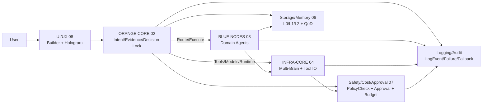
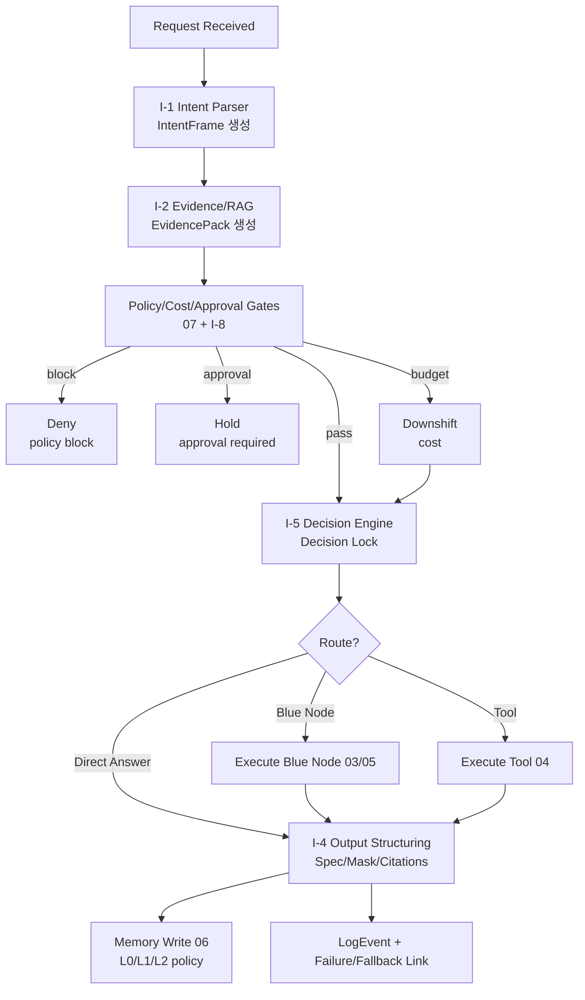
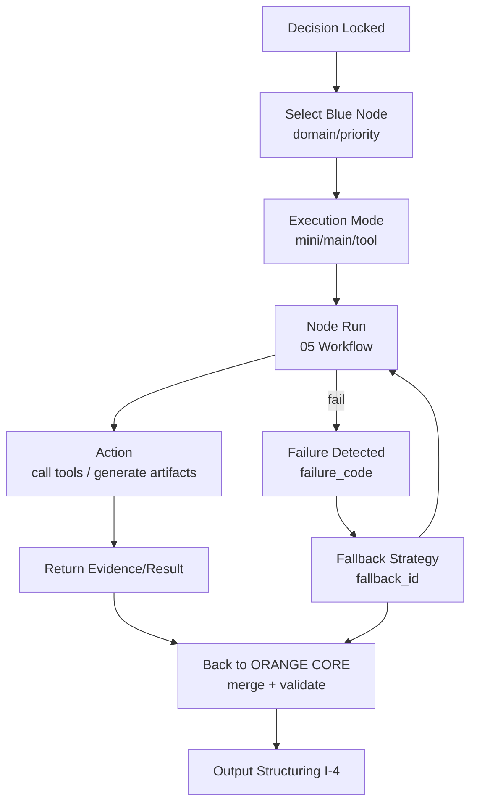

# 01. VAMOS_DESIGN_2.0_OVERVIEW.md

> **프롬프트 2.0 vs 본 문서 차이점**:
> - E-Series/S-Series 상태값은 설계 과정에서 운영 현실을 반영해 조정됨
> - 본 문서(01~08)가 Active Canon이며, 프롬프트 2.0은 "초기 가이드라인"으로 참조만 함

## 확정 TOC
0. 문서 메타 (version/status/owner/scope)
1. 설계 범위와 목표 (Design 2.0에서 "확정"하는 것 / "결정 필요"로 남기는 것)
2. 시스템 상위 구조 요약
   - 2.1 ORANGE CORE ↔ BLUE NODE
   - 2.2 내부(I) / 외부(E) / Self-evo(S) 구분
   - 2.3 전체 파이프라인 (입력→분석→검색→라우팅→모델→Self-check→출력)
3. 버전(V0~V3)에서의 "설계 고정 항목" vs "확장 항목"
4. 전역 공통 규칙(문서/스키마/이벤트/실패/폴백/ID/버전)
5. 전역 레지스트리(통합 인덱스)
   - 5.1 EventType Registry (전역 네임스페이스 규칙 포함)
   - 5.2 FailureCode Registry (전역 분류/심각도)
   - 5.3 Fallback Registry (degrade_level 포함)
   - 5.4 Core Data Schemas Index (문서별 스키마 위치 링크)
6. 문서 간 의존성 맵(01~08 연결도)
7. "결정 필요" 목록(최대 2안씩)
8. [C4] Design 2.0 통합본 요약 + Mermaid 다이어그램 + 구현 준비 (01~08)

> 전체 시스템 다이어그램은 01 OVERVIEW의 [C4] 섹션을 정본으로 한다.
> 본 문서의 다이어그램은 해당 모듈에 특화된 상세도만 포함한다.

## 섹션별 필수 포함 체크리스트
- (0) 메타: 파일명/버전 규칙(major/minor), 변경 승인 규칙 연결(07 참조)
- (2) 상위 구조: ORANGE CORE 정의/원칙, BLUE NODE 정의/제약, OTHER BRAINS(실행자원) 분리 원칙 명시
- (2.3) 파이프라인: Agent 표준 5단계(Perception→Reasoning→Action→Memory→Reflection)와 "3단 출력(답변/근거/Self-check)" 표준을 개요에 고정
- (3) 버전: V0~V3 확장 규칙(Identity/Non-goal/Safety/Cost-limit 불변, Self-evo는 자동 제안만 등) 요약
- (5) 레지스트리: event_type 고유 규칙/실패→fallback/deny 귀결 규칙을 "전역 규칙"으로 박제
- (7) 결정 필요: "근거 없으면 결정 필요 + 최대 2개 옵션" 규칙 준수

## 연결 참조
- ORANGE CORE 정의/내부 모듈: 02의 2~6장 참조(특히 I-1~I-5는 최소 확정 요구)
- BLUE NODE 생성/제약(P0/P1/P2): 03 + 07, PLAN의 P2 승인/비활성 원칙 참조
- Infra(뇌 교체/Adapter/HAL): 04, PLAN 2.8 원칙 참조
- Workflow 표준/루프/재시도: 05, PLAN 7.1/7.5 참조
- Storage/Memory/마스킹: 06 + 07, 데이터 분류/마스킹 규칙 참조
- UI/UX(Builder/Hologram/3패널): 08, PLAN UI 스펙 참조

---

# 0. 문서 메타

## 0.1 문서 정보
| 항목 | 값 |
|------|-----|
| 문서명 | 01. VAMOS_DESIGN_2.0_OVERVIEW.md |
| 버전 | 2.0.0 |
| 상태 | PHASE 0 완료 — PHASE 1 진입 준비 |
| 역할 | Design 2.0의 "상위 개요 + 문서 간 정본 연결" 허브 |
| 최종 수정 | 2026-01-04 |
| PHASE 0 변경 | #1 비용상한, #2 EVX 마이그레이션, #3 A-6/A-7 분리, #10 정본우선순위 |

## 0.2 버전 규칙
- **Major (x.0.0)**: 구조 변경, 정책 변경, 새 계층 추가 — 07 Approval 필요
- **Minor (1.x.0)**: 스키마 필드 추가, 레지스트리 확장 — 문서 리뷰 필요
- **Patch (1.0.x)**: 오타 수정, 표현 명확화 — 즉시 반영 가능

## 0.3 정본 우선순위 (LOCK)
> **원칙**: 절대 규칙(RULE) > 상위 계획(PLAN) > 설계 잠금(DESIGN LOCK) > 설계 본문

1. **RULE 1.3**: 절대 규칙 (Identity, Safety, Policy, 비용 상한, Non-goal)
2. **PLAN 3.0**: 상위 원칙/임계값 (승인 구조, 아키텍처 방향)
3. **DESIGN 2.0 LOCK 블록**: 변경관리/충돌해결 규칙 (§0.5, §0.6)
4. **DESIGN 본문(01~08)**: 모듈별 상세 명세
5. **스키마 문서(D1~D8), TECH_STACK(A1)**: 구현 레벨 명세

> **충돌 시**: 상위 번호가 하위 번호를 override. 예: RULE 1.3 비용 상한 vs DESIGN 본문 수치 → RULE 우선.

## 0.4 변경 승인 규칙
- 본 문서의 구조적 변경은 **07 Approval Gate**를 통해 승인 필요 (RULE 1.3 §9 참조)
- 비용 상한, Non-goal, 정책 영역 변경은 **절대 금지** (RULE 1.3 §2)

## 0.5 Design 2.0 변경관리 규칙 (LOCK)

- 적용 범위: Design 2.x 전 문서(01~08 + D1~D8 스키마 문서 + A1 TECH_STACK)
- 변경 원칙(LOCK):
  1) **삭제 금지**. 모든 변경은 `[DEPRECATE] + (대체 경로/대체 ID)`로만 처리한다.
  2) **없는 내용 창작 금지**. PLAN/RULE/아이디어 문서 밖의 신규 정책/레지스트리 값/임계값을 임의 생성하지 않는다.
  3) **Major 변경(2.0.0 → 3.0.0 등)** 은 07(SAFETY_COST_APPROVAL)의 Approval Gate를 통해 승인 없이는 불가.
  4) 표기 규칙이 바뀌는 경우(네임스페이스/ID 체계)는 반드시 “충돌 해결 규칙(0.6)”과 “마이그레이션 표(0.8)”에 기록한다.

- E-*(외부기능) vs EVX-*(Verify 확장) 충돌 해결(LOCK):
  - **E-*** : 외부기능(External Features) 전용 네임스페이스로 유지.
  - **EVX-*** : Verify 확장(Verify Extensions) 전용 네임스페이스로 고정.
  - **금지 표기(LOCK)**: `E\`-*`, `E/-*`, `E’-*` 등 “E 변형 표기”는 전면 금지.
  - 과거 문서에 존재하는 E 변형 표기는 아래로 일괄 치환한다:
    - `[DEPRECATE] E\`-n  → EVX-n`
    - `[DEPRECATE] E/-n   → EVX-n`

- S-Series(S-1~S-8) 신규 추가에 따른 ID 체계 확정(LOCK):
  - **S-1 ~ S-8** : Self-evo/Verify/QA 계열 “모듈 ID”로 사용한다.
  - **상태(State) 표기와 충돌 방지(LOCK)**:
    - ORANGE CORE 상태는 기존대로 `S0_...` 같은 **언더스코어 기반 상태명**을 사용한다.
    - Self-evo 모듈은 `S-1` 같은 **하이픈 기반 모듈 ID**를 사용한다.
    - 즉, `S-#`(모듈) ↔ `S#_`(상태)로 충돌을 원천 분리한다.

- A-6/Federated 고정 + Remote Executor는 A-7로 이관(LOCK):
  - **A-6 = Federated** 로 고정한다.
  - Remote Executor 관련 정의/설명/구현 단위는 **A-7** 로 이관한다.
  - 기존 문서에 Remote Executor가 A-6로 묶여 있으면 아래로 처리:
    - `[DEPRECATE] A-6(Remote Executor 서술) → A-7(Remote Executor)` + A-6는 Federated만 남긴다.


## 0.6 ID/네이밍 충돌 해결 규칙 (LOCK)

- 충돌 해결 우선순위(LOCK):
  1) RULE 1.3 (절대 규칙)
  2) PLAN 3.0 (상위 원칙/임계값 LOCK)
  3) DESIGN 2.0의 “LOCK 블록”
  4) DESIGN 본문(01~08)
  5) 스키마 문서(D1~D8), TECH_STACK(A1)

- 네임스페이스 충돌 해결(LOCK):
  - Verify 확장 관련 표기는 **EVX-***만 정본으로 인정한다.
  - 외부기능은 **E-***만 사용한다.
  - `E\`/E/` 등 변형 표기는 “정본 아님”으로 간주하고 **반드시 DEPRECATE 처리 후 EVX로 연결**한다.

- S 표기 충돌 해결(LOCK):
  - `S-#`는 모듈 ID(Self-evo Series).
  - `S#_...`는 상태(State machine).
  - 두 표기가 혼재될 때는 하이픈/언더스코어 규칙으로 강제 분리한다.

- 파일명 파싱 규칙(LOCK):
  - 파일명에서 doc_id를 `split('.')`로 추출하는 방식은 금지한다. doc_id는 "01~08" 또는 문서 매핑 테이블(0.7/프롬프트)로만 식별한다.

- A-6/A-7 충돌 해결(LOCK):
  - A-6는 Federated로 고정.
  - Remote Executor는 A-7로만 정의한다.
  - 혼재 시: A-6(Remote Executor 서술)은 DEPRECATE 후 A-7로 이동.


## 0.7 공통 입력 문서 버전 테이블 (Design 2.0 공통)

| 문서 ID | 문서명 | 버전 |
|---------|--------|------|
| RULE 1.3 | VAMOS_RULE_1.3_BASE | v1.3 |
| PLAN 3.0 | VAMOS_PLAN_3.0_최종완성본 | v3.0 |
| 01 | VAMOS_DESIGN_2_0_OVERVIEW | v2.0 |
| 02 | VAMOS_DESIGN_2.0_ORANGE_CORE | v2.0 |
| 03 | VAMOS_DESIGN_2.0_BLUE_NODES | v2.0 |
| 04 | VAMOS_DESIGN_2.0_INFRA_CORE | v2.0 |
| 05 | VAMOS_DESIGN_2.0_AGENT_WORKFLOW | v2.0 |
| 06 | VAMOS_DESIGN_2.0_STORAGE_MEMORY | v2.0 |
| 07 | VAMOS_DESIGN_2.0_SAFETY_COST_APPROVAL | v2.0 |
| 08 | VAMOS_DESIGN_2.0_UI_UX | v2.0 |
| D1~D8 | (Schema Set) | v2.1.0 (또는 실제 스키마 표기 버전) |
| A1 | TECH_STACK | v2.1.0 |
| 아이디어 04 | VAMOS_AI_아이디어_04 | - |
| Vision | VAMOS_AI_아이디어_완성_비전 | - |


## 0.8 Design 1.x → 2.x 마이그레이션 표 (문서/섹션 단위)

| 대상 문서 | 1.x 영향 구간 | 2.0 조치 | 비고 |
|---|---|---|---|
| 01 OVERVIEW | #0 문서 메타 | 0.5~0.8 신규 삽입 | 변경관리/충돌해결/버전테이블/마이그레이션 표 |
| 01 OVERVIEW | 문서 전반(E 변형 표기 존재 시) | `E\`-*`, `E/-*` → `[DEPRECATE]` 후 `EVX-*`로 연결 | “E 변형 표기 금지” |
| 01 OVERVIEW | A-6 표기/설명 | A-6=Federated 고정, Remote Executor는 A-7로 이동 | 혼재 시 DEPRECATE 처리 |
| 02 ORANGE_CORE | Verify/Self-evo 관련 참조부 | EVX/S-Series 표기 정리 | 세부 패치는 PHASE 1에서 진행 |
| 03 BLUE_NODES | Verify 확장/실행 경로 참조 | EVX 표기 정리 | 동일 |
| 04 INFRA_CORE | Remote Executor/분산 실행 관련 | A-7로 이관, A-6는 Federated만 | 동일 |
| 05 AGENT_WORKFLOW | Verify 확장 참조 | EVX/S-Series 표기 정리 | 동일 |
| 06 STORAGE_MEMORY | Verify/검증 저장 참조 | EVX/S-Series 표기 정리 | 동일 |
| 07 SAFETY_COST_APPROVAL | 승인/검증 확장 참조 | EVX/S-Series 표기 정리 + 승인 게이트 연결 유지 | 동일 |
| 08 UI_UX | Verify 확장 UI 표기 | EVX/S-Series 표기 정리 | 동일 |
| D1~D8 스키마 | 레지스트리/ID 링크 참조부 | 문서 링크 표기만 EVX로 정리 (스키마 값 임의 추가 금지) | 동일 |

---

# 1. 설계 범위와 목표

## 1.1 Design 1.0의 목적
Design 1.0은 VAMOS 시스템의 **구현 가능한 최소 명세(Minimum Viable Specification)**를 확정한다.

**목표 (3가지)**:
1. **추적 가능성**: 기능/흐름/데이터/정책이 문서만으로 추적 가능
2. **무충돌**: 문서 간 용어/역할/흐름 충돌 없음
3. **구현 준비**: ORANGE CORE I-1~I-5는 "표준 템플릿 + 레지스트리"까지 확정

## 1.2 Design 1.0에서 "확정"하는 것
| 구분 | 확정 항목 |
|------|----------|
| 구조 | ORANGE CORE / BLUE NODE / INFRA-CORE / STORAGE / SAFETY 계층 분리 |
| 흐름 | 표준 5단계 파이프라인 (Perception→Reasoning→Action→Memory→Reflection = Intake→Plan→Execute→Store→Verify→Deliver, §2.3.3/§8.2.5 참조) |
| 정책 | Policy/Cost/Approval 게이트 우선순위 및 우회 불가 원칙 |
| 데이터 | Decision 객체, IntentFrame, EvidencePack, LogEvent 스키마 |
| 레지스트리 | EventType / FailureCode / Fallback 정본 (02 §6.*) |

## 1.3 Design 1.0에서 "결정 필요"로 남기는 것
| 구분 | DEFER 항목 | 이유 |
|------|-----------|------|
| 스택 | V3 운영형 Observability 세부 스택 | Implementation에서 선택 |
| 고급 기능 | Self-evo 상세 시나리오, GraphRAG 고도화 | Design 1.1로 이관 |
| 확장 모듈 | A~E 신규 모듈 31개 | Design 1.1 Addendum으로 분리 |

## 1.4 설계 원칙 (PLAN 3.0 / RULE 1.3 기반)

### 1.4.1 단일결정 원칙 (Decision Lock)
- **한 시점 · 한 컨텍스트 · 한 결론**을 Decision 객체로 고정
- 이후 재시도/재생성은 Decision을 변경하지 않고 Evidence/Action/Output만 갱신

### 1.4.2 게이트 우회 불가 원칙
- 모든 액션은 **Policy → Approval → Cost → Evidence** 게이트를 반드시 통과
- 게이트 우회 시도는 즉시 **deny + 감사 로그**

### 1.4.3 비용 상한 불변 원칙 (RULE 1.3 §5 정본)
| 티어 | 일일 상한 | 월 상한 | 모델 전략 |
|------|-----------|---------|----------|
| V1 | 1,300원 ($1) | 40,000원 ($30) | Mini 90%+ |
| V2 | 3,100원 ($2.3) | 93,000원 ($70) | Mini 60-70% / Main 30-40% |
| V3 | 8,900원 ($6.7) | 266,000원 ($200) | Main 중심, Flagship 적극 |

> **정본**: RULE 1.3 §5 + 07 SAFETY §4.1. 상한 초과 모델 호출은 승인 없이 자동 차단.

### 1.4.4 감사 가능성 원칙
- 모든 결정/실행/검증 과정은 **LogEvent**로 기록
- (event_type ↔ failure_code ↔ fallback_id) 링크가 로그에 남아야 함

---

# 2. 시스템 상위 구조 요약

## 2.1 ORANGE CORE ↔ BLUE NODE 구조

### 2.1.1 ORANGE CORE 정의 (정본: 02)
- **역할**: 판단자/제어자 (Decider/Controller)
- **책임**:
  - 입력 해석 표준화 (I-1 Intent)
  - 근거 수집 (I-2 RAG/Evidence)
  - 단일결정 생성/잠금 (I-5 Decision Kernel)
  - 정책/비용/승인 게이트 연결 (07 참조)
  - 로그/트레이스/감사 (I-9)
- **비책임**: 도메인 실행 로직의 "내용 생성"은 BLUE NODE가 담당

### 2.1.2 BLUE NODE 정의 (정본: 03)
- **역할**: 도메인별 실행 엔진 (Domain Executor)
- **구성**:
  - P0 (핵심): Dev/System, Research, Productivity
  - P1 (확장): Content, Data & Quant
  - P2 (승인 기반): Trading Strategy 등 (실거래 금지)
- **제약**:
  - ORANGE CORE의 Decision에 종속
  - P2 노드는 **세션별 승인 + 자동 OFF** (RULE 1.3 §3.3)

### 2.1.3 OTHER BRAINS (INFRA-CORE) 정의 (정본: 04)
- **역할**: 실행 자원 계층 (Execution Resource Layer)
- **구성**: 
  - Multi-Brain Adapter (모델 라우팅)
  - Tool Runtime (Web/File/Code/API)
  - Solver (Z3/SymPy/Sandbox)
  - Cache/Store 연결
- **원칙**: CORE는 제어, Brain은 실행 (분리 원칙)

```
┌─────────────────────────────────────────────────────────────┐
│                      USER REQUEST                           │
└─────────────────────────────────────────────────────────────┘
                              │
                              ▼
┌─────────────────────────────────────────────────────────────┐
│              ORANGE CORE (02) — 판단/제어                    │
│   ┌─────────┐ ┌─────────┐ ┌─────────┐ ┌─────────┐          │
│   │ I-1     │ │ I-2     │ │ I-5     │ │ I-6     │          │
│   │ Intent  │→│Evidence │→│Decision │→│Self-chk │          │
│   └─────────┘ └─────────┘ └─────────┘ └─────────┘          │
│        ↓           ↓           ↓           ↓                │
│   ┌─────────────────────────────────────────────┐          │
│   │  Policy/Cost/Approval Gates (07 연동)       │          │
│   └─────────────────────────────────────────────┘          │
└─────────────────────────────────────────────────────────────┘
          │                               │
          ▼                               ▼
┌──────────────────┐           ┌──────────────────┐
│ BLUE NODES (03)  │           │ OTHER BRAINS(04) │
│ P0: Dev/Research │◄─────────►│ Multi-Brain      │
│ P1: Content/Quant│           │ Tool Runtime     │
│ P2: Trading(승인)│           │ Solver/Sandbox   │
└──────────────────┘           └──────────────────┘
          │                               │
          └───────────────┬───────────────┘
                          ▼
┌─────────────────────────────────────────────────────────────┐
│                   STORAGE/MEMORY (06)                        │
│   L0 (Session/7일) → L1 (Project/90일) → L2 (Global/장기)   │
└─────────────────────────────────────────────────────────────┘
```

## 2.2 내부(I) / 외부(E) / Self-evo(S) 구분

### 2.2.1 내부 기능 (I-1 ~ I-25) — 정본: 02
| 범위 | 모듈 | 설명 |
|------|------|------|
| I-1~I-5 | 핵심 흐름 | Intent, RAG, Memory, Output, Decision (완전 확정) |
| I-6~I-10 | 검증/관리 | Self-check, Project, Cost, Log, UI 오케스트레이션 |
| I-11~I-16 | 인프라 연결 | Tool Adapter, Scheduler, Template, QA, Backup, Health |
| I-17~I-24 | 보안/진화 | Self-Defense, Meta-learning, QoD, KnowledgeGraph, Source-evo |

### 2.2.2 외부 기능 (E-1 ~ E-16) — 정본: 03/04
- 사용자 환경(Hologram View)과 상호작용하는 레이어
- 파일/검색/코드실행/이미지생성/일정연동 등

### 2.2.3 자기진화 (S-1 ~ S-8) — 정본: 02 (I-6/I-12/I-18 연동)
- **원칙**: 제안만 가능, 자동 적용 금지
- **불변 영역**: RULE/정체성/비용상한은 수정 불가 (RULE 1.3 §2)

## 2.3 전체 파이프라인 (표준 5단계)

### 2.3.1 Agent 표준 5단계 (정본)
| 단계 | 명칭 | 담당 | 핵심 산출물 |
|------|------|------|------------|
| 1 | Perception | Front Mini + I-1 | IntentFrame |
| 2 | Reasoning | I-2 + I-5 + Gates | EvidencePack + Decision |
| 3 | Action | BLUE NODE + D4 | Artifacts / Results |
| 4 | Memory | I-3 + D6 | L0/L1/L2 저장 |
| 5 | Reflection | I-6 + Verify | Self-check 결과 |

### 2.3.2 표준 3단 출력 (정본)
1. **사용자 응답**: 최종 결과물 (Markdown/표/리포트)
2. **근거/요약**: evidence_summary (소스, QoD, 인용)
3. **로그/리포트**: trace/report (비용, 승인 이벤트, 검증 결과)

### 2.3.3 파이프라인 명칭 매핑표 (정본)
| 02 ORANGE CORE | 05 WORKFLOW | 08 UI/UX | 08 세부 상태 |
|----------------|-------------|----------|-------------|
| Perception | Intake | RECEIVED → INTENT | S0_RECEIVED → S1_INTENT_PARSED |
| Reasoning | Plan | EVIDENCE → DECISION_LOCK | S2_EVIDENCE_READY → S3_DECISION_LOCKED |
| Action | Execute | EXEC | S4_EXECUTING → S5_OUTPUT_READY |
| Memory | Store/Commit (저장) | MEMORY | S7_MEMORY_COMMITTED |
| Reflection | Verify | SELF-CHECK → OUTPUT → DONE | S6_SELF_CHECKED → S8_DONE |

> **표기 규칙**: 상태명은 `S#_...` 형식 사용 (§0.5 LOCK). `S-#`는 모듈 ID 전용.

---

# 3. 버전(V0~V3) 설계 고정 항목 vs 확장 항목

## 3.1 버전 간 불변 항목 (LOCK)
| 항목 | 불변 내용 | 근거 |
|------|----------|------|
| Identity | VAMOS 정체성 | RULE 1.3 §1 |
| Non-goal | 실거래/불법/단정판단 금지 | RULE 1.3 §2 |
| Safety | Policy/Approval 게이트 필수 | RULE 1.3 §9 |
| Cost-limit | V1/V2/V3 비용 상한 | RULE 1.3 §5 |
| Self-evo 제한 | 제안만 가능, 자동 적용 금지 | RULE 1.3 §8 |

> **비용 상한 정본**: RULE 1.3 §5 (40,000/93,000/266,000). PLAN 3.0 §9.3은 "권장 운영 범위"로 참조.

## 3.2 버전별 설계 범위

### V0 — 최소 구현 ("돌아가는 코어")
- ORANGE CORE: I-1~I-5 최소 기능
- Gate: deny + downshift + hold 최소 동작
- Logging: LogEvent 최소 셋 (jsonl 1개)
- Storage: L0만 (session)
- Infra: 단일 모델 또는 2단계 downshift
- UI: CLI 또는 최소 대시보드

### V1 — 초기 제품화 ("운영 가능한 설계")
- Storage: L0(session) + L1(project) + QoD 반영
- Evidence: 다중 소스 + 재검색 폴백
- Blue Nodes: 2~3개 핵심 노드
- Infra: Multi-Brain Adapter (2~3 brain)
- Safety: 승인 워크플로우 표준화
- UI: Builder/Hologram 골격

### V2~V3 — 확장/고도화
- V2: 팀용 서버, Postgres, Qdrant, Docker + L2(long-term, 승인 필요) 제한적 활성
- V3: K8s, 관측 스택, GPU Brain, 고급 메모리 + L3(Procedural) 전면 활성

## 3.3 P1 Technology Combos (V1/V2/V3) — 정본

| 항목 | V1 (로컬/개인) | V2 (단일 서버) | V3 (운영형) |
|------|---------------|---------------|-------------|
| LLM | Ollama + GPT-4o mini | GPT-4o mini + Sonnet | vLLM + 외부 조합 |
| Storage | SQLite + JSONL | Postgres 단일 | Managed Postgres |
| Vector | Chroma 로컬 | Qdrant (셀프/클라우드) | Qdrant Cloud |
| Logging | JSONL + SQLite | Postgres + JSONL 압축 | Loki/ELK + Object |
| Deploy | Windows/WSL 단일 | Docker Compose | K8s |

> **정합 규칙**: 04/06/07의 저장/벡터/로깅 결정은 이 Combo의 V1/V2/V3 범위를 따라야 한다.
> **Combo 표 해석 우선권**: 버전별 기술 조합(LLM/Storage/Vector/Logging/Deploy) 선택에 한해 
> 본 §3.3 표를 정본으로 한다. 단, 이는 §0.3 정본 우선순위(RULE > PLAN > LOCK > 본문)를 
> 대체하지 않으며, 비용 상한/정책/승인 등 상위 규칙은 여전히 RULE 1.3이 우선한다.

---

# 4. 전역 공통 규칙

## 4.1 문서 규칙
- **정의되지 않은 것은 존재하지 않는다** (RULE 1.3 §7.1)
- **추측 금지**: 근거가 없으면 "결정 필요"로 표기하고 옵션 2개까지만 제시
- **복붙 가능한 형태**: 문서 전체 또는 섹션 패치로 출력
- **코드 컨벤션 참조**: 구현 코드는 A1(TECH_STACK) 코딩 스타일 가이드를 따른다
  - Python: PEP 8 준수, 타입 힌트 필수(함수 시그니처 레벨)
  - 모듈/클래스/함수 네이밍: snake_case(모듈/함수), PascalCase(클래스)
  - 최대 줄 길이: 100자
  - 상세 컨벤션은 A1 TECH_STACK §코딩 표준 참조
- **주석/문서화 표준**: 모든 공개 함수·클래스·모듈에 docstring 필수
  - 형식: Google Style Docstring (Args / Returns / Raises 섹션)
  - 인라인 주석: 로직이 자명하지 않은 경우에만 작성
  - 모듈 레벨 docstring: 역할·정본 위치(Design 문서 ID)·스키마 참조 기재
  - 예시: `"""IntentFrame 생성기. 정본: 02 §7.1. REF: D2:IntentFrame"""`

## 4.2 용어 통일 규칙
| 용어 | 정의 | 정본 위치 |
|------|------|----------|
| ORANGE CORE | 중앙 판단/제어 시스템 | 02 |
| BLUE NODE | 도메인별 실행 모듈 | 03 |
| INFRA-CORE | 실행 자원 계층 | 04 |
| Decision | 단일결정 객체 | 02 §3 |
| IntentFrame | 의도 분석 결과 | 02 §7.1 |
| EvidencePack | 근거 수집 결과 | 02 §7.2 |
| LogEvent | 이벤트 기록 단위 | 02 §6.1 |
| PolicyCheck | 정책 검사 결과 | 07 §6.4 |
| CostBudget | 비용 예산 객체 | 07 §6.3 |
| Approval | 승인 요청/응답 객체 | 07 §6.2 |
| HyperCLOVA X | NAVER 한국어 특화 대형언어모델 (한국어 LLM 비교 후보군) | A1 TECH_STACK |
| EXAONE | LG AI Research 한국어 특화 LLM (한국어 LLM 비교 후보군) | A1 TECH_STACK |
| SOLAR | Upstage 한국어 특화 LLM (한국어 LLM 비교 후보군) | A1 TECH_STACK |
| QoD | Quality of Data — 근거/데이터 품질 점수 (0~1) | 06 §* |
| degrade_level | Fallback 적용 시 서비스 저하 수준 (V0~V3) | 01 §5.3 |
| activation_default | 버전별 모듈 기본 활성화 상태 (V1:ON/OFF/COND 등) | 01 §5.5.1 |

## 4.3 이벤트/실패/폴백 규칙

### 4.3.1 네이밍 규칙
| 유형 | 형식 | 예시 |
|------|------|------|
| event_type | lower.dot.case | oc.i1.intent.parsed |
| failure_code | UPPER_SNAKE | OC_I1_PARSE_FAIL |
| fallback_id | FB_UPPER_SNAKE | FB_ASK_CLARIFICATION |

### 4.3.2 귀결 규칙
- **모든 실패는 반드시 fallback 또는 deny로 귀결**
- 미연결 failure_code는 감사 경고 대상

## 4.4 ID 규칙
| ID 유형 | 형식 | 예시 |
|--------|------|------|
| trace_id | UUID v4 | 550e8400-e29b-41d4-a716-446655440000 |
| decision_id | dec_{uuid} | dec_550e8400... |
| approval_id | apv_{uuid} | apv_550e8400... |
| node_id | {domain}_{name} | dev_coder_v1 |

## 4.5 상태 네이밍 규칙
| 레이어 | 접두사 | 예시 |
|--------|--------|------|
| ORANGE CORE | S*_ | S0_RECEIVED, S3_DECISION_LOCKED |
| UI/UX | UI_S*_ | UI_S0_BOOT, UI_S5_AWAIT_APPROVAL |
| BLUE NODE | BN_S*_ | BN_S0_IDLE, BN_S2_EXECUTING |
| INFRA | INF_S*_ | INF_S0_READY, INF_S1_ROUTING |

---

# 5. 전역 레지스트리 (통합 인덱스)

> **정본 위치**: event_type/failure_code/fallback_id의 값 목록(엔트리)은 02(§6.*)가 정본이다.  
> 스키마 전문은 02(§6.*) / 07(§6.*) / 06(§*)를 따른다.  
> 01은 전역 네이밍/필수 필드 요약만 제공하며, 값 목록·스키마의 중복 정의는 금지한다.

## 5.1 EventType Registry (전역 네임스페이스 규칙)

### 5.1.1 네임스페이스 구조
| 접두사 | 계층 | 예시 |
|--------|------|------|
| oc.* | ORANGE CORE | oc.i1.intent.parsed |
| bn.* | BLUE NODE | bn.dev.task.started |
| inf.* | INFRA-CORE | inf.model.routed |
| st.* | STORAGE | st.memory.committed |
| sf.* | SAFETY | sf.policy.checked |
| ui.* | UI/UX | ui.approval.requested |
| wf.* | WORKFLOW | wf.stage.enter |

### 5.1.2 필수 필드 (스키마)
```yaml
event_type: string (unique)
producer: string (I-모듈명/컴포넌트)
when: string (발생 조건)
payload: object (핵심 필드)
severity: info | warn | error | critical
sinks: list[string] (file/db/console/audit)
links:
  failure_code: list[string]
  fallback_id: list[string]
  policy_check: list[string]
```

## 5.2 FailureCode Registry (전역 분류/심각도)

### 5.2.1 분류 체계
| 접두사 | 영역 | 예시 |
|--------|------|------|
| OC_I*_ | ORANGE CORE I-모듈 | OC_I1_PARSE_FAIL |
| BN_* | BLUE NODE | BN_TIMEOUT |
| INF_* | INFRA | INF_MODEL_UNAVAILABLE |
| GT_ERR_* | Gate 오류 | GT_ERR_COST_LIMIT |
| POLICY_* | 정책 위반 | POLICY_DENY |
| NONGOAL_* | Non-goal 위반 | NONGOAL_TRADING_DENIED |

### 5.2.2 필수 필드 (스키마)
```yaml
failure_code: string (unique)
origin: string (I-모듈)
trigger: string (예외/검증실패/정책위반/타임아웃)
detection: string (감지 방법)
user_impact: string (사용자 영향)
default_action: deny | retry | fallback
fallback_id: string (연결)
log_event_type: string (연결)
```

## 5.3 Fallback Registry (degrade_level 포함)

### 5.3.1 필수 필드 (스키마)
```yaml
fallback_id: string (unique)
goal: string (안전/비용/정확도/속도)
preconditions: list[string]
steps: list[string] (1~N)
degrade_level: V0 | V1 | V2 | V3
stop_condition: string
log_event_type: string (연결)
```

### 5.3.2 주요 Fallback 전략 (요약)
| fallback_id | 목표 | 트리거 |
|------------|------|--------|
| FB_ASK_CLARIFICATION | 정확도 | 의도 모호 |
| FB_RAG_RETRY_EXPAND | 정확도 | 근거 부족 |
| FB_COST_DOWNSHIFT | 비용 | 예산 초과 위험 |
| FB_REQUIRE_APPROVAL | 안전 | 승인 필요 |
| FB_POLICY_MASK | 안전 | 민감정보 탐지 |
| FB_DENY_WITH_REASON | 안전 | 정책 차단 |

## 5.4 Core Data Schemas Index (문서별 스키마 위치 링크)

| 스키마 | 정본 위치 | 설명 |
|--------|----------|------|
| IntentFrame | 02 §7.1 | 의도 분석 결과 |
| EvidencePack | 02 §7.2 | 근거 수집 결과 |
| Decision | 02 §3.2 | 단일결정 객체 |
| StructuredOutput | 02 §7.4 | 구조화된 출력 |
| MemoryRecord | 06 §* | L0/L1/L2 저장 객체 |
| ApprovalSchema | 07 §6.2 | 승인 요청/응답 |
| CostBudgetSchema | 07 §6.3 | 비용 예산 |
| PolicyCheckSchema | 07 §6.4 | 정책 검사 결과 |
| LogEvent | 02 §6.1 | 이벤트 기록 |

## 5.5 (LOCK) Design 2.0 모듈 카탈로그(정본)
- 정본 범위: module_id / module_name / status / activation_default / owner_schema_doc / ui_exposed / ui_surface / ui_view_mode / notes
- 목적: “각 모듈이 어느 문서(02~08)에 계약/책임이 매핑되는지”의 단일 기준(SOT)

> 목적: 전체 모듈(E-*/A-*/B-*/C-*/D-*/EVX-*/S-*/I-*)을 “단일 표준 필드”로 재정리하여, 문서 간 REF/네이밍 충돌을 제거한다.

- 주의(LOCK): 본 카탈로그의 status(CORE/COND/EXP/RE-ADD)는 "설계/모듈 분류 상태"이며, 런타임 Verify/Approval/Downshift 상태는 07(Safety/Cost/Approval) 및 EVX 체계로만 표현한다.

### 5.5.1 카탈로그 표준 필드(LOCK)
- module_id: 예) I-6, E-14, EVX-2
- module_name: 모듈 한 줄 이름(정본 명칭)
- status: {CORE | COND | EXP | RE-ADD}
  - CORE: 기본 코어
  - COND: 기본 OFF 또는 조건부 ON(승인/정책/비용 게이트 등 조건 필요)
  - EXP: 실험/고비용(기본 V3에서만 ON)
  - RE-ADD: 재도입 대기(현재는 비활성/조건부)
- change_lock: {true|false}
  - true: 변경관리 잠금(정책/스키마/정본 필드 변경은 07 Approval 필요)
  - false: 일반 변경 가능(단, DESIGN LOCK 규칙 준수)
- activation_default 표기(LOCK):
  - 기본형: "V1:ON / V2:ON / V3:ON" (단일 문자열)
  - 예외 허용: 표의 가독성을 위해 V1/V2/V3 컬럼을 분리해도 된다.
    (단, 의미는 activation_default와 동일하게 해석한다)
- owner_schema_doc: {D2~D8} 단일 정본 소유 문서(중복 금지)
- ui_exposed: {true|false} UI에 노출되는지
- ui_surface: {builder|hologram|both|internal}
- ui_view_mode: {tree|list|graph|panel|modal|none} (복수 가능 시 “/”)
- notes: 연결 문서/이관/주의사항
- ui_surface: builder는 엔지니어/관리자용(Builder View), hologram은 일반 사용자용(Hologram View) 기준.
- ui_view_mode: panel=고정 패널, modal=승인/설정/경고 팝업, tree/list/graph는 탐색/요약 뷰에 사용.
- "LOCK"은 status 값으로 쓰지 않는다. 잠금은 change_lock=true로만 표현한다.

### 5.5.2 문서/스키마 ID 네임스페이스 분리(LOCK)
- Design 문서 표의 owner_schema_doc는 "01~08(Design 문서 ID)"만 사용한다.
- 스키마 원본 소유 문서(D1~D8)를 표기해야 할 경우, 컬럼명을 owner_schema_doc 로 분리한다.

- Design 문서 ID는 "01~08"만 사용한다.
  - 01 = OVERVIEW
  - 02 = ORANGE_CORE
  - 03 = BLUE_NODES
  - 04 = INFRA_CORE
  - 05 = AGENT_WORKFLOW
  - 06 = STORAGE_MEMORY
  - 07 = SAFETY_COST_APPROVAL
  - 08 = UI_UX

- Schema 문서 ID는 "D1~D8"만 사용한다. (REF 전용)
  - 모든 [REF:D#:*] 표기는 스키마 정본 참조에만 사용한다.
  - Design 문서 owner_schema_doc에는 D#를 절대 쓰지 않는다.

- D1 = 01 OVERVIEW
- D2 = 02 ORANGE_CORE
- D3 = 03 BLUE_NODES
- D4 = 04 INFRA_CORE
- D5 = 05 AGENT_WORKFLOW
- D6 = 06 STORAGE_MEMORY
- D7 = 07 SAFETY_COST_APPROVAL
- D8 = 08 UI_UX

## 5.6 (LOCK) I-Series 정본 인덱스 (I-1 ~ I-25)
> owner_schema_doc: D2 고정

| module_id | module_name | status | change_lock | activation_default | owner_schema_doc | ui_exposed | ui_surface | ui_view_mode | notes |
|---|---|---|---|---|---|---|---|---|---|
| I-1 | Intent Detector (의도 분석) | CORE | false | V1:ON / V2:ON / V3:ON | D2 | true | builder | panel | 2.2.1 / 단일결정의 입력 |
| I-2 | Context Builder (컨텍스트 구성) | CORE | false | V1:ON / V2:ON / V3:ON | D2 | true | builder | panel | 2.2.1 / 메모리·툴 호출 컨텍스트 |
| I-3 | Memory System (메모리 시스템(4계층(L0~L3))) | CORE | false | V1:ON / V2:ON / V3:ON | D2 | true | builder | panel | 2.2.1 / 06 저장과 연동 |
| I-4 | Multimodal Interpreter (텍스트/이미지/음성 해석) | CORE | false | V1:ON / V2:ON / V3:ON | D2 | true | builder | panel | 2.2.1 / 멀티모달 입력 처리 |
| I-5 | Condition & Decision Engine (단일결정) | CORE | true | V1:ON / V2:ON / V3:ON | D2 | true | builder | panel | 5.0 / 5대 스코어 기반 |
| I-6 | Self-check Engine (자기검증 엔진) | CORE | false | V1:ON / V2:ON / V3:ON | D2 | true | builder | panel | 2.2.1 / S-Series와 연동 |
| I-7 | Project/Session Manager (세션·프로젝트 매니저) | COND | false | V1:OFF / V2:COND / V3:ON | D2 | true | builder | panel | 2.2.1 / 장기 프로젝트/승인 흐름 |
| I-8 | Policy Engine (정책 엔진) | CORE | true | V1:ON / V2:ON / V3:ON | D2 | true | builder | panel | 2.2.1 / 07과 정합 |
| I-9 | Cost Manager (비용 관리자) | CORE | true | V1:ON / V2:ON / V3:ON | D2 | true | builder | panel | 2.2.1 / 07과 정합 |
| I-10 | Tool Registry/Router (툴 레지스트리/라우터) | CORE | false | V1:ON / V2:ON / V3:ON | D2 | true | builder | panel | 2.2.1 / E-Series와 경계 |
| I-11 | Output Composer (출력 생성기) | CORE | false | V1:ON / V2:ON / V3:ON | D2 | true | hologram | panel | 2.2.1 / 08 UI와 연결 |
| I-12 | Workflow Builder (워크플로우 빌더) | COND | false | V1:OFF / V2:COND / V3:ON | D2 | true | builder | panel | 2.2.1 / 템플릿·승인 흐름 |
| I-13 | Multimodal Output Renderer (멀티모달 출력 렌더러) | CORE | false | V1:ON / V2:ON / V3:ON | D2 | true | builder | panel | 2.2.1 / UI 렌더링 계층 |
| I-14 | Summarizer & Memory Distiller (요약·증류기) | CORE | false | V1:ON / V2:ON / V3:ON | D2 | true | builder | panel | 2.2.1 / L2 축약·정리 |
| I-15 | Evidence & QoD Manager (근거·QoD 관리자) | CORE | false | V1:ON / V2:ON / V3:ON | D2 | true | builder | panel | 2.2.1 / EVX/C와 연결 |
| I-16 | Knowledge Search Engine (지식 검색 엔진) | CORE | false | V1:ON / V2:ON / V3:ON | D2 | true | builder | panel | 2.2.1 / 검색-검증 분리 |
| I-17 | Blue Node Manager (블루 노드 매니저) | CORE | false | V1:ON / V2:ON / V3:ON | D2 | true | builder | tree/graph | 2.2.1 / 03과 연결 |
| I-18 | Self-evo Engine (자기진화 엔진) | EXP | false | V1:OFF / V2:OFF / V3:ON | D2 | true | builder | panel | 2.2.1 / S-Series 중심 |
| I-19 | Approval Manager (승인 관리자) | CORE | true | V1:ON / V2:ON / V3:ON | D2 | true | builder | modal/panel | 2.2.1 / 07과 정합 |
| I-20 | Failure/Fallback Manager (실패·폴백 관리자) | CORE | false | V1:ON / V2:ON / V3:ON | D2 | true | builder | panel | 2.2.1 / 실패코드 체계 |
| I-21 | Source Evolution (지식 소스 진화) | EXP | false | V1:OFF / V2:OFF / V3:ON | D2 | true | builder | panel | 자기 지식 확장/소스 진화. BASE-1.3 §7.5 가드레일 준수. PLAN-3.0 §13.1.21 |
| I-22 | Task/Project Manager (태스크/프로젝트 관리자) | COND | false | V1:OFF / V2:COND / V3:ON | D2 | true | builder | panel | 프로젝트 관리, 태스크 추적, DAG 구성. PLAN-3.0 §13.1.22 |
| I-23 | Doc/Code Structuring (문서/코드 구조화) | COND | false | V1:OFF / V2:COND / V3:ON | D2 | true | builder | panel | 문서 구조화, 코드 정리 자동화. PLAN-3.0 §13.1.23 |
| I-24 | Knowledge Graph Engine (지식 그래프 엔진) | EXP | false | V1:OFF / V2:OFF / V3:ON | D2 | true | builder | graph | 2.2.1 / GraphRAG와 연동 |
| I-25 | SDAR Engine (Self-Directed Adaptive Reasoning) | COND | false | V1:OFF / V2:COND / V3:ON | D2 | true | builder | panel | SDAR 자율추론 엔진, VAMOS_SDAR_DESIGN_SPECIFICATION 참조 |

## 5.7 (LOCK) S-Series UI 노출 정책 (S-1 ~ S-8)
> 주의: S-Series는 “모듈 ID(S-#)”이고, 상태명은 “S#_XXXX” 형태를 사용한다.

| module_id | module_name | status | change_lock | activation_default | owner_schema_doc | i_module_link | ui_exposed | ui_surface | ui_view_mode | notes |
|---|---|---|---:|---|---|---|---|---|---|---|
| S-1 | Self-check Engine | CORE | false | V1:ON / V2:ON / V3:ON | D2 | I-6, I-15 | true | builder | panel | 일반 태스크에서도 최소 검증 수행(항상 ON) |
| S-2 | Benchmark QA Suite | EXP | false | V1:OFF / V2:OFF / V3:ON | D2 | I-24 | true | builder | panel | 통합 테스트/회귀 방지 |
| S-3 | Template Evolution | EXP | false | V1:OFF / V2:OFF / V3:ON | D2 | I-12, I-18 | true | builder | panel | 템플릿 자동 개선 |
| S-4 | Error Pattern Miner | EXP | false | V1:OFF / V2:OFF / V3:ON | D2 | I-20, I-18 | true | builder | panel | 실패코드/폴백 최적화 |
| S-5 | Router Evolution | EXP | false | V1:OFF / V2:OFF / V3:ON | D2 | I-10, I-18 | true | builder | panel | 라우팅/모델선택 개선 |
| S-6 | Search Evolution | EXP | false | V1:OFF / V2:OFF / V3:ON | D2 | I-16, I-18 | true | builder | panel | 검색전략/소스 개선 |
| S-7 | User-Coop Designer | EXP | false | V1:OFF / V2:OFF / V3:ON | D2 | I-19, I-18 | true | builder | panel | 사용자 협업형 self-evo |
| S-8 | Self-evo Governance | COND | true | V1:OFF / V2:OFF / V3:ON | D2 | I-19, I-8, I-9, I-24 | true | builder | modal | 승인/거버넌스는 팝업(Modal)로만 노출 |

## 5.8 (LOCK) E-Series 상태/배지 규칙 (CORE / COND / EXP / RE-ADD)
> E-Series는 “외부 기능(도구/커넥터/입출력/자동화)” 묶음이다.

### 5.8.1 E-Series 표기 규칙(LOCK)
- V1/V2/V3 값: {ON | OFF | COND}
  - COND: 승인/정책/비용 또는 세션 단위 조건을 만족하면 ON 가능

| module_id | module_name | status | change_lock | V1 | V2 | V3 | owner_schema_doc | ui_exposed | ui_surface | ui_view_mode | notes |
|---|---|---|---:|---|---|---|---|---:|---|---|---|
| E-1 | Coding & System Design Helper | CORE | false | ON | ON | ON | D4 | true | both | panel | 범용 외부기능(개발/설계 지원). EVX-1(Code-as-Policy)와 구분 |
| E-2 | Web Search | CORE | false | ON | ON | ON | D4 | true | both | panel |  |
| E-3 | Document Parser | CORE | false | ON | ON | ON | D4 | true | both | panel |  |
| E-4 | Code Executor | CORE | false | ON | ON | ON | D4 | true | both | panel |  |
| E-5 | Image Analyzer | CORE | false | ON | ON | ON | D4 | true | both | panel |  |
| E-6 | Z3 Solver | CORE | false | ON | ON | ON | D4 | true | builder | panel |  |
| E-7 | Speech-to-Text | EXP | false | OFF | OFF | ON | D4 | true | hologram | panel |  |
| E-8 | Text-to-Speech | EXP | false | OFF | OFF | ON | D4 | true | hologram | panel |  |
| E-9 | Video Analyzer | EXP | false | OFF | OFF | ON | D4 | true | hologram | panel |  |
| E-10 | External API Gateway | EXP | false | OFF | OFF | ON | D4 | true | builder | panel |  |
| E-11 | Browser Automation | EXP | false | OFF | OFF | ON | D4 | true | builder | panel |  |
| E-12 | DB Connector | EXP | false | OFF | OFF | ON | D4 | true | builder | panel |  |
| E-13 | Calendar/Task Sync | RE-ADD | false | OFF | COND | ON | D4 | true | both | panel |  |
| E-14 | Email Handler | RE-ADD | false | OFF | COND | ON | D4 | true | both | panel |  |
| E-15 | File System Access / Cloud Library Collector 겸용 | RE-ADD | false | OFF | COND | ON | D4 | true | builder | panel | Cloud Library Spec에서 E-15는 Cloud Collector(외부 데이터 수집) 역할로 확장 사용. 파일 시스템 접근 + 외부 소스 수집을 겸한다. |
| E-16 | Cloud Storage Sync | RE-ADD | false | OFF | COND | ON | D4 | true | builder | panel |  |

### 5.8.2 E-Series Status Badge Rules (LOCK)
- 목적: E-Series의 status(CORE/COND/EXP/RE-ADD)를 UI에서 일관된 배지/동작 규칙으로 표현한다.
- 잠금(LOCK)은 status 값이 아니라 change_lock=true로만 표현한다.

| status | badge_label | icon | behavior_rule |
|---|---|---|---|
| CORE | (none) | 🧩 | 기본 활성(가능), 별도 경고/제한 없음 |
| COND | COND | 🔒 | 승인/조건 만족 전까지 비활성(Disabled) 표시 + 접근 시 승인 흐름 유도 |
| EXP | LAB | 🧪 | 실험 기능 경고 툴팁(“불안정/고비용 가능”) 표시 |
| RE-ADD | NEW | ✨ | 재도입 기능 강조(최초 1회 하이라이트) |

### 5.9 A-Series (A-1 ~ A-7) — Multi-Brain/Infra 확장 (정본)
| module_id | module_name | status | change_lock | activation_default | owner_schema_doc | ui_exposed | ui_surface | ui_view_mode | notes |
|---|---|---|---|---|---|---|---|---|---|
| A-1 | MultiBrain Adapter | CORE | false | V1:ON / V2:ON / V3:ON | D4 | false | internal | none | 04, 02(I-5) |
| A-2 | Preset Modularization | CORE | false | V1:ON / V2:ON / V3:ON | D5 | true | builder | panel | 03/05, I-13 |
| A-3 | Meta AI | EXP | false | V1:OFF / V2:OFF / V3:ON | D4 | false | internal | none | 03, 02 |
| A-4 | Debate Mode | COND | false | V1:OFF / V2:COND / V3:ON | D5 | true | builder | panel/modal | 05, 08 |
| A-5 | Lazy Generation | EXP | false | V1:OFF / V2:OFF / V3:ON | D4 | false | internal | none | I-11, 07 |
| A-6 | Federated Module Network | EXP | false | V1:OFF / V2:OFF / V3:ON | D4 | false | internal | none | 04 |
| A-7 | Remote Executor | EXP | false | V1:OFF / V2:OFF / V3:ON | D4 | false | internal | none | 04, 07 |

### 5.10 B-Series (B-1 ~ B-6) — Memory/Skill/Self-evo 자산 (정본)

> **[OV-02 구분 주석]** B-Series(B-1~B-6)는 "Memory/Skill/Self-evo **자산 모듈**"의 ID이다. 메모리 **유형**(Episodic/Semantic/Procedural/Working)과는 별개의 네임스페이스이며, 메모리 유형은 06(Storage/Memory) 문서의 L0~L3 계층으로 정의된다. B-ID가 메모리유형과 혼동되지 않도록 주의할 것.

| module_id | module_name | status | change_lock | activation_default | owner_schema_doc | ui_exposed | ui_surface | ui_view_mode | notes |
|---|---|---|---:|---|---|---:|---|---|---|
| B-1 | Skill Library (스킬 라이브러리) | EXP | false | V1:OFF / V2:OFF / V3:ON | D6 | true | builder | panel | L3 또는 L2.procedural 의존 |
| B-2 | Procedural Memory (방법론 메모리) | EXP | false | V1:OFF / V2:OFF / V3:ON | D6 | true | builder | panel | L3 또는 L2.procedural 의존 |
| B-3 | Memory Decay (망각/감쇠) | CORE | false | V1:ON / V2:ON / V3:ON | D6 | true | builder | panel | 06 |
| B-4 | Auto Curriculum Generator | EXP | false | V1:OFF / V2:OFF / V3:ON | D5 | true | builder | panel | S-7, 06 |
| B-5 | RL-like self trainer | EXP | false | V1:OFF / V2:OFF / V3:ON | D5 | true | builder | panel | 05, 07 |
| B-6 | DSPy Prompt Optimizer | EXP | false | V1:OFF / V2:OFF / V3:ON | D5 | true | builder | panel | I-13, 05 |

### 5.11 C-Series (C-1 ~ C-7) — Verifier/Reasoning 확장 (정본)
| module_id | module_name | status | change_lock | activation_default | owner_schema_doc | ui_exposed | ui_surface | ui_view_mode | notes |
|---|---|---|---:|---|---|---:|---|---|---|
| C-1 | Logic Verifier | CORE | false | V1:ON / V2:ON / V3:ON | D4 | true | builder | panel | 02(I-20), 07 |
| C-2 | Math Verifier | CORE | false | V1:ON / V2:ON / V3:ON | D4 | true | builder | panel | 02(I-20), 07 |
| C-3 | Code Verifier | CORE | false | V1:ON / V2:ON / V3:ON | D4 | true | builder | panel | 04, 07 |
| C-4 | Domain Simulator | EXP | false | V1:OFF / V2:OFF / V3:ON | D4 | false | internal | none | V3, 04 |
| C-5 | Bayesian Belief Engine | EXP | false | V1:OFF / V2:OFF / V3:ON | D2 | true | builder | panel | 02(I-5) |
| C-6 | RL Advisor | EXP | false | V1:OFF / V2:OFF / V3:ON | D2 | true | builder | panel | V3 |
| C-7 | GNN Score Model | EXP | false | V1:OFF / V2:OFF / V3:ON | D4 | true | builder | panel | 06, 02 |

### 5.12 D-Series (D-1 ~ D-6) — Brain/Planner/RAG 확장 (정본)
| module_id | module_name | status | change_lock | activation_default | owner_schema_doc | ui_exposed | ui_surface | ui_view_mode | notes |
|---|---|---|---:|---|---|---:|---|---|---|
| D-1 | Think Engine | CORE | false | V1:ON / V2:ON / V3:ON | D2 | false | internal | none | 02 |
| D-2 | Multimodal Engine | CORE | false | V1:ON / V2:ON / V3:ON | D2 | false | internal | none | 02 |
| D-3 | Long Horizon Planner | EXP | false | V1:OFF / V2:OFF / V3:ON | D2 | false | internal | none | V3, 02 |
| D-4 | Personality/Tone Engine | EXP | false | V1:OFF / V2:OFF / V3:ON | D5 | false | internal | none | V3, 08 |
| D-5 | General Brain (Parallel) | EXP | false | V1:OFF / V2:OFF / V3:ON | D2 | false | internal | none | A-1, A-3 |
| D-6 | GraphRAG / Hybrid RAG | EXP | false | V1:OFF / V2:OFF / V3:ON | D6 | false | internal | none | 06, 02(I-2) |

### 5.13 EVX-Series (EVX-1 ~ EVX-6) — Verify 확장군 (정본)
| module_id | module_name | status | change_lock | activation_default | owner_schema_doc | ui_exposed | ui_surface | ui_view_mode | notes |
|---|---|---|---:|---|---|---:|---|---|---|
| EVX-1 | Code-as-Policy | RE-ADD | false | V1:OFF / V2:OFF / V3:ON | D2 | true | builder | panel | Verify 확장군(2.0 재도입) |
| EVX-2 | Adversarial Verifier | RE-ADD | true | V1:OFF / V2:OFF / V3:ON | D2 | true | both | panel | 07 연동(Policy/Approval) |
| EVX-3 | Log-prob Confidence | RE-ADD | false | V1:OFF / V2:OFF / V3:ON | D2 | true | builder | panel | V3 전용 검증 신뢰도 |
| EVX-4 | Thought Buffer | RE-ADD | false | V1:OFF / V2:OFF / V3:ON | D2 | true | both | panel | 08(UI) 표면 정의 필요 |
| EVX-5 | Gen-Verify-Learn | RE-ADD | false | V1:OFF / V2:OFF / V3:ON | D2 | true | builder | panel | 05(워크플로우) 연동 |
| EVX-6 | Z3 Solver Routing | RE-ADD | false | V1:OFF / V2:OFF / V3:ON | D4 | true | builder | panel | 04(Infra) 라우팅/솔버 |

### 5.14 2.0 공통 규칙 1페이지 박제(LOCK)
#### 5.14.1 정본 우선순위(LOCK)
- RULE 1.3 > PLAN 3.0 > DESIGN 2.0(LOCK 블록) > DESIGN 2.0 본문 > 스키마/TECH_STACK

#### 5.14.2 모듈 ID / 상태(State) 충돌 방지(LOCK)
- 모듈 ID:
  - I-# / S-# / E-# / A-# / B-# / C-# / D-# / EVX-# 만 사용
  - Verify 확장군은 EVX-* 사용(백틱/변형 표기 금지)
- 상태(State):
  - 상태명은 반드시 `S#_XXXX` 포맷 사용(예: S0_RECEIVED)
  - `S-#` 는 “모듈 ID”로만 사용

#### 5.14.3 비용 상한(LOCK)
- 월 상한 정본은 RULE 1.3 및 07 문서 수치를 따른다(V1/V2/V3)

#### 5.14.4 COND 도메인(LOCK)
- COND(status) 모듈/기능은 기본 OFF 또는 COND이며,
  - 승인(Approval) + 정책(Policy) + 비용(Cost) 게이트 통과 시 “세션 단위 ON”만 허용

#### 5.14.5 owner_schema_doc 단일화(LOCK)
- 모든 모듈은 owner_schema_doc(D2~D8) 단일값을 반드시 가진다(중복 소유 금지)
- 다른 문서에서 언급/연결은 notes로만 남긴다

#### 5.14.6 UI 필드 의무화(LOCK)
- ui_exposed/ui_surface/ui_view_mode는 카탈로그 모든 행에 반드시 채운다
- UI 최종 배치는 D8(08 UI_UX)에서 조정하되, 01 카탈로그의 값이 “기본 정본”이다

#### 5.14.7 계약/책임(Contract/Owner) 판정(LOCK)
- “계약/책임”은 해당 module_id가 명시적으로 등장하며, 입력/출력, 상태전이, Event/Failure/Fallback, Policy/Cost/Approval, UI 노출 중 최소 1개를 구체적으로 정의한 문장이 존재하는 것을 의미한다.

#### 5.14.8 UI 노출 판정(LOCK)
- ui_exposed=true 인 모듈은 D8(08 UI_UX)에서 builder/hologram 및 view_mode(panel/modal/tree/graph 등)가 구체적으로 언급되지 않으면 “UI 정의 누락”으로 본다.

#### 5.14.9 07 연결 모듈 판정(LOCK)
- 01 카탈로그의 notes에 “07”, “Policy”, “Cost”, “Approval” 또는 07의 Event/Failure/Fallback alias가 참조되면 “07와 연결되는 모듈”로 간주한다.

---

### 5.15 [UI 2.0 연결 — CANONICAL] Verification Badge & Uncertainty Alert (LOCK)
- 본 레지스트리는 08(UI/UX) 문서 생성 시 필수 포함 정본이다.
- 표시 위치(권장): Evidence Card 헤더 또는 Output 블록 우측 상단(배지), 메시지 중간 Inline Banner(경고)

#### 5.15.1 Verification Badge (LOCK)
| badge_id | condition | label | meaning |
|---|---|---|---|
| VERIFIED | qod_score >= 0.8 | ✅ VERIFIED | 교차 검증/근거 충분(신뢰 높음) |
| PARTIAL | 0.5 <= qod_score < 0.8 | ⚠️ PARTIAL | 일부 검증/근거 제한(주의) |
| UNVERIFIED | qod_score < 0.5 | 🚫 UNVERIFIED | 근거 부족/환각 가능(경고) |

#### 5.15.2 Uncertainty Alert Triggers (LOCK)
| trigger_id | condition | message |
|---|---|---|
| LOW_QOD | qod_score < 0.5 | 이 답변은 근거가 부족하거나 신뢰도가 낮습니다. 반드시 원문을 확인하세요. |
| CONFLICTING_SOURCES | conflict_detected == true | 참조한 문서 간에 내용 충돌이 감지되었습니다. 상반된 정보를 확인하세요. |
| STALE_DATA | freshness < 0.3 | 이 정보는 오래된 데이터(기준일 이전)를 바탕으로 생성되었습니다. |
| POLICY_MASKED | masked_count > 0 | 민감 정보 보호를 위해 일부 내용이 마스킹 처리되었습니다. |

## 5.16 (LOCK) 08(UI/UX) 반영 규칙
- 08 문서는 “표현/레이아웃/컴포넌트 배치”를 정의한다.
- ui_exposed/ui_surface/ui_view_mode 및 Badge/Alert 트리거 “값 목록 정본”은 01 §5.5~§5.15를 따른다.

---

# 6. 문서 간 의존성 맵 (01~08 연결도)

## 6.1 문서 역할 요약
| 문서 | 역할 | 핵심 정본 |
|------|------|----------|
| 01 OVERVIEW | 통합 개요/연결 허브 | 버전 Combo, 다이어그램 |
| 02 ORANGE CORE | 중앙 판단/제어 명세 | I-1~I-24, Decision, 레지스트리 |
| 03 BLUE NODES | 도메인 실행 모듈 | P0/P1/P2 노드, 라이프사이클 |
| 04 INFRA-CORE | 실행 자원 계층 | Multi-Brain, Tool, Solver |
| 05 AGENT WORKFLOW | 파이프라인/루프 | 5단계, Retry, Fallback 동작 |
| 06 STORAGE/MEMORY | 저장 계층 | L0/L1/L2, QoD, Decay |
| 07 SAFETY/COST/APPROVAL | 정책/게이트 | PolicyCheck, CostBudget, Approval |
| 08 UI/UX | 화면/상호작용 | Builder, Hologram, 상태머신 |

## 6.2 핵심 의존성 (항상 같이 움직이는 것)
```
02 (Decision/I-5) ←→ 07 (Policy/Cost/Approval) ←→ 05 (Workflow)
        ↓                       ↓
       03 (Blue Node)        06 (Storage)
        ↓                       ↓
       04 (Infra)            08 (UI)
```

### 6.2.1 필수 동기화 규칙
| 변경 대상 | 동기화 필요 문서 |
|----------|----------------|
| 02 Decision 스키마 | 07 PolicyCheck, 05 Workflow |
| 07 비용 상한 | 02 I-8, 04 Model Router |
| 06 저장 정책 | 07 마스킹/금지, 08 UI 상태 |
| 05 Fallback 동작 | 02 레지스트리, 08 UI 안내 |

## 6.3 문서 간 참조 규칙
- **정본 우선**: 상세 명세는 각 문서가 정본, 01은 요약만
- **연결 참조 문구**: 다른 문서 참조 시 "XX 문서 §Y.Z 참조" 형식 사용
- **중복 금지**: 동일 내용을 여러 문서에 중복 작성 금지

---

# 7. "결정 필요" 목록 (최대 2안씩) — 최신 상태 (LOCK/DEFER)

> 규칙: 다른 문서(02~08)에서 이미 "결정 완료/LOCK"된 항목은 01의 '결정 필요' 목록에서 제거하고,
> 여기에는 "아직 DEFER로 남긴 것"만 유지한다.

## 7.1 (LOCK) P1 Technology Combos (V1/V2/V3) — 정본: 01 §3.3
- V1: SQLite + JSONL, Vector=Chroma, Deploy=Windows/WSL 단일
- V2: Postgres 단일, Vector=Qdrant, Deploy=Docker Compose
- V3: Managed Postgres + Qdrant Cloud, Deploy=K8s
- 충돌 시 "버전 범위/조합은 01(Overview) 우선" 유지

## 7.2 (LOCK) Self-check 임계값 정책 — 정본: 02 §7.53-1
- P0/P1/P2 위험도 기반 가변 임계값 (상세는 02 참조)

## 7.3 (LOCK) BLUE NODE 템플릿 세트(I-13) 최소 구성 — 정본: 03 §4.2
- TemplateSet = 3종(코어/웹리서치/코딩) + 확장 가능

## 7.4 (LOCK) INFRA 병렬 실행 상한 및 최소 응답 필드 — 정본: 04 §9.*
- 병렬 실행 상한: 3
- 최소 응답 필드: model_id / trace_id / policy / cost_summary / summary_text

## 7.5 (DEFER) "장기 운영(Observability/Scaling)" 세부 스택 고도화
- 1.0에서는 원칙/인터페이스만 확정
- 실제 스택 선택/튜닝은 Implementation 단계로 이월

### 7.2 DEFER/TBD 종합 인벤토리 (2026-02-23 기준)

> V1 착수에 직접 영향 없음. V2 이전 해소 필요.

| # | 파일 | 항목 | 유형 | 영향 버전 | 해소 시점 |
|---|------|------|------|-----------|-----------|
| 1 | D2.0-01 | V3 운영형 Observability 세부 스택 | DEFER | V2+ | Implementation |
| 2 | D2.0-01 | Self-evo 상세 시나리오, GraphRAG 고도화 | DEFER | V1.1+ | Design 1.1 |
| 3 | D2.0-01 | A~E 신규 모듈 31개 (확장 모듈) | DEFER | V1.1+ | Design 1.1 Addendum |
| 4 | D2.0-01 | 장기 운영 Observability/Scaling 세부 스택 고도화 | DEFER | V2+ | Implementation |
| 5 | D2.0-02 | 한국어 기본 로컬 모델 확정 (SOLAR vs Polyglot-Ko) | DEFER | V1.1 | V1.1 |
| 6 | D2.0-02 | MCP vs LangChain 주축 선택 | 미확정 | V1 | [해소] DEC-001 FREEZE |
| 7 | D2.0-02 | 동시성 제어 전략 (병렬 Blue Node 실행) | 미정 | V1 | [해소] LOCK |
| 8 | D2.0-02 | 토큰 카운팅 방식 (I-8 Cost Gate) | 미정 | V1 | [해소] LOCK |
| 9 | D2.0-02 | 버전별 활성 기능 (Capability Matrix) | 미정의 | V1+ | Phase B |
| 10 | D2.0-02 | 테스트 계획 | 미정의 | V1+ | Phase B |
| 11 | D2.0-03 | P2 비활성 타임아웃 기반 OFF 운영 규칙 | DEFER | V2+ | 운영 요구 시 |
| 12 | D2.0-03 | 24시간 운영(상시 실행) 타임아웃 OFF 옵션 | DEFER | V2+ | 운영 단계 |
| 13 | D2.0-03 | Blue Node 간 A2A 통신 방식 | 미정의 | V1+ | Phase B |
| 14 | D2.0-04 | 배포 인프라 형태 (V1/V2 운영 형태) | DEFER | V1/V2 | V1/V2 확정 후 LOCK |
| 15 | D2.0-04 | 테스트 프레임워크 상세 | 미정의 | V1 | [해소] LOCK (pytest+vitest) |
| 16 | D2.0-04 | 배포 프로세스 상세 | 미정의 | V1 | [해소] LOCK (Docker Compose) |
| 17 | D2.0-04 | 비용 추적 구현 상세 | 미정의 | V1+ | [해소] LOCK (P7-CST) |
| 18 | D2.0-04 | 시크릿 관리 상세 | 미정의 | V1+ | [해소] LOCK (P7-SEC) |
| 19 | D2.0-04 | 배포 전략 상세 | 미정의 | V1+ | [해소] LOCK (P7-MIG) |
| 20 | D2.0-04 | 라우팅 결정 로직 상세 | 미정의 | V1+ | [해소] LOCK (P7-RTG) |
| 21 | D2.0-04 | 로그 저장 상세 | 미정의 | V1+ | [해소] LOCK (P7-LOG) |
| 22 | D2.0-06 | 프로젝트별 메모리 분리 정책 | 미정의 | V1+ | Phase B |
| 23 | D2.0-08 | Design 1.1+ 이관 항목 (UI/UX 고도화) | DEFER | V1.1+ | Design 1.1 |
| 24 | D2.1-A1 | 기술 스택 미결정 항목 | DECISION_NEEDED | - | [해소] 전체 LOCK 완료 |
| 25 | D2.1-D1 | 신규 코드값 생성 규칙 (근거 불충분 시) | DECISION_NEEDED | V1+ | 근거 확보 시 |
| 26 | D2.1-D2 | DN-007: D2 Registry 값 목록 정본 상태 | DECISION_NEEDED | - | [해소] G2 정본 확정 |
| 27 | D2.1-D2 | DN-013: 워크플로우 전용 코드값 D2 Registry 등록 | DECISION_NEEDED | - | [해소] D2 Registry 확장 |
| 28 | D2.1-D3 | constraints 내부 구조 | 미확정 | V1+ | DN-008 후속 |
| 29 | D2.1-D3 | NodeRegistry Entry Instance values list | TBD | V1+ | Phase B |
| 30 | D2.1-D3 | DN-006: Registry 블록 표현 형식 | DECISION_NEEDED | - | [해소] JSON 형식 확정 |
| 31 | D2.1-D3 | DN-008: NodeRegistry 항목 구조 필드 키 잠금 범위 | DECISION_NEEDED | - | [해소] 최소 키 잠금 |
| 32 | D2.1-D4 | DN-006: Registry 블록 표현 형식 (D4) | DECISION_NEEDED | - | [해소] JSON 형식 확정 |
| 33 | D2.1-D5 | DN-004: D5 SOT 스키마 목록 확정 | DECISION_NEEDED | - | [해소] 4개 스키마 확정 |
| 34 | D2.1-D5 | DN-006: Registry 블록 표현 형식 (D5) | DECISION_NEEDED | - | [해소] JSON 형식 확정 |
| 35 | D2.1-D5 | DN-013: 05 §8 요구 코드값 D2 정본 등록 | DECISION_NEEDED | - | [해소] D2 Registry 확장 |
| 36 | D2.1-D6 | DN-009: SourceQoDSchema 스케일/타입 확정 | DECISION_NEEDED | - | [해소] 0.0~1.0 number |
| 37 | D2.1-D6 | DN-010: SourceQoDSchema 정본 연결 키 확정 | DECISION_NEEDED | - | [해소] project_id 필수 |
| 38 | D2.1-D6 | DN-011: policy_decision vs 워크플로우 상태 매핑 | DECISION_NEEDED | - | [해소] 분리 유지 |
| 39 | D2.1-D7 | ApprovalSchema.status enum 확장 (pending/expired) | DECISION_NEEDED | V2+ | DN-014 후속 |
| 40 | D2.1-D7 | DownshiftSchema 유추 필드 목록 | DECISION_NEEDED | V2+ | 근거 확보 시 |
| 41 | D2.1-D7 | DN-D7-001: PolicyCheck decision vs 06 상태 정합 | DECISION_NEEDED | - | [해소] 분리 유지 |
| 42 | D2.1-D7 | DN-D7-002: ApprovalSchema.status enum 확장 여부 | DECISION_NEEDED | - | [해소] 현행 유지 |
| 43 | D2.1-D7 | DN-D7-003: DownshiftSchema 필드/enum 확정 | DECISION_NEEDED | - | [해소] 유추 필드 유지 |
| 44 | D2.1-D7 | DN-D7-004: BlockSchema 처리 | DECISION_NEEDED | - | [해소] PolicyCheck 흡수 |
| 45 | D2.1-D7 | DN-D7-005: DownshiftSchema.trigger_type 의미 확정 | DECISION_NEEDED | - | [해소] 둘 다 감시 |
| 46 | D2.1-D8 | DN-005: D8 SOT 스키마/레지스트리 존재 여부 | DECISION_NEEDED | - | [해소] 스키마 없음 |
| 47 | D2.1-D8 | DN-012: ui.* event_type 값 목록 정본 소유 문서 | DECISION_NEEDED | - | [해소] D2 단일 SOT |
| 48 | D2.1-Q1 | DN-004: D5 SOT 스키마/레지스트리 목록 | DECISION_NEEDED | - | [해소] 4개 스키마 확정 |
| 49 | D2.1-Q1 | E-1~E-5 슬롯 세부 기능 | 미확정 | V1.1+ | Design 1.1 |
| 50 | D2.1-Q1 | EVX-7+ 확장 규칙 | 미정의 | V2+ | Self-evo 확장 시 |
| 51 | D2.1-Q1 | L3/B-2 확장 필드 운영 | 미확정 | V2+ | Self-evo 확장 시 |
| 52 | D2.1-Q1 | D3 NodeRegistry 항목 키 구조 values list | TBD | - | [해소] DN-008 확정 |
| 53 | D2.1-Q1 | generic slot 목록 (D5, D8) | 미확정 | V1+ | [해소] DN-004/005/006 |
| 54 | PLAN-2.0 | 미정의 기능 사용 검증 (체크리스트) | 미정의 | V1 | 구현 시 검증 |
| 55 | PLAN-3.0 | 구현 순서 | 미정의 | V1 | Phase B |
| 56 | PLAN-3.0 | 버전별 Non-Goal 변화 | 미정의 | V1+ | Phase B |
| 57 | PHASE_B5 | D8 코드값 목록 (REF-only) | 미정의 | V1 | D8 구현 시 |
| 58 | VAMOS_AGENT_TEAMS_SPEC | DEFER-AT-001: MessageBus 구현 (In-Memory vs Redis) | DEFER | V1.1 | V1.1 |
| 59 | VAMOS_AGENT_TEAMS_SPEC | DEFER-AT-002: GroupChat 발화 순서 알고리즘 | DEFER | V2 | V2 |
| 60 | VAMOS_AGENT_TEAMS_SPEC | DEFER-AT-003: Agent Marketplace 등록/공유 기준 | DEFER | V2 | V2 |
| 61 | VAMOS_AGENT_TEAMS_SPEC | DEFER-AT-004: Federated Agent 연합 승인 정책 | DEFER | V3 | V3 |
| 62 | VAMOS_AGENT_TEAMS_SPEC | DEFER-AT-005: A2A 프로토콜 구현 범위 | DEFER | V3 | V3 |
| 63 | VAMOS_AI_INVESTING_SPEC | MAX_PAIN 전략 (options_chain 미확보) | DEFER | V2+ | 데이터 확보 시 |
| 64 | VAMOS_AI_INVESTING_SPEC | MACRO_ROTATION 전략 (macro_indicators 미확보) | DEFER | V2+ | 데이터 확보 시 |
| 65 | VAMOS_AI_INVESTING_SPEC | 이벤트 기반 전략 | DEFER | V2+ | 구현 시 |
| 66 | VAMOS_AI_INVESTING_SPEC | decay rate (sharpe_train=0 케이스) | 미정의 | V1 | 구현 시 |
| 67 | VAMOS_AI_INVESTING_SPEC | DEFER Registry 생성 | DEFER | V2+ | 선택적 |
| 68 | VAMOS_CLOUD_LIBRARY_SPEC | G1: E-15 <-> S-5 인터페이스 | 미정의 | V1+ | [해소] D3 v2.4.0 스키마 확정 |
| 69 | VAMOS_CLOUD_LIBRARY_SPEC | G2: 비용 모드별 동작 (V1/V2/V3 차등) | 미정의 | V1+ | Phase B |
| 70 | VAMOS_CLOUD_LIBRARY_SPEC | G5: E-Series 중복 구조 정리 | 미정의 | V1+ | Phase B |

**집계**: 총 70건 (미해소 **38건** / [해소] **32건**)

---

# 8. [C4] Design 1.0 통합본 요약 + Mermaid 다이어그램 + 구현 준비

> 목표: 01~08의 설계를 "한 장으로 추적 가능"하게 통합하고, Implementation 단계(V0/V1)로 바로 넘어갈 수 있는 다이어그램 + 체크리스트를 확정한다.
> 배치 원칙: 통합 요약/다이어그램/체크리스트는 01에 모으고, 각 문서(02~08)는 상세 스펙/스키마/규칙의 "정본"으로 유지한다.
> 레지스트리 정본 위치: EventType/Failure/Fallback Registry는 02(ORANGE CORE) 6.* 섹션을 정본으로 둔다.

- 외부 Agent/Workflow 프레임워크는 실행 엔진 후보로만 사용하며, 최종 Decision/Gate/Trace 규격은 02/07이 정본(SOT)이다.

---

## 8.1 Design 1.0 통합 요약 (01~08 One-Pager)

### 8.1.1 시스템 구성요소 (큰 그림)
- **UI/UX(08)**: Builder View / Hologram View 2창 구조
- **ORANGE CORE(02)**: 요청 표준화, 단일결정, 정책 관장하는 중앙 커널
- **BLUE NODES(03)**: 도메인/역할별 전문 에이전트
- **INFRA-CORE(04)**: Multi-Brain Adapter + Tool/IO/Logging 하부 인프라
- **AGENT WORKFLOW(05)**: 5단계 기본 루프 + 실패/재시도/복구 표준
- **STORAGE/MEMORY(06)**: L0/L1/L2 계층 저장 + QoD 반영
- **SAFETY/COST/APPROVAL(07)**: 정책 차단/승인 게이트 + 비용 상한

### 8.1.2 런타임 표준 데이터 흐름 (요약)
1) Request 수신(입력)
2) ORANGE CORE에서 IntentFrame 구성 → EvidencePack 구성
3) Policy/Cost/Approval Gate 평가 → Decision 생성/잠금
4) Decision에 따라: Tool 실행 / BLUE NODE 실행 / deny/hold
5) Output Spec에 맞춰 최종 출력
6) Memory 저장 + LogEvent 기록 + 실패/폴백 연결

---

## 8.2 Mermaid 다이어그램 4개

### 8.2.1 System Overview


### 8.2.2 ORANGE CORE 내부 흐름


### 8.2.3 BLUE NODE 라우팅/오케스트레이션


### 8.2.4 Multi-Brain Adapter (Infra-Core) 개념도
```mermaid
flowchart LR
  OC[ORANGE CORE] --> MR[Model Router\nPolicy/Cost/Latency]
  MR --> B0[Brain A\nmini/cheap]
  MR --> B1[Brain B\nbalanced]
  MR --> B2[Brain C\nhigh quality]
  B0 --> AD[Adapter Layer\nPrompt/IO Normalizer]
  B1 --> AD
  B2 --> AD
  AD --> TOOLS[Tool Runtime\nWeb/File/Code]
  AD --> LOG[Unified Logging\nLogEvent + Audit]
  AD --> CACHE[Cache/Store\n06 L0/L1/L2]
  LOG --> SINKS[(Sinks)\nconsole / jsonl / db]
```

### 8.2.5 표준 파이프라인 명칭 매핑표 (정본)

| 02 ORANGE CORE | 05 WORKFLOW | 08 UI/UX | 08 세부 상태 |
|----------------|-------------|----------|-------------|
| Perception | Intake | RECEIVED → INTENT | S0_RECEIVED → S1_INTENT_PARSED |
| Reasoning | Plan | EVIDENCE → DECISION_LOCK | S2_EVIDENCE_READY → S3_DECISION_LOCKED |
| Action | Execute | EXEC | S4_EXECUTING → S5_OUTPUT_READY |
| Memory | Store/Commit (저장) | MEMORY | S7_MEMORY_COMMITTED |
| Reflection | Verify | SELF-CHECK → OUTPUT → DONE | S6_SELF_CHECKED → S8_DONE |

**해석 원칙**
- 02의 5단계(Perception~Reflection)를 "개념 정본"으로 둔다.
- 문서 간 교차 참조 시 단계명 혼선이 있으면, 본 표의 대응을 우선한다.

---

## 8.3 V0 / V1 구현 범위 분리

### 8.3.1 V0 (최소 구현: "돌아가는 코어")
- ORANGE CORE: I-1~I-5 최소 기능
- Gate: 정책 차단(deny) + 비용 다운시프트(간단) + 승인(hold) 최소 동작
- Logging: LogEvent 최소 셋 + failure/fallback 연결 (jsonl 1개)
- Storage: L0(session)만 우선 적용
- Infra: 단일 모델(또는 2단계 downshift)
- UI: CLI 또는 최소 대시보드(로그/상태만)

### 8.3.2 V1 (초기 제품화: "운영 가능한 설계")
- Storage/Memory: L1(project) + 기본 검색 + QoD 반영
- Evidence/RAG: 다중 소스 + timeout/blocked 처리 + 재검색 폴백
- Blue Nodes: 2~3개 핵심 노드(코딩/리서치/문서화)
- Infra: Multi-Brain Adapter(2~3 brain) + Tool runtime 안정화
- Safety/Approval: 승인 워크플로우 표준화
- UI: Builder/Hologram 골격 + 실행 이력/비용/정책 이벤트 조회

---

## 8.4 초기 구현 체크리스트 (Implementation 바로 진행용)

### 8.4.1 리포지토리/구조
- [ ] core/orange_core: request→I-1→I-2→gates→I-5→I-4 파이프라인
- [ ] core/blue_nodes: node registry + node runner + 표준 I/O
- [ ] infra/model_router: budget/policy 기반 brain 선택 + downshift
- [ ] infra/tools: web/file/code tool adapter 인터페이스
- [ ] storage: L0/L1/L2 인터페이스 (V0는 L0만)
- [ ] governance: policy_check + approval + cost_budget 모듈
- [ ] logging: log_event writer + failure/fallback registry loader

### 8.4.2 "정본 스키마/레지스트리" 연결
- [ ] LogEvent Registry(event_type) 로더/검증(중복 금지)
- [ ] Failure Registry(failure_code) 로더/검증(미연결 탐지)
- [ ] Fallback Registry(fallback_id) 로더/검증(미연결 탐지)
- [ ] 런타임에서 (event_type ↔ failure_code ↔ fallback_id) 링크 자동 기록
- [ ] 02(ORANGE CORE) 6.* 레지스트리를 정본으로 고정
- [ ] **[S04-ADD-006] Schema 자동 생성 도구**: Cross-Doc 정합성 유지를 위해 스키마 자동 생성 파이프라인 연결
  - 스키마 정본(D2~D8)에서 코드 스키마(Pydantic/dataclass 등)를 자동 생성
  - 생성된 스키마는 owner_schema_doc 단일 정본 원칙(§5.14.5) 준수 여부를 자동 검증
  - 생성 도구 후보: `datamodel-code-generator` (D2 §Schema 자동 생성 참조)
  - Cross-Doc 정합성 검사: 문서 간 동일 스키마 중복 정의 시 빌드 경고 발생

### 8.4.3 런타임 게이트 우선순위 (필수)
- [ ] Policy block → deny
- [ ] Approval required → hold + 사용자 승인 요청
- [ ] Cost over budget risk → downshift + degrade level 기록
- [ ] Evidence insufficient → 재검색/확장(단, Decision 유지)

### 8.4.4 테스트 (최소 세트)
- [ ] T-01: 정책 차단 케이스 (deny + 로그/링크)
- [ ] T-02: 승인 필요 케이스 (hold + 승인 후 재개)
- [ ] T-03: 비용 초과 케이스 (downshift 동작)
- [ ] T-04: 근거 부족 케이스 (재검색 폴백 루프)
- [ ] T-05: 출력 규격 강제 (스펙 위반 감지/재포맷)

### 8.4.5 운영 최소 요건 (V1에서 권장)
- [ ] 실행 이력 조회(Decision id 기준) + 감사 로그
- [ ] 비용 추적(예측/실측) + 다운시프트 발생률
- [ ] 실패 코드 TopN + 폴백 성공률
- [ ] 프로젝트 메모리(L1) 저장/검색 회귀 테스트

---

## 8.5 V0~V3 구현단계 진입 사전 준비 종합 체크리스트

> **목적**: 11개 소스 문서(PLAN-3.0, D2.0-01, D2.1-A1, PHASE_B1~B7, BASE-1.3)에서 추출한 V0~V3 구현 착수 전 필요 사항을 **단일 체크리스트**로 종합한다.
> **원칙**: 소스에 근거가 없는 항목은 `[확인 필요]`로 표시한다. 비용 상한은 RULE 1.3 / 07 §4.1 LOCK을 따른다.

---

### 8.5.1 공통 사전 준비 (모든 버전 공통)

#### (A) 개발 환경

| # | 항목 | 상세 | 소스 |
|---|------|------|------|
| 1 | Node.js 18+ | React 18 + Vite 6 + Tauri CLI 빌드 환경 | B2 §1, B3 §2 |
| 2 | Rust toolchain (stable) | Tauri 2.0 백엔드 컴파일. `rustup`, `cargo` 설치 | B2 §4, B3 §3 |
| 3 | Python 3.11+ | AI/ML 백엔드. Poetry 또는 pip-tools 의존성 관리 | B2 §5, B3 §4 |
| 4 | Git | Monorepo 관리 (LOCK: B2 §1.1) | B2 §1.1 |
| 5 | IDE / 편집기 | VSCode 권장 (.vscode/ 공유 설정 제공) | B2 §2 |
| 6 | pnpm / npm | 프론트엔드 패키지 매니저 | B3 §1.2 |
| 7 | Docker (선택) | V1 로컬에서는 선택, V2+에서 필수 | A1 §A1-6 LOCK |
| 8 | Ollama / LM Studio | V1 로컬 LLM 서버 (택 1 이상) | A1 §A1-2 LOCK |

#### (B) API 키 / 계정

| # | 키 / 계정 | 용도 | 필수 시점 | 소스 |
|---|----------|------|----------|------|
| 1 | `OPENAI_API_KEY` | GPT-4o mini, text-embedding-3-small | V1 (일부), V2+ (기본) | B4 §2.2 |
| 2 | `ANTHROPIC_API_KEY` | Claude Sonnet | V2+ | B4 §2.2 |
| 3 | `OLLAMA_BASE_URL` | Ollama 로컬 서버 | V1 | B4 §2.2 |
| 4 | `LM_STUDIO_BASE_URL` | LM Studio 로컬 서버 | V1 (선택) | B4 §2.2 |
| 5 | `MCP_AUTH_TOKEN` | MCP 브릿지 인증 | V1+ | B4 §2.3 |
| 6 | `QDRANT_API_KEY` / `QDRANT_URL` | Qdrant Cloud/서버 | V2+ | B4 §2.3 |
| 7 | `NEO4J_URI` / `NEO4J_USER` / `NEO4J_PASSWORD` | Neo4j Community/Aura | V2+ | B4 §2.3 |
| 8 | `POSTGRES_DSN` | PostgreSQL 연결 문자열 | V2+ | B4 §2.3 |
| 9 | `NEMO_GUARDRAILS_ENDPOINT` | NeMo Guardrails 서버 | V1+ | B4 §2.3 |
| 10 | `LLAMAGUARD_ENDPOINT` | LlamaGuard (L3) 서버 | V2+ (GPU 여건) | B4 §2.3 |
| 11 | GitHub 계정 | CI/CD (GitHub Actions) | V1+ | B6 §2 |
| 12 | `.env.example` → `.env` 복사 | 비밀 키 분리 원칙 (Git 커밋 금지) | V0+ | B4 §2.4 |

#### (C) 서버 / 인프라

| # | 항목 | V1 | V2 | V3 | 소스 |
|---|------|----|----|-----|------|
| 1 | 배포 형태 | 로컬 Windows/WSL | 단일 Linux VM + Docker Compose | 관리형 K8s | A1 §A1-6 LOCK |
| 2 | OS | Windows 11 / WSL2 | Ubuntu 22.04+ | Ubuntu / 관리형 | A1 §A1-6 |
| 3 | GPU | 불필요 (CPU 추론) | LlamaGuard 시 GPU 권장 | vLLM + GPU 필수 | A1 §A1-6B |
| 4 | 디스크 | SQLite+JSONL+Chroma (수 GB) | Postgres+Qdrant+Neo4j (수십 GB) | 매니지드 스토리지 | A1 §A1-4, B7 §1.1 |
| 5 | 메모리 | 8 GB+ 권장 | 16 GB+ 권장 | 클러스터 스펙 [확인 필요] | [확인 필요] |

#### (D) 도메인 / 네트워킹

| # | 항목 | 상세 | 필수 시점 | 소스 |
|---|------|------|----------|------|
| 1 | `VAMOS_HOST` / `VAMOS_PORT` | 기본 127.0.0.1:8000 (로컬) | V1+ | B4 §2.1 |
| 2 | MCP Streamable HTTP 포트 | DEC-017 LOCK | V1+ | B1 §3 |
| 3 | Tauri IPC | `vamos:{category}:{action}` 커맨드 패턴 | V1+ | B1 §1 |
| 4 | Python-Rust JSON-RPC | stdin/stdout IPC | V1+ | B1 §2 |
| 5 | 외부 도메인 / SSL | V2+ 서버 배포 시 | V2+ | [확인 필요] |

---

### 8.5.2 V0 — 구조 기반 구축 ("돌아가는 코어")

#### (A) 프로젝트 구조 초기화

- [ ] Monorepo 루트 생성 (`vamos/`) — B2 §1.1 LOCK
- [ ] `src/` (React 프론트엔드) 초기화 — Vite + React 18 + TypeScript
- [ ] `src-tauri/` (Rust Tauri 2.0 백엔드) 초기화 — `tauri init`
- [ ] `backend/` (Python vamos_core/) 초기화 — Poetry/pip-tools
- [ ] `shared/` 공유 타입/인터페이스 디렉토리 생성
- [ ] `tests/` 통합 테스트 디렉토리 생성
- [ ] `config/` 설정 파일 디렉토리 + `.env.example` 작성
- [ ] `.github/workflows/` CI 파이프라인 스켈레톤

#### (B) V0 활성 모듈 (최소 동작)

> V0는 §8.3.1 정의에 따라 I-1~I-5 최소 기능 + 정책 차단/비용/승인 최소 동작.

| 모듈 | 이름 | V0 범위 | 소스 |
|------|------|---------|------|
| I-1 | Intent Detector | 최소 의도 분류 | §8.3.1 |
| I-2 | Context Builder | L0(session) 컨텍스트만 | §8.3.1 |
| I-5 | Decision Engine | 단일 결정 최소 동작 | §8.3.1 |
| I-8 | Policy Engine | deny 최소 동작 | §8.3.1 |
| I-9 | Cost Manager | 다운시프트 간단 동작 | §8.3.1 |
| I-19 | Approval Manager | hold 최소 동작 | §8.3.1 |
| I-20 | Failure/Fallback Manager | fallback 최소 연결 | §8.3.1 |

#### (C) V0 완료 기준 체크리스트

- [ ] `orange_core/` 파이프라인: request → I-1 → I-2 → gates → I-5 → 출력 동작 확인
- [ ] Policy deny 케이스 동작 확인 (T-01)
- [ ] Approval hold 케이스 동작 확인 (T-02)
- [ ] Cost downshift 케이스 동작 확인 (T-03)
- [ ] LogEvent 최소 셋 + JSONL 기록 동작
- [ ] L0(session) 메모리 저장/읽기 동작
- [ ] Tauri IPC: React → Rust → Python 왕복 통신 성공
- [ ] Python-Rust JSON-RPC stdin/stdout 통신 성공
- [ ] Failure Registry + Fallback Registry 로더 동작
- [ ] CLI 또는 최소 대시보드에서 로그/상태 확인 가능
- [ ] `cargo test` + `pytest` + `vitest` 최소 통과
- [ ] Monorepo 루트에서 `scripts/dev.sh` 로 3-프로세스 통합 실행 가능
- [ ] CI 파이프라인 스켈레톤 동작 (lint + test)

---

### 8.5.3 V1 — 최소 기능 제품 (MVP, ≤ ₩40,000/월)

#### (A) V1 활성 모듈 전체 (카탈로그 §5.6~5.13 기준)

**I-Series (CORE V1:ON)**

| module_id | module_name | status | activation | 소스 |
|-----------|-------------|--------|------------|------|
| I-1 | Intent Detector | CORE | V1:ON | §5.6 |
| I-2 | Context Builder | CORE | V1:ON | §5.6 |
| I-3 | Memory System (4계층(L0~L3)) | CORE | V1:ON | §5.6 |
| I-4 | Multimodal Interpreter | CORE | V1:ON | §5.6 |
| I-5 | Condition & Decision Engine | CORE | V1:ON | §5.6 |
| I-6 | Self-check Engine | CORE | V1:ON | §5.6 |
| I-8 | Policy Engine | CORE | V1:ON | §5.6 |
| I-9 | Cost Manager | CORE | V1:ON | §5.6 |
| I-10 | Tool Registry/Router | CORE | V1:ON | §5.6 |
| I-11 | Output Composer | CORE | V1:ON | §5.6 |
| I-13 | Multimodal Output Renderer | CORE | V1:ON | §5.6 |
| I-14 | Summarizer & Memory Distiller | CORE | V1:ON | §5.6 |
| I-15 | Evidence & QoD Manager | CORE | V1:ON | §5.6 |
| I-16 | Knowledge Search Engine | CORE | V1:ON | §5.6 |
| I-17 | Blue Node Manager | CORE | V1:ON | §5.6 |
| I-19 | Approval Manager | CORE | V1:ON | §5.6 |
| I-20 | Failure/Fallback Manager | CORE | V1:ON | §5.6 |

> V1:OFF 모듈: I-7(COND), I-12(COND), I-18(EXP), I-24(EXP), I-25(COND)

**S-Series**: 전부 V1:OFF (S-1만 V1:ON — Self-check Engine) — §5.7

**E-Series (V1:ON)**

| module_id | module_name | status | V1 | 소스 |
|-----------|-------------|--------|-----|------|
| E-1 | Coding & System Design Helper | CORE | ON | §5.8 |
| E-2 | Web Search | CORE | ON | §5.8 |
| E-3 | Document Parser | CORE | ON | §5.8 |
| E-4 | Code Executor | CORE | ON | §5.8 |
| E-5 | Image Analyzer | CORE | ON | §5.8 |
| E-6 | Z3 Solver | CORE | ON | §5.8 |

> E-7~E-16: V1에서 전부 OFF

**A-Series (V1:ON)**

| module_id | module_name | V1 | 소스 |
|-----------|-------------|-----|------|
| A-1 | MultiBrain Adapter | ON | §5.9 |
| A-2 | Preset Modularization | ON | §5.9 |

> A-3~A-7: V1에서 전부 OFF

**B-Series**: B-3(Memory Decay) V1:ON, 나머지 전부 OFF — §5.10

**C-Series (V1:ON)**: C-1(Logic), C-2(Math), C-3(Code) Verifier — §5.11

**D-Series (V1:ON)**: D-1(Think Engine), D-2(Multimodal Engine) — §5.12

**EVX-Series**: 전부 V1:OFF — §5.13

#### (B) V1 핵심 구현 항목

| # | 구현 항목 | 상세 | 소스 |
|---|----------|------|------|
| 1 | ORANGE CORE 전체 파이프라인 | Intake → Plan → Execute → Verify → Deliver 5단계 | B4 §3.1, §8.3.2 |
| 2 | Storage L0 + L1 | L0(session) + L1(project) 메모리 + 기본 검색 + QoD | §8.3.2 |
| 3 | Evidence/RAG | 다중 소스 + timeout/blocked 처리 + 재검색 폴백 | §8.3.2 |
| 4 | Blue Nodes 핵심 노드 | 코딩/리서치/문서화 노드 (2~3개) | §8.3.2 |
| 5 | Multi-Brain Adapter | 2~3 brain (Ollama/LM Studio + GPT-4o mini) | §8.3.2, A1 §A1-7 |
| 6 | 3-Layer Guardrails (2-Layer) | NeMo (L1) + Guardrails AI (L2), LlamaGuard는 GPU 여건 따라 | A1 §A1-6B LOCK |
| 7 | MCP Streamable HTTP | DEC-017 LOCK 기반 도구 호출 | B1 §3 |
| 8 | 37 Pydantic v2 스키마 | D2~D8 전수 구현 + ADD-036b 전수 검증 의무 | B3 §4.1 |
| 9 | Alembic 마이그레이션 | SQLite 스키마 관리 | B7 §2, B3 §4.4 |
| 10 | UI Builder/Hologram 골격 | 실행 이력/비용/정책 이벤트 조회 | §8.3.2 |
| 11 | CI/CD 파이프라인 | GitHub Actions: lint → test → build (3-language) | B6 §2 |
| 12 | 비용 추적 시스템 | 80% warn(force_mini) + 100% block | RULE 1.3, 07 §4.1 |

#### (C) COMBO-V1-LOCAL 스택 (A1 §A1-7 LOCK)

| 구성 요소 | 선택 |
|----------|------|
| LLM | 로컬 Ollama/LM Studio + 일부 GPT-4o mini |
| Embedding | BGE-M3 로컬 (1024차원, 무료, DEC-005) |
| Vector DB | Chroma 로컬 임베디드 |
| Graph DB | 파일 기반 JSON 그래프 (간이 GraphRAG) |
| 저장 | SQLite + JSONL |
| 로그 | JSONL + SQLite |
| UI | Tauri 2.0 + React (~30MB) |
| Guardrails | NeMo + Guardrails AI (2-Layer) |
| Agent Framework | LangGraph (LOCK) |
| 배포 | 로컬 Windows/WSL, 단일 프로세스 |

#### (D) V1 핵심 의존성 (B3 기준)

| 영역 | 핵심 패키지 | 소스 |
|------|------------|------|
| Frontend | react ^18.3, @tauri-apps/api ^2.2, zustand ^5.0, @tanstack/react-query ^5.62, zod ^3.24 | B3 §2.1 |
| Rust | tauri ^2.2, serde ^1.0, tokio ^1.42, reqwest ^0.12, tracing ^0.1 | B3 §3.1 |
| Python Core | pydantic >=2.10, langgraph >=0.2.60, langchain-core >=0.3.25, langchain-openai >=0.2.14 | B3 §4.1 |
| Python Embedding | FlagEmbedding >=1.3.0, sentence-transformers >=3.3.0, torch >=2.5.0 | B3 §4.2 |
| Python Vector | chromadb >=0.5.23 | B3 §4.3 |
| Python Storage | aiosqlite >=0.20.0, sqlalchemy >=2.0.36, alembic >=1.14.0 | B3 §4.4 |
| Python Guardrails | nemoguardrails >=0.11.0, guardrails-ai >=0.5.15 | B3 §4.5 |
| Python MCP | httpx >=0.28.0, sse-starlette >=2.2.0, starlette >=0.41.0 | B3 §4.6 |

#### (E) V1 완료 기준 체크리스트

- [ ] 5단계 파이프라인 (Intake→Plan→Execute→Verify→Deliver) 전 단계 동작
- [ ] I-Series CORE 17개 모듈 전부 활성 + 최소 기능 동작
- [ ] S-1 (Self-check Engine) 활성 + 검증 동작
- [ ] E-Series CORE 6개 (E-1~E-6) 전부 활성 + 도구 호출 성공
- [ ] Blue Node 코딩/리서치/문서화 노드 동작 + 표준 I/O
- [ ] Multi-Brain Adapter: 2~3 brain 라우팅 + downshift 동작
- [ ] NeMo (L1) + Guardrails AI (L2) 가드레일 동작
- [ ] MCP Streamable HTTP 도구 호출 성공
- [ ] L0 + L1 메모리 저장/검색 + QoD 반영
- [ ] Evidence/RAG: 다중 소스 검색 + timeout/blocked 폴백
- [ ] UI Builder/Hologram 골격: 이력/비용/정책 조회 가능
- [ ] 비용 추적: 80% warn(force_mini) + 100% block 동작
- [ ] CI/CD: lint + test + build 전 통과 (Python/Rust/React)
- [ ] 월 비용 ≤ ₩40,000 범위 내 운영 확인
- [ ] B5 테스트 전략: Unit 80%+, Integration 60%+, E2E 크리티컬 100%

---

### 8.5.4 V2 — 서버 확장 (≤ ₩93,000/월)

#### (A) V2 신규 활성 / 업그레이드 모듈

| module_id | module_name | 변경 | 소스 |
|-----------|-------------|------|------|
| I-7 | Project/Session Manager | OFF → COND | §5.6 |
| I-12 | Workflow Builder | OFF → COND | §5.6 |
| I-25 | SDAR Engine | OFF → COND | §5.6 |
| A-4 | Debate Mode | OFF → COND | §5.9 |
| E-13 | Calendar/Task Sync | OFF → COND | §5.8 |
| E-14 | Email Handler | OFF → COND | §5.8 |
| E-15 | File System Access / Cloud Library | OFF → COND | §5.8 |
| E-16 | Cloud Storage Sync | OFF → COND | §5.8 |

#### (B) V2 인프라 업그레이드

| # | 항목 | V1 → V2 | 소스 |
|---|------|---------|------|
| 1 | DB | SQLite → Postgres 단일 인스턴스 | A1 §A1-4, B7 §1.1 |
| 2 | Vector DB | Chroma → Qdrant OSS (서버 모드) | A1 §A1-3, B7 §3 |
| 3 | Graph DB | JSON 파일 → Neo4j Community | A1 §A1-6C, B7 §4 |
| 4 | Embedding | BGE-M3 로컬 → text-embedding-3-small + BGE-M3 병행 | A1 §A1-2A, B7 §5 |
| 5 | LLM | Ollama/LM Studio 기본 → GPT-4o mini 기본, 고난도 GPT-4o/Claude | A1 §A1-2 LOCK |
| 6 | Guardrails | 2-Layer → 3-Layer (LlamaGuard L3 추가, GPU 여건) | A1 §A1-6B LOCK |
| 7 | 로그 | JSONL+SQLite → Postgres + JSONL 압축 | A1 §A1-5 LOCK |
| 8 | 배포 | 로컬 → 단일 Linux VM + Docker Compose | A1 §A1-6 LOCK |
| 9 | 설정 | config.v1.toml → config.v2.toml | B4 §1.2 |
| 10 | UI | Tauri 데스크톱 → + PWA 병행 | A1 §A1-6A LOCK |

#### (C) V2 추가 의존성 (B3 기준)

| 패키지 | 용도 | 소스 |
|--------|------|------|
| `asyncpg >=0.30.0` | 비동기 PostgreSQL 드라이버 | B3 §4.4 |
| `qdrant-client >=1.12.0` | Qdrant 벡터 DB | B3 §4.3 |
| `langchain-anthropic >=0.3.0` | Claude 통합 | B3 §4.1 |
| `transformers >=4.47.0` | LlamaGuard (L3) | B3 §4.5 |
| Neo4j Python 드라이버 | Neo4j 연결 | [확인 필요] |

#### (D) V2 마이그레이션 체크리스트 (B7 기준)

- [ ] Alembic: SQLite → Postgres 마이그레이션 스크립트 실행 (B7 §3)
- [ ] Chroma → Qdrant: 벡터 데이터 배치 마이그레이션 (B7 §3)
- [ ] JSON 파일 → Neo4j: 그래프 데이터 마이그레이션 (B7 §4)
- [ ] BGE-M3 → text-embedding-3-small: 재임베딩 스크립트 (B7 §5)
- [ ] 마이그레이션 전 자동 백업 (Zero Data Loss 원칙) (B7 §1.2)
- [ ] 마이그레이션 후 레코드 수 비교 + 해시 비교 + 샘플 검증 (B7 §1.3)
- [ ] Rollback 스크립트 존재 확인 (B7 §1.2)

#### (E) V2 완료 기준 체크리스트

- [ ] Postgres 단일 인스턴스 동작 + Alembic 마이그레이션 성공
- [ ] Qdrant OSS 벡터 검색 동작 + Chroma 데이터 이관 검증
- [ ] Neo4j Community 그래프 순회 동작 + JSON 데이터 이관 검증
- [ ] text-embedding-3-small 임베딩 동작 + 기존 벡터 재임베딩 완료
- [ ] LlamaGuard (L3) 가드레일 동작 (GPU 여건 충족 시)
- [ ] COND 모듈 (I-7, I-12, I-25, A-4, E-13~E-16) 승인 흐름 동작
- [ ] Docker Compose 배포 + 단일 VM 동작 확인
- [ ] PWA 웹 접근 동작 확인
- [ ] 마이그레이션 데이터 무결성 검증 통과
- [ ] 월 비용 ≤ ₩93,000 범위 내 운영 확인
- [ ] CI/CD: 마이그레이션 자동화 포함 파이프라인 동작

---

### 8.5.5 V3 — 엔터프라이즈 / 고급 (≤ ₩266,000/월)

#### (A) V3 신규 활성 모듈

> V3에서는 EXP/RE-ADD 포함 거의 모든 모듈이 ON 또는 COND 가능.

| module_id | module_name | 변경 | 소스 |
|-----------|-------------|------|------|
| I-7 | Project/Session Manager | COND → ON | §5.6 |
| I-12 | Workflow Builder | COND → ON | §5.6 |
| I-18 | Self-evo Engine | OFF → ON | §5.6 |
| I-24 | Knowledge Graph Engine | OFF → ON | §5.6 |
| I-25 | SDAR Engine | COND → ON | §5.6 |
| S-2~S-8 | Self-evo Suite 전체 | OFF → ON | §5.7 |
| A-3~A-7 | Meta AI, Debate, Lazy Gen, Federated, Remote | OFF → ON | §5.9 |
| B-1~B-2, B-4~B-6 | Skill Lib, Procedural Mem, Auto Curriculum, RL, DSPy | OFF → ON | §5.10 |
| C-4~C-7 | Domain Sim, Bayesian, RL Advisor, GNN | OFF → ON | §5.11 |
| D-3~D-6 | Long Horizon, Personality, General Brain, GraphRAG | OFF → ON | §5.12 |
| E-7~E-12 | Speech/Video/API/Browser/DB 확장 | OFF → ON | §5.8 |
| E-13~E-16 | Calendar/Email/File/Cloud | COND → ON | §5.8 |
| EVX-1~EVX-6 | Verify 확장군 전체 | OFF → ON | §5.13 |

#### (B) V3 인프라 업그레이드

| # | 항목 | V2 → V3 | 소스 |
|---|------|---------|------|
| 1 | DB | Postgres → 매니지드 Postgres (RDS/Cloud SQL) | A1 §A1-4 |
| 2 | Vector DB | Qdrant OSS → Qdrant Cloud 또는 동급 | A1 §A1-3 |
| 3 | Graph DB | Neo4j Community → Neo4j Aura (매니지드) | A1 §A1-6C |
| 4 | Embedding | text-embedding-3-small → text-embedding-3-large + BGE-M3 | A1 §A1-2A |
| 5 | LLM | GPT-4o mini 기본 → 자체 vLLM + GPT-4o/Claude | A1 §A1-2 LOCK |
| 6 | 로그 | Postgres+JSONL → Loki+Grafana 또는 ELK | A1 §A1-5 |
| 7 | 배포 | Docker Compose → 관리형 K8s 클러스터 | A1 §A1-6 LOCK |
| 8 | 설정 | config.v2.toml → config.v3.toml + K8s ConfigMap | B4 §1.2, B7 §1.1 |
| 9 | UI | Tauri+React+PWA (동일) | A1 §A1-6A |

#### (C) V3 추가 의존성

| 패키지 / 인프라 | 용도 | 소스 |
|----------------|------|------|
| vLLM | 자체 호스팅 LLM 서버 | A1 §A1-2 |
| GPU 서버 / 클라우드 GPU | vLLM + LlamaGuard | A1 §A1-6 |
| K8s 클러스터 도구 (kubectl, helm 등) | 오케스트레이션 | A1 §A1-6 |
| Loki / Grafana 또는 ELK Stack | 로그 관리/시각화 | A1 §A1-5 |
| Neo4j Aura 계정 | 매니지드 GraphDB | A1 §A1-6C |
| Qdrant Cloud 계정 | 매니지드 Vector DB | A1 §A1-3 |
| 매니지드 Postgres (RDS/Cloud SQL) | 매니지드 DB | A1 §A1-4 |

#### (D) V3 완료 기준 체크리스트

- [ ] Self-evo 엔진 (I-18) + S-2~S-8 전체 동작 + 승인 흐름
- [ ] Knowledge Graph Engine (I-24) + GraphRAG 동작
- [ ] vLLM 자체 호스팅 LLM 동작 + Multi-Brain Adapter 연동
- [ ] K8s 배포 + 오케스트레이션 동작
- [ ] Qdrant Cloud 벡터 검색 동작
- [ ] Neo4j Aura 그래프 동작
- [ ] 매니지드 Postgres 동작
- [ ] EVX-1~EVX-6 Verify 확장군 전체 동작
- [ ] 월 비용 ≤ ₩266,000 범위 내 운영 확인
- [ ] Loki/Grafana 또는 ELK 로그 시각화 동작

---

### 8.5.6 미결정 / DEFER 항목 체크리스트

> 아래는 11개 소스에서 수집한 DECISION_NEEDED / TBD / DEFER 중 **구현 착수에 영향을 줄 수 있는 항목**이다. 전체 인벤토리는 §7.2를 참조한다.

| # | 출처 | 항목 | 상태 | 영향 버전 | 비고 |
|---|------|------|------|----------|------|
| 1 | D2.0-01 §7.5 | 장기 운영 Observability/Scaling 세부 스택 | DEFER | V2+ | Implementation 단계 |
| 2 | D2.0-01 §7.2 #5 | 한국어 기본 로컬 모델 확정 (SOLAR vs Polyglot-Ko) | DEFER | V1.1 | 02 문서 참조 |
| 3 | D2.0-01 §7.2 #14 | 배포 인프라 형태 (V1/V2 운영 형태) 세부 | DEFER | V1/V2 | A1 §A1-6 LOCK 범위 외 세부사항 |
| 4 | D2.0-01 §7.2 #29 | NodeRegistry Entry Instance values list | TBD | V1+ | Phase B 구현 시 확정 |
| 5 | D2.0-01 §7.2 #39 | ApprovalSchema.status enum 확장 (pending/expired) | DECISION_NEEDED | V2+ | DN-014 후속 |
| 6 | D2.0-01 §7.2 #40 | DownshiftSchema 유추 필드 목록 | DECISION_NEEDED | V2+ | 근거 확보 시 |
| 7 | D2.0-01 §7.2 #58~62 | Agent Teams DEFER 5건 (MessageBus, GroupChat, Marketplace, Federated, A2A) | DEFER | V1.1~V3 | Agent Teams Spec |
| 8 | D2.0-01 §7.2 #63~67 | AI Investing DEFER 5건 (MAX_PAIN, MACRO_ROTATION, 이벤트, Registry) | DEFER | V2+ | 데이터 확보 시 |
| 9 | A1 §A1-8 | 기술 스택 미결정 항목 | 해소 | - | 전체 LOCK 완료 |
| 10 | B7 | V1→V2→V3 마이그레이션 세부 실행 계획 | 설계 완료 | V2 착수 전 | 실행은 V2 진입 시 |

---

### 8.5.7 버전별 비용 요약

| 항목 | V1 | V2 | V3 | 소스 |
|------|----|----|-----|------|
| **월 비용 상한 (LOCK)** | ₩40,000 ($30) | ₩93,000 ($70) | ₩266,000 ($200) | RULE 1.3, 07 §4.1 |
| 80% 경고 (force_mini) | ₩32,000 | ₩74,400 | ₩212,800 | 07 §4.1 |
| 100% 차단 (block) | ₩40,000 | ₩93,000 | ₩266,000 | 07 §4.1 |
| LLM 비용 주요 구성 | 로컬 무료 + GPT-4o mini 소량 | GPT-4o mini 기본 + GPT-4o/Claude 일부 | vLLM 자체 + GPT-4o/Claude 일부 | A1 §A1-2 |
| Embedding 비용 | 무료 (BGE-M3 로컬) | $0.02/1M tokens (text-embedding-3-small) | $0.13/1M tokens (text-embedding-3-large) | A1 §A1-2A |
| 인프라 비용 | 로컬 (전기료만) | VM + Docker ($20~40/mo 예상) | K8s + GPU + 매니지드 DB | A1 §A1-6 |

---

### 8.5.8 구현 순서 로드맵 요약

```
V0 (구조 기반)          V1 (MVP)                V2 (서버)               V3 (엔터프라이즈)
─────────────────── → ────────────────────── → ────────────────────── → ──────────────────────
Monorepo 초기화         I-Series CORE 17개       Postgres/Qdrant/Neo4j   vLLM 자체호스팅
Tauri+React+Python      E-Series CORE 6개        V1→V2 마이그레이션      K8s 배포
I-1~I-5 최소동작        Multi-Brain 2~3개        3-Layer Guardrails      Self-evo 전체
Policy/Cost/Approval    NeMo+GuardrailsAI        COND 모듈 활성          EVX 확장군
L0 메모리만             L0+L1 메모리+QoD         Docker Compose          Loki/ELK 로그
JSONL 로그              SQLite+JSONL+Chroma      PWA 병행                매니지드 DB/Vector
CLI/최소 대시보드       Builder/Hologram 골격    text-embedding-3-small  text-embedding-3-large
CI 스켈레톤             CI/CD 3-language         마이그레이션 자동화       감사/모니터링 강화
                        ≤ ₩40,000/월             ≤ ₩93,000/월            ≤ ₩266,000/월
```

> **의존성**: V0 완료 → V1 진입 / V1 완료 → V2 마이그레이션 착수 / V2 완료 → V3 업그레이드
> **비용 상한**: 모든 버전에서 RULE 1.3 / 07 §4.1 LOCK 비용 상한은 **절대 불변(Immutable)**이다.

---

### 8.6 모듈→참조파일 역매핑 (구현 추적용)

> 각 모듈을 구현할 때 참조해야 하는 파일과 섹션을 정리한다.
> - **설계 문서**: 모듈의 아키텍처/역할/경계/상태전이 정의 (D2.0-01~08)
> - **스키마 문서**: JSON Schema/Pydantic 타입 정의 (D2.1-D1~D8, A1, Q1)
> - **구현 가이드**: API 계약/프로젝트 구조/설정/테스트 (PHASE_B1~B7)
> - **STEP7 보강**: AI기술보강 상세명세 (STEP7_A-E ~ N-P, 보강_통합)

#### I-Series (I-1 ~ I-25)

| 모듈 ID | 모듈명 | V1 활성 | 설계 문서 | 스키마 문서 | 구현 가이드 | STEP7 보강 |
|---------|--------|---------|----------|-----------|-----------|-----------|
| I-1 | Intent Detector (의도 분석) | ON | D2.0-02 §7.1~7.10, §2.1~2.3 | D2.1-D2 §4.1 (DecisionSchema) | B1 §2.1, B2 §5.2, B4 | STEP7_A-E (B: 감정감지 S7B-002) |
| I-2 | Context Builder (컨텍스트 구성) | ON | D2.0-02 §7.11~7.20 | D2.1-D2 §5.1, D2.1-D6 §4~5 | B1 §2.1, B2 §5.2 | STEP7_A-E (D: 웹검색 S7B-006) |
| I-3 | Memory System (메모리 4계층(L0~L3)) | ON | D2.0-02 §7.21~7.30, D2.0-06 §2~3 | D2.1-D6 §4~5 (MemoryRecord) | B1 §2.3, B2 §5.6 | STEP7_A-E (B: 대화내보내기 S7B-024) |
| I-4 | Multimodal Interpreter (멀티모달 해석) | ON | D2.0-02 §7.31~7.40 | D2.1-D2 §4~5, D2.1-D8 | B1 §2.1, B2 §5.2 | STEP7_F-I (F: 멀티모달) |
| I-5 | Condition & Decision Engine (단일결정) | ON | D2.0-02 §3 (Decision Kernel), §7.41~7.50 | D2.1-D2 §4.1 (DecisionSchema) | B1 §2.1, B2 §5.2 | STEP7_A-E (C: 적응형톤 S7B-003) |
| I-6 | Self-check Engine (자기검증) | ON | D2.0-02 §7.51~7.53-2 | D2.1-D2 §5.1~5.3, D2.1-D7 §4 | B1 §2.4, B5 §전체 | STEP7_A-E (A: Constitutional AI) |
| I-7 | Project/Session Manager (세션·프로젝트) | OFF→COND | D2.0-02 §7.54~7.56 | D2.1-D2 §4~5, D2.1-D6 | B1 §2.1, B2 §5.5 | STEP7_F-I (G: 프로젝트관리) |
| I-8 | Policy Engine (정책 엔진) | ON | D2.0-02 §7.57~7.59, D2.0-07 §5 | D2.1-D7 §4 (PolicyCheck) | B1 §2.4, B4 §전체 | STEP7_A-E (E: Prompt Caching S7B-028) |
| I-9 | Cost Manager (비용 관리자) | ON | D2.0-02 §7.60~7.62, D2.0-07 §4 | D2.1-D7 §4 (CostBudget) | B1 §2.4, B4 | STEP7_F-I (H: 비용최적화) |
| I-10 | Tool Registry/Router (툴 레지스트리) | ON | D2.0-02 §7.63~7.65, D2.0-08 §4.4 | D2.1-D2 §5, D2.1-D4 §4 | B1 §2.2, B2 §5.4 | STEP7_F-I (I: 모델라우팅) |
| I-11 | Output Composer (출력 생성기) | ON | D2.0-02 §7.66~7.68 | D2.1-D2 §5, D2.1-D8 §4 | B1 §2.5, B2 §5.2 | STEP7_J-M (J: 멀티모달생성) |
| I-12 | Workflow Builder (워크플로우 빌더) | OFF→COND | D2.0-02 §7.69~7.71, D2.0-05 §3~4 | D2.1-D5 §4~5 (WorkflowSchema) | B1 §2.2, B2 §5.5 | STEP7_F-I (G: 워크플로우) |
| I-13 | Multimodal Output Renderer (출력 렌더러) | ON | D2.0-02 §7.72~7.74, D2.0-08 §6 | D2.1-D8 §4 (UIEventSchema) | B1 §2.5, B2 §3.1 | STEP7_J-M (J: 멀티모달) |
| I-14 | Summarizer & Memory Distiller (요약·증류기) | ON | D2.0-02 §7.75~7.77, D2.0-06 §2.4 | D2.1-D6 §4~5 | B1 §2.3, B2 §5.6 | STEP7_A-E (B: 대화자동요약 S7B-026) |
| I-15 | Evidence & QoD Manager (근거·QoD) | ON | D2.0-02 §7.78~7.80, D2.0-07 §5 | D2.1-D7 §4, D2.1-D2 §5 | B1 §2.4, B5 | STEP7_N-P (O: 품질평가) |
| I-16 | Knowledge Search Engine (지식 검색) | ON | D2.0-02 §7.81~7.83, D2.0-06 §4 | D2.1-D6 §4 (RAG Schema) | B1 §2.3, B2 §5.6 | STEP7_A-E (D: 검색통합) |
| I-17 | Blue Node Manager (블루 노드 매니저) | ON | D2.0-02 §7.84~7.86, D2.0-03 §1~5 | D2.1-D3 §4~5 (NodeRegistry) | B1 §2.2, B2 §5.3 | STEP7_A-E (A: Agent Teams) |
| I-18 | Self-evo Engine (자기진화 엔진) | OFF | D2.0-02 §7.87~7.89, D2.0-05 §11 | D2.1-D5 §4~5, D2.1-D2 §5 | B1 §2.2, B7 | STEP7_A-E (D: SDAR) |
| I-19 | Approval Manager (승인 관리자) | ON | D2.0-02 §7.90~7.92, D2.0-07 §3 | D2.1-D7 §4 (ApprovalSchema) | B1 §2.4, B4 | STEP7_N-P (P: 승인/보안) |
| I-20 | Failure/Fallback Manager (실패·폴백) | ON | D2.0-02 §7.93~7.95, D2.0-05 §4 | D2.1-D2 §5.2~5.3 (Failure/Fallback) | B1 §2.4, B5 | STEP7_F-I (H: 장애복구) |
| I-21 | Source Evolution (소스 진화) | OFF | D2.0-02 §7.96~7.98 | D2.1-D2 §5, D2.1-D6 §4 | B7 | STEP7_보강_통합 |
| I-22 | Task/Project Manager (태스크 관리) | OFF→COND | PLAN-3.0 §13.1.22 | D2.1-D5 §4 | B1 §2.1, B2 §5.5 | STEP7_보강_통합 |
| I-23 | Doc/Code Structuring (문서 구조화) | OFF→COND | PLAN-3.0 §13.1.23 | D2.1-D2 §4~5 | B1 §2.1, B2 §5.2 | STEP7_보강_통합 |
| I-24 | Knowledge Graph Engine (지식 그래프) | OFF | D2.0-01 §5.6 | D2.1-D6 §4 | B7 | STEP7_F-I (F: GraphRAG) |
| I-25 | SDAR Engine (자율추론) | OFF→COND | D2.0-01 §5.6, VAMOS_SDAR_DESIGN_SPEC 전체 | D2.1-D2 §4~5 | B7 | STEP7_A-E (D: SDAR) |

#### S-Series (S-1 ~ S-8)

| 모듈 ID | 모듈명 | V1 활성 | 설계 문서 | 스키마 문서 | 구현 가이드 | STEP7 보강 |
|---------|--------|---------|----------|-----------|-----------|-----------|
| S-1 | Self-check Engine | ON | D2.0-02 §7.51~7.53-2, D2.0-01 §5.7 | D2.1-D2 §5 | B5 | STEP7_A-E (A: Constitutional AI) |
| S-2 | Benchmark QA Suite | OFF | D2.0-01 §5.7, D2.0-05 §12 | D2.1-D5 §4 | B5 | STEP7_N-P (O: 벤치마크) |
| S-3 | Template Evolution | OFF | D2.0-01 §5.7 | D2.1-D5 §4 | B7 | STEP7_보강_통합 |
| S-4 | Error Pattern Miner | OFF | D2.0-01 §5.7 | D2.1-D2 §5.2 | B7 | STEP7_보강_통합 |
| S-5 | Router Evolution | OFF | D2.0-01 §5.7 | D2.1-D4 §4 | B7 | STEP7_보강_통합 |
| S-6 | Search Evolution | OFF | D2.0-01 §5.7 | D2.1-D6 §4 | B7 | STEP7_보강_통합 |
| S-7 | User-Coop Designer | OFF | D2.0-01 §5.7 | D2.1-D5 §4 | B7 | STEP7_보강_통합 |
| S-8 | Self-evo Governance | OFF | D2.0-01 §5.7, D2.0-07 §3 | D2.1-D7 §4 | B7 | STEP7_N-P (P: 거버넌스) |

#### E-Series (E-1 ~ E-16)

| 모듈 ID | 모듈명 | V1 활성 | 설계 문서 | 스키마 문서 | 구현 가이드 | STEP7 보강 |
|---------|--------|---------|----------|-----------|-----------|-----------|
| E-1 | Coding & System Design Helper | ON | D2.0-04 §7, D2.0-01 §5.8 | D2.1-D4 §4 | B1 §4, B2 §5.4 | STEP7_F-I (I: 코딩) |
| E-2 | Web Search | ON | D2.0-04 §7, D2.0-01 §5.8 | D2.1-D4 §4 | B1 §4, B2 §5.4 | STEP7_A-E (D: 검색) |
| E-3 | Document Parser | ON | D2.0-04 §7, D2.0-01 §5.8 | D2.1-D4 §4 | B1 §4, B2 §5.4 | STEP7_F-I (F: 문서) |
| E-4 | Code Executor | ON | D2.0-04 §7, D2.0-01 §5.8 | D2.1-D4 §4 | B1 §4, B2 §5.4 | STEP7_F-I (I: 코드실행) |
| E-5 | Image Analyzer | ON | D2.0-04 §7, D2.0-01 §5.8 | D2.1-D4 §4 | B1 §4, B2 §5.4 | STEP7_J-M (J: 이미지) |
| E-6 | Z3 Solver | ON | D2.0-04 §7, D2.0-01 §5.8 | D2.1-D4 §4 | B1 §4, B2 §5.4 | STEP7_F-I (H: 논리검증) |
| E-7 | Speech-to-Text | OFF | D2.0-04 §7, D2.0-08 §6 | D2.1-D4 §4, D2.1-D8 §4 | B1 §4 | STEP7_J-M (J: 음성) |
| E-8 | Text-to-Speech | OFF | D2.0-04 §7, D2.0-08 §6 | D2.1-D4 §4, D2.1-D8 §4 | B1 §4 | STEP7_J-M (J: 음성) |
| E-9 | Video Analyzer | OFF | D2.0-04 §7, D2.0-01 §5.8 | D2.1-D4 §4 | B1 §4 | STEP7_J-M (J: 비디오) |
| E-10 | External API Gateway | OFF | D2.0-04 §7, D2.0-01 §5.8 | D2.1-D4 §4 | B1 §4 | STEP7_F-I (H: API) |
| E-11 | Browser Automation | OFF | D2.0-04 §7, D2.0-01 §5.8 | D2.1-D4 §4 | B1 §4 | STEP7_F-I (I: 자동화) |
| E-12 | DB Connector | OFF | D2.0-04 §7, D2.0-01 §5.8 | D2.1-D4 §4 | B1 §4 | STEP7_F-I (H: DB) |
| E-13 | Calendar/Task Sync | OFF→COND | D2.0-04 §7, D2.0-01 §5.8 | D2.1-D4 §4 | B1 §4 | STEP7_N-P (N: 생산성) |
| E-14 | Email Handler | OFF→COND | D2.0-04 §7, D2.0-01 §5.8 | D2.1-D4 §4 | B1 §4 | STEP7_N-P (N: 생산성) |
| E-15 | File System Access / Cloud Collector | OFF→COND | D2.0-04 §7, D2.0-03 §6.6, VAMOS_CLOUD_LIBRARY_SPEC | D2.1-D3 §5.6~5.12, D2.1-D4 §4 | B1 §4 | STEP7_N-P (N: 클라우드) |
| E-16 | Cloud Storage Sync | OFF→COND | D2.0-04 §7, D2.0-01 §5.8 | D2.1-D4 §4 | B1 §4 | STEP7_N-P (N: 클라우드) |

#### A-Series (A-1 ~ A-7)

| 모듈 ID | 모듈명 | V1 활성 | 설계 문서 | 스키마 문서 | 구현 가이드 | STEP7 보강 |
|---------|--------|---------|----------|-----------|-----------|-----------|
| A-1 | MultiBrain Adapter | ON | D2.0-04 §2~3, D2.0-01 §5.9 | D2.1-D4 §4 | B1 §3, B2 §5.4 | STEP7_F-I (I: 모델) |
| A-2 | Preset Modularization | ON | D2.0-05 §2, D2.0-03 §3.2.1 | D2.1-D5 §4 | B2 §5.3 | STEP7_보강_통합 |
| A-3 | Meta AI | OFF | D2.0-04 §2, D2.0-01 §5.9 | D2.1-D4 §4 | B7 | STEP7_보강_통합 |
| A-4 | Debate Mode | OFF→COND | D2.0-05 §5, D2.0-08 §2 | D2.1-D5 §4 | B7 | STEP7_보강_통합 |
| A-5 | Lazy Generation | OFF | D2.0-04 §5, D2.0-01 §5.9 | D2.1-D4 §4 | B7 | STEP7_보강_통합 |
| A-6 | Federated Module Network | OFF | D2.0-04 §6, D2.0-01 §5.9 | D2.1-D4 §4 | B7 | STEP7_보강_통합 |
| A-7 | Remote Executor | OFF | D2.0-04 §6, D2.0-01 §5.9 | D2.1-D4 §4 | B7 | STEP7_보강_통합 |

#### B-Series (B-1 ~ B-6)

| 모듈 ID | 모듈명 | V1 활성 | 설계 문서 | 스키마 문서 | 구현 가이드 | STEP7 보강 |
|---------|--------|---------|----------|-----------|-----------|-----------|
| B-1 | Skill Library (스킬 라이브러리) | OFF | D2.0-06 §2.4, D2.0-01 §5.10 | D2.1-D6 §4 | B7 | STEP7_보강_통합 |
| B-2 | Procedural Memory (방법론 메모리) | OFF | D2.0-06 §2.4, D2.0-01 §5.10 | D2.1-D6 §4 | B7 | STEP7_보강_통합 |
| B-3 | Memory Decay (망각/감쇠) | ON | D2.0-06 §6, D2.0-01 §5.10 | D2.1-D6 §4 | B2 §5.6 | STEP7_보강_통합 |
| B-4 | Auto Curriculum Generator | OFF | D2.0-05 §12, D2.0-01 §5.10 | D2.1-D5 §4 | B7 | STEP7_보강_통합 |
| B-5 | RL-like Self Trainer | OFF | D2.0-05 §12, D2.0-01 §5.10 | D2.1-D5 §4 | B7 | STEP7_보강_통합 |
| B-6 | DSPy Prompt Optimizer | OFF | D2.0-05 §7.5, D2.0-01 §5.10 | D2.1-D5 §4 | B7 | STEP7_보강_통합 |

#### C-Series (C-1 ~ C-7)

| 모듈 ID | 모듈명 | V1 활성 | 설계 문서 | 스키마 문서 | 구현 가이드 | STEP7 보강 |
|---------|--------|---------|----------|-----------|-----------|-----------|
| C-1 | Logic Verifier | ON | D2.0-04 §7, D2.0-07 §5, D2.0-01 §5.11 | D2.1-D4 §4 | B5 | STEP7_F-I (H: 검증) |
| C-2 | Math Verifier | ON | D2.0-04 §7, D2.0-07 §5, D2.0-01 §5.11 | D2.1-D4 §4 | B5 | STEP7_F-I (H: 검증) |
| C-3 | Code Verifier | ON | D2.0-04 §7, D2.0-07 §5, D2.0-01 §5.11 | D2.1-D4 §4 | B5 | STEP7_F-I (I: 코드검증) |
| C-4 | Domain Simulator | OFF | D2.0-04 §7, D2.0-01 §5.11 | D2.1-D4 §4 | B7 | STEP7_보강_통합 |
| C-5 | Bayesian Belief Engine | OFF | D2.0-02 §10.4, D2.0-01 §5.11 | D2.1-D2 §4~5 | B7 | STEP7_보강_통합 |
| C-6 | RL Advisor | OFF | D2.0-01 §5.11 | D2.1-D2 §4~5 | B7 | STEP7_보강_통합 |
| C-7 | GNN Score Model | OFF | D2.0-06 §4, D2.0-01 §5.11 | D2.1-D4 §4 | B7 | STEP7_보강_통합 |

#### D-Series (D-1 ~ D-6)

| 모듈 ID | 모듈명 | V1 활성 | 설계 문서 | 스키마 문서 | 구현 가이드 | STEP7 보강 |
|---------|--------|---------|----------|-----------|-----------|-----------|
| D-1 | Think Engine | ON | D2.0-02 §3, D2.0-01 §5.12 | D2.1-D2 §4~5 | B2 §5.2 | STEP7_보강_통합 |
| D-2 | Multimodal Engine | ON | D2.0-02 §7.31~7.40, D2.0-01 §5.12 | D2.1-D2 §4~5 | B2 §5.2 | STEP7_J-M (J: 멀티모달) |
| D-3 | Long Horizon Planner | OFF | D2.0-02 §10.4, D2.0-01 §5.12 | D2.1-D2 §4~5 | B7 | STEP7_보강_통합 |
| D-4 | Personality/Tone Engine | OFF | D2.0-05 §5, D2.0-08 §2, D2.0-01 §5.12 | D2.1-D5 §4 | B7 | STEP7_보강_통합 |
| D-5 | General Brain (Parallel) | OFF | D2.0-01 §5.12 | D2.1-D2 §4~5 | B7 | STEP7_보강_통합 |
| D-6 | GraphRAG / Hybrid RAG | OFF | D2.0-06 §4.x, D2.0-01 §5.12 | D2.1-D6 §4 | B7 | STEP7_F-I (F: GraphRAG) |

#### EVX-Series (EVX-1 ~ EVX-6)

| 모듈 ID | 모듈명 | V1 활성 | 설계 문서 | 스키마 문서 | 구현 가이드 | STEP7 보강 |
|---------|--------|---------|----------|-----------|-----------|-----------|
| EVX-1 | Code-as-Policy | OFF | D2.0-02 §10.2, D2.0-05 §7.4, D2.0-01 §5.13 | D2.1-D2 §4~5 | B7 | STEP7_보강_통합 |
| EVX-2 | Adversarial Verifier | OFF | D2.0-07 §5, D2.0-01 §5.13 | D2.1-D2 §4~5, D2.1-D7 §4 | B7 | STEP7_보강_통합 |
| EVX-3 | Log-prob Confidence | OFF | D2.0-01 §5.13 | D2.1-D2 §4~5 | B7 | STEP7_보강_통합 |
| EVX-4 | Thought Buffer | OFF | D2.0-08 §2, D2.0-01 §5.13 | D2.1-D2 §4~5, D2.1-D8 §4 | B7 | STEP7_보강_통합 |
| EVX-5 | Gen-Verify-Learn | OFF | D2.0-05 §7.4, D2.0-01 §5.13 | D2.1-D2 §4~5 | B7 | STEP7_보강_통합 |
| EVX-6 | Z3 Solver Routing | OFF | D2.0-04 §7, D2.0-01 §5.13 | D2.1-D4 §4 | B7 | STEP7_보강_통합 |

---

# 9. P1 Scope Tags

- [P1-SCOPE: MUST]
  - 01 OVERVIEW 전체 구조 다이어그램 및 ORANGE CORE / BLUE NODES / INFRA-CORE / STORAGE / SAFETY / UI 연결
  - V0/V1/V2/V3 단계 구분과 각 단계별 역할 설명
- [P1-SCOPE: NICE]
  - V1/V2/V3 조합에 대한 간단한 비용/난이도 메모
- [P1-SCOPE: LATER]
  - Self-evo(자기 개선) 관련 상세 시나리오

---

# 10. Design 1.1 Addendum (v1.1 신규 아이디어 A~E 통합)

# 11. Design 2.0 확장 아이디어 (E-Series 신규 후보)

> **원칙**: Design 1.0 본문/스키마/레지스트리의 정본은 유지하고, v1.1은 Addendum로만 확장한다.

## 10.1 적용 원칙
- PLAN 3.0 / RULE 1.3의 LOCK(비용 상한/승인 규칙)을 근거로 유지
- 상태 정의:
  - **CORE**: 기본 활성 (단, Policy/Cost/Approval Gate 통과 필수)
  - **COND**: 기본 OFF, 트리거 조건 만족 시만 활성
  - **EXP**: 기본 OFF + 자동 적용 금지 + 승인 필요
  - **RE-ADD**: V2/V3 옵션 (승인/비용 조건 충족 시만)

## 10.2 v1.1 신규 모듈 카탈로그 (A~E 31개)

> [DEPRECATE — Legacy Snapshot]
> 이 §10.2(A~EVX) 표는 Design 1.1 Addendum 시점의 "레거시 스냅샷"이다.
> Design 2.0의 정본(Canonical) 모듈 카탈로그는 02 §10.4(I-Module ↔ 아이디어 연결 테이블) 및 02 §4(I-1~I-24 인덱스)이며,
> 구현/검수/계약(owner_schema_doc·ui_*·status·activation) 판단에는 §10.2 표를 사용하지 않는다.
> (중복 카탈로그 금지: 정본은 단 하나만 유지)

### [A] Multi-Brain 시스템 (7개) 〔DEPRECATE — legacy table〕
> **[DEPRECATE]** A-6(Remote Executor) → A-7로 이관됨 (§0.5 LOCK 준수)

| ID | 모듈명 | 상태 | 연결 |
|---|---|---|---|
| A-1 | Multi-Brain LLM | CORE | 04, 02(I-5) |
| A-2 | 사전설정 모듈화 | CORE | 03/05, I-13 |
| A-3 | 메타 AI | CORE | 03, 02 |
| A-4 | Debate Mode | COND | 05, 08 |
| A-5 | Lazy Generation | CORE | 03, 02 |
| A-6 | Federated Module Network | RE-ADD | 04, 분산 모듈 관리 |
| A-7 | Remote Executor | RE-ADD | 04, 07 |

### [B] 학습/진화 시스템 (6개) 〔DEPRECATE — legacy table〕

> **[OV-03]** 이 표는 레거시 별칭이다. **정본 명칭은 §5.10**을 따른다. B-3/B-5 명칭이 정본과 불일치하므로 아래 주석을 참조할 것.

| ID | 모듈명 | 상태 | 연결 |
|---|---|---|---|
| B-1 | Skill Library | CORE | 06, 05, 08 |
| B-2 | Procedural Memory | CORE | 06 |
| B-3 | Deep Reflection | COND | 05, 02(I-6) | <!-- [OV-03] 정본(§5.10): B-3 = Memory Decay (망각/감쇠). "Deep Reflection"은 레거시 별칭 -->
| B-4 | Auto Curriculum | EXP | Self-evo |
| B-5 | Memory Decay | CORE | 06 | <!-- [OV-03] 정본(§5.10): B-5 = RL-like Self Trainer. "Memory Decay"는 B-3의 정본명과 혼동 주의 — 레거시 별칭 -->
| B-6 | DSPy 프롬프트 | EXP | 02/05, I-13 |

### [C] 비-LLM 검증 뇌 (7개) 〔DEPRECATE — legacy table〕
| ID | 모듈명 | 상태 | 연결 |
|---|---|---|---|
| C-1 | Logic Engine | COND | 04, 05 |
| C-2 | Math Engine | COND | 04, 05 |
| C-3 | Code Verifier | CORE | 04, 05, E-3 |
| C-4 | Bayesian Engine | EXP | 02 |
| C-5 | RL Advisor | RE-ADD | V3 |
| C-6 | GNN Scorer | RE-ADD | 06, 02 |
| C-7 | Domain Simulator | COND | 03, 04 |

### [D] 고급 추론/계획 (6개) 〔DEPRECATE — legacy table〕

> **[OV-03]** 이 표는 레거시 별칭이다. **정본 명칭은 §5.12**를 따른다. D-4 명칭이 정본과 불일치하므로 아래 주석을 참조할 것.

| ID | 모듈명 | 상태 | 연결 |
|---|---|---|---|
| D-1 | World Model | EXP | C-7 없으면 OFF |
| D-2 | MCTS | EXP | 02/05 |
| D-3 | Self-consistency | COND | Verify |
| D-4 | HTN Planning | CORE | 05, 02, 06 | <!-- [OV-03] 정본(§5.12): D-4 = Personality/Tone Engine. "HTN Planning"은 레거시 별칭 -->
| D-5 | Value Function | CORE | 02(I-5) |
| D-6 | GraphRAG | COND | 06, I-2, I-20 |

### [EVX] 검증/신뢰성 (Verify Extensions) (6개) 〔DEPRECATE — legacy table〕
> **[DEPRECATE]** 기존 `E\`-*` 표기는 `EVX-*`로 마이그레이션됨 (§0.5 LOCK 준수)

| ID | 모듈명 | 상태 | 연결 |
|---|---|---|---|
| EVX-1 | Code-as-Policy | CORE | 07, 05 |
| EVX-2 | Adversarial Verifier | CORE | 05, 08 |
| EVX-3 | Log-prob 신뢰도 | EXP | 02/05 |
| EVX-4 | Thought Buffer | CORE | 05, 08 |
| EVX-5 | Gen-Verify-Learn | CORE | 05 전체 |
| EVX-6 | Z3 Solver 라우팅 | CORE | 04, 02 |

## 10.3 비용 상한 (LOCK) & 폭주 방지 레버
- **비용 상한 LOCK (RULE 1.3 §5 정본)**: V1=40,000 / V2=93,000 / V3=266,000
- **다운그레이드(80% 트리거)**: 예산 80% 도달 시 경고 + 저비용 라우팅 우선
- **검증 축소 모드**: 예산 압박 시 EVX-2/D-3 깊이 축소
- **상한 초과 차단**: 100% 도달 시 고비용 호출 승인 없이 자동 deny

## 10.4 구현 로드맵 (문서 반영 우선순위)
- **Step 0**: 충돌 정리 (비용 상한 LOCK 통일, EXP=기본OFF+승인필요 명시)
- **Step 1**: Top5 핵심 (EVX-1, EVX-2, D-4, EVX-6, B-1+B-2)
- **Step 2**: 운영 안정화 (B-5, D-5, A-5)
- **Step 3**: 확장 (D-6, C-1~C-3, EVX-4)
- **Step 4**: 실험/고급 V3 (B-6, B-4, C-4, D-2, D-1, EVX-3, A-6, C-5, C-6)

---

# END OF DESIGN 2.0 OVERVIEW (COMPLETE)

---

# PHASE 0 변경 로그 (2026-01-04)

## 완료된 Blocking 수정 사항

| # | 이슈 | 조치 | 영향 섹션 |
|---|------|------|----------|
| #1 | 비용 상한 수치 불일치 | RULE 1.3/07 정본으로 통일: V1=40,000 / V2=93,000 / V3=266,000 | §1.4.3, §3.1, §10.3 |
| #2 | E` 변형 표기 위반 | E`-1~6 → EVX-1~6 마이그레이션 완료 | §10.2 [EVX], §10.3, §10.4 |
| #3 | A-6 정의 충돌 | A-6=Federated, A-7=Remote Executor 분리 | §10.2 [A] |
| #7 | 상태 표기 혼재 | S0→S1 축약 → S0_RECEIVED→S1_INTENT_PARSED 형식으로 통일 | §2.3.3 |
| #9 | Mermaid E` 표기 | E` → EVR(Evidence/Result)로 변경 | §8.2.3 |
| #10 | 정본 우선순위 불일치 | RULE > PLAN > DESIGN LOCK > DESIGN 본문으로 통일 | §0.3 |

## 추가 수정 사항 (피드백 반영)

| 항목 | 조치 | 영향 섹션 |
|------|------|----------|
| Cost-limit 근거 출처 | PLAN 3.0 §5 → RULE 1.3 §5로 통일 | §3.1 |
| 문서 종료 표기 | "END OF DESIGN 1.0" → "END OF DESIGN 2.0" | 문서 말미 |

## PHASE 1 진입 조건 충족 확인

- [x] #1 비용 상한 정본 확정 및 패치 완료
- [x] #2 E` → EVX 마이그레이션 완료
- [x] #3 A-6/A-7 분리 완료
- [x] #7 상태 표기 S#_ 형식으로 통일 (PHASE 0에서 조기 완료)
- [x] #10 정본 우선순위 통일

---

# PHASE 1 작업 목록 (PHASE 0에서 이관)

## 반드시 PHASE 1에서 해결 (High Priority)

| # | 이슈 | 조치 방향 | 담당 문서 |
|---|------|----------|----------|
| #4 | S-Series(S-1~S-8) 정의 누락 | S-Series Registry 작성 | 02 ORANGE_CORE |
| #5 | L3 메모리 계층 누락 | Option B 권장: L2.procedural 서브타입으로 흡수 | 06 STORAGE_MEMORY |
| #6 | I-Module 정합성 감사 | I-1~I-24 문서 간 대조 검증 | 02, 전체 |

## PHASE 1에서 확인 후 결정 (Medium Priority)

| # | 이슈 | 조치 방향 | 비고 |
|---|------|----------|------|
| #8 | E-* 목록 정본 부재 | 04 §7.2(ToolRegistry) 및 03(BLUE NODES)에서 E-1~E-16 정의 확정 | 창작 금지, PLAN/아이디어 문서 기존 정의 확인 후 등록만 허용 |

## 참고: PHASE 1 이관 이유

- **#4 S-Series**: 네임스페이스/ID 체계는 고정됨. 상세 정의는 02에서 자연스럽게 작성.
- **#5 L3**: 아키텍처 선택 문제. B-1/B-2 구현 전까지 결정하면 됨.
- **#6 I-Module**: 문서 간 대조 작업이라 PHASE 1(본문 명세화)에서 진행.
- **#8 E-* 목록**: 정의 문서가 따로 있을 수 있음. 억지 생성 시 "창작 금지" 위반 위험.

> **#7 S# 표기**: PHASE 0에서 조기 완료됨 (§2.3.3 매핑표 수정).

---

<\!-- END OF DOCUMENT -->
