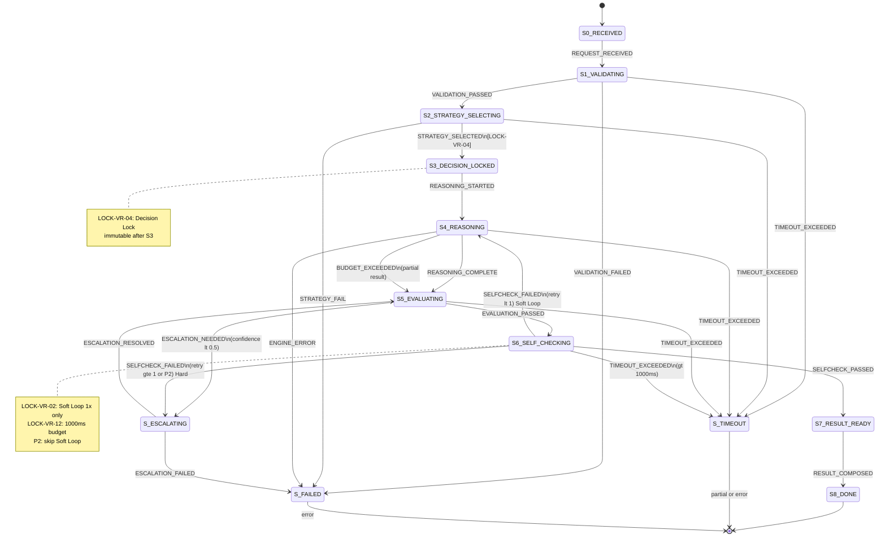

# D-1 Think Engine — State Machine S0~S8 전이 테이블 (L3)

> **Status**: APPROVED
> **버전**: v1.1
> **Last-reviewed**: 2026-04-06
> **Owner**: 1-1_Verifier-Reasoning-Engines
> **Phase**: P1-6
> **이슈 해소**: D1-4 (State Machine 상세 L2→L3)

---

## 1. 개요

본 문서는 D-1 Think Engine의 State Machine을 L3 수준으로 정의한다. S0(RECEIVED)~S8(DONE) 전체 9개 상태와 3개 에러/터미널 상태(S_TIMEOUT, S_FAILED, S_ESCALATING)를 포함하며, 모든 유효·무효 전이를 테이블로 정의한다.

> LOCK (D2.0-02 §2.2): 상태 머신 S0~S8, S3 Decision Lock immutable

> LOCK (D2.0-02 §3.1): 한 시점·한 컨텍스트·한 결론. Decision 이후 수정 불가, 결과만 누적.

> LOCK (D2.0-02 §2.3-B): 단일응답 ≤2s, 복합응답 ≤10s, Self-check ≤1s

### 참조 문서

| 문서 | 역할 |
|------|------|
| `04_think-engine/spec.md` | D-1 I/O Schema, EngineState L2 기본 상태도 |
| `04_think-engine/reasoning_strategies.md` | P1-5 추론 전략 L3, SLA 시간 예산 배분 |
| `00_common/common_types.md` §5.1 | PipelineState 열거형 (P0-6) |
| `00_common/common_types.md` §5.2 | EngineState 열거형 (P0-6) |
| `00_common/common_types.md` §5.4 | PipelineState ↔ EngineState 매핑 |
| D2.0-02 §2.2 | ORANGE CORE 상태 머신 확정 (S0~S8) |
| D2.0-02 §7.53 | Self-check LOCK 처리 규칙 |

### LOCK 값 참조

> LOCK (D2.0-02 §2.2): 상태 머신 S0~S8, S3 Decision Lock immutable — **LOCK-VR-04**

> LOCK (D2.0-02 §3.1): 한 시점·한 컨텍스트·한 결론. Decision 이후 수정 불가 — **LOCK-VR-10**

> LOCK (D2.0-02 §2.3-B): 단일응답 ≤2s, 복합응답 ≤10s, Self-check ≤1s — **LOCK-VR-12**

> LOCK (D2.0-02 §7.53-1): 자동 Soft loop 1회만 허용, 이후 승인 필요 — **LOCK-VR-02**

---

## 2. 상태 정의

### 2.1 정상 상태 (S0~S8)

| 상태 | 이름 | 설명 | ABC 단계 |
|------|------|------|---------|
| **S0** | `RECEIVED` | ThinkRequest 수신. 큐 적재, 타임아웃 타이머 시작 | — |
| **S1** | `VALIDATING` | 입력 검증·전처리. problem/budget_tokens/timeout_ms 유효성 확인 | Ask |
| **S2** | `STRATEGY_SELECTING` | `select_strategy(context)` 실행. 복잡도 분석, 전략 결정 | Ask→Bridge |
| **S3** | `DECISION_LOCKED` | 전략·파라미터 확정. **Decision Lock 획득** (LOCK-VR-04). 이후 전략/파라미터 변경 불가 | Bridge |
| **S4** | `REASONING` | CoT/ToT/GoT 알고리즘 실행. reasoning_trace 생성 중 | Bridge |
| **S5** | `EVALUATING` | 결과 평가. confidence 산출, should_escalate() 판단 | Bridge→Confirm |
| **S6** | `SELF_CHECKING` | Self-check 수행. 품질·정합성·안전 검증 (LOCK-VR-02) | Confirm |
| **S7** | `RESULT_READY` | ThinkResult 구성 완료. reasoning_trace 조립, 메타데이터 기록 | Confirm |
| **S8** | `DONE` | 결과 반환, 자원 해제, 상태 초기화 | Confirm |

### 2.2 에러/터미널 상태

| 상태 | 이름 | 설명 |
|------|------|------|
| **S_TIMEOUT** | `TIMEOUT` | 상태별 타임아웃 초과. 부분 결과 반환 가능 (VRE_TIMEOUT) |
| **S_FAILED** | `FAILED` | 복구 불가 내부 오류 (VRE_ENGINE_FAILURE) |
| **S_ESCALATING** | `ESCALATING` | I-20 경유 Fallback Chain 실행 중. 대체 Brain으로 재시도 (R-01-8) |

### 2.3 EngineState(P0-6) 매핑

D-1 L3 상태 S0~S8은 `common_types.md` §5.2 `EngineState`의 세분화이다.

| EngineState (P0-6) | D-1 L3 상태 | 설명 |
|-------------------|------------|------|
| IDLE | S0 RECEIVED | 대기/수신 |
| ANALYZING | S1 VALIDATING, S2 STRATEGY_SELECTING | 입력 분석 (L3에서 2단계로 분리) |
| REASONING | S3 DECISION_LOCKED, S4 REASONING | Lock + 알고리즘 실행 |
| EVALUATING | S5 EVALUATING, S6 SELF_CHECKING | 평가 + Self-check (L3에서 분리) |
| COMPLETE | S7 RESULT_READY, S8 DONE | 결과 구성 + 완료 |
| TIMEOUT | S_TIMEOUT | 타임아웃 |
| FAILED | S_FAILED | 실패 |
| ESCALATING | S_ESCALATING | 에스컬레이션 |

### 2.4 PipelineState(P0-6) 매핑

`common_types.md` §5.4 기반. D-1은 PipelineState S2(EVIDENCE_READY)~S3(DECISION_LOCKED) 구간에서 동작한다.

| PipelineState 구간 | D-1 L3 상태 | 설명 |
|-------------------|------------|------|
| S1_INTENT_PARSED → S2_EVIDENCE_READY | S0→S1 | 파이프라인 입력 수신 후 D-1 분석 시작 |
| S2_EVIDENCE_READY → S3_DECISION_LOCKED | S2→S3→S4→S5 | 핵심 추론/평가 수행 |
| S3_DECISION_LOCKED 이후 | S6→S7→S8 | Self-check → 결과 반환 |
| S6_SELF_CHECKED FAIL 시 | S_ESCALATING | Soft loop 또는 에스컬레이션 |
| 타임아웃 (any) | S_TIMEOUT | 엔진 타임아웃 |

---

## 3. 전이 테이블

### 3.1 유효 전이 (Happy Path + Error Path)

> 형식: **(현재 상태, 이벤트/조건) → (다음 상태, 액션)**

#### 정상 흐름 (Forward Transitions)

| # | 현재 상태 | 이벤트/조건 | 다음 상태 | 액션 | 비고 |
|---|----------|-----------|----------|------|------|
| T01 | S0 RECEIVED | `REQUEST_RECEIVED` | S1 VALIDATING | 타이머 시작, request_id 기록, LogEvent `vre.d1.s0.received` | — |
| T02 | S1 VALIDATING | `VALIDATION_PASSED` (problem, budget, timeout 유효) | S2 STRATEGY_SELECTING | StrategyContext 구성, LogEvent `vre.d1.s1.validated` | — |
| T03 | S2 STRATEGY_SELECTING | `STRATEGY_SELECTED` (select_strategy() 반환) | S3 DECISION_LOCKED | **Lock 획득**, 전략·파라미터 동결, LogEvent `vre.d1.s3.locked` | **LOCK-VR-04** |
| T04 | S3 DECISION_LOCKED | `REASONING_STARTED` | S4 REASONING | 알고리즘 실행 시작, 토큰 카운터 초기화 | — |
| T05 | S4 REASONING | `REASONING_COMPLETE` (알고리즘 정상 종료) | S5 EVALUATING | confidence 산출, should_escalate() 호출 | — |
| T06 | S5 EVALUATING | `EVALUATION_PASSED` (should_escalate()=False, confidence ≥ 임계값) | S6 SELF_CHECKING | Self-check 시작, `vre.d1.s6.selfcheck.started` | — |
| T07 | S6 SELF_CHECKING | `SELFCHECK_PASSED` | S7 RESULT_READY | ThinkResult 구성 시작, `vre.d1.s6.selfcheck.passed` | — |
| T08 | S7 RESULT_READY | `RESULT_COMPOSED` | S8 DONE | 결과 반환, 타이머 정지, 자원 해제, `vre.d1.s8.done` | — |

#### S6 Self-check Soft Loop (LOCK-VR-02)

| # | 현재 상태 | 이벤트/조건 | 다음 상태 | 액션 | 비고 |
|---|----------|-----------|----------|------|------|
| T09 | S6 SELF_CHECKING | `SELFCHECK_FAILED` + `retry_count < 1` + `priority ≠ P2` | S4 REASONING | **Soft Loop**: 자동 1회 재추론, retry_count++, `vre.d1.s6.selfcheck.soft_retry` | **LOCK-VR-02** |
| T10 | S6 SELF_CHECKING | `SELFCHECK_FAILED` + (`retry_count ≥ 1` OR `priority = P2`) | S_ESCALATING | Hard Loop: 승인 필요, `vre.d1.s6.selfcheck.hard_escalate` | **LOCK-VR-02**, §5.3-A P2 특례 |

#### 에스컬레이션 흐름

| # | 현재 상태 | 이벤트/조건 | 다음 상태 | 액션 | 비고 |
|---|----------|-----------|----------|------|------|
| T11 | S5 EVALUATING | `ESCALATION_NEEDED` (should_escalate()=True: confidence < 0.5 or 엔진 오류) | S_ESCALATING | I-20 경유 Fallback Chain 트리거, `vre.d1.escalation.triggered` | R-01-8 |
| T12 | S_ESCALATING | `ESCALATION_RESOLVED` (Fallback 성공) | S5 EVALUATING | 대체 결과로 재평가 | — |
| T13 | S_ESCALATING | `ESCALATION_FAILED` (Fallback Chain 전부 소진) | S_FAILED | HITL 요청, `vre.d1.escalation.exhausted` | — |

#### 타임아웃 전이 (LOCK-VR-12)

| # | 현재 상태 | 이벤트/조건 | 다음 상태 | 액션 | 비고 |
|---|----------|-----------|----------|------|------|
| T14 | S1 VALIDATING | `TIMEOUT_EXCEEDED` (>270ms) | S_TIMEOUT | VRE_TIMEOUT 반환, `vre.d1.timeout.s1` | — |
| T15 | S2 STRATEGY_SELECTING | `TIMEOUT_EXCEEDED` (>100ms) | S_TIMEOUT | VRE_TIMEOUT 반환, `vre.d1.timeout.s2` | — |
| T16 | S4 REASONING | `TIMEOUT_EXCEEDED` (timeout_ms−600ms 초과) | S_TIMEOUT | 부분 결과 반환 (VRE_BUDGET_EXCEEDED), `vre.d1.timeout.s4` | LOCK-VR-12 |
| T17 | S5 EVALUATING | `TIMEOUT_EXCEEDED` (>100ms) | S_TIMEOUT | VRE_TIMEOUT 반환, `vre.d1.timeout.s5` | — |
| T18 | S6 SELF_CHECKING | `TIMEOUT_EXCEEDED` (>1,000ms) | S_TIMEOUT | Self-check 생략, 직전 결과 반환, `vre.d1.timeout.s6` | **LOCK-VR-12 별도 예산** |
| T19 | * (any) | `GLOBAL_TIMEOUT` (timeout_ms + S6 예산 초과) | S_TIMEOUT | VRE_TIMEOUT 반환, 자원 강제 해제 | 전역 워치독 |

#### 오류 전이

| # | 현재 상태 | 이벤트/조건 | 다음 상태 | 액션 | 비고 |
|---|----------|-----------|----------|------|------|
| T20 | S1 VALIDATING | `VALIDATION_FAILED` (입력 무효) | S_FAILED | VRE_INVALID_INPUT 반환, `vre.d1.error.validation` | — |
| T21 | S2 STRATEGY_SELECTING | `STRATEGY_FAIL` (전략 선택 불가) | S_FAILED | VRE_STRATEGY_FAIL 반환, `vre.d1.error.strategy` | — |
| T22 | S4 REASONING | `ENGINE_ERROR` (내부 오류) | S_FAILED | VRE_ENGINE_FAILURE 반환, `vre.d1.error.reasoning` | — |
| T23 | S4 REASONING | `BUDGET_EXCEEDED` (토큰 예산 초과) | S5 EVALUATING | 부분 결과로 평가 전이, VRE_BUDGET_EXCEEDED, `vre.d1.budget.exceeded` | LOCK-VR-08 |
| T24 | * (any) | `UNRECOVERABLE_ERROR` | S_FAILED | VRE_ENGINE_FAILURE 반환, 자원 강제 해제 | — |

#### 터미널 전이

| # | 현재 상태 | 이벤트/조건 | 다음 상태 | 액션 | 비고 |
|---|----------|-----------|----------|------|------|
| T25 | S_TIMEOUT | — | (종료) | 부분 결과 또는 에러 반환, 자원 해제 | recoverable=True |
| T26 | S_FAILED | — | (종료) | 에러 반환, 자원 해제 | recoverable 여부 error_code별 판단 |
| T27 | S_ESCALATING | — | S5 또는 S_FAILED | T12 또는 T13 참조 | — |

### 3.2 무효 전이 (Invalid Transitions)

아래 전이는 명시적으로 금지하며, 시도 시 `VRE_ENGINE_FAILURE` + LogEvent `vre.d1.error.invalid_transition`을 발생시킨다.

| 금지 전이 | 사유 |
|----------|------|
| S3 → S2 (DECISION_LOCKED → STRATEGY_SELECTING) | **LOCK-VR-04**: Decision Lock 이후 전략 변경 불가 |
| S3 → S1 (DECISION_LOCKED → VALIDATING) | **LOCK-VR-04**: Lock 이후 입력 재검증 불가 |
| S5 → S3 (EVALUATING → DECISION_LOCKED) | Lock 재획득 불가 (단일결정 원칙) |
| S7 → S4 (RESULT_READY → REASONING) | 결과 확정 후 재추론 불가 |
| S8 → * (DONE → any) | 종료 상태에서 재진입 불가 (새 요청만 가능) |
| S_FAILED → S4 (FAILED → REASONING) | 실패 상태에서 직접 추론 재개 불가 |
| S6 → S2 (SELF_CHECKING → STRATEGY_SELECTING) | Soft Loop은 S4로만 회귀 (전략 변경 없이 재추론) |

**핵심 원칙**: S3(DECISION_LOCKED) 이후의 모든 역방향 전이는 S4(REASONING) 이전으로 돌아갈 수 없다. Soft Loop(T09)은 S6→S4만 허용하며, 전략·파라미터는 S3에서 잠긴 값을 그대로 사용한다.

---

## 4. S3 Decision Lock 상세 (LOCK-VR-04)

> LOCK (D2.0-02 §2.2): S3 Decision Lock immutable

> LOCK (D2.0-02 §3.1): 한 시점·한 컨텍스트·한 결론. Decision 이후 수정 불가, 결과만 누적.

### 4.1 Lock 대상

S3에서 잠기는 결정 항목:

| 항목 | 타입 | 설명 |
|------|------|------|
| `strategy` | `StrategyType` | 선택된 추론 전략 (cot/tot/got) |
| `max_depth` | `int` | 최대 추론 깊이 |
| `budget_tokens` | `int` | 토큰 예산 (감소만 가능, 증가 불가) |
| `algorithm_timeout_ms` | `int` | S4 알고리즘 실행 시간 예산 |
| `problem` | `str` | 추론 대상 문제 (변경 불가) |
| `context` | `list[ContextItem]` | 참조 컨텍스트 (추가/수정 불가) |

### 4.2 Lock 획득 조건

```python
def acquire_decision_lock(strategy_result: StrategyType, request: ThinkRequest) -> DecisionLock:
    """S2 → S3 전이 시 Lock 획득.

    전제조건:
    - select_strategy() 성공 반환
    - 현재 상태 == S2 (STRATEGY_SELECTING)
    - 타임아웃 미초과
    """
    lock = DecisionLock(
        lock_id=generate_uuid(),
        strategy=strategy_result,
        max_depth=request.max_depth,
        budget_tokens=request.budget_tokens,
        algorithm_timeout_ms=compute_strategy_timeout(strategy_result, request.timeout_ms),
        problem=request.problem,
        context=freeze(request.context),   # 불변 복사
        locked_at=now_iso8601(),
        request_id=request.request_id,
        is_locked=True,
    )
    emit_event("vre.d1.s3.locked", {"lock_id": lock.lock_id, "strategy": lock.strategy})
    return lock
```

### 4.3 Lock 해제 조건

Decision Lock은 **명시적으로 해제하지 않는다**. 다음 상황에서 자동 소멸한다:

| 조건 | 시점 | Lock 상태 |
|------|------|----------|
| S8 DONE 도달 | 정상 완료 | 소멸 (결과에 strategy_used로 기록) |
| S_TIMEOUT 도달 | 타임아웃 | 소멸 (부분 결과에 strategy_used로 기록) |
| S_FAILED 도달 | 실패 | 소멸 (에러 응답에 기록) |
| Soft Loop (T09) | S6→S4 | **유지** (동일 전략으로 재추론) |

### 4.4 동시성 처리

- **Lock 단위**: request_id 기준 1:1. 하나의 ThinkRequest에 하나의 Lock.
- **경합 방지**: D-1 인스턴스 내에서 동일 request_id에 대한 중복 Lock 시도 시 `VRE_ENGINE_FAILURE` (failure_code: `D1_LOCK_CONFLICT`).
- **격리 수준**: Lock은 엔진 인스턴스 로컬. 다른 request_id의 처리에 영향 없음.

---

## 5. S6 Self-check 상세 (LOCK-VR-02)

> LOCK (D2.0-02 §7.53-1): 자동 Soft loop 1회만 허용, 이후 승인 필요

### 5.1 Self-check 검증 항목

| 검증 | 설명 | FAIL 기준 |
|------|------|----------|
| 형식 정합성 | ThinkResult 필수 필드 완전성 | reasoning_trace 비어있음, confidence 범위 위반 |
| 근거-결론 일치 | reasoning_trace와 answer 간 논리적 일관성 | 결론이 trace에서 도출 불가능 |
| 자기모순 탐지 | trace 내 단계 간 모순 검사 | step_N 결론이 step_M 결론과 직접 모순 |
| 안전 가이드라인 | 정책 위반 여부 (policy_gate 연동) | policy_gate = deny/restrict |

### 5.2 Soft Loop 처리 흐름

```
S6 SELF_CHECKING
    │
    ├── SELFCHECK_PASSED ──→ S7 RESULT_READY (정상 흐름)
    │
    └── SELFCHECK_FAILED
            │
            ├── retry_count < 1 ──→ S4 REASONING (Soft Loop)
            │       │
            │       ├── 동일 전략·파라미터로 재추론 (LOCK-VR-04 Lock 유지)
            │       ├── retry_count = 1로 증가
            │       ├── 백오프: 토큰 예산의 80% 적용 (재시도 절약)
            │       └── LogEvent: vre.d1.s6.selfcheck.soft_retry
            │
            └── retry_count ≥ 1 ──→ S_ESCALATING (Hard Loop)
                    │
                    ├── 2회 연속 FAIL → "게이트 결과 우선" 수렴
                    ├── (A) 승인 필요 → fallback_id = FB_REQUIRE_APPROVAL
                    ├── (B) 축소 출력 가능 → fallback_id = FB_OUTPUT_MINIMAL
                    ├── (C) 정책 위반 → fallback_id = FB_DENY_WITH_REASON
                    └── LogEvent: vre.d1.s6.selfcheck.hard_escalate
```

### 5.3 Soft Loop 제약

| 항목 | 값 | 근거 |
|------|-----|------|
| 자동 재시도 최대 횟수 | **1회** | LOCK-VR-02 |
| 재시도 시 전략 변경 | **불가** | LOCK-VR-04 (S3 Lock 유지) |
| 재시도 토큰 예산 | 원본의 80% | 무한 루프 방지, 비용 절약 |
| 재시도 타임아웃 | 잔여 시간 내 | LOCK-VR-12 Self-check 별도 예산 준수 |
| 2회 FAIL 후 | **승인 필요** (Hard Loop) | LOCK-VR-02 §7.53-1 |

### 5.3-A P2(고위험) 특례

> LOCK (D2.0-02 §7.53): P2에서 FAIL(또는 QoD/Policy/Cost에서 restrict/deny)일 경우, Soft loop를 강행하지 않고 07의 Approval/Policy/Cost Gate 결론을 우선한다.

P2 위험 등급 요청에서 S6 Self-check FAIL 발생 시:

- **Soft Loop 건너뛰기**: retry_count 무관하게 즉시 S_ESCALATING 전이
- **수렴 방향**: 게이트 결과 우선 → `FB_REQUIRE_APPROVAL` (승인 없이 진행 불가)
- **근거**: P2는 안전/비용/정책 리스크가 높으므로 자동 재시도보다 승인이 우선

```
P2 요청 + S6 SELFCHECK_FAILED
    │
    └── retry_count 무관 ──→ S_ESCALATING (즉시)
            │
            └── fallback_id = FB_REQUIRE_APPROVAL
```

### 5.4 Self-check 의사코드

```python
def execute_self_check(
    result: ThinkResult,
    lock: DecisionLock,
    retry_count: int,
    remaining_time_ms: int,
    priority_level: str,  # "P0" | "P1" | "P2"
) -> SelfCheckOutcome:
    """S6 Self-check 실행.

    LOCK-VR-02: 자동 1회만, 이후 승인 필요.
    LOCK-VR-12: Self-check ≤ 1000ms (별도 예산).
    D2.0-02 §7.53: P2 → Soft loop 건너뛰고 즉시 승인/축소.
    """
    selfcheck_timeout = min(SELFCHECK_BUDGET_MS, remaining_time_ms)  # LOCK-VR-12

    checks = [
        check_format_integrity(result),
        check_evidence_conclusion_alignment(result.reasoning_trace, result.answer),
        check_self_contradiction(result.reasoning_trace),
        check_safety_guidelines(result),
    ]

    if all(c.passed for c in checks):
        return SelfCheckOutcome(status="PASSED", next_state="S7")

    # FAIL 처리

    # P2(고위험) 특례: Soft Loop 건너뛰고 즉시 승인 (D2.0-02 §7.53)
    if priority_level == "P2":
        return SelfCheckOutcome(
            status="HARD_ESCALATE",
            next_state="S_ESCALATING",
            fallback_id="FB_REQUIRE_APPROVAL",
        )

    if retry_count < 1:
        # Soft Loop: S4로 회귀
        return SelfCheckOutcome(
            status="SOFT_RETRY",
            next_state="S4",
            retry_budget_tokens=int(lock.budget_tokens * 0.8),
            retry_count=retry_count + 1,
        )
    else:
        # Hard Loop: 승인 필요 (2회 연속 FAIL)
        fallback = determine_fallback(checks)
        return SelfCheckOutcome(
            status="HARD_ESCALATE",
            next_state="S_ESCALATING",
            fallback_id=fallback,
        )
```

---

## 6. 상태별 타임아웃 임계값 (LOCK-VR-12)

> LOCK (D2.0-02 §2.3-B): 단일응답 ≤2s, 복합응답 ≤10s, Self-check ≤1s

D-1은 PipelineState S2~S3 구간에서 동작한다. 전체 파이프라인 10s 중 D-1에 할당 가능한 예산은 `ThinkRequest.timeout_ms`로 전달된다.

### 6.1 상태별 시간 예산 배분

> `reasoning_strategies.md` §8.1 정합: FIXED_OVERHEAD = Ask(300ms) + select_strategy(100ms) + Confirm(200ms) = **600ms**. S4 알고리즘 예산 = `timeout_ms - 600ms`. Self-check(S6)는 LOCK-VR-12에 의해 **별도 예산**(≤1,000ms)으로, `timeout_ms`에서 차감하지 않는다.

#### 주 예산 (timeout_ms 범위 내: S0→S5→S7→S8)

| 상태 | 최대 시간 | reasoning_strategies §8.1 매핑 | 타임아웃 시 처리 |
|------|----------|------------------------------|---------------|
| S0 RECEIVED | 30ms | Ask (300ms) 일부: 큐 적재 + 타이머 시작 | S_TIMEOUT |
| S1 VALIDATING | 270ms | Ask (300ms) 일부: Pydantic 검증 + 전처리 | S_TIMEOUT, VRE_TIMEOUT |
| S2 STRATEGY_SELECTING | 100ms | Bridge — select_strategy (100ms): 복잡도 분석 + 전략 결정 | S_TIMEOUT, VRE_STRATEGY_FAIL |
| S3 DECISION_LOCKED | — | Bridge 진입: Lock 획득 (S4 예산에 포함, 동기 연산 ≤10ms) | 전역 타임아웃으로 커버 |
| S4 REASONING | **timeout_ms − 600ms** | Bridge — 알고리즘 실행 (가변, 전략별) | S_TIMEOUT, 부분 결과 반환 |
| S5 EVALUATING | 100ms | Confirm (200ms) 일부: confidence 산출 + should_escalate() | S_TIMEOUT |
| S7 RESULT_READY | 70ms | Confirm (200ms) 일부: ThinkResult JSON 조립 | S_TIMEOUT |
| S8 DONE | 30ms | Confirm (200ms) 일부: 자원 해제 + 반환 | 자원 누수 경고 |

> Ask 합계: S0(30)+S1(270) = **300ms**. select_strategy: S2 = **100ms**. Confirm 합계: S5(100)+S7(70)+S8(30) = **200ms**. 총 고정 오버헤드 = **600ms** ← `reasoning_strategies.md` §8.1과 정합.

#### 별도 예산 (LOCK-VR-12 Self-check SLA)

| 상태 | 최대 시간 | 근거 | 타임아웃 시 처리 |
|------|----------|------|---------------|
| S6 SELF_CHECKING | **≤ 1,000ms** | **LOCK-VR-12 명시**: Self-check ≤1s. timeout_ms와 독립 | S_TIMEOUT, Self-check 생략 후 직전 결과 반환 |

> D-1 전체 라이프사이클 최대 시간 = `timeout_ms` + S6 예산(≤1,000ms). 파이프라인 오케스트레이터는 이를 감안하여 D-1 호출 스케줄링.

### 6.2 S4 REASONING 전략별 시간 예산

> `reasoning_strategies.md` §8 기반. 알고리즘 실행 시간 = `timeout_ms - FIXED_OVERHEAD(600ms)`.

| 전략 | D-1 권장 timeout_ms | 고정 오버헤드 | S4 알고리즘 예산 | 비고 |
|------|-------------------|------------|---------------|------|
| CoT | 4,200ms | 600ms | **3,600ms** | 선형 탐색, 최소 토큰 |
| ToT | 6,200ms | 600ms | **5,600ms** | 분기 탐색, 중간 토큰 |
| GoT | 6,200ms | 600ms | **5,600ms** | DAG 탐색, 최다 토큰 |

### 6.3 전역 타임아웃 워치독

```python
FIXED_OVERHEAD_MS = 600  # Ask(300) + select_strategy(100) + Confirm(200) — reasoning_strategies.md §8.1
SELFCHECK_BUDGET_MS = 1000  # LOCK-VR-12: Self-check ≤ 1s (timeout_ms와 독립)

class TimeoutWatchdog:
    """전역 + 상태별 타임아웃 관리.

    LOCK-VR-12 기반.
    - timeout_ms: ThinkRequest.timeout_ms (주 처리 예산, S0→S5→S7→S8)
    - S6(Self-check): 별도 1,000ms 예산 (LOCK-VR-12)
    - S4(알고리즘): timeout_ms - FIXED_OVERHEAD(600ms)
    """

    def __init__(self, timeout_ms: int, strategy: StrategyType):
        self.start_ms = now_ms()
        # 주 처리 deadline (S0→S5, S7→S8)
        self.main_deadline = self.start_ms + timeout_ms
        # Self-check deadline (S6, 별도)
        self.selfcheck_deadline = self.main_deadline + SELFCHECK_BUDGET_MS
        # 상태별 deadline 계산
        self.state_deadlines: dict[str, int] = {}
        self._init_state_budgets(timeout_ms)

    def _init_state_budgets(self, timeout_ms: int):
        """상태별 시간 예산 초기화.

        reasoning_strategies.md §8.1 정합:
        Ask(300ms) + select_strategy(100ms) = 400ms
        Algorithm(S4) = timeout_ms - 600ms
        Confirm(200ms)
        Self-check(S6) = 별도 1000ms
        """
        # 주 예산 (timeout_ms 범위 내)
        ask_budget = {"S0": 30, "S1": 270}         # Ask: 300ms
        bridge_entry = {"S2": 100, "S3": 0}         # select_strategy: 100ms (S3은 S4에 포함)
        s4_budget = max(timeout_ms - FIXED_OVERHEAD_MS, 0)
        algorithm = {"S4": s4_budget}                # Bridge — Algorithm: 가변
        confirm_budget = {"S5": 100, "S7": 70, "S8": 30}  # Confirm: 200ms

        # Self-check (별도 예산)
        selfcheck = {"S6": SELFCHECK_BUDGET_MS}      # LOCK-VR-12: 1000ms

        all_budgets = {**ask_budget, **bridge_entry, **algorithm, **confirm_budget, **selfcheck}

        cursor = self.start_ms
        for state in ["S0", "S1", "S2", "S3", "S4", "S5", "S6", "S7", "S8"]:
            cursor += all_budgets[state]
            self.state_deadlines[state] = cursor

    def check_timeout(self, current_state: str) -> bool:
        """현재 상태의 타임아웃 초과 여부."""
        now = now_ms()
        # S6(Self-check)는 별도 deadline 사용
        if current_state == "S6":
            return now >= self.selfcheck_deadline
        # 그 외 상태는 주 deadline 우선 체크
        if now >= self.main_deadline and current_state not in ("S6", "S7", "S8"):
            return True
        # 상태별 타임아웃 체크
        if current_state in self.state_deadlines:
            return now >= self.state_deadlines[current_state]
        return False

    def remaining_ms(self) -> int:
        """Self-check 포함 전체 잔여 시간."""
        return max(0, self.selfcheck_deadline - now_ms())

    def remaining_main_ms(self) -> int:
        """주 처리(S0→S5, S7→S8) 잔여 시간."""
        return max(0, self.main_deadline - now_ms())

    def recalculate_for_soft_loop(self, retry_budget_tokens: int):
        """Soft Loop(S6→S4) 시 S4~S5 deadline 재계산.

        Lock 유지 상태에서 재추론하므로 S0~S3 건너뛰고
        잔여 main 시간 내에서 S4~S5를 재배분한다.
        """
        remaining = self.remaining_main_ms()
        confirm_budget = 100 + 70 + 30  # S5 + S7 + S8 = 200ms
        s4_retry_budget = max(remaining - confirm_budget, 0)

        now = now_ms()
        self.state_deadlines["S4"] = now + s4_retry_budget
        self.state_deadlines["S5"] = self.state_deadlines["S4"] + 100
        # S6은 별도 예산이므로 selfcheck_deadline 유지
        self.state_deadlines["S7"] = self.selfcheck_deadline + 70
        self.state_deadlines["S8"] = self.state_deadlines["S7"] + 30
```

---

## 7. Mermaid State Diagram



---

## 8. P1-5 추론 전략 연동 매핑

> `reasoning_strategies.md` §9 기반. 각 전략이 트리거하는 상태 전이를 매핑한다.

### 8.1 전략 공통 상태 전이

| D-1 상태 전이 | 트리거 이벤트 | ABC 단계 | 전략 공통 |
|-------------|------------|---------|----------|
| S0→S1 | `REQUEST_RECEIVED` | — | Yes |
| S1→S2 | `VALIDATION_PASSED` | Ask | Yes |
| S2→S3 | `STRATEGY_SELECTED` | Ask→Bridge | Yes |
| S3→S4 | `REASONING_STARTED` | Bridge | Yes |
| S4→S5 | `REASONING_COMPLETE` | Bridge→Confirm | Yes |
| S5→S6 | `EVALUATION_PASSED` | Confirm | Yes |
| S6→S7 | `SELFCHECK_PASSED` | Confirm | Yes |
| S7→S8 | `RESULT_COMPOSED` | Confirm | Yes |

### 8.2 전략 고유 내부 이벤트 → 상태 영향

S4(REASONING) 내부에서 발생하는 전략 고유 이벤트. 이들은 S4 내부의 서브이벤트이며, D-1 L3 상태 전이를 직접 유발하지는 않으나, 타임아웃·예산 체크 시 참조된다.

| 내부 이벤트 | 전략 | S4 내 영향 | 타임아웃/예산 체크 |
|-----------|------|----------|---------------|
| `COT_STEP_COMPLETE` | CoT | 체인 1단계 완료 | 누적 토큰 체크 |
| `COT_RETRY_TRIGGERED` | CoT | 낮은 confidence 재시도 | 잔여 시간 체크 |
| `TOT_BRANCH_CREATED` | ToT | 분기 생성 | 노드 수 + 토큰 체크 |
| `TOT_PRUNING_APPLIED` | ToT | 가지치기 | 토큰 절약 |
| `TOT_PATH_SELECTED` | ToT | 최적 경로 선택 → S4 종료 | — |
| `GOT_NODE_EXPANDED` | GoT | 노드 확장 | 노드 수 + 토큰 체크 |
| `GOT_MERGE_EXECUTED` | GoT | 노드 병합 | 노드 수 감소 |
| `GOT_CYCLE_PREVENTED` | GoT | 순환 방지 | — |
| `GOT_CONVERGENCE_MET` | GoT | 수렴 조건 충족 → S4 종료 | — |

### 8.3 전략별 S4 실행 특성

| 항목 | CoT | ToT | GoT |
|------|-----|-----|-----|
| S4 최대 시간 | 3,600ms | 5,600ms | 5,600ms |
| S4 내부 루프 | 순차 step (max_depth) | BFS/빔서치 | 병렬 확장 + 병합 |
| 조기 종료 조건 | confidence ≥ 0.85 | best_path 확보 | 수렴 조건 충족 |
| 부분 결과 가능 | 마지막 완료 step | 최고 점수 경로 | 최고 confidence 노드 |
| BUDGET_EXCEEDED 시 | 현재까지 chain 반환 | 현재 best_path 반환 | 현재 best subgraph 반환 |

---

## 9. 상태 전이 시퀀스 예시

### 9.1 정상 흐름 (CoT, Happy Path)

```
S0 ──(20ms)──→ S1 ──(180ms)──→ S2 ──(70ms)──→ S3 ──→ S4
   RECEIVED      VALIDATING       SELECTING      LOCKED  REASONING
                                                           │ (3200ms)
S8 ←──(20ms)── S7 ←──(50ms)── S6 ←──(80ms)── S5 ←────────┘
  DONE         READY          CHECKED        EVALUATING
```

주 처리 소요: ~3,620ms (CoT 권장 timeout_ms=4,200ms 이내). Self-check(S6): +80ms (별도 예산 1,000ms 이내).

### 9.2 Soft Loop 흐름 (Self-check 1회 실패)

```
S0 → S1 → S2 → S3 → S4 → S5 → S6
                                  │ SELFCHECK_FAILED (retry=0)
                                  │ Soft Loop
                          S4 ←────┘
                           │
                    S5 → S6 → S7 → S8
                              │ SELFCHECK_PASSED
```

### 9.3 Hard Escalation 흐름 (2회 연속 FAIL)

```
S0 → S1 → S2 → S3 → S4 → S5 → S6
                                  │ SELFCHECK_FAILED (retry=0, Soft Loop)
                          S4 ←────┘
                           │
                    S5 → S6
                          │ SELFCHECK_FAILED (retry=1, Hard Loop)
                          │
                    S_ESCALATING
                          │
                    ├── ESCALATION_RESOLVED → S5 → S6 → S7 → S8
                    └── ESCALATION_FAILED  → S_FAILED
```

---

## 10. 일관성 검증

### 10.1 common_types.md EngineState 대응 확인

| EngineState (§5.2) | D-1 L3 상태 | 전이 대응 | 검증 |
|-------------------|------------|----------|------|
| IDLE | S0 | 1:1 | ✅ |
| ANALYZING | S1, S2 | 1:2 (L3 세분화) | ✅ |
| REASONING | S3, S4 | 1:2 (Lock 분리) | ✅ |
| EVALUATING | S5, S6 | 1:2 (Self-check 분리) | ✅ |
| COMPLETE | S7, S8 | 1:2 (조립/완료 분리) | ✅ |
| TIMEOUT | S_TIMEOUT | 1:1 | ✅ |
| FAILED | S_FAILED | 1:1 | ✅ |
| ESCALATING | S_ESCALATING | 1:1 | ✅ |

> EngineState 8개 → D-1 L3 12개 (9 정상 + 3 에러). L3 세분화는 상위 호환이며, `get_state()` 반환 시 EngineState로 매핑 가능.

### 10.2 PipelineState ↔ D-1 L3 교차 확인

| PipelineState (§5.1) | D-1 활동 구간 | 검증 |
|---------------------|-------------|------|
| S0_RECEIVED → S1_INTENT_PARSED | D-1 미관여 (파이프라인 수준) | — |
| S1_INTENT_PARSED → S2_EVIDENCE_READY | D-1 S0→S1 (수신·검증) | ✅ |
| S2_EVIDENCE_READY → S3_DECISION_LOCKED | D-1 S2→S5 (전략→추론→평가) | ✅ |
| S3_DECISION_LOCKED 이후 | D-1 S6→S8 (Self-check→완료) | ✅ |

### 10.3 LOCK 준수 확인

| LOCK | 적용 위치 | 준수 방법 | 검증 |
|------|----------|----------|------|
| LOCK-VR-04 (S3 Decision Lock immutable) | §4, T03, 무효 전이 테이블 | S3 이후 역방향 전이 금지, Lock 대상 항목 동결 | ✅ |
| LOCK-VR-10 (단일결정 원칙) | §4.1, §4.3 | Lock 해제 없이 소멸만 허용, 결과만 누적 | ✅ |
| LOCK-VR-02 (Soft Loop 1회) | §5, T09-T10, §5.3-A | retry_count < 1 → Soft, ≥ 1 → Hard. P2 특례: 즉시 Hard | ✅ |
| LOCK-VR-12 (SLA) | §6, T14-T18 | S6 ≤ 1000ms **별도 예산** + S4 = timeout_ms − 600ms + 전역 타이머 | ✅ |

### 10.4 reasoning_strategies.md §8 정합 확인

| 항목 | reasoning_strategies.md §8.1 | state_machine.md §6.1 | 정합 |
|------|---------------------------|---------------------|------|
| Ask (검증·전처리) | 300ms | S0(30)+S1(270) = 300ms | ✅ |
| Bridge — select_strategy | 100ms | S2(100) = 100ms | ✅ |
| Bridge — 알고리즘 실행 | timeout_ms − 600ms | S4 = timeout_ms − 600ms | ✅ |
| Confirm (결과 구성) | 200ms | S5(100)+S7(70)+S8(30) = 200ms | ✅ |
| FIXED_OVERHEAD | 600ms | Ask+select+Confirm = 600ms | ✅ |
| Self-check | ≤1s (S5→S6 별도) | S6 = ≤1,000ms (별도 예산) | ✅ |
| D-1 권장 timeout_ms (CoT) | 4,200ms | S4 = 4200−600 = 3,600ms | ✅ |
| D-1 권장 timeout_ms (ToT/GoT) | 6,200ms | S4 = 6200−600 = 5,600ms | ✅ |

---

## 변경 이력

| 버전 | 날짜 | 변경 내용 | 작성자 |
|------|------|----------|--------|
| v1.0 | 2026-04-06 | 초기 작성 — P1-6 실행, S0~S8 전이 테이블 L3 완성, S3 Decision Lock 상세, S6 Self-check Soft Loop, 상태별 타임아웃, Mermaid diagram, P1-5 연동 매핑 | P1-6 |
| v1.1 | 2026-04-06 | 교차 검증 수정 — (1) S6 Self-check 별도 예산 분리(timeout_ms와 독립), (2) 상태별 시간 예산 reasoning_strategies.md §8.1과 정합(FIXED_OVERHEAD=600ms), (3) T19 전역 타임아웃 범위 확대(S0→any), (4) P2 고위험 특례 추가(Soft Loop 건너뛰기, D2.0-02 §7.53), (5) LOCK-VR-02 출처 §7.53-1 정밀화, (6) S_ESCALATING 설명 정정, (7) Mermaid 이모지 제거, (8) §10.4 reasoning_strategies.md 정합 테이블 추가 | P1-6 |
