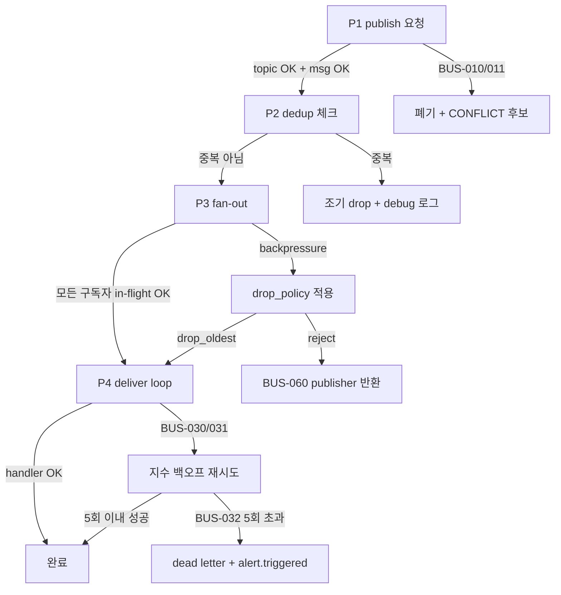
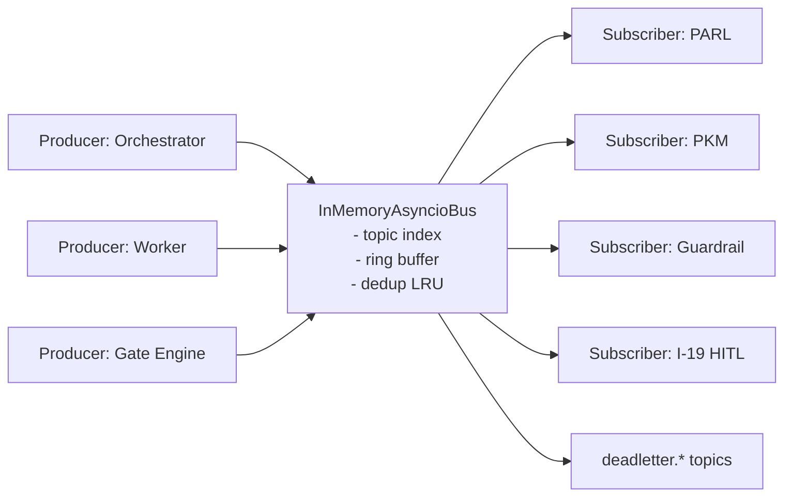

# Event Bus — K-051 (L3)

> **STEP7-K**: K-051 — 이벤트 버스
> **레벨**: L3 (구현 상세)
> **Part2 상태**: ABSENT — 신규 작성 (V1 asyncio In-Memory → V2 Redis Pub/Sub → V3 Kafka)
> **정본 소유**: #13 Agent-Protocol-Interoperability / 03_data-exchange
> **V 스코프**: V1 (In-Memory asyncio Queue)
> **LOCK**: LOCK-AP-01 (VamosMessage 페이로드), LOCK-AP-04 (Streamable HTTP — SSE 경계), LOCK-AP-09 (V1 비용 상한 ₩40K)

---

## §1. 교차 참조 블록

| 정본 문서 | 섹션 | 참조 내용 |
|----------|------|----------|
| 구조화_종합계획서.md | §3.4 | LOCK-AP-01 (VamosMessage), LOCK-AP-04 (Streamable HTTP), LOCK-AP-09 (비용 상한) |
| 구조화_종합계획서.md | §7.3.2 | Agent Teams V1 — V2 Redis Pub/Sub 전환 경로 |
| 구조화_종합계획서.md | §7.3.3 | MCP Bridge — Streamable HTTP, SSE 양방향 (이벤트 푸시) |
| AUTHORITY_CHAIN.md | §3 LOCK-AP-01·04·09 | 원본 값 인용, 재정의 금지 |
| STEP7-K | K-051 (line 1022~1038) | 원본 요구사항 (V1 asyncio → V2 Redis → V3 Kafka) |
| 03_data-exchange/message_format.md §2 (동일 세션) | VamosMessage 정본 | 본 문서의 Event 페이로드는 VamosMessage 를 래핑 |
| 03_data-exchange/message_format.md §3 | A2A Task 상태 전이 | 이벤트 타입 일부(TaskAssigned 등)의 근거 |
| 06_autonomy-safety/permission_matrix.md | Permission Level 0~5 | 에이전트 권한 레벨 정본 (LOCK-AP-02). 본 문서는 subscribe 권한 필터 정책을 독립 정의(§13 참조) — permission_matrix 에 subscribe 전용 규칙 없음. |
| 06_autonomy-safety/guardrail_rules.md | SG-009 (conf<0.5 → I-19) | `hitl.requested` 이벤트 발행 트리거의 정본 경로. 본 문서 §4.4 의 `hitl.requested` 매핑은 SG-009 를 참조. |
| 6-3 Agent-Teams-PARL V2 Teams 10 | Redis Pub/Sub 전환 | V2 확장 경로 정합 기준 |

> **R6 준수**: 본 문서는 What + How 전용. Phase/Week 등 When, 코드 경로 등 Where 는 Part2 가 정본이므로 본문에 기재하지 않는다.

---

## §2. 개요 (Purpose & Scope)

### 2.1 목적
VAMOS 내부 구성 요소 간 발행-구독(Pub/Sub) 이벤트 배포 시스템을 정의한다. V1 은 단일 프로세스 asyncio 기반 In-Memory Queue 이며, V2 Redis Pub/Sub → V3 Kafka 로 확장 인터페이스를 보존한다. 이벤트 페이로드는 LOCK-AP-01 VamosMessage 를 그대로 사용 또는 감싸, 메시지 모델의 일관성을 유지한다.

### 2.2 범위
- **In-scope (V1)**: MessageBus 인터페이스(ABC), publish/subscribe API, 토픽 관리, 이벤트 타입 카탈로그, 순서 보장/중복 제거/재시도 정책, V2 전환 인터페이스.
- **Out-of-scope (V2+ 이관)**: 분산 큐(Redis Pub/Sub V2), Kafka(V3), 영속 이벤트 히스토리 (V2+ K-050 Artifact Store 연계), Exactly-Once 의미론(V3), Schema Registry(V3).

### 2.3 비고
- 본 문서는 데이터 형식/API 계약 정본이며, **ABC 자체는 신규 정의** (기존 common ABC 없음).
- LOCK-AP-04: 본 Event Bus 는 내부(in-process) 이므로 Streamable HTTP 제약이 직접 적용되지 않으나, 외부 노출(SSE gateway)은 LOCK-AP-04 준수.

---

## §3. 공통 자료 구조 선정의

> 본 문서 단독 사용 + message_format.md §2 의 `VamosMessage` 참조.

```python
# D:/VAMOS/docs/sot 2/3-10_Agent-Protocol-Interoperability/03_data-exchange/event_bus.md §3

from __future__ import annotations
from pydantic import BaseModel, Field
from typing import Literal, Optional, Callable, Awaitable, Any
from datetime import datetime
from uuid import UUID, uuid4

# 정본 참조: message_format.md §2
# from .message_format import VamosMessage   # (주: 본 문서는 설계 문서이므로 import 생략)

# ---- 이벤트 타입 카탈로그 (확장 가능, §4 참조) ----
EventClass = Literal[
    "agent.created",
    "agent.terminated",
    "task.assigned",
    "task.started",
    "task.completed",
    "task.failed",
    "task.canceled",
    "gate.evaluated",
    "hitl.requested",
    "hitl.responded",
    "cb.opened",
    "cb.closed",
    "cb.half_open",
    "memory.updated",
    "alert.triggered",
    "user.message",
    "cost.threshold",
]

# ---- 이벤트 페이로드 (VamosMessage 래퍼) ----
class VamosEvent(BaseModel):
    """
    이벤트 버스 전송 단위. VamosMessage 를 내부에 래핑하여 LOCK-AP-01 정합성 유지.
    """
    event_id: UUID = Field(default_factory=uuid4)
    event_class: EventClass
    topic: str                              # 예: "task.completed.agent-42"
    occurred_at: datetime
    sequence: int                           # 토픽 내 단조 증가 (§5.1)
    vamos_message: "VamosMessage"           # 본문 — LOCK-AP-01 정본 (message_format.md §2)
    headers: dict = Field(default_factory=dict)  # 부가 정보 (예: tenant_id, retry_count)
    dedup_key: Optional[str] = None         # §5.2 중복 제거 키 (기본 = event_id)

# ---- 구독자 콜백 시그니처 ----
# async def handler(event: VamosEvent) -> None
EventHandler = Callable[["VamosEvent"], Awaitable[None]]

# ---- 구독 핸들 ----
class SubscriptionHandle(BaseModel):
    subscription_id: UUID = Field(default_factory=uuid4)
    topic_pattern: str                      # glob: "task.*" or exact: "task.completed.agent-42"
    subscriber_agent_id: str
    created_at: datetime
    filter_expr: Optional[str] = None       # 간이 CEL 유사 식 (§4.3)
    max_in_flight: int = 16                 # 백프레셔 제한

# ---- 버스 상태 ----
class BusHealth(BaseModel):
    total_published: int
    total_delivered: int
    total_dropped: int
    pending_per_topic: dict[str, int]
    subscribers: int
    uptime_seconds: float

# ---- 전달 결과 ----
class DeliveryResult(BaseModel):
    event_id: UUID
    subscription_id: UUID
    success: bool
    attempt: int
    error_code: Optional[str] = None
    latency_ms: float
```

---

## §4. MessageBus 인터페이스 (ABC)

### 4.1 정의

```python
from abc import ABC, abstractmethod

class MessageBus(ABC):
    """
    LOCK-AP-04 주의: 본 ABC 는 in-process 경계. 외부 SSE 노출은 별도 게이트웨이.
    V1 구현: InMemoryAsyncioBus. V2 구현: RedisPubSubBus. V3: KafkaBus.
    """

    @abstractmethod
    async def publish(self, event: "VamosEvent") -> None:
        """
        이벤트 발행. 실패 시 §6 예외 표 참조.
        시간복잡도: O(S) where S = 매칭 구독자 수.
        """

    @abstractmethod
    async def subscribe(
        self,
        topic_pattern: str,
        handler: EventHandler,
        subscriber_agent_id: str,
        *,
        filter_expr: Optional[str] = None,
        max_in_flight: int = 16,
    ) -> SubscriptionHandle:
        """
        구독 등록. topic_pattern 은 glob (`*`, `?`) 허용.
        시간복잡도: O(1) 등록, O(T) 최초 인덱스 재계산 (T=토픽 수).
        """

    @abstractmethod
    async def unsubscribe(self, handle: SubscriptionHandle) -> None: ...

    @abstractmethod
    async def health(self) -> BusHealth: ...

    @abstractmethod
    async def replay(
        self,
        topic_pattern: str,
        from_sequence: int,
        to_sequence: Optional[int] = None,
    ) -> list["VamosEvent"]:
        """
        V1: 링 버퍼 내 보존분만 재생. V2+: 영속 저장소 기반.
        """
```

### 4.2 토픽 네이밍 규칙

- 형식: `<event_class>.<scope>.<entity>` — 점(`.`) 구분.
- 예: `task.completed.agent-42`, `gate.evaluated.G2`, `hitl.requested.orchestrator`.
- glob 매칭: `task.*`, `*.agent-42`, `hitl.*.orchestrator`.
- 토픽 문자 집합: `[a-zA-Z0-9_\-*?.]`. 공백 금지.

### 4.3 filter_expr (간이 CEL 유사 식)

- 구독 시 선택적 필터. 예: `event_class == "task.completed" && vamos_message.metadata.priority <= 2`.
- 지원 연산자: `==`, `!=`, `<`, `<=`, `>`, `>=`, `&&`, `||`, `!`.
- 지원 경로: `event_class`, `topic`, `headers.*`, `vamos_message.metadata.*`.
- 파서: 본 도메인 내장 간이 파서 (O(N) — N = 식 토큰 수). CEL 준수는 V2+.

### 4.4 이벤트 타입 카탈로그 (§3 EventClass 상세)

| event_class | 발행자 | 페이로드 주요 필드 | 비고 |
|---|---|---|---|
| `agent.created` | Orchestrator | `vamos_message.content.data.agent_spec` | PARL 등록 연동 |
| `agent.terminated` | Orchestrator | `content.data.reason` | CB half_open 실패 포함 |
| `task.assigned` | Orchestrator | `content.data.task_id`, `target.agent_id` | A2A `submitted→working` 트리거 |
| `task.started` | Worker | `content.data.task_id` | telemetry 시작 |
| `task.completed` | Worker | `content.data.result_ref` | `vamos_message.type=result` |
| `task.failed` | Worker | `content.data.error_code` | retry 정책 참조 (§5.3) |
| `task.canceled` | Any | `content.data.reason` | control msg 연동 |
| `gate.evaluated` | Gate Engine | `content.data.gate_id`, `decision` | G1~G5 |
| `hitl.requested` | Confidence Gate | `content.data.confidence`, `reason` | LOCK-AP-10 < 50%, SG-009 경유 I-19 발행 |
| `hitl.responded` | I-19 (HITL 채널) | `content.data.decision` | approve/reject/modify (SG-009/I-19 정본) |
| `cb.opened` | CB Manager | `content.data.target_agent_id` | LOCK-AP-06 trigger |
| `cb.closed` | CB Manager | `content.data.target_agent_id` | recovery 성공 |
| `cb.half_open` | CB Manager | `content.data.target_agent_id` | 60s 경과 |
| `memory.updated` | PKM | `content.data.memory_key` | 3-3 PKM 연동 |
| `alert.triggered` | Guardrail | `content.data.rule_id` | SG-001~SG-010 |
| `user.message` | I-19/I-20 | `vamos_message.content.text` | 사용자 입력 |
| `cost.threshold` | Cost Meter | `content.data.cumulative_krw` | LOCK-AP-09 경보 |

---

## §5. 전달 의미론

### 5.1 순서 보장

- **per-topic FIFO**: 단일 토픽 내 `sequence` 단조 증가, 단일 구독자 대상 수신 순서 보장.
- **cross-topic**: 순서 보장 안 함. 필요 시 상위 레이어에서 `occurred_at` 정렬.
- **fan-out 순서**: 다중 구독자는 각자 독립 FIFO, 구독자 간 진행률 다를 수 있음.

### 5.2 중복 제거 (at-least-once → 구독자 멱등)

- V1 기본 전달 의미: **best-effort** (큐 persistence 없음 + §5.4 drop_oldest 백프레셔 시 유실 가능; at-least-once 는 V2 Redis Streams §11.3 부터 보장).
- 구독자는 `dedup_key` (기본 = `event_id`) 기준 멱등 처리 필수.
- 버스 내부 LRU 중복 캐시: 최근 10000 건 `(topic, dedup_key)` 기록 (링 버퍼 크기와 일치 — replay 윈도우 내 dedup 우회 방지), `publish` 단계 조기 drop.

### 5.3 재시도 정책

- 핸들러 예외 → 지수 백오프 재시도: `1s, 2s, 4s, 8s, 16s` 최대 5회.
- 5회 후 실패 → dead letter topic `deadletter.<original_topic>` 로 이동, `cost.threshold` 와 유사한 경보 발행.
- 핸들러 타임아웃: V1 기본 30초, subscribe 시 `max_in_flight` 와 함께 조정.

### 5.4 백프레셔

- 구독자별 in-flight 카운터 ≤ `max_in_flight`. 초과 시 `publish` 측이 대기(`asyncio.Semaphore`) 또는 drop (drop_policy 설정).
- V1 기본 drop_policy: `drop_oldest` (링 버퍼).

### 5.5 시간복잡도

- `publish`: O(S) — S = 매칭 구독자 수.
- `subscribe`: O(1) 등록 + O(T) 인덱스 (T = 토픽 수). 핸들 관리는 해시맵.
- `topic glob 매칭`: O(P·L) — P = 구독 패턴 수, L = 평균 패턴 길이. V1 구독자 < 64 가정 시 < 5 µs.
- `replay`: O(E) — E = 보존된 이벤트 수 (링 버퍼 크기 ≤ 10,000 건 V1).

---

## §6. 예외 처리 정책 표

| error_code | 발생 위치 | 원인 | recoverable | 처리 |
|---|---|---|---|---|
| `BUS-010` | publish | 토픽 네이밍 규칙 위반 (§4.2) | No | 폐기 + CONFLICT 후보 |
| `BUS-011` | publish | VamosMessage 스키마 위반 | No | `MSG-011` 로 위임, 폐기 |
| `BUS-020` | subscribe | filter_expr 파싱 실패 | No | 거부, 경고 로그 |
| `BUS-021` | subscribe | max_in_flight 범위 외 (1~1024) | Yes | 기본값 16 으로 보정 |
| `BUS-030` | deliver | 핸들러 예외 | Yes | §5.3 재시도 |
| `BUS-031` | deliver | 핸들러 타임아웃 | Yes | 재시도 |
| `BUS-032` | deliver | 재시도 5회 초과 | No | dead letter + `alert.triggered` |
| `BUS-040` | replay | V1 링 버퍼 범위 밖 sequence | Partial | 가능한 범위만 반환 + warning |
| `BUS-050` | health | 내부 metric 갱신 실패 | Yes | 부분 health 반환 |
| `BUS-060` | backpressure | in-flight 초과 + drop_policy=`reject` | No | publisher 에 `BUS-060` 반환 |

---

## §7. Phase별 복구/다운그레이드 흐름도

### 7.1 Phase 흐름



### 7.2 다운그레이드 confidence penalty 표

| 단계 | 조건 | confidence 감산 | 후속 조치 |
|---|---|---|---|
| P2 중복 drop | 동일 dedup_key 재수신 | −0.00 | debug 로그만 |
| P3 backpressure drop_oldest | in-flight 초과 | −0.05 | 소비자 지연 경보 |
| P4 1~2회 재시도 성공 | 일시적 예외 | −0.05 | warning |
| P4 3~5회 재시도 성공 | 지속적 예외 | −0.15 | warning + CB failure_count++ |
| P4 dead letter 이동 | 5회 초과 실패 | −0.30 | `alert.triggered` + I-20 에스컬레이션 |
| replay 부분 반환 | 링 버퍼 경계 | −0.10 | 경고 + 소비자에 부분 경고 |

---

## §8. 에스컬레이션 페이로드 (I-20 경유)

```python
class EventBusEscalationPayload(BaseModel):
    """
    Event Bus 복구 불가 오류(dead letter 등)를 I-20 으로 전달.
    R-01-8 에스컬레이션 규약 준수.
    """
    source_engine: Literal["event_bus"] = "event_bus"
    error_code: Literal["BUS-010","BUS-011","BUS-032","BUS-040","BUS-060"]
    original_request: "VamosEvent"               # 원 이벤트 전체
    partial_result: Optional[dict] = None        # 부분 전달 정보
    retry_count: int
    timestamp: datetime
    trace_id: str
    context: dict = Field(default_factory=dict)  # {"topic": "...", "subscribers_failed": [...]}
    recovery: dict = Field(default_factory=dict) # {"strategy": "dead_letter", ...}
    recommended_action: Literal[
        "inspect_dead_letter", "restart_subscriber", "raise_in_flight",
        "review_filter_expr", "upgrade_to_redis",
    ]
```

---

## §9. 로깅 포맷 (R-01-7 structured JSON)

```json
{
  "trace_id": "4bf92f3577b34da6a3ce929d0e0e4736",
  "logger": "event_bus",
  "timestamp": "2026-04-11T00:45:12.345Z",
  "level": "ERROR",
  "event": "delivery_failed_retry_exhausted",
  "error": {
    "code": "BUS-032",
    "message": "handler raised 5 consecutive times",
    "stack_hash": "<sha256_of_stack>"
  },
  "context": {
    "event_id": "b7c2a1f0-5e3d-4a2b-9f01-0c8d6e4f5a99",
    "topic": "task.completed.agent-42",
    "event_class": "task.completed",
    "sequence": 48211,
    "subscription_id": "a1a2...-...",
    "subscriber_agent_id": "memory-indexer",
    "bus_impl": "InMemoryAsyncioBus"
  },
  "recovery": {
    "strategy": "dead_letter",
    "retry_count": 5,
    "confidence_penalty": 0.30,
    "dead_letter_topic": "deadletter.task.completed.agent-42",
    "escalated_to": "I-20",
    "recommended_action": "restart_subscriber"
  }
}
```

---

## §10. V1 In-Memory 아키텍처 (asyncio)

### 10.1 구조



### 10.2 자료구조

- `_topic_index: dict[pattern, list[SubscriptionHandle]]` — glob 패턴 사전 컴파일.
- `_ring: collections.deque[VamosEvent]` — 최근 10,000 이벤트 (replay 용).
- `_dedup_cache: OrderedDict[(topic, dedup_key), float]` — LRU 10000 (링 버퍼 크기와 일치).
- `_sequences: dict[topic, int]` — per-topic 카운터.
- `_in_flight: dict[subscription_id, asyncio.Semaphore]`.

### 10.3 publish 의사코드

```python
async def publish(self, event: VamosEvent) -> None:
    """
    시간복잡도: O(S) — S = 매칭 구독자 수.
    LOCK-AP-01 검증: event.vamos_message 는 Pydantic 레벨에서 이미 검증 완료.
    """
    if not _valid_topic(event.topic):
        raise BusError("BUS-010")
    key = (event.topic, event.dedup_key or str(event.event_id))
    if key in self._dedup_cache:
        return                              # §5.2 조기 drop
    self._dedup_cache[key] = time.monotonic()
    self._ring.append(event)
    event.sequence = self._next_sequence(event.topic)
    for handle in self._match_subscribers(event.topic):
        await self._deliver(handle, event)
```

### 10.4 deliver 의사코드 (재시도 포함)

```python
async def _deliver(self, handle: SubscriptionHandle, event: VamosEvent) -> None:
    sem = self._in_flight[handle.subscription_id]
    async with sem:                          # §5.4 백프레셔
        backoff = [1, 2, 4, 8, 16]
        for attempt, wait in enumerate([0] + backoff, start=1):
            if wait:
                await asyncio.sleep(wait)
            try:
                await asyncio.wait_for(handle.handler(event), timeout=30)
                return
            except asyncio.TimeoutError:
                self._metrics.inc("timeout", handle)
                if attempt > 5:
                    break
            except Exception as exc:
                self._metrics.inc("handler_exception", handle)
                if attempt > 5:
                    break
        # retry 소진 — dead letter
        await self._to_dead_letter(event, handle)
```

---

## §11. V2 Redis Pub/Sub 전환 인터페이스

### 11.1 전환 원칙

- 동일 `MessageBus` ABC 구현, 코드 사용 측 변경 없음(의존성 주입).
- V1→V2 마이그레이션은 **런타임 구성 변경만** 요구. 스키마/이벤트 카탈로그 불변.

### 11.2 매핑

| V1 (InMemory) | V2 (Redis Pub/Sub) | 비고 |
|---|---|---|
| asyncio Queue | `redis.asyncio.client.PubSub` | `SUBSCRIBE`/`PUBLISH` |
| topic glob | Redis `PSUBSCRIBE` 패턴 | `*` 호환 |
| sequence counter | `XADD` + `XRANGE` (Redis Streams) | V2 replay 영속화 |
| dedup LRU | Redis `SET NX EX 600` | 토픽별 키 |
| dead letter | Redis Stream `deadletter.*` | V2 컨슈머 그룹 처리 |
| ring buffer replay | Redis Streams (MAXLEN ≈ 100k) | V1 10k → V2 100k 확장 |

### 11.3 전환 시 유의사항

- Redis Pub/Sub 은 at-most-once → §5.2 at-least-once 요구 충족 위해 **Redis Streams** 우선 사용.
- Cluster 환경: `{topic}` 해시태그로 샤딩 키 일관성 유지.
- 6-3 Agent-Teams-PARL V2 Teams 10 시나리오와 토픽 네임스페이스 공유: `teams.*.parl`.

### 11.4 V3 Kafka 힌트

- Schema Registry 도입, Protobuf 직렬화 선택(§5 message_format.md §5.4 V2+).
- 컨슈머 그룹 기반 at-least-once + idempotent producer 로 exactly-once semantics.
- 영속 이벤트 히스토리 — K-050 Artifact Store 와 분리.

---

## §12. Phase 2 통합 테스트 시나리오 (10건 이상)

| ID | 시나리오 | 주입 방법 | 기대 결과 |
|---|---|---|---|
| T-EB-01 | 정상 publish + 단일 구독자 수신 | handler mock | 이벤트 1건 수신, latency < 10 ms |
| T-EB-02 | fan-out (3 구독자) | 3 handler mock | 3건 모두 수신, 각 per-topic FIFO 유지 |
| T-EB-03 | glob 매칭 `task.*` | publish `task.completed.X`, `task.failed.Y` | 2건 모두 수신 |
| T-EB-04 | filter_expr 거절 | `priority <= 2`, 이벤트 priority=4 | 구독자 수신 0건 |
| T-EB-05 | 중복 제거 (dedup_key 동일) | 동일 event_id 2회 | 2번째 drop, subscriber 1회만 수신 |
| T-EB-06 | 핸들러 예외 1회 후 성공 | handler 첫 호출 raise | 재시도 성공, confidence penalty −0.05 |
| T-EB-07 | 핸들러 예외 5회 초과 | handler 항상 raise | `BUS-032`, dead letter 이동, I-20 경보 |
| T-EB-08 | 백프레셔 drop_oldest | in-flight=2, 100건 burst | 가장 오래된 이벤트 drop, 신규 통과 |
| T-EB-09 | replay 정상 | sequence 10~20 요청 | 11건 반환, 순서 보장 |
| T-EB-10 | replay 범위 밖 (링 버퍼 overflow) | sequence 0~5 요청, 링 버퍼 경계 | `BUS-040` partial, warning |
| T-EB-11 | cost.threshold 이벤트 → HITL | cumulative_krw ≈ 39,500 | `cost.threshold` → I-20 경보 |
| T-EB-12 | cb.opened → 관련 task.assigned 중단 | CB open 이벤트 발행 | orchestrator 해당 agent 신규 할당 중지 |
| T-EB-13 | hitl.requested 흐름 | confidence=0.4 이벤트 | `hitl.requested` 발행, 후속 `hitl.responded` 수신 후 재개 |
| T-EB-14 | V2 전환 모의 (RedisPubSubBus 드라이버 교체) | 동일 테스트 스위트 실행 | V1 동일 결과, 코드 호출 측 변경 0건 |

---

## §13. 세션 간 인터페이스 cross-check

| 대상 산출물 | 공유 타입/함수 | 기대 일치 | 상태 |
|---|---|---|---|
| 03_data-exchange/message_format.md §2 | `VamosMessage` (페이로드) | `VamosEvent.vamos_message` 가 message_format §2 정본 사용 | ✅ OK (본 세션 내 동시 작성) |
| 03_data-exchange/message_format.md §3 | A2A Task 상태 | `task.*` 이벤트 클래스가 A2A 상태 전이와 1:1 | ✅ OK |
| 01_framework-adapters/langgraph_adapter.md §7 (CB) | `cb.opened/closed/half_open` 이벤트 | CB state 변경 → 본 버스 이벤트 발행 | ✅ OK |
| 06_autonomy-safety/permission_matrix.md | Permission Level 0~5 (LOCK-AP-02) | permission_matrix 는 subscribe 전용 규칙을 정의하지 않음. 본 문서는 별도 subscribe 권한 필터 정책을 **이 문서 단독 정책**으로 도입(예: Permission Level ≥ 2 인 구독자만 `cost.*`/`alert.*` 구독 허용). permission_matrix 개정은 Step 7 에서 판단. | ⚠ 단독 정책 (permission_matrix cross-reference 없음) |
| 06_autonomy-safety/guardrail_rules.md SG-009 | `hitl.requested` 트리거 (LOCK-AP-10) | confidence < 0.5 → SG-009 경유 본 이벤트 발행, HITL 채널 I-19 | ✅ OK |
| 3-3 PKM | `memory.updated` 이벤트 | PKM 업데이트 시 본 버스에 발행 | OK (cross-domain 참조만) |
| 6-3 Agent-Teams-PARL V2 Teams 10 | Redis Pub/Sub 전환 | §11 매핑 표와 일치 | ✅ OK |

> 불일치 발견 시 `[INTERFACE_MISMATCH: <설명>]` 마커로 보고. 현재 세션 내 검출 0건.

---

## §14. ABC 패턴 매핑

- 본 문서 §4 `MessageBus` ABC 는 **본 도메인 신규 정의** (기존 00_common base ABC 에 존재하지 않음).
- 메서드 시그니처: `async publish / subscribe / unsubscribe / health / replay` — 모두 async 일관.
- `FrameworkAdapter` ABC (01_framework-adapters) 와는 독립. 어댑터가 어댑터 내부에서 본 버스를 주입받아 사용하는 구조.
- 00_common 에 `base_message_bus_abc.md` 등 공통 ABC 가 후속 생성되면 본 §4 가 정본으로 이관되어야 함 → `[LOCK_CHANGE_NEEDED] 아님; 단순 refactor 힌트`.

---

## §15. LOCK / CONFLICT 영향

- **LOCK-AP-01**: `VamosEvent.vamos_message` 가 message_format.md §2 정본을 그대로 사용. 재정의 0건.
- **LOCK-AP-04**: In-process 버스이므로 직접 해당 없음. 외부 SSE 노출은 message_format.md §5 경계 준수.
- **LOCK-AP-09**: `cost.threshold` 이벤트 발행 기준 = 누적 ₩40,000 (V1 상한). §4.4 반영.
- **LOCK 변경**: 없음.
- **CONFLICT 후보**: 없음. 단, V1 at-least-once 의미론과 STEP7-K K-051 원문 "재생 가능" 의 영속성 수준은 V2 Redis Streams 이후에만 완전 보장 — 본 도메인 내 문서화(§5, §11)로 해소. CONFLICT 등재 불필요.

---

## §16. 검증 자가 체크리스트

- [x] K-051 원본 요구사항 반영 — V1 asyncio → V2 Redis → V3 Kafka (§10, §11)
- [x] Pub/Sub 패턴 + 이벤트 필터링 + 이벤트 히스토리 재생 (§4, §5)
- [x] 이벤트 타입 카탈로그 17종 (§3, §4.4) — STEP7-K 6종 이상 포함
- [x] LOCK-AP-01 VamosMessage 페이로드 준수 (§3 `VamosEvent.vamos_message`)
- [x] LOCK-AP-04 경계 명시 (§2.3, §11.3)
- [x] LOCK-AP-09 비용 경보 이벤트 `cost.threshold` 반영 (§4.4)
- [x] 순서 보장 / 중복 제거 / 재시도 정책 (§5)
- [x] V2 확장 경로 명시 — Redis Pub/Sub (§11)
- [x] 교차 참조 블록 (§1)
- [x] 에스컬레이션 페이로드 (§8) — I-20 경유
- [x] 로깅 포맷 (§9) — structured JSON 중첩
- [x] Phase 2 테스트 시나리오 14건 (§12)
- [x] Phase별 복구 흐름도 + penalty 표 (§7)
- [x] 예외 처리 정책 표 (§6)
- [x] 세션 간 인터페이스 cross-check (§13)
- [x] R6 준수 — Phase/Week 미기재

---

*정본 소유: #13 Agent-Protocol-Interoperability / 03_data-exchange*
*LOCK: LOCK-AP-01·04·09 (인용만), 재정의 0건*
*작성 세션: P1-3 (2026-04-11)*
