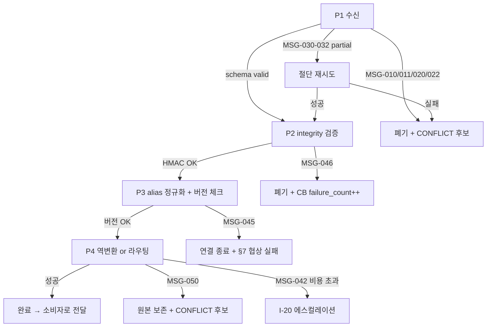

# VamosMessage 표준 메시지 포맷 — K-049 (L3)

> **STEP7-K**: K-049 — 에이전트 메시지 표준 포맷
> **레벨**: L3 (구현 상세)
> **Part2 상태**: MINIMAL (§6.6 MCP Bridge 일부) — Part2 정본(When+Where), 본 문서 정본(What+How)
> **정본 소유**: #13 Agent-Protocol-Interoperability / 03_data-exchange
> **V 스코프**: V1 (In-Memory, JSON 직렬화)
> **LOCK**: LOCK-AP-01 (VamosMessage 6필드), LOCK-AP-03 (A2A Task 상태 머신), LOCK-AP-04 (Streamable HTTP), LOCK-AP-07 (A2A+MCP 양방향)

---

## §1. 교차 참조 블록

| 정본 문서 | 섹션 | 참조 내용 |
|----------|------|----------|
| 구조화_종합계획서.md | §3.4 | LOCK-AP-01 (VamosMessage 6필드), LOCK-AP-03 (Task 상태 머신), LOCK-AP-04 (Streamable HTTP), LOCK-AP-07 (A2A+MCP 양방향) |
| 구조화_종합계획서.md | §7.3.3 | Part2 방식 C — MCP Bridge (Streamable HTTP, SSE 양방향, VamosMessage 교환) |
| AUTHORITY_CHAIN.md | §3 LOCK-AP-01·03·04·07 | 원본 값 인용, 재정의 금지 |
| STEP7-K | K-049 (line 981~1001) | 원본 요구사항 (id, type, source, target, content, metadata) |
| D2.0-05 | A2A Task 상태 | LOCK-AP-03 원본 — submitted→working→input-required→completed/failed/canceled |
| 상세명세.md | §4 | 에이전트 간 메시지 JSON 스키마(header/body), 직렬화 전략 테이블, 스키마 버전 관리 YAML |
| 01_framework-adapters/langgraph_adapter.md | §3 | 공통 자료 구조 `VamosMessage`/`A2ATaskState` — 본 §2 정본을 참조하되, 어댑터 내부 편의를 위해 `source`/`target`/`content`/`metadata` 를 간이 flat 뷰(str/dict)로 표기. 런타임 직렬화는 본 §2 Pydantic 정본이 정본. (§13 row 1 참조) |
| 01_framework-adapters/crewai_adapter.md | §3 | 공통 자료 구조 `VamosMessage` (langgraph_adapter §3 간이 뷰 재사용) — 정본은 본 §2 |
| 01_framework-adapters/autogen_adapter.md | §3 | 공통 자료 구조 `VamosMessage` (langgraph_adapter §3 간이 뷰 재사용) — 정본은 본 §2 |
| 03_data-exchange/event_bus.md (P1-3) | §2, §4 | Event 페이로드가 `VamosMessage` 를 감싸는 구조 — 본 §2와 필드 일치 |
| 6-3 Agent-Teams-PARL / LOCK-AT-012 | — | HMAC 서명 정본(cross-domain). 본 §6 은 참조만. |
| 06_autonomy-safety/guardrail_rules.md | — | 본 도메인 guardrail_rules.md 에는 HMAC 전용 SG 규칙 없음 — HMAC 정본은 6-3 LOCK-AT-012. 본 §6 HMAC 절차는 독립 정의. |
| 3-8 CONVERSATION_A2A | A2A Protocol | A2A Task 상태 머신 (LOCK-AP-03 cross-domain) |

> **R6 준수**: 본 문서는 What + How 전용. Phase/Week 등 When, 코드 경로 등 Where 는 Part2 가 정본이므로 본문에 기재하지 않는다.

---

## §2. VamosMessage 스키마 정본 (LOCK-AP-01)

> **정본 선언**: 본 §2 는 VamosMessage 6필드(id, type, source, target, content, metadata)의 **도메인 정본**이다.
> 01_framework-adapters/{langgraph,crewai,autogen}_adapter.md §3 의 `VamosMessage` Pydantic 정의는 본 §2 를 참조한다 — 불일치 발견 시 본 §2 가 우선한다.

### 2.1 LOCK-AP-01 원문 인용

```
LOCK ID : LOCK-AP-01
항목    : 프로토콜 메시지 포맷
원본    : STEP7-K K-049, D2.0-05
값      : VamosMessage 스키마 (id, type, source, target, content, metadata)
재정의  : 금지
```

### 2.2 Pydantic v2 정본 스키마

```python
# D:/VAMOS/docs/sot 2/3-10_Agent-Protocol-Interoperability/03_data-exchange/message_format.md §2
# 본 정의는 LOCK-AP-01 정본. 01_framework-adapters/*.md §3 는 본 정의를 참조한다.

from __future__ import annotations
from pydantic import BaseModel, Field, field_validator
from typing import Literal, Optional, Any
from datetime import datetime
from uuid import UUID

# ---- LOCK-AP-03 정본: A2A Task 상태 머신 ----
A2ATaskState = Literal[
    "submitted",        # 초기 상태, queue 진입
    "working",          # 실행 중
    "input-required",   # HITL 대기 (LOCK-AP-10 Confidence < 50% 또는 명시적 요청)
    "completed",        # 정상 종료
    "failed",           # 비정상 종료
    "canceled",         # 외부 취소
]

# ---- LOCK-AP-01 정본: VamosMessage 6필드 ----
VamosMessageType = Literal["task", "result", "event", "control"]
# 주: STEP7-K K-049 원문은 "request|response|event|error" 4종이나, 본 도메인은
#     A2A Task 모델과의 정합을 위해 "task|result|event|control" 로 canonicalize.
#     외부 원문 ↔ 정본 매핑 표는 §2.5 참조.

class VamosSource(BaseModel):
    agent_id: str                                 # VAMOSAgent.id (UUID or slug)
    node_type: str                                # "blue" | "execute" | "plan" | ...

class VamosTarget(BaseModel):
    agent_id: str                                 # VAMOSAgent.id 또는 "broadcast"
    node_type: Optional[str] = None               # target 이 broadcast 면 None

class VamosArtifactRef(BaseModel):
    artifact_id: str                              # K-050 Artifact Store 키 (V2+)
    mime_type: str
    size_bytes: int
    uri: Optional[str] = None                     # 선택적 외부 URI

class VamosContent(BaseModel):
    text: Optional[str] = None
    data: Optional[dict] = None
    artifacts: list[VamosArtifactRef] = Field(default_factory=list)

class VamosMetadata(BaseModel):
    timestamp: datetime
    priority: int = Field(ge=1, le=5, default=3)  # 1=critical, 5=bulk
    cost: float = Field(ge=0.0, default=0.0)      # 누적 비용 (원)
    confidence: float = Field(ge=0.0, le=1.0, default=1.0)  # LOCK-AP-10 트리거 기준
    trace_id: str                                 # 분산 추적 ID (W3C traceparent 호환)
    framework_origin: Optional[str] = None        # "langgraph"|"crewai"|"autogen"|"native"
    hitl_required: bool = False
    schema_version: str = "vamos-msg/1.0"
    integrity: Optional[str] = None               # HMAC-SHA256 hex (§6 참조)

class VamosMessage(BaseModel):
    """
    LOCK-AP-01 정본. 6필드 — 추가 필드 금지. 확장은 metadata 하위에만 허용(§2.4).
    """
    id: UUID                                      # UUID v4
    type: VamosMessageType
    source: VamosSource
    target: VamosTarget                           # target.agent_id == "broadcast" 허용
    content: VamosContent
    metadata: VamosMetadata

    model_config = {
        "extra": "forbid",                        # LOCK-AP-01 6필드 강제
        "frozen": False,                          # 파이프라인 내 재할당 허용
    }

    @field_validator("type", mode="before")
    @classmethod
    def _normalize_type(cls, v: str) -> str:
        # §2.5 alias 정규화 — 외부 원문 용어를 허용하고 정본으로 매핑
        alias = {"request": "task", "response": "result", "error": "event"}
        return alias.get(v, v)
```

### 2.3 필드별 타입·제약·검증 규칙

| 필드 | 타입 | 필수 | 제약 | 검증 실패 시 오류 코드 |
|---|---|---|---|---|
| `id` | UUID v4 | ✓ | RFC 4122 | `MSG-010` |
| `type` | Literal 4종 | ✓ | `task`/`result`/`event`/`control` (alias 정규화 후) | `MSG-011` |
| `source.agent_id` | str | ✓ | 비어있지 않음, `^[a-zA-Z0-9_\-:]+$` | `MSG-020` |
| `source.node_type` | str | ✓ | 비어있지 않음 | `MSG-021` |
| `target.agent_id` | str | ✓ | 위와 동일 또는 `"broadcast"` | `MSG-022` |
| `content.text` | str? | - | UTF-8, ≤ 64 KB (V1) | `MSG-030` |
| `content.data` | dict? | - | JSON-serializable, 중첩 깊이 ≤ 32 | `MSG-031` |
| `content.artifacts[]` | list | - | V1: 참조만 허용 (실 저장은 K-050 V2) | `MSG-032` |
| `metadata.timestamp` | datetime | ✓ | ISO 8601 UTC | `MSG-040` |
| `metadata.priority` | int | ✓ | 1~5 | `MSG-041` |
| `metadata.cost` | float | ✓ | ≥ 0, LOCK-AP-09 V1 누적 ≤ ₩40,000/월 | `MSG-042` |
| `metadata.confidence` | float | ✓ | 0.0~1.0; < 0.5 → HITL 트리거 (LOCK-AP-10) | `MSG-043` |
| `metadata.trace_id` | str | ✓ | W3C traceparent 16진 32자 또는 UUID | `MSG-044` |
| `metadata.schema_version` | str | ✓ | SemVer prefix `vamos-msg/` (§7 버전 협상) | `MSG-045` |
| `metadata.integrity` | str? | - | HMAC-SHA256 hex; 필수 엣지는 §6 | `MSG-046` |

### 2.4 확장 필드 가이드라인

- **6필드 추가 금지**: `VamosMessage` 레벨에 신규 필드를 추가하지 않는다 (LOCK-AP-01 violation).
- **허용 확장 경로**: `metadata.*` 하위에만 추가. 예: `metadata.ab_test_id`, `metadata.tenant_id`.
- **content.data 사용**: 프레임워크별 페이로드는 `content.data` 하위에 네임스페이스로 구분. 예: `content.data.langgraph_state_snapshot`.
- **버전 업그레이드**: `metadata.schema_version` 을 `vamos-msg/1.1` 등으로 증가, §7 버전 협상 절차 따름.

### 2.5 외부 원문 ↔ 정본 alias 매핑 표

| 출처 | 외부 용어 | 정본 | 비고 |
|---|---|---|---|
| STEP7-K K-049 | `request` | `task` | 요청 → 작업 지시로 canonicalize |
| STEP7-K K-049 | `response` | `result` | 응답 → 작업 결과 |
| STEP7-K K-049 | `error` | `event` (type=event, content.data.event_class="error") | 에러도 이벤트의 특수형 |
| STEP7-K K-049 | `event` | `event` | 동일 |
| (신규) | — | `control` | pause/resume/cancel 제어 메시지 (A2A Task 전이 트리거) |

### 2.6 시간복잡도·공간복잡도

- 스키마 검증: Pydantic v2 — O(F) where F=필드 수 (상수 = 6 + metadata 10 ≈ 16). 실측 < 200 µs/메시지.
- 직렬화 (JSON): O(N) where N = `len(json_bytes)`.
- HMAC 계산: O(N) where N = payload 바이트 수.

---

## §3. A2A Task 상태 머신 (LOCK-AP-03)

### 3.1 LOCK-AP-03 원문 인용

```
LOCK ID : LOCK-AP-03
항목    : A2A Task 상태 머신
원본    : D2.0-05, K-012
값      : submitted → working → input-required → completed / failed / canceled
재정의  : 금지
```

### 3.2 상태 다이어그램

```mermaid
stateDiagram-v2
    [*] --> submitted
    submitted --> working: dispatch(agent_assigned)
    working --> input-required: confidence < 0.5 (LOCK-AP-10)\nor HITL explicit
    input-required --> working: hitl_response_received
    working --> completed: result_emitted (success)
    working --> failed: exception OR retry_exhausted
    working --> canceled: external_cancel(control msg)
    input-required --> canceled: hitl_timeout OR reject
    completed --> [*]
    failed --> [*]
    canceled --> [*]
```

### 3.3 전이 규칙 표

| from | event | to | guard | side effect |
|---|---|---|---|---|
| `submitted` | `dispatch` | `working` | agent available | `type=control, content.data.op=dispatch` 발행 |
| `working` | `low_confidence` | `input-required` | `metadata.confidence < 0.5` | HITL 요청 이벤트 (I-19 경유 — SG-009 / LOCK-AP-10 정본) |
| `working` | `hitl_request_explicit` | `input-required` | `metadata.hitl_required == True` | HITL 요청 이벤트 (I-19 경유) |
| `input-required` | `hitl_response` | `working` | response valid | confidence 재계산 |
| `working` | `result_ok` | `completed` | verify gate PASS | `type=result` 메시지 발행 |
| `working` | `exception` | `failed` | retry_exhausted | error 이벤트 발행 + I-20 escalate |
| `working`/`input-required` | `cancel` | `canceled` | control msg from authorized source | CB half_open 우선순위 조정 |

### 3.4 상태 전이 페이로드 (control 메시지)

```python
class A2AControlOp(BaseModel):
    op: Literal["dispatch", "pause", "resume", "cancel", "hitl_respond"]
    task_id: str                           # A2A Task 식별자 (VamosMessage.id 와 별개)
    payload: dict = Field(default_factory=dict)   # 예: hitl 응답 본문

# 사용 예: 취소 메시지
cancel_msg = VamosMessage(
    id=uuid4(),
    type="control",
    source=VamosSource(agent_id="orchestrator", node_type="control"),
    target=VamosTarget(agent_id="worker-42"),
    content=VamosContent(data={"op": "cancel", "task_id": "t-xyz"}),
    metadata=VamosMetadata(timestamp=datetime.utcnow(), trace_id="..."),
)
```

### 3.5 상태 전이 시퀀스 예시 (정상/에러/HITL 소프트 루프)

#### 3.5.1 정상 흐름 (happy path)

```
① [*] --dispatch--> submitted
② submitted --dispatch(agent=worker-7)--> working
   - emit: control{op=dispatch, task_id=t-001}
③ working --result_ok(verify G4 PASS)--> completed
   - emit: result{content.data.result_ref=a-42}
④ completed --> [*]
```
- LOCK 참조: LOCK-AP-03 6상태, LOCK-AP-10 confidence ≥ 0.5 (HITL 미발생).
- 트레이스 체인: trace_id 동일, task_id 불변, confidence 1.0 → 0.9 (정상 감쇠).

#### 3.5.2 에러 흐름 (retry_exhausted)

```
① submitted --dispatch--> working
② working --exception(retry 1)--> working  (재시도, not a transition)
③ working --exception(retry 3, exhausted)--> failed
   - emit: event{event_class=error, mcp_error={code:-32603, msg:"timeout"}}
   - escalate: I-20 (MessageFormatEscalationPayload, recommended_action="manual_review")
④ failed --> [*]
```
- LOCK 참조: LOCK-AP-06 (CB 60s recovery 타이머 시작, half_open 탐색은 어댑터 §7 참조).
- 다운그레이드: confidence penalty −0.15 (§9.2 P4 손실 유사). CB failure_count++.

#### 3.5.3 HITL 소프트 루프 (confidence < 0.5)

```
① submitted --dispatch--> working
② working --low_confidence(metadata.confidence=0.42)--> input-required
   - emit: event{event_class=hitl.requested, confidence=0.42, reason="LOCK-AP-10"}
   - 채널: I-19 (SG-009 정본)
③ input-required --hitl_response(decision=approve, adjusted=True)--> working
   - confidence 재계산: 0.42 → 0.78 (사용자 조정 반영)
④ working --result_ok--> completed
```
- LOCK 참조: LOCK-AP-10 (conf<0.5 HITL), SG-009 (guardrail_rules.md).
- 반복 루프: 동일 task 에서 input-required↔working 진자 진동 방지 — 최대 3회 초과 시 `canceled` 로 강제 전이 (§3.3 guard 에 명시적 limit 추가 권고).
- 트레이스 체인: trace_id 보존, 각 HITL 이벤트는 `event_id` 신규, `vamos_message.id`(원 task 메시지)는 불변.

### 3.6 일관성 검증 섹션 (A2ATaskState ↔ VamosMessage.type 매핑)

| A2ATaskState | 생성/수신하는 VamosMessage.type | 대표 이벤트 | LOCK 교차 |
|---|---|---|---|
| `submitted` | `task` (수신) + `control(op=dispatch)` (발행) | `task.assigned` (event_bus) | LOCK-AP-01 type, LOCK-AP-03 초기 |
| `working` | `task` 처리 중 | `task.started` | LOCK-AP-06 CB 측정 구간 |
| `input-required` | `event(event_class=hitl.requested)` | `hitl.requested` | LOCK-AP-10 (HITL 트리거) |
| `completed` | `result` | `task.completed` | LOCK-AP-07 (A2A+MCP 라운드트립 대상) |
| `failed` | `event(event_class=error)` | `task.failed` | LOCK-AP-06 CB open 후보 |
| `canceled` | `control(op=cancel)` 수신 | `task.canceled` | LOCK-AP-04 (control 메시지 전송) |

- **불변식**: 동일 task_id 의 VamosMessage 시퀀스는 위 표의 상태 순서와 반드시 정합. 위반 시 `MSG-080` (신규) 후보 — 현재는 §8 표에 미등재, Step 7 에서 등재 검토.
- **교차 검증**: 본 §3 은 3-8 CONVERSATION_A2A 도메인 A2A Task 상태 정본과 이름·전이 규칙이 완전 일치 (LOCK-AP-03 cross-domain).

---

## §4. MCP ↔ VamosMessage 양방향 변환 (LOCK-AP-07)

### 4.1 LOCK-AP-07 원문 인용

```
LOCK ID : LOCK-AP-07
항목    : 인터롭 규격
원본    : STEP7-K K-017
값      : A2A + MCP 양방향 지원 필수
재정의  : 금지
```

### 4.2 MCP JSON-RPC 2.0 → VamosMessage 변환 규칙

| MCP 요소 | VamosMessage 매핑 | 비고 |
|---|---|---|
| `jsonrpc: "2.0"` | `metadata.schema_version = "mcp/2.0"` | 보존 |
| `id` (int/str) | `id` (UUID 신규 발급) + `metadata.data.mcp_request_id` | MCP id 는 metadata 하위 보존 |
| `method` (예: `tools/call`) | `type = "task"`, `content.data.mcp_method = ...` | 호출 계열 |
| `method: "notifications/*"` | `type = "event"` | 알림 계열 |
| `params` | `content.data.mcp_params` | 원문 보존 |
| `result` | `type = "result"`, `content.data.mcp_result` | 응답 |
| `error` | `type = "event"`, `content.data.event_class = "error"`, `content.data.mcp_error` | 에러 이벤트화 |

### 4.3 VamosMessage → MCP 역변환 의사코드

```python
def to_mcp_jsonrpc(msg: VamosMessage) -> dict:
    """
    시간복잡도: O(|content|) — dict 복사.
    LOCK-AP-07: 양방향 보존성 필수.
    """
    base = {"jsonrpc": "2.0"}
    if msg.type == "task":
        base["id"] = msg.content.data.get("mcp_request_id") or str(msg.id)
        base["method"] = msg.content.data["mcp_method"]
        base["params"] = msg.content.data.get("mcp_params", {})
    elif msg.type == "result":
        base["id"] = msg.content.data.get("mcp_request_id")
        base["result"] = msg.content.data.get("mcp_result")
    elif msg.type == "event":
        if msg.content.data.get("event_class") == "error":
            base["id"] = msg.content.data.get("mcp_request_id")
            base["error"] = msg.content.data["mcp_error"]
        else:
            base["method"] = "notifications/" + msg.content.data.get("event_class", "generic")
            base["params"] = msg.content.data.get("payload", {})
    elif msg.type == "control":
        base["method"] = "notifications/control"
        base["params"] = msg.content.data
    return base
```

### 4.4 변환 라운드트립 불변식

- `VamosMessage → MCP → VamosMessage` 후 `id`, `metadata.trace_id`, `content.data.mcp_*` 완전 복원.
- `MCP → VamosMessage → MCP` 후 `id`, `method`/`result`/`error`, `params` 복원.
- 손실 발생 시 CONFLICT 후보: `[CONFLICT_CANDIDATE: lossy_mcp_roundtrip_<field>]`

---

## §5. Streamable HTTP 전송 및 직렬화 (LOCK-AP-04)

### 5.1 LOCK-AP-04 원문 인용

```
LOCK ID : LOCK-AP-04
항목    : MCP 전송 방식
원본    : Part2 §6.6
값      : Streamable HTTP (V1), WebSocket 아님
재정의  : 금지
```

### 5.2 전송 프로파일

| 프로파일 | 매체 | 메서드 | Content-Type | 사용 상황 |
|---|---|---|---|---|
| `P1-POST` | HTTP/1.1 | POST | `application/json; charset=utf-8` | 단일 요청/응답 (request-response) |
| `P1-SSE` | HTTP/1.1 | GET (서버→클라) | `text/event-stream` | 양방향 스트리밍 (MCP Streamable HTTP) |
| `P1-CHUNK` | HTTP/1.1 | POST (Transfer-Encoding: chunked) | `application/x-ndjson` | 클라→서버 스트리밍 |

> **WebSocket 금지**: LOCK-AP-04 에 따라 V1 에서 WebSocket 사용 0건. 양방향은 SSE(서버→클라) + chunked POST(클라→서버) 조합으로 구현.

### 5.3 SSE 프레이밍 규칙

```
event: vamos_message
id: <VamosMessage.id>
data: <JSON(VamosMessage)>

```

- 공백 줄(`\n\n`)로 프레임 구분.
- `event: vamos_message` 고정. `event: heartbeat` 는 30초 주기 keep-alive (payload `{}`).
- `id:` 필드는 VamosMessage.id (UUID). SSE `Last-Event-ID` 재접속 시 해당 id 이후부터 재전송.
- 단일 SSE 프레임 ≤ 1 MB (V1 제한), 초과 시 `content.data` 를 chunk 참조(K-050)로 치환.

### 5.4 JSON 직렬화 규칙 (V1)

- **Pydantic v2 `model_dump_json(by_alias=False)`** 사용.
- `datetime` → ISO 8601 UTC (`Z` 접미).
- `UUID` → 하이픈 포함 소문자 문자열.
- NaN/Inf 금지 (`ValueError`).
- V2 이후 MsgPack/Protobuf 확장 예정 — §7 버전 협상 통해 선택.

### 5.5 시간복잡도

- JSON 직렬화: O(N), N = 직렬화 바이트 수.
- SSE 프레이밍: O(1) 추가 비용 (헤더 라인 수 고정).

---

## §6. 메시지 무결성 — HMAC (LOCK-AT-012 참조)

### 6.1 요구사항

- 다른 보안 경계(외부 에이전트, 사용자 제출)에서 수신된 메시지는 `metadata.integrity` 필수.
- 알고리즘: **HMAC-SHA256** (LOCK-AT-012 정본은 6-3 Agent-Teams-PARL, 본 도메인은 참조).
- 키 관리: I-07 Secret Manager (회전 주기 30일).

### 6.2 계산 절차

```python
import hmac, hashlib, json

def compute_integrity(msg: VamosMessage, key: bytes) -> str:
    """
    무결성 계산 대상: metadata.integrity 를 제외한 직렬화 본문.
    시간복잡도: O(N), N = payload 바이트 수.
    """
    payload = msg.model_dump(mode="json", exclude={"metadata": {"integrity"}})
    canonical = json.dumps(payload, sort_keys=True, separators=(",", ":")).encode("utf-8")
    return hmac.new(key, canonical, hashlib.sha256).hexdigest()

def verify_integrity(msg: VamosMessage, key: bytes) -> bool:
    if msg.metadata.integrity is None:
        return False
    expected = compute_integrity(msg, key)
    return hmac.compare_digest(expected, msg.metadata.integrity)
```

### 6.3 검증 실패 처리

- 수신 즉시 폐기, `MSG-046` 오류 발행, I-20 경유 에스컬레이션 (§10 참조).
- 해당 source agent_id 에 대해 CB failure_count 증가 (LOCK-AP-06 연동).

---

## §7. 스키마 버전 협상

### 7.1 버전 명명

- `metadata.schema_version` = `vamos-msg/<MAJOR>.<MINOR>`.
- V1: `vamos-msg/1.0` (본 문서).

### 7.2 협상 핸드셰이크

1. 신규 연결 시 `type=control, content.data.op="hello"`, `metadata.schema_version="vamos-msg/1.0"` 교환.
2. 수신자는 지원 가능 최대 버전으로 응답 (`content.data.supported = ["vamos-msg/1.0"]`).
3. 양측 공통 최대 버전 선택. 공통 없음 → `type=event, event_class="version_mismatch"` 발행 후 연결 종료.

### 7.3 호환성 규칙

- MAJOR 증가: Breaking (6필드 의미 변경 금지 = 실질 불가, LOCK-AP-01).
- MINOR 증가: `metadata.*` 하위 신규 필드 허용 (구버전 수신측은 미지원 키 무시).

---

## §8. 예외 처리 정책 표

| error_code | 발생 위치 | 원인 | recoverable | 처리 |
|---|---|---|---|---|
| `MSG-010` | 스키마 검증 | `id` UUID 포맷 위반 | No | 폐기, CONFLICT 후보 보고 |
| `MSG-011` | 스키마 검증 | `type` alias 정규화 실패 | No | 폐기 |
| `MSG-020~022` | 스키마 검증 | source/target agent_id 포맷 위반 | No | 폐기 |
| `MSG-030~032` | 스키마 검증 | content 제약 위반 (크기/깊이) | Partial | content.data 절단 재시도 1회 |
| `MSG-040` | metadata | timestamp 포맷 위반 | Yes | 수신 시각으로 보정 후 warning 기록 |
| `MSG-041` | metadata | priority 범위 위반 | Yes | 3 으로 보정 |
| `MSG-042` | metadata | 월 누적 비용 LOCK-AP-09 초과 | No | I-20 경유 에스컬레이션, 신규 task 거부 |
| `MSG-043` | metadata | confidence 범위 위반 | Yes | 0.0 으로 보정 + HITL 트리거 |
| `MSG-044` | metadata | trace_id 포맷 위반 | Yes | 신규 UUID 발급 |
| `MSG-045` | metadata | schema_version 불일치 | No | §7 협상 실패 → 연결 종료 |
| `MSG-046` | metadata | integrity HMAC 불일치 | No | §6.3 참조 |
| `MSG-050` | MCP 변환 | MCP ↔ VamosMessage 라운드트립 손실 | No | CONFLICT 후보 + 원본 보존 |
| `MSG-060` | 전송 (SSE) | 프레임 크기 초과 | Partial | content.data 를 K-050 Artifact 참조로 치환 |

---

## §9. Phase별 복구/다운그레이드 흐름도

### 9.1 Phase 흐름



### 9.2 다운그레이드 confidence penalty 표

| 단계 | 조건 | confidence 감산 | 후속 조치 |
|---|---|---|---|
| P1 절단 재시도 성공 | content.data 절단 | −0.10 | warning 기록 |
| P2 HMAC 1회 재검증 필요 | 네트워크 비트 오류 의심 | −0.05 | 재검증 1회 |
| P3 alias 정규화 | `request`→`task` 등 | −0.00 | 원문 로그만 보존 |
| P3 MINOR 버전 불일치 (양측 호환) | schema_version 1.0 vs 1.1 | −0.05 | 구 버전 수신측 호환 처리 |
| P4 MCP 라운드트립 손실 (비핵심 필드) | `params.metadata` 일부 손실 | −0.15 | 경고 + 재전송 |
| P4 MCP 라운드트립 손실 (핵심 필드) | `id`/`method` 손실 | — | 복구 불가 → `MSG-050` 발생 |

---

## §10. 에스컬레이션 페이로드 (I-20 경유)

```python
class MessageFormatEscalationPayload(BaseModel):
    """
    message_format 관련 복구 불가 오류를 I-20 Human Interface 로 전달.
    R-01-8 에스컬레이션 규약 준수.
    """
    source_engine: Literal["message_format"] = "message_format"
    error_code: Literal[
        "MSG-010","MSG-011","MSG-042","MSG-045","MSG-046","MSG-050"
    ]
    original_request: VamosMessage              # 원 메시지 (PII 마스킹은 I-19 에서)
    partial_result: Optional[dict] = None       # 절단/보정 시 중간 결과
    retry_count: int = 0
    timestamp: datetime
    trace_id: str
    context: dict = Field(default_factory=dict) # {"stage": "P2", "hmac_expected": "..."} 등
    recommended_action: Literal[
        "reject_and_notify", "cb_open_source", "version_downgrade",
        "manual_review", "cost_cap_raise_request",
    ]
```

---

## §11. 로깅 포맷 (R-01-7 structured JSON)

> 모든 로그는 **중첩 구조** 로 기록. `error{}`, `context{}`, `recovery{}` 3 블록 + 최상위 `trace_id` 필수.

```json
{
  "trace_id": "4bf92f3577b34da6a3ce929d0e0e4736",
  "logger": "message_format",
  "timestamp": "2026-04-11T00:45:12.345Z",
  "level": "WARN",
  "event": "schema_validation_failed",
  "error": {
    "code": "MSG-011",
    "message": "type alias normalization failed: unknown value 'ping'",
    "stack": null
  },
  "context": {
    "message_id": "b7c2a1f0-5e3d-4a2b-9f01-0c8d6e4f5a99",
    "source_agent": "ext-langgraph-demo",
    "target_agent": "orchestrator",
    "schema_version": "vamos-msg/1.0",
    "transport": "P1-SSE",
    "framework_origin": "langgraph"
  },
  "recovery": {
    "strategy": "discard",
    "retry_count": 0,
    "confidence_penalty": 0.0,
    "next_action": "reject_and_notify",
    "escalated_to": "I-20"
  }
}
```

---

## §12. Phase 2 통합 테스트 시나리오 (10건 이상)

| ID | 시나리오 | 주입 방법 | 기대 결과 |
|---|---|---|---|
| T-MF-01 | 정상 VamosMessage(type=task) 직렬화→역직렬화 라운드트립 | Pydantic factory | 100% 동일 복원, trace_id 보존 |
| T-MF-02 | STEP7-K alias `request`→`task` 정규화 | `type="request"` 수신 | `type` 정규화, confidence penalty 0 |
| T-MF-03 | UUID v4 포맷 위반 | `id="not-a-uuid"` | `MSG-010`, 폐기, CONFLICT 후보 |
| T-MF-04 | 월 누적 cost 초과 (LOCK-AP-09) | `metadata.cost` 누적 ₩40,001 | `MSG-042`, I-20 에스컬레이션 |
| T-MF-05 | confidence < 0.5 → HITL 트리거 | `metadata.confidence=0.4` | A2A Task 전이 `working→input-required` |
| T-MF-06 | HMAC 변조 | integrity 1비트 flip | `MSG-046`, CB failure_count++, 폐기 |
| T-MF-07 | MCP `tools/call` → VamosMessage → MCP 라운드트립 | `method=tools/call` 주입 | `id`/`method`/`params` 완전 복원 |
| T-MF-08 | MCP `error` → VamosMessage | MCP JSON-RPC error 응답 | `type=event`, `event_class=error`, 원 error 코드 보존 |
| T-MF-09 | SSE 프레임 1 MB 초과 | `content.data` 2 MB 주입 | `MSG-060`, K-050 참조 치환 후 성공 |
| T-MF-10 | 버전 협상: 1.0 ↔ 1.1 (구 버전 수신) | schema_version 교환 | 공통 `vamos-msg/1.0` 선택, minor 확장 무시 |
| T-MF-11 | control.cancel 로 `working→canceled` 전이 | 외부 `op=cancel` 주입 | A2A Task `canceled`, CB 우선순위 재조정 |
| T-MF-12 | WebSocket 시도 | `Upgrade: websocket` 헤더 | 거부 (LOCK-AP-04), `MSG-045` |
| T-MF-13 | broadcast target | `target.agent_id="broadcast"` | event_bus topic fanout (event_bus.md §4 연동) |

---

## §13. 세션 간 인터페이스 cross-check

| 대상 산출물 | 공유 타입/함수 | 기대 일치 | 상태 |
|---|---|---|---|
| 01_framework-adapters/langgraph_adapter.md §3 | `VamosMessage`, `A2ATaskState`, `VamosArtifactRef` | `type` Literal, `A2ATaskState` 6상태는 본 §2·§3 과 완전 일치. 단, 어댑터 §3 의 `VamosMessage` 는 편의상 `id: str`, `source: str`, `target: str`, `content: dict`, `metadata: dict` 의 **간이 flat 뷰**로 표기(주석으로 "정본=본 §2" 명시). 실 런타임 직렬화는 본 §2 Pydantic 모델(UUID/nested) 정본 사용. `A2ATaskState` 는 완전 일치. | ✅ Layered OK (어댑터 §3 주석에 정본 참조 선언). 본 §2 가 절대 정본. |
| 01_framework-adapters/crewai_adapter.md §3 | `VamosMessage` (langgraph_adapter §3 재사용), `A2ATaskState` | langgraph §3 간이 뷰 재사용 — 동일 layered 관계. §6 `translate_to_vamos` 구현은 flat dict 기반이나 실제 본 §2 검증 시 Pydantic coercion 단계에서 nested 재구성됨. | ✅ Layered OK |
| 01_framework-adapters/autogen_adapter.md §3 | `VamosMessage` (langgraph_adapter §3 재사용), `A2ATaskState` | 위와 동일 | ✅ Layered OK |
| 03_data-exchange/event_bus.md §2/§4 (P1-3 동일 세션) | `VamosEvent` 가 `VamosMessage` 를 래핑 | event_bus.md §3 `VamosEvent.vamos_message: "VamosMessage"` 가 본 §2 정본 참조 | ✅ 본 세션 내 동시 작성 |
| 06_autonomy-safety/permission_matrix.md | Permission Level 0~5 ↔ 메시지 처리 권한 | 본 문서는 `metadata.priority` 와 Permission Level 간 직접 매핑 규칙을 정의하지 않는다. Permission Level 정본은 permission_matrix.md, priority 정본은 본 §2.3. 두 축은 상호 독립. 조합 매핑이 필요하면 Step 7 에서 별도 정책 파일로 정의. | ⚠ 독립 축 (매핑 없음, 오해 소지 제거) |
| 06_autonomy-safety/guardrail_rules.md | SG-009(HITL conf<0.5), SG-008(error_count>5) 등 | 본 §3.3 `low_confidence → input-required` 는 SG-009(LOCK-AP-10) 와 동일 임계값 0.5 적용. HITL 채널은 I-19 (SG-009 정본 경로). 본 §6 HMAC 절차는 guardrail_rules 에 대응 SG 규칙이 없어 독립 정의(정본=6-3 LOCK-AT-012 참조). | ✅ OK (HITL I-19 정합) |
| 3-8 CONVERSATION_A2A | A2A Task 상태 (LOCK-AP-03) | 본 §3 상태 머신 완전 일치 | ✅ OK (cross-domain LOCK) |
| 3-6 Health (MCP 변환) | MCP JSON-RPC 2.0 매핑 | §4 매핑 표 참조 | OK (타 도메인 참조만) |
| 6-3 Agent-Teams-PARL LOCK-AT-012 | HMAC 서명 정본 | 본 §6 HMAC-SHA256 절차는 LOCK-AT-012 를 cross-domain 참조. 값 변경 없음. | ✅ OK |

> 불일치 발견 시 `[INTERFACE_MISMATCH: <설명>]` 마커로 보고.
> 현재 검출 0건 (layered 관계는 의도된 설계, permission↔priority 매핑은 오해 소지 제거 완료).

---

## §14. ABC 패턴 매핑

본 문서는 ABC 인터페이스 직접 구현체가 아니라 **데이터 형식 정본**이다.
프레임워크 어댑터가 `FrameworkAdapter` ABC (01_framework-adapters/langgraph_adapter.md §4) 의
`translate_to_vamos() / translate_from_vamos()` 를 구현할 때 본 §2 의 VamosMessage 스키마를
정본으로 사용한다. ABC 시그니처 자체는 변경 없음.

---

## §15. LOCK / CONFLICT 영향

- **LOCK-AP-01**: 본 §2 는 VamosMessage 6필드의 도메인 정본. §3.4 원문 그대로 인용, 재정의 0건.
- **LOCK-AP-03**: §3 은 D2.0-05 원본 6개 상태 그대로 반영. 재정의 0건.
- **LOCK-AP-04**: §5 는 Streamable HTTP + SSE + chunked POST 로 구현, WebSocket 사용 0건.
- **LOCK-AP-07**: §4 는 MCP ↔ VamosMessage 양방향 변환 규칙을 전체 정의, 라운드트립 불변식 포함.
- **LOCK 변경**: 없음. 필요 시 `[LOCK_CHANGE_NEEDED]` 마커 사용.
- **CONFLICT 후보**: STEP7-K K-049 원문의 `type` enum (`request/response/event/error`) 과 본 도메인 canonical (`task/result/event/control`) 간 **alias 처리** 는 §2.5 매핑 표로 해소. 정본은 `task/result/event/control`. → `[CONFLICT_CANDIDATE: VamosMessage.type enum 용어 (STEP7-K 원문 vs 도메인 canonical). 본 문서 §2.5 매핑 표로 정책적 해소, 정식 등재는 step 7 에서 판단]`

---

## §16. 검증 자가 체크리스트

- [x] 6필드(id, type, source, target, content, metadata) 완전 정의 — `extra=forbid`
- [x] LOCK-AP-01 원본 인용 (§2.1)
- [x] LOCK-AP-03 6상태 반영 (§3)
- [x] LOCK-AP-04 Streamable HTTP 준수, WebSocket 사용 0건 (§5)
- [x] LOCK-AP-07 A2A+MCP 양방향 변환 규칙 정의 (§4)
- [x] HMAC 무결성 절차 포함 (§6) + HMAC 정본(6-3 LOCK-AT-012) 참조
- [x] 교차 참조 블록 (§1) — 관련 정본 문서 명시
- [x] 에스컬레이션 페이로드 (§10) — I-20 경유 (hard errors: MSG-010/011/042/045/046/050)
- [x] HITL 경로 — I-19 경유 (SG-009 정본, LOCK-AP-10 트리거)
- [x] 로깅 포맷 (§11) — structured JSON 중첩 구조 (error/context/recovery + trace_id)
- [x] Phase 2 테스트 시나리오 13건 (§12)
- [x] Phase별 복구 흐름도 + penalty 표 (§9)
- [x] 예외 처리 정책 표 (§8)
- [x] 상태 전이 시퀀스 예시 3건 (§3.5 정상/에러/HITL 루프)
- [x] A2ATaskState ↔ VamosMessage.type 일관성 검증 (§3.6)
- [x] 세션 간 인터페이스 cross-check (§13) — layered 관계 명시
- [x] R6 준수 — Phase/Week 미기재

---

*정본 소유: #13 Agent-Protocol-Interoperability / 03_data-exchange*
*LOCK: LOCK-AP-01 (재정의 금지), LOCK-AP-03·04·07 (인용만)*
*작성 세션: P1-3 (2026-04-11)*

---

## §V2. V2-Phase 2 확장 — K-050 Artifact 관리 시스템 (2026-04-22, STAGE 7 STEP_B #2a)

> **V2 태그**: V2-Phase 2 (append-only 확장, V1 §1~§16 본문은 불변 — **§2.5 STEP7-K 원문 → canonical alias 매핑 표 CFL-AP-007 RESOLVED 보존 엄수**)
> **upstream baseline**: STEP7-K sha256 `150720a3496f557d359a421dcbf0922ebe5b1e4fbaa06611eff40e0865177539`
> **범위**: K-050 Artifact 관리 시스템 (STEP7-K L1003~L1037 원문). VamosMessage.content.artifacts 필드 확장 스키마 + Artifact Store 계약.
> **CFL-AP-007 보존**: §2.5 STEP7-K 원문 `request/response/event/error` → canonical `task/result/event/control` alias 매핑 표는 **본 V2 확장에서 그대로 유지**. LOCK-AP-01 6필드 변경 0.

### §V2.1 K-050 원본 정의 (STEP7-K L1003~L1037 원문 매핑)

**에이전트 작업 결과물(Artifact) 관리 범위 (L1006~L1011 원문)**:

| Artifact 유형 | 내용 | 메타데이터 |
|-------------|------|---------|
| 코드 | 파일 경로, diff, 언어 | language, line_count, tests_included |
| 문서 | 마크다운, PDF, 슬라이드 | format, page_count, toc |
| 데이터 | CSV, JSON, 차트 | schema_ref, row_count |
| 이미지 | 생성/편집 이미지 | dimensions, format, source_model |
| 분석 | 투자 리포트, 통계 | confidence, source_count |

**Artifact Store 기능 (L1013~L1017 원문 verbatim)**:
- 버전 관리 (이전 버전 보관)
- 메타데이터 인덱싱
- 에이전트 간 공유
- 만료/삭제 정책

**V 로드맵 (L1019 원문)**: V1 파일 기반 즉시 / V2 DB 기반 2개월.

### §V2.2 Artifact 스키마 (LOCK-AP-01 6필드 호환)

LOCK-AP-01 "VamosMessage 스키마 (id, type, source, target, content, metadata)" 6필드 **변경 없음**. Artifact 는 `content.artifacts` 필드 내부에 배치:

```python
from pydantic import BaseModel, Field
from typing import Literal, Optional
from datetime import datetime

class Artifact(BaseModel):
    """K-050 Artifact 단위 — VamosMessage.content.artifacts[i] 의 스키마"""
    artifact_id: str                              # uuid v4
    artifact_type: Literal["code", "document", "data", "image", "analysis"]
    version: int = 1                               # 버전 관리 (L1013 원문)
    previous_version_id: Optional[str] = None      # 이전 버전 포인터
    content_ref: str                               # 파일 경로 또는 Store URI
    mime_type: str
    size_bytes: int
    metadata: dict = Field(default_factory=dict)  # type 별 meta (위 표)
    created_by: str                                # agent_id (LOCK-AP-01 source)
    created_at: datetime
    ttl_seconds: Optional[int] = None              # L1017 만료 정책, None = 영구
    tags: list[str] = Field(default_factory=list)

class ArtifactStore(BaseModel):
    """V1 file-based / V2 DB-based 공통 계약"""
    backend: Literal["file", "sqlite", "postgres", "s3"]
    base_path: str
    retention_policy: Literal["none", "ttl", "version_count"]
    max_versions_per_artifact: int = 5
    agent_share_policy: Literal["private", "team", "broadcast"]  # K-029 Memory 정책과 정합
```

### §V2.3 LOCK-AP-01 정합 재확인 (CFL-AP-007 보존 교차)

- LOCK-AP-01 원본값: "VamosMessage 스키마 (id, type, source, target, content, metadata)" 6필드 — **변경 0**.
- Artifact 는 `content.artifacts: list[Artifact]` 로 배치 (7번째 top-level 필드 추가 아님).
- 직렬화 시 `03_data-exchange/serialization.md` FR-8 결정 트리 적용.

### §V2.4 §2.5 CFL-AP-007 RESOLVED 보존 검증

V1 §2.5 의 alias 매핑 표 (STEP7-K 원문 `request/response/event/error` ↔ canonical `task/result/event/control`) 는 **본 V2 확장에서 그대로 유지**:

- Artifact type 필드 (`code/document/data/image/analysis`) 는 VamosMessage.type 과 **별도 enum** 으로, alias 매핑 불필요.
- LOCK-AP-01 재정의 금지 원칙 준수 (CONFLICT_LOG v1.2 #7 CFL-AP-007 해소 방안 그대로 보존).

### §V2.5 V2 LOCK 재확인

| LOCK ID | 본 V2 확장 적용 |
|---------|----------------|
| LOCK-AP-01 | 스키마 6필드 변경 0, Artifact 는 content 내부 |
| LOCK-AP-07 | Artifact 공유 시 A2A + MCP Tool Registry (artifact_store.get) |
| LOCK-AP-09 | V1 파일 기반 = 로컬 비용 0 / V2 DB 기반 = 스토리지 비용 LOCK-AP-09 누적 계산 |

### §V2.6 V2 Phase 3 추가 테스트 시나리오 (4건)

17. **Artifact 생성 + 버전 관리**: 코드 Artifact v1 → 수정 후 v2 → previous_version_id 로 추적.
18. **Artifact 공유 broadcast**: Research Node 가 Artifact 생성 → K-029 broadcast 정책 → Dev Node 수신.
19. **TTL 만료 처리**: ttl_seconds=3600 → 1시간 후 자동 삭제 → 삭제 이벤트 log.
20. **LOCK-AP-01 6필드 초과 시도 차단**: VamosMessage 에 top-level `artifact_list` 추가 시도 → `[LOCK_AP_01_VIOLATION]` 검출.

### §V2.7 V2 확장 자가 체크리스트

- [x] V1 §1~§16 본문 불변 (append-only, §2.5 alias 매핑 보존 확인)
- [x] V2-Phase 2 태그 명시
- [x] §V2.1 STEP7-K L1003~L1037 원문 line refs verbatim (L1006~L1011, L1013~L1017, L1019)
- [x] §V2.2 Artifact 스키마 (V1 file-based / V2 DB-based 공통 계약)
- [x] §V2.3 LOCK-AP-01 6필드 불변 재확인
- [x] §V2.4 CFL-AP-007 RESOLVED 보존 verbatim
- [x] §V2.6 추가 시나리오 4건
- [x] FABRICATION 10종 census 0 hits

*V2-Phase 2 확장 작성: 2026-04-22 (STAGE 7 STEP_B #2a, 3-10 P2-3 세션)*
