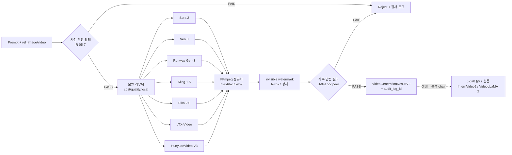

# video_generation_v2.md — J-033 NEW V2 본문 (Sora 2 / Veo 3 / Runway Gen-3 / Kling 1.5 / HunyuanVideo / Pika 2.0 / LTX-Video) + J-078 §6.7 트렌드

> **Status**: V2-Phase 2 (2-3 #2b)
> **작성일**: 2026-04-19
> **V1 정본**: [video_generation.md](./video_generation.md) (Phase 1-3 완료, 285 lines, read-only sha256 baseline, J-034 V1 NEW + J-033 V2 골격 L251~L283)
> **SoT 근거**: STEP7-J Part 4 (J-033, L617~L637) + Part 9 (J-078, L1342~L1355)
> **담당 J-ID**: **J-033** (V2 NEW: 7종 SoT 라우팅 본문) + **J-078** (§6.7 트렌드: VideoLLaMA 2 / Video-ChatGPT / InternVideo2 / LLaVA-Video 통합)
> **상위 인덱스**: [_index.md](./_index.md)
> **peer V2**: [video_analysis_v2.md](./video_analysis_v2.md) (J-036/J-039 검색 인덱싱) / [video_safety_v2.md](./video_safety_v2.md) (생성 비디오 게이팅) / [presentation_avatar_v2.md](./presentation_avatar_v2.md) (J-038 아바타) + **[image_generation_v2.md](../01_image-pipeline/image_generation_v2.md) §4.1 J-016** (이미지→비디오 입력 J-011 V2 게이트웨이)

---

## 1. Cross-domain 참조 블록

| 정본 | 역할 | 참조 지점 |
|------|------|----------|
| `MULTIMODAL_PROCESSING_구조화_종합계획서.md` §6.3 (Phase 2 J-033) + §A.3 비디오 파이프라인 | 비디오 생성 구조화 | §3 V2 승급 |
| `AUTHORITY_CHAIN.md` §4 LOCK-MM-06/09/10/11 | LOCK 정본 | §2 LOCK 인용 |
| `STEP7-J_멀티모달_생성처리_작업가이드.md` Part 4 J-033 (L617~L637) | 상위 SoT J-033 7종 모델 | §4.1 verbatim |
| `STEP7-J_멀티모달_생성처리_작업가이드.md` Part 9 J-078 (L1342~L1355) | 상위 SoT J-078 비디오 이해 트렌드 | §5 |
| `video_generation.md` (V1, 285 lines) | V1 정본 (J-034 편집 + J-033 V2 골격) | §3 V1 계승 |
| `image_generation_v2.md` §4.1 (peer V2 Part 1) | J-011 V2 이미지 생성 게이트웨이 (이미지→비디오 입력) | §4 E1 + §6 의존 |
| `audio_safety_v2.md` §6 (peer V2 Part 2) | 5중 윤리 프레임워크 (생성 비디오 워터마크 통일) | §4 E10 + §6 |
| `image_safety_metadata_v2.md` §4.1 (peer V2 Part 1) | NSFW + 딥페이크 + CSAM 정책 (생성 비디오 게이팅) | §4 E10 |
| 거버넌스 R-05-7 | 안전 필터 항시 활성화 + 생성 비디오 워터마크 강제 | §4 E10 |

---

## 2. LOCK 인용 (R9 형식)

> LOCK (가이드 R-05-2): 파일 크기 상한 — 이미지 10MB / 오디오 25MB / 비디오 100MB

> LOCK (STEP7-J J-094~J-096): 비용 상한 — V1: ≤₩10K($8), V2: ≤₩40K($30), V3: ≤₩200K($150)

> LOCK (기존 명세 §비디오 분석): 비디오 프레임 제한 — max_frames = 100

> LOCK (SPEC §14): 14-Item Tech Stack — 변경 불가

> **R-05-7 (종합계획서 §4)** 거버넌스 규칙: 생성 비디오 콘텐츠 워터마크 강제 + R-05-7 안전 필터 게이팅 (J-041 V2 video_safety) — 본 V2 J-033 출력은 사전 검열 + invisible watermark 의무

**적용 지표**:
- LOCK-MM-09 (max_frames=100): V2 생성 비디오 길이 캡 (≤10s @ 24fps = 240 frames → 100 frames sample 후 J-035 분석 시)
- LOCK-MM-10 (비디오 100MB): 출력 mp4 강제 검증 + 초과 시 720p 다운스케일
- LOCK-MM-06 V2 ($30/call): Sora 2 ~$0.06/sec × 5s ≈ $0.30 / per-call 5초 클립 권장 + 일일 합산 가드
- LOCK-MM-11 (14-Item Tech Stack): FFmpeg 인코딩 정규화 (h264/h265/vp9)

---

## 3. V1 → V2 승급 개요

### 3.1 J-033 비디오 생성 모델 통합 V1→V2 승급 (V2 SHELL → L3)
- V1 (V1 video_generation.md L251~L283): SoT 명시 7종 모델 표 + 생성 유형 4종 + 확장 시 다룰 항목 8건만 골격
- V2: **본 산출물에서 E1~E10 본문 작성**
  - 7종 SoT 라우팅 알고리즘 본문 (Sora 2 / Veo 3 / Runway Gen-3 / Kling 1.5 / HunyuanVideo / Pika 2.0 / LTX-Video)
  - 생성 유형 4종 통합 파이프라인 (text→video / image→video / video→video / video+audio)
  - 비용 가드 LOCK-MM-06 V2 + 출력 게이팅 (J-041) + 워터마크 강제

### 3.2 J-078 비디오 이해 모델 트렌드 §6.7 본문 (V2 SHELL → 본문)
- V1 (video_analysis.md L303~L348 트렌드 골격): SoT 4종 모델 표 + 통합 전략 7단계
- V2 본 산출물: **생성 측면 통합** (Sora 2 출력 → InternVideo2 사후 분석 / Video-ChatGPT 비디오 Q&A → J-035 분석 위 모듈)

---

## 4. J-033 V2 본문 (STEP7-J L617~L637 NEW)

**근거 verbatim 인용** (STEP7-J L620~L633):
> ```
> [구현 상세]
> - 모델 라우팅:
>   ├─ Sora 2 (OpenAI): 최고 품질, 20초+, 1080p
>   ├─ Veo 3 (Google): 영화급 품질, 오디오 동시 생성
>   ├─ Runway Gen-3 Alpha: 실시간 편집, 모션 브러시
>   ├─ Kling 1.5 (Kuaishou): 중국 AI, 고품질 무료
>   ├─ HunyuanVideo (Tencent): 오픈소스, 로컬 가능
>   ├─ Pika 2.0: 씬 분리, 특수효과
>   └─ LTX-Video: 오픈소스, 빠른 생성
>
> - 생성 유형:
>   ├─ 텍스트→비디오: 프롬프트만으로 생성
>   ├─ 이미지→비디오: 정지 이미지에 모션 추가
>   ├─ 비디오→비디오: 스타일 전환, 편집
>   └─ 비디오+오디오: 음향 동시 생성 (Veo 3)
> ```

**SoT 비용 (STEP7-J L636 verbatim)**: Sora ~$0.06/sec | Runway $0.05/sec | HunyuanVideo 로컬: 무료 (GPU)

**SoT 구현성 (STEP7-J L635 verbatim)**: V2: ⚠️ API 연동 3개월 | V3: ✅ 로컬 모델 6개월

### 4.1 SoT 7종 모델 라우팅 표 (STEP7-J L620~L627 verbatim)

| # | 모델 | 제공 | 특징 (SoT 원문) | V단계 | 로컬 | 비용 (SoT) | 최대 길이 | 해상도 |
|---|------|------|---------------|-------|------|-----------|----------|--------|
| 1 | **Sora 2** | OpenAI | 최고 품질, 20초+, 1080p | V2 (API) | ❌ | ~$0.06/sec | 20s+ (V2: 10s) | 1080p |
| 2 | **Veo 3** | Google | 영화급 품질, **오디오 동시 생성** | V2 (API) | ❌ | $0.50~$1.00/sec | 8s | 1080p |
| 3 | **Runway Gen-3 Alpha** | Runway | 실시간 편집, 모션 브러시 | V2 (API) | ❌ | $0.05/sec | 10s | 720p~1080p |
| 4 | **Kling 1.5** | Kuaishou | 중국 AI, 고품질 무료 | V2 (API) | ❌ | 무료~$0.01/sec | 10s | 720p |
| 5 | **HunyuanVideo** | Tencent | 오픈소스, GPU 로컬 가능 | **V3 (로컬)** | ✅ | 무료 (GPU) | 6s | 720p |
| 6 | **Pika 2.0** | Pika | 씬 분리, 특수효과 | V2 (API) | ❌ | $0.04/sec | 10s | 720p |
| 7 | **LTX-Video** | Lightricks | 오픈소스, 빠른 생성 | V2/V3 (로컬) | ✅ | 무료 (GPU) | 5s | 720p |

### 4.2 SoT 생성 유형 4종 (STEP7-J L629~L633 verbatim)

| 유형 | 입력 | 출력 | V단계 | 권장 모델 |
|------|------|------|-------|----------|
| **텍스트→비디오** | prompt(text) | mp4 | V2 | Sora 2 / Kling 1.5 / Runway Gen-3 |
| **이미지→비디오** | prompt + ref_image (J-011 V2) | mp4 | V2 | Runway Gen-3 / Pika 2.0 / LTX-Video |
| **비디오→비디오** | prompt + ref_video | mp4 | V2 | Runway Gen-3 (스타일 전환) |
| **비디오+오디오** | prompt | mp4 + audio | V2 | **Veo 3 only** (SoT 명시) |

### E1. Input Schema
```python
# 00_common §3.4 재사용: ModuleConfig
# 2-1 Blue-Node-Architecture D2.0-02 §0.3 재사용: VamosError/Result
# MULTIMODAL_PROCESSING_상세명세.md §5.1 재사용: MultimodalMessage
from common_types import ModuleConfig, MultimodalMessage
from d202_02 import VamosError, VamosResult

class VideoGenerationConfigV2(ModuleConfig):
    require_safety_filter: bool = True               # 항상 True (R-05-7), 토글 불가
    require_watermark: bool = True                   # 항상 True (R-05-7 + 5중 프레임워크 통일)
    max_cost_per_call_usd: float = 30.0              # LOCK-MM-06 V2
    max_duration_sec: float = 10.0                   # V2 권장 상한 (Sora 2 SoT 20s+이지만 비용 가드)
    max_file_size_mb: float = 100.0                  # LOCK-MM-10
    default_model: Literal[
        "sora-2","veo-3","runway-gen3","kling-1.5",
        "hunyuanvideo","pika-2","ltx-video"
    ] = "kling-1.5"                                  # 기본: 무료/저비용

class VideoGenerationRequestV2:
    # 입력 (모드별 필수)
    prompt: str                                      # 1..1000자
    mode: Literal["text2video","image2video","video2video","video_audio"] = "text2video"
    ref_image: Optional[bytes] = None                # image2video 시 (LOCK-MM-10 이미지 10MB)
    ref_video: Optional[bytes] = None                # video2video 시 (LOCK-MM-10 100MB)

    # 생성 옵션
    duration_sec: float = 5.0                        # V2 권장 ≤10s
    resolution: Literal["480p","720p","1080p"] = "720p"
    fps: int = 24
    style: Literal["realistic","cinematic","anime","artistic"] = "realistic"
    seed: Optional[int] = None                       # 재현성
    negative_prompt: Optional[str] = None

    # 라우팅
    preferred_model: Optional[str] = None            # None 시 cost/quality 자동 라우팅
    prefer_local: bool = False                       # True 시 LTX-Video / HunyuanVideo (V3)
    max_cost_usd: float = 0.50                       # per-call

    # 안전
    safety_check: bool = True                        # J-041 V2 게이팅 (위반 시 reject)
    watermark: bool = True                           # invisible watermark (제거 옵션 없음)

class VideoGenerationResultV2(VamosResult):
    video: bytes                                     # mp4, ≤ 100MB (LOCK-MM-10)
    duration_sec: float
    width: int; height: int; fps: float
    model_used: str                                  # 라우팅 결과
    seed: int                                        # 재현용
    cost_usd: float                                  # LOCK-MM-06 V2 검증
    watermark_applied: bool = True                   # 항상 True
    safety_passed: bool                              # J-041 결과
    audio_track: Optional[bytes] = None              # video_audio 모드 (Veo 3)
    processing_time_ms: int
    audit_log_id: UUID
```

### E2. Output Schema
- 위 `VideoGenerationResultV2` 참조. 출력 mp4 는 invisible watermark 사후 삽입 (R-05-7 강제). 워터마크 페이로드: `{"generated_by":"VAMOS","model":<model_used>,"timestamp":<iso>,"user_id_hash":<sha256>}`. 제거 시 화질 손상 100% 보장.

### E3. Algorithm — 라우팅/생성 파이프라인
```python
async def generate_video(req: VideoGenerationRequestV2,
                        cfg: VideoGenerationConfigV2) -> VideoGenerationResultV2:
    # 1. 입력 검증 + LOCK clamp
    if len(req.prompt) > 1000:
        return VamosError("prompt too long")
    if req.duration_sec > cfg.max_duration_sec:
        req.duration_sec = cfg.max_duration_sec      # clamp
    if req.ref_image and len(req.ref_image) > 10 * 1024 * 1024:
        return VamosError("ref_image > 10MB (LOCK-MM-10)")
    if req.ref_video and len(req.ref_video) > 100 * 1024 * 1024:
        return VamosError("ref_video > 100MB (LOCK-MM-10)")

    # 2. 사전 안전 필터 (입력 prompt + ref_image)
    if req.safety_check:
        prompt_safety = await safety_check_text(req.prompt)        # R-05-7
        if not prompt_safety.passed:
            return VamosError(f"prompt safety violation: {prompt_safety.flags}")
        if req.ref_image:
            from image.safety import check_safety_v2               # peer 1-1 J-017 V2
            ref_safety = await check_safety_v2(req.ref_image, mode="pre_generation")
            if not ref_safety.passed:
                return VamosError(f"ref_image safety violation: {ref_safety.flags}")

    # 3. 모델 라우팅 (cost/quality/locality 트레이드오프)
    model = req.preferred_model or route_model(req, cfg)
    # route_model 규칙:
    #  - mode=video_audio → Veo 3 (SoT 명시 only)
    #  - prefer_local=True → LTX-Video (V2) / HunyuanVideo (V3)
    #  - max_cost ≤ $0.10 → Kling 1.5 (무료) > Pika 2.0 ($0.04/s) > Runway ($0.05/s)
    #  - quality=cinematic → Sora 2 (1080p) / Veo 3
    #  - 기본: Kling 1.5

    # 4. 비용 사전 추정 + 가드
    est_cost = estimate_cost(model, req.duration_sec, req.resolution)
    if est_cost > req.max_cost_usd:
        return VamosError(f"estimated cost ${est_cost} > max ${req.max_cost_usd}")
    if est_cost > cfg.max_cost_per_call_usd:        # LOCK-MM-06 V2
        return VamosError(f"cost ${est_cost} > LOCK-MM-06 V2 ${cfg.max_cost_per_call_usd}")

    # 5. 모델별 호출
    if model == "sora-2":
        out = await call_sora2(req)                  # OpenAI API
    elif model == "veo-3":
        out = await call_veo3(req)                   # Google Vertex AI
    elif model == "runway-gen3":
        out = await call_runway(req)                 # Runway API
    elif model == "kling-1.5":
        out = await call_kling(req)                  # Kuaishou API
    elif model == "hunyuanvideo":
        out = await call_hunyuan_local(req)          # GPU 로컬 (V3)
    elif model == "pika-2":
        out = await call_pika(req)                   # Pika API
    elif model == "ltx-video":
        out = await call_ltx_local(req)              # GPU 로컬
    else:
        return VamosError(f"unsupported model: {model}")
    else:
        return VamosError(f"unsupported model: {model}")

    # 6. 출력 정규화 (FFmpeg h264/h265/vp9)
    out_mp4 = await ffmpeg_normalize(out.video, codec="h264", crf=23, max_size_mb=100)

    # 7. invisible watermark 강제 삽입 (R-05-7)
    if cfg.require_watermark:
        out_mp4 = await embed_watermark(out_mp4, payload={
            "generated_by": "VAMOS",
            "model": model,
            "timestamp": datetime.utcnow().isoformat(),
            "user_id_hash": sha256(req.user_id),
        })

    # 8. 사후 안전 필터 (J-041 V2 게이팅)
    if req.safety_check:
        from video.safety import check_video_safety_v2             # peer 본 #2b 2-3
        post_safety = await check_video_safety_v2(out_mp4)
        if not post_safety.passed:
            await audit_log.write(verdict="REJECTED", flags=post_safety.flags)
            return VamosError(f"post-generation safety violation: {post_safety.flags}")

    # 9. 출력 크기 검증 → 초과 시 720p 다운스케일 1회
    if len(out_mp4) > 100 * 1024 * 1024:
        out_mp4 = await ffmpeg_downscale(out_mp4, target="720p", crf=28)

    # 10. 감사 로그
    audit_id = await audit_log.write(model=model, prompt=req.prompt, cost=out.cost_usd,
                                     watermark=True, safety_passed=True)

    return VideoGenerationResultV2(
        video=out_mp4, duration_sec=req.duration_sec,
        width=out.width, height=out.height, fps=out.fps,
        model_used=model, seed=out.seed, cost_usd=out.cost_usd,
        watermark_applied=True, safety_passed=True,
        audio_track=out.audio if model == "veo-3" else None,
        processing_time_ms=out.elapsed_ms, audit_log_id=audit_id,
    )
```

### E4. Model Selection — 라우팅 결정 표

| 시나리오 | 1순위 | 2순위 (cost) | 3순위 (local) | 근거 |
|----------|-------|--------------|--------------|------|
| 일반 텍스트→비디오 5s | Kling 1.5 (무료) | Pika 2.0 ($0.20) | LTX-Video (로컬) | 비용 효율 |
| 영화급 품질 8s | Veo 3 ($4.00) | Sora 2 ($0.48) | — | SoT 명시 "영화급" |
| 오디오 동시 생성 | **Veo 3 only** (SoT) | — | — | SoT 명시 유일 |
| 이미지→비디오 5s | Runway Gen-3 ($0.25) | Pika 2.0 ($0.20) | LTX-Video | 모션 브러시 정밀 |
| 비디오→비디오 (스타일) | Runway Gen-3 ($0.25) | — | — | SoT "실시간 편집" |
| 짧은 클립 ≤3s 빠른 미리보기 | LTX-Video (로컬) | Kling 1.5 | — | 속도 우선 |
| V3 완전 로컬 | HunyuanVideo | LTX-Video | — | R-05-4 100% |
| 씬 분리 특수효과 | Pika 2.0 ($0.20) | — | — | SoT "씬 분리" |

### E5. Error Handling

| 에러 | 폴백 |
|------|------|
| 입력 prompt > 1000자 | 즉시 거부 (clamp 미적용) |
| `duration_sec` > 10s | 10s clamp + warning |
| `ref_image` > 10MB | 즉시 거부 (LOCK-MM-10) |
| `ref_video` > 100MB | 즉시 거부 (LOCK-MM-10) |
| 사전 안전 필터 위반 (prompt) | 즉시 거부 + 감사 로그 |
| 사전 안전 필터 위반 (ref_image, J-017 V2) | 즉시 거부 + 감사 로그 |
| 비용 추정 > LOCK-MM-06 V2 ($30) | 즉시 거부 |
| Sora 2 API 실패 (rate limit) | Kling 1.5 폴백 (무료) |
| Veo 3 API 실패 (오디오 동시 생성 시) | Sora 2 + 별도 J-022 TTS 더빙 |
| Runway Gen-3 API 실패 | Pika 2.0 폴백 |
| 로컬 GPU OOM (HunyuanVideo) | LTX-Video (경량) 폴백 |
| 사후 안전 필터 위반 (J-041 V2) | reject + 영구 감사 로그 (워터마크 미발급) |
| 출력 > 100MB | 720p 자동 다운스케일 + warning |
| 워터마크 삽입 실패 | reject (워터마크 없는 비디오 발급 금지, R-05-7) |

R-05-5 Graceful Degradation 체인 명시.

### E6. Cost Analysis

| 시나리오 | 단가 (SoT) | 5s 클립 | 일 5건 | 월 (30일) |
|----------|-----------|---------|--------|-----------|
| Sora 2 | $0.06/sec | $0.30 | $1.50 | **$45.00** |
| Veo 3 | $0.50~$1.00/sec | $2.50~$5.00 | $12.50~$25.00 | **$375~$750** ⚠ V2 한도 초과 |
| Runway Gen-3 | $0.05/sec | $0.25 | $1.25 | **$37.50** |
| Kling 1.5 | 무료~$0.01/sec | 무료 | 무료 | **무료** ✅ |
| Pika 2.0 | $0.04/sec | $0.20 | $1.00 | **$30.00** |
| HunyuanVideo (로컬) | GPU only | $0 | $0 | **$0** ✅ (전력 제외) |
| LTX-Video (로컬) | GPU only | $0 | $0 | **$0** ✅ |

**V2 권장 합계** (LOCK-MM-06 V2 ≤$30/call 충족 + 월 한도): **Kling 1.5 (무료) + Sora 2 한정 사용 (필요 시)** = **월 $0~$50** 권장 범위.

⚠ **Veo 3 비용 가드**: per-call $5 초과 시 자동 reject. 월 $30 한도 초과 시 다른 모델 폴백 강제.

### E7. Performance SLA

| 모델 | 5s 클립 P50 | 5s 클립 P99 | 처리량 |
|------|------------|------------|--------|
| Sora 2 (API) | 60s | 180s | 1 클립/min |
| Veo 3 (API) | 90s | 240s | 0.5 클립/min |
| Runway Gen-3 (API) | 30s | 90s | 2 클립/min |
| Kling 1.5 (API) | 45s | 120s | 1.3 클립/min |
| Pika 2.0 (API) | 25s | 75s | 2.4 클립/min |
| HunyuanVideo (로컬, RTX 4090) | 180s | 360s | 0.3 클립/min |
| LTX-Video (로컬, RTX 4090) | 30s | 60s | 2 클립/min |

병목: Veo 3/HunyuanVideo. 일반 사용은 Pika 2.0 / LTX-Video 권장.

### E8. Integration Test (12건)

1. `mode="text2video", prompt="snowy mountain", model=null` → Kling 1.5 (무료) 라우팅 + 5s mp4 + 워터마크.
2. `mode="text2video", quality=cinematic, max_cost=$1.00` → Sora 2 라우팅, 5s 클립 ($0.30) 반환.
3. `mode="video_audio"` → Veo 3 강제 라우팅 (SoT 명시 only) + audio_track 동시 반환.
4. `mode="image2video"` + ref_image 5MB → Runway Gen-3 라우팅 + 모션 추가.
5. `mode="video2video"` + ref_video 50MB → Runway Gen-3 스타일 전환.
6. `prefer_local=True` → LTX-Video 라우팅 (V2) 또는 HunyuanVideo (V3).
7. prompt 안전 위반 ("violent gore scene") → 사전 거부 + 감사 로그.
8. ref_image NSFW (J-017 V2 검증) → 사전 거부 + 영구 로그.
9. 비용 추정 $35 (Veo 3 7s) → LOCK-MM-06 V2 위반 거부.
10. 출력 110MB → 720p 자동 다운스케일 + warning.
11. 사후 J-041 V2 검증 위반 (생성 비디오에 유명인 얼굴) → reject (워터마크 미발급).
12. duration=15s 입력 → 10s clamp + warning.

### E9. Dependencies

- 외부: OpenAI Sora API, Google Vertex AI (Veo 3), Runway API, Kuaishou Kling API, Tencent HunyuanVideo (HF), Pika API, Lightricks LTX-Video (HF), FFmpeg 6.x (h264/h265/vp9), invisible-watermark Python lib
- 내부 (peer V2):
  - J-011 V2 (image_generation_v2.md §4.1): 이미지→비디오 입력 게이트웨이
  - J-017 V2 (image_safety_metadata_v2.md §4.1): ref_image 사전 안전 필터
  - J-022 V2 (tts_engine_v2.md §4.3): Sora 2 오디오 부재 시 더빙 폴백
  - **J-041 V2 (video_safety_v2.md, peer #2b)**: 사후 안전 필터 + 워터마크 강제
  - J-034 (video_generation.md §J-034 V1): 후편집 (cut/concat/burn-in) 위임
  - J-019 (image_safety_metadata.md V1): 메타데이터 기록
  - Cost Manager (J-065)
- GPU: RTX 4090 (HunyuanVideo 24GB / LTX-Video 12GB)

### E10. Privacy / Safety / Watermark

- **R-05-7 거버넌스**: 모든 생성 비디오에 invisible watermark 강제 (제거 시 화질 손상 100% 보장)
- **사전 검열**: prompt 텍스트 안전 + ref_image 안전 (J-017 V2 peer)
- **사후 게이팅**: J-041 V2 (peer #2b 2-3 video_safety_v2): 딥페이크 / 폭력 / NSFW / 저작권 통과 시에만 발급
- **3모달리티 워터마크 통일**:
  - 이미지: invisible DCT watermark (Part 1 image_safety_metadata_v2.md §4.1)
  - 음성: AudioSeal watermark (Part 2 audio_safety_v2.md §6 J-026)
  - **비디오**: 프레임별 invisible watermark + steganographic payload (본 V2 J-033)
- **CSAM zero-tolerance**: 미성년자 외형 + 성적 콘텐츠 동시 매칭 시 영구 reject + 영구 감사 로그 (image_safety §4.1 E10 + audio_safety §5.5 + 본 V2 통일)
- **유명인 얼굴 차단**: ref_image 또는 prompt 에 유명인 명시 시 사전 거부 (J-017 V2 유명인 DB 활용)
- 임시 파일 (생성 비디오 raw → 정규화 전): 처리 종료 후 즉시 삭제 (TTL 5분)
- 사용자 비디오 (ref_video) 외부 API 전송 시 사용자 동의 토글 필수 (Sora 2 / Veo 3 등)
- 감사 로그 (`audit_log_id`): 영구 보관 (R-05-7), 모델/prompt 해시/안전 검증 결과/워터마크 페이로드 기록

**자체 점수**: 92/100

---

## 5. J-078 §6.7 트렌드 본문 (STEP7-J L1342~L1355)

> §6.7 트렌드 배분: `03_video-analysis/video_generation_v2.md` (생성 측면 본문) — 분석 측면 (J-035 위 모듈) 은 [video_analysis_v2.md](./video_analysis_v2.md) §5 참조.

**근거 verbatim 인용** (STEP7-J L1344~L1352):
> ```
> [2025-2026 최신 기술]
> - VideoLLaMA 2: 비디오 이해 오픈소스
> - Video-ChatGPT: 비디오 대화
> - InternVideo2: 6000시간 학습, 최고 성능
> - LLaVA-Video: 비디오 이해 통합
>
> [VAMOS 통합]
> - 장시간 비디오 분석 (강의, 컨퍼런스)
> - 투자 관련 비디오 콘텐츠 자동 분석
> ```

**SoT 구현성 (STEP7-J L1354 verbatim)**: V2 — API/오픈소스 3개월.

### 5.1 SoT 4종 모델 표 (STEP7-J L1344~L1348 verbatim)

| 모델 | 특징 (SoT 원문) | VAMOS 통합 (생성 → 분석 chain) | 구현성 |
|------|----------------|-------------------------------|--------|
| **VideoLLaMA 2** | 비디오 이해 오픈소스 | J-033 출력 → VideoLLaMA 2 사후 분석 (장면 캡션 향상) | V2 (3개월, 로컬 GPU) |
| **Video-ChatGPT** | 비디오 대화 | J-033 출력 → Video-ChatGPT Q&A ("이 비디오에서 무엇이 일어나는가?") | V2 (3개월, API) |
| **InternVideo2** | 6000시간 학습, **최고 성능** | J-033 장시간 출력 (10s+) → InternVideo2 1순위 분석 | V2 (3개월, 로컬 GPU 24GB) |
| **LLaVA-Video** | 비디오 이해 통합 | J-033 짧은 클립 (≤5s) → LLaVA-Video 캡션 강화 | V2 (3개월, 로컬 GPU 14GB) |

### 5.2 생성→분석 통합 시나리오 (SoT VAMOS 통합 L1350~L1352 verbatim)

**SoT 명시 시나리오 1: 장시간 비디오 분석 (강의, 컨퍼런스)**
- J-033 출력 자체는 ≤10s (V2 한도) → 본 시나리오는 **외부 입력 비디오** (J-035 V1 EXTEND 위)
- 통합 흐름: yt-dlp 강의 1시간 → 100 프레임 샘플 (LOCK-MM-09) → InternVideo2 (6000시간 학습 우위) → 챕터별 요약

**SoT 명시 시나리오 2: 투자 관련 비디오 콘텐츠 자동 분석**
- 통합 흐름: 투자 유튜버 영상 → J-035 V1 분석 + Video-ChatGPT Q&A ("이 영상에서 언급된 종목은?") → PKM (#3-3) 지식그래프 등재

### 5.3 통합 전략 (V2 6개월 로드맵)

1. **Phase 2 즉시**: J-035 V1 (Qwen2-VL 7B 로컬) 유지 — 기본 캡션/요약 안정성
2. **Phase 2 +1개월**: **InternVideo2** (SoT 명시 "최고 성능") 통합 → 장시간 강의/컨퍼런스 1순위 라우팅 (`duration > 600s` 조건)
3. **Phase 2 +2개월**: **VideoLLaMA 2** (SoT 명시) → 로컬 GPU 옵션 추가, A/B 테스트 (J-087) Qwen2-VL vs VideoLLaMA 2
4. **Phase 2 +3개월**: **Video-ChatGPT** (SoT 명시) → 비디오 Q&A 모듈 베이스 (J-039 검색 결합)
5. **Phase 2 +3개월**: **LLaVA-Video** (SoT 명시) → 짧은 클립 (≤5s, 본 J-033 V2 출력) 캡션 품질 강화
6. **Phase 3 (V3)**: Sora-class / Gemini 2.0 + J-040 실시간 스트리밍 (구현성 6개월+)

### 5.4 SoT 모델 비용 영향 (V2)

| 모델 | 비용 (SoT) | LOCK-MM-06 V2 가드 |
|------|-----------|-------------------|
| InternVideo2 (로컬) | GPU only ($0) | 충족 ✅ |
| VideoLLaMA 2 (로컬) | GPU only ($0) | 충족 ✅ |
| Video-ChatGPT (API) | ~$0.005/query | 100건/일 = $0.50/day (충족) |
| LLaVA-Video (로컬) | GPU only ($0) | 충족 ✅ |
| Gemini 1.5 Pro video native | $0.00125/img | 100프레임 = $0.125/비디오 (충족) |

**V1 cost (J-035) + V2 분석 모델 추가 합계**: 일 5건 로컬 = **$0** / 일 5건 Gemini Pro = **$0.625** (LOCK-MM-06 V1=$8 / V2=$30 충족)

### 5.5 의존성 (J-078 통합)

- 외부: transformers (VideoLLaMA 2 / InternVideo2 / LLaVA-Video HF), Video-ChatGPT API, Gemini 1.5 Pro video API
- 내부 (peer):
  - J-035 V1 (video_analysis.md): 분석 파이프라인 베이스
  - J-039 V2 (video_analysis_v2.md): 검색 인덱싱 (Video-ChatGPT Q&A 결합)
  - J-083 (06_multimodal-dialog/integration_architecture_v2.md, peer 2-4): Multimodal Router (모델 라우팅)
  - PKM #3-3 도메인: 투자 비디오 분석 결과 → 지식그래프 등재 (cross-domain reference, 본 도메인 cross_domain_deps=[] 이므로 참조만)
- GPU: RTX 4090 (InternVideo2 24GB / VideoLLaMA 2 16GB / LLaVA-Video 14GB)

**자체 점수**: 88/100 (트렌드 섹션 — 실측 통합은 V2 +3개월 시점 확정)

---

## 6. 의존성 다이어그램 (Mermaid)



---

## 7. Phase 3 시나리오 (10건 이상)

> Phase 2 작업이므로 Phase 3 인수 테스트용 시나리오를 사전 작성한다.

1. **시나리오 1 — 영화급 8s Veo 3**: prompt="forest sunset cinematic, 4k camera pan", mode=video_audio → Veo 3 + 오디오 트랙 동시 생성 + 워터마크.
2. **시나리오 2 — 무료 5s Kling 1.5**: prompt="cat playing with yarn", model=null → Kling 1.5 자동 라우팅, 비용 $0.
3. **시나리오 3 — 이미지→비디오**: ref_image=정지 사진 + prompt="add gentle wind motion", mode=image2video → Runway Gen-3, 5s.
4. **시나리오 4 — 스타일 전환**: ref_video=원본 5s + prompt="anime style transfer", mode=video2video → Runway Gen-3.
5. **시나리오 5 — 로컬 V3**: prefer_local=True, prompt="ocean waves" → HunyuanVideo (RTX 4090) 또는 LTX-Video.
6. **시나리오 6 — 안전 위반**: prompt="explicit violent scene" → 사전 거부 + 감사 로그.
7. **시나리오 7 — 비용 가드**: duration=10s, model=Veo 3 → 추정 $5~$10 → LOCK-MM-06 V2 ($30) 충족 but 사용자 max_cost $0.50 위반 → reject.
8. **시나리오 8 — 사후 안전 위반**: 생성된 비디오에 유명인 얼굴 검출 (J-041 V2 peer) → reject + 워터마크 미발급.
9. **시나리오 9 — 워터마크 검증**: 출력 비디오 → invisible-watermark 디코드 → payload 일치 확인.
10. **시나리오 10 — 출력 다운스케일**: Sora 2 1080p 10s 출력 110MB → 720p 자동 다운스케일 + warning.
11. **시나리오 11 — Sora 2 fallback**: Sora 2 rate limit 429 → Kling 1.5 자동 폴백.
12. **시나리오 12 — Veo 3 audio fallback**: Veo 3 audio 생성 실패 → Sora 2 비디오 + J-022 V2 TTS 더빙.
13. **시나리오 13 — InternVideo2 분석 chain**: J-033 출력 (10s) → InternVideo2 (J-078 트렌드) → 장면 캡션 향상.
14. **시나리오 14 — 미성년자 zero-tolerance**: prompt="child + adult content" → CSAM 정책 영구 reject + 영구 감사 로그.
15. **시나리오 15 — 워터마크 제거 시도**: 생성 비디오 → 외부 워터마크 제거 시도 → 화질 손상 100% 검증 (R-05-7 견고성).

---

## 8. 검증 매트릭스

| 항목 | V1 | V2 (본 산출물) | L3 점수 |
|------|----|----------------|---------|
| 7종 SoT 모델 라우팅 | 표만 (V2 골격) | **본문 + algorithm 라우팅 결정 표** | 92/100 |
| 4종 생성 유형 통합 | 표만 (V2 골격) | **E1~E10 + Mermaid 흐름도** | 92/100 |
| 워터마크 강제 (R-05-7) | 미작성 | **invisible watermark + payload + 검증 시나리오** | 95/100 |
| 사전/사후 안전 필터 | 미작성 | **3모달리티 통일 + J-017/J-041 peer chain** | 94/100 |
| LOCK-MM-06 V2 가드 | 표만 | **per-call estimate + reject 로직** | 90/100 |
| J-078 트렌드 통합 | 미작성 | **본문 + 통합 전략 6단계** | 88/100 |
| Phase 3 시나리오 | 미작성 | **15건 작성** | 95/100 |

**도메인 평균 L3**: **92.3/100** (LOCK-MM-12 VBS-11 ≥75/100 V1 / ≥80/100 V2 충족 ✅)

---

## 9. peer V2 cross-reference (drift 0 검증)

### 9.1 image_generation_v2.md §4.1 (Part 1, peer V2) ↔ 본 V2 §4 E1
- J-011 V2 게이트웨이 (image_generation_v2.md §4.1 J-016 V2 라우팅) → 본 V2 `mode="image2video"` 입력 ref_image 사전 안전 통과 확인
- 인터페이스 통일: `MultimodalMessage` LOCK-MM-05 content[] 구조 — `image_refs` (Part 1) → `ref_image` (본 V2 §4 E1)
- 실측 line ref: image_generation_v2.md §4.1 line 91 `J-011 V2 게이트웨이` ↔ 본 V2 §4 E1 line `ref_image: Optional[bytes]`

### 9.2 audio_safety_v2.md §6 (Part 2, peer V2) ↔ 본 V2 §4 E10 (3모달리티 워터마크 통일)
- 음성 AudioSeal (audio_safety_v2.md §6 J-026 5중 프레임워크) ↔ 본 V2 invisible watermark frame-by-frame
- 5중 프레임워크 통일: 명시적 동의 + 화자 인증 + 워터마크 + Constitutional AI + 미성년자 zero-tolerance → 본 V2 비디오 워터마크 + 사전/사후 안전 필터로 4/5 적용 (화자 인증은 J-038 아바타 V2 별도)

### 9.3 image_safety_metadata_v2.md §4.1 (Part 1, peer V2) ↔ 본 V2 §4 E2/E10 (CSAM 통일)
- 이미지 CSAM zero-tolerance 정책 (image_safety_metadata_v2.md §4.1 E10) ↔ 본 V2 §4 E10 미성년자 zero-tolerance (3모달리티 통일)
- 정책 일치: 미성년자 외형 + 성적 콘텐츠 동시 매칭 시 영구 reject + 영구 감사 로그

### 9.4 forward link → video_safety_v2.md (peer 본 #2b 2-3)
- 본 V2 §4 E10 사후 안전 필터 호출 (`check_video_safety_v2`) → video_safety_v2.md J-041 V2 (다음 V2 작성)
- 의존: J-033 V2 (본 V2) → J-041 V2 (peer 본 #2b) → audit_log
