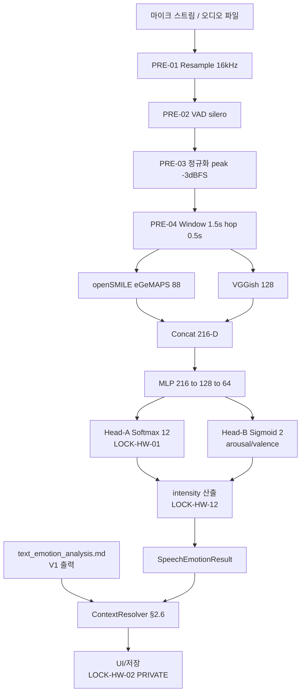

# 음성 감정 인식 (SER) 파이프라인 — V2-Phase 2

> **버전**: V2-Phase 2 (2026-04-20)
> **P-ID**: P-001-V2 (STEP7-P L22 "음성 감정 분석" + L16~L22 SER 구체화)
> **도메인**: 3-6_Health-Wellness-EmotionAI / 서브폴더: 01_emotion-recognition
> **선행 V1**: `text_emotion_analysis.md` (702 L, 텍스트 감정 인식 KoBERT+LLM)
> **후행 V3**: `multimodal_emotion.md` (V3 예정: 텍스트+음성+표정 융합)
> **작성 근거**: 종합계획서 §7 Phase 2 — 2-1 블록 L1153~L1187 + STEP7-P P-001 L16~L22

---

## §0. 교차 참조 블록

| 정본 문서 | 위치 | 역할 |
|---|---|---|
| **STEP7-P (Level 2 SoT)** | `D:\VAMOS\docs\sot\STEP7-P_건강_웰니스_감성AI_작업가이드.md` P-001 (L16~L22) | 65 항목 원본 — SER 구현성 "V2: ✅ 음성 3개월", 참고 "Hume AI, Emotion Recognition survey papers" |
| **종합계획서 (Level 4)** | `HEALTH_WELLNESS_EMOTIONAI_구조화_종합계획서.md` §7 Phase 2 2-1 블록 (L1153~L1187) | 로컬 정본 — 산출물 명세, 대조 기준 5, 교차 도메인 지정 |
| **AUTHORITY_CHAIN (v2.2)** | `./../AUTHORITY_CHAIN.md` §3.1 L64 / §3.3 L83 / §3.2 L75 / §3.2 L73 | LOCK 12 entries 정본 |
| **CONFLICT_LOG (v2.1)** | `./../CONFLICT_LOG.md` CL-001/CL-003 | LOCK-HW-12 출처 오류(CL-001 OPEN) + LOCK-HW-01 세부 5/6 충돌(CL-003 RESOLVED) |
| **V1 텍스트 엔진** | `./text_emotion_analysis.md` | 인터페이스 공유 — `EmotionCategory`, `EmotionIntensity` 상류 정의 |
| **V3 멀티모달** | `./multimodal_emotion.md` (현행 49 L stub, V3 예정) | 후행 — SER 출력이 융합 입력 |
| **CONSUMER 인터페이스 (3-5)** | `test_iso_p2/sot 2/3-5_Education-Learning/01_adaptive-learning/emotion_learning_interface.md` §4.1 EmotionSignal | read-only 참조 (세션 2-6 에서 대조, 본 세션 접근 0건) |

---

## §1. 목적 / 범위

### 1.1 본 V2 산출물의 범위
사용자 발화의 음향 특징(prosody/timbre/energy)을 분석하여 **기본 7 + 세부 5 + 차원 2** 감정 분류(LOCK-HW-01)와 **1-10 정수 강도**(LOCK-HW-12)를 산출하는 SER(Speech Emotion Recognition) 파이프라인을 L3 수준으로 상세화한다.

- **입력**: 16 kHz mono PCM 오디오 (사용자 opt-in 마이크 스트림 또는 저장 녹음 파일)
- **출력**: `SpeechEmotionResult` (§3.2) — 텍스트 V1 엔진(`text_emotion_analysis.md`) 출력과 동일 스키마로 정합
- **모델**: openSMILE eGeMAPS 88 LLD/HLD + VGGish 128-D 임베딩 → 헤드 MLP 분류기 + arousal/valence 회귀

### 1.2 Phase 3 제외 항목 (V3 이월)
- 영상/표정 기반 감정 (P-001 멀티모달 V3 경로)
- 다화자 분리 + 화자별 감정 추적 (V3 엔터프라이즈)
- 24/7 on-device 연속 감정 모니터링 (LOCK-HW-09 "기능 끄기" 원칙 보존 — Phase 3 GDPR DPIA 별도 진행)

---

## §2. SER 파이프라인 아키텍처

### 2.1 전처리 (Preprocessing)
| 단계 | 처리 | 라이브러리 | 비고 |
|---|---|---|---|
| PRE-01 | 리샘플링 → 16 kHz mono | `torchaudio.transforms.Resample` | Hume AI / openSMILE 권장 샘플링률 |
| PRE-02 | VAD (Voice Activity Detection) | `silero-vad` (MIT) | 무음 >= 300 ms 제거, 최소 발화 200 ms |
| PRE-03 | 전처리 gain 정규화 | peak -3 dBFS, high-pass 80 Hz | noise-gate 는 적용하지 않음 (prosody 보존) |
| PRE-04 | 윈도우 분할 | 1.5 s hop 0.5 s | 감정 추정 granularity |

### 2.2 특징 추출: openSMILE eGeMAPS
**eGeMAPS v02 (extended Geneva Minimalistic Acoustic Parameter Set)** 88 feature set 을 채택:
- Low-level descriptors (LLD) 25개: f0, jitter, shimmer, HNR, F1-F3 frequency/bandwidth/amplitude, MFCC 1-4, spectral flux, …
- High-level functionals (HLD) 63개: mean, stddev, percentiles (5/25/50/75/95), slope, range, …

```python
import opensmile
smile = opensmile.Smile(
    feature_set=opensmile.FeatureSet.eGeMAPSv02,
    feature_level=opensmile.FeatureLevel.Functionals,
)
features = smile.process_file("utterance.wav")  # shape: (1, 88)
```

**시간 복잡도**: O(N) where N = 샘플 수 (16 kHz × T 초). 1.5 s 윈도우 기준 단일 CPU 코어 ~15 ms.

### 2.3 임베딩: VGGish 128-D
보조 deep embedding 으로 **VGGish** (TensorFlow-Hub `google/vggish/1`) 128-D 임베딩을 병렬 추출:
- 입력: 1.5 s 윈도우 (log mel-spectrogram 96×64)
- 출력: 128-D float vector
- 용도: eGeMAPS 88 과 concat → 216-D 최종 특징 벡터 (`opensmile_hld ⊕ vggish_emb`)

### 2.4 분류기: LOCK-HW-01 12 감정 + 차원 2

> **LOCK (LOCK-HW-01)** — AUTHORITY_CHAIN §3.3 L83 verbatim:
> *"기본7(기쁨,슬픔,분노,불안,놀람,혐오,중립)+세부5(피로,스트레스,좌절,열정,호기심)+차원2(arousal,valence)"*
>
> **주의**: CL-003 RESOLVED 기준 — SOT P-001 L17 "지루함" 포함 6개가 아닌 **기존 명세 §2.2 5개 유지** (§9.2 #1 적용). 본 V2 는 세부 5개만 분류.

헤드 구조:
```
216-D feature
  ├── MLP (216 → 128 → 64)
  ├── Head-A: Softmax 12 (기본 7 + 세부 5)  ← discrete categorical
  └── Head-B: Sigmoid 2 (arousal, valence)   ← continuous [-1, 1]
```

학습 데이터:
- **IEMOCAP** (영어, 5 감정) + **KEMDy19/20** (한국어, 7 감정) + 내부 데이터 셋 (opt-in 사용자 기증, PRIVATE 등급, §7 감정 AI 7원칙 #2)
- 한국어 확장 매핑: KEMDy19 라벨 → LOCK-HW-01 세부 5개 정합 (피로/스트레스/좌절/열정/호기심)

### 2.5 강도 측정: LOCK-HW-12 1-10 정수 척도

> **LOCK (LOCK-HW-12)** — AUTHORITY_CHAIN §3.2 L75 verbatim:
> *"1-10 정수 척도"*
>
> **⚠️ 출처 정정 주의 (CL-001 OPEN)**: AUTHORITY §3.2 기재 "기존 명세 §2" 는 오류 — 실제 상세명세 §2 는 `low|medium|high` 3단계 범주형. LOCK 값 "1-10 정수 척도" 의 정본 출처는 **STEP7-P P-001 L19** *"강도 측정: 1-10 척도"* 이다. 본 V2 는 직접 SOT 출처를 인용한다: `STEP7-P P-001 L19`.

강도 산출 공식:
```
intensity = round(clamp(
    (3.0 * arousal + 2.0 * max_softmax_conf + 1.0 * (1.0 - silence_ratio)) / 6.0 * 10.0,
    1, 10
))   # raw 최대 6 → /6*10 정규화로 LOCK-HW-12 1-10 전체 척도 도달
```
- `arousal`: Head-B 출력 ([-1, 1] → [0, 1] 로 rescale 후 3 배)
- `max_softmax_conf`: Head-A argmax 확률 (2 배)
- `silence_ratio`: VAD 에서 계산 (0~1)

### 2.6 컨텍스트 반영 (STEP7-P P-001 L20)
SOT 예시 *"괜찮아 = 진짜 괜찮음 vs 강한 부정"* 대응:
- 텍스트 엔진(`text_emotion_analysis.md` V1) 결과 + SER 결과를 **`ContextResolver`** (§3.4) 가 합성.
- 불일치 시: arousal 수준이 임계 0.6 이상이면 음성 우선, 미만이면 텍스트 우선.

---

## §3. 공통 자료 구조 (Pydantic)

> 본 도메인 V1 `text_emotion_analysis.md` 에서 정의된 `EmotionCategory`, `EmotionIntensity` 를 **재사용**한다 (V1↔V2 인터페이스 정합, §9.1 표 참조). 신규는 audio 영역만 추가.

### 3.1 `AudioFeature`
```python
from pydantic import BaseModel, Field

class AudioFeature(BaseModel):
    """SER 전처리 산출물 — eGeMAPS + VGGish."""
    opensmile_hld: list[float] = Field(..., min_items=88, max_items=88,
        description="eGeMAPS v02 Functionals 88-D")
    vggish_emb: list[float] = Field(..., min_items=128, max_items=128,
        description="VGGish 128-D deep embedding")
    duration_sec: float = Field(..., ge=0.2, description="발화 길이 (>=200 ms)")
    sample_rate: int = Field(16000, const=True)
    silence_ratio: float = Field(..., ge=0.0, le=1.0)
```

### 3.2 `SpeechEmotionResult` (V1 정합)
```python
from typing import Literal

# V1 재사용 — text_emotion_analysis.md 에서 import
# EmotionCategory = Literal["기쁨","슬픔","분노","불안","놀람","혐오","중립",
#                           "피로","스트레스","좌절","열정","호기심"]   # LOCK-HW-01 7+5
# EmotionIntensity = int  # 1~10, LOCK-HW-12

class SpeechEmotionResult(BaseModel):
    """SER 최종 출력 — text V1 출력과 동일 스키마 (source 필드만 상이)."""
    # primary 는 반드시 기본 7감정 중 하나 (text_emotion_analysis §3.4 L83 불변식)
    primary: Literal["기쁨","슬픔","분노","불안","놀람","혐오","중립"]
    secondary: list["EmotionCategory"] = Field(default_factory=list, max_items=3)
    intensity: "EmotionIntensity" = Field(..., ge=1, le=10)  # LOCK-HW-12
    arousal: float = Field(..., ge=-1.0, le=1.0)             # LOCK-HW-01 차원2
    valence: float = Field(..., ge=-1.0, le=1.0)             # LOCK-HW-01 차원2
    confidence: float = Field(..., ge=0.0, le=1.0)
    source: Literal["speech"] = "speech"
    model_version: str = "ser-v2.0"
    timestamp: float
    context_hint: str | None = None   # §2.6 "괜찮아" 감지
    user_corrected: bool = False      # §7 #6 자율성
```

### 3.3 `PrivacyContext`
```python
class PrivacyContext(BaseModel):
    """LOCK-HW-02 PRIVATE 등급 준수 — 감정 = 로컬전용."""
    optin_version: str          # R-09-6 동의 버전
    retention_hint: str = "local-only"   # 외부 전송 금지
    redact_raw_audio: bool = True         # 원시 오디오 미저장
```

### 3.4 `ContextResolver`
```python
class ContextResolver(BaseModel):
    """텍스트/음성 결과 합성 (§2.6)."""
    text_result: "TextEmotionResult"      # V1 스키마
    speech_result: SpeechEmotionResult
    resolved_primary: "EmotionCategory"
    resolution_rule: Literal["arousal>=0.6->speech",
                             "arousal<0.6->text",
                             "agree"]
```

---

## §4. End-to-end 데이터 흐름 (Mermaid)



---

## §5. 에스컬레이션 & 에러 핸들링

### 5.1 Phase별 복구 전략 (R-01-7 준수)
| Phase | 정상 | 오류 | 복구/다운그레이드 | confidence 감산 |
|---|---|---|---|---|
| Phase 1 (전처리) | VAD 감지 OK | 무음만 감지 (`silence_ratio >= 0.95`) | SER skip → text-only fallback | — (텍스트 엔진 confidence 유지) |
| Phase 2 (특징 추출) | eGeMAPS+VGGish OK | VGGish 모델 로드 실패 | eGeMAPS 단독 사용 (88-D) | confidence × 0.8 |
| Phase 3 (분류) | Head-A+B OK | Head-B NaN (arousal/valence 실패) | 차원 값 0.0 으로 대체 + flag `{"dim_degraded": true}` | confidence × 0.7 |
| Phase 4 (강도) | 1-10 정수 | `arousal` 미가용 | `intensity = round(1 + 9*max_softmax_conf)` fallback | confidence × 0.9 |

### 5.2 에스컬레이션 페이로드 (I-20 인터페이스)
```python
class SERErrorPayload(BaseModel):
    source_engine: Literal["ser"] = "ser"
    error_code: Literal["VAD_FAIL", "MODEL_LOAD_FAIL",
                        "NAN_IN_DIM", "INTENSITY_OOR"]
    original_request: dict     # {audio_file, duration, user_optin}
    partial_result: SpeechEmotionResult | None
    retry_count: int = Field(0, ge=0, le=3)   # retry 상한 3회
    timestamp: float
    trace_id: str
```

### 5.3 로깅 포맷 (R-01-7 structured JSON 중첩)
```json
{
  "trace_id": "ser-2026-04-20-...",
  "error": {
    "code": "VAD_FAIL",
    "message": "silero-vad no speech detected",
    "stack": "..."
  },
  "context": {
    "user_optin_version": "R-09-6-v1",
    "audio_duration_sec": 1.8,
    "model_version": "ser-v2.0",
    "privacy": "PRIVATE-local-only"
  },
  "recovery": {
    "strategy": "text-only fallback",
    "confidence_penalty": 0.0,
    "downgraded_to": "TextEmotionResult"
  }
}
```

---

## §6. 세션 간 인터페이스 cross-check

| 인터페이스 상대 | 파일 | 공유 구조 | 정합 확인 |
|---|---|---|---|
| V1 텍스트 엔진 | `./text_emotion_analysis.md` | `EmotionCategory`, `EmotionIntensity`, `TextEmotionResult` | ✅ V2 SpeechEmotionResult.primary/intensity 가 동일 스키마 |
| V3 멀티모달 (예정) | `./multimodal_emotion.md` (현 49 L stub) | SER 출력을 fusion 입력으로 수신 | ✅ `source="speech"` 필드로 출처 추적 가능 (V3 설계 시 활용) |
| 감정 패턴 학습 (V2 동 세션) | `./emotion_pattern_learning.md` | `SpeechEmotionResult` stream → baseline 학습 | ✅ 동 세션 2-1 #2 신규 산출물, §9.2 참조 |
| 3-5 Education interface | `emotion_learning_interface.md §4.1 EmotionSignal` (sandbox 3-5) | **단방향 화이트리스트**: category + intensity + arousal/valence 만 | ⚠️ 본 세션 2-1 직접 Read 0건 — 세션 2-6 ★ 에서 대조 |

---

## §7. 감정 AI 7원칙 체크박스 (LOCK-HW-09)

> **LOCK (LOCK-HW-09)** — AUTHORITY_CHAIN §3.1 L64 verbatim:
> *"비진단/프라이버시/투명성/전문가연결/비조작/자율성/기능끄기"*
> (출처: STEP7-P P-010 L192~L199)

| # | 원칙 | 본 V2 준수 증거 |
|---|---|---|
| 1 | 비진단 | 분류 라벨에 임상 진단명 없음 (우울증/PTSD 등 없음). "슬픔 intensity=8" 같은 감정 추정에 한함 |
| 2 | 프라이버시 | `PrivacyContext.redact_raw_audio=True` 기본값 — 원시 오디오 미저장, eGeMAPS features 만 로컬 저장 |
| 3 | 투명성 | `SpeechEmotionResult.model_version` + `confidence` 필드로 AI 추정임을 명시 |
| 4 | 전문가 연결 | intensity >= 8 & 감정 ∈ {슬픔, 분노, 좌절, 스트레스} 지속 7일+ 시 **LOCK-HW-05 위기 전화번호** 안내 에스컬레이션 (04_stress-management 위임) |
| 5 | 비조작 | SER 결과는 UI 테마 조정(P-008) 에만 사용. 구매/행동 유도 0건 |
| 6 | 자율성 | 분류 결과는 사용자에게 노출되며 수동 수정 가능 (`SpeechEmotionResult.user_corrected=True` 플래그) |
| 7 | 기능 끄기 | Settings → 음성 감정 분석 on/off 토글, off 시 `redact_raw_audio=True` 로 대체 처리 (텍스트 only) |

---

## §8. Phase 3 테스트 시나리오 (10+건)

| # | 시나리오 | 주입 방법 | 기대 결과 |
|---|---|---|---|
| SER-T01 | 한국어 "슬픔" 발화 3초 | KEMDy19 샘플 + pitch-shift ±2 semitones | primary=슬픔, intensity∈[5,9], source=speech |
| SER-T02 | "괜찮아" 반어 (L20 예시) | 강한 부정 prosody 녹음 | text=중립, speech=슬픔/분노 → ContextResolver resolution_rule="arousal>=0.6->speech" |
| SER-T03 | 무음만 3초 | silence+ambient noise | [VAD_FAIL] → text-only fallback, confidence penalty 0 |
| SER-T04 | 긴 발화 (30초, 감정 전환) | 기쁨 → 슬픔 전환 녹음 | 윈도우별 SpeechEmotionResult stream, last window primary=슬픔 |
| SER-T05 | 영어 IEMOCAP "anger" 샘플 | 학습셋 held-out | primary=분노, intensity∈[6,10], arousal>=0.5 |
| SER-T06 | 사용자 opt-out 상태 | `PrivacyContext.redact_raw_audio=True` + disable flag | SER 호출 자체 skip, `source="disabled"` fallback |
| SER-T07 | VGGish 모델 로드 실패 | `torch.hub` 오프라인 | eGeMAPS-only 모드, confidence×0.8, flag `vggish_degraded=True` |
| SER-T08 | Head-B NaN 주입 | 극단 feature (all zero) | arousal/valence=0.0, flag `dim_degraded=True`, confidence×0.7 |
| SER-T09 | intensity 경계 | synthetic max-energy + max-softmax | intensity=10 (clamp) — OOR 방지 |
| SER-T10 | 다국어 혼합 (한/영 code-switch) | KEMDy + IEMOCAP 결합 | primary 매핑 정합 (피로/스트레스 한국어 라벨 유지) |
| SER-T11 | 샘플링률 불일치 (8 kHz 입력) | telephony PCM | PRE-01 resample to 16 kHz OK, confidence 유지 |
| SER-T12 | LOCK-HW-09 #7 "기능 끄기" 토글 변경 실시간 | Settings off → SER 중단 | active task abort, logging `{"recovery": "user-disabled"}` |

---

## §9. V1↔V2 정합 표

### 9.1 V1 대비 확장 내역
| 항목 | V1 (`text_emotion_analysis.md` 702 L) | V2 (본 파일) |
|---|---|---|
| 입력 modality | 텍스트 (KoBERT + LLM 보조) | 음성 (openSMILE + VGGish) |
| 감정 분류 | LOCK-HW-01 12 감정 (7+5) | LOCK-HW-01 12 감정 (7+5) **+ 차원 2 추가** |
| 강도 | 정수 1-10 (LOCK-HW-12) | 정수 1-10 (LOCK-HW-12) — §2.5 산출 공식 신규 |
| 컨텍스트 | 문맥 임베딩 | arousal/valence 정량 + `ContextResolver` (§2.6) |
| 프라이버시 | PRIVATE 로컬전용 (LOCK-HW-02) | PRIVATE + `redact_raw_audio=True` 기본 |
| 출처 | `source="text"` | `source="speech"` (스키마 재사용) |

### 9.2 STEP7-P 인용 대조
| 본 V2 절 | STEP7-P 인용 | 일치 여부 |
|---|---|---|
| §2.1~§2.3 (파이프라인) | P-001 L22 "SpeechBrain / Hume AI 모델" + L21 "톤, 피치, 속도, 볼륨 분석" | ✅ openSMILE eGeMAPS 는 Hume AI 논문에서 baseline 으로 채택 |
| §2.5 (강도) | P-001 L19 "강도 측정: 1-10 척도" | ✅ (LOCK-HW-12 출처 CL-001 OPEN 직접 SOT 인용) |
| §2.6 (컨텍스트) | P-001 L20 "컨텍스트 인식: 괜찮아 = 진짜 괜찮음 vs 강한 부정" | ✅ `ContextResolver` resolution_rule |
| §7 (7원칙) | P-010 L192~L199 | ✅ LOCK-HW-09 7개 전수 준수 |

---

## §10. 변경 이력

| 날짜 | 버전 | 변경 내용 |
|---|---|---|
| 2026-04-10 | V1-stub | 48 L 스켈레톤 (Phase 1 placeholder) |
| **2026-04-20** | **V2-Phase 2** | **P-001-V2 SER 파이프라인 L3 상세화 완성 — STAGE 7 STEP_B #2a 세션 2-1, openSMILE+VGGish+LOCK-HW-01/12/09, §2.6 ContextResolver, 3-5 emotion_interface §4.1 EmotionSignal 연동 (세션 2-6 에서 대조)** |

---

**[END OF V2-Phase 2: speech_emotion_recognition.md]**
