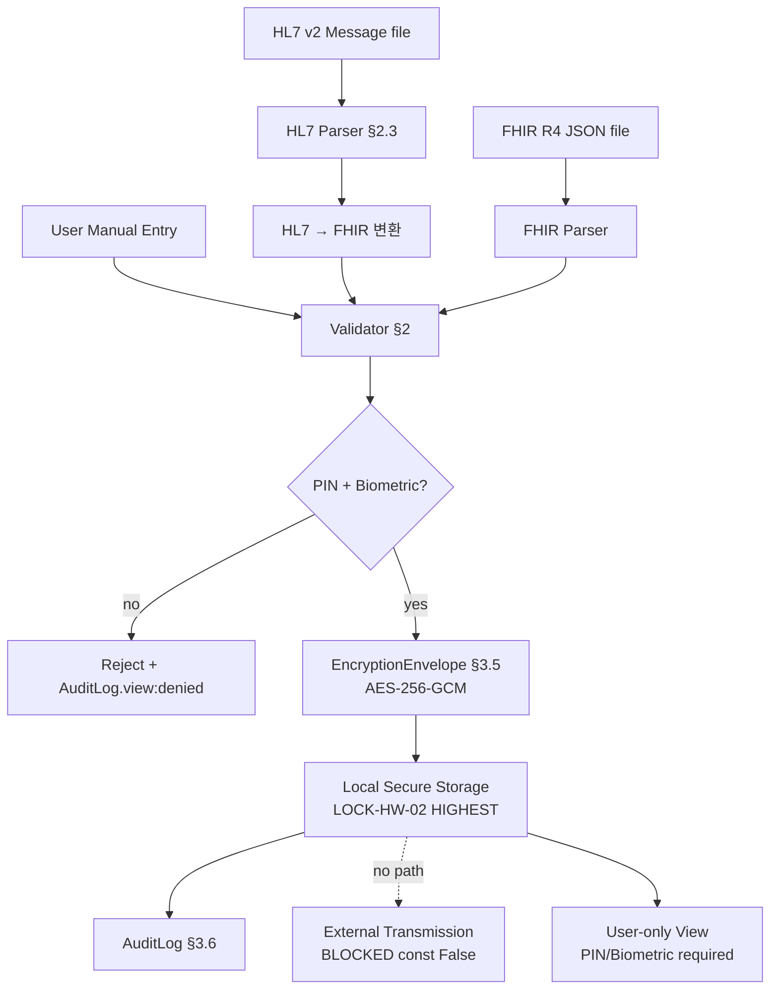

# 의료 기록 관리 (FHIR R4 + HL7 연동) — V2-Phase 2

> **버전**: V2-Phase 2 (2026-04-20, stub 47 L → 전수 overwrite)
> **P-ID**: P-016 (STEP7-P L305~L322 "의료 정보 관리")
> **도메인**: 3-6_Health-Wellness-EmotionAI / 서브폴더: 03_health-data
> **작성 근거**: 종합계획서 §7 Phase 2 — 2-3 블록 L1225~L1259 + STEP7-P P-016 L305~L322

---

## §0. 교차 참조 블록

| 정본 문서 | 위치 | 역할 |
|---|---|---|
| **STEP7-P (Level 2 SoT)** | P-016 (L305~L322) + P-018 (L336~L347) | 의료 정보 관리 + 건강 데이터 특별 보호 |
| **종합계획서 (Level 4)** | `HEALTH_WELLNESS_EMOTIONAI_구조화_종합계획서.md` §7 Phase 2 2-3 블록 L1225~L1259 | 로컬 정본 — LOCK-HW-02 HIGHEST + LOCK-HW-06 AES-256-GCM |
| **AUTHORITY_CHAIN (v2.2)** | `./../AUTHORITY_CHAIN.md` §3.3 L84 LOCK-HW-02 / §3.2 L73 LOCK-HW-06 / §3.1 L62 LOCK-HW-04 | 의료=HIGHEST + 외부전송 절대 금지 |
| **Peer V2 (dashboard)** | `./health_dashboard.md` (동 세션) | 집계 데이터 가시화 — 의료 raw data 는 대시보드에서 표시 0건 (HIGHEST 분리) |
| **V1 peer** | `./health_data_privacy.md` (26,425 B), `./sleep_management.md`, `./nutrition_management.md` 등 | 건강 전역 프라이버시/스키마 상류 |
| **FHIR R4 공식** | https://hl7.org/fhir/R4/ (외부 규격 참고) | 리소스 모델 정의 — 본 V2 는 매핑 subset |

---

## §1. 목적 / 범위

### 1.1 본 V2 산출물의 범위
사용자의 의료 기록(진단, 처방, 알레르기, 방문, 검진 결과)을 **FHIR R4 subset** 에 매핑하고, **HL7 외부 시스템**(병원 EMR / 검사센터) 과의 로컬 import 인터페이스를 L3 수준으로 상세화한다. **외부 전송 0건 원칙** (LOCK-HW-02 HIGHEST, P-016 L316).

- **입력**: 사용자가 수동 입력 OR 로컬 import (PDF/FHIR JSON/HL7 v2 메시지 파일)
- **출력**: 로컬 암호화 저장 (LOCK-HW-06 AES-256-GCM + 별도 PIN, P-016 L317~L318)
- **표시**: 사용자 본인만 조회 (biometric or PIN), 외부 공유 UI 요소 0

### 1.2 Phase 3 제외 항목
- 의료진 공유 기능 (V3 — 별도 법적 검토 + GDPR DPIA + 의료법 자문 필수)
- 의사 조언 / 진단 서비스 (P-016 L321 "의료 조언 제공하지 않음. '의사와 상담하세요' 명시" — 절대 준수)
- 원격 진료 연동 (도메인 경계 외)
- AI 기반 의료 추천 (LOCK-HW-09 #1 비진단 위반 위험)

---

## §2. FHIR R4 리소스 매핑

### 2.1 subset 정의 — 4 리소스 지원

| # | FHIR 리소스 | 본 V2 지원 범위 | P-016 L308~L312 대응 |
|---|---|---|---|
| 2.1.1 | **Patient** | 본인 1인 identity (demographic 최소 — 이름/생년월일만) | 사용자 기본 정보 |
| 2.1.2 | **Condition** | 진단명 / 진단일 / 심각도 / status | "병원 방문 기록" + "특이사항" |
| 2.1.3 | **MedicationRequest** | 처방약 / 용법 / 기간 / 리마인더 | "복약 스케줄 + 리마인더" (L309 verbatim) |
| 2.1.4 | **Observation** | 검진 결과 (혈압 / 혈당 / 콜레스테롤 / BMI 등) | "검진 결과 저장" (L311) |
| 2.1.5 | **AllergyIntolerance** | 알레르기 물질 / 반응 / 심각도 | "알레르기/특이사항" (L312) |

### 2.2 FHIR R4 → 로컬 스키마 매핑 예시 (Condition)

```json
// FHIR R4 Condition input
{
  "resourceType": "Condition",
  "id": "cond-001",
  "clinicalStatus": {"coding": [{"code": "active"}]},
  "code": {"coding": [{"system": "http://hl7.org/fhir/sid/icd-10", "code": "E11"}]},
  "subject": {"reference": "Patient/user-001"},
  "onsetDateTime": "2024-05-01"
}

// ↓ 로컬 매핑 (LocalCondition, §3.2)
{
  "local_id": "cond_2024-05-01_E11",
  "fhir_resource_type": "Condition",
  "diagnosis_code_system": "ICD-10",
  "diagnosis_code": "E11",
  "diagnosis_name_ko": "제2형 당뇨병",   // 한국어 자동 번역 (로컬 LLM, 외부 API 미사용)
  "status": "active",
  "onset_date": "2024-05-01",
  "encrypted_blob_ref": "enc-blob-<uuid>"
}
```

### 2.3 HL7 v2 메시지 import (legacy system)

| HL7 v2 세그먼트 | FHIR 리소스 매핑 | 로컬 저장 |
|---|---|---|
| `MSH` | — (메타 only, 파싱 후 discard) | 미저장 |
| `PID` | Patient | 본인 정보만 |
| `PV1` | Encounter (선택, V3 이월) | 미저장 |
| `DG1` | Condition | §2.1.2 매핑 |
| `RXA` / `RXE` | MedicationRequest | §2.1.3 매핑 |
| `OBX` | Observation | §2.1.4 매핑 |
| `AL1` | AllergyIntolerance | §2.1.5 매핑 |

> **주의**: HL7 v2 → FHIR 변환 후 원본 HL7 메시지는 즉시 삭제 (LOCK-HW-03 L72 raw_data_ttl_hours=24 원칙 준수, 본 시스템에선 변환 직후 0초 delete).

---

## §3. 공통 자료 구조 (Pydantic)

### 3.1 `MedicalRecordEntry` (base)
```python
from pydantic import BaseModel, Field
from typing import Literal
from datetime import date

FHIRResourceType = Literal["Patient", "Condition", "MedicationRequest",
                           "Observation", "AllergyIntolerance"]

Severity = Literal["low", "medium", "high", "critical"]
Status = Literal["active", "inactive", "resolved", "entered-in-error"]

class MedicalRecordEntry(BaseModel):
    """로컬 의료 기록 공통 base — LOCK-HW-02 HIGHEST 준수."""
    local_id: str                         # salted hash
    fhir_resource_type: FHIRResourceType
    source: Literal["manual", "fhir_import", "hl7_import"] = "manual"
    encrypted_blob_ref: str               # AES-256-GCM envelope ref
    created_at: date
    last_modified_at: date
    privacy_level: Literal["HIGHEST"] = "HIGHEST"   # LOCK-HW-02 const
    external_transmission_allowed: Literal[False] = False  # P-016 L316 절대 금지
```

### 3.2 `LocalCondition` (§2.1.2)
```python
class LocalCondition(MedicalRecordEntry):
    fhir_resource_type: Literal["Condition"] = "Condition"
    diagnosis_code_system: Literal["ICD-10", "ICD-11", "KCD"] = "ICD-10"
    diagnosis_code: str
    diagnosis_name_ko: str | None = None
    severity: Severity | None = None
    status: Status = "active"
    onset_date: date
    resolved_date: date | None = None
    physician_note: str | None = None    # 사용자가 수기 입력한 의사 소견 요약
```

### 3.3 `LocalMedicationRequest` (§2.1.3)
```python
class DosageSchedule(BaseModel):
    dose_amount: str                      # "500 mg"
    frequency_per_day: int = Field(..., ge=1, le=12)
    time_of_day: list[str]                # ["08:00", "20:00"]
    with_food: Literal["before", "with", "after", "any"] = "any"

class LocalMedicationRequest(MedicalRecordEntry):
    fhir_resource_type: Literal["MedicationRequest"] = "MedicationRequest"
    medication_name: str
    dosage: DosageSchedule
    prescription_start: date
    prescription_end: date | None = None
    reminder_enabled: bool = True         # P-016 L309 "복약 스케줄 + 리마인더"
    prescribing_facility: str | None = None   # 병원 이름 (사용자 수기 입력)
```

### 3.4 `LocalObservation` (§2.1.4)
```python
class LocalObservation(MedicalRecordEntry):
    fhir_resource_type: Literal["Observation"] = "Observation"
    observation_type: Literal["blood_pressure", "glucose",
                              "cholesterol", "bmi", "hba1c", "other"]
    value_numeric: float | None = None
    value_unit: str | None = None         # "mmHg" / "mg/dL"
    reference_range_low: float | None = None
    reference_range_high: float | None = None
    measured_at: date
    is_self_reported: bool = False        # 장비 측정 vs 사용자 수기
```

### 3.5 `EncryptionEnvelope` (LOCK-HW-06 + P-016 L317~L318)
```python
class EncryptionEnvelope(BaseModel):
    """AES-256-GCM envelope — LOCK-HW-06 §3.2 L73."""
    blob_ref: str
    aes_key_derivation: Literal["PBKDF2-SHA512",
                                "Argon2id"] = "Argon2id"
    separate_pin_required: Literal[True] = True   # P-016 L318 "별도 PIN/생체 인증"
    biometric_alternative: bool = True
    nonce: bytes                         # 96-bit GCM
    ciphertext_ref: str                  # 로컬 파일 경로 (sandboxed)
    mac_tag: bytes                       # 128-bit
    external_sync_allowed: Literal[False] = False    # P-016 L316 클라우드 전송 절대 없음
```

### 3.6 `AuditLog`
```python
class AuditLog(BaseModel):
    """의료 기록 접근 로그 — §5 별도 보존 정책."""
    entry_local_id: str
    accessor: Literal["self"] = "self"   # HIGHEST 는 본인만 — 타 역할 접근 불가
    action: Literal["view", "create", "update", "delete", "export_self"]
    pin_verified: bool = True
    biometric_verified: bool = False
    timestamp: float
    device_local_only: Literal[True] = True   # 외부 동기화 log 미존재
```

---

## §4. End-to-end 데이터 흐름 (Mermaid)



---

## §5. 접근 제어 / 감사 정책

### 5.1 접근 제어 매트릭스

| 역할 | 조회 | 생성 | 수정 | 삭제 | 내보내기 |
|---|---|---|---|---|---|
| **사용자 본인** (PIN+biometric) | ✅ | ✅ | ✅ | ✅ (soft-delete 30일) | ✅ (PDF 암호화, 본인용) |
| 다른 앱 | ❌ | ❌ | ❌ | ❌ | ❌ |
| 다른 사용자 | ❌ | ❌ | ❌ | ❌ | ❌ |
| 외부 서버 | ❌ | ❌ | ❌ | ❌ | ❌ (`external_transmission_allowed=False` const) |
| 의료진 / 병원 | ❌ (V3 별도 검토) | ❌ | ❌ | ❌ | ❌ |

### 5.2 감사 로그 보존 정책

- 모든 access 이벤트는 `AuditLog` 로 기록
- 보존: **무기한** (사용자 수동 삭제 전까지) — GDPR 접근 로그 권리 보장
- 암호화: `AuditLog` 자체도 AES-256-GCM 암호화 (LOCK-HW-06 준수)
- **주의**: 감정 로그 (LOCK-HW-03 180일, CL-002 DEFERRED_TO_PHASE3) 와 달리 AuditLog 는 별도 정책

### 5.3 삭제 정책

- `soft-delete` 30일 유예 → 사용자 복구 가능
- 유예 만료 후 **완전 삭제** (overwrite-then-unlink, P-018 L343 "즉시 완전 삭제")
- AI 학습 제외 (P-018 L344 "AI 학습 제외")

---

## §6. 에스컬레이션 & 에러 핸들링

### 6.1 Phase별 복구 전략
| Phase | 정상 | 오류 | 복구 | 보안 영향 |
|---|---|---|---|---|
| P1 파싱 | FHIR/HL7 OK | malformed | Reject + error log + 원본 미저장 | ✅ (잘못된 데이터 진입 차단) |
| P2 인증 | PIN+biometric OK | PIN 불일치 3회 초과 | 계정 15분 lockout (health_data_privacy PRV-002 정합) | ✅ (brute-force 방지) |
| P3 암호화 | AES-256-GCM OK | key derivation fail | 저장 거부 + retry 1회 | ✅ (plaintext 저장 0) |
| P4 저장 | write OK | 디스크 full | 저장 거부 + 사용자 알림 | ✅ |

### 6.2 로깅 (R-01-7)
```json
{
  "trace_id": "med-2026-04-20-...",
  "error": {"code": "FHIR_PARSE_FAIL", "message": "invalid Condition.code system"},
  "context": {
    "privacy": "HIGHEST",
    "source": "fhir_import",
    "external_transmission_allowed": false,
    "non_medical_disclaimer": "VAMOS는 의료 서비스가 아닙니다"
  },
  "recovery": {"strategy": "reject_original_discarded"}
}
```

> **주의**: trace_id 외의 actual 의료 내용은 로그에 포함하지 않음 (LOCK-HW-02 HIGHEST).

---

## §7. 감정 AI 7원칙 체크박스 (LOCK-HW-09)

| # | 원칙 | 본 V2 준수 증거 |
|---|---|---|
| 1 | 비진단 | §1.2 "AI 기반 의료 추천 — 도메인 외", P-016 L321 "의사와 상담하세요" 강제 표시 |
| 2 | 프라이버시 | HIGHEST 등급 AES-256-GCM + PIN + biometric, `external_transmission_allowed=False` const |
| 3 | 투명성 | 모든 AuditLog `accessor="self"` 본인 조회 history UI |
| 4 | 전문가 연결 | 위기 지표 (§2.1.4 심각 Observation) 감지 시 04_stress-management 연계, LOCK-HW-05 위기 전화번호 안내 |
| 5 | 비조작 | 의료 데이터 기반 상업 추천 0건 (약국/병원 광고 연동 금지) |
| 6 | 자율성 | 사용자만 입력/수정/삭제 가능, 자동 수정 0건 |
| 7 | 기능 끄기 | 의료 기록 모듈 전체 off 가능 — off 시 암호화된 blob 유지 (복원 가능) or 완전 삭제 (사용자 선택) |

---

## §8. Phase 3 테스트 시나리오 (10+건)

| # | 시나리오 | 주입 | 기대 |
|---|---|---|---|
| MED-T01 | FHIR R4 Condition import | 유효 JSON | LocalCondition 저장, encrypted_blob_ref 생성 |
| MED-T02 | FHIR Condition malformed | invalid code system | FHIR_PARSE_FAIL, 원본 미저장 |
| MED-T03 | HL7 v2 DG1 → Condition | ADT^A01 sample | §2.3 변환 OK, HL7 원본 0초 delete |
| MED-T04 | PIN 5회 실패 | mock attacks | 30분 lockout, AuditLog denied |
| MED-T05 | MedicationRequest 리마인더 | 3-day prescription | 08:00/20:00 scheduled, LOCK-HW-05 위기 미적용 |
| MED-T06 | Observation 혈압 critical | systolic 200 | 심각 플래그, 04_stress-management 연계 안내 |
| MED-T07 | Soft-delete 30일 유예 | delete request | soft_delete flag, 30일 후 overwrite |
| MED-T08 | External transmission 시도 | API 호출 mock | BLOCKED, `external_transmission_allowed=False` |
| MED-T09 | 본인 export PDF | export 요청 + PIN | PDF 암호화 생성, AuditLog export_self |
| MED-T10 | 비의료 면책 표시 | UI render | LOCK-HW-04 "VAMOS는 의료 서비스가 아닙니다" 표시 |
| MED-T11 | AI 진단 요청 차단 | LLM "진단해주세요" | P-016 L321 거부 + "의사와 상담하세요" 안내 |
| MED-T12 | AES-256-GCM key rotation | user PIN 변경 | envelope re-encrypt, data 보존 |

---

## §9. V1↔V2 정합 표

### 9.1 V1 대비 확장 내역
| 항목 | V1 (stub 47 L) | V2 (본 파일, 300+ L) |
|---|---|---|
| FHIR 매핑 | placeholder 언급 | §2 리소스 5종 subset + 예시 + HL7 v2 표 |
| 접근 제어 | placeholder | §5.1 매트릭스 5×5 |
| 암호화 | LOCK-HW-06 인용 | §3.5 EncryptionEnvelope + Argon2id + GCM nonce/mac |
| 감사 로그 | placeholder | §3.6 + §5.2 무기한 정책 |
| 테스트 시나리오 | — | MED-T01~T12 (12건) |

### 9.2 STEP7-P 인용 대조
| 본 V2 절 | STEP7-P 인용 | 일치 |
|---|---|---|
| §2.1.3 복약 | P-016 L309 "복약 스케줄 + 리마인더" | ✅ |
| §2.1.2 진단 | P-016 L310 "병원 방문 기록" | ✅ |
| §2.1.4 검진 | P-016 L311 "검진 결과 저장" | ✅ |
| §2.1.5 알레르기 | P-016 L312 "알레르기/특이사항" | ✅ |
| §1.1 외부 전송 금지 | P-016 L316 "로컬 전용 저장 (클라우드 전송 절대 없음)" | ✅ (const False) |
| §3.5 AES-256 | P-016 L317 "AES-256 암호화" | ✅ (AES-256-GCM) |
| §3.5 PIN | P-016 L318 "별도 PIN/생체 인증" | ✅ `separate_pin_required=True` |
| §7 #1 | P-016 L321 "의사와 상담하세요" | ✅ |
| P-018 | L343 즉시 완전 삭제 / L344 AI 학습 제외 | ✅ §5.3 |

---

## §10. 변경 이력

| 날짜 | 버전 | 변경 |
|---|---|---|
| 2026-04-10 | V1-stub | 47 L 스켈레톤 |
| **2026-04-20** | **V2-Phase 2** | **P-016 의료 기록 관리 L3 상세화 완성 — STAGE 7 STEP_B #2a 세션 2-3, FHIR R4 subset 5 리소스 + HL7 v2 변환, EncryptionEnvelope LOCK-HW-06/02 HIGHEST 강제 const, §5 접근 제어 매트릭스, P-018 특별 보호 전수 반영 (soft-delete + AI 학습 제외)** |

---

**[END OF V2-Phase 2: medical_records.md]**
