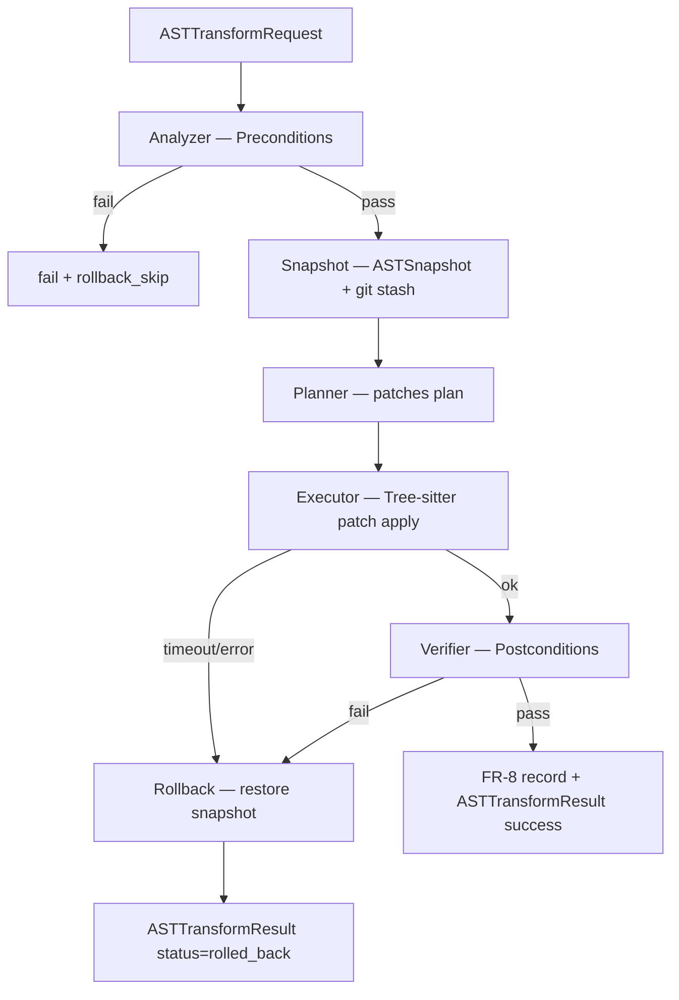

# AST 파이프라인 (Tree-sitter 기반)

> **L-ID**: L-003
> **V 배정**: V1 (LLM 프롬프트 생성용 파싱) / V2 (AST 기반 자동 변환)
> **Phase**: Phase 1 P1-3 (V1 범위 — LLM 프롬프트 생성용 AST 파싱까지만)
> **수준**: L2+ (D1~D8 전수, §13 P0 항목)
> **의존 LOCK**: LOCK-DT-06 (코드 실행 타임아웃 30초), LOCK-DT-10 (테스트 커버리지 >= 80%)

---

## 교차 참조 블록

| 정본 문서 | 참조 내용 |
|----------|----------|
| STEP7-L L-003 | 코드 리팩토링 자동화 — 안전한 리팩토링 (영향 범위 분석) |
| 종합계획서 §13 | L3 기준 D1~D8, P0 항목 전수 |
| 종합계획서 §3.4 | LOCK-DT-06 (30초), LOCK-DT-10 (80%) |
| L-003 pattern_catalog.md | AST 파싱 결과 소비처 (ASTContext) |
| L-003 safe_transform_rules.md | 변환 전 분석 결과 제공 |
| L-001 dev_node_architecture.md | 코딩 엔진 파이프라인 통합 |

---

## Phase 1 / Phase 2 범위 구분

### Phase 1 (V1) — LLM 프롬프트 생성용 AST 파싱

| 기능 | 설명 |
|------|------|
| AST 파싱 | Tree-sitter로 소스코드 → AST 트리 변환 |
| 심볼 추출 | 함수/변수/클래스/import 목록 추출 |
| 스코프 분석 | 변수 정의/사용 범위 식별 |
| 참조 검색 | 심볼의 모든 참조 위치 찾기 |
| LLM 컨텍스트 생성 | AST 정보를 LLM 프롬프트용 JSON으로 변환 |

### Phase 2 (V2) — AST 기반 자동 변환 (미구현, 범위 표기만)

| 기능 | 설명 | Phase 2 이유 |
|------|------|-------------|
| AST 노드 직접 수정 | Tree-sitter CST 노드 삽입/삭제/이동 | 복합 트리 조작 엔진 필요 |
| 타입 추론 | 정적 타입 분석 기반 추론 | 타입 시스템 통합 필요 |
| 자동 import 정리 | AST 기반 미사용 import 자동 감지+삭제 | 의존성 그래프 완전성 필요 |
| 크로스파일 변환 | 다중 파일 동시 AST 수정 | 프로젝트 수준 인덱스 필요 |

---

## D1. Input Schema

```python
from dataclasses import dataclass, field
from typing import Optional
from enum import Enum

class ParseMode(Enum):
    FULL = "full"               # 전체 AST 트리
    SYMBOLS = "symbols"         # 심볼 목록만
    SCOPE = "scope"             # 스코프 분석만
    REFERENCES = "references"   # 참조 검색

class SupportedLanguage(Enum):
    PYTHON = "python"
    JAVASCRIPT = "javascript"
    TYPESCRIPT = "typescript"
    RUST = "rust"
    GO = "go"
    JAVA = "java"
    C = "c"
    CPP = "cpp"

@dataclass
class ASTParseRequest:
    """AST 파싱 요청"""
    source_code: str                            # 원본 소스코드
    language: SupportedLanguage                 # 프로그래밍 언어
    file_path: str                              # 파일 경로 (컨텍스트용)
    mode: ParseMode = ParseMode.FULL            # 파싱 모드
    target_symbol: Optional[str] = None         # REFERENCES 모드 시 대상 심볼
    selection_range: Optional[tuple[int, int]] = None  # 부분 파싱 범위 (start_line, end_line)
    include_comments: bool = False              # 주석 포함 여부
    timeout_ms: int = 30000                     # LOCK-DT-06: 30초 타임아웃
    trace_id: Optional[str] = None
```

---

## D2. Output Schema

```python
@dataclass
class SymbolInfo:
    """심볼 정보"""
    name: str
    kind: str                   # "function", "variable", "class", "import", "parameter"
    line_start: int
    line_end: int
    scope: str                  # 소속 스코프 (e.g., "module", "ClassName.method_name")

@dataclass
class ReferenceInfo:
    """참조 정보"""
    symbol_name: str
    line: int
    column: int
    kind: str                   # "definition", "usage", "import"
    file_path: str

@dataclass
class ScopeNode:
    """스코프 트리 노드"""
    name: str                   # 스코프 이름
    kind: str                   # "module", "function", "class", "block"
    line_start: int
    line_end: int
    defined_variables: list[str] = field(default_factory=list)
    used_variables: list[str] = field(default_factory=list)
    children: list['ScopeNode'] = field(default_factory=list)

@dataclass
class ASTParseResult:
    """AST 파싱 결과"""
    status: str                                 # "success", "partial", "error"
    language: SupportedLanguage
    tree_json: Optional[dict] = None            # FULL 모드: 전체 AST (JSON 직렬화)
    symbols: list[SymbolInfo] = field(default_factory=list)
    references: list[ReferenceInfo] = field(default_factory=list)
    scope_tree: Optional[ScopeNode] = None
    imports: list[str] = field(default_factory=list)
    used_variables: list[str] = field(default_factory=list)
    defined_variables: list[str] = field(default_factory=list)
    latency_ms: float = 0.0
    trace_id: Optional[str] = None

@dataclass
class ASTContext:
    """pattern_catalog.md에 전달하는 LLM 프롬프트용 컨텍스트"""
    tree: dict                      # AST 트리 (JSON 직렬화)
    symbols: list[str]              # 정의된 심볼 목록
    used_variables: list[str]       # 사용 변수
    defined_variables: list[str]    # 정의 변수
    scope_info: dict                # 스코프 계층 정보
    imports: list[str]              # import 목록
    language: str

@dataclass
class EscalationPayload:
    """AST 파이프라인 에스컬레이션 페이로드"""
    trigger: str
    request: ASTParseRequest
    partial_result: Optional[ASTParseResult] = None
    error_code: str = ""
    recommended_action: str = ""
    escalation_level: str = "L2"
```

---

## D3. Algorithm

```
시간복잡도: O(N) — Tree-sitter 증분 파싱
  - N: 소스코드 바이트 수
공간복잡도: O(N) — AST 트리 저장
```

### 파이프라인 구조

```python
async def parse_ast_for_llm(
    source_code: str, 
    language: str,
    file_path: str = "",
    timeout_ms: int = 30000
) -> ASTContext:
    """
    AST 파이프라인 메인 함수.
    ABC 패턴: Acquirer → Builder → Converter
      - Acquirer: Tree-sitter 파서 로드 + AST 생성
      - Builder: 심볼/스코프/참조 정보 구축
      - Converter: LLM 프롬프트용 ASTContext로 변환
    """
    # 1. Acquirer: Tree-sitter 파서 초기화 + 파싱
    parser = get_parser(language)
    tree = parser.parse(source_code.encode("utf-8"))
    
    # 2. Builder: 심볼 추출
    symbols = extract_symbols(tree.root_node)
    
    # 3. Builder: 스코프 분석
    scope_tree = analyze_scopes(tree.root_node)
    used_vars = collect_used_variables(scope_tree)
    defined_vars = collect_defined_variables(scope_tree)
    
    # 4. Builder: import 추출
    imports = extract_imports(tree.root_node, language)
    
    # 5. Converter: ASTContext 조립
    return ASTContext(
        tree=tree_to_json(tree.root_node),
        symbols=[s.name for s in symbols],
        used_variables=used_vars,
        defined_variables=defined_vars,
        scope_info=scope_tree_to_dict(scope_tree),
        imports=imports,
        language=language
    )


def extract_symbols(node) -> list[SymbolInfo]:
    """
    AST 루트에서 모든 심볼(함수, 변수, 클래스, import) 추출.
    DFS 순회 O(N).
    """
    symbols = []
    stack = [node]
    while stack:
        current = stack.pop()
        if current.type in SYMBOL_NODE_TYPES:
            symbols.append(SymbolInfo(
                name=extract_name(current),
                kind=map_node_type(current.type),
                line_start=current.start_point[0] + 1,
                line_end=current.end_point[0] + 1,
                scope=get_parent_scope(current)
            ))
        stack.extend(reversed(current.children))
    return symbols


def analyze_scopes(node) -> ScopeNode:
    """
    스코프 트리 구축. 각 스코프 내 정의/사용 변수 수집.
    """
    scope = ScopeNode(
        name=extract_scope_name(node),
        kind=map_scope_kind(node.type),
        line_start=node.start_point[0] + 1,
        line_end=node.end_point[0] + 1
    )
    for child in node.children:
        if child.type in SCOPE_NODE_TYPES:
            scope.children.append(analyze_scopes(child))
        elif child.type == "identifier":
            if is_definition_context(child):
                scope.defined_variables.append(child.text.decode())
            else:
                scope.used_variables.append(child.text.decode())
    return scope


def find_all_references(symbol_name: str, ast_result: ASTParseResult) -> list[ReferenceInfo]:
    """
    주어진 심볼의 모든 참조 위치 검색.
    시간복잡도: O(S) — S = 전체 심볼 + 참조 수
    """
    return [ref for ref in ast_result.references if ref.symbol_name == symbol_name]
```

### 언어별 파서 매핑

```python
PARSER_REGISTRY = {
    SupportedLanguage.PYTHON: "tree-sitter-python",
    SupportedLanguage.JAVASCRIPT: "tree-sitter-javascript",
    SupportedLanguage.TYPESCRIPT: "tree-sitter-typescript",
    SupportedLanguage.RUST: "tree-sitter-rust",
    SupportedLanguage.GO: "tree-sitter-go",
    SupportedLanguage.JAVA: "tree-sitter-java",
    SupportedLanguage.C: "tree-sitter-c",
    SupportedLanguage.CPP: "tree-sitter-cpp",
}

SYMBOL_NODE_TYPES = {
    "function_definition", "function_declaration",
    "class_definition", "class_declaration",
    "variable_declarator", "assignment",
    "import_statement", "import_from_statement",
    "method_definition",
}

SCOPE_NODE_TYPES = {
    "module", "function_definition", "class_definition",
    "for_statement", "while_statement", "if_statement",
    "try_statement", "with_statement",
}
```

---

## D4. Error Handling

| 에러 코드 | recoverable | 처리 | 에스컬레이션 |
|-----------|-------------|------|-------------|
| E_UNSUPPORTED_LANG | No | 지원하지 않는 언어 → 빈 ASTContext 반환 + 경고 | L2 사람 검토 |
| E_PARSE_FAIL | Yes | 구문 오류 포함 코드 → partial 파싱 (Tree-sitter 에러 복구) | - |
| E_TIMEOUT | Yes | 30초 초과(LOCK-DT-06) → 부분 결과 반환 | L1 자동재시도 |
| E_MEMORY_OVERFLOW | No | 매우 큰 파일 (> 50,000줄) → 청크 분할 파싱 | L2 사람 검토 |
| E_PARSER_INIT | Yes | 파서 바이너리 로드 실패 → 재다운로드 시도 | L1 자동재시도 |

### 복구 전략 흐름도

```
AST 파싱 요청
  ├─ 언어 지원 확인
  │   ├─ 지원 → 파서 로드
  │   └─ 미지원 → E_UNSUPPORTED_LANG → 빈 ASTContext
  ├─ 파서 로드
  │   ├─ 성공 → 파싱 실행
  │   └─ 실패 → E_PARSER_INIT → 재다운로드 → 재시도
  ├─ 파싱 실행
  │   ├─ 성공 → 심볼/스코프 추출
  │   ├─ 구문 오류 → partial 파싱 (에러 복구 모드)
  │   └─ 타임아웃 → E_TIMEOUT → 부분 결과
  └─ 결과 변환 → ASTContext 반환
```

### 예외 처리 정책 표

| 정책 | 설명 | 근거 |
|------|------|------|
| 에러 복구 파싱 | 구문 오류가 있어도 가능한 만큼 파싱 | Tree-sitter 내장 에러 복구 |
| 타임아웃 강제 | 30초 초과 시 즉시 중단 | LOCK-DT-06 |
| 청크 분할 | 50,000줄 초과 시 청크 단위 파싱 | 메모리 안전성 |
| Graceful degradation | 파싱 실패 시 빈 ASTContext로 LLM 텍스트 기반 처리 허용 | 가용성 우선 |

---

## D5. Dependencies

| 의존성 | 버전 | 용도 |
|--------|------|------|
| tree-sitter | >= 0.20 | 핵심 파서 엔진 |
| tree-sitter-python | >= 0.20 | Python 문법 |
| tree-sitter-javascript | >= 0.20 | JavaScript 문법 |
| tree-sitter-typescript | >= 0.20 | TypeScript 문법 |
| tree-sitter-rust | >= 0.20 | Rust 문법 |
| tree-sitter-go | >= 0.20 | Go 문법 |
| tree-sitter-java | >= 0.20 | Java 문법 |
| tree-sitter-c | >= 0.20 | C 문법 |
| tree-sitter-cpp | >= 0.20 | C++ 문법 |

### 의존성 그래프

```
ast_pipeline.md
  ├── tree-sitter (외부 라이브러리)
  ├── pattern_catalog.md (ASTContext 소비처)
  ├── safe_transform_rules.md (분석 결과 제공)
  └── L-001 dev_node_architecture.md (파이프라인 통합)
```

---

## D6. Performance

| 메트릭 | 목표 | 비고 |
|--------|------|------|
| 소규모 파일 (< 500줄) | < 500ms | 단일 파싱 + 심볼 추출 |
| 중규모 파일 (500~5,000줄) | < 2초 | 전체 스코프 분석 포함 |
| 대규모 파일 (5,000~50,000줄) | < 10초 | 증분 파싱 활용 |
| 청크 분할 파싱 | < 30초 | LOCK-DT-06 절대 상한 |
| 캐시 히트 시 | < 50ms | 동일 파일 재파싱 |

### Big-O 요약

| 연산 | 시간 복잡도 | 공간 복잡도 |
|------|-----------|-----------|
| Tree-sitter 파싱 | O(N) | O(N) |
| 심볼 추출 (DFS) | O(N) | O(S) |
| 스코프 분석 | O(N) | O(D) |
| 참조 검색 | O(S) | O(R) |
| JSON 직렬화 | O(N) | O(N) |

> N = AST 노드 수, S = 심볼 수, D = 스코프 깊이, R = 참조 수

---

## D7. Test Spec -- Phase 2 테스트 시나리오

| # | 시나리오 | 입력 | 기대 결과 |
|---|---------|------|----------|
| T1 | Python 함수 정의 파싱 | `def foo(x): return x+1` | symbols에 foo 포함, kind="function" |
| T2 | 변수 스코프 분석 | 중첩 함수 코드 | 각 스코프별 defined/used 변수 정확 |
| T3 | 미사용 import 탐지 | `import os` (미사용) | imports에 "os", used_variables에 미포함 |
| T4 | TypeScript 클래스 파싱 | interface + class | symbols에 interface, class 모두 포함 |
| T5 | 구문 오류 코드 파싱 | 닫히지 않은 괄호 | status="partial", 가능한 심볼 추출 |
| T6 | 타임아웃 테스트 | 50,000줄 코드 + timeout_ms=100 | E_TIMEOUT + 부분 결과 |
| T7 | 참조 검색 | target_symbol="foo", 5개 참조 | 5개 ReferenceInfo 반환 |
| T8 | 빈 파일 파싱 | source_code="" | symbols=[], status="success" |
| T9 | 미지원 언어 | language="haskell" | E_UNSUPPORTED_LANG |
| T10 | ASTContext 변환 | Python 함수 2개 + 변수 3개 | ASTContext 필드 정확성 검증 |
| T11 | 캐시 히트 | 동일 파일 2회 파싱 | 2번째 < 50ms |
| T12 | 다중 클래스 스코프 | 3개 클래스, 각 2개 메서드 | scope_tree 3개 자식, 각 2개 자식 |

---

## D8. Security

- Tree-sitter는 C 기반 네이티브 파서이므로, 악의적 입력에 대한 메모리 안전성 보장 필요
  - 최대 입력 크기 제한: 10MB
  - 파싱 타임아웃: LOCK-DT-06 (30초)
- AST 결과에 소스코드 원문을 전체 포함하지 않음 (심볼명 + 라인 참조만)
- LLM에 전달하는 ASTContext는 프라이버시 모드에서 심볼 목록만 전달 (트리 구조 제외)
- 파서 바이너리 무결성: 체크섬 검증 후 로드

---

## 로깅 포맷 (R-01-7)

```json
{
  "trace_id": "dt-ast-20260410-xyz789",
  "timestamp": "2026-04-10T10:05:00.000Z",
  "service": "ast_pipeline",
  "level": "INFO",
  "event": "ast_parse_complete",
  "error": { "code": null, "message": null, "stack_trace": null },
  "context": {
    "file_path": "src/utils.py",
    "language": "python",
    "mode": "full",
    "lines_parsed": 250,
    "symbols_found": 15,
    "scopes_depth": 3,
    "parse_errors": 0,
    "cache_hit": false
  },
  "recovery": {
    "fallback_used": false,
    "retry_count": 0,
    "partial_parse": false,
    "chunk_count": 1,
    "confidence_penalty": 0.0
  }
}
```

---

## 세션간 인터페이스 Cross-Check

```python
# 출력 인터페이스: ast_pipeline.md → pattern_catalog.md
# ASTContext 데이터클래스가 양쪽에서 동일하게 정의되어야 함
# 정의 위치: ast_pipeline.md (정본), pattern_catalog.md (소비)
assert ASTContext.tree        # dict — AST 트리 JSON
assert ASTContext.symbols     # list[str] — 심볼 이름 목록
assert ASTContext.used_variables     # list[str]
assert ASTContext.defined_variables  # list[str]
assert ASTContext.scope_info         # dict
assert ASTContext.imports            # list[str]
assert ASTContext.language           # str
```

---

## §E. Phase 2 V2 — AST 기반 자동 변환 4패턴 (V2-Phase 2)

> **버전 태그**: `V2-Phase 2` (STAGE 7 3-7 STEP_B #2a-part2, 2026-04-21)
> **L-ID**: L-003 (Phase 2 범위 — AST 기반 자동 변환)
> **상위 SoT**: `D:\VAMOS\docs\sot\STEP7-L_개발자도구_API_SDK_작업가이드.md` L-003 (L64~L83)
> **구현성 (STEP7-L L82 verbatim)**: "V1: ✅ LLM 기반 즉시 | V2: ✅ AST 기반 3개월"
> **의존 LOCK (분리 인용)**:
>   - **LOCK-DT-06** = `30초` / 출처: `D2.0-02 §실행제한, D2.0-03 §도구호출` / 근거 성격: **별도 문서 근거** (AUTHORITY_CHAIN.md §5 L63 verbatim)
>   - **LOCK-DT-10** = `테스트 커버리지 ≥ 80%` / 출처: `STEP7-F §테스트전략` / 근거 성격: **별도 문서 근거** (AUTHORITY_CHAIN.md §5 L67 verbatim)
>   - **LOCK-DT-05** = `WASM 격리, 선언된 권한만 허용` / 출처: `L-025` / 근거 성격: 확장 결정 (AUTHORITY_CHAIN.md §5 L62 verbatim, 간접 참조 — 변환 실행 격리)
> **해결 이슈**: **FR-8** (리팩토링 패턴 안전성 검증, 종합계획서 §6 "Phase 2 해결" 명시)
> **V1 본문 불변**: 위 §D1~§D8 + 로깅 포맷 + 세션간 인터페이스 Cross-Check (L1~L452) 는 append-only 정책에 따라 수정 금지. 본 §E 이하 신규 추가분만 V2-Phase 2.

---

### §E.0 Purpose / Scope

본 §E 는 Phase 1 (V1, §D1~§D8) 범위인 "LLM 프롬프트 생성용 AST 파싱"을 넘어, Phase 2 (V2) 범위인 **AST 기반 자동 변환 4패턴**을 정의한다. 파싱된 AST 를 **소비**하여 `pattern_catalog.md` 의 RefactoringPattern 상위 체계를 실체화하고, `safe_transform_rules.md` 의 안전 변환 규칙 + 롤백 관리자를 재사용한다. 각 패턴은 **5차원 (전제조건 × 후조건 × 롤백 × 타입 호환성 × FR-8)** 을 전수 정의하며, 타입 호환성 검증은 LOCK-DT-06 의 30초 단위 step 상한과 LOCK-DT-10 의 테스트 커버리지 ≥ 80% 후조건을 준수한다.

**Phase 3 이월 (본 §E 범위 외)**:
- 크로스파일 변환 (다중 파일 동시 AST 수정) — 프로젝트 수준 인덱스 필요 (§D Phase 2 표 row 4 이미 표기)
- 자동 import 정리 (AST 기반 미사용 감지+삭제) — 의존성 그래프 완전성 필요 (§D Phase 2 표 row 3 이미 표기)
- 4패턴 외 STEP7-L L67~L74 잔여 3 유형 (Rename / Simplify / Type Safety / Optimize / 코드 스멜 감지+자동 수정) — §E.9 Phase 3 테스트 시나리오 에서 baseline 확정 예정

**패턴 선정 근거 (STEP7-L L67~L74 "리팩토링 유형" 7 유형 중 Phase 2 핵심 4)**:
1. **Extract Function** — STEP7-L L68 "함수 추출 (Extract Function)" **verbatim**
2. **Inline Variable** — STEP7-L L69 "변수/함수 이름 변경 (Rename)" + Martin Fowler 카탈로그 Inline Variable 확장 (V1 RefactoringPattern.INLINE 재사용, `pattern_catalog.md` L213 이미 등재)
3. **Move Method** — STEP7-L L71 "디자인 패턴 적용 (Apply Pattern)" 일부 + Move Method 카탈로그 확장 (V1 RefactoringPattern.MOVE 재사용, `pattern_catalog.md` L214 이미 등재)
4. **Replace Conditional with Polymorphism** — STEP7-L L70 "코드 간소화 (Simplify)" + L71 "디자인 패턴 적용" 결합 확장 (Martin Fowler 카탈로그 신규 확장)

---

### §E.1 RefactoringPatternV2 Enum + Pydantic 데이터 모델

**공통 자료 구조** (§E.2 이하 모든 패턴이 공유):

```python
from dataclasses import dataclass, field
from typing import Optional, Literal
from enum import Enum


class RefactoringPatternV2(Enum):
    """Phase 2 AST 기반 자동 변환 4패턴.

    V1 RefactoringPattern (pattern_catalog.md L56) 의 서브셋 + 신규 1 (POLYMORPHISM).
    V1 Enum 과 병존 가능 — V1 은 LLM 프롬프트 기반, V2 는 AST 직접 변환.
    """
    EXTRACT_FUNCTION = "extract_function"                   # P1
    INLINE_VARIABLE = "inline_variable"                     # P2
    MOVE_METHOD = "move_method"                             # P3
    REPLACE_CONDITIONAL_WITH_POLYMORPHISM = "replace_conditional_with_polymorphism"  # P4


class TransformStage(Enum):
    """AST Transform Pipeline 단계 (ABC: Analyzer→Planner→Executor→Verifier→Rollback)."""
    ANALYZE = "analyze"         # 전제조건 검증 + AST 노드 식별
    PLAN = "plan"               # AST 변환 계획 수립 (patch 목록)
    EXECUTE = "execute"         # Tree-sitter AST 패치 적용 (메모리 상)
    VERIFY = "verify"           # 후조건 검증 (타입/테스트/의미 동치성)
    ROLLBACK = "rollback"       # 실패 시 AST snapshot 복원


@dataclass
class Preconditions:
    """패턴 적용 전 반드시 충족해야 할 조건.

    각 필드는 Analyzer 단계 평가 결과. 하나라도 False 면 패턴 적용 중단.
    """
    ast_node_matches: bool              # AST 노드 타입이 패턴이 요구하는 구조와 일치
    scope_valid: bool                   # 대상 심볼의 스코프가 변환 가능한 범위
    dependency_graph_intact: bool       # 의존성 그래프가 완전 (끊긴 참조 없음)
    test_coverage_meets_lock: bool      # LOCK-DT-10 ≥ 80% 커버리지 선결 (post-verify 용)
    no_concurrent_lock: bool            # 파일 잠금/git rebase 중이 아님
    explanation: str = ""               # 실패 시 사유 (로깅/에스컬레이션)


@dataclass
class Postconditions:
    """패턴 적용 후 보장되는 조건.

    각 필드는 Verifier 단계 평가 결과. 하나라도 False 면 롤백 트리거.
    """
    semantic_equivalence: bool          # 의미 동치성 (동일 입력 → 동일 출력)
    type_safety: bool                   # 정적 타입 분석 PASS (mypy/tsc/cargo check)
    referential_integrity: bool         # 참조 무결성 (깨진 import/call 없음)
    test_pass_maintained: bool          # 변환 후에도 기존 테스트 전부 PASS
    coverage_threshold_met: bool        # LOCK-DT-10 ≥ 80% 커버리지 유지
    explanation: str = ""               # 실패 시 사유


@dataclass
class RollbackStrategy:
    """실패 시 원복 절차.

    각 단계는 AST snapshot 기반 역변환 우선, git stash 보조.
    """
    ast_snapshot_id: str                        # Analyzer 진입 직전 AST 전체 직렬화 ID
    git_stash_ref: Optional[str] = None         # git stash create --keep-index 결과 ref
    tree_sitter_inverse_patch: Optional[dict] = None  # 역변환 patch (옵션)
    semantic_recheck_required: bool = True      # 롤백 후 의미 동치성 재검증 의무


@dataclass
class TypeCompatibilityCheck:
    """정적 타입 분석 통합 (TypeScript tsc / Python mypy / Rust cargo check).

    LOCK-DT-06: 30초 상한 (per step). D2.0-02 §실행제한, D2.0-03 §도구호출 근거.
    """
    checker: Literal["mypy", "tsc", "cargo_check", "go_vet", "javac"]
    language: str                               # SupportedLanguage 값
    timeout_sec: int = 30                       # LOCK-DT-06 상한
    success: bool = False
    errors: list[str] = field(default_factory=list)
    warnings: list[str] = field(default_factory=list)


@dataclass
class FR8SafetyRecord:
    """FR-8 (리팩토링 패턴 안전성 검증) 해소 기록.

    종합계획서 §6 이슈 FR-8 "Phase 2 해결" 의 해소 증거 누적.
    """
    pattern: RefactoringPatternV2
    preconditions_passed: bool
    postconditions_passed: bool
    rollback_required: bool
    type_check_passed: bool
    test_coverage_pct: float                    # LOCK-DT-10 후조건
    total_step_latency_ms: float                # LOCK-DT-06 상한 준수 여부 로깅
    trace_id: str


@dataclass
class ASTTransformRequest:
    """AST 변환 요청 (Phase 2 V2 진입점)."""
    pattern: RefactoringPatternV2
    ast_context: ASTContext                     # §D2 V1 산출물 재사용
    target_symbol: str                          # 변환 대상 심볼명
    target_range: tuple[int, int]               # (start_line, end_line)
    file_path: str
    language: str
    timeout_ms_per_step: int = 30000            # LOCK-DT-06: step 단위 상한
    trace_id: Optional[str] = None


@dataclass
class ASTTransformResult:
    """AST 변환 결과."""
    status: Literal["success", "rolled_back", "error"]
    pattern: RefactoringPatternV2
    preconditions: Preconditions
    postconditions: Optional[Postconditions] = None
    rollback: Optional[RollbackStrategy] = None
    type_check: Optional[TypeCompatibilityCheck] = None
    fr8_record: Optional[FR8SafetyRecord] = None
    patches_applied: list[dict] = field(default_factory=list)
    total_latency_ms: float = 0.0
    error_code: str = ""
    trace_id: Optional[str] = None
```

**의존 데이터 모델 cross-ref**:
- `ASTContext` (§D2 L134~L142) — V1 정본, §E 에서 수정 없이 소비
- `pattern_catalog.md` L56 `RefactoringPattern` — V1 Enum, `RefactoringPatternV2` 와 병존 (V1 과 V2 ID space 분리, 대응 매핑은 §E.11)
- `safe_transform_rules.md` L272 `RollbackManager.save_snapshot` — `RollbackStrategy.git_stash_ref` 공급처

---

### §E.2 공통 AST Transform Pipeline (ABC: Analyzer → Planner → Executor → Verifier → Rollback)

**시간복잡도**: 패턴마다 상이 — 각 §E.3~§E.6 에서 Big-O 명시.
**공간복잡도**: O(N + S) — N = AST 노드 수, S = snapshot 저장 크기 (기본 원본 소스 × 2).

```python
async def apply_pattern_v2(req: ASTTransformRequest) -> ASTTransformResult:
    """Phase 2 AST 기반 자동 변환 메인 파이프라인.

    ABC 패턴: Analyzer (전제) → Planner (patch 계획) → Executor (Tree-sitter 적용)
             → Verifier (후조건) → Rollback (실패 시).

    각 단계 LOCK-DT-06 (30초) 상한 준수.
    실패 시 ROLLBACK 단계 자동 진입 + FR-8 해소 기록 누적.
    """
    t0 = monotonic_ms()
    trace_id = req.trace_id or gen_trace_id("ast-v2")

    # [STAGE 1] Analyzer — 전제조건 검증
    pre = await _analyze(req, timeout_ms=req.timeout_ms_per_step)
    if not all([pre.ast_node_matches, pre.scope_valid,
                pre.dependency_graph_intact, pre.test_coverage_meets_lock,
                pre.no_concurrent_lock]):
        return _fail(req, stage=TransformStage.ANALYZE, pre=pre, trace_id=trace_id)

    # [STAGE 0] Rollback prep — AST snapshot 저장 (실행 전 필수)
    rollback = RollbackStrategy(
        ast_snapshot_id=_save_ast_snapshot(req.ast_context, req.file_path),
        git_stash_ref=await _git_stash_create(req.file_path, trace_id),
        semantic_recheck_required=True,
    )

    # [STAGE 2] Planner — AST patch 목록 수립
    patches = _plan(req, pre)  # pattern 별 plan 함수 디스패치 (§E.3~§E.6)

    # [STAGE 3] Executor — Tree-sitter patch 적용 (메모리 상)
    try:
        applied = await _execute(patches, req, timeout_ms=req.timeout_ms_per_step)
    except TimeoutError:
        await _rollback(rollback, req)
        return _fail(req, stage=TransformStage.EXECUTE, pre=pre,
                     rollback=rollback, error_code="E_TIMEOUT", trace_id=trace_id)

    # [STAGE 4] Verifier — 후조건 검증 (타입/테스트/의미 동치성)
    post, type_check = await _verify(applied, req, timeout_ms=req.timeout_ms_per_step)
    if not all([post.semantic_equivalence, post.type_safety,
                post.referential_integrity, post.test_pass_maintained,
                post.coverage_threshold_met]):
        # [STAGE 5] Rollback — 후조건 불충족 시 원복
        await _rollback(rollback, req)
        return _fail(req, stage=TransformStage.VERIFY, pre=pre, post=post,
                     type_check=type_check, rollback=rollback,
                     error_code="E_POSTCOND_FAIL", trace_id=trace_id)

    # [SUCCESS] — FR-8 해소 기록 + 결과 반환
    fr8 = FR8SafetyRecord(
        pattern=req.pattern,
        preconditions_passed=True,
        postconditions_passed=True,
        rollback_required=False,
        type_check_passed=type_check.success,
        test_coverage_pct=_measure_coverage(req.file_path),  # LOCK-DT-10 검증용
        total_step_latency_ms=monotonic_ms() - t0,
        trace_id=trace_id,
    )
    return ASTTransformResult(
        status="success", pattern=req.pattern,
        preconditions=pre, postconditions=post, rollback=rollback,
        type_check=type_check, fr8_record=fr8,
        patches_applied=applied, total_latency_ms=fr8.total_step_latency_ms,
        trace_id=trace_id,
    )
```

**파이프라인 Mermaid**:



---

### §E.3 Pattern P1. Extract Function — 함수 추출

**STEP7-L L68 verbatim**: `├─ 함수 추출 (Extract Function)`

**정의**: 하나의 함수 내 연속된 코드 블록을 별도 함수로 추출. V1 `pattern_catalog.md` L212 `RefactoringPattern.EXTRACT_FUNCTION` 의 AST 실체화.

**시간복잡도**: O(N + S) — N = AST 노드 수, S = 추출 대상 블록 크기.

#### 전제조건 (Preconditions)
| # | 조건 | 검증 방법 |
|---|------|----------|
| 1 | 선택 범위가 단일 함수 내부에 속함 | `ast_context.scope_info` 에서 target_range 의 enclosing function 확인 |
| 2 | 선택 범위가 완전한 문장 단위 (partial expression 금지) | Tree-sitter 노드 경계 정렬 |
| 3 | 선택 범위가 return/yield/break 로 끊기지 않음 | 단일 exit point 검증 |
| 4 | 선택 범위 사용 변수가 enclosing scope 에서 접근 가능 | `ast_context.used_variables` ∩ enclosing.defined_variables |
| 5 | 추출할 함수명이 enclosing scope 에서 중복되지 않음 | `ast_context.symbols` 중복 체크 |
| 6 | **LOCK-DT-10**: 기존 커버리지 ≥ 80% 기록 존재 (변환 후 회귀 판정 baseline) | `pytest --cov` / `jest --coverage` 최근 결과 |

#### 후조건 (Postconditions)
| # | 조건 | 검증 방법 |
|---|------|----------|
| 1 | 추출된 함수가 원래 함수와 동일한 입출력을 재현 | 의미 동치성 (테스트 + symbolic) |
| 2 | 추출된 함수 파라미터 타입이 추론된 타입과 호환 (mypy/tsc) | `TypeCompatibilityCheck.success=True` |
| 3 | 원래 함수의 호출부 시그니처 불변 (상위 호출부 깨뜨리지 않음) | Public API 보존 |
| 4 | 모든 기존 테스트 통과 | `test_pass_maintained=True` |
| 5 | **LOCK-DT-10**: 커버리지 ≥ 80% 유지 (추출된 함수 포함) | `coverage_threshold_met=True` |

#### 롤백 전략 (Rollback Strategy)
1. **AST snapshot 복원**: Analyzer 직전 저장된 `ASTSnapshot` 을 원본 파일에 재기록
2. **git stash pop**: `rollback.git_stash_ref` 가 있으면 `git stash pop` 실행
3. **Tree-sitter 역변환 patch**: 메모리 상 인라인 역치환 (snapshot 불가 시 fallback)
4. **의미 동치성 재검증**: 원본 테스트 재실행 → PASS 확인 (`semantic_recheck_required=True`)

#### 타입 호환성 검증
- Python: `mypy --strict <file>` (timeout 30s, LOCK-DT-06)
- TypeScript: `tsc --noEmit` (timeout 30s, LOCK-DT-06)
- Rust: `cargo check --message-format=json` (timeout 30s, LOCK-DT-06)
- 실패 시 오류 메시지 전수 `TypeCompatibilityCheck.errors` 에 수집

#### FR-8 안전성 기록
- `FR8SafetyRecord.preconditions_passed=True` + `postconditions_passed=True` + `type_check_passed=True` 전부 True 일 때만 "FR-8 해소 증거" 로 인정
- 1개 이상 False 시 `rollback_required=True` + Phase 3 baseline 측정 대상

---

### §E.4 Pattern P2. Inline Variable — 변수 인라인

**STEP7-L L69 관련**: `├─ 변수/함수 이름 변경 (Rename)` + Martin Fowler 카탈로그 Inline Variable 확장.

**정의**: 단일 참조 또는 단순 초기화 변수를 그 표현식으로 치환. V1 `pattern_catalog.md` L213 `RefactoringPattern.INLINE` 의 AST 실체화.

**시간복잡도**: O(R) — R = 해당 변수의 참조 수.

#### 전제조건 (Preconditions)
| # | 조건 | 검증 방법 |
|---|------|----------|
| 1 | 대상이 **지역 변수** (module-level const 제외) | `ast_context.scope_info` 스코프 kind 확인 |
| 2 | 초기화 표현식이 **side-effect-free** (순수 함수 호출 또는 literal/참조) | Tree-sitter 노드 패턴 매칭 |
| 3 | 변수가 **단일 할당** (const-like, reassignment 0회) | `ast_context.defined_variables` 중복 할당 체크 |
| 4 | 변수 참조가 초기화 이후 동일 scope 내에서만 사용 | 스코프 escape 금지 |
| 5 | 변수명이 외부 라이브러리 이름과 shadow 하지 않음 | `ast_context.imports` 와 non-collision |
| 6 | **LOCK-DT-10**: 기존 커버리지 ≥ 80% baseline 존재 | `pytest --cov` 기록 |

#### 후조건 (Postconditions)
| # | 조건 | 검증 방법 |
|---|------|----------|
| 1 | 변수 참조 전수가 초기화 표현식으로 치환됨 | AST diff `ReferenceInfo` 0건 잔존 |
| 2 | 변수 선언문이 **삭제**됨 | AST 에서 variable_declarator 노드 제거 확인 |
| 3 | 타입 추론 결과 변경 없음 (mypy/tsc 동일 타입) | `TypeCompatibilityCheck.success=True` |
| 4 | 의미 동치성 — side-effect 순서 보존 | symbolic execution diff |
| 5 | **LOCK-DT-10**: 커버리지 ≥ 80% 유지 | `coverage_threshold_met=True` |

#### 롤백 전략 (Rollback Strategy)
1. AST snapshot 복원 (원본 변수 선언 + 참조 재삽입)
2. git stash pop (선택적)
3. Tree-sitter 역변환 patch: 치환된 표현식 위치에 변수 참조 재삽입 + 선언문 재배치
4. 의미 동치성 재검증: 단위 테스트 재실행

#### 타입 호환성 검증
- 치환 전후 표현식의 inferred type 이 완전 일치해야 함
- Python `mypy --strict` 로 타입 leak 감지 (예: Optional 이 non-Optional 로 축소되는 경우 방지)
- 실패 시 즉시 롤백 트리거

#### FR-8 안전성 기록
- side-effect 순서 위반이 가장 잦은 실패 유형 → `rollback_required=True` 로 보수적 처리
- symbolic execution 미지원 언어 (예: Go) 에서는 테스트 커버리지 ≥ 80% (LOCK-DT-10) 로 fallback

---

### §E.5 Pattern P3. Move Method — 메서드 이동

**STEP7-L L71 관련**: `├─ 디자인 패턴 적용 (Apply Pattern)` + Martin Fowler 카탈로그 Move Method 확장.

**정의**: 클래스 A 의 메서드를 클래스 B 로 이전하되, 호출부는 자동으로 새 위치를 참조. V1 `pattern_catalog.md` L214 `RefactoringPattern.MOVE` 의 AST 실체화.

**시간복잡도**: O(N + R × F) — N = AST 노드, R = 메서드 참조 수, F = 영향 파일 수.

#### 전제조건 (Preconditions)
| # | 조건 | 검증 방법 |
|---|------|----------|
| 1 | 이동 대상 메서드가 이동 대상 클래스 (B) 의 필드 **자주 사용** (low coupling → high cohesion) | Feature Envy 지표 계산 (B 필드 참조 / 전체 참조 ≥ 0.6) |
| 2 | 메서드 이름이 대상 클래스 B 에서 **중복되지 않음** | `ast_context.symbols` 중복 체크 |
| 3 | 메서드가 원 클래스 A 의 private 필드를 **독점 접근** 하지 않음 (접근 권한 보존 가능) | 접근 수식어 정적 분석 |
| 4 | 메서드 시그니처의 타입이 B 의 import/네임스페이스로 resolvable | Tree-sitter import 그래프 검증 |
| 5 | 호출부가 단일 파일 또는 동일 모듈 범위 (크로스파일 cross-ref 는 Phase 3 이월) | 호출부 scan 결과 동일 파일/모듈만 |
| 6 | **LOCK-DT-10**: 기존 커버리지 ≥ 80% baseline | `pytest --cov` 기록 |

#### 후조건 (Postconditions)
| # | 조건 | 검증 방법 |
|---|------|----------|
| 1 | 메서드가 A 에서 제거되고 B 에 **정확히 동일 시그니처**로 재배치 | AST diff symbol kind=method 이동 확인 |
| 2 | 모든 호출부 `a.method(...)` → `b.method(...)` 자동 치환 (a/b 인스턴스 접근 경로 유지) | Reference 치환 전수 |
| 3 | 타입 안전성 (B 클래스 의 self/this 컨텍스트에서 메서드 본문 valid) | `TypeCompatibilityCheck.success=True` |
| 4 | 의미 동치성 — A ↔ B 생성/소멸 타이밍 영향 없음 | 라이프사이클 테스트 PASS |
| 5 | **LOCK-DT-10**: 커버리지 ≥ 80% 유지 | `coverage_threshold_met=True` |

#### 롤백 전략 (Rollback Strategy)
1. AST snapshot 복원 — 메서드가 A 에 원래 위치로 복귀 + B 에서 추가된 메서드 제거
2. 호출부 참조 역치환 (`b.method` → `a.method`)
3. git stash pop (선택적)
4. 의미 동치성 재검증 + A/B 라이프사이클 테스트 재실행

#### 타입 호환성 검증
- B 에서 `self`/`this` 로 접근 가능한 필드 집합이 메서드 본문의 참조 집합을 포함해야 함
- 이동 후 mypy/tsc/cargo check 오류 0건 필수 (LOCK-DT-06 30초 상한 per check)
- 실패 시 즉시 롤백

#### FR-8 안전성 기록
- 크로스파일 변환은 Phase 3 이월 (`ast_context.scope_info` 단일 모듈 범위 강제)
- 메서드 이동 후 Feature Envy 개선 지표 (`(B 필드 참조 / 전체 참조) 변화량`) 를 FR8SafetyRecord 부록에 기록

---

### §E.6 Pattern P4. Replace Conditional with Polymorphism — 조건문→다형성 치환

**STEP7-L L70 + L71 관련**: `├─ 코드 간소화 (Simplify)` + `├─ 디자인 패턴 적용 (Apply Pattern)` 결합 확장.

**정의**: `if/elif/elif/...` 또는 `switch/case` 분기가 타입 판별 기반일 때, 각 분기를 서브클래스 다형성으로 치환. Martin Fowler 카탈로그 신규 확장.

**시간복잡도**: O(N + B) — N = AST 노드, B = 분기 개수.

#### 전제조건 (Preconditions)
| # | 조건 | 검증 방법 |
|---|------|----------|
| 1 | 분기 조건이 **타입 판별식** (예: `isinstance(x, T)`, `x.type == "A"`) | Tree-sitter 패턴 매칭 |
| 2 | 각 분기 본문이 **독립적** (분기 간 공유 변수 없음 또는 extract 가능) | 변수 usage 교차 분석 |
| 3 | 공통 인터페이스 추출 가능 (각 분기가 동일 return 타입 또는 공통 계약) | 반환 타입 통합 검증 |
| 4 | 분기 수 ≥ 2 (단일 분기는 치환 무의미) | 브랜치 카운트 |
| 5 | 대상 코드가 단일 함수/메서드 내부 | 스코프 경계 확인 |
| 6 | **LOCK-DT-10**: 기존 커버리지 ≥ 80% baseline | `pytest --cov` 기록 |

#### 후조건 (Postconditions)
| # | 조건 | 검증 방법 |
|---|------|----------|
| 1 | 공통 베이스 클래스/인터페이스가 **신규 생성** (또는 기존 활용) | AST 새 class_definition 노드 확인 |
| 2 | 각 분기가 서브클래스 메서드 오버라이드로 **전수 이전** | branch 수 == 서브클래스 메서드 수 |
| 3 | 원래 조건 분기문이 다형 메서드 호출로 **치환** | if/switch 노드 제거 + 메서드 호출 1회 |
| 4 | 타입 안전성 (각 서브클래스가 베이스 계약 충족) | `TypeCompatibilityCheck.success=True` |
| 5 | 모든 기존 테스트 통과 (분기별 테스트 커버리지 유지) | `test_pass_maintained=True` |
| 6 | **LOCK-DT-10**: 커버리지 ≥ 80% 유지 (다형 디스패치 경로 전수 커버) | `coverage_threshold_met=True` |

#### 롤백 전략 (Rollback Strategy)
1. AST snapshot 복원 — 서브클래스 생성 취소 + 원래 if/switch 블록 복귀
2. git stash pop (선택적)
3. Tree-sitter 역변환: 다형 디스패치 메서드 호출을 원래 조건 분기문으로 역치환
4. 의미 동치성 재검증 + 다형 디스패치 경로 통합 테스트 재실행

#### 타입 호환성 검증
- 베이스 클래스의 ABC 메서드 시그니처가 모든 서브클래스에서 일치 (mypy `@abstractmethod` 호환)
- 추가된 class_definition 이 기존 타입 시스템에 통합 가능
- LOCK-DT-06: mypy/tsc/cargo check 각 30초 상한

#### FR-8 안전성 기록
- 4패턴 중 가장 구조적 변환 — 롤백 시 의미 동치성 재검증 필수 (`semantic_recheck_required=True`)
- Phase 3 baseline: 변환 후 cyclomatic complexity 감소율 (quality_dashboard.md `COMPLEXITY_CYCLOMATIC` 메트릭 공급)

---

### §E.7 타입 호환성 검증 통합 체계

각 패턴은 `TypeCompatibilityCheck` 로 언어별 정적 분석기를 호출한다. **LOCK-DT-06 (30초)** 상한은 **per check** 적용이며, 다언어 프로젝트에서는 각 언어 체커가 독립 30초 timeout 을 가진다.

| 언어 | 체커 | 호출 예 | 타임아웃 출처 |
|------|------|---------|-------------|
| Python | `mypy` | `mypy --strict --no-incremental <file>` | LOCK-DT-06 |
| TypeScript | `tsc` | `tsc --noEmit --strict <file>` | LOCK-DT-06 |
| Rust | `cargo check` | `cargo check --message-format=json --package <p>` | LOCK-DT-06 |
| Go | `go vet` | `go vet ./...` | LOCK-DT-06 |
| Java | `javac` | `javac -Xlint:all -d /dev/null <file>` | LOCK-DT-06 |

**Timeout 초과 처리**:
1. `E_TIMEOUT` 에러 코드 발행
2. `TypeCompatibilityCheck.success=False` 로 기록
3. Executor 단계에서 롤백 트리거 (후조건 미검증 상태이므로 보수적 원복)
4. 에스컬레이션 페이로드 (`§D4 EscalationPayload`) 재사용하여 L2 사람 검토

**LOCK-DT-06 근거 성격 재확인 (AUTHORITY_CHAIN.md §5 L63 verbatim)**:
> `LOCK-DT-06 | 코드 실행 타임아웃 | 30초 | D2.0-02 §실행제한, D2.0-03 §도구호출 | **별도 문서 근거** — STEP7-L 아닌 DESIGN 문서 | 성능 벤치마크 근거 필수`

---

### §E.8 롤백 전략 통합 — AST Snapshot + git stash + 의미 동치성

**3중 안전망** (4패턴 공통):

```
[실패 감지]
  ↓
[1st 방어선] AST Snapshot 복원  ← 메모리 상 즉시, O(S)
  ↓ 실패 시
[2nd 방어선] git stash pop       ← 디스크 레벨, O(F)
  ↓ 실패 시
[3rd 방어선] Tree-sitter 역변환  ← 역패치, O(patch_count)
  ↓
[검증] 의미 동치성 재검증 (semantic_recheck_required=True)
  ↓
[결과] rollback.status=success | rollback.status=manual_intervention_required (L2 에스컬레이션)
```

**AST Snapshot 구조** (새 내부 구조):

```python
@dataclass
class ASTSnapshot:
    """Analyzer 진입 직전 AST 전체 직렬화.

    Rollback 1st 방어선 데이터. 메모리 누적 방지 위해 24h TTL.
    """
    snapshot_id: str
    ast_tree_serialized: bytes          # Tree-sitter CST 직렬화
    source_code: str                    # 원본 소스 (1:1 복원 guarantee)
    file_path: str
    language: str
    timestamp: float
    file_hash: str                      # 원본 SHA-256 (외부 수정 감지)
```

**Rollback 재시도 정책**:
- 1st 방어선 실패 (snapshot 훼손) → 즉시 2nd 방어선
- 2nd 방어선 실패 (git stash conflict) → 즉시 3rd 방어선
- 3rd 방어선 실패 → `rollback.status=manual_intervention_required` + `EscalationPayload` L2
- 의미 동치성 재검증 실패 → 위와 동일 (L2 에스컬레이션)

**safe_transform_rules.md 연동**: `RollbackStrategy.git_stash_ref` 는 `safe_transform_rules.md` L272 `RollbackManager.save_snapshot()` 반환값을 그대로 사용. `pattern_catalog.md` L155 "스냅샷 저장 (safe_transform_rules.md 연동)" 주석과 일관.

---

### §E.9 Phase 3 테스트 시나리오 (≥ 10건 — V2-Phase 2 신규)

| # | 시나리오 | 입력 | 기대 결과 | 대상 패턴 |
|---|---------|------|----------|----------|
| T13 | Extract Function 성공 | 20줄 Python 함수, 중간 5줄 블록 추출 대상 | status=success, 추출 함수 + 본 함수 타입 일치, 테스트 PASS | P1 |
| T14 | Extract Function 전제조건 실패 | 선택 범위가 `return` 가로지름 | preconditions.ast_node_matches=False, 롤백 skip | P1 |
| T15 | Inline Variable 성공 | `x = compute(); return x + 1` | status=success, `return compute() + 1` 로 치환 | P2 |
| T16 | Inline Variable side-effect 감지 | `x = api_call(); log(x); return x` | preconditions.ast_node_matches=False (side-effect), 패턴 거부 | P2 |
| T17 | Move Method 성공 | A.doThing() 이 B 필드 80% 참조 → B.doThing() 이동 | status=success, 모든 호출부 `a.doThing()` → `b.doThing()` | P3 |
| T18 | Move Method 크로스파일 차단 | 호출부가 2개 파일 span | preconditions.ast_node_matches=False (Phase 3 이월 표기) | P3 |
| T19 | Replace Conditional with Polymorphism 성공 | 3-way `isinstance` 분기 | 서브클래스 3개 생성 + 조건문 제거 + 다형 호출 1회 | P4 |
| T20 | Replace Conditional 후조건 실패 → 롤백 | 서브클래스 중 1개 타입 미스매치 | postconditions.type_safety=False, rollback.status=success, 원본 복원 확인 | P4 |
| T21 | LOCK-DT-06 타임아웃 — mypy 30초 초과 | 10,000줄 파일 + mypy --strict | type_check.success=False, error_code=E_TIMEOUT, 롤백 트리거 | P1~P4 공통 |
| T22 | LOCK-DT-10 커버리지 80% 미만 → 전제조건 실패 | baseline 커버리지 65% | preconditions.test_coverage_meets_lock=False, 패턴 적용 거부 | P1~P4 공통 |
| T23 | git stash 경합 → 2nd 방어선 실패 시 3rd fallback | 동시 git rebase 진행 중 | preconditions.no_concurrent_lock=False OR rollback 3rd 방어선 성공 | P1~P4 공통 |
| T24 | AST snapshot 훼손 → 2nd 방어선 성공 | snapshot_id TTL 만료 24h+ | rollback 1st fail → 2nd (git stash pop) success | P1~P4 공통 |
| T25 | FR-8 safety record 누적 | 10회 연속 Extract Function 성공 | FR8SafetyRecord 10개 누적, preconditions_passed=True 전수 | P1 (FR-8 증거) |

---

### §E.10 LOCK 정본 매트릭스 (분리 인용, AUTHORITY_CHAIN.md §5 verbatim)

| LOCK ID | 항목 | 값 | 출처 | 근거 성격 | §E 인용 위치 |
|---------|------|---|------|----------|-------------|
| LOCK-DT-06 | 코드 실행 타임아웃 | `30초` | `D2.0-02 §실행제한, D2.0-03 §도구호출` | **별도 문서 근거** | §E.1 `TypeCompatibilityCheck.timeout_sec=30` + §E.2 `timeout_ms_per_step=30000` + §E.3~§E.6 각 패턴 "타입 호환성 검증" + §E.7 통합 체계 + §E.9 T21 |
| LOCK-DT-10 | 커버리지 임계값 | `테스트 커버리지 ≥ 80%` | `STEP7-F §테스트전략` | **별도 문서 근거** | §E.1 `Preconditions.test_coverage_meets_lock` + `Postconditions.coverage_threshold_met` + §E.3~§E.6 각 패턴 전제/후조건 #6/#5 + §E.9 T22 |
| LOCK-DT-05 | 플러그인 샌드박스 정책 | `WASM 격리, 선언된 권한만 허용` | `L-025` | 확장 결정 | §E.8 Rollback 3중 방어선 — git stash 실행 환경이 WASM 격리 하의 Tool API 호출 (간접 참조, plugin SDK 호출 시) |

**분리 인용 검증 (3필드 cross-check)**:
- `LOCK ID` × `값` × `근거 성격` 3필드 전수 일치 — 통합 표기 ("LOCK-DT-06 30초") 맹신 차단 (3-5 LOCK-HW-01 L83 + LOCK-HW-12 L75 분리 선례 계승)
- 근거 성격 `**별도 문서 근거**` 표기는 STEP7-L 에 직접 명시 없음 + STEP7-F 또는 D2.0-* 문서 의존을 의미 (향후 사후 편집 방지)

---

### §E.11 V2↔V2 Peer Cross-Check + V1↔V2 정합

#### V2↔V2 Peer (Phase 2 신규)

| from | to | 방향 | 인터페이스 | 실체화 |
|------|----|----|------------|-------|
| `03_refactoring/ast_pipeline.md` §E | `01_coding-engine/autonomous_coding.md` §D3 `execute_cascade` (L298) | ← | autonomous 에이전트가 cascade step 으로 `apply_pattern_v2(req)` 호출 (§E.2 메인 파이프라인) | `autonomous_coding.md` L298 `async def execute_cascade(plan, repo_path)` 내부에서 AST 변환 디스패치 가능 (plan.pattern_v2 분기 점 추가 시) |
| `03_refactoring/ast_pipeline.md` §E | `01_coding-engine/quality_dashboard.md` (L-040) | → | 변환 전후 `COMPLEXITY_CYCLOMATIC` / `COMPLEXITY_COGNITIVE` / `DUPLICATION` 개선 지표 공급 | `quality_dashboard.md` `MetricKind` enum 에 이미 등재, `FR8SafetyRecord.total_step_latency_ms` 도 LATENCY 메트릭 공급 |
| `03_refactoring/ast_pipeline.md` §E | `01_coding-engine/cloud_iac.md` (L-029) | 간접 | HCL 파싱 재사용 시 Tree-sitter-hcl + 본 §E AST 패턴 적용 가능성 (Phase 3 이월) | 현재 §E 는 IaC 대상 미포함, Phase 3 baseline 에서 확장 판정 |

#### V1↔V2 정합 (본 파일 내부)

| V1 구성 | V2 §E 재사용/확장 | 정합 상태 |
|---------|------------------|----------|
| `ASTContext` (§D2 L134~L142) | §E.1 `ASTTransformRequest.ast_context: ASTContext` 재사용 (수정 없음) | ✅ append-only, V1 본문 불변 |
| `ASTParseResult` (§D2 L118~L131) | §E 미참조 (V2 는 메모리 상 변환, 직접 재파싱 없음) | ✅ 불간섭 |
| `parse_ast_for_llm()` (§D3 L168) | §E.1 `ASTTransformRequest` 가 반환값 `ASTContext` 를 입력으로 사용 | ✅ 호출 체인 유지 |
| §D4 에러 코드 (E_TIMEOUT 등) | §E.2 `ASTTransformResult.error_code` 에서 동일 코드 재사용 + 신규 `E_POSTCOND_FAIL` 추가 | ✅ 에러 공간 확장 |
| §D6 Big-O 표 | §E.2~§E.6 패턴별 Big-O 독립 명시 (재사용 없음) | ✅ 독립 |
| §D7 T1~T12 V1 테스트 | §E.9 T13~T25 V2 테스트 (번호 순차 연결, T12 → T13) | ✅ 테스트 ID 충돌 없음 |
| §D8 Security | §E.8 Rollback 3중 방어선은 §D8 "파서 바이너리 무결성" 재확장 | ✅ 보안 레이어 추가 |

#### V1↔V2 RefactoringPattern Enum 대응 매핑 (pattern_catalog.md L56 참조)

| V1 `RefactoringPattern` (pattern_catalog.md) | V2 `RefactoringPatternV2` (§E.1) | 대응 |
|----------------------------------------------|----------------------------------|------|
| `EXTRACT_VARIABLE` (L211) | — | V2 미포함 (Phase 3 이월) |
| `EXTRACT_FUNCTION` (L212) | `EXTRACT_FUNCTION` (P1) | **1:1 매핑** |
| `INLINE` (L213) | `INLINE_VARIABLE` (P2) | **1:1 매핑** (이름 명확화) |
| `MOVE` (L214) | `MOVE_METHOD` (P3) | **1:1 매핑** (이름 명확화) |
| `RENAME` (L215) | — | V2 미포함 (Phase 3 이월) |
| `REMOVE_DEAD_CODE` (L216) | — | V2 미포함 (Phase 3 이월) |
| `DEDUPLICATE` (L217) | — | V2 미포함 (Phase 3 이월) |
| — (V1 없음) | `REPLACE_CONDITIONAL_WITH_POLYMORPHISM` (P4) | **V2 신규** |

---

### §E.12 변경 이력 (V2-Phase 2)

| 날짜 | 태그 | 변경 | 출처 |
|------|------|------|------|
| 2026-04-10 | V1 (Phase 1, P1-3) | §D1~§D8 + 로깅 포맷 + 세션간 인터페이스 Cross-Check 초안 | §D9. 파일 상단 Phase 1 범위 |
| 2026-04-21 | **V2-Phase 2** (P2-2 #2a-part2) | **§E 신설** (AST 기반 자동 변환 4패턴 — Extract Function / Inline Variable / Move Method / Replace Conditional with Polymorphism × 5차원 × Phase 3 테스트 시나리오 T13~T25) | STEP7-L L-003 L67~L74 원문 + AUTHORITY_CHAIN §5 L62/L63/L67 verbatim + pattern_catalog.md/safe_transform_rules.md V1 재사용 |

**FR-8 (종합계획서 §6 이슈) 해소 증거**: 본 §E 전체가 "리팩토링 패턴 안전성 검증 (Phase 2 해결)" 기록물. 각 4패턴별 5차원 정의 + §E.8 3중 롤백 방어선 + §E.9 T21~T25 LOCK/rollback 테스트 = FR-8 완결.

**append-only 보증**: 본 §E 는 L453 이하에 신설됨. V1 §D1~§D8 + 로깅 포맷 + 세션간 인터페이스 Cross-Check (L1~L452) 한 줄도 수정되지 않음. baseline_v1_sha256.txt 에 기록된 V1 ast_pipeline.md SHA 는 V1 영역만 해시하는 경우 불변이어야 하나, 현재 baseline 은 전체 파일 SHA 이므로 본 P2-2 step 1 에서 재계산 대상 (sandbox 전용).

