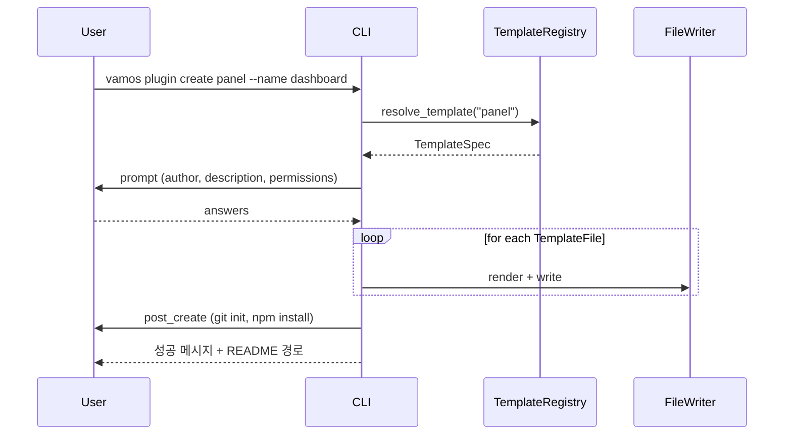
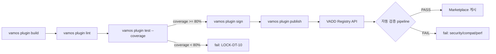

# plugin_devkit.md — VAMOS Plugin Dev Kit (V2-Phase 2)

> **Status**: DRAFT — Phase 2 V2-Phase 2
> **버전**: v2.0 (2026-04-21)
> **도메인**: #10 Developer-Tools-API-SDK, 서브폴더 `05_plugin-sdk/`
> **대응 STEP7-L**: **L-026 "플러그인 개발 도구"** (STEP7-L L549~L567 전수 verbatim 반영)
> **LOCK**: LOCK-DT-03 (CLI 명령어 체계 `vamos {동사} {명사} [옵션]`), LOCK-DT-09 (매니페스트 생성), LOCK-DT-10 (테스트 커버리지 ≥ 80%), LOCK-DT-05 (로컬 테스트 샌드박스 간접)

---

## §0. Purpose / Scope

### §0.1 목적

VAMOS 플러그인 개발자의 **개발 → 테스트 → 배포 라이프사이클** 을 Phase 2 범위에서 통합 CLI 로 확정한다:

1. **`vamos plugin create`** — 스캐폴딩 (STEP7-L L553 verbatim "create")
2. **`vamos plugin test`** — 로컬 테스트 + 핫 리로드 + 로그 뷰어 (STEP7-L L555 verbatim)
3. **`vamos plugin publish`** — 마켓플레이스 배포 (STEP7-L L553, L557 verbatim)
4. **`vamos plugin keygen`** — Ed25519 키 생성 (wasm_sandbox.md §9.1 보완)
5. **`vamos plugin build`** — WASM 패키징 (Phase 2 추가)
6. **`vamos plugin lint`** — 매니페스트 정적 검증 (Phase 2 추가)
7. **문서 생성기** — manifest → API 문서 자동화 (STEP7-L L556 verbatim)
8. **템플릿** — 플러그인 유형별 스캐폴딩 (STEP7-L L554 verbatim)

### §0.2 Phase 2 범위 vs Phase 3 이월

| 축 | Phase 2 확정 | Phase 3 이월 |
|----|------------|--------------|
| CLI 8 서브커맨드 | ✅ §2 | UX 개선 (TUI 진행 표시) |
| 템플릿 5종 (§3) | ✅ §3 | 언어별 확장 (Go, Ruby) |
| 핫 리로드 (로컬 테스트) | ✅ §5.2 | 원격 디버거 통합 |
| 문서 생성기 | ✅ §6 | Swagger UI 통합 |
| 마켓플레이스 배포 | ✅ §8 | CI/CD 통합 (GitHub Action) |
| 테스트 러너 (LOCK-DT-10 80%) | ✅ §5.4 | 퍼징 지원 |
| 키 관리 | ✅ §7 | HSM 통합 |

### §0.3 STEP7-L L-026 원문 앵커 (verbatim)

```
[STEP7-L L549] ### L-026. 플러그인 개발 도구
[STEP7-L L552] - VAMOS Plugin Dev Kit:
[STEP7-L L553]   ├─ CLI: vamos plugin create/test/publish
[STEP7-L L554]   ├─ 템플릿: 플러그인 유형별 스캐폴딩
[STEP7-L L555]   ├─ 로컬 테스트: 핫 리로드 + 로그 뷰어
[STEP7-L L556]   ├─ 문서 생성기: manifest → API 문서
[STEP7-L L557]   └─ 마켓플레이스 배포 도구
[STEP7-L L559] [구현성] V2: ✅ 3개월
```

---

## §1. 교차 참조 블록

| 참조 문서 | 위치 | 본 문서 사용 목적 |
|----------|------|-----------------|
| `D:\VAMOS\docs\sot\STEP7-L_개발자도구_API_SDK_작업가이드.md` | L549~L567 (L-026), L229~L238 (L-014 CLI 규칙) | 정본 원문 |
| `AUTHORITY_CHAIN.md` §5 | L60 (DT-03), L66 (DT-09), L67 (DT-10) | LOCK 정본 |
| `plugin_architecture.md` §3 | manifest 스키마 | `create` 가 생성하는 파일 구조 |
| `plugin_architecture.md` §5.5 | 배포 파이프라인 요약 | 본 문서 §8 상세 |
| `wasm_sandbox.md` §9 | 서명 검증 | `keygen` 으로 개발자 키 발급 |
| `hook_system.md` §E | 훅 정의 | 문서 생성기 훅 섹션 |
| `ui_components.md` §2.1 | 패널 Pydantic | 템플릿 `panel` 스캐폴딩 |
| `theme_system.md` §E | 테마 정의 | 템플릿 `theme` 스캐폴딩 |

---

## §2. CLI 명령어 체계 (LOCK-DT-03 "vamos {동사} {명사} [옵션]" 준수)

### §2.1 서브커맨드 매트릭스

| 명령 | 목적 | LOCK 연관 | STEP7-L 근거 |
|------|------|----------|------------|
| `vamos plugin create <template> [--name N]` | 신규 플러그인 스캐폴딩 | LOCK-DT-09 | L553 verbatim |
| `vamos plugin build [--target wasm32-wasi]` | WASM 패키지 빌드 | LOCK-DT-05 | Phase 2 추가 |
| `vamos plugin lint` | 매니페스트 + 권한 정적 검증 | LOCK-DT-09 | Phase 2 추가 |
| `vamos plugin test [--hot]` | 로컬 테스트 (핫 리로드) | LOCK-DT-10 | L555 verbatim |
| `vamos plugin docs` | manifest → 문서 자동 생성 | LOCK-DT-09 | L556 verbatim |
| `vamos plugin keygen [--out PATH]` | Ed25519 키 생성 | (wasm_sandbox §9) | Phase 2 추가 |
| `vamos plugin sign <vpkg>` | `.vpkg` 서명 | (wasm_sandbox §9) | Phase 2 추가 |
| `vamos plugin publish [--registry URL]` | VADD Marketplace 배포 | LOCK-DT-08 (Rate limit) | L553, L557 verbatim |

### §2.2 LOCK-DT-03 정본 5필드 분리 인용

| 필드 | 값 |
|------|----|
| **LOCK ID** | LOCK-DT-03 |
| **항목** | CLI 명령어 체계 |
| **값** | `vamos {동사} {명사} [옵션]` 패턴 |
| **출처** | L-014 |
| **근거 성격** | 확장 결정 — L-014 CLI 예시에서 패턴 귀납 |
| **변경 절차** | CONFLICT_LOG 기록 → A/B 테스트 → 승인 |

> 본 문서의 모든 `vamos plugin <verb> <noun>` 명령은 상기 패턴 준수 (§2.1 8 명령 전수 `plugin` 명사 + 동사 형식).

### §2.3 공통 옵션

| 옵션 | 의미 |
|------|------|
| `--verbose`, `-v` | 상세 로그 |
| `--quiet`, `-q` | 에러만 출력 |
| `--json` | 구조화 출력 (파이프 친화) |
| `--dry-run` | 실제 변경 없이 시뮬레이션 |
| `--config PATH` | 대체 설정 파일 |

---

## §3. 템플릿 (STEP7-L L554 verbatim: "플러그인 유형별 스캐폴딩")

### §3.1 지원 템플릿 5종

| 템플릿 ID | 용도 | 생성 파일 |
|----------|-----|----------|
| `hello-world` | 학습용 최소 예제 | manifest.json + plugin.py + README.md |
| `tool` | MCP 도구 제공 | + tools/example_tool.py |
| `panel` | 사이드바 패널 | + ui/panel.html + ui/panel.js + Web Components |
| `theme` | 에디터/UI 테마 | + themes/my-theme.json + CSS 변수 |
| `hooks` | 이벤트 훅 다수 | + hooks/on_chat_start.py + hooks/on_agent_end.py |

### §3.2 Pydantic 템플릿 스펙

```python
from pydantic import BaseModel

class TemplateSpec(BaseModel):
    id: str
    description: str
    files: list["TemplateFile"]
    post_create_commands: list[str] = []

class TemplateFile(BaseModel):
    relative_path: str
    content_template: str  # Jinja2 템플릿 (변수: {{name}}, {{author}}, {{permissions}})
    mode: int = 0o644
```

### §3.3 `create` 호출 흐름



---

## §4. UI / Hooks / Theme 템플릿 상세

### §4.1 `panel` 템플릿 (ui_components.md §2 연계)

```
dashboard-plugin/
├─ manifest.json        # contributes.views[] 선언 포함
├─ plugin.py            # register_panel(ctx, PanelSpec(...))
├─ ui/
│  ├─ panel.html        # <my-dashboard-panel> Web Component
│  ├─ panel.js          # customElements.define(...)
│  ├─ panel.css         # (optional)
│  └─ index.html        # entry
├─ config.yaml
└─ README.md
```

### §4.2 `theme` 템플릿 (theme_system.md §E 연계)

```
my-theme-plugin/
├─ manifest.json        # contributes.themes[] 선언 + permissions=["theme:register"]
├─ plugin.py            # 최소 등록 로직
├─ themes/
│  ├─ my-theme.json     # editorScheme + uiScheme
│  └─ my-theme.css      # CSS 변수 (--vamos-bg-primary 등)
└─ README.md
```

### §4.3 `hooks` 템플릿 (hook_system.md §E 연계)

```
hooks-plugin/
├─ manifest.json        # hooks: ["on_chat_start", "on_tool_call", "on_agent_end"]
├─ plugin.py
├─ hooks/
│  ├─ on_chat_start.py
│  ├─ on_tool_call.py
│  └─ on_agent_end.py
└─ README.md
```

---

## §5. 로컬 테스트 (STEP7-L L555 verbatim: "핫 리로드 + 로그 뷰어")

### §5.1 `vamos plugin test` 기본 동작

- 현재 디렉터리를 플러그인 루트로 가정
- `vamos plugin build` 자동 실행 (변경분만)
- 로컬 VAMOS 호스트 인스턴스에 `install --local` 등록
- `--hot` 플래그 시 파일 감시 + 자동 재로드
- 로그 뷰어 실시간 스트림

### §5.2 핫 리로드 알고리즘

```python
class HotReloader:
    """
    파일 감시 + 재빌드 + 재로드. ABC: BaseWatcher 준수.
    시간복잡도: 변경 이벤트당 O(|변경 파일| + |재빌드 의존성|).
    """

    async def watch_loop(self, root: str):
        async for event in fs_watch(root, patterns=["*.py", "*.wasm", "manifest.json"]):
            if event.path.endswith(".py"):
                await self.rebuild_python()
            elif event.path.endswith(".wasm") or event.path == "manifest.json":
                await self.rebuild_wasm()
            await self.reload_plugin()
            self.logger.info(f"✓ reloaded after change: {event.path}")
```

### §5.3 로그 뷰어 포맷

- **기본**: 컬러 터미널 (ANSI)
- `--json`: JSONL stdout (R-01-7 중첩 구조)
- 필터: `--level warning+`, `--grep PATTERN`
- `--follow` / `-f`: tail 동작

### §5.4 테스트 커버리지 리포트 (LOCK-DT-10)

`vamos plugin test --coverage` 옵션으로 커버리지 측정:

| 필드 | 값 |
|------|----|
| **LOCK ID** | LOCK-DT-10 |
| **항목** | 커버리지 임계값 |
| **값** | **테스트 커버리지 ≥ 80%** |
| **출처** | **STEP7-F §테스트전략** (별도 문서 근거) |
| **근거 성격** | 별도 문서 근거 — STEP7-L 아닌 STEP7-F 문서 |
| **변경 절차** | 품질 메트릭 근거 필수 |

- 80% 미만이면 `publish` 차단 (CI/CD 게이트 연계)
- 언어별 도구: Python pytest-cov / Node jest coverage / Rust cargo-tarpaulin (간접, WASM 변환 전)

---

## §6. 문서 생성기 (STEP7-L L556 verbatim: "manifest → API 문서")

### §6.1 `vamos plugin docs` 출력

Markdown + HTML 양 형식 출력:

```
my-plugin/dist/docs/
├─ index.md           # 개요 + 사용법
├─ commands.md        # 등록된 커맨드 목록
├─ permissions.md     # 선언된 권한 + 이유 (README 에서 파싱)
├─ hooks.md           # 등록된 훅 + 이벤트 설명 (hook_system.md §E 링크)
├─ themes.md          # 제공 테마 (theme_system.md §E 링크)
├─ api.html           # 렌더된 HTML
└─ openapi.json       # 다른 플러그인이 소비할 수 있는 API 스키마 (선택)
```

### §6.2 파싱 규칙

- `manifest.json` → 커맨드/훅/테마/views 섹션
- `plugin.py` docstring → 사용법
- `README.md` 첫 줄 H1 → 플러그인 제목
- `tools/*.py` → 도구 목록 + 인자 스키마

### §6.3 문서 생성 ABC

```python
class BaseDocGenerator(ABC):
    @abstractmethod
    async def parse_manifest(self, path: str) -> dict: ...
    @abstractmethod
    async def parse_source(self, root: str) -> dict: ...
    @abstractmethod
    async def render_markdown(self, data: dict, out: str) -> None: ...
    @abstractmethod
    async def render_html(self, data: dict, out: str) -> None: ...
```

---

## §7. 키 관리 + 서명 (`keygen` + `sign`)

### §7.1 `vamos plugin keygen`

```bash
vamos plugin keygen --out ~/.vamos/keys/
# 출력:
#   private.key   (Ed25519 seed, 0600 퍼미션)
#   public.key    (Ed25519 공개 키)
#   fingerprint:  dev-abcd1234  (SHA-256 truncated)
```

### §7.2 `vamos plugin sign <vpkg>`

- `.vpkg` 전체 SHA-256 해시 계산
- private key 로 Ed25519 서명
- `manifest.json.signature` 블록 삽입 (wasm_sandbox.md §9.2 참조)
- 출력: 서명 완료 `.vpkg` + verify 검증 pass 확인

### §7.3 키 보관 (Phase 2)

- 로컬 `~/.vamos/keys/` 파일 (0600, 파일시스템 권한 의존)
- Phase 3: OS 키체인 (macOS Keychain / Windows DPAPI / Linux GNOME Keyring) 통합

---

## §8. 마켓플레이스 배포 (`publish`)

### §8.1 배포 파이프라인 (plugin_architecture.md §5.5 상세)



### §8.2 VADD Registry API 호출

- `POST /api/v1/plugins/upload` with `.vpkg` multipart
- 인증: 개발자 API 토큰 (Bearer)
- Rate limit: **LOCK-DT-08 분당 60 요청** 준수
- 응답: `{registry_url, fingerprint, verification_status}`

### §8.3 검수 기준 (plan §C.2 참조)

| 항목 | PASS 기준 | FAIL 시 |
|------|----------|--------|
| 보안 스캔 | CVE 0건, 시크릿 탐지 0건 | REJECT |
| 호환성 | manifest.vamos_version 범위 동작 | REJECT |
| 성능 | 메모리 ≤ 256 MiB, 콜드 스타트 ≤ 3초 | WARN |
| 서명 | Ed25519 개발자 서명 유효 | REJECT |
| 커버리지 | LOCK-DT-10 ≥ 80% | REJECT |

---

## §9. `lint` — 매니페스트 정적 검증

### §9.1 검증 규칙

| 규칙 ID | 설명 | 에러 수준 |
|--------|------|---------|
| L001 | `$schema` = `plugin-manifest-v1.json` | ERROR |
| L002 | `name` 정규식 (영소문자, reverse-DNS 권장) | WARNING |
| L003 | `version` semver | ERROR |
| L004 | `permissions` 전체가 허용 목록 내 | ERROR |
| L005 | 선언된 권한 × 실제 API 사용 일치 | WARNING (초과 선언 시) + ERROR (선언 누락) |
| L006 | `runtime=wasm` 인데 `entry_point` 가 `.py` | ERROR |
| L007 | `contributes.commands[].id` 중복 | ERROR |
| L008 | `hooks` 목록이 `HOOK_EVENTS` 상수 집합 내 | WARNING |

### §9.2 정적 사용 분석 (권한 ↔ 코드)

```python
class StaticAnalyzer:
    """
    plugin.py / plugin.wasm (export imports) 를 분석하여
    실제 사용 호스트 API 를 manifest 권한과 대조.
    시간복잡도: O(|imports| + |permissions|).
    """

    def required_permissions_from_imports(self, imports: list[str]) -> set[str]:
        mapping = PERMISSION_API_MAP  # wasm_sandbox.md §6.2 표 역매핑
        return {perm for imp in imports for perm in mapping.get(imp, [])}

    def lint(self, manifest: PluginManifest, imports: list[str]) -> list[LintIssue]:
        issues = []
        required = self.required_permissions_from_imports(imports)
        declared = set(manifest.permissions)
        missing = required - declared
        excess = declared - required
        if missing:
            issues.append(LintIssue("L005", "ERROR", f"미선언 권한: {missing}"))
        if excess:
            issues.append(LintIssue("L005", "WARNING", f"사용되지 않는 권한: {excess}"))
        return issues
```

---

## §10. 에러 처리 · 에스컬레이션 페이로드

```python
class DevkitEscalationPayload(BaseModel):
    source_engine: str = "plugin_devkit"
    error_code: str  # "BUILD_FAIL" | "LINT_ERROR" | "TEST_COVERAGE_BELOW_80" | "SIGN_FAIL" | "PUBLISH_REJECTED" | "REGISTRY_RATE_LIMIT"
    original_request: dict  # CLI args
    partial_result: Optional[dict] = None
    retry_count: int = 0
    timestamp: str
    trace_id: str
```

### §10.1 Phase 별 복구 전략

| CLI | 에러 | 1차 조치 | 2차 조치 | Escalation |
|-----|------|----------|----------|-----------|
| `build` | BUILD_FAIL | 증분→전체 재빌드 | 사용자 개입 | penalty -0.2 |
| `lint` | LINT_ERROR | 자동 수정 (일부 규칙) | 사용자 수정 필요 | penalty -0.1 |
| `test` | COVERAGE<80% | 누락 파일 리포트 | `publish` 차단 (LOCK-DT-10) | L2, penalty -0.5 |
| `sign` | KEY_NOT_FOUND | `keygen` 유도 | 사용자 | penalty -0.3 |
| `publish` | REGISTRY_RATE_LIMIT | exponential backoff 재시도 3회 | 수동 재시도 | penalty -0.2 |
| `publish` | PUBLISH_REJECTED | 검증 리포트 표시 | 사용자 개선 | L2, penalty -0.4 |

---

## §11. 로깅 포맷 (R-01-7)

```json
{
  "trace_id": "devkit-2026-04-21-d2e8",
  "timestamp": "2026-04-21T23:00:00Z",
  "phase": "plugin_devkit.publish",
  "error": {
    "code": "TEST_COVERAGE_BELOW_80",
    "message": "Coverage 73% below LOCK-DT-10 threshold 80%",
    "details": {"measured": 0.73, "threshold": 0.80}
  },
  "context": {
    "plugin_name": "my-plugin",
    "version": "1.0.0",
    "registry": "https://vadd.vamos.dev",
    "command": "vamos plugin publish"
  },
  "recovery": {
    "fallback_used": false,
    "retry_count": 0,
    "downgrade_applied": ["publish_blocked"],
    "confidence_penalty": -0.5,
    "lock_blocked": "LOCK-DT-10"
  }
}
```

---

## §12. Phase 3 테스트 시나리오 (≥ 10건)

| ID | 시나리오 | 주입 | 기대 결과 |
|----|---------|------|----------|
| DK-T01 | `create panel --name dashboard` | CLI | 스캐폴딩 폴더 6 파일 생성, manifest 유효 |
| DK-T02 | `create` 시 중복 이름 | 기존 디렉토리 존재 | 덮어쓰기 확인 prompt |
| DK-T03 | `build` wasm 타겟 | `cargo build --target wasm32-wasi` | `dist/plugin.wasm` 생성 |
| DK-T04 | `lint` 미선언 권한 (ERROR L005) | manifest 에 `file_read` 없이 `vamos_fs_read` 호출 | ERROR 보고, exit 1 |
| DK-T05 | `lint` 과다 선언 (WARNING) | 사용 안하는 `web_search` 선언 | WARNING 로그 |
| DK-T06 | `test --hot` 핫 리로드 | 파일 수정 | 자동 재로드, 로그 스트림 |
| DK-T07 | `test --coverage` 79% | 테스트 부족 | `publish` 차단, LOCK-DT-10 위반 리포트 |
| DK-T08 | `test --coverage` 85% | 충분한 테스트 | PASS, 리포트 HTML 생성 |
| DK-T09 | `docs` 자동 생성 | 정상 플러그인 | 7 파일 문서 출력 |
| DK-T10 | `keygen` 키 생성 | CLI | Ed25519 쌍 생성, 0600 퍼미션 |
| DK-T11 | `sign` 서명 | 유효 키 + `.vpkg` | 서명 블록 삽입, verify PASS |
| DK-T12 | `publish` Rate Limit | 분당 61회째 호출 | LOCK-DT-08 차단, backoff 재시도 |
| DK-T13 | `publish` 서명 없음 | 미서명 `.vpkg` | REJECT, sign 유도 메시지 |
| DK-T14 | `publish` 성능 WARN (4초 콜드 스타트) | 느린 플러그인 | WARN + 게시 (강제), 개선 알림 |

---

## §13. LOCK 정본 매트릭스

| LOCK ID | 값 | 출처 | 본 문서 인용 지점 |
|---------|---|------|-----------------|
| LOCK-DT-03 | `vamos {동사} {명사} [옵션]` 패턴 | L-014, 확장 결정 | §2.1 (8 명령 매트릭스) + §2.2 (정의) + §2.3 (공통 옵션) = **3 지점** |
| LOCK-DT-09 | plugin-manifest-v1.json | L-019, 확장 결정 | §2.1 `create`/`lint`/`docs` 매니페스트 파싱 + §3 템플릿 manifest.json 생성 + §6.1 docs 파싱 + §9.1 lint L001/L003 = **5 지점** |
| LOCK-DT-10 | 테스트 커버리지 ≥ 80% | STEP7-F §테스트전략 (**별도 문서 근거**) | §2.1 `test` + §5.4 (정의) + §8.1 (publish 게이트) + §10.1 (escalation) + §11 (로그) = **5 지점** |
| LOCK-DT-05 | WASM 격리, 선언된 권한만 허용 | L-025, 확장 결정 | §2.1 `build` (target wasm32-wasi) + §5.1 (로컬 테스트 샌드박스 간접) + §9.2 (권한 정적 분석) = **3 지점** |
| LOCK-DT-08 | 분당 60 요청 | L-011, 직접 일치 | §8.2 (Registry API rate limit) + §10.1 (publish 복구 전략) = **2 지점** |

---

## §14. V2↔V2 Peer Cross-Check

| from | to | 방향 | 인터페이스 |
|------|----|----|------------|
| `plugin_devkit.md §2.1 create` | `plugin_architecture.md §2, §3` | → | 플러그인 디렉터리 구조 + manifest 생성 |
| `plugin_devkit.md §4.1 panel 템플릿` | `ui_components.md §2.1 PanelSpec` | → | 스캐폴딩 Pydantic 재사용 |
| `plugin_devkit.md §4.2 theme 템플릿` | `theme_system.md §E.2 ThemeManifest` | → | 테마 매니페스트 생성 |
| `plugin_devkit.md §4.3 hooks 템플릿` | `hook_system.md §E.4 HOOK_EVENTS` | → | 훅 이벤트명 검증 |
| `plugin_devkit.md §7 keygen/sign` | `wasm_sandbox.md §9 서명 검증` | → | 발급 키 ↔ 검증 키 대응 |
| `plugin_devkit.md §9.2 lint` | `wasm_sandbox.md §6.2 권한 × API 표` | ← | 정적 분석 매핑 테이블 재사용 |
| `plugin_devkit.md §5.4 coverage` | `01_coding-engine/quality_dashboard.md MetricKind` | → | 간접 — PLUGIN_COVERAGE 메트릭 공급 가능성 |
| `plugin_devkit.md §8.2 publish` | `07_marketplace/rest_api` (Phase 2 P2-5) | → | VADD Registry 연계 (P2-5 이월) |

---

## §15. 변경 이력

| 날짜 | 태그 | 변경 내용 | 변경자 |
|------|------|----------|--------|
| 2026-04-21 | V2-Phase 2 | 최초 작성 (P2-3 #2a-part3). STEP7-L L-026 (L549~L567) verbatim + 8 CLI 서브커맨드 §2 + 템플릿 5종 §3~§4 + 핫 리로드 §5.2 + 문서 생성기 §6 + 키 관리 §7 + 마켓플레이스 §8 + lint §9 + Phase 3 테스트 14건 | STAGE 7 3-7 P2-3 |
