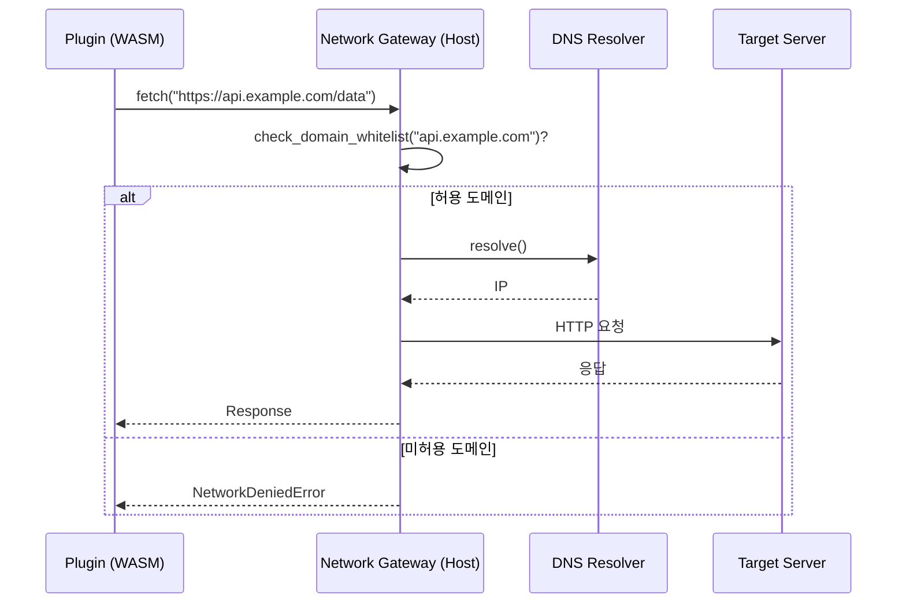

# wasm_sandbox.md — VAMOS 플러그인 WASM 샌드박스 정책 (V2-Phase 2)

> **Status**: DRAFT — Phase 2 V2-Phase 2 (LOCK-DT-05 정본 직접 참조)
> **버전**: v2.0 (2026-04-21)
> **도메인**: #10 Developer-Tools-API-SDK, 서브폴더 `05_plugin-sdk/`
> **대응 STEP7-L**: **L-025 "플러그인 샌드박스"** (STEP7-L L531~L547 전수 verbatim 반영)
> **LOCK**: **LOCK-DT-05 정본 직접 인용** (AUTHORITY §5 L62), LOCK-DT-06 (타임아웃), LOCK-DT-09 (매니페스트 권한 필드 출처)

---

## §0. Purpose / Scope

### §0.1 목적

VAMOS 플러그인 실행의 **보안 격리 정본** 을 Phase 2 범위에서 확정한다. **LOCK-DT-05 "WASM 격리, 선언된 권한만 허용"** 을 다음 축으로 구체화:

1. **격리 4차원** (파일시스템 / 네트워크 / CPU·메모리 / API) — STEP7-L L534~L538 verbatim
2. **악성 플러그인 방지 4축** (코드 리뷰 / 서명 검증 / 동적 분석 / 사용자 리포트) — STEP7-L L540~L544 verbatim
3. **WASM 런타임 선택 정책** (wasmtime / wasmer 의 fallback 순서)
4. **Capability-based security 모델** (선언된 권한 → 호스트 API 바인딩)
5. **탈출 방지 / 감사 로깅** (sandbox escape detection + 불변 감사 트레일)

### §0.2 Phase 2 범위 vs Phase 3 이월

| 축 | Phase 2 확정 | Phase 3 이월 |
|----|------------|--------------|
| 격리 4차원 정책 | ✅ §3~§6 | 세부 리소스 임계값 튜닝 |
| 악성 플러그인 방지 4축 | ✅ §7 | 머신러닝 기반 이상 탐지 |
| WASM 런타임 (wasmtime 기본) | ✅ §9 | 대체 런타임 지원 |
| Capability model | ✅ §4 | 동적 권한 요청 UX |
| 서명 검증 | ✅ §7.2 | HSM 기반 고급 서명 |
| 감사 로깅 | ✅ §11 | Tamper-proof Merkle tree 서명 |
| webview CSP | ✅ §8 | CSP nonce 동적 발급 |

### §0.3 STEP7-L L-025 원문 앵커 (verbatim)

```
[STEP7-L L531] ### L-025. 플러그인 샌드박스
[STEP7-L L534] - 플러그인 격리:
[STEP7-L L535]   ├─ 파일시스템: 허가된 경로만 접근
[STEP7-L L536]   ├─ 네트워크: 허가된 도메인만 접근
[STEP7-L L537]   ├─ CPU/메모리: 리소스 제한
[STEP7-L L538]   └─ API: 선언된 권한만 사용 가능
[STEP7-L L540] - 악성 플러그인 방지:
[STEP7-L L541]   ├─ 코드 리뷰 (마켓플레이스)
[STEP7-L L542]   ├─ 서명 검증
[STEP7-L L543]   ├─ 동적 분석 (행동 모니터링)
[STEP7-L L544]   └─ 사용자 리포트 시스템
[STEP7-L L546] [구현성] V2: ✅ 3개월
```

---

## §1. 교차 참조 블록

| 참조 문서 | 위치 | 본 문서 사용 목적 |
|----------|------|-----------------|
| `D:\VAMOS\docs\sot\STEP7-L_개발자도구_API_SDK_작업가이드.md` | L531~L547 (L-025) | Phase 2 요구 원문 정본 |
| `AUTHORITY_CHAIN.md` §5 | L62 LOCK-DT-05 | **정본 직접 인용** |
| `CONFLICT_LOG.md` §3 | CFL-005 (P0-2, RESOLVED) | WASM 외 런타임 격리 불명확 문제 해소 기록 |
| `DEVELOPER_TOOLS_API_SDK_구조화_종합계획서.md` §B.2 | L1698~L1706 | 샌드박스 제약 요약 표 |
| `plugin_architecture.md` §2.3, §6 | runtime 선택, load_plugin | 샌드박스 초기화 호출 |
| `plugin_architecture.md` §3.2 | manifest `permissions` 필드 | 선언된 권한 정본 |
| `hook_system.md` §E | 훅 실행 격리 | 훅 핸들러도 본 샌드박스 내 실행 |
| `ui_components.md` §2.3, §8 | webview CSP | iframe sandbox 세부 위임 (§8 참조) |
| `plugin_devkit.md` §5.3 | `vamos plugin lint` | 매니페스트 권한 정적 검증 |

---

## §2. LOCK-DT-05 정본 5필드 분리 인용 (AUTHORITY §5 L62 verbatim)

| 필드 | 값 |
|------|----|
| **LOCK ID** | LOCK-DT-05 |
| **항목** | 플러그인 샌드박스 정책 |
| **값** | **WASM 격리, 선언된 권한만 허용** |
| **출처** | L-025 |
| **근거 성격** | 확장 결정 — L-025 격리 요건에서 WASM 기술 선택 |
| **변경 절차** | 보안 감사 필수 |

> **본 문서의 모든 §3~§6 격리 정책은 상기 LOCK-DT-05 정본 값의 구체화이다.** Phase 3 변경이 필요하면 CONFLICT_LOG 등재 + 보안 감사 완료 후 AUTHORITY §5 갱신.

---

## §3. 격리 차원 1 — 파일시스템 (STEP7-L L535 verbatim: "허가된 경로만 접근")

### §3.1 Capability 기반 경로 화이트리스트

플러그인은 manifest 의 `permissions` 선언을 통해 **접근 가능한 경로 유형만** 사용:

| permission | 접근 범위 | 격리 기법 |
|-----------|---------|---------|
| `file_read` | `workspace/**`, 플러그인 전용 가상 FS | WASI `preopens` |
| `file_write` | 플러그인 전용 가상 FS 만 | WASI `preopens` (읽기 전용으로 workspace 제외) |
| `plugin_data` | `~/.vamos/plugins/<plugin_id>/` (격리된 전용 FS) | WASI `preopens` with symlink follow=false |

### §3.2 Pydantic 공통 자료 구조 (6 파일 공유)

```python
from typing import Optional
from pydantic import BaseModel, Field
from enum import Enum

class FSCapability(BaseModel):
    """파일시스템 격리 정책."""
    allowed_read_paths: list[str] = []   # glob 목록 (예: "workspace/**")
    allowed_write_paths: list[str] = []  # 쓰기 허용 경로 (일반적으로 plugin_data 만)
    follow_symlinks: bool = False         # 심볼릭 링크 추적 금지 (escape 방지)
    max_open_files: int = 64              # 리소스 제한
```

### §3.3 경로 정규화 + 탈출 방지 알고리즘

```python
def enforce_fs_capability(
    requested_path: str,
    capability: FSCapability,
    base_dir: str
) -> str:
    """
    요청 경로를 정규화하고 화이트리스트 검증.
    시간복잡도: O(|path| + G) — G: glob 패턴 수.
    LOCK-DT-05: 탈출 (../ / symlink) 시도 시 PathEscapeError 발생.
    """
    # 1. canonicalize
    abs_path = os.path.realpath(os.path.join(base_dir, requested_path))

    # 2. prefix 검증 (base_dir 하위인지)
    if not abs_path.startswith(os.path.realpath(base_dir) + os.sep):
        raise PathEscapeError(f"탈출 시도 감지: {requested_path}")

    # 3. 화이트리스트 glob 매칭 (읽기)
    if not any(pathlib.PurePath(abs_path).match(p) for p in capability.allowed_read_paths):
        raise PermissionDeniedError(f"file_read 경로 미선언: {abs_path}")

    # 4. symlink 추적 금지
    if not capability.follow_symlinks and os.path.islink(abs_path):
        raise SymlinkDeniedError(abs_path)

    return abs_path
```

### §3.4 탈출 방지 테스트 케이스 (§13 에 반영)

- `../../../etc/passwd` → `PathEscapeError` (workspace 밖)
- `workspace/safe -> /etc/passwd` (symlink) → `SymlinkDeniedError`
- `workspace\\..\\escape` (Windows sep) → 정규화 후 `PathEscapeError`

---

## §4. 격리 차원 2 — 네트워크 (STEP7-L L536 verbatim: "허가된 도메인만 접근")

### §4.1 도메인 화이트리스트

plugin manifest 의 `permissions.network_fetch` 에 허용 도메인 명시:

```json
{
  "permissions": {
    "network_fetch": {
      "domains": ["api.example.com", "*.trusted.io"],
      "methods": ["GET", "POST"]
    }
  }
}
```

### §4.2 HTTP 요청 프록시

WASI 플러그인은 호스트 OS 소켓에 직접 접근 불가. 모든 네트워크는 **호스트 프록시** 를 경유:



### §4.3 DNS rebinding 방어

- 플러그인 요청 시점의 IP 고정 (TOCTOU 방지)
- 사설 IP 범위 (RFC 1918 10.0.0.0/8, 172.16/12, 192.168/16) 차단 (데이터 유출 차단)
- 루프백 (127.0.0.0/8, ::1) 차단
- IPv4 link-local + 클라우드 메타데이터 (169.254.0.0/16, 169.254.169.254) 차단
- IPv6 link-local (fe80::/10) 및 ULA (fc00::/7) 차단
- (위 차단은 DNS 해석 직후의 실제 IP에 적용 — TOCTOU/rebinding 방지)

### §4.4 Pydantic 자료 구조

```python
class NetworkCapability(BaseModel):
    allowed_domains: list[str] = []      # glob (e.g. "*.example.com")
    allowed_methods: list[str] = ["GET"]
    max_request_size_bytes: int = 1_048_576   # 1 MiB
    max_response_size_bytes: int = 10_485_760  # 10 MiB
    request_timeout_ms: int = 30_000           # LOCK-DT-06 30초
```

---

## §5. 격리 차원 3 — CPU · 메모리 (STEP7-L L537 verbatim: "리소스 제한")

### §5.1 리소스 상한

| 자원 | 상한 | 초과 시 |
|------|-----|--------|
| 메모리 | **256 MiB** 기본 (plan §B.2 L1705) | OOM 에러, 플러그인 강제 종료 |
| CPU (단일 호출) | **30초** (LOCK-DT-06) | TimeoutError |
| CPU (누적, 분당) | 45초 (150%) | Rate limit (다음 분까지 대기) |
| 파일 핸들 | 64개 | `EMFILE` 에러 |
| 동시 네트워크 연결 | 8개 | 연결 대기 큐 |
| 스택 깊이 | 1024 프레임 | StackOverflowError |

### §5.2 wasmtime fuel consumption

wasmtime `fuel` API 로 CPU 제한 구현:

```rust
// 호스트 측 초기화 (pseudocode)
let mut config = wasmtime::Config::new();
config.consume_fuel(true);
let mut store = wasmtime::Store::new(&engine, host_state);
store.add_fuel(30_000_000_000).unwrap();  // ~30,000,000,000 instructions ≈ 30초 wall-clock 기준 (LOCK-DT-06)
```

### §5.3 메모리 제한 (linear memory)

```rust
let mut memory_type = wasmtime::MemoryType::new(1, Some(4096));  // 1 page = 64 KiB, 4096 pages = 256 MiB
```

### §5.4 리소스 사용 메트릭 공급 (quality_dashboard 연계)

```python
class ResourceMetrics(BaseModel):
    plugin_id: str
    memory_used_bytes: int
    cpu_time_ms: int
    fuel_consumed: int
    network_bytes_sent: int
    network_bytes_recv: int
    file_handles_open: int
    timestamp: str
```

→ `01_coding-engine/quality_dashboard.md §MetricKind` 에 `PLUGIN_MEMORY_USAGE`, `PLUGIN_CPU_TIME_MS`, `PLUGIN_TIMEOUT_COUNT` 메트릭 공급 (간접 cross-ref).

---

## §6. 격리 차원 4 — API (STEP7-L L538 verbatim: "선언된 권한만 사용 가능")

### §6.1 Capability-based security (CBS) 모델

플러그인은 매니페스트에 선언한 permission 에 대응하는 **호스트 API handle 만 보유**. 선언 없는 API 는 **WASM import 단계에서 missing import 로 로드 실패**.

### §6.2 권한 × 호스트 API 바인딩 표

| permission | 바인딩되는 호스트 함수 |
|-----------|---------------------|
| `file_read` | `vamos_fs_read`, `vamos_fs_list`, `vamos_fs_stat` |
| `file_write` | `vamos_fs_write`, `vamos_fs_delete` |
| `web_search` | `vamos_net_search` |
| `network_fetch` | `vamos_net_fetch` |
| `read:editor` | `vamos_editor_get_text`, `vamos_editor_get_selection` |
| `write:editor` | `vamos_editor_insert`, `vamos_editor_replace` |
| `use:llm` | `vamos_llm_complete`, `vamos_llm_embed` |
| `read:storage` | `vamos_kv_get` |
| `write:storage` | `vamos_kv_put`, `vamos_kv_delete` |
| `ui:render` | `vamos_ui_notify`, `vamos_ui_dialog`, `vamos_ui_panel_update` |
| `theme:register` | `vamos_theme_register` |

### §6.3 ABC 패턴 (BaseSandbox)

```python
from abc import ABC, abstractmethod

class BaseSandbox(ABC):
    """WASM 샌드박스 ABC. LOCK-DT-05 정본 정책 구현."""

    @abstractmethod
    async def init(self, manifest: "PluginManifest") -> None:
        """매니페스트의 선언된 권한만 호스트 API 바인딩. O(|permissions|)."""
        ...

    @abstractmethod
    async def invoke(self, command_id: str, args: dict) -> dict:
        """
        플러그인 함수 호출. LOCK-DT-06: 30초 타임아웃.
        LOCK-DT-05: fuel 고갈 시 TimeoutError, 메모리 초과 시 OOMError.
        """
        ...

    @abstractmethod
    async def shutdown(self) -> None:
        """샌드박스 정리 (메모리 해제, 네트워크 연결 종료). O(1)."""
        ...

    @abstractmethod
    async def get_metrics(self) -> "ResourceMetrics":
        """리소스 사용 지표 반환 (§5.4)."""
        ...
```

### §6.4 `init_sandbox()` 의사코드

```python
async def init_sandbox(
    manifest: PluginManifest,
    runtime: PluginRuntime = PluginRuntime.WASM
) -> BaseSandbox:
    """
    샌드박스 초기화. plugin_architecture.md §6.2 load_plugin 4단계 대응.
    시간복잡도: O(|wasm| + |permissions|).
    LOCK-DT-05: runtime=WASM 기본, Python/Node 는 §7 완화 규정.
    """
    if runtime == PluginRuntime.WASM:
        engine = wasmtime.Engine(
            wasmtime.Config()
                .consume_fuel(True)
                .epoch_interruption(True)
                .cranelift_opt_level(wasmtime.OptLevel.Speed)
        )
        store = wasmtime.Store(engine)
        store.add_fuel(30_000_000)  # 30초 fuel

        # 선언된 권한만 import 바인딩
        imports = build_imports_from_permissions(manifest.permissions)

        module = wasmtime.Module.from_file(engine, manifest.entry_point)
        instance = await wasmtime.Instance.new_async(store, module, imports)
        return WasmSandbox(store, instance, manifest)
    elif runtime == PluginRuntime.PYTHON:
        return PythonSubprocessSandbox(manifest)  # §7 완화
    elif runtime == PluginRuntime.NODE:
        return NodeVmSandbox(manifest)  # §7 완화
    else:
        raise ValueError(f"Unknown runtime: {runtime}")
```

---

## §7. WASM 외 런타임 완화 규정 (CFL-005 RESOLVED 반영)

### §7.1 CFL-005 해소 기록

`CONFLICT_LOG.md §3 CFL-005`: 상세명세의 WASM/Node.js/Python 3 런타임 병존에서 "LOCK 격리 수준 불명확" 지적. RESOLVED 결정: **"WASM 격리 우선"** — WASM 이 기본이며 Node/Python 은 레거시 호환 목적 한정.

### §7.2 Node.js VM 완화 규정

- `vm.createContext()` + `allowList` 모듈 (fs, path 만)
- `setTimeout` / `setInterval` 타이머 차단
- `require()` 금지 (ESM `import` + 정적 해석만)
- `global` 객체 freeze

### §7.3 Python subprocess 완화 규정

- `subprocess.Popen(..., preexec_fn=setup_namespace)` (Linux)
- seccomp-bpf 화이트리스트 (read/write/open/close/mmap 만)
- `resource.setrlimit(RLIMIT_AS, 256 MiB)` 메모리 제한
- Windows: Job Object + Restricted Token

### §7.4 런타임 fallback chain

```
1차: wasmtime (기본, 가장 엄격)
2차: wasmer (wasmtime 불가 시, 동일 정책)
3차: Node VM (manifest `runtime: "node"` 선언 시만)
4차: Python subprocess (manifest `runtime: "python"` 선언 시만)
5차 (Phase 3): 임베디드 Deno (보안 강화 JS)
```

---

## §8. webview CSP (ui_components.md §2.3 연계)

### §8.1 기본 CSP 정책

```
Content-Security-Policy:
  default-src 'self';
  script-src 'self' 'wasm-unsafe-eval';
  style-src 'self' 'unsafe-inline';
  connect-src 'self' <manifest.network_fetch.domains>;
  img-src 'self' data:;
  frame-src 'none';
  object-src 'none';
  base-uri 'self';
  form-action 'self';
```

### §8.2 iframe sandbox attribute

```html
<iframe
  sandbox="allow-scripts allow-same-origin"
  src="plugin://<plugin_id>/<entry>"
/>
```

- `allow-top-navigation` 불허
- `allow-forms` 조건부 (manifest `contributes.views[].allow_forms: true` 선언 시만)
- `allow-popups` 불허

### §8.3 postMessage 메시지 검증

```python
def validate_webview_message(msg: dict, plugin_id: str) -> bool:
    """
    webview → 호스트 메시지 검증. LOCK-DT-05 CBS 원칙 연장.
    """
    if msg.get("plugin_id") != plugin_id:
        return False  # 도용 차단
    if msg.get("type") not in ALLOWED_MESSAGE_TYPES:
        return False  # 미선언 타입 차단
    return True
```

---

## §9. 서명 검증 (STEP7-L L542 verbatim: "서명 검증")

### §9.1 서명 방식 — Ed25519

- 개발자 쌍 키 쌍 생성: `vamos plugin keygen` (plugin_devkit.md §7)
- 서명 대상: `.vpkg` 패키지 전체 (zip + sha256)
- 서명 알고리즘: Ed25519 (RFC 8032)
- 검증 공개 키: VADD Registry 가 발급한 개발자 인증서

### §9.2 `.vpkg` 매니페스트 서명 블록

```json
{
  "signature": {
    "algorithm": "ed25519",
    "public_key_id": "dev-abcd1234",
    "signature_b64": "...",
    "signed_at": "2026-04-21T22:00:00Z",
    "target_hash_sha256": "..."
  }
}
```

### §9.3 검증 실패 시 처리

| 실패 유형 | 대응 |
|----------|-----|
| 서명 누락 | `install` 중단 + `SIGNATURE_MISSING` 에러 |
| 서명 불일치 | `install` 중단 + `SIGNATURE_INVALID` 에러, 보안 감사 로그 |
| 공개 키 revoked | `install` 중단 + `KEY_REVOKED` 에러, 사용자 경고 |

---

## §10. 악성 플러그인 방지 (STEP7-L L540~L544 verbatim 4축)

### §10.1 코드 리뷰 (L541)

- VADD Registry 게시 전 자동 검증 파이프라인:
  - Semgrep 정적 분석 (OWASP rules)
  - Snyk 취약점 스캔
  - manifest 권한-코드 일치성 검증 (선언 > 실제 사용 여부)
- 수동 리뷰 대상: `network_fetch` 다수 도메인 또는 `file_write` 권한 보유 플러그인

### §10.2 서명 검증 (L542)

§9 참조.

### §10.3 동적 분석 — 행동 모니터링 (L543)

- 플러그인 실행 중 행동 프로파일 수집:
  - API 호출 빈도 (`vamos_net_fetch` 시간당 count)
  - 이상 패턴: 권한 외 API import 시도 / 예외 스택 반복 / 루프 탈출 시도
- 임계값 초과 시 자동 비활성화 + 사용자 알림

```python
class AnomalyThreshold(BaseModel):
    fetch_per_second_max: int = 100      # >100 req/s 차단
    fs_read_per_second_max: int = 500
    failed_permission_count_max: int = 10  # 10회 이상 거부 시 차단
    error_rate_max: float = 0.5          # 50% 이상 에러
```

### §10.4 사용자 리포트 시스템 (L544)

- 플러그인 패널 하단 "신고" 버튼
- 리포트 유형: 악성 행동 / UI 버그 / 개인정보 우려 / 기타
- 임계값 (예: 5건/주) 초과 시 VADD 자동 재심사 트리거

---

## §11. 감사 로깅 (Audit Trail)

### §11.1 불변 감사 로그 대상

| 이벤트 | 로깅 필드 |
|--------|---------|
| `plugin_install` | plugin_id, version, signature_ok, permissions_declared |
| `plugin_enable` | plugin_id, timestamp |
| `permission_denied` | plugin_id, permission_requested, api_attempted |
| `path_escape_attempt` | plugin_id, requested_path, resolved_path |
| `network_blocked` | plugin_id, requested_url, block_reason |
| `fuel_exhausted` | plugin_id, command_id, fuel_consumed |
| `sandbox_crash` | plugin_id, error_code, wasm_trap |

### §11.2 감사 로그 저장 위치

- 로컬: `~/.vamos/audit/plugins/<YYYY-MM-DD>.jsonl`
- 보관 기간: 180 일 (로그 회전)
- 포맷: JSONL (R-01-7 중첩 구조)

---

## §12. 에러 처리 · 에스컬레이션 페이로드

```python
class SandboxEscalationPayload(BaseModel):
    source_engine: str = "wasm_sandbox"
    error_code: str  # "PATH_ESCAPE" | "NETWORK_DENIED" | "FUEL_EXHAUSTED" | "OOM" | "SIGNATURE_INVALID" | "SANDBOX_CRASH"
    original_request: dict
    partial_result: Optional[dict] = None
    retry_count: int = 0
    timestamp: str
    trace_id: str
    severity: str = "high"  # low | medium | high | critical
```

### §12.1 Phase 별 복구 전략

| Phase | 에러 | 1차 조치 | 2차 조치 | Escalation |
|-------|------|----------|----------|-----------|
| install (서명) | SIGNATURE_INVALID | 재다운로드 | install 중단 | L2 **critical**, penalty -1.0 |
| init | OOM | 메모리 256→128 MiB 축소 재시도 | init 실패 | L2 high, penalty -0.5 |
| invoke | FUEL_EXHAUSTED | 해당 호출만 실패 | 플러그인 유지 | penalty -0.2 |
| invoke | PATH_ESCAPE | 즉시 invoke 중단 | 보안 감사 기록 | L2 **critical**, penalty -0.8 |
| invoke | NETWORK_DENIED | 로깅 | 플러그인 유지 | penalty -0.1 |
| runtime | SANDBOX_CRASH | 자동 재시작 1회 | 플러그인 disable | L2 high, penalty -0.4 |

---

## §13. 로깅 포맷 (R-01-7)

```json
{
  "trace_id": "sandbox-2026-04-21-f9e1",
  "timestamp": "2026-04-21T22:55:30Z",
  "phase": "wasm_sandbox.invoke",
  "error": {
    "code": "PATH_ESCAPE",
    "message": "Requested path resolves outside workspace",
    "wasm_trap": "unreachable"
  },
  "context": {
    "plugin_id": "com.example.file-tool",
    "command_id": "example.open",
    "requested_path": "../../etc/passwd",
    "resolved_path": "/etc/passwd",
    "workspace_root": "/home/user/project"
  },
  "recovery": {
    "fallback_used": false,
    "retry_count": 0,
    "downgrade_applied": ["invoke_aborted"],
    "confidence_penalty": -0.8,
    "audit_logged": true
  }
}
```

---

## §14. Phase 3 테스트 시나리오 (≥ 10건)

| ID | 시나리오 | 주입 | 기대 결과 |
|----|---------|------|----------|
| WS-T01 | 정상 init (WASM, 3 permissions) | 유효 manifest | 샌드박스 enabled, fuel=30M |
| WS-T02 | PATH_ESCAPE (`../../../etc/passwd`) | 탈출 경로 요청 | `PATH_ESCAPE` 에러, audit 기록, penalty -0.8 |
| WS-T03 | 심볼릭 링크 탈출 (workspace/safe → /etc) | symlink 설정 후 read | `SymlinkDeniedError` |
| WS-T04 | NETWORK_DENIED (미선언 도메인) | `fetch("https://evil.com")` | 차단, penalty -0.1 |
| WS-T05 | 사설 IP rebind (api.x.com → 192.168.1.1) | DNS poisoning 시도 | 사설 IP 차단, L2 |
| WS-T06 | FUEL_EXHAUSTED (무한루프) | `while(true)` | 30초 시점 TimeoutError, penalty -0.2 |
| WS-T07 | OOM (300 MiB 할당) | 메모리 폭주 | OOM 후 128 MiB 재시도, 실패 시 L2 |
| WS-T08 | 미선언 API 호출 (import) | manifest 에 `use:llm` 없이 `vamos_llm_complete` | WASM load 단계 `missing import` 실패 |
| WS-T09 | SIGNATURE_INVALID | 서명 위조한 `.vpkg` | install 중단, **critical** L2, penalty -1.0 |
| WS-T10 | Ed25519 검증 성공 | 정상 서명 | install 통과 |
| WS-T11 | 동적 분석 (fetch 과다) | `fetch × 150 / sec` | 임계값 초과, 자동 비활성화 |
| WS-T12 | SANDBOX_CRASH (wasm trap) | `unreachable` instruction | 자동 재시작 1회, 성공 |
| WS-T13 | 스택 오버플로우 (1025 재귀) | 깊은 재귀 | StackOverflowError, penalty -0.3 |
| WS-T14 | 파일 핸들 고갈 (65개 open) | 대량 파일 열기 | 65개째 `EMFILE`, 우아한 폴백 |

---

## §15. LOCK 정본 매트릭스 (AUTHORITY §5 verbatim, 직접 참조)

| LOCK ID | 값 | 출처 | 본 문서 인용 지점 |
|---------|---|------|-----------------|
| **LOCK-DT-05** | **WASM 격리, 선언된 권한만 허용** | L-025, 확장 결정 | §2 (정의) + §3.1/§3.3 (FS 격리) + §4 (네트워크) + §5 (리소스) + §6 (API) + §6.3 (BaseSandbox ABC) + §6.4 (init_sandbox) + §7 (완화 규정) + §8 (webview CSP) + §9 (서명) + §10 (동적 분석) + §11 (감사) + §12.1 (escalation) + §13 (로그) = **20+ 지점 (본 문서 핵심 정본)** |
| LOCK-DT-06 | 30초 | D2.0-02 §실행제한 (**별도 문서 근거**) | §4.4 (timeout_ms=30_000) + §5.1 (CPU 30초) + §5.2 (fuel 30M) + §6.3 (invoke 타임아웃) + §6.4 (store.add_fuel(30_000_000)) = **5 지점** |
| LOCK-DT-09 | plugin-manifest-v1.json | L-019 | §4.1 (permissions.network_fetch.domains) + §6.2 (권한 × API 바인딩 표) + §6.4 (init_sandbox manifest 입력) + §9.2 (매니페스트 서명 블록) = **4 지점** |

---

## §16. V2↔V2 Peer Cross-Check

| from | to | 방향 | 인터페이스 |
|------|----|----|------------|
| `wasm_sandbox.md §6.4 init_sandbox` | `plugin_architecture.md §6.2 load_plugin` | ← | 호출 (4단계 샌드박스 초기화) |
| `wasm_sandbox.md §6.2` | `plugin_architecture.md §3.2 permissions` | ← | manifest 권한 필드 정본 |
| `wasm_sandbox.md §6.3 BaseSandbox` | `plugin_architecture.md §6.1 BasePluginLoader` | ← | ABC 패턴 상호 재사용 |
| `wasm_sandbox.md §6.2 `vamos_net_fetch`` | `hook_system.md §E.5 on_network_request` | → | 네트워크 요청 훅 발화 |
| `wasm_sandbox.md §5.4 ResourceMetrics` | `01_coding-engine/quality_dashboard.md MetricKind` | → | 간접 — PLUGIN_MEMORY_USAGE 등 메트릭 공급 |
| `wasm_sandbox.md §8` | `ui_components.md §2.3, §9.1` | ← | webview CSP 세부 규칙 제공 |
| `wasm_sandbox.md §9 서명` | `plugin_devkit.md §7 `vamos plugin keygen`` | → | CLI 키 생성 → 서명 바인딩 |
| `wasm_sandbox.md §10.3` | `03_refactoring/ast_pipeline.md §E (Phase 3 이월)` | 간접 | 동적 분석 파이프라인 재사용 가능성 |

---

## §17. 변경 이력

| 날짜 | 태그 | 변경 내용 | 변경자 |
|------|------|----------|--------|
| 2026-04-21 | V2-Phase 2 | 최초 작성 (P2-3 #2a-part3). STEP7-L L-025 (L531~L547) verbatim + LOCK-DT-05 정본 직접 참조 (§2, §15) + 격리 4차원 §3~§6 + 악성 방지 4축 §10 + 서명 §9 + webview CSP §8 + 감사 §11 + Phase 3 테스트 14건. CFL-005 RESOLVED 반영 (WASM 우선). | STAGE 7 3-7 P2-3 |
