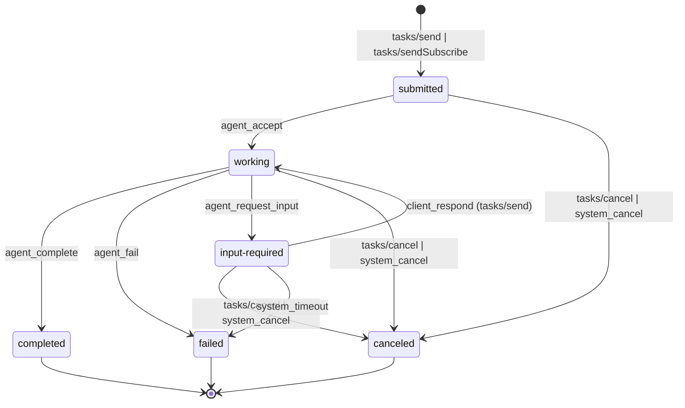

# Task Lifecycle 상태 머신

> **정본 소유**: sot 2/3-8_Conversation-A2A/01_a2a-protocol/task_lifecycle.md
> **버전**: v1.0
> **작성일**: 2026-04-10
> **Phase**: 1 (MVP)
> **L3 상태**: L3
> **대응 항목**: §6.1 #10 (Task Lifecycle 상태 머신 6개 상태), #11 (TaskStatusEvent / TaskArtifactEvent 이벤트)
> **세션**: P1-2

---

## 교차 참조 블록

| 정본 문서 | 참조 섹션 | 관계 |
|-----------|----------|------|
| 종합계획서 §3.4 | LOCK-A2A-02 | Task 상태 열거형 정본 |
| 종합계획서 §4.3 | R-11-4 | 상태 전이 규칙 준수 의무 |
| 종합계획서 §6.1 #10~#11 | 항목 매핑 | 구현 대상 정의 |
| 종합계획서 §7.3 Phase 1 #2 | 세션 작업 | Task Lifecycle 상태 머신 구현 |
| 종합계획서 §13.1 E2, E7 | L3 기준 | 상태 머신 + 테스트 스펙 |
| 종합계획서 부록 §A.1 | 프로토콜 스펙 | 상태 전이 규칙 |
| 상세명세 §2.2 | Task Lifecycle 상태 머신 | 원본 다이어그램 + 이벤트 타입 |
| `json_rpc_schema.md` (P1-1) §2.1, §2.5, §3.3 | 공통 타입 | TaskState, Task, TaskStatus, TaskStatusEvent, TaskArtifactEvent 재사용 |
| `agent_card_spec.md` (P1-3) | AgentCard.capabilities | streaming, stateTransitionHistory 연동 |
| `error_codes.md` (P1-6) | 에러 카탈로그 | 상태 전이 실패 시 에러 코드 참조 |
| #13 Agent-Protocol | 프로토콜 추상 계층 | 상위 호환 (CLF-A2A-001) |

---

## §1. 개요

본 문서는 VAMOS A2A 통신에서 Task의 전체 수명 주기를 관리하는 상태 머신을 정의한다. Google A2A 프로토콜(2025.04)에 정의된 6개 상태의 전이 규칙, 트리거 조건, 이벤트 구조를 명세하여 에이전트 간 작업 위임과 상태 추적의 기반을 확립한다.

**범위**:
- 6개 Task 상태 열거형 정의 (LOCK-A2A-02)
- 상태 전이 다이어그램 및 전이 조건 명세
- 허용/금지 전이 매트릭스
- TaskStatusEvent / TaskArtifactEvent 이벤트 스키마
- 상태 전이 검증 알고리즘
- 상태 전이 단위 테스트 케이스

**Phase 2 제외 항목**:
- Multi-turn 대화 상태 확장 (§6.1 #38, Phase 2)
- Push Notification 기반 상태 전파 (§6.1 #36, Phase 2)
- State Transition History 기록 (§6.1 #37, Phase 2)

---

## §2. 공통 자료 구조 선정의

> P1-1 `json_rpc_schema.md` §2에서 정의된 공통 타입을 재사용한다. 본 문서에서는 상태 머신 전용 타입만 추가 정의한다.

### 2.1 TaskState (LOCK-A2A-02 재참조)

```typescript
/**
 * Task 상태 열거형
 * LOCK-A2A-02: submitted|working|input-required|completed|failed|canceled
 * 변경 금지 -- Google A2A Spec 정본
 * 정의 원본: json_rpc_schema.md §2.1
 */
type TaskState = "submitted" | "working" | "input-required"
               | "completed" | "failed" | "canceled";
```

### 2.2 상태 분류

| 상태 | 분류 | 설명 | 종단(terminal) |
|------|------|------|---------------|
| `submitted` | 초기 | 클라이언트가 작업을 전송, 에이전트 수락 대기 | NO |
| `working` | 진행 | 에이전트가 작업을 처리 중 | NO |
| `input-required` | 대기 | 에이전트가 추가 입력을 요청, 클라이언트 응답 대기 | NO |
| `completed` | 종단 | 작업 정상 완료 | YES |
| `failed` | 종단 | 작업 실패 (복구 불가) | YES |
| `canceled` | 종단 | 작업 취소 (클라이언트 또는 시스템) | YES |

### 2.3 TaskTransition (신규 정의)

```typescript
/**
 * 상태 전이 기록 단일 항목
 * Phase 2 stateTransitionHistory 확장 시 Task.history에 축적
 */
interface TaskTransition {
  from: TaskState;
  to: TaskState;
  trigger: TransitionTrigger;
  timestamp: string;          // ISO 8601
  actor: "client" | "agent" | "system";
  reason?: string;
}

type TransitionTrigger =
  | "tasks/send"
  | "tasks/sendSubscribe"
  | "tasks/cancel"
  | "agent_accept"
  | "agent_complete"
  | "agent_fail"
  | "agent_request_input"
  | "client_respond"
  | "system_timeout"
  | "system_cancel";
```

### 2.4 TaskStatusEvent (P1-1 §3.3 재참조 + 확장)

```typescript
/**
 * SSE 상태 변경 이벤트
 * 정의 원본: json_rpc_schema.md §3.3
 * LOCK-A2A-02 상태 값 준수
 */
interface TaskStatusEvent {
  id: string;                          // Task ID
  status: TaskStatus;                  // json_rpc_schema.md §2.5
  final: boolean;                      // true = 종단 상태 (completed|failed|canceled)
  metadata?: Record<string, unknown>;
}
```

### 2.5 TaskArtifactEvent (P1-1 §3.3 재참조)

```typescript
/**
 * SSE 아티팩트 전달 이벤트
 * 정의 원본: json_rpc_schema.md §3.3
 */
interface TaskArtifactEvent {
  id: string;                          // Task ID
  artifact: Artifact;                  // json_rpc_schema.md §2.4
  lastChunk?: boolean;
}
```

---

## §3. 상태 전이 다이어그램

### 3.1 Mermaid 상태 다이어그램



### 3.2 텍스트 기반 전이 다이어그램

```
                        ┌───────────────────────────────────────┐
                        │           [*] (초기)                   │
                        └──────────────┬────────────────────────┘
                                       │ tasks/send | tasks/sendSubscribe
                                       v
                        ┌──────────────────────────────┐
                   ┌───>│          submitted            │<──────────────┐
                   │    └──────────┬───────────┬────────┘               │
                   │               │           │                        │
                   │    agent_accept│     tasks/cancel|system_cancel    │
                   │               v           v                        │
                   │    ┌────────────┐    ┌──────────┐                  │
                   │    │  working   │    │ canceled  │ ◄── (terminal)  │
                   │    └──┬─┬─┬─┬──┘    └──────────┘                  │
                   │       │ │ │ │                                      │
                   │       │ │ │ └── tasks/cancel ──> canceled          │
                   │       │ │ │                                        │
                   │       │ │ └── agent_request_input                  │
                   │       │ │              │                           │
                   │       │ │              v                           │
                   │       │ │     ┌─────────────────┐                 │
                   │       │ │     │ input-required   │                 │
                   │       │ │     └──┬─────┬────┬───┘                 │
                   │       │ │        │     │    │                      │
                   │       │ │        │     │    └── tasks/cancel ──> canceled
                   │       │ │        │     └── system_timeout ──> failed
                   │       │ │        │                                 │
                   │       │ │        └── client_respond (tasks/send)   │
                   │       │ │                    │                     │
                   │       │ │                    └──────> working      │
                   │       │ │                                         │
                   │       │ └── agent_fail                            │
                   │       │           │                                │
                   │       │           v                                │
                   │       │     ┌──────────┐                          │
                   │       │     │  failed   │ ◄── (terminal)          │
                   │       │     └──────────┘                          │
                   │       │                                           │
                   │       └── agent_complete                          │
                   │                  │                                 │
                   │                  v                                 │
                   │           ┌──────────┐                            │
                   │           │completed │ ◄── (terminal)             │
                   │           └──────────┘                            │
                   │                                                    │
                   └────────────────────────────────────────────────────┘
```

---

## §4. 허용 전이 매트릭스

### 4.1 허용 전이 (Allowed Transitions)

| # | From | To | 트리거 | Actor | 조건 |
|---|------|----|--------|-------|------|
| T1 | `submitted` | `working` | `agent_accept` | agent | 에이전트가 작업 수락 |
| T2 | `submitted` | `canceled` | `tasks/cancel` | client | 클라이언트 작업 취소 요청 |
| T3 | `submitted` | `canceled` | `system_cancel` | system | 시스템 타임아웃 또는 정책 취소 |
| T4 | `working` | `completed` | `agent_complete` | agent | 작업 정상 완료 |
| T5 | `working` | `failed` | `agent_fail` | agent | 작업 처리 실패 (복구 불가) |
| T6 | `working` | `input-required` | `agent_request_input` | agent | 추가 입력 필요 |
| T7 | `working` | `canceled` | `tasks/cancel` | client | 진행 중 작업 취소 |
| T8 | `working` | `canceled` | `system_cancel` | system | 시스템 강제 취소 |
| T9 | `input-required` | `working` | `client_respond` via `tasks/send` | client | 추가 입력 제공 |
| T10 | `input-required` | `canceled` | `tasks/cancel` | client | 대기 중 작업 취소 |
| T11 | `input-required` | `canceled` | `system_cancel` | system | 시스템 강제 취소 |
| T12 | `input-required` | `failed` | `system_timeout` | system | 입력 대기 타임아웃 초과 |

**총 허용 전이**: 12건

### 4.2 금지 전이 (Forbidden Transitions)

| # | From | To | 사유 |
|---|------|----|------|
| F1 | `completed` | `*` (모든 상태) | 종단 상태 — 역전이 불가 |
| F2 | `failed` | `*` (모든 상태) | 종단 상태 — 역전이 불가 |
| F3 | `canceled` | `*` (모든 상태) | 종단 상태 — 역전이 불가 |
| F4 | `submitted` | `completed` | working 단계 생략 불가 |
| F5 | `submitted` | `failed` | working 단계 생략 불가 |
| F6 | `submitted` | `input-required` | working 단계 생략 불가 |
| F7 | `input-required` | `completed` | working 복귀 후 완료 필수 |
| F8 | `input-required` | `input-required` | 자기 전이 불가 (재요청 시 working 경유) |
| F9 | `working` | `submitted` | 역전이 불가 |
| F10 | `working` | `working` | 자기 전이 불가 (진행률 업데이트는 TaskStatusEvent로 전달) |

**원칙**: 종단 상태(`completed`, `failed`, `canceled`)에서의 모든 전이는 금지. 비종단 상태에서도 단계 생략 및 역전이 금지.

### 4.3 전이 매트릭스 (요약)

| From \ To | submitted | working | input-required | completed | failed | canceled |
|-----------|-----------|---------|----------------|-----------|--------|----------|
| **submitted** | - | T1 | F6 | F4 | F5 | T2,T3 |
| **working** | F9 | F10 | T6 | T4 | T5 | T7,T8 |
| **input-required** | - | T9 | F8 | F7 | T12 | T10,T11 |
| **completed** | F1 | F1 | F1 | F1 | F1 | F1 |
| **failed** | F2 | F2 | F2 | F2 | F2 | F2 |
| **canceled** | F3 | F3 | F3 | F3 | F3 | F3 |

---

## §5. 전이 조건 상세 명세

### 5.1 T1: submitted -> working

| 항목 | 값 |
|------|---|
| **트리거** | `agent_accept` |
| **전제 조건** | Task가 `submitted` 상태, 에이전트가 해당 Task의 skill을 지원 |
| **후속 동작** | TaskStatusEvent 발행 (`state: "working"`, `final: false`) |
| **실패 시** | 에이전트가 skill 미지원이면 → (F5 금지: submitted→failed 직접 전이 불가) submitted→working(T1)→failed(T5) 경유 + 에러 코드 `-32004` (UnsupportedOperation) |
| **타임아웃** | 에이전트 수락 대기 시간 초과 시 `system_cancel` → `canceled` |

### 5.2 T4: working -> completed

| 항목 | 값 |
|------|---|
| **트리거** | `agent_complete` |
| **전제 조건** | Task가 `working` 상태, 처리 결과 아티팩트 생성 완료 |
| **후속 동작** | TaskStatusEvent 발행 (`state: "completed"`, `final: true`), 최종 TaskArtifactEvent 발행 (있는 경우) |
| **SSE 스트림** | `final: true` 이벤트 후 스트림 종료 |

### 5.3 T5: working -> failed

| 항목 | 값 |
|------|---|
| **트리거** | `agent_fail` |
| **전제 조건** | Task가 `working` 상태, 복구 불가능한 오류 발생 |
| **후속 동작** | TaskStatusEvent 발행 (`state: "failed"`, `final: true`, `status.message` 에 오류 상세) |
| **에러 코드 매핑** | `-32001` (TaskNotFound) / `-32002` (TaskNotCancelable) / `-32003` (PushNotificationNotSupported) / `-32005` (InternalError) |

### 5.4 T6: working -> input-required

| 항목 | 값 |
|------|---|
| **트리거** | `agent_request_input` |
| **전제 조건** | Task가 `working` 상태, 에이전트가 작업 진행을 위해 추가 입력 필요 |
| **후속 동작** | TaskStatusEvent 발행 (`state: "input-required"`, `final: false`, `status.message` 에 요청 내용) |
| **클라이언트 응답** | `tasks/send`로 동일 Task ID에 추가 message 전송 → T9 트리거 |

### 5.5 T9: input-required -> working

| 항목 | 값 |
|------|---|
| **트리거** | `client_respond` via `tasks/send` |
| **전제 조건** | Task가 `input-required` 상태, 클라이언트가 유효한 message를 전송 |
| **후속 동작** | TaskStatusEvent 발행 (`state: "working"`, `final: false`), 에이전트 작업 재개 |
| **유효성** | message가 에이전트 요청 형식과 불일치 시 → 에이전트가 다시 `input-required` 전이 (working 경유) |

### 5.6 T2/T7/T10: * -> canceled (클라이언트)

| 항목 | 값 |
|------|---|
| **트리거** | `tasks/cancel` |
| **전제 조건** | Task가 비종단 상태 (`submitted` / `working` / `input-required`) |
| **후속 동작** | TaskStatusEvent 발행 (`state: "canceled"`, `final: true`) |
| **이미 종단 시** | 에러 응답 `-32002` (TaskNotCancelable) |

### 5.7 T12: input-required -> failed (타임아웃)

| 항목 | 값 |
|------|---|
| **트리거** | `system_timeout` |
| **전제 조건** | Task가 `input-required` 상태, 설정된 입력 대기 타임아웃 초과 |
| **후속 동작** | TaskStatusEvent 발행 (`state: "failed"`, `final: true`, `status.message` 에 타임아웃 사유) |
| **기본 타임아웃** | 300초 (LOCK-A2A-09 Circuit Breaker와 별도, 에이전트별 설정 가능) |

---

## §6. 상태 전이 검증 알고리즘

### 6.1 의사코드

```typescript
/**
 * 상태 전이 검증 함수
 * 시간복잡도: O(1) — 허용 전이 맵 조회
 * LOCK 참조: LOCK-A2A-02 (TaskState 6개 값)
 * ABC 매핑: A(입력) = {currentState, targetState}, B(처리) = 허용 맵 조회, C(출력) = boolean
 */

// 허용 전이 맵 (adjacency set)
const ALLOWED_TRANSITIONS: Record<TaskState, Set<TaskState>> = {
  "submitted":      new Set(["working", "canceled"]),
  "working":        new Set(["completed", "failed", "input-required", "canceled"]),
  "input-required": new Set(["working", "canceled", "failed"]),
  "completed":      new Set(),   // terminal — 전이 없음
  "failed":         new Set(),   // terminal — 전이 없음
  "canceled":       new Set(),   // terminal — 전이 없음
};

// 종단 상태 집합
const TERMINAL_STATES: Set<TaskState> = new Set([
  "completed", "failed", "canceled"
]);

/**
 * validateTransition
 * @param currentState 현재 Task 상태 (LOCK-A2A-02 값)
 * @param targetState  목표 Task 상태 (LOCK-A2A-02 값)
 * @returns { valid: boolean; error?: A2AError }
 *
 * 시간복잡도: O(1)
 */
function validateTransition(
  currentState: TaskState,
  targetState: TaskState
): { valid: boolean; error?: A2AError } {

  // 1. 종단 상태에서의 전이 시도 → 즉시 거부
  if (TERMINAL_STATES.has(currentState)) {
    return {
      valid: false,
      error: {
        code: -32002,
        message: `TaskNotCancelable: Task in terminal state '${currentState}', no transitions allowed`,
        data: { detail: `forbidden_transition: ${currentState} -> ${targetState}` }
      }
    };
  }

  // 2. 허용 전이 맵 조회
  const allowed = ALLOWED_TRANSITIONS[currentState];
  if (!allowed || !allowed.has(targetState)) {
    return {
      valid: false,
      error: {
        code: -32603,
        message: `InternalError: Invalid state transition '${currentState}' -> '${targetState}'`,
        data: { detail: `forbidden_transition: ${currentState} -> ${targetState}` }
      }
    };
  }

  // 3. 유효한 전이
  return { valid: true };
}
```

### 6.2 예외 처리 정책 표

| error_code | 설명 | recoverable | 처리 |
|-----------|------|-------------|------|
| `-32001` | TaskNotFound | NO | Task ID가 존재하지 않음 — 클라이언트에 에러 응답 |
| `-32002` | TaskNotCancelable | NO | 이미 종단 상태인 Task 취소 시도 — 에러 응답 |
| `-32004` | UnsupportedOperation | NO | 에이전트가 미지원 skill 요청 — 에러 응답 + 대체 에이전트 안내 |
| `-32005` | InternalError | CONDITIONAL | 내부 상태 불일치 — 로깅 후 에이전트 재시작 또는 에스컬레이션 |
| `TIMEOUT` | 입력 대기 타임아웃 | NO | input-required 상태에서 타임아웃 초과 — failed 전이 |
| `CIRCUIT_OPEN` | Circuit Breaker 발동 | YES (대기) | LOCK-A2A-09: 연속 3회 실패 → OPEN, 60초 후 HALF-OPEN 재시도 |

---

## §7. 이벤트 발행 규칙

### 7.1 TaskStatusEvent 발행 규칙

| 조건 | 발행 여부 | `final` 값 |
|------|----------|-----------|
| 상태 전이 발생 (T1~T12) | YES | 종단 상태면 `true`, 비종단이면 `false` |
| working 중 진행률 갱신 (partial) | YES | `false` (상태 유지, progress 필드 갱신) |
| 상태 변경 없이 메타데이터만 갱신 | NO | - |
| 금지 전이 시도 (F1~F10) | NO (에러 응답) | - |

### 7.2 TaskArtifactEvent 발행 규칙

| 조건 | 발행 여부 | `lastChunk` 값 |
|------|----------|---------------|
| working 중 부분 결과 생성 | YES | `false` |
| completed 전이 시 최종 아티팩트 | YES | `true` |
| failed/canceled 전이 시 | NO | - |

### 7.3 이벤트 순서 보장

1. 상태 전이 시 TaskStatusEvent가 **반드시** TaskArtifactEvent보다 먼저 발행
2. `final: true` TaskStatusEvent는 해당 Task의 **마지막** 이벤트
3. `lastChunk: true` TaskArtifactEvent 이후 추가 아티팩트 이벤트 없음
4. SSE 스트림에서 이벤트 순서는 서버 발행 순서 보장 (HTTP/2 또는 단일 연결)

---

## §8. Phase별 복구 전략

### 8.1 Phase 1 (현재) — 기본 복구

```
[상태 전이 실패]
    │
    ├── 금지 전이 시도 → A2AErrorResponse 반환 (에러 코드 §6.2)
    │
    ├── 에이전트 내부 실패 → working → failed 전이
    │                        └── TaskStatusEvent (final: true, 실패 사유)
    │
    └── 입력 대기 타임아웃 → input-required → failed 전이
                             └── TaskStatusEvent (final: true, 타임아웃 사유)
```

### 8.2 Phase 2 — 확장 복구

```
[상태 전이 실패]
    │
    ├── Push Notification 기반 비동기 상태 전파 (§6.1 #36)
    │
    ├── State Transition History 기록 (§6.1 #37)
    │   └── Task.history에 TaskTransition 축적
    │
    └── Multi-turn 대화 컨텍스트 복구 (§6.1 #38)
        └── LOCK-A2A-05: 컨텍스트 윈도우 초과 시 압축 후 재개
```

### 8.3 Phase 3 — 최적화 복구

```
[상태 전이 실패]
    │
    ├── Artifact Chunking 실패 → 재전송 (§6.1 #9)
    │
    └── Circuit Breaker (LOCK-A2A-09)
        ├── 연속 3회 실패 → OPEN
        ├── 60초 후 HALF-OPEN
        └── 성공 시 CLOSED 복귀
```

### 8.4 다운그레이드 시 Confidence Penalty 표

| 다운그레이드 시나리오 | Confidence Penalty | 복구 경로 |
|---------------------|-------------------|----------|
| working → failed (에이전트 내부 오류) | -30% | 새 Task 생성 (Task ID 변경) |
| input-required → failed (타임아웃) | -20% | 동일 Task에 재전송 불가, 새 Task 필요 |
| working → canceled (클라이언트 취소) | -10% | 새 Task 생성 가능 |
| Circuit Breaker OPEN 발동 | -50% | 60초 대기 후 HALF-OPEN에서 재시도 |
| SSE 연결 끊김 (Phase 2) | -15% | tasks/resubscribe로 재연결 |

---

## §9. 에스컬레이션 페이로드 구조

> I-20 경유 (R-01-8) 에스컬레이션 시 전달되는 데이터 구조

```typescript
/**
 * EscalationPayload — 상태 전이 실패 에스컬레이션
 * I-20 경유: R-01-8 준수
 */
interface TaskLifecycleEscalationPayload {
  escalation_id: string;               // UUID v4
  source: "task_lifecycle_state_machine";
  severity: "WARN" | "ERROR" | "CRITICAL";
  timestamp: string;                   // ISO 8601
  task_context: {
    task_id: string;
    session_id?: string;
    current_state: TaskState;          // LOCK-A2A-02
    attempted_state: TaskState;
    trigger: TransitionTrigger;
    actor: "client" | "agent" | "system";
  };
  error_detail: {
    code: number;                      // A2A 에러 코드
    message: string;
    recoverable: boolean;
    retry_count: number;
    circuit_breaker_state?: "CLOSED" | "OPEN" | "HALF-OPEN";
  };
  agent_info: {
    agent_url: string;
    agent_name: string;
    skill_id?: string;
  };
  resolution_hint: string;             // 권장 조치
}
```

---

## §10. 로깅 포맷

> R-01-7 structured JSON 중첩 구조 준수

```json
{
  "event_type": "task_state_transition",
  "trace_id": "tr-a2a-20260410-xxxx",
  "timestamp": "2026-04-10T12:00:00.000Z",
  "context": {
    "domain": "3-8_Conversation-A2A",
    "subsystem": "01_a2a-protocol",
    "component": "task_lifecycle_state_machine",
    "session_id": "sess-xxxx",
    "task_id": "task-xxxx"
  },
  "transition": {
    "from": "submitted",
    "to": "working",
    "trigger": "agent_accept",
    "actor": "agent",
    "valid": true,
    "duration_ms": 45
  },
  "error": {
    "code": null,
    "message": null,
    "recoverable": null,
    "stack_trace": null
  },
  "recovery": {
    "action": null,
    "retry_count": 0,
    "circuit_breaker_state": "CLOSED",
    "fallback_agent": null
  },
  "metadata": {
    "agent_url": "https://agents.vamos.dev/code-reviewer",
    "lock_ref": "LOCK-A2A-02",
    "phase": 1
  }
}
```

**에러 발생 시 로그 예시**:

```json
{
  "event_type": "task_state_transition_error",
  "trace_id": "tr-a2a-20260410-yyyy",
  "timestamp": "2026-04-10T12:01:00.000Z",
  "context": {
    "domain": "3-8_Conversation-A2A",
    "subsystem": "01_a2a-protocol",
    "component": "task_lifecycle_state_machine",
    "session_id": "sess-xxxx",
    "task_id": "task-xxxx"
  },
  "transition": {
    "from": "completed",
    "to": "working",
    "trigger": "agent_accept",
    "actor": "agent",
    "valid": false,
    "duration_ms": 0
  },
  "error": {
    "code": -32002,
    "message": "TaskNotCancelable: Task in terminal state 'completed', no transitions allowed",
    "recoverable": false,
    "stack_trace": "at validateTransition() ..."
  },
  "recovery": {
    "action": "reject_and_log",
    "retry_count": 0,
    "circuit_breaker_state": "CLOSED",
    "fallback_agent": null
  },
  "metadata": {
    "agent_url": "https://agents.vamos.dev/code-reviewer",
    "lock_ref": "LOCK-A2A-02",
    "phase": 1
  }
}
```

---

## §11. 상태 전이 단위 테스트 케이스 (E7)

> L3 기준 E7(테스트 스펙) 충족: 최소 6건 (정상 전이 + 금지 전이)

### 11.1 정상 전이 테스트

| # | 테스트 ID | 시나리오 | 입력 | 기대 결과 |
|---|----------|---------|------|----------|
| 1 | TC-TL-001 | submitted -> working 정상 전이 | `currentState="submitted"`, `targetState="working"` | `valid=true`, TaskStatusEvent 발행 (`state:"working"`, `final:false`) |
| 2 | TC-TL-002 | working -> completed 정상 완료 | `currentState="working"`, `targetState="completed"` | `valid=true`, TaskStatusEvent 발행 (`state:"completed"`, `final:true`) |
| 3 | TC-TL-003 | working -> input-required 추가 입력 요청 | `currentState="working"`, `targetState="input-required"` | `valid=true`, TaskStatusEvent 발행 (`state:"input-required"`, `final:false`) |
| 4 | TC-TL-004 | input-required -> working 클라이언트 응답 | `currentState="input-required"`, `targetState="working"` | `valid=true`, TaskStatusEvent 발행 (`state:"working"`, `final:false`) |
| 5 | TC-TL-005 | working -> canceled 클라이언트 취소 | `currentState="working"`, `targetState="canceled"` | `valid=true`, TaskStatusEvent 발행 (`state:"canceled"`, `final:true`) |
| 6 | TC-TL-006 | working -> failed 에이전트 실패 | `currentState="working"`, `targetState="failed"` | `valid=true`, TaskStatusEvent 발행 (`state:"failed"`, `final:true`) |

### 11.2 금지 전이 테스트

| # | 테스트 ID | 시나리오 | 입력 | 기대 결과 |
|---|----------|---------|------|----------|
| 7 | TC-TL-007 | completed -> working 역전이 금지 | `currentState="completed"`, `targetState="working"` | `valid=false`, 에러 코드 `-32002` |
| 8 | TC-TL-008 | failed -> submitted 역전이 금지 | `currentState="failed"`, `targetState="submitted"` | `valid=false`, 에러 코드 `-32002` |
| 9 | TC-TL-009 | canceled -> working 역전이 금지 | `currentState="canceled"`, `targetState="working"` | `valid=false`, 에러 코드 `-32002` |
| 10 | TC-TL-010 | submitted -> completed 단계 생략 금지 | `currentState="submitted"`, `targetState="completed"` | `valid=false`, 에러 코드 `-32005` |
| 11 | TC-TL-011 | input-required -> completed 단계 생략 금지 | `currentState="input-required"`, `targetState="completed"` | `valid=false`, 에러 코드 `-32005` |
| 12 | TC-TL-012 | working -> working 자기 전이 금지 | `currentState="working"`, `targetState="working"` | `valid=false`, 에러 코드 `-32005` |

### 11.3 이벤트 발행 테스트

| # | 테스트 ID | 시나리오 | 기대 결과 |
|---|----------|---------|----------|
| 13 | TC-TL-013 | TaskStatusEvent final 플래그 정합 | 종단 상태 전이 시 `final=true`, 비종단 시 `final=false` |
| 14 | TC-TL-014 | TaskArtifactEvent 순서 보장 | TaskStatusEvent가 TaskArtifactEvent보다 선행 발행 |
| 15 | TC-TL-015 | TaskArtifactEvent lastChunk 정합 | completed 전이 시 마지막 아티팩트 `lastChunk=true` |

---

## §12. Phase 2 통합 테스트 시나리오

> Phase 2 통합 테스트 힌트 — 10건 이상

| # | 시나리오 ID | 설명 | 관련 Phase 2 작업 | 검증 포인트 |
|---|-----------|------|------------------|------------|
| 1 | IT-TL-001 | SSE 스트리밍 중 상태 전이 이벤트 실시간 수신 | P2-1 SSE Streaming | TaskStatusEvent가 SSE 이벤트로 정상 전달 |
| 2 | IT-TL-002 | Push Notification으로 상태 변경 비동기 전파 | P2-2 Push Notification | tasks/pushNotification/set 설정 후 상태 변경 시 웹훅 호출 |
| 3 | IT-TL-003 | State Transition History 전체 기록 조회 | P2-2 State History | tasks/get에서 stateTransitionHistory=true 시 전이 이력 반환 |
| 4 | IT-TL-004 | Multi-turn 대화 중 input-required ↔ working 반복 | P2-3 Multi-turn | 3회 이상 input-required ↔ working 왕복 후 completed |
| 5 | IT-TL-005 | 컨텍스트 윈도우 초과 시 상태 보존 및 압축 | P2-3 Multi-turn | LOCK-A2A-05 컨텍스트 압축 후 상태 머신 정합 유지 |
| 6 | IT-TL-006 | MoA 패턴 하위 Task 상태 전파 | P2-4 MoA | proposer 에이전트 Task 상태가 aggregator에 전파 |
| 7 | IT-TL-007 | Circuit Breaker 발동 시 상태 전이 차단 | P2-5 Monitoring | LOCK-A2A-09: 3회 실패 후 OPEN, 신규 Task 거부 |
| 8 | IT-TL-008 | 에이전트 디스커버리 후 Task 전송 및 상태 추적 | P2-6 Agent Registry | mDNS 디스커버리 → tasks/send → 상태 모니터링 E2E |
| 9 | IT-TL-009 | JWT delegation chain 내 Task 위임 상태 추적 | P2-7 Delegation | 위임 체인 깊이 3 이내에서 하위 Task 상태 전파 |
| 10 | IT-TL-010 | SSE 연결 끊김 후 tasks/resubscribe 재연결 | P2-1 SSE Streaming | 재연결 후 누락 이벤트 없이 현재 상태 수신 |
| 11 | IT-TL-011 | 동시 다수 Task 상태 전이 경합 | P2-5 Monitoring | 동일 에이전트에 10개 Task 동시 전이 시 일관성 유지 |
| 12 | IT-TL-012 | 입력 대기 타임아웃 후 자동 failed 전이 | Phase 1 확장 | 300초 대기 후 system_timeout → failed 자동 전이 |

---

## §13. ABC 시그니처 매핑

| ABC 단계 | Task Lifecycle 대응 | 설명 |
|---------|---------------------|------|
| **A (입력)** | `tasks/send` Request, `tasks/cancel` Request | 클라이언트 → 에이전트 요청 수신 |
| **B (처리)** | `validateTransition()` + 에이전트 내부 처리 | 상태 전이 검증 + 작업 실행 |
| **C (출력)** | `TaskStatusEvent`, `TaskArtifactEvent`, `A2AResponse` | 상태 이벤트 + 결과물 전달 |

### 13.1 ABC 흐름 상세

```
A: Client sends tasks/send { id, message }
   │
   ├─ validateTransition(current, target) → O(1)
   │
B: Agent processes task
   │  ├─ LOCK-A2A-02: 6개 상태만 허용
   │  ├─ LOCK-A2A-09: Circuit Breaker 3회/60초
   │  └─ R-11-4: 상세명세 §2.2 상태 머신 준수
   │
C: Emit TaskStatusEvent { state, final }
   └─ Emit TaskArtifactEvent { artifact, lastChunk } (선택)
```

---

## §14. LOCK 준수 확인

| LOCK ID | 값 | 본 문서 적용 위치 | 정합 |
|---------|-----|----------------|------|
| LOCK-A2A-02 | `submitted\|working\|input-required\|completed\|failed\|canceled` | §2.1 TaskState, §4 전이 매트릭스, §6 검증 알고리즘 | character-level 동일 |
| LOCK-A2A-09 | 3회 → OPEN, 60초 후 HALF-OPEN | §6.2 CIRCUIT_OPEN, §8.3 Phase 3 복구, §8.4 다운그레이드 | 값 원본 유지 |

---

## §15. 세션 간 인터페이스 Cross-check

| 인터페이스 | 본 문서 정의 | P1-1 `json_rpc_schema.md` 정의 | 정합 여부 |
|-----------|------------|-------------------------------|----------|
| `TaskState` | §2.1 — 6개 값 (LOCK-A2A-02) | §2.1 — 동일 6개 값 | MATCH |
| `TaskStatus` | §2.4 참조 (정의 원본 P1-1) | §2.5 — `state`, `timestamp`, `message?`, `progress?` | MATCH |
| `TaskStatusEvent` | §2.4 — `id`, `status`, `final`, `metadata?` | §3.3 — 동일 필드 | MATCH |
| `TaskArtifactEvent` | §2.5 — `id`, `artifact`, `lastChunk?` | §3.3 — 동일 필드 (`lastChunk` = `lastChunk`) | MATCH |
| `Artifact` | §2.5 참조 (정의 원본 P1-1) | §2.4 — `name`, `description?`, `parts`, `index?`, `append?`, `lastChunk?`, `metadata?` | MATCH |
| `A2AError` | §6.2 에러 코드 참조 | §3.2 — `code`, `message`, `data?` | MATCH |
| `A2AStreamingEvent` | §7 이벤트 발행 규칙 | §3.3 — `TaskStatusEvent \| TaskArtifactEvent` | MATCH |

---

## 변경 이력

| 버전 | 날짜 | 변경 내용 | 세션 |
|------|------|----------|------|
| v1.0 | 2026-04-10 | 초판 작성 — 6개 상태 전이 다이어그램, 허용/금지 전이, 이벤트 구조, 검증 알고리즘, 테스트 케이스 | P1-2 |
