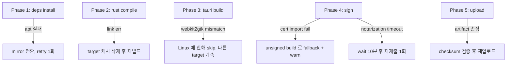

# WF-4 build-tauri.yml — Tauri 멀티플랫폼 빌드

> **카테고리**: 01_ci-workflows
> **역할**: 4플랫폼 바이너리 빌드 + 코드 서명
> **Phase**: Phase 1 (P1-1)
> **LOCK**: LOCK-CI-01, LOCK-CI-06, LOCK-CI-07

---

## 1. 교차 참조 블록

| 대상 | 경로 / 섹션 | 용도 |
|------|-----------|------|
| 상세명세 | `CICD_PIPELINE_상세명세.md` §WF-4, §G 코드 서명 플레이북 | 매트릭스 + 서명 |
| 전략 정본 | `PHASE_B6_CICD_PIPELINE.md` §4.1 Tauri 빌드 매트릭스 | LOCK-CI-06 4플랫폼 |
| 종합계획서 | `CICD_PIPELINE_구조화_종합계획서.md` §3.4 LOCK-CI-06/07 | 보안팀 승인 |
| 인접 도메인 | `D:\VAMOS\docs\sot 2\4-1_Rust-Tauri-Infrastructure\` | 빌드 환경 의존 |
| 호출원 | `WF-1_ci.md` (dry-run), `WF-5_release.md` (real build) | build-check / release |
| 인접 WF | `../05_release-management/WF-5_release.md` | 아티팩트 소비 |

---

## 2. 트리거

```yaml
name: Build Tauri
on:
  workflow_call:
    inputs:
      release_mode:
        type: boolean
        default: false
      target_filter:
        type: string
        default: "all"
      skip_sign:
        type: boolean
        default: false
    secrets:
      APPLE_CERTIFICATE: { required: false }
      APPLE_CERTIFICATE_PASSWORD: { required: false }
      APPLE_ID: { required: false }
      APPLE_TEAM_ID: { required: false }
      APPLE_INSTALLER_CERT: { required: false }
      WINDOWS_PFX: { required: false }
      WINDOWS_PFX_PASSWORD: { required: false }
      GPG_PRIVATE_KEY: { required: false }
concurrency:
  group: build-tauri-${{ github.ref }}-${{ inputs.release_mode }}
  cancel-in-progress: ${{ !inputs.release_mode }}
```

---

## 3. 매트릭스 (LOCK-CI-06 — 4플랫폼)

```yaml
strategy:
  fail-fast: false
  matrix:
    include:
      - os: ubuntu-latest
        target: x86_64-unknown-linux-gnu
        artifact: vamos_amd64.AppImage
        sign: gpg
      - os: windows-latest
        target: x86_64-pc-windows-msvc
        artifact: vamos_x64.msi
        sign: authenticode
      - os: macos-latest
        target: aarch64-apple-darwin
        artifact: vamos_arm64.dmg
        sign: apple
      - os: macos-latest
        target: x86_64-apple-darwin
        artifact: vamos_x64.dmg
        sign: apple
```

---

## 4. 빌드 단계 (job `build`)

1. **시스템 의존성 설치**
   - Linux: `libgtk-3-dev`, `libwebkit2gtk-4.1-dev`, `libayatana-appindicator3-dev`, `librsvg2-dev`
   - Windows: `winget install` 스킵 (모두 프리인스톨)
   - macOS: `xcode-select --install` 확인
2. **Rust 툴체인**: `rustup target add ${{ matrix.target }}`
3. **Node/pnpm**: `corepack enable pnpm`, `pnpm install --frozen-lockfile`
4. **Python**: `uv sync`, wheel 빌드 (`uv build --wheel`)
5. **Frontend build**: `pnpm run build`
6. **Tauri build**: `pnpm tauri build --target ${{ matrix.target }}`
7. **코드 서명 (release_mode=true && !skip_sign)**: §5 참조
8. **아티팩트 업로드**: `actions/upload-artifact@v4` (retention: release_mode 시 30일, 아니면 7일)

---

## 5. 코드 서명 (LOCK-CI-07)

### 5.1 시크릿 매핑

| 플랫폼 | 시크릿 | 용도 |
|--------|--------|------|
| macOS | `APPLE_CERTIFICATE` | Developer ID Application 인증서 (Base64 .p12) |
| macOS | `APPLE_CERTIFICATE_PASSWORD` | .p12 비밀번호 |
| macOS | `APPLE_ID` | Notarization Apple ID |
| macOS | `APPLE_TEAM_ID` | Notarization Team ID |
| macOS | `APPLE_INSTALLER_CERT` | Installer 서명 인증서 |
| Windows | `WINDOWS_PFX` | EV Code Signing (Base64 .pfx) |
| Windows | `WINDOWS_PFX_PASSWORD` | .pfx 비밀번호 |
| Linux | `GPG_PRIVATE_KEY` | GPG 서명 키 |
| Tauri Updater | `TAURI_SIGNING_PRIVATE_KEY` | Tauri 앱 auto-updater 서명 (release_mode) |
| Tauri Updater | `TAURI_SIGNING_PRIVATE_KEY_PASSWORD` | Tauri 서명 키 비밀번호 |
| Tauri Updater | `TAURI_SIGNING_PRIVATE_KEY` | Tauri 앱 auto-updater 서명 (release_mode) |
| Tauri Updater | `TAURI_SIGNING_PRIVATE_KEY_PASSWORD` | Tauri 서명 키 비밀번호 |

### 5.2 서명 절차

**macOS**:
```yaml
- name: Import Apple Certificate
  if: runner.os == 'macOS' && inputs.release_mode && !inputs.skip_sign
  env:
    CERT: ${{ secrets.APPLE_CERTIFICATE }}
    PASS: ${{ secrets.APPLE_CERTIFICATE_PASSWORD }}
  run: |
    echo "$CERT" | base64 --decode > certificate.p12
    KEYCHAIN_PW=$(openssl rand -base64 32)
    security create-keychain -p "$KEYCHAIN_PW" build.keychain
    security default-keychain -s build.keychain
    security unlock-keychain -p "$KEYCHAIN_PW" build.keychain
    security import certificate.p12 -k build.keychain -P "$PASS" -T /usr/bin/codesign
    security set-key-partition-list -S apple-tool:,apple: -s -k "$KEYCHAIN_PW" build.keychain
- name: Notarize
  env:
    APPLE_ID: ${{ secrets.APPLE_ID }}
    TEAM_ID: ${{ secrets.APPLE_TEAM_ID }}
  run: xcrun notarytool submit vamos_*.dmg --apple-id "$APPLE_ID" --team-id "$TEAM_ID" --wait
```

**Windows**:
```yaml
- name: Sign Windows Binary
  if: runner.os == 'Windows' && inputs.release_mode && !inputs.skip_sign
  env:
    PFX: ${{ secrets.WINDOWS_PFX }}
    PASS: ${{ secrets.WINDOWS_PFX_PASSWORD }}
  shell: pwsh
  run: |
    [IO.File]::WriteAllBytes("cert.pfx", [Convert]::FromBase64String($env:PFX))
    & signtool sign /f cert.pfx /p $env:PASS /tr http://timestamp.digicert.com /td sha256 /fd sha256 target/release/*.exe target/release/bundle/msi/*.msi
```

**Linux (GPG)**:
```yaml
- name: GPG Sign AppImage
  if: runner.os == 'Linux' && inputs.release_mode && !inputs.skip_sign
  env:
    GPG_KEY: ${{ secrets.GPG_PRIVATE_KEY }}
  run: |
    echo "$GPG_KEY" | gpg --batch --import
    gpg --batch --yes --detach-sign --armor target/release/bundle/appimage/vamos_*.AppImage
```

---

## 6. 캐시 전략

| 대상 | 키 | 경로 |
|------|---|------|
| Rust registry | `rust-${{ runner.os }}-${{ matrix.target }}-${{ hashFiles('Cargo.lock') }}` | `~/.cargo/registry`, `~/.cargo/git` |
| Rust target | `tauri-target-${{ runner.os }}-${{ matrix.target }}-${{ hashFiles('Cargo.lock') }}` | `target/`, `src-tauri/target/` |
| Node | `node-${{ runner.os }}-${{ hashFiles('pnpm-lock.yaml') }}` | `~/.pnpm-store`, `node_modules` |
| Python wheel | `uv-${{ runner.os }}-${{ hashFiles('uv.lock') }}` | `~/.cache/uv` |

---

## 7. Phase별 복구 전략



### 7.1 penalty

| 사례 | penalty | release 게이트 |
|------|---------|--------------|
| 4 중 1 target skip | −15% | release 차단 (LOCK-CI-06 위반) |
| unsigned fallback | −25% | release 차단 (LOCK-CI-07 위반) |
| notarization 재시도 1회 | −5% | 통과 |
| cache cold (대규모 재빌드) | −5% | 통과 (시간만 초과) |

---

## 8. 로깅 포맷

```json
{
  "trace_id": "build-tauri-<run_id>-<matrix.target>",
  "error": {
    "code": "BUILD_FAILED",
    "stage": "compile|frontend|tauri|sign|notarize|upload",
    "target": "x86_64-pc-windows-msvc",
    "exit_code": 101
  },
  "context": {
    "workflow": "build-tauri.yml",
    "release_mode": true,
    "skip_sign": false,
    "matrix": {"os": "windows-latest", "target": "x86_64-pc-windows-msvc"},
    "tauri_version": "2.x"
  },
  "recovery": {
    "retry_count": 1,
    "strategy": "cache-purge-rebuild",
    "confidence_penalty": 0.05,
    "sign_fallback": false
  }
}
```

---

## 9. Phase 2 테스트 시나리오 (10건+)

| # | 시나리오 | 주입 | 기대 |
|---|---------|---|------|
| T-1 | 4플랫폼 dry-run | ci 트리거 `release_mode=false` | 4 target 모두 unsigned 빌드 성공 |
| T-2 | release 빌드 정상 | tag push v1.2.3 | 4 target signed 업로드 |
| T-3 | Linux webkit2gtk 미설치 | runner image 변경 | Linux fail, 다른 target 계속 (penalty −15%) |
| T-4 | Windows signtool 실패 | 잘못된 PFX | skip_sign=false 시 fail, release 차단 |
| T-5 | macOS notarization timeout | Apple 서버 지연 시뮬 | 재시도 1회 후 성공 또는 fail |
| T-6 | GPG 키 만료 | 만료 키 주입 | Linux sign fail, release 차단 |
| T-7 | 캐시 cold start | 신규 target | 빌드 < 40분, 성공 |
| T-8 | Tauri version mismatch | lockfile 편집 | compile fail, 명확 에러 |
| T-9 | 디스크 용량 부족 | 큰 파일 생성 | upload 실패, retry 1회 |
| T-10 | target_filter 단일 | `target_filter=aarch64-apple-darwin` | 1 target 만 실행 |
| T-11 | skip_sign=true | release_mode=true + skip_sign | unsigned 빌드, release 차단 마커 |
| T-12 | concurrency 취소 | 동일 ref 중복 trigger (non-release) | 이전 cancel |

---

## 10. LOCK 위반 체크

- [x] LOCK-CI-01: build-tauri.yml 14개 목록 포함
- [x] LOCK-CI-06: 4플랫폼 매트릭스 (linux x64, win x64, macos arm64, macos x64)
- [x] LOCK-CI-07: 3 플랫폼 서명 경로 명시 (apple, authenticode, gpg)

---

## 11. Open Questions

- Q1: Sigstore cosign 서명을 release 단계 (WF-5) 또는 build 단계 (본 WF) 중 어디에 둘지 → P1-4 결정
- Q2: Linux ARM64 (`aarch64-unknown-linux-gnu`) 추가 여부 → LOCK-CI-06 확장 시 `[LOCK_CHANGE_NEEDED]`
