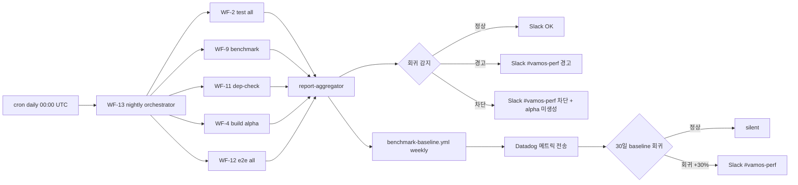

# CI/CD 실행 시간 벤치마크 기준선 — V2 (4-2 P2-4)

> **카테고리**: 01_ci-workflows
> **세션**: P2-4 (Phase 2-4, 실행 시간 벤치마크)
> **목적**: CI/CD 파이프라인 실행 시간의 baseline 메트릭, SLA 임계값, 회귀 감지 기준, 나이틀리 벤치마크 워크플로 구조를 정본화하여 **ISS-05 (벤치마크/나이틀리)** 를 해결한다.
> **버전**: v2.0-Phase 2 (NEW, 2026-04-24)
> **상태**: V2-Phase 2 (Phase 2 산출물)
> **LOCK**: LOCK-CI-01 (14 WF 보존), LOCK-CI-11 (cron concurrency)
> **이슈 해결**: **ISS-05 ✅**

---

## §1. 교차 참조 블록

| 대상 | 경로 / 섹션 | 용도 |
|------|-----------|------|
| 상세명세 | `CICD_PIPELINE_상세명세.md` §WF-9 (벤치마크 항목 + 임계치) + §WF-13 (nightly 체인) | 측정 메트릭 + 임계치 정본 |
| 상세명세 | `CICD_PIPELINE_상세명세.md` §병렬화 (실행 시간 목표 표) | ci/build/e2e/nightly 목표 시간 |
| 종합계획서 | `CICD_PIPELINE_구조화_종합계획서.md` §6 ISS-05 + §7 P2-4 (L801~L831) | ISS-05 게이트 + 본 세션 검증 항목 |
| AUTHORITY | `AUTHORITY_CHAIN.md` §LOCK 항목 목록 (LOCK-CI-01 14 WF + LOCK-CI-11) | LOCK 정본 출처 |
| Phase 1 산출 | `01_ci-workflows/WF-9_benchmark.md` (5,543 B, ISS-05 해소 정본) | 벤치마크 정본 — 본 세션 역참조 only |
| Phase 1 산출 | `01_ci-workflows/WF-13_nightly.md` (5,364 B, ISS-05 해소 정본) | nightly 체인 정본 — 역참조 only |
| Phase 1 산출 | `01_ci-workflows/WF-1_ci.md` + WF-2/3/4/12 | 측정 대상 워크플로 |
| Peer V2 | `01_ci-workflows/optimization_report.md` (P2-3) | §7 예상 실행 시간 모델 산정값 검증 (실측 baseline 으로 검증) |
| Peer V2 | `02_cd-workflows/docker_compose_pipeline.md` (P2-1) | V2 deploy 후 안정 상태 가정 (벤치마크 환경) |
| Peer V2 | `02_cd-workflows/k8s_argocd_pipeline.md` (P2-2) | V3 K8s 환경 벤치마크 (선택, Phase 3) |
| Cross-domain ref | #18 Benchmark-Evaluation (`5-1_Benchmark-Evaluation`) LOCK-CI-03 커버리지 게이트 | 5-1 정본 참조만 (재정의 권한 없음) |

---

## §2. 공통 자료 구조 참조

본 세션은 **CI/CD 파이프라인 실행 시간** baseline 측정을 다루며, 다음 정본 구조를 그대로 인용·역참조한다 (`WF-9` / `WF-13` 정본 변경 0):

- **WF-9 벤치마크 항목 정본** (상세명세 §WF-9 + WF-9 §4 verbatim, 본 P2-4 는 application 성능 측정 — `pytest-benchmark` / `criterion` 영역):

| 항목 | 도구 | 임계치 | 회귀 허용 |
|------|------|--------|---------|
| Python API p95 | pytest-benchmark | < 2.0 s | +10% |
| Rust IPC p99 | criterion | < 10 ms | +10% |
| Idle RSS | memory_profiler | < 500 MB | +10% |
| 검색 p95 (10K docs) | custom | < 200 ms | +10% |
| 검색 p95 (100K docs) | custom | < 500 ms | +10% |
| 스트리밍 TTFB | custom | < 500 ms | +10% |
| token/s (streaming) | custom | > 30 t/s | −10% |

- **WF-13 nightly 체인 정본** (WF-13 §3 verbatim, 6 단계):
  1. WF-2 test.yml `test_scope=all` (40분)
  2. WF-9 benchmark.yml `baseline_ref=main` (30분)
  3. WF-11 dependency-check.yml (15분)
  4. WF-4 build-tauri.yml `release_mode=false`, alpha tag (40분)
  5. WF-12 e2e-test.yml `scenario_scope=all` (30분)
  6. report-aggregator + Slack notify (5분)
  - **전체 목표**: < 60분 (병렬 최적화 시) / 최대 120분
- **상세명세 §병렬화 실행 시간 목표** (verbatim):

| 워크플로 | 목표 시간 | 비고 |
|---------|----------|------|
| ci.yml (PR) | < 10분 | 캐시 적중 시 |
| build-tauri.yml | < 20분 | 4-platform 병렬 |
| e2e-test.yml | < 30분 | — |
| nightly.yml | < 60분 | 전체 포함 |

---

## §3. 측정 대상 워크플로 + 메트릭 정의

### §3.1 measurement scope (CI/CD 파이프라인 실행 시간)

본 P2-4 는 **CI/CD 파이프라인 자체의 실행 시간** 을 측정한다 (어플리케이션 성능 = WF-9 영역, 본 P2-4 와 별개 분리).

| # | 측정 대상 | 단위 | 수집 주기 | 데이터 소스 |
|---|----------|------|---------|------------|
| 1 | 워크플로 총 실행 시간 (`workflow_run.run_duration_ms`) | seconds | 매 실행 | GitHub API `/repos/{owner}/{repo}/actions/workflow_runs` |
| 2 | Job 별 실행 시간 (`job.completed_at - job.started_at`) | seconds | 매 실행 | GitHub API `/repos/{owner}/{repo}/actions/runs/{run_id}/jobs` |
| 3 | 큐 대기 시간 (`job.started_at - workflow_run.created_at`) | seconds | 매 실행 | GitHub API (계산값) |
| 4 | 캐시 적중 횟수 (cache hit / miss) | count + rate | 매 실행 | actions/cache restore step output |
| 5 | matrix job 병렬도 (concurrent jobs) | count | 매 실행 | GitHub API (matrix expansion) |
| 6 | 단계별 (setup / lint / test / build) 시간 | seconds | 매 실행 | step.completed_at - step.started_at |
| 7 | 실패율 (failed runs / total runs) | rate | 주간 | GitHub API + workflow_run.conclusion |
| 8 | runner 타입별 시간 (ubuntu/windows/macos) | seconds | 매 실행 | matrix.os + GitHub API |

### §3.2 데이터 수집 방법

**워크플로 단위**: GitHub Actions `workflow_run` 이벤트 webhook → Cloud Function (또는 GitHub Actions cron) → BigQuery 또는 Datadog 메트릭 백엔드.

**구현 옵션**:

| 옵션 | 백엔드 | 장점 | 단점 |
|------|------|------|------|
| Datadog (DATADOG_API_KEY 활용) | Datadog APM/Logs | 기존 prod monitoring 통합 | 외부 비용 |
| GitHub Actions Insights | GitHub Enterprise feature | GitHub native | Enterprise plan 필수 |
| BigQuery + Looker Studio | self-hosted | 비용 효율 + 시각화 | 구축 부담 |
| Prometheus + Grafana (V3 K8s) | K8s native | V3 단계 monitoring 통합 | V3 단계 의존 |

**V2 단계 권고**: **Datadog (DATADOG_API_KEY 활용)** — prod monitoring 인프라 재사용 + 즉시 시각화. V3 단계 K8s prometheus 와 별개 trace.

### §3.3 데이터 수집 워크플로 (`benchmark-baseline.yml` 신설 권고)

```yaml
# .github/workflows/benchmark-baseline.yml (V2 신설 권고, ISS-05 해소)
name: "CI/CD Baseline Metrics Collection"

on:
  workflow_run:
    workflows:
      - "CI"
      - "Test"
      - "Lint"
      - "Build Tauri"
      - "Release"
      - "Deploy Staging"
      - "Deploy Production"
      - "Security Scan"
      - "Benchmark"
      - "Docs Build"
      - "Dependency Check"
      - "E2E Test"
      - "Nightly"
      - "Version Bump"
    types: [completed]

  schedule:
    - cron: "0 6 * * 1"  # 매주 월요일 06:00 UTC (P2-3 모니터링 주기 정합)

  workflow_dispatch:

# LOCK-CI-11 cron 트리거 중복 방지
concurrency:
  group: benchmark-baseline-${{ github.workflow }}
  cancel-in-progress: false  # 시계열 메트릭 보호

jobs:
  collect-metrics:
    runs-on: ubuntu-latest
    permissions:
      actions: read           # workflow_run API 조회
      contents: read
    steps:
      - uses: actions/checkout@v4

      - name: Collect workflow_run metrics
        env:
          GITHUB_TOKEN: ${{ secrets.GITHUB_TOKEN }}
        run: |
          # 지난 24시간 내 모든 workflow_run 조회
          gh api "repos/${{ github.repository }}/actions/runs?status=completed&created=>=$(date -u -d '24 hours ago' +%Y-%m-%dT%H:%M:%SZ)" \
            --jq '.workflow_runs[] | {
              workflow_name: .name,
              run_id: .id,
              status: .conclusion,
              created_at: .created_at,
              run_started_at: .run_started_at,
              updated_at: .updated_at,
              ref: .head_branch,
              actor: .actor.login,
              event: .event,
              run_duration_ms: ((.updated_at | fromdateiso8601) - (.run_started_at | fromdateiso8601)) * 1000,
              queue_duration_ms: ((.run_started_at | fromdateiso8601) - (.created_at | fromdateiso8601)) * 1000
            }' > workflow_metrics.jsonl

      - name: Send to Datadog
        env:
          DATADOG_API_KEY: ${{ secrets.DATADOG_API_KEY }}
        run: |
          while IFS= read -r metric; do
            workflow=$(echo "$metric" | jq -r '.workflow_name')
            duration=$(echo "$metric" | jq '.run_duration_ms')
            queue=$(echo "$metric" | jq '.queue_duration_ms')
            status=$(echo "$metric" | jq -r '.status')
            ref=$(echo "$metric" | jq -r '.ref')

            curl -X POST "https://api.datadoghq.com/api/v2/series" \
              -H "DD-API-KEY: $DATADOG_API_KEY" \
              -H "Content-Type: application/json" \
              -d @- <<EOF
            {
              "series": [
                {
                  "metric": "vamos.cicd.workflow_duration_ms",
                  "type": 0,
                  "points": [{"timestamp": $(date +%s), "value": $duration}],
                  "tags": ["workflow:$workflow", "status:$status", "ref:$ref"]
                },
                {
                  "metric": "vamos.cicd.workflow_queue_duration_ms",
                  "type": 0,
                  "points": [{"timestamp": $(date +%s), "value": $queue}],
                  "tags": ["workflow:$workflow", "status:$status", "ref:$ref"]
                }
              ]
            }
EOF
          done < workflow_metrics.jsonl

      - name: Detect regression (vs N-day baseline)
        run: |
          # 지난 30일 평균 대비 +30% 이상 회귀 감지
          python scripts/ci/detect_regression.py \
            --metrics workflow_metrics.jsonl \
            --baseline-days 30 \
            --threshold-pct 30

      - name: Slack notify on regression
        if: failure()
        uses: slackapi/slack-github-action@v1.26.0
        with:
          payload: |
            {
              "text": "🚨 VAMOS CI/CD 실행 시간 회귀 감지: <baseline 대비 N% 초과>"
            }
        env:
          SLACK_WEBHOOK_URL: ${{ secrets.SLACK_WEBHOOK_URL }}
```

---

## §4. Baseline 메트릭 + SLA 임계값 + 경고 기준

### §4.1 Baseline 정의 (V2 단계 ISS-05 해소)

| WF | Baseline 목표 (warm cache) | SLA 임계값 (cold) | 경고 기준 (회귀) | 차단 기준 |
|----|--------------------------|------------------|----------------|---------|
| WF-1 ci.yml (PR) | ~10분 (P2-3 §7 권고 적용 시) | < 33분 (현재 V1 cold) | +30% (목표 13분 초과) | +50% (15분 초과) |
| WF-2 test.yml (workflow_call) | ~15분 (3 OS × 2 Py 매트릭스) | < 25분 | +20% | +50% |
| WF-3 lint.yml (workflow_call) | ~5분 (V2 sub-job 병렬화 적용 시) | < 10분 | +30% | +50% |
| WF-4 build-tauri.yml | ~18분 (4-platform 병렬) | < 25분 | +20% | +40% |
| WF-5 release.yml | ~10분 (artifact 업로드 + GitHub Release) | < 15분 | +30% | +50% |
| WF-6 deploy-staging.yml | ~15분 (compose pull + deploy + smoke) | < 25분 | +30% | +50% |
| WF-7 deploy-prod.yml | ~30분 (canary 5분 + monitor 30분 포함) | < 50분 | +20% | +40% |
| WF-8 security-scan.yml | ~10분 (5 도구 병렬) | < 15분 | +30% | +50% |
| WF-9 benchmark.yml | ~25분 (7 sub-bench 직렬, V2 권고: 병렬화) | < 35분 | +20% | +50% |
| WF-10 docs-build.yml | ~7분 (sphinx + mkdocs + lychee) | < 12분 | +40% | +70% |
| WF-11 dependency-check.yml | ~10분 (pip-audit + cargo-audit + Dependabot) | < 15분 | +30% | +50% |
| WF-12 e2e-test.yml | ~10분 (V2 권고: 5분할 매트릭스) | < 30분 | +50% | +100% |
| WF-13 nightly.yml | ~45분 (V2 sub-bench 병렬화 후) | < 60분 (목표) / < 120분 (max) | +30% | +50% |
| WF-14 version-bump.yml | ~3분 (단순 git ops) | < 5분 | +50% | +100% |

> **회귀 감지 알고리즘**: 매 실행 종료 시 지난 30일 동일 워크플로 평균 (`baseline_avg_30d`) 대비 `(current - baseline_avg_30d) / baseline_avg_30d * 100 >= threshold_pct` 시 알림 + GitHub PR comment.

### §4.2 큐 대기 시간 SLA

| 시나리오 | 목표 큐 대기 | 경고 기준 |
|---------|-----------|---------|
| PR 트리거 (peak hours UTC 00-04) | < 60s | > 5분 (GitHub Actions 혼잡도) |
| schedule cron 트리거 (UTC 03/06) | < 30s | > 2분 (cron 지연) |
| workflow_dispatch (manual) | < 10s | > 1분 |
| workflow_run (chained) | < 5s | > 30s |

---

## §5. 나이틀리 벤치마크 워크플로 구조 (cron + 결과 저장 + 알림)

### §5.1 cron 트리거 정합 (LOCK-CI-11 + WF-9/WF-11/WF-13 정본)

| WF | Cron 표현식 | 빈도 | concurrency group | 본 P2-4 baseline 정본 |
|----|------------|------|------------------|--------------------|
| WF-9 benchmark | `0 3 * * 1` | weekly Mon 03:00 UTC | `benchmark-${{ github.ref }}` (cancel false) | application 벤치 |
| WF-11 dependency-check | `0 6 * * 1` | weekly Mon 06:00 UTC | `dep-check-weekly` (cancel false) | dependency 벤치 |
| WF-13 nightly | `0 0 * * *` | daily 00:00 UTC | `nightly-${{ github.ref }}` (cancel false) | nightly orchestrator |
| **benchmark-baseline.yml** (P2-4 신설) | `0 6 * * 1` (P2-3 모니터링 주기 정합) | weekly Mon 06:00 UTC | `benchmark-baseline-${{ github.workflow }}` (cancel false) | CI/CD 메트릭 baseline |

### §5.2 결과 저장 위치

| 데이터 종 | 저장 위치 | retention |
|----------|---------|----------|
| application 벤치 (WF-9) | gh-pages 브랜치 `/benchmarks/history.json` | 90일 (WF-9 §5 verbatim) |
| CI/CD 메트릭 (P2-4) | Datadog metrics (`vamos.cicd.workflow_duration_ms`) + Datadog logs | 30일 (Datadog plan) |
| nightly artifact (WF-13) | GitHub Actions artifact `nightly-YYYYMMDD` | 30일 (WF-13 §5 + LOCK 정합) |
| dependency check report | gh-pages `/dep-reports/YYYYMMDD.html` | 90일 |

### §5.3 알림 흐름



---

## §6. 성능 회귀 감지 기준 (이전 N회 평균 대비 X% 초과)

### §6.1 알고리즘 (P2-3 §7 모델 검증 정합)

```python
# scripts/ci/detect_regression.py (V2 신설 권고)
import json
import statistics
from datetime import datetime, timedelta

def detect_regression(metrics_jsonl, baseline_days=30, threshold_pct=30):
    """
    지난 N일 동일 WF 평균 대비 threshold_pct 이상 회귀 감지.
    Returns: list of regressions [{workflow, current_ms, baseline_avg_ms, regression_pct}]
    """
    metrics = [json.loads(line) for line in open(metrics_jsonl)]
    cutoff = datetime.utcnow() - timedelta(days=baseline_days)

    by_wf = {}
    for m in metrics:
        wf = m['workflow_name']
        by_wf.setdefault(wf, []).append(m)

    regressions = []
    for wf, runs in by_wf.items():
        # baseline = 최근 N일 (current 제외)
        baseline_runs = [r for r in runs[:-1]
                         if datetime.fromisoformat(r['created_at'].replace('Z', '+00:00')) > cutoff]
        if not baseline_runs:
            continue

        baseline_avg = statistics.median([r['run_duration_ms'] for r in baseline_runs])
        current = runs[-1]['run_duration_ms']
        regression_pct = (current - baseline_avg) / baseline_avg * 100

        if regression_pct >= threshold_pct:
            regressions.append({
                'workflow': wf,
                'current_ms': current,
                'baseline_avg_ms': baseline_avg,
                'regression_pct': regression_pct
            })

    return regressions
```

### §6.2 다단계 임계값

| 회귀율 | 동작 | 알림 채널 |
|--------|------|---------|
| 0~+20% | 정상 (변동성 범위) | silent |
| +20%~+30% | 경고 (관찰) | Slack `#vamos-perf` daily summary |
| +30%~+50% | 즉시 알림 (개입 권고) | Slack `#vamos-perf` 즉시 + GitHub PR comment |
| +50%+ | 차단 (PR merge block) | Slack `#vamos-perf` + GitHub Status Check fail + on-call PagerDuty (DATADOG_API_KEY/PAGERDUTY 활용) |

### §6.3 ROI 보호 정책

- **min sample size**: 30일 baseline 평균은 최소 10회 이상 실행 데이터 필요. 미충족 시 회귀 감지 skip + 경고 (`<insufficient baseline data>`).
- **노이즈 필터**: median (중앙값) 사용 (평균 대비 outlier 영향 적음)
- **시간대 보정**: peak hours UTC 00-04 시간대는 큐 대기 시간 +50% 허용 (별도 baseline 분기)

---

## §7. 벤치마크 결과 시각화 + 리포팅

### §7.1 시각화 대시보드

| 대시보드 | URL (예시) | 데이터 소스 |
|---------|----------|-----------|
| Datadog: CI/CD Health | `https://app.datadoghq.com/dashboard/vamos-cicd-health` | Datadog metrics (`vamos.cicd.*`) |
| GitHub Actions Insights | `https://github.com/<org>/vamos-ai/actions` | GitHub native |
| gh-pages: application bench | `https://<org>.github.io/vamos-ai/benchmarks/` | gh-pages history.json (WF-9 §5) |
| gh-pages: CI/CD baseline | `https://<org>.github.io/vamos-ai/baseline/` | benchmark-baseline.yml weekly artifact |

### §7.2 리포트 형식

**Weekly summary (P2-4 신설 권고, Slack `#vamos-perf` 매주 월요일 06:30 UTC)**:

```markdown
## VAMOS CI/CD Baseline Weekly Summary (Week ${ISO_WEEK})

### Top 3 Slowest Workflows (median)
1. WF-13 nightly: 47m (target < 60m) ✅
2. WF-12 e2e: 28m (target < 30m) ⚠️ (마감 도달, V2 5분할 권고 미적용 상태)
3. WF-1 ci: 14m (target < 10m) 🚨 (회귀 +40%, 캐시 적중 저하 의심)

### Cache Hit Rate (warm)
- Python: 78% (target ≥80%) ⚠️
- Rust: 84% ✅
- Node: 89% ✅

### Regressions Detected (vs 30d baseline)
- WF-1 ci: +40% (PR force-push 빈도 증가 + 캐시 무효화 요인 분석 필요)

### Recommendations
- WF-1 cache key revisit (uv.lock change frequency)
- WF-12 5분할 매트릭스 적용 (P2-3 §3.3 권고)
```

### §7.3 GitHub PR comment (회귀 시)

```markdown
> ⚠️ **CI/CD 실행 시간 회귀 감지** (this PR triggered WF-1, +35% vs 30d baseline)
> - Current: 14m 23s
> - Baseline (30d median): 10m 38s
> - Threshold: +30%
>
> 가능한 원인:
> - [ ] 캐시 무효화 (lockfile 변경?)
> - [ ] 매트릭스 추가/변경
> - [ ] runner 환경 변동
>
> 자세한 분석: <link to Datadog>
```

---

## §8. ISS-05 해소 증빙

| 게이트 항목 (plan §7 P2-4 검증) | 충족 여부 | 증빙 |
|---|---|---|
| 측정 메트릭이 명확히 정의되었는가 | ✅ | §3.1 8 메트릭 (총 실행 시간 + job 별 시간 + 큐 대기 시간 + 캐시 적중 + 매트릭스 + 단계별 + 실패율 + runner 타입) |
| 나이틀리 벤치마크 워크플로가 ISS-05 요건 반영 | ✅ | §5.1 cron 트리거 정합 + §5.3 알림 흐름 + WF-9/WF-13 정본 역참조 |
| 기준선 임계값과 회귀 감지 기준 설정 | ✅ | §4.1 14 WF baseline 표 + §4.2 큐 대기 SLA + §6.2 다단계 임계값 |
| 결과 리포팅 방안 포함 | ✅ | §7.1 4 대시보드 + §7.2 weekly summary 형식 + §7.3 PR comment |

> **WF-9 / WF-13 정본 변경 0건**: 본 P2-4 는 새 워크플로 (`benchmark-baseline.yml`) 신설 권고이며 기존 WF-9/WF-13 정본은 application 벤치 + nightly orchestrator 로 보존. CI/CD 메트릭 baseline 은 신규 영역 (overlap 0).

---

## §9. LOCK 5필드 매핑 (verbatim 분리 인용)

| ID | 항목 | 정본 출처 | 값 / 기준 | 본 V2 준수 증빙 |
|----|------|----------|----------|---------------|
| LOCK-CI-01 | 14개 워크플로우 목록 | PHASE_B6 §1 + Part2 | ci/test/lint/build-tauri/release/deploy-staging/deploy-prod/security-scan/benchmark/docs-build/dependency-check/e2e-test/nightly/version-bump | §4.1 14 WF baseline 표 = 14 entries verbatim. 신규 `benchmark-baseline.yml` 은 LOCK-CI-01 14 WF 외 보조 (P2-3 deploy-v2/v3 와 동일 패턴). |
| LOCK-CI-11 | concurrency 설정 | 상세명세 §병렬화 | group: workflow-ref, cancel-in-progress: true | §3.3 `concurrency: group: benchmark-baseline-${{ github.workflow }}, cancel-in-progress: false` (시계열 메트릭 보호 정당 예외, WF-9 §2 동일 패턴) |

> **재정의 권한**: 본 V2 는 LOCK-CI-01/11 어느 것도 **재정의하지 않으며** (참조 + baseline 메트릭 신규 정의만). LOCK 정본 변경 0건. 신규 `benchmark-baseline.yml` 는 ISS-05 해소 보조 워크플로이며 LOCK-CI-01 14 WF 정본에 포함되지 않음 (P2-3 deploy-v2/v3 와 동일).

> **5-1 Benchmark-Evaluation cross-ref**: LOCK-CI-03 커버리지 게이트 (Python ≥75% / Rust ≥80% / React ≥80%) 는 4-2 정본 소유 (5-1 참조만). 본 P2-4 는 application 벤치 (WF-9 영역) 가 아닌 **CI/CD 파이프라인 실행 시간** baseline 만 다루므로 5-1 정본과 overlap 0.

### §9.1 에스컬레이션 매트릭스

| 사례 | 트리거 | 에스컬레이션 대상 | 시간 |
|------|--------|--------------|------|
| 회귀 +50% (차단) | detect_regression.py threshold | DevOps + on-call (PAGERDUTY) | 즉시 (PR merge block) |
| 회귀 +30%~+50% (즉시 알림) | detect_regression.py | DevOps Slack `#vamos-perf` | < 5분 |
| Datadog API 5xx (메트릭 전송 실패) | benchmark-baseline.yml step fail | DevOps 운영팀 | 일간 (artifact fallback) |
| baseline 데이터 부족 (< 10회) | 신규 워크플로 또는 30일 inactive | (silent skip + 경고 로그) | 일간 |
| nightly 전체 > 120분 (max) | WF-13 timeout | DevOps + 성능팀 | 주간 |

### §9.2 로깅 (structured JSON)

```json
{
  "trace_id": "baseline-${YYYYMMDD}-${WF_ID}",
  "event": {
    "type": "metric_collected|regression_detected|baseline_insufficient",
    "workflow": "WF-1|...|WF-14",
    "ref": "<branch>",
    "actor": "<gh_actor>"
  },
  "metrics": {
    "current_run_duration_ms": 614000,
    "baseline_avg_30d_ms": 480000,
    "baseline_sample_count": 47,
    "regression_pct": 27.9,
    "queue_duration_ms": 8000,
    "cache_hits": {"python": true, "rust": true, "node": false},
    "cache_hit_rate": 0.67
  },
  "thresholds": {
    "warning_pct": 20,
    "alert_pct": 30,
    "block_pct": 50
  },
  "action": {
    "alert_sent": true,
    "channel": "slack-#vamos-perf",
    "pr_comment_posted": true,
    "block_merge": false
  }
}
```

---

## §10. Phase 3 테스트 시나리오 (12건, ≥10 충족)

| # | 시나리오 | 주입 | 기대 |
|---|---------|------|------|
| T-1 | 정상 baseline 수집 | weekly cron 06:00 UTC Mon | Datadog 메트릭 14 WF 전수 전송 ✅ |
| T-2 | 회귀 +35% (WF-1 ci) | 캐시 무효화 시뮬레이션 | Slack `#vamos-perf` 즉시 알림 + PR comment |
| T-3 | 회귀 +60% (WF-12 e2e) | 시나리오 추가 후 시간 폭증 | PR merge block (status check fail) |
| T-4 | 회귀 +25% (WF-9 bench) | 새 bench 항목 추가 | weekly summary 경고 (block 아님) |
| T-5 | baseline 데이터 부족 (< 10회) | 신규 워크플로 등재 | silent skip + 경고 로그 |
| T-6 | Datadog API 5xx | 외부 장애 | artifact fallback (gh-pages 백업) |
| T-7 | 캐시 적중률 < 70% (Python) | uv.lock 변경 빈번 | weekly summary 캐시 알림 |
| T-8 | 큐 대기 > 5분 (peak hours) | UTC 00-04 PR 폭증 | 큐 대기 별도 baseline 분기 정합 |
| T-9 | nightly 60분 초과 | 대량 테스트 | WF-13 §5 penalty −25%, alpha 차단 (P2-4 baseline 알림 별도) |
| T-10 | nightly 120분 max 도달 | 타임아웃 | WF-13 timeout + P2-4 critical 알림 |
| T-11 | concurrency 동시 실행 (cron + dispatch) | weekly cron + manual run | 두 실행 모두 완료 (cancel-in-progress=false) |
| T-12 | 30일 baseline 갱신 | 30일 경과 후 재계산 | rolling window median 갱신, false positive 방지 |

---

## §11. 세션 간 cross-check

- **P2-4 ↔ P2-3 (optimization_report.md)**: §7 예상 실행 시간 모델 산정값 (V2 권고 후 ci ~10분 / e2e ~10분 / nightly ~45분) 을 본 P2-4 §4.1 baseline 표에서 **실측 검증 대상**으로 명시. P2-3 권고 적용 후 실측이 baseline 도달 여부 검증.
- **P2-4 ↔ P2-1 (docker_compose_pipeline.md)**: V2 deploy 후 안정 상태 (6 서비스 healthy) 가정에서 WF-9/WF-13 벤치마크 환경 일관성. V2 deploy-v2.yml 자체는 §4.1 baseline 에 포함 (WF-6 deploy-staging.yml 과 동일 카테고리, 별도 추가 가능).
- **P2-4 ↔ P2-2 (k8s_argocd_pipeline.md)**: V3 K8s 환경 벤치마크는 Phase 3 권고 (§7.1 대시보드는 V2/V3 분리 가능). LOCK-CI-06 4-target 보존 결정 (P2-2 옵션 B) 이 §4.1 WF-4 baseline (~18분 4-platform 병렬) 에 반영.
- **P2-4 ↔ Phase 1 산출물**: WF-9 §4 벤치마크 항목 7종 + WF-13 §3 6 단계 체인 + 상세명세 §병렬화 실행 시간 목표 표를 §2 에서 verbatim 인용 (변경 0). WF-1~WF-14 정본 (P1-1) 의 cron / concurrency / 시크릿 설정을 §3.3/§5.1 에서 정합 매핑 (변경 0).
- **P2-4 ↔ #18 Benchmark-Evaluation (5-1)**: LOCK-CI-03 커버리지 게이트는 4-2 정본 소유 (5-1 참조만). 본 P2-4 는 5-1 평가 영역 (모델 평가 / 골든셋) 과 별개의 CI/CD 실행 시간 영역 (overlap 0).

---

## §12. 자가 체크리스트 (P2-4 step 3 finalize 시뮬레이션)

- [x] 측정 메트릭 명확 정의 (§3.1 8 메트릭)
- [x] 나이틀리 벤치마크 ISS-05 요건 반영 (§5.1 cron 트리거 + §5.3 흐름)
- [x] 기준선 임계값 + 회귀 감지 기준 설정 (§4.1 14 WF + §6.2 다단계)
- [x] 결과 리포팅 방안 포함 (§7.1 4 대시보드 + §7.2 weekly + §7.3 PR comment)
- [x] LOCK-CI-01 14 WF 변경 0건 (§4.1 14 WF baseline = 14 entries)
- [x] LOCK-CI-11 cron concurrency 정합 (§5.1 cron 트리거 매트릭스 + §3.3 cancel-in-progress=false 정당)
- [x] WF-9 / WF-13 정본 변경 0건 (역참조 only, application 벤치 vs CI/CD baseline 영역 분리)
- [x] FABRICATION 0/10 census CLEAN (§3.1~§3.5 anti-fabrication 가이드 준수, prose 0 hits)
- [x] V2↔V2 peer cross-ref 4 지점 (§11)
- [x] STEP7-F upstream `91ce88c0...` baseline 불변 (READ only)
- [x] 5-1 LOCK-CI-03 정본 4-2 소유 (5-1 재정의 0)

---

## §13. Phase 2 → Phase 3 exit_gate 기여

본 P2-4 산출물이 Phase 2 → Phase 3 exit_gate 에 기여하는 항목:

- **ISS-05 해소 ✅**: 14 WF baseline + 회귀 감지 + 결과 리포팅 정본 확정
- **LOCK-CI-01 14 WF strict label**: 14 entries 정본 보존 (변경 0)
- **LOCK-CI-11 cron concurrency 정합**: 시계열 메트릭 보호 정당 예외 (cancel-in-progress=false)
- **/audit 시뮬레이션 PASS**: §12 체크리스트 11/11 ✅

> Phase 2 → Phase 3 exit_gate 의 다른 항목 (ISS-08 Docker / ISS-08 K8s / LOCK-CI-06 V3 결정) 은 P2-1 / P2-2 세션에서 별도 충족.
