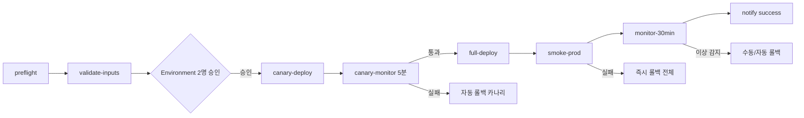
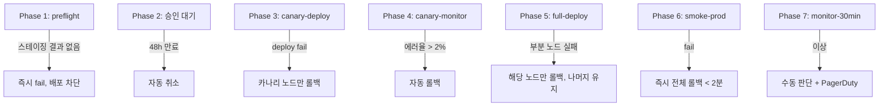

# WF-7 deploy-prod.yml — 프로덕션 배포

> **카테고리**: 02_cd-workflows
> **역할**: 수동 승인 기반 프로덕션 배포 + 카나리 + 자동 롤백
> **Phase**: Phase 1 (P1-1)
> **LOCK**: LOCK-CI-01, LOCK-CI-10 (2인 승인), LOCK-CI-12

---

## 1. 교차 참조 블록

| 대상 | 경로 | 용도 |
|------|-----|------|
| 상세명세 | `CICD_PIPELINE_상세명세.md` §WF-7, §F-2, §F-3 롤백 결정 트리 | 배포 전략 + 롤백 |
| 전략 정본 | `PHASE_B6_CICD_PIPELINE.md` §6.1 | Docker Compose 배포 |
| 선행 | `WF-6_deploy-staging.md` | 스테이징 검증 전제 |
| 종합계획서 | §3.4 LOCK-CI-10 | 2인 이상 승인 |

---

## 2. 트리거

```yaml
name: Deploy Production
on:
  workflow_dispatch:
    inputs:
      version:
        required: true
        description: "배포할 버전 태그 (예: v1.2.3)"
      confirm:
        type: boolean
        required: true
        description: "프로덕션 배포를 확인합니다"
      canary_percentage:
        type: choice
        options: ["10", "25", "50", "100"]
        default: "10"
concurrency:
  group: deploy-prod
  cancel-in-progress: false
```

- **수동 트리거만 허용**: push/schedule 트리거 금지

---

## 3. Environment Protection Rules (LOCK-CI-10)

| 항목 | 설정 |
|------|------|
| Environment 이름 | `production` |
| Required reviewers | **2명 이상** (GitHub Environment protection) |
| Wait timer | 0분 (즉시 리뷰 요청) |
| Deployment branches | `main` 만 허용 |
| 승인 대기 타임아웃 | 48시간 → 자동 취소 |

---

## 4. Job 구성

| Job | 설명 | 타임아웃 | 의존성 |
|-----|------|---------|--------|
| `preflight` | 스테이징 E2E 결과 조회, 승인 상태 검증 | 5분 | — |
| `validate-inputs` | version 형식, confirm=true 검사 | 2분 | preflight |
| `canary-deploy` | canary_percentage 에 해당하는 노드 업데이트 | 15분 | validate-inputs |
| `canary-monitor` | QoD ≥ 0.85, 에러율 < 2% 5분 관찰 | 10분 | canary-deploy |
| `full-deploy` | 나머지 100% 배포 (Docker Compose pull + up) | 20분 | canary-monitor |
| `smoke-prod` | 5개 핵심 엔드포인트 smoke | 10분 | full-deploy |
| `monitor-30min` | 30분 확장 모니터링 | 35분 | smoke-prod |
| `notify` | Slack + PagerDuty 알림 + 대시보드 링크 | 2분 | monitor-30min |

### 4.1 흐름도



---

## 5. 배포 게이트 (F-2)

| 조건 | 유형 | 실패 시 |
|------|------|--------|
| 스테이징 E2E 전부 통과 (WF-12 all scope) | 자동 | 배포 차단 |
| 2명 이상 승인 (GitHub Environment) | 수동 | 48시간 대기 → 자동 취소 |
| 카나리 QoD ≥ 0.85 | 자동 | 자동 롤백 |
| 카나리 에러율 < 2% | 자동 | 자동 롤백 |
| 스모크 5/5 통과 | 자동 | 즉시 롤백 |

---

## 6. 롤백 결정 트리 (F-3)

| 조건 | 트리거 | 동작 | 타임아웃 |
|------|--------|------|---------|
| 스모크 테스트 실패 | 자동 | 즉시 롤백 | < 2분 |
| 카나리 에러율 > 2% | 자동 | 자동 롤백 | 5분 이내 |
| 사용자 불만 > 5건/시간 | 수동 (on-call) | 수동 롤백 | — |
| 성능 회귀 > 20% | 수동 | 수동 롤백 + 원인 분석 | — |

---

### 6.1 캐시 전략

> Prod deploy 는 원칙적으로 unique artifact 를 배포하므로 빌드 캐시는 사용하지 않음. Terraform plan 만 재사용.

| 대상 | 키 | 경로 | 적중률 목표 |
|------|---|------|-----------|
| Terraform plan (prod) | `tf-prod-${{ hashFiles('infra/prod/**/*.tf') }}` | `.terraform/` | ≥70% |
| Docker 이미지 pull (from registry) | 레지스트리 자체 캐시 (GHCR) | — | N/A |

> 빌드 캐시 (Python/Rust/Node) 는 WF-1~WF-4 소관. Prod 환경은 immutable artifact 를 재사용한다.

---

## 7. 시크릿

| 시크릿 | 사용 Job | 필수 |
|--------|---------|------|
| `AWS_ACCESS_KEY_ID` | canary-deploy, full-deploy | ✅ |
| `AWS_SECRET_ACCESS_KEY` | 동일 | ✅ |
| `PROD_SSH_KEY` | compose deploy | ✅ |
| `PROD_HOST_LIST` | compose deploy (canary 노드 선택) | ✅ |
| `TF_API_TOKEN` | Terraform apply | ✅ |
| `DATADOG_API_KEY` | canary-monitor, monitor-30min | ✅ |
| `PAGERDUTY_INTEGRATION_KEY` | notify (롤백 시) | ✅ |
| `SLACK_WEBHOOK_URL` | notify | ✅ |

---

## 8. Phase별 복구 전략



### 8.1 penalty

| 사례 | penalty | 후속 조치 |
|------|---------|---------|
| 카나리 자동 롤백 | −30% | 원인 분석 + 재배포 차단 |
| 스모크 롤백 | −40% | incident 기록 |
| monitor-30min 성능 회귀 15% | −15% | 관찰 모드 유지 |
| monitor-30min 회귀 >20% | −30% | 수동 롤백 결정 |

---

## 9. 로깅 포맷

```json
{
  "trace_id": "deploy-prod-<version>-<run_id>",
  "error": {
    "code": "PROD_DEPLOY_FAILED|CANARY_ROLLBACK|SMOKE_ROLLBACK|TIMEOUT_APPROVAL",
    "phase": "preflight|approval|canary|full|smoke|monitor",
    "version": "v1.2.3",
    "previous_version": "v1.2.2"
  },
  "context": {
    "workflow": "deploy-prod.yml",
    "triggered_by": "<user>",
    "confirm": true,
    "canary_percentage": 10,
    "approvers": ["user-a", "user-b"],
    "canary_metrics": {"qod": 3.6, "error_rate": 0.008}
  },
  "recovery": {
    "retry_count": 0,
    "strategy": "rollback|manual-intervention",
    "confidence_penalty": 0.3,
    "rollback_target": "v1.2.2",
    "rollback_completed_at": "2026-04-11T03:14:22Z"
  }
}
```

---

## 10. Phase 2 테스트 시나리오 (10건+)

| # | 시나리오 | 주입 | 기대 |
|---|---------|---|------|
| T-1 | 정상 배포 10→100 | 승인 2인 + 정상 카나리 | 전 단계 통과 |
| T-2 | 승인 1인만 | 1명 리뷰 | 배포 차단 (Environment rule) |
| T-3 | 48h 승인 대기 만료 | 아무도 리뷰 안함 | 자동 취소 |
| T-4 | 카나리 에러율 3% | 에러 주입 | 자동 롤백 < 5분 |
| T-5 | QoD 3.3 | 품질 저하 | 자동 롤백 |
| T-6 | 스모크 1/5 실패 | 핵심 엔드포인트 장애 | 즉시 전체 롤백 |
| T-7 | 부분 노드 배포 실패 | 노드 1대 SSH 장애 | 해당 노드만 롤백 |
| T-8 | 30분 모니터 회귀 22% | 성능 퇴행 | 수동 롤백 경고 + PagerDuty |
| T-9 | confirm=false | 실수 trigger | validate-inputs fail |
| T-10 | version=v0.9.9 (존재 안함) | 잘못된 태그 | preflight fail |
| T-11 | main 이외 브랜치 | feature 브랜치 trigger | Environment rule 차단 |
| T-12 | concurrency 동시 배포 | 2건 동시 | 대기 큐 (cancel 없음) |
| T-13 | Datadog API 장애 | 메트릭 조회 실패 | canary-monitor degrade 모드, 수동 승인 요구 |

---

## 11. LOCK 위반 체크

- [x] LOCK-CI-01: deploy-prod.yml 14개 목록 포함
- [x] LOCK-CI-10: 2인 이상 승인 (GitHub Environment Protection)
- [x] LOCK-CI-12: Docker Compose V2 6 서비스 배포 유지 (app tier 3: orange-core/blue-nodes/api-gateway + data tier 3: postgres/qdrant/neo4j)
