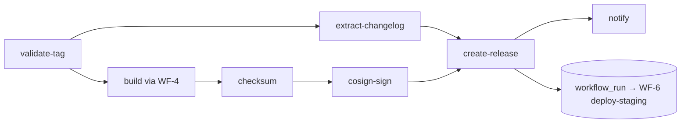
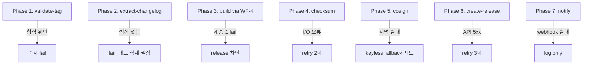

# WF-5 release.yml — 릴리스

> **카테고리**: 05_release-management
> **역할**: 태그 기반 릴리스 + 멀티플랫폼 빌드 + GitHub Release 게시
> **Phase**: Phase 1 (P1-1)
> **LOCK**: LOCK-CI-01, LOCK-CI-04 (SemVer), LOCK-CI-05 (Conventional Commits)

---

## 1. 교차 참조 블록

| 대상 | 경로 | 용도 |
|------|-----|------|
| 상세명세 | `CICD_PIPELINE_상세명세.md` §WF-5 | Job 구성 |
| 전략 정본 | `PHASE_B6_CICD_PIPELINE.md` §5.1 | SemVer + Conventional Commits |
| 종합계획서 | §3.4 LOCK-CI-04/05 | SemVer / Conventional |
| 빌드 | `../01_ci-workflows/WF-4_build-tauri.md` | 멀티플랫폼 빌드 호출 |
| 후속 | `../02_cd-workflows/WF-6_deploy-staging.md` | workflow_run 체인 |
| 인접 | `WF-14_version-bump.md` | 태그 생성 상위 흐름 |

---

## 2. 트리거

```yaml
name: Release
on:
  push:
    tags:
      - "v*.*.*"           # stable
      - "v*.*.*-alpha.*"   # prerelease
      - "v*.*.*-beta.*"
      - "v*.*.*-rc.*"
concurrency:
  group: release-${{ github.ref }}
  cancel-in-progress: false
```

- **태그 형식 강제**: `v<MAJOR>.<MINOR>.<PATCH>(-<pre>.<n>)?` (LOCK-CI-04)

---

## 3. Job 구성

| Job | 설명 | 타임아웃 | 의존성 |
|-----|------|---------|--------|
| `validate-tag` | SemVer 형식 검증, CHANGELOG.md 존재 확인 | 3분 | — |
| `extract-changelog` | CHANGELOG.md 에서 해당 버전 섹션 추출 | 2분 | validate-tag |
| `build` | `WF-4 build-tauri.yml` 호출 (`release_mode=true`) | 60분 | validate-tag |
| `checksum` | SHA256 체크섬 생성 + `checksums.txt` | 5분 | build |
| `cosign-sign` | Sigstore cosign 서명 (선택) | 5분 | checksum |
| `create-release` | GitHub Release 생성 + 아티팩트 + checksums + CHANGELOG | 5분 | cosign-sign |
| `notify` | Slack/Discord 알림 | 2분 | create-release |

### 3.1 흐름도



---

## 4. SemVer 검증 (LOCK-CI-04)

```python
# validate-tag job 의사코드
import re
TAG_RE = re.compile(r"^v(?P<major>\d+)\.(?P<minor>\d+)\.(?P<patch>\d+)(-(?P<pre>[a-z]+)\.(?P<n>\d+))?$")
tag = os.environ["GITHUB_REF_NAME"]
m = TAG_RE.match(tag)
if not m:
    raise SystemExit(f"Invalid SemVer tag: {tag}")
```

---

## 5. CHANGELOG 추출 (Conventional Commits, LOCK-CI-05)

- **입력**: `CHANGELOG.md` (Keep a Changelog 포맷)
- **추출 규칙**: `## [v1.2.3] - YYYY-MM-DD` 섹션부터 다음 `## [` 전까지
- **검증**: `feat:`, `fix:`, `docs:`, `refactor:`, `perf:`, `test:`, `chore:` prefix 사용 확인 (warn only)

---

## 6. 체크섬 + 서명

- **SHA256**: 각 바이너리에 대해 `sha256sum` 생성
- **`checksums.txt`**: `<hash>  <filename>` 포맷, GitHub Release 첨부
- **cosign 서명**: `cosign sign-blob --yes checksums.txt` → `.sig` + `.cert` 첨부

---

### 6.1 캐시 전략

> Release WF 는 WF-4 build-tauri 를 호출하므로 빌드 캐시는 WF-4 의 Rust/Node 캐시 키를 그대로 상속한다.

| 대상 | 키 | 경로 | 적중률 목표 |
|------|---|------|-----------|
| Rust build (상속) | `rust-${{ hashFiles('Cargo.lock') }}` | `~/.cargo`, `target/` | ≥80% |
| Node build (상속) | `node-${{ hashFiles('pnpm-lock.yaml') }}` | `~/.pnpm-store` | ≥85% |
| cosign 바이너리 | `cosign-${{ env.COSIGN_VERSION }}` | `/usr/local/bin/cosign` | ≥95% |

> 본 WF 자체 신규 캐시는 cosign 바이너리 1종이며, 나머지는 피호출 WF 에 위임한다.

---

## 7. 시크릿

| 시크릿 | 사용 Job | 필수 |
|--------|---------|------|
| `GITHUB_TOKEN` | create-release | ✅ |
| `APPLE_CERTIFICATE` 등 | build (WF-4 재사용) | ✅ |
| `WINDOWS_PFX` 등 | build | ✅ |
| `GPG_PRIVATE_KEY` | build | ✅ |
| `COSIGN_KEY` | cosign-sign (keyless 사용 시 불필요) | 선택 |
| `COSIGN_PASSWORD` | cosign-sign | 선택 |
| `TAURI_SIGNING_PRIVATE_KEY` | create-release (Tauri Updater 서명) | ✅ |
| `TAURI_SIGNING_PRIVATE_KEY_PASSWORD` | create-release (Tauri Updater 서명) | ✅ |
| `SLACK_WEBHOOK_URL` | notify | ✅ |
| `DISCORD_WEBHOOK_URL` | notify | 선택 |

---

## 8. Phase별 복구 전략



### 8.1 penalty

| 사례 | penalty | 결과 |
|------|---------|---|
| cosign 생략 fallback | −10% | 통과 (경고) |
| Discord 알림 실패 | 0 | 통과 |
| GitHub Release API retry | −5% | 통과 |
| Build 4 중 1 fail | −20% | release 차단 (LOCK-CI-06) |

---

## 9. 로깅 포맷

```json
{
  "trace_id": "release-<tag>-<run_id>",
  "error": {
    "code": "INVALID_TAG|CHANGELOG_MISSING|BUILD_FAILED|SIGN_FAILED|RELEASE_API_FAILED",
    "tag": "v1.2.3",
    "stage": "validate|changelog|build|checksum|cosign|create-release|notify"
  },
  "context": {
    "workflow": "release.yml",
    "semver": {"major": 1, "minor": 2, "patch": 3, "pre": null},
    "artifacts": ["vamos_amd64.AppImage", "vamos_x64.msi", "vamos_arm64.dmg", "vamos_x64.dmg"],
    "changelog_lines": 42,
    "prerelease": false
  },
  "recovery": {
    "retry_count": 0,
    "strategy": "retry|fallback|none",
    "confidence_penalty": 0.05
  }
}
```

---

## 10. Phase 2 테스트 시나리오 (10건+)

| # | 시나리오 | 주입 | 기대 |
|---|---------|---|------|
| T-1 | 정상 stable release | `git tag v1.2.3 && push` | 전 단계 통과, GitHub Release 생성 |
| T-2 | Alpha prerelease | `v1.2.3-alpha.1` | prerelease 플래그 set |
| T-3 | 잘못된 태그 | `1.2.3` (v 없음) | validate-tag fail |
| T-4 | SemVer 위반 | `v1.2` | validate-tag fail |
| T-5 | CHANGELOG 누락 | 해당 버전 섹션 없음 | extract-changelog fail |
| T-6 | Build matrix 1개 fail | windows 빌드 실패 | release 차단 |
| T-7 | Cosign 키 만료 | 만료 시크릿 | fallback or release 차단 |
| T-8 | Discord webhook 5xx | webhook 장애 | log only, release 정상 |
| T-9 | 이미 존재하는 태그 재실행 | 기존 태그 재push | create-release fail (이미 존재) |
| T-10 | workflow_run 체인 | release 성공 | WF-6 deploy-staging 자동 트리거 |
| T-11 | SLSA attestation | provenance 요구 | 별도 job 에서 생성 (Phase 2 연동) |
| T-12 | checksum 불일치 | artifact 손상 | checksum job fail, 재실행 |
| T-13 | 48시간 초과 | build 무한 대기 | 타임아웃, 부분 정리 |

---

## 11. LOCK 위반 체크

- [x] LOCK-CI-01: release.yml 14개 목록 포함
- [x] LOCK-CI-04: SemVer 2.0.0 태그 형식 강제
- [x] LOCK-CI-05: Conventional Commits 기반 CHANGELOG 추출
- [x] LOCK-CI-06 (간접): WF-4 호출 시 4플랫폼 빌드 유지
- [x] LOCK-CI-07 (간접): WF-4 서명 프로세스 사용
