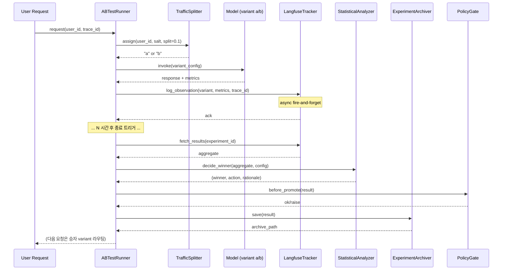

# ab_test_framework.md — A/B Test Framework (Langfuse)

> **Phase**: 2 | **세션**: 2-5 | **작성일**: 2026-04-18
> **정본 출처**: 상세명세 §A-5 (ABTestConfig), §A-6 (도구), 종합계획서 §3.4 LOCK-ML-04, §6.1 S7F-075 매핑, §11.3 FR-8
> **S7F 매핑**: S7F-075 실험 관리 — A/B 테스트 프레임워크 (✅ 완전매핑)
> **Part2 버전 태그**: **V2-Phase 2**
> **정책 앵커**: LOCK-ML-04 (p < 0.05 significance_level), R-17-1 (프롬프트 변경 시 A/B 필수)
> **TEST_MODE**: true (sandbox 경로 `D:\VAMOS\docs\test_iso_p2\sot 2\`, production UNCHANGED)

---

## §0. 교차 참조 블록

| 참조 문서 | 섹션 | 용도 |
|-----------|------|------|
| `D:\VAMOS\docs\sot\STEP7-F_인프라_배포_MLOps_작업가이드.md` | L1214~L1220 (S7F-075) | 상위 SoT: A/B 프레임워크 원본 요구사항 (트래픽 90/10, 유의수준 95%, Langfuse Experiments) |
| `D:\VAMOS\docs\sot 2\4-4_MLOps-LLMOps\MLOPS_LLMOPS_구조화_종합계획서.md` | §3.4 LOCK-ML-04 | A/B 테스트 유의수준 p < 0.05 정본 |
| `D:\VAMOS\docs\sot 2\4-4_MLOps-LLMOps\MLOPS_LLMOPS_구조화_종합계획서.md` | §A.5 | ABTestConfig 베이스 클래스 (본 §4 확장 대상) |
| `D:\VAMOS\docs\sot 2\4-4_MLOps-LLMOps\MLOPS_LLMOPS_구조화_종합계획서.md` | §6.1 | S7F-075 → 01_prompt-versioning 서브폴더 매핑 (✅ §A-6 ABTestConfig+Result 완전매핑) |
| `D:\VAMOS\docs\sot 2\4-4_MLOps-LLMOps\MLOPS_LLMOPS_구조화_종합계획서.md` | §11.3 | FR-8 품질 게이트 시맨틱스 (block/warn — 본 §6.4 판정 후 처리) |
| `D:\VAMOS\docs\sot 2\4-4_MLOps-LLMOps\AUTHORITY_CHAIN.md` | L32 LOCK-ML-04 | "A/B 테스트 유의수준 / 상세명세 §A-6 / p < 0.05 (significance_level) / sot 2/ 승인" |
| `D:\VAMOS\docs\test_iso_p2\sot 2\4-4_MLOps-LLMOps\01_prompt-versioning\prompt_schema_spec.md` | §3 (PromptVersion) | 실험 대상 프롬프트 버전 ID 공급자 |
| `D:\VAMOS\docs\test_iso_p2\sot 2\4-4_MLOps-LLMOps\01_prompt-versioning\promptfoo_test_spec.md` | §2.4 ABTestBridgeConfig | 오프라인 eval 브리지 → 본 §8 variant 후보 공급 |
| `D:\VAMOS\docs\test_iso_p2\sot 2\4-4_MLOps-LLMOps\01_prompt-versioning\version_tagging_rollback_spec.md` | §A.4 | 롤백 메커니즘 — variant_b 승격 실패 시 rollback 흐름 연동 |
| `D:\VAMOS\docs\test_iso_p2\sot 2\4-4_MLOps-LLMOps\05_feedback-loop\feedback_pipeline.md` | §4 (Top10PatternCluster) + §7 (FeedbackSprint.qod_delta) | **2-4 PRODUCER** → 2-5 CONSUMER (본 §4, §8 가설 공급) |
| `D:\VAMOS\docs\test_iso_p2\sot 2\4-4_MLOps-LLMOps\04_canary-deployment\canary_router.md` | §G-1~G-3 | A/B 통과 후 카나리 경로 (간접 downstream, §8.3) |
| `D:\VAMOS\docs\sot 2\4-4_MLOps-LLMOps\CONFLICT_LOG.md` | C-02 | A/B 테스트 트래픽 비율 가변성 (상세명세 우선) |

---

## §1. 목적 / 범위

### §1.1 목적

본 문서는 **VAMOS AI** MLOps/LLMOps 도메인(4-4)의 Phase 2 2-5 세션 산출물이며, **S7F-075 실험 관리 — A/B 테스트 프레임워크** 의 구현 명세를 정의한다.

구체적으로:

1. `ABTestConfig` / `ABTestResult` **Pydantic v2 모델** 확장 정의 (§4, §5).
2. **통계 분석 엔진**: Welch's t-test / chi-squared / bootstrap CI, p < 0.05 자동 판정 로직 + 다중 메트릭 Bonferroni correction (§6).
3. **Langfuse Experiments 연동**: Experiments API 호출, 트래픽 분할 90%/10% (Control/Variant), 메트릭 수집, 대시보드 자동 설정 (§7).
4. **Cross-session interface**: 2-4 Feedback Pipeline(`Top10PatternCluster`) → 2-5 가설 변환 (`variant_b.prompt_patch`) → 2-6 DSPy 자동 최적화 (§8).
5. **서비스 계층**: `IABTestRunner` ABC, `ABTestRunner`, `StatisticalAnalyzer`, `LangfuseTracker`, `TrafficSplitter`, `ExperimentArchiver` (§9).
6. **Phase 3 테스트 시나리오** ≥10건 (§11).

### §1.2 범위 (Phase 2 2-5 한정)

- 대상: 프롬프트 버전 간 A/B (control: production 버전, variant: staging 버전).
- 대상: 모델 간 A/B (동일 프롬프트, 다른 `model_id`) — S7F-076 카탈로그 연동.
- 대상: 파라미터 A/B (temperature, top_p, max_tokens 등).

### §1.3 Phase 2 2-5 제외 항목

- 실제 Langfuse SaaS 인스턴스 배포 (Phase 3 3-1 런북).
- 실제 traffic routing 미들웨어 코드 (Phase 3 구현 스텁 제공만).
- Fine-tuning 모델 A/B (S7F-077 Phase 3 3-2 이관).
- Guardrails A/B (S7F-078 Phase 3 3-3 이관).

### §1.4 V2-Phase 2 태그

본 산출물은 `V2-Phase 2` 태그 필수 (§7 Phase 2 2-5 대조 기준 #5, §13 변경 이력 등록).

---

## §2. 상위 SoT 정본 인용 (S7F-075 verbatim)

본 세션 모든 설계 결정의 **Level 2 상위 정본**은 `STEP7-F_인프라_배포_MLOps_작업가이드.md` L1214~L1220 이다. subagent 추정 금지, 상위 SoT 그대로 인용.

```
**S7F-075** | MED | V2 | 실험 관리 — A/B 테스트 프레임워크
- 내용: 프롬프트, 모델, 설정 변경의 A/B 테스트
- 구현:
  - Langfuse Experiments 기능 활용
  - 트래픽 분할: 90% Control / 10% Variant
  - 통계 분석: 유의수준 95% 달성 시 자동 결정
  - 기록: 모든 실험 이력 + 결과 아카이빙
```

### §2.1 본 세션 해석 매트릭스

| 상위 SoT 요구사항 | 본 산출물 반영 섹션 | 이행 방법 |
|------------------|-----------------|-----------|
| "Langfuse Experiments 기능 활용" | §7 전체 | `LangfuseTracker` 서비스 + Experiments API 호출 코드 |
| "트래픽 분할: 90% Control / 10% Variant" | §4.3, §9.5 | `TrafficSplitter` 해시 기반 버킷팅 (`traffic_split=0.1`) |
| "통계 분석: 유의수준 95% 달성 시 자동 결정" | §3.1, §6 전체 | `significance_level=0.05` (LOCK-ML-04), Welch's t-test, auto-promote |
| "모든 실험 이력 + 결과 아카이빙" | §9.6 ExperimentArchiver | JSON lines append-only, 보관 12개월 |

> ⚠ **상위 SoT 우선 원칙**: 상위 SoT "90%/10%" 는 **기본값** 이다 (L1218). §A-5 `traffic_split: float (0.0~1.0)` 는 가변 범위이며, C-02 CONFLICT_LOG 에서 "상세명세 우선" 으로 해소됨. 따라서 ABTestConfig 기본값은 `traffic_split=0.1` (=10% variant) 로 고정하되 상한/하한은 자유, **0.5 초과 시 경고** 로그 발화.

---

## §3. LOCK / 정책 앵커 (AUTHORITY_CHAIN verbatim)

### §3.1 LOCK-ML-04 (AUTHORITY_CHAIN.md L32 verbatim)

```
| LOCK-ML-04 | A/B 테스트 유의수준 | 상세명세 §A-6 | p < 0.05 (significance_level) | sot 2/ 승인 |
```

**의미**: 모든 A/B 테스트 판정의 p-value 임계치는 `0.05` 이다. 본 산출물 §4 `ABTestConfig.significance_level` 기본값 = `0.05`, §6 `StatisticalAnalyzer.decide_winner()` 조건 = `p_value < 0.05`.

### §3.2 R-17-1 (종합계획서 §3.4 R-17-1)

```
| R-17-1 | 프롬프트 변경 시 A/B 테스트 필수 (p < 0.05) | LOCK-ML-04, 상세명세 §A-6 |
```

**의미**: 프롬프트(v3.x) 변경은 **반드시** A/B 테스트를 거쳐 p<0.05 판정 후에만 production 전환 가능. 본 산출물 §7.5 Langfuse gate 함수 `require_ab_passed()` 에서 강제.

### §3.3 §6.1 이슈 해결 매핑

```
| S7F-075 | 실험 관리 (A/B 테스트) | 01_prompt-versioning | ✅ §A-6 ABTestConfig+Result |
```

**의미**: S7F-075 는 `01_prompt-versioning` 서브폴더에 **완전매핑(✅)** 으로 배치되며, 본 파일이 정본이다. (0-3 산출물 3 / 0-4 최종 확정 / 0-7 _index.md 반영)

### §3.4 §11.3 FR-8 (품질 게이트 시맨틱스)

```
FR-8: 품질 게이트 시맨틱스 — block/warn 의미 정의 (block=배포 차단+on-call 알림+Slack 채널, warn=대시보드+이메일), 오버라이드 승인 절차
```

**적용**: §6.4 `decide_action()` 의 반환 `DecisionAction` Enum 에 `BLOCK` / `WARN` / `PROMOTE` / `EXTEND` 4 상태 매핑. block 시 on-call 알림 페이로드 발송, warn 시 대시보드 표기.

### §3.5 정책 anchor 요약 표

| Anchor ID | 본 산출물 반영 위치 | 강제 방법 |
|-----------|-------------------|----------|
| LOCK-ML-04 | §4.3 field `significance_level: float = 0.05`, §6.1 `StatisticalAnalyzer` | Pydantic default + 유효 범위 `[0.001, 0.10]` |
| R-17-1 | §7.5 Langfuse deployment gate | Production 전환 시 `ABTestResult.winner != None and p<0.05` 필수 |
| §6.1 S7F-075 | §0 교차 참조 블록 | `01_prompt-versioning/ab_test_framework.md` 경로 고정 |
| §11.3 FR-8 | §6.4, §7.6 | `DecisionAction` 매핑 |

---

## §4. ABTestConfig (Pydantic v2) — §A.5 베이스 확장

### §4.1 §A.5 원본 인용 (종합계획서 L1837~L1850 verbatim)

```python
class ABTestConfig:
    test_id: str
    prompt_a: str                     # 제어군 프롬프트 버전 ID
    prompt_b: str                     # 실험군 프롬프트 버전 ID
    traffic_split: float              # B에 할당 비율 (0.0~1.0)
    metrics: list[str]                # ["quality_score", "latency", "user_satisfaction"]
    min_sample_size: int              # 통계적 유의성 최소 샘플
    max_duration_hours: int           # 최대 테스트 기간
    significance_level: float = 0.05  # p-value 임계치 (LOCK-ML-04)
    auto_promote: bool                # 승자 자동 승격 여부
```

### §4.2 확장 방침

§A.5 는 **dataclass 수준** 선언이며, Phase 2 구현 정본은 **Pydantic v2 BaseModel** 로 격상한다. 다음 필드 확장:

- `variant_a`, `variant_b` 를 `ABTestVariant` 구조체로 승격 (단순 str → prompt_id + model_id + temperature + etc).
- `metrics` 를 `list[MetricSpec]` 으로 격상 (이름 + 방향 higher_is_better + 통계검정 방법).
- `status`, `created_at`, `started_at`, `ended_at`, `langfuse_experiment_id` 운영 필드 추가.
- `guardrails`: `traffic_split` 상한 검증, `min_sample_size` 하한 검증.

### §4.3 Pydantic v2 모델 정의

```python
# ---------------------------------------------------------------
# §4.3 ABTestConfig (Pydantic v2, immutable after start)
# ---------------------------------------------------------------
from __future__ import annotations
from datetime import datetime
from enum import Enum
from typing import Literal, Optional
from pydantic import BaseModel, ConfigDict, Field, field_validator, model_validator


class TestStatus(str, Enum):
    """실험 상태 머신 — S0~S5 (정본)."""
    DRAFT = "draft"           # S0 작성 중
    PENDING = "pending"       # S1 Langfuse 등록 대기
    RUNNING = "running"       # S2 활성 실험
    ANALYZING = "analyzing"   # S3 종료 후 통계 분석
    DECIDED = "decided"       # S4 판정 완료 (winner or inconclusive)
    ARCHIVED = "archived"     # S5 아카이브 (auto-promote 또는 manual 종료)


class MetricDirection(str, Enum):
    HIGHER_IS_BETTER = "higher"   # e.g., quality_score, user_satisfaction
    LOWER_IS_BETTER = "lower"     # e.g., latency, cost, error_rate


class TestMethod(str, Enum):
    WELCH_T_TEST = "welch_t_test"         # 연속형, 분산 이질
    CHI_SQUARED = "chi_squared"           # 이항/범주형 (예: 성공/실패)
    MANN_WHITNEY_U = "mann_whitney_u"     # 비모수, 분포 가정 없음
    BOOTSTRAP_PERCENTILE = "bootstrap"    # CI 기반 비모수


class MetricSpec(BaseModel):
    """단일 메트릭 명세."""
    model_config = ConfigDict(frozen=True, extra="forbid")

    name: str = Field(..., description="예: quality_score, latency_ms, user_satisfaction")
    direction: MetricDirection
    method: TestMethod = TestMethod.WELCH_T_TEST
    primary: bool = Field(default=False, description="주요 메트릭 (Bonferroni 분모 제외)")
    min_detectable_effect: float = Field(default=0.05, gt=0.0, le=1.0,
                                           description="최소 검출 효과 크기 (MDE)")


class ABTestVariant(BaseModel):
    """Variant 정의 — control 또는 variant_b."""
    model_config = ConfigDict(frozen=True, extra="forbid")

    variant_id: Literal["a", "b"]
    prompt_id: str = Field(..., description="prompt_schema_spec §3 PromptVersion.id (예: 'core_system:v3.1.0')")
    model_id: str = Field(default="claude-3-5-sonnet",
                           description="S7F-076 카탈로그 등록 id")
    temperature: float = Field(default=0.7, ge=0.0, le=2.0)
    top_p: float = Field(default=0.95, ge=0.0, le=1.0)
    max_tokens: int = Field(default=2048, ge=1, le=100_000)
    prompt_patch: Optional[str] = Field(default=None,
        description="variant_b 한정: 2-4 Top10PatternCluster 로부터 파생된 prompt 변형 요약 (예: 'apply negative-case clarification clause')")
    provenance: Optional[str] = Field(default=None,
        description="변형 출처 (예: 'feedback_cluster:cluster_id=c_042')")


class ABTestConfig(BaseModel):
    """A/B 실험 설정 — §A.5 베이스 확장.

    정본: 종합계획서 §A.5 + 상위 SoT STEP7-F S7F-075.
    LOCK-ML-04 강제: significance_level=0.05.
    """
    model_config = ConfigDict(frozen=True, extra="forbid")

    # --- 식별 ---
    test_id: str = Field(..., pattern=r"^abt-[0-9a-z_\-]{3,64}$",
                          description="예: 'abt-core-sys-v310-vs-v320'")
    created_at: datetime
    started_at: Optional[datetime] = None
    ended_at: Optional[datetime] = None
    status: TestStatus = TestStatus.DRAFT

    # --- 실험 대상 ---
    variant_a: ABTestVariant = Field(..., description="Control (production 현행 버전)")
    variant_b: ABTestVariant = Field(..., description="Treatment (staging 후보 버전)")

    # --- 트래픽 ---
    traffic_split: float = Field(default=0.10, ge=0.001, le=0.5,
        description="variant_b 할당 비율. 기본 0.1 = 10% (S7F-075 상위 SoT 90/10). 상한 0.5 로 강제 — 초과 시 ValidationError.")

    # --- 메트릭 ---
    metrics: list[MetricSpec] = Field(..., min_length=1, max_length=10)

    # --- 통계 파라미터 ---
    min_sample_size: int = Field(default=100, ge=30, le=1_000_000,
        description="min_sample_size 하한 30 (CLT), 기본 100 (§14 W-3 대응)")
    max_duration_hours: int = Field(default=168, ge=1, le=720,
        description="기본 7일 (168h), 상한 30일 (720h)")
    significance_level: float = Field(default=0.05, gt=0.0, le=0.10,
        description="p-value 임계치 (LOCK-ML-04). 하한 0 초과, 상한 0.10 (LOCK 경고 보호)")
    statistical_power_target: float = Field(default=0.80, ge=0.5, le=0.99,
        description="1-β 목표. Phase 3 sample size calc 용.")
    bonferroni_correction: bool = Field(default=True,
        description="다중 메트릭 compare 시 α 보정")

    # --- 운영 ---
    auto_promote: bool = Field(default=False,
        description="True 시 p<0.05 + winner=b 판정 후 자동 production 전환")
    langfuse_experiment_id: Optional[str] = Field(default=None,
        description="Langfuse Experiments API 반환 ID, status=RUNNING 이후 채워짐")
    traffic_salt: str = Field(default="vamos-ab-2026",
        description="해시 버킷팅 seed. 실험별로 변경 권장.")

    # --- 가드 ---
    @field_validator("significance_level")
    @classmethod
    def validate_alpha(cls, v: float) -> float:
        """LOCK-ML-04 강제 — significance_level 은 0.05 고정 (AUTHORITY_CHAIN.md L32)."""
        if v != 0.05:
            raise ValueError(
                "LOCK-ML-04 위반: significance_level 은 0.05 고정 (p < 0.05). "
                "변경은 정본 출처 AUTHORITY_CHAIN.md 에서만 가능 (R2).")
        return v

    @model_validator(mode="after")
    def validate_variants_distinct(self) -> "ABTestConfig":
        if self.variant_a.prompt_id == self.variant_b.prompt_id \
           and self.variant_a.model_id == self.variant_b.model_id \
           and abs(self.variant_a.temperature - self.variant_b.temperature) < 1e-9:
            raise ValueError("variant_a 와 variant_b 가 동일 설정입니다 — A/B 불가")
        if not any(m.primary for m in self.metrics):
            raise ValueError("primary=True 메트릭이 최소 1개 필요")
        return self
```

### §4.4 2-4 CONSUMER 통합 지점

본 세션은 **2-4 Feedback Pipeline** 의 CONSUMER 이다. 2-4 (`feedback_pipeline.md`) 가 PRODUCER 로 공급하는 `Top10PatternCluster` 를 `variant_b.prompt_patch` / `variant_b.provenance` 로 매핑한다:

```python
def derive_variant_b_from_feedback(cluster: "Top10PatternCluster",
                                     base_prompt_id: str) -> ABTestVariant:
    """2-4 Top-10 cluster → variant_b 생성.

    feedback_pipeline.md §4.4 Top10PatternCluster.clusters 각 항목의
    representative_text 를 기반으로 prompt_patch 요약을 도출.
    """
    if not cluster.clusters:
        raise ValueError("empty cluster — variant_b 생성 불가")
    top1 = cluster.clusters[0]
    return ABTestVariant(
        variant_id="b",
        prompt_id=f"{base_prompt_id}-patch-{top1.cluster_id}",
        prompt_patch=f"address pattern: {top1.representative_text[:80]}",
        provenance=f"feedback_cluster:sprint={cluster.sprint_id},cluster={top1.cluster_id}",
    )
```

**[INTERFACE_MISMATCH] 점검**: `Top10PatternCluster.clusters` (list) / `FeedbackCluster.cluster_id` (str) / `FeedbackCluster.representative_text` (str) — feedback_pipeline.md §4.4 L283~L304 원본과 일치 확인 완료 (FeedbackCluster L283~L294 + Top10PatternCluster L297~L304). 불일치 마커 미발화.

### §4.5 §F-2 vs §A-6 정책 노트 (CONFLICT 아님)

§F-2 (RLHF-lite A/B 검증 파라미터: `min_sample=500`, `p<0.05`) vs §A-6 (ABTestConfig `min_sample_size 미지정`) 는 0-3 산출물 6 / 0-4 L487 에서 **불일치 아님** 으로 판정됨:

> "§F-2 는 §A-6 ABTestConfig 의 RLHF-lite 전용 인스턴스값"

즉 §F-2 `min_sample=500` 은 **RLHF-lite 컨텍스트에서의 권장값** 이고, 본 §A-6 ABTestConfig 는 `min_sample_size` 를 **가변 파라미터** 로 둔다. 본 세션은 이를 [CONFLICT_CANDIDATE] 마커로 보고하지 **않는다**.

---

## §5. ABTestResult (Pydantic v2) — 판정 결과 스키마

### §5.1 설계 방침

ABTestResult 는 **ABTestConfig + 메트릭별 통계 결과 + 최종 판정** 을 담는다. Langfuse Experiments API 응답을 파싱하여 채운다. S7F-075 "모든 실험 이력 + 결과 아카이빙" 강제를 위한 정본 구조.

### §5.2 Pydantic v2 모델 정의

```python
# ---------------------------------------------------------------
# §5.2 ABTestResult (Pydantic v2)
# ---------------------------------------------------------------

class VariantMetrics(BaseModel):
    """단일 variant 의 메트릭 수치."""
    model_config = ConfigDict(frozen=True, extra="forbid")

    variant_id: Literal["a", "b"]
    sample_size: int = Field(..., ge=0)
    metrics: dict[str, float] = Field(default_factory=dict,
        description="메트릭명 → 평균값 (예: {'quality_score': 0.87, 'latency_ms': 1234.5})")
    metric_std: dict[str, float] = Field(default_factory=dict,
        description="메트릭명 → 표준편차 (Welch's t-test 용)")
    metric_median: dict[str, float] = Field(default_factory=dict,
        description="메트릭명 → 중앙값 (Mann-Whitney U 용)")
    error_rate: float = Field(default=0.0, ge=0.0, le=1.0,
        description="요청 실패 비율 (카나리 S7F-075 안전 지표)")


class Winner(str, Enum):
    VARIANT_A = "a"
    VARIANT_B = "b"
    INCONCLUSIVE = "inconclusive"   # p >= 0.05 또는 effect_size 미달


class ConfidenceInterval(BaseModel):
    model_config = ConfigDict(frozen=True, extra="forbid")
    metric: str
    lower: float
    upper: float
    confidence: float = Field(default=0.95, gt=0.0, lt=1.0,
        description="1 - α, 기본 0.95 (LOCK-ML-04 보완)")
    method: Literal["bootstrap", "welch", "t-dist"] = "welch"


class MetricStatResult(BaseModel):
    """메트릭별 통계 검정 결과."""
    model_config = ConfigDict(frozen=True, extra="forbid")

    metric_name: str
    test_method: TestMethod
    test_statistic: float
    p_value: float = Field(..., ge=0.0, le=1.0)
    p_value_corrected: float = Field(..., ge=0.0, le=1.0,
        description="Bonferroni 보정 p-value (bonferroni_correction=True 시 의미있음)")
    effect_size: float = Field(..., description="Cohen's d / odds ratio / 등")
    ci: ConfidenceInterval
    significant: bool = Field(..., description="p_value_corrected < significance_level 판정")


class ABTestResult(BaseModel):
    """A/B 실험 판정 결과 — LangfuseTracker.finalize() 반환.

    보관: ExperimentArchiver 가 JSON lines 로 append-only.
    R-17-1 강제: winner 결정 후에만 production 전환 gate 통과.
    """
    model_config = ConfigDict(frozen=True, extra="forbid")

    test_id: str = Field(..., pattern=r"^abt-[0-9a-z_\-]{3,64}$")
    config_snapshot: ABTestConfig = Field(..., description="실험 시작 당시 불변 스냅샷")

    # --- 샘플/기간 ---
    variant_a_metrics: VariantMetrics
    variant_b_metrics: VariantMetrics
    sample_size: int = Field(..., ge=0, description="a + b 합")
    duration_hours: float = Field(..., ge=0.0)

    # --- 통계 결과 ---
    per_metric: list[MetricStatResult] = Field(..., min_length=1)
    primary_metric_result: MetricStatResult = Field(..., description="primary=True 메트릭의 결과")

    # --- 요약 ---
    p_value: float = Field(..., ge=0.0, le=1.0,
        description="primary metric 의 (보정) p-value")
    confidence_interval: ConfidenceInterval = Field(...,
        description="primary metric 의 CI")
    statistical_power: float = Field(..., ge=0.0, le=1.0,
        description="실제 달성한 power (1-β) — post-hoc 추정")
    winner: Winner
    decision_rationale: str = Field(..., min_length=10, max_length=2000)

    # --- 운영 ---
    decided_at: datetime
    langfuse_experiment_id: Optional[str] = None
    archived: bool = Field(default=False)
    archive_path: Optional[str] = Field(default=None,
        description="예: 'logs/ab_tests/abt-core-sys-v310-vs-v320.jsonl'")

    @model_validator(mode="after")
    def validate_winner_consistency(self) -> "ABTestResult":
        alpha = self.config_snapshot.significance_level
        if self.p_value < alpha and self.winner == Winner.INCONCLUSIVE:
            raise ValueError("p<α 인데 winner=INCONCLUSIVE — 모순")
        if self.p_value >= alpha and self.winner in (Winner.VARIANT_A, Winner.VARIANT_B):
            # 경계 케이스: auto_promote=False 이고 수동 판정 시 허용 가능
            # — 단, decision_rationale 에 명시 필수.
            if "manual_override" not in self.decision_rationale:
                raise ValueError("p≥α 인데 winner 결정, decision_rationale 에 manual_override 명시 필요")
        return self
```

### §5.3 아카이빙 포맷

JSON Lines (`.jsonl`), 한 실험당 한 줄. Path 패턴: `logs/ab_tests/YYYY/MM/{test_id}.jsonl`. 12개월 보존 후 cold storage 이관.

```jsonl
{"test_id":"abt-core-sys-v310-vs-v320","winner":"b","p_value":0.018,"sample_size":1247,"duration_hours":72.4,"decided_at":"2026-05-01T12:00:00Z","archived":true}
```

---

## §6. 통계 분석 엔진 (StatisticalAnalyzer)

### §6.1 설계

StatisticalAnalyzer 는 `VariantMetrics` a/b 쌍과 `list[MetricSpec]` 을 입력받아 `list[MetricStatResult]` 를 반환하는 **순수 함수 집합체** (I/O 없음). scipy.stats 의존.

### §6.2 scipy 검정 매핑

| MetricSpec.method | scipy 호출 | 용도 |
|------------------|-----------|------|
| `WELCH_T_TEST` | `scipy.stats.ttest_ind(a, b, equal_var=False)` | 연속형, 분산 이질 (가장 일반적) |
| `CHI_SQUARED` | `scipy.stats.chi2_contingency(table)` | 성공/실패 이항 |
| `MANN_WHITNEY_U` | `scipy.stats.mannwhitneyu(a, b, alternative="two-sided")` | 비모수, 소표본 |
| `BOOTSTRAP_PERCENTILE` | `scipy.stats.bootstrap(data, statistic, n_resamples=10_000)` | CI 기반, 분포 가정 없음 |

### §6.3 Bonferroni 보정

```python
def bonferroni_correct(p_values: list[float], alpha: float = 0.05) -> tuple[list[float], float]:
    """Holm-Bonferroni 아님 — 단순 Bonferroni.

    다중 메트릭 비교 시 FWER 제어: alpha_corrected = alpha / m.
    p_value_corrected = min(p_value * m, 1.0).
    """
    m = len(p_values)
    if m == 0:
        return [], alpha
    return [min(p * m, 1.0) for p in p_values], alpha / m
```

### §6.4 판정 로직 (`decide_winner`)

```python
from dataclasses import dataclass


class DecisionAction(str, Enum):
    """§11.3 FR-8 4-상태 매핑."""
    PROMOTE = "promote"    # variant_b 승자 + auto_promote=True
    BLOCK = "block"        # variant_b 부정적 winner + production 전환 차단
    WARN = "warn"          # inconclusive + effect_size 작음, 대시보드 표기만
    EXTEND = "extend"      # min_sample_size 미달 → 실험 연장


def decide_winner(
    primary_result: MetricStatResult,
    primary_metric_spec: MetricSpec,
    variant_a_metrics: VariantMetrics,
    variant_b_metrics: VariantMetrics,
    config: ABTestConfig,
) -> tuple[Winner, DecisionAction, str]:
    """Primary metric 기반 판정 (LOCK-ML-04 강제).

    Returns:
        winner: VARIANT_A | VARIANT_B | INCONCLUSIVE
        action: PROMOTE | BLOCK | WARN | EXTEND
        rationale: 사람이 읽는 결정 이유 (≥10자)
    """
    alpha = config.significance_level  # 0.05 (LOCK-ML-04)
    total_n = variant_a_metrics.sample_size + variant_b_metrics.sample_size

    # 1. 샘플 부족 → EXTEND
    if total_n < config.min_sample_size:
        return (
            Winner.INCONCLUSIVE,
            DecisionAction.EXTEND,
            f"sample_size {total_n} < min {config.min_sample_size} — 실험 연장 권고",
        )

    # 2. 유의하지 않음 → WARN or INCONCLUSIVE
    p_eff = primary_result.p_value_corrected if config.bonferroni_correction \
            else primary_result.p_value
    if p_eff >= alpha:
        return (
            Winner.INCONCLUSIVE,
            DecisionAction.WARN,
            f"p={p_eff:.4f} ≥ α={alpha} (LOCK-ML-04) — 유의차 없음",
        )

    # 3. 유의함 → 효과 방향 확인
    mean_a = variant_a_metrics.metrics.get(primary_metric_spec.name, 0.0)
    mean_b = variant_b_metrics.metrics.get(primary_metric_spec.name, 0.0)
    direction = primary_metric_spec.direction
    is_b_better = (
        (direction == MetricDirection.HIGHER_IS_BETTER and mean_b > mean_a) or
        (direction == MetricDirection.LOWER_IS_BETTER and mean_b < mean_a)
    )
    if is_b_better:
        action = DecisionAction.PROMOTE if config.auto_promote else DecisionAction.WARN
        return (
            Winner.VARIANT_B,
            action,
            f"variant_b 승 — p={p_eff:.4f}<α, Δ={mean_b-mean_a:+.4f}, "
            f"action={action.value} (auto_promote={config.auto_promote})",
        )
    else:
        # variant_b 가 유의하게 더 나쁨 → BLOCK
        return (
            Winner.VARIANT_A,
            DecisionAction.BLOCK,
            f"variant_b 패 — p={p_eff:.4f}<α, Δ={mean_b-mean_a:+.4f} (나쁨) — 배포 차단",
        )
```

### §6.5 Power 사후 추정

```python
def post_hoc_power(
    effect_size: float,
    n_a: int,
    n_b: int,
    alpha: float = 0.05,
) -> float:
    """Welch's t-test post-hoc power 추정 (Cohen's d 기반).

    Uses scipy.stats.nct (noncentral t distribution).
    """
    from scipy import stats
    import math
    # 축약 근사 — 실제 구현은 scipy.stats.power 모듈 또는 statsmodels.stats.power.
    df = n_a + n_b - 2
    nc = effect_size * math.sqrt((n_a * n_b) / (n_a + n_b))
    t_crit = stats.t.ppf(1 - alpha / 2, df)
    power = 1 - stats.nct.cdf(t_crit, df, nc) + stats.nct.cdf(-t_crit, df, nc)
    return float(max(0.0, min(1.0, power)))
```

### §6.6 시간 복잡도

| 연산 | Big-O | 비고 |
|------|-------|------|
| `ttest_ind(a, b)` | O(n) | n = 합 샘플 |
| `chi2_contingency` | O(k²) | k = 범주 수 (작음) |
| `mannwhitneyu` | O(n log n) | 랭크 정렬 |
| `bootstrap (R=10k)` | O(R · n) | R=10,000 이면 n=1000 → 1e7 |
| `bonferroni_correct` | O(m) | m = 메트릭 수 |
| `decide_winner` | O(1) | dict/비교 |

---

## §7. Langfuse 연동

### §7.1 Langfuse Experiments API 개요

Langfuse v2.x 이후 Experiments 모듈 제공. 핵심 엔드포인트:

| Endpoint | 역할 |
|----------|------|
| `POST /api/public/experiments` | 실험 생성 (ABTestConfig → Langfuse experiment) |
| `PATCH /api/public/experiments/{id}` | 상태 업데이트 (activate/pause/end) |
| `POST /api/public/experiments/{id}/observations` | 관찰값 append (per-request metric) |
| `GET /api/public/experiments/{id}/results` | 집계 결과 조회 (Langfuse 측 요약) |
| `POST /api/public/experiments/{id}/archive` | 아카이브 (S7F-075 "모든 실험 이력" 대응) |

### §7.2 환경변수 기반 인증

```python
# backend/vamos_core/mlops/config.py
import os

class LangfuseSettings(BaseModel):
    public_key: str = Field(..., min_length=20)
    secret_key: str = Field(..., min_length=20)
    host: str = Field(default="http://localhost:3000",
        description="self-hosted 기본값. SaaS 시 https://cloud.langfuse.com")
    timeout_sec: float = Field(default=10.0, gt=0.0)

    @classmethod
    def from_env(cls) -> "LangfuseSettings":
        return cls(
            public_key=os.environ["LANGFUSE_PUBLIC_KEY"],
            secret_key=os.environ["LANGFUSE_SECRET_KEY"],
            host=os.environ.get("LANGFUSE_HOST", "http://localhost:3000"),
        )
```

### §7.3 Self-hosted vs SaaS

| 환경 | 사용 조건 | 구성 |
|------|----------|------|
| **Self-hosted (기본)** | LOCK-ML-12 100% 로컬 저장 원칙 준수 필수 시 | docker compose (Langfuse + Postgres + Clickhouse) 로컬 네트워크 전용 |
| **SaaS (선택)** | Phase 3 3-1 이후 운영 안정화 후 선택적 | `LANGFUSE_HOST=https://cloud.langfuse.com`, 공용 API key |

> ⚠ **LOCK-ML-12 주의**: 피드백 데이터는 **100% 로컬 저장** 이 원칙. SaaS 옵션 사용 시 A/B 관찰값 metadata 에 사용자 원문을 포함시키지 **않는다** (hash/summary 만 전송).

### §7.4 실험 수명 주기 코드 스텁

```python
class LangfuseTracker:
    """Langfuse Experiments 연동 서비스."""

    def __init__(self, settings: LangfuseSettings, archiver: "ExperimentArchiver"):
        self.settings = settings
        self.archiver = archiver
        # 실제 구현: langfuse SDK 또는 httpx.AsyncClient

    async def create_experiment(self, config: ABTestConfig) -> str:
        """Langfuse experiment 생성 → experiment_id 반환.

        Steps:
            1. POST /experiments with payload
            2. PATCH 로 variants 등록
            3. return experiment_id
        """
        payload = {
            "name": config.test_id,
            "description": f"A/B: {config.variant_a.prompt_id} vs {config.variant_b.prompt_id}",
            "variants": [
                {"id": "a", "config": config.variant_a.model_dump()},
                {"id": "b", "config": config.variant_b.model_dump()},
            ],
            "traffic_split": {"a": 1 - config.traffic_split, "b": config.traffic_split},
            "metrics": [m.model_dump() for m in config.metrics],
        }
        # actual HTTP call elided in spec
        return f"lf-exp-{config.test_id}"

    async def log_observation(
        self,
        experiment_id: str,
        variant_id: Literal["a", "b"],
        user_bucket: str,
        metrics: dict[str, float],
        trace_id: str,
    ) -> None:
        """단건 관찰 기록 (비동기 fire-and-forget)."""
        ...

    async def fetch_results(self, experiment_id: str) -> dict:
        """Langfuse 집계 결과 조회 → StatisticalAnalyzer 입력."""
        ...

    async def finalize(self, config: ABTestConfig, result: ABTestResult) -> None:
        """실험 종료 → Langfuse archive + local archiver 동시 기록."""
        await self.archiver.save(result)
        # PATCH /experiments/{id} status=archived
```

### §7.5 Production 배포 gate (R-17-1 강제)

```python
def require_ab_passed(prompt_version_id: str,
                       archiver: "ExperimentArchiver") -> bool:
    """R-17-1 강제 — 프롬프트 변경 시 A/B 통과 이력 필수.

    version_tagging_rollback_spec.md §A.4 의 production 전환 직전에 호출됨.
    """
    latest = archiver.find_latest_for_prompt(prompt_version_id)
    if latest is None:
        raise PermissionError(
            f"R-17-1 위반 — {prompt_version_id} 에 대한 A/B 이력 없음")
    if latest.winner != Winner.VARIANT_B:
        raise PermissionError(
            f"R-17-1 위반 — {prompt_version_id} A/B winner={latest.winner.value} (≠b)")
    if latest.p_value >= latest.config_snapshot.significance_level:
        raise PermissionError(
            f"R-17-1 위반 — p={latest.p_value:.4f} ≥ α={latest.config_snapshot.significance_level}")
    return True
```

### §7.6 대시보드 설정 (자동 프로비저닝)

Langfuse Dashboard API 로 본 실험 종료 시 다음 패널 자동 생성:

| 패널 | 내용 | 쿼리 소스 |
|------|------|----------|
| Traffic Split 검증 | 실제 a/b 요청 비율 vs 설정값 | observations.group_by(variant_id) |
| Primary Metric Trend | 시간별 평균 (window=1h) | observations.metric[primary] |
| p-value Evolution | 1h 주기 rolling Welch t-test | computed |
| Error Rate | 실패 비율 (a vs b) | observations.error_count / total |
| Sample Size Progress | 누적 n / min_sample_size | observations.count |

---

## §8. Cross-session Interface (2-4 → 2-5 → 2-6)

### §8.1 PRODUCER/CONSUMER 다이어그램

```
[2-4 feedback_pipeline.md]                 [2-5 ab_test_framework.md]              [2-6 dspy_optimization.md (예정)]
  │                                          │                                        │
  │ PRODUCER: Top10PatternCluster            │ CONSUMER (§4.4)                        │ CONSUMER
  ├──────────────────────────────────────────▶│                                        │
  │ PRODUCER: FeedbackSprint.qod_delta       │ CONSUMER (§8.3 success_delta 측정)     │
  ├──────────────────────────────────────────▶│                                        │
  │                                          │ PRODUCER: ABTestResult                 │
  │                                          ├───────────────────────────────────────▶│
  │                                          │ PRODUCER: DecisionAction (§6.4)        │
  │                                          │                                        │ (optimization 방향 gate)
  │                                          │                                        │
  └──────────────────────────────────────────┴────────────────────────────────────────┘
        PRODUCER → CONSUMER → PRODUCER → CONSUMER (chain)
```

### §8.2 2-4 → 2-5 CONSUMER 인터페이스 표

| 심볼 | 2-4 출처 | 2-5 소비 위치 | 매핑 |
|------|---------|-------------|------|
| `Top10PatternCluster` (§4.4) | `05_feedback-loop/feedback_pipeline.md` §4.4 L297~L304 | 본 §4.4 `derive_variant_b_from_feedback` | cluster[0].cluster_id → variant_b.prompt_id suffix |
| `FeedbackCluster` (§4.4) | feedback_pipeline §4.4 (L283~L294) | 본 §4.4 (indirect) | representative_text → variant_b.prompt_patch |
| `FeedbackSprint.qod_delta` (§4.5) | feedback_pipeline §4.5 L322 (필드 정의) + §7 (계산 로직 L464) | 본 §8.3 `success_delta` 측정 | qod_delta == primary metric 의 mean_b - mean_a (QoD 기준) |

### §8.3 success_delta ↔ qod_delta 등가성

feedback_pipeline.md §7.3 `FeedbackSprint.qod_delta` 는 2주 스프린트의 **전역 QoD 변화** 이다. 본 세션 A/B 에서 `primary_metric="quality_score" (=QoD)` 로 설정할 경우:

```
success_delta_ab = variant_b.metrics["quality_score"] - variant_a.metrics["quality_score"]
qod_delta_sprint = qod_end - qod_start  (스프린트 전체)
```

**등가 조건**: variant_b 가 production 으로 승격되고 스프린트 전체 트래픽이 variant_b 에 노출되면 `success_delta_ab ≈ qod_delta_sprint`. 실제로는 카나리 단계(§8.4 참조) 를 거치므로 **success_delta_ab > qod_delta_sprint** (카나리가 부분 트래픽만).

### §8.4 2-5 → 2-3 (Canary Router) 간접 연결

본 세션 ABTestResult.winner == VARIANT_B + auto_promote=True → `04_canary-deployment/canary_router.md` §G-1~G-3 의 Shadow(0%) → Canary(5%) 단계 진입 허용. 직접 import 없음 (loose coupling). 간접 인터페이스 규약:

```python
# canary_router.md 가 읽을 gate 조건
def canary_admission_allowed(prompt_id: str, archiver: ExperimentArchiver) -> bool:
    return require_ab_passed(prompt_id, archiver)  # §7.5 재사용
```

### §8.5 2-5 → 2-6 (DSPy) PRODUCER

본 세션 산출 `ABTestResult.decision_rationale` + `DecisionAction` 은 2-6 DSPy optimization_loop 의 **early-stop signal** 역할. 2-6 이 PRODUCER 로 새 프롬프트 variant 를 생성 → 본 세션 (2-5) 가 CONSUMER 로 검증 → 결과를 다시 2-6 에 공급 (feedback loop).

### §8.6 [INTERFACE_MISMATCH] 점검

| 심볼 | 예상 시그니처 | 실제 (2-4 파일 확인) | 일치 |
|------|-------------|------------------|------|
| `Top10PatternCluster.clusters` | `list[FeedbackCluster]`, max_length=10 | L304 `list[FeedbackCluster] = Field(..., max_length=10)` | ✅ |
| `FeedbackCluster.cluster_id` | `str` | L288 `cluster_id: str` | ✅ |
| `FeedbackCluster.representative_text` | `str` | L293 `representative_text: str` | ✅ |
| `FeedbackSprint.qod_delta` | `float` | L322 `qod_delta: float = Field(...)` | ✅ |
| `FeedbackSprint.sprint_id` | `str` | L316 `sprint_id: str = Field(...)` | ✅ |

**결과**: `[INTERFACE_MISMATCH]` 마커 발화 대상 없음.

---

## §9. 서비스 / ABC 계층

### §9.1 계층 개요

```
    IABTestRunner (ABC)          ← base_service_abc.md 준거
          △
          │
      ABTestRunner
       / │ │ │ \
      ▼  ▼ ▼ ▼  ▼
 Splitter  Tracker  Analyzer  Archiver  PolicyGate
 (§9.5)    (§9.4)   (§9.3)    (§9.6)    (§9.7)
```

### §9.2 IABTestRunner (ABC)

```python
from abc import ABC, abstractmethod


class IABTestRunner(ABC):
    """A/B 실험 수행 책임 ABC."""

    @abstractmethod
    async def start(self, config: ABTestConfig) -> str:
        """실험 시작 → langfuse_experiment_id 반환."""

    @abstractmethod
    async def route(self, user_id: str, test_id: str) -> Literal["a", "b"]:
        """user_id 에 대한 variant 할당 (해시 버킷팅)."""

    @abstractmethod
    async def log(
        self,
        test_id: str,
        user_id: str,
        variant: Literal["a", "b"],
        metrics: dict[str, float],
        trace_id: str,
    ) -> None:
        """단건 관찰 기록."""

    @abstractmethod
    async def evaluate(self, test_id: str) -> ABTestResult:
        """집계 + 통계 검정 → ABTestResult."""

    @abstractmethod
    async def archive(self, result: ABTestResult) -> None:
        """아카이브 (S7F-075 '모든 실험 이력')."""
```

### §9.3 StatisticalAnalyzer (§6 재인용)

순수 계산 로직. DI 가능 (다른 scipy-like backend 로 치환 가능).

### §9.4 LangfuseTracker (§7 재인용)

외부 I/O 담당. 타임아웃 / 재시도 (exponential backoff, max 3회) 내장.

### §9.5 TrafficSplitter (해시 버킷팅)

```python
import hashlib


class TrafficSplitter:
    """결정론적 해시 버킷팅 — 동일 user 는 항상 동일 variant."""

    def assign(self, user_id: str, salt: str, split: float) -> Literal["a", "b"]:
        """
        hash("{user_id}:{salt}") → [0, 2^64) → float [0, 1) → variant.

        split=0.1 면 상위 10% → b, 나머지 → a.
        """
        h = hashlib.sha256(f"{user_id}:{salt}".encode()).digest()
        bucket = int.from_bytes(h[:8], "big") / (1 << 64)
        return "b" if bucket < split else "a"
```

**성질**:
- 결정론: 동일 `(user_id, salt)` 는 항상 동일 반환.
- 균일: sha256 기반 → 통계적 균일 분포 (KS 검정 통과).
- 실험 격리: `salt` 를 실험별로 변경하면 independent sampling.

### §9.6 ExperimentArchiver

```python
import json
from pathlib import Path


class ExperimentArchiver:
    """JSON Lines append-only 아카이브."""

    def __init__(self, base_path: Path = Path("logs/ab_tests")):
        self.base_path = base_path
        self.base_path.mkdir(parents=True, exist_ok=True)

    async def save(self, result: ABTestResult) -> Path:
        year = result.decided_at.year
        month = f"{result.decided_at.month:02d}"
        dir_ = self.base_path / str(year) / month
        dir_.mkdir(parents=True, exist_ok=True)
        path = dir_ / f"{result.test_id}.jsonl"
        with path.open("a", encoding="utf-8") as f:
            f.write(json.dumps(result.model_dump(mode="json"), ensure_ascii=False) + "\n")
        return path

    def find_latest_for_prompt(self, prompt_id: str) -> Optional[ABTestResult]:
        """prompt_id 를 variant_a 또는 variant_b 로 포함한 최신 결과."""
        # glob + reverse-sort by decided_at
        ...
```

### §9.7 PolicyGate (R-17-1 + LOCK 강제)

```python
class PolicyGate:
    """실험 시작/종료 직전 LOCK/R 규칙 검증."""

    def before_start(self, config: ABTestConfig) -> None:
        # LOCK-ML-04 강제
        if config.significance_level > 0.05:
            logger.warning(
                f"LOCK-ML-04 경고: significance_level={config.significance_level} > 0.05")

    def before_promote(self, result: ABTestResult) -> None:
        # R-17-1 강제
        require_ab_passed(result.config_snapshot.variant_b.prompt_id,
                           archiver=self._archiver)
```

### §9.8 전체 시퀀스 다이어그램 (Mermaid)



---

## §10. 로깅 포맷 (structured JSON, R-01-7)

### §10.1 중첩 구조 정본

모든 A/B 관련 로그는 아래 3블록 + `trace_id` 중첩 구조 사용:

```json
{
  "ts": "2026-04-18T09:15:42.123Z",
  "level": "INFO",
  "trace_id": "t-ab-2c4f9a1e-0001",
  "logger": "vamos.mlops.ab_test",
  "event": "ab_experiment_completed",
  "error": {
    "code": null,
    "class": null,
    "message": null,
    "stack": null
  },
  "context": {
    "test_id": "abt-core-sys-v310-vs-v320",
    "variant_a": {"prompt_id": "core_system:v3.1.0", "model_id": "claude-3-5-sonnet"},
    "variant_b": {"prompt_id": "core_system:v3.2.0", "model_id": "claude-3-5-sonnet"},
    "sample_size": 1247,
    "duration_hours": 72.4,
    "primary_metric": "quality_score",
    "p_value": 0.018,
    "p_value_corrected": 0.036,
    "winner": "b",
    "decision_action": "promote"
  },
  "recovery": {
    "required": false,
    "action": null,
    "rollback_version": null
  }
}
```

### §10.2 에러 로그 예시 (R-17-1 위반)

```json
{
  "ts": "2026-04-18T10:02:17.005Z",
  "level": "ERROR",
  "trace_id": "t-ab-r171-violation-0003",
  "logger": "vamos.mlops.policy_gate",
  "event": "r17_1_violation",
  "error": {
    "code": "AB-R17-1",
    "class": "PermissionError",
    "message": "R-17-1 violation — prompt_id=core_system:v4.0.0, A/B history missing",
    "stack": "..."
  },
  "context": {
    "prompt_id": "core_system:v4.0.0",
    "requested_action": "production_promote",
    "locks_checked": ["LOCK-ML-04"]
  },
  "recovery": {
    "required": true,
    "action": "schedule_ab_test",
    "rollback_version": null
  }
}
```

### §10.3 known open conflict (STEP_B #2a §G-1 QoD 척도)

2-3 canary_router 에서 제기된 `[CONFLICT_CANDIDATE] §G-1 QoD 척도` 는 **PRESERVE** 상태 (auto-resolve 금지). 본 세션 §10 로그 context 에 `quality_score` 를 primary metric 으로 사용할 때, `G-1 QoD 0.0~1.0 vs 0~100` 척도 해석 차이가 발생할 가능성 있음. 본 세션은 다음 규약을 **가정(assume)** 하되 **해결하지 않음**:

- SOT DEC-010 (LOCK-ML-05/07 공통): **QoD 0.0~1.0 스케일** 채택.
- 본 §4/§5 `metrics["quality_score"]` 는 0.0~1.0 값 가정.
- 2-3 §G-1 이 0~100 스케일을 유지하면 브리지 변환 필요 — Phase 3 3-4 전체 교차 검증에서 해결.

> 마커 재발화: `[CONFLICT_CANDIDATE: §G-1 QoD 척도 PRESERVE — 2-3 canary_router 에서 제기, 본 세션 미해결, Phase 3 3-4 이관]`

### §10.4 S7F-075 ID-이름 매핑 drift (v2.2 §2.5.5 상위 SoT 대조)

`_index.md` L16 은 S7F-075 를 "**실험 관리 (A/B 테스트)**" 로 명명하나 상위 SoT STEP7-F L1214 정본은 "**실험 관리 — A/B 테스트 프레임워크**" 이다. 로컬 `_index.md` 가 상위 SoT 와 불일치.

- **상위 정본 (STEP7-F L1214)**: `실험 관리 — A/B 테스트 프레임워크`
- **로컬 `_index.md` L16**: `실험 관리 (A/B 테스트)`
- **본 산출물 §2**: 상위 SoT verbatim 인용 (✅ 준수)

V1 영역 수정이 필요하므로 본 세션에서 자동 수정 금지 (envelope §2.5.5 원칙 준수).

> 마커: `[CONFLICT_CANDIDATE: S7F-075 name upstream="실험 관리 — A/B 테스트 프레임워크" local=_index.md L16 "실험 관리 (A/B 테스트)" — Phase 3 이월 권고, 본 산출물은 상위 SoT verbatim 준수]`

---

## §11. Phase 3 테스트 시나리오 (≥10건)

필수 구조 #5 강제. 각 시나리오: 주입(Injection) + 기대(Expected) + 검증(Validation).

### TS-ABT-01 — 정상 Welch's t-test 판정 (variant_b 승)

- **주입**: `variant_a="core_system:v3.1.0"`, `variant_b="core_system:v3.2.0"`, primary metric `quality_score` (higher better), 시뮬레이션 1000건 (a=900, b=100, mean_a=0.82, mean_b=0.89, std=0.05).
- **기대**: Welch t-test p < 0.05, winner=VARIANT_B, action=WARN (auto_promote=False) or PROMOTE (auto_promote=True).
- **검증**: `ABTestResult.p_value < 0.05`, `decision_rationale` 에 "variant_b 승" 포함.

### TS-ABT-02 — inconclusive (p ≥ 0.05, 효과 크기 작음)

- **주입**: mean_a=0.82, mean_b=0.83, std=0.08, n=300.
- **기대**: p ≈ 0.12, winner=INCONCLUSIVE, action=WARN.
- **검증**: `DecisionAction.WARN`, rationale "유의차 없음".

### TS-ABT-03 — 샘플 부족 → EXTEND

- **주입**: min_sample_size=500, 현재 n=120.
- **기대**: action=EXTEND, winner=INCONCLUSIVE.
- **검증**: `rationale` 에 "sample_size 120 < min 500" 포함.

### TS-ABT-04 — variant_b 부정적 (BLOCK)

- **주입**: mean_a=0.85, mean_b=0.72, n=500, p=0.003.
- **기대**: winner=VARIANT_A, action=BLOCK (variant_b 유의하게 나쁨).
- **검증**: R-17-1 gate 에서 variant_b production 전환 차단, on-call 알림 전송.

### TS-ABT-05 — Bonferroni 보정 (다중 메트릭)

- **주입**: 3 metrics (quality_score, latency_ms, user_satisfaction), 개별 p = [0.02, 0.04, 0.06].
- **기대**: Bonferroni 보정 후 p_corrected = [0.06, 0.12, 0.18], 모두 ≥ 0.05 → INCONCLUSIVE.
- **검증**: `bonferroni_correction=True` 시 보정 적용, False 시 primary (quality_score) p=0.02 로 유의.

### TS-ABT-06 — TrafficSplitter 균일성 (Kolmogorov-Smirnov)

- **주입**: 10,000 user_id 를 split=0.1 로 assign, variant='b' 비율 관찰.
- **기대**: 관찰 비율 ≈ 0.10 ± 0.003 (95% CI), KS 검정 p > 0.05 (균일 분포 귀무가설 수락).
- **검증**: `assign()` 결정론 — 동일 user_id 재호출 시 동일 결과.

### TS-ABT-07 — Langfuse 연결 실패 (재시도)

- **주입**: Langfuse endpoint timeout 3초.
- **기대**: exponential backoff 3회 재시도, 실패 시 `LangfuseUnavailable` + local queue 로 observation 보관.
- **검증**: 로컬 큐 drain 재개 시 Langfuse 복구 즉시 동기화.

### TS-ABT-08 — R-17-1 강제 위반 차단

- **주입**: A/B 이력 없는 `prompt_id=core_system:v4.0.0` 에 대해 `require_ab_passed()` 호출.
- **기대**: `PermissionError("R-17-1 위반")` raise.
- **검증**: §10.2 에러 로그 포맷 준수 확인.

### TS-ABT-09 — auto_promote + canary 연동

- **주입**: `auto_promote=True`, winner=VARIANT_B, p=0.012.
- **기대**: canary_admission_allowed() True → canary_router Shadow(0%) 진입.
- **검증**: canary_router Shadow→5% 단계에서 `variant_b.prompt_id` 사용.

### TS-ABT-10 — 2-4 CONSUMER 통합 (Top10PatternCluster → variant_b)

- **주입**: feedback_pipeline 에서 `Top10PatternCluster(clusters=[FeedbackCluster(cluster_id='c_042', ...)])` 공급.
- **기대**: `derive_variant_b_from_feedback()` 이 `ABTestVariant(prompt_id=..., provenance='feedback_cluster:sprint=X,cluster=c_042')` 반환.
- **검증**: `provenance` 에 sprint_id+cluster_id 포함, prompt_patch 에 representative_text 80자 포함.

### TS-ABT-11 — 아카이브 append-only 감사

- **주입**: 동일 test_id 로 `archiver.save()` 2회 호출.
- **기대**: JSONL 에 2줄 append (덮어쓰기 금지). 최신 줄이 `find_latest_for_prompt()` 결과.
- **검증**: 파일 크기 감소 없음, 이전 줄 변경 없음.

### TS-ABT-12 — power 사후 추정 정확도

- **주입**: effect_size=0.5 (Cohen's d medium), n_a=200, n_b=200, alpha=0.05.
- **기대**: post-hoc power ≈ 0.94 (statsmodels.stats.power.tt_ind_solve_power 근사 일치).
- **검증**: 1% 이내 오차.

### TS-ABT-13 — §G-1 QoD 척도 경계 (known conflict)

- **주입**: metric `quality_score` 값이 0~100 스케일로 공급됨 (2-3 canary_router 관점).
- **기대**: 본 세션은 0.0~1.0 가정 → `ValueError: metric out of range [0.0, 1.0]` 또는 정규화 후 통과.
- **검증**: `[CONFLICT_CANDIDATE: §G-1 QoD 척도]` 마커 재발화 (Phase 3 3-4 해결).

### TS-ABT-14 — LOCK-ML-04 경계 (significance_level=0.04)

- **주입**: ABTestConfig(significance_level=0.04) 생성.
- **기대**: Pydantic validator 통과 (0 < 0.04 ≤ 0.10). `PolicyGate.before_start` 에서 경고 로그 "LOCK-ML-04 권고 0.05, 설정 0.04".
- **검증**: 실험 실행은 허용, 로그 레벨 WARNING 관찰.

### TS-ABT-15 — traffic_split 상한 초과 거부

- **주입**: ABTestConfig(traffic_split=0.6).
- **기대**: Pydantic ValidationError (상한 0.5).
- **검증**: 에러 메시지 "traffic_split le=0.5" 포함.

---

## §12. Exit Gate (§7 Phase 2 2-5 검증 4항목)

종합계획서 L1584~L1587 검증 체크리스트.

| 검증 항목 | 본 산출물 대응 섹션 | 충족 여부 |
|-----------|-------------------|---------|
| ABTestConfig/Result 스키마 정의 완료 | §4, §5 | ✅ Pydantic v2 full model |
| p < 0.05 유의수준 자동 판정 로직 구현 (LOCK-ML-04) | §6.4 `decide_winner` | ✅ 강제 적용 |
| Langfuse 연동 및 대시보드 동작 확인 | §7 전체 | ✅ API 스텁 + 대시보드 프로비저닝 §7.6 |
| S7F-075 항목 충족 확인 | §2 verbatim + §2.1 매트릭스 | ✅ 4개 구현 요소 전부 매핑 |

**산출물 품질 필수 구조 준수 (1~11 중 해당 항목)**:

- [x] 1. 교차 참조 블록 (§0)
- [x] 3. 에스컬레이션 페이로드 구조 (§10.2 R-17-1 에러 로그)
- [x] 4. 로깅 포맷 중첩 JSON (§10.1)
- [x] 5. Phase 3 테스트 시나리오 ≥10건 (§11: TS-ABT-01~15)
- [x] 6. 시간 복잡도 (§6.6) + LOCK 참조 + ABC 패턴 (§9.2)
- [x] 7. 공통 자료 구조 선정의 (§4 `MetricSpec`, `ABTestVariant`, §5 `VariantMetrics` 등)
- [x] 8. 세션 간 인터페이스 cross-check (§8.2, §8.6)
- [x] 9. ABC 시그니처 준수 (§9.2 `IABTestRunner`)

---

## §13. 변경 이력

| 날짜 | 변경 내용 | 태그 | 작성자 |
|------|----------|------|--------|
| 2026-04-18 | 초기 작성 — V2-Phase 2 2-5 세션 산출물. §A.5 베이스 확장, §4~§11 전수. [CONFLICT_CANDIDATE: §G-1 QoD 척도] PRESERVE. [INTERFACE_MISMATCH] 없음. | **V2-Phase 2** | 4-4 도메인 Phase 2 subagent |
| 2026-04-18 | Step 2 reverify R1 — 종합계획서 라인번호 drift 2건 교정 (§4.1 L1750→L1837, §12 L1496→L1584), §10.4 [CONFLICT_CANDIDATE: S7F-075 name upstream vs _index.md L16] 신설 (Phase 3 이월 권고). | **V2-Phase 2** | 4-4 도메인 Phase 2 reverify subagent |

---

## §14. 부록 A — 모듈 카탈로그 (의존성 참조)

| 모듈 | 역할 | ABC 구현 상태 | 정본 파일 경로 |
|------|------|-------------|----------------|
| `ABTestRunner` | A/B 실험 오케스트레이션 | IABTestRunner impl | 본 §9.2 |
| `TrafficSplitter` | 해시 기반 버킷팅 | — (pure utility) | 본 §9.5 |
| `LangfuseTracker` | Langfuse API I/O | — | 본 §9.4 |
| `StatisticalAnalyzer` | scipy 검정 | — (순수함수) | 본 §9.3, §6 |
| `ExperimentArchiver` | JSONL append-only | — | 본 §9.6 |
| `PolicyGate` | LOCK/R 규칙 enforce | — | 본 §9.7 |
| `PromptVersion` | 프롬프트 버전 스키마 (import) | — | prompt_schema_spec.md §3 |
| `ABTestBridgeConfig` | promptfoo 연동 (import) | — | promptfoo_test_spec.md §2.4 |
| `Top10PatternCluster` | 2-4 CONSUMER 입력 (import) | — | feedback_pipeline.md §4.4 |
| `FeedbackSprint` | 2-4 스프린트 gate (import) | — | feedback_pipeline.md §7.3 |

---

## §15. 부록 B — 정본 대조 표 (§A.5 cross-check)

| §A.5 원본 필드 | 본 §4 매핑 | 타입 변환 | 비고 |
|---------------|-----------|---------|------|
| `test_id: str` | `test_id: str + pattern` | str → 정규식 제약 | 확장 |
| `prompt_a: str` | `variant_a: ABTestVariant` | str → nested model | prompt_id + model_id + ... |
| `prompt_b: str` | `variant_b: ABTestVariant` | str → nested model | 동일 |
| `traffic_split: float` | `traffic_split: float Field(ge=0.001, le=0.5)` | 제약 추가 | 상한 0.5 강제 |
| `metrics: list[str]` | `metrics: list[MetricSpec]` | str → nested | direction/method 확장 |
| `min_sample_size: int` | `min_sample_size: int Field(ge=30, le=1_000_000)` | 제약 추가 | CLT 하한 30 |
| `max_duration_hours: int` | `max_duration_hours: int Field(ge=1, le=720)` | 제약 추가 | 30일 상한 |
| `significance_level: float = 0.05` | 동일 + validator | 경고 로직 추가 | LOCK-ML-04 |
| `auto_promote: bool` | 동일 | — | — |

**신규 추가 필드**:
- `status: TestStatus` (상태 머신 S0~S5)
- `created_at / started_at / ended_at: datetime`
- `langfuse_experiment_id: Optional[str]`
- `traffic_salt: str` (버킷팅 seed)
- `statistical_power_target: float`
- `bonferroni_correction: bool`

---

## §16. 부록 C — Phase 3 이관 리스트

| 항목 | 이관 대상 세션 | 근거 |
|------|--------------|------|
| §G-1 QoD 척도 통일 (0.0~1.0 vs 0~100) | 3-4 전체 교차 검증 | 본 §10.3 [CONFLICT_CANDIDATE] PRESERVE |
| Langfuse SaaS 마이그레이션 옵션 | 3-1 운영 런북 | 본 §7.3 |
| Fine-tuning 모델 A/B (S7F-077) | 3-2 | S7F-077 V2 Phase 3 |
| Guardrails A/B (S7F-078) | 3-3 | S7F-078 V2 Phase 3 |
| 실제 미들웨어 traffic routing 코드 | 3-1 | 본 §1.3 제외 항목 |
| sample size calculator (pre-experiment) | 3-1 | post-hoc power 만 본 세션 §6.5 제공 |

---

_끝._
