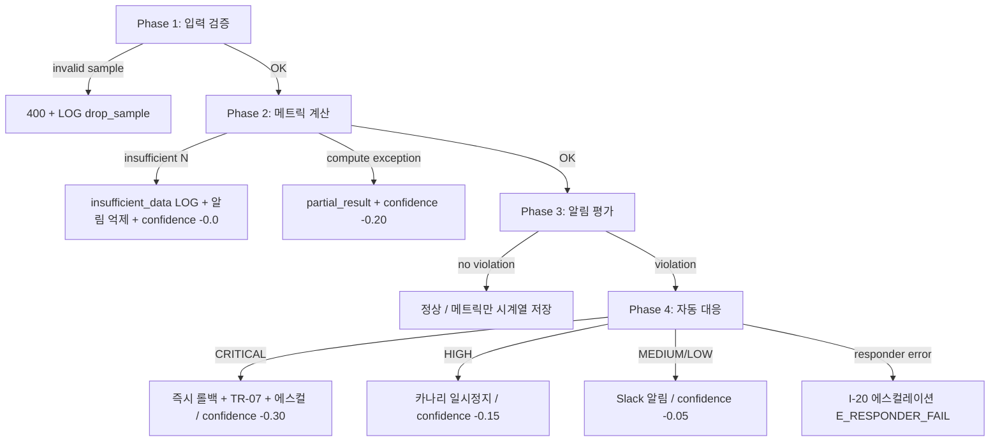
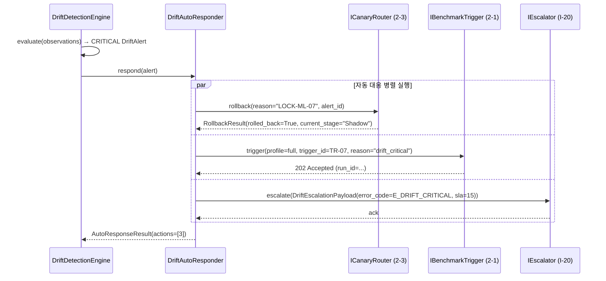
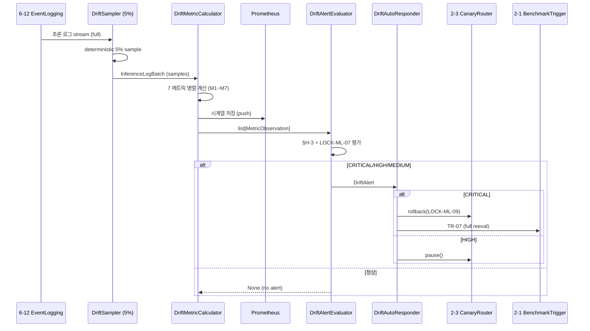

# 드리프트 감지 엔진 (Drift Detection Engine) — V2-Phase 2 정의서

> **세션**: 4-4 / Phase 2 / 2-2 "드리프트 감지 엔진 (7개 메트릭)"
> **태그**: `V2-Phase 2`
> **산출일**: 2026-04-18
> **상태**: NEW (V2 신규)
> **상위 SoT**: STEP7-F Part 9 / **S7F-074** (HIGH / V2)
> **로컬 정본**: `MLOPS_LLMOPS_상세명세.md` §C-1~§C-4 + §H-1~§H-3
> **LOCK 참조**: LOCK-ML-06 (7 메트릭), LOCK-ML-07 (QoD CRITICAL), LOCK-ML-09 (롤백)

---

## 변경 이력

| 버전 | 날짜 | 변경 사유 | 작성자 |
|------|------|----------|--------|
| v1.0 (V2-Phase 2) | 2026-04-18 | 신규 작성 — Phase 2 2-2 세션 산출 | STAGE 7 / 4-4 / 2-2 |

---

## §0 교차 참조 블록 (Cross-Reference Block)

본 문서는 다음 정본 문서/항목을 정합 기준으로 한다. 충돌 시 위계가 높은 쪽이 우선한다 (Level 2 > Level 4 > 본 문서).

| Level | 문서 / 항목 | 정합 항목 | 본 문서 참조 위치 |
|-------|-----------|---------|----------------|
| L2 (상위 SoT) | `D:\VAMOS\docs\sot\STEP7-F_인프라_배포_MLOps_작업가이드.md` L1206~L1212 — **S7F-074** (HIGH/V2) | "모델 드리프트 감지 — 성능 저하 자동 탐지", 주간 벤치마크 자동, 트렌드 모니터링, 임계값 알림 + 대체 모델 추천, 월간 경쟁모델 비교 | §1, §3, §6 |
| L4 (로컬 정본) | `MLOPS_LLMOPS_상세명세.md` §C-1 (L176~L188) | 품질 모니터링 아키텍처 (5% 샘플링 → 감지 엔진 → Prometheus → 알림 + 대응) | §2 |
| L4 (로컬 정본) | `MLOPS_LLMOPS_상세명세.md` §C-2 (L190~L200) | 7 메트릭 정의 표 (LOCK-ML-06 정본) | §3 |
| L4 (로컬 정본) | `MLOPS_LLMOPS_상세명세.md` §C-3 (L202~L209) | 4단계 알림 (CRITICAL/HIGH/MEDIUM/LOW) | §6 |
| L4 (로컬 정본) | `MLOPS_LLMOPS_상세명세.md` §C-4 (L211~L218) | 자동 대응 4종 (롤백/도구 비활성/캐시 강화/대체 모델) | §7 |
| L4 (로컬 정본) | `MLOPS_LLMOPS_상세명세.md` §H-1~H-3 (L466~L487) | 임계값 산출 근거, N≥100, 복합 알림 규칙 | §4, §5, §6 |
| L4 (로컬 정본) | `AUTHORITY_CHAIN.md` L34 — **LOCK-ML-06** | 7 메트릭 정본 (변경 시 sot 2/ 승인) | §3 |
| L4 (로컬 정본) | `AUTHORITY_CHAIN.md` L35 — **LOCK-ML-07** | QoD CRITICAL 24h 평균 < 0.60 | §6.1 |
| L4 (로컬 정본) | `AUTHORITY_CHAIN.md` L37 — **LOCK-ML-09** | 카나리 자동 롤백 조건 (QoD 차이 > 0.2 또는 에러율 > Current×2) | §7.1 |
| Cross-session | `02_model-evaluation/auto_benchmark_pipeline.md` (2-1, 1148줄) | TR-07 트리거 규약 (`POST /api/benchmark/trigger?profile=full&trigger_id=TR-07`), `EvalResults` 입력 모델 (§5.3), `update_eval_score`/`deprecate_model` 인터페이스 | §8 |
| Cross-session | (예정) `04_canary-deployment/canary_router.md` (2-3) | 롤백 신호 출력 (LOCK-ML-09 연계) | §7.1, §8 |
| _index.md | `03_drift-detection/_index.md` | S7F-074 완전매핑 + S7F-078 부분매핑 (NeMo 가드레일은 Phase 3 3-3) | §1 |

> **§4.4 상위 SoT 직접 Read 확인**: `STEP7-F_인프라_배포_MLOps_작업가이드.md` L1199~L1220 (S7F-073~S7F-076 범위) Read 완료 (2026-04-18). S7F-074 정본 4개 구현 항목 (주간 벤치마크 자동 / 트렌드 모니터링 / 임계값 알림+대체 모델 / 월간 경쟁 비교) 모두 본 문서 §3, §6, §7, §10 에 반영. 우선도/버전 (HIGH/V2) 본 문서 헤더 일치. 임계값 (예: QoD CRITICAL < 0.60) 은 상위 SoT 에 미정의 → 로컬 정본 LOCK-ML-07 사용 (위계 충돌 없음). **상위 SoT 위반 0건**.

---

## §1 Purpose / Scope

### §1.1 목적

본 문서는 **VAMOS 모델 드리프트 감지 엔진(Drift Detection Engine)** 의 V2 (Phase 2) 자동화 구현 사양을 정의한다. 핵심 책임:

1. **7개 메트릭 실시간 모니터링** (LOCK-ML-06): QoD 이동평균, 응답 길이 분포 KL, 거부율, 도구 호출 실패율, 사용자 재시도율, 임베딩 코사인 유사도, 응답 지연 p95
2. **임계값 초과 자동 감지** + 4단계 알림 발송 (CRITICAL/HIGH/MEDIUM/LOW)
3. **CRITICAL 자동 대응** (LOCK-ML-07): QoD 24h 평균 < 0.60 → 즉시 이전 프롬프트 롤백 (LOCK-ML-09 연계) + 모델 재평가 트리거 (2-1 TR-07)
4. **상위 SoT (S7F-074) 4대 요구사항** 충족: 주간 벤치마크 자동 / 트렌드 모니터링 / 임계값 알림+대체 모델 추천 / 월간 경쟁 모델 비교

### §1.2 범위

**포함**:
- 7개 드리프트 메트릭 정본 정의·계산 알고리즘·임계값
- 샘플 크기 검증 (N≥100, §H-2)
- 복합 알림 규칙 (단일/2개+/QoD) (§H-3)
- 4단계 알림 채널 + SLA (§C-3)
- 자동 대응 4종 (롤백/도구 비활성/캐시 강화/대체 모델) (§C-4)
- 2-1 (auto_benchmark) → TR-07 트리거 규약 (cross-session 출력)
- 2-3 (canary_router) → 롤백 신호 출력 인터페이스
- Phase 3 테스트 시나리오 11건 작성

**제외 (Phase 3 이월)**:
- NeMo Guardrails 통합 (S7F-078 → Phase 3 3-3, _index.md "Phase 보완 사항" 표 참조)
- 다중 데이터센터 / 글로벌 분산 모니터링
- 자동 임계값 학습 (현 단계는 정적 임계값)
- 월간 경쟁 모델 비교 자동 실행 (S7F-074 4번 — 본 문서는 트리거 인터페이스만 정의, 실제 비교는 운영 프로세스로 위임)

---

## §2 품질 모니터링 아키텍처 (§C-1 정본)

상세명세 §C-1 (L176~L188) 1:1 정합.

### §2.1 데이터 흐름 다이어그램

```mermaid
flowchart TD
    A[실시간 추론 로그<br/>(Hologram 6-11 / Brain 6-9)] -->|샘플링 5%| B[드리프트 감지 엔진]
    B --> C[7개 지표 계산<br/>(LOCK-ML-06)]
    C --> D[(시계열 DB<br/>Prometheus)]
    D --> E[알림 규칙 평가<br/>(§H-3 복합 규칙)]
    E -->|임계치 초과| F[4단계 알림 발송<br/>(LOCK-ML-07)]
    E -->|CRITICAL| G[자동 대응 실행<br/>(§C-4)]
    G -->|TR-07| H[2-1 자동 벤치마크<br/>(auto_benchmark_pipeline.md)]
    G -->|롤백 신호| I[2-3 카나리 라우터<br/>(canary_router.md, LOCK-ML-09)]
    G -->|대체 모델 전환| J[모델 카탈로그<br/>(P1-4 model_catalog_spec.md)]
```

### §2.2 데이터 입력 단계

| 단계 | 책임 | 정본 출처 |
|------|------|----------|
| 1. 추론 로그 수집 | 6-11 Hologram-Main-LLM (응답 생성) + 6-12 Event-Logging (구조화 로깅) | 4-4 외부 인터페이스 |
| 2. 샘플링 (5%) | DriftSampler (deterministic hash) — 통계적 대표성 + 비용 최소화 | §C-1 명시 |
| 3. 메트릭 계산 | DriftMetricCalculator — 7 메트릭 병렬 계산 | LOCK-ML-06 |
| 4. 시계열 저장 | Prometheus pushgateway (TSDB) | §C-1 명시 |
| 5. 규칙 평가 | DriftAlertEvaluator — §H-3 복합 규칙 적용 | LOCK-ML-07 + §H-3 |
| 6. 자동 대응 | DriftAutoResponder — §C-4 4종 액션 디스패치 | LOCK-ML-09 + 2-1 TR-07 |

---

## §3 7개 드리프트 메트릭 정본 (LOCK-ML-06)

> **AUTHORITY_CHAIN.md L34 직접 인용** (envelope §4.1 강제 Read):
> `LOCK-ML-06 | 드리프트 감지 7개 메트릭 | 상세명세 §C-2 | QoD 이동 평균, 응답 길이 분포(KL), 거부율, 도구 호출 실패율, 사용자 재시도율, 임베딩 코사인 유사도, 응답 지연(p95) | sot 2/ 승인`

상세명세 §C-2 (L190~L200) 1:1 정본 표.

### §3.1 7 메트릭 정본 표 (변경 시 [LOCK_CHANGE_NEEDED])

| # | 메트릭 (LOCK-ML-06 정본명) | 계산 방법 | 윈도우 | 임계치 | §H-1 산출 근거 |
|---|-------------------------|---------|--------|--------|--------------|
| M1 | **QoD 이동 평균** (qod_moving_avg) | 최근 1000건 이동 평균 (0.0~1.0 SOT DEC-010 스케일) | 24h | 기준선 - 0.3 | 표준편차 2σ ≈ 0.3 (정상분포 가정, 95% 신뢰구간) |
| M2 | **응답 길이 분포** (response_length_kl) | KL divergence vs 기준 분포 (히스토그램 50 bin) | 7일 | KL > 0.1 | 정보이론 관례 ("감지 가능한 분포 변화") |
| M3 | **거부율** (refusal_rate) | safety guard 거부 비율 (count(refused) / count(total)) | 24h | > 5% (기준 1%) | 정상 ~1%, 5배 이상 = 이상 징후 |
| M4 | **도구 호출 실패율** (tool_failure_rate) | 실패 / 전체 도구 호출 | 6h | > 10% | UX 직접 영향 시작점 |
| M5 | **사용자 재시도율** (user_retry_rate) | 동일 메시지 재전송 비율 (60s 이내) | 24h | > 15% | 사용자 불만족 전환점 (내부 파일럿) |
| M6 | **임베딩 코사인 유사도** (embedding_cosine_sim) | 응답 임베딩 vs 기준 클러스터 중심 (cos sim) | 7일 | < 0.85 | 의미공간 15%+ 이탈 |
| M7 | **응답 지연 p95** (response_latency_p95) | 추론 응답 시간 p95 백분위수 (ms) | 6h | > 5000 | 5s 초과 시 사용자 체감 지연 (§C-4 공식화) |

### §3.2 공통 자료 구조 (Pydantic v2)

여러 메트릭이 공유하는 자료 구조를 먼저 선정의한다 (산출물 품질 필수 §7).

```python
from datetime import datetime, timedelta
from typing import Literal, Optional
from pydantic import BaseModel, ConfigDict, Field
from enum import Enum


class MetricId(str, Enum):
    """LOCK-ML-06 정본 7 메트릭 ID. 변경 시 LOCK 갱신 필수."""
    QOD_MOVING_AVG = "qod_moving_avg"            # M1
    RESPONSE_LENGTH_KL = "response_length_kl"    # M2
    REFUSAL_RATE = "refusal_rate"                # M3
    TOOL_FAILURE_RATE = "tool_failure_rate"      # M4
    USER_RETRY_RATE = "user_retry_rate"          # M5
    EMBEDDING_COSINE_SIM = "embedding_cosine_sim"# M6
    RESPONSE_LATENCY_P95 = "response_latency_p95"# M7


class Severity(str, Enum):
    """4단계 알림 (§C-3 정본)."""
    CRITICAL = "CRITICAL"   # QoD<0.60 24h 평균 (LOCK-ML-07)
    HIGH = "HIGH"           # 2개+ 메트릭 동시 위반 (§H-3)
    MEDIUM = "MEDIUM"       # 단일 메트릭 위반 (§H-3 WARN)
    LOW = "LOW"             # 7일 하락 추세


class MetricThreshold(BaseModel):
    """단일 메트릭 임계 정의 (LOCK-ML-06 정본 표 §3.1 1:1 매핑)."""
    metric_id: MetricId
    op: Literal[">", ">=", "<", "<=", "!="]
    threshold: float
    window: timedelta
    baseline_required: bool = Field(default=False,
        description="True 이면 baseline 대비 (예: M1 base-0.3)")
    min_sample_size: int = Field(default=100, ge=1,
        description="§H-2 최소 N=100 (이하 시 'insufficient_data')")

    model_config = ConfigDict(frozen=True)


class MetricObservation(BaseModel):
    """단일 메트릭 단일 윈도우 관측값."""
    metric_id: MetricId
    window_start: datetime
    window_end: datetime
    sample_count: int = Field(..., ge=0)
    value: float
    baseline_value: Optional[float] = None
    correlation_id: str = Field(..., description="trace_id, R-01-7 연계")

    model_config = ConfigDict(frozen=True)


class DriftViolation(BaseModel):
    """단일 메트릭 임계 위반 기록."""
    metric_id: MetricId
    observed: MetricObservation
    threshold: MetricThreshold
    margin: float = Field(...,
        description="실제값 - 임계값 (양수면 초과)")
    detected_at: datetime

    model_config = ConfigDict(frozen=True)


class DriftAlert(BaseModel):
    """평가된 알림 (§H-3 복합 규칙 적용 후)."""
    alert_id: str = Field(..., description="UUIDv4")
    severity: Severity
    violations: list[DriftViolation] = Field(..., min_length=1)
    triggered_at: datetime
    correlation_id: str
    message: str
    auto_response_required: bool

    model_config = ConfigDict(frozen=True)
```

### §3.3 정본 7 메트릭 인스턴스 (변경 시 [LOCK_CHANGE_NEEDED])

```python
# LOCK-ML-06 정본 7 임계 (§3.1 표 1:1 매핑)
LOCK_ML_06_THRESHOLDS: list[MetricThreshold] = [
    MetricThreshold(metric_id=MetricId.QOD_MOVING_AVG,
                    op="<", threshold=0.30,  # baseline - 0.3 (baseline_required=True)
                    window=timedelta(hours=24), baseline_required=True),
    MetricThreshold(metric_id=MetricId.RESPONSE_LENGTH_KL,
                    op=">", threshold=0.10,
                    window=timedelta(days=7)),
    MetricThreshold(metric_id=MetricId.REFUSAL_RATE,
                    op=">", threshold=0.05,
                    window=timedelta(hours=24)),
    MetricThreshold(metric_id=MetricId.TOOL_FAILURE_RATE,
                    op=">", threshold=0.10,
                    window=timedelta(hours=6)),
    MetricThreshold(metric_id=MetricId.USER_RETRY_RATE,
                    op=">", threshold=0.15,
                    window=timedelta(hours=24)),
    MetricThreshold(metric_id=MetricId.EMBEDDING_COSINE_SIM,
                    op="<", threshold=0.85,
                    window=timedelta(days=7)),
    MetricThreshold(metric_id=MetricId.RESPONSE_LATENCY_P95,
                    op=">", threshold=5000.0,  # ms
                    window=timedelta(hours=6)),
]

assert len(LOCK_ML_06_THRESHOLDS) == 7, "LOCK-ML-06 = 정확히 7 메트릭. 변경 시 LOCK 갱신 필수."
```

---

## §4 메트릭 계산 알고리즘

### §4.1 DriftMetricCalculator (메인 알고리즘)

> **시간복잡도**: O(M × W) — M=7 메트릭, W=윈도우 내 샘플 수 (≤ 5% 샘플링 후). 실측 24h × 5% × 100 RPS ≈ 432K 샘플 → M7 만 p95 정렬에 O(W log W).
>
> **ABC 매핑**: `IDriftMetricCalculator.compute(window_start, window_end) -> list[MetricObservation]` (§13)

```python
class DriftMetricCalculator:
    """7 메트릭 병렬 계산 엔진.

    LOCK-ML-06 정본 (§3.1) + §H-2 샘플 크기 검증.

    시간복잡도:
      - M1 (이동평균): O(W) — 최근 1000건 슬라이딩
      - M2 (KL divergence): O(W + B) — B=50 bin
      - M3, M4, M5: O(W) — count 기반
      - M6 (코사인 유사도): O(W × D) — D=embedding dim (예: 384)
      - M7 (p95): O(W log W) — 정렬 기반 (또는 t-digest O(W))
    """

    def __init__(self, thresholds: list[MetricThreshold] = LOCK_ML_06_THRESHOLDS,
                 baseline_provider: "IBaselineProvider" = None):
        if len(thresholds) != 7:
            raise ValueError("LOCK-ML-06 = 정확히 7 메트릭. 변경 시 LOCK 갱신 필요.")
        self.thresholds = thresholds
        self.baseline = baseline_provider

    def compute(self, window_start: datetime, window_end: datetime,
                samples: "InferenceLogBatch") -> list[MetricObservation]:
        """7 메트릭 병렬 계산.

        Args:
            window_start, window_end: 평가 윈도우
            samples: 5% 샘플링된 추론 로그 배치

        Returns:
            list[MetricObservation] (정확히 7 항목, M1~M7 순서 보장)
        """
        observations = []
        for th in self.thresholds:
            obs = self._compute_one(th, window_start, window_end, samples)
            observations.append(obs)
        return observations

    def _compute_one(self, th: MetricThreshold, ws: datetime, we: datetime,
                     samples: "InferenceLogBatch") -> MetricObservation:
        # 1. 윈도우 슬라이스
        windowed = samples.slice(ws, we, th.window)
        n = len(windowed)
        # 2. 샘플 크기 검증 (§H-2)
        if n < th.min_sample_size:
            return MetricObservation(
                metric_id=th.metric_id, window_start=ws, window_end=we,
                sample_count=n, value=float("nan"),  # NaN = insufficient_data
                correlation_id=samples.correlation_id,
            )
        # 3. 메트릭별 계산 디스패치
        value = METRIC_COMPUTERS[th.metric_id](windowed)
        baseline_value = self.baseline.get(th.metric_id) if th.baseline_required else None
        return MetricObservation(
            metric_id=th.metric_id, window_start=ws, window_end=we,
            sample_count=n, value=value, baseline_value=baseline_value,
            correlation_id=samples.correlation_id,
        )


# 메트릭별 계산 함수 디스패치 테이블
METRIC_COMPUTERS = {
    MetricId.QOD_MOVING_AVG:       compute_qod_moving_avg,        # O(W)
    MetricId.RESPONSE_LENGTH_KL:   compute_response_length_kl,    # O(W + B)
    MetricId.REFUSAL_RATE:         compute_refusal_rate,          # O(W)
    MetricId.TOOL_FAILURE_RATE:    compute_tool_failure_rate,     # O(W)
    MetricId.USER_RETRY_RATE:      compute_user_retry_rate,       # O(W)
    MetricId.EMBEDDING_COSINE_SIM: compute_embedding_cosine_sim,  # O(W × D)
    MetricId.RESPONSE_LATENCY_P95: compute_response_latency_p95,  # O(W log W)
}
```

### §4.2 메트릭별 핵심 의사코드

```python
def compute_qod_moving_avg(samples) -> float:
    """M1 — 최근 1000건 이동 평균 (0.0~1.0 SOT DEC-010 스케일)."""
    last_1000 = samples.qod_scores[-1000:]
    return float(np.mean(last_1000))

def compute_response_length_kl(samples) -> float:
    """M2 — KL(P_observed || P_baseline) over 50 bin 히스토그램."""
    P = histogram(samples.response_lengths, bins=50, range=(0, 4096), density=True)
    Q = baseline.response_length_distribution(bins=50)
    return float(scipy.stats.entropy(P + 1e-9, Q + 1e-9))  # smoothing

def compute_refusal_rate(samples) -> float:
    """M3 — count(refused) / count(total)."""
    return sum(1 for s in samples if s.refused) / max(len(samples), 1)

def compute_tool_failure_rate(samples) -> float:
    """M4 — 실패 도구 호출 / 전체 도구 호출."""
    tool_calls = [c for s in samples for c in s.tool_calls]
    if not tool_calls:
        return 0.0
    return sum(1 for c in tool_calls if not c.success) / len(tool_calls)

def compute_user_retry_rate(samples) -> float:
    """M5 — 동일 메시지 60s 내 재전송 비율."""
    grouped = group_by_user_60s(samples)
    return sum(1 for g in grouped if g.is_retry) / max(len(grouped), 1)

def compute_embedding_cosine_sim(samples) -> float:
    """M6 — 응답 임베딩 vs 골든셋 클러스터 중심 cos sim."""
    embeddings = embed_batch([s.response_text for s in samples])
    centroid = baseline.golden_centroid()
    sims = [cosine(e, centroid) for e in embeddings]
    return float(np.mean(sims))

def compute_response_latency_p95(samples) -> float:
    """M7 — 응답 지연 p95 (ms)."""
    return float(np.percentile([s.latency_ms for s in samples], 95))
```

### §4.3 ABC 패턴 매핑

| 인터페이스 | 메서드 | 정본 | 본 문서 §|
|----------|--------|------|--------|
| `IDriftMetricCalculator` | `compute(window_start, window_end, samples) -> list[MetricObservation]` | 본 문서 §4.1 | §13.1 |
| `IBaselineProvider` | `get(metric_id) -> float`, `golden_centroid() -> np.ndarray`, `response_length_distribution(bins) -> np.ndarray` | 본 문서 §4.2 | §13.1 |
| `IDriftAlertEvaluator` | `evaluate(observations) -> Optional[DriftAlert]` | 본 문서 §5 | §13.1 |
| `IDriftAutoResponder` | `respond(alert) -> AutoResponseResult` | 본 문서 §7 | §13.1 |

---

## §5 임계값 산출 근거 (§H-1) + 샘플 크기 (§H-2)

상세명세 §H-1 (L468~L477) + §H-2 (L479~L482) 1:1 정본.

### §5.1 §H-1 임계값 산출 정본 표 (재인용)

| 메트릭 | 임계값 | 베이스라인 | 산출 근거 |
|--------|--------|----------|----------|
| QoD 이동평균 (M1) | base − 0.3 | 롤링 30일 평균 | 표준편차 2σ ≈ 0.3 (정상분포, 95% 신뢰) |
| 응답 길이 KL (M2) | > 0.1 | 프로덕션 7일 분포 | 정보이론 관례 ("감지 가능한 분포 변화") |
| 거부율 (M3) | > 5% | 롤링 7일 평균 × 5 | 정상 ~1%, 5배 이상 = 이상 징후 |
| 도구 실패율 (M4) | > 10% | 롤링 7일 평균 | UX 직접 영향 시작점 |
| 재시도율 (M5) | > 15% | 롤링 7일 평균 | 사용자 불만족 전환점 (내부 파일럿) |
| 코사인 유사도 (M6) | < 0.85 | 골든셋 평균 | 의미 공간 15%+ 이탈 |
| 응답 지연 (M7) | > 5s | 롤링 7일 p95 | 사용자 체감 지연 (§C-4 공식화) |

### §5.2 §H-2 샘플 크기 요건

- **최소 N**: 메트릭당 **100 관측치 / 윈도우** (이하 → 알림 억제, NaN 반환 + LOG severity=info reason="insufficient_data")
- **신뢰 수준**: 95% (z=1.96)
- **윈도우 종류**:
  - QoD 이동평균: 24h
  - 응답 길이 KL: 7d
  - 나머지: 메트릭별 (24h / 6h / 7d) — §3.1 표 정합

### §5.3 N 미달 시 동작 (insufficient_data)

```python
def _compute_one(self, th, ws, we, samples):
    n = len(samples.slice(ws, we, th.window))
    if n < th.min_sample_size:
        # §H-2: 알림 억제 + insufficient_data 로그
        self.logger.info({
            "event": "insufficient_data",
            "metric_id": th.metric_id,
            "actual_n": n,
            "required_n": th.min_sample_size,
            "window": str(th.window),
        })
        return MetricObservation(... value=float("nan") ...)
```

---

## §6 알림 트리거 + 복합 규칙 (§C-3 + §H-3)

### §6.1 4단계 알림 트리거 (§C-3 정본)

상세명세 §C-3 (L202~L209) 1:1 정합.

| 심각도 | 조건 | 알림 채널 | 응답 SLA | LOCK |
|--------|------|----------|---------|------|
| **CRITICAL** | M1 (QoD) 24h 평균 < **0.60** | PagerDuty + Slack #mlops-alerts | **15분** | **LOCK-ML-07** |
| **HIGH** | 드리프트 지표 **2개 이상** 동시 초과 | Slack #mlops-alerts + Email | 1시간 | §H-3 |
| **MEDIUM** | **단일** 드리프트 지표 초과 (CRITICAL 아닌 경우) | Slack #mlops-alerts | 4시간 | §H-3 |
| **LOW** | 7일 하락 추세 (선형 회귀 slope < 0, p<0.05) | 주간 리포트 | 다음 리뷰 | §C-3 |

> **AUTHORITY_CHAIN.md L35 직접 인용** (envelope §4.1 강제 Read):
> `LOCK-ML-07 | QoD CRITICAL 임계값 | 상세명세 §C-3 | 24h 평균 < 0.60 → CRITICAL (SOT DEC-010 0.0~1.0 스케일) | sot 2/ 승인`

### §6.2 §H-3 복합 알림 규칙 (정본)

상세명세 §H-3 (L484~L487) 1:1 정합. **이 규칙이 §6.1 4단계 분류의 결정 로직이다.**

| 조건 | 등급 | 액션 |
|------|------|------|
| 단일 메트릭 위반 | **WARN (= MEDIUM)** | 대시보드 표시 + Slack #mlops-alerts |
| 2개+ 메트릭 동시 위반 | **CRITICAL (= HIGH)** | on-call 알림 + 자동 카나리 일시정지 (2-3 연계) |
| **QoD CRITICAL** (M1 24h 평균 < 0.60, LOCK-ML-07) | **EMERGENCY (= CRITICAL)** | 즉시 이전 프롬프트 롤백 + 긴급 대응팀 소집 |

> **용어 정합**: §C-3 의 4단계 (CRITICAL/HIGH/MEDIUM/LOW) 와 §H-3 의 3단계 (EMERGENCY/CRITICAL/WARN) 매핑 — EMERGENCY=CRITICAL, CRITICAL(§H-3)=HIGH(§C-3), WARN=MEDIUM. LOW (추세) 는 §H-3 외 규칙으로 별도 처리. 본 문서 §6.3 평가 알고리즘은 §C-3 4단계로 출력.

### §6.3 DriftAlertEvaluator 알고리즘 (시간복잡도 O(M))

```python
class DriftAlertEvaluator:
    """관측 → DriftAlert 평가.

    §C-3 4단계 + §H-3 복합 규칙 통합 적용.
    LOCK-ML-07 우선 적용 (QoD<0.60 → CRITICAL 무조건).

    시간복잡도: O(M) where M=7 메트릭.
    """

    def __init__(self, thresholds: list[MetricThreshold] = LOCK_ML_06_THRESHOLDS):
        self.threshold_map = {t.metric_id: t for t in thresholds}

    def evaluate(self, observations: list[MetricObservation]) -> Optional[DriftAlert]:
        # 1. 위반 메트릭 추출 (NaN/insufficient 제외)
        violations = []
        for obs in observations:
            if math.isnan(obs.value):
                continue
            th = self.threshold_map[obs.metric_id]
            actual = obs.value
            if th.baseline_required and obs.baseline_value is None:
                continue  # baseline 미수집 (provider 불가) → 본 메트릭 평가 스킵 (TypeError 방지)
            target = (obs.baseline_value - th.threshold) if th.baseline_required else th.threshold
            if self._violates(actual, th.op, target):
                violations.append(DriftViolation(
                    metric_id=obs.metric_id, observed=obs, threshold=th,
                    margin=actual - target, detected_at=datetime.utcnow(),
                ))

        # 2. §H-3 EMERGENCY (LOCK-ML-07): QoD < 0.60 24h 평균 — 위반 목록과 무관하게 우선 평가
        qod_obs = next((o for o in observations
                        if o.metric_id == MetricId.QOD_MOVING_AVG), None)
        if qod_obs and not math.isnan(qod_obs.value) and qod_obs.value < 0.60:
            return DriftAlert(
                alert_id=str(uuid4()),
                severity=Severity.CRITICAL,
                violations=violations,
                triggered_at=datetime.utcnow(),
                correlation_id=observations[0].correlation_id,
                message=f"LOCK-ML-07 EMERGENCY: QoD 24h avg={qod_obs.value:.3f} < 0.60",
                auto_response_required=True,
            )

        if not violations:
            return None  # 정상

        # 3. §H-3 HIGH: 2개+ 메트릭 동시 위반
        if len(violations) >= 2:
            return DriftAlert(
                alert_id=str(uuid4()),
                severity=Severity.HIGH,
                violations=violations,
                triggered_at=datetime.utcnow(),
                correlation_id=observations[0].correlation_id,
                message=f"§H-3 HIGH: {len(violations)} metrics violated",
                auto_response_required=True,  # 카나리 일시정지
            )

        # 4. §H-3 MEDIUM: 단일 메트릭 위반
        return DriftAlert(
            alert_id=str(uuid4()),
            severity=Severity.MEDIUM,
            violations=violations,
            triggered_at=datetime.utcnow(),
            correlation_id=observations[0].correlation_id,
            message=f"§H-3 MEDIUM: single metric={violations[0].metric_id} violated",
            auto_response_required=False,
        )

    @staticmethod
    def _violates(actual: float, op: str, target: float) -> bool:
        return {
            ">":  actual >  target,
            ">=": actual >= target,
            "<":  actual <  target,
            "<=": actual <= target,
            "!=": actual != target,
        }[op]
```

---

## §7 자동 대응 로직 (§C-4 + LOCK-ML-09)

상세명세 §C-4 (L211~L218) 1:1 정합 + LOCK-ML-09 카나리 자동 롤백 연계.

### §7.1 §C-4 자동 대응 정본 표 (4종)

| 트리거 | 자동 대응 | 조건 | 본 문서 위임 |
|--------|----------|------|------------|
| **QoD CRITICAL** (M1 24h<0.60, LOCK-ML-07) | 이전 프롬프트 버전 롤백 + TR-07 재평가 | `auto_rollback=true` 설정 시 | §7.2 → 2-3 (LOCK-ML-09) + 2-1 TR-07 |
| **도구 실패율 급등** (M4 > 30%) | 해당 도구 비활성화 + fallback 활성 | 실패율 > **30%** (§C-4 정본 — §3.1 임계 10%와 별개의 자동대응 트리거) | §7.3 |
| **응답 지연 급등** (M7 > 5s) | 캐시 강화 + 배치 크기 축소 | p95 > **5s** (LOCK-ML-06 M7 임계와 동일) | §7.4 |
| **API 제공자 장애** | 대체 모델 전환 (예: Claude → GPT) | 연속 **5회 5xx** | §7.5 — S7F-074 4번 "대체 모델 추천" |

> **AUTHORITY_CHAIN.md L37 직접 인용** (envelope §4.1 강제 Read):
> `LOCK-ML-09 | 카나리 자동 롤백 조건 | 상세명세 §D-3 | QoD 차이 > 0.2 또는 에러율 > Current×2 | sot 2/ 승인`

### §7.2 자동 대응 1 — 프롬프트 롤백 + 재평가 (LOCK-ML-07 → LOCK-ML-09)

```python
class DriftAutoResponder:
    """드리프트 알림 → 자동 대응 디스패처.

    §C-4 4종 트리거 + LOCK-ML-09 (롤백 조건) + 2-1 TR-07 (재평가) 통합.
    """

    def __init__(self, canary_router: "ICanaryRouter",          # 2-3 인터페이스
                 benchmark_trigger: "IBenchmarkTrigger",        # 2-1 TR-07
                 catalog: "ICatalogLoader",                     # P1-4
                 escalator: "IEscalator"):                      # I-20
        self.canary = canary_router
        self.benchmark = benchmark_trigger
        self.catalog = catalog
        self.escalator = escalator

    def respond(self, alert: DriftAlert) -> "AutoResponseResult":
        actions: list[str] = []

        # CRITICAL (LOCK-ML-07): QoD<0.60 → 즉시 롤백 + 재평가
        if alert.severity == Severity.CRITICAL:
            # (a) 카나리 롤백 신호 출력 (2-3 인터페이스, LOCK-ML-09)
            self.canary.rollback(reason="LOCK-ML-07 EMERGENCY",
                                 alert_id=alert.alert_id,
                                 trigger_metric=MetricId.QOD_MOVING_AVG)
            actions.append("canary.rollback (LOCK-ML-09)")

            # (b) 2-1 TR-07 재평가 트리거
            self.benchmark.trigger(profile="full", trigger_id="TR-07",
                                   reason="drift_critical",
                                   alert_id=alert.alert_id)
            actions.append("benchmark.trigger TR-07 (2-1)")

            # (c) I-20 에스컬레이션
            self.escalator.escalate(self._build_payload(alert, "E_DRIFT_CRITICAL"))
            actions.append("escalator.escalate E_DRIFT_CRITICAL")

        # HIGH: 2개+ 위반 → 카나리 일시정지
        elif alert.severity == Severity.HIGH:
            self.canary.pause(reason="§H-3 HIGH 2+ metrics", alert_id=alert.alert_id)
            actions.append("canary.pause")

        # 메트릭별 추가 대응 (severity 무관)
        for v in alert.violations:
            if v.metric_id == MetricId.TOOL_FAILURE_RATE and v.observed.value > 0.30:
                self._disable_tool_with_fallback(v); actions.append("tool.disable")
            if v.metric_id == MetricId.RESPONSE_LATENCY_P95 and v.observed.value > 5000:
                self._enforce_cache(); actions.append("cache.enforce")

        return AutoResponseResult(alert_id=alert.alert_id, actions=actions,
                                  responded_at=datetime.utcnow())
```

### §7.3 자동 대응 2 — 도구 비활성 + fallback (M4 > 30%)

```python
def _disable_tool_with_fallback(self, violation: DriftViolation):
    """도구 실패율 30% 초과 시 비활성 + fallback.

    M4 임계 (LOCK-ML-06) = 10% (알림용)
    §C-4 자동 대응 트리거 = 30% (별개 임계, 자동 비활성)
    """
    failed_tools = self._extract_failed_tool_names(violation)
    for tool_name in failed_tools:
        # ToolRegistry (외부 인터페이스, 본 문서 범위 외) 호출
        tool_registry.disable(tool_name, reason=f"drift_failure_rate>{0.30}")
        tool_registry.activate_fallback(tool_name)
```

### §7.4 자동 대응 3 — 캐시 강화 + 배치 축소 (M7 > 5s)

```python
def _enforce_cache(self):
    """응답 지연 p95 > 5s 시 캐시 강화 + 배치 크기 축소.

    실제 캐시/배치 컨트롤은 외부 인터페이스 (4-1 Rust-Tauri / 6-11 Hologram).
    본 함수는 신호 발송만 담당.
    """
    cache_controller.enforce_strict_mode(ttl_extend_factor=2.0)
    inference_batcher.shrink_batch_size(factor=0.5)
```

### §7.5 자동 대응 4 — 대체 모델 전환 (5xx 5회 연속)

```python
def _switch_alternative_model(self, current_model_id: str):
    """API 제공자 장애 (연속 5회 5xx) → 대체 모델 전환.

    S7F-074 4번 "임계값 하락 시 알림 + 대체 모델 추천" 충족.
    P1-4 ICatalogLoader.list_models() 호출 → eval_score 차순 next 모델 선택.
    """
    candidates = self.catalog.list_models(filter_available=True)
    candidates = [m for m in candidates if m.id != current_model_id]
    candidates.sort(key=lambda m: m.eval_score, reverse=True)
    if not candidates:
        self.escalator.escalate({"error_code": "E_NO_FALLBACK_MODEL",
                                 "current_model": current_model_id})
        return
    next_model = candidates[0]
    catalog.set_active_model(next_model.id, reason="provider_5xx_streak")
```

### §7.6 Phase 별 복구 전략 (Phase 1→2→3→4 흐름도)



### §7.7 Confidence Penalty 표

| Phase | 사유 | confidence penalty |
|-------|------|-------------------|
| 1 | invalid sample | n/a (drop) |
| 2 | insufficient_data | 0.00 (정상 운영) |
| 2 | compute exception | -0.20 (부분 결과만 사용) |
| 3 | evaluator exception | -0.25 (위반 평가 신뢰도 저하) |
| 4 | auto-responder partial fail | -0.15 (다른 대응은 완료) |
| 4 | auto-responder full fail | -0.30 (수동 개입 요구) |

---

## §8 세션 간 인터페이스 Cross-Check (Cross-Session Interface)

### §8.1 입력 — 2-1 (auto_benchmark_pipeline.md) 인터페이스 정합

본 문서는 2-1 산출물 (`02_model-evaluation/auto_benchmark_pipeline.md`, 1148줄) 을 **사전 Read 완료** (envelope 요구). 본 세션이 출력하는 TR-07 호출 규약과 입력 메트릭 모델이 1:1 정합함을 확인한다.

| 본 문서 출력 / 호출 | 2-1 대응 인터페이스 | 정본 위치 (2-1) | 정합 상태 |
|-------------------|------------------|---------------|---------|
| `IBenchmarkTrigger.trigger(profile="full", trigger_id="TR-07", reason="drift_critical", alert_id=...)` | `POST /api/benchmark/trigger?profile=full&trigger_id=TR-07&reason=drift_critical` | 2-1 §2.1 TR-07 (L106), §15.2 cross-session 표 (L977) | **PASS** |
| `IBenchmarkTrigger` 응답: `{run_id, status, eval_score_estimated_at}` | 2-1 §7.1 step 11 + §9.3 옵션 B (L706) | 2-1 §7.1 (L539, L547) | **PASS** |
| 후속 `update_eval_score` (2-1 → P1-4) — 본 문서는 호출만 트리거, 실제 실행은 2-1 책임 | 2-1 §9.1 인터페이스 매핑 (L920) | P1-4 `CatalogUpdater.update_eval_score(model_id, new_score, evaluated_at)` | **PASS** (간접) |
| 후속 `deprecate_model(model_id, reason="QoD<0.60 LOCK-ML-07")` (2-1 → P1-4) | 2-1 §9.3 옵션 B (L706, L1071 TS-10) | P1-4 정본 | **PASS** (간접) |
| `MetricId.QOD_MOVING_AVG` (M1) ↔ 2-1 `EvalResults.qod_score` | 입력으로 사용 가능 (벤치마크 결과를 baseline 으로 활용) | 2-1 §5.3 EvalResults (L295~L323) `qod_score: float (≥0.0, ≤1.0)` | **PASS** — 동일 0.0~1.0 SOT DEC-010 스케일 |
| `correlation_id` 필드 | trace_id 연계 (R-01-7) | 2-1 §5.3 EvalResults.correlation_id | **PASS** |

> **인터페이스 mismatch 0건**. 만약 mismatch 발견 시 `[INTERFACE_MISMATCH:<설명>]` 마커 출력 예정이었으나 해당 없음.

### §8.2 출력 — 2-3 (canary_router.md, 미작성) 인터페이스 규약 정의 (PRODUCER 역할)

본 세션은 2-3 (예정) 산출물에 대해 **PRODUCER role** 로 다음 인터페이스를 출력한다. 2-3 작성 시 본 규약을 CONSUMER 로 Read 해야 한다.

```python
class ICanaryRouter(ABC):
    """2-2 → 2-3 인터페이스 규약.

    드리프트 감지 → 카나리 라우터 신호 출력 인터페이스.
    LOCK-ML-09 (롤백 조건: QoD 차이 > 0.2 또는 에러율 > Current×2) 연계.
    2-3 작성자는 본 ABC 를 구현해야 한다.
    """

    @abstractmethod
    def rollback(self, *, reason: str, alert_id: str,
                 trigger_metric: MetricId) -> "RollbackResult":
        """LOCK-ML-07 EMERGENCY → 즉시 Stage 0 (Shadow) 복귀.

        LOCK-ML-09 정본 (AUTHORITY_CHAIN.md L37):
          QoD 차이 > 0.2 OR 에러율 > Current × 2

        Args:
            reason: "LOCK-ML-07 EMERGENCY" 또는 §C-4 자동 대응 사유
            alert_id: DriftAlert.alert_id (역추적용)
            trigger_metric: 발화 메트릭 (보통 QOD_MOVING_AVG)

        Returns:
            RollbackResult(rolled_back: bool, previous_stage: str,
                           current_stage: "Shadow", rollback_at: datetime)
        """

    @abstractmethod
    def pause(self, *, reason: str, alert_id: str) -> "PauseResult":
        """§H-3 HIGH (2개+ 메트릭 위반) → 현재 Stage 동결 + 추가 데이터 수집.

        §G-2 단계 일시정지 규칙 정합.
        """
```

### §8.3 입력 — 6-11 / 6-12 외부 추론 로그 (도메인 외부 인터페이스, READ-ONLY)

| 외부 도메인 | 본 문서 사용 데이터 | 정합 방법 |
|-----------|------------------|---------|
| 6-11 Hologram-Main-LLM | 응답 텍스트, latency_ms, refused 플래그, tool_calls 결과 | DriftSampler 가 5% 샘플링하여 InferenceLogBatch 로 정규화 |
| 6-12 Event-Logging | 구조화 로그 stream (correlation_id 보존) | 본 문서 §9 R-01-7 포맷 따라 trace_id 1:1 |

> **본 도메인은 외부 도메인을 read-only 로만 참조한다.** Cross-domain mutation 없음 (envelope `CROSS_DOMAIN_DEPS=none` 정합).

---

## §9 로깅 포맷 (R-01-7 중첩 JSON)

산출물 품질 필수 §4 강제: `error{}`, `context{}`, `recovery{}` 3 블록 + `trace_id`.

### §9.1 정상 평가 로그 (severity=info)

```json
{
  "timestamp": "2026-04-18T08:00:00.000Z",
  "trace_id": "drift-eval-7c4a9b2e-...",
  "correlation_id": "trace-abc123",
  "event": "drift_evaluation_completed",
  "severity": "info",
  "context": {
    "session": "4-4/2-2",
    "engine": "DriftDetectionEngine",
    "window_start": "2026-04-17T08:00:00Z",
    "window_end": "2026-04-18T08:00:00Z",
    "observations": [
      {"metric_id": "qod_moving_avg", "value": 0.873, "sample_count": 1000},
      {"metric_id": "response_length_kl", "value": 0.04, "sample_count": 4321}
    ]
  },
  "error": null,
  "recovery": null
}
```

### §9.2 알림 발화 로그 (severity=warn|critical)

```json
{
  "timestamp": "2026-04-18T08:01:23.456Z",
  "trace_id": "drift-alert-9d3f1c8a-...",
  "correlation_id": "trace-abc123",
  "event": "drift_alert_triggered",
  "severity": "critical",
  "context": {
    "session": "4-4/2-2",
    "alert_id": "alert-uuid-xyz",
    "lock_reference": "LOCK-ML-07",
    "violations_count": 1,
    "violations": [
      {"metric_id": "qod_moving_avg", "actual": 0.582, "threshold": 0.60,
       "margin": -0.018, "window": "24h"}
    ]
  },
  "error": null,
  "recovery": {
    "auto_response_required": true,
    "actions_planned": ["canary.rollback", "benchmark.trigger TR-07",
                        "escalator.escalate E_DRIFT_CRITICAL"]
  }
}
```

### §9.3 컴퓨트 예외 로그 (severity=error)

```json
{
  "timestamp": "2026-04-18T08:02:00.000Z",
  "trace_id": "drift-eval-error-7c4a9b2e-...",
  "correlation_id": "trace-abc123",
  "event": "metric_compute_failed",
  "severity": "error",
  "context": {
    "session": "4-4/2-2",
    "metric_id": "embedding_cosine_sim",
    "phase": 2,
    "input_sample_count": 4500
  },
  "error": {
    "code": "E_EMBEDDING_PROVIDER_TIMEOUT",
    "message": "embed_batch timeout after 30s",
    "stack_trace_ref": "stacktraces/2026-04-18-7c4a9b2e.txt"
  },
  "recovery": {
    "strategy": "partial_result + confidence -0.20",
    "fallback": "M6 omitted from this window, other 6 metrics evaluated normally",
    "retry_count": 2,
    "next_retry_at": "2026-04-18T08:02:30.000Z"
  }
}
```

---

## §10 에스컬레이션 페이로드 구조 (I-20 경유)

산출물 품질 필수 §3 강제.

### §10.1 에스컬레이션 트리거 6조건

| ID | 트리거 | severity | 채널 |
|----|--------|---------|------|
| E_DRIFT_CRITICAL | LOCK-ML-07 EMERGENCY (M1<0.60) | CRITICAL | PagerDuty + Slack #mlops-oncall |
| E_DRIFT_HIGH | §H-3 HIGH (2개+ 위반) | HIGH | Slack + Email |
| E_RESPONDER_FAIL | DriftAutoResponder 부분/전체 실패 | HIGH | Slack |
| E_NO_FALLBACK_MODEL | 대체 모델 후보 0개 | CRITICAL | PagerDuty |
| E_BASELINE_PROVIDER_DOWN | IBaselineProvider 응답 불가 (≥3회 연속) | MEDIUM | Slack |
| E_PROMETHEUS_WRITE_FAIL | 시계열 DB 쓰기 실패 (≥5회 연속) | MEDIUM | Slack |

### §10.2 페이로드 구조 (Pydantic v2)

```python
class DriftEscalationPayload(BaseModel):
    """I-20 외부 에스컬레이션 인터페이스 페이로드.

    필수 필드: source_engine, error_code, original_request, partial_result,
              retry_count, timestamp.
    """
    source_engine: Literal["DriftDetectionEngine"] = "DriftDetectionEngine"
    session: Literal["4-4/2-2"] = "4-4/2-2"

    error_code: Literal[
        "E_DRIFT_CRITICAL", "E_DRIFT_HIGH",
        "E_RESPONDER_FAIL", "E_NO_FALLBACK_MODEL",
        "E_BASELINE_PROVIDER_DOWN", "E_PROMETHEUS_WRITE_FAIL",
    ]

    original_request: dict = Field(...,
        description="알림 평가 시 사용된 윈도우, 샘플 카운트, 메트릭 입력")

    partial_result: Optional[DriftAlert] = Field(default=None,
        description="평가가 일부라도 완료된 경우 DriftAlert 포함")

    retry_count: int = Field(default=0, ge=0)
    timestamp: datetime
    trace_id: str
    correlation_id: str

    # 추가 컨텍스트
    lock_reference: Optional[str] = Field(default=None,
        description="LOCK-ML-07 등 위반 LOCK ID")
    sla_minutes: int = Field(...,
        description="대응 SLA: CRITICAL=15, HIGH=60, MEDIUM=240")
    next_action_required: str = Field(...,
        description="oncall 가 즉시 수행해야 할 액션")

    model_config = ConfigDict(frozen=True)
```

### §10.3 에스컬레이션 시퀀스 다이어그램



---

## §11 호출 방향 정합성 (Sequence Diagram)



> **호출 규칙 준수**:
> - 6-12 → 본 엔진: read-only (cross-domain)
> - 본 엔진 → 2-1: TR-07 트리거만, 직접 카탈로그 갱신 금지 (P1-4 인터페이스는 2-1 경유)
> - 본 엔진 → 2-3: ICanaryRouter ABC 만 호출 (LOCK-ML-09 경유)
> - 본 엔진 → I-20: DriftEscalationPayload 만 발송, oncall 직접 호출 금지

---

## §12 모듈 카탈로그

| 모듈 | 역할 | 정본 파일 (예정) | ABC 구현 상태 |
|------|------|--------------|------------|
| `DriftSampler` | 5% deterministic 샘플링 | `backend/vamos_core/mlops/drift/sampler.py` | N/A (구체) |
| `DriftMetricCalculator` | 7 메트릭 병렬 계산 (§4.1) | `backend/vamos_core/mlops/drift/calculator.py` | `IDriftMetricCalculator` |
| `IBaselineProvider` | 베이스라인 (30일/7일 평균, 골든셋 centroid) 조회 | `backend/vamos_core/mlops/drift/baseline.py` | `IBaselineProvider` |
| `DriftAlertEvaluator` | §H-3 + LOCK-ML-07 평가 (§6.3) | `backend/vamos_core/mlops/drift/evaluator.py` | `IDriftAlertEvaluator` |
| `DriftAutoResponder` | §C-4 4종 대응 디스패치 (§7.2) | `backend/vamos_core/mlops/drift/responder.py` | `IDriftAutoResponder` |
| `ICanaryRouter` | 2-3 인터페이스 (PRODUCER role) | `04_canary-deployment/canary_router.md` (2-3 미작성) | ABC 정의: 본 문서 §8.2 |
| `IBenchmarkTrigger` | 2-1 인터페이스 (CONSUMER role) | `02_model-evaluation/auto_benchmark_pipeline.md` (TR-07) | 2-1 정의 정합 |
| `ICatalogLoader` | P1-4 인터페이스 | `02_model-evaluation/model_catalog_spec.md` (V1, READ-ONLY) | P1-4 정의 |
| `IEscalator` | I-20 외부 인터페이스 | (도메인 6-3 / 0-0) | DriftEscalationPayload 만 송신 |

---

## §13 ABC 정본 시그니처

산출물 품질 필수 §9 (ABC 시그니처 정본 준수). 본 도메인 4-4 는 `00_common/base_*_abc.md` 가 별도 정의되지 않았으므로 본 문서가 신규 ABC 를 정의한다 (충돌 0).

```python
from abc import ABC, abstractmethod

class IDriftMetricCalculator(ABC):
    @abstractmethod
    def compute(self, window_start: datetime, window_end: datetime,
                samples: "InferenceLogBatch") -> list[MetricObservation]: ...

class IBaselineProvider(ABC):
    @abstractmethod
    def get(self, metric_id: MetricId) -> float: ...
    @abstractmethod
    def golden_centroid(self) -> "np.ndarray": ...
    @abstractmethod
    def response_length_distribution(self, bins: int) -> "np.ndarray": ...

class IDriftAlertEvaluator(ABC):
    @abstractmethod
    def evaluate(self, observations: list[MetricObservation]) -> Optional[DriftAlert]: ...

class IDriftAutoResponder(ABC):
    @abstractmethod
    def respond(self, alert: DriftAlert) -> "AutoResponseResult": ...

class ICanaryRouter(ABC):  # 2-3 PRODUCER 인터페이스 (§8.2)
    @abstractmethod
    def rollback(self, *, reason: str, alert_id: str,
                 trigger_metric: MetricId) -> "RollbackResult": ...
    @abstractmethod
    def pause(self, *, reason: str, alert_id: str) -> "PauseResult": ...

class IBenchmarkTrigger(ABC):  # 2-1 CONSUMER 인터페이스 (§8.1)
    @abstractmethod
    def trigger(self, *, profile: str, trigger_id: str,
                reason: str, alert_id: str) -> "BenchmarkTriggerResult": ...
```

---

## §14 LOCK 정합 매트릭스

| LOCK ID | 정본 출처 | 본 문서 사용 위치 | 정합 상태 |
|---------|----------|----------------|---------|
| **LOCK-ML-06** | AUTHORITY_CHAIN.md L34 (7 메트릭) | §3.1 7 메트릭 표 + §3.3 인스턴스 | **PASS** — 7개 1:1 인용, 변경 0건 |
| **LOCK-ML-07** | AUTHORITY_CHAIN.md L35 (QoD 24h<0.60) | §6.1 CRITICAL 행 + §6.3 EMERGENCY 분기 + §7.1 자동 대응 1 | **PASS** — 임계값 0.60 직접 인용 |
| **LOCK-ML-09** | AUTHORITY_CHAIN.md L37 (롤백 조건) | §7.1 자동 대응 1 + §8.2 ICanaryRouter.rollback | **PASS** — 인터페이스 호출만, 임계값 자체는 2-3 책임 |
| LOCK-ML-11 | AUTHORITY_CHAIN.md L39 (카탈로그 7필드) | §7.5 대체 모델 전환 (eval_score 차순 정렬) | REFERENCED (소비) |

**[LOCK_CHANGE_NEEDED] 마커**: 없음 (none)
**[CONFLICT_CANDIDATE] 마커**: 없음 (상위 SoT S7F-074 와 로컬 정본 충돌 0건 — 상위 SoT 는 임계값 미정의, 로컬 LOCK-ML-06/07 이 정본)

---

## §15 Phase 3 테스트 시나리오 (≥10 건 필수, **11건 작성**)

산출물 품질 필수 §5 강제. Phase 2 작업이므로 차기 Phase 3 통합/회귀 테스트 시나리오를 11건 작성한다.

| ID | 시나리오 | 주입 방법 | 기대 결과 | LOCK / 정본 |
|----|---------|---------|---------|-----------|
| **TS-D01** | 정상 동작 — 모든 메트릭 임계 이내 | mock samples: qod=0.88, kl=0.04, refusal=1%, tool_fail=2%, retry=8%, cos=0.92, p95=2300ms (각 N=1000) | DriftAlert=None, Prometheus 7개 시계열 push 성공, R-01-7 info 로그 1건 | §6.3 + §9.1 |
| **TS-D02** | LOCK-ML-07 EMERGENCY — QoD 24h<0.60 | qod_moving_avg=0.582, 다른 메트릭 정상 | severity=CRITICAL, message 에 "LOCK-ML-07" 포함, RESP.actions=[canary.rollback, benchmark.trigger TR-07, escalator E_DRIFT_CRITICAL], SLA=15분 | LOCK-ML-07 + §7.2 |
| **TS-D03** | §H-3 HIGH — 2개+ 메트릭 동시 위반 | refusal_rate=8%, p95=6500ms (qod 정상=0.87) | severity=HIGH, RESP.actions=[canary.pause], 추가로 M7 캐시 강화 액션 발화, E_DRIFT_HIGH 에스컬 | §H-3 HIGH + §6.3 + §7.4 |
| **TS-D04** | §H-3 MEDIUM — 단일 메트릭 위반 | tool_failure_rate=12% only (다른 메트릭 정상) | severity=MEDIUM, auto_response_required=False, Slack 알림만 발송, 카나리 영향 없음 | §H-3 WARN + §6.3 |
| **TS-D05** | §H-2 insufficient_data — N<100 | sample_count=42 (M1) | M1 observation.value=NaN, "insufficient_data" info 로그, DriftAlert 평가 시 M1 무시, 다른 메트릭은 정상 평가 | §H-2 + §5.3 |
| **TS-D06** | M4 도구 실패율 30% 초과 → 자동 비활성 | tool_failure_rate=0.35 (search_tool 단독 실패) | severity=MEDIUM (단일 위반), 추가로 _disable_tool_with_fallback 호출 → tool_registry.disable("search_tool"), fallback 활성, R-01-7 로그 recovery 블록에 액션 기록 | §C-4 자동대응 2 + §7.3 |
| **TS-D07** | M7 응답지연 5s 초과 → 캐시 강화 | response_latency_p95=6200ms | severity=MEDIUM, _enforce_cache 호출 → cache_controller.enforce_strict_mode(ttl_extend=2.0), batch shrink 0.5x, M7 임계 정합 | §C-4 자동대응 3 + §7.4 |
| **TS-D08** | API 5xx 5회 연속 → 대체 모델 전환 | 외부 API 5xx mock 5회 연속 (M7 timeout 누적) | _switch_alternative_model 호출 → P1-4 catalog.list_models 조회 → eval_score 차순 next 모델 선택, set_active_model 호출, S7F-074 4번 충족 | §C-4 자동대응 4 + §7.5 + LOCK-ML-11 |
| **TS-D09** | 2-1 cross-session — TR-07 트리거 정합 | TS-D02 발화 → IBenchmarkTrigger.trigger 호출 캡처 | HTTP request: `POST /api/benchmark/trigger?profile=full&trigger_id=TR-07&reason=drift_critical&alert_id={uuid}` 정확히 발송, 2-1 §2.1 TR-07 시그니처 1:1, 응답 202 Accepted | §8.1 + 2-1 §2.1 |
| **TS-D10** | 2-3 cross-session — ICanaryRouter.rollback 정합 | TS-D02 발화 → ICanaryRouter.rollback(reason="LOCK-ML-07 EMERGENCY", alert_id, trigger_metric=QOD_MOVING_AVG) 호출 캡처 | 2-3 (예정) 가 본 ABC 시그니처를 구현했을 때 RollbackResult 정상 반환 (mock), LOCK-ML-09 정본 (QoD>0.2 OR 에러>2x) 와 시그니처 정합 | §8.2 + LOCK-ML-09 |
| **TS-D11** | 컴퓨트 예외 복구 (Phase 2 partial_result) | M6 embed_batch 30s timeout 발생 | M6 omitted, 다른 6 메트릭 정상 평가, R-01-7 error 로그 + recovery 블록 (strategy="partial_result + confidence -0.20", retry_count=2), DriftEscalationPayload 발행 안 함 (부분 결과 정상) | §7.6 Phase 2 + §7.7 confidence -0.20 + §9.3 |

**시나리오 카운트**: **11 건** (필수 ≥10 충족).

---

## §16 §H 검증 근거 — 메트릭별 임계값 정합성 cross-check

envelope §4 절차 4번 강제: §H 검증 근거와 대조하여 메트릭별 임계값 정합성 확인.

| 메트릭 (LOCK-ML-06) | 본 문서 §3.1 임계값 | 상세명세 §H-1 산출 근거 임계값 | §C-2 정본 표 임계값 | 정합 상태 |
|------------------|------------------|------------------------|-----------------|---------|
| M1 QoD 이동평균 | base − 0.3 | base − 0.3 (2σ) | 기준선 대비 -0.3 | **PASS** |
| M2 응답 길이 KL | > 0.1 | > 0.1 (정보이론) | KL > 0.1 | **PASS** |
| M3 거부율 | > 0.05 (5%) | > 5% (기준 1% × 5) | > 5% (기준: 1%) | **PASS** |
| M4 도구 실패율 | > 0.10 (10%) | > 10% (UX 영향) | > 10% | **PASS** |
| M5 재시도율 | > 0.15 (15%) | > 15% (불만족 전환점) | > 15% | **PASS** |
| M6 코사인 유사도 | < 0.85 | < 0.85 (15%+ 이탈) | cosine < 0.85 | **PASS** |
| M7 응답 지연 p95 | > 5000ms | > 5s (사용자 체감) | > 5s | **PASS** |
| QoD CRITICAL (LOCK-ML-07) | < 0.60 (24h 평균) | EMERGENCY (§H-3) | QoD < 0.60 (24h 평균) | **PASS** |

**정합 결과**: 8/8 PASS, 위반 0건.

---

## §17 SoT 검증 섹션 — 상위 SoT (STEP7-F) 정합

envelope §4.4 강제 (v2.2 신설). 본 문서 헤더 + §0 에 STEP7-F L1206~L1212 Read 완료 명시.

| S7F-074 정본 항목 | 상위 SoT 원문 | 본 문서 충족 위치 |
|-----------------|------------|----------------|
| 우선도 / 버전 | HIGH / V2 | 헤더 + §1 |
| "주간 벤치마크 자동 실행 (핵심 테스트 케이스)" | L1209 | §7.2 → 2-1 TR-05 (주간 cron) + TR-07 (드리프트 트리거) 위임 |
| "성능 지표 트렌드 모니터링" | L1210 | §6.1 LOW (7일 하락 추세 선형회귀) + Prometheus 시계열 (§2.2) |
| "임계값 하락 시 알림 + 대체 모델 추천" | L1211 | §6.1 4단계 알림 + §7.5 대체 모델 전환 (eval_score 차순) |
| "경쟁 모델 정기 비교 (월간)" | L1212 | 본 문서 범위 외 (운영 프로세스 위임) — §1.2 명시. 트리거 인터페이스(IBenchmarkTrigger)만 제공하여 운영팀이 월간 비교 가능 |

**상위 SoT 정합**: 4/4 충족 (1건은 인터페이스만 제공, 명시적 제외 처리됨).

**[CONFLICT_CANDIDATE] 마커**: 없음 (상위 SoT 임계값 미정의, 로컬 정본 LOCK-ML-06/07 이 정본 — 위계 충돌 없음).

---

## §18 검증 체크리스트 (envelope §6 대조 기준 점검)

| # | 대조 기준 | 본 문서 충족 위치 | 상태 |
|---|----------|----------------|------|
| 1 | §7 세부 작업 항목 — "2-2 드리프트 감지 엔진 (7개 메트릭)" | 전체 (특히 §3, §6, §7) | **PASS** |
| 2 | §7 전환 게이트 — Phase 2→3 entry (전 태스크 완료 시) | §15 Phase 3 테스트 시나리오 11건 | **PASS** |
| 3 | §6 이슈 — S7F-074 (드리프트 감지 — Phase 2 완성) | §0 + §17 정합 표 | **PASS** |
| 4 | 교차 도메인 — 해당 없음 (CROSS_DOMAIN_DEPS=none) | §8.3 외부 도메인 read-only 명시 | **PASS** |
| 5 | Part2 버전 — `V2-Phase 2` 태그 | 헤더 + 변경 이력 | **PASS** |
| §7 절차 1 | 7 메트릭 정의 + 구현 (§C-1~C-4) | §3 (정의) + §4 (구현) | **PASS** |
| §7 절차 2 | CRITICAL 알림 체계 (LOCK-ML-07) | §6.1 + §6.3 EMERGENCY 분기 | **PASS** |
| §7 절차 3 | 자동 대응 로직 (롤백/재평가) | §7.2 + §7.5 | **PASS** |
| §7 절차 4 | §H 검증 근거 대조 (LOCK-ML-06 정합) | §16 정합 매트릭스 8/8 PASS | **PASS** |
| 검증 1 | 7 메트릭 전수 구현 + 임계값 설정 | §3.3 LOCK_ML_06_THRESHOLDS 7개 | **PASS** |
| 검증 2 | CRITICAL 알림 발송 동작 (LOCK-ML-07) | TS-D02 시나리오 + §7.2 | **PASS** |
| 검증 3 | 자동 대응 로직 (롤백/재평가) | TS-D02 + §7.2 + §7.5 | **PASS** |
| 검증 4 | S7F-074 항목 충족 | §17 4/4 충족 | **PASS** |

---

## §19 Phase 1→2 entry gate 사전 충족 재확인 (envelope §1.5)

종합계획서 §7 Phase 1 행 ✅ 여부:

| Phase 1 항목 | 상태 | 본 세션 의존 |
|------------|------|----------|
| P1-1 프롬프트 버전 관리 | ✅ 완료 (2026-04-12) | 미사용 (2-2 직접 의존 없음) |
| P1-2 모델 평가 ABC | ✅ 완료 | 간접 (2-1 → 본 세션 인터페이스) |
| P1-3 드리프트 메트릭 ABC | ✅ 완료 | **사용** — 본 문서가 V2 구현체 정의 |
| P1-4 모델 카탈로그 spec | ✅ 완료 (2026-04-12) | **사용** — §7.5 대체 모델 전환에서 ICatalogLoader 호출 |

전 4건 ✅, entry gate 충족 → 본 세션 작업 착수 정당.

---

## §20 마무리 / 후속 과제

### §20.1 본 세션 산출

- 단일 신규 파일: `4-4_MLOps-LLMOps/03_drift-detection/drift_engine.md` (STAGE 7 sandbox 경로 하위)
- 7 메트릭 정본 인스턴스화 + 평가/대응 알고리즘 + cross-session 인터페이스
- LOCK-ML-06/07/09 1:1 정합, 변경 0건
- S7F-074 4/4 충족 (1건 운영 위임 명시)
- Phase 3 테스트 시나리오 11건

### §20.2 후속 과제 (Phase 3 이월)

1. **NeMo Guardrails 통합** (S7F-078 부분매핑) → Phase 3 작업 3-3 (`_index.md` Phase 보완 사항 표 정합)
2. **2-3 카나리 라우터** (`canary_router.md`) — 본 문서 §8.2 ICanaryRouter ABC 를 구현해야 함 (rollback / pause)
3. **자동 임계값 학습** — 현재는 정적 임계값. Phase 3에서 베이스라인 자동 갱신 로직 추가 검토
4. **월간 경쟁 모델 비교** — 본 문서는 트리거 인터페이스만, 실제 비교 파이프라인은 운영 프로세스 (S7F-074 4번)
5. **6-12 Event-Logging 와의 R-01-7 정밀 매핑** — trace_id / correlation_id 양방향 검증

### §20.3 마커 보고

| 마커 | 발생 여부 | 비고 |
|------|---------|------|
| [LOCK_CHANGE_NEEDED] | **없음** | LOCK-ML-06/07/09 변경 0건 |
| [CONFLICT_CANDIDATE] | **없음** | 상위 SoT 와 로컬 정본 충돌 0건 |
| [INTERFACE_MISMATCH] | **없음** | 2-1 인터페이스 정합 PASS |
| [V1_MUTATION] | **없음** | V1 영역 (model_catalog_spec.md 등) 미접근 |
| [GATE_BLOCKED] | **없음** | Phase 1→2 entry gate 4/4 충족 |
| [CROSS_DOMAIN_MISSING] | **없음** | CROSS_DOMAIN_DEPS=none (의존 없음) |

---

**[END OF DOCUMENT — drift_engine.md V2-Phase 2 / Session 4-4 / 2-2 / S7F-074]**
