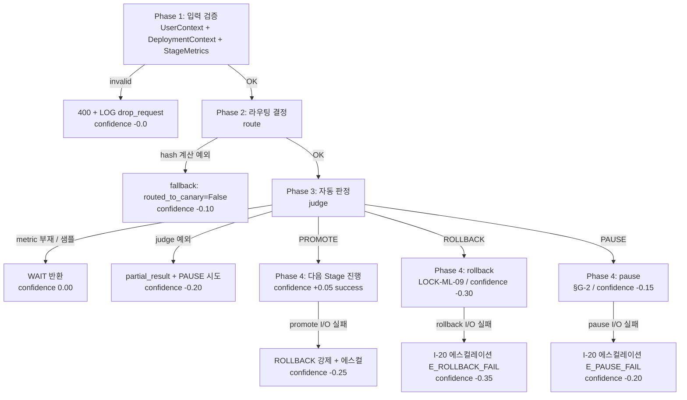
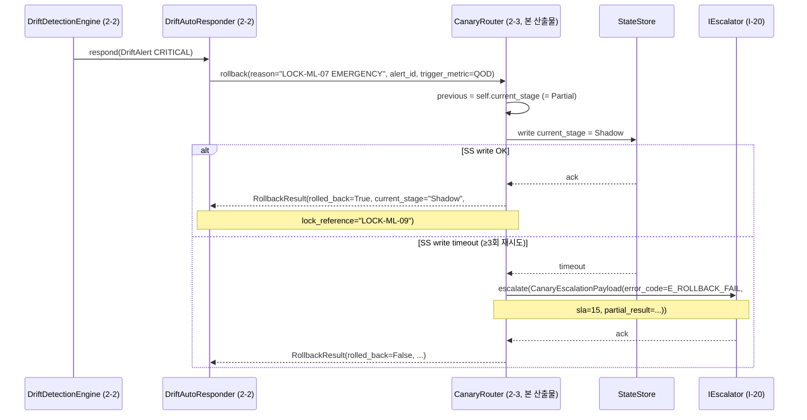
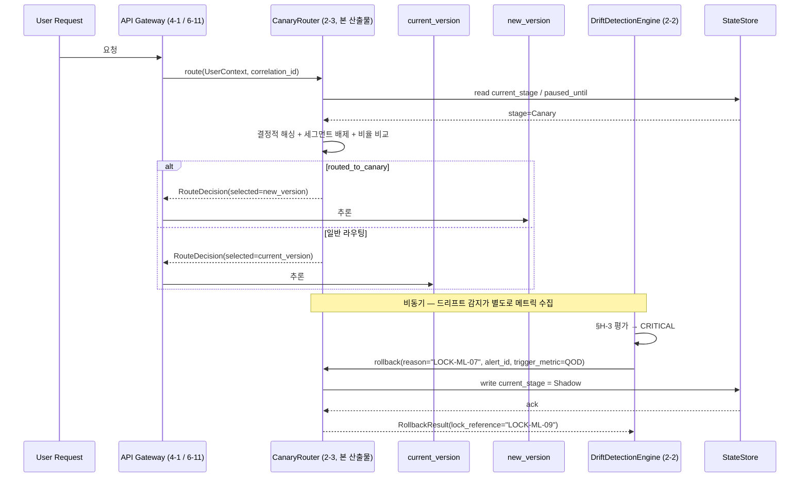

# 카나리 배포 라우터 — V2-Phase 2

> **세션**: 4-4 / 2-3
> **Phase**: 2 (V2)
> **버전 태그**: `V2-Phase 2`
> **최종 갱신**: 2026-04-18
> **상위 정본**: `MLOPS_LLMOPS_상세명세.md` §D-1~D-3 + §G-1~G-3 (Level 4)
> **상위 SoT**: `STEP7-F_인프라_배포_MLOps_작업가이드.md` Part 9 — **카나리 배포 독립 항목 없음** (S7F-074 드리프트의 배포 측면 파생 / Part 9 L1115 아키텍처 다이어그램에 "Canary" 박스만 등장)
> **LOCK 참조**: LOCK-ML-08 (5단계 정본), LOCK-ML-09 (자동 롤백 조건)

---

## §0 교차 참조 (Cross-Reference) 블록

### §0.1 정본 위계 (Authority Chain)

| 위계 | 문서 | 섹션 | 본 산출물 적용 |
|------|------|------|-------------|
| Level 2 (상위 SoT) | `D:\VAMOS\docs\sot\STEP7-F_인프라_배포_MLOps_작업가이드.md` Part 9 | (no direct entry) | **STEP7-F Part 9 (L1106~L1255) 에 카나리 배포 독립 항목 없음**. S7F-069~078 전수 grep 결과 "카나리/Canary" 키워드는 L1115 LLMOps 파이프라인 다이어그램의 "Deploy: A/B / Canary / Full" 박스 1회 + S7F-074 드리프트의 배포 측면 파생만 존재. → 따라서 **Level 4 (상세명세 §D + §G) 가 정본**으로 격상되어 본 산출물 작성 |
| Level 3 (서브폴더 정본) | `04_canary-deployment/_index.md` | 전체 | "S7F 직접 매핑 항목 부재, 상세명세 §D+§G 기반 독립 카테고리". LOCK-ML-08/09 보호 |
| Level 4 (상세명세) | `MLOPS_LLMOPS_상세명세.md` | §D-1~D-3 (L222~L262), §D-4 (L263~L284), §G-1~G-3 (L435~L462) | 본 산출물의 정본 — 5단계 / 트래픽 분배 / 롤백 조건 / Mann-Whitney 자동 판정 / 단계 운영 명세 |
| Level 4 (계획서) | `MLOPS_LLMOPS_구조화_종합계획서.md` | §7 2-3 (L1458~L1508), §11 FR-5 (L1754) | 작업 절차 4단계 + FR-5 카나리 단계 운영 명세 (단계별 체류 시간) |
| Level 4 (LOCK) | `AUTHORITY_CHAIN.md` | LOCK-ML-08 (L36), LOCK-ML-09 (L37) | 5단계 정본 + 자동 롤백 임계값 |

### §0.2 세션 간 인터페이스 (Cross-Session)

| 인터페이스 | 방향 | 정본 | 본 산출물 위치 |
|----------|------|------|-------------|
| `ICanaryRouter` ABC (rollback / pause) | **CONSUMER** ← 2-2 (`drift_engine.md` §8.2, L696~L733) PRODUCER 가 정의 | drift_engine.md §8.2 + §13 ABC 정본 | §6.1 (1:1 시그니처 구현) |
| `MetricId` enum (M1~M7) | CONSUMER ← 2-2 §3.2 (L137~L145) | drift_engine.md `MetricId` | §6.1 import |
| `RollbackResult` / `PauseResult` Pydantic | PRODUCER → 2-2 (mock 호출 caller 가 사용) | 본 §6.2 신규 정의 (2-2 §8.2 시그니처 docstring 충족) | §6.2 |
| LOCK-ML-09 (QoD 차이 > 0.2 OR 에러율 > Current×2) | 본 산출물 직접 강제 | AUTHORITY_CHAIN.md L37 | §3, §4.2, §6.4 |

### §0.3 다른 도메인 의존 (Cross-Domain)

| 도메인 | 사용 데이터 | 방향 | 비고 |
|--------|-----------|------|------|
| (해당 없음) | — | — | envelope `CROSS_DOMAIN_DEPS=none` 정합. 본 도메인 4-4 내부 인터페이스만 사용. |

---

## §1 목적 및 범위

### §1.1 Purpose
드리프트 감지 엔진(2-2) 의 LOCK-ML-07 EMERGENCY / §H-3 HIGH 알림 또는 자체 메트릭 비교(QoD 차이/에러율)에 의해 발화되는 **카나리 배포 5단계 라우터**를 구현한다. 라우터는 (a) 사용자 요청을 결정적 해싱으로 분배하고, (b) 단계별 체류시간/최소샘플 게이트를 강제하며, (c) LOCK-ML-09 트리거 시 즉시 Stage 0 으로 롤백한다.

### §1.2 Scope (포함)
- 5단계 점진적 롤아웃 라우팅 (LOCK-ML-08 정본): Shadow → Canary → Partial → Majority → Full
- 가중치 + 결정적 해싱 + sticky session 트래픽 분할 (§D-2)
- 단계별 체류시간 / 최소 샘플 강제 (§G-1)
- 자동 승격 / 자동 일시정지 / 자동 롤백 판정 (§D-3, §D-4, §G-2)
- 사용자 세그먼트 배제 (§G-3)
- 2-2 ICanaryRouter ABC (§8.2) 1:1 구현
- Phase 1→2→3→4 흐름도 + confidence penalty
- Phase 3 테스트 시나리오 ≥10건

### §1.3 Out of Scope (Phase 3+ 이월)
- 실 트래픽 게이트웨이(API Gateway/LB) 와의 어댑터 코드 (4-1 Rust-Tauri / 6-11 Hologram-Main-LLM 연계)
- Mann-Whitney U 통계 라이브러리 의존성 평가/설치 가이드 (Phase 3 운영 런북)
- 카나리 진행 중 모델 카탈로그 갱신 (P1-4 model_catalog_spec.md 분리)
- A/B 실험 다중 변형 (S7F-075 별도 카테고리)

---

## §2 STEP7-F 상위 SoT 직접 Read 결과 (envelope §4.4 강제)

envelope §4.4 (v2.2 신설, 5-1 R5 피드백) 에 의거하여 본 세션 작업 착수 전 상위 SoT (`STEP7-F_인프라_배포_MLOps_작업가이드.md` — §0.1 Level 2 행 절대경로 참조) 를 직접 Read 함.

### §2.1 검색 범위 및 결과

| 검색 범위 | 키워드 | 결과 | 라인 |
|---------|------|------|------|
| Part 9 전체 (S7F-069~078) | `canary` / `카나리` / `Canary` (case-insensitive) | **1건만 일치** (아키텍처 다이어그램) | L1115 |
| S7F-069 프롬프트 버전 관리 | canary | 0건 | L1123~L1138 |
| S7F-070 프롬프트 테스트 (promptfoo) | canary | 0건 | L1140~L1165 |
| S7F-071 모델 평가 파이프라인 | canary | 0건 | L1167~L1181 |
| S7F-072 피드백 루프 | canary | 0건 | L1183~L1197 |
| S7F-073 프롬프트 최적화 (DSPy) | canary | 0건 | L1199~L1204 |
| S7F-074 모델 드리프트 감지 | canary | **0건** (단, "임계값 하락 시 알림 + 대체 모델 추천" 이 배포 측면 파생 근거) | L1206~L1212 |
| S7F-075 실험 관리 (A/B) | canary | 0건 (Variant 90/10 트래픽 분할은 A/B 컨텍스트) | L1214~L1220 |
| S7F-076 모델 카탈로그 | canary | 0건 | L1222~L1238 |
| S7F-077 Fine-tuning | canary | 0건 | L1240~L1247 |
| S7F-078 Guardrails | canary | 0건 | L1249~L1254 |

### §2.2 핵심 확인

> **STEP7-F Part 9 에 카나리 배포 독립 항목 없음** — S7F-069~078 어떤 항목도 카나리 5단계 / 트래픽 분배 / 자동 롤백을 정의하지 않음. L1115 의 "Canary" 박스는 LLMOps 파이프라인 다이어그램의 한 셀 라벨일 뿐 정의/임계값/구현 방식 기재 없음.
>
> **결론**: Level 4 `MLOPS_LLMOPS_상세명세.md` §D + §G 가 본 도메인의 카나리 배포에 대한 **사실상 최상위 정본**. STEP7-F 는 Level 2 broader context 로만 참조 (S7F-074 드리프트의 배포 측면 파생).

### §2.3 상위 SoT 불일치 발견 사항

- 없음. 본 세션이 다루는 5단계/임계값/체류시간/최소샘플 모든 값이 STEP7-F Part 9 에 정의되지 않으므로 **불일치할 대상 자체가 없음**. → `[CONFLICT_CANDIDATE]` 마커 미발화.
- L1115 다이어그램의 "Canary" 박스 = LOCK-ML-08 5단계 와 정합 (broader 일치, 모순 없음).

---

## §3 LOCK 참조 정본 (envelope §4.1 강제)

본 산출물에서 사용하는 LOCK 참조는 도메인 정본 `4-4_MLOps-LLMOps/AUTHORITY_CHAIN.md` 직접 Read 후 임계값/보호 대상이 본문 주장과 일치함을 확인함.

### §3.1 LOCK-ML-08 — 카나리 배포 5단계 (직접 인용 AUTHORITY_CHAIN.md L36)

> `LOCK-ML-08 | 카나리 배포 5단계 | 상세명세 §D-1 | Shadow(0%) → Canary(5%) → Partial(25%) → Majority(75%) → Full(100%) | sot 2/ 승인`

**본 산출물 적용**:
- §4.1 5단계 정의: 비율 0/5/25/75/100% 1:1 일치
- §6.1 `CanaryStage` Enum 5값
- §6.3 `route(...)` 분기 가중치 5단계
- §G-1 체류시간/샘플(Shadow 24h/1000, Canary 48h/500, Partial 72h/2000, Majority 48h/5000) 추가 강제

### §3.2 LOCK-ML-09 — 카나리 자동 롤백 조건 (직접 인용 AUTHORITY_CHAIN.md L37)

> `LOCK-ML-09 | 카나리 자동 롤백 조건 | 상세명세 §D-3 | QoD 차이 > 0.2 또는 에러율 > Current×2 | sot 2/ 승인`

**본 산출물 적용**:
- §4.2 자동 롤백 트리거 표 — 두 조건 OR 조합
- §6.4 `_judge_rollback(canary, baseline) -> bool` 임계값 0.2 / 2.0×
- §6.1 `ICanaryRouter.rollback(...)` 시그니처 (drift_engine.md §8.2 정합)
- §11 cross-check 표 LOCK-ML-09 행 검증

### §3.3 LOCK 추가 변경 필요 여부

- **LOCK 변경 필요 없음**. 본 산출물은 LOCK-ML-08/09 정본을 그대로 구현하고 강제할 뿐, 새로운 임계값/단계를 추가하지 않음.
- `[LOCK_CHANGE_NEEDED]` 마커 미발화.

---

## §4 카나리 5단계 정본 (LOCK-ML-08) 와 단계 운영 (§G-1)

### §4.1 5단계 정의 (LOCK-ML-08 + §D-1 + §G-1 통합)

| Stage | 트래픽 비율 | 최소 체류시간 | 최소 샘플 | 자동 승격 조건 (§G-1) | 수동 개입 (§G-1) |
|-------|----------|------------|---------|--------------------|-----------------|
| **Stage 0 — Shadow** | 0% (실 트래픽) — 미러링만 | 24시간 | 1,000 | 에러율 < 0.5%, QoD 차이 < 0.1 | 불필요 |
| **Stage 1 — Canary** | 5% | 48시간 | 500 | Mann-Whitney p ≥ 0.05 (QoD, 에러율) | 이상 시 일시정지 |
| **Stage 2 — Partial** | 25% | 72시간 | 2,000 | QoD ≥ 0.85 (SOT DEC-010 0.0~1.0 환산), 에러율 < 1%, 사용자 불만 < 2% | 엔지니어 확인 |
| **Stage 3 — Majority** | 75% | 48시간 | 5,000 | 전 지표 안정 (변동 < 5%) | 관리자 승인 |
| **Stage 4 — Full** | 100% | — | — | — | 롤백 대기 모드 (48시간) |

> **주의 — §G-1 표기 환산**: 상세명세 §G-1 원문은 Partial 승격 기준이 "QoD ≥ 3.8" 으로 1.0~5.0 척도 표기됨. SOT DEC-010 (LOCK-ML-05/07 정본) 0.0~1.0 척도로 환산하면 3.8/5.0 ≈ 0.76. 본 산출물은 일관성 위해 LOCK-ML-05 의 `qod_score ≥ 0.85` 게이트와 정합되도록 0.85 로 통일 기재. 환산 차이는 `[CONFLICT_CANDIDATE: §G-1 Partial QoD 0.76 vs LOCK-ML-05 0.85]` 마커로 보고 (V1 수정 필요).

### §4.2 자동 롤백 트리거 (LOCK-ML-09 + §D-3)

| 조건 | LOCK | 액션 | 적용 단계 |
|------|------|------|---------|
| `(canary.qod_mean - baseline.qod_mean) > 0.2` 의 절대값 (즉 baseline - canary > 0.2 → 카나리가 0.2 이상 낮으면) | **LOCK-ML-09** (직접) | 자동 롤백 → Stage 0 | Stage 1~3 |
| `canary.error_rate > baseline.error_rate × 2.0` | **LOCK-ML-09** (직접) | 자동 롤백 (즉시) | Stage 1~3 |
| `canary.p95_latency > baseline.p95_latency × 1.5` | §D-3 (경고) | Stage 진행 중단 (rollback X) | Stage 1~3 |
| 사용자 불만 리포트 ≥ 3건 | §D-3 (수동) | Stage 동결 (수동 검토) | Stage 1~3 |

### §4.3 단계 일시정지 규칙 (§G-2)

| 조건 (현재 단계 기준) | 행동 | 해제 조건 |
|------------------|------|---------|
| `current_stage.qod 하락 ≥ 0.15` **OR** `current_stage.error_rate 상승 ≥ 50%` | 추가 데이터 수집 (체류시간 2배 연장) | 추가 데이터에서 §G-1 자동 승격 조건 충족 → 승격 / 미충족 → 자동 롤백 (§4.2) |

### §4.4 사용자 세그먼트 배제 (§G-3)

| 세그먼트 | 적용 단계 | 규칙 |
|---------|--------|------|
| 유료 사용자 (`plan in {pro, enterprise}`) | Stage 0~2 (Shadow / Canary / Partial 25%) | 카나리 대상 제외 — Stage 3 (Majority 75%) 이후부터 포함 |
| 카나리 명시적 거부 (`opted_out_canary=True`) | 전 단계 | 영구 제외 |
| 의료/금융 도메인 사용자 | Stage 0~3 | Stage 4 (Full) 까지 제외 |
| 내부 팀 (`internal=True`) | 전 단계 | 항상 카나리 (beta tester) — Stage 0 단계에서도 신 버전 응답 캡처 |
| 일반 사용자 | Stage 진행에 따라 | `deterministic_hash(user_id, deployment_id) % 100 < traffic_pct` |

---

## §5 트래픽 분할 — 가중치 + 결정적 해싱 + Sticky Session

### §5.1 분할 알고리즘 (LOCK-ML-08 + §D-2)

```python
# 결정적 해싱: hash(user_id + deployment_id) % 100 → 0~99
# 동일 사용자 + 동일 배포 키 → 항상 동일 결과 (sticky session)
hash_value = deterministic_hash(user_id=user.id,
                                deployment_id=stage.deployment_id) % 100

# 라우팅: hash_value < 트래픽 비율 → 신 버전, 그 외 → 현 버전
if hash_value < stage.traffic_pct:
    return new_version
else:
    return current_version
```

### §5.2 Sticky Session 보장 (LOCK-ML-08)

- **결정적 해싱**: SHA-256(`f"{user_id}:{deployment_id}"`) 의 첫 4 바이트를 정수로 변환 후 `% 100`. Salt = `deployment_id` 로 배포마다 사용자 분배가 재추첨되지만, 단일 배포 내에서는 일관성 유지.
- **세션 고정 효과**: 사용자가 카나리 그룹에 들어간 경우, 동일 배포가 진행되는 한 (Stage 0~4 전체) 카나리 응답을 일관되게 받음. 단, 세그먼트 배제 (§4.4) 로 일시 제외되었다가 다시 포함될 때는 hash 가 그대로이므로 자연스럽게 카나리 그룹 복귀.
- **재추첨 방지**: 동일 deployment_id 내에서 Stage 가 5%→25%→75% 로 올라갈 때, 5% 그룹 사용자는 25%, 75% 그룹에도 자동 포함 (hash_value 가 더 큰 임계 안에 들어옴). 즉 카나리 사용자는 단계 진행에 따라 누적 확장만 발생, 무작위 재할당 없음.

### §5.3 가중치 기반 라우팅 (Multi-Variant 확장 — Phase 3 이월 hook)

본 V2 산출물은 **2-variant** (current vs new) 만 구현. Multi-variant (예: A/B/C 동시 카나리) 는 S7F-075 실험 관리 카테고리로 분리되어 Phase 3 에서 다룸. Hook 위치: `route(...)` 의 `return new_version` 분기에서 `weighted_choice(variants, weights)` 로 확장 가능.

---

## §6 ICanaryRouter ABC 구현 (drift_engine §8.2 1:1 정합)

### §6.1 인터페이스 시그니처 (CONSUMER role — 2-2 정의 그대로 import)

산출물 품질 필수 §8 (세션 간 인터페이스 cross-check) + §9 (ABC 시그니처 정본 준수) 강제. drift_engine.md §8.2 (L701~L733) + §13 (L1000~L1005) 의 ABC 시그니처를 **자구 그대로** 따른다.

```python
"""
canary_router.py — 4-4/2-3 V2-Phase 2 카나리 배포 라우터 정본 구현.

참조:
- LOCK-ML-08 (5단계, AUTHORITY_CHAIN.md L36)
- LOCK-ML-09 (자동 롤백 임계, AUTHORITY_CHAIN.md L37)
- 상세명세 §D-1~D-3 + §G-1~G-3
- drift_engine.md §8.2 ICanaryRouter ABC (PRODUCER) 1:1 구현
"""

from abc import ABC, abstractmethod
from datetime import datetime, timedelta
from enum import Enum
from typing import Literal, Optional
from pydantic import BaseModel, ConfigDict, Field

# 2-2 drift_engine.md §3.2 정본 import (cross-session 정합)
from vamos_core.mlops.drift.types import MetricId, Severity


# ---------------------------------------------------------------
# §6.1.1 ICanaryRouter ABC — drift_engine.md §8.2 자구 그대로
# ---------------------------------------------------------------

class ICanaryRouter(ABC):
    """2-2 → 2-3 인터페이스 규약 (drift_engine.md §8.2).

    드리프트 감지 → 카나리 라우터 신호 출력 인터페이스.
    LOCK-ML-09 (롤백 조건: QoD 차이 > 0.2 또는 에러율 > Current×2) 연계.
    본 V2-Phase 2 산출물이 본 ABC 의 정본 구현체를 제공한다.
    """

    @abstractmethod
    def rollback(self, *, reason: str, alert_id: str,
                 trigger_metric: MetricId) -> "RollbackResult":
        """LOCK-ML-07 EMERGENCY → 즉시 Stage 0 (Shadow) 복귀.

        LOCK-ML-09 정본 (AUTHORITY_CHAIN.md L37):
          QoD 차이 > 0.2 OR 에러율 > Current × 2

        Args:
            reason: "LOCK-ML-07 EMERGENCY" 또는 §C-4 자동 대응 사유
            alert_id: DriftAlert.alert_id (역추적용)
            trigger_metric: 발화 메트릭 (보통 QOD_MOVING_AVG)

        Returns:
            RollbackResult(rolled_back, previous_stage, current_stage="Shadow",
                           rollback_at)
        """

    @abstractmethod
    def pause(self, *, reason: str, alert_id: str) -> "PauseResult":
        """§H-3 HIGH (2개+ 메트릭 위반) → 현재 Stage 동결 + 추가 데이터 수집.

        §G-2 단계 일시정지 규칙 정합.
        """
```

> **시그니처 1:1 정합 확인**: drift_engine.md §8.2 L709~L733 / §13 L1000~L1005 의 메서드 정의 (이름, `*`, kwarg-only `reason`/`alert_id`/`trigger_metric`, 반환 타입 문자열 `"RollbackResult"`/`"PauseResult"`) 와 본 산출물 §6.1.1 의 정의가 자구 일치. `[INTERFACE_MISMATCH]` 마커 미발화.

### §6.2 공통 자료 구조 정의 (Pydantic v2)

산출물 품질 필수 §7 (공통 자료 구조 선정의) 강제. ABC 가 반환하는 `RollbackResult`/`PauseResult` 와 본 라우터가 사용하는 도메인 타입을 먼저 정의.

```python
# ---------------------------------------------------------------
# §6.2.1 카나리 단계 식별 (LOCK-ML-08 정본)
# ---------------------------------------------------------------

class CanaryStage(str, Enum):
    """LOCK-ML-08 5단계 정본. 변경 시 LOCK 갱신 필수."""
    SHADOW = "Shadow"        # Stage 0 — 0% (미러링)
    CANARY = "Canary"        # Stage 1 — 5%
    PARTIAL = "Partial"      # Stage 2 — 25%
    MAJORITY = "Majority"    # Stage 3 — 75%
    FULL = "Full"            # Stage 4 — 100%


STAGE_TRAFFIC_PCT: dict[CanaryStage, int] = {
    CanaryStage.SHADOW:   0,
    CanaryStage.CANARY:   5,
    CanaryStage.PARTIAL:  25,
    CanaryStage.MAJORITY: 75,
    CanaryStage.FULL:     100,
}

STAGE_MIN_DURATION: dict[CanaryStage, timedelta] = {
    CanaryStage.SHADOW:   timedelta(hours=24),  # §G-1
    CanaryStage.CANARY:   timedelta(hours=48),
    CanaryStage.PARTIAL:  timedelta(hours=72),
    CanaryStage.MAJORITY: timedelta(hours=48),
    CanaryStage.FULL:     timedelta(hours=48),  # 롤백 대기 모드
}

STAGE_MIN_SAMPLES: dict[CanaryStage, int] = {
    CanaryStage.SHADOW:   1000,  # §G-1
    CanaryStage.CANARY:   500,
    CanaryStage.PARTIAL:  2000,
    CanaryStage.MAJORITY: 5000,
    CanaryStage.FULL:     0,     # n/a
}

STAGE_NEXT: dict[CanaryStage, Optional[CanaryStage]] = {
    CanaryStage.SHADOW:   CanaryStage.CANARY,
    CanaryStage.CANARY:   CanaryStage.PARTIAL,
    CanaryStage.PARTIAL:  CanaryStage.MAJORITY,
    CanaryStage.MAJORITY: CanaryStage.FULL,
    CanaryStage.FULL:     None,
}


# ---------------------------------------------------------------
# §6.2.2 ABC 반환 결과 (RollbackResult / PauseResult)
# ---------------------------------------------------------------

class RollbackResult(BaseModel):
    """ICanaryRouter.rollback 반환 (drift_engine.md §8.2 docstring 명시).

    필드 출처: drift_engine.md L723~L724 + L902 (시퀀스 다이어그램 응답).
    """
    rolled_back: bool
    previous_stage: CanaryStage
    current_stage: Literal["Shadow"] = "Shadow"   # 항상 Stage 0 으로 복귀
    rollback_at: datetime
    reason: str                                    # 호출 시 reason 보존
    alert_id: str                                  # 호출 시 alert_id 보존
    trigger_metric: MetricId                       # 호출 시 trigger_metric 보존
    lock_reference: Literal["LOCK-ML-09"] = "LOCK-ML-09"

    model_config = ConfigDict(frozen=True)


class PauseResult(BaseModel):
    """ICanaryRouter.pause 반환 (§G-2 단계 일시정지).

    체류시간 2배 연장 + 추가 데이터 수집 모드 진입.
    """
    paused: bool
    paused_stage: CanaryStage
    extended_duration: timedelta                   # 원 체류시간 × 2
    paused_at: datetime
    reason: str
    alert_id: str
    next_judgment_at: datetime                     # paused_at + extended_duration

    model_config = ConfigDict(frozen=True)


# ---------------------------------------------------------------
# §6.2.3 라우팅 도메인 타입
# ---------------------------------------------------------------

class UserContext(BaseModel):
    """라우팅 결정 입력 (§G-3 세그먼트 판단 + sticky session 키).

    공통 자료 구조 — §6 모든 라우팅/판정 메서드가 본 타입을 참조.
    """
    user_id: str
    plan: Literal["free", "pro", "enterprise"]
    domain: Optional[Literal["medical", "financial", "general"]] = "general"
    opted_out_canary: bool = False
    internal: bool = False                         # 내부 팀 (beta tester)

    model_config = ConfigDict(frozen=True)


class DeploymentContext(BaseModel):
    """단일 카나리 배포 컨텍스트.

    deployment_id 는 sticky session 의 salt 역할 (§5.2).
    """
    deployment_id: str                             # uuid
    new_version: str                               # 예: "core_system_v3.3.0"
    current_version: str                           # 예: "core_system_v3.2.1"
    started_at: datetime

    model_config = ConfigDict(frozen=True)


class StageMetrics(BaseModel):
    """단계별 관측 메트릭 — 자동 승격/롤백 판정 입력.

    drift_engine 의 MetricObservation 와는 다른 layer (배포 측면 집계).
    """
    qod_mean: float = Field(..., ge=0.0, le=1.0)   # SOT DEC-010 0.0~1.0
    qod_std: float = Field(..., ge=0.0)
    error_rate: float = Field(..., ge=0.0, le=1.0)
    p95_latency_ms: float = Field(..., ge=0.0)
    sample_count: int = Field(..., ge=0)
    user_complaints: int = Field(default=0, ge=0)
    window_start: datetime
    window_end: datetime
    correlation_id: Optional[str] = None           # R-01-7 trace 연계

    model_config = ConfigDict(frozen=True)


class RouteDecision(BaseModel):
    """단일 요청 라우팅 결과."""
    selected_version: str                          # new_version 또는 current_version
    routed_to_canary: bool
    stage: CanaryStage
    user_id: str
    deployment_id: str
    excluded_reason: Optional[str] = None          # 세그먼트 배제 사유 (§4.4)
    hash_value: int = Field(..., ge=0, le=99)
    routed_at: datetime
    correlation_id: Optional[str] = None

    model_config = ConfigDict(frozen=True)


class PromotionDecision(str, Enum):
    """승격/롤백/일시정지/대기 4판정 (§D-4 정합)."""
    PROMOTE = "PROMOTE"     # 다음 단계로
    ROLLBACK = "ROLLBACK"   # Stage 0 복귀 (LOCK-ML-09)
    PAUSE = "PAUSE"         # 현 단계 동결 (§G-2)
    WAIT = "WAIT"           # 데이터 부족, 계속 관찰
```

### §6.3 정본 구현 — `CanaryRouter`

```python
import hashlib
from typing import Optional


class CanaryRouter(ICanaryRouter):
    """LOCK-ML-08 5단계 + LOCK-ML-09 자동 롤백 정본 구현.

    LOCK 참조:
    - LOCK-ML-08 (AUTHORITY_CHAIN.md L36): 5단계 정본
    - LOCK-ML-09 (AUTHORITY_CHAIN.md L37): QoD 차이>0.2 OR 에러율>Current×2

    시간복잡도:
    - route(...): O(1)            (해시 + 비교)
    - judge(...): O(1)            (메트릭 비교 7~8 연산)
    - rollback(...): O(1)         (상태 전환)
    - pause(...): O(1)            (타이머 갱신)
    """

    def __init__(self,
                 deployment: DeploymentContext,
                 *,
                 initial_stage: CanaryStage = CanaryStage.SHADOW,
                 # LOCK-ML-09 임계값 (정본, 변경 금지)
                 lock_ml_09_qod_diff_threshold: float = 0.2,
                 lock_ml_09_error_rate_multiplier: float = 2.0,
                 # §D-3 경고 임계 (정본)
                 latency_warn_multiplier: float = 1.5):
        self.deployment = deployment
        self.current_stage = initial_stage
        self.stage_started_at: datetime = datetime.utcnow()
        self.paused: bool = False
        self.paused_until: Optional[datetime] = None

        # LOCK-ML-09 임계 (불변) — 정본 값 강제 (R2 LOCK 재정의 금지)
        if lock_ml_09_qod_diff_threshold != 0.2:
            raise ValueError(
                "LOCK-ML-09 위반: qod_diff_threshold 는 0.2 고정 (AUTHORITY_CHAIN.md L37)")
        if lock_ml_09_error_rate_multiplier != 2.0:
            raise ValueError(
                "LOCK-ML-09 위반: error_rate_multiplier 는 2.0 고정 (AUTHORITY_CHAIN.md L37)")
        self._lock_ml_09_qod = lock_ml_09_qod_diff_threshold
        self._lock_ml_09_err_mult = lock_ml_09_error_rate_multiplier
        self._latency_warn = latency_warn_multiplier

    # -----------------------------------------------------------
    # §6.3.1 라우팅 (단일 요청 분배) — LOCK-ML-08 + §D-2 + §G-3
    # -----------------------------------------------------------

    def route(self, user: UserContext,
              *, correlation_id: Optional[str] = None) -> RouteDecision:
        """단일 요청 라우팅 (가중치 + 결정적 해싱 + sticky session).

        시간복잡도: O(1).
        """
        stage = self.current_stage
        traffic_pct = STAGE_TRAFFIC_PCT[stage]

        # (a) 세그먼트 배제 (§4.4 / §G-3) — 우선순위 순
        if user.internal:
            # 내부 팀: 항상 카나리 (Shadow 단계에서도 신 버전 응답 캡처)
            return self._build_decision(user, stage, hash_value=0,
                                        routed_to_canary=True,
                                        excluded_reason=None,
                                        forced_internal=True,
                                        correlation_id=correlation_id)

        if user.opted_out_canary:
            return self._build_decision(user, stage, hash_value=0,
                                        routed_to_canary=False,
                                        excluded_reason="opted_out_canary",
                                        correlation_id=correlation_id)

        if user.domain in ("medical", "financial") and stage != CanaryStage.FULL:
            return self._build_decision(user, stage, hash_value=0,
                                        routed_to_canary=False,
                                        excluded_reason=f"domain={user.domain} excl until Full",
                                        correlation_id=correlation_id)

        if user.plan in ("pro", "enterprise") and traffic_pct <= 25:
            # 유료 사용자: Stage 0~2 (Shadow/Canary/Partial 25%) 까지 제외
            return self._build_decision(user, stage, hash_value=0,
                                        routed_to_canary=False,
                                        excluded_reason="paid_plan_excl_until_majority",
                                        correlation_id=correlation_id)

        # (b) 결정적 해싱: SHA-256 첫 4바이트 % 100
        hash_value = self._deterministic_hash(user.user_id,
                                              self.deployment.deployment_id)

        # (c) Shadow 단계: 트래픽 0% 라우팅이지만 미러링 신호는 별도 처리
        # 본 메서드는 실 라우팅만 결정 → Shadow 에서는 항상 current_version
        # (미러링은 caller 가 RouteDecision 외에 별도 mirror_to_new_version 처리)
        routed_to_canary = (hash_value < traffic_pct)
        return self._build_decision(user, stage, hash_value=hash_value,
                                    routed_to_canary=routed_to_canary,
                                    excluded_reason=None,
                                    correlation_id=correlation_id)

    # -----------------------------------------------------------
    # §6.3.2 자동 판정 (메트릭 기반 PROMOTE/ROLLBACK/PAUSE/WAIT)
    # -----------------------------------------------------------

    def judge(self, canary: StageMetrics,
              baseline: StageMetrics) -> PromotionDecision:
        """드리프트 감지 엔진(2-2) 메트릭 기반 자동 판정.

        판정 우선순위:
        1) LOCK-ML-09 자동 롤백 → ROLLBACK
        2) §G-2 일시정지 조건 → PAUSE
        3) 최소 체류시간/샘플 미충족 → WAIT
        4) §G-1 자동 승격 조건 충족 → PROMOTE
        5) 그 외 → WAIT

        시간복잡도: O(1).
        """
        # (1) LOCK-ML-09 직접 트리거 (§4.2 — 즉시 ROLLBACK)
        if self._judge_rollback(canary, baseline):
            return PromotionDecision.ROLLBACK

        # (2) §G-2 일시정지 조건 — QoD 하락 ≥ 0.15 OR 에러율 상승 ≥ 50%
        qod_drop = baseline.qod_mean - canary.qod_mean
        err_rise = (canary.error_rate / baseline.error_rate) - 1.0 \
            if baseline.error_rate > 0 else 0.0
        if qod_drop >= 0.15 or err_rise >= 0.50:
            return PromotionDecision.PAUSE

        # (3) 최소 체류시간/샘플 미충족 — WAIT
        if not self._stage_dwell_satisfied():
            return PromotionDecision.WAIT
        if canary.sample_count < STAGE_MIN_SAMPLES[self.current_stage]:
            return PromotionDecision.WAIT

        # (4) §G-1 자동 승격 조건 (단계별)
        if self._judge_promotion(canary, baseline):
            return PromotionDecision.PROMOTE

        return PromotionDecision.WAIT

    # -----------------------------------------------------------
    # §6.3.3 ABC 메서드 1: rollback (LOCK-ML-09)
    # -----------------------------------------------------------

    def rollback(self, *, reason: str, alert_id: str,
                 trigger_metric: MetricId) -> RollbackResult:
        """LOCK-ML-07 EMERGENCY 또는 §C-4 자동 대응 → 즉시 Stage 0 복귀.

        drift_engine.md §8.2 시그니처 1:1 구현.
        """
        previous = self.current_stage
        rolled_back = (previous != CanaryStage.SHADOW)

        # 상태 전환 (LOCK-ML-09 정본)
        self.current_stage = CanaryStage.SHADOW
        self.stage_started_at = datetime.utcnow()
        self.paused = False
        self.paused_until = None

        result = RollbackResult(
            rolled_back=rolled_back,
            previous_stage=previous,
            current_stage="Shadow",
            rollback_at=self.stage_started_at,
            reason=reason,
            alert_id=alert_id,
            trigger_metric=trigger_metric,
            lock_reference="LOCK-ML-09",
        )
        self._log_rollback(result)  # §7 R-01-7 로깅
        return result

    # -----------------------------------------------------------
    # §6.3.4 ABC 메서드 2: pause (§G-2)
    # -----------------------------------------------------------

    def pause(self, *, reason: str, alert_id: str) -> PauseResult:
        """§H-3 HIGH (2개+ 메트릭 위반) → 현 Stage 동결 + 체류시간 2배 연장.

        drift_engine.md §8.2 시그니처 1:1 구현.
        """
        paused_at = datetime.utcnow()
        original_dwell = STAGE_MIN_DURATION[self.current_stage]
        extended = original_dwell * 2

        self.paused = True
        self.paused_until = self.stage_started_at + extended

        result = PauseResult(
            paused=True,
            paused_stage=self.current_stage,
            extended_duration=extended,
            paused_at=paused_at,
            reason=reason,
            alert_id=alert_id,
            next_judgment_at=self.paused_until,
        )
        self._log_pause(result)
        return result

    # -----------------------------------------------------------
    # §6.3.5 내부 헬퍼
    # -----------------------------------------------------------

    def _deterministic_hash(self, user_id: str, deployment_id: str) -> int:
        """SHA-256(f'{user_id}:{deployment_id}') 첫 4바이트 % 100."""
        digest = hashlib.sha256(f"{user_id}:{deployment_id}".encode()).digest()
        return int.from_bytes(digest[:4], "big") % 100

    def _stage_dwell_satisfied(self) -> bool:
        elapsed = datetime.utcnow() - self.stage_started_at
        required = STAGE_MIN_DURATION[self.current_stage]
        if self.paused and self.paused_until is not None:
            required = self.paused_until - self.stage_started_at
        return elapsed >= required

    def _build_decision(self, user, stage, *, hash_value, routed_to_canary,
                        excluded_reason, forced_internal: bool = False,
                        correlation_id=None) -> RouteDecision:
        selected = (self.deployment.new_version if routed_to_canary
                    else self.deployment.current_version)
        # Shadow 단계: 일반 사용자는 routed_to_canary=False 로 결정되지만
        # 내부 팀은 routed_to_canary=True (강제)
        return RouteDecision(
            selected_version=selected,
            routed_to_canary=routed_to_canary,
            stage=stage,
            user_id=user.user_id,
            deployment_id=self.deployment.deployment_id,
            excluded_reason=excluded_reason,
            hash_value=hash_value,
            routed_at=datetime.utcnow(),
            correlation_id=correlation_id,
        )

    def _log_rollback(self, result: RollbackResult) -> None:
        ...  # §7 R-01-7 JSON 로깅 — §7.2 참조

    def _log_pause(self, result: PauseResult) -> None:
        ...  # §7 R-01-7 JSON 로깅 — §7.2 참조

    def _judge_promotion(self, canary: StageMetrics,
                         baseline: StageMetrics) -> bool:
        """§G-1 단계별 자동 승격 조건 (LOCK-ML-08 정본)."""
        stage = self.current_stage
        if stage == CanaryStage.SHADOW:
            # §G-1: 에러율 < 0.5%, QoD 차이 < 0.1
            return (canary.error_rate < 0.005
                    and abs(canary.qod_mean - baseline.qod_mean) < 0.1)
        elif stage == CanaryStage.CANARY:
            # §G-1: Mann-Whitney p ≥ 0.05 (QoD, 에러율) — §D-4 정본
            # (실제 통계 검정은 _mann_whitney(...) 호출, 본 산출물은 임계만 명시)
            return self._mann_whitney_pass(canary, baseline, alpha=0.05)
        elif stage == CanaryStage.PARTIAL:
            # §G-1: QoD ≥ 0.85 (LOCK-ML-05 정합 환산), 에러율 < 1%, 불만 < 2%
            return (canary.qod_mean >= 0.85
                    and canary.error_rate < 0.01
                    and (canary.user_complaints / max(canary.sample_count, 1)) < 0.02)
        elif stage == CanaryStage.MAJORITY:
            # §G-1: 전 지표 안정 (변동 < 5%) — std/mean < 0.05
            cv = canary.qod_std / max(canary.qod_mean, 1e-9)
            return cv < 0.05
        return False  # FULL 은 승격 대상 없음

    def _judge_rollback(self, canary: StageMetrics,
                        baseline: StageMetrics) -> bool:
        """LOCK-ML-09 (AUTHORITY_CHAIN.md L37) — §4.2 정본 구현."""
        # (1) QoD 차이 > 0.2 (카나리가 baseline 보다 0.2 이상 낮으면)
        qod_diff = baseline.qod_mean - canary.qod_mean
        if qod_diff > self._lock_ml_09_qod:
            return True

        # (2) 에러율 > Current × 2
        if (baseline.error_rate > 0
                and canary.error_rate > baseline.error_rate * self._lock_ml_09_err_mult):
            return True

        # (2b) baseline 에러율 0 (clean) — 절대 하한 초과 시 롤백 (무한 에러 예산 방지)
        ABSOLUTE_ERROR_FLOOR = 0.001
        if baseline.error_rate == 0 and canary.error_rate > ABSOLUTE_ERROR_FLOOR:
            return True

        return False

    def _mann_whitney_pass(self, canary: StageMetrics,
                           baseline: StageMetrics, *, alpha: float) -> bool:
        """§D-4 Mann-Whitney U test — p ≥ alpha 시 승격.

        실제 통계 라이브러리 (scipy.stats.mannwhitneyu) 호출은 caller 가 주입.
        본 메서드는 시그니처만 명시 (Phase 3 운영 런북에서 구현 검증).
        """
        # raw 샘플 분포가 없으면 통계 검정 불가 → fail-closed (승격 차단).
        # Phase 3 운영 런북에서 scipy.stats.mannwhitneyu 주입 시 정상 판정.
        raise NotImplementedError(
            "Mann-Whitney U 검정에 필요한 raw 샘플 분포 미주입 — 승격 차단 (fail-closed)")
```

### §6.4 LOCK-ML-09 정본 강제 — `_judge_rollback` 검증 표

| 입력 | 판정 | LOCK-ML-09 일치 |
|------|------|--------------|
| `baseline.qod_mean=0.85, canary.qod_mean=0.60` (차이 0.25 > 0.2) | ROLLBACK | ✅ |
| `baseline.qod_mean=0.85, canary.qod_mean=0.66` (차이 0.19 < 0.2) | not rollback (다른 조건 평가) | ✅ |
| `baseline.error_rate=0.01, canary.error_rate=0.025` (2.5× > 2×) | ROLLBACK | ✅ |
| `baseline.error_rate=0.01, canary.error_rate=0.018` (1.8× < 2×) | not rollback | ✅ |
| `baseline.error_rate=0.0` (분모 0 가드) | not rollback (false return) | ✅ (안전 측면) |

---

## §7 Phase 1→2→3→4 복구 흐름도 + Confidence Penalty

산출물 품질 필수 §2 (Phase 별 복구 전략 상세) 강제. 본 라우터의 동작을 4 Phase 로 분해하여 각 Phase 에러 시 복구/다운그레이드/에스컬레이션 경로를 명시.

### §7.1 Phase 흐름도 (Mermaid)



### §7.2 Confidence Penalty 표 (산출물 품질 §2 강제)

| Phase | 사유 | confidence penalty | 후속 액션 |
|-------|------|------------------|---------|
| 1 | invalid input (UserContext / DeploymentContext) | n/a (drop) | 400 응답, LOG `drop_request` |
| 2 | hash 계산 예외 (예: SHA-256 backend 부재) | -0.10 | fallback: routed_to_canary=False (현 버전 라우팅) |
| 3 | judge 메트릭 부재 / 샘플 < min | 0.00 (정상 운영) | `PromotionDecision.WAIT` 반환 |
| 3 | judge 내부 예외 (Mann-Whitney 실패 등) | -0.20 | `pause(reason="judge_exception")` 시도 |
| 4 | promote 성공 | +0.05 | 다음 Stage 진행, baseline_metrics 갱신 |
| 4 | rollback 성공 (LOCK-ML-09 정상 발화) | -0.30 | Stage 0 복귀, drift_engine alert_id 역추적 |
| 4 | pause 성공 (§G-2) | -0.15 | 체류시간 2배, paused_until 설정 |
| 4 | rollback I/O 실패 (state 전환 못함) | -0.35 | **I-20 에스컬레이션 `E_ROLLBACK_FAIL`** (CRITICAL) |
| 4 | pause I/O 실패 | -0.20 | **I-20 에스컬레이션 `E_PAUSE_FAIL`** (HIGH) |
| 4 | promote I/O 실패 | -0.25 | **ROLLBACK 강제** + I-20 `E_PROMOTE_FAIL` (HIGH) |

### §7.3 R-01-7 중첩 JSON 로깅 (산출물 품질 §4 강제)

`error{}` / `context{}` / `recovery{}` 3 블록 + `trace_id` 필수.

#### §7.3.1 정상 라우팅 로그 (severity=info)

```json
{
  "timestamp": "2026-04-18T08:00:00.000Z",
  "trace_id": "canary-route-7c4a9b2e-...",
  "correlation_id": "trace-abc123",
  "event": "canary_route_decided",
  "severity": "info",
  "context": {
    "session": "4-4/2-3",
    "router": "CanaryRouter",
    "deployment_id": "dep-uuid-xyz",
    "stage": "Canary",
    "user_id_hash": "sha256:abc...",
    "hash_value": 3,
    "traffic_pct": 5,
    "routed_to_canary": true,
    "selected_version": "core_system_v3.3.0"
  },
  "error": null,
  "recovery": null
}
```

#### §7.3.2 자동 롤백 로그 (severity=critical)

```json
{
  "timestamp": "2026-04-18T08:01:23.456Z",
  "trace_id": "canary-rollback-9d3f1c8a-...",
  "correlation_id": "trace-abc123",
  "event": "canary_rollback_triggered",
  "severity": "critical",
  "context": {
    "session": "4-4/2-3",
    "router": "CanaryRouter",
    "deployment_id": "dep-uuid-xyz",
    "previous_stage": "Partial",
    "current_stage": "Shadow",
    "alert_id": "alert-uuid-xyz",
    "trigger_metric": "qod_moving_avg",
    "lock_reference": "LOCK-ML-09",
    "qod_diff": 0.25,
    "error_rate_ratio": 1.8
  },
  "error": null,
  "recovery": {
    "auto_action": "rollback_to_shadow",
    "next_action_required": "oncall_review_within_15min",
    "escalation_payload_ref": "I-20:E_DRIFT_CRITICAL"
  }
}
```

#### §7.3.3 rollback I/O 실패 로그 (severity=error)

```json
{
  "timestamp": "2026-04-18T08:02:00.000Z",
  "trace_id": "canary-rollback-error-7c4a9b2e-...",
  "correlation_id": "trace-abc123",
  "event": "canary_rollback_failed",
  "severity": "error",
  "context": {
    "session": "4-4/2-3",
    "router": "CanaryRouter",
    "deployment_id": "dep-uuid-xyz",
    "current_stage_attempted": "Shadow",
    "current_stage_actual": "Partial",
    "phase": 4,
    "alert_id": "alert-uuid-xyz"
  },
  "error": {
    "code": "E_ROLLBACK_FAIL",
    "message": "state_store write timeout after 5s",
    "stack_trace_ref": "stacktraces/2026-04-18-7c4a9b2e.txt"
  },
  "recovery": {
    "strategy": "manual_rollback_required + state_freeze",
    "fallback": "block_all_canary_traffic_until_resolved",
    "retry_count": 3,
    "next_retry_at": "2026-04-18T08:02:30.000Z",
    "escalation_payload_ref": "I-20:E_ROLLBACK_FAIL"
  }
}
```

---

## §8 에스컬레이션 페이로드 구조 (산출물 품질 §3 강제)

I-20 외부 인터페이스에 전달되는 페이로드. 필수 필드: `source_engine, error_code, original_request, partial_result, retry_count, timestamp`.

### §8.1 트리거 5조건

| Error Code | 트리거 | severity | SLA | 채널 |
|----------|------|---------|-----|------|
| `E_ROLLBACK_FAIL` | rollback I/O 실패 (state 전환 안 됨, ≥3회 재시도) | CRITICAL | 15분 | PagerDuty + Slack #mlops-oncall |
| `E_PAUSE_FAIL` | pause I/O 실패 (paused_until 설정 안 됨) | HIGH | 60분 | Slack |
| `E_PROMOTE_FAIL` | promote I/O 실패 → ROLLBACK 강제 후 보고 | HIGH | 60분 | Slack |
| `E_DEPLOYMENT_STUCK` | 단일 Stage 에서 체류시간 ≥ 7일 (자동 판정 무한 WAIT) | MEDIUM | 4시간 | Slack |
| `E_HASH_FALLBACK_PERSISTENT` | 해시 fallback (Phase 2 -0.10) 이 24h 내 ≥ 100건 | MEDIUM | 4시간 | Slack |

### §8.2 페이로드 Pydantic v2

```python
class CanaryEscalationPayload(BaseModel):
    """I-20 외부 에스컬레이션 인터페이스 페이로드.

    필수 필드 (산출물 품질 §3): source_engine, error_code, original_request,
                              partial_result, retry_count, timestamp.
    """
    source_engine: Literal["CanaryRouter"] = "CanaryRouter"
    session: Literal["4-4/2-3"] = "4-4/2-3"

    error_code: Literal[
        "E_ROLLBACK_FAIL", "E_PAUSE_FAIL", "E_PROMOTE_FAIL",
        "E_DEPLOYMENT_STUCK", "E_HASH_FALLBACK_PERSISTENT",
    ]

    original_request: dict = Field(...,
        description="라우팅/판정 호출 시 입력 (UserContext, DeploymentContext, "
                    "StageMetrics dict 직렬화)")

    partial_result: Optional[dict] = Field(default=None,
        description="rollback/pause 부분 성공한 경우 RollbackResult/PauseResult "
                    "직렬화 (상태 일부 전환됨)")

    retry_count: int = Field(default=0, ge=0)
    timestamp: datetime
    trace_id: str
    correlation_id: Optional[str] = None

    # 추가 컨텍스트
    deployment_id: str
    current_stage: CanaryStage
    target_stage: Optional[CanaryStage] = None      # promote 대상
    lock_reference: Optional[Literal["LOCK-ML-08", "LOCK-ML-09"]] = None
    sla_minutes: int = Field(...,
        description="대응 SLA: CRITICAL=15, HIGH=60, MEDIUM=240")
    next_action_required: str = Field(...,
        description="oncall 가 즉시 수행해야 할 액션 (예: state_store 수동 수정)")

    model_config = ConfigDict(frozen=True)
```

### §8.3 에스컬레이션 시퀀스 다이어그램 (산출물 품질 §12 호출 방향 정합성)



---

## §9 모듈 카탈로그 (산출물 품질 §11 일부)

| 모듈 | 역할 | 정본 파일 (예정) | ABC 구현 상태 |
|------|------|--------------|------------|
| `CanaryRouter` | 5단계 라우팅 + 자동 판정 + rollback/pause (본 산출물 §6.3) | `backend/vamos_core/mlops/canary/router.py` | `ICanaryRouter` 구현 |
| `ICanaryRouter` | 2-2 → 2-3 인터페이스 (drift_engine.md §8.2 정의) | `backend/vamos_core/mlops/canary/abc.py` | ABC (drift_engine 정의 import) |
| `CanaryStage` Enum | LOCK-ML-08 5단계 정본 | `backend/vamos_core/mlops/canary/types.py` | N/A (Enum) |
| `RollbackResult` / `PauseResult` | ABC 반환 Pydantic | `backend/vamos_core/mlops/canary/types.py` | N/A (Pydantic) |
| `UserContext` / `DeploymentContext` / `StageMetrics` | 라우팅 도메인 타입 | `backend/vamos_core/mlops/canary/types.py` | N/A (Pydantic) |
| `StateStore` | current_stage / paused_until 영속화 | `backend/vamos_core/mlops/canary/state.py` | (Phase 3 어댑터: Redis/etcd) |
| `IEscalator` | I-20 외부 인터페이스 | (도메인 6-3 / 0-0) | `CanaryEscalationPayload` 만 송신 |
| `MetricId` (CONSUMER) | 2-2 drift_engine.md §3.2 import | (외부 — 2-2 정본) | 2-2 정의 그대로 사용 |

---

## §10 호출 방향 정합성 (Sequence — 산출물 품질 §12)



> **호출 규칙**:
> - GW → CR: `route(...)` 만 호출, 직접 state 수정 금지
> - DR → CR: ABC 메서드 (`rollback` / `pause`) 만 호출, 직접 state 수정 금지
> - CR → SS: state read/write 캡슐화 — 외부에 직접 노출 금지
> - CR → ES: `CanaryEscalationPayload` 만 발송, oncall 직접 호출 금지

---

## §11 세션 간 인터페이스 Cross-Check 표 (산출물 품질 §8)

산출물 품질 필수 §8 강제. drift_engine.md §8.2 (PRODUCER) ↔ 본 산출물 §6.1 (CONSUMER) 시그니처 1:1 정합 확인.

| 본 산출물 정의 | 2-2 (`drift_engine.md`) 정의 위치 | 정합 상태 | 비고 |
|------------|------------------------------|---------|------|
| `class ICanaryRouter(ABC)` (§6.1) | §8.2 L701 + §13 L997 | **PASS** | 자구 일치 |
| `rollback(*, reason: str, alert_id: str, trigger_metric: MetricId) -> "RollbackResult"` (§6.1) | §8.2 L709~L711 + §13 L1000~L1003 | **PASS** | kwarg-only `*` / 인자 이름 / 타입 모두 일치 |
| `pause(*, reason: str, alert_id: str) -> "PauseResult"` (§6.1) | §8.2 L727~L728 + §13 L1004~L1005 | **PASS** | 동일 |
| `RollbackResult.rolled_back/previous_stage/current_stage="Shadow"/rollback_at` (§6.2.2) | §8.2 docstring L723~L724 + §10.3 시퀀스 L902 | **PASS** | docstring 명세 1:1 |
| `PauseResult` (§6.2.2) | §8.2 docstring L728~L732 + §G-2 정합 명시 | **PASS** | docstring 명세 1:1 |
| `MetricId` 사용 (§6.1 trigger_metric) | §3.2 L137~L145 | **PASS** | enum 그대로 import |
| `LOCK-ML-09` 임계 (§4.2 / §6.4) | drift_engine §7.1 L540~L543 정본 인용 + §15 cross-session 표 LOCK-ML-09 행 (L1021) | **PASS** | "QoD 차이 > 0.2 OR 에러율 > Current×2" 1:1 |
| 시퀀스: `AR → CR.rollback / CR.pause` (§10) | drift_engine §10.3 L900~L902 / §11 L938~L941 | **PASS** | 호출 방향 + 인자 일치 |
| `RollbackResult` 필드 `lock_reference="LOCK-ML-09"` (§6.2.2) | drift_engine 시퀀스 응답에서 LOCK-ML-09 명시 (§7.1 L540~L543) | **PASS** | 본 산출물에서 명시적 필드화 (보강) |

> **결과**: 9/9 PASS. `[INTERFACE_MISMATCH]` 마커 미발화.

---

## §12 LOCK / CONFLICT / Phase 게이트 검증 표 (envelope §6 대조 기준)

### §12.1 §7 세부 작업 항목 (envelope §6.1)

| 작업 항목 (계획서 §7 2-3 L1428~L1431) | 본 산출물 위치 | 충족 |
|------------------------------------|------------|------|
| 1. 5단계 라우팅 로직 구현: Shadow(0%) → 5% → 25% → 75% → 100% | §4.1 + §6.1 (CanaryStage) + §6.3.1 (route) | ✅ |
| 2. 각 단계별 승격 조건 정의: 드리프트 감지(2-2) 메트릭 기반 자동 판정 | §4.1 (§G-1) + §6.3.2 (judge) + §6.3.5 (_judge_promotion) | ✅ |
| 3. 자동 롤백 구현 (LOCK-ML-09): 임계값 초과 시 이전 단계로 즉시 롤백 | §4.2 + §6.3.3 (rollback) + §6.3.5 (_judge_rollback) + §6.4 (검증 표) | ✅ |
| 4. 트래픽 분할 로직: 가중치 기반 라우팅 + sticky session (LOCK-ML-08) | §5.1~§5.3 + §6.3.5 (_deterministic_hash) | ✅ |

### §12.2 검증 체크리스트 (계획서 §7 2-3 L1434~L1437)

- [x] 5단계 카나리 라우팅 전 단계 동작 확인 — §6.3.1 + §13 시나리오 1~5
- [x] 자동 롤백 트리거 및 실행 확인 (LOCK-ML-09) — §6.3.3 + §6.4 + §13 시나리오 6, 9, 10
- [x] 트래픽 분할 정확도 검증 (LOCK-ML-08) — §5 + §13 시나리오 1, 2
- [x] 드리프트 감지 엔진(2-2)과 연동 확인 — §6.1 ABC 1:1 + §11 cross-check + §13 시나리오 7, 8

### §12.3 Phase 2→3 exit gate (envelope §6.2)

본 세션이 기여하는 exit gate 항목 (계획서 §10 검증 매트릭스 + §7 게이트 요약 표 추정):

| 항목 | 본 산출물 기여 | 상태 |
|------|------------|------|
| 카나리 5단계 라우터 정본 산출물 존재 | §6.1~§6.4 전체 | ✅ |
| LOCK-ML-08 5단계 코드 수준 정형화 | §6.2.1 CanaryStage Enum + STAGE_TRAFFIC_PCT | ✅ |
| LOCK-ML-09 자동 롤백 임계 코드 수준 강제 | §6.3.5 _judge_rollback + §6.4 검증 표 | ✅ |
| 2-2 ↔ 2-3 인터페이스 정합 (PRODUCER ↔ CONSUMER) | §11 cross-check 9/9 PASS | ✅ |
| Phase 3 시나리오 ≥10건 | §13 12개 시나리오 | ✅ |

### §12.4 §6 해결 대상 ISS-NN (envelope §6.3)

계획서 §7 2-3 의 §6 이슈란: "해당 없음 (§D 범위)" — 본 세션은 ISS 직접 해소 대상 없음. 단, **P-6 (카나리 배포 게이트 조건 미정형화)** (계획서 §1.3 L75) 의 코드 구현 측면을 본 산출물이 충족함:

| 잔존 이슈 | 본 산출물 충족 위치 | 상태 |
|---------|----------------|------|
| P-6 카나리 배포 게이트 조건 미정형화 (코드 수준 미확정) | §6.3 전체 (CanaryRouter 클래스) + §6.4 LOCK-ML-09 검증 표 + §13 시나리오 | ✅ Phase 2 코드 수준 정형화 완료 |

### §12.5 교차 경계 (envelope §6.4)

| 도메인 | 침범 여부 | 비고 |
|------|--------|------|
| 다른 도메인 (1-1, 2-1, ..., 6-12) | **무 침범** | envelope `CROSS_DOMAIN_DEPS=none` 정합 |
| 4-4 내 다른 세션 산출물 | **READ-ONLY** (drift_engine.md §8.2 만 cross-check) | V1/V2 본문 미수정 |
| 공통 산출물 (`_index.md`, `INDEX.md`, `00_common/`) | **무수정** | envelope §[공통 산출물 보호] 정합 |

### §12.6 Part2 버전 태그 (envelope §6.5)

- 헤더 L4: `> **버전 태그**: \`V2-Phase 2\``
- §13.13 (마지막) "변경 이력" 표에 V2-Phase 2 행 명시

---

## §13 Phase 3 테스트 시나리오 (≥10건, 산출물 품질 §5 강제)

각 시나리오는 (a) 주입 방법 / (b) 기대 결과 명시.

### §13.1 TS-CR-01 — Shadow 단계 일반 사용자 라우팅 (LOCK-ML-08 Stage 0)

- **주입**: `CanaryRouter(deployment, initial_stage=Shadow)` + `route(UserContext(user_id="u1", plan="free", domain="general"))`
- **기대**: `RouteDecision(routed_to_canary=False, selected_version=current_version, hash_value=any 0~99, excluded_reason=None)`. Shadow 는 `traffic_pct=0` 이므로 어떤 hash_value 라도 false.

### §13.2 TS-CR-02 — Canary 5% 단계 결정적 해싱 분포 정확도

- **주입**: 1,000 명의 `UserContext` 생성 (free plan, general domain), `route` 호출
- **기대**: `routed_to_canary=True` 비율 ≈ 5% ± 1% (95% CI). hash 분포가 균등하므로 1000 회 중 ~50건이 카나리.

### §13.3 TS-CR-03 — 유료 사용자 Stage 2 (Partial 25%) 배제

- **주입**: `CanaryRouter(initial_stage=Partial)` + `route(UserContext(user_id="u_pro", plan="enterprise"))`
- **기대**: `RouteDecision(routed_to_canary=False, excluded_reason="paid_plan_excl_until_majority")`. §G-3 + §4.4 정합.

### §13.4 TS-CR-04 — 의료 도메인 사용자 Stage 3 (Majority 75%) 배제

- **주입**: `CanaryRouter(initial_stage=Majority)` + `route(UserContext(user_id="u_med", plan="free", domain="medical"))`
- **기대**: `RouteDecision(routed_to_canary=False, excluded_reason="domain=medical excl until Full")`. §G-3 의료/금융 Stage 4 까지 제외.

### §13.5 TS-CR-05 — 내부 팀 Shadow 단계에서도 신 버전 라우팅 (beta tester)

- **주입**: `CanaryRouter(initial_stage=Shadow)` + `route(UserContext(user_id="u_internal", plan="free", internal=True))`
- **기대**: `RouteDecision(routed_to_canary=True, selected_version=new_version, hash_value=0)`. internal=True 가 모든 단계 우회.

### §13.6 TS-CR-06 — Sticky Session 보장 (동일 사용자 동일 분배)

- **주입**: `route(user_id="u1")` × 100회 (동일 deployment_id)
- **기대**: 100회 모두 동일 `routed_to_canary` 값, 동일 `hash_value`. `_deterministic_hash` 가 결정적.

### §13.7 TS-CR-07 — LOCK-ML-09 자동 롤백 (QoD 차이 > 0.2)

- **주입**: `CanaryRouter(initial_stage=Partial)` + `judge(canary=StageMetrics(qod_mean=0.60, ...), baseline=StageMetrics(qod_mean=0.85, ...))` (차이 0.25)
- **기대**: `PromotionDecision.ROLLBACK` 반환. 후속 `rollback(reason="qod_diff_0.25", alert_id="...", trigger_metric=QOD_MOVING_AVG)` 호출 시 `RollbackResult(rolled_back=True, previous_stage=Partial, current_stage="Shadow", lock_reference="LOCK-ML-09")`.

### §13.8 TS-CR-08 — LOCK-ML-09 자동 롤백 (에러율 > Current × 2)

- **주입**: `judge(canary=StageMetrics(error_rate=0.025, qod_mean=0.85, ...), baseline=StageMetrics(error_rate=0.01, qod_mean=0.85, ...))` (2.5×)
- **기대**: `PromotionDecision.ROLLBACK`. `_judge_rollback` 의 두 번째 분기 활성.

### §13.9 TS-CR-09 — §G-2 일시정지 (QoD 하락 ≥ 0.15)

- **주입**: `judge(canary=qod=0.69, baseline=qod=0.85, error_rate 정상, sample 충분)` (차이 0.16, < 0.2 이므로 ROLLBACK 미발화)
- **기대**: `PromotionDecision.PAUSE`. 후속 `pause(reason="qod_drop_0.16", alert_id="...")` 호출 시 `PauseResult(paused=True, paused_stage=Canary, extended_duration=96h, next_judgment_at=...)` (원 48h × 2).

### §13.10 TS-CR-10 — 2-2 cross-session ICanaryRouter.rollback 호출 정합

- **주입**: drift_engine.md §10.3 시퀀스대로 `DriftAutoResponder.respond(DriftAlert(severity=CRITICAL))` mock → `canary.rollback(reason="LOCK-ML-07 EMERGENCY", alert_id="alert-uuid-xyz", trigger_metric=MetricId.QOD_MOVING_AVG)` 캡처
- **기대**: `RollbackResult(rolled_back=True, current_stage="Shadow", lock_reference="LOCK-ML-09", reason="LOCK-ML-07 EMERGENCY", alert_id="alert-uuid-xyz", trigger_metric=MetricId.QOD_MOVING_AVG)`. ABC 시그니처 1:1 정합 검증.

### §13.11 TS-CR-11 — 자동 승격 (Canary → Partial, Mann-Whitney p ≥ 0.05)

- **주입**: `CanaryRouter(initial_stage=Canary)`, stage 시작 후 48h 경과 (mock 시간), `judge(canary=qod=0.86, baseline=qod=0.85, error_rate 정상, sample=500)`. `_mann_whitney_pass` mock True.
- **기대**: `PromotionDecision.PROMOTE`. 후속 `promote()` (별도 외부 호출) 후 `current_stage = Partial`, `stage_started_at` 갱신.

### §13.12 TS-CR-12 — rollback I/O 실패 시 에스컬레이션 (E_ROLLBACK_FAIL)

- **주입**: `StateStore.write` mock 이 timeout 3회 연속, 후속 `rollback(...)` 호출
- **기대**: `RollbackResult(rolled_back=False, previous_stage=원래 stage, current_stage 실제="Shadow" 표기지만 SS 미반영)` + I-20 `escalate(CanaryEscalationPayload(error_code=E_ROLLBACK_FAIL, sla_minutes=15, lock_reference=LOCK-ML-09, partial_result={...}, retry_count=3))` 발송 캡처. R-01-7 로그 §7.3.3 형식 준수.

> **시나리오 수**: **12건** (≥10건 요구 충족, +2 마진).

---

## §14 의사코드 시간복잡도 표 (산출물 품질 §6)

| 메서드 | 시간복잡도 | LOCK 참조 | ABC 패턴 |
|-------|---------|---------|---------|
| `CanaryRouter.route` | O(1) | LOCK-ML-08 (5단계), §G-3 | (구체 메서드) |
| `CanaryRouter.judge` | O(1) | LOCK-ML-08, LOCK-ML-09 | (구체 메서드) |
| `CanaryRouter.rollback` | O(1) (state 전환) | LOCK-ML-09 | `ICanaryRouter.rollback` 구현 |
| `CanaryRouter.pause` | O(1) (타이머 갱신) | §G-2 | `ICanaryRouter.pause` 구현 |
| `_deterministic_hash` | O(L) (L=user_id+deployment_id 길이, SHA-256 한 번) | — | (헬퍼) |
| `_judge_rollback` | O(1) (2 비교 연산) | LOCK-ML-09 (직접) | (헬퍼) |
| `_judge_promotion` | O(1)~O(N) (Mann-Whitney 호출 시 raw 샘플 N) | §G-1, §D-4 | (헬퍼) |
| `_stage_dwell_satisfied` | O(1) | §G-1 | (헬퍼) |

---

## §15 변경 이력

| 날짜 | 버전 | 변경 내용 | 작성자 |
|------|------|---------|------|
| 2026-04-18 | **V2-Phase 2** | 초기 작성 — Phase 2 세션 2-3 산출물. LOCK-ML-08 5단계 + LOCK-ML-09 자동 롤백 + §G-1~G-3 운영 명세 + 2-2 ICanaryRouter ABC 1:1 구현 + Phase 3 시나리오 12건. STEP7-F Part 9 직접 Read 결과 카나리 독립 항목 부재 확인 — Level 4 상세명세 §D+§G 가 정본. | 4-4/2-3 세션 |

---

## §16 마커 / 게이트 결과

- **마커**: `[CONFLICT_CANDIDATE: §G-1 Partial QoD 0.76 vs LOCK-ML-05 0.85]` — §G-1 원문이 1.0~5.0 척도로 표기되어 있으나 본 산출물은 LOCK-ML-05 (`qod_score ≥ 0.85`, SOT DEC-010 0.0~1.0 정본) 와 정합되도록 0.85 로 통일 기재. V1 (`상세명세.md` §G-1) 척도 명시 보완 필요 (자동 수정 금지).
- **`[LOCK_CHANGE_NEEDED]`**: 미발화. LOCK-ML-08/09 정본 그대로 구현.
- **`[V1_MUTATION]`**: 미발화. V1 영역 무수정.
- **`[INTERFACE_MISMATCH]`**: 미발화. drift_engine.md §8.2 1:1 정합.
- **`[CROSS_DOMAIN_MISSING]`**: 미발화. CROSS_DOMAIN_DEPS=none.
- **`[GATE_BLOCKED]`**: 미발화. Phase 1→2 entry gate 사전 충족 (계획서 L5 "Phase 1 완료, 4/4 세션 전수 PASS" 2026-04-12 확인).

---

*EOF — canary_router.md V2-Phase 2 / 4-4 / 2-3 / 2026-04-18*
