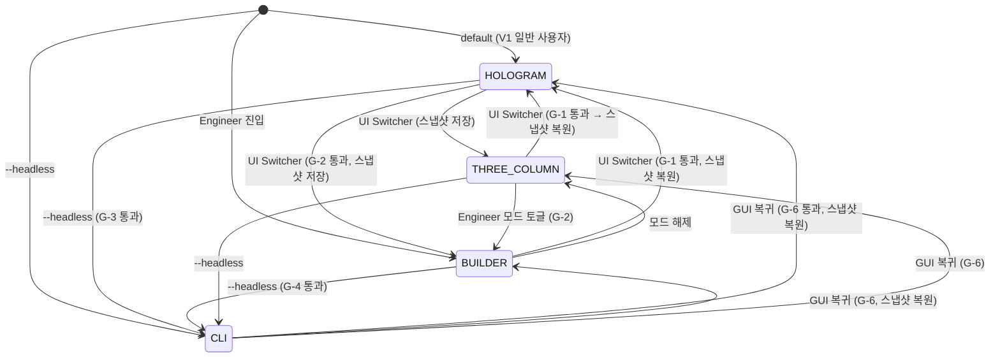
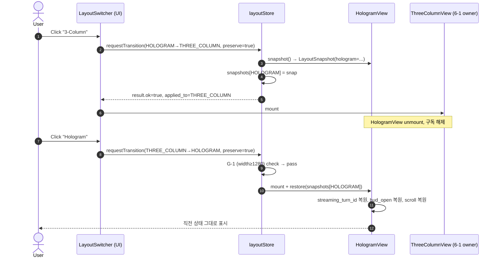
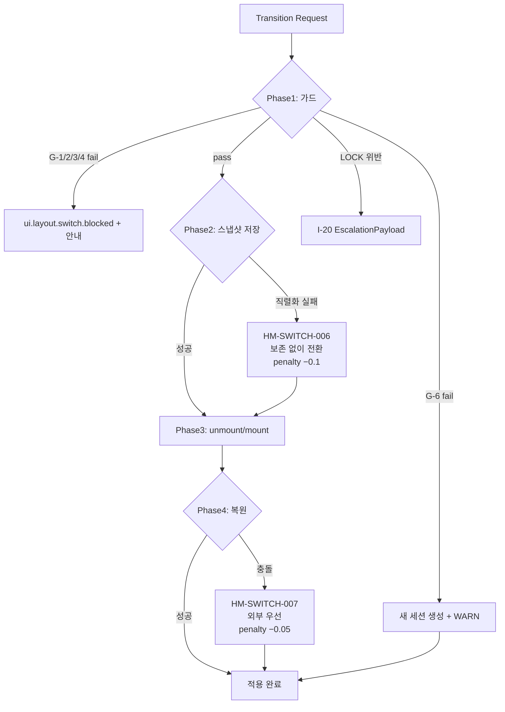

# layout_switching.md — 4-Layout 전환 프로토콜

> **출처**: D2.0-08 §2.1 (L151~, Builder), §2.2 (L223-282, Hologram), §2.3 (L286-309, CLI), §3 (L311-321, 공통), §3.1 (L326-329, V1 LOCK)
> **LOCK**: LOCK-HM-02 (4 Layout 구조 — 3-Column Fluid, Builder, Hologram, CLI), LOCK-HM-01 (Hologram View 3요소)
> **정본 소유**: 6-11 DEFINED-HERE (전환 프로토콜 — D2.0-08 은 Layout 종류만 LOCK)
> **세션**: Phase 1 T1-1
> **작성일**: 2026-04-14

---

## §0. 목적 & Scope

- **목적**: LOCK-HM-02 가 정의한 4-Layout(3-Column Fluid / Builder / Hologram / CLI) 간 **전환 트리거**, **상태 보존/복원 규칙**, **가드 조건**, **이벤트/로그** 를 명세한다. R-611-8 (Layout 전환 시 현재 상태 보존 원칙) 의 구현 정본.
- **Scope**:
  - In: 4-Layout 간 전이 트리거(사용자 액션/시스템 이벤트/CLI 명령), 전이 가드, 전환 시 보존되는 상태 카테고리, 복원 정책, LogEvent
  - Out (Phase 2): I-10 `emit_ui_state` 와의 매핑(T2-6), 9-State 와의 동기화 상세(T1-5), 단축키 바인딩(Phase 2 UX)
- **관련 이슈**: ISS-13 (Layout 전환 프로토콜 — 4-Layout 간 상태 보존/복원) — 본 문서에서 해소.

---

## §1. 교차 참조 블록

| 참조 문서 | 섹션 | 용도 |
|-----------|------|------|
| `D:\VAMOS\docs\sot\D2.0-08_08. VAMOS_DESIGN_2.0_UI_UX.md` | §2.1, §2.2, §2.3, §3 | 4-Layout 정본 (LOCK-HM-02) |
| `D:\VAMOS\docs\sot\D2.0-08_08. VAMOS_DESIGN_2.0_UI_UX.md` | §3.1 | V1 데스크톱 전용 (1280px) — 모바일 전환 V3 까지 금지 |
| `sot 2/6-11_Hologram-Main-LLM/01_hologram-view-layout/layout_structure.md` | §3 자료구조, §6 복구 흐름 | `UiLayout` 타입, 상태 스냅샷 구조 |
| `sot 2/6-11_Hologram-Main-LLM/01_hologram-view-layout/responsive_rules.md` | 전체 | 화면 크기 기반 자동 전환 가드 |
| `sot 2/6-11_Hologram-Main-LLM/HOLOGRAM_MAIN_LLM_구조화_종합계획서.md` | §4 R-611-8, §6.2 ISS-13 | 도메인 규칙 |
| `sot 2/6-1_UI-UX-System/` | (cross-domain) | 6-1 정본의 3-Column Layout — 본 문서는 6-11 관점의 Hologram 측 전환만 정의 |
| `sot 2/6-11_Hologram-Main-LLM/domain_boundary.md` | §2 (6-11 ↔ 6-1) | 3-Column 정본 소유는 6-1, 6-11 은 Hologram→3-Column 전환만 |

---

## §2. 4-Layout 정본 (LOCK-HM-02)

| Layout ID | 이름 | 정본 (D2.0-08) | 6-11 소유 여부 |
|-----------|------|----------------|----------------|
| `THREE_COLUMN` | 3-Column Fluid | §3 공통 / Builder의 §2.1.1 도 동일 골격 | 정본은 6-1 (cross-domain) |
| `BUILDER` | Builder View (The Cockpit) | §2.1 | 정본은 6-1 / 6-11 은 Hologram 전환 측만 |
| `HOLOGRAM` | Hologram View (The Experience) | §2.2 | **6-11 DEFINED-HERE** |
| `CLI` | CLI Terminal Interface | §2.3 | 정본은 별도 (6-11 은 trace_id 동기화만) |

> **R1 (LOCK 재정의 금지)**: 위 4종 외 Layout 추가/삭제 금지.

---

## §3. 공통 자료 구조 선정의

```ts
import type { UiLayout, HologramViewState } from './layout_structure';

// (재인용 — layout_structure.md §3)
// type UiLayout = 'HOLOGRAM' | 'BUILDER' | 'THREE_COLUMN' | 'CLI';

interface LayoutSnapshot {
  layout: UiLayout;
  taken_at: string;                // ISO-8601
  trace_id: string;
  scroll: { left:number; center:number; right:number };
  selection?: { kind:'turn'|'node'|'evidence'; id:string };
  panel_open: { left:boolean; right:boolean };
  // Hologram 전용
  hologram?: {
    streaming_turn_id?: string;
    hud_open: { evidence:boolean; cost:boolean; approval:boolean };
  };
  // Builder 전용
  builder?: {
    active_tab: 'Logs'|'Approval'|'Cost'|'Memory';
    graph_focus_node?: string;
  };
  // 3-Column 전용 (6-1 정본)
  three_column?: { active_pane: 'left'|'center'|'right' };
}

interface LayoutTransitionRequest {
  from: UiLayout;
  to: UiLayout;
  trigger: TransitionTrigger;
  trace_id: string;
  preserve: boolean;               // true = 스냅샷 저장 후 전환
}

type TransitionTrigger =
  | 'USER_LAYOUT_SWITCHER_CLICK'
  | 'KEYBOARD_SHORTCUT'            // Phase 2 확정
  | 'CLI_COMMAND'                  // vamos 명령
  | 'SYSTEM_AUTO_DOWNGRADE'        // 화면 너비 미달 등
  | 'SYSTEM_AUTO_UPGRADE'          // V3 모바일 → 복귀 등
  | 'APPROVAL_FORCED';             // Builder 승인 화면 강제 진입

interface LayoutTransitionResult {
  ok: boolean;
  applied_to: UiLayout;
  restored_from?: LayoutSnapshot;  // 복원 시
  error_code?: string;             // HM-SWITCH-XXX
}
```

---

## §4. 전이 매트릭스 (4×4)

> 행 = `from`, 열 = `to`. 셀 = 트리거 / 가드 / 보존 정책.

| from \ to | THREE_COLUMN | BUILDER | HOLOGRAM | CLI |
|-----------|--------------|---------|----------|-----|
| **THREE_COLUMN** | — (no-op) | UI Switcher / Permission=Engineer / 양측 스냅샷 보존 | UI Switcher / V1≥1280px / Hologram 직전 스냅샷 복원 (R-611-8) | CLI 환경 진입 / Headless 가능 / scroll 미보존 |
| **BUILDER** | UI Switcher / 항상 가능 / Builder 탭 보존 | — | UI Switcher / V1≥1280px / Builder 탭 보존 + Hologram 직전 스냅샷 복원 | CLI 명령 `vamos run` / Builder Approval 대기 시 차단 |
| **HOLOGRAM** | UI Switcher / 항상 가능 / **Hologram 스냅샷 저장 (R-611-8)** | UI Switcher / Permission=Engineer / **Hologram 스냅샷 저장** | — | CLI 환경 진입 / 스트리밍 진행 중 G-3: 전환 거부 또는 abort 후 진행 (사용자 선택) |
| **CLI** | CLI 종료 → GUI 복귀 / 직전 GUI 스냅샷 복원 | CLI 종료 → GUI 복귀 / 직전 Builder 스냅샷 복원 | CLI 종료 → GUI 복귀 / 직전 Hologram 스냅샷 복원 | — |

### §4.1 가드 조건 (정본)

| 가드 ID | 조건 | 위반 시 |
|---------|------|---------|
| **G-1** | `to=HOLOGRAM` 이면 화면 너비 ≥ 1280px (D2.0-08 §3.1 V1 LOCK) | `HM-SWITCH-001`, responsive_rules.md 안내 모달, 전환 거부 |
| **G-2** | `to=BUILDER` 이면 사용자 권한 = Engineer / Admin | `HM-SWITCH-002`, 권한 안내 토스트, 전환 거부 |
| **G-3** | `from=HOLOGRAM` 이고 streaming_turn 존재 → `to=CLI` 차단 | `HM-SWITCH-003`, "스트리밍 종료 후 전환" 안내, 전환 거부 또는 abort 후 진행 (사용자 선택) |
| **G-4** | `from=BUILDER` 이고 Approval Slide-in 미응답 → `to=CLI` 차단 | `HM-SWITCH-004`, Approval 처리 후 재시도 |
| **G-5** | `to=*` 시점에 진행 중인 Runtime Pipeline 단계가 S3=DECISION_LOCK (D2.0-08 §2.2.2 [D8-M02]) → 전환은 허용하되 스냅샷에 lock 표기 | 위반 아님 (운영 정책) |
| **G-6** | `from=CLI` → GUI 복귀 시 trace_id 동기화 (D2.0-08 §2.3.3) | `HM-SWITCH-005`, trace_id 미일치 시 새 세션 생성 + 경고 로그 |

---

## §5. 상태 보존/복원 규칙 (R-611-8 정본)

### §5.1 보존 카테고리

| # | 카테고리 | Hologram | Builder | 3-Column | CLI |
|---|----------|----------|---------|----------|-----|
| 1 | 활성 trace_id / session_id | ✅ | ✅ | ✅ | ✅ (동기화) |
| 2 | Runtime Pipeline 진행 단계 (D2.0-08 §2.2.2 [D8-M02]: RECEIVED~DONE, S0~S8) + UI State Machine 단계 (LOCK-HM-03: UI_S0_BOOT~UI_S8_ARCHIVED) | ✅ | ✅ | ✅ | ✅ |
| 3 | 스크롤 위치 (left/center/right) | ✅ | ✅ | ✅ | ❌ |
| 4 | 패널 접힘/펼침 | ✅ | ✅ | ✅ | n/a |
| 5 | Stream turns / Artifact 인라인 | ✅ | n/a (참조) | n/a | 텍스트 출력만 |
| 6 | Glass HUD 카드 open 상태 | ✅ | n/a (탭으로 매핑) | n/a | n/a |
| 7 | Builder 활성 탭 (Logs/Approval/Cost/Memory) | n/a | ✅ | n/a | n/a |
| 8 | 그래프 포커스 노드 | n/a | ✅ | n/a | n/a |
| 9 | 입력창 입력 중 텍스트 | ✅ (자동저장) | ✅ | ✅ | ❌ |
| 10 | Cost 다운시프트 모드 (V0~V3) | ✅ | ✅ | ✅ | ✅ |

### §5.2 복원 정책

- **stack 기반**: 각 GUI Layout 별 최근 1개 스냅샷 유지 (`Map<UiLayout, LayoutSnapshot>`).
- **TTL**: 세션 종료 시 만료. 세션 내에서는 무제한.
- **충돌 시**: 외부 이벤트(I-10 emit_ui_state) 가 스냅샷보다 신규이면 외부 이벤트 우선, 스냅샷은 폐기 + 경고 로그.
- **Hologram → 3-Column → Hologram** 시 §5.1 의 1~6, 9, 10 전수 복원 (R-611-8).
- **CLI → GUI 복귀** 시 trace_id 일치 확인(G-6) 후 직전 GUI 스냅샷 복원.

---

## §6. 전이 흐름도 (Mermaid)

### §6.1 4-Layout 상태 다이어그램



### §6.2 Hologram → 3-Column → Hologram 시퀀스 (R-611-8 핵심)



---

## §7. LogEvent 매핑

| 트리거 | event_type | payload 핵심 |
|--------|------------|--------------|
| 사용자 Switcher 클릭 | `ui.layout.switch.requested` | from, to, trigger="USER_LAYOUT_SWITCHER_CLICK", trace_id |
| 가드 통과 후 적용 | `ui.layout.switch.applied`   | from, to, trace_id, snapshot_id |
| 스냅샷 저장 | `ui.layout.snapshot.saved`   | layout, snapshot_id, ts |
| 스냅샷 복원 | `ui.layout.snapshot.restored`| layout, snapshot_id, ts |
| 가드 거부 | `ui.layout.switch.blocked`   | from, to, guard_id, reason |
| CLI 동기화 (D2.0-08 §2.3.3) | `ui.cli.session.synced`      | trace_id, layout_to_restore |

---

## §8. 예외 처리 정책 표

| error_code | 발생 지점 | recoverable | 처리 |
|------------|-----------|-------------|------|
| `HM-SWITCH-001` | G-1 위반 (너비 <1280px) | ✅ | responsive_rules.md 안내 모달, `to=THREE_COLUMN` 권유 |
| `HM-SWITCH-002` | G-2 위반 (권한 부족) | ✅ | 토스트 안내, 전환 거부 |
| `HM-SWITCH-003` | G-3 위반 (스트리밍 중 → CLI) | ✅ | "abort & switch" / "wait" 사용자 선택 |
| `HM-SWITCH-004` | G-4 위반 (Approval 미응답) | ✅ | Approval 처리 유도 |
| `HM-SWITCH-005` | G-6 위반 (CLI→GUI trace_id 불일치) | ⚠️ | 새 세션 생성 + WARN 로그, 사용자 알림 |
| `HM-SWITCH-006` | 스냅샷 직렬화 실패 | ✅ | 보존 없이 전환 (frosted state), 다음 세션은 default 진입 |
| `HM-SWITCH-007` | 복원 시 외부 이벤트와 충돌 | ✅ | 외부 우선, 스냅샷 폐기 + 로그 |
| `HM-SWITCH-008` | LOCK-HM-02 위반 (정의되지 않은 layout 요청) | ❌ | I-20 에스컬레이션 (R1 위반) |

---

## §9. Phase 별 복구 흐름도



### §9.1 다운그레이드 confidence penalty 표

| 원인 | 적용 대상 | penalty |
|------|-----------|---------|
| 스냅샷 직렬화 실패 (HM-SWITCH-006) | 다음 복원 | −0.1 |
| 복원 충돌 (HM-SWITCH-007) | 해당 layout 신뢰 | −0.05 |
| trace_id 미일치 (HM-SWITCH-005) | 세션 연속성 | −0.2 (새 세션) |

### §9.2 EscalationPayload 구조 (LOCK 위반 시)

```python
@dataclass
class LayoutEscalationPayload:
    source_engine: str = "6-11_layout_switching"
    error_code: str                  # HM-SWITCH-008
    original_request: dict           # LayoutTransitionRequest
    partial_result: dict             # 직전 LayoutSnapshot
    retry_count: int
    timestamp: str
    trace_id: str
    locked_layouts: list             # ['THREE_COLUMN','BUILDER','HOLOGRAM','CLI']
```

---

## §10. 로깅 포맷 (R-01-7 structured JSON)

```json
{
  "trace_id": "tr_2026-04-14_a1b2c3",
  "event_type": "ui.layout.switch.applied",
  "timestamp": "2026-04-14T06:14:02Z",
  "error": null,
  "context": {
    "from": "HOLOGRAM",
    "to": "THREE_COLUMN",
    "trigger": "USER_LAYOUT_SWITCHER_CLICK",
    "guard_results": { "G-1":"pass","G-2":"n/a","G-3":"pass" },
    "snapshot_id": "snap_h_0042"
  },
  "recovery": {
    "strategy": "NONE",
    "snapshot_saved": true,
    "snapshot_restored": false,
    "penalty_delta": 0.0,
    "escalated": false
  }
}
```

---

## §11. Phase 2 통합 테스트 시나리오 (10건 이상)

| # | 시나리오 | 주입 방법 | 기대 결과 |
|---|----------|-----------|-----------|
| S-01 | Hologram → 3-Column 정상 전환 | UI Switcher 클릭, 너비 1440 | snapshot 저장, 3-Column mount, `ui.layout.switch.applied` |
| S-02 | 3-Column → Hologram 복원 | Switcher 재클릭 | Hologram 직전 turns/scroll/hud_open 모두 복원 (R-611-8) |
| S-03 | G-1 위반 — 너비 1100 | Window resize 후 → Hologram 시도 | `HM-SWITCH-001`, 안내 모달, 전환 거부 |
| S-04 | G-2 위반 — 일반 사용자 → Builder | Permission=User | `HM-SWITCH-002`, 토스트 |
| S-05 | G-3 위반 — 스트리밍 중 → CLI | streaming_turn 활성 상태에서 CLI 진입 | `HM-SWITCH-003`, "abort & switch" / "wait" 다이얼로그 |
| S-06 | G-4 위반 — Approval 대기 중 → CLI | Builder Approval Slide-in 미처리 | `HM-SWITCH-004`, Approval 처리 유도 |
| S-07 | CLI → Hologram trace_id 동기화 | `vamos run` 후 GUI 복귀 | G-6 통과, Hologram 스냅샷 복원, `ui.cli.session.synced` |
| S-08 | CLI → Hologram trace_id 미일치 | 다른 trace_id 로 GUI 진입 | `HM-SWITCH-005`, 새 세션, WARN 로그 |
| S-09 | 스냅샷 직렬화 실패 (대용량 turns) | turns 10000개 시뮬레이션 | `HM-SWITCH-006`, 보존 없이 전환, penalty −0.1 |
| S-10 | 복원 충돌 (외부 이벤트 우선) | 복원 직전 I-10 emit_ui_state 신규 수신 | 외부 우선 적용, 스냅샷 폐기, `HM-SWITCH-007` 로그 |
| S-11 | LOCK 위반 — 정의되지 않은 layout 'AR_OVERLAY' 요청 | 코드 버그 시뮬 | `HM-SWITCH-008`, I-20 에스컬레이션 |
| S-12 | Hologram → Builder → Hologram 왕복 | 양 방향 2회 전환 | 양측 스냅샷 모두 보존/복원, 9-State 단계 유지 |
| S-13 | Runtime Pipeline S3=DECISION_LOCK 중 전환 | DECISION_LOCK 단계에서 Switcher 클릭 | 전환 허용, 스냅샷에 `lock=true` 표기 (G-5) |
| S-14 | Cost 다운시프트 V1→V2 보존 | Hologram V2 → 3-Column → Hologram | cost_mode=V2 복원 (§5.1 #10) |
| S-15 | 입력 중 텍스트 보존 | 입력창 "draft text" → 전환 → 복귀 | 입력 텍스트 그대로 복원 |

---

## §12. 검증 체크리스트

- [x] `layout_switching.md` 에 4-Layout 간 전이 트리거(§4 매트릭스, §6 다이어그램) 명시
- [x] 상태 유지(보존/복원) 규칙 명시 (§5)
- [x] 정본 출처(D2.0-08 §2.1/§2.2/§2.3/§3) + LOCK-HM-01/02 태그 (§1)
- [x] R-611-8 (Layout 전환 시 상태 보존) 정본 구현 (§5.2, §6.2)
- [x] 가드 조건 (G-1~G-6) 명시 (§4.1)
- [x] LogEvent 매핑 (§7), 로깅 중첩 JSON (§10)
- [x] EscalationPayload (§9.2)
- [x] Phase 2 시나리오 15건 (§11)
- [x] ISS-13 해소 명시 (§0)

---

## §13. 세션 간 인터페이스 cross-check

| 상대 산출물 | 인터페이스 | 일치 |
|--------------|------------|------|
| `layout_structure.md` (동일 세션) | `UiLayout`, `HologramViewState`, R-611-8 | §3 에서 그대로 import / 정합 |
| `responsive_rules.md` (동일 세션) | 1280px V1 LOCK (§3.1), 화면 크기 가드 G-1 | 정합 (§4.1 G-1) |
| T1-5 `03_ui-state-machine/*` | **UI State Machine 9-State** (LOCK-HM-03: UI_S0_BOOT~UI_S8_ARCHIVED, D2.0-08 §4.1) — 전환 중 보존 | §5.1 #2 에서 Runtime Pipeline(D8-M02) 및 UI State Machine(LOCK-HM-03) 양쪽 모두 보존 대상 명시. 두 축은 별개 상태 머신(혼동 금지). 상태 이름·번호 정본 따름. |
| T2-6 `07_orchestration-layer/ui_state_mapping.md` | I-10 `emit_ui_state(trace_id, ui_state)` 가 layout 변경에 미치는 영향 | §5.2 충돌 시 외부 우선 규칙 — T2-6 에서 매핑 확정 |
| 6-1 (cross-domain) `3-Column Layout 정본` | THREE_COLUMN 의 mount/unmount 인터페이스 | 6-11 은 트리거/스냅샷만, 내부 렌더는 6-1 소관 (domain_boundary §2 정합) |
| CLI 측 (별도 도메인) | `vamos` 명령 ↔ `ui.cli.*` 이벤트 | D2.0-08 §2.3.3 그대로 인용 |

---

## §14. 변경 이력

| 일자 | 내용 |
|------|------|
| 2026-04-14 | 최초 작성 (Phase 1 T1-1 step 1) — ISS-13 해소, R-611-8 정본화 |
| 2026-04-14 | step 2 재검증 — §4.1 G-5 및 §5.1 #2, §11 S-13, §13 T1-5 cross-check 에서 Runtime Pipeline(D8-M02) 과 UI State Machine(LOCK-HM-03) 축을 명시적으로 구분 |
