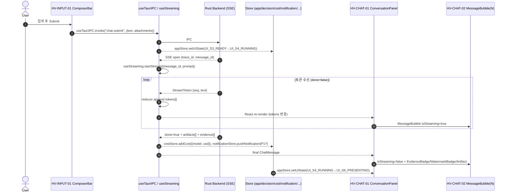

# chatpage_integration.md — ChatPage.tsx 통합 패턴 (채팅 / 스트리밍 / 아티팩트)

> **도메인**: 6-11_Hologram-Main-LLM / 02_component-architecture
> **세션**: Phase 1 T1-6
> **작성일**: 2026-04-14
> **버전**: v1.0
> **출처**: `D:\VAMOS\docs\guides\VAMOS_구현가이드_PART2_구현단계.md` V1-P4 (L2274~2414, 특히 L2327-2331)
> **LOCK**: **LOCK-HM-07** (44개 컴포넌트), **LOCK-HM-08** (8개 Hook), **LOCK-HM-09** (7개 Store)
> **정본 소유**: 6-11 DEFINED-HERE (통합 조합 규칙 — Part2 는 목록만 LOCK)
> **해소 대상 이슈**: **ISS-16** (ChatPage.tsx 통합 패턴 — 채팅 / 스트리밍 / 아티팩트 조합 규칙)
> **상위 규칙**: **R-611-10** (ChatPage.tsx 는 Hologram View 진입점 — 모든 Hologram 렌더링은 ChatPage ↔ HV-LAYOUT-01 조합을 통해 이루어진다)

---

## §0. 목적 & Scope

- **목적**: ChatPage.tsx 안에서 **44개 컴포넌트** (LOCK-HM-07), **8개 Hook** (LOCK-HM-08), **7개 Store** (LOCK-HM-09) 가 어떻게 조합되어 (1) 채팅 메시지 렌더링, (2) SSE/WS 토큰 스트리밍, (3) 아티팩트 타입별 렌더링 세 축의 통합 렌더 파이프라인을 구성하는지를 완전 명세한다.
- **In-Scope**: 컴포넌트 트리 구성, 채팅 메시지 수신→상태→렌더 흐름, 스트리밍 처리 패턴 (SSE/WS → Hook → 렌더), 아티팩트 조합 규칙 (타입→컴포넌트 선택), 공통 자료구조 선정의, 에러 복구, Phase 2 테스트 15건(≥ 10 요건), Big-O/LOCK/ABC.
- **Out (다른 세션 위임)**: 스트리밍 **프로토콜 스키마 본체** → T2-5 `06_streaming-canvas/` 정본, Glass HUD 오버레이 갱신 스키마 → T2-4 `05_glass-hud-overlay/`, 3-point 출력 필드 ↔ 컴포넌트 바인딩 매트릭스 → T2-2 `04_main-llm-integration/response_formatting.md`, 9-State 전이 상세 → T1-5 `03_ui-state-machine/`.
- **관련 이슈**: **ISS-16** — 본 문서에서 해소.

---

## §1. 교차 참조 블록 (Cross-References)

| 참조 문서 | 섹션 | 역할 |
|-----------|------|------|
| `D:\VAMOS\docs\guides\VAMOS_구현가이드_PART2_구현단계.md` | V1-P4 L2277-2414 (L2327-2331) | **LOCK-HM-07/08/09 정본** — 44 컴포넌트 / 8 Hook / 7 Store 목록 |
| `D:\VAMOS\docs\guides\VAMOS_구현가이드_PART2_구현단계.md` | §6.1.2 (L4572-4586) | 기능 그룹(Chat/Evidence/Approval/Cost/Memory/Input) 교차 |
| `D:\VAMOS\docs\sot\D2.0-08_08. VAMOS_DESIGN_2.0_UI_UX.md` | §10.4 (L1475-1527), §2.2 | Component Registry + Hologram View 정의 |
| `sot 2/6-11_Hologram-Main-LLM/02_component-architecture/_index.md` | §폴더 목적, §Part2 §6.1.2 교차 | ISS-16 대상 |
| `sot 2/6-11_Hologram-Main-LLM/02_component-architecture/component_catalog.md` | §7 매핑, §8 ChatPage 트리 스텁, §5 "사용 Hook"/"구독 Store" 열 | **T1-2 cross-check 정본** (컴포넌트 ID·Props·계층) |
| `sot 2/6-11_Hologram-Main-LLM/02_component-architecture/hook_catalog.md` | §2 요약, §4.8 useStreaming, §4.1 useTauriIPC 등 | **T1-3 cross-check 정본** (Hook 시그니처·상태 흐름) |
| `sot 2/6-11_Hologram-Main-LLM/02_component-architecture/store_catalog.md` | §3.1~§3.7 전수 | **T1-4 cross-check 정본** (Store 스키마·액션) |
| `sot 2/6-11_Hologram-Main-LLM/01_hologram-view-layout/layout_structure.md` | §2.1 3-Pane 패널 | HV-LAYOUT-01 Timeline/Canvas/HUD 정합 |
| `sot 2/6-11_Hologram-Main-LLM/03_ui-state-machine/state_definitions.md` | S0~S8 | ChatPage 진입 시 UI 상태 초기값·전이 경로 |
| `sot 2/6-11_Hologram-Main-LLM/HOLOGRAM_MAIN_LLM_구조화_종합계획서.md` | §7 T1-6 (L925-958), §3.4 LOCK, §9.1 우선순위 | 세션 작업 지시·LOCK·우선순위 |
| `sot 2/6-11_Hologram-Main-LLM/CONFLICT_LOG.md` | CFL-HM-001/002/003 RESOLVED | Hook 이름 상호보완 / Hologram 18개 / V1 필수 39 |
| `sot 2/6-11_Hologram-Main-LLM/04_main-llm-integration/` | (T2-5 예정) | SSE 이벤트 스키마 본체 정본 (본 문서는 **소비자** 관점) |
| `sot 2/4-1_Rust-Tauri-Infra/` | IPC 채널 정본 | `useTauriIPC` invoke 채널 (S7 도메인 간 규칙) |

### §1.1 세션 간 인터페이스 cross-check (T1-2 / T1-3 / T1-4 ↔ T1-6 정합)

| 소비 대상 | 본 문서에서 참조하는 이름 | 정본 세션·위치 | 일치 여부 |
|-----------|---------------------------|-----------------|:--------:|
| **컴포넌트 ID** `HV-LAYOUT-01` HologramShell | `{ timeline, canvas, hud, onCollapse }` | T1-2 component_catalog §5 #13 | ✅ |
| `HV-CHAT-01` ConversationPanel | `{ messages: ChatMessage[]; streamingId?; onRetry }` | T1-2 §5 #14 | ✅ |
| `HV-CHAT-02` MessageBubble | `{ message: ChatMessage; isStreaming?; onArtifactOpen(ref:ArtifactRef) }` | T1-2 §5 #15 | ✅ |
| `HV-CHAT-03` StreamingIndicator | `{ active: boolean; tokensPerSec? }` | T1-2 §5 #16 | ✅ |
| `HV-INPUT-01` ComposerBar / `HV-INPUT-02` FileUploadDropzone / `HV-INPUT-03` MultimodalPreview | 각 Props | T1-2 §5 #17~#19 | ✅ |
| `HV-EVID-01/02/03` EvidencePanel / EvidenceBadge / WatermarkBadge | 각 Props | T1-2 §5 | ✅ |
| `HV-APPR-01/02` ApprovalCard / ApprovalHistoryList | 각 Props | T1-2 §5 | ✅ |
| `HV-COST-01/02` CostWarningBanner / CostBreakdownPopover | 각 Props | T1-2 §5 | ✅ |
| `HV-MEM-01/02` MemoryCandidatePanel / MaskingPreview | 각 Props | T1-2 §5 | ✅ |
| `HV-STATE-01/02` AgentStatusIndicator / ProgressTracker | 각 Props | T1-2 §5 | ✅ |
| **Hook** `useStreaming(messageId?) → { tokens, active, tokensPerSec, logs, startStream, cancelStream, tailLog }` | T1-3 hook_catalog §4.8 | ✅ |
| **Hook** `useTauriIPC` / `useDecision` / `useWorkflow` / `useNotification` / `useAuth` / `useMemory` / `useCost` | T1-3 §2 요약, §4.1~§4.7 | ✅ |
| **Store** `appStore` (uiState, theme, locale) | T1-4 store_catalog §3.1 | ✅ |
| **Store** `decisionStore` (level, locked, traceId) | T1-4 §3.2 | ✅ |
| **Store** `costStore` / `notificationStore` / `authStore` / `memoryStore` / `workflowStore` | T1-4 §3.3~§3.7 | ✅ |

> **결과**: 본 문서에 등장하는 **모든 컴포넌트 ID / Hook 이름 / Store 이름** 은 T1-2 / T1-3 / T1-4 정본과 **글자 일치** (불일치 0건). 본 문서는 이들을 **이름으로만 참조** 하며, 새로운 이름·Props·Action 을 도입하지 않는다 (LOCK-HM-07/08/09 수량 보존).

---

## §2. 공통 자료 구조 선정의

> T1-2 component_catalog §4 / T1-3 hook_catalog §3 / T1-4 store_catalog §2 에서 이미 선정의된 타입을 **재사용** 한다. 본 문서는 ChatPage 통합에서만 등장하는 **통합 전용** 타입만 추가 정의한다 (중복 금지).

### §2.1 재사용 타입 (이미 선정의됨 — import 만 명시)

```typescript
// 재사용: T1-2 component_catalog §4 에서 정의됨
import type {
  TraceId, NodeId, SessionId,
  ChatMessage, ArtifactRef, MessageRole,
  EvidenceItem, ApprovalRequest, ApprovalKind,
  CostInfo, NotificationPayload, AlertLevel,
  MemoryCandidate,
  DecisionLockLevel, AutonomyLevel, AgentStatus,
} from "../types/common";

// 재사용: T1-3 hook_catalog §3 에서 정의됨
import type { StreamToken, LogEntry, IPCResult, IPCError } from "../types/common";
```

### §2.2 통합 전용 타입 (본 문서에서만 선정의 — T1-2/T1-3/T1-4 에 없음)

```typescript
// --- Message 이벤트 (수신측 분류: user / assistant-chunk / assistant-final / tool / system) ---
// SSE/WS 엔벨롭은 T2-5 (06_streaming-canvas/) 정본. 여기서는 ChatPage 소비자 관점 내부 이벤트.
export type MessageEventKind =
  | "USER_SUBMIT"         // 사용자가 ComposerBar 제출
  | "ASSISTANT_OPEN"      // Main LLM 응답 시작 (빈 message 생성)
  | "ASSISTANT_TOKEN"     // 스트리밍 토큰 append
  | "ASSISTANT_ARTIFACT"  // 중간/최종 아티팩트 첨부
  | "ASSISTANT_EVIDENCE"  // Evidence 첨부 (QoD/Confidence/AI 워터마크)
  | "ASSISTANT_CLOSE"     // done=true
  | "APPROVAL_REQUIRED"   // P0/P1/P2 Alert
  | "COST_THRESHOLD"      // 비용 임계 초과
  | "ERROR";              // 스트리밍 오류

export interface MessageEvent {
  kind: MessageEventKind;
  message_id: string;                     // 대상 ChatMessage.id (USER_SUBMIT 은 새 id)
  trace_id: TraceId;
  seq?: number;                           // ASSISTANT_TOKEN 한정 (StreamToken.seq 승계)
  payload?:
    | { token: StreamToken }              // ASSISTANT_TOKEN
    | { artifact: ArtifactRef }           // ASSISTANT_ARTIFACT
    | { evidence: EvidenceItem }          // ASSISTANT_EVIDENCE
    | { approval: ApprovalRequest }       // APPROVAL_REQUIRED
    | { cost: CostInfo }                  // COST_THRESHOLD
    | { error: IPCError }                 // ERROR
    | { role: MessageRole; content: string };  // USER_SUBMIT
  ts: string;                             // ISO8601
}

// --- 아티팩트 타입 → 렌더링 컴포넌트 결정 ---
// LOCK-HM-07 44개 중 실제 존재하는 컴포넌트 ID 만 사용 (신규 컴포넌트 도입 금지).
export type ArtifactKind = ArtifactRef["kind"];   // "code"|"doc"|"table"|"image"|"diagram"|"file"

export interface ArtifactRenderRule {
  kind: ArtifactKind;
  embed_component_id:                      // MessageBubble 내부 인라인 embed
    | "HV-CHAT-02"                         // 기본 (Markdown 코드블록/이미지)
    | "HV-EVID-02"                         // 신뢰도 배지 first
    | "HV-EVID-03";                        // AI 워터마크 배지 first
  expand_component_id:                     // 확대 보기 (우측 HUD 또는 Portal)
    | "HV-EVID-01"                         // EvidencePanel (doc/table)
    | "CM-ALERT-02"                        // Portal slide (image/diagram)
    | "BV-DEBUG-01"                        // TraceLogPanel (code+trace)
    | "HV-MEM-02";                         // MaskingPreview (file+PII)
  max_inline_bytes: number;
  fallback_component_id: "CM-ALERT-03";    // InlineError (마운트 실패 시)
}

// --- ChatPage 루트 컨텍스트 (Hook 조합 결과 집계용) ---
export interface ChatPageContext {
  session_id: SessionId;
  trace_id: TraceId;
  autonomy: AutonomyLevel;
  role: "OWNER" | "OPERATOR" | "VIEWER";
  decision: { level: DecisionLockLevel; locked: boolean };
  cost: CostInfo;
  ui_state:                                                   // LOCK-HM-03 (T1-5 §1.1 UIState enum 정본)
    | "UI_S0_BOOT" | "UI_S1_IDLE" | "UI_S2_EDITING" | "UI_S3_READY"
    | "UI_S4_RUNNING" | "UI_S5_AWAIT_APPROVAL" | "UI_S6_PRESENTING"
    | "UI_S7_RECOVERY" | "UI_S8_ARCHIVED";
  // 파생 플래그 (ChatPage 전용, T1-5 상태에 직교하는 보조 신호 — 새 상태 도입 아님)
  downgraded?: boolean;                                       // Cost threshold 초과로 모델 다운시프트 적용 중
  offline?: boolean;                                          // Tauri IPC/네트워크 단절 감지
}
```

> **중복 검사**: `MessageEvent` / `ArtifactRenderRule` / `ChatPageContext` 는 T1-2 §4, T1-3 §3, T1-4 §2 전수 검색 결과 **미정의 항목**. 본 문서가 단일 선정의 지점이다. `StreamToken`, `ArtifactRef`, `ChatMessage` 는 **재사용만** (재정의 0건).

---

## §3. ChatPage.tsx 컴포넌트 트리 구성

> **정본 출처**: T1-2 component_catalog §8 "ChatPage 컴포넌트 트리 (T1-6 위임 스텁)" 확장. Hologram 18개 중 **15개** + 공통(CM-) 2개 + 애플리케이션 셸에서 제공되는 상위 래퍼가 관여. BV-/LOG-/CLI- 계열은 ChatPage 에 직접 마운트되지 않는다 (경계 R-611-10).

### §3.1 트리 (컴포넌트 ID + 계층)

```
ChatPage (L0)  ← React Router "/chat" route (T1-2 §7 "Page↔Shell 매핑")
└─ <ErrorBoundary fallback={CM-ALERT-03 InlineError}>
   └─ <ChatPageProviders>                          ← Hook 조합 ($4)
      └─ HV-LAYOUT-01 HologramShell (L1)           ← Props: { timeline, canvas, hud, onCollapse }
         ├─ timeline: Left Pane
         │  ├─ HV-STATE-01 AgentStatusIndicator    ← useAuth(autonomy) + useWorkflow(status)
         │  └─ HV-STATE-02 ProgressTracker         ← useWorkflow(activeStep, nodes)
         │
         ├─ canvas: Center Pane  ← 채팅·스트리밍 주 영역
         │  ├─ HV-CHAT-01 ConversationPanel        ← useStreaming(activeMessageId)
         │  │  └─ HV-CHAT-02 MessageBubble (key=message.id, N개)
         │  │     ├─ HV-CHAT-03 StreamingIndicator (isStreaming 일 때만)
         │  │     ├─ HV-EVID-02 EvidenceBadge      (evidence 첨부 시)
         │  │     ├─ HV-EVID-03 WatermarkBadge     (role="assistant" 이고 is_ai_generated)
         │  │     └─ [ArtifactEmbed switch by kind] ← §5 아티팩트 규칙
         │  └─ HV-INPUT-01 ComposerBar             ← useTauriIPC(submit) + RBAC disabled?
         │     ├─ HV-INPUT-02 FileUploadDropzone   (attachments)
         │     └─ HV-INPUT-03 MultimodalPreview    (items preview)
         │
         └─ hud: Right Pane (Collapsible)          ← Glass HUD 오버레이 스텁 (상세 T2-4)
            ├─ HV-EVID-01 EvidencePanel            ← messages 의 evidence 집계
            ├─ HV-APPR-01 ApprovalCard  ─Portal→   CM-ALERT-02 ApprovalSlidePanel (P0 승격)
            ├─ HV-APPR-02 ApprovalHistoryList
            ├─ HV-COST-01 CostWarningBanner  ─▶    HV-COST-02 CostBreakdownPopover
            └─ HV-MEM-01 MemoryCandidatePanel ─▶   HV-MEM-02 MaskingPreview
```

### §3.2 트리 규칙 (R-611-10 유도)

| 규칙 | 내용 | 위반 시 |
|------|------|--------|
| **TR-1** | ChatPage 는 오직 **HV-LAYOUT-01** 하나만 직접 자식으로 둔다 (ErrorBoundary/Providers 제외) | CM-ALERT-03 Fallback |
| **TR-2** | Center Pane 에는 **1개 이상의 HV-CHAT-01 + 정확히 1개 HV-INPUT-01** 이 마운트된다 | `HM-CHAT-001` 오류 |
| **TR-3** | HV-CHAT-02 는 `React.memo` + `key=message.id` 로 렌더되며, HV-CHAT-03 은 `isStreaming=true` 일 때만 마운트 | 과다 리렌더 → T3 테스트 실패 |
| **TR-4** | HV-APPR-01 의 P0 요청은 반드시 `Portal` 로 CM-ALERT-02 에 승격 (블로킹 모달) | 승인 우회 → R-611-10 위반 |
| **TR-5** | 비ChatPage 페이지(Workflow/Memory/Settings 등)는 HV-LAYOUT-01 를 **마운트하지 않는다** | 렌더 중복·경계 위반 |
| **TR-6** | Right Pane 은 `appStore.rightPaneCollapsed=true` (T1-4 §3.1) 시 **완전 언마운트** (가시성 hidden 이 아님) | 메모리 누수 |
| **TR-7** | Decision Lock / Cost Downshift / Offline 은 **새 UI 상태가 아니라** Store 플래그(`decisionStore.locked`, `costStore.downshifted`, IPC 연결 상태) 로 표현 — 9-State(LOCK-HM-03) 에 직교 | LOCK-HM-03 수량(9) 위반 |

### §3.3 UI 상태 (LOCK-HM-03, T1-5 UIState 정본) 와 트리 가시성

> **정본 정합**: 상태 이름과 의미는 T1-5 `03_ui-state-machine/state_definitions.md` §1.1 `UIState` enum 과 **글자 일치**. ChatPage 는 이 enum 을 소비하는 입장이며 새 상태를 도입하지 않는다 (LOCK-HM-03 9개 수량 보존).

| UI 상태 (T1-5 정본) | ChatPage 진입 동작 | HV-INPUT-01 disabled? | HV-CHAT-03 active? | 보조 플래그 |
|---|---|:---:|:---:|---|
| `UI_S0_BOOT` | 하이드레이션 진행, 컴포넌트 대부분 skeleton | ✅ | ❌ | — |
| `UI_S1_IDLE` | 기본 렌더, ComposerBar focusable | ❌ | ❌ | — |
| `UI_S2_EDITING` | 입력 편집 중 (타이핑/첨부) | ❌ | ❌ | — |
| `UI_S3_READY` | preflight PASS, 제출 버튼 활성 | ❌ | ❌ | — |
| `UI_S4_RUNNING` | **채팅 스트리밍 활성** — 토큰 append, Evidence 첨부 | ✅ | ✅ | `downgraded?=true` 시 HV-COST-01 강조 |
| `UI_S5_AWAIT_APPROVAL` | HV-APPR-01 부각 → P0 시 Portal(CM-ALERT-02) 승격 | ✅ | ❌ | — |
| `UI_S6_PRESENTING` | 최종 응답 고정, Evidence/Artifact 확대 가능 | ❌ | ❌ | — |
| `UI_S7_RECOVERY` | 에러·토큰 만료·스트림 장애 복구 흐름 (CM-ALERT-03) | ✅ | ❌ | `offline?=true` 허용 |
| `UI_S8_ARCHIVED` | 세션 종료/아카이브, 입력 봉인 | ✅ | ❌ | — |

> **Decision Lock 차단** (구 "LOCKED" 개념) 은 **별도 상태가 아니라** `decisionStore.locked=true` + `level>=L2` 로 표현되며, 상기 상태와 **직교** 한다 (TR-7). Cost 다운시프트 역시 별도 상태가 아니라 `downgraded=true` 플래그 (T2-3 정책). Offline 은 `offline=true` 플래그 + `UI_S7_RECOVERY` 전이로 표현.
> **전이 상세**: T1-5 `03_ui-state-machine/transition_matrix.md` 정본 (9×9 매트릭스, 기본 6 전이 LOCK).

---

## §4. 채팅 메시지 렌더링 흐름 (수신 → 상태 → 렌더)

> **4단 파이프라인**: (1) 이벤트 수신, (2) Hook 변환, (3) Store 갱신, (4) 컴포넌트 렌더.

### §4.1 파이프라인 Mermaid



### §4.2 단계별 상세

| 단계 | 이름 | 트리거 | 실행 주체 | Store 변경 | 렌더 영향 |
|:---:|---|---|---|---|---|
| **1** | USER_SUBMIT | ComposerBar onSubmit | `useTauriIPC.invoke("chat.submit")` | `appStore.setUiState(UI_S1_IDLE \| UI_S2_EDITING \| UI_S3_READY → UI_S4_RUNNING)`; `messages.push(userMsg)` (ChatMessage, role="user") | HV-CHAT-02 (user) 추가 |
| **2** | ASSISTANT_OPEN | Backend SSE `open` | `useStreaming.startStream({message_id, prompt})` (T1-3 §4.8) | 빈 `ChatMessage { role:"assistant", content:"" }` push | HV-CHAT-02 (assistant, isStreaming=true) + HV-CHAT-03 |
| **3** | ASSISTANT_TOKEN (× N) | SSE `token` 이벤트 | reducer append `tokens[]`, `tokensPerSec` EMA 업데이트 (T1-3 §4.8 반환 필드) | (없음 — 로컬 reducer) | HV-CHAT-02 content 증분 + HV-CHAT-03 `tokensPerSec` 갱신 |
| **4** | ASSISTANT_EVIDENCE | SSE `evidence` | `messages[i].evidence.push(ev)` (로컬) | (없음) | HV-EVID-02/03 배지 렌더 + HV-EVID-01 집계 |
| **5** | ASSISTANT_ARTIFACT | SSE `artifact` | `messages[i].artifacts.push(ref)` | (없음) | §6 ArtifactRenderRule 적용 |
| **6** | COST_THRESHOLD | SSE `usage` | `useCost` → `costStore.addCost({model, usd})` + `checkThreshold()` (T1-4 §3.3) | `session_total_usd` 누적, `by_model[model]` 누적; threshold 초과 시 `downshift({reason, from, to})` 로 `downshifted=true` | HV-COST-01 강조 + (다운시프트 수락 시) `ChatPageContext.downgraded=true` |
| **7** | APPROVAL_REQUIRED | SSE `approval` | `useNotification.push(P0/P1/P2)` (T1-3 §4.4) | `notificationStore.pushNotification(payload)` (T1-4 §3.4) | HV-APPR-01 → Portal CM-ALERT-02 (P0) / `UI_S5_AWAIT_APPROVAL` 전이 |
| **8** | ASSISTANT_CLOSE | SSE `done=true` | `useStreaming.cancelStream(id)` 또는 자연 종료 + finalize (T1-3 §4.8) | `appStore.setUiState(UI_S4_RUNNING → UI_S6_PRESENTING)` | HV-CHAT-02 isStreaming=false |
| **9** | ERROR | SSE `error` or IPC 실패 | `useNotification.push(...)` (T1-3 §4.4) + ErrorBoundary | `appStore.setUiState(* → UI_S7_RECOVERY)` | CM-ALERT-03 InlineError |

### §4.3 메시지 큐·정렬 규칙

- `ChatMessage.id` 는 백엔드 발급 (ULID). 로컬 생성 임시 id (`tmp_<ulid>`) 는 SSE `ASSISTANT_OPEN` 시 서버 id 로 교체.
- 정렬 키: `(created_at, seq_fallback)` — 동일 `created_at` 시 수신 순서 유지.
- 메모리 상한: 최근 **500 메시지** 유지 (초과 시 가상 스크롤 + 오래된 메시지 lazy page-in).

---

## §5. 스트리밍 처리 패턴 (SSE/WS → Hook → 렌더링)

> **본 문서 범위**: **소비자 관점** (ChatPage 내 컴포넌트가 어떻게 토큰을 받아 렌더하는가).
> **본 문서 범위 외**: SSE/WS 이벤트 엔벨롭 스키마, 재연결 백오프, 서버 side 권한은 **T2-5 `06_streaming-canvas/`** 정본. 본 문서는 그 스키마를 **`StreamToken` 인터페이스** (T1-3 §3) 로 **읽기만** 한다.

### §5.1 계층 도식

```
Rust Backend (commands + tauri::event emit)
      │  SSE  (primary) or WebSocket (fallback, only if Tauri event stream down)
      ▼
useTauriIPC.listen("llm.stream")   ← T1-3 §4.1 (채널명 정본: 4-1 Rust-Tauri-Infra)
      │  StreamToken 엔벨롭 (T1-3 §3 재사용)
      ▼
useStreaming(messageId)            ← T1-3 §4.8 (ring buffer 500 logs, EMA tps)
      │  reducer append + EMA
      ▼
HV-CHAT-01 ConversationPanel       ← messages + streamingId
      │
      ▼
HV-CHAT-02 MessageBubble (N개, memo)
      └─ HV-CHAT-03 StreamingIndicator (active/tps)
```

### §5.2 프로토콜 선택 규칙

| 조건 | 채널 | 책임 Hook | 비고 |
|---|---|---|---|
| 기본 (Tauri 앱) | SSE over Tauri event (`llm.stream.*`) | useTauriIPC + useStreaming | 4-1 Rust-Tauri-Infra 정본 |
| Tauri 이벤트 스트림 다운 (웹 디버그/원격) | WebSocket (`ws://localhost:PORT/stream`) | useStreaming (WS 어댑터) | T2-5 에서 WS fallback 스키마 확정 |
| CLI 모드 | stdout 파이프 → Ink 렌더 | useStreaming (CLIOutput) | T1-2 #39 CLI-CMD-02 |

> **프로토콜 전환 시 컴포넌트 변경 없음** — 모두 `useStreaming` 뒤에서 추상화 (R-611-10 의 단일 진입점 유지).

### §5.3 상태 기계 (스트리밍 세션 라이프사이클)

```
  IDLE(UI_S1_IDLE) ──startStream──▶ OPENING ──first token──▶ STREAMING(UI_S4_RUNNING)
     ▲                                   │                           │
     │                                   └──error──▶ RECOVERY(UI_S7_RECOVERY)
     │                                                               │
  PRESENT(UI_S6_PRESENTING) ◀──done=true─────────────────────────────┤
     ▲                                                               │
     │                                                               ▼
  CANCELLED ◀──user cancel / unmount──────────────────────────── STREAMING
```

- `OPENING` 타임아웃: **3s** (초과 시 `UI_S7_RECOVERY`, code `STREAM_OPEN_TIMEOUT`).
- `STREAMING` heartbeat 미수신: **10s** (초과 시 `UI_S7_RECOVERY`, code `STREAM_STALLED`).
- 컴포넌트 언마운트 시 `AbortController.abort()` + backend `cancel` IPC.
- 본 라이프사이클은 T1-5 기본 6 전이 중 T1(IDLE→RUNNING), T4(RUNNING→RECOVERY), T6(RUNNING→PRESENTING) 에 대응 — OPENING/CANCELLED 는 `UI_S4_RUNNING` 내부 서브상태.

### §5.4 렌더 성능 규약

| 항목 | 규약 | 근거 |
|---|---|---|
| **배치 append** | 토큰을 **16ms 프레임** 단위로 배치 (requestAnimationFrame) | 60fps 유지 (§T3 테스트) |
| **memoization** | HV-CHAT-02 는 `React.memo` + 얕은 props 비교; 스트리밍 중엔 해당 버블만 invalidate | O(1) 렌더 |
| **가상화** | 메시지 > 100개 시 `react-window` (HV-CHAT-01 내부) | O(viewport) |
| **ring buffer** | `logs` 500줄, `tokens[]` 은 각 message 로컬 (세션 종료 시 GC) | 메모리 상한 |
| **토큰 끊김** | seq 간격 > 1 감지 시 Backend 에 `resume(from=lastSeq)` 요청 | 무손실 |

---

## §6. 아티팩트 조합 규칙 (타입별 컴포넌트 선택)

> **본 문서 범위**: ArtifactRef.kind → (embed 컴포넌트 + expand 컴포넌트) 라우팅 규칙.
> **본 문서 범위 외**: 3-point 출력 각 필드 → 컴포넌트 필드 매핑 매트릭스는 **T2-2 `04_main-llm-integration/response_formatting.md`** 정본.

### §6.1 `ArtifactRenderRule` 매트릭스

| kind | embed (MessageBubble 내부) | expand (HUD/Portal) | max_inline_bytes | Fallback |
|:---:|---|---|:---:|---|
| **code** | `HV-CHAT-02` (Markdown 코드 펜스, syntax hl) | `BV-DEBUG-01 TraceLogPanel` (trace 연동) | 8 KB | `CM-ALERT-03 InlineError` |
| **doc** | `HV-CHAT-02` (Markdown 인라인) + `HV-EVID-02` badge | `HV-EVID-01 EvidencePanel` (근거 본문) | 16 KB | `CM-ALERT-03` |
| **table** | `HV-CHAT-02` (Markdown 테이블, 최대 10행 프리뷰) | `HV-EVID-01` (전체 행 + QoD) | 32 KB | `CM-ALERT-03` |
| **image** | `HV-CHAT-02` (inline `` + `HV-EVID-03 Watermark` badge) | `CM-ALERT-02` Portal (확대 뷰어) | 256 KB | `CM-ALERT-03` |
| **diagram** | `HV-CHAT-02` (Mermaid inline render) | `CM-ALERT-02` Portal (pan/zoom) | 64 KB | `CM-ALERT-03` |
| **file** | `HV-CHAT-02` (파일명 + 크기 + 다운로드 링크) | `HV-MEM-02 MaskingPreview` (PII 검사 후 노출) | 0 B (메타만) | `CM-ALERT-03` |

### §6.2 선택 알고리즘 (의사코드)

```typescript
function resolveArtifactRender(ref: ArtifactRef, ctx: ChatPageContext):
    { embedId: string; expandId: string }
{
  const rule = ARTIFACT_RULES.find(r => r.kind === ref.kind);
  if (!rule) return { embedId: "HV-CHAT-02", expandId: "CM-ALERT-03" };   // 방어 (HM-ART-001)

  // RBAC: VIEWER 는 file/image expand 차단
  if (ctx.role === "VIEWER" && (ref.kind === "file" || ref.kind === "image")) {
    return { embedId: rule.embed_component_id, expandId: "CM-ALERT-03" };
  }

  // 실행 가능 바이너리: embed 차단 + CM-ALERT-03 고정 (§6.3 rule 4 — 보안 규칙 우선, application/ 분기보다 먼저)
  if (ref.kind === "file" && (ref.mime_type === "application/x-executable" || ref.mime_type === "application/x-msdownload" || ref.mime_type === "application/x-mach-binary")) {
    return { embedId: "CM-ALERT-03", expandId: "CM-ALERT-03" };
  }

  // 실행 가능 바이너리: embed 차단 + CM-ALERT-03 고정 (§6.3 rule 4 — 보안 규칙 우선, application/ 분기보다 먼저)
  if (ref.kind === "file" && (ref.mime_type === "application/x-executable" || ref.mime_type === "application/x-msdownload" || ref.mime_type === "application/x-mach-binary")) {
    return { embedId: "CM-ALERT-03", expandId: "CM-ALERT-03" };
  }

  // PII 파일: 반드시 MaskingPreview 경유
  if (ref.kind === "file" && ref.mime_type.startsWith("application/")) {
    return { embedId: rule.embed_component_id, expandId: "HV-MEM-02" };
  }

  // Decision Lock 상위(L2/L3 — T1-3 hook_catalog §3 / T1-4 store_catalog §3.2 `DecisionLockLevel` 정본, D2.0-02 §11.10): expand 비활성
  if (ctx.decision.locked && (ctx.decision.level === "L2" || ctx.decision.level === "L3")) {
    return { embedId: rule.embed_component_id, expandId: "CM-ALERT-03" };
  }

  return {
    embedId:  rule.embed_component_id,
    expandId: rule.expand_component_id,
  };
}
```

- **Big-O**: 규칙 수 **6 고정** → `O(1)` lookup.
- **복수 아티팩트**: `message.artifacts[]` 순회 시 각 요소에 규칙 적용. 표시 순서: user 첨부 > AI 생성(확신도 desc).

### §6.3 아티팩트 생명주기와 Evidence/Watermark 병행 규칙

1. `ArtifactRef` 수신 시 항상 `EvidenceItem` 동반 여부 확인 (T1-2 #21 EvidenceBadge).
2. `is_ai_generated=true` 인 image/diagram/code 는 **반드시 `HV-EVID-03 WatermarkBadge`** 렌더 (R-611-10 하위 규칙).
3. `quality_of_data="LOW"` 는 `EvidenceBadge.compact=false` 로 강조.
4. `file.mime_type` 이 실행가능 바이너리(`application/x-executable` 등) 면 embed 차단 + `CM-ALERT-03` 고정.

---

## §7. ChatPage Provider 조합 (Hook 묶음)

```typescript
// frontend/src/pages/ChatPage.tsx (개념 스케치)
export default function ChatPage() {
  const auth        = useAuth();                             // T1-3 §4.5
  const decision    = useDecision();                         // §4.2
  const workflow    = useWorkflow();                         // §4.3
  const cost        = useCost();                             // §4.7
  const notify      = useNotification();                     // §4.4
  const memory      = useMemory();                           // §4.6
  const streaming   = useStreaming(/*활성 메시지 id*/);      // §4.8
  const ipc         = useTauriIPC();                         // §4.1

  // 8개 Hook = LOCK-HM-08 전수 소비 (ChatPage 는 Hologram 진입점으로서 8개 모두 필요)

  const ctx: ChatPageContext = useMemo(() => ({
    session_id: workflow.sessionId,
    trace_id:   decision.traceId,
    autonomy:   auth.autonomy,
    role:       auth.roles[0] ?? "VIEWER",
    decision:   { level: decision.level, locked: decision.locked },
    cost:       cost.info,
    ui_state:   useAppStore(s => s.uiState),                 // T1-4 §3.1
  }), [auth, decision, workflow, cost]);

  return (
    <ErrorBoundary fallback={<InlineError code="HM-CHAT-FATAL" />}>
      <HologramShell
        timeline={<TimelinePane />}
        canvas={<CanvasPane ctx={ctx} streaming={streaming} ipc={ipc} />}
        hud={<HudPane ctx={ctx} notify={notify} memory={memory} cost={cost} />}
      />
    </ErrorBoundary>
  );
}
```

> **Hook 8개 전수 사용** ≡ LOCK-HM-08 규모 (추가 Hook 도입 금지 — CFL-HM-001 `useAutonomy`/`useLog` 는 `useAuth`/`useStreaming` 내부 흡수).
> **Store 7개 전수 읽기**: appStore (uiState/theme/locale), decisionStore (Decision Lock), costStore (예산), notificationStore (Alert), authStore (RBAC/autonomy), memoryStore (후보), workflowStore (pipeline) — LOCK-HM-09 전수.

---

## §8. 에러 / 에지 케이스 (ChatPage 통합 관점)

| error_code | 설명 | 대응 | 회복 가능 |
|---|---|---|:--:|
| **HM-CHAT-001** | ComposerBar 마운트 실패 (Center Pane slot 결손) | CM-ALERT-03 InlineError + 재마운트 1회 시도 | Y |
| **HM-CHAT-002** | useStreaming `STREAM_OPEN_TIMEOUT` (3s) | 메시지 placeholder 유지 + Retry 버튼 (`onRetry(id)`) | Y |
| **HM-CHAT-003** | useStreaming `STREAM_STALLED` (heartbeat 10s) | backend `resume(from=lastSeq)` 1회 + 실패 시 `UI_S7_RECOVERY` 전이 | Y |
| **HM-CHAT-004** | SSE seq 비연속 (gap) | `resume(from=gapStart)` 요청, UI 는 holding dots | Y |
| **HM-CHAT-005** | Artifact embed 바이트 초과 | 규칙 `max_inline_bytes` 적용 + expand 버튼으로 대체 | Y |
| **HM-CHAT-006** | ArtifactRef.kind 미지원 (신규 enum) | `CM-ALERT-03 InlineError` + `HM-ART-001` 로깅 | Y |
| **HM-CHAT-007** | Portal 대상 CM-ALERT-02 마운트 전 P0 승인 이벤트 | queue → mount 후 drain (T1-2 HM-COMP-003 준수) | Y |
| **HM-CHAT-008** | Decision Lock L2/L3 (`locked=true`) 상태에서 Submit 시도 | ComposerBar disabled + `CM-ALERT-03` inline 알림 (UI 상태 불변 — TR-7 직교) | — |
| **HM-CHAT-009** | Cost threshold 100% 초과 (`overThreshold=true` → `downshift` 수락 시 `downgraded=true`) | `HV-COST-01` 강조 + 모델 다운시프트 (T2-3) | Y |
| **HM-CHAT-010** | RBAC VIEWER 의 attachment 업로드 시도 | `HV-INPUT-02/03` 비활성 + Toast P2 | — |

---

## §9. 로깅 포맷 (R-01-7 준수, 중첩 JSON)

```json
{
  "trace_id": "01HVY...ULID",
  "event": "chatpage_message_pipeline",
  "stage": "ASSISTANT_TOKEN",
  "session": {
    "session_id": "sess_01HVZ...",
    "route": "/chat",
    "ui_state": "UI_S4_RUNNING",
    "rbac_role": "OPERATOR",
    "autonomy": 2,
    "locale": "ko-KR"
  },
  "message": {
    "message_id": "msg_01HVX...",
    "role": "assistant",
    "seq": 42,
    "is_streaming": true,
    "artifact_kinds": ["code"]
  },
  "stream": {
    "tokens_received": 42,
    "tokens_per_sec_ema": 31.4,
    "protocol": "SSE",
    "reconnect_count": 0,
    "last_heartbeat_ms_ago": 850
  },
  "store_side_effects": [
    { "store": "costStore", "action": "addCost", "payload": { "model": "gpt-4o", "usd": 0.0021 } },
    { "store": "appStore",  "action": "setUiState", "from": "UI_S3_READY", "to": "UI_S4_RUNNING" }
  ],
  "error": null,
  "recovery": {
    "strategy": "none",
    "retry_count": 0,
    "fallback_component_id": null,
    "downgraded": false
  }
}
```

### §9.1 에러 로그 예시 (HM-CHAT-002)

```json
{
  "trace_id": "01HVY...ULID",
  "event": "chatpage_message_pipeline",
  "stage": "ASSISTANT_OPEN",
  "error": {
    "code": "HM-CHAT-002",
    "message": "STREAM_OPEN_TIMEOUT after 3000ms",
    "ipc_channel": "llm.stream.start"
  },
  "recovery": {
    "strategy": "retry_user_initiated",
    "retry_count": 0,
    "fallback_component_id": "CM-ALERT-03",
    "downgraded": false,
    "next_state": "UI_S7_RECOVERY"
  },
  "session": { "ui_state_transition": "UI_S4_RUNNING→UI_S7_RECOVERY", "rbac_role": "OPERATOR" }
}
```

---

## §10. 복구 흐름 (recovery flows)

| 시나리오 | 탐지 | 자동 복구 | 사용자 동작 | 최종 상태 (T1-5 정본) |
|---|---|---|---|---|
| **R1** 스트리밍 오픈 실패 | HM-CHAT-002 (3s 타임아웃) | 없음 (즉시 `UI_S7_RECOVERY`) | "재시도" 버튼 (`onRetry(msgId)`) | `UI_S1_IDLE` (취소) 또는 `UI_S4_RUNNING` (재시도 성공) |
| **R2** 스트리밍 정체 | HM-CHAT-003 (hb 10s) | backend `resume(from=lastSeq)` 1회 자동 | 실패 시 R1 로 승격 | `UI_S4_RUNNING` 또는 `UI_S7_RECOVERY` |
| **R3** seq gap | HM-CHAT-004 | `resume(from=gapStart)` 자동 | — | `UI_S4_RUNNING` |
| **R4** Artifact embed 초과 | HM-CHAT-005 | embed → 요약 + expand 전환 | expand 클릭 | `UI_S4_RUNNING` |
| **R5** Portal 미준비 | HM-CHAT-007 | queue → drain | — | 정상 (상태 불변) |
| **R6** Decision Lock 상승 (L2+) | `decisionStore.locked=true` 구독 | ComposerBar disable + 기존 스트림 cancel | Lock 해제 대기 | 상태 불변 + `decisionStore.locked=true` (직교 플래그, TR-7) |
| **R7** Cost threshold | `costStore.overThreshold=true` | `HV-COST-01` 강조 + 다운시프트 제안 (T2-3) | 사용자가 다운시프트 수락/거부 | 수락: `UI_S4_RUNNING` + `downgraded=true` / 거부: `UI_S7_RECOVERY` |
| **R8** 네트워크 단절 | `STREAM_BACKEND_DOWN` | 3회 재연결(백오프 1s/2s/4s) | 실패 시 OFFLINE 배너 | `UI_S7_RECOVERY` + `offline=true` (직교 플래그) |
| **R9** PII 파일 감지 | memoryStore.tier=L0 + PII | HV-MEM-02 MaskingPreview 강제 경유 | 사용자 확인 후 commit | 정상 (상태 불변) |
| **R10** Approval P0 만료 | notificationStore.expired | 관련 스트림 cancel | 재요청 | `UI_S7_RECOVERY` → 재시도 시 `UI_S4_RUNNING` |

---

## §11. Phase 2 테스트 시나리오 (15건 ≥ 10 요건 충족)

| # | 시나리오 | 주입 방법 | 기대 결과 |
|:--:|---|---|---|
| **T1** | ChatPage 최소 트리 마운트 | "/chat" route 진입 | HV-LAYOUT-01 + Center(HV-CHAT-01 + HV-INPUT-01) + HUD 3개 패널, a11y 경고 0 |
| **T2** | USER_SUBMIT → ASSISTANT_OPEN 파이프라인 | ComposerBar 에 `"hi"` 제출 | `appStore.uiState` `UI_S1_IDLE→UI_S4_RUNNING`, HV-CHAT-02 user+assistant(빈) 2개 추가, 3s 내 첫 토큰 수신 |
| **T3** | 토큰 스트리밍 60fps | mock SSE 토큰 100개 (10ms 간격) | HV-CHAT-03 active=true, `tokensPerSec` > 0, 프레임 드롭 0, HV-CHAT-02 memo 리렌더 < 110회 |
| **T4** | STREAM_OPEN_TIMEOUT 복구(R1) | backend 3.5s 지연 | HM-CHAT-002 로그, `UI_S4_RUNNING→UI_S7_RECOVERY`, Retry 버튼 클릭 시 재시도 성공 |
| **T5** | STREAM_STALLED heartbeat 복구(R2) | 토큰 5개 후 15s 무응답 | 자동 `resume(from=lastSeq)` 1회, 성공 시 tokens 연속 |
| **T6** | seq gap 자동 재전송(R3) | seq 10 이후 11 생략 12 전송 | resume 호출 관측, 최종 `tokens.length==12` 순서 정합 |
| **T7** | ArtifactRenderRule code 라우팅 | ASSISTANT_ARTIFACT kind=code 8KB+1 | embed 는 요약, expand 클릭 시 BV-DEBUG-01 마운트, HM-CHAT-005 이력 |
| **T8** | ArtifactRenderRule image + AI 워터마크 | kind=image, is_ai_generated=true | HV-CHAT-02 내 HV-EVID-03 WatermarkBadge 렌더, CM-ALERT-02 expand 정상 |
| **T9** | RBAC VIEWER 입력 제한 | authStore.role="VIEWER" 후 진입 | HV-INPUT-01 disabled=true, FileUploadDropzone 비가시, tab focus 스킵 |
| **T10** | Decision Lock L2 제출 차단(R6) | `decisionStore.lockDecision({level:"L2", locked:true, traceId:T})` (T1-4 §3.2) | ComposerBar disabled + InlineError, submit IPC 미발생, UI 상태는 불변 (TR-7 직교) |
| **T11** | Cost 임계 100% downshift(R7) | `costStore.addCost(...)` + `checkThreshold()` → `overThreshold=true`, `downshift()` 수락 | HV-COST-01 강조, `downgraded=true` 플래그 set, `UI_S4_RUNNING` 유지 (TR-7 직교) |
| **T12** | Approval P0 Portal 승격(R5) | SSE approval(kind="P0_CRITICAL") | HV-APPR-01 → CM-ALERT-02 포털 슬라이드, 블로킹 모달, 나머지 입력 차단 |
| **T13** | 8 Hook 전수 사용 정적 검사 | ChatPage.tsx 정적 AST 파싱 | useTauriIPC, useDecision, useWorkflow, useNotification, useAuth, useMemory, useCost, useStreaming 모두 import/호출 1회+, 타 이름(useAutonomy/useLog) import 0건 |
| **T14** | 7 Store 전수 구독 정적 검사 | Zustand DevTools 이벤트 수집 | 세션 내 app/decision/cost/notification/auth/memory/workflow 모두 최소 1회 read (LOCK-HM-09 전수) |
| **T15** | 가상 스크롤 500+ 메시지 | 메시지 600개 렌더 | 최근 500 유지, 가상 viewport 스크롤 정상, 메모리 증가 선형 미만 |

> **계**: 15건 > 10건 요건 충족.

---

## §12. 시간복잡도 / LOCK / ABC

| 연산 | Big-O | LOCK | ABC 매핑 |
|---|:---:|:---:|:---:|
| ASSISTANT_TOKEN reducer append | O(1) | LOCK-HM-08 (useStreaming) | **A** (핫패스) |
| HV-CHAT-01 가상 렌더 (viewport V) | O(V) | LOCK-HM-07 (HV-CHAT-01) | **A** |
| HV-CHAT-02 memo 리렌더 판정 | O(props) | LOCK-HM-07 (HV-CHAT-02) | **A** |
| `resolveArtifactRender` 규칙 lookup (6 고정) | O(1) | LOCK-HM-07 (§6.1) | **B** |
| Evidence 집계 HV-EVID-01 (M=evidence 수) | O(M) | LOCK-HM-07 | **B** |
| Approval Portal queue drain | O(Q) | LOCK-HM-07 (HV-APPR-01) | **B** |
| 세션 초기 44 컴포넌트 마운트 | O(44)=O(1) | LOCK-HM-07 | **C** |
| Store 전수 전체 쓰기 (ctx useMemo) | O(7) | LOCK-HM-09 | **C** |

> **ABC 기준**: A=프레임당 실행 (스트리밍 핫패스), B=이벤트당 실행 (사용자 상호작용), C=세션당 1회 (초기화·언마운트).

---

## §13. ISS-16 해소 체크리스트

- [x] **ISS-16 (본 세션 해소)**: ChatPage.tsx 통합 패턴 — 채팅/스트리밍/아티팩트 조합 렌더링 규칙 단일 문서 확정
- [x] ChatPage.tsx 컴포넌트 트리 구성 명시 (§3, HV-LAYOUT-01 단일 자식 규칙 TR-1~TR-7)
- [x] 채팅 메시지 렌더링 흐름 단계별 기재 (§4, 9-단계 파이프라인 + Mermaid)
- [x] 스트리밍 처리 패턴 (SSE/WebSocket → Hook → 렌더) 명시 (§5, 계층 도식 + §5.2 프로토콜 선택 규칙 + §5.3 라이프사이클)
- [x] 아티팩트 타입별 렌더링 컴포넌트 선택 규칙 (§6, 6-kind 매트릭스 + `resolveArtifactRender` + Watermark 규칙)
- [x] 정본 출처 (PART2_구현단계.md V1-P4) + LOCK-HM-07/08/09 태그 기재 (헤더 + §1 교차 참조)
- [x] 세션 간 인터페이스 cross-check T1-2 / T1-3 / T1-4 정합 (§1.1 — 불일치 0건, 이름 글자 일치)
- [x] 공통 자료 구조 선정의 — 재사용(§2.1) + 통합 전용(§2.2 MessageEvent, ArtifactRenderRule, ChatPageContext) 중복 정의 0건
- [x] 중첩 JSON 로깅 (§9, R-01-7 준수) + 에러 로그 예시 (§9.1)
- [x] Phase 2 테스트 시나리오 15건 ≥ 10 (§11)
- [x] 에러표 10건 (§8, HM-CHAT-001~010)
- [x] 복구 흐름 10건 (§10, R1~R10)
- [x] Big-O + LOCK + ABC 매핑 (§12)
- [x] R-611-10 (ChatPage 진입점) 준수 — HV-LAYOUT-01 단일 자식, 비ChatPage 페이지 HV-LAYOUT-01 미마운트 (TR-5)
- [x] LOCK-HM-08 수량(8) 보존 — 8 Hook 전수 소비, `useAutonomy`/`useLog` 별도 import 0건 (T13 테스트로 검증)
- [x] LOCK-HM-09 수량(7) 보존 — 7 Store 전수 구독 (T14 테스트로 검증)

---

## §14. Phase 2 이월 항목 (위임)

| 주제 | 이월 세션 | 위임 사유 |
|---|---|---|
| SSE/WS 이벤트 엔벨롭 스키마 본체 | **T2-5** `06_streaming-canvas/` | 스트리밍 프로토콜 정본은 본 세션 범위 외 (소비자 관점만) |
| 3-point 출력 필드 → 컴포넌트 필드 매핑 매트릭스 | **T2-2** `04_main-llm-integration/response_formatting.md` | 정본 경계 분리 |
| Glass HUD 오버레이 갱신·애니메이션 스키마 | **T2-4** `05_glass-hud-overlay/` | HUD 전용 세션 |
| DCL 배경 인식 응답 | **T2-3** `04_main-llm-integration/dcl_context.md` | 다운시프트 제안 정책 |
| 2-tier 라우팅 맥락 전달 상세 | **T2-1** `04_main-llm-integration/two_tier_routing.md` | Front Mini → Main 맥락 |
| I-10 오케스트레이션 매핑 (UI↔LLM 비용/로그) | **T2-6** `07_orchestration-layer/` | — |
| 9-State 전이 상세 (가드/액션) | **T1-5** (완료, 소비만) | 본 문서는 §3.3 에서 상태 가시성만 참조 |

---

## §15. LOCK / CONFLICT 정보

- **LOCK 변경 요청**: 없음. LOCK-HM-07 (44개), LOCK-HM-08 (8개), LOCK-HM-09 (7개) 수량 및 목록 **무변경**. 본 문서는 기존 LOCK 항목을 **조합 규칙** 으로만 확장 (DEFINED-HERE).
- **CONFLICT 신규**: 0건.
- **CONFLICT 기존 반영**:
  - CFL-HM-001 RESOLVED — `useAutonomy`/`useLog` 는 `useAuth`/`useStreaming` 내부 흡수 (§7 + T13 테스트).
  - CFL-HM-002 RESOLVED — Hologram 18개 중 15개 + 공통 2개 마운트 (§3.1).
  - CFL-HM-003 RESOLVED — V1 필수 39개 범위 내 (ChatPage 마운트 컴포넌트 모두 ★).

---

**[END OF T1-6 chatpage_integration.md — ISS-16 RESOLVED]**
