# component_catalog.md — 44개 React 컴포넌트 전수 카탈로그

> **출처**: `PART2_구현단계.md` V1-P4 (L2277-2414) 및 §6.1.2 (L4572-4586), D2.0-08 §10.4 (L1475-1527) — LOCK-HM-07 정본
> **LOCK**: LOCK-HM-07 (44개 React 컴포넌트 구조)
> **정본 소유**: 6-11 DEFINED-HERE (목록·수량은 Part2 V1-P4 LOCK, Props·의존은 본 문서에서 확정)
> **세션**: Phase 1 T1-2
> **작성일**: 2026-04-14
> **Phase**: Phase 1 (카탈로그 — Props 인터페이스 / 계층 / 의존 그래프)

---

## §0. 목적 & Scope

- **목적**: LOCK-HM-07(44개 React 컴포넌트) 전수의 **Props 인터페이스(타입 포함)**, **역할 요약**, **계층 레벨(페이지/레이아웃/기능/공통)**, **부모-자식 관계**, **import/props 방향 의존 그래프**를 단일 카탈로그에 완전 명세한다.
- **Scope**:
  - In: 44개 컴포넌트 전수 명세, View별(Builder 12 / Hologram 18 / 공통 7 / CLI 4 / 대시보드 3) 분류, §6.1.2 기능 그룹(Decision/Chat/Approval/Cost/Evidence/Memory/Node-Flow/Guardrails/Input/Navigation/기타) 교차 매핑, 의존 그래프(Mermaid + 인접 리스트).
  - Out (다른 세션 위임): 8개 Custom Hook 상세 (T1-3 `hook_catalog.md`), 7개 Zustand Store 상세 (T1-4 `store_catalog.md`), ChatPage 통합 조합 규칙 (T1-6 `chatpage_integration.md`), 9-State 전이 (T1-5 `03_ui-state-machine/*.md`).
- **관련 이슈**: ISS-02 (Props / 계층 누락), ISS-14 (의존 그래프 누락) — 본 문서에서 해소.

---

## §1. 교차 참조 블록

| 참조 문서 | 섹션 | 용도 |
|-----------|------|------|
| `D:\VAMOS\docs\guides\VAMOS_구현가이드_PART2_구현단계.md` | V1-P4 (L2277-2414) | LOCK-HM-07 정본 (목록 / 수량 / 페이지 진입점) |
| `D:\VAMOS\docs\guides\VAMOS_구현가이드_PART2_구현단계.md` | §6.1.2 (L4572-4586) | 기능 그룹별 44개 교차 확인 |
| `D:\VAMOS\docs\sot\D2.0-08_08. VAMOS_DESIGN_2.0_UI_UX.md` | §10.4 (L1475-1527) | Component Registry (View별 44개 ID/ 이름) |
| `sot 2/6-11_Hologram-Main-LLM/02_component-architecture/_index.md` | §44개 전수 목록, §Part2 §6.1.2 교차 확인 | PRE-2 전수 추출, CFL-HM-002 해소 |
| `sot 2/6-11_Hologram-Main-LLM/01_hologram-view-layout/layout_structure.md` | §2.1 패널 구조 | 3-Pane 패널 ↔ 컴포넌트 매핑 (Left/Center/Right) |
| `sot 2/6-11_Hologram-Main-LLM/HOLOGRAM_MAIN_LLM_구조화_종합계획서.md` | §3.4 LOCK, §4 거버넌스 | LOCK-HM-07, R-611-6, R-611-10 |
| `sot 2/6-11_Hologram-Main-LLM/CONFLICT_LOG.md` | CFL-HM-002, CFL-HM-003 | Hologram 18개 수정, V1 필수 37 vs 39 (D2.0-08 내부 자기모순) |

> **세션 간 인터페이스 cross-check**:
> - T1-3 `hook_catalog.md` (미작성, 본 세션과 독립) ↔ 본 카탈로그 "사용 Hook" 열: Hook 이름은 §6.1.3 기준으로 기재하고 T1-3 확정 시 PR-화 갱신(R-611-6 적용).
> - T1-4 `store_catalog.md` (미작성, 독립) ↔ 본 카탈로그 "구독 Store" 열: Store 이름은 Part2 V1-P4 정본 7개(app/decision/cost/notification/auth/memory/workflow) 기준.
> - T1-6 `chatpage_integration.md` (미작성, 독립) ↔ 본 카탈로그 §8 ChatPage 컴포넌트 트리 스텁: 상세 조합 로직은 T1-6 위임.
> - T1-1 `layout_structure.md` §2.1 ↔ 본 카탈로그 §7 패널 배치: Hologram View 3-Pane(Timeline/Stream Canvas/Glass HUD) 정합 확인 완료.

---

## §2. 정본 수량 정합 확인

| 분류 축 | 출처 | 수량 | 비고 |
|---------|------|:---:|------|
| **View별** (Builder/Hologram/공통/CLI/대시보드) | D2.0-08 §10.4 | 12 + 18 + 7 + 4 + 3 = **44** | CFL-HM-002 (Hologram 17→18 교정 완료) |
| **기능별** (Decision/Chat/Approval/Cost/Evidence/Memory/Node-Flow/Guardrails/Input/Navigation/기타) | Part2 §6.1.2 | 3 + 6 + 3 + 5 + 4 + 4 + 4 + 3 + 4 + 3 + 5 = **44** | §6.1.2 합계 = 44 |
| **V1 필수 (★)** | D2.0-08 §10.4 (테이블 실측) | **39** | CFL-HM-003 기록: D2.0-08 각주="37" vs 테이블 39 — 테이블 정본 |

> **최종 총 수량**: **44개 = LOCK-HM-07 정본** ✅

---

## §3. 계층 레벨 정의

| 레벨 | 정의 | 예시 |
|------|------|------|
| **L0: Page (페이지)** | React Router route 단위, `pages/`에 위치 | ChatPage.tsx, DashboardPage.tsx |
| **L1: Layout (레이아웃/Shell)** | 3단 패널 컨테이너, View 진입점 | BuilderShell, HologramShell |
| **L2: Feature Panel (기능 패널)** | L1 내부의 영역 단위 패널 (대화/에비던스/승인 등) | ConversationPanel, EvidencePanel, TraceLogPanel |
| **L3: Feature Widget (기능 위젯)** | L2 내부의 원자적 UI 단위 (버블/배지/카드/바) | MessageBubble, EvidenceBadge, ApprovalCard |
| **L4: Common (공통/범용)** | View 무관 공통 컴포넌트 (모달/토스트/셀렉터) | AlertModal, ToastNotification, LanguageSelector |
| **L5: Platform-specific** | CLI/Dashboard 전용 (웹 외 플랫폼) | CLIPrompt, LogDashboard |

> 본 카탈로그는 각 컴포넌트의 **주 레벨**을 기재한다. 재사용되어 다른 레벨에 포함되는 경우 "부모" 열에서 확인한다.

---

## §4. 공통 TypeScript 타입 (본 카탈로그에서 재사용)

> 44개 컴포넌트 Props 에 반복 등장하는 공통 자료 구조를 **먼저 정의**한 뒤 §5 에서 참조한다 (중복 정의 금지).

```typescript
// 공통 ID/상태
type TraceId = string;          // ULID 기반 trace_id
type NodeId = string;           // BLUE/ORANGE NODE id
type SessionId = string;

// Runtime Pipeline Stage (D2.0-08 §2.2.2 [D8-M02] RECEIVED~DONE)
// ※ "Decision Lock Level" 과 혼동 금지 — Decision Lock 은 hook_catalog §3 / store_catalog §2 의 `DecisionLockLevel = "L0"|"L1"|"L2"|"L3"` (D2.0-02 §11.10) 이 정본.
type PipelineStageLevel = "S0" | "S1" | "S2" | "S3" | "S4" | "S5" | "S6" | "S7" | "S8";
type AutonomyLevel = 0 | 1 | 2 | 3;   // 0=수동, 3=완전자율 (단일 진실원 = hook_catalog §3 / D2.0-02 §11.12)
type AgentStatus = "IDLE" | "RUNNING" | "BLOCKED" | "ERROR" | "DONE";   // 단일 진실원 = hook_catalog §3 (WorkflowNode/PipelineStep 실행 상태)

// Cost / Budget
interface CostInfo {
  session_total_usd: number;
  model_breakdown: Record<string, number>;
  threshold_pct: number;        // 0~100
}

// Evidence / QoD
interface EvidenceItem {
  source_id: string;
  url?: string;
  confidence: number;           // 0.0~1.0
  quality_of_data: "HIGH" | "MEDIUM" | "LOW";
  is_ai_generated: boolean;
}

// Approval
type ApprovalKind = "P0_CRITICAL" | "P1_STANDARD" | "P2_INFO";
interface ApprovalRequest {
  request_id: string;
  kind: ApprovalKind;
  title: string;
  summary: string;
  expires_at: string;           // ISO 8601
  payload: unknown;
}

// Message / Streaming
type MessageRole = "user" | "assistant" | "system" | "tool";
interface ChatMessage {
  id: string;
  role: MessageRole;
  content: string;              // Markdown
  artifacts?: ArtifactRef[];
  trace_id?: TraceId;
  created_at: string;
}
interface ArtifactRef {
  artifact_id: string;
  kind: "code" | "doc" | "table" | "image" | "diagram" | "file";
  mime_type: string;
  preview_url?: string;
}

// Notification / Alert-P0~P2 (D2.0-08 §6 정합) — 단일 진실원 = hook_catalog §3
type AlertPriority = "P0" | "P1" | "P2";
interface NotificationPayload {
  id: string;
  priority: AlertPriority;
  title: string;
  body?: string;
  source: string;              // e.g. "costStore.threshold"
  ts: string;
  dismissible: boolean;
}

// Memory
interface MemoryCandidate {
  candidate_id: string;
  content: string;
  masked_preview: string;
  tier: "L0" | "L1";
  pii_detected: boolean;
}

// Registry Row (generic policy/template/event/failure/node registry)
interface RegistryRow<T = unknown> {
  id: string;
  name: string;
  version: string;
  tags: string[];
  updated_at: string;
  payload: T;
}

// Pipeline Step (S0~S8)
interface PipelineStep {
  id: PipelineStageLevel;
  label: string;
  status: "PENDING" | "ACTIVE" | "DONE" | "FAILED" | "SKIPPED";
  started_at?: string;
  ended_at?: string;
}

// Locale
type LocaleCode = "ko-KR" | "en-US";
type ThemeMode = "light" | "dark" | "system";

// CLI
interface CLICommand {
  name: "run" | "approve" | "status" | "cost" | "memory" | "policy";
  args: string[];
  stdin?: string;
}
```

---

## §5. 44개 컴포넌트 전수 카탈로그

> **열 정의**:
> - `#`, `Component ID`, `이름`: D2.0-08 §10.4 정본
> - `기능 그룹`: Part2 §6.1.2 기능 분류 (11 그룹 중 1개)
> - `레벨`: §3 정의 (L0~L5)
> - `부모`: 직접 부모 컴포넌트 ID (없으면 `—` 또는 Page 이름)
> - `파일 경로`: `PHASE_B2_PROJECT_STRUCTURE.md` §3.1 규칙에 따른 `frontend/src/...`
> - `Props (타입)`: TypeScript 인터페이스 (§4 공통 타입 참조)
> - `역할 요약`: 1~2 문장
> - `사용 Hook`: §6.1.3 기준 (T1-3 확정 시 갱신)
> - `구독 Store`: V1-P4 기준 (T1-4 확정 시 갱신)
> - `V1★`: V1 필수 여부

### §5.1 Builder View (12개)

| # | Component ID | 이름 | 기능 그룹 | 레벨 | 부모 | 파일 경로 | Props (타입) | 역할 | 사용 Hook | 구독 Store | V1★ |
|---|---|---|---|---|---|---|---|---|---|---|:---:|
| 1 | BV-LAYOUT-01 | BuilderShell | Navigation | L1 | WorkflowPage | `components/layout/BuilderShell.tsx` | `{ children: ReactNode; leftPanel: ReactNode; centerPanel: ReactNode; rightPanel: ReactNode; }` | Builder View 3단 컨테이너(좌 리소스/중 그래프/우 로그·승인·비용) | useTauriIPC | appStore | ★ |
| 2 | BV-NAV-01 | SideNav | Navigation | L2 | BuilderShell | `components/builder/SideNav.tsx` | `{ items: Array<{id:string; label:string; icon?:ReactNode; route:string}>; activeId: string; onSelect(id:string):void; }` | 좌측 네비게이션 (Registry/Pipeline/Config/Debug 그룹 전환) | — | appStore | ★ |
| 3 | BV-REG-01 | PolicyRegistryPanel | 기타 | L2 | BuilderShell | `components/builder/PolicyRegistryPanel.tsx` | `{ rows: RegistryRow<PolicyPayload>[]; onSelect(id:string):void; onEdit(id:string):void; readonly?: boolean; }` | 정책 레지스트리 목록/검색/편집 진입 | useTauriIPC | — | ★ |
| 4 | BV-REG-02 | TemplateRegistryPanel | 기타 | L2 | BuilderShell | `components/builder/TemplateRegistryPanel.tsx` | `{ rows: RegistryRow<TemplatePayload>[]; onApply(id:string):void; onEdit(id:string):void; }` | 템플릿 관리 (프롬프트/워크플로우 템플릿) | useTauriIPC | — | ★ |
| 5 | BV-REG-03 | EventTypeRegistryView | 기타 | L2 | BuilderShell | `components/builder/EventTypeRegistryView.tsx` | `{ rows: RegistryRow<EventTypePayload>[]; filter?: string; }` | 이벤트 타입 조회 (읽기 전용) | useTauriIPC | — | ★ |
| 6 | BV-REG-04 | FailureCodeRegistryView | Guardrails | L2 | BuilderShell | `components/builder/FailureCodeRegistryView.tsx` | `{ rows: RegistryRow<FailureCodePayload>[]; filter?: string; }` | 실패 코드 조회 (D2.0-08 §7 14개 FailureCode) | useTauriIPC | — | ★ |
| 7 | BV-REG-05 | NodeRegistryPanel | Node/Flow | L2 | BuilderShell | `components/builder/NodeRegistryPanel.tsx` | `{ nodes: Array<{id:NodeId; tier:"P0"\|"P1"\|"P2"; status:AgentStatus; color:"ORANGE"\|"BLUE"}>; onSelect(id:NodeId):void; }` | P0/P1/P2 노드 목록, BLUE/ORANGE 구분 | useWorkflow | workflowStore | ★ |
| 8 | BV-PIPE-01 | PipelineStatusBar | Node/Flow | L3 | BuilderShell | `components/builder/PipelineStatusBar.tsx` | `{ steps: PipelineStep[]; activeStep: PipelineStageLevel; }` | S0~S8 런타임 파이프라인 상태 바 | useWorkflow | workflowStore | ★ |
| 9 | BV-PIPE-02 | DecisionLockBanner | Decision | L3 | BuilderShell | `components/builder/DecisionLockBanner.tsx` | `{ level: DecisionLockLevel; locked: boolean; traceId: TraceId; onUnlock?():void; }` <br/>※ `DecisionLockLevel = "L0"\|"L1"\|"L2"\|"L3"` (hook_catalog §3 정본, D2.0-02 §11.10) | Decision Lock 상태/해제 배너 | useDecision | decisionStore | ★ |
| 10 | BV-DEBUG-01 | TraceLogPanel | 기타 | L2 | BuilderShell | `components/builder/TraceLogPanel.tsx` | `{ traceId: TraceId; entries: Array<{ts:string; level:string; msg:string; meta?:unknown}>; onFilter(q:string):void; }` | trace_id 기반 로그 필터·검색 | useStreaming | — | ★ |
| 11 | BV-DEBUG-02 | CostMeterWidget | Cost | L3 | BuilderShell | `components/builder/CostMeterWidget.tsx` | `{ cost: CostInfo; compact?: boolean; }` | 비용 게이지 위젯 (세션 누적 / 임계값) | useCost | costStore | ★ |
| 12 | BV-CONFIG-01 | ConfigEditorPanel | 기타 | L2 | BuilderShell | `components/builder/ConfigEditorPanel.tsx` | `{ configToml: string; onSave(next:string):Promise<void>; readonly?: boolean; }` | `config.toml` 편집기 (Monaco) | useTauriIPC | — | ★ |

### §5.2 Hologram View (18개) — ※ CFL-HM-002 교정 반영 (17→18)

| # | Component ID | 이름 | 기능 그룹 | 레벨 | 부모 | 파일 경로 | Props (타입) | 역할 | 사용 Hook | 구독 Store | V1★ |
|---|---|---|---|---|---|---|---|---|---|---|:---:|
| 13 | HV-LAYOUT-01 | HologramShell | Navigation | L1 | ChatPage | `components/layout/HologramShell.tsx` | `{ timeline: ReactNode; canvas: ReactNode; hud: ReactNode; onCollapse?(pane:"left"\|"right", collapsed:boolean):void; }` | Hologram View 3-Pane Shell (Timeline/Canvas/HUD) — T1-1 `layout_structure.md` §2.1 정합 | useTauriIPC | appStore | ★ |
| 14 | HV-CHAT-01 | ConversationPanel | Chat | L2 | HologramShell | `components/hologram/ConversationPanel.tsx` | `{ messages: ChatMessage[]; streamingId?: string; onRetry(id:string):void; }` | 대화 메인 영역 (Stream Canvas 좌-중심) | useStreaming | — | ★ |
| 15 | HV-CHAT-02 | MessageBubble | Chat | L3 | ConversationPanel | `components/hologram/MessageBubble.tsx` | `{ message: ChatMessage; isStreaming?: boolean; onArtifactOpen(ref:ArtifactRef):void; }` | 메시지 단위 버블 (User 우/AI 좌 Markdown) | — | — | ★ |
| 16 | HV-CHAT-03 | StreamingIndicator | Chat | L3 | MessageBubble | `components/hologram/StreamingIndicator.tsx` | `{ active: boolean; tokensPerSec?: number; }` | 토큰 스트리밍 상태 인디케이터 | useStreaming | — | ★ |
| 17 | HV-INPUT-01 | ComposerBar | Input | L2 | HologramShell | `components/hologram/ComposerBar.tsx` | `{ value: string; onChange(v:string):void; onSubmit(v:string):void; disabled?: boolean; attachments?: File[]; }` | 입력 영역 (멀티라인 + 📎🎤📷) | useTauriIPC | — | ★ |
| 18 | HV-INPUT-02 | FileUploadDropzone | Input | L3 | ComposerBar | `components/hologram/FileUploadDropzone.tsx` | `{ onFiles(files:File[]):void; accept?: string[]; maxSizeMB?: number; }` | 파일 업로드 드롭존 | useTauriIPC | — | ★ |
| 19 | HV-INPUT-03 | MultimodalPreview | Input | L3 | ComposerBar | `components/hologram/MultimodalPreview.tsx` | `{ items: Array<{kind:"image"\|"file"\|"audio"; src:string; name:string}>; onRemove(idx:number):void; }` | 이미지/파일 미리보기 | — | — |  |
| 20 | HV-EVID-01 | EvidencePanel | Evidence | L2 | HologramShell (HUD) | `components/hologram/EvidencePanel.tsx` | `{ items: EvidenceItem[]; onJumpToSource(id:string):void; }` | 근거/출처 패널 (Glass HUD) | — | — | ★ |
| 21 | HV-EVID-02 | EvidenceBadge | Evidence | L3 | EvidencePanel / MessageBubble | `components/hologram/EvidenceBadge.tsx` | `{ confidence: number; quality: EvidenceItem["quality_of_data"]; compact?: boolean; }` | 신뢰도/QoD 배지 | — | — | ★ |
| 22 | HV-EVID-03 | WatermarkBadge | Evidence | L3 | MessageBubble | `components/hologram/WatermarkBadge.tsx` | `{ isAIGenerated: boolean; model?: string; }` | AI 생성 워터마크 배지 | — | — | ★ |
| 23 | HV-APPR-01 | ApprovalCard | Approval | L3 | HologramShell (HUD) | `components/hologram/ApprovalCard.tsx` | `{ request: ApprovalRequest; onApprove(id:string):void; onReject(id:string, reason?:string):void; }` | 승인 요청 카드 (HUD 슬라이드) | — | notificationStore | ★ |
| 24 | HV-APPR-02 | ApprovalHistoryList | Approval | L3 | HologramShell (HUD) | `components/hologram/ApprovalHistoryList.tsx` | `{ items: Array<ApprovalRequest & {resolution:"APPROVED"\|"REJECTED"\|"EXPIRED"; resolved_at:string}>; }` | 승인 이력 리스트 | — | — | ★ |
| 25 | HV-COST-01 | CostWarningBanner | Cost | L3 | HologramShell | `components/hologram/CostWarningBanner.tsx` | `{ cost: CostInfo; threshold: number; onDownshift?():void; }` | 비용 경고 배너 (임계값 돌파) | useCost | costStore | ★ |
| 26 | HV-COST-02 | CostBreakdownPopover | Cost | L3 | CostWarningBanner / CostMeterWidget | `components/hologram/CostBreakdownPopover.tsx` | `{ cost: CostInfo; anchorEl: HTMLElement \| null; onClose():void; }` | 비용 상세 팝오버 (모델별) | useCost | costStore |  |
| 27 | HV-STATE-01 | AgentStatusIndicator | Node/Flow | L3 | HologramShell (Timeline) | `components/hologram/AgentStatusIndicator.tsx` | `{ status: AgentStatus; nodeId: NodeId; autonomy: AutonomyLevel; }` | 에이전트 상태(Active Brain) | useWorkflow | workflowStore | ★ |
| 28 | HV-STATE-02 | ProgressTracker | Node/Flow | L3 | HologramShell (Timeline) | `components/hologram/ProgressTracker.tsx` | `{ steps: PipelineStep[]; compact?: boolean; }` | 작업 진행률 (S0~S8 Timeline) | useWorkflow | workflowStore | ★ |
| 29 | HV-MEM-01 | MemoryCandidatePanel | Memory | L2 | HologramShell (HUD) | `components/hologram/MemoryCandidatePanel.tsx` | `{ candidates: MemoryCandidate[]; onCommit(id:string):void; onDiscard(id:string):void; }` | 메모리 저장 후보 패널 | useMemory | memoryStore | ★ |
| 30 | HV-MEM-02 | MaskingPreview | Memory | L3 | MemoryCandidatePanel | `components/hologram/MaskingPreview.tsx` | `{ before: string; after: string; piiSpans: Array<{start:number; end:number; kind:string}>; }` | 마스킹 전/후 비교 미리보기 |  | memoryStore |  |

### §5.3 공통 컴포넌트 (7개)

| # | Component ID | 이름 | 기능 그룹 | 레벨 | 부모 | 파일 경로 | Props (타입) | 역할 | 사용 Hook | 구독 Store | V1★ |
|---|---|---|---|---|---|---|---|---|---|---|:---:|
| 31 | CM-ALERT-01 | AlertModal | Guardrails | L4 | App (Portal) | `components/common/AlertModal.tsx` | `{ open: boolean; payload: NotificationPayload; onConfirm():void; onCancel?():void; }` | Alert-P0 블로킹 모달 | useNotification | notificationStore | ★ |
| 32 | CM-ALERT-02 | ApprovalSlidePanel | Approval | L4 | App (Portal) | `components/common/ApprovalSlidePanel.tsx` | `{ open: boolean; request: ApprovalRequest; onApprove():void; onReject(reason?:string):void; }` | Alert-P1 슬라이드 (우측 진입) | useNotification | notificationStore | ★ |
| 33 | CM-ALERT-03 | ToastNotification | Guardrails | L4 | App (Portal) | `components/common/ToastNotification.tsx` | `{ queue: NotificationPayload[]; onDismiss(id:string):void; }` | Alert-P2 토스트 큐 | useNotification | notificationStore | ★ |
| 34 | CM-NAV-01 | ViewSwitcher | Navigation | L4 | App Header | `components/common/ViewSwitcher.tsx` | `{ current: "builder"\|"hologram"; onSwitch(v:"builder"\|"hologram"):void; disabled?: boolean; }` | Builder ↔ Hologram 전환 | — | appStore | ★ |
| 35 | CM-NAV-02 | SettingsPanel | Navigation | L4 | SettingsPage | `components/common/SettingsPanel.tsx` | `{ sections: Array<{id:string; label:string; body:ReactNode}>; activeId: string; onChange(id:string):void; }` | 설정 패널 (섹션 네비) | — | appStore | ★ |
| 36 | CM-I18N-01 | LanguageSelector | Navigation | L4 | SettingsPanel / App Header | `components/common/LanguageSelector.tsx` | `{ value: LocaleCode; onChange(v:LocaleCode):void; }` | 언어 변경 (ko-KR/en-US) | — | appStore | ★ |
| 37 | CM-THEME-01 | ThemeToggle | 기타 | L4 | SettingsPanel / App Header | `components/common/ThemeToggle.tsx` | `{ value: ThemeMode; onChange(v:ThemeMode):void; }` | 다크/라이트/시스템 토글 | — | appStore |  |

### §5.4 CLI (4개)

| # | Component ID | 이름 | 기능 그룹 | 레벨 | 부모 | 파일 경로 | Props (타입) | 역할 | 사용 Hook | 구독 Store | V1★ |
|---|---|---|---|---|---|---|---|---|---|---|:---:|
| 38 | CLI-CMD-01 | CLIPrompt | Input | L5 | CLIPage (별도 바이너리) | `cli/components/CLIPrompt.tsx` (Ink) | `{ onSubmit(cmd:CLICommand):void; history: string[]; }` | 명령 입력 프롬프트 | useTauriIPC | — | ★ |
| 39 | CLI-CMD-02 | CLIOutput | Input | L5 | CLIPage | `cli/components/CLIOutput.tsx` | `{ lines: Array<{level:"info"\|"warn"\|"error"; text:string; ts:string}>; }` | 결과 출력 | useStreaming | — | ★ |
| 40 | CLI-CMD-03 | CLIProgressBar | Node/Flow | L5 | CLIPage | `cli/components/CLIProgressBar.tsx` | `{ pct: number; label?: string; }` | 진행률 표시 | — | — | ★ |
| 41 | CLI-CMD-04 | CLIApprovalPrompt | Approval | L5 | CLIPage | `cli/components/CLIApprovalPrompt.tsx` | `{ request: ApprovalRequest; onAnswer(yes:boolean):void; }` | 승인 Y/N 프롬프트 | useTauriIPC | — | ★ |

### §5.5 Dashboard (3개)

| # | Component ID | 이름 | 기능 그룹 | 레벨 | 부모 | 파일 경로 | Props (타입) | 역할 | 사용 Hook | 구독 Store | V1★ |
|---|---|---|---|---|---|---|---|---|---|---|:---:|
| 42 | LOG-DASH-01 | LogDashboard | 기타 | L5 | (Streamlit 별도 앱) | `dashboard/streamlit/LogDashboard.py`+React bridge | `{ filters: {from:string; to:string; level?:string}; onFilterChange(f):void; }` | V1 Streamlit 로그 대시보드 | — | — | ★ |
| 43 | LOG-DASH-02 | TraceTimeline | 기타 | L5 | LogDashboard | `dashboard/streamlit/TraceTimeline.py`+React bridge | `{ traceId: TraceId; spans: Array<{id:string; parent?:string; name:string; ts:string; dur_ms:number}>; }` | 트레이스 타임라인 (스팬 시각화) | — | — | ★ |
| 44 | P2-DASH-01 | DomainDashboard | 기타 | L5 | (P2, 외부 도메인 통합) | `dashboard/p2/DomainDashboard.tsx` | `{ domainId: string; widgets: ReactNode[]; }` | P2 도메인 별 대시보드 컨테이너 | — | — |  |

> **전수 확인**: 12 + 18 + 7 + 4 + 3 = **44 ✅**
> **V1 필수 (★) 확인**: 12 + 15 + 6 + 4 + 2 = **39** — D2.0-08 §10.4 테이블 실측 정본 (각주 37 = CFL-HM-003 기록된 D2.0-08 내부 자기모순, 본 문서는 테이블 채택)
> **Non-★ 5 개**: #19 MultimodalPreview, #26 CostBreakdownPopover, #30 MaskingPreview, #37 ThemeToggle, #44 DomainDashboard

---

## §6. 44×44 의존 그래프 (import / Props 방향)

> **표기**: `A → B` 는 "A 가 B 를 import 하여 child 로 렌더링하거나 Props 로 참조"함을 의미한다 (부모→자식 방향). Portal 컴포넌트는 App 루트에서 주입된다.

### §6.1 Mermaid 방향 그래프 (상위→하위)

```mermaid
graph TD
  subgraph App["App Root (Portal/Providers)"]
    AppRoot[App.tsx]
    CM31[CM-ALERT-01 AlertModal]
    CM32[CM-ALERT-02 ApprovalSlidePanel]
    CM33[CM-ALERT-03 ToastNotification]
    CM34[CM-NAV-01 ViewSwitcher]
  end

  subgraph BuilderTree["Builder View"]
    BV1[BV-LAYOUT-01 BuilderShell]
    BV2[BV-NAV-01 SideNav]
    BV3[BV-REG-01 PolicyRegistryPanel]
    BV4[BV-REG-02 TemplateRegistryPanel]
    BV5[BV-REG-03 EventTypeRegistryView]
    BV6[BV-REG-04 FailureCodeRegistryView]
    BV7[BV-REG-05 NodeRegistryPanel]
    BV8[BV-PIPE-01 PipelineStatusBar]
    BV9[BV-PIPE-02 DecisionLockBanner]
    BV10[BV-DEBUG-01 TraceLogPanel]
    BV11[BV-DEBUG-02 CostMeterWidget]
    BV12[BV-CONFIG-01 ConfigEditorPanel]
  end

  subgraph HologramTree["Hologram View"]
    HV13[HV-LAYOUT-01 HologramShell]
    HV14[HV-CHAT-01 ConversationPanel]
    HV15[HV-CHAT-02 MessageBubble]
    HV16[HV-CHAT-03 StreamingIndicator]
    HV17[HV-INPUT-01 ComposerBar]
    HV18[HV-INPUT-02 FileUploadDropzone]
    HV19[HV-INPUT-03 MultimodalPreview]
    HV20[HV-EVID-01 EvidencePanel]
    HV21[HV-EVID-02 EvidenceBadge]
    HV22[HV-EVID-03 WatermarkBadge]
    HV23[HV-APPR-01 ApprovalCard]
    HV24[HV-APPR-02 ApprovalHistoryList]
    HV25[HV-COST-01 CostWarningBanner]
    HV26[HV-COST-02 CostBreakdownPopover]
    HV27[HV-STATE-01 AgentStatusIndicator]
    HV28[HV-STATE-02 ProgressTracker]
    HV29[HV-MEM-01 MemoryCandidatePanel]
    HV30[HV-MEM-02 MaskingPreview]
  end

  subgraph CommonTree["Common"]
    CM35[CM-NAV-02 SettingsPanel]
    CM36[CM-I18N-01 LanguageSelector]
    CM37[CM-THEME-01 ThemeToggle]
  end

  subgraph CLITree["CLI (별도 바이너리 / Ink)"]
    CLI38[CLI-CMD-01 CLIPrompt]
    CLI39[CLI-CMD-02 CLIOutput]
    CLI40[CLI-CMD-03 CLIProgressBar]
    CLI41[CLI-CMD-04 CLIApprovalPrompt]
  end

  subgraph DashTree["Dashboard (Streamlit/P2)"]
    LOG42[LOG-DASH-01 LogDashboard]
    LOG43[LOG-DASH-02 TraceTimeline]
    P244[P2-DASH-01 DomainDashboard]
  end

  AppRoot --> BV1
  AppRoot --> HV13
  AppRoot --> CM31
  AppRoot --> CM32
  AppRoot --> CM33
  AppRoot --> CM34
  AppRoot --> CM35

  BV1 --> BV2
  BV1 --> BV3
  BV1 --> BV4
  BV1 --> BV5
  BV1 --> BV6
  BV1 --> BV7
  BV1 --> BV8
  BV1 --> BV9
  BV1 --> BV10
  BV1 --> BV11
  BV1 --> BV12

  HV13 --> HV14
  HV13 --> HV17
  HV13 --> HV20
  HV13 --> HV23
  HV13 --> HV24
  HV13 --> HV25
  HV13 --> HV27
  HV13 --> HV28
  HV13 --> HV29

  HV14 --> HV15
  HV15 --> HV16
  HV15 --> HV21
  HV15 --> HV22
  HV17 --> HV18
  HV17 --> HV19
  HV20 --> HV21
  HV23 -.Portal.-> CM32
  HV25 --> HV26
  BV11 --> HV26
  HV29 --> HV30

  CM35 --> CM36
  CM35 --> CM37

  CLI38 --> CLI39
  CLI38 --> CLI40
  CLI38 --> CLI41

  LOG42 --> LOG43
```



### §6.2 인접 리스트 (상세, 44개 전수)

| From # | From ID | → Direct Children (import / Props 전달) |
|:---:|---|---|
| App | App.tsx | BV-LAYOUT-01, HV-LAYOUT-01, CM-ALERT-01, CM-ALERT-02, CM-ALERT-03, CM-NAV-01, CM-NAV-02 |
| 1 | BV-LAYOUT-01 | BV-NAV-01, BV-REG-01, BV-REG-02, BV-REG-03, BV-REG-04, BV-REG-05, BV-PIPE-01, BV-PIPE-02, BV-DEBUG-01, BV-DEBUG-02, BV-CONFIG-01 |
| 2 | BV-NAV-01 | (leaf) |
| 3 | BV-REG-01 | (leaf; Monaco 편집 진입 시 BV-CONFIG-01 와는 sibling) |
| 4 | BV-REG-02 | (leaf) |
| 5 | BV-REG-03 | (leaf) |
| 6 | BV-REG-04 | (leaf) |
| 7 | BV-REG-05 | (leaf; BV-PIPE-01 에 `nodeId` 전파) |
| 8 | BV-PIPE-01 | (leaf) |
| 9 | BV-PIPE-02 | (leaf) |
| 10 | BV-DEBUG-01 | (leaf) |
| 11 | BV-DEBUG-02 | HV-COST-02 (팝오버 앵커로 재사용) |
| 12 | BV-CONFIG-01 | (leaf; Monaco 모듈 내부) |
| 13 | HV-LAYOUT-01 | HV-CHAT-01, HV-INPUT-01, HV-EVID-01, HV-APPR-01, HV-APPR-02, HV-COST-01, HV-STATE-01, HV-STATE-02, HV-MEM-01 |
| 14 | HV-CHAT-01 | HV-CHAT-02 (N개) |
| 15 | HV-CHAT-02 | HV-CHAT-03, HV-EVID-02, HV-EVID-03 |
| 16 | HV-CHAT-03 | (leaf) |
| 17 | HV-INPUT-01 | HV-INPUT-02, HV-INPUT-03 |
| 18 | HV-INPUT-02 | (leaf) |
| 19 | HV-INPUT-03 | (leaf) |
| 20 | HV-EVID-01 | HV-EVID-02 (N개 반복) |
| 21 | HV-EVID-02 | (leaf) |
| 22 | HV-EVID-03 | (leaf) |
| 23 | HV-APPR-01 | (leaf; Portal 이벤트로 CM-ALERT-02 에 위임 가능) |
| 24 | HV-APPR-02 | (leaf) |
| 25 | HV-COST-01 | HV-COST-02 |
| 26 | HV-COST-02 | (leaf; BV-DEBUG-02 / HV-COST-01 양쪽에서 재사용) |
| 27 | HV-STATE-01 | (leaf) |
| 28 | HV-STATE-02 | (leaf) |
| 29 | HV-MEM-01 | HV-MEM-02 |
| 30 | HV-MEM-02 | (leaf) |
| 31 | CM-ALERT-01 | (leaf; Portal) |
| 32 | CM-ALERT-02 | (leaf; Portal; HV-APPR-01 에서 이벤트 승격 가능) |
| 33 | CM-ALERT-03 | (leaf; Portal) |
| 34 | CM-NAV-01 | (leaf; App Header) |
| 35 | CM-NAV-02 | CM-I18N-01, CM-THEME-01 |
| 36 | CM-I18N-01 | (leaf; App Header 에서도 직접 사용) |
| 37 | CM-THEME-01 | (leaf; App Header 에서도 직접 사용) |
| 38 | CLI-CMD-01 | CLI-CMD-02, CLI-CMD-03, CLI-CMD-04 |
| 39 | CLI-CMD-02 | (leaf) |
| 40 | CLI-CMD-03 | (leaf) |
| 41 | CLI-CMD-04 | (leaf) |
| 42 | LOG-DASH-01 | LOG-DASH-02 |
| 43 | LOG-DASH-02 | (leaf) |
| 44 | P2-DASH-01 | (leaf; P2 위젯 슬롯) |

> **leaf 표시**: 다른 44개 컴포넌트를 직접 import 하지 않는 컴포넌트. (Hook/Store 는 본 그래프 대상 아님 — T1-3/T1-4 위임)

### §6.3 44×44 의존 매트릭스 (존재/비존재, 요약)

의존 매트릭스는 **희소**하다. 요약 집계:

| From View | → To Builder | → To Hologram | → To 공통 | → To CLI | → To Dashboard | 합계 |
|-----------|:---:|:---:|:---:|:---:|:---:|:---:|
| Builder (12) | 11 내부 | 1 (BV-DEBUG-02→HV-COST-02 재사용) | 0 | 0 | 0 | 12 |
| Hologram (18) | 0 | 15 내부 + 1 (BV-DEBUG-02 측 재사용 수신) | 1 (HV-APPR-01 → CM-ALERT-02 Portal 승격) | 0 | 0 | 16 |
| 공통 (7) | 0 | 0 | 2 (CM-NAV-02 → CM-I18N-01/CM-THEME-01) | 0 | 0 | 2 |
| CLI (4) | 0 | 0 | 0 | 3 (CLI-CMD-01 → 02/03/04) | 0 | 3 |
| Dashboard (3) | 0 | 0 | 0 | 0 | 1 (LOG-DASH-01 → LOG-DASH-02) | 1 |
| **총 엣지** | 11 | 16 | 3 | 3 | 1 | **34** |

> **상세 44×44 인접 행렬**은 행렬 가독성 한계로 §6.2 인접 리스트로 대체. (엣지 34개 / 가능 엣지 1892 = 1.8% 희소)

---

## §7. Page ↔ Shell ↔ 컴포넌트 매핑

| Page (L0) | Shell (L1) | 주 내부 컴포넌트 |
|-----------|------------|-----------------|
| DashboardPage | (App Layout) | LOG-DASH-01 bridge + 요약 위젯 (재사용) |
| **ChatPage** | **HV-LAYOUT-01** | HV-CHAT-01 / HV-INPUT-01 / HV-EVID-01 / HV-APPR-01 / HV-COST-01 / HV-STATE-01 / HV-STATE-02 / HV-MEM-01 ※ 상세 조합은 T1-6 |
| WorkflowPage | BV-LAYOUT-01 | BV-NAV-01 + BV-REG-05 + BV-PIPE-01/02 + BV-DEBUG-01/02 |
| MemoryPage | (App Layout) | HV-MEM-01 + HV-MEM-02 재사용 |
| SettingsPage | (App Layout) | CM-NAV-02 + CM-I18N-01 + CM-THEME-01 |
| LogPage | (App Layout) | LOG-DASH-01 + LOG-DASH-02 |
| NodeDetailPage | (App Layout) | BV-REG-05 (상세 탭) + BV-PIPE-01 + HV-STATE-01 |
| (CLI 바이너리) | — | CLI-CMD-01/02/03/04 |

> R-611-10: ChatPage.tsx 는 Hologram View 진입점 — Hologram 모든 렌더링은 ChatPage ↔ HV-LAYOUT-01 조합을 통해 이루어진다. 상세는 T1-6 `chatpage_integration.md` 위임.

---

## §8. ChatPage 컴포넌트 트리 (T1-6 위임 스텁)

```
ChatPage (L0)
└─ HV-LAYOUT-01 HologramShell (L1)
   ├─ timeline (Left Pane)
   │  ├─ HV-STATE-01 AgentStatusIndicator
   │  └─ HV-STATE-02 ProgressTracker
   ├─ canvas (Center Pane)
   │  ├─ HV-CHAT-01 ConversationPanel
   │  │  └─ HV-CHAT-02 MessageBubble (N개)
   │  │     ├─ HV-CHAT-03 StreamingIndicator
   │  │     ├─ HV-EVID-02 EvidenceBadge
   │  │     └─ HV-EVID-03 WatermarkBadge
   │  └─ HV-INPUT-01 ComposerBar
   │     ├─ HV-INPUT-02 FileUploadDropzone
   │     └─ HV-INPUT-03 MultimodalPreview
   └─ hud (Right Pane, Collapsible)
      ├─ HV-EVID-01 EvidencePanel → HV-EVID-02 (N개)
      ├─ HV-APPR-01 ApprovalCard ⇢ (Portal) CM-ALERT-02
      ├─ HV-APPR-02 ApprovalHistoryList
      ├─ HV-COST-01 CostWarningBanner → HV-COST-02 CostBreakdownPopover
      └─ HV-MEM-01 MemoryCandidatePanel → HV-MEM-02 MaskingPreview
```

> 상세 조합 규칙(스트리밍 이벤트 → Hook → Store → 렌더 경로, 아티팩트 타입별 렌더링 분기)은 **T1-6** 에서 확정.

---

## §9. 예외 / 에지 케이스 (카탈로그 관점)

| error_code | 설명 | 대응 | 회복 가능 |
|-----------|------|------|:---:|
| HM-COMP-001 | 알 수 없는 Component ID (런타임 조회 실패) | `ViewSwitcher` 가드 + ErrorBoundary 로 Fallback 렌더 | Y |
| HM-COMP-002 | Props 타입 불일치 (Zod 런타임 검증 실패 시) | 콘솔 경고 + `ToastNotification` (P2) + 이전 정상 Props 유지 | Y |
| HM-COMP-003 | Portal 대상 마운트 전 `ApprovalCard` 렌더 | 마운트 대기 queue → 마운트 완료 후 drain | Y |
| HM-COMP-004 | 스트리밍 중 컴포넌트 언마운트 | `AbortController` 로 구독 해제 + trace_id 로 재개 가능 | Y |
| HM-COMP-005 | RBAC 제한 (VIEWER) 에서 입력 컴포넌트 렌더 요청 | ComposerBar `disabled=true` + Evidence/History 만 노출 | — |

---

## §10. 로깅 포맷 (R-01-7 준수, 카탈로그 관련 이벤트)

```json
{
  "trace_id": "01HV...ULID",
  "event": "component_render_failed",
  "error": {
    "code": "HM-COMP-002",
    "component_id": "HV-CHAT-02",
    "props_violation": ["message.role: expected 'user'|'assistant'|'system'|'tool', got 'agent'"]
  },
  "context": {
    "session_id": "sess_...",
    "route": "/chat",
    "parent_component_id": "HV-CHAT-01",
    "rbac_role": "OPERATOR",
    "locale": "ko-KR"
  },
  "recovery": {
    "strategy": "fallback_render",
    "fallback_component_id": "CM-ALERT-03",
    "retry_count": 0,
    "downgraded": false
  }
}
```

---

## §11. Phase 2 테스트 시나리오 (10건 이상)

| # | 시나리오 | 주입 방법 | 기대 결과 |
|---|---------|----------|----------|
| T1 | **44개 컴포넌트 전수 mount smoke** | Storybook 44개 story 자동 실행 | 전 컴포넌트 mount 오류 0, a11y 경고 0 (WCAG 2.1 AA) |
| T2 | **HV-LAYOUT-01 3-Pane 리사이즈** | 드래그로 Left 200px, Right 400px 로 조정 | V1 LOCK(좌 250-300, 우 350-400) 밖이면 경계로 스냅 |
| T3 | **HV-CHAT-02 스트리밍 렌더** | `useStreaming` mock 토큰 100개 주입 | HV-CHAT-03 가 `active=true`, 토큰 누적 DOM 업데이트 60fps 이하 드롭 없음 |
| T4 | **HV-APPR-01 → CM-ALERT-02 Portal 승격** | P0 승인 요청 주입 | HV-APPR-01 카드가 CM-ALERT-02 슬라이드 패널로 에스컬레이션, 블로킹 확인 |
| T5 | **RBAC VIEWER 입력 제한** | `authStore.role="VIEWER"` 설정 후 ChatPage 방문 | HV-INPUT-01 ComposerBar `disabled=true`, tab focus 스킵 |
| T6 | **CFL-HM-002 Hologram 18개 개수** | 테스트에서 View=Hologram 필터 후 카운트 | 정확히 **18** (17 또는 19 시 실패) |
| T7 | **CFL-HM-003 V1 필수 39개 개수** | `v1_required=true` 필터 후 카운트 | 정확히 **39** (37 시 실패 — D2.0-08 각주 자기모순 방어) |
| T8 | **BV-DEBUG-02 → HV-COST-02 재사용** | Builder 뷰에서 CostMeterWidget 클릭 | HV-COST-02 팝오버가 BV-DEBUG-02 앵커로 렌더 |
| T9 | **HV-MEM-02 MaskingPreview PII 하이라이트** | PII span 3개 포함 후보 주입 | before/after 양측에 하이라이트 box 3개 렌더 |
| T10 | **CLI-CMD-04 승인 Y/N 타임아웃** | `ApprovalRequest.expires_at` 2s 후 설정 | 만료 시 CLIOutput 에 `EXPIRED` 라인 + Y/N 입력 차단 |
| T11 | **i18n 전환 리렌더** | CM-I18N-01 에서 `en-US→ko-KR` 전환 | 44개 중 문자열 노출 컴포넌트 전수 재번역 (누락 0) |
| T12 | **ThemeToggle 다크/라이트** | CM-THEME-01 토글 3회 반복 | CSS 변수 재적용, ORANGE(#FF6B35)/BLUE(#4A90D9) LOCK 유지 |

---

## §12. 시간복잡도 / ABC 매핑 참고

> 본 문서는 **카탈로그(명세)** 이므로 알고리즘 Big-O 는 해당 사항 낮음. 다만 렌더 성능 관점 참고:

| 연산 | 복잡도 | 근거 | ABC 매핑 |
|------|:---:|------|---------|
| HV-CHAT-01 메시지 렌더 | O(N) N=세션 메시지 수 | `key=message.id` 가상화 권고 | (T1-6 확정) |
| BV-PIPE-01 S0~S8 상태 바 | O(9) 상수 | D2.0-08 §2.2.2 [D8-M02] Runtime Pipeline 9-state 고정 (※ LOCK-HM-03 UI 9-State 와 별개) | (T1-5 확정) |
| HV-EVID-01 근거 렌더 | O(M) M=evidence.length | HV-EVID-02 내부 상수 | (T2-2 위임) |
| 44 컴포넌트 트리 초기 마운트 | O(44) 상수 | 고정 수량 LOCK | — |

---

## §13. 이슈 해소 체크리스트

- [x] **ISS-02**: 44개 컴포넌트 Props 인터페이스(TypeScript 타입 명시) + 역할 + 계층 레벨 전수 기재 (§5.1~§5.5)
- [x] **ISS-14**: 44개 간 import/props 방향 의존 그래프 (§6.1 Mermaid + §6.2 인접 리스트 + §6.3 매트릭스 요약)
- [x] 정본 출처 (PART2_구현단계.md V1-P4, §6.1.2, D2.0-08 §10.4) 헤더 기재
- [x] LOCK-HM-07 태그 기재
- [x] 총 수량 **44 = 12+18+7+4+3** 정합 확인
- [x] CFL-HM-002 (Hologram 18개) / CFL-HM-003 (V1 필수 39개) 본문 반영
- [x] 공통 자료 구조 §4 에 선정의 후 §5 에서 참조 (중복 인라인 정의 없음)
- [x] T1-1 `layout_structure.md` §2.1 과 Hologram 3-Pane 정합 (§7)
- [x] T1-3 / T1-4 / T1-6 세션 간 인터페이스 cross-check 열 기재
- [x] R-611-6 / R-611-10 반영 (AUTHORITY_CHAIN 갱신 + ChatPage 진입점 R-611-10)

---

## §14. Phase 2 이월 항목 (위임)

- Hook 시그니처/상태흐름 상세 → **T1-3** (`hook_catalog.md`)
- Store 스키마/셀렉터/액션 상세 → **T1-4** (`store_catalog.md`)
- 9-State 전이 매트릭스 → **T1-5** (`03_ui-state-machine/*.md`)
- ChatPage 통합 조합 규칙 (스트리밍/아티팩트 분기) → **T1-6** (`chatpage_integration.md`)
- Glass HUD 오버레이 스키마/실시간 갱신/렌더 규칙 → **T2-4** (`05_glass-hud-overlay/*.md`)
- 3-point 출력 바인딩 (Artifact Embed ↔ 컴포넌트) → **T2-2**
- I-10 ↔ UI 매핑 → **T2-6**

---

## §15. CONFLICT / LOCK 변경 후보

- **[CONFLICT_CANDIDATE: D2.0-08 §10.4 V1 필수 각주 "37개" vs 테이블 39개]** — 이미 CFL-HM-003 로 _index.md 에 기록됨. 본 문서는 테이블 정본을 채택. 추가 등재 불필요.
- **[CONFLICT_CANDIDATE: Hook 이름 V1-P4(useAuth/useStreaming) vs §6.1.3(useAutonomy/useLog)]** — 이미 CFL-HM-001 로 기록됨. 본 문서는 V1-P4 구현 관점 이름을 "사용 Hook" 열에 기재. T1-3 에서 최종 확정.
- **LOCK 변경 요청**: 없음 — LOCK-HM-07 (44개) 수량 변경 없이 세부 Props/의존만 DEFINED-HERE 로 보강.

---

## §16. 변경 이력

| 일자 | 변경 내용 |
|------|----------|
| 2026-04-14 | 최초 작성 (Phase 1 T1-2) — 44개 컴포넌트 전수 Props·계층·의존 그래프 명세 |
| 2026-04-14 | 도메인 전체 심층 재검증 — §4 공통 타입에서 Runtime Pipeline 을 `PipelineStageLevel` ("S0"~"S8") 로 재명명(이전 이름 `DecisionLockLevel` 은 hook_catalog/store_catalog 의 Decision Lock L0~L3 정본과 혼동 위험). `PipelineStep.id` 및 BV-PIPE-01 Props 타입도 동기 교정. BV-PIPE-02 Props 에 `DecisionLockLevel = "L0"|"L1"|"L2"|"L3"` 정본 각주 추가. §12 ABC 표에서 BV-PIPE-01 Big-O 근거를 "LOCK-HM-03 9-state" 에서 "D2.0-08 §2.2.2 [D8-M02] Runtime Pipeline 9-state (※ LOCK-HM-03 UI 9-State 와 별개)" 로 교정. |

_끝._
