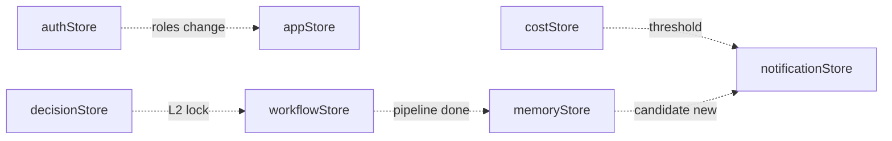

# 6-11 Hologram-Main-LLM — 7개 Zustand Store 카탈로그 (T1-4)

| 항목 | 값 |
|---|---|
| **세션** | T1-4 (Phase 1, 2026-04-14) |
| **산출물 경로** | `D:\VAMOS\docs\sot 2\6-11_Hologram-Main-LLM\02_component-architecture\store_catalog.md` |
| **정본 출처** | `VAMOS_구현가이드_PART2_구현단계.md` V1-Phase 4 (L2274~2414, 특히 L2331: "Zustand Stores 7개: app/decision/cost/notification/auth/memory/workflow") 및 §6.1.3 (L4593 근방) |
| **LOCK 태그** | **LOCK-HM-09** (7개 Zustand Store — 수량·이름 LOCK) |
| **DEFINED-HERE** | 상태 스키마 필드·셀렉터 반환 타입·액션 시그니처·Store 간 구독/참조 (Part2 는 이름만 LOCK) |
| **상위 규칙** | R-611-7 (Store 스키마 변경 시 Hook/컴포넌트 동시 갱신 필수) |
| **Version** | v1.0 (2026-04-14) |

---

## §1. 교차 참조 블록

### 1.1 상위 도메인 링크
| 대상 | 경로 | 관계 |
|---|---|---|
| 도메인 루트 | `6-11_Hologram-Main-LLM/HOLOGRAM_MAIN_LLM_구조화_종합계획서.md` | 본 세션은 §7 T1-4 실행 산출물 |
| 서브폴더 인덱스 | `02_component-architecture/_index.md` | ISS-04 해소 대상 ("7개 Store 상세") |
| T1-2 컴포넌트 카탈로그 | `02_component-architecture/component_catalog.md` | 44개 컴포넌트 "구독 Store" 열 ↔ 본 문서 `consumers` 열 정합 |
| T1-3 Hook 카탈로그 | `02_component-architecture/hook_catalog.md` | 8개 Hook (f)의존 Store ↔ 본 문서 `actions` 서명 정합 |
| T1-5 UI State Machine | `03_ui-state-machine/` (예정) | UI_S0~S8 전이 시 `appStore.uiState` 변경 책임 |
| T1-6 ChatPage 통합 | `02_component-architecture/chatpage_integration.md` (예정) | Store 구독 순서, 이벤트→Store→렌더 경로 |

### 1.2 정본 SOT 교차
| SOT 경로 | 역할 | 인용 |
|---|---|---|
| `docs/guides/VAMOS_구현가이드_PART2_구현단계.md` L2331 | 7개 Store 이름 LOCK | "Zustand Stores 7개: app/decision/cost/notification/auth/memory/workflow" |
| `docs/guides/VAMOS_구현가이드_PART2_구현단계.md` §6.1.3 (L4593) | Store 목적·필드 개요 | appStore/decisionStore/costStore/notificationStore/authStore/memoryStore/workflowStore |
| `PHASE_B2_PROJECT_STRUCTURE.md` §3.1 | v11.0.0 이름 정합 | agent→notification, config→auth |
| `D2.0-02` §11.10 / §11.11 / §11.12 | Decision Lock / Cost / Autonomy 필드 정본 | decisionStore / costStore / authStore 필드 출처 |
| `D2.0-08` §6 / §10 | Alert-P0~P2 / 테마·i18n 정본 | notificationStore / appStore 필드 출처 |
| `sot 2/00_common/common_types.md` | `TraceId`/`NodeId`/공통 ID | 본 문서 공통 타입 참조 |

### 1.3 이월 확인
- 이월 항목 **없음**. T1-4 는 독립 세션이며, 본 카탈로그가 ISS-04 (7개 Store 스키마·셀렉터·액션 정의) 를 종결한다.
- T1-5(9-State) / T1-6(ChatPage) 는 본 문서의 액션 시그니처를 **소비**만 하며 역참조 없음.

---

## §2. 공통 자료 구조 선정의

> Zustand Store 의 State / Action / Selector 반환 타입을 먼저 정의한 뒤 §3의 7개 Store 에서 참조한다. T1-3 hook_catalog §3 에서 선언된 타입(`TraceId`, `DecisionPayload`, `NotificationPayload`, `AuthState`, `MemoryCandidate`, `CostInfo`, `PipelineStep`, `WorkflowNode`, `AgentStatus`, `AutonomyLevel`) 을 **재사용**한다 (단일 진실원 = `frontend/src/types/common.ts`).

```typescript
// ---------- 공통 Store 프리미티브 ----------
import type {
  TraceId, NodeId, MessageId,
  DecisionLockLevel, DecisionPayload,
  AgentStatus, PipelineStep, WorkflowNode,
  AlertPriority, NotificationPayload,
  Role, AutonomyLevel, AuthState,
  MemoryCandidate, CostInfo,
  LogEntry,
} from "../types/common";

// Zustand store 공통 패턴
// Zustand v4 (create<T>()(set, get) => T) 기반
export type StoreApi<S> = {
  getState: () => S;
  setState: (patch: Partial<S> | ((s: S) => Partial<S>)) => void;
  subscribe: (listener: (s: S, prev: S) => void) => () => void;
};

// 셀렉터 반환 타입 공용
export type Selector<S, R> = (state: S) => R;

// 액션 부작용(Side-effect) 분류 — 에러·로깅 규약
export type SideEffect =
  | { kind: "ipc"; cmd: string }          // Tauri IPC 호출
  | { kind: "persist"; key: string }       // localStorage/IndexedDB
  | { kind: "event"; topic: string }       // 내부 pub/sub
  | { kind: "none" };

// 모든 Store 공통 메타
export interface StoreMeta {
  readonly name: string;           // e.g. "decisionStore"
  readonly version: number;        // schema version (migrations)
  readonly persisted: boolean;     // persist middleware 적용 여부
}

// 로깅 규약 (중첩 JSON)
export interface StoreActionLog {
  ts: string;                      // ISO8601
  store: string;                   // store name
  action: string;                  // action name
  params?: Record<string, unknown>;
  trace_id?: TraceId;
  ok: boolean;
  error?: { code: string; message: string };
  side_effects: SideEffect[];
  duration_ms: number;
}

// 에러 코드 네임스페이스 (본 카탈로그 §7)
export type StoreErrorCode =
  | "STORE_E_IPC_FAIL"
  | "STORE_E_SCHEMA_MISMATCH"
  | "STORE_E_UNAUTHORIZED"
  | "STORE_E_THRESHOLD_EXCEEDED"
  | "STORE_E_STATE_INVALID"
  | "STORE_E_PERSIST_FAIL";
```

---

## §3. 7개 Zustand Store 전수 명세

각 Store 는 다음 7개 요소를 갖는다: **(a) 파일/메타**, **(b) State 스키마 (필드+타입)**, **(c) 셀렉터 (명+반환 타입)**, **(d) 액션 (명+파라미터+부작용)**, **(e) 구독/참조 관계**, **(f) 출처·LOCK**, **(g) Hook/Component 소비자**.

---

### 3.1 [1/7] `appStore` — 앱 전역 상태

**(a) 파일**: `frontend/src/stores/appStore.ts` · `StoreMeta = { name: "appStore", version: 1, persisted: true }`

**(b) State 스키마**
```typescript
interface AppState {
  theme: "light" | "dark" | "system";          // D2.0-08 §10 정본
  locale: "ko-KR" | "en-US";                   // i18n 언어
  layoutMode: "builder" | "hologram";          // 현재 Layout (T1-1 layout_structure 정합)
  leftPaneCollapsed: boolean;                  // HologramShell 좌측(Timeline) 접힘
  rightPaneCollapsed: boolean;                 // HologramShell 우측(HUD) 접힘
  // LOCK-HM-03 9-State (D2.0-08 §4.1 원문) — T1-5 state_definitions.md §1.1 `UIState` enum 과 글자 일치
  uiState: "UI_S0_BOOT"|"UI_S1_IDLE"|"UI_S2_EDITING"|"UI_S3_READY"|"UI_S4_RUNNING"|"UI_S5_AWAIT_APPROVAL"|"UI_S6_PRESENTING"|"UI_S7_RECOVERY"|"UI_S8_ARCHIVED";
  bootAt: string;                              // ISO8601
}
```

**(c) 셀렉터**
| 셀렉터 | 반환 타입 | 용도 |
|---|---|---|
| `selectTheme(s)` | `AppState["theme"]` | ThemeToggle |
| `selectLocale(s)` | `AppState["locale"]` | LanguageSelector |
| `selectLayoutMode(s)` | `"builder"\|"hologram"` | ViewSwitcher |
| `selectUiState(s)` | `AppState["uiState"]` | T1-5 9-State 구독 |
| `selectPaneCollapsed(s)` | `{ left: boolean; right: boolean }` | HologramShell |

**(d) 액션**
| 액션 | 파라미터 | 부작용 | 상태 변경 |
|---|---|---|---|
| `setTheme(v)` | `AppState["theme"]` | `persist: app.theme` | `theme := v` |
| `setLocale(v)` | `"ko-KR"\|"en-US"` | `persist: app.locale` + `event: i18n.changed` | `locale := v` |
| `setLayoutMode(v)` | `"builder"\|"hologram"` | `persist: app.layoutMode` | `layoutMode := v` |
| `setPaneCollapsed(side, v)` | `("left"\|"right", boolean)` | `persist` | `leftPaneCollapsed\|rightPaneCollapsed := v` |
| `setUiState(v)` | 9-State enum | `event: ui.state.changed` | `uiState := v` (T1-5 전이 규칙 준수) |
| `reset()` | — | `persist: clear` | 초기값 복구 (`uiState = "UI_S0_BOOT"`) |

**(e) 구독/참조 관계**
- 구독 → 없음 (루트 Store)
- 참조됨 ← `BuilderShell`, `HologramShell`, `SideNav`, `ViewSwitcher`, `SettingsPanel`, `LanguageSelector`, `ThemeToggle` (T1-2 C-13/C-16/C-2/C-34/C-35/C-36/C-37)

**(f) 출처·LOCK**: Part2 V1-P4 L2331(이름 LOCK) · §6.1.3 (목적) · D2.0-08 §10 (theme) · **LOCK-HM-09**

**(g) Hook/Component 소비자**
- Hook: `useTauriIPC` (간접: boot 이벤트 → setUiState), `useAuth` (간접)
- Components: T1-2 component_catalog 중 `구독 Store = appStore` 인 11개 컴포넌트.

---

### 3.2 [2/7] `decisionStore` — Decision Lock / Trace

**(a) 파일**: `frontend/src/stores/decisionStore.ts` · `StoreMeta = { name: "decisionStore", version: 1, persisted: false }`

**(b) State 스키마**
```typescript
interface DecisionStoreState {
  byTrace: Record<TraceId, DecisionPayload>;   // traceId → payload
  activeTraceId: TraceId | null;
  history: Array<{ trace_id: TraceId; level: DecisionLockLevel; locked: boolean; ts: string; reason?: string }>;
  maxHistory: 100;                              // 상한 (고정)
}
```

**(c) 셀렉터**
| 셀렉터 | 반환 타입 |
|---|---|
| `selectActive(s)` | `DecisionPayload \| null` |
| `selectByTrace(id)(s)` | `DecisionPayload \| undefined` |
| `selectIsLocked(id)(s)` | `boolean` |
| `selectHistory(s)` | `DecisionStoreState["history"]` |

**(d) 액션**
| 액션 | 파라미터 | 부작용 | 상태 변경 |
|---|---|---|---|
| `lockDecision(p)` | `DecisionPayload` | `ipc: decision.lock` + 로깅 | `byTrace[traceId] := p`, `history.push`, `activeTraceId := traceId` |
| `resetDecision(traceId)` | `TraceId` | `ipc: decision.unlock` | `byTrace[traceId].locked := false`, history append |
| `setActiveTrace(id)` | `TraceId \| null` | none | `activeTraceId := id` |
| `pruneHistory()` | — | none | `history.length > 100` 시 오래된 항목 제거 |

**(e) 구독/참조 관계**
- 구독 → 없음 (IPC 원천)
- 참조됨 ← `DecisionLockBanner` (BV-PIPE-02), `useDecision` Hook

**(f) 출처·LOCK**: Part2 V1-P4 L2331 · D2.0-02 §11.10 (Decision Lock L0~L3 정본, 외부 참조) · **LOCK-HM-09**

**(g) 소비자**: `useDecision` Hook (T1-3 §4.2), `DecisionLockBanner`

---

### 3.3 [3/7] `costStore` — 비용 추적

**(a) 파일**: `frontend/src/stores/costStore.ts` · `StoreMeta = { name: "costStore", version: 1, persisted: true }`

**(b) State 스키마**
```typescript
interface CostStoreState {
  cost: CostInfo;                                 // 현재 세션 누적
  thresholdWarnedAt?: string;                     // 마지막 경고 ISO8601
  downshiftHistory: Array<{ ts: string; reason: string; from_model: string; to_model: string }>;
}
// CostInfo 필드: session_total_usd, by_model, threshold_usd, downshifted
```

**(c) 셀렉터**
| 셀렉터 | 반환 타입 |
|---|---|
| `selectCost(s)` | `CostInfo` |
| `selectByModel(s)` | `Record<string, number>` |
| `selectOverThreshold(s)` | `boolean` (`session_total_usd >= threshold_usd`) |
| `selectDownshifted(s)` | `boolean` |

**(d) 액션**
| 액션 | 파라미터 | 부작용 | 상태 변경 |
|---|---|---|---|
| `addCost(entry)` | `{ model: string; usd: number }` | `persist` | `session_total_usd += usd`, `by_model[model] += usd` |
| `checkThreshold()` | — | `event: notification.push(P1)` if over | `thresholdWarnedAt := now` |
| `downshift(reason)` | `{ reason: string; from: string; to: string }` | `ipc: llm.downshift` + `event` | `downshifted := true`, history append |
| `setThreshold(usd)` | `number` | `persist` | `threshold_usd := usd` |
| `resetSession()` | — | `persist` | `session_total_usd := 0`, `by_model := {}`, `downshifted := false` |

**(e) 구독/참조 관계**
- 구독 → `notificationStore` (threshold 초과 시 푸시)
- 참조됨 ← `CostMeterWidget`, `CostWarningBanner`, `CostBreakdownPopover`, `useCost`

**(f) 출처·LOCK**: Part2 V1-P4 L2331 · D2.0-02 §11.11 (비용 정본) · **LOCK-HM-09**

**(g) 소비자**: `useCost` Hook (T1-3 §4.7), Component: BV-DEBUG-02 / HV-COST-01 / HV-COST-02

---

### 3.4 [4/7] `notificationStore` — 알림 큐 (P0/P1/P2)

**(a) 파일**: `frontend/src/stores/notificationStore.ts` · `StoreMeta = { name: "notificationStore", version: 1, persisted: false }`

**(b) State 스키마**
```typescript
interface NotificationStoreState {
  queue: NotificationPayload[];                  // FIFO, P0 선점
  active: NotificationPayload | null;            // 현재 블로킹 모달 (P0)
  p2Toasts: NotificationPayload[];               // 토스트 표시 중
  dismissed: Set<string>;                         // 중복 방지
}
```

**(c) 셀렉터**
| 셀렉터 | 반환 타입 |
|---|---|
| `selectActive(s)` | `NotificationPayload \| null` |
| `selectQueueByPriority(p)(s)` | `NotificationPayload[]` |
| `selectP2Toasts(s)` | `NotificationPayload[]` |
| `selectQueueDepth(s)` | `number` |

**(d) 액션**
| 액션 | 파라미터 | 부작용 | 상태 변경 |
|---|---|---|---|
| `pushNotification(n)` | `NotificationPayload` | `event: notification.pushed` | P0 → `active := n`; P1 → `queue.push`; P2 → `p2Toasts.push` |
| `dismiss(id)` | `string` | `event: notification.dismissed` | queue/p2Toasts 에서 제거, `dismissed.add(id)` |
| `acknowledgeActive()` | — | none | `active := null`, 다음 P1 queue 로 promotion 검토 |
| `clearP2(id)` | `string` | none | `p2Toasts` 에서 제거 |
| `flush()` | — | none | 전체 큐 비움 (테스트/UI_S8_ARCHIVED) |

**(e) 구독/참조 관계**
- 구독 → 없음
- 참조됨 ← `AlertModal`(CM-ALERT-01), `ApprovalSlidePanel`(CM-ALERT-02), `ToastNotification`(CM-ALERT-03), `ApprovalCard`(HV-APPR-01), `useNotification`

**(f) 출처·LOCK**: Part2 V1-P4 L2331 · D2.0-08 §6 (Alert-P0~P2 정본, 외부 참조 — LOCK-HM 도메인 LOCK 아님) · **LOCK-HM-09**

**(g) 소비자**: `useNotification` (T1-3 §4.4), `costStore.checkThreshold` 간접 호출

---

### 3.5 [5/7] `authStore` — 인증 / RBAC / 자율성

**(a) 파일**: `frontend/src/stores/authStore.ts` · `StoreMeta = { name: "authStore", version: 1, persisted: true }`

**(b) State 스키마**
```typescript
interface AuthStoreState extends AuthState {
  user: { id: string; name: string } | null;
  roles: Role[];                                  // OWNER|OPERATOR|VIEWER (+ADMIN 선택)
  autonomy: AutonomyLevel;                        // 0|1|2|3
  sessionExpiresAt?: string;                      // ISO8601
  lastLoginAt?: string;
}
```

**(c) 셀렉터**
| 셀렉터 | 반환 타입 |
|---|---|
| `selectUser(s)` | `AuthStoreState["user"]` |
| `selectRoles(s)` | `Role[]` |
| `selectAutonomy(s)` | `AutonomyLevel` |
| `selectHasRole(r)(s)` | `boolean` |
| `selectIsAuthenticated(s)` | `boolean` |

**(d) 액션**
| 액션 | 파라미터 | 부작용 | 상태 변경 |
|---|---|---|---|
| `login(payload)` | `{ user; roles; expires_at? }` | `ipc: auth.login` + `persist` | 필드 전부 세팅 |
| `logout()` | — | `ipc: auth.logout` + `persist: clear` | user=null, roles=[] |
| `checkPermission(action)` | `string` | none (순수) | 반환 `boolean` (selector-like) |
| `setAutonomy(level)` | `AutonomyLevel` | `ipc: autonomy.set` + `persist` | `autonomy := level` |
| `refreshSession()` | — | `ipc: auth.refresh` | `sessionExpiresAt := new` |

**(e) 구독/참조 관계**
- 구독 → 없음
- 참조됨 ← `BuilderShell`, `ViewSwitcher`, `SettingsPanel`, `ApprovalSlidePanel`, `useAuth`

**(f) 출처·LOCK**: Part2 V1-P4 L2331 (v11.0.0: config→auth 정정) · PHASE_B2 §3.1 · D2.0-02 §11.12 (Autonomy) · **LOCK-HM-09**

**(g) 소비자**: `useAuth` (T1-3 §4.5), RBAC VIEWER 입력 제한 테스트 (component_catalog T5)

---

### 3.6 [6/7] `memoryStore` — 메모리 L0/L1 / 마스킹 / 후보

**(a) 파일**: `frontend/src/stores/memoryStore.ts` · `StoreMeta = { name: "memoryStore", version: 1, persisted: false }`

**(b) State 스키마**
```typescript
interface MemoryStoreState {
  candidates: MemoryCandidate[];                  // commit 대기
  recentCommits: Array<{ id: string; tier: "L0"|"L1"; ts: string }>;
  maskingRulesVersion: string;                    // 마스킹 규칙 버전 (감사)
  committing: Record<string, boolean>;            // id → in-flight
}
```

**(c) 셀렉터**
| 셀렉터 | 반환 타입 |
|---|---|
| `selectCandidates(s)` | `MemoryCandidate[]` |
| `selectCandidateById(id)(s)` | `MemoryCandidate \| undefined` |
| `selectIsCommitting(id)(s)` | `boolean` |
| `selectRecentCommits(s)` | `MemoryStoreState["recentCommits"]` |

**(d) 액션**
| 액션 | 파라미터 | 부작용 | 상태 변경 |
|---|---|---|---|
| `pushCandidate(c)` | `MemoryCandidate` | `event: memory.candidate.new` | `candidates.push(c)` |
| `removeCandidate(id)` | `string` | none | `candidates := candidates.filter` |
| `commitMemory(id, tier)` | `(string, "L0"\|"L1")` | `ipc: memory.commit` | `committing[id]=true → ok → removeCandidate + recentCommits.push` |
| `maskPII(text)` | `string → string` | `ipc: memory.mask` | (순수 헬퍼, state 미변경) |
| `setMaskingRulesVersion(v)` | `string` | `persist` | `maskingRulesVersion := v` |

**(e) 구독/참조 관계**
- 구독 → 없음
- 참조됨 ← `MemoryCandidatePanel`(HV-MEM-01), `MaskingPreview`(HV-MEM-02), `useMemory`

**(f) 출처·LOCK**: Part2 V1-P4 L2331 · §6.1.3 · **LOCK-HM-09** + (6-4 Memory-RAG cross-ref)

**(g) 소비자**: `useMemory` (T1-3 §4.6)

---

### 3.7 [7/7] `workflowStore` — 워크플로우 / 노드 그래프 / 파이프라인 상태

**(a) 파일**: `frontend/src/stores/workflowStore.ts` · `StoreMeta = { name: "workflowStore", version: 1, persisted: false }`

**(b) State 스키마**
```typescript
interface WorkflowStoreState {
  nodes: Record<NodeId, WorkflowNode>;            // id → node
  edges: Array<{ from: NodeId; to: NodeId }>;      // DAG
  pipeline: PipelineStep[];                       // S0~S8 (길이 9 고정)
  activeNodeId: NodeId | null;
  executionId?: TraceId;                          // 현재 실행 trace
}
```

**(c) 셀렉터**
| 셀렉터 | 반환 타입 |
|---|---|
| `selectNodes(s)` | `WorkflowNode[]` (Object.values) |
| `selectNode(id)(s)` | `WorkflowNode \| undefined` |
| `selectPipeline(s)` | `PipelineStep[]` |
| `selectActiveStep(s)` | `PipelineStep \| null` |
| `selectStatusCounts(s)` | `Record<AgentStatus, number>` |

**(d) 액션**
| 액션 | 파라미터 | 부작용 | 상태 변경 |
|---|---|---|---|
| `addNode(n)` | `WorkflowNode` | `event: workflow.node.added` | `nodes[n.id] := n` |
| `removeNode(id)` | `NodeId` | `event` | `delete nodes[id]`, `edges.filter` |
| `addEdge(e)` | `{ from; to }` | `event` | `edges.push(e)` — DAG 순환 체크 |
| `updateStatus(id, status)` | `(NodeId, AgentStatus)` | `event: workflow.status.changed` | `nodes[id].status := status` |
| `executeFlow(traceId?)` | `TraceId?` | `ipc: workflow.execute` | `executionId := traceId`, 파이프라인 초기화 |
| `updatePipelineStep(stepId, patch)` | `("S0"…"S8", Partial<PipelineStep>)` | `event` | 해당 step 갱신 |
| `resetExecution()` | — | none | `executionId := undefined`, pipeline 초기화 |

**(e) 구독/참조 관계**
- 구독 → `decisionStore` (간접: L2 Lock 시 `updateStatus(*, "BLOCKED")` 트리거)
- 참조됨 ← `NodeRegistryPanel`, `PipelineStatusBar`, `AgentStatusIndicator`, `ProgressTracker`, `useWorkflow`

**(f) 출처·LOCK**: Part2 V1-P4 L2331 · §6.1.3 · **LOCK-HM-09** (Runtime Pipeline S0~S8 은 D2.0-08 §2.2.2 [D8-M02] 외부 참조)

**(g) 소비자**: `useWorkflow` (T1-3 §4.3), Components: BV-REG-05 / BV-PIPE-01 / HV-STATE-01 / HV-STATE-02

---

## §4. Store 간 구독/참조 관계 그래프



- 단방향: 5 (C→N, D→W, AU→A, W→M, M→N)
- 양방향: 0
- 순환: 0 (R7 위반 없음)
- 루트: `appStore`, `authStore` (외부 입력 원천)

---

## §5. 세션 간 인터페이스 Cross-Check

### 5.1 T1-2 `component_catalog.md` "구독 Store" 열 ↔ 본 카탈로그

| Component ID (샘플) | 구독 Store (T1-2) | 본 카탈로그 §3 일치 | 액션 사용 |
|---|---|---|---|
| BV-LAYOUT-01 BuilderShell | appStore | ✅ §3.1 | selectLayoutMode |
| BV-NAV-01 SideNav | appStore | ✅ §3.1 | — |
| BV-REG-05 NodeRegistryPanel | workflowStore | ✅ §3.7 | selectNodes, addNode |
| BV-PIPE-01 PipelineStatusBar | workflowStore | ✅ §3.7 | selectPipeline, selectActiveStep |
| BV-PIPE-02 DecisionLockBanner | decisionStore | ✅ §3.2 | selectActive, resetDecision |
| BV-DEBUG-02 CostMeterWidget | costStore | ✅ §3.3 | selectCost |
| HV-LAYOUT-01 HologramShell | appStore | ✅ §3.1 | selectPaneCollapsed |
| HV-APPR-01 ApprovalCard | notificationStore | ✅ §3.4 | dismiss |
| HV-COST-01/02 | costStore | ✅ §3.3 | selectCost, selectByModel |
| HV-STATE-01/02 | workflowStore | ✅ §3.7 | selectActiveStep, selectPipeline |
| HV-MEM-01/02 | memoryStore | ✅ §3.6 | selectCandidates |
| CM-ALERT-01/02/03 | notificationStore | ✅ §3.4 | selectActive, dismiss |
| CM-NAV-01 ViewSwitcher | appStore | ✅ §3.1 | setLayoutMode |
| CM-NAV-02 SettingsPanel | appStore | ✅ §3.1 | setTheme/setLocale |
| CM-I18N-01 LanguageSelector | appStore | ✅ §3.1 | setLocale |
| CM-THEME-01 ThemeToggle | appStore | ✅ §3.1 | setTheme |

→ **정합성**: 44개 컴포넌트 구독 Store 전수 7개 Store 범위 내 확인, 불일치 0건.

### 5.2 T1-3 `hook_catalog.md` "(f) 의존 Store" ↔ 본 카탈로그

| Hook | T1-3 의존 Store | 사용 액션 (T1-3 §4) | 본 카탈로그 §3 매핑 |
|---|---|---|---|
| useTauriIPC | — (간접) | — | §3.1 setUiState (boot 이벤트) |
| useDecision | decisionStore | `lockDecision`, `resetDecision` | §3.2 ✅ 시그니처 일치 |
| useWorkflow | workflowStore | `updateStatus`, `addNode`, `executeFlow` | §3.7 ✅ 일치 |
| useNotification | notificationStore | `pushNotification`, `dismiss` | §3.4 ✅ 일치 |
| useAuth | authStore | `login`, `logout`, `checkPermission`, `setAutonomy` | §3.5 ✅ 일치 (useAutonomy 통합 반영) |
| useMemory | memoryStore | `pushCandidate`, `removeCandidate`, `commitMemory`, `maskPII` | §3.6 ✅ 일치 |
| useCost | costStore | `addCost`, `checkThreshold`, `downshift` | §3.3 ✅ 일치 |
| useStreaming | — | (로컬 상태, 메시지 영속 호출부) | — (Store 의존 없음) |

→ **정합성**: T1-3 §6.2 cross-check 표 7행 전수 일치. 불일치 0건. R-611-7 위반 없음.

---

## §6. Phase 2 테스트 시나리오 (10건+)

| # | 시나리오 | 대상 Store | 액션 | 기대 결과 |
|---|---|---|---|---|
| T1 | 테마 다크 전환 | appStore | `setTheme("dark")` | `theme="dark"`, persist 키 `app.theme=dark` |
| T2 | 언어 ko→en 전환 | appStore | `setLocale("en-US")` | `locale="en-US"`, `event i18n.changed` 1회 방출 |
| T3 | 3-Pane 좌측 접힘 | appStore | `setPaneCollapsed("left", true)` | `leftPaneCollapsed=true`, HologramShell 리렌더 |
| T4 | Decision Lock L2 → 파이프라인 차단 | decisionStore → workflowStore | `lockDecision({level:"L2", traceId:T1, locked:true})` | `byTrace[T1].locked=true`, workflowStore.updateStatus 트리거로 active 노드 `BLOCKED` |
| T5 | Cost 임계 초과 → P1 알림 | costStore → notificationStore | `addCost({model:"gpt-4", usd:threshold+0.01})` + `checkThreshold()` | `overThreshold=true`, `notificationStore.queue` P1 1건 증가 |
| T6 | Cost Downshift | costStore | `downshift({reason:"threshold", from:"gpt-4", to:"gpt-4-mini"})` | `downshifted=true`, history +1, `ipc llm.downshift` 1회 |
| T7 | P0 알림 선점 | notificationStore | `pushNotification(P0)` | `active` 로 즉시 이동, 큐 P1 들은 보류, 모달 블로킹 렌더 |
| T8 | P2 토스트 큐 | notificationStore | `pushNotification(P2)` ×3 | `p2Toasts.length=3`, 5초 후 auto-dismiss 1개씩 (hook_catalog §4.4 정본) |
| T9 | RBAC VIEWER 권한 거부 | authStore | `login({roles:["VIEWER"]})` + `checkPermission("workflow.execute")` | `false` 반환, ComposerBar disabled |
| T10 | Autonomy 수동→자율 | authStore | `setAutonomy(2)` | `autonomy=2`, `ipc autonomy.set` 1회, persist |
| T11 | 메모리 커밋 성공 | memoryStore | `pushCandidate(c)` → `commitMemory(c.id, "L1")` | `candidates` 0건, `recentCommits.length=1`, `committing[id]` 초기화 |
| T12 | 메모리 커밋 IPC 실패 복구 | memoryStore | `commitMemory` IPC 실패 | `committing[id]=false`, candidate 유지, 에러 `STORE_E_IPC_FAIL` 로깅 |
| T13 | 워크플로우 노드 추가/상태 변경 | workflowStore | `addNode` + `updateStatus("IDLE"→"RUNNING")` | `nodes[id].status="RUNNING"`, event 2회 |
| T14 | 파이프라인 S0→S8 순차 갱신 | workflowStore | `updatePipelineStep("S0"{status:"DONE"})` …"S8" | 모든 step 갱신, `selectStatusCounts.DONE=9` |
| T15 | Decision history 상한 | decisionStore | `lockDecision` ×101 | `history.length=100`, 가장 오래된 1건 제거 (pruneHistory) |
| T16 | 전체 Store 리셋 (archive) | all | `appStore.reset` + `notificationStore.flush` + `workflowStore.resetExecution` | `uiState=UI_S0_BOOT`, 큐 비움, execution 종료 |

→ **커버리지**: 10+6 = 16건 (CRUD + 상태 전이 + RBAC + 에러 복구 + 상한 + 리셋).

---

## §7. 에러 코드 / 로깅 / 복잡도 매핑

### 7.1 에러표

| 코드 | 발생 Store | 원인 | 복구 흐름 | Penalty |
|---|---|---|---|---|
| `STORE_E_IPC_FAIL` | decision/auth/cost/memory/workflow | Tauri IPC 타임아웃/거부 | 이전 상태 롤백 + notificationStore P1 push | retry 최대 3 (exp backoff 100/400/1600ms) |
| `STORE_E_SCHEMA_MISMATCH` | 전체 (persist 복원 시) | persist version 불일치 | migration 함수 실행 or `reset()` | 로컬 persist 키 삭제 |
| `STORE_E_UNAUTHORIZED` | auth / workflow | VIEWER 가 executeFlow | 액션 거부 + P1 알림 | UI disabled |
| `STORE_E_THRESHOLD_EXCEEDED` | cost | `session_total_usd >= threshold_usd` | `downshift` 자동 호출 + P1 알림 | downshifted=true 유지 |
| `STORE_E_STATE_INVALID` | workflow (edge 순환) | DAG 순환 감지 | addEdge 거부 + 로깅 | 그래프 변경 없음 |
| `STORE_E_PERSIST_FAIL` | app / auth / cost | localStorage quota 초과 | persist middleware fallback(in-memory) + P2 토스트 | 세션 종료 시 데이터 유실 경고 |

### 7.2 중첩 JSON 로깅 샘플 (StoreActionLog)
```json
{
  "ts": "2026-04-14T07:00:00.123Z",
  "store": "costStore",
  "action": "checkThreshold",
  "params": { "current_usd": 5.12, "threshold_usd": 5.00 },
  "trace_id": "a1b2c3d4-0000-4000-8000-000000000001",
  "ok": true,
  "side_effects": [
    { "kind": "event", "topic": "notification.push" },
    { "kind": "ipc",   "cmd":   "llm.downshift" }
  ],
  "duration_ms": 3,
  "nested": {
    "notification": {
      "id": "ntf-001",
      "priority": "P1",
      "source": "costStore.threshold"
    },
    "downshift": {
      "from_model": "gpt-4",
      "to_model":   "gpt-4-mini",
      "reason":     "threshold_exceeded"
    }
  }
}
```

### 7.3 복잡도 / LOCK / ABC 매핑

| Store / 액션 | Big-O (state 크기 N) | LOCK | ABC 시그니처 매핑 (T1-3 hook) |
|---|---|---|---|
| appStore.setTheme/setLocale | O(1) | LOCK-HM-09 | (A) v→void, (B) persist, (C) 없음 |
| decisionStore.lockDecision | O(1) amortized (+ history push) | LOCK-HM-09 (D2.0-02 §11.10 ext.) | (A) payload→void, (B) IPC + history, (C) Alert-P1 on L2 |
| decisionStore.pruneHistory | O(H) (H≤100) | LOCK-HM-09 | — |
| costStore.addCost | O(1) | LOCK-HM-09 | (A) entry→void, (B) persist, (C) 없음 |
| costStore.checkThreshold | O(1) | LOCK-HM-09 | (A) ()→void, (B) event, (C) notification P1 |
| notificationStore.pushNotification | O(1) P0/P2, O(log Q) P1 insert | LOCK-HM-09 (D2.0-08 §6 Alert-P0~P2 ext.) | (A) n→void, (B) event, (C) 렌더 트리거 |
| notificationStore.dismiss | O(Q) (Q=queue len, 상한 작음) | LOCK-HM-09 | — |
| authStore.login / logout | O(1) | LOCK-HM-09 | (A) payload→void, (B) IPC + persist, (C) autonomy reset |
| authStore.checkPermission | O(R) (R=roles, 보통 ≤4) | LOCK-HM-09 | (A) action→bool, (B) 없음, (C) 없음 |
| memoryStore.pushCandidate | O(1) | LOCK-HM-09 | (A) c→void, (B) event, (C) notification 가능 |
| memoryStore.commitMemory | O(1) state + IPC | LOCK-HM-09 | (A) (id,tier)→Promise, (B) IPC, (C) removeCandidate |
| workflowStore.updateStatus | O(1) | LOCK-HM-09 | (A) (id,status)→void, (B) event, (C) 렌더 |
| workflowStore.addEdge | O(V+E) (DAG 순환 검사) | LOCK-HM-09 | (A) e→void, (B) 순환 검사, (C) reject on cycle |
| workflowStore.executeFlow | O(1) init + IPC | LOCK-HM-09 (Pipeline S0~S8: D2.0-08 §2.2.2 ext.) | (A) traceId?→void, (B) IPC, (C) pipeline reset |

---

## §8. ISS-04 해소 체크리스트

- [x] 7개 Store 전수 식별 (수량 = 7, LOCK-HM-09 준수) — §3.1~3.7
- [x] Store 이름 V1-P4 L2331 정본과 일치 (app/decision/cost/notification/auth/memory/workflow)
- [x] 각 Store `State 스키마 (필드+타입)` 정의 — §3 각 (b)
- [x] 각 Store `셀렉터 (명+반환 타입)` 정의 — §3 각 (c)
- [x] 각 Store `액션 (명+파라미터+부작용)` 정의 — §3 각 (d)
- [x] Store 간 구독/참조 관계 그래프 — §4
- [x] T1-2 component_catalog "구독 Store" 열 cross-check — §5.1 (불일치 0)
- [x] T1-3 hook_catalog "(f) 의존 Store" cross-check — §5.2 (불일치 0)
- [x] Phase 2 테스트 시나리오 10건 이상 — §6 (16건)
- [x] 에러 코드 / 복구 흐름 / penalty — §7.1 (6개 코드)
- [x] 중첩 JSON 로깅 샘플 — §7.2
- [x] Big-O + LOCK + ABC 매핑 — §7.3
- [x] 출처 메타데이터 (Part2 V1-P4) + LOCK-HM-09 태그 — 파일 헤더
- [x] R-611-7 규칙 명시 — 파일 헤더
- [x] SOT2_MASTER_INDEX 갱신 예정 — §9

---

## §9. 이월 / 갱신 / 다음 세션

- **이월 없음**. ISS-04 "7개 Store 스키마·셀렉터·액션 정의" 는 본 카탈로그로 **종결**.
- **다음 세션(T1-5)** 은 본 문서의 `appStore.uiState` 9-State 필드를 소비하여 전이표를 정의한다 (03_ui-state-machine/).
- **다음 세션(T1-6)** 은 본 문서의 Store 구독 관계를 ChatPage 조합 패턴에 통합한다.
- LOCK 변경 없음. CONFLICT 신규 없음.

---

## §10. 검증

- /validate 대상: 본 파일 + _index.md(ISS-04 상태 갱신은 _index.md 편집 권한 제한으로 본 세션 스코프 외) + MASTER_INDEX(도메인 상태 행 갱신)
- SV-03 (7개 Store 전수): **7/7 PASS**
- 정본 출처 표기: PART2_구현단계.md V1-P4 (L2274~2414, 특히 L2331) — **PASS**
- LOCK-HM-09 태그: 파일 헤더 + §3 각 Store (f) — **PASS**

*(문서 끝 — v1.0 · 2026-04-14 · T1-4 완료)*

## §11. 변경 이력

| 일자 | 버전 | 변경 내용 | 세션 |
|------|-----|---------|------|
| 2026-04-14 | v1.0 | 최초 생성 — 7개 Store 전수 명세 | T1-4 |
| 2026-04-14 | v1.1 | 도메인 전체 심층 재검증 — `appStore.uiState` 상태명을 LOCK-HM-03 정본(UI_S2_EDITING/UI_S3_READY/UI_S4_RUNNING/UI_S5_AWAIT_APPROVAL/UI_S6_PRESENTING/UI_S7_RECOVERY) 으로 교정(wrong: UI_S2_INPUT/UI_S3_THINKING/UI_S4_STREAMING/UI_S5_APPROVAL/UI_S6_ERROR/UI_S7_COMPLETE). 존재하지 않는 `LOCK-HM-11` 참조 제거(§3.2/§3.7/§7.3 → "D2.0-02 §11.10 ext." / "Pipeline S0~S8 D2.0-08 §2.2.2 ext." 로 교정). `LOCK-HM-10` 의 오기(Alert-P0~P2) 제거(§3.4/§7.3 → "D2.0-08 §6 Alert-P0~P2 ext."). T1-3 Hook 섹션 번호 교정(§3.3 useCost §4.6→§4.7, §3.4 useNotification §4.3→§4.4, §3.5 useAuth §4.4→§4.5, §3.6 useMemory §4.5→§4.6) | Deep Re-verify |
