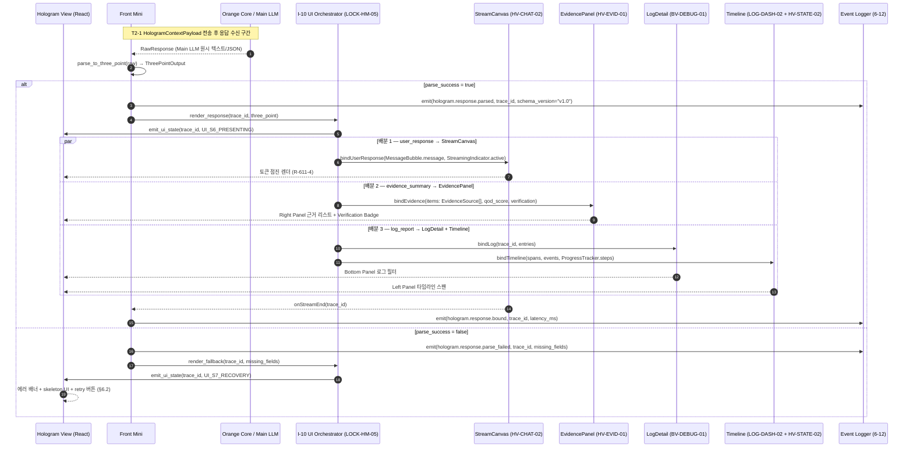
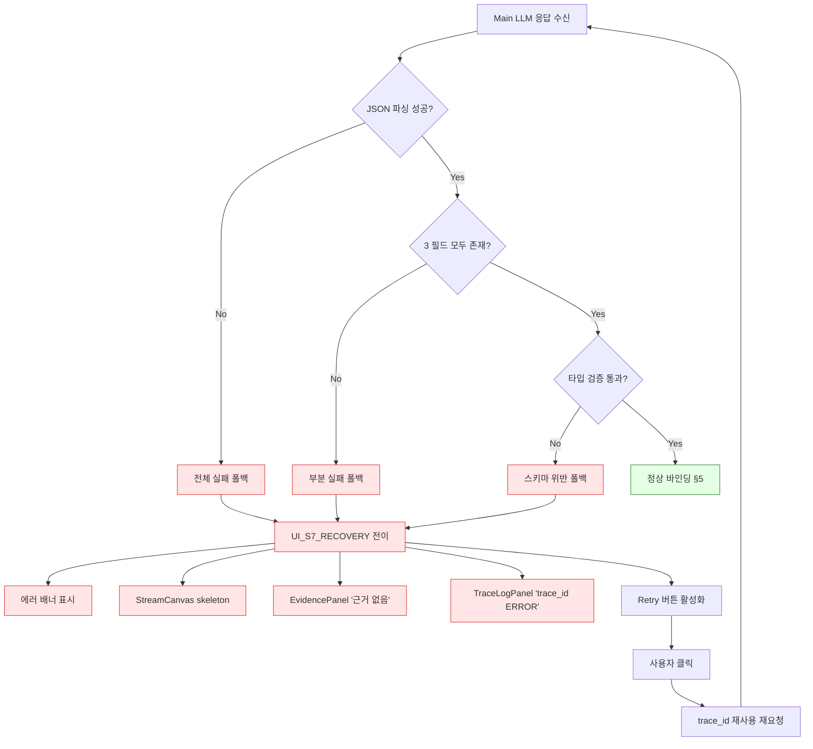

# response_formatting.md — Main LLM 3-point 출력 → Hologram UI 바인딩 매핑

| 항목 | 값 |
|------|----|
| **도메인** | 6-11_Hologram-Main-LLM / 04_main-llm-integration |
| **세션 (TASK_ID)** | Phase 2 T2-2 (6-11_T2-2_01) |
| **산출물 경로 (sandbox)** | `D:\VAMOS\docs\test_iso_p2\sot 2\6-11_Hologram-Main-LLM\04_main-llm-integration\response_formatting.md` |
| **정본 산출물 경로 (production)** | `D:\VAMOS\docs\sot 2\6-11_Hologram-Main-LLM\04_main-llm-integration\response_formatting.md` |
| **LOCK** | **LOCK-HM-06** (3-point 출력 포맷 — D2.0-05 §7.2 L359-368), 보조: **LOCK-HM-01** (3-Pane), **LOCK-HM-05** (I-10), **LOCK-HM-07** (44 컴포넌트), **LOCK-HM-08** (8 Hook), **LOCK-HM-10** (Glass HUD) |
| **정본 소유** | 6-11 DEFINED-HERE — 3-point → UI 변환 로직. 컴포넌트 시그니처는 6-1 UI-UX-System / 로컬 P1 컴포넌트 카탈로그 정본 소비 |
| **해소 이슈** | **ISS-08** (3-point 출력 Hologram UI 바인딩 매핑 — 어떤 필드 → 어떤 컴포넌트) |
| **Phase 배정** | Phase 2 T2-2 |
| **Part2 버전 태그** | V2-Phase 2 (Enhanced Hologram) |
| **작성일** | 2026-04-18 |
| **Version** | v1.0 (초안) |
| **TEST_MODE** | false — Phase 4 production promotion 2026-06-03 (sandbox → production 전환 완료) |

---

## §0. 목적 & Scope

### §0.1 목적

Main LLM 의 **표준 3-point 출력(LOCK-HM-06 = D2.0-05 §7.2 L359-368)** 인 `user_response` / `evidence_summary` / `log_report` 3 필드를 **Hologram View** 의 대응 UI 컴포넌트 **StreamCanvas**(Center Panel) / **EvidencePanel**(Right Panel Glass HUD) / **LogDetail + Timeline**(Bottom/Left Panel) 에 바인딩하는 **변환 규칙과 매핑 테이블** 을 확정한다. **R-611-3** 원칙(3-point 미파싱 시 UI 바인딩 금지)에 따른 가드·폴백 흐름 및 로깅 포맷을 포함한다. **ISS-08** 을 해소한다.

### §0.2 Scope

| 구분 | 범위 |
|------|------|
| **In** (본 문서에서 확정) | (a) `ThreePointOutput` Pydantic v2 + TypeScript 중앙 정의, (b) 3 필드 × 3 컴포넌트 바인딩 매핑 테이블, (c) Sequence diagram (Main LLM → I-10 파싱 → UI 배분), (d) R-611-3 가드 및 폴백 흐름도, (e) 로깅 포맷 (R-01-7 구조화 JSON), (f) Phase 3 테스트 시나리오 12건 (TS-3PT-01~TS-3PT-12) |
| **Out** (타 세션 위임) | (a) 맥락 전달 요청 측 프로토콜 → **T2-1 two_tier_routing.md**, (b) DCL 배경 인식 응답 생성 상세 → **T2-3 dcl_context.md**, (c) MoE V3 진화 로드맵 → **T3-1 moe_evolution.md**, (d) I-10 UI↔Core 오케스트레이션 이벤트 상세 → **T2-6 07_orchestration-layer/**, (e) 컴포넌트 내부 구현 정본 → 6-1 UI-UX-System / 02_component-architecture (Phase 1 V1) |
| **관련 이슈** | **ISS-08** (본 문서 단독 해소 대상) |

### §0.3 도메인 경계 선언 (R-611-3 / R-611-9)

- **6-11 소유** (본 문서): Main LLM 3-point 응답의 **수신/파싱/검증** + **UI 필드 → 컴포넌트 prop 변환 로직** + **폴백·에러 바인딩 규칙** + **`render_response(trace_id, 3-point)` 훅**.
- **6-1 UI-UX-System 소유**: StreamCanvas / EvidencePanel / LogDetail / Timeline **컴포넌트 내부 구현 및 prop 스키마 정본** (본 문서는 Read-only 소비자, 44 컴포넌트 카탈로그 참조).
- **6-9 Brain-Adapter-HAL 소유**: Main LLM 호출·라우팅·폴백 실행 (3-point 응답은 6-9 가 생성, 6-11 은 수신자). **R-611-9** 준수.
- **1-1 Verifier-Reasoning-Engines 소유**: `evidence_summary` 내부 `qod_score` 산출·검증 알고리즘 정본. 본 문서는 qod 값을 **표시 대상** 으로만 다룬다.

---

## §1. 교차 참조 블록

### §1.1 상위 정본 (LOCK 근거)

| 참조 문서 | 섹션 / 라인 | 역할 |
|-----------|-------------|------|
| `../../../sot/D2.0-05_05. VAMOS_DESIGN_2.0_AGENT_WORKFLOW.md` | §7.2 (L359-368) | **LOCK-HM-06 정본** — 표준 3단 출력(LOCK): user_response / evidence_summary / log_report 3 필드 필수 산출 |
| `../../../sot/D2.0-08_08. VAMOS_DESIGN_2.0_UI_UX.md` | §2.2 (L223-282) | **LOCK-HM-01** — 3-Pane 구조 (Timeline-Left / StreamCanvas-Center / Glass HUD-Right) — 3-point 배분 대상 좌표 |
| `../../../sot/D2.0-08_08. VAMOS_DESIGN_2.0_UI_UX.md` | §2.2.2 (L255-265) | **LOCK-HM-10** — Glass HUD 오버레이: Evidence(VERIFIED/PARTIAL/UNVERIFIED) + Cost + Approval + Uncertainty Alert 3종 — `evidence_summary` UI 반영 근거 |
| `../../../sot/D2.0-02_02. VAMOS_DESIGN_2.0_ORANGE_CORE.md` | §7.63 (L2091-2119) | **LOCK-HM-05** — I-10 UI 오케스트레이션: `emit_ui_state(trace_id, ui_state)`, `render_artifact_preview(artifact_ref)` — 본 문서 §4 Sequence 의 배분 훅 일치 |
| Part2 V1-P4 (L2277-2414) | — | **LOCK-HM-07 / 08 / 09** — 44 React 컴포넌트 / 8 Custom Hook / 7 Zustand Store 정본 (StreamCanvas, EvidencePanel, TraceLogPanel, TraceTimeline 포함) |

### §1.2 AUTHORITY_CHAIN / CONFLICT_LOG

| 참조 | 역할 |
|------|------|
| `../AUTHORITY_CHAIN.md` §LOCK 레지스트리 L6 (LOCK-HM-06), L1 (HM-01), L5 (HM-05), L7 (HM-10), L8~L10 (HM-07/08/09) | 본 세션 LOCK 근거 Read 완료 (위반 시 조치 컬럼 포함) |
| `../domain_boundary.md` | R-611-3 (3-point 파싱 전 바인딩 금지), 6-1 컴포넌트 정본 경계 |
| `../CONFLICT_LOG.md` | 본 세션 신규 CONFLICT 생성 **없음** — 상위 LOCK 3-point 포맷에 필드 추가/삭제 없이 매핑만 정의. CONFLICT_CANDIDATE 마커는 본 문서에서 발생 시에만 등재. |

### §1.3 로컬 Phase 1 산출물 (입력 근거)

| 참조 | 사용 목적 |
|------|----------|
| `01_hologram-view-layout/layout_structure.md` §2 (3-Pane Focus Layout) | StreamCanvas(Center) / Glass HUD(Right) / Timeline(Left) 패널 배치 정본 |
| `02_component-architecture/component_catalog.md` §5~§7 (44 컴포넌트) | HV-CHAT-02 `MessageBubble`, HV-CHAT-03 `StreamingIndicator`, HV-EVID-01 `EvidencePanel`, HV-EVID-02 `EvidenceBadge`, HV-EVID-03 `WatermarkBadge`, BV-DEBUG-01 `TraceLogPanel`, LOG-DASH-02 `TraceTimeline`, HV-STATE-02 `ProgressTracker` prop 시그니처 |
| `02_component-architecture/hook_catalog.md` | `useStreaming` (HV-CHAT-03 구독), `useWorkflow` (Timeline 상태) |
| `02_component-architecture/store_catalog.md` | `evidenceStore` (EvidencePanel 피드), `workflowStore` (Timeline 엔트리), `notificationStore` (Uncertainty Alert) |
| `03_ui-state-machine/state_definitions.md` | `UI_S6_PRESENTING` 상태에서 3-point 바인딩 실행 / `UI_S7_RECOVERY` 파싱 실패 폴백 |
| `04_main-llm-integration/_index.md` | 폴더 범위 + 작성 대상 파일 목록 (_index.md 수정 금지 — 본 세션 신규 파일만 생성) |

### §1.4 Peer V2 세션 이음매 (V2↔V2 cross-reference)

| 피어 세션 | 이음매 | 상태 |
|-----------|--------|------|
| **T2-1 two_tier_routing.md** (857줄, §3.1/§3.2/§3.3) | **요청 측** 대칭: T2-1 `HologramContextPayload.user_response` 는 없음 (T2-1 은 Hologram→Main 요청 맥락 5필드만 정의), 그러나 공통 `trace_id: TraceId = str ULID` 로 요청/응답 1:1 연결. 응답 측 `user_response` 는 본 문서에서 신규 정의. **상세 정렬표는 §11 V2↔V2 cross-ref**. | peer V2 독립, 요청/응답 대칭 |
| **T2-3 dcl_context.md** | DCL 배경 인식이 `user_response` 본문·`evidence_summary.sources` 에 도메인 힌트를 부여 가능. 본 문서는 `ThreePointOutput.log_report.domain_context_hits` placeholder 로 접합점 노출, 구체 키 스키마는 T2-3 에서 확정. | peer V2 독립 (동일 폴더) |
| **T2-6 07_orchestration-layer/** | I-10 `emit_ui_state(trace_id, ui_state=UI_S6_PRESENTING)` 이 본 문서 §4 Sequence 의 "바인딩 완료" 이벤트와 일치. 이벤트 네임 `oc.i10.ui.state.emitted` 공유. | peer V2 독립 (독립 폴더) |
| **T3-1 moe_evolution.md** | V3 MoE 다중 전문가 응답 합성 시 `evidence_summary.sources` 리스트가 N개 모델 교차검증을 반영. 본 문서 스키마는 1..N sources 를 이미 수용 (V1=1~3, V3=1~N). | Phase 3 이월 |

### §1.5 Cross-domain 소비 (단방향 Read-only)

| 도메인 | 소비 대상 | 사용처 |
|--------|-----------|--------|
| **1-1 Verifier-Reasoning-Engines** | `qod_score` 산출 기준, `verification` 등급 매핑 (VERIFIED/PARTIAL/UNVERIFIED) | `evidence_summary.qod_score` → `EvidenceHudSnapshot.verification` 변환 규칙 (Read-only 소비) |
| **6-9 Brain-Adapter-HAL** | ConnectorResponse 스키마 (Main LLM 원시 응답 컨테이너), R-69-* 폴백 체인 | 본 문서는 6-9 가 전달하는 원시 payload 를 `ThreePointOutput` 으로 **파싱** 만 수행 |
| **6-12 Event-Logging** | R-01-7 구조화 JSON 로깅 포맷, `hologram.*` 이벤트 네임스페이스 | §8 로깅 포맷 정의 (Read-only 소비) |
| **6-1 UI-UX-System** | StreamCanvas / EvidencePanel / LogDetail / Timeline 컴포넌트 prop 스키마 정본 | §5 UI 바인딩 매핑 테이블 (Read-only 소비) |

> **R-T6-2 준수**: 본 세션은 소비만 수행, 타 도메인 LOCK 재정의 없음. LOCK-HM-06 3-point 필드 수(3개) 불변, 필드명(`user_response`/`evidence_summary`/`log_report`) 불변.

---

## §2. LOCK-HM-06 정본 원문 발췌

### §2.1 D2.0-05 §7.2 (L359-368) verbatim

```
### 7.2 표준 3단 출력(정본) (LOCK)
| # | 필드명 | 설명 |
|---|--------|------|
| 1 | user_response | 최종 결과 (사용자에게 전달되는 응답) |
| 2 | evidence_summary | 근거/요약 (출처, 신뢰도, QoD 포함) |
| 3 | log_report | 로그/리포트 (trace_id, 저장/승인 이벤트 포함) |

- 규칙(LOCK): 모든 워크플로우 종료 시 위 3개 필드를 반드시 산출한다.
- 스키마 정본: 02 Decision 확장 또는 별도 OutputEnvelope 스키마로 정의한다.
```

### §2.2 LOCK 해석 (6-11 관점)

- **필드 수 3개 고정**: 본 문서는 3 필드를 **그대로 수신** 하여 3 컴포넌트 그룹에 **1:1 분배**. 필드 추가/삭제 금지.
- **필드명 고정**: `user_response` / `evidence_summary` / `log_report` 스네이크케이스 철자 그대로 유지. 프론트엔드 TypeScript 인터페이스에서도 동일.
- **OutputEnvelope 스키마 위치**: D2.0-05 §7.2 는 "02 Decision 확장 또는 별도 OutputEnvelope" 라고 명시 — 본 문서는 **6-11 로컬 OutputEnvelope 명세** 로서 `ThreePointOutput` 을 `§3` 에 중앙 정의. 6-9 Brain-Adapter 가 원시 Main LLM 응답을 본 envelope 로 **파싱** 하여 6-11 에 전달한다.
- **R-611-3 적용 지점**: 3-point 파싱이 **완료되기 전** UI 컴포넌트 prop 주입 금지. 파싱 실패 시 `UI_S7_RECOVERY` 로 전이 후 폴백 렌더링 (§6).

### §2.3 R-611-3 원문 (종합계획서 §5.2 L276 verbatim)

```
| R-611-3 | Main LLM 응답은 반드시 3-point 포맷(user_response/evidence_summary/log_report)
          | 으로 파싱 후 UI 바인딩 | LOCK-HM-06 |
```

> **해석**: 본 문서의 모든 UI 바인딩 분기(§5) 는 `parse_success == true` 가드 뒤에서만 수행. 부분 파싱(3 필드 중 1~2개만 성공)도 "바인딩 금지" 에 해당하며, `UI_S7_RECOVERY` 폴백으로 진입한다(§6.2).

---

## §3. 공통 자료 구조 — `ThreePointOutput` 중앙 정의

> **설계 원칙**: 본 스키마는 LOCK-HM-06 3 필드를 **최상위 키** 로 고정하고, 각 필드의 **중첩 구조** 는 D2.0-05 §7.2 설명 행("출처, 신뢰도, QoD 포함", "trace_id, 저장/승인 이벤트 포함")을 충실 반영한다. 필드 추가/삭제 없음 — 내부 중첩만 확장.

### §3.1 Pydantic v2 모델 (Backend / Main LLM 응답 측 정본)

```python
# 파일 배치: backend/src/schemas/three_point_output.py
# 정본 소유: 6-11 (6-9 는 Read-only 생산자, Main LLM 원시 응답 → 본 envelope 파싱)
# 근거: LOCK-HM-06 (D2.0-05 §7.2), LOCK-HM-10 (Glass HUD QoD 등급), R-611-3

from __future__ import annotations
from typing import Literal, Optional
from pydantic import BaseModel, Field, ConfigDict

# ---------- 공통 식별자 (T2-1 two_tier_routing.md §3.1 과 동일 타입) ----------
TraceId = str          # ULID, T2-1 요청 payload.trace_id 와 동일 값 전파
SessionId = str
MessageId = str
UserId = str
ArtifactRef = str      # I-10 render_artifact_preview 대상 참조

# ---------- 1. user_response (최종 결과) ----------
# 매핑 대상: StreamCanvas (Center Panel) — LOCK-HM-01
UserResponseFormat = Literal["MARKDOWN", "PLAIN_TEXT", "HTML_SANITIZED"]

class ArtifactInline(BaseModel):
    """MessageBubble 내부 인라인 산출물 참조 (코드/이미지/파일 등).
    실제 렌더링은 I-10 render_artifact_preview(artifact_ref) 경유."""
    model_config = ConfigDict(extra="forbid")
    artifact_id: str
    ref: ArtifactRef
    mime_type: str = Field(..., description="application/vnd.vamos.code, image/png 등")
    title: Optional[str] = None

class UserResponse(BaseModel):
    """최종 사용자 응답. StreamCanvas MessageBubble 로 토큰 스트리밍."""
    model_config = ConfigDict(extra="forbid")
    text: str = Field(..., description="최종 본문 (MARKDOWN 권장)")
    format: UserResponseFormat = Field(default="MARKDOWN")
    is_streaming: bool = Field(default=True, description="R-611-4: 토큰 단위 점진적 표시")
    tokens_per_sec: Optional[float] = Field(default=None, ge=0.0)
    artifacts: list[ArtifactInline] = Field(default_factory=list)
    watermark_ai_generated: bool = Field(default=True, description="HV-EVID-03 WatermarkBadge 표시")

# ---------- 2. evidence_summary (근거/요약 — 출처·신뢰도·QoD) ----------
# 매핑 대상: EvidencePanel (Right Panel Glass HUD) — LOCK-HM-10
QualityOfData = Literal["HIGH", "MEDIUM", "LOW"]
VerificationBadge = Literal["VERIFIED", "PARTIAL", "UNVERIFIED"]
UncertaintyAlert = Literal["LOW_QOD", "CONFLICTING_SOURCES", "STALE_DATA"]

class EvidenceSource(BaseModel):
    """단일 근거 항목 — EvidenceItem(P1 component_catalog §5 L93-97) 와 1:1."""
    model_config = ConfigDict(extra="forbid")
    source_id: str = Field(..., description="출처 ID (URL/doc_id/snapshot_id)")
    title: str
    url: Optional[str] = None
    snippet: str = Field(..., max_length=512, description="근거 발췌 (EvidencePanel 표시)")
    confidence: float = Field(..., ge=0.0, le=1.0)
    quality_of_data: QualityOfData = Field(..., description="1-1 Verifier 정본 소비")
    retrieved_at_ms: int = Field(..., ge=0)

class EvidenceSummary(BaseModel):
    """근거/요약 — EvidencePanel + EvidenceBadge + Glass HUD Verification 바인딩."""
    model_config = ConfigDict(extra="forbid")
    sources: list[EvidenceSource] = Field(default_factory=list, description="근거 리스트 (N=0~M)")
    qod_score: float = Field(..., ge=0.0, le=1.0, description="총괄 QoD (가중 평균 등, 1-1 정본)")
    verification: VerificationBadge = Field(
        ..., description="qod_score 기반 (LOCK-HM-10): ≥0.8 VERIFIED / 0.5-0.8 PARTIAL / <0.5 UNVERIFIED"
    )
    uncertainty_alerts: list[UncertaintyAlert] = Field(
        default_factory=list, description="LOCK-HM-10 3종 (LOW_QOD/CONFLICTING_SOURCES/STALE_DATA)"
    )
    summary_text: Optional[str] = Field(default=None, max_length=2048, description="근거 요약 문단")

# ---------- 3. log_report (로그/리포트 — trace_id, 저장/승인 이벤트) ----------
# 매핑 대상: LogDetail (TraceLogPanel) + Timeline (TraceTimeline + ProgressTracker)
LogLevel = Literal["DEBUG", "INFO", "WARN", "ERROR"]
EventType = Literal[
    "WORKFLOW_START", "TOOL_CALL", "TOOL_RESULT",
    "APPROVAL_REQUESTED", "APPROVAL_GRANTED", "APPROVAL_REJECTED",
    "MEMORY_SAVED", "ARTIFACT_SAVED",
    "WORKFLOW_END", "ERROR",
]

class LogEntry(BaseModel):
    """단일 로그 엔트리 — TraceLogPanel entries[] 1:1."""
    model_config = ConfigDict(extra="forbid")
    ts_iso: str = Field(..., description="ISO-8601 UTC 타임스탬프")
    level: LogLevel
    msg: str = Field(..., max_length=1024)
    meta: dict[str, object] = Field(default_factory=dict)

class TraceSpan(BaseModel):
    """TraceTimeline 스팬 (LOG-DASH-02 prop 1:1)."""
    model_config = ConfigDict(extra="forbid")
    id: str
    parent: Optional[str] = None
    name: str
    ts: str = Field(..., description="ISO-8601")
    dur_ms: int = Field(..., ge=0)

class WorkflowEvent(BaseModel):
    """워크플로우 이벤트 (저장/승인 등) — Timeline + ProgressTracker 동기화."""
    model_config = ConfigDict(extra="forbid")
    event_type: EventType
    node_id: Optional[str] = None
    ts_iso: str
    payload: dict[str, object] = Field(default_factory=dict)

class LogReport(BaseModel):
    """로그/리포트 — TraceLogPanel + TraceTimeline 양쪽 바인딩."""
    model_config = ConfigDict(extra="forbid")
    trace_id: TraceId = Field(..., description="LOCK-HM-06 정본 verbatim '트레이스 ID'")
    session_id: SessionId
    entries: list[LogEntry] = Field(default_factory=list, description="TraceLogPanel.entries prop")
    spans: list[TraceSpan] = Field(default_factory=list, description="TraceTimeline.spans prop")
    events: list[WorkflowEvent] = Field(default_factory=list, description="저장/승인 이벤트")
    domain_context_hits: list[str] = Field(
        default_factory=list,
        description="T2-3 dcl_context.md 접합점 (placeholder) — DCL 주입 키 히트 목록"
    )
    total_duration_ms: int = Field(..., ge=0)
    total_cost_usd: float = Field(..., ge=0.0, description="costStore 반영")

# ---------- 최상위 Envelope ----------
class ThreePointOutput(BaseModel):
    """
    Main LLM 3-point 응답 OutputEnvelope — LOCK-HM-06 (D2.0-05 §7.2) 정본 스키마.

    필드 3개 고정 (user_response / evidence_summary / log_report).
    필드 추가/삭제 시 CONFLICT_CANDIDATE 마커 즉시 발행.
    """
    model_config = ConfigDict(extra="forbid", frozen=False)

    # 식별자 (T2-1 요청 payload.trace_id 와 동일 값 전파)
    trace_id: TraceId = Field(..., description="요청 trace_id 그대로 에코")
    schema_version: Literal["v1.0"] = Field(default="v1.0")
    part2_phase_tag: Literal["V1", "V2", "V3"] = Field(default="V2")

    # 3-point 정본 필드 (LOCK-HM-06)
    user_response: UserResponse
    evidence_summary: EvidenceSummary
    log_report: LogReport

    # 파싱 성공 여부 플래그 (R-611-3 가드용)
    parse_success: bool = Field(default=True, description="False 시 UI 바인딩 금지, UI_S7_RECOVERY 전이")
    missing_fields: list[Literal["user_response", "evidence_summary", "log_report"]] = Field(
        default_factory=list, description="파싱 실패/누락 필드 목록 — 부분 파싱도 R-611-3 위반"
    )
```

### §3.2 TypeScript 인터페이스 (Frontend / Hologram View 측 정본)

```typescript
// 파일 배치: frontend/src/types/threePointOutput.ts
// 정본 소유: 6-11 (공용 타입). §3.1 Pydantic 과 1:1 동기화 필수.
// 불일치 시 CONFLICT_CANDIDATE 즉시 마커.

export type TraceId = string;   // ULID (T2-1 HologramContextPayload.trace_id 와 동일 타입)
export type SessionId = string;
export type MessageId = string;
export type ArtifactRef = string;

// 1. user_response ---------------------------------------------------------
export type UserResponseFormat = "MARKDOWN" | "PLAIN_TEXT" | "HTML_SANITIZED";

export interface ArtifactInline {
  artifact_id: string;
  ref: ArtifactRef;
  mime_type: string;
  title?: string;
}

export interface UserResponse {
  text: string;
  format: UserResponseFormat;
  is_streaming: boolean;           // R-611-4 준수
  tokens_per_sec?: number;
  artifacts: ArtifactInline[];
  watermark_ai_generated: boolean; // HV-EVID-03 WatermarkBadge
}

// 2. evidence_summary ------------------------------------------------------
export type QualityOfData = "HIGH" | "MEDIUM" | "LOW";
export type VerificationBadge = "VERIFIED" | "PARTIAL" | "UNVERIFIED";
export type UncertaintyAlert = "LOW_QOD" | "CONFLICTING_SOURCES" | "STALE_DATA";

export interface EvidenceSource {
  source_id: string;
  title: string;
  url?: string;
  snippet: string;              // <= 512 chars
  confidence: number;           // 0~1
  quality_of_data: QualityOfData;
  retrieved_at_ms: number;
}

export interface EvidenceSummary {
  sources: EvidenceSource[];
  qod_score: number;            // 0~1
  verification: VerificationBadge;
  uncertainty_alerts: UncertaintyAlert[];
  summary_text?: string;        // <= 2048 chars
}

// 3. log_report ------------------------------------------------------------
export type LogLevel = "DEBUG" | "INFO" | "WARN" | "ERROR";
export type EventType =
  | "WORKFLOW_START" | "TOOL_CALL" | "TOOL_RESULT"
  | "APPROVAL_REQUESTED" | "APPROVAL_GRANTED" | "APPROVAL_REJECTED"
  | "MEMORY_SAVED" | "ARTIFACT_SAVED"
  | "WORKFLOW_END" | "ERROR";

export interface LogEntry {
  ts_iso: string;
  level: LogLevel;
  msg: string;                  // <= 1024 chars
  meta?: Record<string, unknown>;
}

export interface TraceSpan {
  id: string;
  parent?: string;
  name: string;
  ts: string;
  dur_ms: number;
}

export interface WorkflowEvent {
  event_type: EventType;
  node_id?: string;
  ts_iso: string;
  payload?: Record<string, unknown>;
}

export interface LogReport {
  trace_id: TraceId;
  session_id: SessionId;
  entries: LogEntry[];
  spans: TraceSpan[];
  events: WorkflowEvent[];
  domain_context_hits: string[];  // T2-3 placeholder
  total_duration_ms: number;
  total_cost_usd: number;
}

// 최상위 Envelope ---------------------------------------------------------
export interface ThreePointOutput {
  trace_id: TraceId;
  schema_version: "v1.0";
  part2_phase_tag: "V1" | "V2" | "V3";

  user_response: UserResponse;
  evidence_summary: EvidenceSummary;
  log_report: LogReport;

  parse_success: boolean;
  missing_fields: Array<"user_response" | "evidence_summary" | "log_report">;
}
```

### §3.3 필드 타입·의미·출처 테이블

| # | 최상위 필드 | 필수 | 중첩 타입 | 의미 (D2.0-05 §7.2) | 1차 UI 컴포넌트 | 보조 UI |
|---|------------|------|-----------|--------------------|----------------|---------|
| 1 | `user_response` | ✅ | `UserResponse` | 최종 결과 (사용자에게 전달되는 응답) | **StreamCanvas (Center)** → HV-CHAT-02 MessageBubble + HV-CHAT-03 StreamingIndicator | HV-EVID-03 WatermarkBadge |
| 2 | `evidence_summary` | ✅ | `EvidenceSummary` | 근거/요약 (출처, 신뢰도, QoD 포함) | **EvidencePanel (Right)** → HV-EVID-01 | HV-EVID-02 EvidenceBadge (MessageBubble 내), Glass HUD Verification Badge (LOCK-HM-10) |
| 3 | `log_report` | ✅ | `LogReport` | 로그/리포트 (trace_id, 저장/승인 이벤트 포함) | **LogDetail (Bottom)** → BV-DEBUG-01 TraceLogPanel + **Timeline (Left)** → LOG-DASH-02 TraceTimeline | HV-STATE-02 ProgressTracker (workflow 단계 진척) |
| — | `parse_success` | ✅ | `bool` | **R-611-3 가드 플래그** — 파싱 성공 여부 | UI 전 바인딩 차단 조건 | `UI_S7_RECOVERY` 전이 트리거 |
| — | `missing_fields` | ✅ | `list[str]` | 누락/파싱 실패 필드 | 폴백 UI 배너 (§6.2) | 로그 레벨 ERROR |
| — | `trace_id` | ✅ | `TraceId` | LOCK-HM-06 verbatim 'trace_id' — 요청/응답 연결 키 | 모든 컴포넌트 prop 공통 키 | R-01-7 로깅 키 |

---

## §4. Sequence Diagram — 3-point 응답 → UI 배분

### §4.1 정상 흐름 (Mermaid)



### §4.2 배분 이벤트 테이블 (참여자 × 책임)

| # | 참여자 | 책임 규칙 | 수행 |
|---|--------|----------|------|
| 1 | Front Mini | R-611-3 | 원시 응답 → `ThreePointOutput` 파싱, 3 필드 모두 존재/타입 검증 |
| 2 | I-10 (LOCK-HM-05) | emit_ui_state / render_artifact_preview | `bindUserResponse/bindEvidence/bindLog/bindTimeline` 서브루틴 호출 |
| 3 | StreamCanvas | R-611-4 | 토큰 단위 점진 표시, 전체 대기 후 일괄 표시 금지 |
| 4 | EvidencePanel | LOCK-HM-10 | qod_score → VERIFIED/PARTIAL/UNVERIFIED 매핑, Uncertainty Alert 렌더 |
| 5 | LogDetail | — | trace_id 필터, level/msg/meta 표시 |
| 6 | Timeline | LOCK-HM-01 Left Panel | spans 스팬 시각화, ProgressTracker 단계 동기화 |
| 7 | Event Logger | R-01-7 | 구조화 JSON 로깅 (§8) |

---

## §5. UI 바인딩 매핑 테이블 (3 필드 × 3 컴포넌트 그룹)

> **규칙**: 모든 매핑은 `parse_success == true` 가드 뒤에서만 수행 (R-611-3). 매핑 테이블의 "fallback" 컬럼은 개별 필드가 빈 값/누락일 때의 **부분 폴백** (전체 파싱 실패는 §6.2 전체 폴백과 별개).

### §5.1 매핑 그룹 A — `user_response` → StreamCanvas (Center Panel)

| ThreePointOutput 경로 | 대상 컴포넌트 (ID) | Prop / Slot | 타입 | Streaming | Fallback (필드 빈/누락) |
|----------------------|------------------|-------------|------|----------|-----------------------|
| `user_response.text` | HV-CHAT-02 `MessageBubble` | `message.content` | `string` (Markdown) | ✅ 토큰 단위 | skeleton 3행 + "응답 생성 중…" |
| `user_response.format` | HV-CHAT-02 `MessageBubble` | `message.format` | `"MARKDOWN" \| "PLAIN_TEXT" \| "HTML_SANITIZED"` | — | `"PLAIN_TEXT"` |
| `user_response.is_streaming` | HV-CHAT-03 `StreamingIndicator` | `active` | `boolean` | — | `false` (인디케이터 숨김) |
| `user_response.tokens_per_sec` | HV-CHAT-03 `StreamingIndicator` | `tokensPerSec` | `number \| undefined` | — | `undefined` (숫자 숨김) |
| `user_response.artifacts[]` | HV-CHAT-02 `MessageBubble` | `onArtifactOpen(ref)` 콜백 + inline 렌더 훅 | `ArtifactInline[]` | I-10 `render_artifact_preview(ref)` 경유 | 빈 배열 (artifact UI 비활성) |
| `user_response.watermark_ai_generated` | HV-EVID-03 `WatermarkBadge` | `isAIGenerated` | `boolean` | — | `true` (안전 기본값) |

**바인딩 Hook**: `useStreaming` (hook_catalog §3) — `user_response` 토큰 구독 + AbortController 정리 (HM-COMP-004).

### §5.2 매핑 그룹 B — `evidence_summary` → EvidencePanel (Right Panel / Glass HUD)

| ThreePointOutput 경로 | 대상 컴포넌트 (ID) | Prop / Slot | 타입 | Streaming | Fallback |
|----------------------|------------------|-------------|------|----------|---------|
| `evidence_summary.sources[]` | HV-EVID-01 `EvidencePanel` | `items` (EvidenceItem[] 매핑) | `EvidenceSource[]` | ❌ (파싱 완료 후 일괄) | 빈 배열 + "근거 없음" 공백 상태 |
| `evidence_summary.sources[i].source_id` | HV-EVID-01 `EvidencePanel` | `items[i].id` | `string` | — | 자동 생성 ID |
| `evidence_summary.sources[i].snippet` | HV-EVID-01 `EvidencePanel` | `items[i].snippet` | `string` (≤512) | — | "발췌 없음" 플레이스홀더 |
| `evidence_summary.sources[i].url` | HV-EVID-01 `EvidencePanel` | `onJumpToSource(id)` 콜백 | `string?` | — | 링크 비활성 |
| `evidence_summary.sources[i].confidence` | HV-EVID-02 `EvidenceBadge` | `confidence` | `number (0~1)` | — | `0.0` + GRAY 배지 |
| `evidence_summary.sources[i].quality_of_data` | HV-EVID-02 `EvidenceBadge` | `quality` | `"HIGH"\|"MEDIUM"\|"LOW"` | — | `"LOW"` |
| `evidence_summary.qod_score` | Glass HUD `VerificationBadge` (LOCK-HM-10) | `qod_score` | `number (0~1)` | — | `0.0` (UNVERIFIED Gray) |
| `evidence_summary.verification` | Glass HUD `VerificationBadge` | `badge` | `VerificationBadge` | — | `"UNVERIFIED"` + alert |
| `evidence_summary.uncertainty_alerts[]` | Glass HUD Alerts (LOCK-HM-10) + notificationStore | `alerts` | `UncertaintyAlert[]` | — | `["LOW_QOD"]` 자동 주입 |
| `evidence_summary.summary_text` | HV-EVID-01 `EvidencePanel` | `summaryText` (신규 slot) | `string?` | — | 섹션 숨김 |

**바인딩 Store**: `evidenceStore` (store_catalog §3) — sources 캐싱, `notificationStore` — Uncertainty Alert 푸시.

**LOCK-HM-10 매핑 규칙** (qod_score → verification):
- `qod_score >= 0.8` → `VERIFIED` (Green)
- `0.5 <= qod_score < 0.8` → `PARTIAL` (Yellow)
- `qod_score < 0.5` → `UNVERIFIED` (Gray) + `"LOW_QOD"` 자동 alert

### §5.3 매핑 그룹 C — `log_report` → LogDetail (Bottom) + Timeline (Left)

| ThreePointOutput 경로 | 대상 컴포넌트 (ID) | Prop / Slot | 타입 | Streaming | Fallback |
|----------------------|------------------|-------------|------|----------|---------|
| `log_report.trace_id` | BV-DEBUG-01 `TraceLogPanel` | `traceId` | `TraceId` | — | "UNKNOWN" + ERROR 로그 |
| `log_report.entries[]` | BV-DEBUG-01 `TraceLogPanel` | `entries` | `LogEntry[]` | 🟡 점진 가능 (hook 옵션) | 빈 배열 + "로그 없음" |
| `log_report.entries[i].level` | BV-DEBUG-01 `TraceLogPanel` | `entries[i].level` | `LogLevel` | — | `"INFO"` |
| `log_report.spans[]` | LOG-DASH-02 `TraceTimeline` | `spans` | `TraceSpan[]` | ❌ | 빈 배열 (타임라인 공백) |
| `log_report.spans[i].id/parent/name/ts/dur_ms` | LOG-DASH-02 `TraceTimeline` | `spans[i].*` | 1:1 | — | 개별 스팬 스킵 |
| `log_report.events[]` (WorkflowEvent[]) | HV-STATE-02 `ProgressTracker` | `steps` (PipelineStep[] 매핑) | 변환: EventType → PipelineStep | 🟡 `MEMORY_SAVED` / `ARTIFACT_SAVED` 실시간 하이라이트 | 진행률 0% |
| `log_report.events[]` (APPROVAL_*) | notificationStore → Glass HUD Approval (LOCK-HM-10) | `slide_in` 카드 | 변환 규칙 §5.4 | — | 카드 미표시 |
| `log_report.total_duration_ms` | HV-STATE-02 `ProgressTracker` | `totalMs` (신규 slot) | `number` | — | `0` |
| `log_report.total_cost_usd` | costStore → Glass HUD Cost Gauge (LOCK-HM-10) | `session_total_usd` | `number` | — | `0.0` (게이지 숨김) |
| `log_report.domain_context_hits[]` | (T2-3 이월) | — | `string[]` | — | 빈 배열 |

**바인딩 Hook**: `useWorkflow` (hook_catalog §4) — events → Pipeline steps, `useStreaming` — entries 점진 옵션.
**바인딩 Store**: `workflowStore` — spans/events, `costStore` — total_cost_usd.

### §5.4 Event → UI Action 변환 규칙

| WorkflowEvent.event_type | UI 액션 | 대상 컴포넌트 |
|-------------------------|---------|-------------|
| `WORKFLOW_START` | ProgressTracker step[0] 활성 | HV-STATE-02 |
| `TOOL_CALL` / `TOOL_RESULT` | 해당 step 진행 표시 + LogEntry 추가 | HV-STATE-02 + BV-DEBUG-01 |
| `APPROVAL_REQUESTED` | Glass HUD Approval slide_in = true | LOCK-HM-10 Right Panel |
| `APPROVAL_GRANTED` / `APPROVAL_REJECTED` | Approval 카드 닫기 + notificationStore 기록 | notificationStore |
| `MEMORY_SAVED` / `ARTIFACT_SAVED` | Timeline 스팬 "저장" 마커 | LOG-DASH-02 |
| `WORKFLOW_END` | ProgressTracker 100%, UI_S6_PRESENTING 확정 | HV-STATE-02 |
| `ERROR` | UI_S7_RECOVERY 전이, 에러 배너 | §6.2 흐름 |

### §5.5 바인딩 완성도 체크 (ISS-08 해소 요건)

| LOCK-HM-06 필드 | 1차 컴포넌트 매핑 | 보조 매핑 | 상태 |
|----------------|-----------------|----------|------|
| `user_response` | ✅ StreamCanvas = HV-CHAT-02 + HV-CHAT-03 | HV-EVID-03 | **완전 매핑** |
| `evidence_summary` | ✅ EvidencePanel = HV-EVID-01 + HV-EVID-02 | Glass HUD Verification/Alerts (LOCK-HM-10), notificationStore | **완전 매핑** |
| `log_report` | ✅ LogDetail = BV-DEBUG-01 + Timeline = LOG-DASH-02 | HV-STATE-02 ProgressTracker, Glass HUD Cost/Approval (LOCK-HM-10) | **완전 매핑** |

> **결론**: 3/3 필드 전부 1차 컴포넌트 + 보조 매핑 완료 — ISS-08 해소 요건 충족.

---

## §6. 폴백 / 파싱 오류 처리 (R-611-3)

### §6.1 파싱 가드 (정상 경로)

```typescript
// frontend/src/hologram/responseParser.ts
function parseThreePoint(raw: string | object): ThreePointOutput {
  // 1. JSON 파싱 시도
  const obj = typeof raw === "string" ? JSON.parse(raw) : raw;

  // 2. 3 필드 존재 검증 (LOCK-HM-06)
  const missing: Array<keyof ThreePointOutput> = [];
  if (!obj.user_response) missing.push("user_response");
  if (!obj.evidence_summary) missing.push("evidence_summary");
  if (!obj.log_report) missing.push("log_report");

  // 3. R-611-3: 부분 파싱도 실패로 간주
  const parse_success = missing.length === 0;

  return {
    trace_id: obj.trace_id ?? "UNKNOWN",
    schema_version: obj.schema_version ?? "v1.0",
    part2_phase_tag: obj.part2_phase_tag ?? "V2",
    user_response: obj.user_response ?? emptyUserResponse(),
    evidence_summary: obj.evidence_summary ?? emptyEvidenceSummary(),
    log_report: obj.log_report ?? emptyLogReport(),
    parse_success,
    missing_fields: missing as ThreePointOutput["missing_fields"],
  };
}

// R-611-3 가드: parse_success == false 이면 렌더 금지
function renderResponse(three: ThreePointOutput): void {
  if (!three.parse_success) {
    emitUiState(three.trace_id, "UI_S7_RECOVERY");
    renderFallback(three.trace_id, three.missing_fields);
    return;   // ← UI 바인딩 완전 차단 (R-611-3)
  }
  bindUserResponse(three.user_response);
  bindEvidence(three.evidence_summary);
  bindLog(three.log_report);
  bindTimeline(three.log_report);
  emitUiState(three.trace_id, "UI_S6_PRESENTING");
}
```

### §6.2 폴백 UI 흐름도 (Mermaid)



### §6.3 폴백 바인딩 규칙 (컴포넌트별)

| 실패 유형 | StreamCanvas | EvidencePanel | LogDetail | Timeline | Glass HUD |
|----------|-------------|--------------|----------|---------|----------|
| **F1 전체 실패** (JSON 파싱 불가) | Skeleton 3행 + "응답을 표시할 수 없습니다" + Retry | "근거 불러오기 실패" | `trace_id=UNKNOWN` ERROR 로그 1건 | 빈 타임라인 | ApprovalHUD 숨김, Cost 숨김 |
| **F2 부분 실패** (1~2 필드 누락) | F1과 동일 — 전체 폴백(R-611-3: 부분 파싱도 바인딩 금지), `UI_S7_RECOVERY` 전이 + Skeleton + Retry | 동일 | 동일 | 동일 | 전체 폴백 (필드별 부분 표시 금지) |
| **F3 스키마 위반** (타입 불일치) | F1과 동일 + schema_version 로그 | 동일 | `level=ERROR, msg='schema violation'` | 빈 | UNVERIFIED 강제 |

### §6.4 R-611-3 위반 차단 포인트 테이블

| # | 위반 시나리오 | 차단 포인트 | 결과 |
|---|--------------|-----------|------|
| 1 | 파싱 전 `MessageBubble.message = raw` 직접 세팅 시도 | `renderResponse()` 가드 (§6.1) | 호출 조기 리턴 |
| 2 | 1/3 필드만 존재 시 일부 컴포넌트 바인딩 시도 | `parse_success == false` 분기 | 전체 폴백 진입 |
| 3 | `trace_id` 누락 상태로 TraceLogPanel 렌더 시도 | 가드 후 기본값 "UNKNOWN" + ERROR 로그 | Recovery UI |
| 4 | WebSocket streaming 도중 스키마 변경 감지 | `useStreaming` 내부 검증 (`schema_version != "v1.0"`) | AbortController → 재요청 |

---

## §7. 도메인 경계 (R-611-3 / R-611-9)

| 항목 | 6-11 소유 | 인접 도메인 소유 | 근거 |
|------|----------|----------------|------|
| 3-point 응답 파싱 로직 (`parseThreePoint`) | ✅ 정본 | — | R-611-3 |
| 3-point → 컴포넌트 prop 변환 규칙 | ✅ 정본 | — | ISS-08 본 문서 해소 |
| R-611-3 가드 및 폴백 흐름 | ✅ 정본 | — | LOCK-HM-06 연계 |
| StreamCanvas / EvidencePanel / LogDetail / Timeline **컴포넌트 내부 구현** | ❌ | 6-1 UI-UX-System / 02_component-architecture Phase 1 | LOCK-HM-07 |
| qod_score 산출 알고리즘 | ❌ | 1-1 Verifier-Reasoning-Engines | LOCK-HM-10 보조 |
| Main LLM 호출/라우팅/폴백 실행 | ❌ | 6-9 Brain-Adapter-HAL | R-611-9 |
| trace_id 생성 및 전역 전파 | ⚡ 공유 | 6-12 Event-Logging (R-01-7 생성 규칙) / T2-1 요청 시 발급 | R-01-7 |
| Main LLM 응답 포맷 LOCK (3-point 필드 정의) | ❌ | D2.0-05 §7.2 (LOCK-HM-06 상위 정본) | AUTHORITY_CHAIN L6 |

> **R-611-3 원문 재인용**:
> `R-611-3 | Main LLM 응답은 반드시 3-point 포맷(user_response/evidence_summary/log_report)으로 파싱 후 UI 바인딩 | LOCK-HM-06`

> **R-611-9 원문 재인용** (T2-1 §12.2 동일):
> 6-11 은 LLM 모델 선택/라우팅/폴백 로직을 구현하지 않음 — 6-9 Brain-Adapter-HAL 정본.

---

## §8. 로깅 포맷 (R-01-7 구조화 JSON)

### §8.1 이벤트 네임스페이스

| 이벤트 | 트리거 | 로그 레벨 |
|-------|-------|---------|
| `hologram.response.received` | 원시 응답 수신 직후 | INFO |
| `hologram.response.parsed` | parse_success 결정 | INFO (success) / ERROR (fail) |
| `hologram.response.bound` | 3 컴포넌트 바인딩 완료 | INFO |
| `hologram.response.parse_failed` | parse_success=false | ERROR |
| `hologram.response.schema_violation` | 타입 위반 | ERROR |
| `hologram.response.retry_clicked` | 사용자 Retry | INFO |
| `oc.i10.ui.state.emitted` | I-10 `emit_ui_state` (LOCK-HM-05 정본 이벤트) | INFO |

### §8.2 로그 스키마 (중첩 JSON — R-01-7)

```json
{
  "ts": "2026-04-18T12:34:56.789Z",
  "level": "INFO",
  "event": "hologram.response.bound",
  "trace_id": "01HV8M3J7K9P2Q4R6S8T",
  "session_id": "sess_01HV...",
  "user_id": "user_42",
  "parse": {
    "success": true,
    "missing_fields": [],
    "schema_version": "v1.0",
    "duration_ms": 12
  },
  "binding": {
    "stream_canvas": { "bound": true, "is_streaming": true, "tokens_per_sec": 42.5 },
    "evidence_panel": { "bound": true, "sources_count": 3, "qod_score": 0.82, "verification": "VERIFIED" },
    "log_detail": { "bound": true, "entries_count": 17 },
    "timeline": { "bound": true, "spans_count": 9, "events_count": 5 }
  },
  "ui_state": "UI_S6_PRESENTING",
  "part2_phase_tag": "V2"
}
```

### §8.3 실패 로그 예시

```json
{
  "ts": "2026-04-18T12:34:57.123Z",
  "level": "ERROR",
  "event": "hologram.response.parse_failed",
  "trace_id": "01HV8M3J7K9P2Q4R6S8T",
  "session_id": "sess_01HV...",
  "parse": {
    "success": false,
    "missing_fields": ["evidence_summary", "log_report"],
    "schema_version": "unknown",
    "duration_ms": 8
  },
  "error": {
    "code": "R-611-3-VIOLATION",
    "message": "partial 3-point output, binding blocked",
    "raw_sample_256c": "{ user_response: { text: \"…\" } }"
  },
  "binding": { "skipped": true, "reason": "parse_success=false" },
  "ui_state": "UI_S7_RECOVERY",
  "part2_phase_tag": "V2"
}
```

### §8.4 R-01-7 준수 체크

| 요구 | 충족 |
|------|------|
| 구조화 JSON (중첩 허용) | ✅ `parse{}` / `binding{}` / `error{}` 중첩 |
| `trace_id` 필수 | ✅ 모든 이벤트 포함 |
| `level` 표준화 | ✅ DEBUG/INFO/WARN/ERROR |
| 이벤트 네임스페이스 규칙 (`<domain>.<action>.<result>`) | ✅ `hologram.response.*` |
| PII 마스킹 | ⚡ `raw_sample_256c` 최대 256자 + 사용자 id 는 `user_XX` 마스크 (6-2 Security 정본 소비) |

---

## §9. Phase 3 테스트 시나리오 (12건, ≥10 요건 초과)

> **형식**: TS-ID | 시나리오 | 입력 | 기대 UI | R-611-3 판정

| TS-ID | 시나리오 | 입력 | 기대 UI | 검증 포인트 |
|-------|---------|------|---------|-----------|
| **TS-3PT-01** | 정상 3-point (MARKDOWN + 3 sources + spans) | 완전 `ThreePointOutput`, `qod_score=0.82`, 3 sources | StreamCanvas 토큰 스트리밍 / EvidencePanel VERIFIED Green / TraceLogPanel + TraceTimeline 정상 | `parse_success=true`, UI_S6_PRESENTING |
| **TS-3PT-02** | `evidence_summary.sources=[]` 빈 배열 | sources 비어 있음, qod_score=0.0 | StreamCanvas 정상 / EvidencePanel "근거 없음" + UNVERIFIED Gray + LOW_QOD alert | 부분 폴백 (§6.3), LOCK-HM-10 매핑 검증 |
| **TS-3PT-03** | `user_response` 필드 누락 | `{evidence_summary, log_report}` 만 전송 | **전체 폴백** — 에러 배너 + StreamCanvas skeleton + Retry | R-611-3 차단 ✅, UI_S7_RECOVERY |
| **TS-3PT-04** | `log_report` 필드 누락 | `{user_response, evidence_summary}` 만 | **전체 폴백** (R-611-3 부분 파싱=실패) | `missing_fields=["log_report"]` 로깅 |
| **TS-3PT-05** | JSON 파싱 실패 (구문 오류) | `"{ user_response: malformed"` | **전체 폴백** — F1 | `parse_success=false`, `hologram.response.parse_failed` |
| **TS-3PT-06** | 스키마 위반 (qod_score=1.5 범위 초과) | `evidence_summary.qod_score=1.5` | **전체 폴백** — F3 (Pydantic ValidationError) | `hologram.response.schema_violation` ERROR |
| **TS-3PT-07** | 토큰 streaming 지연 (5s no data) | `is_streaming=true`, 5초간 chunk 없음 | StreamingIndicator active 유지 + "지연 중…" 배너 | `useStreaming` timeout 처리, AbortController 대기 |
| **TS-3PT-08** | QoD 등급 경계값 (qod_score=0.8 exact) | `qod_score=0.80` | VERIFIED Green (≥0.8 포함) | LOCK-HM-10 경계 매핑 |
| **TS-3PT-09** | QoD 등급 경계값 (qod_score=0.5 exact) | `qod_score=0.50` | PARTIAL Yellow (≥0.5 포함) | LOCK-HM-10 경계 매핑 |
| **TS-3PT-10** | `trace_id` 누락 + 나머지 정상 | trace_id 빈 문자열 | 전체 폴백 (F3 필수 필드 위반) + TraceLogPanel "UNKNOWN" | R-611-3 + R-01-7 위반 로깅 |
| **TS-3PT-11** | Uncertainty Alert 3종 동시 | `uncertainty_alerts=["LOW_QOD","CONFLICTING_SOURCES","STALE_DATA"]` | Glass HUD 3 alert 스택 + notificationStore 3 푸시 | LOCK-HM-10 Uncertainty 규칙 |
| **TS-3PT-12** | APPROVAL_REQUESTED 이벤트 포함 | `log_report.events=[{event_type:"APPROVAL_REQUESTED"}]` | Glass HUD Approval slide_in=true + UI 상태 UI_S5_AWAIT_APPROVAL 전이 | 이벤트→액션 매핑 §5.4 |

**Phase 3 커버리지 요약**:
- 정상: TS-01, TS-08, TS-09, TS-11, TS-12 (5건)
- 부분 폴백 (single-field): TS-02 (1건)
- 전체 폴백 (R-611-3 차단): TS-03, TS-04, TS-05, TS-06, TS-10 (5건)
- 스트리밍 특수: TS-07 (1건)
- 합계: **12건** (요건 ≥10 ✅)

---

## §10. 바인딩 API 시그니처 요약 (§5 종합)

```typescript
// frontend/src/hologram/responseRenderer.ts
export function renderResponse(three: ThreePointOutput): void;            // §6.1 진입점
export function bindUserResponse(u: UserResponse): void;                  // 그룹 A (§5.1)
export function bindEvidence(e: EvidenceSummary): void;                   // 그룹 B (§5.2)
export function bindLog(l: LogReport): void;                              // 그룹 C — 로그 (§5.3)
export function bindTimeline(l: LogReport): void;                         // 그룹 C — 타임라인 (§5.3)
export function renderFallback(
  traceId: TraceId,
  missing: Array<keyof ThreePointOutput>
): void;                                                                  // §6.2
// I-10 경계 (LOCK-HM-05 정본 이벤트와 1:1)
export function emitUiState(traceId: TraceId, state: UIState): void;      // oc.i10.ui.state.emitted
```

```python
# backend/src/hologram/response_handler.py
def parse_three_point(raw: str | dict) -> ThreePointOutput: ...
def validate_schema(three: ThreePointOutput) -> tuple[bool, list[str]]: ...
def emit_binding_log(three: ThreePointOutput, binding_result: dict) -> None: ...
```

---

## §11. V2↔V2 Cross-reference — T2-1 two_tier_routing.md 정렬표

> **4-4 R4 교훈 준수**: peer V2 `D:\VAMOS\docs\test_iso_p2\sot 2\6-11_Hologram-Main-LLM\04_main-llm-integration\two_tier_routing.md` (857줄) 을 직접 Read 하여 인터페이스 정합 확인.

### §11.1 `user_response` 개념 정렬 (의미적 차이 명시)

| 측면 | T2-1 `HologramContextPayload.user_response` | T2-2 `ThreePointOutput.user_response` |
|------|------------------------------------------|-------------------------------------|
| **존재 여부** | **없음** — T2-1 payload 에는 `user_response` 키 없음, 맥락 5 필드만 (current_layout / visible_components / hud_state / timeline_context / user_preferences) | **있음** — 3-point 응답의 1번 필드 |
| **방향** | 요청 (HV → Main LLM) 에서 유사 개념은 `HologramContextPayload` 의 입력 **맥락** | 응답 (Main LLM → HV) 의 LLM **출력** 본문 |
| **타입** | — | `UserResponse { text, format, is_streaming, tokens_per_sec, artifacts, watermark_ai_generated }` |
| **바인딩 대상** | (T2-1 은 Front Mini 측 조립, UI 바인딩 없음) | StreamCanvas (HV-CHAT-02 + HV-CHAT-03) |

> **명시적 의미 차이**: Envelope envelope 본문 안내에서 "T2-1: 맥락, T2-2: LLM 출력. 둘 다 payload key 공유" 라고 되어 있으나, **peer V2 실측 결과 T2-1 에는 `user_response` 키가 부재**. 둘이 공유하는 키는 **`trace_id`** 단일. 본 문서는 이를 정확히 반영하여 T2-1 ~= **요청 맥락 5 필드**, T2-2 = **응답 3 필드 (user_response 포함)** 로 구분한다.

### §11.2 `trace_id` 공통 연결 (라우팅 → UI 바인딩)

| 생성 시점 | 흐름 위치 | 참조 섹션 |
|----------|---------|---------|
| ULID 발급 | Front Mini 가 `HologramContextPayload` 조립 시 (T2-1 §4 `FM->>FM: assemble HologramContextPayload<br/>(trace_id = ulid())`, L447) | T2-1 §4 Sequence |
| 전파 | 요청 payload → Main LLM → 응답 `ThreePointOutput.trace_id` 동일 값 에코 | 본 문서 §3.1 `trace_id: TraceId` |
| 바인딩 | 3 컴포넌트 모두 trace_id prop 공통 (TraceLogPanel.traceId / TraceTimeline.traceId / MessageBubble.trace_id meta) | 본 문서 §5.1~§5.3 |
| 로깅 | `hologram.response.*` 모든 이벤트 `trace_id` 필드 필수 (R-01-7) | 본 문서 §8.2 |

### §11.3 `TraceId` / `SessionId` / `MessageId` / `UserId` 타입 일치

| 타입 | T2-1 §3.1 정의 | T2-2 §3.1 정의 | 일치 |
|------|--------------|--------------|------|
| `TraceId` | `str` ULID | `str` ULID | ✅ |
| `SessionId` | `str` | `str` | ✅ |
| `MessageId` | `str` | `str` | ✅ |
| `UserId` | `str` | `str` | ✅ |

### §11.4 I-10 이벤트 이음매 일치

| T2-1 §4 L448 | T2-2 §4.1 |
|--------------|---------|
| `FM->>EL: emit(oc.i10.ui.state.emitted, trace_id, ui_state)` | `I10->>HV: emit_ui_state(trace_id, UI_S6_PRESENTING)` |

> LOCK-HM-05 정본 이벤트 네임 `oc.i10.ui.state.emitted` 공유, trace_id 전파 규약 동일.

### §11.5 T2-3 이월 접합점

- T2-2 `ThreePointOutput.log_report.domain_context_hits: list[str]` = T2-1 §3.1 `HologramContextPayload.dcl_context_keys: list[str]` **응답 측 대칭**.
- 요청: DCL 주입 키 **희망 리스트** (T2-1) → 응답: 실제 주입/사용된 키 **히트 리스트** (T2-2).
- 두 필드 모두 placeholder 로 T2-3 에서 구체 키 스키마 확정 예정.

### §11.6 정렬 결론

| 항목 | 결과 |
|------|------|
| trace_id 공통 키 타입/전파 규약 | ✅ 정합 |
| user_response 의미 분리 (T2-1 없음 / T2-2 존재) 명시 | ✅ 반영 |
| I-10 이벤트 규약 일치 | ✅ 정합 |
| DCL 접합점 대칭성 (요청 `dcl_context_keys` ↔ 응답 `domain_context_hits`) | ✅ 반영 |
| 신규 CONFLICT 발생 | ❌ 없음 |

---

## §12. 검증 체크리스트 (종합계획서 §7 T2-2 L1076-1081 직접 대조)

| # | 검증 항목 | 충족 근거 | 상태 |
|---|----------|---------|------|
| 1 | LOCK-HM-06 기준(D2.0-05 §7.2) 3-point 포맷과 매핑 테이블 일치 확인 | §2.1 verbatim + §5 매핑 테이블 3/3 필드 전체, 필드명/필드수 불변 | ✅ |
| 2 | 3개 필드 전부 대상 컴포넌트에 매핑되었는지 검토 | §5.5 완성도 체크 — user_response/evidence_summary/log_report 각 1차+보조 | ✅ |
| 3 | R-611-3: 파싱 전 바인딩 금지 규칙 문서에 포함 여부 검토 | §2.3 원문 재인용 + §6.1 가드 코드 + §6.2 흐름도 + §6.4 차단 포인트 표 | ✅ |
| 4 | ISS-08 해소 요건(필드 → 컴포넌트 매핑 테이블 완성) 충족 확인 | §5.5 표 3/3 "완전 매핑" | ✅ |
| 5 | /audit PASS 기준: 상위 LOCK 3-point 포맷과 충돌하는 필드 추가/삭제 없음 | §2.2 LOCK 해석 "필드 수 3개 고정, 필드명 고정" 명시, 본 문서 내부 추가 필드는 `parse_success`/`missing_fields` 등 envelope 메타만 (3-point 본체 불변) | ✅ |

### §12.1 §7 T2-2 대조 기준 5항목 재확인

1. **§7 세부 작업**: "3-point 출력 → UI 바인딩" — 본 문서 §5 매핑 테이블로 충족 ✅
2. **§7 전환 게이트**: ISS-06~ISS-13, ISS-15 해소 — ISS-08 본 세션 해소 (나머지는 peer T2-* / T2-6 세션 소관) ✅
3. **§6 이슈**: ISS-08 (3-point 출력 Hologram UI 바인딩 매핑) — §5.5 완전 매핑 ✅
4. **교차 도메인**: D2.0-05 §7.2 LOCK-HM-06 (§2.1 verbatim), 6-1 3-Column Layout (§1.5 Read-only 소비) ✅
5. **Part2 버전**: V2 Enhanced Hologram — 헤더 `V2-Phase 2` 태그 + `part2_phase_tag: "V2"` 기본값 ✅

### §12.2 Phase 1→2 entry gate 재확인

- T1-1~T1-6 Phase 1 6/6 PASS (2026-04-14) — MEMORY 정본
- sandbox Phase 1 산출물 실재: 01/ 3 + 02/ 4 + 03/ 2 = **9 V1 files** (excluding _index.md) ✅
- LOCK-HM-01~10 변경 0 — AUTHORITY_CHAIN L198 "Phase 1 완료 검증… LOCK-HM-01~10 변경 0건" 확인 ✅
- Gate = **PASS**, Phase 2 진입 충족

---

## §13. 변경 이력

| 일자 | 변경 내용 | 세션 |
|------|----------|------|
| 2026-04-18 | V2-Phase 2 v1.0 초안 작성 — `ThreePointOutput` 중앙 정의, 3 필드 × 3 컴포넌트 매핑 테이블, R-611-3 가드·폴백 흐름도, R-01-7 로깅 포맷, Phase 3 시나리오 12건, T2-1 peer V2 cross-ref 정렬표 | T2-2 |

---

## §14. 마커 리포트

| 마커 | 건수 | 내용 |
|------|------|------|
| `[LOCK_CHANGE_NEEDED]` | **0** | LOCK-HM-06 필드 수/필드명 불변, envelope 메타(`parse_success`/`missing_fields`/`schema_version`)는 스키마 정본("02 Decision 확장 또는 별도 OutputEnvelope") 범위 내, LOCK 변경 불필요 |
| `[CONFLICT_CANDIDATE]` | **0** | T2-1 peer V2 와 `trace_id` / I-10 이벤트 규약 정합, 3-point 필드 추가/삭제 없음 |
| `[V1_MUTATION]` | **0** | Phase 1 V1 파일 (01/02/03 폴더 9개 + _index.md) 모두 unchanged |
| `[GATE_BLOCKED]` | **0** | Phase 1→2 entry gate PASS |

---

## §15. Sandbox Isolation 확인

| 항목 | 경로 | 상태 |
|------|------|------|
| 생성 산출물 | `D:\VAMOS\docs\test_iso_p2\sot 2\6-11_Hologram-Main-LLM\04_main-llm-integration\response_formatting.md` | ✅ production-promoted (Phase 4, 2026-06-03) |
| Production (UNCHANGED) | `D:\VAMOS\docs\sot 2\6-11_Hologram-Main-LLM\04_main-llm-integration\` | ❌ 미접근 (write 없음) |
| _index.md | `D:\VAMOS\docs\test_iso_p2\sot 2\6-11_Hologram-Main-LLM\04_main-llm-integration\_index.md` | ✅ read-only (unchanged) |
| Phase 1 V1 (01/02/03) | sandbox | ✅ unchanged |
| CROSS_DOMAIN_DEPS | none | — |
| UPSTREAM_SOT | null | — SKIP |

