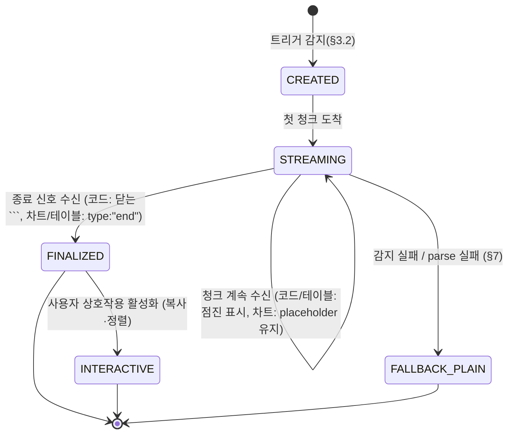

# artifact_rendering.md — 아티팩트 인라인 렌더링 (코드/차트/테이블)

| 항목 | 값 |
|------|----|
| **도메인** | 6-11_Hologram-Main-LLM / 06_streaming-canvas |
| **세션 (TASK_ID)** | Phase 2 T2-5 (6-11_T2-5_01) |
| **산출물 경로 (sandbox)** | `D:\VAMOS\docs\test_iso_p2\sot 2\6-11_Hologram-Main-LLM\06_streaming-canvas\artifact_rendering.md` |
| **정본 산출물 경로 (production)** | `D:\VAMOS\docs\sot 2\6-11_Hologram-Main-LLM\06_streaming-canvas\artifact_rendering.md` |
| **LOCK** | **LOCK-HM-01** (Center Panel Stream Canvas "산출물 인라인 렌더링" — D2.0-08 §2.2 L223-240), **R-611-4** (차트 예외 명시적 해석, §2.3) |
| **정본 소유** | 6-11 DEFINED-HERE (전면 신규) — ArtifactZone 트리거·언어 감지·차트 렌더 타이밍·테이블 행 단위 규칙. 컴포넌트 내부 구현은 6-1 UI-UX-System + Phase 1 V1 정본. |
| **해소 이슈** | **ISS-12** (아티팩트 인라인 렌더링) |
| **Phase 배정** | Phase 2 T2-5 |
| **Part2 버전 태그** | V2-Phase 2 (Enhanced Hologram) |
| **작성일** | 2026-04-18 |
| **Version** | v1.0 (초안) |
| **TEST_MODE** | false — Phase 4 production promotion 2026-06-03 (sandbox → production 전환 완료) |

---

## §0. 목적 & Scope

### §0.1 목적

본 문서는 6-11 Hologram-Main-LLM / 06_streaming-canvas 폴더의 T2-5 세션 산출물로서, **대화 스트림(Center Panel Stream Canvas) 중간에 인라인으로 렌더링되는 아티팩트(코드/차트/테이블) 3종의 렌더링 규칙**을 확정한다. 상위 정본인 **LOCK-HM-01** (D2.0-08 §2.2 L223-240) 의 "산출물 인라인 렌더링" 문장을 1차 근거로 삼아, ArtifactZone 활성화 트리거·언어 감지·syntax highlight·차트 전체 렌더 타이밍·테이블 행 단위 점진·폴백 규칙을 수립한다.

본 문서는 종합계획서 §7 Phase 2 T2-5 의 **ISS-12 (아티팩트 인라인 렌더링)** 을 해소한다.

### §0.2 Scope

**In-scope (본 문서에서 확정)**:
- ArtifactZone 활성화 트리거 매트릭스 (§3)
- 코드 블록 감지 + 언어 감지 + syntax highlight 파이프라인 (§4)
- 차트 아티팩트: 전체 수신 후 1회 렌더 + placeholder (§5) — R-611-4 예외
- 테이블 아티팩트 행 단위 점진 렌더 (§6) — R-611-4 준수
- 아티팩트 타입 감지 실패 시 plain text 폴백 (§7)
- z-index 50 Stream Canvas 내부 유지 (§8)
- 로깅 스펙 (§10)
- Phase 3 테스트 시나리오 ≥12건 (§12)

**Out-of-scope (타 문서 소관)**:
- 청크 전송 프로토콜 · SSE 프레임 구조 → `./stream_protocol.md` (sibling, T2-5 #2b-2 동일 배치) §3
- 토큰 단위 VDOM 파이프라인 · flush 스케줄링 → `./token_rendering.md` (sibling, T2-5 #2b-2 동일 배치) §5.3
- 컴포넌트 내부 구현(HV-ARTIFACT-01 ArtifactZone / HV-ARTIFACT-02 CodeBlock / HV-ARTIFACT-03 ChartCanvas / HV-ARTIFACT-04 DataTable) → Phase 1 V1 `component_catalog.md` + 6-1 UI-UX-System 컴포넌트 정본
- HUD z-index 150·Alert 200·Modal 300 상위 stacking → `../05_glass-hud-overlay/rendering_rules.md` §3.2
- Evidence/Cost/Approval HUD 카드 콘텐츠 → `../05_glass-hud-overlay/overlay_schema.md`
- `StreamArtifactType` / `StreamChunk` 공통 자료구조 → `./stream_protocol.md` §3 (본 문서는 **import 참조만**, 재정의 금지)

### §0.3 도메인 경계 선언

본 문서가 정의하는 **"아티팩트 렌더링 규칙"** (트리거 조건·언어 감지·차트 타이밍·행 단위 점진·폴백·z-index 50) 은 6-11 DEFINED-HERE. 컴포넌트 DOM 구조·시각 토큰·접근성 ARIA 속성은 6-1 UI-UX-System + Phase 1 V1 정본 (R-T6-2 경계 표).

---

## §1. 교차 참조 블록

### §1.1 상위 정본

| 소스 | 위치 | 인용 범위 | 본 문서 근거 |
|------|------|----------|-------------|
| **D2.0-08 (종합계획서)** | §2.2 L223-240 | LOCK-HM-01 3-Panel 레이아웃 — Center Panel 항목 **"산출물 인라인 렌더링"** | §2.1 verbatim, §2.2 해석 |
| **D2.0-08** | §(R-611-4 영역) | R-611-4 원문 — 토큰 단위 점진 표시 필수, 일괄 표시 금지 | §2.3 차트 예외 해석 |
| **종합계획서 §7 Phase 2 T2-5** | artifact_rendering.md 절차 5-unit | 코드/차트/테이블/폴백/하이라이팅 | §3~§7 전반 |

### §1.2 AUTHORITY_CHAIN / CONFLICT_LOG

- **AUTHORITY_CHAIN**: D2.0-08 LOCK-HM-01 → 본 문서. 하위 파생 없음(본 문서가 말단 규칙).
- **CONFLICT_LOG**: 본 세션에서 신규 CFL 발생 없음 (LOCK-HM-01 3줄 verbatim · R-611-4 verbatim 모두 §2.1/§2.3 인용 충실).
- 만약 Phase 2 후속 세션에서 본 문서의 차트 예외 해석(§2.3)이 상위 정본 추가 지시와 상충하면 CFL 신규 등록 (CFL-HM-ART-XX).

### §1.3 로컬 Phase 1 산출물 (Read-only 소비)

| 컴포넌트 ID | 정본 | 본 문서에서의 소비 방식 |
|-----------|------|---------------------|
| **HV-ARTIFACT-01** ArtifactZone | `../02_component-architecture/component_catalog.md` | §3 트리거 대상 컨테이너. 내부 DOM·props 는 정본 소유. 본 문서는 **활성화 시점·라이프사이클**만 정의. |
| **HV-ARTIFACT-02** CodeBlock | 동상 | §4 highlight 파이프라인의 호출 대상. |
| **HV-ARTIFACT-03** ChartCanvas | 동상 | §5 차트 JSON consumer. |
| **HV-ARTIFACT-04** DataTable | 동상 | §6 테이블 행 append 대상. |
| **artifactStore** | Phase 1 V1 state 카탈로그 | 스트리밍 중 partial 데이터 축적. |
| **useArtifact** hook | Phase 1 V1 hook 카탈로그 | 컴포넌트 내부 구독. |

### §1.4 Peer V2 이음매

| Peer V2 | 경로 (상대) | 본 문서와의 이음매 요약 |
|---------|-----------|---------------------|
| **stream_protocol.md** (sibling, T2-5 #2b-2) | `./stream_protocol.md` | §3 `StreamArtifactType = Literal["code","chart","table","plain"]` 및 `StreamChunk.type="artifact"` + `artifact_type` 필드. 본 문서 §3·§5 에서 **import 참조** (재정의 금지). 종료 신호 `type:"end"` 가 §5.3 차트 1회 렌더 트리거. |
| **token_rendering.md** (sibling, T2-5 #2b-2) | `./token_rendering.md` | §5.3 긴 코드 블록 안전 파싱 로직이 ``` 오픈 감지 후 본 문서 §3 ArtifactZone 트리거 함수를 호출. VDOM flush 단위 협업. |
| **rendering_rules.md** (T2-4) | `../05_glass-hud-overlay/rendering_rules.md` | §3.2 z-index 계층 (HUD 150 / Alert 200 / Modal 300) 정합. ArtifactZone 은 Stream Canvas 내부 z-index 50 유지 → HUD 위 존재 금지. §4.5 reduced-motion 정책 공유. |
| **overlay_schema.md** (T2-4) | `../05_glass-hud-overlay/overlay_schema.md` | §2.3 R-611-2 "투명 레이어 — 하위 콘텐츠 상호작용 차단 금지" — 본 문서 §8.3 에서 ArtifactZone 내부 상호작용(복사 버튼·정렬)은 HUD 아님을 명시. |
| **response_formatting.md** (T2-2) | `../04_main-llm-integration/response_formatting.md` | §3.1 `UserResponse.artifacts: list[ArtifactInline]` 필드. 각 `ArtifactInline` 은 `artifact_id`/`ref`(=`ArtifactRef` string) 필드를 가지며 본 문서 §3 에서 소비. 스트리밍 완료 시 최종 artifacts 배열이 확정. |
| **two_tier_routing.md** (T2-1) | `../04_main-llm-integration/two_tier_routing.md` | §3.1 L140 TraceId ULID 공통. 각 artifact mount 이벤트에 `trace_id` 태깅 (§10 로그). |
| **component_catalog.md** (Phase 1 V1) | `../02_component-architecture/component_catalog.md` | HV-ARTIFACT-01~04 정본. 본 문서는 Read-only 소비. |

### §1.5 Cross-domain 소비 (RECHECK 대상)

| 소비 도메인 | 소비 지점 | Flag |
|-----------|---------|------|
| **6-1 UI-UX-System** | 컴포넌트 시각 토큰 (Orange/Blue 테마 · border-radius · spacing) | RECHECK 대기 (Phase 2 진입 후) |
| **6-2 Security-Governance** | 차트/이미지 artifact URL 검증 · SSRF 방어 · MIME sniffing | RECHECK 대기 (§5.5 raw 표시 경로 + §9 에러 폴백) |
| **6-12 Event-Logging** | §10 이벤트 네임스페이스 소비 (hologram.artifact.*) | RECHECK 대기 (6-12 정본 이벤트 카탈로그 등록) |

---

## §2. LOCK-HM-01 + R-611-4 정본 해석

### §2.1 LOCK-HM-01 verbatim (§2 재인용)

```
Left Panel (Timeline & Context): 폭 접기 가능(약 250px). 세션 기록 + 활성 도메인/노드 표시.
Center Panel (Stream Canvas): 메인(가장 넓음). 대화 스트림 + 산출물 인라인 렌더링 + 입력.
Right Panel (Glass HUD): 오버레이 또는 고정(약 300px). Evidence/Cost/Approval을 "필요 시" 카드로 노출.
```

> **핵심 문장 (본 문서 근거)**: Center Panel 정의 중 "**산출물 인라인 렌더링**" — 산출물(=아티팩트)이 대화 스트림 본문과 섞여 인라인으로 배치됨을 명시.

### §2.2 "산출물 인라인 렌더링" 해석

**해석 (본 문서 확정)**:

1. "산출물" = 코드 블록 / 차트 / 테이블 3종을 우선 지원 (Phase 2 범위). 이미지·파일 첨부는 Phase 2+ 이월.
2. "인라인 렌더링" = Stream Canvas 내부 **대화 블록(MessageBubble)의 본문 흐름 안**에 ArtifactZone 이 wrap 되어 배치. 별도 모달/탭/패널로 분리하지 않음.
3. 따라서 ArtifactZone 의 stacking context 는 Stream Canvas(`z-index: 50`) 내부로 한정되며, HUD(150) 위로 튀어나오지 않는다 (§8).
4. 스트리밍 중에도 사용자는 "텍스트 → 아티팩트 시작 → 텍스트" 를 끊김 없이 수직 스크롤로 읽는다.

### §2.3 R-611-4 원문 verbatim + 차트 예외 해석

> **R-611-4 원문 verbatim**:
> "StreamCanvas 는 토큰 단위 점진적 표시 필수, 전체 응답 대기 후 일괄 표시 금지"

**3종 아티팩트별 R-611-4 적용**:

| 아티팩트 | R-611-4 적용 방식 | 근거 |
|---------|-----------------|------|
| **코드 블록** | **준수**. 스트리밍 중 토큰이 도착하는 즉시 모노스페이스 + 줄번호로 표시. 닫는 ``` 수신 후 1회 syntax highlight 실행. (§4.3) | 텍스트 기반이므로 점진 표시 가능 |
| **차트** | **예외 (명시적 해석)**. 부분 JSON 상태로 렌더하면 축 범위·스케일이 튀고 시각적 무결성이 깨지므로, 전체 데이터 수신 완료 후 **1회 렌더**. 단, 사용자에게는 `<ChartPlaceholder>` skeleton 애니메이션 + "차트 데이터 수신 중…" 텍스트로 **점진적 피드백 보장**. (§5) | R-611-4 의 "점진적 표시" 는 **텍스트 기준**으로 해석. 차트는 시각적 무결성이 우선이며, placeholder 로 "응답 대기 UX" 를 회피한다. |
| **테이블** | **준수**. 마크다운 `|...|` 행이 도착할 때마다 `<tbody>` 에 append. `<thead>` 는 구분선 `|---|` 수신 후 확정. (§6) | 행은 독립적이므로 점진 표시 가능 |

> **예외 해석 근거**: R-611-4 는 "전체 응답 대기 후 일괄 표시 금지" 를 금지하는데, 차트의 경우 placeholder 가 "점진적 피드백" 을 제공하므로 "전체 응답 대기" 에 해당하지 않는다. 즉 사용자가 느끼는 체감 UX 는 연속적이며, 실제 chart mount 만 1회 지연된다. "점진적 표시 = 텍스트 기준" 해석을 §2.3 에 명시적으로 기록한다.

### §2.4 [VIOLATION: R-611-4] 트리거 조건

다음 중 하나라도 발생 시 R-611-4 위반:

1. **코드 블록**: 닫는 ``` 수신 전까지 DOM 에 아무것도 표시하지 않고, 닫힌 후 전체를 한 번에 mount → **절대 금지**.
2. **테이블**: 모든 행 수신 완료 전까지 `<table>` mount 자체를 지연 → **절대 금지**.
3. **차트**: placeholder 조차 없이 완전 블랭크 상태로 완료까지 대기 → **금지** (placeholder 필수). 단 완료 후 1회 chart mount 자체는 예외 허용 (§2.3).

위반 시 `hologram.artifact.render_failed` ERROR 로그 발생 (§10).

---

## §3. ArtifactZone 활성화 트리거

### §3.1 ArtifactZone 위치와 z-index

- **위치**: Stream Canvas 내부 MessageBubble 의 본문 흐름 안. 별도 레이어 아님.
- **z-index**: `50` (Stream Canvas 자체 z-index). ArtifactZone 은 `isolation: isolate` (§3.1 격리) 에 의해 **자체 로컬 stacking context 를 의도적으로 생성**하여 내부 z-index 를 격리하되, Stream Canvas 자체 z-index(50) 컨텍스트 내부에 머물러 HUD(150) / Alert(200) / Modal(300) 위로 튀어나올 수 없음. (`../05_glass-hud-overlay/rendering_rules.md` §3.2 정합)
- **격리**: `contain: layout style` + `isolation: isolate` 를 ArtifactZone root 에 부여하여 내부 z-index(예: 코드 복사 버튼 hover) 가 전역 stacking 을 오염시키지 않도록 한다. (§8)

### §3.2 트리거 타입 매트릭스

| 아티팩트 종류 | 감지 트리거 | 소스 | 신뢰도 기준 |
|-------------|-----------|------|-----------|
| **code** | 1. ` ```<lang>? ` 3-백틱 시작 패턴 + 줄바꿈<br>2. `StreamChunk.type="artifact"` + `artifact_type="code"` 명시 | `token_rendering.md` §5.3 delegate 호출 **또는** `stream_protocol.md` §3 StreamChunk | 백틱 패턴 완전 일치 OR artifact_type 명시 → 1.0 |
| **chart** | `StreamChunk.type="artifact"` + `artifact_type="chart"` 명시 | `stream_protocol.md` §3 | 1.0 (명시적 전달만 허용) |
| **table** | 1. 마크다운 `|col1|col2|` + 다음 줄 `|---|---|` 패턴<br>2. `artifact_type="table"` 명시 | `token_rendering.md` §5.3 delegate **또는** StreamChunk | 구분선 감지 시 1.0, 명시 시 1.0, `|` 단독 시 <0.3 → plain 폴백 |
| **plain** (폴백) | 위 3종 모두 불확정 (신뢰도 <0.3) | — | — |

> **규칙**: `StreamChunk.artifact_type` 이 명시적으로 전달된 경우 항상 우선. 텍스트 패턴 감지는 `artifact_type` 미지정 시에만 수행.

### §3.3 ArtifactZone 라이프사이클

ArtifactZone 은 4단계 상태를 가진다:



| 상태 | 진입 조건 | 표시 내용 |
|------|---------|---------|
| **CREATED** | 트리거 감지 | 빈 ArtifactZone mount (높이 min 확보로 레이아웃 시프트 방지) |
| **STREAMING** | 첫 청크 도착 | 코드: 모노스페이스 텍스트 / 차트: placeholder / 테이블: 행 append |
| **FINALIZED** | 종료 신호 | 코드: highlight 적용 / 차트: 1회 렌더 / 테이블: 정렬·검색 활성화 |
| **INTERACTIVE** | FINALIZED 후 사용자 focus | 복사 버튼·정렬 핸들 상호작용 가능 |
| **FALLBACK_PLAIN** | 감지·parse 실패 | `<pre>` plain text 표시 (§7) |

---

## §4. 코드 블록 렌더링

### §4.1 언어 감지 (3-tier)

코드 블록의 언어는 다음 우선순위로 감지한다:

1. **1차 — 명시적 lang_hint**: ` ```python ` 의 ` ```` ` 다음에 오는 식별자. 정규식 `^```([a-zA-Z0-9_+-]+)`. 공백 또는 줄바꿈 전까지를 언어로 간주.
2. **2차 — 휴리스틱**: lang_hint 미지정 시, 수신된 첫 **512 byte** 를 대상으로 `highlight.js`(또는 Shiki) 의 auto-detect 함수 호출. 반환되는 신뢰도(상대 점수 vs 차순위 언어) 를 0~1 로 정규화.
3. **3차 — plain 폴백**: 휴리스틱 신뢰도 `<0.3` → plain text 로 표시 (§7 경로).

> **감지 타이밍**: lang_hint 는 CREATED 진입 즉시, 휴리스틱은 STREAMING 상태에서 첫 512 byte 축적 후 1회 실행. 스트리밍 중 언어가 변경되지 않음 (동일 블록 내 혼합 금지).

### §4.2 syntax highlight 라이브러리 선택

| 후보 | 장점 | 단점 | 권장 |
|------|------|------|------|
| **Shiki** | TextMate grammar → VS Code 동등 정확도. 토큰별 색 정밀 | 번들 크기 큰 편 (lazy-load 필수) | **1순위 (권장)** |
| **highlight.js** | 경량, 브라우저 표준, 광범위 언어 지원 | 색 정확도 Shiki 대비 약간 낮음 | 2순위 (대안) |
| **Prism** | 중간 크기, 플러그인 풍부 | 유지보수 활성도 낮음 | 비권장 |

**최종 선택**: **Shiki** (lazy-load `import()` dynamic). VS Code 동일 grammar 이므로 Phase 1 테마 LOCK(ORANGE/BLUE) 과 정확한 매핑 유지. 번들 문제는 초기 로드 시 `javascript` / `python` / `typescript` / `bash` 4종만 eager, 나머지는 lazy.

### §4.3 스트리밍 중 표시 전략

| 단계 | 표시 내용 |
|------|---------|
| **STREAMING** | 모노스페이스 폰트 + 줄 번호만. syntax highlight 미적용 (성능 보존). 텍스트는 token_rendering §5.3 이 flush 하는 대로 append. |
| **FINALIZED (닫는 ``` 수신 직후)** | 1회 Shiki `codeToHtml` 호출 → DOM 교체 (innerHTML 1회 swap). 깜박임 방지를 위해 transition `opacity 0→1 120ms` 적용. |
| **매우 긴 코드 (>2000 lines)** | `react-window` virtualization. FINALIZED 후에만 virtualization 활성. |

> **금지**: STREAMING 중 매 청크마다 Shiki 재실행 → 성능 저하. FINALIZED 에서 1회만.

### §4.4 복사 버튼

- FINALIZED 이후 ArtifactZone hover 시 우상단에 "Copy" 버튼 노출. HV-ARTIFACT-02 `CodeBlock` 컴포넌트 prop `showCopyButton: boolean` 으로 제어 (Phase 1 정본).
- 복사 대상은 **원본 plain 코드** (highlight HTML 제외).
- 로그: `hologram.artifact.code_copied` (DEBUG).

### §4.5 줄 번호 + overflow-x scroll

- 줄 번호: 1부터 시작, 회색 우측 정렬, `user-select: none`.
- overflow-x: 긴 줄은 가로 스크롤 (wrap 금지 — 코드 의미 보존).
- overflow-y: 2000 줄 미만 시 자연 높이, 초과 시 virtualization.
- reduced-motion: `prefers-reduced-motion: reduce` 시 FINALIZED transition 제거 (rendering_rules §4.5 정합).

### §4.6 언어별 처리 특수 케이스

| 언어 범주 | 특수 처리 |
|---------|---------|
| **마크다운 내부 마크다운** (```markdown 블록 안의 ``` 서브블록) | 중첩 감지 로직으로 내부 서브블록을 plain 으로만 표시. 3-백틱 → 4-백틱 escape 규칙 유지. |
| **긴 한 줄** (>5000 char) | CSS `word-break: break-all` 우선 적용하여 수평 overflow scroll 거리 제한. copy 시 원본 유지. |
| **JSON** | Shiki `json` grammar 사용. FINALIZED 이후 prettify 버튼 노출 (Phase 2+ 옵션). |
| **diff / patch** | `diff` grammar 매핑 + 줄별 background (+ 녹색, - 붉은색). Phase 1 테마 호환 색상 조정. |
| **플레인 / 미지원 언어** | 모노스페이스만, 줄번호 유지. 로그 `hologram.artifact.code_highlighted` 의 `lang="plain"`. |

### §4.7 접근성 (ARIA)

- ArtifactZone root 에 `role="region"` + `aria-label="코드 블록 (언어: {lang})"`.
- FINALIZED 전까지 `aria-busy="true"`, 이후 `false`.
- 복사 버튼 `aria-label="코드 복사"`, 클릭 시 라이브 리전(`role="status"`) 으로 "복사됨" 공지.
- 세부 ARIA 속성 구현은 6-1 UI-UX-System 정본 위임.

---

## §5. 차트 아티팩트 렌더링 (R-611-4 예외)

### §5.1 수신 형태

- 차트 아티팩트는 반드시 **명시적 전달**만 허용: `StreamChunk.type="artifact"` + `artifact_type="chart"`.
- Body 는 JSON 텍스트 (청크로 분할되어 도착 가능). 수신이 진행되는 동안 `artifactStore` 에 raw 문자열 buffer 축적.
- 종료 신호: 후속 `StreamChunk.type="end"` 또는 artifact 종료 마커(stream_protocol §3 정의, 본 문서 재정의 금지).

### §5.2 STREAMING 중 표시 (placeholder)

- ArtifactZone 내부에 `<ChartPlaceholder>` mount.
- Skeleton 애니메이션: gray gradient shimmer (`@keyframes shimmer` 1.4s linear infinite).
- 텍스트: "차트 데이터 수신 중…" 중앙. optional `tokens_per_sec` 또는 `bytes_received / estimated` 진행 표시.
- Placeholder 의 높이는 **min 200px** 고정 (완료 후 실제 차트 높이로 자연 확장, 레이아웃 시프트 최소화).
- `prefers-reduced-motion` 시 shimmer 제거, 정적 회색 박스만 유지.

### §5.3 FINALIZED 후 렌더 (1회)

- 라이브러리: **Recharts** (React native, SVG, 중량 중간, Phase 1 HV-ARTIFACT-03 정본 호환).
- 대안: Chart.js (canvas 기반, 대용량 데이터 유리) — Phase 2+ 옵션.
- 지원 차트 유형: `line` / `bar` / `pie` / `scatter` (Phase 1 HV-ARTIFACT-03 정본 범위).

**차트 JSON schema 예시 (Recharts 호환)**:

```json
{
  "type": "line",
  "data": [
    {"x": 1, "y": 10},
    {"x": 2, "y": 18},
    {"x": 3, "y": 14},
    {"x": 4, "y": 22}
  ],
  "xAxis": {"dataKey": "x", "label": "시간(h)"},
  "yAxis": {"dataKey": "y", "label": "지표"},
  "series": [{"dataKey": "y", "stroke": "#F97316"}]
}
```

- FINALIZED 진입 시 `JSON.parse(buffer)` → schema 검증 → `<LineChart>` / `<BarChart>` / ... mount.
- mount 시 fade-in `opacity 0→1 180ms`. reduced-motion 시 즉시.

### §5.4 R-611-4 예외 근거 (§2.3과 정합)

본 절의 "STREAMING 중 placeholder + FINALIZED 1회 렌더" 전략은 R-611-4 의 "토큰 단위 점진 표시" 규칙에 대한 **명시적 예외**이다.

- **R-611-4 적용 범위**: "점진적 표시 = 텍스트 기준" (§2.3). 시각 컴포넌트는 무결성 우선.
- **점진적 피드백 보장**: placeholder + shimmer + "수신 중…" 텍스트 → 사용자는 "응답 대기" 로 인지하지 않음. 실질적으로 R-611-4 의 목적인 "UX 지각 지연 회피" 는 달성.
- **위반 판정**: placeholder 없이 완전 블랭크 상태로 대기 → §2.4 위반 트리거.

### §5.5 렌더 실패 시 raw 표시

- `JSON.parse` 실패 → ArtifactZone 내부에 `<pre>` 로 raw 문자열 표시 + 상단에 경고 배지 "차트 렌더 실패 (JSON parse 오류)".
- schema 검증 실패 (예: `type` 필드 누락) → 동일 경로, 경고 문구 "차트 스키마 오류".
- 로그: `hologram.artifact.render_failed` ERROR (§10).
- 사용자 액션: raw JSON 복사 가능 (§4.4 복사 버튼 재사용).

### §5.6 차트 타이밍·성능 가이드

| 항목 | 기준 | 비고 |
|------|------|------|
| FINALIZED → mount 완료 | ≤ 200ms (p95, data_points ≤ 500) | 초과 시 `render_failed` WARN 로그(`slow_render`) 추가 |
| data_points 상한 | 5,000 (Phase 2 범위) | 초과 시 자동 downsampling (LTTB 알고리즘 적용 예정, Phase 2+ 옵션) |
| 재렌더 트리거 | FINALIZED 이후 사용자 인터랙션(zoom, legend 토글) | Phase 2 범위 밖, 단 구조는 Phase 1 HV-ARTIFACT-03 호환 유지 |

### §5.7 차트 접근성

- `role="img"` + `aria-label="{chart_type} 차트, 데이터 포인트 {N}개"`.
- 대안 텍스트: FINALIZED 이후 스크린 리더를 위해 숨김 표 형식 `<table role="presentation">` 제공 (Recharts `aria-describedby` 연결).
- 구체 ARIA 구현은 6-1 UI-UX-System 정본 위임.

---

## §6. 테이블 아티팩트 행 단위 점진 렌더 (R-611-4 준수)

### §6.1 마크다운 테이블 파싱

- 파서: **remark-gfm** (GitHub Flavored Markdown 테이블 확장).
- 파이프(`|`) 기반 문법 지원: header row, separator row (`|---|`, `|:---|:---:|---:|` 정렬 지시), body rows.
- 파서는 **streaming-aware**: 한 줄 수신 완료마다 점진 파싱 (전체 완료 대기 금지).

### §6.2 행 단위 렌더 전략

| 수신 단계 | 동작 |
|---------|------|
| 1줄 `|col1|col2|...` 수신 | `<thead>` 후보로 버퍼링 (아직 mount 안 함) |
| 2줄 `|---|---|...` (구분선) 수신 | `<thead>` 확정 mount + 정렬 클래스 적용 (`:---:` 가운데, `---:` 오른쪽) |
| 3줄 이후 `|v1|v2|...` | `<tbody>` 에 `<tr>` append (requestAnimationFrame 단일 flush, token_rendering §5.3 정합) |
| `type:"end"` 수신 | FINALIZED 전이, 정렬·검색 활성 |

- 구분선 감지 실패(2줄이 `|---|` 가 아닌 경우) → 테이블 아님으로 판정, plain 폴백 (§7).
- 빈 행 (`||`) 은 skip 하되 WARN 로그.

### §6.3 대용량 테이블 virtualization

- 500 행 이상 → `react-window` `<FixedSizeList>` 활용.
- virtualization 활성화는 **FINALIZED 이후**만 (STREAMING 중에는 자연 append, 500 행 초과 시 WARN 로그 + 임시 제한).
- 행 높이 추정: 기본 32px (내용 길이 무관, 한 줄 텍스트 가정). 멀티라인 셀은 text overflow ellipsis.

### §6.4 정렬 / 검색

- 정렬(ascending/descending): `<th>` 클릭으로 토글. **FINALIZED 이후만** 활성 (STREAMING 중에는 `aria-disabled="true"` + pointer-events none).
- 검색: Phase 2+ 이월. Phase 2 범위에서는 정렬만.

### §6.5 R-611-4 준수 근거

- 행은 독립적이므로 점진 표시 가능 → 텍스트 스트리밍과 동등.
- 매 행 append 는 token_rendering §5.3 의 rAF flush 큐에 합류 (단일 flush).
- FINALIZED 전이 시 추가 depth 재렌더 없음.

### §6.6 셀 콘텐츠 렌더 규칙

| 콘텐츠 유형 | 처리 |
|-----------|------|
| **plain text** | 기본. `<td>{text}</td>`. |
| **숫자** | `<td className="num">`, 오른쪽 정렬, `font-variant-numeric: tabular-nums`. |
| **URL** | `<a href="...">` + `rel="noopener noreferrer"` + `target="_blank"`. 6-2 Security URL 검증 RECHECK 대상. |
| **마크다운 inline** (`**bold**`, `*italic*`, ``` `code` ```) | remark inline 파서 호출, `<strong>`/`<em>`/`<code>` 로 변환. |
| **HTML** | 금지. DOMPurify 로 sanitize 필요. sanitize 실패 시 plain 으로 강등. |
| **이미지** | Phase 2 범위 밖, plain text 로 처리. |

### §6.7 테이블 접근성

- `<table>` 에 `role="table"` + `aria-rowcount` / `aria-colcount` (FINALIZED 이후 확정).
- `<th>` 에 `scope="col"`, 정렬 활성 시 `aria-sort="ascending" | "descending" | "none"`.
- STREAMING 중에는 `aria-busy="true"`.

---

## §7. 폴백 (타입 감지 실패)

### §7.1 폴백 트리거

- §3.2 트리거 매트릭스에서 신뢰도 `<0.3` 반환
- §4.1 언어 휴리스틱 `<0.3`
- §5.3 / §5.5 JSON parse·schema 실패 (단 이 경로는 §5.5 raw 표시 우선, §7 는 **최종 안전망**)
- §6.2 구분선 감지 실패

### §7.2 폴백 DOM

```html
<pre className="artifact-fallback-plain">
{raw_text}
</pre>
```

- CSS: `font-family: monospace; white-space: pre-wrap; word-break: break-word;`
- `white-space: pre-wrap` 으로 **줄바꿈 유지** + 긴 줄 자동 wrap (overflow-x 억제).
- 배경은 대화 블록 본문과 동일 (ArtifactZone 고유 배경 미적용).

### §7.3 사용자 알림 최소화

- 폴백 발생 시 **사용자에게 별도 알림 없이** plain 표시 (UX 침해 최소화, silent fallback).
- 단 디버그 모드(`DEBUG_ARTIFACT=1`)에서는 ArtifactZone 우상단에 작은 배지 "plain fallback (reason)" 표시.

### §7.4 로그

- `hologram.artifact.fallback_plain` INFO, 샘플링 1:10 (다량 발생 방지).
- 필드: `trace_id`, `reason` (enum: `low_confidence` / `parse_failed` / `separator_missing` / `other`), `heuristic_score?`.

---

## §8. z-index / stacking context (rendering_rules §3.2 정합)

### §8.1 ArtifactZone z-index

- ArtifactZone = **z-index: 50** (Stream Canvas 자체와 동일 계층, 새 stacking 생성 안 함).
- 근거: LOCK-HM-01 "산출물 인라인 렌더링" = 대화 본문과 **동일 레이어**. 별도 오버레이 아님.

### §8.2 상위 stacking 과의 관계

| 레이어 | z-index | 본 문서와의 관계 |
|-------|---------|--------------|
| Stream Canvas / ArtifactZone | 50 | 본 문서 소유 |
| HUD Container | 150 | 항상 ArtifactZone 위 |
| Alert Toast | 200 | 항상 위 |
| Modal | 300 | 항상 위 |

- **보장 조건**: ArtifactZone 이 HUD 를 가리는 상황은 **절대 발생하지 않음**. CSS `z-index: 50` 고정 + 새 stacking context 미생성으로 달성.

### §8.3 ArtifactZone 내부 상호작용과 R-611-2

- ArtifactZone 내부의 복사 버튼·정렬 핸들·차트 tooltip 은 **HUD 가 아니다**.
- 따라서 R-611-2 (투명 레이어 하위 콘텐츠 비차단) 규칙의 직접 대상이 아님.
- 단 ArtifactZone 은 HUD 아래에 있으므로, HUD 가 ArtifactZone 을 가릴 수 있다. 이 경우 R-611-2 에 따라 HUD 는 `pointer-events: none` 이어야 하며, 사용자는 여전히 ArtifactZone 상호작용 가능. (`../05_glass-hud-overlay/overlay_schema.md` §2.3 / `rendering_rules.md` §5 참조)

### §8.4 stacking context 격리

- ArtifactZone root 에 `contain: layout style` + `isolation: isolate` 부여.
- 효과: ArtifactZone 내부 요소(예: hover 시 확대되는 복사 버튼)가 `z-index: 9999` 처럼 큰 값을 가져도 **ArtifactZone 자체의 stacking context 안에서만 유효**. 전역 HUD/Modal 위로 튀어나오지 않음.

---

## §9. 에러·폴백 통합

### §9.1 코드 highlight 실패

- Shiki `codeToHtml` 예외 발생 → plain code block (모노스페이스 + 줄번호) 로 표시, highlight 없이 노출.
- 로그: `hologram.artifact.render_failed` WARN, `reason: "highlight_failed"`.
- 사용자 UX: 차이 최소화 (highlight 색 빠짐 외에는 동일).

### §9.2 차트 JSON parse / schema 실패

- §5.5 경로 적용 (raw 표시 + 경고 배지).
- 로그: `hologram.artifact.render_failed` ERROR, `reason: "json_parse_failed"` 또는 `"schema_invalid"`.

### §9.3 테이블 행 parse 실패

- 셀 개수가 header 와 불일치 → 해당 행 drop (전체 테이블 유지).
- 로그: `hologram.artifact.render_failed` WARN (행 단위 sampling 1:5).
- FINALIZED 후 요약 배지 "N 행 drop됨 (형식 오류)" 우상단 표시.

### §9.4 ArtifactZone mount 실패

- React rendering 예외 → Error Boundary (6-1 UI-UX-System 공용 컴포넌트) 로 catch.
- 해당 청크는 §7 plain text 폴백.
- 로그: `hologram.artifact.render_failed` ERROR, `reason: "mount_exception"` + stack trace (개발 빌드만).

---

## §10. 로깅 (R-01-7)

### §10.1 이벤트 네임스페이스

| 이벤트 | 레벨 | 샘플링 | 필드 |
|-------|------|-------|------|
| `hologram.artifact.zone_activated` | INFO | 100% | `trace_id`, `kind` (code/chart/table/plain), `message_id` |
| `hologram.artifact.code_highlighted` | INFO | 100% | `trace_id`, `lang`, `duration_ms`, `loc_count` |
| `hologram.artifact.chart_rendered` | INFO | 100% | `trace_id`, `chart_type` (line/bar/pie/scatter), `data_points` |
| `hologram.artifact.table_row_appended` | DEBUG | 1:10 | `trace_id`, `row_index`, `col_count` |
| `hologram.artifact.detection_failed` | WARN | 100% | `trace_id`, `heuristic_score`, `reason` |
| `hologram.artifact.fallback_plain` | INFO | 1:10 | `trace_id`, `reason`, `heuristic_score?` |
| `hologram.artifact.render_failed` | ERROR | 100% | `trace_id`, `kind`, `reason`, `stack?` |
| `hologram.artifact.code_copied` | DEBUG | 1:10 | `trace_id`, `lang`, `loc_count` |

- `trace_id`: TraceId ULID (`../04_main-llm-integration/two_tier_routing.md` §3.1 L140 공통).
- 6-12 Event-Logging 정본 카탈로그에 등록 (RECHECK 대상).

### §10.2 중첩 JSON 예시 (1건)

```json
{
  "event": "hologram.artifact.chart_rendered",
  "level": "INFO",
  "trace_id": "01HNK5M2X4YV8ZABCDEFGHJKMN",
  "timestamp": "2026-04-18T12:34:56.789Z",
  "artifact": {
    "kind": "chart",
    "chart_type": "line",
    "data_points": 128,
    "artifact_id": "art_01HNK5M2X4YV8ZABC"
  },
  "render": {
    "duration_ms": 48,
    "library": "recharts",
    "version": "2.x"
  },
  "error": null,
  "meta": {
    "domain": "6-11",
    "component": "HV-ARTIFACT-03",
    "message_id": "msg_01HNK5M2X4YV8ZDEF"
  }
}
```

---

## §11. 도메인 경계 (R-T6-2)

| 구분 | 소유 | 본 문서 처리 |
|------|------|------------|
| **ArtifactZone 활성화 규칙** (트리거·타입 매트릭스) | 6-11 본 문서 **DEFINED-HERE** | §3 정의 |
| **언어 감지 로직** (3-tier, 휴리스틱 임계) | 6-11 본 문서 **DEFINED-HERE** | §4.1 정의 |
| **차트 R-611-4 예외 해석** | 6-11 본 문서 **DEFINED-HERE** | §2.3, §5.4 정의 |
| **테이블 행 단위 점진 전략** | 6-11 본 문서 **DEFINED-HERE** | §6 정의 |
| **폴백 조건·로그 네임스페이스** | 6-11 본 문서 **DEFINED-HERE** | §7, §10 정의 |
| **z-index 50 Stream Canvas 내부** | 6-11 본 문서 + rendering_rules §3.2 정합 | §8 정의 |
| — | — | — |
| **HV-ARTIFACT-01~04 컴포넌트 내부 DOM/props** | Phase 1 V1 `component_catalog.md` | Read-only 소비 |
| **시각 토큰·테마 색상 (Orange/Blue)** | 6-1 UI-UX-System | Read-only 소비 |
| **ARIA 속성·접근성 패턴** | 6-1 UI-UX-System | Read-only 소비 |
| **HUD z-index 150 / Alert 200 / Modal 300** | `../05_glass-hud-overlay/rendering_rules.md` §3.2 | Read-only 소비 |
| **`StreamArtifactType` / `StreamChunk` 자료구조** | `./stream_protocol.md` §3 | **import 참조만** (재정의 금지) |
| **토큰 VDOM flush · rAF 스케줄링** | `./token_rendering.md` §5.3 | delegate |
| **`UserResponse.artifacts: list[ArtifactInline]`** | `../04_main-llm-integration/response_formatting.md` §3.1 | Read-only 소비 |
| **TraceId ULID** | `../04_main-llm-integration/two_tier_routing.md` §3.1 L140 | Read-only 소비 |
| **차트/이미지 URL 검증 · SSRF 방어** | 6-2 Security-Governance | RECHECK 대상 |
| **6-12 이벤트 카탈로그 등록** | 6-12 Event-Logging | RECHECK 대상 |

---

## §12. Phase 3 테스트 시나리오 (TS-ART-01~12)

Phase 3 테스트에서 검증할 시나리오 12건을 정의한다. 각 시나리오는 본 문서 해당 절 번호와 cross-check.

| ID | 제목 | 입력 | 기대 결과 | 근거 절 |
|----|------|------|---------|--------|
| **TS-ART-01** | 코드 블록 ```python 언어 감지 + highlight | ` ```python\nprint("hello")\n``` ` 스트리밍 | FINALIZED 후 Shiki highlight 적용, 줄번호 표시, lang="python" 로그 | §4.1, §4.3 |
| **TS-ART-02** | 코드 블록 lang 미지정 heuristic 감지 | ` ```\nfunction f(){return 1}\n``` ` | 첫 512 byte heuristic → JS 판정, highlight 적용 | §4.1 2차 |
| **TS-ART-03** | 코드 블록 heuristic 실패 → plain 폴백 | ` ```\nxxx garbled\n``` ` (신뢰도 <0.3) | plain `<pre>` 표시, `fallback_plain` 로그 | §4.1 3차, §7 |
| **TS-ART-04** | 스트리밍 중 불완전 코드 블록 모노스페이스 표시 + close 후 highlight | 50 청크로 분할된 코드 | STREAMING 중 모노스페이스(미highlight), 닫는 ``` 후 1회 highlight, 깜박임 없음 | §4.3 |
| **TS-ART-05** | 차트 placeholder → 완료 후 line chart 렌더 | `artifact_type="chart"` + JSON 10청크 | STREAMING 중 shimmer placeholder, FINALIZED 후 Recharts `<LineChart>` mount | §5.2, §5.3 |
| **TS-ART-06** | 차트 JSON parse 실패 raw + 경고 | 손상된 JSON body | raw `<pre>` + "차트 렌더 실패" 경고 배지, ERROR 로그 | §5.5, §9.2 |
| **TS-ART-07** | R-611-4 예외 차트: 전체 수신 후 1회 렌더 (부분 렌더 금지 guard) | 부분 JSON 상태에서 mount 시도 | guard 감지 → FINALIZED 까지 renderChart 호출 금지, placeholder 만 유지 | §2.3, §2.4, §5.3 |
| **TS-ART-08** | 테이블 행 단위 점진 렌더 (thead → tbody) | `|a|b|\n|---|---|\n|1|2|\n|3|4|` 4청크 분할 | 구분선 수신 시 `<thead>` mount, 이후 `<tr>` append 2회 (rAF 1-flush) | §6.2 |
| **TS-ART-09** | 대용량 테이블 virtualization | 600 행 테이블 | FINALIZED 후 `react-window` 활성, 초기 뷰포트 밖 행은 DOM 미mount | §6.3 |
| **TS-ART-10** | 테이블 행 parse 실패 drop | 셀 개수 불일치 행 포함 | 해당 행 drop, 나머지 정상, WARN 로그, 요약 배지 "N 행 drop됨" | §9.3 |
| **TS-ART-11** | ArtifactZone z-index 50 유지 (HUD 가리지 않음) | 코드 블록 + HUD 카드 동시 노출 | HUD(150) 가 코드 블록(50) 위로 렌더, 클릭 시 HUD 먼저 반응 | §8.1, §8.2 |
| **TS-ART-12** | 감지 실패 → plain 폴백 UX 침해 없음 | 모호한 텍스트(예: `|` 단독, `---` 단독) | plain 표시, 사용자 알림 없음, `fallback_plain` INFO 로그 | §7.1, §7.3 |

### §12.1 cross-check 표 (시나리오 ↔ 근거 절)

| 시나리오 | LOCK/R 근거 | 본 문서 절 | peer V2 이음매 |
|--------|-----------|---------|-------------|
| TS-ART-01~04 | LOCK-HM-01 "산출물 인라인 렌더링", R-611-4 (코드 준수) | §4 | token_rendering §5.3 delegate |
| TS-ART-05~07 | R-611-4 예외 해석 (§2.3) | §5 | stream_protocol §3 StreamChunk, response_formatting §3.1 artifacts |
| TS-ART-08~10 | R-611-4 준수 (테이블 행 단위) | §6 | token_rendering §5.3 rAF |
| TS-ART-11 | LOCK-HM-01 Right Panel z-index 계층 | §8 | rendering_rules §3.2, overlay_schema §2.3 |
| TS-ART-12 | LOCK-HM-01 + R-611-4 모두 불확정 시 안전망 | §7 | — |

---

## §13. 산출물 요약

### §13.0 본 문서 정의 핵심

- **LOCK-HM-01** "산출물 인라인 렌더링" 을 §2.2 에서 해석: 코드/차트/테이블 3종이 대화 스트림 본문 안에 ArtifactZone 으로 wrap 되어 인라인 배치 (별도 모달/탭 분리 금지).
- **R-611-4** 차트 예외를 §2.3/§5.4 에서 명시적 해석: "점진적 표시 = 텍스트 기준", 차트는 시각 무결성 우선 + placeholder 로 점진적 피드백 보장.
- ArtifactZone 트리거 매트릭스 (§3), 언어 감지 3-tier (§4.1), Shiki 권장 (§4.2), 차트 Recharts 권장 (§5.3), 테이블 remark-gfm 행 단위 (§6), plain 폴백 (§7), z-index 50 (§8), 이벤트 카탈로그 (§10), Phase 3 시나리오 12건 (§12).

### §13.1 검증 체크리스트

- [x] ArtifactZone 활성화 트리거 규칙 (§3) ✅
- [x] 코드 블록 감지·언어 감지·syntax highlight (§4) ✅
- [x] 차트 아티팩트: 스트리밍 완료 후 렌더 (부분 렌더 금지) — R-611-4 예외 명시 (§2.3 + §5) ✅
- [x] 테이블 아티팩트 행 단위 점진 렌더 (§6) — R-611-4 준수 ✅
- [x] 타입 감지 실패 시 plain text 폴백 (§7) ✅
- [x] z-index 50 Stream Canvas 내부, HUD 가리지 않음 (§8, rendering_rules §3.2 정합) ✅
- [x] LOCK-HM-01 "산출물 인라인 렌더링" 해석 근거 (§2.2) ✅
- [x] R-611-4 verbatim + 차트 예외 해석 (§2.3) ✅
- [x] peer V2 재사용: StreamArtifactType(stream_protocol §3 import) / VDOM 협업(token_rendering §5.3) / z-index(rendering_rules §3.2) / R-611-2(overlay_schema §2.3) / artifacts(response_formatting §3.1) / TraceId(two_tier_routing §3.1) ✅
- [x] V2-Phase 2 태그 ✅
- [x] Phase 3 시나리오 12건 ≥10 ✅
- [x] ISS-12 해소 ✅
- [x] 공통 자료 구조 재정의 금지 (stream_protocol §3 import 참조만) ✅
- [x] LOCK-HM-01 3줄 verbatim · R-611-4 verbatim 변경 없음 ✅

---

**[END of artifact_rendering.md — 아티팩트 인라인 렌더링, 6-11 / 06_streaming-canvas, Phase 2 T2-5, v1.0, 2026-04-18]**
