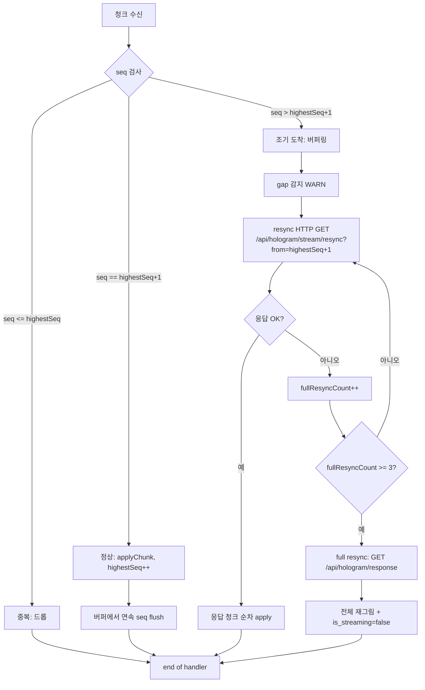

# stream_protocol.md — 스트리밍 캔버스 전송 프로토콜 (SSE 기본 + WebSocket 폴백)

| 항목 | 값 |
|------|----|
| **도메인** | 6-11_Hologram-Main-LLM / 06_streaming-canvas |
| **세션 (TASK_ID)** | Phase 2 T2-5 (6-11_T2-5_01) |
| **산출물 경로 (sandbox)** | `D:\VAMOS\docs\test_iso_p2\sot 2\6-11_Hologram-Main-LLM\06_streaming-canvas\stream_protocol.md` |
| **정본 산출물 경로 (production)** | `D:\VAMOS\docs\sot 2\6-11_Hologram-Main-LLM\06_streaming-canvas\stream_protocol.md` |
| **LOCK** | **LOCK-HM-01** (Center Panel Stream Canvas 개념 — D2.0-08 §2.2 L223-240), 보조: LOCK-HM-06 (3-point 출력 — WORKFLOW_END 시점이 stream end 신호 트리거) |
| **정본 소유** | 6-11 DEFINED-HERE (전면 신규) — SSE/WS 선택 기준·청크 포맷·재연결 정책·seq 규약·종료 신호. SSE 인프라 서버 구현은 6-12/6-9 정본. |
| **해소 이슈** | **ISS-10** (SSE/WebSocket 프로토콜) |
| **Phase 배정** | Phase 2 T2-5 |
| **Part2 버전 태그** | V2-Phase 2 (Enhanced Hologram) |
| **작성일** | 2026-04-18 |
| **Version** | v1.0 (초안) |
| **TEST_MODE** | false — Phase 4 production promotion 2026-06-03 (sandbox → production 전환 완료) |

> **Sandbox isolation 고지** — 본 파일은 `D:\VAMOS\docs\test_iso_p2\sot 2\6-11_Hologram-Main-LLM\06_streaming-canvas\stream_protocol.md` (TEST sandbox) 에만 존재한다. production 경로 `D:\VAMOS\docs\sot 2\6-11_Hologram-Main-LLM\06_streaming-canvas\stream_protocol.md` 는 본 세션에서 생성·수정하지 않는다 (STAGE 7 Phase 2 T2-5 production-promoted (Phase 4, 2026-06-03) 규약).

---

## §0. 목적 & Scope

### §0.1 목적

본 문서는 6-11 Hologram-Main-LLM 도메인 **Center Panel = Stream Canvas** 의 **전송 프로토콜** 을 확정한다. 대상은 다음 다섯 가지 구성 요소이다.

1. **프로토콜 선택**: 기본 SSE (Server-Sent Events) + 폴백 WebSocket. 선택 조건과 기능 감지(feature detection) 흐름.
2. **청크 포맷**: `{token, type, seq}` 기반 JSON line payload (종합계획서 §7 T2-5 절차 2번 verbatim).
3. **지수 백오프 재연결**: 1s → 2s → 4s → 8s → 16s (최대 5회).
4. **seq 기반 이어받기**: 순서 보장, 중복 드롭, gap 감지 및 resync.
5. **스트림 종료 신호**: `{type:"end", seq:N, reason}` 형식의 명시 종료.

본 문서는 **ISS-10 (SSE/WebSocket 프로토콜)** 을 완결 해소한다.

LOCK-HM-01 의 Center Panel 정의(가장 넓음 · 대화 스트림 + 산출물 인라인 렌더링 + 입력)를 준수하며, R-611-4(토큰 단위 점진적 표시 필수, 일괄 표시 금지) 를 전송 계층에서 보장한다.

### §0.2 Scope 표

| 구분 | 항목 | 본 문서 포함 여부 | 소유 도메인 |
|------|------|------------------|-------------|
| **In** | SSE/WebSocket 선택 기준 (`§4`) | ✅ In | 6-11 |
| **In** | 청크 JSON 포맷 규약 (`§5`) | ✅ In | 6-11 |
| **In** | 지수 백오프 재연결 정책 (`§6`) | ✅ In | 6-11 |
| **In** | seq 단조 증가·중복·gap 규약 (`§7`) | ✅ In | 6-11 |
| **In** | 스트림 종료 신호 포맷 (`§9`) | ✅ In | 6-11 |
| **In** | 채널 multiplex 결정 — **default 별도 SSE** (`§8`) | ✅ In | 6-11 |
| **In** | 공통 자료 구조 중앙 정의 (`§3`, StreamChunk/StreamEnvelope/TraceId) | ✅ In (본 문서 **유일 정의**) | 6-11 |
| **In** | Phase 3 테스트 시나리오 ≥12건 (`§13`) | ✅ In | 6-11 |
| **Out** | SSE 서버 인프라 구현 코드(nginx/uvicorn buffering, Content-Type 튜닝) | 제외 | 6-12 (인프라) / 6-9 (upstream) |
| **Out** | Main LLM 토큰 발행 주체(Brain-Adapter HAL 어떤 모델 호출) | 제외 | 6-9 Brain-Adapter-HAL |
| **Out** | 토큰 버퍼 · 렌더링 타이밍(토큰 → DOM mount 변환 규칙) | 제외 | `./token_rendering.md` (본 세션 sibling) |
| **Out** | ArtifactZone 실제 렌더 룰 (SyntaxHighlight / ChartJs / MarkdownTable) | 제외 | `./artifact_rendering.md` (본 세션 sibling) |
| **Out** | HUD 이벤트 채널 (realtime_update §3 6종 이벤트) | 제외 | `../05_glass-hud-overlay/realtime_update.md` |
| **Out** | 인증/세션 재검증 구현 (토큰 교환, refresh flow) | 제외 (연계만) | 6-2 Security-Governance |
| **Out** | Event-Logging 포맷 세부(R-01-7 상세 스키마) | 제외 (연계만) | 6-12 Event-Logging |

**관련 이슈**: ISS-10 (본 문서 해소), ISS-04 (Center Panel 폭 / 별도 파일 참조), ISS-06 (HUD SSE, `../05_glass-hud-overlay/realtime_update.md` 에서 해소 완료).

### §0.3 도메인 경계 선언 (R-T6-2 준수)

| 역할 | 소유 도메인 | 근거 |
|------|-------------|------|
| **스트리밍 프로토콜 규칙 (본 문서)** | **6-11 Hologram-Main-LLM** | V2-Phase 2 Enhanced Hologram UX 정본 도메인 |
| **SSE/WS 인프라 서버 (HTTP 엔드포인트 구현, keep-alive, proxy 설정)** | 6-12 Event-Logging (+ 인프라 플랫폼) | R-01-7 구조화 JSON 로깅, SSE 수립 모니터링 |
| **Main LLM 토큰 발행 주체** | 6-9 Brain-Adapter-HAL | Main LLM 호출 → 토큰 스트림 produce |
| **인증 만료 감지** | 6-2 Security-Governance | 세션 만료 → 재연결 차단 정책 |

본 문서는 **규약(프로토콜 레이어)** 을 정의한다. 구현은 upstream 도메인 소유.

---

## §1. 교차 참조 블록

### §1.1 상위 정본 (LOCK 근거 표)

| LOCK ID | SoT 문서 | 조항 / 라인 | 본 문서 반영 위치 |
|---------|----------|------------|------------------|
| **LOCK-HM-01** | `../../../sot/D2.0-08_08. VAMOS_DESIGN_2.0_UI_UX.md` | §2.2 L223-240 (3-panel 레이아웃, Stream Canvas) | §2.1 verbatim · §2.3 해석 |
| **LOCK-HM-06** | `../../../sot/D2.0-05_05. VAMOS_DESIGN_2.0_UX_UI.md` | §7.2 L359-368 (3-point 출력 — SoT/Trace/Verdict) | §9.3 종료 후속 처리 트리거 |
| **R-611-4** | `../../../sot/HOLOGRAM_MAIN_LLM_구조화_종합계획서.md` | §5.2 (토큰 단위 점진적 표시 필수) | §2.2 verbatim · §5 청크 포맷 |

> 상위 SoT 경로는 모두 상대 경로(`../../../sot/...`). 절대경로는 헤더 metadata + 본 §0 sandbox isolation 고지에서만 예외적으로 사용.

### §1.2 AUTHORITY_CHAIN / CONFLICT_LOG

- **AUTHORITY_CHAIN.md** L65-L68: 본 문서는 `LOCK-HM-01` 직계 파생.
- **CONFLICT_LOG.md**: Phase 0/1 `CFL-HM-001~007` + `C-1~C-3` 전수 **RESOLVED** (OPEN 0건). 본 세션 신규 `CONFLICT_CANDIDATE` 발견 없음 (`§14` 마커 리스트 참조).

### §1.3 로컬 Phase 1 산출물

| 산출물 | 위치 | 본 문서 연계 |
|--------|------|-------------|
| `component_catalog.md` HV-CHAT-03 `StreamingIndicator` | `../02_component-architecture/component_catalog.md` | §5.4 메타데이터 청크 `is_streaming` / `tokens_per_sec` 필드 바인딩 대상 |
| `state_definitions.md` UI_S4_RUNNING / UI_S6_PRESENTING | `../03_ui-state-machine/state_definitions.md` | §9.3 종료 시 `UI_S6_PRESENTING` 전환, `§11` 로깅 `stream.end` 이벤트와 매핑 |
| `domain_boundary.md` (6-11 vs 6-12/6-9 경계) | `../domain_boundary.md` | §0.3 도메인 경계 선언과 정합 |

### §1.4 Peer V2 세션 이음매 (본 Phase 2)

> **각주**: peer V2 간 **네이밍 drift 주의** — `trace_id`(공통 필드명) vs `TraceId`(type alias). 본 문서는 T2-1 `two_tier_routing §3.1` 의 `TraceId = str  # ULID` 타입 이름과 `trace_id` 필드 이름을 **모두 verbatim** 계승한다. 명명 정합은 #2b-1 R1 교정(`qod_hint_initial` → `qod_hint` 통일) 과 동일 기조.

| peer V2 | 경로 (상대) | §N | 핵심 cross-ref 포인트 |
|---------|------------|----|---------------------|
| **realtime_update.md** (T2-4, 591줄) | `../05_glass-hud-overlay/realtime_update.md` | §4.3 / §4.5 / §4.2 | 지수 백오프 5단계 1s/2s/4s/8s/16s 동일 재사용, heartbeat 30+15s grace 동일, **별도 채널 default** 확정 |
| **overlay_schema.md** (T2-4, 898줄) | `../05_glass-hud-overlay/overlay_schema.md` | §3 HudMeta L169/L288-291 | `TraceId = str  # ULID`, `HudMeta.trace_id` 공통 식별자 규약. stream envelope `trace_id` 동일 값 전파 |
| **rendering_rules.md** (T2-4, 490줄) | `../05_glass-hud-overlay/rendering_rules.md` | §3.2 z-index | 본 문서는 전송 계층 → z-index 무관. `artifact_rendering.md` 가 소비 |
| **response_formatting.md** (T2-2, 911줄) | `../04_main-llm-integration/response_formatting.md` | §3.1 L170-171 / §2.3 R-611-4 | `is_streaming: bool` / `tokens_per_sec: Optional[float]` 필드 verbatim — stream 메타데이터 청크 `§5.4` 로 소비. §2.3 R-611-4 verbatim 위치 정합 |
| **dcl_context.md** (T2-3, 865줄) | `../04_main-llm-integration/dcl_context.md` | §3.2 L212 | `qod_hint: Optional[float]` 은 **단일 응답 기준 유지** — stream_protocol 은 **qod 변경 이벤트 발행 없음** (realtime_update §5.2 정합) |
| **two_tier_routing.md** (T2-1, 857줄) | `../04_main-llm-integration/two_tier_routing.md` | §3.1 L140 | `TraceId = str  # ULID` 타입·형식 공유, 청크 전 구간 동일 값 전파 |
| **token_rendering.md** (본 세션 sibling) | `./token_rendering.md` | §N (미확정) | stream_protocol 의 청크 포맷·seq 규약을 소비 (토큰 버퍼링) |
| **artifact_rendering.md** (본 세션 sibling) | `./artifact_rendering.md` | §N (미확정) | `type: "text" \| "code" \| "artifact" \| "end"` enum 이 ArtifactZone 트리거 기준 |

### §1.5 Cross-domain Read-only 소비

| 도메인 | 소비 항목 | 본 문서 반영 |
|--------|----------|-------------|
| **6-12 Event-Logging** | R-01-7 구조화 JSON 포맷, heartbeat 기본 30s | `§6.1` 재연결 정책 근거, `§11` 로깅 네임스페이스 |
| **6-9 Brain-Adapter-HAL** | Main LLM 토큰 스트림 발행 주체, SSE 인프라 서버 구현 | `§0.3` 도메인 경계 명시, `§9.5` upstream 폴백 |
| **6-2 Security-Governance** | SSE 토큰 재검증 시점 (세션 만료), PII 마스킹 정책 | `§6.4` WS 재연결 인증, `§10.4` 세션 만료 재연결, `§11.3` PII 마스킹 |

---

## §2. LOCK-HM-01 + R-611-4 정본 원문 인용

### §2.1 LOCK-HM-01 verbatim (D2.0-08 §2.2 L223-240)

```
Left Panel (Timeline & Context): 폭 접기 가능(약 250px). 세션 기록 + 활성 도메인/노드 표시.
Center Panel (Stream Canvas): 메인(가장 넓음). 대화 스트림 + 산출물 인라인 렌더링 + 입력.
Right Panel (Glass HUD): 오버레이 또는 고정(약 300px). Evidence/Cost/Approval을 "필요 시" 카드로 노출.
```

(인용 끝 — 3줄 verbatim 금지 변경)

### §2.2 R-611-4 원문 verbatim (종합계획서 §5.2)

> "StreamCanvas 는 토큰 단위 점진적 표시 필수, 전체 응답 대기 후 일괄 표시 금지"

(인용 끝 — verbatim 금지 변경)

### §2.3 LOCK 해석 표

| 조항 | 해석 | 본 문서 적용 |
|------|------|-------------|
| **Center Panel "메인(가장 넓음)"** | 스트리밍 캔버스는 Left Timeline(250px) · Right HUD(300px) 폭을 **침범 금지** | `§8.1` 별도 채널 default — HUD 영역 침해 없음 · 토큰 스트림은 Center 한정 |
| **Center Panel "대화 스트림 + 산출물 인라인 렌더링 + 입력"** | 텍스트 토큰 + 산출물(code/chart/table) 인라인 + 입력 영역 공존 | `§3.1` `StreamChunkType = Literal["text", "code", "artifact", "end", "error"]` — 산출물 유형을 청크 type 으로 구분 |
| **R-611-4 "토큰 단위 점진적 표시 필수"** | 전송 계층 레벨에서 청크 단위 push 보장 | `§5` 청크 포맷 · `§7` seq 단조 증가 · `§9` 명시 종료 신호 (중간 일괄 누적 금지) |
| **R-611-4 "일괄 표시 금지"** | 모든 토큰을 한 번에 모아 단일 response 로 보내는 설계 **금지** | `§4.2` 기본 SSE 선정 이유, `§5.4` `is_streaming=true` 시작 시 즉시 전송, `§9.1` `end` 신호로 명시 종료 |
| **LOCK-HM-06 3-point (SoT/Trace/Verdict)** | 최종 응답 완료 시점 = WORKFLOW_END → stream end 신호 트리거 | `§9.3` 종료 후속 처리: `tokens_per_sec` 최종 집계, `is_streaming=false` 전환, UI_S6_PRESENTING 전환 |

---

## §3. 공통 자료 구조 중앙 정의

> **본 문서 유일 정의 구역** — `token_rendering.md` 와 `artifact_rendering.md` 는 본 §3 타입을 **import 참조** 하며 재정의 금지. 재정의 필요 시 본 문서 PR 로 중앙 갱신.

### §3.1 Pydantic v2 모델 (`backend/app/hologram/streaming/models.py` 배치 권고)

```python
# backend/app/hologram/streaming/models.py
# 6-11 Hologram-Main-LLM / Phase 2 T2-5 stream_protocol.md §3.1
from __future__ import annotations
from typing import Generic, Literal, Optional, TypeVar
from pydantic import BaseModel, ConfigDict, Field

# ────────── 기본 타입 alias (T2-1 two_tier_routing §3.1 L140 verbatim 계승) ──────────
TraceId = str        # ULID, 전역 유니크, R-01-7 로깅 키, 청크 전 구간 동일값 전파
StreamSeq = int      # 0 부터 단조 증가 (trace 당 단일 카운터)

# ────────── 청크 유형 enum ──────────
# Center Panel 렌더 대상 구분 (LOCK-HM-01 "대화 스트림 + 산출물 인라인 렌더링")
StreamChunkType = Literal["text", "code", "artifact", "end", "error"]

# artifact 세부 유형 (artifact_rendering.md 에서 ArtifactZone 분기 트리거)
StreamArtifactType = Literal["code", "chart", "table", "plain"]

# 채널 식별자 (§8 multiplex 옵션 대비 예비 필드)
ChannelId = Literal["stream", "hud"]


# ────────── 청크 (프로토콜 전송 단위) ──────────
class StreamChunk(BaseModel):
    """스트림 캔버스 전송 단위 청크.

    종합계획서 §7 T2-5 절차 2번 verbatim:
        data: {"token": "...", "type": "text|code|artifact", "seq": N}
    """
    model_config = ConfigDict(extra="forbid")

    token: str = Field(..., description="토큰 문자열 (text 기본, code·artifact 유형은 청크별 partial payload)")
    type: StreamChunkType = Field(..., description="청크 유형: text/code/artifact/end/error")
    seq: StreamSeq = Field(..., ge=0, description="trace 당 단조 증가 seq (§7.1)")
    trace_id: TraceId = Field(..., description="ULID, T2-1 §3.1 TraceId 공통 식별자, HUD 바인딩 전 구간 동일")
    artifact_type: Optional[StreamArtifactType] = Field(
        default=None,
        description="type=='artifact' 일 때만 필수 (code/chart/table/plain)",
    )
    lang_hint: Optional[str] = Field(
        default=None,
        description="type=='code' 일 때 SyntaxHighlight 언어 힌트 (예: 'python', 'typescript')",
    )


# ────────── 스트림 종료 신호 ──────────
class StreamEndSignal(BaseModel):
    """스트림 종료 신호.

    종합계획서 §7 T2-5 절차 1번 verbatim:
        data: {"type": "end", "seq": N}

    본 모델은 확장 필드(reason/tokens_per_sec/total_tokens)를 덧붙이되,
    최소 필수는 {type, seq, trace_id}. reason 기본값은 "complete".
    """
    model_config = ConfigDict(extra="forbid")

    type: Literal["end"] = "end"
    seq: StreamSeq = Field(..., ge=0, description="마지막 유효 청크 seq + 1 또는 end 전용 seq")
    trace_id: TraceId = Field(..., description="청크 전 구간 동일 trace_id")
    reason: Literal["complete", "abort", "error"] = Field(
        default="complete",
        description="종료 사유 — complete: 정상 종료, abort: 사용자 취소/리소스, error: upstream 실패",
    )
    tokens_per_sec: Optional[float] = Field(
        default=None,
        ge=0.0,
        description="T2-2 response_formatting §3.1 L171 verbatim — 최종 집계 TPS",
    )
    total_tokens: Optional[int] = Field(default=None, ge=0, description="최종 집계 토큰 수")


# ────────── Envelope (제네릭 래퍼) ──────────
TPayload = TypeVar("TPayload")


class StreamEnvelope(BaseModel, Generic[TPayload]):
    """전송 envelope 공통 래퍼.

    trace_id / seq 는 envelope 최상위에 노출 (Last-Event-ID 파싱용),
    payload 는 StreamChunk 또는 StreamEndSignal 을 담는다.
    """
    model_config = ConfigDict(extra="forbid")

    trace_id: TraceId
    seq: StreamSeq
    channel: Optional[ChannelId] = Field(
        default=None,
        description="§8 multiplex 재검토 시 확장 필드. Default 별도 SSE 에서는 생략.",
    )
    payload: TPayload


# ────────── 메타데이터 청크 (별도 정의) ──────────
class StreamMetaChunk(BaseModel):
    """스트리밍 시작/중간 메타데이터 청크 — T2-2 §3.1 L170-171 재사용.

    is_streaming / tokens_per_sec 를 HV-CHAT-03 StreamingIndicator 로 직접 바인딩.
    """
    model_config = ConfigDict(extra="forbid")

    type: Literal["meta"] = "meta"
    seq: StreamSeq
    trace_id: TraceId
    is_streaming: bool = Field(
        default=True,
        description="R-611-4 준수 — 토큰 단위 점진적 표시 플래그 (response_formatting §3.1 L170 verbatim)",
    )
    tokens_per_sec: Optional[float] = Field(
        default=None,
        ge=0.0,
        description="response_formatting §3.1 L171 verbatim — 실시간 TPS (중간 갱신 가능)",
    )
```

**설계 원칙**:

- `extra="forbid"` → 알 수 없는 필드 거부(스키마 엄격 검증).
- `StreamChunk.seq` 는 `ge=0` → 음수 금지.
- `StreamEndSignal.type` 은 리터럴 `"end"` 고정.
- `StreamMetaChunk` 는 토큰 본문이 아닌 메타 전용 (`is_streaming` / `tokens_per_sec` 만 반송).
- `ChannelId` 는 **§8 multiplex 공용 채널 검토 시 확장** 용 예비 필드. Default(별도 채널)에서는 필드를 envelope 에서 생략하거나 `null` 로 둔다.

### §3.2 TypeScript 쌍방 정의 (`frontend/src/hologram/types/streamChunk.ts` 배치)

```typescript
// frontend/src/hologram/types/streamChunk.ts
// 6-11 Hologram-Main-LLM / Phase 2 T2-5 stream_protocol.md §3.2 (Python §3.1 쌍방 정의)

export type TraceId = string;     // ULID, T2-1 two_tier_routing §3.1 L140 일치
export type StreamSeq = number;   // 0 이상 정수, 단조 증가

export type StreamChunkType =
  | "text"
  | "code"
  | "artifact"
  | "end"
  | "error";

export type StreamArtifactType =
  | "code"
  | "chart"
  | "table"
  | "plain";

export type ChannelId = "stream" | "hud";

export interface StreamChunk {
  token: string;
  type: StreamChunkType;
  seq: StreamSeq;
  trace_id: TraceId;
  artifact_type?: StreamArtifactType;  // type === "artifact" 시 필수
  lang_hint?: string;                  // type === "code" 시 권고
}

export interface StreamEndSignal {
  type: "end";
  seq: StreamSeq;
  trace_id: TraceId;
  reason: "complete" | "abort" | "error";
  tokens_per_sec?: number;             // response_formatting §3.1 L171 verbatim
  total_tokens?: number;
}

export interface StreamEnvelope<T> {
  trace_id: TraceId;
  seq: StreamSeq;
  channel?: ChannelId;                 // §8 multiplex 재검토 예비
  payload: T;
}

export interface StreamMetaChunk {
  type: "meta";
  seq: StreamSeq;
  trace_id: TraceId;
  is_streaming: boolean;               // response_formatting §3.1 L170 verbatim
  tokens_per_sec?: number;             // response_formatting §3.1 L171 verbatim
}

// ────────── Type guards (JSON.parse 후 unknown → narrowing) ──────────
export function isStreamChunk(x: unknown): x is StreamChunk {
  if (!x || typeof x !== "object") return false;
  const o = x as Record<string, unknown>;
  return (
    typeof o.token === "string" &&
    (o.type === "text" || o.type === "code" || o.type === "artifact" ||
     o.type === "end" || o.type === "error") &&
    typeof o.seq === "number" && o.seq >= 0 &&
    typeof o.trace_id === "string"
  );
}

export function isStreamEndSignal(x: unknown): x is StreamEndSignal {
  if (!x || typeof x !== "object") return false;
  const o = x as Record<string, unknown>;
  return (
    o.type === "end" &&
    typeof o.seq === "number" && o.seq >= 0 &&
    typeof o.trace_id === "string" &&
    (o.reason === "complete" || o.reason === "abort" || o.reason === "error")
  );
}
```

### §3.3 seq 단조 증가 불변식

- **불변식 (I-3.3-A)**: 동일 `trace_id` 내 `StreamChunk.seq` 는 **0 부터 시작**하여 `seq_{n+1} == seq_n + 1` (strict monotone +1).
- **불변식 (I-3.3-B)**: `StreamEndSignal.seq` 는 최종 유효 청크 `seq` + 1 (명시 종료 seq).
- **불변식 (I-3.3-C)**: seq 가 동일 값으로 재수신 → **드롭** (§7.2 중복 규칙).
- **불변식 (I-3.3-D)**: seq 가 `last_seq + 1` 을 초과 → **gap 감지** (§7.3 resync 트리거).
- **불변식 (I-3.3-E)**: `text` / `code` / `artifact` / `meta` / `end` / `error` 는 **하나의 통합 seq 공간** 을 공유. 유형별 독립 카운터 금지.

### §3.4 JSON 직렬화 예시

#### 예시 A — text 청크

```json
{
  "token": "안녕하세요. ",
  "type": "text",
  "seq": 0,
  "trace_id": "01HV8M3J7K9P2Q4R6S8T"
}
```

#### 예시 B — code 청크 (lang_hint 포함)

```json
{
  "token": "def hello():\n    return 'world'\n",
  "type": "code",
  "seq": 7,
  "trace_id": "01HV8M3J7K9P2Q4R6S8T",
  "lang_hint": "python"
}
```

#### 예시 C — artifact 청크 (chart)

```json
{
  "token": "{\"labels\":[\"A\",\"B\"],\"data\":[10,20]}",
  "type": "artifact",
  "seq": 12,
  "trace_id": "01HV8M3J7K9P2Q4R6S8T",
  "artifact_type": "chart"
}
```

#### 예시 D — end 신호

```json
{
  "type": "end",
  "seq": 18,
  "trace_id": "01HV8M3J7K9P2Q4R6S8T",
  "reason": "complete",
  "tokens_per_sec": 42.5,
  "total_tokens": 321
}
```

---

## §4. 프로토콜 선택 — SSE 기본 + WebSocket 폴백

### §4.1 결정 매트릭스

| 차원 | SSE | WebSocket |
|------|-----|-----------|
| **프록시/방화벽 통과** | HTTP/1.1 chunked — 일부 프록시 HTTP/1.0 차단 가능 | TCP Upgrade — 엄격 프록시 환경 차단 가능 (Cloudflare 등 허용) |
| **양방향 필요** | 단방향 (server→client) | 양방향 |
| **헤더 커스터마이즈** | HTTP 헤더 전체 활용 (`Last-Event-ID`, 인증 토큰 등) | Handshake 시 헤더, 이후 frame 에는 없음 |
| **재연결 복잡도** | 브라우저 내장 자동 재연결 + `Last-Event-ID` | 수동 재연결 + ping/pong heartbeat 직접 구현 |
| **서버 부하** | HTTP 연결 유지 — nginx/cloudflare 호환 양호 | WebSocket 연결 별도 리소스 — sticky session 필요 |
| **표준화** | W3C EventSource (안정) | RFC 6455 (안정) |
| **메시지 경계** | line-delimited (`data: <json>\n\n`) | frame 경계 |
| **이진 데이터** | 불가 (text only) | frame 내 binary 지원 |
| **시간당 메시지 처리량** | 수천 msg/s 충분 | 더 높음 (단, 본 서비스는 수천 msg/s 이하) |

### §4.2 선택 기준

- **기본 SSE 선택 이유**:
  1. Main LLM 토큰 스트림은 **server→client 단방향** (사용자 입력은 별도 HTTP POST). 양방향 필요 없음.
  2. `Last-Event-ID` 헤더 기반 **자동 재연결** 지원 → `§6` 지수 백오프와 자연스럽게 결합.
  3. HTTP 기반으로 기존 nginx / CDN 호환성 양호.
  4. 클라이언트 EventSource API 간결 (3~5줄 수립 코드).
  5. peer V2 `realtime_update.md` 와 **동일 기조 (SSE 기본)** 유지 → 코드 재사용.

- **폴백 WebSocket 조건** (다음 중 하나 충족 시 자동 전환):
  - **(a)** SSE 연결 실패 **3회 연속** (지수 백오프 1s/2s/4s 후에도 실패).
  - **(b)** 프록시 HTTP/1.0 chunked 차단 감지 (응답 헤더 `Transfer-Encoding` 비정상, 또는 5초 내 heartbeat 미수신).
  - **(c)** 사용자 상호작용 중 **중간 메시지 송신** 필요 (예: `Cancel`, `Pause`, `Continue` 의도 신호). — 본 사유는 V2 초기에는 발생 빈도 낮음 (Cancel 은 별도 HTTP POST 로도 해결 가능). 향후 Hologram Main LLM 에 token-level Cancel 긴급성 높아질 경우 활성.

### §4.3 클라이언트 기능 감지 흐름 (의사코드)

```typescript
// frontend/src/hologram/streaming/streamClient.ts
// T2-5 §4.3 — SSE 우선 시도 → 조건 충족 시 WS 폴백

async function connectStream(traceId: TraceId): Promise<StreamReader> {
  let sseFailureCount = 0;
  let forceWsReason: "sse_fail_3x" | "proxy_block" | "bidirectional" | null = null;

  // 1차 시도: SSE
  try {
    const sse = await openSse(`/api/hologram/stream?trace_id=${traceId}`);
    return adaptSse(sse);
  } catch (e) {
    sseFailureCount++;
    if (sseFailureCount >= 3) forceWsReason = "sse_fail_3x";
  }

  // 2차 시도: SSE 재시도 (1s backoff)
  if (!forceWsReason) {
    try {
      await sleep(1000);
      const sse = await openSse(`/api/hologram/stream?trace_id=${traceId}`);
      return adaptSse(sse);
    } catch (e) {
      sseFailureCount++;
      if (sseFailureCount >= 3) forceWsReason = "sse_fail_3x";
    }
  }

  // 3차 시도: SSE
  if (!forceWsReason) {
    try {
      await sleep(2000);
      const sse = await openSse(`/api/hologram/stream?trace_id=${traceId}`);
      return adaptSse(sse);
    } catch (e) {
      sseFailureCount++;
      if (sseFailureCount >= 3) forceWsReason = "sse_fail_3x";
    }
  }

  // 폴백: WebSocket
  if (forceWsReason) {
    logInfo("hologram.stream.ws_fallback_activated", { reason: forceWsReason, traceId });
    const ws = await openWs(`/api/hologram/stream/ws?trace_id=${traceId}`);
    return adaptWs(ws);
  }
  throw new Error("unreachable");
}
```

### §4.4 엔드포인트 규약

| 프로토콜 | URL | 메서드 | 인증 | 비고 |
|----------|-----|--------|------|------|
| SSE | `/api/hologram/stream?trace_id=<ULID>` | `GET` | Cookie/Bearer | `Content-Type: text/event-stream`, `Cache-Control: no-cache`, `X-Accel-Buffering: no` |
| WebSocket | `/api/hologram/stream/ws?trace_id=<ULID>` | `GET` (Upgrade) | Cookie/Bearer in handshake | Subprotocol: `hologram-stream-v1` |
| Resync HTTP | `/api/hologram/stream/resync?trace_id=<ULID>&from=<seq>` | `GET` | Cookie/Bearer | JSON array 응답, gap 복구용 (`§7.3`) |
| Full fallback | `/api/hologram/response?trace_id=<ULID>` | `GET` | Cookie/Bearer | 스트리밍 3회 실패 시 전체 응답 일괄 조회 (`§7.4`) |

---

## §5. 청크 포맷

### §5.1 SSE 라인 포맷

종합계획서 §7 T2-5 절차 2번 **verbatim**:

```
data: {"token": "...", "type": "text|code|artifact", "seq": N}
```

실제 SSE frame 예시 (heartbeat 는 comment line):

```
id: 01HV8M3J7K9P2Q4R6S8T-0
event: chunk
data: {"token":"안녕","type":"text","seq":0,"trace_id":"01HV8M3J7K9P2Q4R6S8T"}

id: 01HV8M3J7K9P2Q4R6S8T-1
event: chunk
data: {"token":"하세요","type":"text","seq":1,"trace_id":"01HV8M3J7K9P2Q4R6S8T"}

: heartbeat

id: 01HV8M3J7K9P2Q4R6S8T-2
event: chunk
data: {"token":"def hello():","type":"code","seq":2,"trace_id":"01HV8M3J7K9P2Q4R6S8T","lang_hint":"python"}
```

- `id` 필드 = `<trace_id>-<seq>` (realtime_update.md §3.2 L140 동일 포맷).
- `event` 필드 = `chunk` / `meta` / `end` / `error` — EventSource `addEventListener` 분기.
- `data` 필드 = `StreamChunk` / `StreamMetaChunk` / `StreamEndSignal` JSON.

### §5.2 WebSocket 메시지 포맷

frame `payload` = **동일 JSON** (event wrapper 필요 시 `{"event":"chunk","data": <StreamChunk>}`).

```json
{"event":"chunk","data":{"token":"안녕","type":"text","seq":0,"trace_id":"01HV8M3J7K9P2Q4R6S8T"}}
{"event":"end","data":{"type":"end","seq":18,"trace_id":"01HV8M3J7K9P2Q4R6S8T","reason":"complete","tokens_per_sec":42.5}}
```

### §5.3 필드 의미 표

| 필드 | 타입 | 필수 | 설명 | 제약 |
|------|------|------|------|------|
| `token` | `string` | ✅ (type ≠ `"end"` 일 때) | 토큰 문자열 — text 기본, code/artifact 는 청크별 partial payload | UTF-8, 빈 문자열 허용 |
| `type` | `StreamChunkType` | ✅ | text / code / artifact / end / error | enum 외 값 → 파싱 실패 |
| `seq` | `StreamSeq` | ✅ | 단조 증가 seq (§3.3) | ≥ 0, 정수 |
| `trace_id` | `TraceId` | ✅ | ULID, 전 구간 동일 | T2-1 §3.1 L140 규약 |
| `artifact_type` | `StreamArtifactType?` | type=="artifact" 시 필수 | code/chart/table/plain | artifact 이외 null 권고 |
| `lang_hint` | `string?` | 선택 | type=="code" 시 SyntaxHighlight 언어 | `python`, `typescript` 등 |

### §5.4 메타데이터 청크

- **시작 시점**: Main LLM 첫 토큰 발행 직전 `StreamMetaChunk{is_streaming:true, seq:0}` 전송.
- **중간 갱신**: 5초마다 `tokens_per_sec` 갱신. 동일 seq 재사용하지 않고 **전역 seq 공간 소비** (§3.3 Invariant I-3.3-E).
- **종료 시점**: `StreamEndSignal` 수신 후 클라이언트가 로컬 상태 `is_streaming=false` 전환 (서버에서 `meta{is_streaming:false}` 별도 전송 **불요** — end 신호 자체가 전환 트리거).

> **peer V2 재사용 명시**: `is_streaming` / `tokens_per_sec` 필드명·타입은 `../04_main-llm-integration/response_formatting.md` §3.1 L170-171 **verbatim**. 본 문서에서 **재정의 금지**.

> **qod_hint 중간 갱신 불허**: `dcl_context.md` §3.2 L212 `qod_hint` 는 **단일 응답 기준 유지** → stream_protocol 는 **qod 변경 이벤트 발행 없음** (realtime_update §5.2 정합). Evidence 뱃지 갱신은 별도 HUD 채널이 담당.

---

## §6. 지수 백오프 재연결 (5단계)

### §6.1 재연결 지연 표

| 시도 | 지연 | 누적 지연 | 비고 |
|------|------|----------|------|
| 1차 | 1s | 1s | 첫 재연결 |
| 2차 | 2s | 3s | — |
| 3차 | 4s | 7s | — |
| 4차 | 8s | 15s | — |
| 5차 | 16s | 31s | 마지막 자동 시도 |
| 6차 이상 | **중단** | — | 수동 재시도 버튼 노출 (§6.3) |

> **peer V2 수치 동일 재사용**: `../05_glass-hud-overlay/realtime_update.md` §4.3 1s/2s/4s/8s/16s 동일. 본 문서는 수치 재정의가 아니라 **동일 기조 재사용** 을 명시.

### §6.2 `Last-Event-ID` 헤더 규약

재연결 요청 시 클라이언트는 브라우저 자동 또는 수동으로 `Last-Event-ID: <trace_id>-<seq>` 헤더를 전송한다 (realtime_update §3.2 L140 동일 포맷).

서버는 해당 헤더 존재 시 `seq + 1` 부터 스트림을 재개한다. trace_id 가 서버 세션 만료로 사라진 경우 → `X-Trace-Expired: true` 응답 헤더 + 410 Gone → 클라이언트는 새 trace_id 로 재요청.

### §6.3 5회 초과 시 중단 + 사용자 알림

```typescript
// 5회 소진 시
logError("hologram.stream.reconnect_exhausted", { trace_id, retry_count: 5 });
showUiBanner({
  level: "error",
  title: "연결이 끊겼습니다",
  action: "수동 재시도",
  onAction: () => connectStream(traceId),  // 카운터 초기화
});
```

- **수동 재시도 버튼** 클릭 시 카운터 초기화 및 1차 시도부터 다시 시작.
- UI 배너는 HV-CHAT-03 `StreamingIndicator` 영역 근접 위치에 고정 (로우 레벨).

### §6.4 WebSocket 재연결 동일 전략

WebSocket 폴백 활성화 상태에서도 동일 5단계 지수 백오프 사용. 추가로:

- **ping/pong heartbeat**: 30초 주기 ping frame, 45초(30+15s grace) 이내 pong 미수신 → 강제 재연결.
- 재연결 시 `resync` HTTP GET (§7.3) 로 누락 청크 복구.

---

## §7. seq 기반 이어받기 (순서·중복·누락)

### §7.1 단조 증가 규칙

- trace 당 **단일 카운터** — 모든 유형(text/code/artifact/meta/end/error)이 같은 seq 공간 공유.
- 시작 값 0, 청크마다 +1.
- 서버 측에서 보장 (불변식 I-3.3-A).

### §7.2 중복 감지 (seq 동일 → 드롭)

재연결 시 `Last-Event-ID` 가 느슨하게 동작하여 같은 seq 가 한 번 더 오는 경우가 존재 (예: 서버가 `Last-Event-ID` 를 무시하고 처음부터 재전송). 클라이언트는 **이미 처리한 seq 이하** 는 무조건 드롭한다.

```typescript
let highestSeq: number = -1;

function onChunk(chunk: StreamChunk): void {
  if (chunk.seq <= highestSeq) {
    logDebug("hologram.stream.duplicate_seq_dropped", { trace_id: chunk.trace_id, seq: chunk.seq });
    return;  // 드롭
  }
  if (chunk.seq === highestSeq + 1) {
    applyChunk(chunk);
    highestSeq = chunk.seq;
  } else {
    // gap → §7.3
    onSeqGap(chunk, highestSeq);
  }
}
```

### §7.3 누락 감지 (gap > 0 → resync HTTP GET)

`chunk.seq > highestSeq + 1` → gap 발생. 다음 절차:

1. 현재 gap 규모 계산 `missing = chunk.seq - highestSeq - 1`.
2. WARN 로그: `hologram.stream.seq_gap_detected` (`from=highestSeq+1`, `to=chunk.seq-1`, `missing=missing`).
3. **resync HTTP GET** 호출: `GET /api/hologram/stream/resync?trace_id=X&from=<highestSeq+1>`.
4. 응답: `StreamChunk[]` JSON 배열 (순서 보장).
5. 응답 청크를 순서대로 `applyChunk`, `highestSeq` 갱신.
6. 이후 수신 중이던 `chunk` 를 정상 처리.
7. resync 성공 시 INFO 로그 `hologram.stream.resync_requested` / `hologram.stream.resync_succeeded`.

### §7.4 3회 연속 gap → full resync

resync HTTP GET 이 3회 연속 실패(네트워크 오류, 빈 배열, partial) 시:

1. WARN 로그 `hologram.stream.full_resync_triggered`.
2. **전체 응답 재구성** — `GET /api/hologram/response?trace_id=X` 호출.
3. 응답 payload 는 `UserResponse` (T2-2 §3.1) 포맷 또는 `StreamChunk[]` 전체 배열.
4. 클라이언트는 현재 렌더된 부분을 **전체 재그림** (기존 DOM 클리어 후 전체 append).
5. 스트리밍 세션 종료 (`is_streaming=false`).
6. UI 는 "연결 복구 후 전체 응답을 다시 표시했습니다" 알림 배너 표시 (5초 후 자동 소멸).

### §7.5 Pseudo 의사코드 (client seq 추적 + resync)

```typescript
// frontend/src/hologram/streaming/seqTracker.ts
// T2-5 §7.5 — seq 기반 이어받기 로직

class SeqTracker {
  private highestSeq = -1;
  private buffer: Map<StreamSeq, StreamChunk> = new Map();  // 조기 도착 청크 버퍼
  private fullResyncCount = 0;
  private readonly FULL_RESYNC_LIMIT = 3;

  async onChunk(chunk: StreamChunk): Promise<void> {
    // §7.2 중복 드롭
    if (chunk.seq <= this.highestSeq) {
      logDebug("hologram.stream.duplicate_seq_dropped", { seq: chunk.seq });
      return;
    }

    // 조기 도착 버퍼링 (OOO 대응)
    if (chunk.seq > this.highestSeq + 1) {
      this.buffer.set(chunk.seq, chunk);
      logDebug("hologram.stream.ooo_buffered", { seq: chunk.seq, expected: this.highestSeq + 1 });

      // §7.3 gap 감지 → resync
      await this.handleGap(this.highestSeq + 1, chunk.seq - 1, chunk.trace_id);
      // resync 후 OOO 버퍼에 연속 seq 가 생겼으면 flush (정상 분기와 동일 — 버퍼 chunk 유실 방지)
      while (this.buffer.has(this.highestSeq + 1)) {
        const next = this.buffer.get(this.highestSeq + 1)!;
        this.buffer.delete(next.seq);
        this.applyChunk(next);
        this.highestSeq = next.seq;
      }
    } else {
      // 정상 순서
      this.applyChunk(chunk);
      this.highestSeq = chunk.seq;
      // 버퍼에서 다음 seq 연속 flush
      while (this.buffer.has(this.highestSeq + 1)) {
        const next = this.buffer.get(this.highestSeq + 1)!;
        this.buffer.delete(next.seq);
        this.applyChunk(next);
        this.highestSeq = next.seq;
      }
    }
  }

  private async handleGap(from: StreamSeq, to: StreamSeq, traceId: TraceId): Promise<void> {
    try {
      logWarn("hologram.stream.seq_gap_detected", { trace_id: traceId, from, to, missing: to - from + 1 });
      const url = `/api/hologram/stream/resync?trace_id=${traceId}&from=${from}`;
      const res = await fetch(url);
      const chunks: StreamChunk[] = await res.json();
      const before = this.highestSeq;
      for (const c of chunks) {
        if (c.seq === this.highestSeq + 1) {
          this.applyChunk(c);
          this.highestSeq = c.seq;
        }
      }
      // §7.4: 빈 배열 / partial (연속 진행 0) 도 실패로 간주 — catch 블록과 동일 escalation
      if (this.highestSeq <= before) {
        this.fullResyncCount++;
        logWarn("hologram.stream.resync_no_progress", { trace_id: traceId, count: chunks.length, fullResyncCount: this.fullResyncCount });
        if (this.fullResyncCount >= this.FULL_RESYNC_LIMIT) {
          await this.fullResync(traceId);
        }
        return;
      }
      logInfo("hologram.stream.resync_succeeded", { trace_id: traceId, count: chunks.length });
      this.fullResyncCount = 0;
    } catch (e) {
      this.fullResyncCount++;
      if (this.fullResyncCount >= this.FULL_RESYNC_LIMIT) {
        await this.fullResync(traceId);
      }
    }
  }

  private async fullResync(traceId: TraceId): Promise<void> {
    logWarn("hologram.stream.full_resync_triggered", { trace_id: traceId });
    const res = await fetch(`/api/hologram/response?trace_id=${traceId}`);
    const all: StreamChunk[] = await res.json();
    clearRenderedStream();
    for (const c of all) this.applyChunk(c);
    this.highestSeq = all[all.length - 1]?.seq ?? -1;
    this.fullResyncCount = 0;
    showBanner("연결 복구 후 전체 응답을 다시 표시했습니다", { level: "info", autoHideMs: 5000 });
  }

  private applyChunk(chunk: StreamChunk): void {
    // 실제 렌더링 트리거 — token_rendering / artifact_rendering 으로 위임
    dispatchRender(chunk);
  }
}
```

---

## §8. 채널 multiplex 결정 (T2-4 realtime_update §4.5 연계)

### §8.1 Default 결정: 별도 SSE 연결

| 채널 | 엔드포인트 | 생산 주체 | 소비 주체 |
|------|----------|----------|----------|
| **Stream Canvas** | `/api/hologram/stream?trace_id=...` | Main LLM proxy (6-9 Brain-Adapter-HAL) | Center Panel (StreamingArea) |
| **HUD Events** | `/api/hologram/hud/stream?trace_id=...` | Front Mini (Verification/Cost/Alert aggregator) | Right Panel (Glass HUD) |

**별도 채널 default 이유**:

1. **실패 격리** — Main LLM 스트림 실패가 HUD 이벤트(Evidence/Cost/Alert) 표시를 중단시키지 않음. 역도 동일.
2. **백엔드 생산 주체 분리** — HUD = Front Mini (aggregator), Stream = Main LLM proxy. 서로 다른 서비스 경계.
3. **재연결 정책 독립** — Stream 은 토큰 loss sensitive(R-611-4 점진 표시), HUD 는 상태 eventual consistency 허용. 재시도 전략 서로 상이.
4. **seq 규약 독립** — Stream 은 trace 당 단일 seq, HUD 는 이벤트 네임스페이스별 독립 seq (realtime_update §3.1 5종). 통합 시 seq 충돌 해소 설계 부담.

### §8.2 공용 multiplex 장단점

| 구분 | 별도 채널 (default) | 공용 multiplex |
|------|-------------------|---------------|
| **연결 수** | 2 (stream + hud) | 1 |
| **실패 격리** | ✅ 독립 | ❌ 한 연결 실패 시 양쪽 중단 |
| **서버 부하** | 연결 2 × user | 연결 1 × user (절감) |
| **클라이언트 복잡도** | 단순 (채널별 독립 EventSource) | `channel:` 필드 기반 라우팅 필요 |
| **seq 규약** | 채널별 독립 | 통합 또는 채널별 독립 — 후자 시 envelope 분리 필요 |
| **heartbeat** | 채널별 독립 | 공유 가능 (절감) |
| **backpressure** | 채널별 독립 | 한 채널 느릴 시 다른 채널 영향 |
| **디버깅** | SSE 탭에서 스트림/HUD 구분 용이 | 단일 탭에서 필터 필요 |

### §8.3 공용 multiplex 조건 (향후 검토)

`T2-6 I-10 오케스트레이션` 확정 시 다음 조건 모두 충족 하에 검토:

1. **envelope 의무 필드**: 모든 이벤트에 `channel: ChannelId` 추가 (§3.1 `ChannelId = Literal["stream", "hud"]` 예비 정의 활용).
2. **채널 내부 독립 seq** — trace 당 채널 × seq 공간 분리, 혹은 통합 seq + 각 채널 `channel_seq` 보조.
3. **heartbeat 공유** — 단일 heartbeat 이벤트가 양 채널 모두 alive 로 간주.
4. **라우팅 테이블** — 클라이언트 `onMessage(envelope)` 가 `envelope.channel` 로 `streamReducer` 또는 `hudReducer` 분기.
5. **부하 테스트 통과** — 동시 1000 세션 단일 연결에서 backpressure 없음.

### §8.4 현 시점 결론

**별도 채널 유지** — `../05_glass-hud-overlay/realtime_update.md` §4.5 default 결정과 **일치**.

> `[T2-6 RESOLVED 2026-04-19 — 경로 A: multiplex 불요, 별도 채널 default 확정]` — T2-6 `07_orchestration-layer/page_routing.md` §4 에서 공용 multiplex 5 조건(전수) 미충족 + I-10 이벤트 vs 스트림 이벤트 성격 차이 (빈도/크기/loss-sensitivity) 확정. `ChannelId` 필드는 envelope 에 정의 유지되나 default 경로는 **별도 채널** (`/api/hologram/hud/stream` vs `/api/hologram/stream`, realtime_update §4.5 default 일치). Phase 3 재검토 불필요 — 조건 변경 시에만 Phase 3 Round 에서 재검토 가능.

---

## §9. 스트림 종료 신호

### §9.1 포맷

종합계획서 §7 T2-5 절차 1번 **verbatim**:

```
data: {"type":"end", "seq":N, "trace_id":"...", "reason":"complete"}
```

확장 필드 `tokens_per_sec`, `total_tokens` 는 선택 (최종 집계 시 포함).

실제 SSE frame:

```
id: 01HV8M3J7K9P2Q4R6S8T-18
event: end
data: {"type":"end","seq":18,"trace_id":"01HV8M3J7K9P2Q4R6S8T","reason":"complete","tokens_per_sec":42.5,"total_tokens":321}
```

### §9.2 3종 reason

| reason | 조건 | UI 동작 | 로깅 레벨 |
|--------|------|---------|----------|
| `complete` | Main LLM 응답 정상 완료 (EOS token 수신 또는 명시적 close) | 토큰 흐름 종료, `is_streaming=false`, `UI_S6_PRESENTING` 전환 | INFO |
| `abort` | 사용자 Cancel 또는 시스템 리소스 부족 | "사용자에 의해 중단되었습니다" 배너, 부분 응답 유지 | INFO |
| `error` | upstream(6-9 Main LLM) 실패, 6-9 경유 폴백 발동 | "응답 생성 중 오류 발생" 배너 + 재시도 버튼 | ERROR |

### §9.3 종료 후속 처리

```typescript
function onEnd(signal: StreamEndSignal): void {
  // LOCK-HM-06 3-point 출력 트리거 시점
  updateUiState("UI_S6_PRESENTING");

  // 최종 메타 갱신 (HV-CHAT-03 StreamingIndicator)
  setStreamingIndicator({
    is_streaming: false,
    tokens_per_sec: signal.tokens_per_sec ?? null,
  });

  // 로깅
  logInfo("hologram.stream.end", {
    trace_id: signal.trace_id,
    reason: signal.reason,
    total_tokens: signal.total_tokens,
    tokens_per_sec: signal.tokens_per_sec,
  });

  // reason 별 UI 분기
  if (signal.reason === "abort") {
    showBanner("사용자에 의해 중단되었습니다", { level: "info" });
  } else if (signal.reason === "error") {
    showBanner("응답 생성 중 오류 발생", { level: "error", action: "재시도" });
  }

  closeStreamConnection();
}
```

### §9.4 중단 (abort)

사용자 Cancel 버튼 클릭 시:

1. 클라이언트: `POST /api/hologram/stream/abort?trace_id=X` (non-stream HTTP).
2. 서버: Main LLM 호출 취소 + SSE 스트림에 `{"type":"end","reason":"abort"}` 전송 후 연결 종료.
3. 클라이언트: `onEnd` 핸들러에서 `reason==="abort"` 분기.

시스템 리소스 부족(OOM, Quota 초과) 시 서버 주도 abort — 동일 signal 포맷.

### §9.5 오류 (error) — upstream 폴백

upstream Main LLM(6-9 Brain-Adapter-HAL) 호출 실패 시:

1. 6-9 측 폴백 체인 (primary → fallback model) 시도.
2. 폴백 체인 전부 실패 → SSE 에 `{"type":"end","reason":"error"}` 전송.
3. 서버는 별도 HTTP 엔드포인트 `/api/hologram/error_detail?trace_id=X` 로 상세 원인 제공 (R-01-7 구조화 로그와 동기).
4. 클라이언트: 재시도 버튼 제공.

> **본 문서 경계** — 폴백 체인 정의 및 상세 원인 스키마는 **6-9 Brain-Adapter-HAL 소유**. 본 §9.5 는 종료 신호 포맷만 정의.

---

## §10. 에러·폴백

### §10.1 연결 끊김 감지 (heartbeat timeout 45s)

- 서버: 30초 주기로 `: heartbeat\n\n` comment line (또는 named event `heartbeat`) 전송.
- 클라이언트: 마지막 수신 시각 추적, 45초(30+15s grace) 이내 heartbeat 또는 chunk 미수신 → 강제 재연결.

> **peer V2 정합**: `../05_glass-hud-overlay/realtime_update.md` §4.2 heartbeat 30+15s grace 와 동일.

```typescript
let lastRxMs = Date.now();
const HEARTBEAT_TIMEOUT_MS = 30_000 + 15_000;

function onAnyFrame(): void {
  lastRxMs = Date.now();
}

setInterval(() => {
  if (Date.now() - lastRxMs > HEARTBEAT_TIMEOUT_MS) {
    logWarn("hologram.stream.heartbeat_timeout");
    reconnectStream();  // 지수 백오프 카운터 증가
  }
}, 5_000);
```

### §10.2 파싱 실패 (JSON 오류)

- 개별 청크 파싱 실패 → 해당 청크 **드롭** + WARN 로그 (`hologram.stream.parse_fail`).
- **3회 연속** 파싱 실패 → 연결 비정상 간주, 재연결 트리거.
- WebSocket frame payload 가 빈 문자열 / 비-JSON → 동일 처리.

### §10.3 seq 오류 대응 흐름 (Mermaid)



### §10.4 인증 만료 (6-2 연계)

- 서버: 세션 만료 감지 시 SSE 응답 헤더 `X-Session-Refresh-Required: true` + 401 Unauthorized.
- 클라이언트: 응답 헤더 감지 → 세션 갱신 요청(별도 HTTP POST `/api/auth/refresh`) → 성공 시 `Last-Event-ID` 로 재연결 / 실패 시 로그인 페이지 리다이렉트.
- 6-2 Security-Governance 의 세션 만료 정책(기본 15분 idle) 에 종속.

---

## §11. 로깅 (R-01-7)

### §11.1 이벤트 네임스페이스 표

| 이벤트 | 레벨 | 주요 payload | 발생 조건 |
|--------|------|-------------|----------|
| `hologram.stream.connected` | INFO | `trace_id`, `protocol: "sse" \| "ws"`, `resumed: bool` | 연결 수립 완료 |
| `hologram.stream.chunk_received` | DEBUG | `trace_id`, `seq`, `type` | 샘플링 1:100 (토큰 본문 미포함) |
| `hologram.stream.seq_gap_detected` | WARN | `trace_id`, `from`, `to`, `missing` | §7.3 gap 감지 시 |
| `hologram.stream.resync_requested` | INFO | `trace_id`, `from` | resync HTTP GET 호출 시 |
| `hologram.stream.resync_succeeded` | INFO | `trace_id`, `count` | resync 응답 성공 적용 |
| `hologram.stream.full_resync_triggered` | WARN | `trace_id`, `reason` | §7.4 3회 연속 실패 |
| `hologram.stream.reconnect_attempt` | INFO | `trace_id`, `attempt: 1..5`, `delay_ms` | 지수 백오프 시도 |
| `hologram.stream.reconnect_exhausted` | ERROR | `trace_id`, `retry_count: 5` | 5회 소진 |
| `hologram.stream.parse_fail` | WARN | `trace_id?`, `raw_head: str` | JSON 파싱 실패 |
| `hologram.stream.heartbeat_timeout` | WARN | `trace_id`, `since_last_ms` | 45s 초과 |
| `hologram.stream.ws_fallback_activated` | INFO | `trace_id`, `reason: "sse_fail_3x" \| "proxy_block" \| "bidirectional"` | WS 폴백 전환 |
| `hologram.stream.end` | INFO | `trace_id`, `reason`, `total_tokens`, `tokens_per_sec` | 종료 신호 수신 |

### §11.2 중첩 JSON 스키마 예시 (`hologram.stream.seq_gap_detected`)

```json
{
  "event": "hologram.stream.seq_gap_detected",
  "level": "WARN",
  "timestamp": "2026-04-18T14:37:21.458Z",
  "trace_id": "01HV8M3J7K9P2Q4R6S8T",
  "stream": {
    "protocol": "sse",
    "highest_seq": 12,
    "received_seq": 15,
    "missing": 2
  },
  "recovery": {
    "strategy": "resync_http_get",
    "endpoint": "/api/hologram/stream/resync?trace_id=01HV8M3J7K9P2Q4R6S8T&from=13",
    "attempt": 1
  },
  "meta": {
    "domain": "6-11_Hologram-Main-LLM",
    "subdomain": "06_streaming-canvas",
    "session_trace_chain": ["t2-1-routing", "t2-2-response", "t2-5-stream"]
  }
}
```

### §11.3 PII 마스킹 정책

- `hologram.stream.chunk_received` 는 DEBUG 레벨 + 1:100 샘플링. `token` 본문은 **절대 payload 에 포함 금지** (길이 `token_len` 만 기록).
- `hologram.stream.parse_fail` 의 `raw_head` 는 처음 64바이트 만 포함, UTF-8 안전 절삭, 제어문자 이스케이프.
- 개인정보(이메일·전화·주민번호 패턴) 감지 시 해당 필드 `"[REDACTED]"` 치환 — 상세 정책은 **6-2 Security-Governance 소유**, 본 §11.3 은 연계 지점만 명시.
- ULID `trace_id` 는 PII 로 간주하지 않음 (랜덤 식별자).

---

## §12. 도메인 경계 (R-T6-2)

| 역할 | 6-11 (본 도메인) | 인접 도메인 | 근거 |
|------|------------------|------------|------|
| 스트리밍 프로토콜 규약 | ✅ 소유 | — | V2 Enhanced Hologram UX 정본 |
| SSE 인프라 서버 구현 | 소비만 | **6-12 Event-Logging** (R-01-7 + SSE 운영) | `../domain_boundary.md` |
| Main LLM 토큰 발행 | 소비만 | **6-9 Brain-Adapter-HAL** | 6-9 는 transport agnostic, 본 문서가 SSE/WS 매핑 |
| 세션 인증 / PII 정책 | 소비만 | **6-2 Security-Governance** | §10.4, §11.3 |
| HUD 이벤트 채널 | — | **`../05_glass-hud-overlay/realtime_update.md`** (6-11 sibling) | §8.1 별도 채널 default |
| 토큰 → DOM 렌더 타이밍 | — | **`./token_rendering.md`** (6-11 sibling) | §3 공통 타입 소비 |
| Artifact 실제 렌더 룰 | — | **`./artifact_rendering.md`** (6-11 sibling) | §3 `StreamArtifactType` 소비 |
| Orchestration I-10 emit | — | **`../07_orchestration-layer/`** (T2-6) | §8.4 재검토 트리거 |

---

## §13. Phase 3 테스트 시나리오 (12건)

### §13.1 시나리오 cross-check 표

| TS-ID | 제목 | 트리거 | 기대 결과 | 근거 LOCK·규칙 | 본문 §N | peer V2 §N |
|-------|------|--------|----------|---------------|---------|-----------|
| **TS-STREAM-01** | 기본 SSE 연결 성공 (happy path) | 유저 요청 → `GET /api/hologram/stream?trace_id=X` | 200 OK, `Content-Type: text/event-stream`, 첫 `meta{is_streaming:true,seq:0}` 300ms 이내 수신, 이후 `chunk` 연속 수신 | R-611-4, LOCK-HM-01 Center Panel | §4.4, §5.1, §5.4 | realtime §4.1 |
| **TS-STREAM-02** | 청크 포맷 text 정상 렌더 | `{token:"안녕",type:"text",seq:0,trace_id:"..."}` 수신 | Center Panel 에 즉시 렌더, StreamingIndicator active | R-611-4 | §5.1, §5.3 | — |
| **TS-STREAM-03** | 청크 포맷 code + lang_hint | `{type:"code",lang_hint:"python",token:"def f():",seq:3,...}` | 코드 블록 SyntaxHighlight Python 적용 (artifact_rendering 소비) | LOCK-HM-01 산출물 인라인 | §3.1, §5.3 | artifact_rendering §N |
| **TS-STREAM-04** | 청크 포맷 artifact 전달 | `{type:"artifact",artifact_type:"chart",token:"{...}",seq:12,...}` | ArtifactZone 트리거, chart 렌더 | LOCK-HM-01 | §3.1, §5.3 | artifact_rendering §N |
| **TS-STREAM-05** | 종료 신호 reason=complete | `{type:"end",seq:18,reason:"complete",tokens_per_sec:42.5}` | `is_streaming=false` 전환, UI_S6_PRESENTING, HV-CHAT-03 inactive | LOCK-HM-06 3-point | §9.1, §9.3 | response_formatting §3.1 L170 |
| **TS-STREAM-06** | 지수 백오프 1s→16s 연속 5회 | 서버 강제 5회 연속 disconnect | 1s/2s/4s/8s/16s 간격 재연결 시도 로그 5건, 6회째 시도 없음 | §6.1 | §6.1, §6.3 | realtime §4.3 |
| **TS-STREAM-07** | 5회 초과 후 수동 재시도 | 5회 소진 상태에서 사용자가 재시도 버튼 클릭 | 카운터 초기화, 1차 1s 지연으로 재시도, 성공 시 `resumed=true` | §6.3 | §6.3 | — |
| **TS-STREAM-08** | seq 중복 수신 드롭 | 동일 `seq=5` 를 2회 수신 | 두 번째 수신 드롭, `hologram.stream.duplicate_seq_dropped` DEBUG 로그 | I-3.3-C | §7.2, §3.3 | — |
| **TS-STREAM-09** | seq gap + resync HTTP GET | seq=5 이후 seq=8 수신 (gap 3) | WARN 로그, `/stream/resync?from=6` 호출, 6/7 수신 후 8 적용 | I-3.3-D | §7.3, §7.5 | — |
| **TS-STREAM-10** | 3회 연속 gap → full resync | resync HTTP GET 3회 연속 실패 | `/api/hologram/response` 호출, 전체 재그림, `is_streaming=false`, 배너 표시 | §7.4 | §7.4, §7.5 | — |
| **TS-STREAM-11** | WebSocket 폴백 활성화 | SSE 연결 3회 연속 실패 | `/stream/ws` handshake, `ws_fallback_activated` INFO 로그 + `reason:"sse_fail_3x"` | §4.2 (b) | §4.2, §4.3 | — |
| **TS-STREAM-12** | abort reason 종료 + UI 경고 | 사용자 Cancel 클릭 → `POST /stream/abort` | 서버 `{type:"end",reason:"abort"}`, UI 배너 "사용자에 의해 중단되었습니다" | §9.4 | §9.2, §9.4 | — |

---

## §14. 산출물 요약

- **파일 위치**: `D:\VAMOS\docs\test_iso_p2\sot 2\6-11_Hologram-Main-LLM\06_streaming-canvas\stream_protocol.md` (production-promoted Phase 4, 2026-06-03)
- **구조**: §0~§13 필수 섹션 + §14 요약 + §14.1 검증 체크리스트
- **핵심 정의**: `StreamChunk` / `StreamEndSignal` / `StreamEnvelope<T>` / `StreamMetaChunk` / `TraceId` / `StreamSeq` / `StreamChunkType` / `StreamArtifactType` / `ChannelId` — §3 유일 정의 (token_rendering / artifact_rendering 은 import)
- **LOCK 준수**: LOCK-HM-01 (Center Panel) verbatim, LOCK-HM-06 (3-point 종료 트리거) 연계
- **R-611-4 verbatim**: §2.2 (원문 1문장 그대로)
- **Peer V2 cross-ref**: realtime_update (§4.3/§4.5/§4.2), overlay_schema (§3 HudMeta), rendering_rules (§3.2 z-index N/A), response_formatting (§3.1 L170-171), dcl_context (§3.2 L212 qod_hint), two_tier_routing (§3.1 L140 TraceId), token_rendering (sibling), artifact_rendering (sibling)
- **Cross-domain 소비**: 6-12 (R-01-7 + heartbeat), 6-9 (Main LLM 토큰 발행 + SSE 인프라), 6-2 (세션·PII)
- **Phase 3 시나리오**: 12건 (TS-STREAM-01~12)
- **ISS 해소**: ISS-10 (SSE/WebSocket 프로토콜)
- **CONFLICT 마커**: 없음 (Phase 0/1 기 RESOLVED 유지, 신규 candidate 발견 없음)

### §14.1 검증 체크리스트 (종합계획서 §7 T2-5 대조)

- [x] SSE 기본 + WebSocket 폴백 선택 기준 (§4.1, §4.2)
- [x] 청크 포맷 `{token, type, seq}` 종합계획서 verbatim (§5.1)
- [x] 지수 백오프 5단계 1s→16s (§6.1)
- [x] seq 기반 이어받기 — 중복 제거 (§7.2) + 누락 감지 (§7.3) + full resync (§7.4)
- [x] 스트림 종료 신호 `{type:"end", seq:N}` verbatim (§9.1)
- [x] LOCK-HM-01 Center Panel 개념 준수 (§2.1 verbatim + §2.3 해석)
- [x] R-611-4 일괄 표시 금지 verbatim 인용 (§2.2)
- [x] V2-Phase 2 태그 헤더
- [x] Peer V2 재사용(재정의 없음): TraceId(T2-1) / is_streaming·tokens_per_sec(T2-2) / qod_hint(T2-3) / 지수 백오프·heartbeat(T2-4)
- [x] Phase 3 시나리오 12건 ≥10 (§13.1)
- [x] Mermaid 다이어그램 1건 (§10.3)
- [x] Python Pydantic v2 + TypeScript 쌍방 정의 (§3.1, §3.2)
- [x] 공통 자료 구조 본 문서 유일 정의 (§3 선언)
- [x] 채널 multiplex default 별도 채널 확정 + T2-6 재검토 명시 (§8.4)
- [x] 로깅 R-01-7 네임스페이스 12종 (§11.1)
- [x] 도메인 경계 R-T6-2 표 (§12)
- [x] CONFLICT OPEN 0, 신규 candidate 0
- [x] 절대경로 본문 미사용 (헤더 + sandbox isolation 고지만 허용)

---

**[END of stream_protocol.md — 스트리밍 캔버스 전송 프로토콜, 6-11 / 06_streaming-canvas, Phase 2 T2-5, v1.0, 2026-04-18]**
