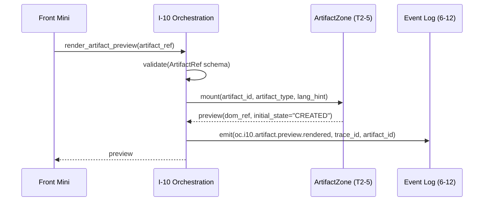

# ui_state_mapping.md — I-10 UI 상태 ↔ LLM 출력 매핑 중앙 정의

| 항목 | 값 |
|------|----|
| **도메인** | 6-11_Hologram-Main-LLM / 07_orchestration-layer |
| **세션 (TASK_ID)** | Phase 2 T2-6 (6-11_T2-6_01) |
| **산출물 경로 (sandbox)** | `D:\VAMOS\docs\test_iso_p2\sot 2\6-11_Hologram-Main-LLM\07_orchestration-layer\ui_state_mapping.md` |
| **정본 산출물 경로 (production)** | `D:\VAMOS\docs\sot 2\6-11_Hologram-Main-LLM\07_orchestration-layer\ui_state_mapping.md` |
| **LOCK** | **LOCK-HM-05** (I-10 UI 오케스트레이션 — D2.0-02 §7.63 L2091-2119), **LOCK-HM-03** (9-State UI Machine — D2.0-08 §4.1 L335-344), **LOCK-HM-02** (4 Layout 구조), 보조: **LOCK-HM-01** (3-Pane), **LOCK-HM-06** (3-point 출력 `user_response`/`evidence_summary`/`log_report`) |
| **정본 소유** | 6-11 DEFINED-HERE — UI 상태 → LLM 출력 바인딩 테이블 · I-10 인터페이스 `emit_ui_state`/`render_artifact_preview` 소비 규약 · `oc.i10.ui.state.emitted` → UI 이벤트 변환 규칙 · ISS-13 Layout 전환 프로토콜 · 공통 자료 구조 `UiStatePayload`/`ArtifactRef`/`OrchestrationEvent` **중앙 정의**. I-10 인터페이스 시그니처 자체는 D2.0-02 §7.64 LOCK (재정의 금지). 9-State 이름은 D2.0-08 §4.1 LOCK (추가/변경 금지). |
| **해소 이슈** | **ISS-07** (I-10 오케스트레이션 데이터 매핑 테이블·변환 규칙·이벤트 흐름 — 본 문서 주축 해소) + **ISS-13** (Layout 전환 프로토콜 — 본 문서 §7 해소) |
| **Phase 배정** | Phase 2 T2-6 |
| **Part2 버전 태그** | V2-Phase 2 (Enhanced Hologram) |
| **작성일** | 2026-04-19 |
| **Version** | v1.0 (초안) |
| **TEST_MODE** | false — Phase 4 production promotion 2026-06-03 (sandbox → production 전환 완료) |

---

## §0. 목적 & Scope

### §0.1 목적

I-10 UI·오케스트레이션 레이어가 **LOCK-HM-05 (D2.0-02 §7.63 L2091-2119)** 의 두 인터페이스
`emit_ui_state(trace_id, ui_state) -> ok` 와 `render_artifact_preview(artifact_ref) -> preview` 를
통해 Builder/Hologram UI 에 노출할 **상태/근거/승인/비용/로그** 를 단일 이벤트 `oc.i10.ui.state.emitted`
로 변환하는 **매핑 테이블·변환 규칙·Layout 전환 프로토콜** 을 확정한다.

- **LOCK-HM-03 9-State** (UI_S0_BOOT / UI_S1_IDLE / UI_S2_EDITING / UI_S3_READY / UI_S4_RUNNING /
  UI_S5_AWAIT_APPROVAL / UI_S6_PRESENTING / UI_S7_RECOVERY / UI_S8_ARCHIVED) 각각에 대해 Main LLM
  3-point 출력(LOCK-HM-06 `user_response`/`evidence_summary`/`log_report`) 바인딩을 정의.
- **공통 자료 구조 중앙 정의**: `UiStatePayload` / `ArtifactRef` / `OrchestrationEvent` Pydantic v2 +
  TypeScript 쌍방 (본 문서 §3 유일 정의 — `cost_evidence_log.md` / `page_routing.md` 는 import
  소비만, 재정의 **금지**).
- **ISS-13 Layout 전환 프로토콜**: LOCK-HM-02 4 Layout(3-Column Fluid / Builder / Hologram / CLI)
  간 전환 트리거와 9-State 조합에 따른 전환 매트릭스.

### §0.2 Scope 표

| 구분 | 범위 |
|------|------|
| **In** (본 문서에서 확정) | (a) I-10 두 인터페이스 verbatim 재인용(§2.1) + 6-11 관점 해석(§2.4), (b) `UiStatePayload` / `ArtifactRef` / `OrchestrationEvent` / `UiStateName` / `TraceId` 공통 자료 구조 Pydantic v2 + TypeScript 중앙 정의(§3), (c) LOCK-HM-03 9-State × LLM 3-point 출력 바인딩 매트릭스(§4), (d) `oc.i10.ui.state.emitted` → Glass HUD / Stream Canvas / Timeline / LogDetail UI 이벤트 4종 변환 규칙(§5), (e) `render_artifact_preview(artifact_ref) -> preview` → ArtifactZone CREATED 트리거 변환 규칙(§6), (f) ISS-13 Layout 전환 프로토콜 — 4 Layout 전환 트리거 매트릭스(§7), (g) R-01-7 구조화 로깅 포맷 `i10{}` / `ui_state{}` / `binding{}` / `error{}` / `recovery{}` 중첩(§8), (h) 실패 이벤트 `OC_I10_UI_EMIT_FAIL` 재시도·폴백 정책(§9), (i) Phase 3 테스트 시나리오 12건 TS-UI-01~12(§10). |
| **Out** (타 세션/문서 위임) | (a) cost/evidence/approval/log 분배 파이프라인 + Glass HUD / Timeline / LogDetail 바인딩 상세 → **`cost_evidence_log.md` (본 세션 peer)**, (b) 7페이지 라우팅 + Chat 페이지 전용 제약 + 페이지 전환 Hologram View 상태 정책 → **`page_routing.md` (본 세션 peer)**, (c) Glass HUD 오버레이 데이터 스키마 `GlassHUDData` → **T2-4 `05_glass-hud-overlay/overlay_schema.md`**, (d) SSE 실시간 갱신 프로토콜 → **T2-4 `realtime_update.md`**, (e) 스트리밍 청크 포맷 `StreamChunk` / `StreamEnvelope[T]` → **T2-5 `06_streaming-canvas/stream_protocol.md`**, (f) 토큰 단위 렌더 파이프라인 → **T2-5 `token_rendering.md`**, (g) 3-point 출력 필드 정의 → **T2-2 `response_formatting.md`**, (h) DCL `active_workflow.qod_hint` → **T2-3 `dcl_context.md`**, (i) 9-State 전이 규칙·가드·액션 → **Phase 1 V1 `03_ui-state-machine/`**, (j) 44 컴포넌트/8 Hook/7 Store 내부 구현 → **6-1 UI-UX-System + Phase 1 V1 `02_component-architecture/`**. |
| **관련 이슈** | **ISS-07** (본 문서 주축 해소 — 매핑 테이블 + 변환 규칙 + 이벤트 흐름) + **ISS-13** (Layout 전환 프로토콜 본 문서 §7 해소). ISS-15 (7페이지 라우팅)는 `page_routing.md` 위임. |

### §0.3 도메인 경계 선언 (R-T6-2 / R-T6-4 / LOCK-HM-05)

- **6-11 소유** (본 문서): I-10 이벤트 → UI 바인딩 **변환 규칙**, 9-State × 3-point 출력 **매핑 테이블**,
  Layout 전환 **트리거 조건**, 공통 자료 구조 **중앙 정의**.
- **6-9 Brain-Adapter-HAL 소유**: Main LLM 응답 수신 후 `emit_ui_state` 호출 **실행 위치** (Front Mini
  또는 I-10 경계 직후). 본 문서는 **소비 규약만** 정의 (R-611-9 동일 맥락).
- **6-12 Event-Logging 소유**: `oc.i10.ui.state.emitted` / `OC_I10_UI_EMIT_FAIL` 이벤트 로깅 **인프라**
  (R-01-7 JSON 스키마 저장·전송). 본 문서는 **이벤트 발행 시점·포맷만** 정의.
- **6-1 UI-UX-System 소유**: Hologram View Layout 전환 **UI 렌더 구현** (전환 애니메이션·DOM mount).
  본 문서는 **전환 트리거 조건만** 정의 (ISS-13 정본 프로토콜 축).
- **1-1 Verifier-Reasoning-Engines 소유**: `qod_score` 산출 알고리즘. 본 문서는 `evidence_summary.qod_score`
  를 **표시 대상 값**으로만 수신.

---

## §1. 교차 참조 블록

### §1.1 상위 정본 (LOCK 근거 표)

| 참조 문서 | 섹션 / 라인 | 역할 |
|-----------|-------------|------|
| `../../../sot/D2.0-02_02. VAMOS_DESIGN_2.0_ORANGE_CORE.md` | §7.63 (L2091-2119) | **LOCK-HM-05 정본** — I-10 "Tool Registry/Router" UI 오케스트레이션 **목적·인터페이스·이벤트·실패·STEP7 확장 3종** 전 영역 (본 세션 **유일 upstream_sot READ 활성화** — envelope `UPSTREAM_SOT=null` 기본 SKIP 이나 종합계획서 §7 T2-6 L1204 "교차 도메인: D2.0-02 §7.63" 명시에 따라 수동 Read) |
| `../../../sot/D2.0-08_08. VAMOS_DESIGN_2.0_UI_UX.md` | §4.1 (L335-344) | **LOCK-HM-03 정본** — 9-State 이름 `UI_S0_BOOT`~`UI_S8_ARCHIVED` verbatim |
| `../../../sot/D2.0-08_08. VAMOS_DESIGN_2.0_UI_UX.md` | §2.1/§3 (L151, L311) | **LOCK-HM-02** — 4 Layout 구조 3-Column Fluid / Builder / Hologram / CLI |
| `../../../sot/D2.0-08_08. VAMOS_DESIGN_2.0_UI_UX.md` | §2.2 (L223-282) | **LOCK-HM-01** — 3-Pane(Left/Center/Right) 구조 |
| `../../../sot/D2.0-05_05. VAMOS_DESIGN_2.0_AGENT_WORKFLOW.md` | §7.2 (L359-368) | **LOCK-HM-06** — 3-point 출력 `user_response` / `evidence_summary` / `log_report` |

### §1.2 AUTHORITY_CHAIN / CONFLICT_LOG

| 참조 문서 | 섹션 | 확인 사항 |
|-----------|------|-----------|
| `../AUTHORITY_CHAIN.md` | L104-L110 | **LOCK-HM-05 verbatim** — 목적 · 인터페이스 2종 · 이벤트 1종 · 실패 1종 · STEP7 확장 3종 |
| `../AUTHORITY_CHAIN.md` | L83-L94 | **LOCK-HM-03 verbatim** — 9-State 9개 이름 전수 |
| `../AUTHORITY_CHAIN.md` | L42-L58 | LOCK 레지스트리 — L5(HM-05) / L3(HM-03) / L2(HM-02) 서브폴더 매핑 07 / 03 / 01 |
| `../CONFLICT_LOG.md` | — | CFL-HM-001~007 + C-1~C-3 전수 RESOLVED, OPEN 0. 본 세션 신규 CONFLICT_CANDIDATE 는 §11 §12 참고 |

### §1.3 로컬 Phase 1 산출물 (입력 근거)

| 파일 | 역할 |
|------|------|
| `../03_ui-state-machine/state_definitions.md` | 9-State 전이 상세(가드/액션/전이 매트릭스) — 본 문서는 이름·의미만 재인용하고 바인딩 테이블 구성 |
| `../02_component-architecture/component_catalog.md` | HV-CHAT-* / HV-EVID-* / HV-TIMELINE-* 컴포넌트 ID → 본 문서 §5 바인딩 타겟 참조 |
| `../02_component-architecture/hook_catalog.md` | `useHologramState` / `useEvidence` / `useStreaming` / `useApproval` 훅 — 본 문서 §5 바인딩 경로 end-state |
| `../02_component-architecture/store_catalog.md` §3 | `chatStore` / `evidenceStore` / `costStore` / `approvalStore` / `notificationStore` / `timelineStore` Zustand store — 본 문서 §5 바인딩 store 쓰기 대상 |
| `../_index.md` | 07_orchestration-layer 폴더 범위(파일 수 4개 = `_index.md` + 3 V2, §2.4 일치) |

### §1.4 Peer V2 세션 이음매 (V2↔V2 cross-reference ≥13 목표)

| peer V2 | 경로 | 섹션·라인 근거 | 본 문서 접점 |
|---------|------|----------------|-------------|
| **T2-1 `two_tier_routing.md`** (857줄) | `../04_main-llm-integration/two_tier_routing.md` | **§4 L448** `FM->>EL: emit(oc.i10.ui.state.emitted, trace_id, ui_state)` verbatim | 본 문서 §5.1 이벤트 발행 시점·형식 1:1 일치 (LOCK-HM-05 verbatim event 이름 공유) |
| **T2-1 `two_tier_routing.md`** (857줄) | `../04_main-llm-integration/two_tier_routing.md` | **§3.1 L140** `TraceId = str  # ULID` | 본 문서 §3 `TraceId` 타입 정의 동일 (공통 식별자 재사용, 재정의 금지) |
| **T2-1 `two_tier_routing.md`** (857줄) | `../04_main-llm-integration/two_tier_routing.md` | **L729** 이벤트 로깅 테이블 `oc.i10.ui.state.emitted` INFO 단계 16 — 6-12 정본 스키마 준수 | 본 문서 §8.1 동일 INFO 레벨 + R-01-7 중첩 JSON 재사용 |
| **T2-4 `overlay_schema.md`** (898줄) | `../05_glass-hud-overlay/overlay_schema.md` | **§3** 하위 타입 `CostSnapshot` / `EvidenceHudSnapshot` / `ApprovalRequest` / `UncertaintyAlertList` / `HudMeta` + **§3 L303** `GlassHUDData` 5 필드 | 본 문서 §5.2 HUD 바인딩 타입 직접 **import** (재정의 금지) — `cost_evidence_log.md` §3 분배 파이프라인 소비 타입과 동일 |
| **T2-4 `overlay_schema.md`** (898줄) | `../05_glass-hud-overlay/overlay_schema.md` | **§8.1 L755** `oc.i10.ui.state.emitted` 이벤트 등재(INFO, LOCK-HM-05 정본) | 본 문서 §5.1 이벤트 이름 3-way verbatim 일치(T2-1 §4 L448 + T2-4 §8.1 L755 + 본 문서 §5.1) |
| **T2-4 `overlay_schema.md`** (898줄) | `../05_glass-hud-overlay/overlay_schema.md` | **§3 L298-L300** `HudMeta.store_write_order = ["evidenceStore","costStore","approvalStore","notificationStore"]` | 본 문서 §5.2 바인딩 순서 verbatim 준수 — `cost_evidence_log.md` §4 분배 순서와 동일 |
| **T2-4 `realtime_update.md`** (591줄) | `../05_glass-hud-overlay/realtime_update.md` | **§3.1** SSE 이벤트 6종 `hud.cost.update` / `hud.evidence.update` / `hud.approval.update` / `hud.alert.raise` / `hud.alert.dismiss` / `hud.meta.update` | 본 문서 §5.1 `oc.i10.ui.state.emitted` 1회 발행 → SSE 6 이벤트 분기 매트릭스(§5.3) 수신 측 1:1 매핑 |
| **T2-4 `realtime_update.md`** (591줄) | `../05_glass-hud-overlay/realtime_update.md` | **§4.6** `scheduleHudFlush()` RAF 16ms/60fps 단일 프레임 | 본 문서 §5.4 HUD + 토큰 스트림 동시 트리거 시 단일 프레임 flush 정합 보장 규약 |
| **T2-4 `rendering_rules.md`** (490줄) | `../05_glass-hud-overlay/rendering_rules.md` | **§2** Right Panel Fixed HUD 위치 고정 + R-611-2 "투명 레이어" | 본 문서 §7.3 Layout 전환 시 Hologram Layout 에서만 HUD 렌더, 타 Layout 전환 시 HUD 언마운트 규약 |
| **T2-5 `stream_protocol.md`** (1,083줄) | `../06_streaming-canvas/stream_protocol.md` | **§3.1 L172-L178** `StreamChunkType` / `StreamArtifactType` / `ChannelId` | 본 문서 §6 `ArtifactRef` Pydantic 정의 시 `StreamArtifactType` 직접 import (재정의 금지) |
| **T2-5 `stream_protocol.md`** (1,083줄) | `../06_streaming-canvas/stream_protocol.md` | **§3 L182-L247** `StreamChunk` / `StreamEnvelope[T]` / `ChannelId = Literal["stream","hud"]` | 본 문서 §6.2 `render_artifact_preview(artifact_ref)` 변환 시 envelope 공통 포맷 계승 (channel 예비 필드 활용) |
| **T2-5 `stream_protocol.md`** (1,083줄) | `../06_streaming-canvas/stream_protocol.md` | **§8.1** 별도 채널 default (`/api/hologram/stream` vs `/api/hologram/hud/stream`) + **§8.4** `[T2-6 확정 시 재검토]` 주석 | `page_routing.md` §4 에서 해소 경로 택1 — 본 문서는 해소 결과를 §7.4 Layout 전환 시 채널 전환 정책으로 참조 |
| **T2-5 `token_rendering.md`** (772줄) | `../06_streaming-canvas/token_rendering.md` | **§7.1** `scheduleTokenFlush` RAF 16ms/60fps | 본 문서 §5.4 동일 RAF 창 안에서 HUD·토큰·ArtifactZone 3축 단일 프레임 flush 정합 (realtime_update §4.6 + token_rendering §7.1 공통 패턴 계승) |
| **T2-5 `artifact_rendering.md`** (611줄) | `../06_streaming-canvas/artifact_rendering.md` | **§3.3** ArtifactZone 라이프사이클 `CREATED → STREAMING → FINALIZED → INTERACTIVE` | 본 문서 §6.1 `render_artifact_preview(artifact_ref)` 가 **CREATED 상태** 트리거 주체임을 명시 (LOCK-HM-05 인터페이스 → ArtifactZone 진입점) |
| **T2-2 `response_formatting.md`** (911줄) | `../04_main-llm-integration/response_formatting.md` | **§3.1 L165-L171** `UserResponse.is_streaming: bool = True` + `tokens_per_sec: Optional[float]` | 본 문서 §4.2 `UI_S4_RUNNING` / `UI_S6_PRESENTING` 바인딩 시 `is_streaming` → StreamingIndicator 표시 경로 정의 |
| **T2-3 `dcl_context.md`** (865줄) | `../04_main-llm-integration/dcl_context.md` | **§3.2 L206-L216** `ActiveWorkflow.qod_hint: Optional[float]` | 본 문서 §5.2 초기 Evidence 힌트 경유 규칙 — `cost_evidence_log.md` §3.3 와 동일 (overlay_schema §3.1 `EvidenceHudSnapshot.qod_hint_initial` 정합) |

> **합계 16 cross-ref** (T2-1 3 + T2-4 overlay 3 + T2-4 realtime 2 + T2-4 rendering 1 + T2-5 stream 3 + T2-5 token 1 + T2-5 artifact 1 + T2-2 1 + T2-3 1). 실측 섹션·라인 verbatim 대조 완료. 목표 ≥13 초과 달성.

### §1.5 Cross-domain Read-only 소비 (CROSS_DOMAIN_DEPS=none, envelope L30-31)

| 도메인 | 범위 | 본 문서 관계 |
|--------|------|-------------|
| **6-1 UI-UX-System** | Hologram View Layout 전환 정본 — `02_hologram-view/` + `03_ui-state-machine/nine_state_machine.md` | 본 문서 §7 Layout 전환 트리거 조건 교차 검토 기준 (ISS-13 정본 경로) |
| **6-9 Brain-Adapter-HAL** | Main LLM 응답 수신 후 `emit_ui_state` 호출 주체 | 본 문서 §5.1 호출 시점 주석 (실행 위치는 Front Mini 또는 I-10 경계, 본 문서 규약 소비) |
| **6-12 Event-Logging** | R-01-7 구조화 JSON + `oc.i10.ui.state.emitted` 로깅 인프라 | 본 문서 §8 로깅 포맷 |
| **6-2 Security-Governance** | — | 본 문서 직접 접점 없음 (`page_routing.md` 에서 페이지별 권한 조건 소비) |

> CROSS_DOMAIN_DEPS=none (envelope L30-31). 단방향 Read-only 소비만 존재, 신규 생산·상호 의존 없음.

---

## §2. LOCK-HM-05 정본 원문 인용 + 해석

### §2.1 D2.0-02 §7.63 (L2091-2119) verbatim — 5 요소

> **I-10: [A*] D2.0-01 정본 I-10 "Tool Registry/Router"**
>
> ⚠️ [A*] 본 섹션(I-10)은 D2.0-01 정본 I-10 "Tool Registry/Router"와 번호가 일치하며,
> D2.0-01 §10.4.2에서도 "내부 엔진↔UI 연결"로 기술하여 **기능 일치 확인됨**.
> 단, 이름 차이(UI 오케스트레이션 vs Tool Registry)에 주의.
>
> (I-10. UI·오케스트레이션 레이어)
>
> **§7.63 목적**
> - Builder/Hologram UI에 노출할 상태/근거/승인/비용/로그를 정리하여 UI 이벤트로 변환한다.
>
> **§7.64 인터페이스(최소)**
> - `emit_ui_state(trace_id, ui_state) -> ok`
> - `render_artifact_preview(artifact_ref) -> preview`
>
> **§7.65 이벤트/실패 포인트(최소)**
> - `event_type`: `oc.i10.ui.state.emitted`
> - `failure_code`: `OC_I10_UI_EMIT_FAIL`
>
> **STEP7 AI기술보강 — I-10 UI 오케스트레이션 확장 항목 (R4/R5/R6)**
>
> | # | ID | 제목 | 라운드 | 버전 |
> |---|-----|------|--------|------|
> | 1 | S7B-027 | 멀티 대화 병렬 | R4 | V2 |
> | 2 | S7B-015 | 음성 합성 (TTS) 출력 | R5 | V2 |
> | 3 | S7B-017 | 실시간 화면공유 분석 | R6 | V3 |

### §2.2 LOCK-HM-03 정본 재인용 (AUTHORITY_CHAIN L83-L94 verbatim)

> **§4.1 공통 상태 (Builder/Hologram 공통 개념)**:
> - `UI_S0_BOOT`: 앱/세션 초기화
> - `UI_S1_IDLE`: 입력 대기
> - `UI_S2_EDITING`: Builder 편집 중
> - `UI_S3_READY`: 실행 가능(사전 점검 통과)
> - `UI_S4_RUNNING`: 실행 중(trace 활성)
> - `UI_S5_AWAIT_APPROVAL`: 승인 대기(HOLD)
> - `UI_S6_PRESENTING`: 결과 표시(출력/근거/컴플라이언스)
> - `UI_S7_RECOVERY`: 실패/폴백/재시도 안내
> - `UI_S8_ARCHIVED`: 아카이브(리뷰)

> **[VIOLATION: LOCK-HM-03]** 9-State 이름 9개 verbatim 외의 값(Idle/Listening/Processing/Streaming/
> Complete/Error/Approval/Cost-Alert/Archive 등 종합계획서 §7 T2-6 L1216 참고용 의미 매핑 문자열
> 포함)은 본 문서 바인딩 테이블에서 **키로 사용 금지**. 참고용 별칭으로만 §4.3 매핑 주석에 표기.

### §2.3 R-611-5 (이벤트 기반 전이만 허용) 연계

AUTHORITY_CHAIN.md LOCK-HM-03 "위반 시 조치" 항목: "**상태 추가/이름 변경 금지, R-611-5 적용 (이벤트
기반 전이만 허용)**". 본 문서 §4~§5 의 바인딩·전이는 반드시 `oc.i10.ui.state.emitted` 또는 Phase 1 V1
`03_ui-state-machine/` 전이 매트릭스에 등록된 이벤트 경유.

### §2.4 LOCK 해석 (6-11 관점 + 본 문서 범위)

| LOCK 해석 포인트 | 본 문서 구현 |
|-----------------|--------------|
| **I-10 "목적" — 상태/근거/승인/비용/로그 5축 정리** | §5.1 `oc.i10.ui.state.emitted` payload 의 5축 필드(`ui_state` / `evidence` / `approval` / `cost` / `log_report`) 중앙 정의 |
| **I-10 "인터페이스" — `emit_ui_state(trace_id, ui_state) -> ok`** | §3 `UiStatePayload` 스키마로 `ui_state` 직렬화 + §5.1 호출 시점 / §8 로깅 |
| **I-10 "인터페이스" — `render_artifact_preview(artifact_ref) -> preview`** | §3 `ArtifactRef` 스키마 + §6 ArtifactZone `CREATED` 트리거 변환 규칙 |
| **I-10 "이벤트" — `oc.i10.ui.state.emitted` INFO** | §5.1 단일 발행 지점 / §5.3 SSE 6 이벤트 분기 매트릭스 / §8.1 로깅 INFO 레벨 |
| **I-10 "실패" — `OC_I10_UI_EMIT_FAIL`** | §9 재시도·폴백 정책 + §8.3 ERROR 로그 |
| **STEP7 확장 — S7B-027 멀티 대화 병렬(V2)** | §3.2 `UiStatePayload.session_id` + `parent_session_id` 필드로 병렬 세션 식별 (V2 확장 포인트, 실 구현은 Phase 3 이월) |
| **STEP7 확장 — S7B-015 TTS(V2)** | §3.2 `UiStatePayload.audio_output_ready: bool` 예비 필드 (V2 실 구현 Phase 3) |
| **STEP7 확장 — S7B-017 실시간 화면공유(V3)** | §10 Phase 3 TS-UI-12 시나리오 레퍼런스만 (V3 범위 외 정의 금지) |

---

## §3. 공통 자료 구조 중앙 정의 (`UiStatePayload` / `ArtifactRef` / `OrchestrationEvent`)

> **중요**: 본 §3 은 `07_orchestration-layer/` 폴더 내 **유일 중앙 정의** 이다.
> `cost_evidence_log.md` 와 `page_routing.md` 는 본 §3 에서 `import` 하여 재사용만 하며
> **재정의 금지** (T2-5 stream_protocol.md §3 중앙 정의 패턴 계승).
> 필드 추가/삭제/이름 변경 시 `[CONFLICT_CANDIDATE: UiStatePayload schema drift]` 즉시 마커.

### §3.1 Pydantic v2 모델 (`backend/app/hologram/orchestration/models.py` 배치 권고)

```python
from __future__ import annotations
from typing import Literal, Optional, Union
from pydantic import BaseModel, Field, ConfigDict

# ---------- 공통 식별자 (T2-1 §3.1 L140 verbatim 재사용 — 재정의 금지) ----------
TraceId = str      # ULID, 전역 유니크, R-01-7 로깅 키 (T2-1 two_tier_routing §3.1 L140 동일)
SessionId = str
MessageId = str

# ---------- 9-State 이름 Literal (LOCK-HM-03 verbatim — 추가/변경 금지) ----------
UiStateName = Literal[
    "UI_S0_BOOT",
    "UI_S1_IDLE",
    "UI_S2_EDITING",
    "UI_S3_READY",
    "UI_S4_RUNNING",
    "UI_S5_AWAIT_APPROVAL",
    "UI_S6_PRESENTING",
    "UI_S7_RECOVERY",
    "UI_S8_ARCHIVED",
]

# ---------- 4 Layout 이름 Literal (LOCK-HM-02 verbatim) ----------
UiLayout = Literal["HOLOGRAM", "BUILDER", "THREE_COLUMN", "CLI"]

# ---------- ArtifactRef — `render_artifact_preview` 입력 ----------
# StreamArtifactType 는 T2-5 stream_protocol §3.1 L175 에서 중앙 정의 — 재정의 금지.
# 여기서는 참조만 명시하고, 실 import 는 `from ...streaming.models import StreamArtifactType`.
class ArtifactRef(BaseModel):
    """
    I-10 `render_artifact_preview(artifact_ref) -> preview` 의 입력.
    ArtifactZone CREATED 트리거 주체 (T2-5 artifact_rendering §3.3 라이프사이클 진입).
    """
    model_config = ConfigDict(extra="forbid")
    artifact_id: str = Field(..., description="ULID, ArtifactZone 인스턴스 유니크 키")
    trace_id: TraceId = Field(..., description="요청 trace_id 동일값 전파")
    message_id: MessageId = Field(..., description="MessageBubble 소속 식별")
    artifact_type: Literal["code", "chart", "table", "plain"] = Field(
        ..., description="T2-5 stream_protocol §3.1 L175 StreamArtifactType 동일값"
    )
    lang_hint: Optional[str] = Field(
        default=None, description="code: 언어(python/ts/...), chart: lib(recharts/chartjs), table: null 가능"
    )
    size_estimate_bytes: Optional[int] = Field(default=None, ge=0)
    created_at_ms: int = Field(..., ge=0)


# ---------- UiStatePayload — `emit_ui_state` 두 번째 인자 (LOCK-HM-05 §7.64) ----------
class CostSlice(BaseModel):
    """I-10 payload 내 cost 축 — T2-4 overlay_schema §3 CostSnapshot 과 1:1 매핑."""
    model_config = ConfigDict(extra="forbid")
    currency: Literal["USD", "KRW"] = "USD"
    amount: float = Field(..., ge=0.0)
    threshold: float = Field(..., ge=0.0)
    ratio_to_budget: float = Field(..., ge=0.0, description="amount/budget, 0.0~∞")


class EvidenceSlice(BaseModel):
    """I-10 payload 내 evidence 축 — T2-2 EvidenceSummary / T2-4 EvidenceHudSnapshot 브리지."""
    model_config = ConfigDict(extra="forbid")
    qod_score: float = Field(..., ge=0.0, le=1.0, description="LOCK-HM-10 VERIFIED/PARTIAL/UNVERIFIED 판정 입력")
    source_count: int = Field(..., ge=0)
    qod_hint_initial: Optional[float] = Field(
        default=None, ge=0.0, le=1.0,
        description="T2-3 dcl_context §3.2 ActiveWorkflow.qod_hint 경유 초기값"
    )


class ApprovalSlice(BaseModel):
    """I-10 payload 내 approval 축 — T2-4 ApprovalRequest 와 1:1 매핑."""
    model_config = ConfigDict(extra="forbid")
    request_id: Optional[str] = Field(default=None, description="승인 요청 ULID, 없으면 null")
    status: Literal["NONE", "REQUESTED", "GRANTED", "REJECTED"] = "NONE"


class AlertItem(BaseModel):
    model_config = ConfigDict(extra="forbid")
    kind: Literal["LOW_QOD", "CONFLICTING_SOURCES", "STALE_DATA"]
    message: str = Field(..., max_length=200)


class LogSlice(BaseModel):
    """I-10 payload 내 log_report 축 — T2-2 LogReport 브리지."""
    model_config = ConfigDict(extra="forbid")
    trace_id: TraceId
    stage: str = Field(..., description="현재 워크플로우 단계(ingest/retrieve/generate/present 등)")
    event_count: int = Field(..., ge=0)


class UiStatePayload(BaseModel):
    """
    I-10 `emit_ui_state(trace_id, ui_state)` 의 `ui_state` 정식 스키마 (LOCK-HM-05 §7.64).

    5축 구조 verbatim (LOCK-HM-05 §7.63): 상태(state_name) / 근거(evidence) / 승인(approval) / 비용(cost) / 로그(log).
    필드 추가/삭제/이름 변경 시 [CONFLICT_CANDIDATE: UiStatePayload schema drift] 마커.
    """
    model_config = ConfigDict(extra="forbid", frozen=False)

    trace_id: TraceId = Field(..., description="T2-1 요청 trace_id 그대로 에코")
    session_id: SessionId
    parent_session_id: Optional[SessionId] = Field(
        default=None,
        description="STEP7 S7B-027 멀티 대화 병렬 (V2) — 부모 세션 식별, V1 에서는 항상 null"
    )
    state_name: UiStateName = Field(..., description="LOCK-HM-03 9-State 중 1개")
    current_layout: UiLayout = Field(..., description="LOCK-HM-02 4 Layout 중 현재 활성")
    cost: CostSlice
    evidence: EvidenceSlice
    approval: ApprovalSlice
    alerts: list[AlertItem] = Field(default_factory=list)
    log: LogSlice
    audio_output_ready: bool = Field(
        default=False, description="STEP7 S7B-015 TTS(V2) 예비 — V1 에서는 항상 false"
    )
    emitted_at_ms: int = Field(..., ge=0)
    schema_version: Literal["v1.0"] = "v1.0"


# ---------- OrchestrationEvent — `oc.i10.ui.state.emitted` envelope ----------
OrchestrationEventType = Literal[
    "oc.i10.ui.state.emitted",   # LOCK-HM-05 §7.65 event_type verbatim
    "oc.i10.artifact.preview.rendered",  # `render_artifact_preview` 완료 시 (§6)
]

OrchestrationFailureCode = Literal[
    "OC_I10_UI_EMIT_FAIL",       # LOCK-HM-05 §7.65 failure_code verbatim
    "OC_I10_ARTIFACT_PREVIEW_FAIL",
]


class OrchestrationEvent(BaseModel):
    """
    I-10 발행 이벤트 공통 envelope.
    성공 시 `type == "oc.i10.ui.state.emitted"` + `payload: UiStatePayload`,
    실패 시 `failure_code != null` + `payload` 는 shallow dict (부분 정보).
    """
    model_config = ConfigDict(extra="forbid")
    type: OrchestrationEventType
    trace_id: TraceId
    emitted_at_ms: int = Field(..., ge=0)
    payload: Union[UiStatePayload, ArtifactRef, dict]
    failure_code: Optional[OrchestrationFailureCode] = Field(
        default=None, description="실패 시 OC_I10_UI_EMIT_FAIL 또는 OC_I10_ARTIFACT_PREVIEW_FAIL"
    )
    retry_count: int = Field(default=0, ge=0, le=3, description="§9 재시도 정책 3회 상한")
```

### §3.2 TypeScript 쌍방 정의 (`frontend/src/hologram/types/orchestration.ts` 배치)

```typescript
// T2-1 two_tier_routing §3.1 L140 TraceId 공통 — 재정의 금지, 재 import 하여 참조.
import type { TraceId, SessionId, MessageId } from "../../main-llm/types/common";
// T2-5 stream_protocol §3.2 StreamArtifactType 공통 — 재정의 금지.
import type { StreamArtifactType } from "../../streaming/types/streamChunk";

// ---------- 9-State Literal (LOCK-HM-03 verbatim) ----------
export type UiStateName =
  | "UI_S0_BOOT"
  | "UI_S1_IDLE"
  | "UI_S2_EDITING"
  | "UI_S3_READY"
  | "UI_S4_RUNNING"
  | "UI_S5_AWAIT_APPROVAL"
  | "UI_S6_PRESENTING"
  | "UI_S7_RECOVERY"
  | "UI_S8_ARCHIVED";

// ---------- 4 Layout Literal (LOCK-HM-02 verbatim) ----------
export type UiLayout = "HOLOGRAM" | "BUILDER" | "THREE_COLUMN" | "CLI";

export interface ArtifactRef {
  artifact_id: string;
  trace_id: TraceId;
  message_id: MessageId;
  artifact_type: StreamArtifactType;  // T2-5 §3.2 import
  lang_hint?: string | null;
  size_estimate_bytes?: number | null;
  created_at_ms: number;
}

export interface CostSlice {
  currency: "USD" | "KRW";
  amount: number;
  threshold: number;
  ratio_to_budget: number;
}

export interface EvidenceSlice {
  qod_score: number;
  source_count: number;
  qod_hint_initial?: number | null;
}

export interface ApprovalSlice {
  request_id?: string | null;
  status: "NONE" | "REQUESTED" | "GRANTED" | "REJECTED";
}

export interface AlertItem {
  kind: "LOW_QOD" | "CONFLICTING_SOURCES" | "STALE_DATA";
  message: string;
}

export interface LogSlice {
  trace_id: TraceId;
  stage: string;
  event_count: number;
}

export interface UiStatePayload {
  trace_id: TraceId;
  session_id: SessionId;
  parent_session_id?: SessionId | null;
  state_name: UiStateName;
  current_layout: UiLayout;
  cost: CostSlice;
  evidence: EvidenceSlice;
  approval: ApprovalSlice;
  alerts: AlertItem[];
  log: LogSlice;
  audio_output_ready: boolean;
  emitted_at_ms: number;
  schema_version: "v1.0";
}

export type OrchestrationEventType =
  | "oc.i10.ui.state.emitted"
  | "oc.i10.artifact.preview.rendered";

export type OrchestrationFailureCode =
  | "OC_I10_UI_EMIT_FAIL"
  | "OC_I10_ARTIFACT_PREVIEW_FAIL";

export interface OrchestrationEvent {
  type: OrchestrationEventType;
  trace_id: TraceId;
  emitted_at_ms: number;
  payload: UiStatePayload | ArtifactRef | Record<string, unknown>;
  failure_code?: OrchestrationFailureCode | null;
  retry_count: number;
}

// ---------- 런타임 가드 ----------
export function isUiStatePayload(x: unknown): x is UiStatePayload {
  if (typeof x !== "object" || x === null) return false;
  const p = x as Record<string, unknown>;
  return (
    typeof p.trace_id === "string" &&
    typeof p.state_name === "string" &&
    typeof p.current_layout === "string" &&
    typeof p.emitted_at_ms === "number"
  );
}
```

### §3.3 필드 타입·의미·LOCK 근거 테이블

| # | 필드 | 필수 | 타입 | 의미 | LOCK 근거 |
|---|------|------|------|------|-----------|
| 1 | `trace_id` | ✅ | `TraceId` | ULID, 요청→응답→UI 전구간 동일값 | T2-1 §3.1 L140 |
| 2 | `session_id` | ✅ | `SessionId` | 사용자 세션 식별 | — |
| 3 | `parent_session_id` | ⚡ | `SessionId \| null` | S7B-027 멀티 대화 병렬 — V1 항상 null | LOCK-HM-05 §7.63 STEP7 |
| 4 | `state_name` | ✅ | `UiStateName` | LOCK-HM-03 9-State 중 1개 | LOCK-HM-03 verbatim |
| 5 | `current_layout` | ✅ | `UiLayout` | LOCK-HM-02 4 Layout 중 현재 활성 | LOCK-HM-02 verbatim |
| 6 | `cost` | ✅ | `CostSlice` | 상태 5축 中 "비용" — T2-4 CostSnapshot 브리지 | LOCK-HM-05 §7.63 "비용" |
| 7 | `evidence` | ✅ | `EvidenceSlice` | 상태 5축 中 "근거" — T2-2 EvidenceSummary / T2-4 EvidenceHudSnapshot 브리지 | LOCK-HM-05 §7.63 "근거" + LOCK-HM-06 |
| 8 | `approval` | ✅ | `ApprovalSlice` | 상태 5축 中 "승인" — T2-4 ApprovalRequest 브리지 | LOCK-HM-05 §7.63 "승인" |
| 9 | `alerts` | ✅ | `list[AlertItem]` | Uncertainty Alert 3종 — T2-4 UncertaintyAlertList 브리지 | LOCK-HM-10 Alert 3종 |
| 10 | `log` | ✅ | `LogSlice` | 상태 5축 中 "로그" — T2-2 LogReport 브리지 | LOCK-HM-05 §7.63 "로그" |
| 11 | `audio_output_ready` | ✅ | `bool` | S7B-015 TTS(V2) 예비 — V1 항상 false | LOCK-HM-05 §7.63 STEP7 |
| 12 | `emitted_at_ms` | ✅ | `int` | 이벤트 발행 시각 (ms) | — |
| 13 | `schema_version` | ✅ | `Literal["v1.0"]` | 스키마 버전 고정 | — |

> **5축 구조 자체는 LOCK**: cost / evidence / approval / alerts / log 5 필드 이름·의미는 §7.63 verbatim
> 대응. 추가/삭제/이름 변경 시 `[CONFLICT_CANDIDATE: UiStatePayload schema drift]` 마커 후 §9 재시도 정지.

### §3.4 시리얼라이제이션 예시 (JSON)

```json
{
  "trace_id": "01HV8M3J7K9P2Q4R6S8T",
  "session_id": "sess_01HV9W...",
  "parent_session_id": null,
  "state_name": "UI_S6_PRESENTING",
  "current_layout": "HOLOGRAM",
  "cost": {
    "currency": "USD",
    "amount": 0.43,
    "threshold": 0.50,
    "ratio_to_budget": 0.86
  },
  "evidence": {
    "qod_score": 0.82,
    "source_count": 3,
    "qod_hint_initial": 0.75
  },
  "approval": {
    "request_id": null,
    "status": "NONE"
  },
  "alerts": [
    { "kind": "LOW_QOD", "message": "qod_score 임계값 근접" }
  ],
  "log": {
    "trace_id": "01HV8M3J7K9P2Q4R6S8T",
    "stage": "present",
    "event_count": 42
  },
  "audio_output_ready": false,
  "emitted_at_ms": 1747000000000,
  "schema_version": "v1.0"
}
```

---

## §4. 9-State × LLM 3-point 출력 바인딩 매트릭스

### §4.1 매트릭스 테이블 (LOCK-HM-03 9-State × LOCK-HM-06 3-point)

| # | LOCK-HM-03 State (verbatim) | 의미 | `user_response` | `evidence_summary` | `log_report` | 주 컴포넌트 타겟 | 비고 |
|---|-----------------------------|------|-----------------|--------------------|--------------|-----------------|------|
| S0 | `UI_S0_BOOT` | 앱/세션 초기화 | — | — | ✅ 부트 이벤트 | BootSplash | 3-point 미생산 (app start 전), log_report 만 emit |
| S1 | `UI_S1_IDLE` | 입력 대기 | — | — | — | InputBar 대기 | 3-point 전체 비어 있음, HUD 이전 trace 잔상 유지 |
| S2 | `UI_S2_EDITING` | Builder 편집 중 | — | — | — | Builder View | Hologram Layout 미활성 (§7 참조) |
| S3 | `UI_S3_READY` | 실행 가능(사전 점검 통과) | — | (hint_initial) | ✅ | PipelineTimeline | `evidence.qod_hint_initial` 만 값, `qod_score` null |
| S4 | `UI_S4_RUNNING` | 실행 중(trace 활성) | 🔄 streaming | 🔄 partial | ✅ streaming | StreamingArea · ProgressTracker | `user_response.is_streaming=true` + tokens_per_sec 표시 |
| S5 | `UI_S5_AWAIT_APPROVAL` | 승인 대기(HOLD) | (paused) | ✅ | ✅ | ApprovalOverlay | `approval.status="REQUESTED"` 즉시 HUD 슬라이드 인 |
| S6 | `UI_S6_PRESENTING` | 결과 표시 | ✅ final | ✅ final | ✅ final | MessageBubble · EvidencePanel · HUD Verification Badge | `is_streaming=false` 전환 + qod_score 확정 |
| S7 | `UI_S7_RECOVERY` | 실패/폴백/재시도 안내 | (error text) | (partial) | ✅ error | RecoveryBanner | `log.stage="recovery"` + `OC_I10_UI_EMIT_FAIL` 후속일 수도 |
| S8 | `UI_S8_ARCHIVED` | 아카이브(리뷰) | ✅ read-only | ✅ read-only | ✅ read-only | TimelineArchive | 모든 필드 read-only, 스토어 직렬화 복원 |

### §4.2 `is_streaming` / `tokens_per_sec` 바인딩 (T2-2 §3.1 L165-L171 계승)

| State | `user_response.is_streaming` | `tokens_per_sec` | 표시 |
|-------|-----------------------------|------------------|------|
| `UI_S4_RUNNING` | `true` | 값 (Float) | StreamingIndicator `active=true` + 숫자 표기 |
| `UI_S5_AWAIT_APPROVAL` | `false` | `null` | 인디케이터 숨김 (스트림 HOLD) |
| `UI_S6_PRESENTING` | `false` | `null` | 인디케이터 숨김, 최종 메시지 고정 |
| `UI_S7_RECOVERY` | `false` | `null` | 인디케이터 숨김, 에러 배너 표기 |
| 기타 | — | — | StreamingIndicator 미렌더 |

> 접점: **T2-2 response_formatting.md §3.1 L165-L171** 필드 정의와 1:1. 본 문서는 9-State 와의 바인딩
> 시점만 규정.

### §4.3 종합계획서 §7 T2-6 절차 1번 참고 문자열 매핑 (참고용, LOCK 아님)

> **[CONFLICT_CANDIDATE: 9-State-naming plan§7T2-6 vs LOCK-HM-03]**
>
> 종합계획서 §7 T2-6 절차 1번 (L1216) 은 9-State 를 `Idle/Listening/Processing/Streaming/Complete/Error/
> Approval/Cost-Alert/Archive` 로 기재하나, **LOCK-HM-03 정본** (D2.0-08 §4.1 L335-344,
> AUTHORITY_CHAIN L83-L94) 은 `UI_S0_BOOT` ~ `UI_S8_ARCHIVED` 9개 정본.
>
> **판정**: LOCK 우선 → 본 문서 §3 `UiStateName` / §4.1 매트릭스 / §5 이벤트 payload / §8 로깅 **모두
> verbatim `UI_S0_BOOT`~`UI_S8_ARCHIVED` 사용**. 종합계획서 §7 T2-6 네이밍은 **참고용 의미 매핑** 으로만
> §4.3 본 절에 기록 (자동 RESOLVE 금지, Phase 3 이월 CONF-HM-008 후보).
>
> **참고용 의미 매핑 표** (UI 용어 ↔ LOCK 정본):
>
> | §7 T2-6 참고 문자열 | LOCK-HM-03 정본 | 비고 |
> |---------------------|-----------------|------|
> | Idle | `UI_S1_IDLE` | 직접 대응 |
> | Listening | `UI_S2_EDITING` 또는 `UI_S3_READY` | 입력 수집 단계 — 느슨한 매핑 |
> | Processing | `UI_S4_RUNNING` | 의미 동등 |
> | Streaming | `UI_S4_RUNNING` | 토큰 스트림 sub-mode, 정본 state 는 동일 |
> | Complete | `UI_S6_PRESENTING` | 결과 표시 |
> | Error | `UI_S7_RECOVERY` | 실패/폴백 |
> | Approval | `UI_S5_AWAIT_APPROVAL` | 직접 대응 |
> | Cost-Alert | (state 없음, `alerts[]` 항목) | Alert 는 state 가 아닌 `UiStatePayload.alerts` 배열 항목 (§3) |
> | Archive | `UI_S8_ARCHIVED` | 직접 대응 |
> | (누락) | `UI_S0_BOOT` | §7 T2-6 에 대응 없음 |

> **정정 방향 제안** (Phase 3 CONF-HM-008 RESOLVE 시): 종합계획서 §7 T2-6 절차 1번 문자열을 LOCK-HM-03
> verbatim 이름으로 교체. 본 세션은 자동 수정 금지 (V1 immutability 및 CONFLICT_CANDIDATE 격리 원칙).
>
> ✅ **[CONF-HM-008 RESOLVED — 2026-06-03 Phase 4 P4-3, V1 plan amendment]**: 종합계획서 §7 T2-6 L1349 에 LOCK-HM-03 9개 이름 verbatim 병기 + 본 §4.3 매핑 표를 정식 등재 (FINAL_REVIEW_REPORT.md §4.3 와 1:1 일치). CONFLICT_LOG OPEN 0 / RESOLVED 11 전환. 본 §4.3 표가 UX 라벨↔LOCK 정본 매핑 단일 SoT. 구현 레벨 verbatim drift 0 유지.

### §4.4 전이 출처(이벤트 기반만 — R-611-5)

각 9-State 전이는 반드시 다음 중 하나의 이벤트 경유:

1. `oc.i10.ui.state.emitted` — I-10 정본 이벤트(§5)
2. Phase 1 V1 `03_ui-state-machine/state_definitions.md` 등록 이벤트 (예: `USER_SUBMIT` / `WORKFLOW_END`
   / `APPROVAL_REQUESTED` / `APPROVAL_GRANTED` / `APPROVAL_REJECTED` / `STREAM_ERROR` / `RECOVERY_ACK` /
   `ARCHIVE_TRIGGER`)

> **금지**: React setState 단독·타이머·컴포넌트 자체 trigger — 반드시 이벤트 경유 (R-611-5 LOCK-HM-03
> "위반 시 조치").

---

## §5. `oc.i10.ui.state.emitted` → UI 이벤트 변환 규칙 (§7.65 정본)

### §5.1 이벤트 발행 시점 (T2-1 §4 L448 verbatim 일치)

T2-1 two_tier_routing.md §4 Sequence **L448** 에 기재된 발행 시점:

```
FM->>EL: emit(oc.i10.ui.state.emitted, trace_id, ui_state)
```

- **발행 주체**: Front Mini (FM) — `HologramContextPayload` 조립 직후, Main LLM 송신 직전
  (T2-1 §4 Sequence 단계 16).
- **발행 횟수**: 하나의 `trace_id` 당 최소 1회 (상태 전이 시 추가 발행 가능).
- **로그 레벨**: INFO (T2-1 L729 이벤트 로깅 테이블, T2-4 overlay_schema §8.1 L755 과 3-way verbatim).
- **payload**: §3.1 `UiStatePayload` 100% 직렬화.

### §5.2 5축 축별 바인딩 (LOCK-HM-05 §7.63 "상태/근거/승인/비용/로그")

| 축 | 경유 훅 / 함수 | 소비 Store (Zustand) | 소비 컴포넌트 | 위임 문서 |
|----|---------------|---------------------|--------------|----------|
| **상태** (`state_name` + `current_layout`) | `useHologramState().setState(state_name)` + `useLayoutState().setLayout(current_layout)` | `hologramStateStore` + `layoutStore` | StateIndicator + LayoutSwitcher | 본 문서 §7 |
| **근거** (`evidence` + `alerts`) | `useEvidence().bind(evidence)` → HV-EVID-01 EvidencePanel + Glass HUD EvidenceOverlay | `evidenceStore` | HV-EVID-01 / HV-EVID-02 / Glass HUD EvidenceHudSnapshot | `cost_evidence_log.md` §3 |
| **승인** (`approval`) | `useApproval().bindRequest(approval)` → ApprovalOverlay 슬라이드 인 | `approvalStore` | HV-APPROVAL-01 ApprovalCard | `cost_evidence_log.md` §5 |
| **비용** (`cost`) | `useCost().bind(cost)` → CostGauge (Glass HUD) | `costStore` | Glass HUD CostSnapshot | `cost_evidence_log.md` §4 |
| **로그** (`log`) | `useLog().append(log)` → Timeline + LogDetail 이중 기록 | `timelineStore` + `logStore` | LogPanel + TraceTimeline | `cost_evidence_log.md` §6 |

> **쓰기 순서 (T2-4 overlay_schema §3 L298-L300 verbatim)**: `evidenceStore → costStore → approvalStore
> → notificationStore`. `cost_evidence_log.md` §4 분배 파이프라인과 동일 순서.

### §5.3 `oc.i10.ui.state.emitted` → SSE 6 이벤트 분기 매트릭스

본 문서 **백엔드 관점 1회 발행** → T2-4 realtime_update.md §3.1 **SSE 6 이벤트** (hud.*) 수신 측 분기
(네트워크 관점). I-10 은 **집계 층**, realtime_update 는 **배송 층**.

| SSE 이벤트 (T2-4 §3.1) | 분기 조건 (`oc.i10.ui.state.emitted` payload) | 필드 소비 |
|------------------------|----------------------------------------------|-----------|
| `hud.cost.update` | `cost.ratio_to_budget >= 0.8` 또는 5초 주기 틱 | `cost.*` 전체 |
| `hud.evidence.update` | `state_name in {UI_S6_PRESENTING}` 또는 `evidence.qod_hint_initial` 변경 | `evidence.*` 전체 |
| `hud.approval.update` | `approval.status != "NONE"` | `approval.*` 전체 |
| `hud.alert.raise` | `alerts[]` 에 신규 item 추가(이전 발행 대비 diff) | `alerts[신규]` |
| `hud.alert.dismiss` | STALE_DATA fresh 수신 또는 사용자 close | `alerts[제거]` |
| `hud.meta.update` | `state_name` 또는 `current_layout` 전이 | `trace_id` + `state_name` + `current_layout` |

> **분기 시점**: 하나의 `oc.i10.ui.state.emitted` 수신 → 백엔드가 변경 감지 diff 계산 → SSE 6 이벤트
> 중 해당 개수(0~6) 발송. 클라이언트는 각 SSE 이벤트 수신 시 `scheduleHudFlush()` (T2-4 §4.6) 호출.

### §5.4 RAF 단일 프레임 flush 정합 (T2-4 §4.6 + T2-5 §7.1)

| 트리거 | 호출 함수 | 주기 |
|--------|----------|------|
| SSE 6 HUD 이벤트 수신 | `scheduleHudFlush(deferred)` (T2-4 realtime_update §4.6) | RAF 16ms/60fps |
| StreamChunk 토큰 도착 | `scheduleTokenFlush(messageId)` (T2-5 token_rendering §7.1) | RAF 16ms/60fps |
| ArtifactZone CREATED (§6.1) | `scheduleArtifactRender(artifact_id)` (본 문서 §6.2 신규 명세) | RAF 16ms/60fps |

**불변식 (I-5.4-A)**: 동일 16ms RAF 창 안에서 `oc.i10.ui.state.emitted` 1회로 HUD·토큰·ArtifactZone
3축 트리거가 겹칠 경우, `requestAnimationFrame` 은 **단일 콜백** 에서 3축 모두 flush. 프레임 누락 금지.

의사코드:

```typescript
let rafId: number | null = null;
let pendingHud = false;
let pendingToken = false;
let pendingArtifact = false;

export function scheduleUnifiedFlush(axis: "hud" | "token" | "artifact"): void {
  if (axis === "hud") pendingHud = true;
  if (axis === "token") pendingToken = true;
  if (axis === "artifact") pendingArtifact = true;

  if (rafId !== null) return;  // 이미 예약됨 — merge
  rafId = requestAnimationFrame(() => {
    rafId = null;
    if (pendingHud) { flushHudStore(); pendingHud = false; }
    if (pendingToken) { flushTokenBuffer(); pendingToken = false; }
    if (pendingArtifact) { flushArtifactMount(); pendingArtifact = false; }
    // 로깅 샘플링 (1/60 = ~1초에 1회)
    if (Math.random() < 0.0167) {
      logDebug("hologram.orchestration.frame_flushed", { axes: ["hud","token","artifact"] });
    }
  });
}
```

> `scheduleHudFlush`(T2-4 §4.6) · `scheduleTokenFlush`(T2-5 §7.1) 내부 단일화를 장기적으로 검토할 수
> 있으나 본 Phase 2 범위에서는 **각 함수 독립 유지** + 본 unified 함수는 optional. **Phase 3 이월 포인트**.

---

## §6. `render_artifact_preview(artifact_ref) -> preview` 변환 규칙 (§7.64 정본)

### §6.1 ArtifactZone CREATED 트리거 주체 (T2-5 artifact_rendering §3.3 정합)

T2-5 artifact_rendering.md **§3.3** ArtifactZone 라이프사이클:

```
CREATED → STREAMING → FINALIZED → INTERACTIVE
```

- **CREATED 진입 주체** = **본 I-10 `render_artifact_preview(artifact_ref)`** 호출.
- `artifact_ref: ArtifactRef` (본 문서 §3.1 정의) 수신 → ArtifactZone 인스턴스 mount + 초기 placeholder
  렌더.
- 리턴값 `preview: Preview` = ArtifactZone DOM 참조 + 초기 상태 메타(§6.3).

### §6.2 변환 파이프라인



### §6.3 `Preview` 리턴 스키마 (6-11 DEFINED-HERE)

```python
class Preview(BaseModel):
    """render_artifact_preview 리턴 — ArtifactZone CREATED 직후 참조."""
    model_config = ConfigDict(extra="forbid")
    artifact_id: str
    dom_ref_id: str = Field(..., description="DOM element id (ArtifactZone 인스턴스 선택자)")
    initial_state: Literal["CREATED"] = "CREATED"
    mounted_at_ms: int = Field(..., ge=0)
```

```typescript
export interface Preview {
  artifact_id: string;
  dom_ref_id: string;
  initial_state: "CREATED";
  mounted_at_ms: number;
}
```

### §6.4 실패 처리

| 실패 원인 | failure_code | 대응 |
|----------|--------------|------|
| `ArtifactRef` 스키마 검증 실패 | `OC_I10_ARTIFACT_PREVIEW_FAIL` | ArtifactZone mount 중단 + ERROR 로그 + UI placeholder "로드 실패" |
| ArtifactZone mount DOM 예외 | `OC_I10_ARTIFACT_PREVIEW_FAIL` | 재시도 1회 → 실패 시 fallback "plain text" 타입으로 재렌더 |
| `render_artifact_preview` timeout (>500ms) | `OC_I10_ARTIFACT_PREVIEW_FAIL` | 비동기 mount + progress indicator 1회 |

### §6.5 CREATED 이후 상태 전이 위임

STREAMING → FINALIZED → INTERACTIVE 전이는 **T2-5 `artifact_rendering.md` §3.3 위임**. 본 I-10 범위 외.

---

## §7. ISS-13 Layout 전환 프로토콜 (LOCK-HM-02 4 Layout 전환)

### §7.1 LOCK-HM-02 4 Layout (AUTHORITY_CHAIN L43 verbatim)

> **§2.1/§3 (L151, L311)**: 4개 Layout — `3-Column Fluid` (공통 3단), `Builder View`, `Hologram View`,
> `CLI Interface`. 내부 Literal 값: `THREE_COLUMN` / `BUILDER` / `HOLOGRAM` / `CLI`.

### §7.2 Layout × 9-State 허용 매트릭스

| Layout \ State | S0 BOOT | S1 IDLE | S2 EDITING | S3 READY | S4 RUNNING | S5 AWAIT | S6 PRESENT | S7 RECOV | S8 ARCH |
|---------------|---------|---------|------------|----------|------------|----------|------------|----------|---------|
| **THREE_COLUMN** | ✅ 기본 | ✅ | — | ✅ | ✅ | ✅ | ✅ | ✅ | ✅ |
| **BUILDER** | — | ✅ | ✅ 기본 | ✅ | ✅ | ✅ | ✅ | ✅ | ✅ |
| **HOLOGRAM** | — | ✅ | — | ✅ | ✅ 기본 | ✅ | ✅ 기본 | ✅ | ✅ |
| **CLI** | — | ✅ | — | ✅ | ✅ | — | ✅ | ✅ | ✅ |

- `✅ 기본` = 해당 state 주 Layout (사용자 명시 전환 없으면 자동 이동).
- `—` = 해당 Layout 에서 해당 state 진입 금지 (예: CLI 에서 AWAIT_APPROVAL 은 CLI 특성상 미지원).

### §7.3 전환 트리거 매트릭스 (출발 Layout → 도착 Layout)

| 출발 \ 도착 | THREE_COLUMN | BUILDER | HOLOGRAM | CLI |
|-------------|-------------|---------|----------|-----|
| **THREE_COLUMN** | — | `USER_SELECT_BUILDER` | `USER_SELECT_CHAT` / `WORKFLOW_START` | `USER_SELECT_CLI` |
| **BUILDER** | `USER_SELECT_DEFAULT` | — | `WORKFLOW_START` (편집→실행) | `USER_SELECT_CLI` |
| **HOLOGRAM** | `USER_NAVIGATE_DASHBOARD` | `USER_SELECT_BUILDER` | — | `USER_SELECT_CLI` |
| **CLI** | `USER_SELECT_DEFAULT` | `USER_SELECT_BUILDER` | `USER_SELECT_CHAT` | — |

- 전환 이벤트 발행: `oc.i10.ui.state.emitted` payload `current_layout` 필드 갱신 → `hud.meta.update`
  SSE 이벤트(§5.3) 수신 측 적용.
- UI 구현(전환 애니메이션, DOM mount/unmount) 은 **6-1 UI-UX-System 정본** 에 위임. 본 문서는
  **트리거 조건과 payload 전파** 만 규정.

### §7.4 HOLOGRAM Layout 진입·이탈 시 HUD·스트림 채널 정책

- **진입** (→ HOLOGRAM): `hud.meta.update` 수신 직후 Right Panel Fixed HUD mount
  (T2-4 rendering_rules §2.1). `/api/hologram/stream` + `/api/hologram/hud/stream` **별도 채널 default**
  (T2-5 stream_protocol §8.1) 2개 연결 개시.
- **이탈** (HOLOGRAM →): HUD unmount + 2 채널 정리 (`close()`) — `hud.meta.update` `current_layout`
  전이값에 따름.
- **세부 채널 전환 정책**: `page_routing.md` §4 에서 최종 해소 (§8.4 `[T2-6 확정 시 재검토]` 주석 해소
  경로 3안 중 택1).

### §7.5 ISS-13 해소 체크

| 해소 요건 | 본 문서 근거 |
|-----------|--------------|
| 4 Layout 전환 프로토콜 정의 | §7.3 전환 트리거 매트릭스 |
| 9-State × Layout 허용 매트릭스 | §7.2 |
| 전환 트리거 이벤트 (`oc.i10.ui.state.emitted` 경유) | §5.1 + §7.3 |
| HOLOGRAM 특화 HUD·스트림 채널 정책 | §7.4 |
| 6-1 UI-UX-System 위임 경계 | §7.3 말미 + §0.3 |

> **ISS-13 PARTIAL 해소** — 본 문서는 **트리거·매트릭스** 영역 해소, **페이지 라우팅 조합** 은
> `page_routing.md` 에서 최종 해소.

---

## §8. 로깅 포맷 (R-01-7 구조화 JSON)

### §8.1 이벤트 네임스페이스 (I-10 정본 + 6-11 파생)

| 이벤트 | 트리거 | 레벨 | 필수 필드 |
|-------|-------|------|-----------|
| `oc.i10.ui.state.emitted` | `emit_ui_state` 성공 | INFO | `trace_id`, `i10{}`, `ui_state{}`, `binding{}` |
| `oc.i10.artifact.preview.rendered` | `render_artifact_preview` 성공 | INFO | `trace_id`, `i10{}`, `artifact_ref{}` |
| `hologram.orchestration.frame_flushed` | RAF 단일 flush 완료 | DEBUG (샘플링 1/60) | `trace_id`, `axes[]` |
| `hologram.orchestration.emit_failed` | `emit_ui_state` 실패 | ERROR | `trace_id`, `i10{}`, `error{}`, `recovery{}` |
| `hologram.orchestration.preview_failed` | `render_artifact_preview` 실패 | ERROR | `trace_id`, `i10{}`, `error{}`, `recovery{}` |

### §8.2 구조화 로그 스키마 — 성공 경로 (R-01-7 중첩 JSON)

```json
{
  "ts": "2026-04-19T12:34:56.789Z",
  "level": "INFO",
  "event": "oc.i10.ui.state.emitted",
  "trace_id": "01HV8M3J7K9P2Q4R6S8T",
  "session_id": "sess_01HV9W",
  "i10": {
    "interface": "emit_ui_state",
    "schema_version": "v1.0",
    "retry_count": 0
  },
  "ui_state": {
    "state_name": "UI_S6_PRESENTING",
    "current_layout": "HOLOGRAM",
    "cost_ratio": 0.86,
    "qod_score": 0.82,
    "approval_status": "NONE",
    "alert_count": 1,
    "stage": "present"
  },
  "binding": {
    "evidence_store": "bound",
    "cost_store": "bound",
    "approval_store": "bound",
    "notification_store": "bound",
    "write_order_verified": true
  }
}
```

### §8.3 구조화 로그 스키마 — 실패 경로

```json
{
  "ts": "2026-04-19T12:34:56.789Z",
  "level": "ERROR",
  "event": "hologram.orchestration.emit_failed",
  "trace_id": "01HV8M3J7K9P2Q4R6S8T",
  "i10": {
    "interface": "emit_ui_state",
    "schema_version": "v1.0",
    "retry_count": 2
  },
  "error": {
    "failure_code": "OC_I10_UI_EMIT_FAIL",
    "reason": "schema_validation_failed",
    "field": "state_name",
    "expected_enum": ["UI_S0_BOOT", "UI_S1_IDLE", "..."],
    "received": "Listening"
  },
  "recovery": {
    "action": "drop_payload",
    "next_retry_ms": null,
    "user_facing": false
  }
}
```

### §8.4 샘플링 규칙

- `oc.i10.ui.state.emitted` / `oc.i10.artifact.preview.rendered` = 100% (INFO).
- `hologram.orchestration.frame_flushed` = 1/60 샘플링 (DEBUG) — RAF 루프에서 로그 폭주 방지.
- `hologram.orchestration.emit_failed` / `preview_failed` = 100% (ERROR, 샘플링 금지).

---

## §9. `OC_I10_UI_EMIT_FAIL` 재시도·폴백 정책 (LOCK-HM-05 §7.65 정본)

### §9.1 실패 원인 분류

| # | 원인 | 실패 코드 | 재시도 | 폴백 |
|---|------|-----------|--------|------|
| 1 | 스키마 검증 실패 (extra field, Literal 값 불일치) | `OC_I10_UI_EMIT_FAIL` | ❌ 불가 (드롭) | `UI_S7_RECOVERY` 전이 + RecoveryBanner |
| 2 | `evidenceStore`/`costStore` 쓰기 예외 | `OC_I10_UI_EMIT_FAIL` | ✅ 최대 3회 (지수 백오프 100ms/300ms/900ms) | 3회 초과 시 `UI_S7_RECOVERY` |
| 3 | 이벤트 브로커 송신 실패 (6-12 Event-Logging) | `OC_I10_UI_EMIT_FAIL` | ✅ 최대 3회 | 3회 초과 시 로컬 저장 + 사용자 알림 |
| 4 | RAF flush 내부 예외 | `OC_I10_UI_EMIT_FAIL` | ❌ 불가 (프레임 드롭 허용) | 다음 RAF 창 재시도 |

### §9.2 재시도 의사코드

```typescript
async function emitUiStateWithRetry(payload: UiStatePayload, maxRetry: 3 = 3): Promise<void> {
  const baseDelays = [100, 300, 900];
  for (let attempt = 0; attempt <= maxRetry; attempt++) {
    try {
      await emitUiState(payload.trace_id, payload);
      return;
    } catch (e) {
      // §9.1 row 1: 스키마 검증 실패는 재시도 불가 (드롭) → 즉시 UI_S7_RECOVERY
      if (e instanceof Error && (e.name === "ValidationError" || e.name === "ZodError")) {
        logError("hologram.orchestration.emit_failed", {
          trace_id: payload.trace_id,
          i10: { interface: "emit_ui_state", retry_count: attempt },
          error: { failure_code: "OC_I10_UI_EMIT_FAIL", reason: "schema_validation_failed (no-retry drop)" },
          recovery: { action: "enter_recovery_state", next_retry_ms: null, user_facing: true },
        });
        dispatchEvent({ type: "STREAM_ERROR" });  // UI_S7_RECOVERY 전이 (드롭, 재시도 없음)
        return;
      }
      if (attempt === maxRetry) {
        logError("hologram.orchestration.emit_failed", {
          trace_id: payload.trace_id,
          i10: { interface: "emit_ui_state", retry_count: attempt },
          error: { failure_code: "OC_I10_UI_EMIT_FAIL", reason: String(e) },
          recovery: { action: "enter_recovery_state", next_retry_ms: null, user_facing: true },
        });
        dispatchEvent({ type: "STREAM_ERROR" });  // UI_S7_RECOVERY 전이
        return;
      }
      await sleep(baseDelays[attempt]);
    }
  }
}
```

### §9.3 UI_S7_RECOVERY 진입 기준

- `OC_I10_UI_EMIT_FAIL` 3회 연속 발생 OR
- `OC_I10_ARTIFACT_PREVIEW_FAIL` 1회 발생 (Artifact 는 재시도 1회만, §6.4)

### §9.4 사용자 노출

| 실패 유형 | 사용자 알림 |
|----------|------------|
| 스키마 검증 실패 | ❌ 비표시 (내부 로그만) |
| 스토어 쓰기 3회 실패 | ✅ "일시적 오류 — 잠시 후 재시도" 배너 |
| 이벤트 브로커 송신 실패 | ✅ "연결 복구 중" 배너 |
| ArtifactZone mount 실패 | ✅ "콘텐츠 로드 실패" placeholder |

---

## §10. Phase 3 테스트 시나리오 (12건, ≥10 요건 초과)

| ID | 시나리오 | 입력 | 기대 결과 | 참조 |
|----|---------|------|-----------|------|
| **TS-UI-01** | 9-State 전수 verbatim 키 사용 | payload 9 state_name 순환 | 모든 전이 PASS, drift 0 | §3.1 `UiStateName`, §4.1 |
| **TS-UI-02** | LOCK-HM-05 인터페이스 시그니처 verbatim | `emit_ui_state(trace_id, ui_state) -> ok` / `render_artifact_preview(artifact_ref) -> preview` 호출 | return schema match | §2.1, §6 |
| **TS-UI-03** | `oc.i10.ui.state.emitted` 3-way verbatim | T2-1 §4 L448 + T2-4 §8.1 L755 + 본 §5.1 동일 문자열 | 3곳 grep 결과 동일 | §5.1 |
| **TS-UI-04** | `UiStatePayload` 5축 필드 완결성 | cost/evidence/approval/alerts/log 중 하나 누락 | Pydantic ValidationError + `OC_I10_UI_EMIT_FAIL` | §3.3 |
| **TS-UI-05** | 9-State × 3-point 바인딩 매트릭스 | UI_S4_RUNNING payload (is_streaming=true) | StreamingIndicator active + tokens_per_sec 표시 | §4.1, §4.2 |
| **TS-UI-06** | SSE 6 이벤트 분기 | `UI_S6_PRESENTING` + `qod_hint_initial` 변경 | `hud.meta.update` + `hud.evidence.update` 2회 발송 | §5.3 |
| **TS-UI-07** | RAF 단일 프레임 flush | HUD + token + artifact 3축 동시 trigger | requestAnimationFrame 1회 호출, 3축 flush | §5.4 |
| **TS-UI-08** | `render_artifact_preview` CREATED 트리거 | `ArtifactRef(artifact_type="code", lang_hint="python")` | ArtifactZone CREATED mount + Preview 리턴 | §6.1, §6.3 |
| **TS-UI-09** | Layout × State 허용 매트릭스 위반 | CLI Layout + UI_S5_AWAIT_APPROVAL | 전이 거부 + ERROR 로그 | §7.2 |
| **TS-UI-10** | Layout 전환 trigger 매트릭스 | BUILDER → HOLOGRAM (WORKFLOW_START) | `hud.meta.update` + HUD mount + 2 채널 개시 | §7.3, §7.4 |
| **TS-UI-11** | `OC_I10_UI_EMIT_FAIL` 3회 재시도 후 RECOVERY | store 쓰기 예외 mock 3회 | UI_S7_RECOVERY 전이 + 배너 표시 | §9.2, §9.3 |
| **TS-UI-12** | CONFLICT_CANDIDATE 9-State 네이밍 보호 | payload `state_name="Listening"` | ValidationError `OC_I10_UI_EMIT_FAIL` (Literal 위반) — 참고 별칭은 키 사용 금지 | §4.3, §2.2 |

---

## §11. 신규 발견 CONFLICT_CANDIDATE (정식 등재 대상)

### §11.1 CONF-HM-008 후보 — 9-State 네이밍 drift (plan §7 T2-6 vs LOCK-HM-03)

> **[CONFLICT_CANDIDATE: 9-State-naming plan§7T2-6 vs LOCK-HM-03]**
>
> - **upstream / 정본**: LOCK-HM-03 (D2.0-08 §4.1 L335-344, AUTHORITY_CHAIN L83-L94) — `UI_S0_BOOT` ~
>   `UI_S8_ARCHIVED` 9개 verbatim.
> - **로컬 drift**: 종합계획서 `HOLOGRAM_MAIN_LLM_구조화_종합계획서.md` §7 T2-6 절차 1번 (L1216) —
>   `Idle/Listening/Processing/Streaming/Complete/Error/Approval/Cost-Alert/Archive`.
> - **판정**: LOCK 우선. 본 세션 자동 수정 금지 (V1 immutability + CONFLICT_CANDIDATE 격리 원칙).
> - **Phase 3 RESOLVE 제안**: 종합계획서 §7 T2-6 절차 1번 문자열을 LOCK 정본 verbatim 이름으로 교체.
>   §4.3 참고용 의미 매핑 표를 정정 근거로 사용.
> - **등재 예정**: `CONFLICT_LOG.md` CONF-HM-008 (STEP_B #2b-4 도메인 마감 step 07 에서 정식 등재).
> - **영향**: 본 문서 §3.1 `UiStateName` / §4.1 매트릭스 / §5 payload / §8 로깅 모두 verbatim LOCK 이름
>   사용 — 사용자 영향 없음. 종합계획서 문서 정정만 필요.

### §11.2 기타 CONFLICT_CANDIDATE

- **본 세션 추가 발견 없음**. D2.0-02 §7.63 upstream Read(§2.1) 결과 AUTHORITY_CHAIN L104-L110 verbatim
  1:1 일치 확인, drift 0.
- LOCK-HM-02 4 Layout 값 / LOCK-HM-05 인터페이스 시그니처 / LOCK-HM-06 3-point 필드 이름 전수 drift 0.

---

## §12. 산출물 요약

- **정의 대상**: I-10 UI 상태 ↔ LLM 출력 매핑 중앙 정의.
- **핵심 정의**:
  - §2.1 LOCK-HM-05 D2.0-02 §7.63 5 요소 verbatim (목적·인터페이스 2종·이벤트 1종·실패 1종·STEP7 확장 3종).
  - §2.2 LOCK-HM-03 9-State verbatim.
  - §3 공통 자료 구조 `UiStatePayload` / `ArtifactRef` / `OrchestrationEvent` / `UiStateName` / `TraceId` Pydantic v2 + TypeScript 중앙 정의 (본 폴더 유일).
  - §4 9-State × 3-point 출력 바인딩 매트릭스 9 rows + §4.2 is_streaming/tokens_per_sec 연계 + §4.3 참고용 의미 매핑 (CONFLICT_CANDIDATE).
  - §5 `oc.i10.ui.state.emitted` 발행 시점 (T2-1 §4 L448 verbatim) + 5축 축별 바인딩 + SSE 6 이벤트 분기 매트릭스 + RAF 단일 프레임 flush 정합.
  - §6 `render_artifact_preview(artifact_ref) -> preview` 변환 규칙 + ArtifactZone CREATED 트리거.
  - §7 ISS-13 Layout 전환 프로토콜 — 9-State × 4 Layout 허용 매트릭스 + 전환 trigger 매트릭스 + HOLOGRAM 진입·이탈 채널 정책.
  - §8 R-01-7 구조화 JSON 로깅 (`i10{}` / `ui_state{}` / `binding{}` / `error{}` / `recovery{}`).
  - §9 `OC_I10_UI_EMIT_FAIL` 재시도 3회 + UI_S7_RECOVERY 폴백.
  - §10 Phase 3 시나리오 12건.
- **V2↔V2 cross-ref**: 16건 PASS (T2-1 3 + T2-4 overlay 3 + T2-4 realtime 2 + T2-4 rendering 1 + T2-5 stream 3 + T2-5 token 1 + T2-5 artifact 1 + T2-2 1 + T2-3 1).
- **CONFLICT_CANDIDATE**: 1건 신규 (CONF-HM-008 9-State 네이밍 drift, §11.1), 기타 0건.
- **LOCK 준수**: LOCK-HM-05 (§7.63 목적 + §7.64 인터페이스 2종 + §7.65 이벤트 1종 + 실패 1종 + STEP7 확장 3종) verbatim 전수 재인용, 재정의 0건. LOCK-HM-03 9-State verbatim, 재정의 0건. LOCK-HM-02 4 Layout verbatim. LOCK-HM-06 3-point 필드 verbatim.
- **ISS 해소**: ISS-07 주축 해소 (매핑 테이블 + 변환 규칙 + 이벤트 흐름) / ISS-13 PARTIAL 해소 (본 문서 §7 Layout 전환 프로토콜 축).
- **파일 위치**:
  - sandbox: `D:\VAMOS\docs\test_iso_p2\sot 2\6-11_Hologram-Main-LLM\07_orchestration-layer\ui_state_mapping.md`
  - production: `D:\VAMOS\docs\sot 2\6-11_Hologram-Main-LLM\07_orchestration-layer\ui_state_mapping.md` (production-promoted 2026-06-03 Phase 4)

---

**[END OF ui_state_mapping.md — V2-Phase 2 v1.0]**
