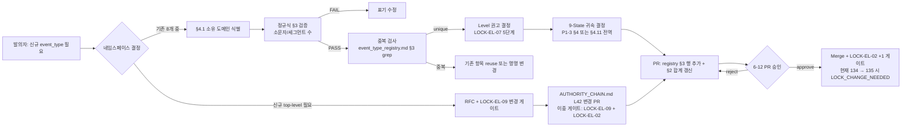
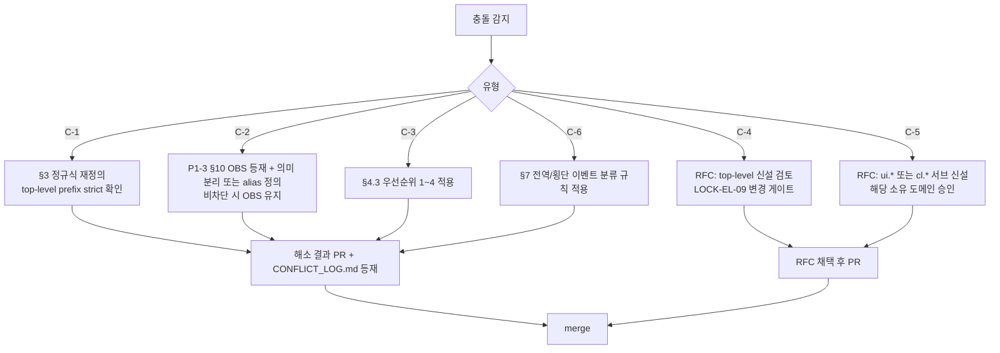

# 이벤트 네임스페이스 규칙 (namespace_rules.md)

> **버전**: v1.0.0 (2026-04-14)
> **세션**: 6-12 / P1-4
> **정본 선언**: 본 파일은 SOT2 신규 정본(Single Source of Truth)이며, **LOCK-EL-09 가 확정한 8개 top-level 이벤트 네임스페이스(`oc.* / cl.rt.* / agent.* / sdar.* / storage.* / mem.* / wf.* / ui.*`)** 의 소유 도메인, 접두어 패턴(정규식), 서브 네임스페이스 분류, 신규 등록 절차, 충돌 해소 절차, 충돌 시 처리 정책에 대한 최종 권위를 가진다. 개별 `event_type` 의 등록 값 및 항목 수(LOCK-EL-02 = 134) 는 `event_type_registry.md` (P1-2) 가 정본이며, 본 파일은 그 분류 체계의 **규칙층(rule layer)** 이다.

---

## §0. 교차 참조 블록

| 참조 대상 | 경로 | 역할 |
|----------|------|------|
| event_schema.md (P1-1) | `./event_schema.md` §2.2.2 | `event_type` 필드 정규식·세그먼트 규칙(`{domain}.{module}.{action}[.{detail}]`) — 본 파일이 정규식 정본을 명문화 |
| event_type_registry.md (P1-2) | `./event_type_registry.md` §2/§3/§5 | LOCK-EL-02 134항목 등록값·네임스페이스별 분류표·확장 규칙 — 본 파일은 `namespace` 기준 메타규칙 |
| pipeline_state_map.md (P1-3) | `./pipeline_state_map.md` §4.11/§7 | 9-State 직교/전역 이벤트(`ui.cli.*` 10건, `wf.stage.*`/`wf.report.*` 3건) 분류 근거 — 본 §6 에서 교차 확인 |
| AUTHORITY_CHAIN.md | `../AUTHORITY_CHAIN.md` L42 | LOCK-EL-09 정의 원문 (8개 top-level) |
| Part2 §6.11 | `D:\VAMOS\docs\guides\VAMOS_구현가이드_PART2_구현단계.md` L5788-5975 | `cl.rt.*` 11항목 + 네임스페이스 병합 선언 원본 |
| D2.1-D2 §5.1 | `D:\VAMOS\docs\sot\D2.1-D2_D2_SCHEMA_ORANGE_CORE.md` §5.1 | 123항목 원본 |

> 후행 산출물(P1-5~P1-9, P2-*) 이 본 파일의 §3 정규식 / §4 소유권 / §5 등록 절차를 위반하는 경우 본 파일이 우선한다(R-T6-1 근거, LOCK-EL-09).

---

## §1. 개요 (Purpose & Scope)

### 1.1 Purpose
- LOCK-EL-09 가 선언한 **8개 top-level 이벤트 네임스페이스** 의 소유권(누가 정의/유지하는가), 접두어 정규식(어떻게 표기되는가), 신규 이벤트 발생 시 어느 네임스페이스에 귀속되는지 판단 기준, 동일 접두어 충돌 시 해소 절차를 단일 정본으로 고정한다.

### 1.2 Scope
- 포함:
  - 8개 top-level 네임스페이스 정의 표 (소유 도메인 / 접두어 정규식 / 예시 / 항목 수)
  - 서브 네임스페이스 분류 (특히 `ui.*` 의 10개 서브)
  - 네임스페이스 할당 규칙 (신규 이벤트 → 어느 네임스페이스인가)
  - 충돌 해소 절차 (동일 접두어, 도메인 간 협의, RFC)
  - 134항목 네임스페이스별 집계 통계 (P1-2 §2 와 정합)
  - 전역/횡단 이벤트(파이프라인 상태 직교) 분류 규칙 — `ui.cli.*` 10, `wf.stage.*`/`wf.report.*` 3
- 제외 (위임):
  - `event_type` 개별 등록값 134건 전수 목록 → `event_type_registry.md` (P1-2)
  - 9-State 별 on_enter/on_exit 매핑 → `pipeline_state_map.md` (P1-3)
  - 로깅 레벨 정의 → `log_level_spec.md` (P1-5)
  - FailureCode/Fallback 매핑 → P1-6/P1-7/P1-8
  - W3C trace_context 전파 → 03/ (P2-1)

---

## §2. 8개 top-level 네임스페이스 — 소유 도메인 / 접두어 / 예시

> LOCK-EL-09 정본: `oc.* / cl.rt.* / agent.* / sdar.* / storage.* / mem.* / wf.* / ui.*` (top-level 8개)

| # | top-level 네임스페이스 | 접두어 정규식 | 소유 도메인 (정의·유지) | 사용 도메인(생산) | 예시 event_type | 항목 수 (P1-2 §2) |
|---|----------------------|--------------|----------------------|------------------|----------------|------------------|
| 1 | `oc.*` | `^oc(\.[a-z][a-z0-9_]*){2,4}$` | 1-1 / 1-2 ORANGE CORE | I-1 ~ I-20 (oc.i1.*~oc.i5.*, oc.loop.*, oc.deny.*, oc.done, oc.p2.*) | `oc.i5.gates.evaluated` | 35 |
| 2 | `wf.*` | `^wf(\.[a-z][a-z0-9_]*){2,4}$` | 6-3 Agent-Teams (DESIGN 05 §8.1) | 워크플로우 오케스트레이터 | `wf.stage.enter`, `wf.report.created` | 4 |
| 3 | `ui.*` | `^ui\.[a-z][a-z0-9_]*(\.[a-z][a-z0-9_]*){1,3}$` | 6-1 UI/UX | UI Builder/FrontMini/Core/Gate/Policy/Node/Main/Tool/Memory/CLI | `ui.builder.run.started`, `ui.cli.session.started` | 71 (서브 10개 합산) |
| 4 | `mem.*` | `^mem(\.[a-z][a-z0-9_]*){2,3}$` | 6-4 Memory-RAG-Storage | 메모리 계층 (LongTerm/ShortTerm) | `mem.commit.requested` | 2 |
| 5 | `storage.*` | `^storage(\.[a-z][a-z0-9_]*){2,3}$` | 6-4 Memory-RAG-Storage | 영속 저장소 계층 | `storage.write.completed` | 5 |
| 6 | `agent.*` | `^agent(\.[a-z][a-z0-9_]*){2,3}$` | 6-3 Agent-Teams | A2A/PARL Agent | `agent.handoff.requested` | 3 |
| 7 | `sdar.*` | `^sdar(\.[a-z][a-z0-9_]*){2,3}$` | 6-5 SDAR-System | SDAR Repair/Diff | `sdar.repair.started` | 3 |
| 8 | `cl.rt.*` | `^cl\.rt(\.[a-z][a-z0-9_]*){1,3}$` | 6-7 RT-BNP (정의) / 6-8 Cloud-Library (호스팅) | RT-BNP Fast Gate / Retraction / Breaking | `cl.rt.breaking.detected` | 11 |
| — | **합계** | — | — | — | — | **134** (= LOCK-EL-02) |

> **`cl` 의 특수 규칙**: top-level 은 `cl.rt` (2-segment prefix) 이다. `cl.*` 의 다른 하위(`cl.lib.*` 등) 신설은 별도 RFC 필요(Part2 §6.10.1 규칙, P1-2 §5.1 위임).

### 2.1 항목 수 검증

```
oc(35) + wf(4) + ui.*(71) + mem(2) + storage(5) + agent(3) + sdar(3) + cl.rt(11) = 134  ✓ LOCK-EL-02
```

`ui.*` = builder(14) + frontmini(7) + core(7) + gate(8) + policy(1) + node(2) + main(11) + tool(6) + memory(5) + cli(10) = 71 ✓

---

## §3. 접두어 정규식 — 통합 표기

### 3.1 전체 통합 정규식 (event_schema.md §2.2.2 정합)

```
^(oc|wf|mem|storage|agent|sdar)(\.[a-z][a-z0-9_]*){2,4}$
| ^ui\.(builder|frontmini|core|gate|policy|node|main|tool|memory|cli)(\.[a-z][a-z0-9_]*){1,3}$
| ^cl\.rt(\.[a-z][a-z0-9_]*){1,3}$
```

> event_schema.md §2.2.2 의 "최소 3 segment, 최대 5 segment" 와 동치. JSON Schema 의 일반 정규식 `^[a-z][a-z0-9_]*(\.[a-z][a-z0-9_]*){2,4}$` 은 형식 검증, 본 §3.1 은 **소유권 정합 검증** 으로 strict 단계에서 적용한다.

### 3.2 세그먼트 의미 규약

| 세그먼트 | 의미 | 예시 |
|---------|------|------|
| 1 (top-level) | 소유 네임스페이스 | `oc`, `ui`, `cl` |
| 2 (sub-namespace 또는 module) | `ui.*` 는 sub-namespace 필수, `cl` 은 `rt` 고정, 그 외는 module | `ui.builder`, `cl.rt`, `oc.i5` |
| 3 (action / object) | 모듈 내 동작 또는 객체 | `oc.i5.gates`, `ui.cli.session` |
| 4 (state / detail, optional) | 동작 결과/상태 | `oc.i5.gates.evaluated` |
| 5 (sub-detail, optional) | 추가 세부 | `oc.i3.commit.approval_required` |

### 3.3 표기 제약 (소문자/언더스코어/숫자 허용, 하이픈/대문자 금지)

| 항목 | 허용 | 불허 |
|------|------|------|
| 알파벳 | 소문자 a-z | 대문자 A-Z |
| 숫자 | 0-9 (단, segment 시작 금지) | segment-leading 숫자 |
| 구분자 | `.` (segment 사이), `_` (segment 내부) | `-` (하이픈), 공백, `:` |
| segment 길이 | ≥1 char | 빈 segment |
| 총 segment 수 | 3~5 | 2 이하, 6 이상 |

위반 시 P1-1 `event_schema.md` §5 의 `EL_EVT_BAD_TYPE_FORMAT` drop + quarantine.

---

## §4. 소유권 규칙 (Ownership)

### 4.1 정의 권한

| 권한 | 내용 | 권한 보유자 |
|------|------|------------|
| **정의(Definition)** | 새로운 event_type 신설/명명 | LOCK-EL-09 소유 도메인 (§2 표) |
| **유지(Maintenance)** | 설명/Level 권고 갱신 | LOCK-EL-09 소유 도메인 |
| **등재(Registration)** | `event_type_registry.md` 에 행 추가 | 6-12 Event-Logging (본 도메인) — PR 승인자 |
| **소비(Consumption)** | 발행/수신 | 모든 도메인 (read-only on registry) |
| **폐기(Deprecation)** | 항목 제거 | 6-12 + 소유 도메인 양자 합의 + LOCK-EL-02 변경 게이트 |

### 4.2 cross-domain 사용 규칙

- 다른 도메인이 `oc.*` 이벤트를 **발행** 할 수 있다(예: 6-3 Agent-Teams 가 `oc.done` 발행). 단, **새 event_type 추가** 는 해당 네임스페이스 소유 도메인 동의 필요.
- `ui.*` 서브 네임스페이스(builder/frontmini/...)의 신설은 6-1 UI/UX 권한이며, 그 외 도메인이 `ui.X.*` 를 신설 시 RFC + 6-1 승인 필수.
- `cl.rt.*` 는 6-7(정의) + 6-8(호스팅) 양 도메인 모두 동의 필요.

### 4.3 소유권 분쟁 해소

다음 우선순위로 결정한다(번호가 작을수록 우선):

1. **종합계획서 §3 LOCK 표 명시**: AUTHORITY_CHAIN.md 의 LOCK-EL-09 행 — `Part2 §6.11` 출처 명시 항목이 우선.
2. **R-T6-1 (SOT2 정본 우선)**: `event_type_registry.md` (P1-2) §2 의 "LOCK-EL-09 소유 도메인" 열.
3. **원본 출처 일자**: D2.1-D2 §5.1 ↔ Part2 §6.11 충돌 시 더 최신(Part2) 이 우선.
4. **CONFLICT_LOG.md 등재**: 위 1~3 으로 해결 불가 시 `[CONFLICT_CANDIDATE]` 마커로 보고 → step 7 등재 → 사람 결정.

---

## §5. 신규 등록 절차 (Registration Flow)

> P1-2 `event_type_registry.md` §5.2 와 정합. 본 절차는 그것의 **운영 흐름도** 이다.

### 5.1 단계별 흐름



### 5.2 단계별 검증 체크

| 단계 | 검증 항목 | 실패 시 처리 |
|------|----------|------------|
| §5.1 D | 정규식 §3 매칭 | 표기 수정 후 재시도 |
| §5.1 E | event_type_registry.md §3 의 134항목 + cumulative 신규 등록 grep, 동일 문자열 0건 | 재명명 (suffix 추가 또는 module 분리) |
| §5.1 F | LOCK-EL-07 5단계 중 1개 권고 부여 | 결정 보류 시 INFO 기본값 |
| §5.1 G | P1-3 §4 의 S0~S8 중 1개 또는 §4.11 전역 분류 | 결정 보류 시 §4.11 전역 fallback |
| §5.1 H | registry §2 합계 (현재 134) +1, §3 해당 sub-section 행 추가 | PR diff 검증 실패 시 reject |
| §5.1 J | LOCK-EL-02=134 변경 → `[LOCK_CHANGE_NEEDED]` 마커 자동 첨부 | 사람 결정 단계 |

### 5.3 RFC 임계값

신규 등록이 다음 중 하나라도 해당하면 단순 PR 이 아닌 **RFC** 절차를 거친다:

- top-level 네임스페이스 신설 (LOCK-EL-09 변경)
- `ui.*` 또는 `cl.*` 의 새 서브 네임스페이스 (예: `ui.dashboard.*`, `cl.lib.*`)
- 폐기(deprecation) — 기존 발행자가 있는 event_type 제거
- 기존 event_type 의 의미/페이로드 호환 깨짐 변경

---

## §6. 충돌 해소 절차 (Conflict Resolution)

### 6.1 충돌 유형 분류

| 유형 | 설명 | 예시 |
|------|------|------|
| C-1 (정규식 충돌) | 신규 event_type 이 다른 네임스페이스 정규식과 동시에 매칭 | `cl.something.*` 가 `cl.rt.*` 와 형식 유사 |
| C-2 (의미 중복) | 같은 의미를 두 event_type 이 표현 | `oc.i3.commit.approval_required` (S2) vs `oc.i5.approval.required` (S3) — P1-3 §10.G |
| C-3 (소유권 분쟁) | 두 도메인이 같은 event_type 정의 주장 | 가상: 6-3 Agent vs 6-1 UI 가 `agent.ui.*` 주장 |
| C-4 (top-level 미정) | 새 이벤트가 어느 top-level 에도 자연스럽게 들어가지 않음 | 새 도메인 생성 시 |
| C-5 (서브 네임스페이스 누락) | `ui.*` 의 11번째 서브 필요 | `ui.dashboard.*` 신설 요구 |
| C-6 (전역/횡단 vs 상태귀속) | 파이프라인 상태에 귀속할지 직교 처리할지 모호 | `wf.stage.enter` 전역 vs S* 매핑 |

### 6.2 해소 흐름



### 6.3 해소 우선 행위 (R-01-8 에스컬레이션 정합)

| 시나리오 | 즉시 행위 | 후속 |
|---------|----------|------|
| 미등록 event_type 발행 시도 | quarantine (`dlq/unknown_type`), event_schema.md §5 `EL_EVT_UNKNOWN_TYPE` | 발행자에게 §5.1 등록 절차 안내 |
| 정규식 위반 | drop, `EL_EVT_BAD_TYPE_FORMAT` | §3.3 표기 위반 사유 발행자 알림 |
| top-level 네임스페이스 위반 (예: `xx.mod.act`) | drop + penalty `-0.30` + I-20 에스컬레이션(EscalationPayload, §8) | LOCK-EL-09 위반은 자동 합의 불가 → CONFLICT_LOG 등재 |
| 서브 네임스페이스 위반 (예: `ui.unknown.*`) | quarantine + WARN | §5.3 RFC 임계값 검토 |

---

## §7. 전역/횡단 이벤트 분류 규칙 (P1-3 §4.11 cross-check)

> P1-3 `pipeline_state_map.md` 가 전역(파이프라인 상태 직교) 이벤트 13건을 분류함:
> - `ui.cli.*` 10건 (CLI 세션 생명주기)
> - `wf.stage.enter`, `wf.stage.exit`, `wf.report.created` 3건 (워크플로우 계층)
>
> 본 §7 은 이 분류의 **네임스페이스 규칙 측면 근거** 를 제공한다.

### 7.1 분류 기준

| 기준 | 전역(횡단) | 상태귀속 |
|------|----------|---------|
| 기준 1 | 단일 9-State 사이클(S0~S6)을 횡단(여러 사이클 포함 가능) | 단일 사이클 내 발행 |
| 기준 2 | 발행자가 파이프라인 외부 계층(CLI, 워크플로우 오케스트레이터) | 발행자가 ORANGE CORE 내부(I-1~I-20) |
| 기준 3 | 페이로드에 `state` 필드 부재 또는 상태 비종속 | `state` 필드 명시 |

### 7.2 전역 이벤트 13건 — 본 파일 확정

| 네임스페이스 | 항목 수 | 분류 근거 |
|-------------|--------|----------|
| `ui.cli.*` | 10 | 기준 1+2 — CLI 세션이 여러 S0~S6 사이클 포함 (P1-3 §4.11, P1-2 §3.12) |
| `wf.stage.enter` | 1 | 기준 2 — 워크플로우 계층 발행, 상태 비귀속 (P1-3 §4.11, P1-2 §3.2) |
| `wf.stage.exit` | 1 | 기준 2 |
| `wf.report.created` | 1 | 기준 2 — 리포트 생성 시점은 사이클과 독립 |
| **합계** | **13** | — |

> **제외 명시**: `wf.approval.requested` (S3a Approve 귀속, P1-2 §3.2) 는 전역이 아닌 **상태귀속(S3a)** — 워크플로우 계층이지만 승인 요청은 명시적으로 S3a 를 트리거하므로 기준 2 적용 안 함.

### 7.3 P1-3 §4.11 정합 확인

| P1-3 §4.11 분류 | 본 §7.2 분류 | 정합 |
|---------------|-------------|------|
| `ui.cli.*` 10건 전역 | `ui.cli.*` 10건 전역 | ✓ |
| `wf.stage.enter`/`wf.stage.exit`/`wf.report.created` 3건 전역 | 동일 3건 전역 | ✓ |
| `wf.approval.requested` S3a 귀속 | (본 §7.2 제외 명시) | ✓ |
| **합계 13건 전역** | **13건 전역** | ✓ |

---

## §8. 에스컬레이션 페이로드 구조 (I-20)

> P1-1 `event_schema.md` §6 의 `EscalationPayload` 와 호환. 본 파일은 네임스페이스 규칙 위반 맥락의 **확장 필드** 를 추가 정의한다.

```python
from typing import Any, Dict, List, Optional
from pydantic import BaseModel

class NamespaceEscalationPayload(BaseModel):
    # P1-1 §6 EscalationPayload 와 동일 (필수)
    source_engine: str                  # 예: "6-12/namespace_validator"
    error_code: str                     # 예: "EL_NS_TOPLEVEL_FORBIDDEN", "EL_NS_SUBSPACE_UNREGISTERED"
    original_request: Dict[str, Any]    # 원본 이벤트 envelope (마스킹 전)
    partial_result: Optional[Dict[str, Any]]  # 검증 통과 필드
    retry_count: int                    # 재시도 횟수
    timestamp: str                      # ISO 8601 UTC ms
    # 네임스페이스 맥락 확장
    observed_top_level: str             # 관측된 top-level (예: "xx")
    observed_segments: int              # 관측 세그먼트 수
    closest_registered: List[str]       # Levenshtein top-K 후보 (P1-2 §7 호환)
    namespace_owner_hint: Optional[str] # §4.1 추정 소유 도메인
    penalty_accumulated: float          # confidence penalty 누적값
    trace_id: str                       # W3C trace_id (P2-1)
```

### 8.1 트리거 조건

| 조건 | error_code | I-20 호출 |
|------|-----------|----------|
| top-level 네임스페이스가 §2 8개에 없음 | `EL_NS_TOPLEVEL_FORBIDDEN` | 즉시 |
| `ui.*` 서브가 §2 의 10개 외 | `EL_NS_SUBSPACE_UNREGISTERED` | 즉시 |
| `cl.*` 가 `cl.rt` 외 | `EL_NS_CL_SUBSPACE_FORBIDDEN` | 즉시 |
| penalty 누적 > 0.30 | `EL_NS_PENALTY_OVER` | 즉시 |
| 정규식 위반 (§3.1) | `EL_EVT_BAD_TYPE_FORMAT` | drop only(에스컬 X) |

---

## §9. 로깅 포맷 (R-01-7, P1-1 §7 정합)

위반 감지 시 structured JSON 중첩 포맷:

```json
{
  "timestamp": "2026-04-14T17:00:10.123Z",
  "event_type": "el.namespace.violation",
  "trace_id": "0123456789abcdef0123456789abcdef",
  "source": "event-logging/namespace_validator",
  "version": "1.0.0",
  "level": "ERROR",
  "error": {
    "code": "EL_NS_TOPLEVEL_FORBIDDEN",
    "message": "top-level 'xx' not in LOCK-EL-09 set",
    "observed_event_type": "xx.mod.act"
  },
  "context": {
    "namespace_top_observed": "xx",
    "namespace_top_allowed": ["oc","cl","agent","sdar","storage","mem","wf","ui"],
    "segments_count": 3,
    "publisher_source": "agent-teams/parl_runner",
    "registry_lock": "LOCK-EL-02=134",
    "namespace_lock": "LOCK-EL-09=8"
  },
  "recovery": {
    "action": "drop",
    "penalty_delta": -0.30,
    "escalation": "I-20",
    "registration_procedure": "namespace_rules.md §5.1"
  }
}
```

`event_type` `el.namespace.violation` 자체는 **메타 이벤트(operational)** 로 분류되며 LOCK-EL-02 134항목과는 별도(operational logs, §10 참조).

---

## §10. 134항목 네임스페이스별 집계 통계 (P1-2 §2 정합 검증)

> P1-2 §2 의 "네임스페이스 분류 집계" 표와 본 §2 의 합계가 일치함을 본 §10 에서 재검증한다. 항목 1 항목이라도 불일치 시 본 파일이 LOCK-EL-09 측 정본이고, P1-2 가 LOCK-EL-02 측 정본이므로 양쪽 PR 동시 진행 필요.

### 10.1 top-level 8개 기준 집계

| top-level | 항목 수 | P1-2 §2 일치 |
|----------|--------|-------------|
| `oc` | 35 | ✓ (P1-2 §2 #1) |
| `wf` | 4 | ✓ (P1-2 §2 #2) |
| `ui` | 71 | ✓ (P1-2 §2 #3~#12 합산: 14+7+7+8+1+2+11+6+5+10) |
| `mem` | 2 | ✓ (P1-2 §2 #13) |
| `storage` | 5 | ✓ (P1-2 §2 #14) |
| `agent` | 3 | ✓ (P1-2 §2 #15) |
| `sdar` | 3 | ✓ (P1-2 §2 #16) |
| `cl.rt` | 11 | ✓ (P1-2 §2 #17) |
| **합계** | **134** | ✓ LOCK-EL-02 |

### 10.2 `ui.*` 서브 10개 세부 집계

| 서브 네임스페이스 | 항목 수 | P1-2 §3 sub-section |
|-----------------|--------|-------------------|
| `ui.builder.*` | 14 | §3.3 |
| `ui.frontmini.*` | 7 | §3.4 |
| `ui.core.*` | 7 | §3.5 |
| `ui.gate.*` | 8 | §3.6 |
| `ui.policy.*` | 1 | §3.7 |
| `ui.node.*` | 2 | §3.8 |
| `ui.main.*` | 11 | §3.9 |
| `ui.tool.*` | 6 | §3.10 |
| `ui.memory.*` | 5 | §3.11 |
| `ui.cli.*` | 10 | §3.12 |
| **합계** | **71** | — |

### 10.3 9-State 귀속 vs 전역(횡단) 집계

| 분류 | 항목 수 |
|------|--------|
| 상태귀속 (S0~S8 중 하나에 매핑) | 121 |
| 전역(파이프라인 상태 직교, §7.2) | 13 (`ui.cli.*` 10 + `wf.stage.enter` 1 + `wf.stage.exit` 1 + `wf.report.created` 1) |
| **합계** | **134** ✓ |

> P1-3 §4.11 / §7 와 정합. `wf.approval.requested` 는 상태귀속(S3a) 으로 카운트.

---

## §11. 시간복잡도 및 ABC 패턴 매핑

### 11.1 알고리즘 시간복잡도

| 알고리즘 | 시간복잡도 | 비고 |
|---------|-----------|------|
| top-level 분류 (§3.1 정규식) | O(L) | L = event_type 문자열 길이, 보통 ≤ 50 |
| 등록 검색 (registry §3 grep) | O(1) | 해시 맵 (P1-2 §10) |
| 충돌 해소 (§6.2) | O(K) | K = 충돌 후보 수, 보통 ≤ 5 |
| 최근접 매칭 (Levenshtein) | O(N·L) | bucket(top-level) 선필터로 O(N/8 · L) |

- **LOCK 참조**: LOCK-EL-09 (네임스페이스 top-level 8), LOCK-EL-02 (134항목, P1-2), LOCK-EL-07 (로깅 레벨 5단계, P1-5)
- **ABC 패턴 매핑**: 본 파일은 **규칙 정의** 계층으로 ABC 인터페이스를 직접 구현하지 않는다. 검증 실행 ABC 는 P1-1 `event_schema.md` §10 의 ABC 패턴(A/B/C) 및 §12 `EventSchemaValidator` (`BaseVerifier` 구현) 가 담당하며, 본 §3 정규식을 B 단계(Body/Business validate)에서 호출한다.

### 11.2 예외 처리 정책

| error_code | recoverable | 처리 |
|-----------|-------------|------|
| `EL_NS_TOPLEVEL_FORBIDDEN` | No | drop + I-20 에스컬레이션 + penalty -0.30 |
| `EL_NS_SUBSPACE_UNREGISTERED` | Yes | quarantine → §5.1 등록 절차 |
| `EL_NS_CL_SUBSPACE_FORBIDDEN` | No | drop + I-20 |
| `EL_EVT_BAD_TYPE_FORMAT` | No | drop (P1-1 §5 위임) |
| `EL_NS_PENALTY_OVER` | No | I-20 (penalty 누적 컷) |

---

## §12. ABC 시그니처 정본 준수

본 파일은 ABC 인터페이스를 직접 정의하지 않는다. 다만 본 §3.1 정규식을 호출하는 `EventSchemaValidator` 의 ABC 시그니처는 P1-1 `event_schema.md` §12 정본을 따른다:

```python
# 정본 경로: 6-12_Event-Logging/01_event-system/event_schema.md §12
# (1-1_Verifier-Reasoning-Engines/00_common/base_verifier_abc.md 의 BaseVerifier 패턴)
def verify(self, payload: dict, *, timeout_ms: int) -> VerifyResult:
    """payload.event_type 을 §3 정규식으로 검증, §6 충돌 해소 적용"""
    ...
```

임의 시그니처 변경 금지(R-T6-1 (h)). `async`/파라미터명/반환 타입 변경 금지.

---

## §13. 상태 번호 정본 (S0~S8)

본 파일은 S0~S8 상태를 재정의하지 않는다. 정본은 P1-3 `pipeline_state_map.md` §2 (10 상태: S0/S1/S2/S3/S3a/S4/S5/S6/S7/S8). 본 §7 의 전역/횡단 분류는 P1-3 의 9-State 직교 분류와 정합한다(R-T6-1 (i)).

---

## §14. 세션 간 인터페이스 cross-check

| 세션 | 산출물 | 본 파일과의 인터페이스 | 정합 상태 |
|------|--------|--------------------|----------|
| P1-1 | `event_schema.md` §2.2.2, §5, §6 | `event_type` 정규식, `EL_EVT_BAD_TYPE_FORMAT`/`EL_EVT_UNKNOWN_TYPE`, `EscalationPayload` | ✓ §3.1 정규식이 §2.2.2 와 동치 (3~5 segment), §6 ↔ §8 EscalationPayload 호환, §8.1 error_code 가 §5 와 정합 |
| P1-2 | `event_type_registry.md` §2/§3/§5 | 134항목 분류·소유 도메인·등록 절차 | ✓ §10 집계 일치, §5.1 흐름이 P1-2 §5.2 와 정합 |
| P1-3 | `pipeline_state_map.md` §4.11/§7/§10 | 전역(횡단) 13건 분류, §10.B/E 관측 | ✓ §7.2 13건 일치, §10.G CONFLICT_CANDIDATE(C-2 의미 중복) 본 §6.1 C-2 로 분류 |
| P1-5 (예정) | `log_level_spec.md` | LOCK-EL-07 5단계 — 본 §5.1 F 단계 참조 | 예정 — 본 §5.1 F 가 선행 정합 |
| P1-7 (예정) | `fallback_registry.md` | NEVER_AUTO 와 본 §6.3 자동 처리 정합 | 예정 |

> 본 cross-check 결과 `[INTERFACE_MISMATCH]` 마커 없음.

---

## §15. Phase 2 통합 테스트 시나리오 (≥ 10건)

| # | 시나리오 | 주입 | 기대 결과 |
|---|---------|------|----------|
| T-01 | 정상 등록 event_type | `oc.i5.gates.evaluated` 발행 | PASS, top-level=`oc`, Level=INFO |
| T-02 | 8개 외 top-level | `xx.mod.act.detail` 발행 | `EL_NS_TOPLEVEL_FORBIDDEN` drop + penalty -0.30 + I-20(NamespaceEscalationPayload) |
| T-03 | `ui.*` 미등록 서브 | `ui.dashboard.run.started` 발행 | `EL_NS_SUBSPACE_UNREGISTERED` quarantine + §5.1 등록 절차 안내 |
| T-04 | `cl.*` 비-rt 서브 | `cl.lib.fetch.completed` 발행 | `EL_NS_CL_SUBSPACE_FORBIDDEN` drop + I-20 |
| T-05 | 정규식 위반 (대문자) | `OC.I5.GATES.EVALUATED` 발행 | `EL_EVT_BAD_TYPE_FORMAT` drop (P1-1 §5 위임) |
| T-06 | 정규식 위반 (하이픈) | `oc.i5.gates-evaluated` 발행 | `EL_EVT_BAD_TYPE_FORMAT` drop |
| T-07 | 세그먼트 부족 (2 segment) | `oc.something` 발행 | `EL_EVT_BAD_TYPE_FORMAT` drop |
| T-08 | 세그먼트 초과 (6 segment) | `oc.i5.gates.evaluated.detail.extra` 발행 | `EL_EVT_BAD_TYPE_FORMAT` drop |
| T-09 | `ui.cli.*` 전역 분류 | `ui.cli.session.started` 발행 후 9-State 컨텍스트 매핑 시도 | 전역 이벤트로 분류, 어떤 S* 에도 강제 매핑 없음 (§7.2) |
| T-10 | `wf.stage.enter` 전역 분류 | `wf.stage.enter` 발행 | 전역 이벤트로 분류, S* 매핑 미발생 |
| T-11 | `wf.approval.requested` 상태귀속 | `wf.approval.requested` 발행 | S3a 트리거 (§7.2 제외 명시 정합) |
| T-12 | 134항목 집계 검증 | registry §3 전수 카운트 | top-level 8개 합계 134 == LOCK-EL-02 ✓ (§10.1) |
| T-13 | 충돌 해소 C-2 (의미 중복) | `oc.i3.commit.approval_required` + `oc.i5.approval.required` 동시 발행 | 둘 다 정당, §10.G OBS 등재(P1-3) — 차단 아님 |
| T-14 | 신규 등록 RFC 트리거 (top-level 신설) | `cl.lib.*` 신설 PR 시도 | RFC 임계값(§5.3) 도달, LOCK-EL-09 변경 게이트로 `[LOCK_CHANGE_NEEDED]` 마커 |
| T-15 | penalty 누적 컷 | T-02 + T-04 + T-03 동일 trace 반복 | penalty `-0.30 -0.30 -0.20 = -0.80` → `EL_NS_PENALTY_OVER` I-20 호출 |

---

## §16. SoT 검증 (원본 정합)

| 본 파일 항목 | 원본 위치 | 일치 확인 |
|-------------|---------|----------|
| §2 8 top-level | AUTHORITY_CHAIN.md L42 (LOCK-EL-09) | ✓ `oc.* / cl.rt.* / agent.* / sdar.* / storage.* / mem.* / wf.* / ui.*` 동일 |
| §2 17 sub 분류 (cl.rt 1 + ui 10 + 기타 6) | P1-2 `event_type_registry.md` §2 | ✓ 동일 분류, 본 파일은 top-level 8 으로 재집계 |
| §2 cl.rt 11항목 | Part2 §6.11 L5814-5844 (`#### RT-BNP 이벤트 cl.rt.* namespace, 11개`) | ✓ |
| §2 oc/wf/ui/mem/storage/agent/sdar 123항목 | D2.1-D2 §5.1 | ✓ |
| §3.1 정규식 | event_schema.md §2.2.2 (`{domain}.{module}.{action}[.{detail}]`, 3~5 segment) | ✓ |
| §3.1 JSON Schema 정규식 | event_schema.md §3.2 L201 (`^[a-z][a-z0-9_]*(\.[a-z][a-z0-9_]*){2,4}$`) | ✓ 동치 (본 §3.1 은 strict 단계 추가) |
| §7.2 전역 13건 | P1-3 §4.11 + §10.B/E | ✓ |
| §13 상태 번호 | P1-3 §2 (10 상태 S0/S1/S2/S3/S3a/S4/S5/S6/S7/S8) | ✓ (재정의 없음) |

---

## §17. 검증 체크리스트 (§7 P1-4 검증 항목)

- [x] 8개 네임스페이스(`oc.* / cl.rt.* / agent.* / sdar.* / storage.* / mem.* / wf.* / ui.*`) 전부 포함 (§2)
- [x] 각 네임스페이스별 소유 도메인·접두어 정규식·예시 기재 (§2 / §3.1)
- [x] 할당 규칙 (§4.1 정의 권한, §4.2 cross-domain, §5.1 등록 흐름) 및 충돌 해소 절차 (§6) 포함
- [x] LOCK-EL-09 참조 명시 (§0, §2, §10, §16)
- [x] P1-2 (event_type_registry.md) 항목별 네임스페이스 집계 통계 포함 (§10)
- [x] 교차 참조 블록 (§0)
- [x] 에스컬레이션 페이로드 구조 (§8)
- [x] 로깅 포맷 R-01-7 중첩 구조 (§9)
- [x] Phase 2 통합 테스트 시나리오 ≥ 10건 (§15: 15건)
- [x] 시간복잡도 + LOCK + ABC 매핑 (§11) + 예외 처리 정책 표 (§11.2)
- [x] ABC 시그니처 정본 준수 선언 (§12)
- [x] 상태 번호 정본 준수 선언 (§13)
- [x] 세션 간 인터페이스 cross-check (§14, INTERFACE_MISMATCH 없음)
- [x] SoT 검증 (§16)
- [x] P1-3 핸드오프 항목 (`ui.cli.*` 10 + `wf.stage.*`/`wf.report.*` 3) 교차 확인 (§7, §10.3)

---

## §18. 변경 이력

| 버전 | 일자 | 변경 사항 | 작성자 |
|------|------|----------|--------|
| v1.0.0 | 2026-04-14 | 초기 작성 (P1-4 step1). LOCK-EL-09 8 top-level + 17 sub 분류, 정규식 정본, 등록 절차, 충돌 해소, 134항목 집계, P1-3 핸드오프(전역 13건) 교차 확인. | 6-12 P1-4 |
| v1.0.1 | 2026-04-14 | 재검증 step2 pass1: ABC 시그니처 정본 교정 2건 — §11.2 직전 및 §12 에서 `event_schema.md §11` 오참조를 §10(ABC 패턴) / §12(`EventSchemaValidator` `BaseVerifier` `verify(self, payload: dict, *, timeout_ms: int) -> VerifyResult`) 로 수정. R-T6-1 (h) 정합 회복. | 6-12 P1-4 |
