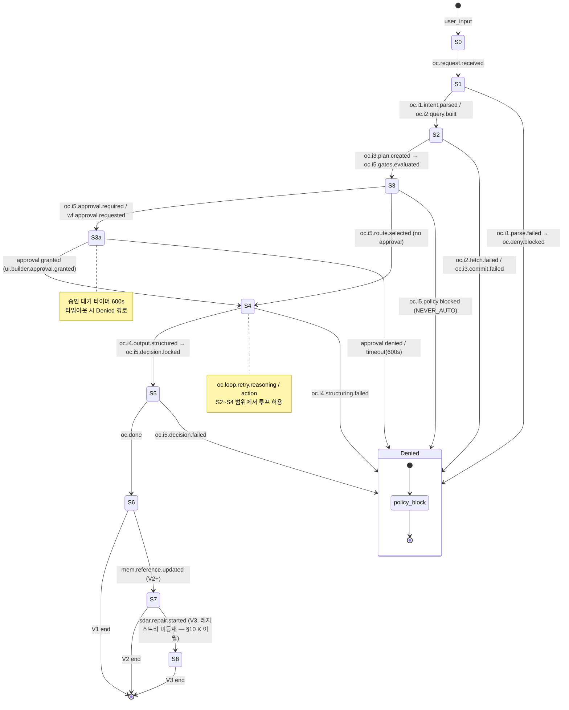
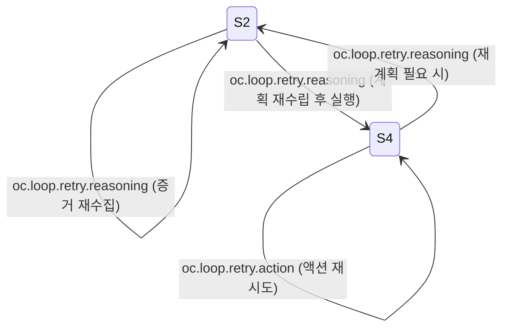
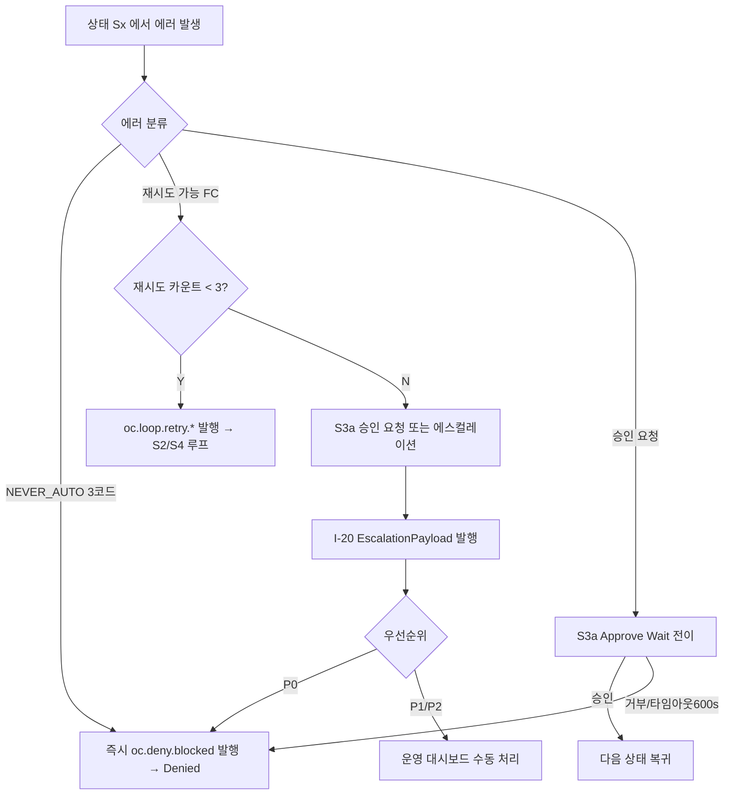

# pipeline_state_map.md — 9-State↔UI↔이벤트 매핑 정본

> **도메인**: 6-12_Event-Logging / 01_event-system
> **세션**: P1-3
> **작성일**: 2026-04-14
> **정본 선언**: 본 파일은 SOT2 신규 정본(Single Source of Truth)이며, LOCK-EL-10 이 확정한 **9-State(S0~S8)↔UI 상태↔이벤트 트리거** 매핑의 상세 전수 정본이다. 원본 정의는 Part2 §6.11 L5798-5809 UI 매핑 표를 따르며(R-T6-1), 본 파일은 P1-2 `event_type_registry.md` 의 134항목을 S0~S8 각 상태의 `on_enter` / `on_exit` / `on_error` 이벤트로 전수 매핑한다.
> **LOCK**: LOCK-EL-10 (9-State↔UI↔이벤트 매핑 — Part2 §6.11 정본)

---

## §0. 교차 참조 블록

| 참조 ID | 경로 | 관계 |
|---------|------|------|
| AUTHORITY_CHAIN | `D:\VAMOS\docs\sot 2\6-12_Event-Logging\AUTHORITY_CHAIN.md` §LOCK-EL-10 | LOCK 정의 원본 |
| _index (01) | `D:\VAMOS\docs\sot 2\6-12_Event-Logging\01_event-system\_index.md` §9-State 매핑 | 도메인 컨텍스트 |
| event_schema (P1-1) | `./event_schema.md` §2.2.2, §6, §7 | `event_type` 정규식 · EscalationPayload · 로깅 JSON 포맷 (선행 정본) |
| event_type_registry (P1-2) | `./event_type_registry.md` §3 (134항목) · §12 (상태 번호 미재정의 선언) | 이벤트 카탈로그 선행 정본 — 본 파일이 이의 `9-State` 열을 전수화 |
| namespace_rules (P1-4, 예정) | `./namespace_rules.md` | top-level 8개 네임스페이스 소유권 |
| logging_levels (P1-5, 예정) | `../02_logging-standard/logging_levels.md` | 레벨 권고값 (LOCK-EL-07) |
| Part2 §6.11 | `D:\VAMOS\docs\guides\VAMOS_구현가이드_PART2_구현단계.md` L5798-5809 | 9-State↔UI↔이벤트 매핑 원본(LOCK-EL-10 소스) |
| Part2 §6.10.1 | `D:\VAMOS\docs\guides\VAMOS_구현가이드_PART2_구현단계.md` §6.10.1 | RT-BNP 파이프라인 원본 (cl.rt.* 11항목 맥락) |
| D2.1-D2 §5.1 | `D:\VAMOS\docs\sot\D2.1-D2_D2_SCHEMA_ORANGE_CORE.md` §5.1 | 123항목 원본 |
| 6-1 UI/UX | `D:\VAMOS\docs\sot 2\6-1_UI-UX-System\` | UI 상태·컴포넌트 정의 소유(인접 도메인, 참조만) |

---

## §1. 개요 (Purpose & Scope)

### 1.1 Purpose
- VAMOS 9-State 파이프라인(S0 Intake → S1 Route → S2 Plan → S3 Gate → S3a Approve Wait → S4 Execute → S5 Verify → S6 Deliver → S7 Learn → S8 Evolve)의 각 상태에서 **발행/구독되는 이벤트 타입을 전수 매핑**한다.
- 각 상태의 `on_enter` / `on_exit` / `on_error` 이벤트를 P1-2 EventTypeRegistry 134항목과 정확히 교차(cross-reference)시켜, 파이프라인 실행 중 어느 상태에서 어느 이벤트가 합법적으로 발행되는지를 정본으로 고정한다.
- UI 상태(ChatPanel / ThinkingBlock / ApprovalDialog / AIBubble 등)와 이벤트의 연동 관계를 명시한다.

### 1.2 Scope
- **포함**:
  - S0~S8 (S3a 포함 10개 sub-state) 상태별 `on_enter` / `on_exit` / `on_error` / `on_approval_wait` 이벤트 표
  - 상태 전환 다이어그램(Mermaid `stateDiagram-v2`)
  - 각 상태↔UI 컴포넌트↔사용자 액션 매핑(Part2 §6.11 UI 표 전수 반영)
  - 루프/재시도 이벤트(`oc.loop.retry.*`)의 발행 허용 상태 범위
  - 에러 상태 전환 시의 공통 이벤트(`oc.deny.blocked`, `oc.i*.*.failed` 등) 귀속 규칙
- **제외**:
  - 상태 번호 재정의(Part2 §6.11 · D2.1-D2 정본 따름, §12 참조)
  - UI 컴포넌트 내부 구현 세부(6-1 UI/UX 도메인 소유)
  - FailureCode→Fallback 매핑 상세(P1-8 소유)
  - event_type 정규식·확장 규칙(P1-2/P1-4 소유)

---

## §2. 상태 번호 정본 선언 (LOCK-EL-10)

본 문서는 **상태 번호 S0~S8을 재정의하지 않는다**. Part2 §6.11 UI 매핑 표 및 D2.1-D2 파이프라인 정의를 정본으로 삼으며, 본 파일은 각 상태에 **이벤트를 귀속**할 뿐이다.

| # | 상태 코드 | 공식 명칭 | UI 표시 | 원본 근거 |
|---|----------|----------|---------|----------|
| 1 | **S0** | Intake | 💬 입력 수신 중 | Part2 §6.11 L5800 |
| 2 | **S1** | Route | ⚙️ 분석 중 | Part2 §6.11 L5801 |
| 3 | **S2** | Plan | 📋 계획 수립 중 | Part2 §6.11 L5802 |
| 4 | **S3** | Gate | 🔒 게이트 검증 중 | Part2 §6.11 L5803 |
| 5 | **S3a** | Approve Wait | ⏳ 승인 대기 (600s) | Part2 §6.11 L5804 — **S3 의 sub-state**, LOCK-EL-10 명시 10번째 상태 |
| 6 | **S4** | Execute | ▶️ 실행 중 | Part2 §6.11 L5805 |
| 7 | **S5** | Verify | ✅ 검증 중 | Part2 §6.11 L5806 |
| 8 | **S6** | Deliver | 📤 응답 전달 | Part2 §6.11 L5807 |
| 9 | **S7** | Learn (V2+) | 📚 학습 중 | Part2 §6.11 L5808 |
| 10 | **S8** | Evolve (V3) | 🧬 진화 중 | Part2 §6.11 L5809 |

> **주**: Part2 원본 표는 S3a 를 별도 행으로 명시하여 실질적으로 10개 상태를 사용한다. LOCK-EL-10 명칭은 "**9-State**" 이나 S3a 는 S3 의 승인 대기 분기로서 동일 파이프라인 인스턴스 내에서 비동기적으로 발생한다. 본 파일은 LOCK 명칭을 유지한 채 S3a 를 별도 sub-state 로 표기한다.

> **V2/V3 상태 가용성**: S7/S8 은 V2/V3 빌드에서만 활성화되며, V1 에서는 해당 상태로의 전이가 스킵된다(`oc.done` 직후 세션 종료). 이벤트 발행 여부는 빌드 플래그가 결정한다.

---

## §3. 공통 자료 구조 선정의

본 파일에서 참조하는 공통 자료 구조는 P1-2 `event_type_registry.md` §4 (EventTypeEntry) 와 P1-1 `event_schema.md` §3 (EventEnvelope) 를 재사용한다. 본 파일은 그 위에 **상태↔이벤트 매핑 메타**를 얹는 경량 모델만 정의한다.

```python
# pipeline_state_map.py — 본 파일 §4~§5 표의 데이터 모델
from __future__ import annotations
from typing import List, Literal, Optional
from pydantic import BaseModel, Field

StateCode = Literal["S0", "S1", "S2", "S3", "S3a", "S4", "S5", "S6", "S7", "S8"]
Hook      = Literal["on_enter", "on_exit", "on_error", "on_approval_wait", "on_loop"]

class StateEventBinding(BaseModel):
    """§4 표의 1행."""
    state: StateCode
    hook: Hook
    event_type: str = Field(..., description="EventTypeRegistry §3 의 event_type (134항목 중 하나)")
    mandatory: bool = Field(..., description="해당 상태 진입/이탈 시 반드시 발행되어야 하는 이벤트 여부")
    notes: Optional[str] = None

class StateUIMapping(BaseModel):
    """§6 UI 매핑 표의 1행. Part2 §6.11 전수 반영."""
    state: StateCode
    ui_display: str               # 예: "💬 입력 수신 중"
    ui_components: List[str]      # 예: ["ChatPanel", "ThinkingBlock"]
    user_actions: List[str]       # 예: ["승인 버튼", "거부 버튼"] (빈 리스트 가능)
    primary_event: str            # Part2 §6.11 "이벤트 트리거" 열의 대표 이벤트

class PipelineStateMap(BaseModel):
    version: str = "1.0.0"
    lock: Literal["LOCK-EL-10"] = "LOCK-EL-10"
    bindings: List[StateEventBinding]
    ui_mappings: List[StateUIMapping]
```

---

## §4. 상태별 이벤트 매핑 (on_enter / on_exit / on_error) — 전수

> **표기 규약**
> - `on_enter`: 상태 진입 직후 발행되는 이벤트(최소 1개 mandatory).
> - `on_exit`: 다음 상태로 전이 직전 발행(정상 경로). 재시도/중단 시 생략 가능.
> - `on_error`: 해당 상태에서 발생한 실패/거부/차단 이벤트. 전이는 S3 게이트 또는 `oc.deny.blocked` 를 경유한다.
> - `M`=mandatory, `O`=optional(조건부).
> - 이벤트는 모두 P1-2 `event_type_registry.md` §3 에서 등록된 것만 사용한다. 미등록 이벤트 발견 시 `[CONFLICT_CANDIDATE]` 로 보고한다.

### 4.1 S0 — Intake (입력 수신)

| Hook | event_type | M/O | 설명 |
|------|-----------|-----|------|
| on_enter | `oc.request.received` | M | 요청 수신 — 파이프라인 시작점 (Part2 §6.11 트리거) |
| on_exit  | `oc.i1.parse.started` | M | S1 로 진입(I-1 Intent 파싱 시작) — S1 on_enter 와 동일 이벤트가 경계 이벤트로 사용됨 |
| on_error | `ui.frontmini.pii.detected`, `ui.frontmini.malware.found` | O | FrontMini 사전 스캔 실패 시 즉시 `oc.deny.blocked` 경유 종료 |
| on_enter(UI) | `ui.frontmini.input.received`, `ui.frontmini.scan.started` | O | UI 계열 S0 연계 이벤트 |

### 4.2 S1 — Route (분석)

| Hook | event_type | M/O | 설명 |
|------|-----------|-----|------|
| on_enter | `oc.i1.parse.started` | M | Part2 §6.11 트리거 |
| during  | `oc.i1.intent.parsed` | M | 정상 해석 |
| during  | `oc.i1.intent.ambiguous` | O | 모호 시 WARN — 루프 또는 S3a 유도 |
| on_exit | `oc.i2.query.built` | M | I-2 쿼리 구성 완료 → S2 로 전이 경계 |
| on_error | `oc.i1.parse.failed` | O | I-1 파싱 실패 (`oc.deny.blocked` 가능) |

### 4.3 S2 — Plan (계획)

| Hook | event_type | M/O | 설명 |
|------|-----------|-----|------|
| on_enter | `oc.i3.plan.created` | M | Part2 §6.11 트리거 — 계획 생성 |
| during  | `oc.i2.fetch.started`, `oc.i2.evidence.ready` | M | 증거 수집 파이프라인 |
| during  | `oc.i2.evidence.insufficient`, `oc.i2.fetch.blocked` | O | 증거 부족/정책 차단 (WARN) |
| during  | `oc.i3.commit.requested`, `oc.i3.commit.completed`, `oc.i3.commit.denied` | O | 메모리 커밋 루트(`mem.*` 참조) |
| on_exit | `oc.i5.gates.evaluated` | M | S3 로 전이(게이트 평가 시작) |
| on_error | `oc.i2.fetch.failed`, `oc.i3.commit.failed`, `oc.i3.commit.approval_required` | O | 실패/승인 필요 |

### 4.4 S3 — Gate (게이트 검증)

| Hook | event_type | M/O | 설명 |
|------|-----------|-----|------|
| on_enter | `oc.i5.gates.evaluated` | M | Part2 §6.11 트리거 |
| during  | `oc.i5.route.selected`, `oc.i5.cost.downshifted`, `oc.p2.activated`, `oc.p2.deactivated` | O | 라우팅/비용/프리미엄 분기 |
| during  | `ui.gate.policy.checked`, `ui.gate.policy.violated`, `ui.gate.cost.calculated`, `ui.gate.cost.warning`, `ui.gate.cost.warning_80`, `ui.gate.cost.ceiling_100`, `ui.gate.approval.required`, `ui.gate.approval.waiting` | O | UI 게이트 표시 계열 (`ui.gate.*` 8건) |
| on_exit → S3a | `oc.i5.approval.required`, `oc.i3.commit.approval_required`, `wf.approval.requested` | M(조건) | 승인 분기 발생 시 S3a 경유 |
| on_exit → S4 | (S4 on_enter 참조) | M(정상) | 승인 불요 시 S4 직접 전이 |
| on_error | `oc.i5.policy.blocked` (NEVER_AUTO), `oc.deny.blocked` (NEVER_AUTO), `oc.i5.decision.failed`, `ui.policy.blocked` | O | 정책 차단 → 파이프라인 종료(`oc.i*.err` 경로) |

### 4.5 S3a — Approve Wait (승인 대기, 600s)

| Hook | event_type | M/O | 설명 |
|------|-----------|-----|------|
| on_enter | `wf.approval.requested` | M | Part2 §6.11 트리거 — ApprovalDialog 표시 |
| during  | `ui.gate.approval.required`, `ui.gate.approval.waiting` | O | UI 표시 |
| during  | `ui.builder.approval.granted`, `ui.builder.approval.denied`, `ui.builder.approval.requested` | O | Builder 뷰에서의 승인 |
| during  | `ui.core.p2.modal.shown`, `ui.core.p2.modal.confirmed`, `ui.core.p2.modal.cancelled`, `ui.core.p2.locked` | O | P2 프리미엄 모달 |
| during  | `ui.memory.commit.success`, `ui.memory.commit.denied` | O | 메모리 커밋 승인 결과 |
| on_exit → S4 | (S4 on_enter 참조) | M(승인) | 승인됨 → S4 |
| on_error | `oc.i5.policy.blocked`, `oc.deny.blocked` | O | 거부됨 → 파이프라인 종료 |

### 4.6 S4 — Execute (실행)

| Hook | event_type | M/O | 설명 |
|------|-----------|-----|------|
| on_enter | `oc.i4.structuring.started` | M | Part2 §6.11 트리거 |
| during  | `oc.i4.output.structured`, `oc.i4.mask.applied` | M | 출력 구조화 정상 경로 |
| during  | `oc.i4.spec.violated` | O | 스펙 위반(WARN) |
| during  | `oc.loop.retry.reasoning`, `oc.loop.retry.action` | O | 루프 재시도 — S2~S4 범위에서 허용 |
| during  | `ui.main.execution.started`, `ui.main.step.started`, `ui.main.stream.chunk`, `ui.main.artifact.created`, `ui.main.evidence.linked`, `ui.main.selfcheck.started`, `ui.main.selfcheck.passed`, `ui.main.selfcheck.failed`, `ui.main.qod.updated`, `ui.main.alert.shown`, `ui.main.job.queued` | O | UI Main 11건 — 실행 중 스트리밍 |
| during  | `ui.tool.call.started`, `ui.tool.call.finished`, `ui.tool.error.timeout`, `ui.tool.error.ratelimit`, `ui.tool.error.parse`, `ui.tool.file.converted` | O | UI Tool 6건 — 외부 툴 호출 |
| during  | `ui.node.selected`, `ui.node.context.loaded` | O | UI Node 2건 |
| during  | `storage.policy.checked`, `storage.memory.write.requested`, `storage.memory.write.completed`, `storage.vector.insert.denied`, `storage.pii.longterm.denied` (NEVER_AUTO) | O | 저장소 5건 |
| during  | `agent.task.started`, `agent.task.completed`, `agent.task.failed` | O | Agent 3건 |
| during  | `cl.rt.source.connected`, `cl.rt.source.disconnected`, `cl.rt.item.received`, `cl.rt.breaking.detected`, `cl.rt.breaking.classified`, `cl.rt.fast_gate.passed`, `cl.rt.fast_gate.blocked`, `cl.rt.event.dispatched`, `cl.rt.investing.triggered` | O | RT-BNP cl.rt.* 9건 (`cl.rt.verification.completed` / `cl.rt.retraction.issued` 은 S5/S6 에 귀속) |
| on_exit | `oc.i5.decision.locked` | M | S5 로 전이 경계 |
| on_error | `oc.i4.structuring.failed`, `oc.deny.blocked` | O | 구조화 실패 |

### 4.7 S5 — Verify (검증)

| Hook | event_type | M/O | 설명 |
|------|-----------|-----|------|
| on_enter | `oc.i5.decision.locked` | M | Part2 §6.11 트리거 |
| during  | `sdar.risk.assessed`, `sdar.safety.checked`, `sdar.audit.logged` | O | SDAR 3건 — 검증 단계에서 활성 |
| during  | `cl.rt.verification.completed` | O | RT-BNP 사후 검증 |
| on_exit | `oc.done` | M | S6 로 전이 경계 |
| on_error | `oc.i5.decision.failed` | O | 검증 실패 — 필요 시 루프 또는 에러 종료 |

### 4.8 S6 — Deliver (응답 전달)

| Hook | event_type | M/O | 설명 |
|------|-----------|-----|------|
| on_enter | `oc.done` | M | Part2 §6.11 트리거 — 파이프라인 완료 |
| during  | `ui.main.artifact.created`, `ui.main.stream.chunk` | O | AIBubble 스트리밍 / ArtifactEmbed |
| during  | `cl.rt.retraction.issued` | O | RT-BNP 허위 속보 철회(사후 보정) |
| on_exit(V1) | — | — | V1 은 S6 에서 세션 종료 |
| on_exit(V2+) → S7 | `mem.reference.updated` | M(V2+) | S7 로 전이 경계 |
| on_error | `ui.main.alert.shown` | O | 전달 단계 경고 |

### 4.9 S7 — Learn (학습, V2+)

| Hook | event_type | M/O | 설명 |
|------|-----------|-----|------|
| on_enter | `mem.reference.updated` | M(V2+) | Part2 §6.11 트리거 |
| during  | `mem.kb.derived` | M(V2+) | 지식 파생 |
| during  | `ui.memory.candidate.found`, `ui.memory.masking.applied`, `ui.memory.commit.success`, `ui.memory.commit.denied`, `ui.memory.source.trust_updated` | O | UI Memory 5건 — 사용자 승인/거부 |
| during  | `storage.memory.write.requested`, `storage.memory.write.completed` | O | 쓰기 이벤트 재발행 가능 |
| on_exit(V2) | — | — | V2 는 S7 에서 세션 종료 |
| on_exit(V3) → S8 | `sdar.repair.started` (예정, V3 고유) | M(V3) | V3 진화 전이. 단, 현 P1-2 레지스트리에는 `sdar.repair.started` 미등재 — §10 항목 K 참조 |
| on_error | `ui.memory.commit.denied` | O | 저장 거부 |

### 4.10 S8 — Evolve (진화, V3)

| Hook | event_type | M/O | 설명 |
|------|-----------|-----|------|
| on_enter | (V3 고유 이벤트 — 현 레지스트리 미등재) | — | Part2 §6.11 L5809 는 `sdar.repair.started` 를 예시 트리거로 기술하나, P1-2 레지스트리(134항목)에는 해당 event_type 미등재. §10 항목 K 이월 보고. |
| during  | `sdar.risk.assessed`, `sdar.audit.logged`, `sdar.safety.checked` | O | V3 진화 중 SDAR 3건 재활용 가능 |
| on_exit | (V3 종료) | — | — |
| on_error | `agent.task.failed` | O | 진화 태스크 실패 |

### 4.11 전역/횡단 이벤트 (상태 비귀속 — 전역 전이 유발 가능)

| event_type | 의미 | 상태 영향 |
|-----------|------|---------|
| `oc.deny.blocked` (NEVER_AUTO) | 전역 거부 | 모든 상태에서 발생 가능, 즉시 파이프라인 종료 |
| `storage.pii.longterm.denied` (NEVER_AUTO) | PII 장기보관 거부 | S2/S4/S7 에서 주로 발생, S3a 승인 요청 유도 가능 |
| `oc.i5.policy.blocked` (NEVER_AUTO) | 정책 차단 | S3/S3a 주 발생 — `oc.deny.blocked` 로 승격될 수 있음 |
| `oc.loop.retry.reasoning` | 추론 재시도 | S2~S4 범위에서만 허용(본 §4.3~§4.6 표 반영) |
| `oc.loop.retry.action` | 액션 재시도 | S4 에서만 허용(§4.6) |
| `wf.stage.enter`, `wf.stage.exit`, `wf.report.created` | 워크플로우 경계/리포트 | 상태 비귀속(워크플로우 계층 이벤트), 보조 관찰성 용도 |

---

## §5. 상태 전환 다이어그램 (Mermaid)



### 5.1 루프 흐름(재시도)



### 5.2 상태 전이 시퀀스 예시 (정상 / 에러 / 소프트 루프)

> 각 시퀀스는 동일 `trace_id` 를 공유하며, `(state, hook, event_type)` 튜플 순서로 기술한다. P1-2 레지스트리 134항목 내에서만 사용.

**시퀀스 A — 정상 흐름 (S0 → S6 V1 종료)**

| # | state | hook | event_type | 비고 |
|---|-------|------|-----------|------|
| 1 | S0 | on_enter | `oc.request.received` | 파이프라인 시작 |
| 2 | S0 | on_exit  | `oc.i1.parse.started` | S1 경계 |
| 3 | S1 | during   | `oc.i1.intent.parsed` | I-1 정상 해석 |
| 4 | S1 | on_exit  | `oc.i2.query.built` | S2 경계 |
| 5 | S2 | on_enter | `oc.i3.plan.created` | 계획 생성 |
| 6 | S2 | during   | `oc.i2.evidence.ready` | 증거 수집 완료 |
| 7 | S2 | on_exit  | `oc.i5.gates.evaluated` | S3 경계 |
| 8 | S3 | during   | `oc.i5.route.selected` | 라우팅 확정(승인 불요) |
| 9 | S4 | on_enter | `oc.i4.structuring.started` | 실행 시작 |
| 10 | S4 | during  | `oc.i4.output.structured` | 출력 구조화 |
| 11 | S4 | on_exit | `oc.i5.decision.locked` | S5 경계 |
| 12 | S5 | on_enter| `oc.i5.decision.locked` | 검증 시작 |
| 13 | S5 | on_exit | `oc.done` | S6 경계 |
| 14 | S6 | on_enter| `oc.done` | 응답 전달 |
| 15 | S6 | on_exit(V1) | — | 세션 종료 |

**시퀀스 B — 에러 흐름 (S3 정책 차단 NEVER_AUTO)**

| # | state | hook | event_type | 비고 |
|---|-------|------|-----------|------|
| 1 | S0 | on_enter | `oc.request.received` | — |
| 2 | S1 | on_exit  | `oc.i2.query.built` | — |
| 3 | S2 | on_exit  | `oc.i5.gates.evaluated` | — |
| 4 | S3 | on_enter | `oc.i5.gates.evaluated` | — |
| 5 | S3 | on_error | `oc.i5.policy.blocked` | NEVER_AUTO |
| 6 | * (전역) | — | `oc.deny.blocked` | 즉시 Denied |
| 7 | Denied | — | (세션 종료) | penalty −0.50 적용 |

**시퀀스 C — 소프트 루프 (S2 증거 부족 재시도 1회 후 성공)**

| # | state | hook | event_type | 비고 |
|---|-------|------|-----------|------|
| 1 | S2 | on_enter | `oc.i3.plan.created` | 1차 계획 |
| 2 | S2 | during   | `oc.i2.evidence.insufficient` | 증거 부족 WARN |
| 3 | S2 | on_loop  | `oc.loop.retry.reasoning` | retry_count=1, S2 재진입 |
| 4 | S2 | on_enter | `oc.i3.plan.created` | 2차 계획(쿼리 확장) |
| 5 | S2 | during   | `oc.i2.evidence.ready` | 증거 확보 |
| 6 | S2 | on_exit  | `oc.i5.gates.evaluated` | 정상 S3 전이 |
| 7 | ... (이후 시퀀스 A 와 동일) | — | — | penalty −0.05 |

---

## §6. UI↔상태 매핑 표 (Part2 §6.11 전수 반영 + 확장)

| 상태 | UI 표시 | 주요 UI 컴포넌트 | 사용자 액션 | Primary Event | 보조 이벤트(UI 계열) |
|------|--------|----------------|-----------|--------------|---------------------|
| **S0 Intake** | 💬 입력 수신 중 | ChatPanel(입력 비활성화) | 없음(자동) | `oc.request.received` | `ui.frontmini.input.received`, `ui.frontmini.scan.started` |
| **S1 Route** | ⚙️ 분석 중 | ThinkingBlock(스피너) | 없음(자동) | `oc.i1.parse.started` | `ui.core.received`, `ui.core.intent.analyzed` |
| **S2 Plan** | 📋 계획 수립 중 | NodeStatusBadge(ORANGE), Flow Edge 애니메이션 | 없음(자동) | `oc.i3.plan.created` | `ui.main.job.queued` |
| **S3 Gate** | 🔒 게이트 검증 중 | GuardrailsAlert(진행바), CostDashboard | 없음(자동) | `oc.i5.gates.evaluated` | `ui.gate.*` 8건, `ui.core.decision.locked` |
| **S3a Approve Wait** | ⏳ 승인 대기(600s) | ApprovalDialog(타이머), P2 모달 | **승인/거부 버튼** | `wf.approval.requested` | `ui.builder.approval.*`, `ui.core.p2.modal.*`, `ui.memory.commit.*` |
| **S4 Execute** | ▶️ 실행 중 | NodeStatusBadge(BLUE), Log Viewer(스트리밍) | 취소 버튼(P0만) | `oc.i4.structuring.started` | `ui.main.*` 11건, `ui.tool.*` 6건, `ui.node.*` 2건 |
| **S5 Verify** | ✅ 검증 중 | VerificationBadge, UncertaintyAlert | 없음(자동) | `oc.i5.decision.locked` | `ui.main.selfcheck.passed/failed`, `ui.main.qod.updated` |
| **S6 Deliver** | 📤 응답 전달 | AIBubble(스트리밍), ArtifactEmbed | 피드백 입력 가능 | `oc.done` | `ui.main.stream.chunk`, `ui.main.artifact.created` |
| **S7 Learn(V2+)** | 📚 학습 중 | MemoryCandidateList, CommitButton | 메모리 승인/거부 | `mem.reference.updated` | `ui.memory.*` 5건 |
| **S8 Evolve(V3)** | 🧬 진화 중 | 진화 진행 표시(Builder View) | 거버넌스 승인 | (V3 고유 — §10 K 이월) | `ui.builder.simulate.*` |

> **에러 상태 UI** (Part2 §6.11 각주): 모든 상태에서 에러 발생 시 UI 는 `GuardrailsAlert` + `PolicyBlockedCard`(또는 `ui.policy.blocked` 기반 뷰) 로 전환. SDAR 활성화(V2+) 시 자동 복구는 `NodeStatusBadge(ORANGE 점멸)` 로 표시.

### 6.1 UI 이벤트 트리거 매트릭스 (134항목 귀속 요약)

| 네임스페이스 | 항목 수 | 주 귀속 상태 | 비고 |
|-------------|--------|-------------|------|
| `oc.*` | 35 | S0/S1/S2/S3/S3a/S4/S5/S6 | 파이프라인 뼈대 — §4.1~§4.8 |
| `wf.*` | 4 | S3a / 전역 | `wf.approval.requested` 는 S3a primary, 나머지는 전역 관찰 |
| `ui.builder.*` | 14 | S3a(승인 계열) / S4(시뮬레이션) / S8 | §4.5/§4.6/§4.10 |
| `ui.frontmini.*` | 7 | S0 | §4.1 |
| `ui.core.*` | 7 | S1/S3a | §4.2/§4.5 |
| `ui.gate.*` | 8 | S3/S3a | §4.4/§4.5 |
| `ui.policy.*` | 1 | S3(on_error) / Denied | §4.4 |
| `ui.node.*` | 2 | S4 | §4.6 |
| `ui.main.*` | 11 | S4/S5/S6 | §4.6~§4.8 |
| `ui.tool.*` | 6 | S4 | §4.6 |
| `ui.memory.*` | 5 | S3a/S7 | §4.5/§4.9 |
| `ui.cli.*` | 10 | 전역(CLI 세션 경계) | CLI 실행 시 S0~S6 횡단, 파이프라인 비귀속 → §4.11 |
| `mem.*` | 2 | S7 | §4.9 |
| `storage.*` | 5 | S2/S4/S7 | §4.3/§4.6/§4.9 |
| `agent.*` | 3 | S4 / S8 | §4.6/§4.10 |
| `sdar.*` | 3 | S5 / S8 | §4.7/§4.10 |
| `cl.rt.*` | 11 | S4(9건) / S5(1건) / S6(1건) | §4.6~§4.8 |
| **합계** | **134** | — | LOCK-EL-02 일치 |

> `ui.cli.*` 10건은 CLI 세션 생명주기(`ui.cli.session.started` ~ `ui.cli.session.ended`)에 귀속되며, 파이프라인 상태와는 **직교**한다(CLI 세션이 여러 S0~S6 사이클을 포함할 수 있음). 본 파일에서는 §4.11 전역/횡단 이벤트로 분류한다.

---

## §7. Phase별 복구 전략 (에러 시 상태 전환 흐름)

> 본 §7 은 **상태 머신 복구** 흐름만 다룬다. FailureCode↔Fallback 의 1:N 선택 알고리즘은 P1-8 `fc_fb_mapping.md` 가 정본이다.

### 7.1 Phase 흐름도



### 7.1.1 Phase별 복구 매트릭스

| 에러 발생 상태 | 복구 경로 1순위 | 복구 경로 2순위 | 복구 경로 3순위(최종) | 확신도 penalty |
|--------------|----------------|----------------|---------------------|---------------|
| S1 parse.failed | S1 재시도(oc.i1 heuristic) | S3a 승인 요청 | Denied | −0.10 |
| S2 fetch.failed | `oc.loop.retry.reasoning`(동일 상태) | S2 재계획(쿼리 확장) | Denied | −0.05 per retry |
| S2 commit.failed | `oc.loop.retry.reasoning` | S3a approval_required | Denied | −0.10 |
| S3 policy.blocked | (재시도 없음 — NEVER_AUTO 후보) | — | Denied 즉시 | −0.20 (FailureCode 정본 failure_code_registry §10) |
| S3a 타임아웃(600s) | (재시도 없음) | — | Denied | −0.50 |
| S4 structuring.failed | `oc.loop.retry.action` (S4→S4) | `oc.loop.retry.reasoning` (S4→S2) | Denied | −0.15 |
| S4 tool.error.timeout | 툴 재호출(지수 백오프 3회) | FB_RETRY_SOFT | S3a 승인 | −0.05 per retry |
| S5 decision.failed | S3a 승인 요청 (재시도 없음 — INV-2: loop 은 S2/S4 한정) | — | Denied | −0.20 |
| S6 alert.shown | (복구 불필요 — 경고만) | — | — | −0.00 |
| S7 commit.denied | 메모리 메타만 저장(FB_MEMORY_META_ONLY) | (사용자 거부) → S7 종료 | — | −0.05 |
| S8 agent.task.failed | SDAR 자기수리 재시도 | 운영 수동 처리 | Denied | −0.15 |

> penalty 값은 Phase 2 통합 테스트에서 최종 튜닝. 본 값은 P1-3 초안 기준값이며, 최종 확정은 P2-1 (`confidence_policy.md`, 예정) 에서 이루어진다.

### 7.2 에스컬레이션 페이로드 구조 (I-20 경유)

P1-1 `event_schema.md` §6 `EscalationPayload` 를 **그대로 재사용**한다. 본 파일은 상태 머신 맥락 필드 2개만 확장한다.

```python
# pipeline_state_map.py — I-20 에 전달하는 상태 맥락 확장
from typing import Optional, Dict, Any, List
from pydantic import BaseModel, Field

# P1-1 event_schema.md §6 원본 — 공통 9필드 (그대로 재사용; 본 정의는 재선언 목적이 아닌 참조용)
#   정본: `./event_schema.md` §6 — 필드 추가/변경 시 P1-1 에서 먼저 변경.
class EscalationPayload(BaseModel):
    source_engine: str                        # 예: "pipeline_state_map.rt" / "oc.i5"
    error_code: str                           # EL_EVT_*, OC_I5_POLICY_BLOCK 등
    original_request: Dict[str, Any]          # 파이프라인 입력 (마스킹 전)
    partial_result: Optional[Dict[str, Any]] = None  # 검증 성공한 필드만
    retry_count: int = 0                      # 이미 시도한 재시도 횟수
    timestamp: str                            # ISO-8601 UTC ms — 에스컬레이션 발생 시각
    # 보조 필드 (P1-1 §6 공통)
    penalty_accumulated: float = 0.0          # 이번 trace 에서 누적된 confidence penalty
    failure_chain: List[str] = Field(default_factory=list)  # 이번 trace 에서 순차 발생한 error_code 리스트
    trace_id: str                             # 파이프라인 전체 trace_id (동일 요청 체인)

# 본 파일 확장 (상태 맥락 필드 2개만 추가 — 상위 9필드 불변)
class StateEscalationContext(EscalationPayload):
    state: str = Field(..., description="에러 발생 상태 코드 (S0~S8/S3a)")
    failed_hook: str = Field(..., description="on_enter / on_exit / on_error / on_approval_wait / on_loop")
```

### 7.3 로깅 포맷 (R-01-7 structured JSON — 중첩 구조)

P1-1 `event_schema.md` §7 의 `error{} / context{} / recovery{} + 최상위 trace_id` 중첩 구조를 **그대로** 따른다(최상위 필드 `timestamp/level/trace_id/logger/message` + 동급 `error{}/context{}/recovery{}` 블록). 본 파일은 `context.state_machine{}` 서브 오브젝트만 추가한다.

```json
{
  "timestamp": "2026-04-14T12:34:56.789Z",
  "level": "ERROR",
  "trace_id": "7b3a4e12-9d55-4a7c-bf10-2e1d3c9a8f04",
  "logger": "pipeline_state_map",
  "message": "state machine transition blocked by policy",
  "error": {
    "code": "OC_I5_POLICY_BLOCK",
    "recoverable": false,
    "category": "POLICY",
    "never_auto": true
  },
  "context": {
    "source_engine": "oc.i5",
    "event_type": "oc.i5.policy.blocked",
    "source": "orange_core/i5_verifier",
    "request_id": "req-2026-04-14-00042",
    "phase": "Phase 2",
    "state_machine": {
      "current_state": "S3",
      "previous_state": "S2",
      "hook": "on_error",
      "retry_count": 0,
      "loop_origin": null
    }
  },
  "recovery": {
    "action": "deny",
    "retry_count": 0,
    "penalty_applied": -0.50,
    "penalty_accumulated": 0.50,
    "escalated_to": "I-20",
    "next_action": "oc.deny.blocked",
    "user_intervention_required": false
  }
}
```

---

## §8. Phase 2 통합 테스트 시나리오 (10건 이상)

| # | 시나리오 | 주입 방법 | 기대 결과 |
|---|---------|----------|----------|
| 1 | S0 정상 시작 | user_input → `oc.request.received` 발행 | S1 전이, `oc.i1.parse.started` 이벤트 이어짐, trace_id 동일 |
| 2 | S1 파싱 실패 | I-1 모킹으로 `oc.i1.parse.failed` 강제 | `oc.deny.blocked` 경유 Denied 전이, penalty −0.10 적용 |
| 3 | S2 증거 부족 루프 | I-2 `oc.i2.evidence.insufficient` 1회 주입 | `oc.loop.retry.reasoning` 발행 후 S2 재진입, 재시도 카운트 +1 |
| 4 | S3 정책 차단(NEVER_AUTO) | I-5 `oc.i5.policy.blocked` 주입 | 즉시 `oc.deny.blocked`, S3a 생략, penalty −0.50 |
| 5 | S3a 승인 대기 타임아웃 | ApprovalDialog 600s 경과 | `oc.deny.blocked` 전이, `wf.approval.requested` 후 승인 이벤트 부재 검증 |
| 6 | S3a 승인 성공 | `ui.builder.approval.granted` 발행 | S4 전이, `oc.i4.structuring.started` 이어짐 |
| 7 | S4 툴 타임아웃 재시도 | `ui.tool.error.timeout` 2회 주입 | 지수 백오프 후 `ui.tool.call.finished` 성공, penalty −0.05 × 2 |
| 8 | S4 루프→S2 재계획 | `oc.loop.retry.reasoning` with target=S2 | S2 재진입, `oc.i3.plan.created` 재발행 |
| 9 | S5 검증 실패→루프 | `oc.i5.decision.failed` 주입 | S2 로 루프, 최대 3회 후 Denied |
| 10 | S6 V1 종료 | `oc.done` 발행 후 세션 종료 확인 | V1 빌드에서 S7 전이 없음, trace_id 동일 이벤트 체인 종료 |
| 11 | S7 V2+ 메모리 승인 | `mem.reference.updated` → `ui.memory.commit.success` | S7 정상 종료, KB 파생 `mem.kb.derived` 발행 |
| 12 | 전역 `oc.deny.blocked` | S4 중간에 `oc.deny.blocked` 주입 | 어느 상태든 즉시 Denied, S5/S6 이벤트 미발행 검증 |
| 13 | RT-BNP Fast Gate 차단 | S4 `cl.rt.fast_gate.blocked` 주입 | S4 내 경고, `cl.rt.retraction.issued` 후속 발행 가능 |
| 14 | CLI 횡단 이벤트 독립성 | S3 진행 중 `ui.cli.progress.updated` 주입 | 상태 전이 영향 없음(§4.11 전역 규칙) |
| 15 | 미등록 event_type 발행 시도 | 레지스트리 외 event_type 주입 | `EL_EVT_UNKNOWN_TYPE` 에러, 파이프라인 무영향 + CONFLICT 보고 |

---

## §9. 시간복잡도 / LOCK / ABC 매핑

### 9.1 알고리즘 복잡도

| 연산 | 복잡도 | 설명 |
|------|-------|------|
| 상태 전이 결정 | **O(1)** | 상태 × 이벤트 → 다음 상태는 상수 테이블 조회 |
| 이벤트 귀속 검증(state, event_type) | **O(log N)** N=134 | 정렬된 §4 표의 이진 탐색 또는 해시 테이블 O(1) |
| 루프 카운트 증가/검사 | **O(1)** | 파이프라인 인스턴스 로컬 카운터 |
| 전역 S8 도달 가능성 검사(V3 빌드) | **O(V+E)** | V=10 상태, E≈25 전이 — 상수 시간 |

### 9.2 LOCK 참조

| LOCK ID | 본 파일 반영 |
|---------|-------------|
| LOCK-EL-10 | 본 파일 전체(9-State↔UI↔이벤트 매핑 정본) |
| LOCK-EL-02 | §6.1 매트릭스(134 합계 일치) |
| LOCK-EL-01 | §7.3 로깅 포맷(6 필수 필드 준수) |
| LOCK-EL-06 | §4.11, §7.1.1(NEVER_AUTO 3코드 특수 처리) |
| LOCK-EL-07 | §6 UI 매핑에서 Level 권고 참조(P1-5 위임) |
| LOCK-EL-09 | §6.1 네임스페이스 귀속 표(top-level 8개) |

### 9.3 ABC 패턴 매핑

- 본 파일은 data-spec 이며 Verifier/ReasoningEngine ABC 를 직접 상속하지 않는다.
- 향후 `PipelineStateValidator` 를 `BaseVerifier` (`1-1_Verifier-Reasoning-Engines/00_common/base_verifier_abc.md`) 로 구현할 경우 메서드 시그니처는 정본대로 `async def verify(self, request: VerifyRequest) -> VerifyResult` 를 **그대로** 따른다. 타임아웃은 `VerifyRequest.timeout_ms` 로 전달되며 별도 파라미터로 분리하지 않는다. 임의 변경 금지.

### 9.4 예외 처리 정책

| error_code | recoverable | 처리 |
|-----------|-------------|-----|
| `EL_STATE_UNKNOWN` | N | event_type ↔ state 귀속 매핑 없음. CONFLICT 보고 후 무시(`oc.deny.blocked` 없음, 관찰성만). |
| `EL_STATE_TRANSITION_ILLEGAL` | Y | 비허용 전이(예: S1→S4 직접). Denied 경유 종료. |
| `EL_STATE_LOOP_EXCEEDED` | N | 재시도 카운트 ≥ 3. S3a 승인 요청 또는 Denied. |
| `EL_STATE_APPROVAL_TIMEOUT` | N | S3a 600s 초과. Denied. |
| `EL_EVT_UNKNOWN_TYPE` | N | P1-1 §5 정의 재사용. 미등록 event_type 거부. |

---

## §10. 세션 간 인터페이스 cross-check

| 세션 | 산출물 | 본 P1-3 와의 인터페이스 | 일치 상태 |
|------|--------|----------------------|----------|
| P1-1 | `event_schema.md` §2.2.2 `event_type` 정규식 | 본 §4 모든 event_type 이 `^[a-z][a-z0-9_]*(\.[a-z][a-z0-9_]*){2,4}$` 충족 | **일치** — 134항목 전수 |
| P1-1 | `event_schema.md` §6 `EscalationPayload` 9필드(source_engine/error_code/original_request/partial_result/retry_count/timestamp/penalty_accumulated/failure_chain/trace_id) | 본 §7.2 `StateEscalationContext` 가 상속 + 2필드 확장(state, failed_hook) | **일치** — 기존 9필드 변경 없음 |
| P1-1 | `event_schema.md` §7 로깅 JSON 최상위 구조(`timestamp/level/trace_id/logger/message` + `error{}/context{}/recovery{}`) | 본 §7.3 최상위 필드 동일 + `context.state_machine{}` 서브 추가 | **일치** — 최상위 8블록 불변 |
| P1-1 | `event_schema.md` §5 `EL_EVT_UNKNOWN_TYPE` 등 error_code | 본 §9.4 재사용 + `EL_STATE_*` 4종 신설 | **일치 + 확장** — 네임스페이스 `EL_STATE_*` 신설(P1-1 충돌 없음) |
| P1-2 | `event_type_registry.md` §3 (134항목) | 본 §4 전수 참조, §6.1 네임스페이스 합계 134 일치 | **일치** — §4~§6 |
| P1-2 | `event_type_registry.md` §3 "9-State" ✓ 표기 | 본 §4 가 전수화(✓ 표기 14건 → 10 상태별 전수 귀속) | **확장 일치** — P1-2 §12 가 본 파일에 위임 선언 |
| P1-4 | `namespace_rules.md` (예정) | 본 §6.1 네임스페이스 귀속 분포 | **선행** — 본 파일 §6.1 이 P1-4 입력 |
| P1-5 | `logging_levels.md` (예정) | 본 §6 UI 매핑의 Level 권고 재사용 | **선행** — P1-5 가 최종 확정 |
| P1-6 | `failure_code_registry.md` (예정) | 본 §9.4 `EL_STATE_*` 및 §7.1.1 FailureCode 연동 | **교차 확인 필요** — P1-6 작성 시 `OC_I5_POLICY_BLOCK` 등의 상태 귀속을 본 §4/§4.11 과 일치시켜야 함 |
| P1-8 | `fc_fb_mapping.md` (예정) | 본 §7.1.1 Phase별 복구 매트릭스 | **선행 + 보조** — P1-8 가 FC↔FB 1:N 정본, 본 파일은 상태별 선택 맥락만 제공 |
| P2-1 | `confidence_policy.md` (예정) | 본 §7.1.1 penalty 값 | **초안** — P2-1 에서 최종 튜닝 |

### 10.A~K 이월/관찰 사항

| ID | 유형 | 내용 | 조치 |
|----|------|------|------|
| 10.A | OBS | P1-2 §3 "9-State" 열은 Part2 §6.11 에 명시된 primary 이벤트만 ✓ 표기 (14건). 본 §4 는 이를 전수화하여 134항목 전체를 귀속시킴 | P1-2 §12 의 위임 선언과 일치, 추가 조치 없음 |
| 10.B | OBS | `ui.cli.*` 10건은 파이프라인 상태와 직교(CLI 세션 생명주기) | §4.11 전역 이벤트로 분류, P1-4 와 교차 확인 |
| 10.C | OBS | S7(V2+), S8(V3) 은 빌드 플래그 의존 — V1 에서는 S6 에서 세션 종료 | §2 명시 |
| 10.D | OBS | Part2 §6.11 L5804 S3a 는 LOCK-EL-10 명칭 "9-State" 에도 불구하고 10번째 sub-state 로 취급됨 | §2 각주 명시, 재정의 아님 |
| 10.E | OBS | `wf.stage.enter` / `wf.stage.exit` / `wf.report.created` 3건은 워크플로우 계층 — 파이프라인 상태 비귀속 | §4.11 전역 분류 |
| 10.F | OBS | `ui.tool.error.parse` 는 P1-2 에서 ERROR 권고, 본 §4.6 에서 S4 on_error 가 아닌 during(O) 로 분류 — 툴 수준 오류는 파이프라인 전이를 유발하지 않고 툴 재호출로 복구됨 | §7.1.1 매트릭스 반영 |
| 10.G | CONFLICT_CANDIDATE? | `oc.i3.commit.approval_required` (S2) 와 `oc.i5.approval.required` (S3) 가 모두 S3a 전이를 유발 — 중복 트리거 경로 | 전이 규칙 모호하지 않음(둘 다 정당), 단 P1-8 FC↔FB 매핑에서 FallbackAction 우선순위 확인 필요. **차단 아님**. |
| 10.H | OBS | `oc.loop.retry.*` 2건은 S2~S4 범위에서만 합법. 그 외 상태(S0/S1/S5/S6/S7/S8)에서 발행 시 `EL_STATE_TRANSITION_ILLEGAL` | §9.4 반영 |
| 10.I | OBS | NEVER_AUTO 3코드(`oc.i5.policy.blocked`, `oc.deny.blocked`, `storage.pii.longterm.denied`) 는 어느 상태에서 발생하든 즉시 Denied — 재시도/승인 경로 없음 | §4.11, §7.1.1 반영 |
| 10.J | OBS | `cl.rt.verification.completed` (S5), `cl.rt.retraction.issued` (S6) 은 RT-BNP 의 사후 검증/철회 — 여타 9건(S4 귀속) 과 분리 | §4.7, §4.8 반영 |
| 10.K | CONFLICT_CANDIDATE | **S8 Evolve on_enter primary event 가 P1-2 레지스트리(134항목)에 미등재**. Part2 §6.11 L5809 는 `sdar.repair.started` 를 예시 트리거로 기술하나 EventTypeRegistry 에는 등재되지 않음. 현 sdar.* 3건(`sdar.risk.assessed`, `sdar.audit.logged`, `sdar.safety.checked`) 은 S5/S8 보조 이벤트로만 활용 가능하며, V3 S8 primary 이벤트 공백. | `[CONFLICT_CANDIDATE: S8 on_enter primary event `sdar.repair.started` 가 P1-2 레지스트리에 미등재 — LOCK-EL-02 변경(134→135) 또는 sdar.* 3건 중 하나를 S8 primary 로 승격 필요. V3 빌드 대상이므로 Phase 2 에서 해소 가능]` 응답 본문에 보고. 본 세션 step 1 에서는 §4.10 에 "미등재" 로 명시만 하고 자동 등재하지 않음. |

---

## §11. SoT 검증 (원본 정합)

| 항목 | SoT 근거 | 본 파일 반영 | 일치 |
|------|---------|-------------|------|
| S0 Intake | Part2 §6.11 L5800 | §2, §4.1, §6 | ✓ |
| S1 Route | Part2 §6.11 L5801 | §2, §4.2, §6 | ✓ |
| S2 Plan | Part2 §6.11 L5802 | §2, §4.3, §6 | ✓ |
| S3 Gate | Part2 §6.11 L5803 | §2, §4.4, §6 | ✓ |
| S3a Approve Wait | Part2 §6.11 L5804 | §2, §4.5, §6 | ✓ |
| S4 Execute | Part2 §6.11 L5805 | §2, §4.6, §6 | ✓ |
| S5 Verify | Part2 §6.11 L5806 | §2, §4.7, §6 | ✓ |
| S6 Deliver | Part2 §6.11 L5807 | §2, §4.8, §6 | ✓ |
| S7 Learn (V2+) | Part2 §6.11 L5808 | §2, §4.9, §6 | ✓ |
| S8 Evolve (V3) | Part2 §6.11 L5809 | §2, §4.10, §6, §10.K | ✓ (primary event 공백은 §10.K 에 보고) |
| 에러 UI 전환 규칙 | Part2 §6.11 각주 (GuardrailsAlert + PolicyBlockedCard) | §6 각주, §4.11 | ✓ |
| SDAR 자동 복구 표시 | Part2 §6.11 각주 (NodeStatusBadge ORANGE 점멸) | §6 각주 | ✓ |
| 134 이벤트 전수 귀속 | P1-2 §3 레지스트리 | §4 + §6.1 합계 134 | ✓ |
| 상태 번호 미재정의 | P1-2 §12 위임 | §2 선언 | ✓ |

### 11.1 일관성 검증 (EngineState ↔ PipelineState 매핑 + LOCK 교차)

> 본 파일의 `PipelineState`(S0~S8/S3a) 는 VRE EngineState 와 동일 추상이 아니다. VRE EngineState(예: IDLE / PREPARING / VERIFYING / ... ) 는 `1-1_Verifier-Reasoning-Engines` 도메인 소유이며, **본 도메인은 소비자(consumer)** 이다. 아래 표는 두 상태 공간의 경계를 명시한다.

| PipelineState (본 파일) | 대응 엔진 활동(관찰) | 엔진 상태 소유 도메인 | 비고 |
|-----------------------|---------------------|--------------------|------|
| S1 Route | I-1 Intent 파서 호출 | `1-1_Verifier-Reasoning-Engines` | 엔진 내부 상태는 미노출, 이벤트만 소비 |
| S2 Plan | I-2/I-3 Reasoning Engine 호출 | `1-1_Verifier-Reasoning-Engines` | 재시도 루프(§4.3) 는 파이프라인 계층 |
| S3 Gate | I-5 Verifier 호출 | `1-1_Verifier-Reasoning-Engines` | ABC: `BaseVerifier.verify(VerifyRequest)` |
| S5 Verify | I-5 최종 검증 호출 | `1-1_Verifier-Reasoning-Engines` | ABC: 동일 |
| S7 Learn | Memory 커밋 | `6-4_Memory-RAG-Storage` | V2+ 한정 |
| S8 Evolve | SDAR 자기수리 | `6-5_SDAR` / `6-6_Self-Evolution` | V3 한정, §10.K 미등재 |

**LOCK 교차 점검**

| LOCK ID | 정의 위치 | 본 파일 준수 위치 | 상태 |
|---------|----------|------------------|-----|
| LOCK-EL-10 | `AUTHORITY_CHAIN.md` §LOCK-EL-10 | 본 파일 전체 | ✓ |
| LOCK-EL-02 (134) | `AUTHORITY_CHAIN.md` §LOCK-EL-02 | §6.1 합계 134 | ✓ |
| LOCK-EL-01 (6필드) | `AUTHORITY_CHAIN.md` §LOCK-EL-01 | §7.3 최상위 필드 준수 | ✓ |
| LOCK-EL-06 (NEVER_AUTO) | `AUTHORITY_CHAIN.md` §LOCK-EL-06 | §4.11, §7.1.1 | ✓ |
| LOCK-EL-07 (level 권고) | `AUTHORITY_CHAIN.md` §LOCK-EL-07 | §6 위임(P1-5) | ✓ (위임) |
| LOCK-EL-09 (top-level 8 네임스페이스) | `AUTHORITY_CHAIN.md` §LOCK-EL-09 | §6.1 매트릭스 | ✓ |

**추가 불변식**

- INV-1: `PipelineState` 는 S0~S8/S3a 외 값을 취하지 않는다(§3 `Literal`).
- INV-2: `on_loop` hook 은 S2/S4 에서만 합법(§4.11 + §9.4 `EL_STATE_TRANSITION_ILLEGAL`).
- INV-3: NEVER_AUTO 3코드는 어느 상태에서 발생해도 즉시 Denied 로 전이(§10.I).
- INV-4: S7/S8 진입은 빌드 플래그(V2/V3) 의존(§2, §4.8~§4.10).

---

## §12. 상태 번호 정본 준수 선언

- 본 문서는 상태 코드 S0~S8(+S3a sub-state) 을 **재정의하지 않는다**.
- §2 표의 상태 번호·명칭·UI 표시는 모두 Part2 §6.11 L5800-5809 원본과 일치한다.
- P1-2 `event_type_registry.md` §12 가 본 파일에 "전수 진입/이탈 매핑 위임" 을 명시했고, 본 파일 §4 가 그 위임을 이행한다.

---

## §13. 검증 체크리스트 (§7 §P1-3 검증 항목)

- [x] 9개 파이프라인 상태 전부 포함 (S0/S1/S2/S3/S3a/S4/S5/S6/S7/S8 — §2, §4, §6)
- [x] 각 상태별 진입(on_enter)/이탈(on_exit)/오류(on_error) 이벤트 매핑 기재 (§4.1~§4.10)
- [x] LOCK-EL-10 참조 명시 (front-matter, §0, §9.2)
- [x] P1-2(event_type_registry.md) 상호 참조 링크 포함 (§0, §4, §6.1, §10, §11)
- [x] 상태 전환 다이어그램 포함 (§5 Mermaid stateDiagram-v2 + §5.1 루프 + §5.2 전이 시퀀스 예시 3건)
- [x] UI↔상태 연동 매핑 (§6 전수 + §6.1 매트릭스)
- [x] 교차 참조 블록 (§0)
- [x] 공통 자료 구조 선정의 (§3 Pydantic, P1-2/P1-1 재사용)
- [x] Phase별 복구 전략 + penalty 표 (§7.1 / §7.1.1)
- [x] 에스컬레이션 페이로드 구조 (§7.2, P1-1 재사용 + 확장)
- [x] 로깅 포맷 중첩 JSON (§7.3)
- [x] Phase 2 테스트 시나리오 15건 (§8, ≥10)
- [x] 시간복잡도 + LOCK + ABC 매핑 (§9)
- [x] ABC 시그니처 정본 준수 선언 (§9.3)
- [x] 상태 번호 정본 미재정의 (§12)
- [x] 세션 간 인터페이스 cross-check (§10)
- [x] SoT 검증 표 (§11)
- [x] 일관성 검증 (EngineState ↔ PipelineState 매핑 + LOCK 교차 + 불변식) (§11.1)
- [x] 이월/관찰 사항 보고 (§10.A~K, 특히 S8 V3 primary event 공백 → CONFLICT_CANDIDATE 1건)

---

## §14. 변경 이력

| 버전 | 일자 | 작성자 | 변경 요약 |
|------|------|-------|----------|
| 1.0.0 | 2026-04-14 | P1-3 | 초도 작성. LOCK-EL-10 정본 확정. S0~S8(+S3a) 10 상태 × 134 이벤트 전수 귀속. Part2 §6.11 L5798-5809 UI 매핑 전수 반영. 공통 자료 구조는 P1-1/P1-2 재사용, `StateEscalationContext`/`context.state_machine{}` 2건 확장. Phase 2 테스트 15건. S8 V3 primary event 공백 1건 CONFLICT_CANDIDATE 보고(§10.K). |
| 1.0.1 | 2026-04-14 | P1-3 재검증(step2) | 정본 정합 교정 3건: (1) §7.2 `EscalationPayload` 공통 필드 7→9(P1-1 §6 `penalty_accumulated`/`failure_chain` 누락 보강), (2) §7.3 로깅 JSON 구조를 P1-1 §7 최상위 배치(`timestamp/level/trace_id/logger/message` + `error{}/context{}/recovery{}`) 와 정확히 일치하도록 교정(`payload{}` 래핑 제거), (3) §10 P1-1 cross-check 행 7→9필드 갱신. 신규 섹션 2건: §5.2 상태 전이 시퀀스 예시 3건(정상/에러/소프트 루프), §11.1 EngineState↔PipelineState 일관성 검증(LOCK 교차 + 불변식 INV-1~4). LOCK 변경 없음, CONFLICT 신규 없음(§10.K 유지). |

