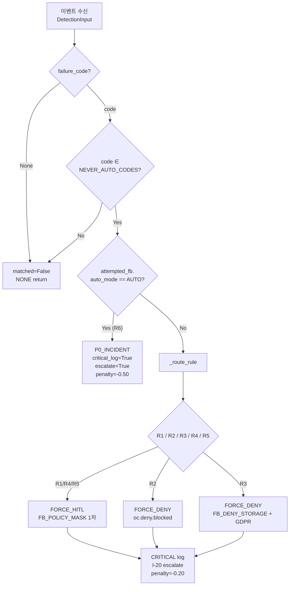
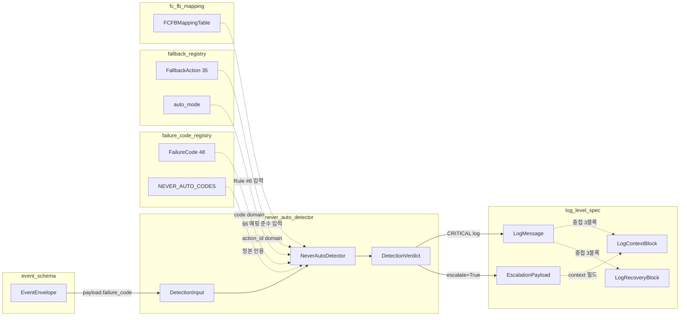

# never_auto_detector.md — NEVER_AUTO 탐지 메커니즘 (LOCK-EL-06)

> **도메인**: 6-12_Event-Logging / 02_logging-standard
> **파일**: `never_auto_detector.md`
> **정본 선언**: 본 파일은 SOT2 정본(Single Source of Truth)이며, LOCK-EL-06 이 확정한 NEVER_AUTO 대상 3코드 `{OC_I5_POLICY_BLOCK, POLICY_DENY, PII_LONGTERM_DENIED}` 에 대한 **탐지 알고리즘·자동 폴백 차단 규약·오탐 방지 정책**에 권위를 가진다. FC 카탈로그(P1-6), FB 카탈로그(P1-7), FC→FB 매핑(P1-8) 은 입력으로 참조한다.
> **버전**: v1.0.1 (2026-04-14)
> **세션**: P1-9 (Phase 1)
> **LOCK 연계**: LOCK-EL-06 (NEVER_AUTO 3코드), LOCK-EL-03 (48 FC, P1-6), LOCK-EL-04 (35 FB, P1-7), LOCK-EL-05 (FC→FB 매핑, P1-8), LOCK-EL-07 (로깅 레벨, P1-5)

---

## §0. 교차 참조 블록

| 정본 | 위치 | 역할 |
|------|------|------|
| AUTHORITY_CHAIN.md | `..\AUTHORITY_CHAIN.md` L39 (LOCK-EL-06) | NEVER_AUTO 3코드 정본 |
| 종합계획서 §7.2 P1-9 | `..\EVENT_LOGGING_구조화_종합계획서.md` L790-822 | P1-9 절차/검증 |
| Part2 §6.11 | `D:\VAMOS\docs\guides\VAMOS_구현가이드_PART2_구현단계.md` L5788-5975 | NEVER_AUTO 탐지 원본 + 5규칙 |
| 02/failure_code_registry.md §5 | `./failure_code_registry.md` §5 | NEVER_AUTO 3코드 격상 규칙 + §8 EscalationPayload 인용 |
| 02/fallback_registry.md §6 | `./fallback_registry.md` §6.1 | NEVER_AUTO FC → FB 연계표 (탐지기 Rule #6 입력) |
| 02/fc_fb_mapping.md §6 | `./fc_fb_mapping.md` §6 | 매핑 준수 검증 (탐지기 Rule #6 입력) |
| 02/log_level_spec.md §6.2 | `./log_level_spec.md` §6.2 | EscalationPayload 11필드 정본 (인용) |
| 01/event_schema.md | `../01_event-system/event_schema.md` §2 | EventEnvelope/payload.failure_code 스키마 |
| 01/namespace_rules.md | `../01_event-system/namespace_rules.md` §5.1 | `oc.deny.blocked` / `wf.approval.requested` / `oc.i5.policy.blocked` / `storage.pii.longterm.denied` 발행 규약 |
| 01/event_type_registry.md | `../01_event-system/event_type_registry.md` §3 | LOCK-EL-02 134항목 등록 event_type 도메인 (미등록 발행 금지) |
| 1-1/00_common/base_verifier_abc.md | `D:\VAMOS\docs\sot 2\1-1_Verifier-Reasoning-Engines\00_common\base_verifier_abc.md` | `async def verify(request: VerifyRequest) -> VerifyResult` 정본 |

---

## §1. 목적 / 범위

### 1.1 목적
- LOCK-EL-06 이 확정한 NEVER_AUTO 3코드를 이벤트 스트림에서 **O(1)** 로 탐지한다.
- 탐지 시 (a) 자동 폴백 실행 차단, (b) 수동 확인(HITL) 요구 또는 DENY_ONLY 고정, (c) CRITICAL 레벨 로그 발행, (d) I-20 Escalation 페이로드 생성을 강제한다.
- P1-7 §6.1 및 P1-8 §6 의 NEVER_AUTO 매핑 준수(1차 FB auto_mode ∈ {HITL, DENY_ONLY}) 여부를 런타임 검증한다 (Rule #6).

### 1.2 포함 (Scope)
- NEVER_AUTO 3코드 탐지 로직 (§3 의사코드).
- 탐지 규칙 5종 (R1~R5 Part2 §6.11 정본) + Rule #6 (AUTO 위반 감지, 본 세션 파생).
- 자동 폴백 차단 + CRITICAL 로그 + I-20 에스컬레이션 흐름 (§4 Phase별 복구 전략).
- 오탐(False Positive) 방지 조건 (§5).
- Phase 2 테스트 시나리오 12건 (§10).

### 1.3 범위 외 (Out-of-scope)
- FC 자체 카탈로그/심각도 → **P1-6 `failure_code_registry.md`**.
- FB 자체 카탈로그/auto_mode → **P1-7 `fallback_registry.md`**.
- FC→FB 매핑 최종 테이블 → **P1-8 `fc_fb_mapping.md`**.
- EscalationPayload 자체 정의 → **P1-5 `log_level_spec.md` §6.2** (본 파일은 인용만).
- 로깅 레벨 숫자/환경 필터 → **P1-5 `log_level_spec.md`**.

---

## §2. 공통 자료 구조 선정의 (Pydantic)

> 탐지기 내부에서 사용하는 자료 구조는 먼저 여기 정의한 뒤 §3 알고리즘에서 참조한다. P1-5 `LogContextBlock` / `EscalationPayload`, P1-6 FailureCode 항목, P1-7 FallbackAction 항목은 **재정의하지 않고 인용**한다.

```python
from typing import Literal, List, Optional, FrozenSet
from pydantic import BaseModel, Field

# LOCK-EL-06 정본 (불변 set)
NEVER_AUTO_CODES: FrozenSet[str] = frozenset({
    "OC_I5_POLICY_BLOCK",
    "POLICY_DENY",
    "PII_LONGTERM_DENIED",
})

AutoMode = Literal["AUTO", "HITL", "DENY_ONLY", "MANUAL"]

# 탐지 규칙 식별자 (R1~R5 = Part2 §6.11 정본; R6 = 본 파일 신설, AUTO 위반 감지)
RuleId = Literal["R1", "R2", "R3", "R4", "R5", "R6"]

class DetectionInput(BaseModel):
    """이벤트 스트림에서 탐지기가 받는 최소 입력. event_schema.md EventEnvelope 의 부분 투영."""
    event_type: str                                # 예: "oc.i5.policy.blocked"
    failure_code: Optional[str] = None             # payload.failure_code (LOCK-EL-03)
    invocation_source: Optional[str] = None        # 트리거 경로 (§5 dedup 참고)
    attempted_fallback: Optional[str] = None       # 실행 시도된 FB action_id
    attempted_fallback_auto_mode: Optional[AutoMode] = None
    pipeline_state: Optional[str] = None           # S0~S8 (LOCK-EL-10)
    trace_id: str
    request_id: str
    timestamp: str                                 # ISO 8601 UTC ms

class DetectionVerdict(BaseModel):
    """탐지 결과. 중립(no_match) / 차단(blocked) / 위반(violation) 3값."""
    matched: bool
    rule_id: Optional[RuleId] = None
    failure_code: Optional[str] = None             # NEVER_AUTO_CODES 중 하나
    action: Literal["NONE", "BLOCK_AUTO_FALLBACK", "FORCE_HITL", "FORCE_DENY", "P0_INCIDENT"] = "NONE"
    critical_log: bool = False                     # True → structured JSON CRITICAL 방출
    escalate: bool = False                         # True → I-20 EscalationPayload 발송
    confidence_penalty: float = 0.0                # §4 Phase별 다운그레이드 표와 일치
    reason: str = ""                               # 사람이 읽는 요약

class NeverAutoMetrics(BaseModel):
    """탐지기 누적 메트릭. 모니터링/회귀 검출용."""
    total_events_scanned: int = 0
    total_matches: int = 0
    matches_by_code: dict[str, int] = Field(default_factory=dict)
    matches_by_rule: dict[str, int] = Field(default_factory=dict)
    violations_rule6: int = 0
```

> 정합성 규칙(k) 준수: `DetectionInput`/`DetectionVerdict`/`NeverAutoMetrics` 는 본 파일이 단독 정의하고, 다른 산출물과 공유되는 `EscalationPayload`·`LogContextBlock`·`FallbackAction` 은 정본 파일(P1-5/P1-7)에서 인용한다.

---

## §3. NEVER_AUTO 탐지 알고리즘 (의사코드)

### 3.1 시간복잡도 · LOCK 참조 · ABC 매핑

| 연산 | 복잡도 | 비고 |
|------|--------|------|
| FC 일치 판정 (`code in NEVER_AUTO_CODES`) | **O(1)** | frozenset 해시 조회 |
| 1차 FB auto_mode 조회 | **O(1)** | P1-7 §4 dict lookup (35 entries) |
| FC→FB 매핑 조회 | **O(1)** | P1-8 §3 dict-of-list (48 entries) |
| 이벤트 1건 전체 탐지 | **O(1)** | 상수 분기 + 2회 dict lookup |
| 스트림 N 이벤트 스캔 | **O(N)** | 스트림 길이에 선형 |

LOCK 값 참조:
- `LOCK-EL-06 = {OC_I5_POLICY_BLOCK, POLICY_DENY, PII_LONGTERM_DENIED}` → `NEVER_AUTO_CODES` 와 **set equality** (T-01 검증).
- `LOCK-EL-03 = 48` → 탐지 대상 code 도메인은 48 FC 의 부분집합.
- `LOCK-EL-04 = 35` → FB action_id 도메인.
- `LOCK-EL-07 = {DEBUG, INFO, WARN, ERROR, CRITICAL}` → 발행 레벨 도메인 (탐지 히트 시 CRITICAL 고정).

ABC 패턴 매핑 (정합성 규칙 h):
- 향후 `NeverAutoDetector` 를 `BaseVerifier` (1-1/00_common/base_verifier_abc.md) 로 구현할 경우 메서드 시그니처는 **정본 그대로**:
  ```python
  async def verify(self, request: VerifyRequest) -> VerifyResult
  ```
  `request.timeout_ms` 는 `VerifyRequest` 필드로 전달되며 별도 파라미터로 분리하지 않는다. Ask(입력 검증) / Act(탐지 규칙 평가) / Confirm(`VerifyResult.confidence` 산출, `should_escalate()` 판단) 3단계는 BaseVerifier 수명주기를 따른다.

### 3.2 메인 탐지 루프

```python
async def detect_never_auto(ev: DetectionInput) -> DetectionVerdict:
    """NEVER_AUTO 탐지기 — O(1) per event. Part2 §6.11 의 5규칙 + 본 파일 Rule #6 구현."""
    # Pre: failure_code 없는 이벤트는 NEVER_AUTO 대상 아님 (오탐 방지 §5 FP-1)
    if ev.failure_code is None:
        return DetectionVerdict(matched=False)

    code = ev.failure_code

    # Gate A: LOCK-EL-06 FC set 비교 (O(1))
    if code in NEVER_AUTO_CODES:
        # R1~R5: Part2 §6.11 정본 5규칙 라우팅
        rule = _route_rule(code, ev)                      # 아래 §3.3
        # Rule #6 선체크: 1차 FB 가 AUTO 면 즉시 P0 인시던트
        if ev.attempted_fallback_auto_mode == "AUTO":
            return DetectionVerdict(
                matched=True,
                rule_id="R6",
                failure_code=code,
                action="P0_INCIDENT",
                critical_log=True,
                escalate=True,
                confidence_penalty=-0.50,   # fc_fb_mapping.md §4 Phase 표 정렬 (AUTO 위반 −0.50)
                reason=f"NEVER_AUTO AUTO violation: code={code}, fb={ev.attempted_fallback}",
            )
        # 정상 경로: auto 폴백 차단 + HITL 강제 또는 DENY 강제
        action = _force_action_by_rule(rule, code)        # "FORCE_HITL" | "FORCE_DENY"
        return DetectionVerdict(
            matched=True,
            rule_id=rule,
            failure_code=code,
            action=action,
            critical_log=True,
            escalate=True,
            confidence_penalty=-0.20,        # failure_code_registry.md §9 표: CRITICAL/NEVER_AUTO −0.20
            reason=f"NEVER_AUTO detected: code={code}, rule={rule}",
        )

    # Gate B: FC 가 NEVER_AUTO 코드는 아니지만, 매핑 테이블에서 동일 code 에 AUTO 1차 FB 가 등록된 경우는 P1-8 가 아닌 런타임에서는 발생하지 않는다 (레지스트리 무결성). 여기서는 no_match.
    return DetectionVerdict(matched=False)
```

### 3.3 Part2 §6.11 NEVER_AUTO 탐지 5규칙 (R1~R5) — 정본 매핑

| Rule | 탐지 대상 상황 | 대응 FC | 탐지기 동작 |
|------|---------------|---------|------------|
| **R1** | P1+ 자동승인 감지 (수동 승인 의무 위반) | `OC_I5_POLICY_BLOCK` (I5 auto_approve=true @ P1+) | 파이프라인 즉시 중단 + P0 인시던트 + HITL 강제 |
| **R2** | `POLICY_DENY` 우회 감지 (DENY 판정 후 후속 노드 실행) | `POLICY_DENY`, `OC_I5_POLICY_BLOCK` (2차) | 실행 결과 폐기 + DENY 고정 (`oc.deny.blocked` 발행) |
| **R3** | PII 무단 저장 감지 | `PII_LONGTERM_DENIED` | 즉시 삭제 + GDPR 보고서 강제 + DENY 고정 |
| **R4** | Gate 순서 스킵 감지 (I1→I2→I3→I4→I5 중 하나 건너뜀) | `OC_I5_POLICY_BLOCK` (route_integrity 측) | 전 Gate 재실행 강제 (자동 재시도 금지, HITL) |
| **R5** | 600초 승인 타임아웃 우회 (S3a 만료 후 auto proceed 시도) | `OC_I5_POLICY_BLOCK` | 승인 거부 강제 + DENY |
| **R6** | 본 파일 신설 — 1차 FB `auto_mode == "AUTO"` 인데 FC 가 NEVER_AUTO 3코드 | 상기 3코드 모두 | P0 인시던트 + 파이프라인 중단 (매핑 무결성 실패) |

`_route_rule(code, ev)` 결정 규칙 (요약):
- `code == "POLICY_DENY"` → R2.
- `code == "PII_LONGTERM_DENIED"` → R3.
- `code == "OC_I5_POLICY_BLOCK"` + `pipeline_state ∈ {"S3"}` + `invocation_source == "auto_approve"` → R1.
- `code == "OC_I5_POLICY_BLOCK"` + 직전 이벤트 경로가 Gate 순서 불일치 → R4.
- `code == "OC_I5_POLICY_BLOCK"` + `pipeline_state == "S3a"` + 600s 만료 플래그 → R5.
- 그 외 `OC_I5_POLICY_BLOCK` → R1 기본값.

`_force_action_by_rule(rule, code)` 결정:
- R1, R4, R5 → `"FORCE_HITL"` (FB `FB_POLICY_MASK`(HITL) 1차, 실패 시 2차 `FB_DENY_WITH_REASON`(DENY_ONLY)).
- R2 → `"FORCE_DENY"` (FB `FB_DENY_WITH_REASON`(DENY_ONLY) 단일, `oc.deny.blocked` 필수).
- R3 → `"FORCE_DENY"` (FB `FB_DENY_STORAGE`(DENY_ONLY) 1차, 2차 `FB_MASK_AND_CONFIRM`(HITL)).

### 3.4 플로우차트 (탐지 흐름)



---

## §4. Phase 별 복구/다운그레이드 전략

> 본 파일은 탐지기이므로 "복구" 의 주체는 FB 실행기(P1-7/P1-8)이며, 탐지기는 **FB 경로 선택 강제**와 **confidence penalty 산출**을 담당한다. Phase 번호는 `failure_code_registry.md` §9 + `fallback_registry.md` §9 Phase 번호와 **정합**한다.

### 4.1 Phase 1→2→3→4 복구 흐름도

```
[Phase 1 탐지]   NEVER_AUTO 이벤트 수신 → O(1) 판정
       │
       ├─ matched=False → 통과 (INFO 레벨 이벤트 발행 없음)
       │
       └─ matched=True
            │
[Phase 2 강제 라우팅]   rule 결정(R1~R5) + _force_action_by_rule
            │
            ├─ FORCE_HITL  → FB_POLICY_MASK(HITL) 발동, wf.approval.requested 발행(S3a)
            │     │
            │     ├─ 승인 OK → 종료 (penalty=-0.10)
            │     ├─ 승인 DENY → Phase 3 (2차 FB DENY_ONLY)
            │     └─ 600s 타임아웃 → Phase 3 (R5 격상)
            │
            └─ FORCE_DENY  → FB_DENY_WITH_REASON / FB_DENY_STORAGE(DENY_ONLY) 즉시
                  │
                  └─ oc.deny.blocked 발행 → Phase 4 (에스컬레이션)
            │
[Phase 3 2차 FB]   2차 FB DENY_ONLY 또는 HITL → 최종 차단 결정
            │
[Phase 4 에스컬레이션]   I-20 EscalationPayload 발송 (P1-5 §6.2 인용, 11필드)
            │
            └─ HITL 운영자 결정 반영 → 감사 로그 잠금
```

### 4.2 다운그레이드 confidence penalty (정본: `failure_code_registry.md` §9 + `fc_fb_mapping.md` §4)

| 상황 | 조건 | penalty | 비고 |
|------|------|---------|------|
| NEVER_AUTO 탐지 + HITL 승인 | R1/R4/R5 + FB_POLICY_MASK OK | **−0.10** | Phase 2 종료 |
| NEVER_AUTO 탐지 + HITL 거부 | R1/R4/R5 + 2차 DENY_ONLY | **−0.20** | `failure_code_registry.md` §9 CRITICAL/NEVER_AUTO 값 |
| NEVER_AUTO 탐지 + DENY 즉시 | R2/R3 | **−0.20** | 후속 실행 금지 |
| Rule #6 (AUTO 위반) | FC NEVER_AUTO + 1차 FB AUTO | **−0.50** | `fc_fb_mapping.md` §4 Phase 표 "NEVER_AUTO AUTO 위반" 값 |
| Rule #6 + P0 인시던트 후 | 파이프라인 중단 | **−0.50** 고정 | 이중 감산 금지 (max penalty) |

> penalty 상한: 동일 request_id 내 본 탐지기 기여 penalty 최대 **−0.50** (R6 경로) 또는 **−0.20** (R1~R5 경로). dedup 은 `invocation_source` 와 `request_id` 조합 기준 (`fc_fb_mapping.md` §10.G 3규칙 준수).

---

## §5. 오탐(False Positive) 방지 규칙

| ID | 조건 | 처리 |
|----|------|------|
| **FP-1** | `failure_code` 필드 부재 (예: 정상 완료 이벤트 `oc.done`) | `matched=False` 조기 반환. |
| **FP-2** | `failure_code` 값이 NEVER_AUTO_CODES 문자열과 **완전 일치하지 않음** (오타/변형 예: `POLICY_DENIED`) | `matched=False`. 경고 로그 `EL_EVT_UNKNOWN_CODE` WARN 별도 발행 (P1-6 §7.2 미등록 코드 감지 경로로 위임). |
| **FP-3** | 동일 `request_id` 의 재전송(re-emission) 이벤트 — 이미 탐지 완료 | dedup by `(request_id, failure_code, rule_id)`. 재탐지 시 `matched=False`, 단 메트릭은 증가 금지. |
| **FP-4** | `invocation_source` 가 테스트/리플레이(`replay`, `test-inject`) | `matched=True` 이되 `escalate=False` 로 하향 + `reason` 에 replay 명시. 테스트 환경에서만 허용. |
| **FP-5** | `FB_POLICY_MASK` 또는 `FB_DENY_WITH_REASON` 을 사용자가 **명시적으로 선택**한 후속 이벤트 | 이미 HITL 경로 진입 중 → Rule #6 판정 금지 (auto_mode 는 HITL 이므로 자연히 통과). |
| **FP-6** | MANUAL 모드 FB(`FB_SDAR_ABORT`) 가 감지된 경우 | R1~R5 대상 FB 가 아니므로 본 탐지기 적용 제외 (no_match). |
| **FP-7** | `pipeline_state` 가 S0 (Intake 이전) | NEVER_AUTO 3코드는 S2 이후 발생이 정상. S0 에서 발생 시 `EL_EVT_STATE_OUT_OF_ORDER` WARN + `matched=True` 보수적 판정 (오탐보다 미탐지가 더 위험). |

> 오탐 처리 원칙: **미탐지(False Negative) > 오탐(False Positive)** 보다 치명적이다. 경계선 상황에서는 탐지 방향으로 판정한다 (FP-7 참고). 단 Rule #6(AUTO 위반) 은 무결성 실패 신호이므로 **결코 FP 로 취급하지 않는다**.

---

## §6. 예외 처리 정책

| error_code | recoverable | 처리 |
|------------|-------------|------|
| `EL_DETECTOR_MALFORMED_INPUT` | 부분적 | `DetectionInput` Pydantic 검증 실패 → WARN + `matched=False` 반환. 이벤트 드롭 금지(원본 큐에 보관). |
| `EL_DETECTOR_REGISTRY_DRIFT` | not recoverable | `NEVER_AUTO_CODES` set 과 AUTHORITY_CHAIN LOCK-EL-06 불일치 (초기화 시) → 서비스 기동 실패 + P0 인시던트. |
| `EL_DETECTOR_RULE_ROUTE_FAIL` | recoverable | `_route_rule` 이 어떤 규칙에도 매칭 안 됨 → 기본 R1 적용 + WARN. |
| `EL_AUTO_MODE_VIOLATION` | not recoverable | Rule #6 발동 — NEVER_AUTO + AUTO 1차 FB. 즉시 P0 인시던트(`fc_fb_mapping.md` §8 동일 코드) + CRITICAL 로그. |
| `EL_DETECTOR_ESCALATION_FAIL` | 부분적 | I-20 호출 실패 → 로컬 감사 로그에 EscalationPayload persist + 재시도 큐 (3회 지수백오프). 재시도 소진 시 서비스 헬스 DOWN. |

---

## §7. 이벤트 발행 / 로깅 포맷 (R-01-7)

탐지 히트 시 반드시 structured JSON 중첩 3블록(`error{}` / `context{}` / `recovery{}`) + `trace_id` 를 포함한 로그를 **CRITICAL** 레벨로 발행한다 (P1-5 §2.2 `LogRecord` 구조 준수). 새 스키마를 정의하지 않고 `LogRecord` + `LogErrorBlock` + `LogContextBlock` + `LogRecoveryBlock` 를 그대로 사용한다.

### 7.1 예시 — R2 (POLICY_DENY)

```json
{
  "timestamp": "2026-04-14T22:00:31.118Z",
  "level": "CRITICAL",
  "logger": "orange_core.never_auto_detector",
  "message": "NEVER_AUTO detected: POLICY_DENY (R2)",
  "trace_id": "00-4bf92f3577b34da6a3ce929d0e0e4736-00f067aa0ba902b7-01",
  "error": {
    "failure_code": "POLICY_DENY",
    "category": "GENERAL",
    "severity": "P0",
    "never_auto": true,
    "rule_id": "R2"
  },
  "context": {
    "service": "orange-core",
    "module": "never_auto_detector",
    "state": "S3",
    "request_id": "req-0x9a",
    "pipeline_state": "S3",
    "invocation_source": "i5_decision"
  },
  "recovery": {
    "attempted_fallbacks": [],
    "forced_action": "FORCE_DENY",
    "confidence_penalty": -0.20,
    "next_event": "oc.deny.blocked"
  }
}
```

### 7.2 예시 — Rule #6 (AUTO 위반 P0 인시던트)

```json
{
  "timestamp": "2026-04-14T22:00:32.205Z",
  "level": "CRITICAL",
  "logger": "orange_core.never_auto_detector",
  "message": "NEVER_AUTO AUTO violation (Rule #6): OC_I5_POLICY_BLOCK × FB_AUTO_REPAIR",
  "trace_id": "00-4bf92f3577b34da6a3ce929d0e0e4736-00f067aa0ba902b7-02",
  "error": {
    "failure_code": "OC_I5_POLICY_BLOCK",
    "category": "I5_DECISION",
    "severity": "P0",
    "never_auto": true,
    "rule_id": "R6",
    "integrity_failure": true
  },
  "context": {
    "service": "orange-core",
    "module": "never_auto_detector",
    "state": "S3",
    "request_id": "req-0xff",
    "attempted_fallback": "FB_AUTO_REPAIR",
    "attempted_fallback_auto_mode": "AUTO"
  },
  "recovery": {
    "forced_action": "P0_INCIDENT",
    "pipeline_action": "ABORT",
    "confidence_penalty": -0.50,
    "next_event": "oc.deny.blocked"
  }
}
```

### 7.3 이벤트 네임스페이스 매핑 (P1-2 `event_type_registry.md` §3 / P1-4 `namespace_rules.md` §5.1 준수)

> **중요**: 본 탐지기는 P1-2 LOCK-EL-02=134 등록 event_type 만 발행한다. 미등록 event_type 발행 시 `EL_EVT_UNKNOWN_TYPE` quarantine 대상. NEVER_AUTO 관련 등록 event_type 은 `oc.i5.policy.blocked` (#28, ERROR/S3), `oc.deny.blocked` (#32, ERROR/S3), `storage.pii.longterm.denied` (#117, ERROR), `wf.approval.requested` (#38, WARN/S3a) 로 한정된다.

| 상황 | event_type (등록 #) | 발행 레벨 (탐지 히트 시 CRITICAL 격상) |
|------|-----------|------|
| R1/R4/R5 HITL 강제 | `wf.approval.requested` (#38) + `oc.i5.policy.blocked` (#28) | WARN + CRITICAL |
| R2 DENY | `oc.deny.blocked` (#32) | CRITICAL |
| R3 PII DENY | `oc.deny.blocked` (#32) + `storage.pii.longterm.denied` (#117) | CRITICAL |
| R6 AUTO 위반 | `oc.deny.blocked` (#32) + I-20 EscalationPayload (§8) | CRITICAL |

> R6 P0 인시던트 의미의 `wf.incident.*` event_type 은 현재 LOCK-EL-02 미등록이다. 인시던트 개설은 전역 거부 이벤트 `oc.deny.blocked` 발행 + I-20 에스컬레이션(§8) 으로 대체하며, `wf.incident.opened` 필요 시 별도 RFC (P1-4 §5.3) 로 등록한 뒤 본 표를 갱신한다.

---

## §8. 에스컬레이션 페이로드 구조 (R-01-8)

본 탐지기는 페이로드 구조를 **재정의하지 않는다**. P1-5 `log_level_spec.md` §6.2 정본 `EscalationPayload` (11필드) 를 **그대로 인용**하여 I-20 로 전송한다 (정합성 규칙 j).

### 8.1 정본 인용 (P1-5 §6.2 — 변경 금지)

```python
class EscalationPayload(BaseModel):
    source_engine: str               # "orange_core.never_auto_detector"
    error_code: str                  # FailureCode (LOCK-EL-03)
    original_request: dict[str, Any] # 최초 요청 스냅샷(PII 마스킹 후)
    partial_result: dict[str, Any] | None = None
    retry_count: int = 0             # 본 탐지기는 재시도 없음 → 항상 0
    timestamp: str
    level: str                       # 본 탐지기 히트 시 항상 "CRITICAL"
    trace_id: str
    context: LogContextBlock
    recovery_attempts: list[LogRecoveryBlock] = Field(default_factory=list)
    reason: str                      # "NEVER_AUTO violation: <code> (R<rule>)"
```

### 8.2 NEVER_AUTO 관점 필드 사용 규약

| 필드 | R1~R5 경로 | R6 경로 | 비고 |
|------|-----------|---------|------|
| `source_engine` | `"orange_core.never_auto_detector"` | 동일 | 고정값 |
| `error_code` | `OC_I5_POLICY_BLOCK` / `POLICY_DENY` / `PII_LONGTERM_DENIED` | 동일 3코드 중 하나 | LOCK-EL-06 도메인 |
| `level` | `"CRITICAL"` 강제 | `"CRITICAL"` 강제 | LOCK-EL-07 격상 |
| `retry_count` | 0 | 0 | 탐지기는 재시도 없음 |
| `recovery_attempts` | 0~1건 (1차 FB 시도분) | 0건 (즉시 차단) | LogRecoveryBlock 리스트 |
| `reason` | `"NEVER_AUTO violation: <code> (R<n>)"` | `"NEVER_AUTO AUTO violation (Rule #6): <code> × <fb>"` | 사람이 읽는 요약 |
| `context.never_auto` (LogContextBlock 확장) | `True` | `True` | P1-6 §8.2 확장 규약 |

---

## §9. 의존성 / 모듈 관계

### 9.1 모듈 카탈로그

| 역할 | 모듈 | 정본 파일 경로 | ABC 구현 상태 |
|------|------|---------------|--------------|
| 탐지기 (본 세션) | `NeverAutoDetector` | `./never_auto_detector.md` §3 | 향후 BaseVerifier 확장 예정 |
| FC 카탈로그 (입력) | `FailureCodeRegistry` | `./failure_code_registry.md` §4 | 정적 레지스트리 |
| FB 카탈로그 (입력) | `FallbackRegistry` | `./fallback_registry.md` §4 | 정적 레지스트리 |
| FC→FB 매핑 (입력) | `FCFBMappingTable` | `./fc_fb_mapping.md` §3 | 정적 매핑 |
| 로깅 (출력) | `LogMessage` / `LogContextBlock` / `LogRecoveryBlock` | `./log_level_spec.md` §2 | Pydantic 정본 |
| 에스컬레이션 (출력) | `EscalationPayload` → I-20 | `./log_level_spec.md` §6.2 | Pydantic 정본 |
| 이벤트 네임스페이스 (출력) | `oc.i5.policy.blocked` (#28) / `oc.deny.blocked` (#32) / `wf.approval.requested` (#38) / `storage.pii.longterm.denied` (#117) | `../01_event-system/event_type_registry.md` §3 + `../01_event-system/namespace_rules.md` §5 | 등록 event_type 한정 (LOCK-EL-02=134) |
| 이벤트 스키마 (입력) | `EventEnvelope` | `../01_event-system/event_schema.md` §2 | Pydantic 정본 |

### 9.2 공통 자료 구조 의존 (Mermaid)



### 9.3 NxN 의존성 매트릭스 (본 탐지기 관점)

| from\to | P1-1 event_schema | P1-4 namespace | P1-5 log_level | P1-6 FC | P1-7 FB | P1-8 FC→FB | P1-9 detector | I-20 |
|---------|:-:|:-:|:-:|:-:|:-:|:-:|:-:|:-:|
| P1-9 (본) | R | W | RW | R | R | R | — | W |

(R=Read, W=Write/Emit, RW=Read+Write)

### 9.4 SoT 검증

| 기준 | 위치 | 본 파일 |
|------|------|---------|
| LOCK-EL-06 (NEVER_AUTO 3코드) | AUTHORITY_CHAIN L39 | §2 `NEVER_AUTO_CODES` / §3.2 Gate A / §10 T-01 |
| Part2 §6.11 5규칙 | L5788-5975 | §3.3 R1~R5 표 |
| P1-7 §6.1 NEVER_AUTO FC→FB | `./fallback_registry.md` §6.1 | §3.3 `_force_action_by_rule` / §10 T-05 |
| P1-8 §6 NEVER_AUTO 매핑 준수 | `./fc_fb_mapping.md` §6 | Rule #6 (§3.2) |
| P1-5 §6.2 EscalationPayload | `./log_level_spec.md` §6.2 | §8.1 인용 (재정의 없음) |
| D2.0-02 §10.4 NEVER_AUTO 조항 | `D:\VAMOS\docs\sot\D2.0-02_*` | §1.1 목적 / 본 파일은 구현 정본 |

---

## §10. Phase 2 테스트 시나리오 (12건, ≥10 충족)

| # | 시나리오 | 주입 방법 | 기대 결과 |
|---|---------|----------|----------|
| T-01 | **LOCK-EL-06 set 동일성** | 부팅 시 `NEVER_AUTO_CODES` set dump | `== {"OC_I5_POLICY_BLOCK","POLICY_DENY","PII_LONGTERM_DENIED"}` (LOCK-EL-06 정본 일치) |
| T-02 | **R1 자동승인 감지** | `pipeline_state=S3`, `failure_code=OC_I5_POLICY_BLOCK`, `invocation_source=auto_approve` 이벤트 주입 | `matched=True, rule_id=R1, action=FORCE_HITL, critical_log=True, penalty=-0.20`, `wf.approval.requested` (#38) + `oc.i5.policy.blocked` (#28) CRITICAL 발행 |
| T-03 | **R2 POLICY_DENY 우회** | `failure_code=POLICY_DENY` + 직후 후속 노드 실행 이벤트 | `matched=True, rule_id=R2, action=FORCE_DENY`, `oc.deny.blocked` CRITICAL 발행, 후속 노드 결과 폐기 확인 |
| T-04 | **R3 PII 무단 저장** | `failure_code=PII_LONGTERM_DENIED` + 저장 시도 | `matched=True, rule_id=R3, action=FORCE_DENY`, `storage.pii.longterm.denied` (#117) + `oc.deny.blocked` (#32) + GDPR 보고서 큐 진입 |
| T-05 | **R6 AUTO 위반 감지** | `failure_code=POLICY_DENY` + `attempted_fallback=FB_RETRY_SOFT` + `auto_mode=AUTO` 이벤트 주입 | `matched=True, rule_id=R6, action=P0_INCIDENT, penalty=-0.50`, `oc.deny.blocked` (#32) CRITICAL 발행 + I-20 EscalationPayload 전송, 파이프라인 abort |
| T-06 | **R4 Gate 순서 스킵** | I3 이벤트 없이 I2→I5 전이 + `OC_I5_POLICY_BLOCK` | `matched=True, rule_id=R4, action=FORCE_HITL`, 전 Gate 재실행 플래그 |
| T-07 | **R5 승인 타임아웃 우회** | `pipeline_state=S3a` + 600s 만료 + auto proceed 플래그 + `OC_I5_POLICY_BLOCK` | `matched=True, rule_id=R5, action=FORCE_HITL`, 승인 거부 강제 |
| T-08 | **FP-1 무관 이벤트** | `oc.done` 정상 완료 이벤트 (`failure_code=None`) | `matched=False`, 로그 없음, 메트릭 `total_events_scanned+=1` |
| T-09 | **FP-2 오타 코드** | `failure_code=POLICY_DENIED` (오타) | `matched=False`, `EL_EVT_UNKNOWN_CODE` WARN 별도 발행 |
| T-10 | **FP-3 중복 이벤트 dedup** | 동일 `(request_id, failure_code=POLICY_DENY)` 연속 2회 | 1회만 `matched=True` 카운트, 2회차는 `matched=False` 단 로그 drop 금지 |
| T-11 | **EscalationPayload 11필드 검증** | R2 이벤트 주입 → I-20 수신 측 페이로드 캡처 | 11필드 전수 존재 (source_engine, error_code, original_request, partial_result, retry_count=0, timestamp, level=CRITICAL, trace_id, context, recovery_attempts, reason), `context.never_auto==True` |
| T-12 | **성능 O(1) 검증** | 10,000건 임의 이벤트 (1% NEVER_AUTO) | 평균 처리 지연 < 0.1ms/event, p99 < 1ms, 탐지 누락 0건 |

---

## §11. 세션 간 인터페이스 cross-check

| 상대 세션 | 파일 | 인터페이스 | 정합 |
|-----------|------|-----------|------|
| P1-1 | `01/event_schema.md` §2 `EventEnvelope` | `payload.failure_code` 필드 수용 → `DetectionInput.failure_code` | ✅ 필드명/타입 일치 |
| P1-2 | `01/event_type_registry.md` §3 | LOCK-EL-02=134 등록 event_type 도메인 (`oc.i5.policy.blocked` #28 / `oc.deny.blocked` #32 / `wf.approval.requested` #38 / `storage.pii.longterm.denied` #117) | ✅ 본 §7.3 준수, 미등록 event_type 발행 없음 |
| P1-4 | `01/namespace_rules.md` §5.1 | 네임스페이스 정규식 + 등록 절차 + quarantine 규약 | ✅ 본 §7.3 준수 |
| P1-5 | `02/log_level_spec.md` §2 / §6.2 | `LogMessage` / `LogContextBlock` / `LogRecoveryBlock` / `EscalationPayload` (11필드) | ✅ 재정의 없음, 본 §7/§8 인용 |
| P1-6 | `02/failure_code_registry.md` §5 / §8 / §9 | NEVER_AUTO 3코드 격상 규칙 + EscalationPayload 인용 + penalty 표 | ✅ 동일 penalty 값(-0.20 / -0.50), 동일 3코드 |
| P1-7 | `02/fallback_registry.md` §6.1 | NEVER_AUTO FC→FB 연계 표 (1차/2차 auto_mode) | ✅ `_force_action_by_rule` 입력으로 일치 |
| P1-8 | `02/fc_fb_mapping.md` §6 | 매핑 준수 검증 (HITL/DENY_ONLY 강제) | ✅ Rule #6 입력으로 일치 |
| 1-1 00_common | `base_verifier_abc.md` | `async def verify(self, request: VerifyRequest) -> VerifyResult` | ✅ §3.1 ABC 매핑 정본 준수, timeout_ms 는 VerifyRequest 필드 |

> 인터페이스 불일치 감지 시 `[INTERFACE_MISMATCH: <설명>]` 마커로 보고한다. **현재 발견된 불일치 없음** (P1-1/4/5/6/7/8 전수 확인 완료).

---

## §12. 상태 번호 정본 준수

- 9-State 번호(S0~S8) 는 `AUTHORITY_CHAIN.md` LOCK-EL-10 및 P1-3 정본을 따른다. 본 파일은 상태 번호를 **재정의하지 않는다**.
- 본 파일에서 참조하는 상태(정본 명칭): **S2**(Plan), **S3**(Gate), **S3a**(Approve Wait, 600s) — `pipeline_state_map.md` §3 및 LOCK-EL-10 Part2 §6.11 L5800-5809 정본 일치.

---

## §13. LOCK / CONFLICT 보고

- LOCK 변경: **없음**. LOCK-EL-06 정본 3코드 인용, set 크기 3 유지.
- CONFLICT: **발견 0건**. P1-7 §6.1 / P1-8 §6 과 auto_mode 도메인 일치, Part2 §6.11 5규칙 전수 수용.
- R-612-4 (NEVER_AUTO 탐지 규칙 동시 추가) 준수: R1~R5 + R6 총 6규칙, LOCK-EL-06 3코드 전수 커버.

---

## §14. 확장 가이드 (R-612-4 확장 절차)

NEVER_AUTO 대상 코드 추가 시 (LOCK-EL-06 확장) 본 파일에 **탐지 규칙 1개 이상**을 동시 추가해야 한다. 미추가 시 CI 체크에서 `[DETECTOR_MISSING: <code>]` 에러로 PR 차단 (P1-6 §7.2 T-12 정렬).

절차:
1. AUTHORITY_CHAIN LOCK-EL-06 값 업데이트 (사람 결정 필요).
2. 본 파일 §2 `NEVER_AUTO_CODES` frozenset 확장.
3. §3.3 표에 R{n+1} 규칙 추가 + `_route_rule` / `_force_action_by_rule` 분기 추가.
4. §10 Phase 2 테스트 시나리오에 T-{m+1} 추가.
5. `failure_code_registry.md` §5 / `fallback_registry.md` §6.1 / `fc_fb_mapping.md` §6 동기화.

---

## §15. 검증 체크리스트 (P1-9 완료 기준)

- [x] NEVER_AUTO 대상 3개 코드(OC_I5_POLICY_BLOCK, POLICY_DENY, PII_LONGTERM_DENIED) 전부 포함 — §2 / §3.3 / §10 T-01
- [x] 탐지 시 수행 동작(차단→수동확인→CRITICAL 로그) 명세 포함 — §3.2 / §4.1 / §7
- [x] 탐지 알고리즘 의사 코드 또는 플로우차트 포함 — §3.2 / §3.4
- [x] LOCK-EL-06 참조 명시 — Header / §0 / §2 / §9.4
- [x] P1-6(failure_code_registry.md) 상호 참조 링크 포함 — §0 / §11 / §9.1
- [x] 교차 참조 블록 — §0 (10건)
- [x] R-01-7 structured JSON 중첩 구조 (error/context/recovery + trace_id) — §7.1 / §7.2
- [x] R-01-8 에스컬레이션 + I-20 EscalationPayload (11필드 인용) — §8.1
- [x] Phase 2 테스트 시나리오 12건 (≥10) — §10
- [x] 시간복잡도 + LOCK 값 + ABC 매핑 (알고리즘) — §3.1
- [x] 공통 자료 구조 선정의 (Pydantic) — §2
- [x] 예외 처리 정책 표 — §6
- [x] 세션 간 인터페이스 cross-check — §11
- [x] 의존성 그래프 (Mermaid) + NxN 매트릭스 + SoT 검증 — §9

---

## §16. 변경 이력

| 일자 | 버전 | 변경 내용 | 세션 |
|------|------|----------|------|
| 2026-04-14 | v1.0.0 | 초기 작성 — LOCK-EL-06 3코드 탐지 알고리즘 (O(1)) + R1~R5 정본 5규칙 + Rule #6 AUTO 위반 감지 신설 + FP-1~FP-7 오탐 방지 + Phase 2 테스트 12건 + EscalationPayload P1-5 §6.2 인용 + NEVER_AUTO FC→FB 연계 P1-7 §6.1 / P1-8 §6 정합. | P1-9 |
| 2026-04-14 | v1.0.1 | Step 2 재검증 — §7.3/§9.1/§10/§11 event_type 정본 정합 교정: P1-2 LOCK-EL-02=134 미등록이었던 `oc.i5.never_auto.detected` → `oc.i5.policy.blocked` (#28), `storage.pii.denied` → `storage.pii.longterm.denied` (#117), `wf.incident.opened` → `oc.deny.blocked` (#32) + I-20 에스컬레이션 대체 (별도 RFC 필요성 주석). T-02/T-04/T-05 기대값 등록 #번호 포함으로 갱신. §0 교차 참조에 event_type_registry 추가. 세션 인터페이스 cross-check 에 P1-2 항목 추가. | P1-9 Step 2 |
