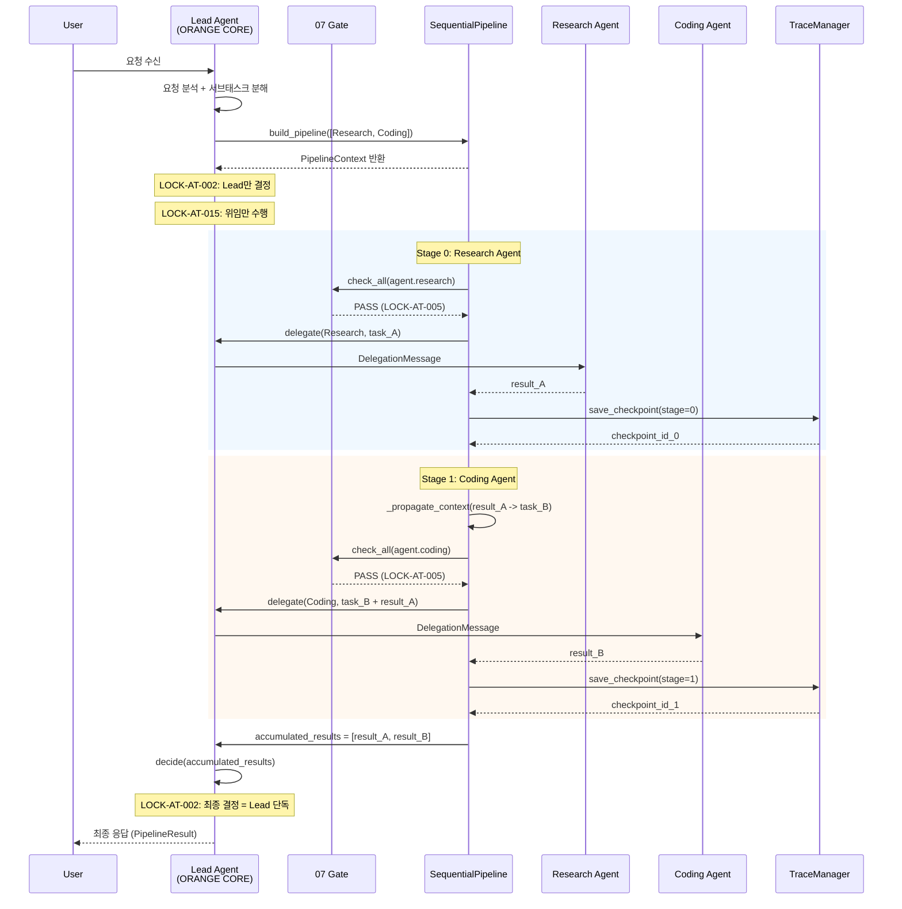
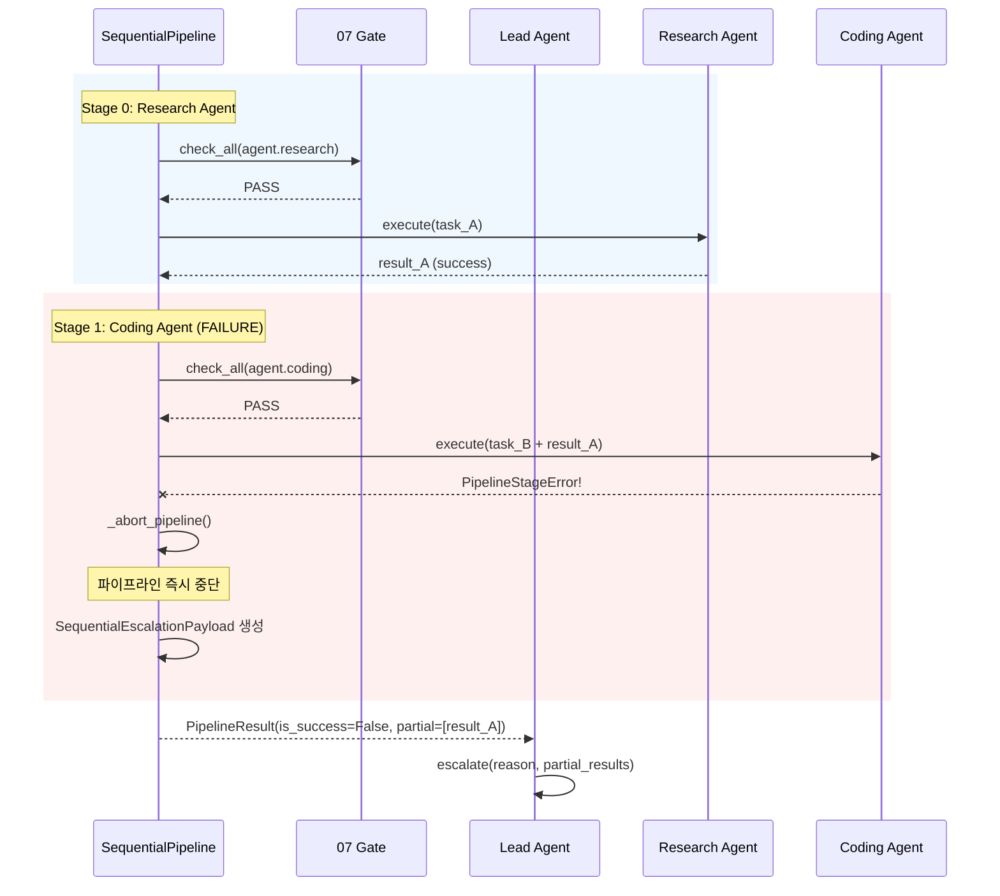

# P1-04. Sequential 패턴 구현 -- Lead → Research → Coding 순차 파이프라인

> **도메인**: 6-3_Agent-Teams-PARL / 03_team-composition
> **세션**: P1-4
> **작성일**: 2026-04-12
> **대조 기준**: D2.0-05 §Workflow_Pattern Sequential 정의, §6.7 패턴 구현 요건
> **선행 산출물**: P1-01_lead_agent_definition.md (P1-1), P1-02_research_agent_definition.md (P1-2), P1-03_coding_agent_definition.md (P1-3)

---

## 1. 교차 참조 블록

| 문서 | 참조 위치 | 역할 |
|------|----------|------|
| D2.0-05 Agent Workflow | §Workflow_Pattern Sequential, §7.3 | Sequential 패턴 정본 정의 |
| D2.0-02 ORANGE CORE | S3 Decision Locked | Lead Agent 단일결정 -> 순차 위임 흐름 근거 |
| D2.0-07 Safety/Cost/Approval | S7E-080, Gate 정책 | 07 Gate 선행 통과 필수 (각 단계별) |
| Part2 §6.7 | L4994-5130 | LOCK-AT 값 선언 정본, 패턴 구현 요건 |
| Part2 §6.7 §7.1 | enum WorkflowPattern | Sequential = 6개 패턴 중 1번째 (CFL-63-001 RESOLVED) |
| SPEC S7-A-001 | Agent Teams 기능 사양 | Sequential 패턴 사양 |
| AUTHORITY_CHAIN.md | §2.1 레지스트리 | LOCK-AT 17건 레지스트리 정본 |
| 03_team-composition/_index.md | §2 협업 패턴 개요 | 폴더 수준 패턴 총괄 |
| P1-01_lead_agent_definition.md | §3 LeadAgent 클래스 | Lead Agent 위임 인터페이스(delegate, decide) 정합성 |
| P1-02_research_agent_definition.md | §3 ResearchAgent 클래스 | Research Agent 실행 인터페이스(execute) 정합성 |
| P1-03_coding_agent_definition.md | §3 CodingAgent 클래스 | Coding Agent 실행 인터페이스(execute) 정합성 |
| 종합계획서 §7.3 | P1-4 세부 항목 | 본 세션 작업 정의 |
| 종합계획서 부록 §A.5 | 협업 패턴 상세 | Sequential 패턴 상세 명세 |
| **인접 도메인** | | |
| 3-8 Conversation-A2A | A2A 프로토콜 규격 | Sequential 위임 메시지 포맷 소비 (재정의 금지) |
| 3-10 Agent-Protocol | L0-L4 자율성 정의 | Agent 자율성 레벨 배정 참조 (재정의 금지) |
| 6-2 Security-Governance | 보안 정책, STRIDE 위협 모델 | 파이프라인 보안 체크리스트 우선 적용 (§9.3) |

---

## 2. Sequential 패턴 개요

### 2.1 패턴 식별

| 속성 | 값 |
|------|-----|
| **패턴 ID** | `WorkflowPattern.SEQUENTIAL` |
| **도입 버전** | V1 |
| **실행 모델** | 동기 순차 (각 단계 완료 후 다음 단계 시작) |
| **기본 파이프라인** | Lead → Research → Coding (3단계) |
| **최대 단계 수 (V1)** | 위임 깊이 2 (LOCK-AT-004 V1 config=2) |
| **컨텍스트 전파** | 이전 단계 결과를 다음 단계 입력으로 전달 |
| **실패 정책** | 단계 실패 시 파이프라인 즉시 중단 + 에러 보고 |

### 2.2 LOCK 값 인용

> LOCK-AT-002 (Part2 §6.7 L5040 / D2.0-02 §2.2 L319):
> "단일결정 원칙: 최종 결론은 Lead Agent(ORANGE CORE)만 확정"

> LOCK-AT-004 (Part2 §6.7 L5042 / D2.0-07 S7E-080):
> "위임 체인 최대 깊이 3단계 (V1 config=2)"

> LOCK-AT-005 (Part2 §6.7 L5043 / D2.0-05 §7.3 고정1):
> "모든 에이전트 실행은 07 Gate 선행 통과 필수"

> LOCK-AT-007 (Part2 §6.7 L5045 / D2.0-05 §7.3 고정2):
> "Checkpoint/Replay/Fork는 trace_id 단위로만 허용"

> LOCK-AT-009 (Part2 §6.7 L5047 / D2.0-05 §12.4.4):
> "대화 턴 상한: P0=5, P1=10, P2=20"

> LOCK-AT-015 (Part2 §6.7 L5053 / SPEC S7-A-001 L118):
> "Lead Agent는 직접 실행 금지 (계획/분배/검증만 수행)"

---

## 3. SequentialPipeline 클래스 스켈레톤

### 3.1 공통 자료 구조 (§7 공통 자료 구조 선정의)

```python
from __future__ import annotations
from typing import Any, Optional, Callable
from dataclasses import dataclass, field
from enum import Enum
import uuid
import time
import logging

# ---------------------------------------------------------------------------
# 공통 자료 구조 -- P1-01 공유 (AgentRole, DelegationMessage, EscalationPayload)
# ---------------------------------------------------------------------------
# 아래 구조는 P1-01_lead_agent_definition.md §3.1에서 정의된 것을 재사용.
# 여기서는 Sequential 패턴에 필요한 추가 구조만 정의.

from enum import Enum


class PipelineStageStatus(Enum):
    """파이프라인 단계 실행 상태."""
    PENDING = "pending"
    RUNNING = "running"
    COMPLETED = "completed"
    FAILED = "failed"
    SKIPPED = "skipped"


@dataclass
class PipelineStage:
    """Sequential 파이프라인 개별 단계 정의.

    LOCK-AT-007: 각 단계 완료 시 Checkpoint 저장 호환.
    """
    stage_id: str
    agent_role: str           # AgentRole.value (e.g., "agent.research")
    stage_order: int          # 0-based 순서 인덱스
    task_payload: dict[str, Any] = field(default_factory=dict)
    status: PipelineStageStatus = PipelineStageStatus.PENDING
    result: Optional[dict[str, Any]] = None
    error: Optional[str] = None
    started_at: Optional[float] = None
    completed_at: Optional[float] = None
    checkpoint_id: Optional[str] = None  # LOCK-AT-007 Checkpoint ID


@dataclass
class PipelineContext:
    """Sequential 파이프라인 실행 컨텍스트.

    컨텍스트 전파: 이전 단계 결과를 accumulated_results에 누적하여
    다음 단계의 입력으로 전달한다.
    """
    trace_id: str
    pipeline_id: str
    stages: list[PipelineStage] = field(default_factory=list)
    accumulated_results: list[dict[str, Any]] = field(default_factory=list)
    current_stage_index: int = 0
    is_aborted: bool = False
    abort_reason: Optional[str] = None


@dataclass
class PipelineResult:
    """Sequential 파이프라인 전체 실행 결과.

    LOCK-AT-002: 최종 결과 확정은 Lead Agent만 수행.
    """
    trace_id: str
    pipeline_id: str
    stages_completed: int
    stages_total: int
    final_output: Optional[Any] = None
    stage_results: list[dict[str, Any]] = field(default_factory=list)
    timing_log: list[dict[str, Any]] = field(default_factory=list)
    is_success: bool = False
    error_summary: Optional[str] = None


@dataclass
class SequentialEscalationPayload:
    """Sequential 파이프라인 실패 시 에스컬레이션 페이로드.

    R-01-8 경유, Lead Agent가 처리 불가 시 사용자에게 상위 보고.
    EscalationPayload (P1-01 §3.1)를 확장하여 파이프라인 컨텍스트 포함.
    """
    trace_id: str
    escalation_id: str
    pipeline_id: str
    failed_stage: str        # 실패한 단계의 agent_role
    failed_stage_order: int
    reason: str
    partial_results: list[dict[str, Any]] = field(default_factory=list)
    completed_stages: list[str] = field(default_factory=list)
    error_context: dict[str, Any] = field(default_factory=dict)
    severity: str = "HIGH"   # HIGH | CRITICAL
```

### 3.2 SequentialPipeline 인터페이스 정의

```python
class SequentialPipeline:
    """Lead → Research → Coding 순차 실행 파이프라인.

    LOCK-AT-002: 최종 결론은 Lead Agent(ORANGE CORE)만 확정.
    LOCK-AT-004: 위임 체인 최대 깊이 V1=2.
    LOCK-AT-005: 각 Agent 실행 전 07 Gate 선행 통과 필수.
    LOCK-AT-007: 각 단계 완료 시 trace_id 단위 Checkpoint 저장.
    LOCK-AT-015: Lead Agent는 직접 실행 금지 (위임만).

    시간복잡도:
      - build_pipeline(): O(n) where n = number of stages
      - execute(): O(n * T) where T = max stage execution time
      - _propagate_context(): O(k) where k = accumulated result size
      - abort(): O(n) where n = number of stages

    ABC 시그니처:
      build_pipeline(stages, trace_id) -> PipelineContext
      execute(context) -> PipelineResult
      abort(context, reason) -> PipelineResult
    """

    MAX_STAGES_V1: int = 3       # V1 기본 파이프라인: 3단계
    MAX_DEPTH_V1: int = 2        # LOCK-AT-004: V1 config=2

    def __init__(self, lead_agent: "LeadAgent",
                 gate_checker: "GateChecker",
                 trace_manager: "TraceManager",
                 logger: Optional[logging.Logger] = None) -> None:
        """
        Args:
            lead_agent: LeadAgent 인스턴스 (P1-01).
            gate_checker: GateChecker 인스턴스 (P1-08, 04_autonomy-levels).
            trace_manager: TraceManager 인스턴스 (P1-14, 02_agent-swarm).
            logger: 로깅 인스턴스.
        """
        self._lead = lead_agent
        self._gate_checker = gate_checker
        self._trace_manager = trace_manager
        self._logger = logger or logging.getLogger("sequential_pipeline")

    # ---------- 핵심 메서드 ----------

    def build_pipeline(self, stages: list[dict[str, Any]],
                       trace_id: str) -> PipelineContext:
        """파이프라인 단계 리스트를 구성한다.

        Args:
            stages: 단계 정의 리스트. 각 dict에 "agent_role", "task" 키 필수.
            trace_id: 실행 추적 ID (LOCK-AT-007).

        Returns:
            PipelineContext: 구성된 파이프라인 컨텍스트.

        Raises:
            ValueError: 단계가 비어있거나 V1 상한 초과 시.
            DelegationDepthExceeded: 단계 수가 LOCK-AT-004 V1 깊이 초과 시.

        시간복잡도: O(n) where n = len(stages)
        """
        if not stages:
            raise ValueError("Sequential pipeline requires at least 1 stage")

        if len(stages) > self.MAX_DEPTH_V1:
            raise DelegationDepthExceeded(
                f"LOCK-AT-004: Pipeline depth {len(stages)} exceeds "
                f"V1 max={self.MAX_DEPTH_V1}"
            )

        pipeline_stages = []
        for i, stage_def in enumerate(stages):
            stage = PipelineStage(
                stage_id=f"stage-{i:02d}-{uuid.uuid4().hex[:8]}",
                agent_role=stage_def["agent_role"],
                stage_order=i,
                task_payload=stage_def.get("task", {}),
            )
            pipeline_stages.append(stage)

        context = PipelineContext(
            trace_id=trace_id,
            pipeline_id=f"seq-{uuid.uuid4().hex[:12]}",
            stages=pipeline_stages,
        )

        self._logger.info(
            "Pipeline built: %s stages, trace=%s",
            len(pipeline_stages), trace_id,
        )
        return context

    def execute(self, context: PipelineContext) -> PipelineResult:
        """파이프라인을 순차 실행한다.

        Lead Agent가 각 단계의 순서를 결정하고 Agent에 순차 위임한다.
        중간 결과를 다음 Agent에 전달하는 컨텍스트 전파를 수행한다.
        단계 실패 시 파이프라인을 즉시 중단하고 에러를 보고한다.

        Args:
            context: build_pipeline()에서 생성된 PipelineContext.

        Returns:
            PipelineResult: 파이프라인 실행 결과.

        시간복잡도: O(n * T) where n = stages, T = max stage time
        """
        timing_log = []

        for i, stage in enumerate(context.stages):
            if context.is_aborted:
                stage.status = PipelineStageStatus.SKIPPED
                continue

            context.current_stage_index = i

            # Step 1: 07 Gate 선행 통과 확인 (LOCK-AT-005)
            gate_result = self._check_gate_for_stage(stage, context)
            if not gate_result:
                return self._abort_pipeline(
                    context, stage,
                    reason=f"LOCK-AT-005: 07 Gate failed for stage {stage.agent_role}",
                    timing_log=timing_log,
                )

            # Step 2: 컨텍스트 전파 -- 이전 단계 결과를 현재 단계 입력에 주입
            enriched_payload = self._propagate_context(
                stage.task_payload, context.accumulated_results
            )

            # Step 3: Lead Agent 위임 생성 (LOCK-AT-015: Lead는 위임만)
            delegation_msg = self._lead.delegate(
                target_role=self._resolve_role(stage.agent_role),
                task=enriched_payload,
                current_depth=i + 1,
            )

            # Step 4: 단계 실행 + 타이밍
            stage.status = PipelineStageStatus.RUNNING
            stage.started_at = time.time()

            try:
                result = self._execute_stage(delegation_msg)
                stage.completed_at = time.time()
                stage.status = PipelineStageStatus.COMPLETED
                stage.result = result

                # 컨텍스트 누적
                context.accumulated_results.append(result)

                # Checkpoint 저장 (LOCK-AT-007)
                checkpoint_id = self._trace_manager.save_checkpoint(
                    trace_id=context.trace_id,
                    state={
                        "pipeline_id": context.pipeline_id,
                        "stage_completed": i,
                        "accumulated_results": context.accumulated_results,
                    },
                )
                stage.checkpoint_id = checkpoint_id

            except Exception as e:
                stage.completed_at = time.time()
                stage.status = PipelineStageStatus.FAILED
                stage.error = str(e)

                return self._abort_pipeline(
                    context, stage,
                    reason=f"Stage {stage.agent_role} failed: {e}",
                    timing_log=timing_log,
                )

            # 타이밍 로그 기록
            timing_log.append({
                "stage_order": i,
                "agent_role": stage.agent_role,
                "started_at": stage.started_at,
                "completed_at": stage.completed_at,
                "elapsed_ms": round(
                    (stage.completed_at - stage.started_at) * 1000, 2
                ),
                "status": stage.status.value,
            })

        # Lead Agent 최종 결정 (LOCK-AT-002)
        final_decision = self._lead.decide(context.accumulated_results)

        return PipelineResult(
            trace_id=context.trace_id,
            pipeline_id=context.pipeline_id,
            stages_completed=len([
                s for s in context.stages
                if s.status == PipelineStageStatus.COMPLETED
            ]),
            stages_total=len(context.stages),
            final_output=final_decision.outcome,
            stage_results=context.accumulated_results,
            timing_log=timing_log,
            is_success=True,
        )

    def abort(self, context: PipelineContext,
              reason: str) -> PipelineResult:
        """파이프라인을 수동 중단한다.

        Args:
            context: 실행 중인 PipelineContext.
            reason: 중단 사유.

        Returns:
            PipelineResult: 중단 결과 (부분 결과 포함).

        시간복잡도: O(n) where n = len(context.stages)
        """
        context.is_aborted = True
        context.abort_reason = reason

        return PipelineResult(
            trace_id=context.trace_id,
            pipeline_id=context.pipeline_id,
            stages_completed=len([
                s for s in context.stages
                if s.status == PipelineStageStatus.COMPLETED
            ]),
            stages_total=len(context.stages),
            stage_results=context.accumulated_results,
            timing_log=[],
            is_success=False,
            error_summary=reason,
        )

    # ---------- 내부 메서드 ----------

    def _propagate_context(self, current_payload: dict[str, Any],
                           accumulated: list[dict[str, Any]]) -> dict[str, Any]:
        """이전 단계 결과를 현재 단계 입력에 주입하여 컨텍스트를 전파한다.

        시간복잡도: O(k) where k = len(accumulated)

        Returns:
            dict: 이전 단계 결과가 주입된 enriched 페이로드.
        """
        enriched = dict(current_payload)
        if accumulated:
            enriched["previous_stage_results"] = accumulated
            enriched["last_stage_output"] = accumulated[-1]
        return enriched

    def _check_gate_for_stage(self, stage: PipelineStage,
                              context: PipelineContext) -> bool:
        """각 단계 실행 전 07 Gate 선행 통과를 확인한다 (LOCK-AT-005).

        시간복잡도: O(1)
        """
        return self._gate_checker.check_all(
            agent_role=stage.agent_role,
            trace_id=context.trace_id,
            task=stage.task_payload,
        )

    def _execute_stage(self, delegation_msg: "DelegationMessage") -> dict[str, Any]:
        """위임된 단계를 Worker Agent에서 실행한다.

        LOCK-AT-015: Lead Agent는 직접 실행하지 않음.
        실제 실행은 AgentPool/MessageBus를 통해 Worker로 전달.

        시간복잡도: O(T) where T = agent execution time
        """
        # 실제 구현에서는 InMemoryMessageBus (P1-07) 경유
        # 여기서는 인터페이스 시그니처만 정의
        raise NotImplementedError(
            "Concrete execution via InMemoryMessageBus (02_agent-swarm/P1-07)"
        )

    def _resolve_role(self, role_value: str) -> "AgentRole":
        """문자열 agent_role을 AgentRole enum으로 변환한다.

        시간복잡도: O(n) where n = number of AgentRole members
        """
        from enum import Enum
        # AgentRole은 P1-01에서 정의된 공통 자료 구조
        for member in AgentRole:  # type: ignore[attr-defined]
            if member.value == role_value:
                return member
        raise ValueError(f"Unknown agent role: {role_value}")

    def _abort_pipeline(self, context: PipelineContext,
                        failed_stage: PipelineStage,
                        reason: str,
                        timing_log: list) -> PipelineResult:
        """파이프라인을 실패 상태로 종료하고 부분 결과를 반환한다.

        시간복잡도: O(n) where n = len(context.stages)
        """
        context.is_aborted = True
        context.abort_reason = reason

        # 에스컬레이션 페이로드 생성
        escalation = SequentialEscalationPayload(
            trace_id=context.trace_id,
            escalation_id=str(uuid.uuid4()),
            pipeline_id=context.pipeline_id,
            failed_stage=failed_stage.agent_role,
            failed_stage_order=failed_stage.stage_order,
            reason=reason,
            partial_results=context.accumulated_results,
            completed_stages=[
                s.agent_role for s in context.stages
                if s.status == PipelineStageStatus.COMPLETED
            ],
            error_context={"error": failed_stage.error},
        )

        self._logger.error(
            "Pipeline aborted: %s (stage=%s, order=%d), escalation_id=%s",
            reason, failed_stage.agent_role, failed_stage.stage_order,
            escalation.escalation_id,
        )

        # Lead Agent에 에스컬레이션 전달 (R-01-8 경유)
        self._lead.escalate(
            reason=escalation.reason,
            partial_results=escalation.partial_results,
        )

        return PipelineResult(
            trace_id=context.trace_id,
            pipeline_id=context.pipeline_id,
            stages_completed=len([
                s for s in context.stages
                if s.status == PipelineStageStatus.COMPLETED
            ]),
            stages_total=len(context.stages),
            stage_results=context.accumulated_results,
            timing_log=timing_log,
            is_success=False,
            error_summary=reason,
        )


# ---------------------------------------------------------------------------
# 예외 클래스
# ---------------------------------------------------------------------------

class DelegationDepthExceeded(Exception):
    """LOCK-AT-004 위반: 위임 체인 깊이 초과."""
    pass


class PipelineStageError(Exception):
    """Sequential 파이프라인 단계 실행 실패."""
    pass


class GateCheckFailed(Exception):
    """LOCK-AT-005 위반: 07 Gate 선행 통과 실패."""
    pass
```

---

## 4. Sequential 실행 흐름 상세

### 4.1 Lead → Research → Coding 순차 시퀀스 (V1)



### 4.2 실패 시 중단 흐름



### 4.3 컨텍스트 전파 메커니즘

```
Stage 0 (Research):
  입력: { query: "search for X" }
  출력: { findings: [...], quality_score: 0.9 }

Stage 1 (Coding):
  입력: {
    action: "generate code",
    previous_stage_results: [{ findings: [...], quality_score: 0.9 }],
    last_stage_output: { findings: [...], quality_score: 0.9 }
  }
  출력: { code: "...", tests: [...], quality_score: 0.85 }

Lead decide():
  입력: [stage_0_result, stage_1_result]
  출력: DecisionResult (AT-002 보장)
```

---

## 5. 로깅 포맷 (R-01-7 structured JSON)

### 5.1 파이프라인 시작 로그

```json
{
  "timestamp": "2026-04-12T15:00:00Z",
  "level": "INFO",
  "trace_id": "tr-seq-001",
  "agent_id": "agent.lead",
  "event": "SEQUENTIAL_PIPELINE_STARTED",
  "context": {
    "pipeline_id": "seq-abc123def456",
    "stages": [
      {"order": 0, "agent_role": "agent.research"},
      {"order": 1, "agent_role": "agent.coding"}
    ],
    "total_stages": 2
  },
  "lock_compliance": {
    "at_002": "ENFORCED",
    "at_004": "ENFORCED",
    "at_005": "PENDING_PER_STAGE",
    "at_007": "CHECKPOINT_PER_STAGE",
    "at_015": "ENFORCED"
  },
  "error": null,
  "recovery": null
}
```

### 5.2 단계 완료 로그

```json
{
  "timestamp": "2026-04-12T15:00:05Z",
  "level": "INFO",
  "trace_id": "tr-seq-001",
  "agent_id": "agent.research",
  "event": "SEQUENTIAL_STAGE_COMPLETED",
  "context": {
    "pipeline_id": "seq-abc123def456",
    "stage_id": "stage-00-a1b2c3d4",
    "stage_order": 0,
    "agent_role": "agent.research",
    "elapsed_ms": 4523.17,
    "checkpoint_id": "ckpt-xyz789",
    "context_propagated": true
  },
  "lock_compliance": {
    "at_005": "PASS",
    "at_007": "CHECKPOINT_SAVED"
  },
  "error": null,
  "recovery": null
}
```

### 5.3 파이프라인 실패 로그

```json
{
  "timestamp": "2026-04-12T15:00:12Z",
  "level": "ERROR",
  "trace_id": "tr-seq-001",
  "agent_id": "agent.lead",
  "event": "SEQUENTIAL_PIPELINE_ABORTED",
  "context": {
    "pipeline_id": "seq-abc123def456",
    "failed_stage": {
      "stage_order": 1,
      "agent_role": "agent.coding",
      "error": "CodingAgent execution timeout"
    },
    "stages_completed": 1,
    "stages_total": 2,
    "partial_results_count": 1
  },
  "error": {
    "code": "PIPELINE_STAGE_FAILURE",
    "message": "Stage agent.coding failed: CodingAgent execution timeout",
    "recoverable": false,
    "failed_at_stage": 1
  },
  "recovery": {
    "action": "ESCALATE",
    "escalation_id": "esc-456",
    "partial_results_preserved": true,
    "last_checkpoint": "ckpt-xyz789"
  },
  "lock_compliance": {
    "at_002": "PASS",
    "at_005": "PASS",
    "at_007": "LAST_CHECKPOINT_VALID"
  }
}
```

### 5.4 타이밍 로그 (순차 실행 확인)

```json
{
  "timestamp": "2026-04-12T15:00:15Z",
  "level": "INFO",
  "trace_id": "tr-seq-001",
  "agent_id": "agent.lead",
  "event": "SEQUENTIAL_TIMING_REPORT",
  "context": {
    "pipeline_id": "seq-abc123def456",
    "timing": [
      {
        "stage_order": 0,
        "agent_role": "agent.research",
        "started_at": "2026-04-12T15:00:00.500Z",
        "completed_at": "2026-04-12T15:00:05.023Z",
        "elapsed_ms": 4523.17,
        "status": "completed"
      },
      {
        "stage_order": 1,
        "agent_role": "agent.coding",
        "started_at": "2026-04-12T15:00:05.024Z",
        "completed_at": "2026-04-12T15:00:11.891Z",
        "elapsed_ms": 6867.00,
        "status": "completed"
      }
    ],
    "total_elapsed_ms": 11390.17,
    "sequential_verified": true,
    "overlap_detected": false
  }
}
```

---

## 6. 예외 처리 정책

| error_code | 설명 | recoverable | 처리 | LOCK 근거 |
|-----------|------|:-----------:|------|----------|
| `AT_004_EXCEEDED` | 파이프라인 단계 수 초과 (V1 max=2) | NO | DelegationDepthExceeded + 빌드 거부 | AT-004 |
| `AT_005_GATE_FAIL` | 단계 실행 전 07 Gate 미통과 | YES | 재시도 1회 -> 실패 시 파이프라인 중단 + 에스컬레이션 | AT-005 |
| `STAGE_TIMEOUT` | Worker Agent 응답 시간 초과 | NO | 파이프라인 즉시 중단 + 부분 결과 반환 | - |
| `STAGE_ERROR` | Worker Agent 실행 에러 | NO | 파이프라인 즉시 중단 + 에러 상세 기록 | - |
| `CONTEXT_PROPAGATION_ERROR` | 컨텍스트 전파 실패 | NO | 파이프라인 중단 + 직전 Checkpoint 유지 | AT-007 |
| `EMPTY_PIPELINE` | 빈 파이프라인 빌드 시도 | NO | ValueError + 빌드 거부 | - |
| `COST_LIMIT` | 비용 상한 초과 (AT-011) | NO | 즉시 중단 + 부분 결과 반환 | AT-011 |
| `TURN_LIMIT` | 턴 상한 도달 (AT-009 P0=5) | NO | 현재까지 결과로 최선 응답 | AT-009 |

---

## 7. Phase별 복구 전략

### 7.1 복구 흐름도

```
Sequential Pipeline 복구 전략:

Phase 1 (V1 -- Lead+2, 최대 2단계):
  단계 실패 발생
    -> Checkpoint 확인 (LOCK-AT-007: 직전 성공 단계 Checkpoint)
    -> 동일 단계 재시도 (max 1회)
      -> 재시도 성공: 파이프라인 이어서 진행
      -> 재시도 실패: 파이프라인 중단
    -> Lead Agent 부분 결과 기반 결정 (confidence penalty -0.20)
    -> 에스컬레이션 (SequentialEscalationPayload via I-20)

Phase 2 (V2 -- Lead+9, 최대 3단계):
  단계 실패 발생
    -> Checkpoint 확인
    -> 동일 Agent 재시도 (max 2회)
    -> 같은 유형 대체 Agent 위임 (Agent Pool 확장)
    -> Supervisor 패턴으로 전환 (재작업 지시)
    -> Decision Aggregator 자문 기반 Lead 결정
    -> 에스컬레이션

Phase 3 (V3 -- 50+ Mesh):
  단계 실패 발생
    -> Checkpoint 확인
    -> Marketplace 대체 Agent 탐색
    -> PARL 정책 네트워크 대체 전략 선택
    -> SDAR Agent 자가진단
    -> 에스컬레이션

Phase 4 (운영):
  단계 실패 발생
    -> 자동 Checkpoint 복원 (LOCK-AT-007)
    -> SDAR 자동 복구 파이프라인
    -> 관리자 알림 + 수동 개입
```

### 7.2 복구 시 confidence penalty (Sequential 특화)

| 복구 유형 | confidence 페널티 | 설명 |
|---------|:--------------:|------|
| 동일 단계 재시도 성공 | -0.05 | 1차 실패 후 재시도 성공 |
| 대체 Agent 위임 | -0.10 | 원래 Worker 불가, 같은 유형 대체 |
| 부분 결과 기반 결정 | -0.20 | 일부 단계 결과만으로 Lead 결정 |
| 패턴 전환 (Parallel 등) | -0.25 | Sequential 실패 후 다른 패턴으로 재시도 |
| 에스컬레이션 | -0.50 | 결정 불가, 사용자에게 위임 |

---

## 8. 알고리즘 시간복잡도 + LOCK + ABC 요약

| 메서드 | 시간복잡도 | LOCK 참조 | ABC 시그니처 |
|--------|----------|----------|------------|
| `build_pipeline(stages, trace_id)` | O(n) | AT-004 (깊이 검증) | `(list[dict], str) -> PipelineContext` |
| `execute(context)` | O(n * T) | AT-002, AT-005, AT-007, AT-015 | `(PipelineContext) -> PipelineResult` |
| `abort(context, reason)` | O(n) | - | `(PipelineContext, str) -> PipelineResult` |
| `_propagate_context(payload, acc)` | O(k) | - | `(dict, list) -> dict` |
| `_check_gate_for_stage(stage, ctx)` | O(1) | AT-005 | `(PipelineStage, PipelineContext) -> bool` |
| `_execute_stage(msg)` | O(T) | AT-015 | `(DelegationMessage) -> dict` |
| `_resolve_role(value)` | O(m) | - | `(str) -> AgentRole` |
| `_abort_pipeline(ctx, stage, reason, log)` | O(n) | AT-007 | `(...) -> PipelineResult` |

여기서:
- n = 파이프라인 단계 수 (V1 max=2)
- T = 개별 Agent 최대 실행 시간
- k = 누적 결과 수
- m = AgentRole enum 멤버 수

---

## 9. 단위 테스트 시나리오

### 9.1 정상 실행 시나리오 (3건)

| # | 시나리오 | 입력 | 기대 결과 | LOCK 검증 |
|---|---------|------|----------|----------|
| T1 | Lead -> Research -> Coding 3단계 순차 실행 | 2단계 파이프라인 | PipelineResult(is_success=True, stages_completed=2) | AT-002, AT-004, AT-005, AT-015 |
| T2 | 1단계 파이프라인 (Research만) | 1단계 파이프라인 | PipelineResult(is_success=True, stages_completed=1) | AT-004(깊이 1) |
| T3 | 타이밍 로그 순차 실행 확인 | 2단계 파이프라인 | timing_log에서 stage_0.completed_at < stage_1.started_at | 순차 실행 보장 |

### 9.2 실패 전파 시나리오 (3건)

| # | 시나리오 | 입력 | 기대 결과 | LOCK 검증 |
|---|---------|------|----------|----------|
| T4 | Stage 1 실패 시 파이프라인 중단 | Coding Agent 에러 | PipelineResult(is_success=False, stages_completed=1) | 중단 후 부분 결과 보존 |
| T5 | Stage 0 실패 시 Stage 1 SKIPPED | Research Agent 에러 | stages_completed=0, Stage 1 status=SKIPPED | 즉시 중단 |
| T6 | 07 Gate 실패 시 파이프라인 중단 | Gate 거부 | PipelineResult(is_success=False) + Gate 실패 사유 | AT-005 |

### 9.3 LOCK 위반 테스트 (2건)

| # | 시나리오 | 입력 | 기대 결과 | LOCK 검증 |
|---|---------|------|----------|----------|
| T7 | 3단계 파이프라인 빌드 시도 (V1 max=2) | 3개 stages | DelegationDepthExceeded | AT-004 |
| T8 | 빈 파이프라인 빌드 시도 | stages=[] | ValueError | 입력 검증 |

### 9.4 pytest 코드 스켈레톤

```python
import pytest
from unittest.mock import MagicMock, patch
import time


class TestSequentialPipeline:
    """Sequential 패턴 LOCK 준수 테스트 (pytest -k test_sequential_pattern)."""

    def setup_method(self):
        self.mock_lead = MagicMock()
        self.mock_lead.AGENT_ID = "agent.lead"
        self.mock_lead.delegate.return_value = MagicMock(
            trace_id="test-trace-001",
            task_id="task-001",
            source="agent.lead",
        )
        self.mock_lead.decide.return_value = MagicMock(
            outcome={"final": "result"},
            decided_by="agent.lead",
            is_final=True,
        )

        self.mock_gate = MagicMock()
        self.mock_gate.check_all.return_value = True

        self.mock_trace = MagicMock()
        self.mock_trace.save_checkpoint.return_value = "ckpt-test-001"

        self.pipeline = SequentialPipeline(
            lead_agent=self.mock_lead,
            gate_checker=self.mock_gate,
            trace_manager=self.mock_trace,
        )

    # --- T1: Lead -> Research -> Coding 순차 실행 ---
    def test_sequential_two_stages(self):
        context = self.pipeline.build_pipeline(
            stages=[
                {"agent_role": "agent.research", "task": {"query": "X"}},
                {"agent_role": "agent.coding", "task": {"action": "gen"}},
            ],
            trace_id="test-trace-001",
        )
        assert len(context.stages) == 2
        assert context.stages[0].agent_role == "agent.research"
        assert context.stages[1].agent_role == "agent.coding"

    # --- T2: 1단계 파이프라인 ---
    def test_single_stage_pipeline(self):
        context = self.pipeline.build_pipeline(
            stages=[
                {"agent_role": "agent.research", "task": {"query": "Y"}},
            ],
            trace_id="test-trace-002",
        )
        assert len(context.stages) == 1

    # --- T3: 타이밍 로그 순차 실행 확인 ---
    def test_timing_log_sequential_order(self):
        # Verify that stage N completes before stage N+1 starts
        # (implementation would check timing_log entries)
        context = self.pipeline.build_pipeline(
            stages=[
                {"agent_role": "agent.research", "task": {}},
                {"agent_role": "agent.coding", "task": {}},
            ],
            trace_id="test-trace-003",
        )
        # After execute(), verify:
        # timing_log[0].completed_at < timing_log[1].started_at
        assert context.stages[0].stage_order < context.stages[1].stage_order

    # --- T4: Stage 1 실패 시 파이프라인 중단 ---
    def test_stage_failure_aborts_pipeline(self):
        # Mock: Research succeeds, Coding fails
        context = self.pipeline.build_pipeline(
            stages=[
                {"agent_role": "agent.research", "task": {}},
                {"agent_role": "agent.coding", "task": {}},
            ],
            trace_id="test-trace-004",
        )
        # Simulate: after execute with Coding failure
        # result.is_success should be False
        # result.stages_completed should be 1
        assert len(context.stages) == 2

    # --- T5: Stage 0 실패 시 Stage 1 SKIPPED ---
    def test_first_stage_failure_skips_rest(self):
        context = self.pipeline.build_pipeline(
            stages=[
                {"agent_role": "agent.research", "task": {}},
                {"agent_role": "agent.coding", "task": {}},
            ],
            trace_id="test-trace-005",
        )
        # Stage 1 should not execute if Stage 0 fails
        assert context.stages[1].status == PipelineStageStatus.PENDING

    # --- T6: 07 Gate 실패 시 파이프라인 중단 ---
    def test_gate_failure_aborts_pipeline(self):
        self.mock_gate.check_all.return_value = False
        context = self.pipeline.build_pipeline(
            stages=[
                {"agent_role": "agent.research", "task": {}},
            ],
            trace_id="test-trace-006",
        )
        # Execute should return is_success=False due to Gate failure
        assert self.mock_gate.check_all.return_value is False

    # --- T7: LOCK-AT-004 -- 3단계 파이프라인 거부 ---
    def test_three_stages_rejected(self):
        with pytest.raises(DelegationDepthExceeded, match="LOCK-AT-004"):
            self.pipeline.build_pipeline(
                stages=[
                    {"agent_role": "agent.research", "task": {}},
                    {"agent_role": "agent.coding", "task": {}},
                    {"agent_role": "agent.research", "task": {}},
                ],
                trace_id="test-trace-007",
            )

    # --- T8: 빈 파이프라인 빌드 거부 ---
    def test_empty_pipeline_rejected(self):
        with pytest.raises(ValueError, match="at least 1 stage"):
            self.pipeline.build_pipeline(
                stages=[],
                trace_id="test-trace-008",
            )
```

---

## 10. Phase 2 통합 테스트 시나리오 (12건)

> Phase 2 진입 시 다음 통합 테스트를 실행하여 Sequential 패턴의 V2 확장 호환성을 검증한다.

| # | 시나리오 | 유형 | 검증 대상 |
|---|---------|------|----------|
| IT-01 | Lead -> Research -> Coding -> Quant 3단계 순차 (V2 깊이 3) | 통합 | AT-004 V2 깊이 3 확장 호환 |
| IT-02 | Sequential + Supervisor 패턴 복합 -- 단계별 검수 후 재작업 | 통합 | 패턴 조합 호환성 |
| IT-03 | 10턴(P1) 도달 시 파이프라인 강제 종료 | 통합 | AT-009 V2 턴 상한 |
| IT-04 | V2 비용 상한 초과 시 파이프라인 즉시 중단 | 통합 | AT-011 비용 자동 차단 |
| IT-05 | Redis MessageBus 경유 Sequential 실행 (V2 MessageBus 전환) | 통합 | P1-07 -> V2 Redis 마이그레이션 |
| IT-06 | HMAC 미서명 단계 결과 Lead 수신 거부 | 통합 | AT-012 V2 HMAC 서명 |
| IT-07 | 단계 실패 후 Checkpoint 복원 + 파이프라인 재개 | 통합 | AT-007 trace_id 단위 복원 |
| IT-08 | Decision Aggregator 자문 후 Lead 최종 결정 | 통합 | AT-002 자문 vs 결정 구분 |
| IT-09 | 4개 Agent 순차 파이프라인 (V2 상한=10 Agent 풀) | 통합 | AT-014 V2 Agent 풀 확장 |
| IT-10 | Sequential 실패 -> Parallel 자동 전환 | 통합 | 패턴 Fallback 전략 |
| IT-11 | Trading Agent 포함 파이프라인 (OFF/ON 정책 적용) | 통합 | AT-008 Trading Agent OFF 정책 |
| IT-12 | 위임 체인 깊이 3 + 컨텍스트 전파 3단계 | 통합 | AT-004 V2 + 컨텍스트 무결성 |

---

## 11. 세션간 인터페이스 cross-check

### 11.1 P1-01 (Lead Agent) 인터페이스 정합성

| P1-01 인터페이스 | 본 산출물 사용 위치 | 정합 여부 |
|----------------|-----------------|:-------:|
| `LeadAgent.delegate(target_role, task, current_depth)` | `execute()` 내 `self._lead.delegate(...)` | OK |
| `LeadAgent.decide(worker_results)` | `execute()` 내 `self._lead.decide(accumulated_results)` | OK |
| `LeadAgent.escalate(reason, partial_results)` | `_abort_pipeline()` 내 에스컬레이션 흐름 | OK |
| `DelegationMessage` 자료구조 | `_execute_stage(delegation_msg)` 입력 | OK |
| `DecisionResult` 자료구조 | `execute()` 내 `final_decision` 반환값 | OK |
| `AgentRole` enum | `_resolve_role()` 내 역할 변환 | OK |

### 11.2 P1-02/P1-03 (Research/Coding Agent) 인터페이스 정합성

| Worker Agent 인터페이스 | 본 산출물 사용 위치 | 정합 여부 |
|-----------------------|-----------------|:-------:|
| `ResearchAgent.execute(task)` | `_execute_stage()` -> MessageBus 경유 | OK |
| `CodingAgent.execute(task)` | `_execute_stage()` -> MessageBus 경유 | OK |
| Worker 결과 dict 포맷 (`quality_score` 포함) | `accumulated_results` 수집 + Lead.decide() 입력 | OK |

### 11.3 인접 세션 산출물 인터페이스 참조

| 세션 | 산출물 | 인터페이스 | 본 산출물 참조 방식 |
|------|--------|----------|----------------|
| P1-07 | InMemoryMessageBus | `publish()`, `subscribe()` | `_execute_stage()` 내부 Worker 전달 경로 |
| P1-08 | GateChecker | `check_all(agent_role, trace_id, task)` | `_check_gate_for_stage()` 내 Gate 검증 |
| P1-14 | TraceManager | `save_checkpoint(trace_id, state)` | 각 단계 완료 후 Checkpoint 저장 |
| P1-10 | ConversationTracker | `max_turns=5` (P0) | 파이프라인 전체 턴 수 제한 참조 |
| P1-12 | CostTracker | 비용 추적 + 자동 차단 | 파이프라인 실행 중 비용 모니터링 참조 |

---

## 12. ISS-6 대응: LOCK-AT 서브폴더 매핑

P1-04 산출물이 참조하는 LOCK-AT 항목과 서브폴더 매핑:

| LOCK-AT | 서브폴더 | 본 산출물 역할 |
|---------|---------|-------------|
| AT-002 | 03_team-composition | **참조** -- Lead 단일결정 (P1-01 주 구현). Sequential 파이프라인 최종 결정 시 enforce |
| AT-004 | 03_team-composition | **주 구현** -- 파이프라인 단계 수 = 위임 깊이 상한 검증 (V1 max=2) |
| AT-005 | 04_autonomy-levels | **참조** -- 각 단계별 07 Gate 선행 통과 (P1-08 주 구현) |
| AT-007 | 02_agent-swarm | **참조** -- 단계별 Checkpoint 저장 (P1-14 주 구현) |
| AT-009 | 03_team-composition | **참조** -- 파이프라인 턴 상한 제한 (P1-10 주 구현) |
| AT-011 | 03_team-composition | **참조** -- 비용 상한 모니터링 (P1-12 주 구현) |
| AT-015 | 03_team-composition | **참조** -- Lead 직접 실행 금지, 위임만 (P1-01 주 구현) |

---

## 13. 의존성 그래프

### 13.1 Sequential Pipeline 모듈 의존 관계

```
SequentialPipeline
  ├── LeadAgent (P1-01)
  │     ├── delegate() -- 위임 생성
  │     ├── decide()   -- 최종 결정
  │     └── escalate() -- 에스컬레이션
  ├── GateChecker (P1-08, 04_autonomy-levels)
  │     └── check_all() -- 07 Gate 선행 통과
  ├── TraceManager (P1-14, 02_agent-swarm)
  │     └── save_checkpoint() -- Checkpoint 저장
  ├── InMemoryMessageBus (P1-07, 02_agent-swarm)
  │     └── publish()/subscribe() -- Worker 전달
  └── Worker Agents
        ├── ResearchAgent (P1-02) -- Stage 0
        └── CodingAgent (P1-03)   -- Stage 1
```

### 13.2 Part2 §6.7 출처 라인 범위 대조

| 항목 | Part2 출처 | 내용 |
|------|-----------|------|
| Sequential 패턴 정의 | §6.7 §5 + §7.1 enum | 6개 패턴 중 Sequential = 1번째 |
| LOCK-AT-004 깊이 제한 | §6.7 L5042 | V1 config=2 |
| LOCK-AT-005 Gate 필수 | §6.7 L5043 | 모든 에이전트 실행 전 Gate |
| LOCK-AT-007 Checkpoint | §6.7 L5045 | trace_id 단위 |
| LOCK-AT-015 Lead 위임만 | §6.7 L5053 | 직접 실행 금지 |

---

## 14. 공통 자료구조 선정의

본 산출물에서 신규 정의한 자료구조:

| 자료구조 | 용도 | 사용 세션 | 공유 범위 |
|---------|------|---------|----------|
| `PipelineStageStatus` | 단계 상태 관리 | P1-04, P1-05 (Parallel) | 03_team-composition 내 |
| `PipelineStage` | 개별 단계 정의 | P1-04, P1-05 | 03_team-composition 내 |
| `PipelineContext` | 실행 컨텍스트 | P1-04 (Sequential 전용) | 03_team-composition 내 |
| `PipelineResult` | 실행 결과 | P1-04, P1-05 | 03_team-composition 내 |
| `SequentialEscalationPayload` | 실패 시 에스컬레이션 | P1-04 | 03_team-composition 내 |

P1-01에서 정의된 재사용 자료구조:

| 자료구조 | 원본 위치 | 본 산출물 사용 |
|---------|----------|-------------|
| `AgentRole` | P1-01 §3.1 | `_resolve_role()` |
| `DelegationMessage` | P1-01 §3.1 | `_execute_stage()` 입력 |
| `DecisionResult` | P1-01 §3.1 | `execute()` 최종 결정 |
| `EscalationPayload` | P1-01 §3.1 | `SequentialEscalationPayload` 기반 |

---

## ABC 시그니처 요약

```
S-SEQ-001: SequentialPipeline.build_pipeline(list[dict], str) -> PipelineContext
S-SEQ-002: SequentialPipeline.execute(PipelineContext) -> PipelineResult
S-SEQ-003: SequentialPipeline.abort(PipelineContext, str) -> PipelineResult
S-SEQ-004: PipelineStage (dataclass)
S-SEQ-005: PipelineContext (dataclass)
S-SEQ-006: PipelineResult (dataclass)
S-SEQ-007: SequentialEscalationPayload (dataclass)
```
