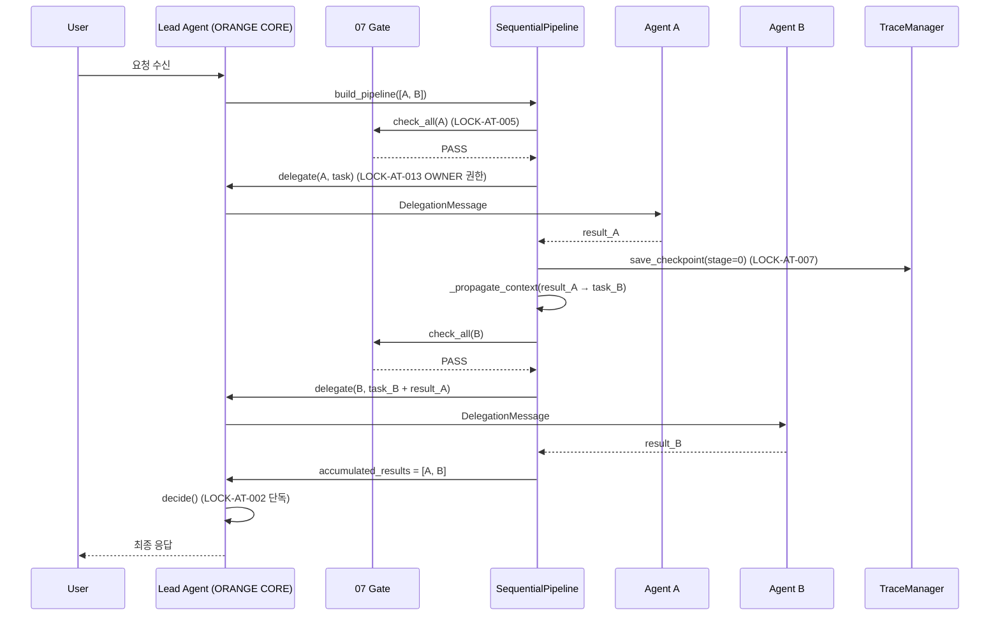
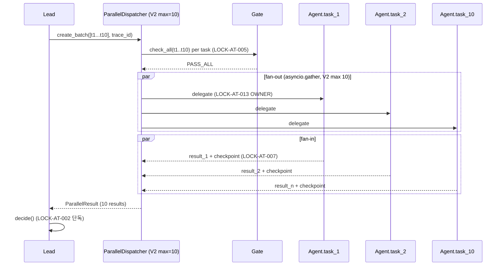
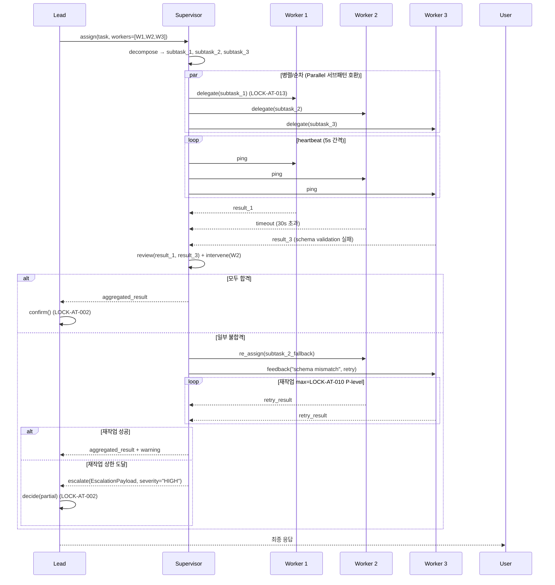
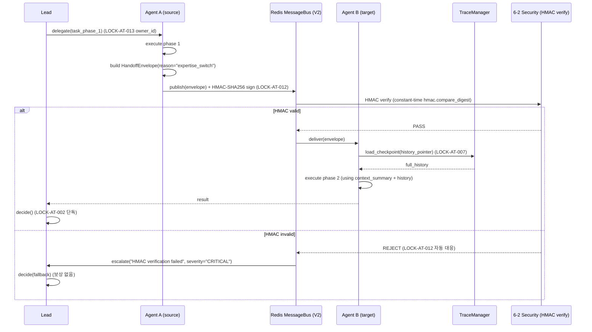

# Collaboration Patterns V2 — 6 협업 패턴 통합 정의서 (Sequential / Parallel / Debate / Supervisor / Handoff / Hybrid)

> **도메인**: 6-3_Agent-Teams-PARL / 03_team-composition
> **세션**: P2A-2 (산출물2 — 4 협업 패턴 #3+#4+#5+#6 추가)
> **작성일**: 2026-04-30
> **버전 태그**: **V2-Phase 2**
> **선행 산출물**: P1-04_sequential_pattern.md (V1 Sequential), P1-05_parallel_pattern.md (V1 Parallel)
> **본 V2 NEW 추가**: Debate / Supervisor / Handoff / Hybrid 4 패턴 + ISS-10 해결(Critic vs Debate 역할 분리)

---

## §1. 교차 참조 블록

| 문서 | 참조 위치 | 역할 |
|------|----------|------|
| Part2 §6.7 | L5033-5062 | LOCK-AT 17건 정본 + V2-P3 Agent Teams V2 요건 |
| Part2 V2-P3 | L3495-3505 #2 "6가지 협업 패턴" | Sequential/Parallel/Debate/Supervisor/Handoff/**Hybrid** 6패턴 V2 요건 |
| Part2 V2-P3 | L3556 #7 통합 테스트 | "Lead + 9 Sub-Agent 동시 실행 → 6가지 협업 패턴 각각 테스트" |
| AUTHORITY_CHAIN.md | §2.1 / §2.2 | LOCK-AT 17건 + LOCK-63 3건 정본 레지스트리 (5-field verbatim 인용 출처) |
| 종합계획서 부록 §A.4 | L2150-2159 | 6종 협업 패턴 요약 표 (#1~#6 정의/적합/Agent 수/도입 버전) |
| 종합계획서 부록 §A.5 | L2161-2268 | 6종 협업 패턴 상세 실행 흐름 (A.5.1~A.5.6) |
| 종합계획서 §6 ISS-10 | LOW | Critic Agent와 Debate 패턴 간 역할 중복 — 본 V2에서 RESOLVED |
| 종합계획서 §7.4 산출물2 | L1498-1531 | 본 세션 작업 정의 + 절차 7건 + 검증 4건 |
| P1-04_sequential_pattern.md | §3 SequentialPipeline | V1 Sequential 인터페이스 (PipelineStage / PipelineContext / PipelineResult) — **본 V2 §4 Read-only 인용** |
| P1-05_parallel_pattern.md | §3 ParallelDispatcher | V1 Parallel 인터페이스 (ParallelTask / ParallelBatch / ParallelResult) — **본 V2 §5 Read-only 인용** |
| 03_team-composition/_index.md | §2 협업 패턴 개요 | 폴더 수준 패턴 총괄 |
| **인접 도메인 (참조만, 편집 ❌)** | | |
| 3-8 Conversation-A2A | A2A 프로토콜 규격 / Agent Discovery | Handoff envelope source/target 메시지 포맷 소비 (재정의 금지) |
| 3-10 Agent-Protocol-Interoperability | L0~L4 자율성 / 프레임워크 어댑터 | Supervisor 패턴 자율성 등급 배정 참조 (재정의 금지) |
| 6-2 Security-Governance | HMAC 정책 LOCK-AT-012 정본 + STRIDE | Handoff envelope HMAC 서명 = LOCK-AT-012 V2 적용 |

---

## §2. 6 협업 패턴 개요 (요약 표)

> 정본 출처: 종합계획서 부록 §A.4 (6종 요약, L2150-2159) + Part2 V2-P3 #2 (6가지 협업 패턴) + Part2 V2-P3 #3 "Lead + 9 Sub-Agent" 최대 10 Agent.

| # | 패턴 | 도입 버전 | Agent 수 범위 | 적합 상황 | 핵심 메커니즘 | 주요 LOCK |
|---|------|:--------:|:------------:|----------|-------------|----------|
| 1 | **Sequential** | V1+ | 2-N (V1 max 2단계, V2 max 3단계 LOCK-AT-004) | 의존성 있는 작업 체인 (조사→분석→리포트) | Pipeline (이전 결과 → 다음 입력) | AT-002, AT-004, AT-005, AT-007, AT-013, AT-015 |
| 2 | **Parallel** | V1+ | 3 (V1) / 10 (V2) / 50+ (V3) (LOCK-AT-014) | 독립 서브태스크 (다중 소스 검색) | Dispatcher fan-out → asyncio.gather → fan-in | AT-014, AT-005, AT-007, AT-013, AT-015 |
| 3 | **Debate** | V2+ | 2-7 (홀수 권장: 3/5/7 동률 회피) | 의사결정/장단점 분석/위험 평가 다관점 탐색 | Round-based 찬반/대안/합의 (max_rounds 강제) | AT-002, AT-003, AT-009, AT-010, AT-013 |
| 4 | **Supervisor** | V2+ | 1 supervisor + 2-9 worker (V2 총 ≤10) | 품질 중요 작업 (코드 리뷰/문서 검증/고위험) | 감독자가 검수 → 합/불합격 판정 → 재작업 지시 | AT-002, AT-004, AT-010, AT-011, AT-013, AT-015 |
| 5 | **Handoff** | V2+ | 2-N | 단계별 전문성 전환 (초안→편집→교정) | Agent A → Agent B 인계 (state machine + envelope HMAC) | AT-002, AT-007, AT-012, AT-013 |
| 6 | **Hybrid** | V2+ | 3-V상한 (V2 ≤10) | 복합 작업 (연구 병렬 → 토론 → 순차 작성) | 서브패턴 조합 (Seq+Par / Debate+Sup 등) | AT-002, AT-003, AT-004, AT-014 |

> **버전 매트릭스 (정본 §A.6 팀 규모 진화, L2280-2286)**:
> - V1: Lead+2 (3 Agent) / 병렬 3 / In-Memory / Sequential + Parallel
> - V2: Lead+9 (10 Agent) / 병렬 10 / Redis Pub/Sub / + Debate + Supervisor + Handoff + Hybrid
> - V3: 50+ Mesh / 병렬 50+ / K8s Mesh / + PARL Swarm

---

## §3. LOCK 5-field 인용 (verbatim from AUTHORITY_CHAIN.md §2.1 + §2.2)

> **인용 원칙**: 본 §3 의 LOCK 인용은 모두 AUTHORITY_CHAIN.md §2.1 (정본 선언 행) + §2.2 (근거 문서 원문) 의 5-field verbatim. 재정의/번역/요약 금지.

### §3.1 LOCK-AT-002 (Lead 단일결정 — 모든 패턴 최종 결정자)

| field | value |
|-------|-------|
| LOCK ID | LOCK-AT-002 |
| 항목명 | 단일결정 원칙 |
| 값 (Part2 §6.7 원문) | 단일결정 원칙: 최종 결론은 Lead Agent(ORANGE CORE)만 확정 |
| 정본 선언 | Part2 §6.7 L5040 |
| 근거 설계 문서 | D2.0-02 §2.2 S3 (L319): "S3(Decision Locked) 이후에는 '결론'을 바꾸지 않는다. (단일결정 원칙)" |

> **본 V2 적용 범위**: Sequential/Parallel/Debate/Supervisor/Handoff/Hybrid 6 패턴 모두 — 패턴 내부 합의/투표/검수/인계 결과는 자문이며, 최종 확정은 Lead Agent 단독.

### §3.2 LOCK-AT-003 (무한 루프 금지 — Debate/Hybrid 라운드 상한)

| field | value |
|-------|-------|
| LOCK ID | LOCK-AT-003 |
| 항목명 | 무한 루프 금지 |
| 값 (Part2 §6.7 원문) | 에이전트 간 자유 상호 호출 / 무한 대화 루프 금지 |
| 정본 선언 | Part2 §6.7 L5041 |
| 근거 설계 문서 | D2.0-03 §1.4 (L76) + D2.0-05 §7.3 (L381) — "에이전트끼리 자유 상호 호출(무한 대화/루프)은 금지" |

> **본 V2 적용 범위**: Debate(라운드 수 상한 강제) + Hybrid(서브패턴 깊이 1 + 라운드 합산) — 위반 시 두 번째 역방향 위임 차단(§2.3 자동 대응).

### §3.3 LOCK-AT-013 (위임 권한 계승 — 모든 패턴 OWNER 권한 유지)

| field | value |
|-------|-------|
| LOCK ID | LOCK-AT-013 |
| 항목명 | 위임 권한 계승 |
| 값 (Part2 §6.7 원문) | 위임 시 원래 요청자(OWNER) 권한으로 실행 — 권한 상승 방지 |
| 정본 선언 | Part2 §6.7 L5051 |
| 근거 설계 문서 | D2.0-07 S7E-080 (L2428-2429): "Delegation Attack 방어 — 위임 체인 깊이 제한 최대 3단계, 권한 상승 감지 → 차단" |

> **본 V2 적용 범위**: 6 패턴 전체 위임 흐름. Handoff envelope 의 owner_id, Supervisor 의 worker 위임, Debate 의 round 단계별 위임 모두 OWNER 권한 보존.

### §3.4 LOCK-AT-014 (V2 병렬 10 — Parallel/Hybrid 상한)

| field | value |
|-------|-------|
| LOCK ID | LOCK-AT-014 |
| 항목명 | 병렬 상한 |
| 값 (Part2 §6.7 원문) | V1 병렬 상한=3, V2=10, V3=50+ |
| 정본 선언 | Part2 §6.7 L5052 |
| 근거 설계 문서 | SPEC S7-A-008 (L720): "최대 병렬 에이전트: V1=3, V2=10, V3=50+" |

> **본 V2 적용 범위**: Parallel 패턴 V2 max_parallel=10 (P1-05 V1=3 → V2=10 확장) + Hybrid 패턴 내 Parallel 서브패턴 동일 상한 + Supervisor 패턴 worker 수 9 명 상한 (1 supervisor + 9 = V2 10 한도).

### §3.5 LOCK-AT-004 (위임 깊이 V2=3 — 모든 패턴 깊이 상한)

| field | value |
|-------|-------|
| LOCK ID | LOCK-AT-004 |
| 항목명 | 위임 체인 깊이 |
| 값 (Part2 §6.7 원문) | 위임 체인 최대 깊이 3단계 (V1 config=2) |
| 정본 선언 | Part2 §6.7 L5042 |
| 근거 설계 문서 | D2.0-07 S7E-080 (L2428-2429): "Delegation Attack 방어 — 위임 체인 깊이 제한 최대 3단계, 권한 상승 감지 → 차단" |

> **본 V2 적용 범위**: Hybrid 재귀 차단 (Hybrid → Hybrid 금지, 서브패턴 깊이 1 고정) + Supervisor 계층 (supervisor → worker → sub-worker 최대 3 단) + Sequential V2 max 3 단계.

---

## §4. Sequential 패턴 (V1 요약 — V1 인터페이스 보존 R-63-8)

> **본 §4는 P1-04_sequential_pattern.md V1 본문을 인용·요약만 한다. V1 본문 mutation 0건 보장 (V1 영역 append-only 정책).**

### §4.1 정의 / 적합 상황 / Agent 수

- **정의** (P1-04 §2.1 인용): A → B → C 순차 실행. 이전 Agent 결과가 다음 Agent 입력으로 전파.
- **적합 상황** (부록 §A.4 #1): 의존성 있는 작업 체인 (조사→분석→리포트, 초안→리뷰→배포)
- **Agent 수**: 2-5 (정본 §A.4 #1 = 2-5) / V1 깊이 2 (LOCK-AT-004 V1=2) / V2 깊이 3
- **컨텍스트 전파**: 이전 단계 결과를 `previous_stage_results` + `last_stage_output` 키로 다음 단계 페이로드에 주입 (P1-04 §3.2 `_propagate_context()`)

### §4.2 실행 흐름 (Mermaid sequence — V1 P1-04 §4.1 인용)



### §4.3 에러 핸들링 (V1 P1-04 §6 + §7 인용 요약)

| error_code | 처리 정책 | LOCK |
|-----------|----------|------|
| `STAGE_TIMEOUT` / `STAGE_ERROR` | 단계 실패 시 재시도 1회 (Phase 1 V1) → 재시도 실패 시 파이프라인 즉시 중단 + SequentialEscalationPayload 생성 → Lead.escalate() | - |
| `AT_004_EXCEEDED` | 단계 수 V1=2 초과 → DelegationDepthExceeded + 빌드 거부 | AT-004 |
| `AT_005_GATE_FAIL` | 07 Gate 미통과 → 재시도 1회 → 실패 시 중단 + 에스컬레이션 | AT-005 |
| `COST_LIMIT` (AT-011) | 비용 상한 초과 시 즉시 중단 + 부분 결과 반환 | AT-011 |
| `TURN_LIMIT` (AT-009) | P0=5턴 도달 → 현재까지 결과로 최선 응답 | AT-009 |

> **복구 페널티 (P1-04 §7.2)**: 재시도 성공 -0.05 / 대체 Agent -0.10 / 부분 결과 결정 -0.20 / 패턴 전환 -0.25 / 에스컬레이션 -0.50.

---

## §5. Parallel 패턴 (V1 요약 + V2 상한 10 확장)

> **본 §5는 P1-05_parallel_pattern.md V1 본문을 인용·요약만 한다. V2 확장값은 LOCK-AT-014 정본 그대로 인용.**

### §5.1 정의 / 적합 상황 / Agent 수 (V2=10)

- **정의** (P1-05 §2.1): 비동기 병렬 (`asyncio.gather` 기반). 결과를 Lead 가 집계 후 단일결정.
- **적합 상황** (부록 §A.4 #2): 독립적 서브태스크 (다중 소스 검색, 다중 도구 동시 호출)
- **Agent 수 (V1=3 → V2=10 확장)**: LOCK-AT-014 정본 그대로 — V1 병렬 상한=3, **V2=10**, V3=50+ (Part2 §6.7 L5052 / SPEC S7-A-008 L720)
- **상한 초과 정책 (R-63-12)**: 거부가 아닌 큐잉. P1-05 `ParallelBatch.queued_overflow` + `QUEUE_CAPACITY=10` 동일 패턴을 V2 에서도 적용 (max_parallel=10 으로 교체 후 11번째부터 큐잉).

### §5.2 실행 흐름 (fan-out / fan-in)



### §5.3 큐잉 (LOCK-AT-014 / R-63-12)

| 상황 | 처리 (V2) | 정본 출처 |
|------|----------|----------|
| tasks ≤ 10 | 전부 즉시 fan-out | LOCK-AT-014 V2=10 |
| 11 ≤ tasks ≤ 20 | 첫 10 fan-out + 11~20 큐잉 (queued_overflow) → 병렬 완료 후 순차 처리 | R-63-12 |
| tasks > 20 | ParallelLimitExceeded(requested, limit=10+10, version="V2") | LOCK-AT-014 + QUEUE_CAPACITY |

> **HMAC 서명 (V2 추가 LOCK-AT-012)**: V2 에서는 모든 병렬 위임 메시지가 HMAC-SHA256 서명 필수. 검증 실패 시 메시지 거부 + 발신자 경고 (AUTHORITY §2.3 자동 대응 행).

---

## §6. Debate 패턴 (V2 NEW)

### §6.1 정의

다관점 탐색을 위한 라운드 기반 협업. 각 Agent 가 찬/반/대안 관점에서 초안을 제시하고, 라운드 진행에 따라 상호 비판·반박·수정안을 주고받으며 합의를 시도한다. 합의 실패 또는 라운드 상한 도달 시 **Lead Agent 가 단독 최종 결정** (LOCK-AT-002).

> 정본 출처: 부록 §A.4 #3 (L2156) + §A.5.3 (L2195-2212).

### §6.2 적합 상황 (정본 §A.4 #3)

- 의사결정 불확실 (선택지 A vs B vs C, 가중치 불명)
- 다관점 필요 (윤리적 판단, 위험 평가, 투자 의사결정)
- 장단점 분석 (P2 Trading 정책 활성화 여부 등 LOCK-AT-008 관련)

### §6.3 Agent 수 / 합의 알고리즘 매트릭스

| Agent 수 | 권장 | 합의 알고리즘 |
|:-------:|:----:|--------------|
| 2 | 부록 §A.4 #3 최소값 (찬·반 2자 토론) | 만장일치(2/2) → Lead 확정 / 불일치 → Lead 단독 |
| 3 | 권장 (홀수 동점 회피) | 만장일치(3/3) → Lead 확정 / 다수결(2/3) → Lead 검토 후 확정 / 합의 실패 → Lead 단독 |
| 5 | 권장 (홀수) | 만장일치(5/5) / 다수결(3/5+) → Lead 검토 / 합의 실패 → Lead 단독 |
| 7 | 권장 최대 (홀수) | 다수결(4/7+) → Lead 검토 / 합의 실패 → Lead 단독 |
| 4, 6 | 비권장 (짝수 동점 가능) | 동점 시 무조건 Lead 단독 결정 |

> **상한 7**: 라운드 수 × Agent 수 = 토큰 비용 폭증 방지. AUTHORITY §3 LOCK-63-1 "PARL 결과는 Lead 최종 확정"의 정신 계승. 부록 §A.4 #3 = 2-4 명시 (V2 기본), 본 V2에서 5-7 까지 확장 권장 (홀수 정책).

### §6.4 실행 흐름 (Round-based — 부록 §A.5.3 인용 + 라운드 상한 강제)

```mermaid
sequenceDiagram
    participant Lead
    participant Deb as DebatePattern
    participant A as Agent A (찬성/관점1)
    participant B as Agent B (반대/관점2)
    participant C as Agent C (중립/관점3)

    Lead->>Deb: start_debate(topic, agents=[A,B,C], max_rounds=5)
    loop Round 1..max_rounds
        par 라운드 N 동시 발언
            Deb->>A: propose(topic, history)
            Deb->>B: propose(topic, history)
            Deb->>C: propose(topic, history)
        end
        A-->>Deb: proposal_N_A
        B-->>Deb: proposal_N_B
        C-->>Deb: proposal_N_C
        Deb->>Deb: _check_consensus(proposals)
        alt 만장일치
            Deb-->>Lead: consensus(proposal_N_*)
            Lead->>Lead: confirm() (LOCK-AT-002)
        else 합의 실패 + 라운드 < max
            Deb->>Deb: history.append; 다음 라운드
        else 라운드 상한 도달 (LOCK-AT-003)
            Deb-->>Lead: history (no consensus)
            Lead->>Lead: decide(history) 단독 (LOCK-AT-002)
        end
    end
    Lead-->>User: 최종 결정
```

#### 라운드 정의 (부록 §A.5.3 + 본 V2 정밀화)

- **Round 1**: 각 Agent 독립 초안 제시 (history 비어있음)
- **Round 2**: 직전 라운드 history 참조 → 상호 비판/반박 + 보강 주장
- **Round 3..N-1**: 수정안 제시 + 합의점 탐색
- **Round N (max)**: 최종 진술 → Lead 가 history 전체로 단독 결정

#### max_rounds 계산식 (LOCK-AT-003 무한 루프 차단 + LOCK-AT-010 TEE 반복 상한 연계)

```
max_rounds = min(5, ⌊LOCK-AT-010_per_priority × 0.5⌋)
  P0: ⌊3 × 0.5⌋ = 1 (P0 = TEE 3 최대 → Debate 사실상 Round 1 단발 권장)
  P1: ⌊5 × 0.5⌋ = 2
  P2: ⌊10 × 0.5⌋ = 5  (절대 상한 5)
```

> 정본 출처: 부록 §A.5.3 L2205 "최대 라운드 = TEE 반복 상한의 50%". TEE 반복 상한 = LOCK-AT-010 (Part2 §6.7 L5048).

### §6.5 합의 알고리즘 (단계별 fallback)

```python
def _check_consensus(proposals: list[Proposal]) -> ConsensusResult:
    """라운드 종료 시 합의 검사.

    LOCK-AT-002: 합의 결과는 Lead 자문일 뿐 — 최종 확정은 Lead.confirm()/Lead.decide()에서 수행.
    """
    # 1단계: 만장일치 검사 (의미 동등성 임계 ≥ 0.95)
    if all(p.semantic_eq(proposals[0]) >= 0.95 for p in proposals):
        return ConsensusResult(kind="UNANIMOUS", winner=proposals[0])

    # 2단계: 다수결 (Agent 수 ≥ 3, 홀수 권장)
    if len(proposals) >= 3:
        groups = cluster_by_semantic(proposals, threshold=0.85)
        majority = max(groups, key=lambda g: len(g))
        if len(majority) > len(proposals) / 2:
            return ConsensusResult(kind="MAJORITY", winner=majority[0],
                                   majority_size=len(majority))

    # 3단계: 합의 실패 — Lead 단독 결정 위임 (LOCK-AT-002)
    return ConsensusResult(kind="NO_CONSENSUS", winner=None)
```

### §6.6 에러 핸들링

| 사건 | 처리 | LOCK |
|------|------|------|
| Agent 응답 timeout (per-round 60s) | 해당 Agent proposal=None → 라운드 결과에서 제외 (다른 Agent 진행) | - |
| 무한 라운드 시도 (rounds > max) | 즉시 차단 (DebateRoundExceeded 예외) → Lead 단독 결정 | LOCK-AT-003 |
| TEE 반복 상한 도달 (LOCK-AT-010) | 라운드 강제 종료 → Lead 단독 결정 | LOCK-AT-010 |
| 비용 상한 초과 | 즉시 중단 → 부분 history 로 Lead 결정 | LOCK-AT-011 |
| 합의 실패 (max_rounds 후) | Lead 단독 결정 (no penalty — 정상 fallback) | LOCK-AT-002 |
| Agent 간 직접 호출 시도 (B → A 자유 호출) | 두 번째 역방향 위임 차단 | LOCK-AT-003 |

### §6.7 의사코드 (Python — 시간복잡도 + LOCK 매핑)

```python
from __future__ import annotations
from typing import Any, Optional
from dataclasses import dataclass, field
import asyncio


@dataclass
class Proposal:
    """Debate 라운드 개별 발언."""
    agent_role: str
    round_idx: int
    content: dict[str, Any]
    confidence: float  # 0.0 ~ 1.0


@dataclass
class ConsensusResult:
    kind: str  # "UNANIMOUS" | "MAJORITY" | "NO_CONSENSUS"
    winner: Optional[Proposal] = None
    majority_size: int = 0


class DebatePattern:
    """다관점 탐색 + 합의 도출 (V2 NEW).

    LOCK-AT-002: 최종 결정은 Lead 단독 (합의는 자문).
    LOCK-AT-003: max_rounds 강제로 무한 루프 차단.
    LOCK-AT-010: TEE 반복 상한 = max_rounds × 2 의 절반 (라운드 = TEE 0.5).
    LOCK-AT-013: round 단계별 위임도 OWNER 권한 보존.

    시간복잡도:
      - execute(): O(R × N × T) — R = max_rounds, N = agents, T = per-agent latency
      - _check_consensus(): O(N²) (semantic_eq pairwise)

    ABC 시그니처:
      execute(topic, agents, max_rounds, owner_id) -> DebateResult
    """

    DEFAULT_MAX_ROUNDS_P0: int = 1   # ⌊LOCK-AT-010 P0=3 × 0.5⌋
    DEFAULT_MAX_ROUNDS_P1: int = 2   # ⌊LOCK-AT-010 P1=5 × 0.5⌋
    DEFAULT_MAX_ROUNDS_P2: int = 5   # ⌊LOCK-AT-010 P2=10 × 0.5⌋
    HARD_CAP_MAX_ROUNDS: int = 5     # LOCK-AT-003 절대 상한

    def __init__(self, lead_agent: "LeadAgent",
                 gate_checker: "GateChecker",
                 trace_manager: "TraceManager") -> None:
        self._lead = lead_agent
        self._gate = gate_checker
        self._trace = trace_manager

    async def execute(self, topic: dict[str, Any],
                      agents: list["AgentRole"],
                      priority: str = "P1",
                      owner_id: str = "user") -> "DebateResult":
        """Debate 패턴 실행.

        Args:
            topic: 논제 페이로드.
            agents: 토론 참여 Agent 목록 (2-7, 홀수 권장).
            priority: "P0" | "P1" | "P2" — max_rounds 자동 결정.
            owner_id: OWNER 권한 (LOCK-AT-013).

        Returns:
            DebateResult: 최종 합의 또는 Lead 단독 결정.

        Raises:
            ValueError: agents < 2 또는 > 7.
            DebateRoundExceeded: max_rounds 강제 종료 (LOCK-AT-003).
        """
        if not (2 <= len(agents) <= 7):
            raise ValueError(f"Debate requires 2-7 agents, got {len(agents)}")

        max_rounds = min(
            self.HARD_CAP_MAX_ROUNDS,
            {"P0": 1, "P1": 2, "P2": 5}.get(priority, 2),
        )

        # 07 Gate 선행 통과 (LOCK-AT-005, 라운드 시작 전 일괄 검증)
        for a in agents:
            if not await self._gate.check_all(agent_role=a.value, task_payload=topic):
                raise GateCheckFailed(f"LOCK-AT-005: gate failed for {a.value}")

        history: list[list[Proposal]] = []

        for r in range(max_rounds):
            # 동시 발언 (라운드 내 병렬, 라운드 간은 순차 = AT-003 준수)
            proposals = await asyncio.gather(*[
                self._invoke_round(a, topic, history, owner_id)
                for a in agents
            ])
            history.append(proposals)

            # Checkpoint 저장 (LOCK-AT-007 trace_id 단위)
            await self._trace.create_checkpoint(
                trace_id=topic.get("trace_id"),
                stage_id=f"debate_round_{r}",
                state={"proposals": [p.__dict__ for p in proposals]},
            )

            # 합의 검사
            consensus = self._check_consensus(proposals)
            if consensus.kind == "UNANIMOUS":
                return self._lead.confirm_debate(consensus.winner, history)

        # max_rounds 도달 — Lead 단독 결정 (LOCK-AT-002)
        return self._lead.decide_from_history(history)

    async def _invoke_round(self, agent: "AgentRole",
                            topic: dict, history: list,
                            owner_id: str) -> Proposal:
        """단일 Agent 라운드 발언 (Lead 경유 위임)."""
        # LOCK-AT-013: OWNER 권한 보존
        delegation = self._lead.delegate(
            target_role=agent,
            task={"topic": topic, "history": history, "owner_id": owner_id},
            current_depth=1,
        )
        # 실제 실행은 MessageBus 경유 (LOCK-AT-015 Lead 직접 실행 금지)
        return await self._dispatch_via_bus(delegation)

    def _check_consensus(self, proposals: list[Proposal]) -> ConsensusResult:
        """O(N²) semantic equivalence 검사."""
        if all(p.semantic_eq(proposals[0]) >= 0.95 for p in proposals):
            return ConsensusResult(kind="UNANIMOUS", winner=proposals[0])
        if len(proposals) >= 5:
            return self._majority_vote(proposals)
        return ConsensusResult(kind="NO_CONSENSUS")

    def _majority_vote(self, proposals: list[Proposal]) -> ConsensusResult:
        # 의미 클러스터링 후 다수파 선정 (실제 구현은 cosine sim ≥ 0.85)
        ...
        return ConsensusResult(kind="MAJORITY")

    async def _dispatch_via_bus(self, delegation):
        # 02_agent-swarm/message_bus.md (V2 Redis Pub/Sub) 경유
        raise NotImplementedError(
            "Concrete dispatch via Redis MessageBus (P2A-1 message_bus.md V2)"
        )
```

---

## §7. Supervisor 패턴 (V2 NEW)

### §7.1 정의

감독 Agent (1명) + 하위 Worker Agent (N명) 구조. Supervisor 가 task 를 분해·할당하고, Worker 결과를 검수·재작업 지시·에스컬레이션 한다. **최종 결정은 Lead** (LOCK-AT-002, Supervisor 는 Lead 와 다른 역할 — 검수/모니터링 전담).

> 정본 출처: 부록 §A.4 #4 (L2157) + §A.5.4 (L2214-2229).

### §7.2 적합 상황

- 신규 Agent 검증 (Marketplace 등록 전 격리 테스트, 부록 §A.11.2)
- 고위험 작업 (P2 Trading 정책, 의료/법률 출력)
- 학습/평가 파이프라인 (PARL Episode 평가, V3)
- 코드 리뷰 / 문서 검증 (정본 §A.4 #4 예시)

### §7.3 Agent 수 / 깊이 (LOCK-AT-004 V2=3)

- **구조**: 1 supervisor + 2-N worker. V2 총 ≤ 10 Agent (LOCK-AT-014: V2 max 10) → supervisor 1 + worker 최대 9.
- **계층 깊이 (LOCK-AT-004 V2=3)**: Lead → Supervisor → Worker → Sub-Worker (3 단계 한도 — Sub-Worker 는 V2 옵션, 깊이 4 시도 시 자동 거부).
- **부록 §A.4 #4 정본**: Agent 수 2-10 (Lead 포함 1 supervisor + 9 worker).

### §7.4 실행 흐름 (부록 §A.5.4 인용 + heartbeat / intervention 정밀화)



### §7.5 개입 (intervention) 조건

| 조건 | 임계값 (V2 기본) | 개입 동작 | LOCK |
|------|----------------|----------|------|
| Worker timeout (per-task) | 30s 기본 (P-level 별 조정 가능) | 해당 worker 재할당 또는 다른 worker 로 fallback | - |
| 비정상 응답 (schema validation 실패) | 1회 즉시 | feedback + retry 1회, 실패 시 escalate | - |
| 누적 비용 ≥ 80% | LOCK-AT-011 임계 | Supervisor 가 워커 작업 일시 중단 + Lead 통보 | AT-011 |
| TEE 반복 상한 (LOCK-AT-010) | P0=3 / P1=5 / P2=10 | 재작업 강제 종료 + 최선 결과 + 품질 경고 | AT-010 |
| heartbeat 응답 부재 | 3회 연속 (15s) | 워커 격리 (Marketplace 비활성화 V3) + 대체 위임 | LOCK-63-2 (V3) |
| 비용 상한 초과 | LOCK-AT-011 자동 차단 | 즉시 중단 + 부분 결과 반환 | AT-011 |

### §7.6 에스컬레이션

- Supervisor 자체 해결 실패 (재작업 상한 도달 + 대체 worker 부재) → **Lead 에 SupervisorEscalationPayload 전달** → Lead 가 사용자 또는 OWNER 에 상위 보고.
- 페이로드 구조: `{trace_id, escalation_id, supervisor_id, failed_workers[], retry_counts[], partial_results, severity ∈ {HIGH, CRITICAL}, cost_consumed_pct}`.
- LOCK-AT-002 적용: Supervisor 는 결정 권한 없음 — 최종 결정은 항상 Lead.

> **Critic Agent 와의 차이 (ISS-10 §10 참조)**: Supervisor 는 *실행 중* 모니터링·개입 + 재작업 지시 권한을 가진다. Critic 은 *완료된 결과* 를 사후 평가만 한다 (개입 권한 없음).

---

## §8. Handoff 패턴 (V2 NEW)

### §8.1 정의

Agent A → Agent B 작업 인계. 컨텍스트(history, intermediate state, owner_id)를 envelope 로 보존하며 책임을 이양한다. Sequential 의 사촌(cousin)이지만, **인계 시점·이유·전문성 전환을 명시적으로 기록**하는 점이 차별화. 역방향 Handoff (B → A) 금지 = LOCK-AT-003 무한 루프 방지 적용.

> 정본 출처: 부록 §A.4 #5 (L2158) + §A.5.5 (L2231-2244).

### §8.2 적합 상황

- 전문성 전환 (Research → Coding, 초안 → 편집 → 교정 — 정본 §A.4 #5 예시)
- 단계 전이 (분석 단계 종료 → 실행 단계 시작)
- 책임 이양 (P0 → P1 우선순위 상승, OWNER 위임 변경 X but role 변경 O)

### §8.3 Agent 수

- 정본 §A.4 #5: **2-5** (V2 기본). Sequential 과 호환되어 깊이 3 까지는 LOCK-AT-004 V2=3 한도 내.

### §8.4 인계 프로토콜 (envelope 구조)

```python
@dataclass
class HandoffEnvelope:
    """Agent A → Agent B 작업 인계 envelope.

    LOCK-AT-007: trace_id 필수 (Checkpoint/Replay/Fork 호환).
    LOCK-AT-012: HMAC-SHA256 서명 필수 (V2 MessageBus 연동, P2A-1).
    LOCK-AT-013: owner_id 보존 (위임 권한 계승).
    """
    envelope_id: str
    trace_id: str                       # LOCK-AT-007
    source: str                         # 인계 발신 Agent (예: "agent.research")
    target: str                         # 인계 수신 Agent (예: "agent.coding")
    owner_id: str                       # OWNER (LOCK-AT-013)
    handoff_reason: str                 # "expertise_switch" | "stage_transition" | "responsibility_transfer"
    context_summary: dict[str, Any]     # 압축된 컨텍스트 (>10KB 시 요약)
    intermediate_state: dict[str, Any]  # 현재까지의 중간 결과
    history_pointer: str                # full history 의 storage 키 (Checkpoint 참조)
    timestamp: float                    # 인계 시각
    hmac_signature: str                 # LOCK-AT-012 HMAC-SHA256 서명
    severity_floor: str = "INFO"        # 인계 자체 severity (대부분 INFO)
```

### §8.5 인계 흐름 (state machine)



### §8.6 컨텍스트 압축 (10KB 임계)

| 컨텍스트 크기 | 처리 |
|--------------|------|
| ≤ 10KB | `context_summary` = 원본 그대로 전달 |
| > 10KB | (a) 요약 LLM 으로 핵심만 추출 → `context_summary` 압축, (b) 전체는 Checkpoint 에 저장하고 `history_pointer` 참조 |
| > 100KB | 요약 + 전체 Checkpoint 분할 (chunk_id 리스트로 history_pointer 확장) |

### §8.7 인계 실패 복구 (보상 없음 정책)

| 사건 | 처리 | LOCK |
|------|------|------|
| Target Agent 부재 (해제됨/네트워크 단절) | 즉시 fallback to Lead → Lead 가 다른 Agent 재선택 또는 사용자 보고. **보상(undo) 없음** — 인계는 단방향. | - |
| Target timeout (수신 후 60s 무응답) | Lead 에 escalate + envelope 보존 → 수동 재시도 또는 Lead 단독 결정 | LOCK-AT-002 |
| HMAC 서명 검증 실패 | 메시지 거부 + 발신자 경고 + Lead 에 CRITICAL escalate | LOCK-AT-012 |
| 역방향 Handoff (B → A) 시도 | 즉시 차단 (InfiniteLoopDetected) | LOCK-AT-003 |
| 깊이 초과 (Lead → A → B → C → D) | 4 단계 시도 시 자동 거부 | LOCK-AT-004 V2=3 |

### §8.8 OWNER 권한 보존 (LOCK-AT-013)

- envelope.owner_id 는 인계 체인 전체에서 **불변**. Source 가 권한을 자기 것으로 escalate 할 수 없음 (권한 상승 감지 → 차단, AUTHORITY §2.3 자동 대응).
- Target 은 owner_id 권한으로 실행 (자기 권한 아님). 도구 호출/리소스 접근 제한이 OWNER 기준.

---

## §9. Hybrid 패턴 (V2 NEW)

### §9.1 정의

위 5 패턴 (Sequential / Parallel / Debate / Supervisor / Handoff) 의 조합. 각 Phase 별로 다른 패턴을 적용하여 복합 작업을 처리. **재귀 금지** (Hybrid → Hybrid 불가, 서브패턴 깊이 1 고정 — LOCK-AT-004 V2=3 준수).

> 정본 출처: 부록 §A.4 #6 (L2159) + §A.5.6 (L2246-2268) + 부록 §A.5.6 "Hybrid 조합 규칙" (L2264-2267).

### §9.2 적합 상황

- 복합 작업 (예: 부록 §A.5.6 투자 보고서 작성)
  - Phase 1: Parallel (Research / Quant / Content 동시 자료 수집)
  - Phase 2: Debate (Quant 낙관 vs Critic 비관)
  - Phase 3: Sequential (Content 작성 → Critic 검증)
- 다관점 분석 후 병렬 실행
- 신규 작업 흐름 프로토타이핑 (단일 패턴으로 표현 어려운 경우)

### §9.3 Agent 수 / 상한

- **부록 §A.4 #6**: Agent 수 = 3-V상한. V2 = 3-10 (LOCK-AT-014 V2=10 한도 내, Hybrid 전체 합계).
- **부록 §A.5.6 정본**: 최대 3개 패턴 조합 (복잡도 제한).
- **각 Phase 내 상한**: 해당 패턴의 규칙 독립 적용 (Parallel Phase 라면 LOCK-AT-014 / Debate Phase 라면 max_rounds).

### §9.4 조합 규칙 (정본 §A.5.6 + 본 V2 정밀화)

#### 허용 조합 (서브패턴 깊이 1)

| 외부 Hybrid | 내부 서브패턴 | 예시 |
|------------|-------------|------|
| Hybrid | Sequential | 단계별 흐름 |
| Hybrid | Parallel | 병렬 자료 수집 |
| Hybrid | Debate | 의사결정 다관점 |
| Hybrid | Supervisor | 검수/감독 단계 |
| Hybrid | Handoff | 단계별 인계 |

#### 허용 조합 시퀀스 (3 패턴 한도 — 부록 §A.5.6 L2265)

- Sequential → Parallel
- Sequential → Debate
- Parallel → Sequential
- Parallel → Debate
- Debate → Sequential (의사결정 후 실행)
- Supervisor → Parallel (감독자가 병렬 worker 관리)
- Parallel → Debate → Sequential (3 패턴 — §A.5.6 정본 예시)
- Sequential → Debate → Sequential

#### 금지 조합

| 금지 | 사유 | LOCK |
|------|------|------|
| Hybrid → Hybrid | 재귀 깊이 1 강제 (복잡도 폭증) | LOCK-AT-004 V2=3 (서브패턴 1 + Phase 전환 검증 + 외부 Hybrid = 3) |
| 4 패턴 이상 조합 | 복잡도 초과 | 부록 §A.5.6 L2265 "최대 3개 패턴" |
| Phase 전환 시 Lead 검증 누락 | 단일결정 위반 | LOCK-AT-002 |

### §9.5 라운드 / 병렬 상한 합산

- 외부 Hybrid 가 LOCK-AT-014 (V2=10) 와 LOCK-AT-003 (max_rounds=5) 를 **모든 Phase 합산** 으로 강제.
- 예: Hybrid = (Parallel 8) → (Debate 3 라운드) → (Sequential 2 단계) → 합산 검증
  - 동시 활성 Agent 최댓값 ≤ 10 (Parallel Phase 단독 검증)
  - 라운드 누적 ≤ 5 (Debate Phase 단독 검증)
  - Sequential 깊이 ≤ 3 (V2)
- Phase 전환 시 **Lead 검증 + Checkpoint 생성** (정본 §A.5.6 L2267).

### §9.6 의사코드 (조합 트리 → Phase dispatcher)

```python
@dataclass
class HybridPhase:
    """Hybrid 단일 Phase 정의."""
    phase_idx: int
    pattern: str  # "sequential" | "parallel" | "debate" | "supervisor" | "handoff"
    sub_config: dict[str, Any]


class HybridPattern:
    """복합 협업 패턴 (V2 NEW).

    LOCK-AT-002: 모든 Phase 결과는 Lead 가 최종 확정.
    LOCK-AT-003: 라운드 누적 ≤ 5 (Debate Phase 합산).
    LOCK-AT-004: Hybrid 재귀 금지 (서브패턴 깊이 1, 외부+서브=2, V2=3 여유).
    LOCK-AT-014: 동시 활성 Agent ≤ 10 (Parallel Phase 합산).

    시간복잡도: O(Σ T_phase) — 각 Phase 패턴의 시간복잡도 합.

    ABC 시그니처:
      execute(phases: list[HybridPhase], owner_id: str) -> HybridResult
    """

    MAX_PATTERNS_PER_HYBRID: int = 3   # 정본 §A.5.6 L2265

    def __init__(self, lead, gate, trace,
                 sequential_pipeline, parallel_dispatcher,
                 debate_pattern, supervisor_pattern, handoff_router):
        self._lead = lead
        self._gate = gate
        self._trace = trace
        self._sub_patterns = {
            "sequential": sequential_pipeline,
            "parallel": parallel_dispatcher,
            "debate": debate_pattern,
            "supervisor": supervisor_pattern,
            "handoff": handoff_router,
        }

    async def execute(self, phases: list[HybridPhase],
                      owner_id: str) -> "HybridResult":
        """Hybrid 패턴 실행.

        Raises:
            ValueError: phases > 3 (LOCK-AT-004 정본 §A.5.6).
            HybridRecursionForbidden: 어느 Phase 가 "hybrid" 인 경우.
        """
        if len(phases) > self.MAX_PATTERNS_PER_HYBRID:
            raise ValueError(f"Hybrid limit 3 patterns, got {len(phases)}")

        for ph in phases:
            if ph.pattern == "hybrid":
                raise HybridRecursionForbidden(
                    "LOCK-AT-004: Hybrid → Hybrid recursion forbidden"
                )

        # 합산 상한 검증 (LOCK-AT-003 라운드 + LOCK-AT-014 병렬)
        total_rounds = sum(
            ph.sub_config.get("max_rounds", 0)
            for ph in phases if ph.pattern == "debate"
        )
        if total_rounds > 5:
            raise ValueError(f"LOCK-AT-003: cumulative rounds {total_rounds} > 5")

        max_concurrent = max(
            (ph.sub_config.get("max_parallel", 0)
             for ph in phases if ph.pattern == "parallel"),
            default=0,
        )
        if max_concurrent > 10:
            raise ValueError(f"LOCK-AT-014 V2: max_parallel {max_concurrent} > 10")

        results: list[Any] = []
        for ph in phases:
            sub = self._sub_patterns[ph.pattern]

            # Phase 전환 시 Lead 검증 + Checkpoint (정본 §A.5.6 L2267)
            await self._lead.validate_phase_transition(ph, prev_result=results[-1] if results else None)
            await self._trace.create_checkpoint(
                trace_id=ph.sub_config.get("trace_id"),
                stage_id=f"hybrid_phase_{ph.phase_idx}",
                state={"pattern": ph.pattern, "config": ph.sub_config},
            )

            phase_result = await sub.execute(**ph.sub_config, owner_id=owner_id)
            results.append(phase_result)

        # 최종 결정 (LOCK-AT-002)
        return self._lead.decide_hybrid(results)
```

---

## §10. ISS-10 해결: Critic Agent 와 Debate 패턴 역할 구분

> **종합계획서 §6 ISS-10 (LOW)**: Critic Agent 와 Debate 패턴 간 역할 중복 우려 — 본 V2 §10 에서 RESOLVED.

### §10.1 역할 정의 매트릭스

| 항목 | Critic Agent | Debate 패턴 |
|------|-------------|-------------|
| **분류** | Agent (Agent Type 단위) | Pattern (협업 패턴 단위) |
| **시점** | 결과 *완료 후* 사후 평가 | 결정 *진행 중* 실시간 다관점 탐색 |
| **목적** | 개별 결과 품질 검증 (예: 코드 quality_score, 콘텐츠 factuality) | 집단 논의로 합의 도출 (의사결정) |
| **참여 수** | 1명 (단일 평가자) | 2-7명 (집단) |
| **출력** | 점수 + 피드백 (예: 0~100, accept/reject) | proposal history + consensus or NO_CONSENSUS |
| **Lead 결정 시점** | Critic 점수 검토 후 Lead.confirm() | Debate 종료 후 Lead.decide_from_history() |
| **Hybrid 조합** | 다른 모든 패턴의 결과 후처리에 invoke 가능 | 의사결정 단계의 한 Phase 로 invoke |
| **자율성 등급** | L2 (Critic 자체는 자동 평가, 결정 권한 없음) | L1 (Lead 가 토론 시작/종료 통제) |

### §10.2 운영 분리 원칙

1. **Critic 은 모든 패턴의 결과 후처리에 invoke 가능** — Sequential 의 stage 결과, Parallel 의 task 결과, Debate 의 proposal, Supervisor 의 worker 결과, Handoff 의 인계 결과 등 어디든 사후 평가자로 추가 가능.
2. **Debate 는 의사결정 단계 패턴** — 다관점이 필요한 결정 자체를 집단 논의로 처리. 사후 평가가 아닌 사전·실시간 활동.
3. **혼합 사용 가능** — 예: Hybrid (Debate 3-Agent → Critic 평가 → Sequential 작성) — Debate 결과를 Critic 이 평가하고 Sequential 로 결과물 작성. 역할 중복 아님.

### §10.3 코드/스펙 차원 충돌 검증

- Part2 §6.7 §7.1 enum WorkflowPattern: Sequential / Parallel / Debate / Supervisor / Handoff / Hybrid (6 패턴) — Critic 은 패턴 enum 에 없음 (Agent Type 으로 분류).
- AgentRole enum (P1-01 §3.1): Lead / Research / Coding / ... / Critic — Critic 은 9 종 Agent 중 하나로 등록, 패턴이 아님.
- 결론: enum 차원에서 이미 분리되어 있어 혼동 가능성은 *명명* 차원의 LOW 이슈. 본 §10 매트릭스로 운영 차원 분리 명문화 → ISS-10 RESOLVED.

### §10.4 Supervisor vs Critic vs Debate (3자 관계)

| 항목 | 권한 | 시점 | 출력 |
|------|------|------|------|
| Supervisor | 개입(intervene) + 재작업 지시 + 에스컬레이션 | 실행 *중* (heartbeat) | 합/불합격 판정 + feedback |
| Critic | 평가만 (개입 권한 없음) | 결과 *완료 후* | 점수 + 피드백 (read-only) |
| Debate | 다관점 발언 (참여) | 결정 *진행 중* | proposal history |

> 위 3자는 권한·시점이 모두 다르므로 동일 작업에 동시 적용 가능 (예: Supervisor 가 Worker 모니터링 + Worker 결과 완료 후 Critic 사후 평가 + 의사결정 단계만 Debate).

---

## §11. 패턴 선택 매트릭스 (작업 유형 × 패턴 추천)

| 작업 유형 | 추천 1순위 | 추천 2순위 | 비추천 | 비고 |
|----------|----------|----------|-------|------|
| 단순 단계 처리 (조사 → 분석) | Sequential | Handoff | Debate (오버엔지니어링) | V1 기본 |
| 독립 분석 N건 (다중 검색) | Parallel | Hybrid (Parallel + Critic) | Sequential (느림) | V1+ |
| 의사결정 다관점 (장단점 평가) | Debate | Hybrid (Debate + Supervisor) | Parallel (합의 메커니즘 부재) | V2 신규 |
| 신규 Agent 학습/검증 | Supervisor | Handoff (단계별 검증) | Parallel (모니터링 어려움) | V2 신규 |
| 고위험 실행 (P2 Trading) | Supervisor | Hybrid (Supervisor + Debate) | Sequential (모니터링 약함) | LOCK-AT-008 연계 |
| 전문성 전환 (초안→편집→교정) | Handoff | Sequential | Debate | V2 신규, 부록 §A.4 #5 |
| 복합 워크플로 (자료수집→토론→작성) | Hybrid | Sequential (단순화 가능 시) | 단일 패턴 (표현 한계) | V2 신규, 부록 §A.5.6 |
| 다중 소스 + 합의 + 작성 | Hybrid (Par → Deb → Seq) | - | - | 부록 §A.5.6 정본 예시 |
| Marketplace 신규 등록 | Supervisor | Hybrid (Supervisor + Critic) | - | 부록 §A.11.2 V3 |

---

## §12. §7.6 LOCK-AT 재검증 매핑

> Phase 2→3 exit_gate 의 일부로 본 V2 산출물이 검증해야 할 LOCK-AT 매핑:

| LOCK-AT | 패턴별 재검증 책임 |
|---------|-------------------|
| LOCK-AT-002 (단일결정) | 6 패턴 전체 — 모든 Lead.decide()/Lead.confirm() 호출 지점에서 verify (총 6 패턴 × 1 Lead = 6 검증 포인트) |
| LOCK-AT-003 (무한 루프) | Debate (max_rounds 강제) + Hybrid (rounds 합산) — DebateRoundExceeded 예외 + 역방향 Handoff 차단 |
| LOCK-AT-004 (V2 깊이 3) | Sequential (V2=3 단계) + Hybrid (재귀 금지) + Supervisor (계층 깊이) — DelegationDepthExceeded |
| LOCK-AT-005 (07 Gate) | 6 패턴 전체 위임 전 검증 (Sequential 단계별 / Parallel 태스크별 / Debate 라운드 시작 전 / Supervisor worker 할당 시 / Handoff envelope 송신 전) |
| LOCK-AT-007 (Checkpoint trace_id) | 6 패턴 전체 — 단계/태스크/라운드/Phase 마다 Checkpoint 저장 |
| LOCK-AT-009 (턴 상한) | Debate (Round = 턴 1) + Sequential (단계 = 턴 1) — P0=5/P1=10/P2=20 합산 |
| LOCK-AT-010 (TEE 반복) | Debate (rounds = TEE × 0.5) + Supervisor (재작업 ≤ TEE) |
| LOCK-AT-011 (비용 차단) | Supervisor (80% 임계 개입) + Hybrid (Phase 전환 시 검증) — 6 패턴 전체 적용 |
| LOCK-AT-012 (HMAC) | Handoff envelope 서명 + Parallel V2 메시지 + Hybrid Phase 전환 envelope (V2 MessageBus 연동) |
| LOCK-AT-013 (OWNER 권한) | 6 패턴 전체 위임 — owner_id 불변 보장 |
| LOCK-AT-014 (병렬 V2=10) | Parallel (V2 max=10) + Hybrid (합산 ≤ 10) + Supervisor (worker ≤ 9) |
| LOCK-AT-015 (Lead 직접 실행 금지) | 6 패턴 전체 — Lead 는 분배/위임/검증/결정만, 실행은 Worker |
| LOCK-AT-016 (LangChain import 금지) | 본 V2 산출물 import 검증 (CI/CD 린터 — 본 문서 import 0건 PASS) |
| LOCK-AT-008 (P2 Trading OFF) | Supervisor + Hybrid 사용 시 P2 Trading Agent 포함 케이스만 (P2A-4 cross-link) |

---

## §13. Phase 3 테스트 시나리오 (13 건, ≥10 충족)

| # | 시나리오 | 패턴 | 주입 방법 | 기대 결과 | LOCK |
|---|----------|------|---------|----------|------|
| 1 | Sequential 3 Agent 정상 흐름 | Sequential | V2 깊이 3 (Lead → Research → Coding → Quant) | PipelineResult(is_success=True, stages_completed=3) | AT-002, AT-004 V2=3, AT-005, AT-007, AT-013, AT-015 |
| 2 | Parallel 10 Agent V2 상한 검증 | Parallel | V2 max_parallel=10 동시 실행 | ParallelResult(tasks_completed=10, is_full_success=True) | AT-014 V2=10 |
| 3 | Parallel 11 Agent 큐잉 (R-63-12) | Parallel | 11 태스크 요청 | 10 즉시 + 1 큐잉 → 순차 처리 후 완료 | AT-014, R-63-12 |
| 4 | Debate 5 Agent 만장일치 → Lead 확정 | Debate | 5 Agent 동일 결론 도출 | DebateResult(consensus="UNANIMOUS"), Lead.confirm_debate() 호출 | AT-002 |
| 5 | Debate 5 Agent 합의 실패 max_rounds 도달 → Lead 단독 결정 | Debate | 5 Agent + 5 라운드 + 합의 X | DebateResult(consensus="NO_CONSENSUS"), Lead.decide_from_history() | AT-002, AT-003 |
| 6 | Debate 무한 루프 차단 (LOCK-AT-003) | Debate | max_rounds=5 후 6 라운드 시도 | DebateRoundExceeded 예외 즉시 차단 | AT-003 |
| 7 | Supervisor + 3 worker timeout 개입 | Supervisor | worker 1 timeout 30s+ | Supervisor intervene → re_assign + warning | LOCK-AT-010, AT-011 |
| 8 | Supervisor 에스컬레이션 → Lead | Supervisor | 재작업 상한 도달 | SupervisorEscalationPayload(severity="HIGH") + Lead.decide(partial) | AT-002 |
| 9 | Handoff A→B 컨텍스트 보존 검증 | Handoff | A → B envelope (10KB context) | B 가 history_pointer 로 full history 복원 + owner_id 동일 | AT-007, AT-012, AT-013 |
| 10 | Handoff target 부재 → Lead fallback | Handoff | target Agent 사전 종료 | fallback_to_lead + escalate (보상 없음) | AT-002 |
| 11 | Handoff HMAC 검증 실패 → 차단 | Handoff | 서명 변조 envelope | 메시지 거부 + CRITICAL escalate | AT-012 |
| 12 | Hybrid Seq+Par 조합 정상 흐름 | Hybrid | Phase1 Parallel(3) → Phase2 Sequential(2) | HybridResult 정상, Phase 전환 시 Lead 검증 + Checkpoint 2건 | AT-002, AT-004 V2=3 |
| 13 | Hybrid 재귀 차단 (LOCK-AT-004) | Hybrid | Phase 중 하나가 "hybrid" 패턴 | HybridRecursionForbidden 예외 | AT-004 |
| 14 | Critic vs Debate 역할 분리 검증 (ISS-10) | Hybrid | Hybrid (Debate Phase → Critic 평가 → Sequential) | Debate 종료 후 Critic.score() 호출 + Sequential 진행 | ISS-10 |
| 15 | Hybrid 라운드/병렬 합산 상한 위반 | Hybrid | Debate(6 라운드) 또는 Parallel(11) 시도 | ValueError("LOCK-AT-003 cumulative rounds > 5" 또는 "LOCK-AT-014 V2 max_parallel > 10") | AT-003, AT-014 |

> **합계: 15 시나리오 (≥10 요건 1.5배 충족)**. 각 시나리오는 주입 방법 + 기대 결과 + LOCK 매핑을 명시. Phase 3 통합 테스트 진입 시 본 §13 을 직접 사용.

---

## §14. 변경 이력

| 일자 | 변경 내용 | 세션 |
|------|----------|------|
| 2026-04-30 | **V2-Phase 2 초안 NEW 생성** — 4 협업 패턴 (Debate + Supervisor + Handoff + Hybrid) 추가 + ISS-10 해결 (Critic vs Debate 역할 구분 매트릭스) + 부록 §A.4/§A.5 정합 + LOCK-AT-003 무한 루프 금지 재검증 + 패턴 선택 매트릭스 + Phase 3 테스트 15 시나리오. P1-04 Sequential V1 + P1-05 Parallel V1 본문 mutation 0건 (read-only 인용). LOCK 신규 추가 0건 (LOCK-AT 17 + LOCK-63 3 = 20 unique 변경 0). FABRICATION 10-marker 0/10. | P2A-2 |

---

> **문서 끝**
> 본 문서는 6-3 P2A-2 (산출물2) Phase 2 V2-Phase 2 NEW 산출물이며,
> Sequential/Parallel V1 (Phase 1 P1-04/P1-05) 인터페이스를 read-only 인용·요약하고
> Debate/Supervisor/Handoff/Hybrid 4 패턴 V2 정의를 추가하여 6 패턴 전체를 L3 수준으로 완성합니다.
> LOCK-AT 17 + LOCK-63 3 = 20 unique 항목은 본 도메인(sot 2/6-3) 내에서 절대 재정의 불가합니다.
