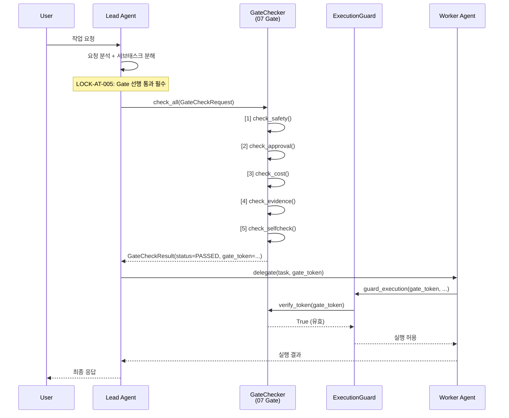
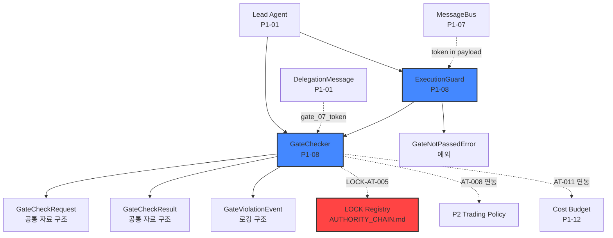

# P1-08. 07 Gate 선행 통과 통합

> **도메인**: 6-3_Agent-Teams-PARL / 04_autonomy-levels
> **세션**: P1-8
> **작성일**: 2026-04-12
> **대조 기준**: D2.0-07 §Gate_Protocol, LOCK-AT-005(07 Gate 필수)
> **이슈 반영**: ISS-2 (3-8/3-10 경계 미확정 → 04_autonomy-levels 내 명시적 매핑으로 해소)

---

## 1. 교차 참조 블록

| 문서 | 참조 위치 | 역할 |
|------|----------|------|
| D2.0-07 Safety/Cost/Approval | §5 PolicyCheck 5-Gate, §Gate_Protocol | 07 Gate 정책 정의 정본 |
| D2.0-05 Agent Workflow | §7.3 고정1 (L371-372) | Gate 선행 통과 필수 근거 정본 |
| Part2 §6.7 | L5043 (LOCK-AT-005) | LOCK 값 선언 정본 |
| RULE 1.3 | §3.1 (외부 서비스), §3.3 (P2 활성화), §5 (비용), §7.3 (민감정보) | Gate 호출 4대 트리거 근거 |
| AUTHORITY_CHAIN.md | §2.1 레지스트리 AT-005 행 | LOCK-AT 레지스트리 정본 |
| 04_autonomy-levels/_index.md | §4.1 07 Gate 선행 통과 | 폴더 수준 Gate 개요 |
| **인접 도메인** | | |
| 3-8 Conversation-A2A | A2A 프로토콜 규격 | Agent 메시지 포맷 소비 (재정의 금지, R-63-10) |
| 3-10 Agent-Protocol | L0-L4 자율성 정의 정본 | 자율성 레벨 참조만 (재정의 금지, R-63-11) |
| 6-2 Security-Governance | 보안 정책, STRIDE 위협 모델, HMAC 정책 | 보안 체크리스트 우선 적용 (§9.3) |

---

## 2. LOCK 값 인용

> LOCK-AT-005 (Part2 §6.7 L5043 / D2.0-05 §7.3 고정1 L371-372):
> "모든 에이전트 실행은 07 Gate 선행 통과 필수"

> LOCK-AT-005 정본 근거 (D2.0-05 §7.3 고정1):
> "어떤 실행 엔진을 쓰더라도 Execute 단계(도구/노드 실행) 전에 07의 PolicyCheck/Approval/Cost 게이트 결과가 선행 입력으로 확정되어야 한다."

### 2.1 출처 교차 검증 주의

> **AUTHORITY_CHAIN.md §3 XREF 참조**: LOCK-AT-005의 §3.5(종합계획서)는 D2.0-07을 보조 출처로 가리키나, 실제 직접 근거는 D2.0-05 §7.3 고정1이다. D2.0-07은 Gate 정책 정의 문서로서 간접 관련이며, LOCK 선언 근거는 D2.0-05가 정본이다.

---

## 3. 07 Gate 정책 구조 (D2.0-07 §5)

### 3.1 PolicyCheck 5-Gate 체계

D2.0-07 §5에서 정의하는 5-Gate 순차 통과 체계:

```
요청 수신
  → [1] PolicyGate     — 정책 적합성 검증 (RULE 1.3 §3.1 외부 서비스 정책)
  → [2] ApprovalGate   — 승인 수준 확인 (사용자 명시적 승인 필요 여부)
  → [3] CostGate       — 비용 상한 확인 (RULE 1.3 §5 비용 관리)
  → [4] EvidenceGate   — 근거 자료 존재 확인
  → [5] SelfCheckGate  — 자가 진단 통과 확인
  → 응답 전달 (모든 Gate 통과 시)
```

### 3.2 Gate 호출 트리거 4대 조건 (D2.0-07 §5.1)

| # | 트리거 | 근거 | 설명 |
|---|--------|------|------|
| (a) | 외부 서비스/API 호출 직전 | RULE 1.3 §3.1 | 외부 서비스 접근 시 정책 검증 |
| (b) | P2 활성화/실행 직전 | RULE 1.3 §3.3 | 위험 도메인 활성화 승인 확인 |
| (c) | 저장/인덱싱 직전 | RULE 1.3 §7.3 | 민감정보 필터링 |
| (d) | 비용 상한 체크 | RULE 1.3 §5 | 비용 초과 시 자동 차단 |

### 3.3 Gate 통과 3대 조건 (Safety / Cost / Approval)

에이전트 실행 전 반드시 확인해야 하는 3가지 조건:

| # | 조건 | 검증 내용 | 실패 시 |
|---|------|----------|--------|
| 1 | **Safety** | 정책 위반 없음, 위험 행동 미포함, STRIDE 위협 해당 없음 | `GATE_SAFETY_DENIED` 반환 |
| 2 | **Cost** | 예상 비용이 잔여 예산 이내, 임계값(80%) 미만 시 경고 | `GATE_COST_DENIED` 반환 |
| 3 | **Approval** | 필요한 승인 수준 충족 (L0=없음, L1=추천, L2+=사용자 승인) | `GATE_APPROVAL_DENIED` 반환 |

---

## 4. GateChecker 클래스 스켈레톤

### 4.1 공통 자료 구조 (§7 공통 자료 구조 선정의)

```python
from __future__ import annotations
from typing import Any, Optional
from dataclasses import dataclass, field
from enum import Enum
import uuid
import time


# ---------------------------------------------------------------------------
# Gate 결과 자료 구조
# ---------------------------------------------------------------------------

class GateStatus(Enum):
    """Gate 검증 결과 상태."""
    PASSED = "passed"
    DENIED = "denied"
    PENDING = "pending"
    ERROR = "error"


class GateDenialReason(Enum):
    """Gate 거부 사유 코드."""
    SAFETY_VIOLATION = "GATE_SAFETY_DENIED"
    COST_EXCEEDED = "GATE_COST_DENIED"
    APPROVAL_MISSING = "GATE_APPROVAL_DENIED"
    EVIDENCE_MISSING = "GATE_EVIDENCE_DENIED"
    SELFCHECK_FAILED = "GATE_SELFCHECK_DENIED"


@dataclass
class GateCheckRequest:
    """Gate 검증 요청 구조.
    
    LOCK-AT-007: trace_id 단위 Checkpoint 호환.
    """
    trace_id: str
    task_id: str
    requesting_agent: str    # 요청 에이전트 ID
    action_type: str         # "tool_call" | "api_call" | "p2_activation" | ...
    estimated_cost: float = 0.0
    approval_level: int = 0  # 0=L0, 1=L1, ..., 4=L4
    context: dict[str, Any] = field(default_factory=dict)


@dataclass
class GateCheckResult:
    """Gate 검증 결과 구조.
    
    LOCK-AT-005: 이 결과의 status == PASSED일 때만 실행 허용.
    """
    trace_id: str
    gate_token: str          # 통과 시 발급되는 토큰 (실행 시 제출 필요)
    status: GateStatus
    safety_passed: bool = False
    cost_passed: bool = False
    approval_passed: bool = False
    evidence_passed: bool = False
    selfcheck_passed: bool = False
    denial_reasons: list[GateDenialReason] = field(default_factory=list)
    denial_details: list[str] = field(default_factory=list)
    checked_at: str = ""
    elapsed_ms: float = 0.0


@dataclass
class GateViolationEvent:
    """Gate 미통과 실행 시도 이벤트 (로깅/에스컬레이션용)."""
    trace_id: str
    agent_id: str
    violation_type: str      # "NO_TOKEN" | "EXPIRED_TOKEN" | "FORGED_TOKEN"
    attempted_action: str
    timestamp: str = ""
    escalation_required: bool = True


# ---------------------------------------------------------------------------
# 에스컬레이션 페이로드 (P1-01 공통 자료 구조 재사용)
# ---------------------------------------------------------------------------

@dataclass
class EscalationPayload:
    """I-20 에스컬레이션 페이로드 구조.
    
    Gate 미통과 시 사용자에게 상위 보고.
    R-01-8 경유.
    """
    trace_id: str
    escalation_id: str
    reason: str
    partial_results: list[Any] = field(default_factory=list)
    attempted_agents: list[str] = field(default_factory=list)
    error_context: dict[str, Any] = field(default_factory=dict)
    severity: str = "HIGH"  # HIGH | CRITICAL
```

### 4.2 GateChecker 클래스

```python
class GateChecker:
    """07 Gate 선행 통과 검증기.

    LOCK-AT-005 (Part2 §6.7 L5043 / D2.0-05 §7.3 고정1):
    "모든 에이전트 실행은 07 Gate 선행 통과 필수"

    D2.0-07 §5 PolicyCheck 5-Gate 체계:
    PolicyGate → ApprovalGate → CostGate → EvidenceGate → SelfCheckGate

    시간복잡도:
      - check_all(): O(1) — 5-Gate 순차 검증 (고정 5단계)
      - check_safety(): O(1)
      - check_cost(): O(1)
      - check_approval(): O(1)
      - verify_token(): O(1) — 토큰 유효성 검증

    ABC 시그니처: GateChecker(check_all, check_safety, check_cost, 
                               check_approval, check_evidence, check_selfcheck,
                               verify_token, revoke_token)
    """

    # LOCK-AT-005: 모든 에이전트 실행은 Gate 통과 필수
    GATE_REQUIRED: bool = True

    # Gate 토큰 유효기간 (초) — 세션 내 한정
    TOKEN_TTL_SECONDS: int = 300  # 5분

    # 비용 경고 임계값 (LOCK-AT-011 연동)
    COST_WARNING_THRESHOLD: float = 0.80  # 80%
    COST_BLOCK_THRESHOLD: float = 1.00    # 100%

    def __init__(self, config: dict[str, Any]) -> None:
        """
        Args:
            config: Gate 설정.
                필수 키: cost_limit, approval_policy, safety_rules
                선택 키: token_ttl, evidence_required
        """
        self._config = config
        self._active_tokens: dict[str, float] = {}  # token -> expiry_timestamp
        self._violation_log: list[GateViolationEvent] = []

    # ==================== 5-Gate 순차 검증 ====================

    def check_all(self, request: GateCheckRequest) -> GateCheckResult:
        """5-Gate 전체 순차 검증 (LOCK-AT-005 핵심 메서드).

        D2.0-07 §5 순서: PolicyGate → ApprovalGate → CostGate 
                          → EvidenceGate → SelfCheckGate

        Args:
            request: Gate 검증 요청.

        Returns:
            GateCheckResult: 전체 검증 결과. 모든 Gate 통과 시 gate_token 발급.

        시간복잡도: O(1) — 5개 고정 단계 순차 실행.
        """
        start_time = time.monotonic()
        denial_reasons: list[GateDenialReason] = []
        denial_details: list[str] = []

        # [1] PolicyGate (Safety)
        safety_result = self.check_safety(request)
        safety_passed = safety_result["passed"]
        if not safety_passed:
            denial_reasons.append(GateDenialReason.SAFETY_VIOLATION)
            denial_details.append(safety_result["detail"])

        # [2] ApprovalGate
        approval_result = self.check_approval(request)
        approval_passed = approval_result["passed"]
        if not approval_passed:
            denial_reasons.append(GateDenialReason.APPROVAL_MISSING)
            denial_details.append(approval_result["detail"])

        # [3] CostGate
        cost_result = self.check_cost(request)
        cost_passed = cost_result["passed"]
        if not cost_passed:
            denial_reasons.append(GateDenialReason.COST_EXCEEDED)
            denial_details.append(cost_result["detail"])

        # [4] EvidenceGate
        evidence_result = self.check_evidence(request)
        evidence_passed = evidence_result["passed"]
        if not evidence_passed:
            denial_reasons.append(GateDenialReason.EVIDENCE_MISSING)
            denial_details.append(evidence_result["detail"])

        # [5] SelfCheckGate
        selfcheck_result = self.check_selfcheck(request)
        selfcheck_passed = selfcheck_result["passed"]
        if not selfcheck_passed:
            denial_reasons.append(GateDenialReason.SELFCHECK_FAILED)
            denial_details.append(selfcheck_result["detail"])

        # 전체 통과 판정
        all_passed = (safety_passed and approval_passed and cost_passed
                      and evidence_passed and selfcheck_passed)

        # Gate 토큰 발급 (모든 Gate 통과 시에만)
        gate_token = ""
        if all_passed:
            gate_token = self._issue_token(request.trace_id)

        elapsed = (time.monotonic() - start_time) * 1000

        return GateCheckResult(
            trace_id=request.trace_id,
            gate_token=gate_token,
            status=GateStatus.PASSED if all_passed else GateStatus.DENIED,
            safety_passed=safety_passed,
            cost_passed=cost_passed,
            approval_passed=approval_passed,
            evidence_passed=evidence_passed,
            selfcheck_passed=selfcheck_passed,
            denial_reasons=denial_reasons,
            denial_details=denial_details,
            checked_at=time.strftime("%Y-%m-%dT%H:%M:%SZ", time.gmtime()),
            elapsed_ms=elapsed,
        )

    # ==================== 개별 Gate 검증 ====================

    def check_safety(self, request: GateCheckRequest) -> dict[str, Any]:
        """[Gate 1] Safety 검증 — 정책 위반, 위험 행동, STRIDE 위협 확인.

        D2.0-07 §5 PolicyGate.
        RULE 1.3 §3.1: 외부 서비스 호출 시 정책 검증.

        Args:
            request: Gate 검증 요청.

        Returns:
            {"passed": bool, "detail": str}

        시간복잡도: O(1)
        """
        safety_rules = self._config.get("safety_rules", {})

        # P2 Trading 활성화 시도 시 추가 검증 (LOCK-AT-008 연동)
        if request.action_type == "p2_activation":
            if not self._config.get("p2_trading_enabled", False):
                return {
                    "passed": False,
                    "detail": "LOCK-AT-008: P2 Trading은 세션별 명시적 승인 필요. "
                              "현재 세션에서 P2 Trading이 활성화되지 않음."
                }

        # STRIDE 위협 모델 검증 (6-2 Security-Governance 정책 우선 적용)
        blocked_actions = safety_rules.get("blocked_actions", [])
        if request.action_type in blocked_actions:
            return {
                "passed": False,
                "detail": f"Safety 정책 위반: '{request.action_type}'는 "
                          f"차단 대상 행동입니다."
            }

        return {"passed": True, "detail": "Safety 검증 통과"}

    def check_cost(self, request: GateCheckRequest) -> dict[str, Any]:
        """[Gate 3] Cost 검증 — 비용 상한 확인.

        D2.0-07 §5 CostGate.
        RULE 1.3 §5: 비용 관리 원칙.
        LOCK-AT-011 연동: 임계값 80% 경고, 100% 차단.

        Args:
            request: Gate 검증 요청.

        Returns:
            {"passed": bool, "detail": str, "warning": bool}

        시간복잡도: O(1)
        """
        cost_limit = self._config.get("cost_limit", float("inf"))
        current_cost = self._config.get("current_cost", 0.0)
        projected_cost = current_cost + request.estimated_cost

        ratio = projected_cost / cost_limit if cost_limit > 0 else 0.0

        if ratio >= self.COST_BLOCK_THRESHOLD:
            return {
                "passed": False,
                "detail": f"LOCK-AT-011 연동: 비용 상한 초과. "
                          f"예상 총 비용 {projected_cost:.2f} > 상한 {cost_limit:.2f}",
                "warning": False,
            }

        warning = ratio >= self.COST_WARNING_THRESHOLD
        detail = "Cost 검증 통과"
        if warning:
            detail = (f"경고: 비용 {ratio*100:.0f}% 도달 "
                      f"({projected_cost:.2f}/{cost_limit:.2f})")

        return {"passed": True, "detail": detail, "warning": warning}

    def check_approval(self, request: GateCheckRequest) -> dict[str, Any]:
        """[Gate 2] Approval 검증 — 승인 수준 확인.

        D2.0-07 §5 ApprovalGate.
        RULE 1.3 §3.3: P2 활성화 시 명시적 승인 필수.

        자율성 레벨별 승인 요구 (3-10 정본 참조, R-63-11):
          L0 (Manual): 사용자 직접 실행 — 승인 불필요
          L1 (Assisted): 추천 후 사용자 확정 — 암묵적 승인
          L2 (Semi-Auto): 승인 후 자동 실행 — 명시적 승인 필수
          L3 (Auto): 자동 실행 — 비용 상한 내 자동 승인
          L4 (Full-Auto): 완전 자동 — PARL 모드 자동 승인

        Args:
            request: Gate 검증 요청.

        Returns:
            {"passed": bool, "detail": str}

        시간복잡도: O(1)
        """
        approval_policy = self._config.get("approval_policy", {})
        required_level = approval_policy.get(
            request.action_type, 0
        )

        if request.approval_level < required_level:
            return {
                "passed": False,
                "detail": f"승인 수준 미달: 현재 L{request.approval_level}, "
                          f"필요 L{required_level}. "
                          f"행동 유형: {request.action_type}"
            }

        return {"passed": True, "detail": "Approval 검증 통과"}

    def check_evidence(self, request: GateCheckRequest) -> dict[str, Any]:
        """[Gate 4] Evidence 검증 — 근거 자료 존재 확인.

        D2.0-07 §5 EvidenceGate.

        Args:
            request: Gate 검증 요청.

        Returns:
            {"passed": bool, "detail": str}

        시간복잡도: O(1)
        """
        if self._config.get("evidence_required", False):
            evidence = request.context.get("evidence")
            if not evidence:
                return {
                    "passed": False,
                    "detail": "근거 자료 미제출. EvidenceGate 미통과."
                }
        return {"passed": True, "detail": "Evidence 검증 통과"}

    def check_selfcheck(self, request: GateCheckRequest) -> dict[str, Any]:
        """[Gate 5] SelfCheck 검증 — 자가 진단 통과 확인.

        D2.0-07 §5 SelfCheckGate.

        Args:
            request: Gate 검증 요청.

        Returns:
            {"passed": bool, "detail": str}

        시간복잡도: O(1)
        """
        selfcheck_result = request.context.get("selfcheck_passed", False)
        if not selfcheck_result:
            return {
                "passed": False,
                "detail": "자가 진단 실패. SelfCheckGate 미통과."
            }
        return {"passed": True, "detail": "SelfCheck 검증 통과"}

    # ==================== 토큰 관리 ====================

    def verify_token(self, gate_token: str) -> bool:
        """Gate 토큰 유효성 검증.

        LOCK-AT-005: 실행 시 Gate 토큰을 제출해야 하며,
        유효한 토큰이 없으면 실행 차단.

        Args:
            gate_token: 검증할 Gate 토큰.

        Returns:
            True if valid and not expired.

        시간복잡도: O(1)
        """
        if gate_token not in self._active_tokens:
            return False
        expiry = self._active_tokens[gate_token]
        if time.time() > expiry:
            del self._active_tokens[gate_token]
            return False
        return True

    def revoke_token(self, gate_token: str) -> None:
        """Gate 토큰 즉시 무효화.

        세션 종료, 비용 초과, 보안 위반 시 토큰 강제 무효화.

        Args:
            gate_token: 무효화할 Gate 토큰.

        시간복잡도: O(1)
        """
        self._active_tokens.pop(gate_token, None)

    # ==================== 내부 메서드 ====================

    def _issue_token(self, trace_id: str) -> str:
        """Gate 토큰 발급 (내부 전용).

        시간복잡도: O(1)
        """
        token = f"gate07-{trace_id}-{uuid.uuid4().hex[:12]}"
        ttl = self._config.get("token_ttl", self.TOKEN_TTL_SECONDS)
        self._active_tokens[token] = time.time() + ttl
        return token

    def _log_violation(self, event: GateViolationEvent) -> None:
        """Gate 위반 이벤트 로깅.

        시간복잡도: O(1)
        """
        event.timestamp = time.strftime(
            "%Y-%m-%dT%H:%M:%SZ", time.gmtime()
        )
        self._violation_log.append(event)
```

### 4.3 실행 전 Gate 검증 통합 (ExecutionGuard)

```python
class GateNotPassedError(Exception):
    """LOCK-AT-005 위반: Gate 미통과 실행 시도."""
    pass


class ExecutionGuard:
    """에이전트 실행 전 Gate 토큰 검증 레이어.

    LOCK-AT-005: 모든 에이전트 실행은 07 Gate 선행 통과 필수.
    이 클래스는 실행 시점에 Gate 토큰의 존재와 유효성을 확인한다.

    시간복잡도:
      - guard_execution(): O(1)

    ABC 시그니처: ExecutionGuard(guard_execution)
    """

    def __init__(self, gate_checker: GateChecker) -> None:
        self._gate_checker = gate_checker

    def guard_execution(self, gate_token: str,
                        agent_id: str,
                        action: str,
                        trace_id: str) -> bool:
        """실행 전 Gate 토큰 검증.

        Args:
            gate_token: 실행 시 제출하는 Gate 토큰.
            agent_id: 실행 요청 에이전트 ID.
            action: 실행하려는 행동.
            trace_id: 추적 ID.

        Returns:
            True if execution allowed.

        Raises:
            GateNotPassedError: Gate 토큰이 없거나 무효한 경우.

        시간복잡도: O(1)
        """
        if not gate_token:
            self._gate_checker._log_violation(GateViolationEvent(
                trace_id=trace_id,
                agent_id=agent_id,
                violation_type="NO_TOKEN",
                attempted_action=action,
                escalation_required=True,
            ))
            raise GateNotPassedError(
                f"LOCK-AT-005 VIOLATION: Agent '{agent_id}' attempted "
                f"'{action}' without Gate token. "
                f"All agent execution requires 07 Gate pre-approval."
            )

        if not self._gate_checker.verify_token(gate_token):
            self._gate_checker._log_violation(GateViolationEvent(
                trace_id=trace_id,
                agent_id=agent_id,
                violation_type="EXPIRED_TOKEN",
                attempted_action=action,
                escalation_required=True,
            ))
            raise GateNotPassedError(
                f"LOCK-AT-005 VIOLATION: Gate token expired or invalid "
                f"for agent '{agent_id}', action '{action}'. "
                f"Re-submit Gate check request."
            )

        return True
```

---

## 5. ISS-2 대응: 3-8/3-10 경계 명시적 매핑

> ISS-2 (HIGH): 3-8 Conversation-A2A / 3-10 Agent-Protocol과의 경계가 미확정.
> 04_autonomy-levels 내에서 명시적 매핑으로 해소.

### 5.1 경계 매핑 테이블

| 기능 | 6-3 소유 (본 도메인) | 3-8 소유 | 3-10 소유 | 경계 규칙 |
|------|---------------------|---------|---------|----------|
| 07 Gate 호출 | GateChecker 구현 + Gate 토큰 발급/검증 | -- | -- | 6-3 전담 |
| Gate 정책 정의 | -- | -- | -- | D2.0-07 정본 (6-3은 적용만) |
| Agent 메시지 포맷 | Gate 토큰을 메시지에 포함 | JSON-RPC 2.0 메시지 포맷 정의 | -- | R-63-10: 3-8 프로토콜 재정의 금지 |
| 자율성 레벨 기반 승인 | L0-L4 레벨에 따른 승인 수준 적용 | -- | L0-L4 정의 정본 | R-63-11: 3-10 레벨 재정의 금지 |
| 보안 정책 | Gate Safety 검증에 6-2 체크리스트 적용 | -- | -- | 6-2 보안 정책 우선 (§9.3) |
| HMAC 서명 검증 | Gate 토큰에 HMAC 서명 포함 (V2+) | -- | -- | LOCK-AT-012 연동 (Phase 2) |

### 5.2 Gate 토큰-메시지 통합 (3-8 경계)

```
DelegationMessage (P1-01 정의) 내 gate_07_token 필드:
  - Lead Agent가 GateChecker.check_all() 호출 → gate_token 수신
  - DelegationMessage.payload["gate_07_token"] = gate_token
  - Worker Agent 수신 시 ExecutionGuard.guard_execution() 으로 검증
  - 3-8 A2A 프로토콜 메시지 포맷 내 확장 필드로 전달 (재정의 아닌 확장)
```

### 5.3 자율성 레벨-Gate 승인 매핑 (3-10 경계)

| 자율성 레벨 | Gate Approval 요구 | 설명 |
|-----------|-------------------|------|
| L0 (Manual) | 승인 불필요 | 사용자 직접 실행 — Gate 미경유 |
| L1 (Assisted) | 암묵적 | 사용자가 추천 수락 시 승인 포함 |
| L2 (Semi-Auto) | **명시적 필수** | Lead → Worker 위임 시 사용자 승인 확인 |
| L3 (Auto) | 비용 상한 내 자동 | CostGate 통과로 대체 (LOCK-AT-011) |
| L4 (Full-Auto) | PARL 모드 자동 | PARL 정책 네트워크 승인 (V3) |

> 자율성 레벨 정의는 3-10 정본 참조. 6-3은 Gate 승인 수준만 매핑.

---

## 6. Gate 통합 흐름도

### 6.1 정상 흐름 (전체 통과)



### 6.2 거부 흐름 (Safety 실패)

```
User → Lead → GateChecker.check_all()
         ↓
  [1] check_safety() → DENIED (GATE_SAFETY_DENIED)
         ↓
  GateCheckResult(status=DENIED, denial_reasons=[SAFETY_VIOLATION])
         ↓
  Lead Agent: 실행 차단
         ↓
  Lead → User: 거부 사유 상세 고지
    "Safety 정책 위반: [상세 사유]. 07 Gate 미통과로 실행이 차단되었습니다."
```

### 6.3 토큰 없는 실행 시도 흐름

```
Worker Agent: gate_token 없이 실행 시도
         ↓
  ExecutionGuard.guard_execution(gate_token="", ...)
         ↓
  GateNotPassedError 발생
         ↓
  GateViolationEvent(violation_type="NO_TOKEN") 로깅
         ↓
  에스컬레이션: EscalationPayload 생성 → I-20 경유 사용자 보고
```

---

## 7. Phase별 복구 전략

### 7.1 복구 흐름도

```
Phase 1 (V1 -- Lead+2):
  Gate 미통과
    → 거부 사유 상세 반환 (Safety/Cost/Approval 중 어느 것인지 명시)
    → 사용자에게 조건 변경 요청 (비용 증액, 승인 부여 등)
    → 재요청 시 Gate 재검증
    → 최종 실패 시 에스컬레이션 (EscalationPayload via I-20)

  토큰 만료
    → Lead Agent가 새 Gate 검증 요청
    → 새 토큰 발급 후 실행 재개
    → Checkpoint 복원 후 재시도 (LOCK-AT-007)

Phase 2 (V2 -- Lead+9):
  Gate 미통과
    → Phase 1 복구 전략 동일 적용
    → Decision Aggregator 자문으로 대안 행동 제안
    → P2 Trading 관련 실패 시 LOCK-AT-008 자동 OFF 확인

Phase 3 (V3 -- 50+ Mesh):
  Gate 미통과
    → PARL 정책 네트워크가 대안 경로 선택
    → Marketplace 대체 Agent 탐색 (Gate 통과 가능한 행동 범위 내)
    → SDAR 자가진단 후 근본 원인 분석

Phase 4 (운영):
  Gate 미통과
    → Checkpoint 자동 복원 (LOCK-AT-007)
    → 운영 대시보드 알림
    → 관리자 수동 개입 트리거
```

### 7.2 다운그레이드 시 confidence penalty

| 다운그레이드 유형 | confidence 페널티 | 설명 |
|----------------|:--------------:|------|
| Gate 재검증 성공 | -0.02 | 첫 번째 시도 후 조건 변경 재통과 |
| 토큰 재발급 후 실행 | -0.05 | 토큰 만료 → 재발급 → 실행 |
| 부분 Gate 통과 (Evidence 생략) | -0.10 | 필수가 아닌 Gate 생략 |
| 에스컬레이션 | -0.50 | Gate 최종 미통과 → 사용자 위임 |

---

## 8. 로깅 포맷 (R-01-7 structured JSON)

### 8.1 Gate 통과 로그

```json
{
  "timestamp": "2026-04-12T15:00:00Z",
  "level": "INFO",
  "trace_id": "tr-gate-001",
  "agent_id": "agent.lead",
  "event": "GATE_07_PASSED",
  "context": {
    "task_id": "task-abc",
    "action_type": "tool_call",
    "requesting_agent": "agent.lead",
    "approval_level": 2
  },
  "gate_result": {
    "status": "passed",
    "gate_token": "gate07-tr-gate-001-a1b2c3d4e5f6",
    "safety_passed": true,
    "cost_passed": true,
    "approval_passed": true,
    "evidence_passed": true,
    "selfcheck_passed": true,
    "elapsed_ms": 12.5
  },
  "lock_compliance": {
    "at_005": "PASS"
  },
  "error": null,
  "recovery": null
}
```

### 8.2 Gate 거부 로그

```json
{
  "timestamp": "2026-04-12T15:01:00Z",
  "level": "WARN",
  "trace_id": "tr-gate-002",
  "agent_id": "agent.lead",
  "event": "GATE_07_DENIED",
  "context": {
    "task_id": "task-def",
    "action_type": "api_call",
    "requesting_agent": "agent.research",
    "estimated_cost": 50.0
  },
  "gate_result": {
    "status": "denied",
    "gate_token": "",
    "safety_passed": true,
    "cost_passed": false,
    "approval_passed": true,
    "evidence_passed": true,
    "selfcheck_passed": true,
    "denial_reasons": ["GATE_COST_DENIED"],
    "denial_details": [
      "LOCK-AT-011 연동: 비용 상한 초과. 예상 총 비용 150.00 > 상한 100.00"
    ],
    "elapsed_ms": 8.3
  },
  "lock_compliance": {
    "at_005": "DENIED",
    "at_011": "TRIGGERED"
  },
  "error": {
    "code": "GATE_COST_DENIED",
    "message": "비용 상한 초과로 Gate 미통과",
    "recoverable": true
  },
  "recovery": {
    "action": "BLOCKED",
    "suggestion": "비용 상한 증액 후 재요청",
    "escalation": false
  }
}
```

### 8.3 Gate 위반 시도 로그

```json
{
  "timestamp": "2026-04-12T15:02:00Z",
  "level": "ERROR",
  "trace_id": "tr-gate-003",
  "agent_id": "agent.coding",
  "event": "GATE_07_VIOLATION",
  "error": {
    "code": "AT_005_VIOLATION",
    "message": "Agent attempted execution without valid Gate token",
    "violation_type": "NO_TOKEN",
    "attempted_action": "execute_tool",
    "recoverable": false
  },
  "context": {
    "gate_token_submitted": "",
    "lock_reference": "LOCK-AT-005 (Part2 §6.7 L5043)"
  },
  "lock_compliance": {
    "at_005": "VIOLATION"
  },
  "recovery": {
    "action": "BLOCKED",
    "suggestion": "Request Gate check via Lead Agent before execution",
    "escalation_required": true,
    "conflict_log_entry": "pending"
  }
}
```

---

## 9. 예외 처리 정책

| error_code | 설명 | recoverable | 처리 |
|-----------|------|:-----------:|------|
| `AT_005_VIOLATION` | Gate 미통과 실행 시도 | NO | 즉시 차단 + GateViolationEvent 로깅 + 에스컬레이션 |
| `GATE_SAFETY_DENIED` | Safety Gate 미통과 | YES | 거부 사유 반환 + 조건 변경 후 재요청 가능 |
| `GATE_COST_DENIED` | Cost Gate 미통과 | YES | 비용 상한 증액 또는 저비용 대안 제안 |
| `GATE_APPROVAL_DENIED` | Approval Gate 미통과 | YES | 사용자 승인 요청 후 재검증 |
| `GATE_EVIDENCE_DENIED` | Evidence Gate 미통과 | YES | 근거 자료 보충 후 재검증 |
| `GATE_SELFCHECK_DENIED` | SelfCheck Gate 미통과 | YES | 자가 진단 재실행 후 재검증 |
| `TOKEN_EXPIRED` | Gate 토큰 만료 | YES | 새 Gate 검증 요청 → 토큰 재발급 |
| `TOKEN_FORGED` | 위조 Gate 토큰 탐지 | NO | 즉시 차단 + CONFLICT_LOG 기록 + 보안 이벤트 발행 |

---

## 10. 단위 테스트 시나리오

### 10.1 정상 통과 시나리오 (2건)

| # | 시나리오 | 입력 | 기대 결과 | LOCK 검증 |
|---|---------|------|----------|----------|
| T1 | 전체 Gate 통과 | Safety/Cost/Approval 모두 정상 | GateCheckResult(status=PASSED, gate_token != "") | AT-005 |
| T2 | Gate 토큰 검증 후 실행 허용 | 유효한 gate_token | guard_execution() → True | AT-005 |

### 10.2 Safety 실패 시나리오 (2건)

| # | 시나리오 | 입력 | 기대 결과 | LOCK 검증 |
|---|---------|------|----------|----------|
| T3 | Safety Gate 미통과 | blocked_actions에 포함된 action | GateCheckResult(status=DENIED, denial=[SAFETY_VIOLATION]) | AT-005 |
| T4 | P2 Trading 미승인 실행 시도 | action_type="p2_activation", p2_trading_enabled=False | Safety DENIED + AT-008 메시지 포함 | AT-005, AT-008 |

### 10.3 Cost 실패 시나리오 (1건)

| # | 시나리오 | 입력 | 기대 결과 | LOCK 검증 |
|---|---------|------|----------|----------|
| T5 | 비용 상한 초과 | estimated_cost > 잔여 예산 | GateCheckResult(status=DENIED, denial=[COST_EXCEEDED]) | AT-005, AT-011 |

### 10.4 Approval 실패 시나리오 (1건)

| # | 시나리오 | 입력 | 기대 결과 | LOCK 검증 |
|---|---------|------|----------|----------|
| T6 | 승인 수준 미달 | approval_level=1, required=2 | GateCheckResult(status=DENIED, denial=[APPROVAL_MISSING]) | AT-005 |

### 10.5 Gate 토큰 검증 시나리오 (2건)

| # | 시나리오 | 입력 | 기대 결과 | LOCK 검증 |
|---|---------|------|----------|----------|
| T7 | 토큰 없이 실행 시도 | gate_token="" | GateNotPassedError("LOCK-AT-005 VIOLATION") | AT-005 |
| T8 | 만료된 토큰으로 실행 시도 | expired gate_token | GateNotPassedError("LOCK-AT-005 VIOLATION") | AT-005 |

### 10.6 pytest 코드 스켈레톤

```python
import pytest
import time


class TestGateChecker:
    """07 Gate 선행 통과 검증 테스트 (pytest -k test_gate_checker)."""

    def setup_method(self):
        self.config = {
            "cost_limit": 100.0,
            "current_cost": 0.0,
            "approval_policy": {
                "tool_call": 0,
                "api_call": 2,
                "p2_activation": 2,
            },
            "safety_rules": {
                "blocked_actions": ["dangerous_action"],
            },
            "p2_trading_enabled": False,
            "evidence_required": False,
            "token_ttl": 300,
        }
        self.gate = GateChecker(self.config)
        self.guard = ExecutionGuard(self.gate)

    def _make_request(self, **overrides) -> GateCheckRequest:
        defaults = {
            "trace_id": "test-trace-001",
            "task_id": "test-task-001",
            "requesting_agent": "agent.lead",
            "action_type": "tool_call",
            "estimated_cost": 10.0,
            "approval_level": 2,
        }
        defaults.update(overrides)
        return GateCheckRequest(**defaults)

    # --- T1: 전체 Gate 통과 ---
    def test_all_gates_pass(self):
        request = self._make_request()
        result = self.gate.check_all(request)
        assert result.status == GateStatus.PASSED
        assert result.gate_token != ""
        assert result.safety_passed is True
        assert result.cost_passed is True
        assert result.approval_passed is True
        assert len(result.denial_reasons) == 0

    # --- T2: Gate 토큰 검증 후 실행 허용 ---
    def test_valid_token_allows_execution(self):
        request = self._make_request()
        result = self.gate.check_all(request)
        assert self.guard.guard_execution(
            gate_token=result.gate_token,
            agent_id="agent.research",
            action="tool_call",
            trace_id="test-trace-001",
        ) is True

    # --- T3: Safety Gate 미통과 ---
    def test_safety_denied(self):
        request = self._make_request(action_type="dangerous_action")
        result = self.gate.check_all(request)
        assert result.status == GateStatus.DENIED
        assert result.safety_passed is False
        assert GateDenialReason.SAFETY_VIOLATION in result.denial_reasons
        assert result.gate_token == ""

    # --- T4: P2 Trading 미승인 ---
    def test_p2_trading_denied(self):
        request = self._make_request(action_type="p2_activation")
        result = self.gate.check_all(request)
        assert result.status == GateStatus.DENIED
        assert result.safety_passed is False
        assert any("LOCK-AT-008" in d for d in result.denial_details)

    # --- T5: 비용 상한 초과 ---
    def test_cost_exceeded(self):
        self.gate._config["current_cost"] = 95.0
        request = self._make_request(estimated_cost=10.0)
        result = self.gate.check_all(request)
        assert result.status == GateStatus.DENIED
        assert result.cost_passed is False
        assert GateDenialReason.COST_EXCEEDED in result.denial_reasons

    # --- T6: 승인 수준 미달 ---
    def test_approval_denied(self):
        request = self._make_request(
            action_type="api_call",
            approval_level=1,  # required=2
        )
        result = self.gate.check_all(request)
        assert result.status == GateStatus.DENIED
        assert result.approval_passed is False
        assert GateDenialReason.APPROVAL_MISSING in result.denial_reasons

    # --- T7: 토큰 없이 실행 시도 ---
    def test_no_token_blocked(self):
        with pytest.raises(GateNotPassedError, match="LOCK-AT-005"):
            self.guard.guard_execution(
                gate_token="",
                agent_id="agent.coding",
                action="execute_tool",
                trace_id="test-trace-002",
            )

    # --- T8: 만료 토큰으로 실행 시도 ---
    def test_expired_token_blocked(self):
        # 매우 짧은 TTL로 토큰 발급
        self.gate._config["token_ttl"] = 0  # 즉시 만료
        request = self._make_request()
        result = self.gate.check_all(request)
        # 토큰 발급 직후 만료
        with pytest.raises(GateNotPassedError, match="LOCK-AT-005"):
            self.guard.guard_execution(
                gate_token=result.gate_token,
                agent_id="agent.coding",
                action="execute_tool",
                trace_id="test-trace-001",
            )
```

---

## 11. Phase 2 통합 테스트 시나리오 (12건)

> Phase 2 진입 시 07 Gate 통합의 V2 확장 호환성을 검증한다.

| # | 시나리오 | 유형 | 검증 대상 |
|---|---------|------|----------|
| IT-01 | Lead+9 팀 전원 Gate 통과 후 병렬 실행 | 통합 | AT-005 + AT-014(V2 상한=10) |
| IT-02 | P2 Trading Agent Gate 검증 (OFF 상태) | 통합 | AT-005 + AT-008 |
| IT-03 | P2 Trading Agent Gate 검증 (승인 후 ON) | 통합 | AT-005 + AT-008 + RULE 1.3 §3.3 |
| IT-04 | 비용 80% 경고 + 100% 차단 연쇄 | 통합 | AT-005 + AT-011 |
| IT-05 | HMAC 미서명 Gate 토큰 거부 (V2) | 통합 | AT-005 + AT-012 |
| IT-06 | 위임 깊이 3 체인 전체 Gate 통과 확인 | 통합 | AT-005 + AT-004(V2 깊이 3) |
| IT-07 | Debate 패턴 내 Agent별 개별 Gate 검증 | 통합 | AT-005 + 패턴 통합 |
| IT-08 | Supervisor 패턴 재작업 시 Gate 재검증 | 통합 | AT-005 + 패턴 통합 |
| IT-09 | Decision Aggregator 자문 후 Gate 검증 경로 | 통합 | AT-005 + Aggregator 연동 |
| IT-10 | Gate 토큰 만료 후 자동 재발급 흐름 | 통합 | AT-005 + 토큰 관리 |
| IT-11 | 동시 10 Agent Gate 검증 성능 테스트 | 통합 | AT-005 + 성능 |
| IT-12 | Gate 위반 3회 누적 시 세션 종료 트리거 | 통합 | AT-005 + 보안 정책 |

---

## 12. 인접 도메인 경계 참조

### 12.1 3-8 Conversation-A2A 경계

| 구분 | 6-3 소유 | 3-8 소유 |
|------|---------|---------|
| Gate 토큰 전달 | DelegationMessage 내 gate_07_token 필드 포함 | JSON-RPC 2.0 메시지 포맷 (포맷 정의) |
| 규칙 | 6-3이 3-8 프로토콜을 **소비**하되 **재정의하지 않음** (R-63-10) | A2A Agent Discovery, Task Lifecycle |

### 12.2 3-10 Agent-Protocol 경계

| 구분 | 6-3 소유 | 3-10 소유 |
|------|---------|---------|
| Gate 승인 수준 매핑 | L0-L4 별 Approval 요구 수준 결정 | L0-L4 자율성 레벨 정의 정본 |
| 규칙 | 6-3은 L0-L4를 **참조**하여 Gate Approval 매핑. 레벨 자체 **재정의 금지** (R-63-11) | 프레임워크 어댑터 소유 |

### 12.3 6-2 Security-Governance 경계

| 구분 | 6-3 소유 | 6-2 소유 |
|------|---------|---------|
| Gate Safety 검증 | GateChecker.check_safety() 구현 | 보안 정책 정의, STRIDE 위협 모델, NEVER_AUTO 정책 |
| 규칙 | 6-2 보안 체크리스트 **우선 적용** (§9.3) | AI 코드 생성 보안 체크리스트 소유 |

---

## 13. 세션간 인터페이스 cross-check

### 13.1 P1-01 Lead Agent 정합성

| 인터페이스 | P1-01 정의 | P1-08 사용 | 정합 여부 |
|-----------|-----------|-----------|:---------:|
| `DelegationMessage.payload["gate_07_token"]` | DelegationMessage dataclass에 payload: dict 필드 | Gate 토큰을 payload에 포함하여 전달 | OK |
| `LeadAgent._check_gate_07(task)` | O(1) gate token 확인 | GateChecker.check_all() + ExecutionGuard.guard_execution() | OK (확장) |
| `EscalationPayload` | I-20 경유 에스컬레이션 구조 | Gate 미통과 시 에스컬레이션에 재사용 | OK |

### 13.2 P1-04 Sequential / P1-05 Parallel 정합성

| 인터페이스 | P1-04/05 정의 | P1-08 사용 | 정합 여부 |
|-----------|-------------|-----------|:---------:|
| 파이프라인 실행 전 Gate 검증 | 각 Agent 실행 전 gate_token 확인 | GateChecker → ExecutionGuard 체인 | OK |
| 병렬 실행 시 개별 Gate 토큰 | Agent당 개별 gate_token 필요 | check_all() Agent 별 호출 | OK |

### 13.3 P1-07 InMemoryMessageBus 정합성

| 인터페이스 | P1-07 정의 | P1-08 사용 | 정합 여부 |
|-----------|-----------|-----------|:---------:|
| 메시지 내 gate_token 전달 | MessageBus JSON 직렬화 | gate_token을 메시지 payload에 포함 | OK |
| V2 HMAC 서명 인터페이스 예약 | P1-07에서 V2 HMAC 인터페이스 예약 | Phase 2 IT-05에서 HMAC Gate 토큰 검증 예정 | OK (예약) |

---

## 14. 알고리즘 시간복잡도 + LOCK + ABC 요약

| 메서드 | 시간복잡도 | LOCK 참조 | ABC 시그니처 |
|--------|:---------:|----------|------------|
| `GateChecker.check_all()` | O(1) | AT-005 | GateChecker.check_all |
| `GateChecker.check_safety()` | O(1) | AT-005, AT-008 | GateChecker.check_safety |
| `GateChecker.check_cost()` | O(1) | AT-005, AT-011 | GateChecker.check_cost |
| `GateChecker.check_approval()` | O(1) | AT-005 | GateChecker.check_approval |
| `GateChecker.check_evidence()` | O(1) | AT-005 | GateChecker.check_evidence |
| `GateChecker.check_selfcheck()` | O(1) | AT-005 | GateChecker.check_selfcheck |
| `GateChecker.verify_token()` | O(1) | AT-005 | GateChecker.verify_token |
| `GateChecker.revoke_token()` | O(1) | AT-005 | GateChecker.revoke_token |
| `ExecutionGuard.guard_execution()` | O(1) | AT-005 | ExecutionGuard.guard_execution |

---

## 15. LOCK-AT 서브폴더 매핑 (ISS-6 대응)

P1-08 산출물이 참조하는 LOCK-AT 항목과 서브폴더 매핑:

| LOCK-AT | 서브폴더 | 본 산출물 역할 |
|---------|---------|-------------|
| AT-005 | 04_autonomy-levels | **주 구현** -- 07 Gate 선행 통과 검증 전체 |
| AT-006 | 04_autonomy-levels | 참조 -- Execute 단계 도구 호출 제한 (P1-09 주 구현) |
| AT-008 | 04_autonomy-levels | 연동 -- P2 Trading Safety 검증 (p2_trading_policy.md 주 구현) |
| AT-011 | 03_team-composition | 연동 -- 비용 상한 CostGate 검증 (P1-12_cost_limit.md 주 구현) |
| AT-012 | 02_agent-swarm | 참조 -- V2 HMAC 서명 토큰 검증 (Phase 2) |

---

## 16. 의존성 그래프



---

## 17. 변경 이력

| 일자 | 변경 내용 | 세션 |
|------|----------|------|
| 2026-04-12 | 초기 작성 -- P1-8 07 Gate 선행 통과 통합 | P1-8 |

---

> **문서 끝**
> LOCK-AT-005 (Part2 §6.7 L5043 / D2.0-05 §7.3 고정1 L371-372): "모든 에이전트 실행은 07 Gate 선행 통과 필수"
