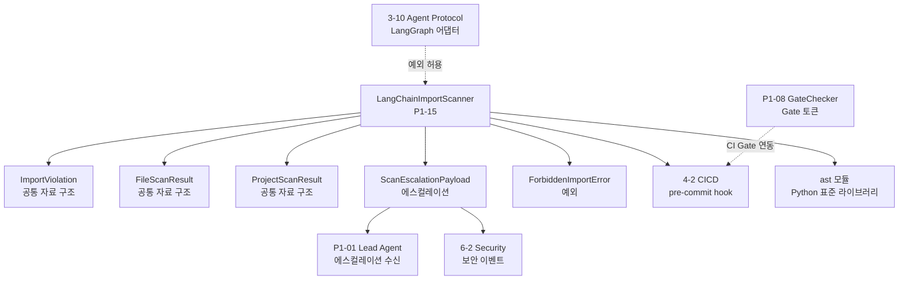

# P1-15. LangChain import 금지 검증

> **도메인**: 6-3_Agent-Teams-PARL / 04_autonomy-levels
> **세션**: P1-15
> **작성일**: 2026-04-13
> **대조 기준**: §6.7 기술 스택 제약, LOCK-AT-016(LangChain import 금지)
> **입력 파일**: `D:\VAMOS\docs\guides\VAMOS_구현가이드_PART2_구현단계.md` §6.7

---

## 1. 교차 참조 블록

| 문서 | 참조 위치 | 역할 |
|------|----------|------|
| Part2 §6.7 | L5054 (LOCK-AT-016) | LOCK 값 선언 정본 — "LangChain import 금지 (패턴 참조만)" |
| D2.0-02 DEC-002 | L80 | 근거 설계 문서 — "패턴만 참조 확정 — LangChain을 직접 import하지 않는다." |
| AUTHORITY_CHAIN.md | §2.1 레지스트리 AT-016 행 | LOCK-AT 레지스트리 정본 |
| AUTHORITY_CHAIN.md | §2.2 근거 원문 인용 AT-016 | 원문: "패턴만 참조 확정 — LangChain을 직접 import하지 않는다." |
| AUTHORITY_CHAIN.md | §2.3 위반 시나리오 AT-016 | 위반: `import langchain` 코드 → CI/CD 린터 규칙 → 빌드 실패 |
| 종합계획서 §3.5 | LOCK-AT-016 vs LangGraph | LangChain import 금지. LangGraph는 별도 패키지로 3-10 어댑터 경유 허용 |
| Part2 §6.7 | L5057 | "LOCK-AT-004/009/010/014/016은 PART1 C.4에도 기반영" |
| 04_autonomy-levels/_index.md | P1-15 항목 | 폴더 수준 개요 |
| P1-08_gate_integration.md | PhaseGuard 선행 | Gate 통합 — CI 파이프라인에 import 스캐너 등록 시 참조 |
| P1-09_execute_tool_restriction.md | PhaseGuard | Execute 단계 도구 호출 제한 — import 스캐너와 독립 레이어 |
| **인접 도메인** | | |
| 6-2 Security-Governance | 보안 정책 우선 적용 | 금지 import 탐지는 6-2 보안 이벤트로 기록 |
| 3-10 Agent-Protocol-Interoperability | LangGraph 어댑터 소유 | LangGraph는 3-10 어댑터 경유만 허용 (AT-016 예외) |
| 4-2 CICD-Pipeline | pre-commit hook 등록 대상 | import 스캐너를 CI pre-commit hook에 등록 |
| 3-8 Conversation-A2A | A2A 프로토콜 소비/재정의 금지 | 경계 참조 — 재정의 금지 원칙 준수 |

---

## 2. LOCK 값 인용

> LOCK-AT-016 (Part2 §6.7 L5054 / D2.0-02 DEC-002 L80):
> "LangChain import 금지 (패턴 참조만)"

> LOCK-AT-016 정본 근거 (D2.0-02 DEC-002 L80):
> "패턴만 참조 확정 — LangChain을 직접 import하지 않는다."

### 2.1 출처 교차 검증

> LOCK-AT-016의 정본은 Part2 §6.7 L5054이며, 근거 설계 문서는 D2.0-02 DEC-002이다.
> AUTHORITY_CHAIN.md §2.2에서 원문 인용: "패턴만 참조 확정 — LangChain을 직접 import하지 않는다."
> 종합계획서 §3.5에서 AT-016 관련 해소: "LangChain import 금지. LangGraph는 별도 패키지로 3-10 어댑터 경유 허용 (LOCK-AT-016은 LangChain 패키지 직접 import만 금지)."

### 2.2 연관 LOCK 값

> LOCK-AT-001 (Part2 §6.7 L5039):
> "V1은 자체 경량 프레임워크 기본. 외부 엔진은 어댑터로만 연결"

> LOCK-AT-005 (Part2 §6.7 L5043):
> "모든 에이전트 실행은 07 Gate 선행 통과 필수"

> LOCK-AT-007 (Part2 §6.7 L5045):
> "Checkpoint/Replay/Fork는 trace_id 단위로만 허용"

### 2.3 금지 범위 명확화

LOCK-AT-016은 다음 패키지의 **직접 import**를 금지한다:

| 금지 패턴 | 패키지 | 금지 사유 |
|----------|--------|----------|
| `langchain` | langchain (메인) | DEC-002: 패턴만 참조, 직접 import 금지 |
| `langchain_core` | langchain-core | langchain 핵심 라이브러리 |
| `langchain_community` | langchain-community | langchain 커뮤니티 확장 |
| `langchain_experimental` | langchain-experimental | langchain 실험적 기능 |
| `langchain_openai` | langchain-openai | langchain OpenAI 바인딩 |
| `langchain_anthropic` | langchain-anthropic | langchain Anthropic 바인딩 |
| `langchain_text_splitters` | langchain-text-splitters | langchain 텍스트 분할기 |

> **예외**: `langgraph`는 별도 패키지이며 LOCK-AT-016 금지 대상이 아니다.
> LangGraph는 3-10(Agent-Protocol-Interoperability) 어댑터를 경유하여 접근한다.
> (종합계획서 §3.5: "LangGraph는 별도 패키지로 3-10 어댑터 경유 허용")

---

## 3. 금지 패턴 정의

### 3.1 정적 분석 대상 패턴

```python
# LOCK-AT-016 금지 패턴 목록 (Part2 §6.7 L5054 / DEC-002 L80)
FORBIDDEN_IMPORT_PATTERNS: tuple[str, ...] = (
    "langchain",
    "langchain_core",
    "langchain_community",
    "langchain_experimental",
    "langchain_openai",
    "langchain_anthropic",
    "langchain_text_splitters",
)

# LOCK-AT-016 예외: LangGraph는 별도 패키지 (3-10 어댑터 경유)
ALLOWED_EXCEPTIONS: tuple[str, ...] = (
    "langgraph",
)
```

### 3.2 탐지 대상 import 형태

| # | import 형태 | 예시 | 탐지 방식 |
|---|-----------|------|----------|
| 1 | `import X` | `import langchain` | AST `Import` 노드 |
| 2 | `from X import Y` | `from langchain import chains` | AST `ImportFrom` 노드 |
| 3 | `from X.sub import Y` | `from langchain_core.messages import HumanMessage` | AST `ImportFrom` 노드 (모듈 접두사 매칭) |
| 4 | `__import__('X')` | `__import__('langchain')` | AST `Call` 노드 (`__import__` 함수 호출) |
| 5 | `importlib.import_module('X')` | `importlib.import_module('langchain')` | AST `Call` 노드 (`importlib.import_module` 함수 호출) |

### 3.3 false-positive 방지 규칙

| # | 규칙 | 예시 | 판정 |
|---|------|------|------|
| 1 | `langgraph` import는 허용 | `import langgraph` | PASS (예외) |
| 2 | 문자열 내 "langchain" 언급은 무시 | `desc = "langchain pattern"` | PASS (문자열) |
| 3 | 주석 내 "langchain" 언급은 무시 | `# langchain 패턴 참조` | PASS (주석) |
| 4 | 타입 힌트 `TYPE_CHECKING` 블록도 금지 | `if TYPE_CHECKING: import langchain` | FAIL (타입 힌트라도 import는 금지) |
| 5 | `langchain` 접두사가 아닌 패키지 허용 | `import langchainz` | PASS (다른 패키지) |
| 6 | `.py` 파일만 대상 | `config.toml`, `README.md` | SKIP (비대상) |

---

## 4. LangChainImportScanner 클래스 스켈레톤

### 4.1 공통 자료 구조 (§7 공통 자료 구조 선정의)

```python
from __future__ import annotations
from typing import Any, Optional
from dataclasses import dataclass, field
from enum import Enum
import ast
import os
import time
import json
import uuid


# ---------------------------------------------------------------------------
# 스캔 결과 상태 열거형
# ---------------------------------------------------------------------------

class ScanResultStatus(Enum):
    """LangChain import 스캔 결과 상태.
    
    LOCK-AT-016 (Part2 §6.7 L5054):
    "LangChain import 금지 (패턴 참조만)"
    """
    CLEAN = "clean"           # 금지 import 미발견
    VIOLATION = "violation"   # 금지 import 발견
    PARSE_ERROR = "parse_error"  # AST 파싱 실패


class ImportType(Enum):
    """금지 import 유형 분류."""
    IMPORT = "import"                 # import langchain
    FROM_IMPORT = "from_import"       # from langchain import X
    DUNDER_IMPORT = "dunder_import"   # __import__('langchain')
    IMPORTLIB = "importlib"           # importlib.import_module('langchain')


# ---------------------------------------------------------------------------
# ForbiddenImportError 예외
# ---------------------------------------------------------------------------

class ForbiddenImportError(Exception):
    """LOCK-AT-016 위반: LangChain import 탐지.
    
    LOCK-AT-016 (Part2 §6.7 L5054 / D2.0-02 DEC-002 L80):
    "LangChain import 금지 (패턴 참조만)"
    """

    def __init__(
        self,
        file_path: str,
        line_number: int,
        import_statement: str,
        forbidden_module: str,
        import_type: ImportType,
        message: str = "",
    ) -> None:
        self.file_path = file_path
        self.line_number = line_number
        self.import_statement = import_statement
        self.forbidden_module = forbidden_module
        self.import_type = import_type
        if not message:
            message = (
                f"ForbiddenImportError [LOCK-AT-016]: '{forbidden_module}' "
                f"import 탐지. file={file_path}, line={line_number}, "
                f"statement='{import_statement}', type={import_type.value}. "
                f"LangChain 직접 import 금지 — 패턴 참조만 허용."
            )
        super().__init__(message)


# ---------------------------------------------------------------------------
# 스캔 결과 자료구조
# ---------------------------------------------------------------------------

@dataclass
class ImportViolation:
    """단일 금지 import 탐지 결과.
    
    AST 분석 결과로 생성.
    """
    file_path: str
    line_number: int
    col_offset: int
    import_statement: str
    forbidden_module: str
    import_type: ImportType
    ast_node_type: str        # "Import", "ImportFrom", "Call"
    timestamp: str = ""

    def __post_init__(self) -> None:
        if not self.timestamp:
            self.timestamp = time.strftime(
                "%Y-%m-%dT%H:%M:%SZ", time.gmtime()
            )


@dataclass
class FileScanResult:
    """단일 파일 스캔 결과."""
    file_path: str
    status: ScanResultStatus
    violations: list[ImportViolation] = field(default_factory=list)
    parse_error: Optional[str] = None
    scan_duration_ms: float = 0.0


@dataclass
class ProjectScanResult:
    """프로젝트 전체 스캔 결과."""
    scan_id: str
    total_files: int
    scanned_files: int
    clean_files: int
    violation_files: int
    parse_error_files: int
    total_violations: int
    file_results: list[FileScanResult] = field(default_factory=list)
    scan_duration_ms: float = 0.0
    timestamp: str = ""
    forbidden_patterns: tuple[str, ...] = ()
    allowed_exceptions: tuple[str, ...] = ()

    def __post_init__(self) -> None:
        if not self.timestamp:
            self.timestamp = time.strftime(
                "%Y-%m-%dT%H:%M:%SZ", time.gmtime()
            )


@dataclass
class ScanEscalationPayload:
    """금지 import 탐지 시 에스컬레이션 페이로드.
    
    LOCK-AT-016 위반 시 Lead Agent / CI 파이프라인에 보고.
    P1-01 Lead Agent + P1-08 GateChecker 공통 구조 참조.
    R-01-8 경유.
    """
    trace_id: str
    escalation_id: str
    reason: str
    violation_count: int
    violation_files: list[str] = field(default_factory=list)
    violation_details: list[dict[str, Any]] = field(default_factory=list)
    severity: str = "CRITICAL"  # 금지 import는 CRITICAL
    lock_ref: str = "LOCK-AT-016"
    action_required: str = "금지 import 제거 후 재커밋"
```

### 4.2 LangChainImportScanner 클래스

```python
class LangChainImportScanner:
    """LangChain import 금지 정적 검사기 (AST 기반).

    LOCK-AT-016 (Part2 §6.7 L5054 / D2.0-02 DEC-002 L80):
    "LangChain import 금지 (패턴 참조만)"

    프로젝트 전체의 .py 파일을 AST 파싱하여 금지 import 패턴을 탐지한다.
    금지 대상: langchain, langchain_core, langchain_community 등.
    예외 허용: langgraph (별도 패키지, 3-10 어댑터 경유).

    시간복잡도:
      - scan_file(): O(N) — N=AST 노드 수 (파일 크기 비례)
      - scan_directory(): O(F*N) — F=.py 파일 수, N=평균 AST 노드 수
      - is_forbidden(): O(P) — P=금지 패턴 수 (상수, O(1) 취급)
      - get_scan_result(): O(1)
      - build_escalation_payload(): O(V) — V=위반 건수
      - add_forbidden_pattern(): O(P) — P=기존 금지 패턴 수

    ABC 시그니처: LangChainImportScanner(scan_file, scan_directory,
                    is_forbidden, get_scan_result,
                    build_escalation_payload, reset,
                    add_forbidden_pattern, get_forbidden_patterns)
    """

    # LOCK-AT-016: 금지 패턴 (기본값)
    DEFAULT_FORBIDDEN_PATTERNS: tuple[str, ...] = (
        "langchain",
        "langchain_core",
        "langchain_community",
        "langchain_experimental",
        "langchain_openai",
        "langchain_anthropic",
        "langchain_text_splitters",
    )

    # 예외 허용 패턴 (종합계획서 §3.5)
    DEFAULT_ALLOWED_EXCEPTIONS: tuple[str, ...] = (
        "langgraph",
    )

    def __init__(
        self,
        forbidden_patterns: Optional[tuple[str, ...]] = None,
        allowed_exceptions: Optional[tuple[str, ...]] = None,
        trace_id: Optional[str] = None,
    ) -> None:
        """
        Args:
            forbidden_patterns: 금지 import 패턴 목록.
                None이면 DEFAULT_FORBIDDEN_PATTERNS 사용.
            allowed_exceptions: 예외 허용 패턴 목록.
                None이면 DEFAULT_ALLOWED_EXCEPTIONS 사용.
            trace_id: LOCK-AT-007 준수 trace_id. None이면 자동 생성.
        """
        self._forbidden_patterns: tuple[str, ...] = (
            forbidden_patterns or self.DEFAULT_FORBIDDEN_PATTERNS
        )
        self._allowed_exceptions: tuple[str, ...] = (
            allowed_exceptions or self.DEFAULT_ALLOWED_EXCEPTIONS
        )
        self._trace_id: str = trace_id or f"scan-{uuid.uuid4().hex[:12]}"
        self._file_results: list[FileScanResult] = []
        self._total_files: int = 0
        self._scanned_files: int = 0

    # ==================== 핵심 검증 메서드 ====================

    def is_forbidden(self, module_name: str) -> bool:
        """모듈명이 금지 패턴에 해당하는지 확인.

        금지 판정 로직:
        1. 허용 예외 목록(langgraph 등)에 해당하면 PASS.
        2. 금지 패턴 목록 중 하나라도 접두사 매칭되면 FAIL.

        Args:
            module_name: 검사 대상 모듈명 (예: "langchain_core.messages").

        Returns:
            True면 금지 대상, False면 허용.

        시간복잡도: O(P) — P=금지 패턴 수 (상수, O(1) 취급)
        """
        if module_name is None:
            return False

        # [1] 예외 허용 검사 — langgraph 등은 금지 대상 아님
        for allowed in self._allowed_exceptions:
            if module_name == allowed or module_name.startswith(allowed + "."):
                return False

        # [2] 금지 패턴 접두사 매칭
        for forbidden in self._forbidden_patterns:
            if module_name == forbidden or module_name.startswith(forbidden + "."):
                return True
            # langchain_core, langchain_google 등 언더스코어 구분 서브패키지 매칭
            # "langchain" 패턴이 "langchain_*" 서브패키지를 포괄 포착
            # (명시적 forbidden_patterns에 없는 신규 서브패키지도 차단)
            if module_name.startswith(forbidden + "_"):
                return True

        return False

    def scan_file(self, file_path: str) -> FileScanResult:
        """단일 .py 파일의 AST를 분석하여 금지 import를 탐지.

        분석 대상 AST 노드:
        - ast.Import: `import langchain`
        - ast.ImportFrom: `from langchain import X`
        - ast.Call: `__import__('langchain')`, `importlib.import_module('langchain')`

        Args:
            file_path: .py 파일 경로.

        Returns:
            FileScanResult: 파일 스캔 결과.

        시간복잡도: O(N) — N=AST 노드 수
        """
        start_time = time.monotonic()

        try:
            with open(file_path, "r", encoding="utf-8") as f:
                source = f.read()
        except (OSError, UnicodeDecodeError) as e:
            return FileScanResult(
                file_path=file_path,
                status=ScanResultStatus.PARSE_ERROR,
                parse_error=f"파일 읽기 실패: {e}",
                scan_duration_ms=(time.monotonic() - start_time) * 1000,
            )

        try:
            tree = ast.parse(source, filename=file_path)
        except SyntaxError as e:
            return FileScanResult(
                file_path=file_path,
                status=ScanResultStatus.PARSE_ERROR,
                parse_error=f"AST 파싱 실패: {e}",
                scan_duration_ms=(time.monotonic() - start_time) * 1000,
            )

        violations: list[ImportViolation] = []

        for node in ast.walk(tree):
            # [1] import X — ast.Import
            if isinstance(node, ast.Import):
                for alias in node.names:
                    if self.is_forbidden(alias.name):
                        violations.append(ImportViolation(
                            file_path=file_path,
                            line_number=node.lineno,
                            col_offset=node.col_offset,
                            import_statement=f"import {alias.name}",
                            forbidden_module=alias.name,
                            import_type=ImportType.IMPORT,
                            ast_node_type="Import",
                        ))

            # [2] from X import Y — ast.ImportFrom
            elif isinstance(node, ast.ImportFrom):
                module = node.module or ""
                if self.is_forbidden(module):
                    names = ", ".join(
                        a.name for a in node.names
                    )
                    violations.append(ImportViolation(
                        file_path=file_path,
                        line_number=node.lineno,
                        col_offset=node.col_offset,
                        import_statement=f"from {module} import {names}",
                        forbidden_module=module,
                        import_type=ImportType.FROM_IMPORT,
                        ast_node_type="ImportFrom",
                    ))

            # [3] __import__('X') / importlib.import_module('X') — ast.Call
            elif isinstance(node, ast.Call):
                func = node.func

                # __import__('langchain')
                if (isinstance(func, ast.Name)
                        and func.id == "__import__"
                        and node.args
                        and isinstance(node.args[0], ast.Constant)
                        and isinstance(node.args[0].value, str)):
                    module_name = node.args[0].value
                    if self.is_forbidden(module_name):
                        violations.append(ImportViolation(
                            file_path=file_path,
                            line_number=node.lineno,
                            col_offset=node.col_offset,
                            import_statement=(
                                f"__import__('{module_name}')"
                            ),
                            forbidden_module=module_name,
                            import_type=ImportType.DUNDER_IMPORT,
                            ast_node_type="Call",
                        ))

                # importlib.import_module('langchain')
                elif (isinstance(func, ast.Attribute)
                        and func.attr == "import_module"
                        and isinstance(func.value, ast.Name)
                        and func.value.id == "importlib"
                        and node.args
                        and isinstance(node.args[0], ast.Constant)
                        and isinstance(node.args[0].value, str)):
                    module_name = node.args[0].value
                    if self.is_forbidden(module_name):
                        violations.append(ImportViolation(
                            file_path=file_path,
                            line_number=node.lineno,
                            col_offset=node.col_offset,
                            import_statement=(
                                f"importlib.import_module('{module_name}')"
                            ),
                            forbidden_module=module_name,
                            import_type=ImportType.IMPORTLIB,
                            ast_node_type="Call",
                        ))

        elapsed = (time.monotonic() - start_time) * 1000
        status = (
            ScanResultStatus.VIOLATION if violations
            else ScanResultStatus.CLEAN
        )

        result = FileScanResult(
            file_path=file_path,
            status=status,
            violations=violations,
            scan_duration_ms=elapsed,
        )

        self._file_results.append(result)
        self._scanned_files += 1

        # 위반 발견 시 로깅
        if violations:
            self._log_violations_json(result)

        return result

    def scan_directory(self, directory: str) -> ProjectScanResult:
        """디렉토리 내 모든 .py 파일을 재귀 스캔.

        Args:
            directory: 스캔 대상 디렉토리 경로.

        Returns:
            ProjectScanResult: 프로젝트 전체 스캔 결과.

        시간복잡도: O(F*N) — F=.py 파일 수, N=평균 AST 노드 수
        """
        start_time = time.monotonic()

        # .py 파일 수집
        py_files: list[str] = []
        for root, _dirs, files in os.walk(directory):
            for fname in files:
                if fname.endswith(".py"):
                    py_files.append(os.path.join(root, fname))

        self._total_files = len(py_files)

        # 각 파일 스캔
        for fpath in py_files:
            self.scan_file(fpath)

        elapsed = (time.monotonic() - start_time) * 1000

        clean = sum(
            1 for r in self._file_results
            if r.status == ScanResultStatus.CLEAN
        )
        violation = sum(
            1 for r in self._file_results
            if r.status == ScanResultStatus.VIOLATION
        )
        parse_err = sum(
            1 for r in self._file_results
            if r.status == ScanResultStatus.PARSE_ERROR
        )
        total_violations = sum(
            len(r.violations) for r in self._file_results
        )

        return ProjectScanResult(
            scan_id=f"SCAN-{uuid.uuid4().hex[:8]}",
            total_files=self._total_files,
            scanned_files=self._scanned_files,
            clean_files=clean,
            violation_files=violation,
            parse_error_files=parse_err,
            total_violations=total_violations,
            file_results=list(self._file_results),
            scan_duration_ms=elapsed,
            forbidden_patterns=self._forbidden_patterns,
            allowed_exceptions=self._allowed_exceptions,
        )

    def get_scan_result(self) -> list[FileScanResult]:
        """현재까지의 파일 스캔 결과 반환.

        시간복잡도: O(1)
        """
        return list(self._file_results)

    def build_escalation_payload(
        self,
        project_result: ProjectScanResult,
    ) -> ScanEscalationPayload:
        """스캔 결과로부터 에스컬레이션 페이로드 생성.

        금지 import 탐지 시 Lead Agent / CI 파이프라인에 보고.

        Args:
            project_result: 프로젝트 스캔 결과.

        Returns:
            ScanEscalationPayload: 에스컬레이션 페이로드.

        시간복잡도: O(V) — V=위반 건수
        """
        violation_files = [
            r.file_path for r in project_result.file_results
            if r.status == ScanResultStatus.VIOLATION
        ]
        violation_details = []
        for r in project_result.file_results:
            for v in r.violations:
                violation_details.append({
                    "file": v.file_path,
                    "line": v.line_number,
                    "statement": v.import_statement,
                    "module": v.forbidden_module,
                    "type": v.import_type.value,
                })

        return ScanEscalationPayload(
            trace_id=self._trace_id,
            escalation_id=f"ESC-LC-{uuid.uuid4().hex[:8]}",
            reason=(
                f"LOCK-AT-016 위반: {project_result.total_violations}건의 "
                f"LangChain import 탐지. {project_result.violation_files}개 파일. "
                f"LangChain 직접 import 금지 — 패턴 참조만 허용."
            ),
            violation_count=project_result.total_violations,
            violation_files=violation_files,
            violation_details=violation_details,
            severity="CRITICAL",
        )

    def reset(self) -> None:
        """스캐너 상태 초기화.

        시간복잡도: O(1)
        """
        self._file_results = []
        self._total_files = 0
        self._scanned_files = 0

    def add_forbidden_pattern(self, pattern: str) -> None:
        """금지 패턴 추가.

        Args:
            pattern: 추가할 금지 모듈명.

        시간복잡도: O(P) — P=기존 금지 패턴 수 (tuple 복사)
        """
        self._forbidden_patterns = self._forbidden_patterns + (pattern,)

    def get_forbidden_patterns(self) -> tuple[str, ...]:
        """현재 금지 패턴 목록 반환.

        시간복잡도: O(1)
        """
        return self._forbidden_patterns

    # ==================== 내부 헬퍼 ====================

    def _log_violations_json(self, result: FileScanResult) -> None:
        """금지 import 탐지 결과를 중첩 JSON 형식으로 로깅.

        로깅 출력 형식 (§5 로깅 중첩 JSON 구조 참조).
        """
        for v in result.violations:
            log_entry = {
                "event_type": "forbidden_import_detected",
                "lock_ref": "LOCK-AT-016",
                "lock_value": "LangChain import 금지 (패턴 참조만)",
                "event": {
                    "trace_id": self._trace_id,
                    "violation": {
                        "file_path": v.file_path,
                        "line_number": v.line_number,
                        "col_offset": v.col_offset,
                        "import_statement": v.import_statement,
                        "forbidden_module": v.forbidden_module,
                        "import_type": v.import_type.value,
                        "ast_node_type": v.ast_node_type,
                    },
                    "action": {
                        "blocked": True,
                        "severity": "CRITICAL",
                        "required_action": "금지 import 제거 후 재커밋",
                    },
                    "metadata": {
                        "timestamp": v.timestamp,
                        "scanner_trace_id": self._trace_id,
                    },
                },
            }
            # 실제 환경: logging.getLogger("import_scanner").error(json.dumps(...))
            _ = json.dumps(log_entry, ensure_ascii=False, indent=2)
```

---

## 5. 로깅 중첩 JSON 구조

### 5.1 금지 import 탐지 이벤트 로그

```json
{
  "event_type": "forbidden_import_detected",
  "lock_ref": "LOCK-AT-016",
  "lock_value": "LangChain import 금지 (패턴 참조만)",
  "event": {
    "trace_id": "scan-a1b2c3d4e5f6",
    "violation": {
      "file_path": "src/agents/research_agent.py",
      "line_number": 5,
      "col_offset": 0,
      "import_statement": "from langchain import chains",
      "forbidden_module": "langchain",
      "import_type": "from_import",
      "ast_node_type": "ImportFrom"
    },
    "action": {
      "blocked": true,
      "severity": "CRITICAL",
      "required_action": "금지 import 제거 후 재커밋"
    },
    "metadata": {
      "timestamp": "2026-04-13T07:00:00Z",
      "scanner_trace_id": "scan-a1b2c3d4e5f6"
    }
  }
}
```

### 5.2 프로젝트 스캔 완료 로그

```json
{
  "event_type": "project_scan_completed",
  "lock_ref": "LOCK-AT-016",
  "event": {
    "scan_id": "SCAN-abcd1234",
    "trace_id": "scan-a1b2c3d4e5f6",
    "result": {
      "total_files": 150,
      "scanned_files": 150,
      "clean_files": 148,
      "violation_files": 2,
      "parse_error_files": 0,
      "total_violations": 3
    },
    "scan_duration_ms": 245.3,
    "timestamp": "2026-04-13T07:00:01Z"
  }
}
```

### 5.3 CI pre-commit hook 결과 로그

```json
{
  "event_type": "precommit_langchain_check",
  "lock_ref": "LOCK-AT-016",
  "event": {
    "hook_name": "check-langchain-import-ban",
    "trace_id": "ci-hook-001",
    "result": {
      "status": "FAIL",
      "violation_count": 1,
      "files_with_violations": [
        "src/agents/bad_agent.py"
      ]
    },
    "action": {
      "commit_blocked": true,
      "message": "LOCK-AT-016 위반: LangChain import 탐지. 커밋 차단."
    },
    "timestamp": "2026-04-13T07:00:02Z"
  }
}
```

### 5.4 정상 스캔 통과 로그

```json
{
  "event_type": "precommit_langchain_check",
  "lock_ref": "LOCK-AT-016",
  "event": {
    "hook_name": "check-langchain-import-ban",
    "trace_id": "ci-hook-002",
    "result": {
      "status": "PASS",
      "violation_count": 0,
      "files_with_violations": []
    },
    "action": {
      "commit_blocked": false,
      "message": "LOCK-AT-016 준수: LangChain import 미발견."
    },
    "timestamp": "2026-04-13T07:00:03Z"
  }
}
```

---

## 6. 에스컬레이션 페이로드

### 6.1 금지 import 탐지 에스컬레이션

금지 import 탐지 시 `ScanEscalationPayload` 구조를 통해 Lead Agent / CI 파이프라인에 보고한다.

```python
def build_scan_escalation(
    scanner: LangChainImportScanner,
    project_result: ProjectScanResult,
) -> ScanEscalationPayload:
    """프로젝트 스캔 결과로부터 에스컬레이션 페이로드 생성.

    P1-01 Lead Agent + P1-08 GateChecker 공통 구조 참조.

    Args:
        scanner: LangChainImportScanner 인스턴스.
        project_result: 프로젝트 스캔 결과.

    Returns:
        ScanEscalationPayload: 에스컬레이션 페이로드.
    """
    return scanner.build_escalation_payload(project_result)
```

### 6.2 에스컬레이션 경로

```
금지 import 탐지
    |
ImportViolation 생성 + 로깅 (§5.1)
    |
scan_directory() -> ProjectScanResult
    |
build_escalation_payload() -> ScanEscalationPayload
    |
    +--- [CI 경로] pre-commit hook -> 커밋 차단 + 빌드 실패
    |
    +--- [런타임 경로] Lead Agent (P1-01) 수신 -> I-20 경유 사용자 보고
    |
    +--- 6-2 Security-Governance 보안 이벤트 기록
         (security.forbidden_import.detected)
```

---

## 7. CI pre-commit hook 등록

### 7.1 pre-commit hook 스크립트

```python
#!/usr/bin/env python3
"""LOCK-AT-016 LangChain import 금지 pre-commit hook.

커밋 시점에 스테이징된 .py 파일을 검사하여
LangChain import가 포함된 파일이 있으면 커밋을 차단한다.

등록: 4-2 CICD-Pipeline pre-commit hook 설정 참조.
"""
import subprocess
import sys
import os

# 프로젝트 루트에서 실행 가정
sys.path.insert(0, os.path.dirname(os.path.abspath(__file__)))


def get_staged_py_files() -> list[str]:
    """git 스테이징 영역의 .py 파일 목록 반환."""
    result = subprocess.run(
        ["git", "diff", "--cached", "--name-only", "--diff-filter=ACM"],
        capture_output=True, text=True,
    )
    return [
        f for f in result.stdout.strip().split("\n")
        if f.endswith(".py") and f
    ]


def main() -> int:
    """pre-commit hook 메인 진입점.

    Returns:
        0: 위반 없음 (커밋 허용).
        1: 위반 발견 (커밋 차단).
    """
    staged_files = get_staged_py_files()
    if not staged_files:
        return 0

    scanner = LangChainImportScanner(trace_id="precommit-hook")
    violations_found = False

    for fpath in staged_files:
        if os.path.exists(fpath):
            result = scanner.scan_file(fpath)
            if result.status == ScanResultStatus.VIOLATION:
                violations_found = True
                for v in result.violations:
                    print(
                        f"LOCK-AT-016 위반: {v.file_path}:{v.line_number} "
                        f"- {v.import_statement}",
                        file=sys.stderr,
                    )

    if violations_found:
        print(
            "\n[LOCK-AT-016] LangChain import 금지 위반 탐지. "
            "금지 import를 제거한 후 재커밋하세요.",
            file=sys.stderr,
        )
        return 1

    return 0


if __name__ == "__main__":
    sys.exit(main())
```

### 7.2 .pre-commit-config.yaml 등록 예시

```yaml
# 4-2 CICD-Pipeline 연동: .pre-commit-config.yaml
repos:
  - repo: local
    hooks:
      - id: check-langchain-import-ban
        name: LOCK-AT-016 LangChain import 금지 검사
        entry: python scripts/check_langchain_import_ban.py
        language: python
        types: [python]
        stages: [commit]
```

### 7.3 CI 파이프라인 통합 (4-2 연동)

| 단계 | 도구 | LOCK-AT-016 적용 |
|------|------|-----------------|
| pre-commit | pre-commit hook | `check-langchain-import-ban` 실행 |
| CI lint | GitHub Actions / GitLab CI | `LangChainImportScanner.scan_directory()` 실행 |
| PR 리뷰 | 자동 코드 리뷰 | 금지 import 탐지 시 리뷰 코멘트 자동 추가 |
| 빌드 | 빌드 파이프라인 | 금지 import 탐지 시 빌드 실패 (`exit 1`) |

---

## 8. Phase별 복구 전략

### 8.1 CI 단계 금지 import 탐지 시 복구

| 단계 | 조건 | 복구 행동 |
|------|------|----------|
| 감지 | pre-commit hook에서 금지 import 탐지 | 커밋 차단 + 위반 파일/라인 출력 |
| 즉시 대응 | 커밋 차단 | 개발자에게 금지 import 제거 안내 |
| 복구 | 금지 import 제거 | 대안 import 안내 (자체 프레임워크 또는 3-10 어댑터) |
| 에스컬레이션 | 반복 위반 | ScanEscalationPayload → Lead Agent → 프로젝트 관리자 |

### 8.2 런타임 단계 금지 import 탐지 시 복구

| 단계 | 조건 | 복구 행동 |
|------|------|----------|
| 감지 | 동적 import 시도 (`__import__`, `importlib`) | ForbiddenImportError 예외 발생 |
| 즉시 대응 | import 차단 | 에이전트에 "자체 프레임워크 사용 필요" 안내 |
| 복구 | 자체 프레임워크 대체 | LOCK-AT-001 준수 — 자체 경량 프레임워크 기본 |
| 에스컬레이션 | 반복 시도 | ScanEscalationPayload → Lead Agent → 보안 이벤트 기록 |

### 8.3 빌드 단계 금지 import 탐지 시 복구

| 단계 | 조건 | 복구 행동 |
|------|------|----------|
| 감지 | CI lint에서 금지 import 탐지 | 빌드 실패 (`exit 1`) |
| 즉시 대응 | PR 머지 차단 | 리뷰 코멘트 자동 추가 + 빌드 상태 FAIL |
| 복구 | 금지 import 제거 후 재푸시 | 빌드 재실행 |
| 에스컬레이션 | 강제 머지 시도 | AUTHORITY_CHAIN.md §2.3 — 빌드 실패 강제 진행 불가 |

### 8.4 복구 흐름도

```
[커밋 시도]
    |
    v
[pre-commit hook 실행]
    |
    +--- PASS (금지 import 없음) ---> [커밋 성공]
    |
    +--- FAIL (금지 import 탐지)
             |
             v
         [커밋 차단] --- 위반 파일/라인 출력
             |
             v
         [개발자 대응]
             |
             +--- 금지 import 제거 ---> [재커밋] ---> [PASS]
             |
             +--- 대안 적용:
             |     - LOCK-AT-001: 자체 경량 프레임워크
             |     - 3-10 어댑터: LangGraph 경유
             |
             +--- 반복 위반 시:
                   |
                   v
               [에스컬레이션]
                   |
                   v
               ScanEscalationPayload
                   |
                   +--- Lead Agent (P1-01)
                   +--- 6-2 보안 이벤트 기록
                   +--- 프로젝트 관리자 알림
```

---

## 9. 예외 처리 정책 표

| # | 예외 유형 | 발생 조건 | 처리 방법 | LOCK 참조 | 심각도 |
|---|----------|----------|----------|----------|--------|
| 1 | `ForbiddenImportError` | .py 파일에 금지 import 탐지 | 커밋 차단 + 위반 위치 출력 + 에스컬레이션 | AT-016 | CRITICAL |
| 2 | `SyntaxError` (AST 파싱) | .py 파일 구문 오류 | PARSE_ERROR 상태 기록 + 수동 검토 안내 | — | LOW |
| 3 | `UnicodeDecodeError` | 파일 인코딩 불일치 | PARSE_ERROR 상태 기록 + UTF-8 변환 안내 | — | LOW |
| 4 | `OSError` | 파일 읽기 실패 (권한, 존재) | PARSE_ERROR 상태 기록 + 경로 확인 안내 | — | LOW |
| 5 | false-positive (langgraph) | `import langgraph` 탐지 시도 | 예외 허용 목록 확인 → PASS 판정 | AT-016 (예외) | — |
| 6 | 동적 import 런타임 차단 | `__import__('langchain')` 실행 시도 | ForbiddenImportError 예외 + 로깅 | AT-016 | CRITICAL |
| 7 | CI 빌드 실패 | CI lint에서 금지 import 탐지 | 빌드 실패 + PR 머지 차단 + 자동 코멘트 | AT-016 | HIGH |

---

## 10. 알고리즘 시간복잡도 + LOCK + ABC

### 10.1 시간복잡도 요약

| 메서드 | 시간복잡도 | LOCK-AT 참조 | 설명 |
|--------|-----------|-------------|------|
| `LangChainImportScanner.is_forbidden()` | O(P) ≈ O(1) | AT-016 | P=금지 패턴 수 (상수 7개) |
| `LangChainImportScanner.scan_file()` | O(N) | AT-016 | N=AST 노드 수 (파일 크기 비례) |
| `LangChainImportScanner.scan_directory()` | O(F*N) | AT-016 | F=.py 파일 수, N=평균 AST 노드 수 |
| `LangChainImportScanner.get_scan_result()` | O(1) | — | 현재 결과 반환 |
| `LangChainImportScanner.build_escalation_payload()` | O(V) | AT-016 | V=위반 건수 |
| `LangChainImportScanner.reset()` | O(1) | — | 스캐너 상태 초기화 |
| `LangChainImportScanner.add_forbidden_pattern()` | O(P) | AT-016 | 금지 패턴 추가 (tuple 복사, P=기존 패턴 수) |
| `LangChainImportScanner.get_forbidden_patterns()` | O(1) | AT-016 | 패턴 목록 반환 |

### 10.2 ABC 시그니처

```
LangChainImportScanner(
    scan_file: (str) -> FileScanResult,
    scan_directory: (str) -> ProjectScanResult,
    is_forbidden: (str) -> bool,
    get_scan_result: () -> list[FileScanResult],
    build_escalation_payload: (ProjectScanResult) -> ScanEscalationPayload,
    reset: () -> None,
    add_forbidden_pattern: (str) -> None,
    get_forbidden_patterns: () -> tuple[str, ...],
)
```

### 10.3 LOCK-AT 참조 매핑

| LOCK-AT | 메서드/위치 | 적용 방식 |
|---------|-----------|----------|
| AT-016 | `is_forbidden()`, `scan_file()` | 금지 패턴 접두사 매칭 → ForbiddenImportError / ImportViolation |
| AT-016 | CI pre-commit hook | 커밋 시점 자동 검사 → 빌드 실패 |
| AT-001 | 복구 전략 §8 | 금지 import 대안: 자체 경량 프레임워크 사용 |
| AT-007 | 생성자 | `trace_id` 필수 인자로 Checkpoint/Replay 호환 |
| AT-005 | 간접 참조 | CI Gate 통과 전제 (금지 import 탐지 시 Gate 미발급) |

---

## 11. 단위 테스트

### 11.1 금지 import 탐지 (import 문)

```python
def test_detect_import_langchain():
    """'import langchain' 탐지 확인.
    
    LOCK-AT-016: LangChain import 금지.
    """
    scanner = LangChainImportScanner()
    
    # 테스트 파일 생성
    import tempfile
    with tempfile.NamedTemporaryFile(
        mode="w", suffix=".py", delete=False, encoding="utf-8"
    ) as f:
        f.write("import langchain\n")
        f.write("print('hello')\n")
        fpath = f.name
    
    result = scanner.scan_file(fpath)
    
    assert result.status == ScanResultStatus.VIOLATION
    assert len(result.violations) == 1
    assert result.violations[0].forbidden_module == "langchain"
    assert result.violations[0].import_type == ImportType.IMPORT
    assert result.violations[0].line_number == 1
    assert "import langchain" in result.violations[0].import_statement
    
    os.unlink(fpath)
```

### 11.2 금지 import 탐지 (from import 문)

```python
def test_detect_from_langchain_import():
    """'from langchain_core import messages' 탐지 확인.
    
    LOCK-AT-016: LangChain import 금지.
    """
    scanner = LangChainImportScanner()
    
    import tempfile
    with tempfile.NamedTemporaryFile(
        mode="w", suffix=".py", delete=False, encoding="utf-8"
    ) as f:
        f.write("from langchain_core.messages import HumanMessage\n")
        fpath = f.name
    
    result = scanner.scan_file(fpath)
    
    assert result.status == ScanResultStatus.VIOLATION
    assert len(result.violations) == 1
    assert result.violations[0].forbidden_module == "langchain_core.messages"
    assert result.violations[0].import_type == ImportType.FROM_IMPORT
```

### 11.3 금지 import 탐지 (__import__)

```python
def test_detect_dunder_import_langchain():
    """'__import__(\"langchain\")' 탐지 확인.
    
    LOCK-AT-016: LangChain import 금지.
    """
    scanner = LangChainImportScanner()
    
    import tempfile
    with tempfile.NamedTemporaryFile(
        mode="w", suffix=".py", delete=False, encoding="utf-8"
    ) as f:
        f.write("lc = __import__('langchain')\n")
        fpath = f.name
    
    result = scanner.scan_file(fpath)
    
    assert result.status == ScanResultStatus.VIOLATION
    assert len(result.violations) == 1
    assert result.violations[0].import_type == ImportType.DUNDER_IMPORT
    assert result.violations[0].forbidden_module == "langchain"
```

---

## 12. Phase 2 통합 테스트

### 12.1 정상 파일 통과

```python
def test_p2_clean_file_passes():
    """금지 import 없는 파일은 CLEAN 상태."""
    scanner = LangChainImportScanner()
    
    import tempfile
    with tempfile.NamedTemporaryFile(
        mode="w", suffix=".py", delete=False, encoding="utf-8"
    ) as f:
        f.write("import os\nimport json\nfrom typing import Any\n")
        fpath = f.name
    
    result = scanner.scan_file(fpath)
    
    assert result.status == ScanResultStatus.CLEAN
    assert len(result.violations) == 0
    
    os.unlink(fpath)
```

### 12.2 langgraph 예외 허용

```python
def test_p2_langgraph_allowed():
    """langgraph import는 LOCK-AT-016 예외 — CLEAN 판정.
    
    종합계획서 §3.5: LangGraph는 별도 패키지로 3-10 어댑터 경유 허용.
    """
    scanner = LangChainImportScanner()
    
    import tempfile
    with tempfile.NamedTemporaryFile(
        mode="w", suffix=".py", delete=False, encoding="utf-8"
    ) as f:
        f.write("import langgraph\n")
        f.write("from langgraph.graph import StateGraph\n")
        fpath = f.name
    
    result = scanner.scan_file(fpath)
    
    assert result.status == ScanResultStatus.CLEAN
    assert len(result.violations) == 0
    
    os.unlink(fpath)
```

### 12.3 다중 금지 import 탐지

```python
def test_p2_multiple_violations():
    """한 파일 내 다중 금지 import 전체 탐지."""
    scanner = LangChainImportScanner()
    
    import tempfile
    with tempfile.NamedTemporaryFile(
        mode="w", suffix=".py", delete=False, encoding="utf-8"
    ) as f:
        f.write("import langchain\n")
        f.write("from langchain_core import messages\n")
        f.write("from langchain_community.chat_models import ChatOllama\n")
        fpath = f.name
    
    result = scanner.scan_file(fpath)
    
    assert result.status == ScanResultStatus.VIOLATION
    assert len(result.violations) == 3
    modules = {v.forbidden_module for v in result.violations}
    assert "langchain" in modules
    assert "langchain_core" in modules
    assert "langchain_community.chat_models" in modules
    
    os.unlink(fpath)
```

### 12.4 importlib.import_module 탐지

```python
def test_p2_importlib_detection():
    """importlib.import_module('langchain') 탐지 확인."""
    scanner = LangChainImportScanner()
    
    import tempfile
    with tempfile.NamedTemporaryFile(
        mode="w", suffix=".py", delete=False, encoding="utf-8"
    ) as f:
        f.write("import importlib\n")
        f.write("lc = importlib.import_module('langchain_openai')\n")
        fpath = f.name
    
    result = scanner.scan_file(fpath)
    
    assert result.status == ScanResultStatus.VIOLATION
    assert len(result.violations) == 1
    assert result.violations[0].import_type == ImportType.IMPORTLIB
    assert result.violations[0].forbidden_module == "langchain_openai"
    
    os.unlink(fpath)
```

### 12.5 AST 파싱 실패 처리

```python
def test_p2_syntax_error_handling():
    """구문 오류 파일은 PARSE_ERROR 상태."""
    scanner = LangChainImportScanner()
    
    import tempfile
    with tempfile.NamedTemporaryFile(
        mode="w", suffix=".py", delete=False, encoding="utf-8"
    ) as f:
        f.write("def broken(\n")  # 구문 오류
        fpath = f.name
    
    result = scanner.scan_file(fpath)
    
    assert result.status == ScanResultStatus.PARSE_ERROR
    assert result.parse_error is not None
    assert "AST 파싱 실패" in result.parse_error
    
    os.unlink(fpath)
```

### 12.6 문자열 내 langchain 언급은 무시

```python
def test_p2_string_mention_ignored():
    """문자열 내 'langchain' 언급은 false-positive 아님 — CLEAN.
    
    AST 기반 분석이므로 문자열 리터럴은 import 노드가 아님.
    """
    scanner = LangChainImportScanner()
    
    import tempfile
    with tempfile.NamedTemporaryFile(
        mode="w", suffix=".py", delete=False, encoding="utf-8"
    ) as f:
        f.write('desc = "langchain pattern reference"\n')
        f.write('# This uses langchain patterns\n')
        f.write('PATTERN_REF = "based on langchain_core design"\n')
        fpath = f.name
    
    result = scanner.scan_file(fpath)
    
    assert result.status == ScanResultStatus.CLEAN
    assert len(result.violations) == 0
    
    os.unlink(fpath)
```

### 12.7 is_forbidden 경계 테스트

```python
def test_p2_is_forbidden_boundary():
    """is_forbidden() 경계 케이스 검증."""
    scanner = LangChainImportScanner()
    
    # 금지 대상
    assert scanner.is_forbidden("langchain") is True
    assert scanner.is_forbidden("langchain_core") is True
    assert scanner.is_forbidden("langchain_core.messages") is True
    assert scanner.is_forbidden("langchain_community") is True
    assert scanner.is_forbidden("langchain_experimental") is True
    assert scanner.is_forbidden("langchain_openai") is True
    assert scanner.is_forbidden("langchain_anthropic") is True
    assert scanner.is_forbidden("langchain_text_splitters") is True
    
    # 미등록 langchain 서브패키지도 포괄 차단
    assert scanner.is_forbidden("langchain_google") is True
    assert scanner.is_forbidden("langchain_google.vertexai") is True
    
    # 허용 대상
    assert scanner.is_forbidden("langgraph") is False
    assert scanner.is_forbidden("langgraph.graph") is False
    assert scanner.is_forbidden("os") is False
    assert scanner.is_forbidden("json") is False
    assert scanner.is_forbidden(None) is False
    assert scanner.is_forbidden("langchainz") is False  # 다른 패키지
```

### 12.8 에스컬레이션 페이로드 생성 검증

```python
def test_p2_escalation_payload_generation():
    """금지 import 탐지 후 에스컬레이션 페이로드 구조 검증."""
    scanner = LangChainImportScanner(trace_id="test-trace-001")
    
    import tempfile
    with tempfile.NamedTemporaryFile(
        mode="w", suffix=".py", delete=False, encoding="utf-8"
    ) as f:
        f.write("import langchain\n")
        f.write("from langchain_core import messages\n")
        fpath = f.name
    
    file_result = scanner.scan_file(fpath)
    
    project_result = ProjectScanResult(
        scan_id="SCAN-test001",
        total_files=1,
        scanned_files=1,
        clean_files=0,
        violation_files=1,
        parse_error_files=0,
        total_violations=2,
        file_results=[file_result],
    )
    
    payload = scanner.build_escalation_payload(project_result)
    
    assert payload.trace_id == "test-trace-001"
    assert "LOCK-AT-016" in payload.reason
    assert payload.violation_count == 2
    assert payload.severity == "CRITICAL"
    assert payload.lock_ref == "LOCK-AT-016"
    assert len(payload.violation_files) == 1
    assert len(payload.violation_details) == 2
    
    os.unlink(fpath)
```

### 12.9 스캐너 reset 후 재사용

```python
def test_p2_scanner_reset():
    """reset() 후 스캐너 상태 초기화 확인."""
    scanner = LangChainImportScanner()
    
    import tempfile
    with tempfile.NamedTemporaryFile(
        mode="w", suffix=".py", delete=False, encoding="utf-8"
    ) as f:
        f.write("import langchain\n")
        fpath = f.name
    
    # 첫 번째 스캔
    scanner.scan_file(fpath)
    assert len(scanner.get_scan_result()) == 1
    
    # reset
    scanner.reset()
    assert len(scanner.get_scan_result()) == 0
    
    # 두 번째 스캔
    scanner.scan_file(fpath)
    assert len(scanner.get_scan_result()) == 1
    
    os.unlink(fpath)
```

### 12.10 금지 패턴 동적 추가

```python
def test_p2_add_forbidden_pattern():
    """add_forbidden_pattern()으로 동적 패턴 추가 후 탐지 확인."""
    scanner = LangChainImportScanner()
    
    # 기본 패턴에 없는 "langchain_custom" 추가
    assert scanner.is_forbidden("langchain_custom") is True
    
    scanner.add_forbidden_pattern("langchain_custom")
    assert scanner.is_forbidden("langchain_custom") is True
    assert "langchain_custom" in scanner.get_forbidden_patterns()
```

### 12.11 TYPE_CHECKING 블록 내 금지 import 탐지

```python
def test_p2_type_checking_block_detected():
    """TYPE_CHECKING 블록 내 금지 import도 탐지 (§3.3 규칙 4).
    
    타입 힌트라도 import 문은 AST에 존재하므로 금지 대상.
    """
    scanner = LangChainImportScanner()
    
    import tempfile
    with tempfile.NamedTemporaryFile(
        mode="w", suffix=".py", delete=False, encoding="utf-8"
    ) as f:
        f.write("from __future__ import annotations\n")
        f.write("from typing import TYPE_CHECKING\n")
        f.write("if TYPE_CHECKING:\n")
        f.write("    from langchain_core import BaseLanguageModel\n")
        fpath = f.name
    
    result = scanner.scan_file(fpath)
    
    assert result.status == ScanResultStatus.VIOLATION
    assert len(result.violations) == 1
    assert result.violations[0].forbidden_module == "langchain_core"
    
    os.unlink(fpath)
```

### 12.12 혼합 import (금지 + 허용) 정확 분류

```python
def test_p2_mixed_forbidden_and_allowed():
    """금지(langchain) + 허용(langgraph) 혼합 파일에서 정확 분류."""
    scanner = LangChainImportScanner()
    
    import tempfile
    with tempfile.NamedTemporaryFile(
        mode="w", suffix=".py", delete=False, encoding="utf-8"
    ) as f:
        f.write("import os\n")
        f.write("import langgraph\n")           # 허용
        f.write("from langgraph.graph import StateGraph\n")  # 허용
        f.write("import langchain\n")           # 금지
        f.write("from langchain_core import messages\n")     # 금지
        fpath = f.name
    
    result = scanner.scan_file(fpath)
    
    assert result.status == ScanResultStatus.VIOLATION
    assert len(result.violations) == 2  # langchain + langchain_core만
    modules = {v.forbidden_module for v in result.violations}
    assert "langchain" in modules
    assert "langchain_core" in modules
    assert "langgraph" not in modules
    assert "os" not in modules
    
    os.unlink(fpath)
```

---

## 13. 공통 자료구조 선정의

### 13.1 본 산출물 정의 자료구조

| 구조 | 역할 | 재사용 대상 |
|------|------|-----------|
| `ScanResultStatus` (Enum) | 스캔 결과 상태 열거형 | LangChainImportScanner, CI 파이프라인 |
| `ImportType` (Enum) | 금지 import 유형 분류 | ImportViolation, 로깅 시스템 |
| `ForbiddenImportError` (Exception) | LOCK-AT-016 위반 예외 | 런타임 차단 시 사용 |
| `ImportViolation` (dataclass) | 단일 위반 결과 | FileScanResult, 에스컬레이션 |
| `FileScanResult` (dataclass) | 파일별 스캔 결과 | ProjectScanResult |
| `ProjectScanResult` (dataclass) | 프로젝트 스캔 결과 | 에스컬레이션, CI 보고 |
| `ScanEscalationPayload` (dataclass) | 에스컬레이션 페이로드 | Lead Agent, CI 파이프라인, 6-2 보안 |

### 13.2 외부 재사용 자료구조

| 구조 | 정의 출처 | 재사용 방식 |
|------|----------|-----------|
| `EscalationPayload` | P1-01 / P1-08 | 에스컬레이션 페이로드 구조 참조 (ScanEscalationPayload와 유사 구조) |
| `GateCheckResult` | P1-08 §4.1 | CI Gate 통과 조건에 import 검사 포함 |

---

## 14. 세션간 인터페이스 cross-check

### 14.1 P1-01 Lead Agent 정합성

| 인터페이스 | P1-01 정의 | P1-15 사용 | 정합 여부 |
|-----------|-----------|-----------|:---------:|
| `EscalationPayload` | I-20 경유 에스컬레이션 구조 | ScanEscalationPayload(유사 구조) → Lead Agent에 보고 | OK |
| Lead Agent 수신 | 위반 보고 수신 | 금지 import 탐지 시 Lead Agent에 에스컬레이션 | OK |

### 14.2 P1-04 Sequential / P1-05 Parallel 정합성

| 인터페이스 | P1-04/05 정의 | P1-15 사용 | 정합 여부 |
|-----------|-------------|-----------|:---------:|
| 파이프라인 내 Agent 실행 | 각 Agent .py 파일 | import 스캐너가 모든 Agent .py 파일 대상 검사 | OK |
| 병렬 실행 에이전트 코드 | 병렬 Agent .py | 동일 스캔 대상 (파일 단위 독립 검사) | OK |

### 14.3 P1-07 InMemoryMessageBus 정합성

| 인터페이스 | P1-07 정의 | P1-15 사용 | 정합 여부 |
|-----------|-----------|-----------|:---------:|
| MessageBus 소스 코드 | .py 파일 | import 스캐너 대상 — MessageBus 코드에도 LangChain import 금지 | OK |

### 14.4 P1-08 GateChecker 정합성

| 인터페이스 | P1-08 정의 | P1-15 사용 | 정합 여부 |
|-----------|-----------|-----------|:---------:|
| Gate 통과 조건 | GateChecker.check_all() | CI Gate에 import 검사 포함 — 금지 import 시 Gate 미발급 | OK |
| CI 파이프라인 통합 | 4-2 CICD 연동 | pre-commit hook → CI lint → Gate 순서 | OK |

### 14.5 P1-09 PhaseGuard 정합성

| 인터페이스 | P1-09 정의 | P1-15 사용 | 정합 여부 |
|-----------|-----------|-----------|:---------:|
| PhaseGuard 소스 코드 | .py 파일 | import 스캐너 대상 — PhaseGuard 코드에도 LangChain import 금지 | OK |

### 14.6 P1-10 ConversationTracker 정합성

| 인터페이스 | P1-10 정의 | P1-15 사용 | 정합 여부 |
|-----------|-----------|-----------|:---------:|
| ConversationTracker 소스 코드 | .py 파일 | import 스캐너 대상 | OK |

### 14.7 P1-11 TEELoop 정합성

| 인터페이스 | P1-11 정의 | P1-15 사용 | 정합 여부 |
|-----------|-----------|-----------|:---------:|
| TEELoop 소스 코드 | .py 파일 | import 스캐너 대상 | OK |

### 14.8 P1-12 CostTracker 정합성

| 인터페이스 | P1-12 정의 | P1-15 사용 | 정합 여부 |
|-----------|-----------|-----------|:---------:|
| CostTracker 소스 코드 | .py 파일 | import 스캐너 대상 | OK |

### 14.9 P1-13 LoopDetector 정합성

| 인터페이스 | P1-13 정의 | P1-15 사용 | 정합 여부 |
|-----------|-----------|-----------|:---------:|
| LoopDetector 소스 코드 | .py 파일 | import 스캐너 대상 | OK |

### 14.10 P1-14 TraceManager 정합성

| 인터페이스 | P1-14 정의 | P1-15 사용 | 정합 여부 |
|-----------|-----------|-----------|:---------:|
| TraceManager trace_id | LOCK-AT-007 준수 trace_id | LangChainImportScanner.trace_id 호환 | OK |

### 14.11 인접 도메인 경계 확인

| 인접 도메인 | 경계 원칙 | P1-15 준수 |
|-----------|----------|:---------:|
| 6-2 Security-Governance | 보안 정책 우선 적용, 위반 이벤트 6-2에 전달 | OK — 금지 import 탐지를 보안 이벤트로 전달 (재정의 아닌 전달) |
| 3-10 Agent-Protocol-Interoperability | LangGraph 어댑터 소유 | OK — LangGraph는 3-10 경유만 허용, 예외 목록에 등록 |
| 4-2 CICD-Pipeline | pre-commit hook 등록 대상 | OK — hook 스크립트 제공, 4-2 파이프라인에 등록 |
| 3-8 Conversation-A2A | A2A 프로토콜 소비/재정의 금지 | OK — A2A 프로토콜 미접근, 경계 준수 |

---

## 15. S번호 매핑

| S번호 | 항목 | P1-15 대응 |
|-------|------|-----------|
| DEC-002 | 패턴만 참조 확정 — LangChain 직접 import 금지 | LOCK-AT-016 핵심 근거. AST 기반 정적 검사로 강제 |
| S7-A-001 | Lead Agent 직접실행 금지 | Lead Agent 코드도 import 스캐너 대상 (전수 검사) |
| D2.0-02 | 설계 결정 문서 | LOCK-AT-016 근거 정본 |
| D2.0-05 §12.10.2 | 노코드 빌더 듀얼 | LOCK-AT-017과 독립 (import 금지는 AT-016 전담) |

---

## 16. LOCK-AT 서브폴더 매핑 (ISS-6 대응)

| LOCK-AT | 본 산출물 적용 | 서브폴더 |
|---------|-------------|---------|
| AT-016 | LangChainImportScanner 핵심 로직 | 04_autonomy-levels |
| AT-001 | 복구 대안 — 자체 경량 프레임워크 | 04_autonomy-levels |
| AT-007 | trace_id 필수 | 04_autonomy-levels |
| AT-005 | CI Gate 연동 (간접) | 04_autonomy-levels (P1-08 참조) |

---

## 17. 의존성 그래프



---

## 부록 A. 금지 import 대안 안내

LOCK-AT-016 위반 시 개발자가 참조할 대안:

| 원래 import | 대안 | 근거 |
|-----------|------|------|
| `from langchain import chains` | 자체 경량 체인 프레임워크 | LOCK-AT-001 |
| `from langchain_core.messages import HumanMessage` | 자체 메시지 스키마 (contracts.py) | Part2 §6.7 |
| `from langchain_community.chat_models import ChatOllama` | 자체 OllamaClient (Part2 §6.7 L1170 참조) | 직접 Ollama API 호출 |
| `from langchain_openai import ChatOpenAI` | Anthropic SDK / OpenAI SDK 직접 사용 | AT-001 어댑터 경유 |
| `import langgraph` | 3-10 어댑터 경유로 허용 | 종합계획서 §3.5 예외 |

> Part2 §6.7 L1170: "Ollama 호출은 langchain-community의 ChatOllama 사용" 이라는 Part2 기술은
> LOCK-AT-016 (DEC-002)에 의해 **상위 결정으로 무효화**됨.
> 자체 OllamaClient 래퍼를 구현하여 대체한다.

---

> **GUARDS_OK**: memory_skipped=YES, forbidden_paths=untouched, common_artifacts=untouched
