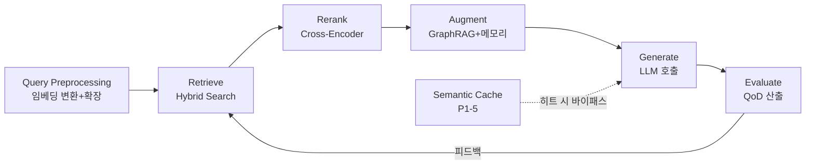

# 6-Stage RAG Pipeline 통합 상세 (V1)

> **세션**: P1-10 (2026-04-13)
> **산출물 버전**: v1.1 (Step 2 재검증 교정: 인터페이스명 5건 수정)
> **상태**: COMPLETE
> **LOCK 준수**: LOCK-MR-007 (6-Stage RAG: Collect→Chunk→Embed→Store→Retrieve→Generate)
> **정본**: D2.0-06 §1.1 (LOCK-MR-007), §4 (인덱싱 제한), Part2 V1-Phase 2 항목3/게이트6
> **교차 참조**: P0-1 MemoryRecordSchema, P0-3 chroma_collection_strategy, P0-4 vectorstore_abc.py, P1-3 chroma_adapter, P1-4 json_graphrag, P1-5 semantic_cache, P1-7 pii_masking, P1-9 dcl_basic, P1-11 hybrid_search (후속)
> **권한 체인**: RULE 1.3 > PLAN 3.0 > D2.0-06 (LOCK) > Part2 V1-P2 (구현가이드) > _index.md (Phase 0 총괄) > 본 문서 (IMPL-DETAIL)
>
> **LOCK 준수 상세**:
>   - LOCK-MR-007: 6-Stage RAG Pipeline 순서 — Collect→Chunk→Embed→Store→Retrieve→Generate (D2.0-06 §1.1)
>   - LOCK-MR-008: Hybrid Search α=0.7 Dense (Stage 5 Retrieve)
>   - LOCK-MR-009: Similarity threshold=0.75 (Stage 5 Retrieve)
>   - LOCK-MR-011: BGE-M3 1024dim 원본 + Matryoshka 256dim 검색용 (Stage 3 Embed)
>   - LOCK-MR-012: V1 Chroma (Stage 4 Store)
>   - LOCK-MR-014: VectorStore 4메서드 (Stage 4/5)
>   - LOCK-MR-015: Deny 판정 시 벡터 삽입 금지 (Stage 4 Store 게이트)
>   - LOCK-MR-017: project_id 격리 (전 Stage)
>   - LOCK-MR-019: 루프 저장 폭주 방지 (Stage 1 Collect 제한)
>
> **입력 파일**:
>   - D2.0-06 §1.1 (LOCK-MR-007: 6-Stage 정본 정의)
>   - D2.0-06 §4 (인덱싱/운영 제한)
>   - D2.1-D6 (RAG 관련 스키마)
>   - Part2 V1-Phase 2 항목3 + 게이트6 (6단계 파이프라인 통합 요건)
>   - STEP7-D: S7D-012 (하이브리드 검색), S7D-018 (Cross-Encoder 재순위화), S7D-027 (BGE-M3), S7D-055 (문서 수집), S7D-058 (임베딩 자동화)
>   - _index.md: 02_rag-pipeline Phase 0 총괄 (§1 6-Stage, §2 Hybrid Search)
>   - P0-4: vectorstore_abc.py (VectorStoreABC)
>   - P1-3: chroma_adapter.md (ChromaVectorStore FULL 구현)
>   - P1-4: json_graphrag.md (GraphRAG — Stage 5 컨텍스트 보강)
>   - P1-5: semantic_cache.md (Semantic Cache — Stage 5 캐시 레이어)
>   - I-2 참조: RAG 6단계 파라미터 → 본 문서에서 SHELL→FULL 전환
>
> **이전 단계 이월 사항**: P1-1~P1-9 이월 없음. _index.md §6 서브파일 목록에서 `collect_chunk.md`, `embed_store.md`, `retrieve_generate.md` 3건이 "⬜ Phase 1"로 표기되어 있으나, P1-10은 6-Stage 전체 통합 문서를 단일 산출물로 생성하는 세션이므로 해당 3건의 내용을 본 문서에 포괄한다.

---

## 목차

1. [Purpose / Scope](#1-purpose--scope)
2. [E2E Mermaid — 6-Stage RAG Pipeline 전체 흐름](#2-e2e-mermaid--6-stage-rag-pipeline-전체-흐름)
3. [Stage 1: Collect (수집)](#3-stage-1-collect-수집)
4. [Stage 2: Chunk (쪼개기)](#4-stage-2-chunk-쪼개기)
5. [Stage 3: Embed (벡터화)](#5-stage-3-embed-벡터화)
6. [Stage 4: Store (저장)](#6-stage-4-store-저장)
7. [Stage 5: Retrieve (검색)](#7-stage-5-retrieve-검색)
8. [Stage 6: Generate (생성)](#8-stage-6-generate-생성)
9. [Query-Time Sub-Pipeline (Retrieve→Generate 런타임 상세)](#9-query-time-sub-pipeline-retrievegenerate-런타임-상세)
10. [호출 방향 정합성 검증](#10-호출-방향-정합성-검증)
11. [I-2 SHELL→FULL 전환 명세](#11-i-2-shellfull-전환-명세)
12. [에러 코드 정의](#12-에러-코드-정의)
13. [복구/재시도 전략](#13-복구재시도-전략)
14. [에스컬레이션 정책](#14-에스컬레이션-정책)
15. [로깅 규격 (R-01-7)](#15-로깅-규격-r-01-7)
16. [시간복잡도 분석 (Big-O)](#16-시간복잡도-분석-big-o)
17. [예외 처리 정책 표](#17-예외-처리-정책-표)
18. [메트릭 수집 포인트](#18-메트릭-수집-포인트)
19. [운영 한계 (V1)](#19-운영-한계-v1)
20. [단위 테스트 시나리오](#20-단위-테스트-시나리오)
21. [Phase 2 통합 테스트](#21-phase-2-통합-테스트)
22. [세션 간 인터페이스 cross-check](#22-세션-간-인터페이스-cross-check)
23. [LOCK-MR 참조 추적표](#23-lock-mr-참조-추적표)
24. [교차 참조 블록](#24-교차-참조-블록)

---

## 1. Purpose / Scope

### 1.1 목적

본 문서는 VAMOS V1의 **6-Stage RAG Pipeline**(LOCK-MR-007)의 각 단계를 L3 수준(입출력/에러/메트릭/파라미터 상세)으로 기술한다. D2.0-06 §1.1에서 LOCK으로 정의된 파이프라인 순서 — **Collect→Chunk→Embed→Store→Retrieve→Generate** — 를 정본으로 사용하며, 각 Stage를 독립 컴포넌트로 분리하여 입출력 인터페이스를 규격화한다.

### 1.2 범위

| 범위 | 포함 | 미포함 |
|------|------|--------|
| 인제스트 경로 | Stage 1~4 (Collect→Store) | 외부 크롤러/수집기 구현 (DCL: P1-9 소관) |
| 검색 경로 | Stage 5~6 (Retrieve→Generate) | LLM 모델 선택 로직 (1-2 Auxiliary 소관) |
| Hybrid Search | Stage 5 내 Dense+Sparse 통합 접점 | Hybrid Search 상세 구현 (P1-11 소관) |
| GraphRAG | Stage 5 컨텍스트 보강 접점 | KG CRUD/스키마 (P1-4 소관) |
| Semantic Cache | Stage 5 캐시 계층 접점 | 캐시 히트/무효화 상세 (P1-5 소관) |
| PII | Stage 1/4 전처리 접점 | PII 탐지/마스킹 상세 (P1-7 소관) |
| DCL | Stage 4 정책 게이트 접점 | DCL 판정 로직 (P1-9 소관) |

### 1.3 용어

| 용어 | 정의 |
|------|------|
| **Ingest Path** | Stage 1→2→3→4 (문서 → 벡터 저장) |
| **Query Path** | Stage 5→6 (쿼리 → 응답 생성) |
| **Query-Time Sub-Pipeline** | Stage 5~6 내부의 세분화: Query Preprocessing → Retrieve → Rerank → Augment → Generate → Evaluate |

---

## 2. E2E Mermaid — 6-Stage RAG Pipeline 전체 흐름

```mermaid
flowchart TB
    subgraph IngestPath["Ingest Path (Stage 1→4)"]
        S1[Stage 1: Collect<br/>문서/URL/DB 수집]
        S2[Stage 2: Chunk<br/>300~500tok 분할]
        S3[Stage 3: Embed<br/>BGE-M3 벡터화]
        S4[Stage 4: Store<br/>VectorStore upsert]
    end

    subgraph QueryPath["Query Path (Stage 5→6)"]
        S5[Stage 5: Retrieve<br/>Hybrid Search + Rerank]
        S6[Stage 6: Generate<br/>LLM 컨텍스트 주입]
    end

    S1 -->|raw_text + metadata| S2
    S2 -->|chunks[]| S3
    S3 -->|vectors[] + chunks[]| S4
    S4 -->|stored_ids[]| REG[Registry §8]

    UserQuery([사용자 쿼리]) -->|query_text| S5
    S5 -->|ranked_chunks[]| S6
    S6 -->|response| UserResponse([응답])

    subgraph Guards["Cross-Cutting Guards"]
        PII[PII 마스킹<br/>P1-7]
        DCL[DCL 정책<br/>P1-9]
        PID[project_id 격리<br/>LOCK-MR-017]
    end

    PII -.->|Stage 1 전처리| S1
    DCL -.->|Stage 4 게이트| S4
    PID -.->|전 Stage| IngestPath
    PID -.->|전 Stage| QueryPath

    subgraph Enrichment["보강 레이어"]
        SC[Semantic Cache<br/>P1-5]
        GR[GraphRAG<br/>P1-4]
    end

    SC -.->|캐시 히트 시<br/>Stage 5 바이패스| S6
    GR -.->|그래프 컨텍스트| S5
```

### 2.1 파이프라인 모드

| 모드 | 경로 | 트리거 |
|------|------|--------|
| **Ingest** | Stage 1→2→3→4 | 문서 추가, DCL 수집(P1-9), 사용자 업로드 |
| **Query** | Stage 5→6 | 사용자 대화 쿼리, I-2 Context Builder 호출 |
| **Re-index** | Stage 2→3→4 (Stage 1 생략) | 임베딩 모델 변경, 청킹 전략 변경 시 |

---

## 3. Stage 1: Collect (수집)

### 3.1 역할

외부 소스(파일, URL, DB, DCL 수집기)로부터 원본 텍스트와 메타데이터를 수집한다.

### 3.2 입출력 인터페이스

```python
@dataclass
class CollectInput:
    source_type: Literal["file", "url", "db", "dcl", "manual"]
    source_uri: str                      # 파일 경로, URL, DB 커넥션 등
    project_id: str                      # LOCK-MR-017 격리
    metadata: dict[str, Any] | None = None  # 사용자 지정 메타데이터
    loop_context: bool = False           # LOCK-MR-019: 루프 컨텍스트 여부

@dataclass
class CollectOutput:
    raw_text: str                        # 추출된 원본 텍스트
    source_metadata: SourceMetadata      # 소스 정보 (mime, size, encoding 등)
    doc_id: str                          # UUID — 문서 추적 ID
    project_id: str
    collected_at: datetime               # ISO8601

@dataclass
class SourceMetadata:
    mime_type: str                       # e.g., "text/markdown", "application/pdf"
    file_size_bytes: int
    encoding: str                        # e.g., "utf-8"
    source_uri: str
    extraction_method: str               # e.g., "pymupdf", "beautifulsoup4", "plain"
```

### 3.3 지원 형식 (V1, S7D-055)

| 형식 | 추출 라이브러리 | 비고 |
|------|--------------|------|
| PDF | `pymupdf` (fitz) | 텍스트 + 레이아웃 보존 |
| DOCX | `python-docx` | 문단/표 추출 |
| TXT/MD | 내장 (plain read) | UTF-8 기본 |
| HTML | `beautifulsoup4` | 태그 제거, 본문 추출 |
| CSV/XLSX | `pandas` | 행 단위 텍스트 변환 |
| JSON | 내장 (json.loads) | 중첩 구조 평탄화 |

### 3.4 LOCK-MR-019 루프 저장 폭주 방지

```python
def collect(self, input: CollectInput) -> CollectOutput:
    # LOCK-MR-019: 루프 컨텍스트에서는 원문 저장 금지
    if input.loop_context:
        # 요약/메타/링크만 허용 — 원문 텍스트 저장 불가
        raise RAG_ERR_001("Loop context: raw text storage prohibited (LOCK-MR-019)")
    # ...
```

### 3.5 PII 전처리 (P1-7 접점)

Stage 1에서 수집된 `raw_text`는 Stage 2 진입 전에 PII 스캔을 수행한다:

```python
# PII 전처리 — P1-7 pii_masking.mask() 호출
mask_result = pii_masker.mask(raw_text)  # MaskResult(masked_text, mask_count, details)
if mask_result.mask_count > 0:
    log_pii_event(doc_id, mask_result)  # 로깅 R-01-7
masked_text = mask_result.masked_text
```

### 3.6 DCL 연동 (P1-9 접점)

| DCL 소스 | 수집 방식 | 주기 |
|----------|---------|------|
| DCL-FIN (RT-BNP RSS) | P1-9 dcl_collector → Stage 1 자동 삽입 | RSS 구독 이벤트 |
| DCL-TECH (RSS) | P1-9 dcl_collector → Stage 1 자동 삽입 | 1시간 폴링 |

### 3.7 에러 처리

| 에러 코드 | 조건 | 처리 |
|----------|------|------|
| RAG_ERR_001 | 루프 컨텍스트 원문 저장 시도 (LOCK-MR-019) | 즉시 거부, 에스컬레이션 LEVEL-1 |
| RAG_ERR_002 | 지원하지 않는 파일 형식 | 거부 + failure_code 레지스트리(§8) 기록 |
| RAG_ERR_003 | 파일 읽기 실패 (권한/없음/손상) | 재시도 0회, 파이프라인 중단, 레지스트리 기록 |
| RAG_ERR_004 | 텍스트 추출 실패 | 재시도 1회 후 중단, 레지스트리 기록 |

---

## 4. Stage 2: Chunk (쪼개기)

### 4.1 역할

수집된 원본 텍스트를 검색 단위 청크(300~500 토큰)로 분할한다.

### 4.2 입출력 인터페이스

```python
@dataclass
class ChunkInput:
    raw_text: str
    doc_id: str
    project_id: str
    source_metadata: SourceMetadata
    chunk_config: ChunkConfig | None = None  # 기본값 사용 시 None

@dataclass
class ChunkConfig:
    target_tokens: int = 400           # 목표 청크 크기 (300~500 범위)
    min_tokens: int = 300              # 최소 청크 크기
    max_tokens: int = 500              # 최대 청크 크기
    overlap_tokens: int = 50           # 오버랩 (10~15%)
    strategy: Literal["recursive", "sentence", "semantic"] = "recursive"

@dataclass
class ChunkOutput:
    chunks: list[Chunk]
    doc_id: str
    project_id: str
    total_chunks: int
    chunking_metadata: ChunkingMetadata

@dataclass
class Chunk:
    chunk_id: str                       # UUID
    doc_id: str                         # 부모 문서 ID
    text: str                           # 청크 텍스트
    token_count: int                    # 토큰 수
    position: int                       # 문서 내 순서 (0-based)
    overlap_prev: bool                  # 이전 청크와 오버랩 여부
    metadata: dict[str, Any]            # 소스 메타데이터 상속

@dataclass
class ChunkingMetadata:
    strategy: str
    target_tokens: int
    overlap_tokens: int
    total_tokens_processed: int
    elapsed_ms: float
```

### 4.3 청킹 전략 (V1)

| 전략 | 설명 | V1 기본 |
|------|------|---------|
| `recursive` | RecursiveCharacterTextSplitter 방식 — 문단→문장→단어 계층적 분할 | **기본값** |
| `sentence` | 문장 경계 기반 분할 — 한국어 `kss` 문장 분리 지원 | 한국어 문서 시 |
| `semantic` | 의미 단위 분할 — 임베딩 유사도 기반 | V2 확장 |

### 4.4 한국어 처리 특이사항

- 토큰화: `tiktoken` (GPT 토크나이저) 기준 토큰 수 계산
- 문장 분리: `kss` (Korean Sentence Splitter) 사용
- 조사/어미 처리: 청크 경계에서 조사 분리 방지 (문장 단위 분할 우선)

### 4.5 운영 한계

- **V1 최대 청크 수**: 30개 (D2.0-06 §1.1, §4 인덱싱 제한)
- 초과 시: 앞쪽 30개만 인덱싱, 나머지는 `truncated=true` 메타데이터 표기 + 경고 로그

### 4.6 에러 처리

| 에러 코드 | 조건 | 처리 |
|----------|------|------|
| RAG_ERR_005 | 빈 텍스트 입력 (0 토큰) | 파이프라인 중단, failure_code 기록 |
| RAG_ERR_006 | 청크 결과 0건 | 원본 단위 폴백 (전체 텍스트를 1청크로) |
| RAG_ERR_007 | 청크 수 > 30 (V1 한계) | 상위 30개만 진행 + 경고 로그 |

---

## 5. Stage 3: Embed (벡터화)

### 5.1 역할

청크 텍스트를 BGE-M3 임베딩 모델로 벡터 변환한다 (LOCK-MR-011).

### 5.2 입출력 인터페이스

```python
@dataclass
class EmbedInput:
    chunks: list[Chunk]
    project_id: str
    embed_config: EmbedConfig | None = None

@dataclass
class EmbedConfig:
    model: str = "bge-m3"               # LOCK-MR-011
    full_dim: int = 1024                # 원본 차원 (LOCK)
    search_dim: int = 256               # Matryoshka 검색용 (LOCK)
    batch_size: int = 128               # S7D-027 배치 크기
    normalize: bool = True              # L2 정규화 (코사인 유사도용)

@dataclass
class EmbedOutput:
    vectors: list[VectorRecord]
    project_id: str
    embedding_metadata: EmbeddingMetadata

@dataclass
class VectorRecord:
    chunk_id: str
    doc_id: str
    vector_full: list[float]            # 1024dim 원본 (저장용)
    vector_search: list[float]          # 256dim Matryoshka (검색용)
    text: str                           # 원본 청크 텍스트
    metadata: dict[str, Any]
    embedded_at: datetime

@dataclass
class EmbeddingMetadata:
    model: str
    full_dim: int
    search_dim: int
    batch_size: int
    total_chunks: int
    elapsed_ms: float
    gpu_used: bool                      # CUDA 가속 여부
```

### 5.3 BGE-M3 임베딩 파이프라인 (S7D-027)

```python
from FlagEmbedding import BGEM3FlagModel

class BGEm3Embedder:
    def __init__(self, config: EmbedConfig):
        self.model = BGEM3FlagModel("BAAI/bge-m3", use_fp16=True)
        self.config = config

    def embed_batch(self, texts: list[str]) -> list[VectorRecord]:
        # 배치 128개 단위 처리 (S7D-027)
        embeddings = self.model.encode(
            texts,
            batch_size=self.config.batch_size,
            max_length=512,
            return_dense=True
        )
        # 1024dim → 256dim Matryoshka 차원 축소
        full_vectors = embeddings["dense_vecs"]        # (N, 1024)
        search_vectors = full_vectors[:, :256]          # Matryoshka truncation
        # L2 정규화
        search_vectors = normalize(search_vectors)
        return [VectorRecord(...) for ...]
```

### 5.4 에러 처리

| 에러 코드 | 조건 | 처리 |
|----------|------|------|
| RAG_ERR_008 | 임베딩 모델 로드 실패 | 재시도 3회 후 파이프라인 중단 (D2.0-06 §1.1) |
| RAG_ERR_009 | 개별 청크 임베딩 실패 | 해당 청크 건너뛰기 + 경고 로그, 나머지 계속 |
| RAG_ERR_010 | 배치 임베딩 부분 실패 | 실패 청크만 개별 재시도 1회 |

### 5.5 증분 인덱싱 (S7D-058)

- 변경된 청크만 재임베딩 — `chunk_hash` 비교로 변경 감지
- 실패 시 재시도 큐 (max 3회), 큐 소진 시 RAG_ERR_008 에스컬레이션

---

## 6. Stage 4: Store (저장)

### 6.1 역할

벡터와 메타데이터를 VectorStore 어댑터(P0-4, P1-3)를 통해 영속 저장한다.

### 6.2 입출력 인터페이스

```python
@dataclass
class StoreInput:
    vectors: list[VectorRecord]
    project_id: str
    policy_decision: PolicyDecision      # P1-9 DCL 판정 결과

@dataclass
class StoreOutput:
    stored_ids: list[str]                # 성공적으로 저장된 chunk_id 목록
    rejected_ids: list[str]              # Deny 등으로 거부된 chunk_id 목록
    bm25_synced: bool                    # BM25 인덱스 동기화 완료 여부
    registry_logged: bool                # 레지스트리(§8) 기록 완료 여부
```

### 6.3 DCL 정책 게이트 (LOCK-MR-015, P1-9 접점)

```python
def store(self, input: StoreInput) -> StoreOutput:
    # LOCK-MR-015: Deny 판정 시 벡터 삽입 절대 금지
    if input.policy_decision == PolicyDecision.DENY:
        log_deny_event(input.project_id, input.vectors)
        return StoreOutput(
            stored_ids=[],
            rejected_ids=[v.chunk_id for v in input.vectors],
            bm25_synced=False,
            registry_logged=True
        )
    # LOCK-MR-017: project_id 격리
    for vec in input.vectors:
        vec.metadata["project_id"] = input.project_id
    # ChromaVectorStore.upsert() 호출 (P1-3)
    result = self.vector_store.upsert(input.vectors, project_id=input.project_id)
    # BM25 인덱스 동기화 (P1-3 BM25IndexManager)
    self.bm25_manager.sync(input.vectors, input.project_id)
    return StoreOutput(...)
```

### 6.4 VectorStore 어댑터 연동 (P0-4, P1-3)

| 메서드 | Stage 4 용도 | LOCK |
|--------|-------------|------|
| `upsert()` | 벡터 + 메타데이터 저장/업데이트 | LOCK-MR-014 |
| `delete()` | 문서 삭제 시 관련 벡터 제거 | LOCK-MR-014 |
| `get_by_id()` | 특정 청크 조회 (디버그/검증용) | LOCK-MR-014 |
| `search()` | (Stage 5에서 사용) | LOCK-MR-014 |

### 6.5 에러 처리

| 에러 코드 | 조건 | 처리 |
|----------|------|------|
| RAG_ERR_011 | Chroma upsert 실패 | 재시도 2회 후 실패 — 레지스트리(§8) failure_code 기록 |
| RAG_ERR_012 | BM25 동기화 실패 | BM25 인덱스 재구축 시도 1회, 실패 시 경고 (검색 저하 허용) |
| RAG_ERR_013 | Deny 판정 벡터 삽입 시도 | 즉시 거부 (LOCK-MR-015), 에스컬레이션 LEVEL-2 |

---

## 7. Stage 5: Retrieve (검색)

### 7.1 역할

사용자 쿼리를 벡터화하여 Hybrid Search(Dense+Sparse)로 후보를 검색하고, Rerank로 최종 상위 결과를 반환한다.

### 7.2 입출력 인터페이스

```python
@dataclass
class RetrieveInput:
    query_text: str
    project_id: str                      # LOCK-MR-017 격리
    retrieve_config: RetrieveConfig | None = None

@dataclass
class RetrieveConfig:
    top_k_retrieve: int = 20            # 초기 후보 수 (Part2 V1-P2)
    top_k_rerank: int = 5               # Rerank 후 최종 수 (Part2 V1-P2)
    alpha: float = 0.7                  # LOCK-MR-008: Dense 가중치
    threshold: float = 0.75             # LOCK-MR-009: 유사도 임계값
    use_cache: bool = True              # Semantic Cache 활성화
    use_graph: bool = True              # GraphRAG 컨텍스트 보강

@dataclass
class RetrieveOutput:
    ranked_chunks: list[RankedChunk]
    cache_hit: bool                      # Semantic Cache 히트 여부
    graph_context: GraphContext | None   # GraphRAG 보강 결과
    retrieve_metadata: RetrieveMetadata

@dataclass
class RankedChunk:
    chunk_id: str
    doc_id: str
    text: str
    final_score: float                   # Hybrid + Rerank 최종 점수
    semantic_score: float                # Dense 유사도
    keyword_score: float                 # BM25 점수
    rerank_score: float | None           # Cross-Encoder 점수 (Rerank 후)
    metadata: dict[str, Any]

@dataclass
class RetrieveMetadata:
    query_embedding_ms: float
    dense_search_ms: float
    sparse_search_ms: float
    rerank_ms: float
    total_ms: float
    candidates_before_threshold: int
    candidates_after_threshold: int
```

### 7.3 Hybrid Search 통합 접점 (P1-11)

Stage 5 내부의 Hybrid Search는 P1-11에서 상세 구현한다. 본 문서에서는 통합 인터페이스만 정의한다:

```python
def retrieve(self, input: RetrieveInput) -> RetrieveOutput:
    # 1. Semantic Cache 확인 (P1-5)
    if input.retrieve_config.use_cache:
        cache_result = self.semantic_cache.get(
            query_text=input.query_text,
            project_id=input.project_id
        )
        if cache_result.hit:  # cosine >= 0.95 (LOCK-MR-010)
            return RetrieveOutput(cache_hit=True, ...)

    # 2. 쿼리 임베딩 생성
    query_vector = self.embedder.embed_single(input.query_text)  # 256dim search

    # 3. Hybrid Search (P1-11 상세)
    #    Dense: VectorStore.search() cosine similarity (α=0.7, LOCK-MR-008)
    #    Sparse: BM25 키워드 검색 (1-α=0.3)
    #    final_score = α × semantic_score + (1-α) × keyword_score
    candidates = self.hybrid_searcher.search(
        query_vector=query_vector,
        query_text=input.query_text,
        project_id=input.project_id,
        top_k=input.retrieve_config.top_k_retrieve,
        alpha=input.retrieve_config.alpha
    )

    # 4. Threshold 필터링 (LOCK-MR-009)
    filtered = [c for c in candidates if c.final_score >= input.retrieve_config.threshold]

    # 5. Cross-Encoder Rerank (S7D-018: ms-marco-MiniLM)
    reranked = self.reranker.rerank(
        query=input.query_text,
        candidates=filtered,
        top_k=input.retrieve_config.top_k_rerank
    )

    # 6. GraphRAG 컨텍스트 보강 (P1-4)
    graph_context = None
    if input.retrieve_config.use_graph:
        top_entity_ids = extract_entity_ids(reranked)  # 상위 엔티티 node_id 추출
        if not top_entity_ids:
            graph_context = None  # RAG_ERR_018: 엔티티 없음 → GraphRAG 보강 건너뛰기 (graceful degradation)
        else:
            graph_context = self.graph_store.traverse(
                project_id=input.project_id,
                start_node_id=top_entity_ids[0],  # 최우선 엔티티 기점 탐색
                max_hops=2
            )

    return RetrieveOutput(
        ranked_chunks=reranked,
        cache_hit=False,
        graph_context=graph_context,
        retrieve_metadata=RetrieveMetadata(...)
    )
```

### 7.4 Cross-Encoder Rerank (S7D-018)

| 파라미터 | V1 값 | 비고 |
|---------|-------|------|
| 모델 | `ms-marco-MiniLM-L-12-v2` | 로컬 Cross-Encoder |
| 입력 | Top-20 후보 | Hybrid Search 결과 |
| 출력 | Top-5 재순위 | 점수 기반 내림차순 |
| V2 업그레이드 | BGE-reranker 또는 동급 | _index.md §2.2 |

### 7.5 에러 처리

| 에러 코드 | 조건 | 처리 |
|----------|------|------|
| RAG_ERR_014 | 쿼리 임베딩 실패 | 재시도 2회 후 빈 결과 반환 + 알림 |
| RAG_ERR_015 | Hybrid Search 실패 (Dense+Sparse 모두) | 빈 결과 반환 + 에스컬레이션 LEVEL-2 |
| RAG_ERR_016 | Rerank 실패 | Rerank 건너뛰기 — Hybrid 점수만으로 반환 (graceful degradation) |
| RAG_ERR_017 | threshold 후 결과 0건 | 빈 결과 반환 + "검색 결과 없음" 안내 |
| RAG_ERR_018 | GraphRAG 조회 실패 | GraphRAG 보강 건너뛰기 (검색 결과만 사용) |

---

## 8. Stage 6: Generate (생성)

### 8.1 역할

검색 결과 컨텍스트를 LLM 프롬프트에 주입하여 응답을 생성한다.

### 8.2 입출력 인터페이스

```python
@dataclass
class GenerateInput:
    query_text: str
    ranked_chunks: list[RankedChunk]
    graph_context: GraphContext | None
    project_id: str
    conversation_history: list[Message] | None = None

@dataclass
class GenerateOutput:
    response_text: str
    sources: list[SourceCitation]        # 인용 출처 목록
    qod_score: float | None              # Quality of Decision 점수 (0~1)
    token_usage: TokenUsage
    generate_metadata: GenerateMetadata

@dataclass
class SourceCitation:
    chunk_id: str
    doc_id: str
    text_snippet: str                    # 인용 부분 발췌
    score: float                         # 최종 점수

@dataclass
class TokenUsage:
    prompt_tokens: int
    completion_tokens: int
    total_tokens: int
    context_tokens: int                  # 검색 결과 컨텍스트가 차지한 토큰 수

@dataclass
class GenerateMetadata:
    model: str                           # 사용 LLM 모델
    context_chunks_used: int
    graph_entities_used: int
    elapsed_ms: float
```

### 8.3 프롬프트 조립

```python
def generate(self, input: GenerateInput) -> GenerateOutput:
    # 1. Fragment Injection (S7-J-005): 전체 문서 대신 관련 조각만 추출
    context_fragments = self._build_context(
        chunks=input.ranked_chunks,
        graph_context=input.graph_context,
        max_context_tokens=4096           # V1 컨텍스트 토큰 상한
    )

    # 2. 프롬프트 템플릿 조립
    prompt = self._assemble_prompt(
        query=input.query_text,
        context=context_fragments,
        history=input.conversation_history
    )

    # 3. LLM 호출 (1-2 Auxiliary Modules 경계)
    llm_response = self.llm_client.generate(prompt)

    # 4. QoD 평가 (D2.0-06 §7.4)
    qod_score = self._evaluate_qod(
        query=input.query_text,
        response=llm_response.text,
        sources=input.ranked_chunks
    )

    # 5. Semantic Cache 저장 (P1-5 — 캐시 미스 시)
    self.semantic_cache.put(
        query_text=input.query_text,
        response_text=llm_response.text,
        source_refs=[c.chunk_id for c in input.ranked_chunks],
        project_id=input.project_id
    )

    return GenerateOutput(...)
```

### 8.4 에러 처리

| 에러 코드 | 조건 | 처리 |
|----------|------|------|
| RAG_ERR_019 | LLM 호출 실패 | 재시도 2회 후 "검색 결과만 반환" 폴백 (D2.0-06 §1.1) |
| RAG_ERR_020 | 컨텍스트 토큰 초과 | 하위 청크 제거하여 상한 내로 조정 |
| RAG_ERR_021 | QoD 평가 실패 | QoD=None 반환, 응답은 정상 전달 (non-blocking) |

---

## 9. Query-Time Sub-Pipeline (Retrieve→Generate 런타임 상세)

종합계획서 P1-10 절차에서 기술된 6단계 서브 파이프라인(Query→Retrieve→Rerank→Augment→Generate→Evaluate)은 Stage 5~6 내부의 **런타임 쿼리 처리 상세 분해**이다. LOCK-MR-007 정본(Collect→Chunk→Embed→Store→Retrieve→Generate)과의 관계를 아래에 정리한다.

### 9.1 매핑

| Sub-Pipeline 단계 | LOCK-MR-007 Stage | 설명 |
|-------------------|-------------------|------|
| **Query** (전처리) | Stage 5 전처리 | 쿼리 임베딩 변환, 쿼리 확장/재작성 |
| **Retrieve** (검색) | Stage 5 본체 | Hybrid Search (Dense+Sparse) |
| **Rerank** (재순위) | Stage 5 후처리 | Cross-Encoder 재순위화 (S7D-018) |
| **Augment** (보강) | Stage 5→6 전이 | GraphRAG(P1-4) 컨텍스트 + 메모리 컨텍스트 조립 |
| **Generate** (생성) | Stage 6 본체 | LLM 프롬프트 주입 + 응답 생성 |
| **Evaluate** (평가) | Stage 6 후처리 | QoD 점수 산출, 피드백 루프 |

### 9.2 Mermaid — Query-Time Sub-Pipeline



---

## 10. 호출 방향 정합성 검증

| 호출자 | 피호출자 | 방향 | 검증 |
|--------|---------|------|------|
| Stage 1 (Collect) | PII Masker (P1-7) | 6-4 → 6-4 내부 | 단방향 호출 |
| Stage 1 (Collect) | DCL Collector (P1-9) | P1-9 → Stage 1 (이벤트 삽입) | P1-9이 Stage 1에 데이터 주입 |
| Stage 3 (Embed) | BGEm3Embedder | 6-4 내부 | 내부 호출 |
| Stage 4 (Store) | ChromaVectorStore (P1-3) | 6-4 내부 | P1-3 어댑터 호출 |
| Stage 4 (Store) | DCL check_policy (P1-9) | 6-4 내부 | 저장 전 정책 판정 |
| Stage 5 (Retrieve) | SemanticCache (P1-5) | 6-4 내부 | 캐시 조회 |
| Stage 5 (Retrieve) | HybridSearcher (P1-11) | 6-4 내부 | Dense+Sparse 검색 |
| Stage 5 (Retrieve) | JsonGraphStore (P1-4) | 6-4 내부 | 그래프 컨텍스트 조회 |
| Stage 6 (Generate) | LLM Client | 6-4 → 1-2 경계 | I-2 Context Builder 역방향 |
| Stage 6 (Generate) | SemanticCache.store (P1-5) | 6-4 내부 | 캐시 저장 |

**역방향 호출 없음** — 모든 Stage는 단방향(1→2→3→4, 5→6)으로 호출하며, 피드백 루프(Evaluate→Retrieve)는 비동기 이벤트로 처리된다.

---

## 11. I-2 SHELL→FULL 전환 명세

> **I-2**: RAG 6단계 파라미터 상세 — "단계명만 정의" (SHELL) → "각 단계의 입력/출력/에러/메트릭 상세 작성" (FULL)

| # | SHELL 항목 | FULL 전환 내용 | 본 문서 위치 |
|---|-----------|---------------|-------------|
| 1 | Stage 1 Collect — 단계명만 | CollectInput/CollectOutput 데이터클래스, 6형식 지원, PII 전처리, DCL 연동, 에러 4종 | §3 |
| 2 | Stage 2 Chunk — 단계명만 | ChunkInput/ChunkOutput 데이터클래스, 3전략(recursive/sentence/semantic), 한국어 처리, 오버랩, 에러 3종 | §4 |
| 3 | Stage 3 Embed — 단계명만 | EmbedInput/EmbedOutput 데이터클래스, BGE-M3 파이프라인, 1024/256dim, 배치 128, 증분 인덱싱, 에러 3종 | §5 |
| 4 | Stage 4 Store — 단계명만 | StoreInput/StoreOutput 데이터클래스, DCL 게이트, VectorStore 어댑터 4메서드 연동, BM25 동기화, 에러 3종 | §6 |
| 5 | Stage 5 Retrieve — 단계명만 | RetrieveInput/RetrieveOutput 데이터클래스, Hybrid Search 통합 접점, Rerank, GraphRAG 보강, Semantic Cache, 에러 5종 | §7 |
| 6 | Stage 6 Generate — 단계명만 | GenerateInput/GenerateOutput 데이터클래스, Fragment Injection, QoD 평가, 캐시 저장, 에러 3종 | §8 |
| 7 | Query Sub-Pipeline — 미정의 | 6단계 서브 파이프라인 매핑 (Query→Retrieve→Rerank→Augment→Generate→Evaluate) | §9 |
| 8 | 메트릭 수집 — 미정의 | 6 Stage별 메트릭 수집 포인트 12종 정의 | §18 |
| 9 | 운영 한계 — 개요만 | 문서 15개, 청크 30개, 상세 제약 + 초과 시 처리 전략 | §19 |
| 10 | 에러/복구 — 미정의 | 에러 21종, 복구/재시도 전략, 에스컬레이션 3레벨 | §12~§14 |

**전환 상태**: 10/10 FULL (SHELL 항목 잔여 0건)

---

## 12. 에러 코드 정의

| 코드 | Stage | 조건 | 심각도 |
|------|-------|------|--------|
| RAG_ERR_001 | 1 | 루프 컨텍스트 원문 저장 시도 (LOCK-MR-019) | ERROR |
| RAG_ERR_002 | 1 | 미지원 파일 형식 | WARNING |
| RAG_ERR_003 | 1 | 파일 읽기 실패 | ERROR |
| RAG_ERR_004 | 1 | 텍스트 추출 실패 | ERROR |
| RAG_ERR_005 | 2 | 빈 텍스트 입력 | ERROR |
| RAG_ERR_006 | 2 | 청크 결과 0건 | WARNING |
| RAG_ERR_007 | 2 | 청크 수 초과 (>30) | WARNING |
| RAG_ERR_008 | 3 | 임베딩 모델 로드 실패 | CRITICAL |
| RAG_ERR_009 | 3 | 개별 청크 임베딩 실패 | WARNING |
| RAG_ERR_010 | 3 | 배치 임베딩 부분 실패 | WARNING |
| RAG_ERR_011 | 4 | Chroma upsert 실패 | ERROR |
| RAG_ERR_012 | 4 | BM25 동기화 실패 | WARNING |
| RAG_ERR_013 | 4 | Deny 판정 벡터 삽입 시도 (LOCK-MR-015) | CRITICAL |
| RAG_ERR_014 | 5 | 쿼리 임베딩 실패 | ERROR |
| RAG_ERR_015 | 5 | Hybrid Search 전체 실패 | ERROR |
| RAG_ERR_016 | 5 | Rerank 실패 | WARNING |
| RAG_ERR_017 | 5 | threshold 후 결과 0건 | INFO |
| RAG_ERR_018 | 5 | GraphRAG 조회 실패 | WARNING |
| RAG_ERR_019 | 6 | LLM 호출 실패 | ERROR |
| RAG_ERR_020 | 6 | 컨텍스트 토큰 초과 | WARNING |
| RAG_ERR_021 | 6 | QoD 평가 실패 | INFO |

---

## 13. 복구/재시도 전략

| Stage | 에러 | 재시도 | 폴백 | 복구 후 상태 |
|-------|------|--------|------|-------------|
| 1 | RAG_ERR_003 (파일 읽기) | 0회 | 파이프라인 중단 | 레지스트리 failure_code |
| 1 | RAG_ERR_004 (추출) | 1회 | 중단 | 레지스트리 failure_code |
| 2 | RAG_ERR_006 (0청크) | 0회 | 원본 1청크 폴백 | 경고 로그 |
| 3 | RAG_ERR_008 (모델 로드) | 3회, 간격 2^n초 | 중단 | 에스컬레이션 LEVEL-3 |
| 3 | RAG_ERR_009 (개별 임베딩) | 1회 | 건너뛰기 | 부분 성공 |
| 4 | RAG_ERR_011 (upsert) | 2회, 간격 1초 | 중단 | 레지스트리 failure_code |
| 4 | RAG_ERR_012 (BM25 동기화) | 1회 (재구축) | 검색 저하 허용 | 경고 로그 |
| 5 | RAG_ERR_014 (쿼리 임베딩) | 2회 | 빈 결과 | 알림 |
| 5 | RAG_ERR_015 (Search 전체) | 1회 | 빈 결과 | 에스컬레이션 LEVEL-2 |
| 5 | RAG_ERR_016 (Rerank) | 0회 | Hybrid 점수만 사용 | graceful degradation |
| 6 | RAG_ERR_019 (LLM) | 2회, 간격 2^n초 | "검색 결과만 반환" | 폴백 응답 |

---

## 14. 에스컬레이션 정책

### 14.1 에스컬레이션 레벨

| 레벨 | 트리거 | 동작 | 알림 대상 |
|------|--------|------|----------|
| LEVEL-1 | RAG_ERR_001 (LOCK-MR-019 위반 시도) | 로그 + 이벤트 발행 | 로깅 시스템 |
| LEVEL-2 | RAG_ERR_013/015 (Deny 삽입/전체 검색 실패) | 로그 + 이벤트 + UI 알림 | 사용자 + 모니터링 |
| LEVEL-3 | RAG_ERR_008 (임베딩 모델 불가) | 로그 + 이벤트 + UI 알림 + 시스템 상태 경고 | 사용자 + 관리자 |

### 14.2 EscalationPayload 표준 구조

```python
@dataclass
class EscalationPayload:
    escalation_id: str                   # UUID
    level: Literal["LEVEL-1", "LEVEL-2", "LEVEL-3"]
    error_code: str                      # RAG_ERR_XXX
    stage: int                           # 1~6
    project_id: str
    timestamp: datetime                  # ISO8601
    context: dict[str, Any]              # 에러 상세 컨텍스트
    retry_count: int                     # 재시도 횟수
    resolution: str | None               # 복구 결과 (성공/실패/폴백)
    lock_checks: list[str]               # 관련 LOCK ID 목록
```

---

## 15. 로깅 규격 (R-01-7)

### 15.1 구조화 로그 포맷

```json
{
  "timestamp": "2026-04-13T10:30:00Z",
  "level": "INFO|WARNING|ERROR|CRITICAL",
  "component": "rag_pipeline",
  "stage": 1,
  "stage_name": "collect",
  "action": "collect_start|collect_success|collect_fail",
  "project_id": "proj_abc123",
  "doc_id": "doc_xyz789",
  "details": {
    "source_type": "file",
    "mime_type": "application/pdf",
    "file_size_bytes": 102400
  },
  "lock_checks": ["LOCK-MR-017", "LOCK-MR-019"],
  "error_code": null,
  "elapsed_ms": 150.3,
  "entity_id": "doc_xyz789",
  "session_id": "sess_001"
}
```

### 15.2 Stage별 로그 이벤트

| Stage | 시작 이벤트 | 성공 이벤트 | 실패 이벤트 |
|-------|-----------|-----------|-----------|
| 1 | `collect_start` | `collect_success` | `collect_fail` |
| 2 | `chunk_start` | `chunk_success` | `chunk_fail` |
| 3 | `embed_start` | `embed_success` | `embed_fail` |
| 4 | `store_start` | `store_success` | `store_fail` |
| 5 | `retrieve_start` | `retrieve_success` | `retrieve_fail` |
| 6 | `generate_start` | `generate_success` | `generate_fail` |

---

## 16. 시간복잡도 분석 (Big-O)

| Stage | 연산 | 시간복잡도 | 설명 |
|-------|------|-----------|------|
| 1 Collect | 텍스트 추출 | O(D) | D = 문서 크기 (바이트) |
| 2 Chunk | 텍스트 분할 | O(T) | T = 총 토큰 수 |
| 3 Embed | BGE-M3 인퍼런스 | O(C × L) | C = 청크 수, L = 최대 시퀀스 길이 (512) |
| 4 Store | Chroma upsert | O(C × log N) | N = 기존 벡터 수 (HNSW 인덱스) |
| 4 Store | BM25 동기화 | O(C × W) | W = 평균 청크 내 단어 수 |
| 5 Retrieve | Dense 검색 | O(log N + K) | K = top_k (HNSW 근사) |
| 5 Retrieve | BM25 검색 | O(Q × log N) | Q = 쿼리 단어 수 |
| 5 Retrieve | Cross-Encoder Rerank | O(K × L²) | K = 20 후보, L = 시퀀스 길이 (어텐션) |
| 6 Generate | LLM 호출 | O(P × R) | P = 프롬프트 토큰, R = 응답 토큰 |
| 6 Generate | QoD 평가 | O(1) | 고정 비용 점수 산출 |

### V1 예상 지연시간 (로컬, CPU)

| Stage | 예상 지연 | 비고 |
|-------|---------|------|
| 1 Collect | 50~500ms | 파일 크기 의존 |
| 2 Chunk | 10~50ms | 30청크 이하 |
| 3 Embed | 500~2000ms | 30청크, CPU 기준 |
| 4 Store | 50~200ms | Chroma upsert |
| 5 Retrieve | 200~800ms | Hybrid Search + Rerank |
| 6 Generate | 1000~5000ms | LLM 모델 의존 |

---

## 17. 예외 처리 정책 표

| 예외 유형 | 영향 Stage | 처리 정책 | LOCK 관련 |
|----------|-----------|---------|----------|
| 파이프라인 중단 | 전체 | 현재 Stage에서 중단, failure_code 레지스트리(§8) 기록, 부분 결과 폐기 | — |
| Graceful Degradation | 5 | Rerank 실패 시 Hybrid 점수만 사용, GraphRAG 실패 시 벡터 결과만 사용 | — |
| 폴백 응답 | 6 | LLM 실패 시 검색 결과 텍스트만 반환 (D2.0-06 §1.1) | — |
| LOCK 위반 시도 | 4 | Deny 삽입 즉시 거부, 에스컬레이션 LEVEL-2 | LOCK-MR-015 |
| 루프 폭주 시도 | 1 | 즉시 거부, 에스컬레이션 LEVEL-1 | LOCK-MR-019 |
| project_id 누락 | 전체 | 요청 거부 (400 Bad Request) | LOCK-MR-017 |

---

## 18. 메트릭 수집 포인트

| # | 메트릭 ID | Stage | 메트릭명 | 단위 | 수집 시점 |
|---|----------|-------|---------|------|----------|
| 1 | MET-RAG-001 | 1 | `collect_latency_ms` | ms | collect 완료 시 |
| 2 | MET-RAG-002 | 1 | `collect_doc_size_bytes` | bytes | collect 완료 시 |
| 3 | MET-RAG-003 | 2 | `chunk_count` | count | chunk 완료 시 |
| 4 | MET-RAG-004 | 2 | `chunk_avg_tokens` | tokens | chunk 완료 시 |
| 5 | MET-RAG-005 | 3 | `embed_latency_ms` | ms | embed 완료 시 |
| 6 | MET-RAG-006 | 3 | `embed_gpu_used` | bool | embed 완료 시 |
| 7 | MET-RAG-007 | 4 | `store_upsert_count` | count | store 완료 시 |
| 8 | MET-RAG-008 | 4 | `store_reject_count` | count | store 완료 시 (Deny) |
| 9 | MET-RAG-009 | 5 | `retrieve_latency_ms` | ms | retrieve 완료 시 |
| 10 | MET-RAG-010 | 5 | `retrieve_cache_hit` | bool | retrieve 시 |
| 11 | MET-RAG-011 | 5 | `retrieve_candidates_after_threshold` | count | threshold 필터 후 |
| 12 | MET-RAG-012 | 6 | `generate_latency_ms` | ms | generate 완료 시 |
| 13 | MET-RAG-013 | 6 | `generate_qod_score` | float | QoD 평가 완료 시 |
| 14 | MET-RAG-014 | 6 | `generate_token_usage` | tokens | generate 완료 시 |

---

## 19. 운영 한계 (V1)

> 정본: D2.0-06 §1.1, §4

| 제약 | V1 값 | 초과 시 처리 | LOCK |
|------|-------|-------------|------|
| 최대 문서 수 | 15개 | 16번째부터 거부 + 경고 | D2.0-06 §1.1 |
| 최대 청크 수 | 30개 | 상위 30개만 인덱싱, 나머지 truncated | D2.0-06 §1.1 |
| 임베딩 차원 (원본) | 1024dim | 모델 변경 불가 (V1 고정) | LOCK-MR-011 |
| 임베딩 차원 (검색) | 256dim | Matryoshka 고정 | LOCK-MR-011 |
| Hybrid Search α | 0.7 | 변경 불가 | LOCK-MR-008 |
| Similarity threshold | 0.75 | 변경 불가 | LOCK-MR-009 |
| Semantic Cache 히트 | cosine ≥ 0.95 | 변경 불가 | LOCK-MR-010 |
| Top-K retrieve | 20 | 설정 가능 (LOCK 아님) | — |
| Top-K rerank | 5 | 설정 가능 (LOCK 아님) | — |
| 컨텍스트 토큰 상한 | 4096 tok | 청크 수 조정으로 대응 | — |

---

## 20. 단위 테스트 시나리오

| # | 테스트 ID | Stage | 시나리오 | 검증 |
|---|----------|-------|---------|------|
| 1 | T-RAG-01 | 1 | PDF 문서 수집 — pymupdf 텍스트 추출 | raw_text 비어있지 않음, doc_id 할당 |
| 2 | T-RAG-02 | 1 | 미지원 형식 (.exe) 수집 시도 | RAG_ERR_002 발생 |
| 3 | T-RAG-03 | 1 | 루프 컨텍스트 수집 시도 (LOCK-MR-019) | RAG_ERR_001 발생, 저장 차단 |
| 4 | T-RAG-04 | 2 | 400토큰 문서 → 1청크 분할 | chunk_count=1, token_count ∈ [300,500] |
| 5 | T-RAG-05 | 2 | 2000토큰 문서 → 다수 청크 분할 | 오버랩 존재, 순서 정확 |
| 6 | T-RAG-06 | 2 | 빈 텍스트 입력 | RAG_ERR_005 발생 |
| 7 | T-RAG-07 | 2 | 청크 30개 초과 문서 | RAG_ERR_007 경고, 상위 30개만 진행 |
| 8 | T-RAG-08 | 3 | 단일 청크 BGE-M3 임베딩 | 1024dim 벡터 생성, L2 정규화 |
| 9 | T-RAG-09 | 3 | 30청크 배치 임베딩 | 30 벡터 생성, 256dim search 벡터 포함 |
| 10 | T-RAG-10 | 3 | 임베딩 모델 미로드 상태 | RAG_ERR_008 발생, 3회 재시도 |
| 11 | T-RAG-11 | 4 | 정상 upsert (Allow) | stored_ids에 chunk_id 포함, bm25_synced=True |
| 12 | T-RAG-12 | 4 | Deny 판정 upsert 시도 (LOCK-MR-015) | rejected_ids에 포함, stored_ids 비어있음 |
| 13 | T-RAG-13 | 4 | project_id 격리 검증 (LOCK-MR-017) | 다른 project_id로 검색 시 결과 0건 |
| 14 | T-RAG-14 | 5 | Semantic Cache 히트 | cache_hit=True, Hybrid Search 미실행 |
| 15 | T-RAG-15 | 5 | Hybrid Search — α=0.7 가중치 정확성 | final_score = 0.7×dense + 0.3×sparse |
| 16 | T-RAG-16 | 5 | threshold=0.75 필터링 | score < 0.75 결과 제거 |
| 17 | T-RAG-17 | 5 | Rerank 실패 시 graceful degradation | Hybrid 점수만으로 결과 반환 |
| 18 | T-RAG-18 | 5 | GraphRAG 보강 | graph_context에 엔티티/관계 포함 |
| 19 | T-RAG-19 | 6 | 정상 생성 | response_text 비어있지 않음, sources 포함 |
| 20 | T-RAG-20 | 6 | LLM 실패 시 폴백 | "검색 결과만 반환" 텍스트 응답 |
| 21 | T-RAG-21 | 6 | QoD 평가 동작 | qod_score ∈ [0.0, 1.0] |
| 22 | T-RAG-22 | E2E | Ingest 경로 전체 (Stage 1→4) | 문서 수집→청크→임베딩→저장 완료 |
| 23 | T-RAG-23 | E2E | Query 경로 전체 (Stage 5→6) | 쿼리→검색→생성→응답 완료 |
| 24 | T-RAG-24 | E2E | project_id 격리 E2E | 프로젝트 A 문서를 프로젝트 B에서 검색 불가 |
| 25 | T-RAG-25 | E2E | PII 문서 Ingest — 마스킹 후 저장 | PII 제거된 텍스트만 벡터화 |

---

## 21. Phase 2 통합 테스트

| # | 테스트 ID | 통합 대상 | 시나리오 | 검증 |
|---|----------|----------|---------|------|
| 1 | P2-T-RAG-01 | L0 + Stage 5 | L0 세션 메모리 → Stage 5 검색 컨텍스트 보강 | L0 최근 대화 반영 |
| 2 | P2-T-RAG-02 | L1 + Stage 1~4 | L1 프로젝트 문서 → Ingest 경로 전체 | project_id별 인덱싱 |
| 3 | P2-T-RAG-03 | Hybrid Search + Stage 5 | α=0.7 Dense + 0.3 Sparse → Top-20 → Rerank Top-5 | LOCK-MR-008/009 정합 |
| 4 | P2-T-RAG-04 | Semantic Cache + Stage 5 | 캐시 히트 시 Stage 5 바이패스 | 응답 시간 < 100ms |
| 5 | P2-T-RAG-05 | GraphRAG + Stage 5 | KG 서브그래프 → 컨텍스트 보강 | 관련 엔티티 포함 |
| 6 | P2-T-RAG-06 | DCL + Stage 4 | Deny 판정 문서 → 저장 차단 | LOCK-MR-015 검증 |
| 7 | P2-T-RAG-07 | PII + Stage 1 | PII 포함 문서 → 마스킹 후 Ingest | 벡터에 PII 없음 |
| 8 | P2-T-RAG-08 | B-3 Decay + Stage 4 | TTL 만료 벡터 → 자동 삭제 | Decay 후 검색 결과 미포함 |
| 9 | P2-T-RAG-09 | Export + Stage 5 | 내보내기 데이터 → 재임포트 → 검색 동일 | 데이터 무결성 |
| 10 | P2-T-RAG-10 | DCL-FIN + Stage 1 | RSS 수집 → 자동 Ingest | 자동 인덱싱 완료 |
| 11 | P2-T-RAG-11 | 전 Stage | E2E Ingest + Query + project_id 격리 | 전체 파이프라인 정합 |
| 12 | P2-T-RAG-12 | 전 Stage | 운영 한계 검증 — 문서 15개 + 청크 30개 제한 | 초과 시 정상 처리 |

---

## 22. 세션 간 인터페이스 cross-check

| 선행 세션 | 산출물 | 본 문서 참조 위치 | 인터페이스 정합 |
|----------|--------|-----------------|---------------|
| **P0-1** | `MemoryRecordSchema.md` | §6 Store — policy_decision 필드 | policy_decision: allow/restrict/deny 일치 |
| **P0-3** | `chroma_collection_strategy.md` | §6 Store — 단일 컬렉션 전략 | 단일 컬렉션 + 메타데이터 필터 일치 |
| **P0-4** | `vectorstore_abc.py` | §6 Store — VectorStore ABC 4메서드 | upsert/search/delete/get_by_id 일치 (LOCK-MR-014) |
| **P1-1** | `L0_session_memory_crud.md` | §21 P2-T-RAG-01 — L0 검색 보강 | L0 세션 데이터 → Stage 5 입력 |
| **P1-2** | `L1_project_memory_crud.md` | §21 P2-T-RAG-02 — L1 프로젝트 인덱싱 | L1 project_id → Stage 1~4 입력 |
| **P1-3** | `chroma_adapter.md` | §6 Store, §7 Retrieve — ChromaVectorStore | upsert()/search()/BM25IndexManager 일치 |
| **P1-4** | `json_graphrag.md` | §7 Retrieve — GraphRAG 보강 | traverse(project_id, start_node_id, max_hops=2) 일치 |
| **P1-5** | `semantic_cache.md` | §7 Retrieve — 캐시 계층 | get(query_text, project_id)/put(query_text, response_text, source_refs, project_id) 일치 |
| **P1-7** | `pii_masking.md` | §3 Collect — PII 전처리 | mask(text) → MaskResult 일치 |
| **P1-9** | `dcl_basic.md` | §3 Collect(DCL 연동), §6 Store(정책 게이트) | dcl_collector→Stage 1, check_policy()→Stage 4 일치 |
| **P1-11** | `hybrid_search.md` (후속) | §7 Retrieve — Hybrid Search 통합 접점 | search(query_vector, query_text, project_id, top_k, alpha) 인터페이스 예약 |

---

## 23. LOCK-MR 참조 추적표

| LOCK ID | 항목 | 본 문서 준수 위치 | 위반 여부 |
|---------|------|-----------------|----------|
| LOCK-MR-007 | 6-Stage RAG: Collect→Chunk→Embed→Store→Retrieve→Generate | §2~§8 전체 구조 | 무위반 |
| LOCK-MR-008 | Hybrid Search α=0.7 | §7.3 RetrieveConfig.alpha=0.7 | 무위반 |
| LOCK-MR-009 | Similarity threshold=0.75 | §7.3 RetrieveConfig.threshold=0.75 | 무위반 |
| LOCK-MR-010 | Semantic Cache cosine≥0.95 | §7.3 Semantic Cache 히트 판정 | 무위반 |
| LOCK-MR-011 | BGE-M3 1024dim + 256dim | §5.2 EmbedConfig, §5.3 임베딩 파이프라인 | 무위반 |
| LOCK-MR-012 | V1 Chroma | §6 Store — ChromaVectorStore | 무위반 |
| LOCK-MR-014 | VectorStore 4메서드 | §6.4 어댑터 연동 | 무위반 |
| LOCK-MR-015 | Deny 벡터 삽입 금지 | §6.3 DCL 정책 게이트 | 무위반 |
| LOCK-MR-017 | project_id 격리 | 전 Stage — CollectInput/RetrieveInput.project_id | 무위반 |
| LOCK-MR-019 | 루프 저장 폭주 방지 | §3.4 LOCK-MR-019 검사 | 무위반 |

---

## 24. 교차 참조 블록

### 24.1 선행 세션 산출물

| 세션 | 파일 | 경로 |
|------|------|------|
| P0-1 | MemoryRecordSchema.md | `01_memory-hierarchy/MemoryRecordSchema.md` |
| P0-3 | chroma_collection_strategy.md | `03_vector-db/chroma_collection_strategy.md` |
| P0-4 | vectorstore_abc.py | `03_vector-db/vectorstore_abc.py` |
| P1-1 | L0_session_memory_crud.md | `01_memory-hierarchy/L0_session_memory_crud.md` |
| P1-2 | L1_project_memory_crud.md | `01_memory-hierarchy/L1_project_memory_crud.md` |
| P1-3 | chroma_adapter.md | `03_vector-db/chroma_adapter.md` |
| P1-4 | json_graphrag.md | `02_rag-pipeline/json_graphrag.md` |
| P1-5 | semantic_cache.md | `04_memory-distillation/semantic_cache.md` |
| P1-7 | pii_masking.md | `04_memory-distillation/pii_masking.md` |
| P1-8 | B3_memory_decay.md | `01_memory-hierarchy/B3_memory_decay.md` |
| P1-9 | dcl_basic.md | `02_rag-pipeline/dcl_basic.md` |

### 24.2 후속 세션 접점

| 세션 | 내용 | 본 문서 접점 |
|------|------|-------------|
| P1-11 | Hybrid Search 상세 | §7.3 HybridSearcher 인터페이스 |
| P1-12 | (종합계획서 확인 필요) | — |

### 24.3 인접 도메인 접점

| 도메인 | 접점 | 본 문서 위치 |
|--------|------|-------------|
| 1-2 Auxiliary Modules | I-2 Context Builder — 6-Stage RAG Pipeline 호출 | §8 Generate (LLM Client 경계) |
| 5-2 File-Context | 청킹/검색 전략·알고리즘 설계 (What) vs 6-4 실행 인프라 (How) | §4 Chunk 전략 |
| 6-2 Security | PII 정책 정의 | §3.5 PII 전처리 (6-4는 적용) |
| 6-5 SDAR | 상태 리포트 제공 | §18 메트릭 수집 → SDAR 소비 |
| 6-12 Event-Logging | 감사 로그 생성 | §15 로깅 규격 → 6-12 관리 |

---

*End of Document*
