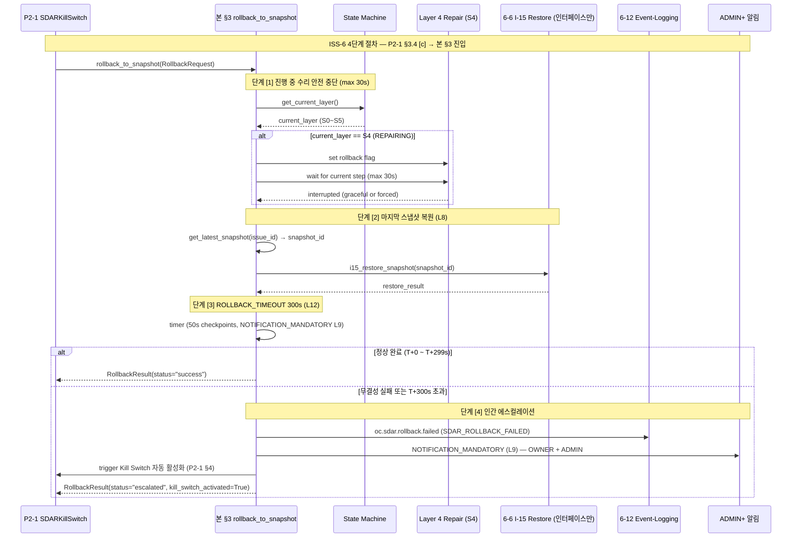

# 03.3 운영 제한 + 스냅샷 롤백 4단계 — ISS-6 해결

> **도메인**: 6-5_SDAR-System / 03_emergency-kill-switch / operational_limits.md
> **Tier**: 6 (System-wide Components)
> **정본**: SDAR_SPEC **§9.2 ~ §9.7** (운영 제한 정본 — LOCK L5~L13, L15~L18) + L8 SNAPSHOT_MANDATORY + L12 ROLLBACK_TIMEOUT 300초
> **Part2 출처**: §6.9 L5463-L5510 — When/Where 정본
> **수정 정책**: **정본** — Phase 변경 시 갱신 (종합계획서 §8.2)
> **생성일**: 2026-04-27 (P2-3, V2-Phase 2)
> **변경 이력 태그**: `V2-Phase 2` — Phase 2 신규 작성, ISS-6 (스냅샷 롤백 4단계) 해결 + 운영 제한 9건 + Self-evo + CATEGORY E + Circuit Breaker (W-CB OPEN 주석) + 비용 통합

---

## §0. Purpose / Scope

본 문서는 SDAR 운영 제한(LOCK L5~L13, L15~L18)을 통합 정의하고, **Kill Switch 활성화 시 호출되는 스냅샷 롤백 4단계 절차**를 L3 수준으로 상세화하여 **ISS-6 (스냅샷 롤백 절차)** 를 해결한다. 본 문서는 P2-1 _index.md §3.4 시퀀스 [c] 단계의 `rollback_to_snapshot(snapshot_id)` 인터페이스 구현 명세이다.

**범위 (Phase 2 V2)**:
- SDAR_SPEC §9.2 운영 제한 9건 (L5~L13) verbatim 통합
- §9.3 Self-evo 원칙 (L18, P2-4 인터페이스)
- §9.5 CATEGORY E 5규칙 (L15, never_auto_rules.md 인터페이스)
- §9.6 P2 도메인 수리 + Circuit Breaker (L16, **W-CB OPEN 주석**)
- §9.7 비용 영향 (L17)
- **ISS-6 4단계 스냅샷 롤백 절차** (수리 안전 중단 → 스냅샷 복원 → ROLLBACK_TIMEOUT 300초 → 인간 에스컬레이션)
- DH-SDAR-T1 (Diagnosis timeout 120초) 인용 — 예외 전이 DIAGNOSING→ESCALATED 조건
- 6-6 Self-Evolution I-15 스냅샷 복원 인터페이스 (재정의 ❌)

**Phase 3 제외 항목**:
- W-CB OPEN (Circuit Breaker 소유 도메인 미확정) → STEP_C step 7 명시 판정 큐
- 스냅샷 저장소 실제 구현 (S3 / 로컬 디스크 백엔드, V3 코드 단계)
- I-15 6-6 도메인의 스냅샷 복원 실제 구현 (6-6 Self-Evolution-System 도메인 소관)

---

## §1. 교차 참조 블록

| 정본 문서 | 섹션 | 역할 |
|----------|------|------|
| `D:\VAMOS\docs\sot\VAMOS_SDAR_DESIGN_SPECIFICATION.md` | §9.2 (운영 제한 9건 LOCK) | **운영 제한 정본 (L5~L13)** — MAX_CONCURRENT_REPAIRS, MAX_AUTO_REPAIRS_PER_HOUR, MAX_CONCURRENT_INSTANCES, SNAPSHOT_MANDATORY, NOTIFICATION_MANDATORY, APPROVAL_TIMEOUT, OBSERVATION_PERIOD, ROLLBACK_TIMEOUT, COOLDOWN |
| `D:\VAMOS\docs\sot\VAMOS_SDAR_DESIGN_SPECIFICATION.md` | §9.3 (Self-evo 원칙) | LOCK L18 — 자동 적용 절대 금지, S-8 거버넌스 승인 |
| `D:\VAMOS\docs\sot\VAMOS_SDAR_DESIGN_SPECIFICATION.md` | §9.5 (CATEGORY E 5규칙) | LOCK L15 — 보안 오류 자동수리 절대 금지 (never_auto_rules.md P2-2 통합) |
| `D:\VAMOS\docs\sot\VAMOS_SDAR_DESIGN_SPECIFICATION.md` | §9.6 (P2 도메인 + Circuit Breaker) | **LOCK L16 + W-CB OPEN** — P2 수리 인간 승인 필수 + Circuit Breaker OPEN 시 자동 복구 금지 (W-CB 소유 도메인 미확정) |
| `D:\VAMOS\docs\sot\VAMOS_SDAR_DESIGN_SPECIFICATION.md` | §9.7 (비용 영향) | LOCK L17 — CostBudget V1 ₩40,000/월, 일일 10% 초과 시 인간 승인 |
| `D:\VAMOS\docs\guides\VAMOS_구현가이드_PART2_구현단계.md` | §6.9 L5463-L5510 | When/Where 정본 |
| `D:\VAMOS\docs\sot 2\6-5_SDAR-System\AUTHORITY_CHAIN.md` | §3 / §4 / §5.1 | LOCK 레지스트리 (L5~L18) + DH-SDAR-T1 (Diagnosis timeout 120초) |
| `D:\VAMOS\docs\sot 2\6-5_SDAR-System\SDAR_SYSTEM_구조화_종합계획서.md` | §6.2 ISS-6, §3.4 L8/L12, §3.5 DH-SDAR-T1 | 도메인 이슈 매핑 + LOCK + DEFINED-HERE |
| `D:\VAMOS\docs\sot 2\6-5_SDAR-System\01_five-layer-pipeline\repair.md` | Layer 4 Repair 상세 | 진행 중 수리 안전 중단 인터페이스 (V1 본문 참조 — 수정 0건) |
| `D:\VAMOS\docs\sot 2\6-5_SDAR-System\01_five-layer-pipeline\diagnosis.md` | Layer 2 Diagnosis (DH-SDAR-T1) | Diagnosis timeout 120초 (V1 본문 참조) |
| `D:\VAMOS\docs\sot 2\6-5_SDAR-System\03_emergency-kill-switch\_index.md` (P2-1) | §3.4 [c] | `rollback_to_snapshot(snapshot_id)` 호출자 — Kill Switch 활성화 시퀀스 |
| `D:\VAMOS\docs\sot 2\6-5_SDAR-System\03_emergency-kill-switch\never_auto_rules.md` (P2-2) | §6.3 | NEVER_AUTO 위반은 본 문서 4단계 절차 호출 0건 (수리 시도 자체 차단) |

---

## §2. LOCK 보호 항목 인용 (verbatim, AUTHORITY_CHAIN §3.4 7-컬럼) + DH-SDAR-T1

> 본 문서가 직접 인용하는 LOCK 항목 14건 (운영 제한 9건 L5~L13 + L15 + L16 + L17 + L18 + L8/L12 강조 별도) + DH-SDAR-T1. 7-컬럼 verbatim 분리 인용 (V2 인용 6열 + 7번째 운영 마커 선택). 본 문서는 신규 LOCK 추가 0건, 본문 변경 0건, DH-SDAR-T1 분리 보존.

### 2.1 운영 제한 9건 (SDAR_SPEC §9.2)

| LOCK ID | 항목 | 정본 출처 | 정본 섹션 | 값/규칙 | 카테고리 | 교차 검증 |
|---------|------|----------|----------|---------|----------|----------|
| **L5** | MAX_CONCURRENT_REPAIRS | `D:\VAMOS\docs\sot\VAMOS_SDAR_DESIGN_SPECIFICATION.md` | §9.2 | 1 (동시 수리 실행 최대 1건) | 운영 제한 | ✅ 일치 |
| **L6** | MAX_AUTO_REPAIRS_PER_ISSUE_PER_HOUR | `D:\VAMOS\docs\sot\VAMOS_SDAR_DESIGN_SPECIFICATION.md` | §9.2 | 3 (동일 이슈 시간당 최대 3회) | 운영 제한 | ✅ 일치 |
| **L7** | MAX_CONCURRENT_SDAR_INSTANCES | `D:\VAMOS\docs\sot\VAMOS_SDAR_DESIGN_SPECIFICATION.md` | §9.2 | 3 (동시 SDAR 인스턴스 최대 3건) | 운영 제한 | ✅ 일치 |
| **L8** ★ | SNAPSHOT_MANDATORY | `D:\VAMOS\docs\sot\VAMOS_SDAR_DESIGN_SPECIFICATION.md` | §9.2 | MEDIUM/HIGH risk 수리 전 스냅샷 필수 | 운영 제한 | ✅ 일치 |
| **L9** | NOTIFICATION_MANDATORY | `D:\VAMOS\docs\sot\VAMOS_SDAR_DESIGN_SPECIFICATION.md` | §9.2 | 모든 수리 활동 알림 필수 (AR-Level 무관) | 운영 제한 | ✅ 일치 |
| **L10** | APPROVAL_TIMEOUT | `D:\VAMOS\docs\sot\VAMOS_SDAR_DESIGN_SPECIFICATION.md` | §9.2 | 600초 (10분, 초과 시 자동 거부) | 운영 제한 | ✅ 일치 |
| **L11** | OBSERVATION_PERIOD | `D:\VAMOS\docs\sot\VAMOS_SDAR_DESIGN_SPECIFICATION.md` | §9.2 | 300초 (5분 관찰) | 운영 제한 | ✅ 일치 |
| **L12** ★ | ROLLBACK_TIMEOUT | `D:\VAMOS\docs\sot\VAMOS_SDAR_DESIGN_SPECIFICATION.md` | §9.2 | 300초 (초과 시 인간 에스컬레이션) | 운영 제한 | ✅ 일치 |
| **L13** | COOLDOWN_BETWEEN_REPAIRS | `D:\VAMOS\docs\sot\VAMOS_SDAR_DESIGN_SPECIFICATION.md` | §9.2 | 60초 (동일 액션 반복 간 최소 대기) | 운영 제한 | ✅ 일치 |

> ★ L8 + L12 = ISS-6 4단계 절차의 핵심 LOCK 2건.

### 2.2 안전 / Self-evo / 비용 LOCK 4건 (SDAR_SPEC §9.3, §9.5, §9.6, §9.7)

| LOCK ID | 항목 | 정본 출처 | 정본 섹션 | 값/규칙 | 카테고리 | 교차 검증 |
|---------|------|----------|----------|---------|----------|----------|
| **L15** | CATEGORY E 자동수리 절대 금지 | `D:\VAMOS\docs\sot\VAMOS_SDAR_DESIGN_SPECIFICATION.md` | §9.5 | 5규칙: ①자동수리 절대 금지 ②즉시 차단 ③감사 로그 강제(CRITICAL, 삭제불가) ④인간 알림 필수 ⑤포렌식 데이터 30일 보존 | 안전 | ✅ 일치 |
| **L16** | P2 도메인 수리 인간 승인 필수 | `D:\VAMOS\docs\sot\VAMOS_SDAR_DESIGN_SPECIFICATION.md` | §9.6 | AR-Level 무관 인간 승인 필수, Circuit Breaker OPEN 시 자동 복구 금지 | 안전 | ✅ 일치 (W-CB OPEN: Circuit Breaker 소유 도메인 미확정) |
| **L17** | 비용 상한 내 수리 | `D:\VAMOS\docs\sot\VAMOS_SDAR_DESIGN_SPECIFICATION.md` | §9.7 | CostBudget 상한(V1 ₩40,000/월), 일일 10% 초과 시 인간 승인 | 비용 | ✅ 일치 |
| **L18** | Self-evo 원칙: 자동 적용 절대 금지 | `D:\VAMOS\docs\sot\VAMOS_SDAR_DESIGN_SPECIFICATION.md` | §9.3 | SDAR 수리 결과 = "제안", 새 패턴 S-Module 적용 시 S-8 거버넌스 승인 필수 | Self-evo | ✅ 일치 |

### 2.3 DEFINED-HERE 인용 (DH-SDAR-T1, AUTHORITY_CHAIN §5.1 분리 보존)

| DH-ID | 항목 | 값 | 정본 출처 | 비고 |
|-------|------|-----|----------|------|
| **DH-SDAR-T1** | Diagnosis 단계 timeout | 120초 (설정 가능, 기본값) | 종합계획서 §3.5 + AUTHORITY §5.1 (L93~L95) | Phase 1 ISS-2 RESOLVED (01/_index.md L54/L108/L112 정식 등재). 본 문서는 §6 예외 전이 DIAGNOSING→ESCALATED 조건에서 인용 (인용만, 재정의 ❌). |

---

## §3. 스냅샷 롤백 4단계 절차 (ISS-6 해결)

본 §3는 **P2-1 _index.md §3.4 시퀀스 [c] 단계** 에서 호출되는 `rollback_to_snapshot(snapshot_id)` 인터페이스의 구현 명세이다. SDAR_SPEC §9.4 (Kill Switch) + §9.2 (L8 SNAPSHOT_MANDATORY + L12 ROLLBACK_TIMEOUT 300초) 정본에 따라 4단계로 구성된다.

### 3.1 4단계 절차 개요

```
┌────────────── ISS-6 스냅샷 롤백 4단계 절차 ──────────────┐
│                                                          │
│  ┌────────────────────────────────────────────────────┐  │
│  │ [1] 진행 중 수리 안전 중단 (max 30s)                │  │
│  │   ▶ 현재 Layer 확인 (S0~S5)                        │  │
│  │   ▶ Repair (S4) 중이면 rollback 플래그 설정         │  │
│  │   ▶ 현재 단계 완료 대기 (최대 30초) 또는 강제 중단  │  │
│  └────────────────────────────────────────────────────┘  │
│                          │                               │
│                          ▼                               │
│  ┌────────────────────────────────────────────────────┐  │
│  │ [2] 마지막 스냅샷으로 상태 복원 (L8 SNAPSHOT)       │  │
│  │   ▶ MEDIUM/HIGH risk 수리 시 생성 스냅샷 ID 조회   │  │
│  │   ▶ 6-6 I-15 인터페이스 호출 → 복원 실행            │  │
│  └────────────────────────────────────────────────────┘  │
│                          │                               │
│                          ▼                               │
│  ┌────────────────────────────────────────────────────┐  │
│  │ [3] ROLLBACK_TIMEOUT 300초 (L12) 내 완료 필수       │  │
│  │   ▶ 타이머 시작 (T+0)                               │  │
│  │   ▶ T+300s 도달 시 partial 복원 상태 기록           │  │
│  │   ▶ 정상 완료 → step [4] 스킵, success 반환         │  │
│  └────────────────────────────────────────────────────┘  │
│                          │ (timeout 또는 실패)           │
│                          ▼                               │
│  ┌────────────────────────────────────────────────────┐  │
│  │ [4] 복원 실패 인간 에스컬레이션                      │  │
│  │   ▶ ADMIN+ 알림 (NOTIFICATION_MANDATORY L9)         │  │
│  │   ▶ SDAR_ROLLBACK_FAILED 이벤트 발행                │  │
│  │   ▶ Kill Switch 자동 활성화 트리거 (L14, P2-1 §4)   │  │
│  │   ▶ 수동 복구 절차 안내 (6-13 Operations)           │  │
│  └────────────────────────────────────────────────────┘  │
└──────────────────────────────────────────────────────────┘
```

### 3.2 단계 [1] — 진행 중 수리 안전 중단

| 항목 | 내용 |
|------|------|
| **목적** | 현재 Repair (Layer 4) 진행 중인 수리 작업을 안전하게 중단 (롤백 가능 상태로 전환) |
| **현재 Layer 확인** | state machine 조회 — IDLE(S0)/DETECTING(S1)/DIAGNOSING(S2)/PRESCRIBING(S3)/REPAIRING(S4)/VERIFYING(S5) 중 어느 상태인지 식별 |
| **Layer별 처리** | (a) S0~S3 (Detection/Diagnosis/Prescription): 즉시 중단 가능, snapshot 불필요 / (b) S4 (Repairing): rollback 플래그 설정 → 현재 RepairAction 완료 대기 / (c) S5 (Verifying): 검증 결과 기록 후 중단 |
| **Grace period** | 최대 5초 (S4 진행 중인 경우, SDAR_SPEC §9.4 정본) — 5초 초과 시 강제 중단 + 진행 상태 보존 (active_repair_id, current_step, partial_state) |
| **실패 시** | 강제 중단 후 active_repairs 목록 보존 → P2-1 _index.md §3.5 KillSwitchActivated 페이로드 `active_repairs: List[UUID]` 채움 |
| **DH-SDAR-T1 연계** | Diagnosis 단계 (S2)에서 rollback 트리거 시, DH-SDAR-T1 (120초) 와 본 단계 grace 30초 중 작은 값 우선 적용 (S2 진행 시간이 120초 이미 초과한 경우 즉시 중단) |
| **출력** | `{interrupted: bool, current_layer: int, active_repair_id?: UUID, partial_state?: dict}` |

### 3.3 단계 [2] — 마지막 스냅샷으로 상태 복원 (L8 SNAPSHOT_MANDATORY)

| 항목 | 내용 |
|------|------|
| **목적** | L8 정본에 따라 MEDIUM/HIGH risk 수리 전 생성된 스냅샷을 사용하여 상태 복원 |
| **스냅샷 조회** | `get_latest_snapshot(issue_id)` → 가장 최근 MEDIUM/HIGH risk 수리 직전 생성된 스냅샷 ID 반환 |
| **L8 보장 조건** | 모든 MEDIUM/HIGH risk 수리는 RepairAction 진입 전 SNAPSHOT_MANDATORY 강제 → 스냅샷 부재 시 [VIOLATION:LOCK-L08_violation] 마커 + step [4] 직행 |
| **6-6 I-15 인터페이스 호출** | `i15_restore_snapshot(snapshot_id)` 호출 (6-6 Self-Evolution-System 도메인 소관, 6-6 정본 재정의 ❌) — 본 문서는 인터페이스 계약만 정의 |
| **복원 범위** | (a) Configuration files (TOML) (b) Database state (V1: SQLite) (c) Memory state (L0~L4) (d) Repair history (e) Snapshot 무결성 해시 (sha256, R-65-5) |
| **무결성 검증** | 스냅샷 sha256 해시 검증 (R-65-5: 스냅샷 무결성 실패 시 수리 중단) → 무결성 실패 시 즉시 step [4] 직행 |
| **출력** | `{restored: bool, snapshot_id: UUID, restored_at: datetime, integrity_check: bool}` |

### 3.4 단계 [3] — ROLLBACK_TIMEOUT 300초 (L12) 내 완료 필수

| 항목 | 내용 |
|------|------|
| **목적** | L12 정본에 따라 롤백 작업이 300초(5분) 내 완료되도록 강제 |
| **타이머** | step [1] 진입 시점을 T+0으로 정의 (전체 4단계 누적 시간 기준) |
| **모니터링** | 50초 단위로 진행률 체크 (T+50, T+100, T+150, T+200, T+250) — 각 체크포인트에서 NOTIFICATION_MANDATORY (L9) 진행 알림 |
| **T+300s 도달** | partial 복원 상태 기록: `{phase: "TIMEOUT", elapsed_seconds: 300, completed_steps: List[int], pending_steps: List[int]}` |
| **정상 완료** | step [4] 스킵, return `{status: "success", elapsed_seconds: int, snapshot_id: UUID}` |
| **L12 위반 카운트** | T+300s 초과 1회 = SDAR_ROLLBACK_FAILED 이벤트 1건 → 시간당 누적 3회 초과 시 자동 SDAR_S0_MONITORING 강제 전이 (M-2 모니터링) |
| **출력 (timeout 시)** | `{status: "timeout", elapsed_seconds: 300, partial_state: dict, escalation_required: True}` |

### 3.5 단계 [4] — 복원 실패 시 인간 에스컬레이션

| 항목 | 내용 |
|------|------|
| **목적** | 단계 [2] 무결성 실패 또는 단계 [3] timeout 발생 시 인간 개입 트리거 |
| **트리거 조건** | (a) 단계 [2] 스냅샷 무결성 실패 (R-65-5), (b) 단계 [2] 6-6 I-15 호출 실패 (6-6 도메인 unavailable), (c) 단계 [3] T+300s 초과, (d) 단계 [3] 50초 체크포인트에서 progress 0% 지속 (deadlock 의심) |
| **알림 대상** | OWNER + ADMIN (D2.0-07 §3.6 RBAC LOCK — Kill Switch 해제는 ADMIN+ 권한 필수) — NOTIFICATION_MANDATORY (L9) |
| **알림 채널** | (a) IPC 알림 (Tauri 앱 내 모달), (b) 푸시 (V2+ 멀티유저), (c) 이메일 (CRITICAL 채널), (d) 6-12 audit_log CRITICAL 기록 (W-1 RESOLVED, LOCK-EL-* 재정의 ❌) |
| **이벤트 발행** | `oc.sdar.rollback.failed` (SDAR_ROLLBACK_FAILED 이벤트) — 페이로드: `{snapshot_id, elapsed_seconds, failure_reason, partial_state, requires_manual_intervention: True}` |
| **Kill Switch 자동 활성화** | SDAR_ROLLBACK_FAILED 발생 시 → P2-1 _index.md §4 자동 활성화 트리거 → KillSwitchActivated (auto_triggered=True, reason="auto:SDAR_ROLLBACK_FAILED") |
| **수동 복구 절차** | 6-13 Operations §6.12.9 SDAR 수동 폴백 절차 안내 (6-13 정본 재정의 ❌) — manual_recovery_guide_url 필드 포함 |
| **상태 전이** | SDAR 전체 → SDAR_S0_MONITORING (Kill Switch 활성화 효과, 모든 자동 수리 중단) |
| **출력** | `{status: "escalated", reason: str, kill_switch_activated: True, admin_notified_at: datetime}` |

### 3.6 인터페이스 시그니처 (Pydantic v2)

```python
# rollback_to_snapshot 인터페이스 명세 (V2 인터페이스 정의, V3 구현 시 사용)
from pydantic import BaseModel, Field
from typing import Literal, Optional, List, Dict, Any
from uuid import UUID
from datetime import datetime

class RollbackRequest(BaseModel):
    """P2-1 _index.md §3.4 [c] → 본 §3 호출 입력"""

    snapshot_id: UUID = Field(..., description="복원 대상 스냅샷 ID (L8)")
    issue_id: UUID = Field(..., description="원본 이슈 ID (Layer 1 Detection)")
    triggered_by_kill_switch: bool = Field(
        True, description="Kill Switch 활성화로 트리거된 경우 True"
    )
    grace_period_seconds: int = Field(
        30, description="단계 [1] grace period (default 30s)"
    )
    timeout_seconds: int = Field(
        300, description="L12 ROLLBACK_TIMEOUT (300s, 변경 금지)"
    )

class RollbackResult(BaseModel):
    """본 §3 4단계 절차 결과 — P2-1 _index.md §3.4 [d]/[e] 입력"""

    status: Literal["success", "timeout", "escalated", "integrity_failed"] = Field(
        ..., description="4단계 결과 상태"
    )
    elapsed_seconds: int = Field(..., description="step [1] T+0부터 종료까지 누적 초")
    snapshot_id: UUID = Field(..., description="복원 시도 대상 스냅샷 ID")
    interrupted_repairs: List[UUID] = Field(
        default_factory=list,
        description="단계 [1]에서 중단된 active_repair_id 목록"
    )
    partial_state: Optional[Dict[str, Any]] = Field(
        None, description="timeout 또는 escalated 시 partial 복원 상태"
    )
    integrity_check: bool = Field(
        ..., description="단계 [2] 스냅샷 sha256 무결성 검증 결과 (R-65-5)"
    )
    escalation_required: bool = Field(
        ..., description="True 시 단계 [4] 인간 에스컬레이션 진입"
    )
    admin_notified_at: Optional[datetime] = Field(
        None, description="단계 [4] ADMIN+ 알림 발송 시각"
    )
    kill_switch_activated: bool = Field(
        False,
        description="True 시 SDAR_ROLLBACK_FAILED → Kill Switch 자동 활성화 (P2-1 §4)"
    )

    class Config:
        frozen = True  # 결과 발행 후 불변
```

---

## §4. 운영 제한 통합 (SDAR_SPEC §9.2 + §9.3 + §9.5 + §9.6 + §9.7)

### 4.1 §9.2 자동수리 제한 9건 (L5~L13)

| LOCK | 파라미터 | 값 | 적용 시점 | SDAR Layer |
|------|---------|-----|---------|----------|
| L5 | MAX_CONCURRENT_REPAIRS | 1 | Layer 4 Repair 진입 전 | S4 |
| L6 | MAX_AUTO_REPAIRS_PER_ISSUE_PER_HOUR | 3 | Layer 3 Prescription 진입 전 | S3 |
| L7 | MAX_CONCURRENT_SDAR_INSTANCES | 3 | SDAR 시스템 부팅 시 + 신규 인스턴스 생성 시 | 시스템 |
| L8 | SNAPSHOT_MANDATORY | true | Layer 4 Repair 진입 전 (MEDIUM/HIGH risk) | S4 |
| L9 | NOTIFICATION_MANDATORY | true | 모든 Layer 진입/종료 시 | S0~S5 + S6 |
| L10 | APPROVAL_TIMEOUT | 600s | Layer 3 ApprovalGate 통과 시 (AR-L3+) | S3 |
| L11 | OBSERVATION_PERIOD | 300s | Layer 5 Verification 완료 후 | S5 → S0 |
| L12 | ROLLBACK_TIMEOUT | 300s | 본 §3 4단계 절차 진행 중 | (롤백 시) |
| L13 | COOLDOWN_BETWEEN_REPAIRS | 60s | 동일 RepairAction 반복 호출 시 | S4 |

### 4.2 §9.3 Self-evo 원칙 (L18) — P2-4 인터페이스

L18 정본 (SDAR_SPEC §9.3):
- SDAR 수리 결과는 "**자동 적용 절대 금지**" 원칙 준수
- Layer 3 수리 계획 = "제안"으로 간주
- AR-L2~L4 자동 실행 = "사전 승인된 안전 범위 내 실행" (Self-evo 자동 적용이 아님)
- 새로운 수리 패턴을 S-Module에 적용 시 **S-8 거버넌스 승인 필수**

→ **운영 제한 적용**: 본 문서 §3 4단계 절차에서 **S-Module 자동 학습 데이터 발행 금지** (제안만, P2-4 04/_index.md 인터페이스 위임).

### 4.3 §9.5 CATEGORY E 5규칙 (L15) — never_auto_rules.md 인터페이스

L15 정본 (SDAR_SPEC §9.5) — 5규칙:
1. 자동수리 절대 금지 (어떤 AR-Level에서도)
2. 즉시 차단 (감지 즉시 해당 요청/세션 차단)
3. 감사 로그 강제 (CRITICAL 심각도, 삭제/수정 불가)
4. 인간 알림 필수 (모든 알림 채널로 즉시 통보)
5. 관련 데이터 30일 보존 (포렌식 분석)

→ **운영 제한 적용**: CATEGORY E 발생 시 본 §3 4단계 절차 호출 0건 (수리 시도 자체 차단). never_auto_rules.md (P2-2) §6.3 인터페이스 위임.

### 4.4 §9.6 P2 도메인 수리 + Circuit Breaker (L16) — W-CB OPEN 주석

L16 정본 (SDAR_SPEC §9.6):
- P2 관련 모듈 수리는 **AR-Level 무관하게 반드시 인간 승인** 필요
- P2 관련 Circuit Breaker OPEN 시 **자동 복구 금지** (승인 후 HALF-OPEN만)
- P2 도메인 자동 생성/활성화 관련 수리 **절대 금지** (Non-goal 2.6)

> **★ W-CB OPEN 주석** (Phase 1 경계 협의 잔여, STEP_C step 7 명시 판정 큐): Circuit Breaker 모듈의 **소유 도메인이 미확정** 상태이다. CONFLICT_LOG W-CB row (CONFLICT_LOG.md §3.1 + §3.3 W-CB 보강 정보):
> - **§11 S-3**: Circuit Breaker 출처 도메인 미명시 → §9 W-CB + §14 W6 등재
> - **§12 R-7 (PARTIAL)**: 6-2 Security 소관 잠정 결정 (SDAR_SPEC §9.6 기원). Phase 1 경계 협의에서 최종 확정 필요
> - **§14 W6 대응 보강 (S10-3)**: 6-2 Security SDAR_SPEC §9.6 기원 확인 → Phase 1 경계 협의 결과는 STEP_C step 7 (crossref_sync) 에서 RESOLVED 또는 잠정 PARTIAL 유지로 명시 판정
>
> **본 STEP_B 처리**: §9.6 정본을 그대로 인용하되, Circuit Breaker 소유 도메인은 "STEP_C 명시 판정 대기 (잠정 6-2 Security)" 로 주석 명시. 본 §3 4단계 절차에서 Circuit Breaker OPEN 상태 감지 시 자동 복구 금지 + 인간 승인 큐 등록 (소유 도메인 확정 후 V3에서 동기 인터페이스 명시).

→ **운영 제한 적용**: P2 도메인 수리 시 본 §3 4단계 절차는 단계 [3] T+300s 타이머 완료 후 ApprovalGate (Gate 4) 인간 승인 필수. Circuit Breaker OPEN 감지 시 단계 [2] 직전 차단 + step [4] 직행.

### 4.5 §9.7 비용 영향 (L17)

L17 정본 (SDAR_SPEC §9.7):
- SDAR 수리 추가 비용은 CostBudget 상한(V1: ₩40,000/월) 내에서만 허용
- 수리 비용이 일일 상한의 10% 초과 예상 시 인간 승인 필요
- `switch_model_fallback` 실행 시 CostGate 재검증 필수

→ **운영 제한 적용**: 본 §3 4단계 절차는 무비용 (스냅샷 복원은 로컬 디스크 read), 비용 카운트 0. 단, 6-6 I-15 호출 시 6-6 도메인 비용 카운트는 별도 (6-6 정본 재정의 ❌).

---

## §5. 호출 방향 정합성 (Sequence Diagram)



---

## §6. 본 §3 ↔ 형제 / 자매 파일 인터페이스 검증

| 인터페이스 | 본 §3 위치 | 형제/자매 파일 위치 | 정합 검증 |
|-----------|----------|------------------|---------|
| `rollback_to_snapshot(RollbackRequest) → RollbackResult` | §3.6 Pydantic 시그니처 | P2-1 _index.md §3.4 [c] | snapshot_id: UUID, 4단계 절차 호출 |
| `SDAR_ROLLBACK_FAILED` 이벤트 (`oc.sdar.rollback.failed`) | §3.5 단계 [4] | P2-1 _index.md §4 자동 활성화 | rollback 실패 시 발행 → P2-1 §4 시퀀스 자동 진입 |
| `i15_restore_snapshot(snapshot_id)` | §3.3 단계 [2] + §5 Sequence | 6-6 Self-Evolution-System I-15 (재정의 ❌, 인터페이스만) | 6-6 PRE-5 cross-handoff 완료, W-2 RESOLVED 인접 (W-2는 P2-4 repair_result 인터페이스, 본 I-15는 별도 스냅샷 복원 인터페이스) |
| NEVER_AUTO 위반 시 본 §3 호출 0건 | §0 Phase 3 제외 항목 + §4.3 | P2-2 never_auto_rules.md §6.3 호출 0건 보증 | 양방향 일관: 본 §3은 NEVER_AUTO 위반 시 호출되지 않음 |
| DH-SDAR-T1 (Diagnosis timeout 120초) | §2.3 + §3.2 grace 비교 | AUTHORITY_CHAIN §5.1 + 01/_index.md (V1 본문 참조) | DH 정본 인용만 (재정의 ❌) |

---

## §7. 검증 매트릭스 (P2-3 §검증 5항목 충족)

| # | 검증 항목 (plan §7.3 P2-3 §검증) | 본 문서 충족 위치 | 상태 |
|---|--------------------------------|----------------|------|
| 1 | ISS-6 해결: 스냅샷 롤백 4단계 절차 완전 정의 | §3 전체 (4단계 §3.2~§3.5) + §3.1 다이어그램 + §3.6 인터페이스 시그니처 | ✅ |
| 2 | L8 SNAPSHOT_MANDATORY LOCK 준수: MEDIUM/HIGH risk 수리 전 스냅샷 필수 명시 | §2.1 L8 ★ + §3.3 단계 [2] L8 보장 조건 + §4.1 L8 row | ✅ |
| 3 | L12 ROLLBACK_TIMEOUT 300초 LOCK 준수 | §2.1 L12 ★ + §3.4 단계 [3] 전체 + §3.6 RollbackRequest.timeout_seconds=300 (변경 금지) | ✅ |
| 4 | SDAR_SPEC §9.2~§9.7 운영 제한 전수 반영 | §4.1 (§9.2 L5~L13) + §4.2 (§9.3 L18) + §4.3 (§9.5 L15) + §4.4 (§9.6 L16 W-CB) + §4.5 (§9.7 L17) | ✅ |
| 5 | 6-6 Self-Evolution I-15 스냅샷 복원 연동 참조 | §3.3 단계 [2] 6-6 I-15 인터페이스 호출 + §5 Mermaid I15 swimlane + §6 정합 검증 (재정의 ❌) | ✅ |

---

## §8. Phase 3 테스트 시나리오 (≥10건)

| # | 시나리오 ID | 주입 방법 | 기대 결과 | LOCK 검증 |
|---|------------|----------|---------|----------|
| 1 | T-OL-01 | RollbackRequest(snapshot_id=valid, current_layer=S4) | 단계 [1] grace 30s → step [2] L8 sha256 검증 → step [3] T+200s 정상 완료 → success | L8 + L12 |
| 2 | T-OL-02 | RollbackRequest, S4 grace 30s 초과 (의도적 지연 주입) | 강제 중단 + active_repairs 보존 → step [2]~[3] 정상 진행 | L8 |
| 3 | T-OL-03 | RollbackRequest, snapshot sha256 mismatch | 단계 [2] 무결성 실패 → step [4] 직행 → SDAR_ROLLBACK_FAILED 이벤트 + Kill Switch 자동 활성화 | R-65-5 + L14 |
| 4 | T-OL-04 | RollbackRequest, snapshot 부재 (L8 위반) | step [4] 직행 + [VIOLATION:LOCK-L08_violation] 마커 + ADMIN 알림 | L8 |
| 5 | T-OL-05 | RollbackRequest, T+300s 초과 (deadlock 시뮬레이션) | step [3] timeout → partial 복원 상태 기록 → step [4] 인간 에스컬레이션 | L12 |
| 6 | T-OL-06 | 50초 체크포인트 (T+50, T+100, ...) progress 0% 지속 | deadlock 의심 → step [4] 직행 (T+150 시점) | §3.5 (d) |
| 7 | T-OL-07 | DH-SDAR-T1 grace 비교: S2 진행 시간 130초 (DH-SDAR-T1 120s 초과) | step [1] 즉시 중단 (grace 30s 적용 안 함) | DH-SDAR-T1 |
| 8 | T-OL-08 | P2 도메인 수리에서 Circuit Breaker OPEN 감지 | step [2] 직전 차단 → step [4] 인간 승인 큐 (W-CB OPEN 주석) | L16 |
| 9 | T-OL-09 | 6-6 I-15 호출 실패 (6-6 도메인 unavailable) | step [4] 직행 + 6-6 도메인 unavailable 알림 | I-15 인터페이스 |
| 10 | T-OL-10 | NEVER_AUTO 위반 시 본 §3 4단계 절차 호출 검증 | 호출 0건 (NEVER_AUTO는 즉시 차단, rollback 미호출) | §6 인터페이스 |
| 11 | T-OL-11 | RollbackResult.kill_switch_activated 검증 | success 시 False, escalated 시 True | P2-1 §4 자동 활성화 |
| 12 | T-OL-12 | 동시 SDAR 인스턴스 3건 (L7) 환경에서 1건 rollback | 다른 2건 인스턴스 영향 0건 (L5 MAX_CONCURRENT_REPAIRS=1 보장) | L5 + L7 |
| 13 | T-OL-13 | rollback 비용 카운트 검증 (L17) | 0원 (로컬 read), CostBudget 차감 0 | L17 |
| 14 | T-OL-14 | rollback 후 OBSERVATION_PERIOD 300s (L11) 적용 검증 | rollback success 후 300s 동안 동일 RepairAction 자동 재시도 차단 | L11 |
| 15 | T-OL-15 | rollback 50s 체크포인트마다 NOTIFICATION_MANDATORY (L9) 알림 발송 검증 | 5회 progress 알림 (T+50, +100, +150, +200, +250) | L9 |

---

## §9. 변경 이력

| 날짜 | 버전 | 내용 |
|------|-----|------|
| 2026-04-27 | V2-Phase 2 (NEW) | P2-3 신규 작성 (운영 제한 + 스냅샷 롤백 4단계). ISS-6 해결: 4단계 절차 (수리 안전 중단 30s grace → 스냅샷 복원 L8 → ROLLBACK_TIMEOUT 300s L12 → 인간 에스컬레이션). SDAR_SPEC §9.2~§9.7 운영 제한 전수 통합 (L5~L13 9건 + L15 + L16 + L17 + L18 = 14 LOCK 인용). DH-SDAR-T1 (Diagnosis timeout 120초) 분리 보존 인용. W-CB OPEN Circuit Breaker 소유 도메인 미확정 주석 (STEP_C step 7 명시 판정 큐). 6-6 I-15 스냅샷 복원 인터페이스 (재정의 ❌). RollbackRequest/RollbackResult Pydantic v2 시그니처. 15 Phase 3 테스트 시나리오. |

<!-- END OF DOCUMENT -->
