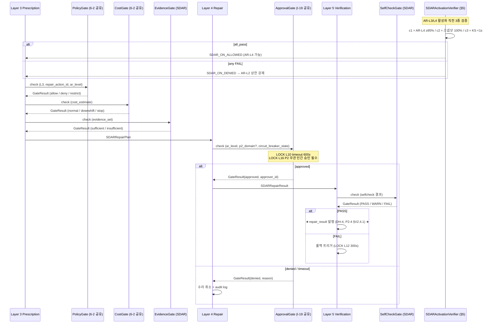

# 04. gate_integration.md — 5-Gate 통합 + SDAR ON 3중 검증 (ISS-8 해결)

> **도메인**: 6-5_SDAR-System / 04_self-diagnosis
> **세션**: P2-5 (Phase 2 STEP_B #2b)
> **버전 태그**: `V2-Phase 2` / `V3-Phase 2` (5-Gate 통합 코드 V3 구현)
> **작성일**: 2026-04-27
> **정본**: SDAR_SPEC §6.1 (5-Gate 정의, LOCK L3) + Part2 §6.9 (BaseGate ABC, LOCK L20) + 종합계획서 §6.2 ISS-8
> **수정 정책**: V2 신규 정본 — 본 도메인 P2-5 산출물. 임의 수정 금지, 정본 변경 시에만 갱신.
> **해결 게이트**: ISS-8 (SDAR ON 3중 검증 조건 — Phase 2 해결, 미충족 시 수동 모드 유지 AR-L2 상한)

---

## §0. Purpose / Scope

본 문서는 **SDAR 자동 수리 활성화(SDAR ON) 전 3중 검증 조건**과 **5-Gate 통합 인터페이스**를 L3 수준으로 정의한다.

**Scope (Phase 2 범위)**:
- ✅ SDAR_SPEC §6.1 의 5-Gate 정의 verbatim 인용 (LOCK L3) + Phase 통과 흐름
- ✅ Part2 §6.9 L5442~L5450 의 BaseGate(ABC) 패턴 (LOCK L20) + GateResult 스키마
- ✅ ISS-8 3중 검증 (AR-L4 수리 성공률 ≥95% / 스냅샷 복원 성공률 100% / Kill Switch 응답 시간 <1초) — 측정 방법 + 임계값 + 실패 대응
- ✅ 모든 조건 미충족 시 수동 모드 유지 (AR-Level 최대 L2 제한) + ADMIN 알림
- ✅ Gate 통과/실패 로깅 스키마 (trace_id, gate_id, result, reason, timestamp)
- ✅ 6-2 Security-Governance cross-handoff (Gate 1/3/4 공유, W-3 RESOLVED 보존)

**Out of Scope (Phase 3 이월)**:
- ❌ 5-Gate 코드 V3 구현 (`safety/gates/policy_gate.py` 실제 코드)
- ❌ SDAR_ON_VERIFIER 자동화 dry-run 인프라 (스냅샷 복원 주기 검증)
- ❌ Kill Switch P99 벤치마크 환경 구축 (V3 Phase 3)

---

## §1. 교차 참조 블록

| 정본 문서 | 절대경로 / 섹션 | 참조 항목 |
|----------|----------------|----------|
| SDAR_SPEC | `D:\VAMOS\docs\sot\VAMOS_SDAR_DESIGN_SPECIFICATION.md` §6.1 | 5-Gate 정의 정본 (LOCK L3) — PolicyGate / EvidenceGate / CostGate / ApprovalGate / SelfCheckGate |
| SDAR_SPEC | `D:\VAMOS\docs\sot\VAMOS_SDAR_DESIGN_SPECIFICATION.md` §6.4 | EventTypeRegistry — Gate 통과/실패 이벤트 (`oc.sdar.repair.approval_requested` 등) |
| Part2 §6.9 | `D:\VAMOS\docs\guides\VAMOS_구현가이드_PART2_구현단계.md` L5442~L5450 | BaseGate(ABC) 인터페이스 정본 (LOCK L20) — `check(context) -> GateResult` |
| 종합계획서 | `D:\VAMOS\docs\sot 2\6-5_SDAR-System\SDAR_SYSTEM_구조화_종합계획서.md` §6.2 ISS-8 | SDAR ON 3중 검증 조건 정의 |
| 종합계획서 | `D:\VAMOS\docs\sot 2\6-5_SDAR-System\SDAR_SYSTEM_구조화_종합계획서.md` §3.4 L3, L20 | LOCK 정본 인용 출처 |
| AUTHORITY | `D:\VAMOS\docs\sot 2\6-5_SDAR-System\AUTHORITY_CHAIN.md` §3.4 L3, L20 | LOCK 7-컬럼 정본 |
| 형제 V2 | `04_self-diagnosis/_index.md` (P2-4) §V2.4 | DH-4 repair_result 스키마 — Gate 5 통과 후 발행 |
| 형제 V2 | `04_self-diagnosis/repair_action_catalog.md` (P2-6) | 26개 액션의 선행 Gate 목록 |
| 형제 V2 | `03_emergency-kill-switch/_index.md` (P2-1) §3.4 | Kill Switch 응답 시간 SLO < 1초 (조건 3 정합) |
| 형제 V2 | `03_emergency-kill-switch/operational_limits.md` (P2-3) §4 | 스냅샷 롤백 4단계 (조건 2 정합) |
| V1 직계 | `01_five-layer-pipeline/repair.md` §3.5 | ApprovalGate 승인 요청 절차 (LOCK L10, L16) — 본 §3.4 정합 |
| V1 직계 | `01_five-layer-pipeline/prescription.md` | Layer 3 5-Gate 호출 시점 — 본 §2 정합 |
| 6-2 cross-handoff | `D:\VAMOS\docs\sot 2\6-2_Security-Governance\` | PolicyGate/CostGate/ApprovalGate 공유 (W-3 RESOLVED, 6-2 LOCK 재정의 ❌) |

---

## §2. LOCK 보호 항목 인용 (verbatim, AUTHORITY_CHAIN §3.4 7-컬럼)

| LOCK ID | 항목 | 정본 출처 | 정본 섹션 | 값/규칙 | 카테고리 | 교차 검증 |
|---------|------|----------|----------|---------|----------|----------|
| **L3** | 5-Gate 통합 아키텍처 | `D:\VAMOS\docs\sot\VAMOS_SDAR_DESIGN_SPECIFICATION.md` | §6.1 | PolicyGate(안전 정책) → EvidenceGate(위험 근거, SDAR 전용) → CostGate(비용) → ApprovalGate(승인, I-19 공유) → SelfCheckGate(검증 확장, SDAR 전용) | 아키텍처 | ✅ 일치 |
| **L20** | Gate 코드 공유 전략 (M-28) | `D:\VAMOS\docs\guides\VAMOS_구현가이드_PART2_구현단계.md` | §6.9 (L5442-5450) | BaseGate(ABC) → check(context) → GateResult, Gate 1(PolicyGate)/3(CostGate)/4(ApprovalGate) 공유, Gate 2(EvidenceGate)/5(SelfCheckGate) SDAR 전용 | 아키텍처 | ✅ 일치 |
| **L10** | APPROVAL_TIMEOUT | `D:\VAMOS\docs\sot\VAMOS_SDAR_DESIGN_SPECIFICATION.md` | §9.2 | 600초 (10분, 초과 시 자동 거부) | 운영 제한 | ✅ 일치 |
| **L16** | P2 도메인 수리 인간 승인 필수 | `D:\VAMOS\docs\sot\VAMOS_SDAR_DESIGN_SPECIFICATION.md` | §9.6 | AR-Level 무관 인간 승인 필수, Circuit Breaker OPEN 시 자동 복구 금지 | 안전 | ✅ 일치 (W-CB OPEN: Circuit Breaker 소유 도메인 미확정) |
| **L4** | AR-Level 정의 (L0~L4 + NEVER) | `D:\VAMOS\docs\sot\VAMOS_SDAR_DESIGN_SPECIFICATION.md` | **§3.1** | L0(0개) → L1(2개) → L2(5개) → L3(5개) → L4(4개) + NEVER(10개) | 아키텍처 | ⚠️ 교정 (XREF-02 OPEN) |
| **L8** | SNAPSHOT_MANDATORY | `D:\VAMOS\docs\sot\VAMOS_SDAR_DESIGN_SPECIFICATION.md` | §9.2 | MEDIUM/HIGH risk 수리 전 스냅샷 필수 | 운영 제한 | ✅ 일치 |
| **L11** | OBSERVATION_PERIOD | `D:\VAMOS\docs\sot\VAMOS_SDAR_DESIGN_SPECIFICATION.md` | §9.2 | 300초 (5분 관찰) | 운영 제한 | ✅ 일치 |
| **L9** | NOTIFICATION_MANDATORY | `D:\VAMOS\docs\sot\VAMOS_SDAR_DESIGN_SPECIFICATION.md` | §9.2 | 모든 수리 활동 알림 필수 (AR-Level 무관) | 운영 제한 | ✅ 일치 |

**신규 LOCK 추가/변경 0건** (V3 범위 이월 — 본 P2-5는 인용만).

---

## §3. 5-Gate 통합 아키텍처 (LOCK L3 verbatim)

### 3.1 5-Gate 정의 (SDAR_SPEC §6.1 verbatim)

| Gate | 이름 | SDAR 연동 방식 | 적용 시점 | 6-2 공유 여부 |
|------|------|----------------|----------|--------------|
| **Gate 1** | **PolicyGate** | 수리 액션이 Non-goal 위반 여부 확인, P2 관련 수리 시 재확인 | Layer 3 (처방 생성 시) + Layer 4 (실행 전) | ✅ 6-2 PolicyGate 로직 공유 (L20) |
| **Gate 2** | **EvidenceGate** | 진단 근거의 충분성 확인 (근거 없는 수리 방지) | Layer 2 (진단 완료 시) | ❌ SDAR 전용 (L20) |
| **Gate 3** | **CostGate** | 수리로 인한 추가 비용 발생 여부 확인 (e.g., 모델 전환 시 비용 증가) | Layer 3 (처방 생성 시) | ✅ 6-2 CostGate 로직 공유 (L20) |
| **Gate 4** | **ApprovalGate** | AR-L3/L4 수리 시 승인 필요 여부 확인, P2 관련 수리 시 반드시 승인 | Layer 4 (실행 전) | ✅ 6-2 ApprovalGate (I-19 공유, L20) |
| **Gate 5** | **SelfCheckGate** | 수리 후 Self-check 재실행하여 품질 확인 | Layer 5 (검증 시) | ❌ SDAR 전용 (L20, V1 verification.md SelfCheck 확장) |

> **NOTE (L3 NOTE 보존)**: SDAR 5-Gate 와 0-0 공통 5-Gate 는 구조 유사하나 Gate 내부 로직은 **SDAR 수리 안전성 평가 전용**. 6-8 Cloud-Library CL-G0~G4 와도 별도 (AUTHORITY §3.4 L3 NOTE 인용).

### 3.2 Gate 통과 흐름 (SDAR_SPEC §6.1 verbatim)

```
Layer 3 (PRESCRIPTION)
    │
    ├──▶ PolicyGate: 수리 액션이 정책 위반하는가?
    │       ├── deny → 해당 수리 후보 제거
    │       ├── restrict → 승인 필요 플래그 설정
    │       └── allow → 통과
    │
    ├──▶ CostGate: 수리로 추가 비용 발생하는가?
    │       ├── stop → 수리 포기 (비용 초과)
    │       ├── downshift → 저비용 대안 검색
    │       └── normal → 통과
    │
    └──▶ EvidenceGate: 진단 근거가 충분한가?
            ├── insufficient → 추가 진단 필요
            └── sufficient → 통과

Layer 4 (REPAIR)
    │
    └──▶ ApprovalGate: 승인이 필요한 수리인가?
            ├── pending → 사용자 승인 대기 (타임아웃: 10분, LOCK L10)
            ├── denied → 수리 취소
            └── approved → 실행 진행

Layer 5 (VERIFICATION)
    │
    └──▶ SelfCheckGate: 수리 후 품질이 유지되는가?
            ├── FAIL → 롤백 트리거 (LOCK L12 ROLLBACK_TIMEOUT 300s)
            ├── WARN → 알림 + 관찰 연장 (LOCK L11 OBSERVATION_PERIOD 300s)
            └── PASS → 수리 완료 확정 → repair_result 발행 (DH-4, P2-4 §V2.4.1)
```

### 3.3 Gate 호출 순서 정합 (LOCK L3 + LOCK L16)

**기본 흐름**: PolicyGate → EvidenceGate → CostGate → ApprovalGate → SelfCheckGate

**P2 도메인 특별 규칙 (LOCK L16)**:
- P2 관련 수리 시 PolicyGate 에서 **재확인** (이중 검증)
- AR-Level 무관 ApprovalGate 통과 절대 필수 (자동 통과 X)
- Circuit Breaker OPEN 시 → ApprovalGate 통과 후 HALF-OPEN 만 허용 (W-CB OPEN: Circuit Breaker 소유 도메인 미확정)

---

## §4. BaseGate(ABC) 패턴 정본 (LOCK L20, Part2 §6.9 L5442~L5450)

### 4.1 BaseGate ABC 인터페이스 정의

```python
# Part2 §6.9 L5442~L5450 정본 (LOCK L20)
# Gate 1(PolicyGate)/3(CostGate)/4(ApprovalGate) 공유 + Gate 2(EvidenceGate)/5(SelfCheckGate) SDAR 전용

from abc import ABC, abstractmethod
from dataclasses import dataclass
from typing import Literal, Optional, Dict, Any


@dataclass(frozen=True)
class GateContext:
    """Gate check 호출 컨텍스트 — 공유 5-필드"""
    trace_id: str                          # SDAR 세션 trace_id (Layer 1~5 일관)
    diagnosis_id: str                      # SDARDiagnosis.diagnosis_id (UUID v4)
    repair_action_id: str                  # 수리 액션 ID (RA_001~RA_014, RA_NEVER_*)
    ar_level: Literal["AR-L0", "AR-L1", "AR-L2", "AR-L3", "AR-L4"]
    layer: Literal["L2", "L3", "L4", "L5"]                   # Gate 호출 시점
    extras: Dict[str, Any]                 # Gate별 추가 컨텍스트 (e.g., cost_estimate, evidence_set, snapshot_id)


@dataclass(frozen=True)
class GateResult:
    """Gate check 반환 결과 — 공유 5-필드 + 메타"""
    gate_id: Literal["G1_POLICY", "G2_EVIDENCE", "G3_COST", "G4_APPROVAL", "G5_SELFCHECK"]
    passed: bool                           # True = PASS, False = REJECT (downshift/restrict 는 PASS+metadata)
    decision: Literal["allow", "deny", "restrict", "stop", "downshift", "normal", "insufficient", "sufficient", "pending", "denied", "approved", "PASS", "WARN", "FAIL"]
    reason: str                            # 판정 사유 (audit log 용)
    metadata: Dict[str, Any]               # gate별 추가 정보 (e.g., approver_id, cost_delta, evidence_score)
    timestamp: str                         # ISO8601 UTC


class BaseGate(ABC):
    """Gate 공통 ABC — Gate 1/3/4 (6-2 공유) + Gate 2/5 (SDAR 전용) 모두 상속"""

    @abstractmethod
    async def check(self, context: GateContext) -> GateResult:
        """Gate 검증 실행 — 모든 sub-gate 가 구현 필수"""
        ...

    @abstractmethod
    def get_gate_id(self) -> str:
        """Gate 고유 ID (G1_POLICY 등) 반환"""
        ...
```

### 4.2 Gate 별 상속 매핑 (V3 Phase 3 구현)

| Gate | 클래스 (V3) | 상속 출처 | LOCK 준수 |
|------|------------|----------|----------|
| Gate 1 | `SDARPolicyGate(BaseGate)` | 6-2 `safety/gates/policy_gate.py` 의 `PolicyGate` 어댑터 | L20 공유 + L16 P2 재확인 |
| Gate 2 | `SDAREvidenceGate(BaseGate)` | SDAR 전용 신규 (V3, `vamos/sdar/gates/evidence_gate.py`) | L20 SDAR 전용 + EvidenceGate 충분성 |
| Gate 3 | `SDARCostGate(BaseGate)` | 6-2 `safety/gates/cost_gate.py` 의 `CostGate` 어댑터 | L20 공유 + L17 비용 상한 |
| Gate 4 | `SDARApprovalGate(BaseGate)` | 6-2 `orange_core/i19_approval_manager.py` (I-19) 어댑터 | L20 공유 + L10 timeout 600s + L16 P2 필수 |
| Gate 5 | `SDARSelfCheckGate(BaseGate)` | SDAR 전용 신규 (V3, `vamos/sdar/gates/selfcheck_gate.py`, V1 verification.md SelfCheck 확장) | L20 SDAR 전용 |

---

## §5. ISS-8 SDAR ON 3중 검증 (해결 게이트, L3 수준 정의)

### 5.1 검증 조건 개요

SDAR 자동 수리 활성화(SDAR ON, AR-L3 또는 AR-L4 진입) 직전 다음 **3개 조건 모두 충족 시에만** 활성화 허용. 1개라도 미충족 시 **수동 모드 유지 (AR-Level 최대 L2 제한)**.

| # | 조건 | 임계값 | 측정 주기 | 정본 |
|---|------|--------|----------|------|
| 1 | AR-L4 수리 성공률 | ≥ **95%** | 30일 슬라이딩 윈도우 | 종합계획서 §6.2 ISS-8 |
| 2 | 스냅샷 복원 성공률 | **100%** | 주 1회 dry-run + 실제 발생 시 즉시 | 종합계획서 §6.2 ISS-8 + LOCK L8 |
| 3 | Kill Switch 응답 시간 | **< 1초** (P99) | 분기당 P99 벤치마크 | 종합계획서 §6.2 ISS-8 + 03/_index.md (P2-1) §3.4 SLO |

### 5.2 조건 1 — AR-L4 수리 성공률 ≥ 95% (30일 윈도우)

#### 5.2.1 측정 방법

```python
# 측정 단위: 30일 슬라이딩 윈도우 (현재 시각 기준 -30d ~ now)
# 데이터 소스: oc.sdar.repair.succeeded / oc.sdar.repair.failed 이벤트 카운트 (SDAR_SPEC §6.4)
# 최소 샘플 수: 20건 (샘플 수 < 20 시 미판정 → 자동 수동 모드 유지)

class ARL4SuccessRateCheck:
    WINDOW_DAYS: int = 30
    THRESHOLD_RATE: float = 0.95           # 95%
    MIN_SAMPLE_SIZE: int = 20              # 최소 샘플 수

    def measure(self, now: datetime) -> dict:
        window_start = now - timedelta(days=self.WINDOW_DAYS)

        succeeded = count_events("oc.sdar.repair.succeeded", ar_level="AR-L4",
                                 start=window_start, end=now)
        failed = count_events("oc.sdar.repair.failed", ar_level="AR-L4",
                              start=window_start, end=now)
        total = succeeded + failed

        if total < self.MIN_SAMPLE_SIZE:
            return {"verdict": "INSUFFICIENT_SAMPLES", "n": total, "rate": None}

        rate = succeeded / total
        return {
            "verdict": "PASS" if rate >= self.THRESHOLD_RATE else "FAIL",
            "n": total,
            "rate": rate,
            "succeeded": succeeded,
            "failed": failed,
        }
```

#### 5.2.2 실패 대응

- **FAIL** (rate < 95%): SDAR ON 차단 + ADMIN 알림 + 수리 패턴 재학습 트리거 (S-2 Pattern Miner 재호출, P2-4 §V2.4.2)
- **INSUFFICIENT_SAMPLES** (n < 20): 미판정 → 자동 수동 모드 유지 + ADMIN "샘플 누적 중" 알림

### 5.3 조건 2 — 스냅샷 복원 성공률 100% (주 1회 dry-run + 실제 발생 시 즉시)

#### 5.3.1 측정 방법

```python
class SnapshotRestoreSuccessRateCheck:
    SCHEDULE: str = "WEEKLY_DRY_RUN + ON_REAL_INCIDENT"  # 주 1회 dry-run + 실제 발생 시 즉시
    THRESHOLD_RATE: float = 1.0                    # 100% (한 건도 실패 X)
    DRY_RUN_TARGET_SNAPSHOTS: int = 5              # 주 1회 5건 무작위 표본 dry-run

    def measure(self, now: datetime, lookback_days: int = 30) -> dict:
        window_start = now - timedelta(days=lookback_days)

        # 실제 롤백 (LOCK L12 ROLLBACK_TIMEOUT 300s 내 완료 = 성공)
        real_succeeded = count_events("oc.sdar.repair.rollback_triggered",
                                      result="SUCCESS",
                                      start=window_start, end=now)
        real_failed = count_events("oc.sdar.repair.rollback_triggered",
                                   result="FAIL",
                                   start=window_start, end=now)

        # Dry-run (주간 SDAR_ON_VERIFIER, V3 Phase 3 인프라)
        dryrun_succeeded = count_events("oc.sdar.dryrun.snapshot_restore",
                                        result="SUCCESS",
                                        start=window_start, end=now)
        dryrun_failed = count_events("oc.sdar.dryrun.snapshot_restore",
                                     result="FAIL",
                                     start=window_start, end=now)

        total = real_succeeded + real_failed + dryrun_succeeded + dryrun_failed
        succeeded = real_succeeded + dryrun_succeeded

        if total == 0:
            return {"verdict": "NO_DATA", "n": 0, "rate": None}

        rate = succeeded / total
        return {
            "verdict": "PASS" if rate >= self.THRESHOLD_RATE else "FAIL",
            "n": total,
            "rate": rate,
            "real": {"succeeded": real_succeeded, "failed": real_failed},
            "dryrun": {"succeeded": dryrun_succeeded, "failed": dryrun_failed},
        }
```

#### 5.3.2 실패 대응

- **FAIL** (rate < 100%): SDAR ON 즉시 차단 + Kill Switch 자동 활성화 (LOCK L14 SDAR_ROLLBACK_FAILED 자동 ON 트리거) + CRITICAL 알림 (모든 채널)
- **NO_DATA**: 미판정 → 자동 수동 모드 유지 + dry-run 즉시 실행 트리거 (cron schedule WEEKLY 미수신 의심)

> **NOTE (P2-3 정합)**: 스냅샷 롤백 4단계 (수리 안전 중단 → 마지막 스냅샷 복원 L8 → ROLLBACK_TIMEOUT 300s L12 → 인간 에스컬레이션) 가 본 조건 2 의 **실제 측정 단위**. P2-3 operational_limits.md §4 참조.

### 5.4 조건 3 — Kill Switch 응답 시간 < 1초 (P99)

#### 5.4.1 측정 방법

```python
class KillSwitchLatencyCheck:
    THRESHOLD_MS: int = 1000               # 1초 = 1000ms
    PERCENTILE: int = 99                   # P99
    BENCHMARK_SCHEDULE: str = "QUARTERLY"  # 분기당 1회 P99 벤치마크
    SAMPLE_INVOCATIONS: int = 100          # 샘플 호출 수

    def measure(self, now: datetime) -> dict:
        # Kill Switch 활성화 명령 발행 → KillSwitchActivated 이벤트 수신 까지의 latency
        # 측정 환경: 분기당 1회 staging 환경 + 실제 활성화 발생 시 즉시 기록

        latencies_ms = collect_kill_switch_latencies(
            start=now - timedelta(days=90),
            end=now,
        )

        if len(latencies_ms) < 10:                       # 최소 10건 (분기당 1회 100건 + 실제 발생)
            return {"verdict": "INSUFFICIENT_SAMPLES", "n": len(latencies_ms), "p99_ms": None}

        p99 = numpy.percentile(latencies_ms, self.PERCENTILE)
        return {
            "verdict": "PASS" if p99 < self.THRESHOLD_MS else "FAIL",
            "n": len(latencies_ms),
            "p99_ms": p99,
            "p50_ms": numpy.percentile(latencies_ms, 50),
            "max_ms": max(latencies_ms),
        }
```

#### 5.4.2 실패 대응

- **FAIL** (P99 ≥ 1000ms): SDAR ON 차단 + ADMIN 알림 + Kill Switch 코드 핫픽스 우선순위 격상 (RA_011 patch_code_hotfix 후보)
- **INSUFFICIENT_SAMPLES** (n < 10): 미판정 → 자동 수동 모드 유지 + 즉시 staging 벤치마크 트리거

### 5.5 SDAR ON 활성화 통합 결정 로직

```python
class SDARActivationVerifier:
    """SDAR ON (AR-L3/AR-L4) 활성화 직전 3중 검증"""

    def verify_all(self, now: datetime) -> dict:
        c1 = ARL4SuccessRateCheck().measure(now)
        c2 = SnapshotRestoreSuccessRateCheck().measure(now)
        c3 = KillSwitchLatencyCheck().measure(now)

        all_pass = (c1["verdict"] == "PASS" and
                    c2["verdict"] == "PASS" and
                    c3["verdict"] == "PASS")

        if all_pass:
            verdict = "SDAR_ON_ALLOWED"
            ar_level_cap = "AR-L4"  # 사용자 명시 설정에 따라 AR-L3/L4 진입 가능
        else:
            verdict = "SDAR_ON_DENIED_MANUAL_MODE_ENFORCED"
            ar_level_cap = "AR-L2"  # ★ 수동 모드 유지 — AR-Level 최대 L2 제한

        # ADMIN 알림 (LOCK L9 NOTIFICATION_MANDATORY)
        notify_admin({
            "verdict": verdict,
            "ar_level_cap": ar_level_cap,
            "checks": {"c1": c1, "c2": c2, "c3": c3},
            "next_check_at": now + timedelta(hours=1),
        })

        return {
            "verdict": verdict,
            "ar_level_cap": ar_level_cap,
            "checks": [c1, c2, c3],
            "all_pass": all_pass,
        }
```

### 5.6 ISS-8 검증 매트릭스

| # | 검증 조건 | 임계값 | 측정 방법 | 실패 시 대응 |
|---|----------|--------|----------|--------------|
| 1 | AR-L4 수리 성공률 ≥ 95% | 95% | 30d 슬라이딩, 최소 20건 | SDAR ON 차단 + ADMIN 알림 + S-2 재학습 |
| 2 | 스냅샷 복원 성공률 100% | 100% | 주 1회 dry-run + 실제 발생 즉시 | SDAR ON 즉시 차단 + Kill Switch 자동 ON (L14) + CRITICAL 알림 |
| 3 | Kill Switch 응답 시간 < 1초 (P99) | 1000ms | 분기당 100건 staging + 실제 발생 | SDAR ON 차단 + ADMIN 알림 + 핫픽스 우선순위 격상 |
| Combined | 3 조건 ALL PASS | - | 위 3개 ALL PASS | AR-L4 활성화 허용 / 1개 미충족 시 AR-L2 상한 강제 |

---

## §6. Gate 통과/실패 로깅 스키마 (R-01-7 structured JSON)

### 6.1 GateLogEvent 정의

```python
# 모든 5-Gate 통과/실패 시 발행되는 통합 로그 (R-01-7 structured JSON, R-01-7 nested 3 blocks)
# 채널: oc.sdar.gate.{gate_id}.{decision} (e.g., oc.sdar.gate.G1_POLICY.allow)

class GateLogEvent(BaseModel):
    # Top-level
    event_id: str                          # UUID v4
    timestamp: str                         # ISO8601 UTC
    trace_id: str                          # SDAR 세션 trace_id (Layer 1~5 일관)

    # Block 1: Gate 핵심
    gate: dict = {
        "gate_id": "G1_POLICY",            # G1_POLICY / G2_EVIDENCE / G3_COST / G4_APPROVAL / G5_SELFCHECK
        "passed": True,                    # bool
        "decision": "allow",               # Gate별 decision (3.2 흐름)
        "reason": "Non-goal 위반 없음",
    }

    # Block 2: 컨텍스트 (GateContext 일부)
    context: dict = {
        "diagnosis_id": "<UUID>",
        "repair_action_id": "RA_007",
        "ar_level": "AR-L3",
        "layer": "L3",                     # 호출 시점
    }

    # Block 3: 메타 (gate별 추가 정보)
    metadata: dict = {
        # PolicyGate
        "policy_violations": [],           # 위반 정책 ID 목록
        # CostGate
        "cost_delta_krw": 0,               # 비용 변동
        # EvidenceGate
        "evidence_score": 0.85,            # 0.0~1.0
        # ApprovalGate
        "approver_id": None,               # 승인자 user_id
        "approval_timeout_at": "2026-04-27T15:40:00Z",
        # SelfCheckGate
        "selfcheck_pass_rate": 0.92,
    }

    model_config = ConfigDict(extra="forbid")
```

### 6.2 Gate 통과 시간 SLO

| Gate | P50 SLO | P99 SLO | 비고 |
|------|---------|---------|------|
| G1_POLICY | < 50ms | < 200ms | 6-2 공유 (L20) |
| G2_EVIDENCE | < 200ms | < 1000ms | SDAR 전용 — 진단 근거 평가 |
| G3_COST | < 50ms | < 200ms | 6-2 공유 (L20) |
| G4_APPROVAL | < 1초 (인간 대기 제외) | < 600초 (LOCK L10 timeout) | I-19 공유 |
| G5_SELFCHECK | < 5초 | < 60초 | SDAR 전용 — 회귀 검사 |

---

## §7. 형제 V2 / V1 인터페이스 cross-check

### 7.1 본 P2-5 ↔ P2-1 (Kill Switch 응답 시간 SLO)

본 §5.4 조건 3 (Kill Switch 응답 시간 < 1초 P99) 이 03/_index.md (P2-1) §3.4 Kill Switch 활성화 시퀀스 5단계의 SLO 와 정합. P2-1 측 SLO 명시: "(e) 관리자 알림 < 1초 (ISS-8 P2-5 연계)" — **1:1 정합 확인**.

### 7.2 본 P2-5 ↔ P2-3 (스냅샷 롤백 4단계)

본 §5.3 조건 2 (스냅샷 복원 성공률 100%) 의 실제 측정 단위가 P2-3 operational_limits.md §4 의 스냅샷 롤백 4단계 (수리 안전 중단 → L8 SNAPSHOT_MANDATORY 복원 → L12 ROLLBACK_TIMEOUT 300s → 인간 에스컬레이션) — **1:1 정합 확인**.

### 7.3 본 P2-5 ↔ P2-4 (5-Gate 후 repair_result 발행)

본 §3.2 Layer 5 SelfCheckGate PASS 직후 → P2-4 §V2.4.1 `repair_result` (DH-4 5-필드) 발행. Gate 5 통과는 repair_result 발행의 **선행 조건**. **1:1 정합 확인**.

### 7.4 본 P2-5 ↔ P2-6 (수리 액션 카탈로그 선행 Gate)

본 §3 5-Gate 호출 순서 (Layer 3: PolicyGate → CostGate → EvidenceGate / Layer 4: ApprovalGate / Layer 5: SelfCheckGate) 가 P2-6 repair_action_catalog.md 의 26개 액션 entry 중 "선행 Gate 목록" 필드의 **정의 출처**. P2-6 entry 가 본 §3.1 5-Gate 표 와 동일 ID (G1_POLICY 등) 를 사용해야 함.

### 7.5 본 P2-5 ↔ V1 repair.md §3.5 (ApprovalGate 절차)

본 §3.2 Layer 4 ApprovalGate 흐름 (pending → 사용자 승인 대기 → denied / approved) 이 V1 `01_five-layer-pipeline/repair.md` §3.5 (LOCK L10, L16) 의 ApprovalGate 절차와 동일. V1 본문 변경 0 — 본 P2-5 는 V2 인터페이스 정의만.

### 7.6 본 P2-5 ↔ V1 prescription.md (Layer 3 5-Gate 호출)

본 §3.2 Layer 3 PRESCRIPTION 흐름 (PolicyGate → CostGate → EvidenceGate) 이 V1 `01_five-layer-pipeline/prescription.md` 의 Layer 3 출력 (`SDARRepairPlan`) 발행 직전 호출 구조와 정합. V1 본문 변경 0.

### 7.7 본 P2-5 ↔ 6-2 cross-handoff (W-3 RESOLVED 보존)

Gate 1/3/4 의 6-2 공유 정책 (LOCK L20) 은 6-2 Security-Governance 의 정본을 인용만 하고 재정의 X. W-3 RESOLVED (CONFLICT_LOG §3.3) — 6-2 보안 정책 정본, 6-5 CATEGORY E 규칙 참조 — 보존.

---

## §8. 호출 방향 정합성 (Sequence Diagram)



---

## §9. 검증 매트릭스 (P2-5 §7 종합계획서 절차 검증 5항목 충족)

| # | 검증 항목 | 정합 위치 | 상태 |
|---|----------|----------|------|
| 1 | ISS-8 해결: 3중 검증 조건 각각 측정 방법·임계값·실패 대응 정의 | §5.2/§5.3/§5.4 (각 조건별 측정 코드 + 임계값 + 실패 대응 표) + §5.6 매트릭스 | ✅ |
| 2 | 3 조건 전부 충족 시에만 SDAR ON, 1개라도 미충족 시 수동 모드 (AR-L2 상한) | §5.5 `SDARActivationVerifier.verify_all` 통합 결정 로직 (`ar_level_cap = "AR-L2"` 강제) | ✅ |
| 3 | LOCK L20 준수: BaseGate ABC 패턴 적용 | §4.1 `BaseGate(ABC)` + `check(context) -> GateResult` + §4.2 5-Gate 모두 BaseGate 상속 | ✅ |
| 4 | 5-Gate 시스템 (SDAR_SPEC §6.1) 통합 인터페이스 포함 | §3.1 5-Gate 정의 verbatim + §3.2 Gate 통과 흐름 verbatim + §3.3 P2 특별 규칙 (L16) | ✅ |
| 5 | Gate 통과/실패 로깅 스키마 정의 | §6.1 `GateLogEvent` 스키마 (R-01-7 nested 3 blocks: gate / context / metadata) + §6.2 SLO 표 | ✅ |

**대조 기준** (종합계획서 §7.3 P2-5 L1067~L1072):
- **§7 세부 작업**: Phase 2 "04_self-diagnosis/ 전체" (§7.2 L314) — ✅ 본 gate_integration.md = 04/ 의 P2-5 산출물
- **§7 전환 게이트**: P2→P3 암묵적 (04/ 전체 완성) — ✅ P2-4 + 본 P2-5 + P2-6 = 04/ 3 NEW
- **§6 이슈**: ISS-8 (SDAR ON 3중 검증 조건 — Phase 2 해결) — ✅ §5 전체로 해결
- **교차 도메인**: 6-6 Self-Evolution (AR-L4 수리 성공률) + 6-2 Security-Governance (5-Gate 통합) — ✅ §3.1 / §7.7 W-3 RESOLVED 정합
- **Part2 버전**: V3-Phase 2 — ✅ 본 헤더 태그 명시

---

## §10. Phase 3 테스트 시나리오 (≥10건)

| # | 시나리오 ID | 주입 방법 | 기대 결과 |
|---|-------------|----------|----------|
| 1 | T-G-01 | AR-L4 수리 성공률 측정 → succeeded=19/total=20 → rate=95% | c1.verdict = PASS (정확히 95%, ≥ threshold) |
| 2 | T-G-02 | AR-L4 수리 성공률 측정 → succeeded=18/total=20 → rate=90% | c1.verdict = FAIL → SDAR ON 차단, ar_level_cap="AR-L2" |
| 3 | T-G-03 | AR-L4 수리 측정 → total=15 (< 20) | c1.verdict = INSUFFICIENT_SAMPLES → 자동 수동 모드 |
| 4 | T-G-04 | 스냅샷 복원 dry-run → 5건 모두 SUCCESS | c2.verdict = PASS (rate = 100%) |
| 5 | T-G-05 | 스냅샷 복원 dry-run → 4 SUCCESS + 1 FAIL | c2.verdict = FAIL → SDAR ON 즉시 차단 + Kill Switch 자동 ON (LOCK L14) |
| 6 | T-G-06 | Kill Switch 100건 staging 벤치마크 → P99 = 800ms | c3.verdict = PASS (< 1000ms) |
| 7 | T-G-07 | Kill Switch P99 = 1200ms | c3.verdict = FAIL → SDAR ON 차단 + ADMIN 알림 + 핫픽스 격상 |
| 8 | T-G-08 | Kill Switch n = 5 (< 10) | c3.verdict = INSUFFICIENT_SAMPLES → 자동 수동 모드 + staging 벤치마크 트리거 |
| 9 | T-G-09 | 3 조건 ALL PASS → SDARActivationVerifier.verify_all() | verdict = SDAR_ON_ALLOWED, ar_level_cap = "AR-L4" |
| 10 | T-G-10 | c1=FAIL + c2=PASS + c3=PASS → 1개 미충족 | verdict = SDAR_ON_DENIED, ar_level_cap = "AR-L2" |
| 11 | T-G-11 | PolicyGate check → repair_action 이 NEVER_AUTO_TARGETS 에 매칭 | gate_result.passed=False, decision="deny", reason 포함 위반 정책 ID |
| 12 | T-G-12 | ApprovalGate timeout (600초 초과) | gate_result.passed=False, decision="denied" (auto_denied) + ADMIN 알림 |
| 13 | T-G-13 | ApprovalGate P2 도메인 + Circuit Breaker OPEN | LOCK L16 적용 — 인간 승인 필수 + HALF-OPEN 만 허용 (W-CB OPEN 주석) |
| 14 | T-G-14 | SelfCheckGate FAIL 후 → repair_result 발행 X + 롤백 트리거 (LOCK L12 300s 내) | repair_result event 미발행 + oc.sdar.repair.rollback_triggered 발행 |
| 15 | T-G-15 | GateLogEvent extra 필드 추가 시도 | Pydantic ConfigDict(extra="forbid") 차단, ValidationError |

---

## §11. 변경 이력

| 날짜 | 세션 | 내용 |
|------|------|------|
| 2026-04-27 | P2-5 (#2b) | NEW (V2-Phase 2) — SDAR ON 3중 검증 + 5-Gate 통합 + BaseGate ABC + GateLogEvent 로깅 + ISS-8 해결. LOCK 신규 추가 0건 (L3/L4/L8/L9/L10/L11/L16/L20 인용). 6-2 cross-handoff (Gate 1/3/4 공유) + 6-6 cross-handoff (조건 1 AR-L4 측정) 인터페이스만, 재정의 ❌. W-CB OPEN 주석 보존 (Circuit Breaker 소유 도메인 미확정). |
