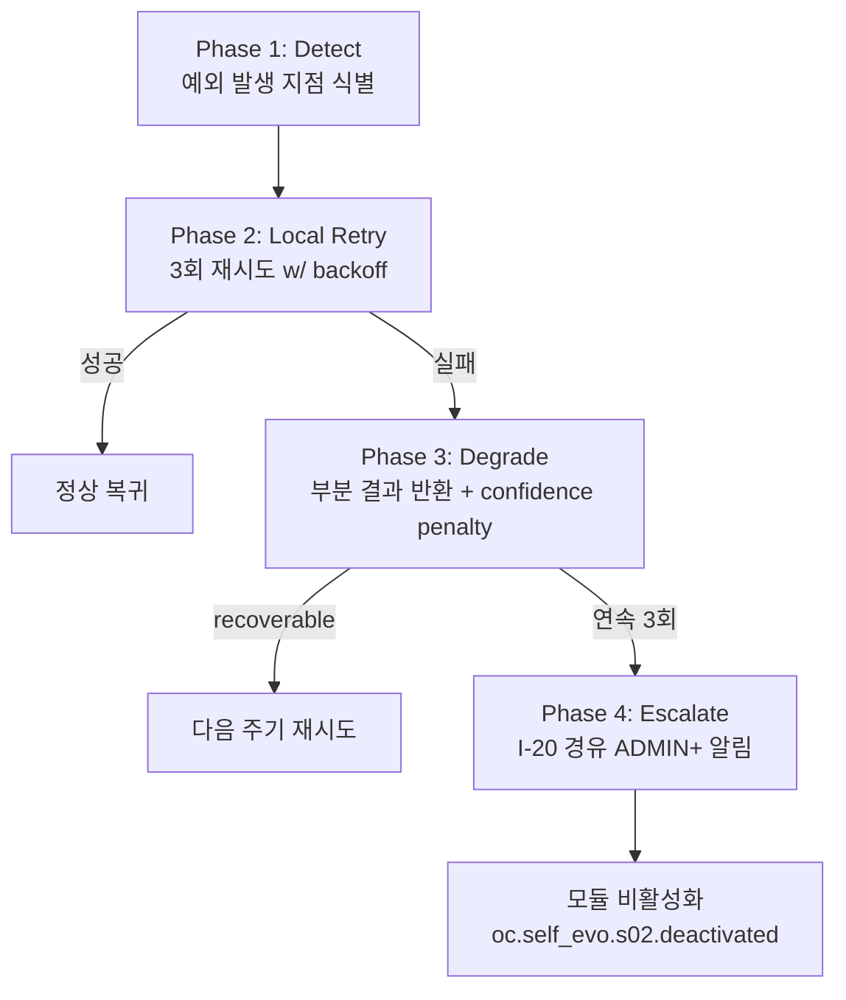

# S-2 Pattern Miner — 상세 설계 (L3)

> **수정 정책**: 정본 — Phase 변경 시 갱신 (§8.2)
> **도메인**: 6-6_Self-Evolution-System / 01_s-series-modules
> **Tier**: 6 (System-wide Components)
> **정본 출처**: D2.0-02 §10.4~§10.6 (LOCK), D2.0-01 §5.7 (명칭 LOCK), Part2 V3-Phase 2 (L4099-L4119), 종합계획서 부록 A.3
> **LOCK 매핑**: L1(모듈 목록), L2(I-Module 경유), L4(자동 적용 금지), L7(BaseSelfEvo ABC), L8(S-2 회귀 테스트)
> **Phase**: P1-M1
> **생성일**: 2026-04-14
> **ISS 해결**: ISS-1 (S-2 알고리즘 힌트)

---

## 교차 참조 블록 (§1. 개요 직후)

| 참조 대상 | 관계 |
|----------|------|
| **D2.0-02 §10.4~§10.6** | S-Module 경유 동작 원칙·역할 정의 정본 (LOCK L2) |
| **D2.0-01 §5.7** | S-Module 명칭·카테고리 LOCK (SEVO-C001 채택) |
| **Part2 V3-Phase 2 L4099-L4119** | When/Where 정본, BaseSelfEvo ABC 시그니처 정본 |
| **SDAR_SPEC §9.3** | SDAR→S-2 repair_result 피드백 경로 (DH-4) |
| **종합계획서 §7.4, 부록 A.3** | DH-4 repair_result 스키마, S-2 알고리즘 힌트 (PrefixSpan+DBSCAN) |
| **01_s-series-modules/_index.md** | S-Module 카탈로그, I-Module 접근 매트릭스, BaseSelfEvo ABC (§3.1) |
| **AUTHORITY_CHAIN.md §4** | LOCK L1/L2/L4/L7/L8 레지스트리 |
| **02_self-improvement-loop/** | 5단계 루프(L5)에서 S-2 수집/회귀 검증 역할 |
| **6-12 Event-Logging** | `oc.self_evo.s02.*` 이벤트 기록 대상 (R-01-7 구조화 로깅) |
| **6-4 Memory-RAG-Storage** | I-15 스냅샷 저장/복원 연동 |
| **6-5 SDAR-System** | repair_result → S-2 패턴 학습 피드백 (DH-4) |

---

## 1. 개요

S-2 Pattern Miner는 Self-Evolution 서브시스템의 **진입 모듈**로, I-9 로그 스트림에 축적된 세션 로그·수리 결과(SDAR repair_result)·이벤트에서 **행동 패턴(BehaviorPattern)** 을 추출하여 S-3 Strategy Optimizer에 공급한다. 또한 LOCK L8에 따라 타 S-Module이 적용된 변경에 대해 **회귀 테스트(개선 전/후 성능 비교)** 를 수행하는 이중 역할을 갖는다.

### 1.1 책임 요약
- **패턴 추출**: PrefixSpan(시퀀스) + DBSCAN(클러스터링)으로 세션 로그에서 빈발 행동 패턴을 마이닝
- **회귀 테스트(L8)**: S-3~S-7 적용 결과에 대해 metrics_before/metrics_after 비교, 회귀 시 즉시 rollback 요청
- **I-Module 경유(L2)**: 독립적 시스템 변경 금지, I-9 READ 권한만 보유 (I-Module 접근 매트릭스 §2.3 정본)
- **제안만(L4)**: 자동 적용 절대 금지, 출력은 제안·리포트에 한정

### 1.2 입출력 요약 (01/_index.md §1.1 정합)
- **Input**: `list[SessionLog]` (I-9 READ)
- **Output**: `list[BehaviorPattern(pattern_type, frequency, confidence)]`
- **트리거**: 세션 종료 배치 (1시간 주기) + 외부 호출 (회귀 테스트 요청)

---

## 2. 공통 자료 구조 선정의 (Pydantic)

> 공유 자료 구조를 먼저 정의 후 각 알고리즘/인터페이스에서 참조. Rule (k) 준수.

```python
from pydantic import BaseModel, Field
from typing import Literal, Optional
from datetime import datetime

# ── I/O 기본 스키마 ──────────────────────────────────────────
class SessionLog(BaseModel):
    """I-9 세션 로그 정본 (6-12 Event-Logging 공급)"""
    session_id: str
    user_id: str
    started_at: datetime
    ended_at: datetime
    events: list[dict]           # [{ts, event_type, payload}]
    qod_score: float             # I-6 QoD (0.0~1.0)
    trace_id: str                # 분산 추적 ID

class BehaviorPattern(BaseModel):
    """S-2 → S-3 공급 스키마"""
    pattern_id: str              # hash(sequence+cluster_id)
    pattern_type: Literal["sequential", "cluster", "hybrid"]
    sequence: list[str]          # PrefixSpan 결과 이벤트 시퀀스
    cluster_id: Optional[int]    # DBSCAN 클러스터 ID (노이즈=-1)
    frequency: int               # support count
    confidence: float            # 0.0~1.0
    sample_sessions: list[str]   # 대표 session_id
    mined_at: datetime

# ── 회귀 테스트 구조 (LOCK L8) ───────────────────────────────
class RegressionRequest(BaseModel):
    """S-3~S-7이 적용 후 S-2에 회귀 테스트 의뢰"""
    change_id: str
    source_module: Literal["S-3","S-4","S-5","S-6","S-7"]
    snapshot_id_before: str      # I-15 스냅샷 ID
    snapshot_id_after: str
    metrics_before: dict         # {qod, latency_p50, error_rate, ...}
    metrics_after: dict
    samples_before: list[float] = []   # paired t-test 입력 (len≥30 시 유의성 검정, §4.5)
    samples_after: list[float] = []    # samples_before와 동일 길이/쌍 가정
    applied_at: datetime

class RegressionResult(BaseModel):
    change_id: str
    verdict: Literal["PASS", "REGRESS", "INCONCLUSIVE"]
    qod_delta: float             # after - before
    latency_delta_ms: float
    error_rate_delta: float
    rollback_recommended: bool
    confidence: float            # 통계적 유의성
    reason: str

# ── BaseSelfEvo 반환 구조 (L7 정본) ──────────────────────────
class EvolutionResult(BaseModel):
    module_id: str               # "s02"
    patterns: list[BehaviorPattern]
    regression_results: list[RegressionResult]
    snapshot_id: Optional[str]   # I-15에 기록된 스냅샷
    duration_ms: int
    status: Literal["SUCCESS","PARTIAL","FAILED"]

class HealthStatus(BaseModel):
    module_id: str
    healthy: bool
    last_run_at: Optional[datetime]
    error_count_7d: int
    schema_validation_rate: float   # DH-1 메트릭
    imodule_call_success_rate: float

# ── 에스컬레이션 페이로드 (I-20 경유, R-01-8) ────────────────
class EscalationPayload(BaseModel):
    source_engine: str = "s02_pattern_miner"
    error_code: str              # SELF_EVO_* FailureCode
    original_request: dict
    partial_result: Optional[dict]
    retry_count: int
    timestamp: datetime
    trace_id: str
    severity: Literal["info","warn","error","critical"]
```

---

## 3. BaseSelfEvo ABC 구현 명세 (LOCK L7)

> 정본: 01_s-series-modules/_index.md §3.1. **시그니처 임의 변경 금지 (Rule h).**
> Part2 V3-P2 L4119 정본: `async def evolve()`, `async def evaluate() -> float`, `async def rollback(snapshot_id: str)`.

### 3.1 클래스 스켈레톤

```python
class PatternMiner(BaseSelfEvo):
    """S-2 Pattern Miner — L7 BaseSelfEvo 구현.

    정본 시그니처 준수:
      - evolve() -> EvolutionResult
      - evaluate() -> float
      - rollback(snapshot_id: str) -> bool
    (timeout_ms 는 ABC 시그니처에 포함되지 않음 — 정본은 _index.md §3.2 에러
     핸들링 표의 SELF_EVO_TIMEOUT(기본 120초)로 프로세스 외부 타임아웃으로 관리)
    """

    MODULE_ID = "s02"

    async def evolve(self) -> EvolutionResult:
        """패턴 마이닝 실행 + 대기 중 회귀 테스트 소비.

        단계:
          1) I-9 READ: 최근 1시간 SessionLog 배치 수집
          2) PrefixSpan으로 sequential 패턴 추출
          3) DBSCAN으로 cluster 패턴 추출
          4) Hybrid merge → BehaviorPattern[]
          5) 스냅샷 위탁(선택): S-8에 요청 이벤트 emit → S-8이 I-15 기록 수행
             (§3.2에 따라 S-2는 I-15 직접 접근 불가, §10.2 CONFLICT 후보 참조)
          6) I-9 WRITE-EVENT(oc.self_evo.s02.mined)
          7) 회귀 큐 소비(있으면) → RegressionResult[] 생성
        """

    async def evaluate(self) -> float:
        """모듈 성능 점수 (0.0~1.0).

        공식:
          score = 0.4 * precision + 0.4 * recall + 0.2 * coverage
            - precision: 샘플링 수동 라벨 대비 정밀도 (I-14 QA 결과는 S-3/S-8 위탁으로 I-9 이벤트에 적재된 값 참조 — §3.2 접근 매트릭스 준수, 직접 호출 금지)
            - recall: 패턴 재현율
            - coverage: (패턴 매치 세션 / 전체 세션)
        DH-1 안정화 기준(에러율<1%, 스키마 100%)을 evaluate 결과에 가중.
        """

    async def rollback(self, snapshot_id: str) -> bool:
        """I-15 스냅샷으로 패턴 카탈로그 복원 (S-8 위탁 경로).

        - snapshot_id 유효성 검증 → S-8에 복원 요청 emit
          (§3.2 L2: S-2는 I-15 직접 접근 불가, S-8이 I-15 restore 대리 수행)
        - 실패 시 SELF_EVO_ROLLBACK_FAIL → ADMIN+ 에스컬레이션 (I-20)
        """

    def get_module_id(self) -> str:
        return self.MODULE_ID

    async def health_check(self) -> HealthStatus:
        ...
```

### 3.2 I-Module 접근 권한 (정본: 01/_index.md §2.3)
| I-Module | 권한 | 용도 |
|----------|------|------|
| I-9 로그/메트릭 | **READ** | SessionLog 조회, 이벤트 기록 요청 위탁 |
| 그 외 (I-6/I-14/I-15/I-18/I-19) | — | **S-2 직접 접근 금지** (S-3/S-8이 대신 수행) |

> **주의 (Rule j 정합)**: 01/_index.md §2.3은 S-2에 대해 I-9 READ만 허용한다. §538 종합계획서 본문이 언급하는 "I-6(QoD)·I-14(QA)·I-15(스냅샷)"는 **접근 매트릭스 기준으로 S-2가 직접 호출할 수 없다**. 본 파일은 정본 §2.3 A.4를 따르며, QoD/QA/스냅샷 값은 SessionLog.qod_score·I-9 로그 이벤트·S-3/S-6 위탁 경로를 통해 **간접 참조**한다. 이 해석은 CONFLICT 후보이므로 아래 §10에 등재 후보로 기록한다.

---

## 4. 알고리즘 상세 (L3 의사코드)

> Rule (f) 준수: 시간복잡도(Big-O) + LOCK 참조 + ABC 패턴 매핑.
> 힌트 출처: 종합계획서 부록 A.3 (S-2: PrefixSpan + DBSCAN, default 빈도 임계값=5).

### 4.1 파이프라인 총괄 (evolve() 본체)

```
ALGORITHM S2_Evolve
INPUT:   window = 1h (default), min_support = 5 (default), dbscan_eps = 0.35, min_samples = 4
OUTPUT:  EvolutionResult
LOCK:    L1(S-2), L2(I-9 READ), L4(제안만), L7(ABC), L8(회귀)
ABC-매핑: BaseSelfEvo.evolve

1. logs ← I9.read_sessions(window)                              # O(n), n = session 수
2. sequences ← [extract_event_sequence(log) for log in logs]    # O(n * L), L = avg events/session
3. seq_patterns ← PREFIXSPAN(sequences, min_support)            # O(L^2 * n * p), p = 패턴수
4. vectors ← [sequence_to_vector(seq) for seq in sequences]     # O(n * d), d = vocab
5. clusters ← DBSCAN(vectors, eps=dbscan_eps, min_samples)      # O(n log n) with index
6. merged ← HYBRID_MERGE(seq_patterns, clusters)                # O(p + k)
7. patterns ← [build_BehaviorPattern(m) for m in merged]        # O(p)
8. I9.emit_event("oc.self_evo.s02.mined", {count: len(patterns), trace_id})
9. regressions ← CONSUME_REGRESSION_QUEUE()                     # O(r)
10. RETURN EvolutionResult(patterns, regressions, status, ...)
```

**총 시간복잡도**: `O(L^2 * n * p + n log n)`. 일반 운영 범위(n ≤ 10^4, L ≤ 200, p ≤ 10^3)에서 윈도우당 수 분 이내 처리 가능, SELF_EVO_TIMEOUT(120s) 준수 여부는 §6 Phase 복구 전략 참조.

### 4.2 PrefixSpan (Sequential Pattern Mining)

```
ALGORITHM PREFIXSPAN(DB, min_support)
# Pei et al. 2001. 시간복잡도: O(|DB| * avg_len^2), 공간: O(Σ|projections|)
# ABC-매핑: evolve() 1단계 — sequential 패턴 추출
INPUT:   DB: list[list[EventType]], min_support: int
OUTPUT:  list[SequentialPattern(sequence, support)]

1. freq_items ← { item | count(item, DB) ≥ min_support }
2. results ← []
3. FOR each item IN freq_items:
4.   projected_db ← [suffix_after(seq, item) for seq in DB if item in seq]
5.   results.extend( MINE_RECURSIVE(prefix=[item], projected_db, min_support) )
6. RETURN results

FUNCTION MINE_RECURSIVE(prefix, pdb, min_support):
1. local_freq ← freq_items_in(pdb, min_support)
2. FOR each item IN local_freq:
3.   new_prefix ← prefix + [item]
4.   EMIT SequentialPattern(new_prefix, count=support(new_prefix))
5.   new_pdb ← [suffix_after(p, item) for p in pdb if item in p]
6.   MINE_RECURSIVE(new_prefix, new_pdb, min_support)
```

**파라미터 기본값 (부록 A.3)**: `min_support = 5` (configurable). 패턴 최대 길이 L_max = 20 (폭주 방지).

### 4.3 DBSCAN (Density-Based Clustering)

```
ALGORITHM DBSCAN(X, eps, min_samples)
# Ester et al. 1996. 시간복잡도: O(n log n) with KD-tree, 최악 O(n^2)
# ABC-매핑: evolve() 2단계 — 클러스터 패턴 추출
INPUT:   X: list[vector], eps: float, min_samples: int
OUTPUT:  labels: list[int]   # -1 = noise

1. labels ← [UNSET] * n
2. cluster_id ← 0
3. FOR i ← 0 .. n-1:
4.   IF labels[i] ≠ UNSET: CONTINUE
5.   N ← RANGE_QUERY(X, i, eps)
6.   IF |N| < min_samples:
7.     labels[i] ← -1                  # noise
8.     CONTINUE
9.   cluster_id ← cluster_id + 1
10.  EXPAND_CLUSTER(X, i, N, cluster_id, eps, min_samples, labels)
11. RETURN labels
```

**거리 함수**: session 이벤트 시퀀스를 n-gram TF 벡터로 변환 후 **cosine distance**. `eps = 0.35`, `min_samples = 4`.

### 4.4 HYBRID_MERGE

```
ALGORITHM HYBRID_MERGE(seq_patterns, clusters)
# 시간복잡도: O(p + k * c_avg), p = sequential 패턴, k = 클러스터 수
1. patterns ← []
2. FOR sp IN seq_patterns:
3.   cluster_ids ← CLUSTERS_CONTAINING_SUPPORT(sp)
4.   IF len(cluster_ids) == 1:
5.     patterns.append( hybrid_pattern(sp, cluster_ids[0]) )
6.   ELSE:
7.     patterns.append( sequential_only(sp) )
8. FOR cluster IN clusters without matched sequential:
9.   patterns.append( cluster_only(cluster) )
10. RETURN patterns
```

### 4.5 회귀 테스트 절차 (LOCK L8)

```
ALGORITHM S2_RegressionTest(request: RegressionRequest) -> RegressionResult
# 시간복잡도: O(m), m = 검증 샘플 수
# ABC-매핑: evolve() 내부 보조 절차 (타 S-Module 적용 직후)
LOCK: L8 (S-2 회귀 테스트 역할)

1. b ← request.metrics_before
2. a ← request.metrics_after
3. qod_delta ← a.qod - b.qod
4. lat_delta ← a.latency_p50_ms - b.latency_p50_ms
5. err_delta ← a.error_rate - b.error_rate
6. # 유의성 검증 — paired t-test (샘플 ≥ 30)
7. p_value ← paired_t_test(b.samples, a.samples) IF len(b.samples) ≥ 30 ELSE 1.0
8. regress ← (qod_delta < -0.02) OR (err_delta > 0.01) OR (lat_delta > 50)
9. IF regress AND p_value < 0.05:
10.  verdict ← "REGRESS"; rollback_recommended ← TRUE
11. ELIF regress AND p_value ≥ 0.05:
12.  verdict ← "INCONCLUSIVE"; rollback_recommended ← FALSE
13. ELSE:
14.  verdict ← "PASS"; rollback_recommended ← FALSE
15. EMIT I9.event("oc.self_evo.s02.regression", {verdict, change_id, ...})
16. IF rollback_recommended:
17.   REQUEST S8.request_rollback(request.snapshot_id_before) (L4: 자동 적용 금지, S-2는 I-15 직접 접근 ❌ — §3.2, 실제 복원은 S-8 승인 후 대행 수행)
18. RETURN RegressionResult(...)
```

---

## 5. 예외 처리 정책 표 (Rule g)

> 01_s-series-modules/_index.md §3.2 DH 에러 핸들링 정본 확장. FailureCode·recovery 정책 정합.

| error_code | 상황 | recoverable | 처리 | 비고 |
|------------|------|------------|------|------|
| `SELF_EVO_TIMEOUT` | evolve() > 120s | ✅ | 실행 중단 → 다음 주기 재시도, confidence penalty -0.1 | DH-2 (S-8 600s 예외) |
| `SELF_EVO_EVAL_FAIL` | evaluate() 예외 | ✅ | 이전 점수 유지(최대 3주기) → 초과 시 모듈 비활성화 | — |
| `SELF_EVO_ROLLBACK_FAIL` | rollback 실패 | ❌ | I-20 경유 ADMIN+ 즉시 에스컬레이션 | 데이터 무결성 보호 |
| `SELF_EVO_IMODULE_FAIL` | I-9 호출 실패 | ✅ | 3회 재시도 (backoff 1s→2s→4s) → 실패 시 비활성화 | 표준 재시도 정책 |
| `SELF_EVO_SNAPSHOT_FAIL` | I-15 스냅샷 실패 | ⚠️ | evolve() 차단, 변경 없이 종료 | L8 회귀 전제 위반 방지 |
| `S2_PATTERN_OVERFLOW` | 패턴 수 > 10^4 | ✅ | min_support 동적 상향(×2), 재시도 1회 | 폭주 방지 |
| `S2_DBSCAN_DEGENERATE` | 모든 점 noise | ✅ | eps 동적 완화(×1.2), 재시도 1회 | 클러스터 실패 |
| `S2_REGRESSION_INCONCLUSIVE` | 샘플 < 30 | ✅ | verdict=INCONCLUSIVE, 다음 주기 재검증 | t-test 불가 |
| `S2_SCHEMA_VALIDATION_FAIL` | Pydantic 검증 실패 | ❌ | 해당 패턴 drop + 경고 로그 | DH-1 스키마 100% 메트릭 차감 |
| `S2_DEPENDENCY_UNAVAILABLE` | I-9 long outage | ✅ | 모듈 degraded 상태 → health_check FAIL | 모니터링 연동 |

---

## 6. Phase별 복구 전략 (Rule e)

### 6.1 Phase 흐름도



### 6.2 다운그레이드 시 confidence penalty 표

| 다운그레이드 유형 | confidence 계수 | 누적 한도 |
|-----------------|---------------|---------|
| Local retry 후 성공 (Phase 2 해결) | ×1.0 | — |
| PrefixSpan 부분 결과만 (DBSCAN 실패) | ×0.8 | 3주기 연속 시 모듈 degraded |
| DBSCAN 부분 결과만 (PrefixSpan 실패) | ×0.7 | 3주기 연속 시 모듈 degraded |
| 둘 다 부분 결과 | ×0.5 | 2주기 연속 시 비활성화 |
| Timeout → 이전 주기 결과 재사용 | ×0.6, 매 주기 ×0.9 누적 | 연속 5주기 초과 시 비활성화 |
| Inconclusive 회귀 결과 | 영향 없음 (PASS도 REGRESS도 아님) | — |

---

## 7. 에스컬레이션 & 로깅 (I-20, R-01-7/R-01-8)

### 7.1 EscalationPayload (I-20 경유, Rule c)

```json
{
  "source_engine": "s02_pattern_miner",
  "error_code": "SELF_EVO_ROLLBACK_FAIL",
  "original_request": {
    "op": "rollback",
    "snapshot_id": "snap_2026-04-14T01-00",
    "trigger": "regression_S3_change_abc123"
  },
  "partial_result": { "restored_items": 12, "failed_items": 3 },
  "retry_count": 1,
  "timestamp": "2026-04-14T01:10:05Z",
  "trace_id": "trc_9f2a...",
  "severity": "critical"
}
```
- **대상 경로**: 6-12 Event-Logging I-20 → 6-2 Security-Governance ADMIN+ notify → 6-13 Operations alertmanager.

### 7.2 구조화 JSON 로깅 (R-01-7, Rule d)

```json
{
  "ts": "2026-04-14T01:10:05.123Z",
  "level": "error",
  "logger": "self_evo.s02",
  "event": "oc.self_evo.s02.error",
  "module_id": "s02",
  "trace_id": "trc_9f2a...",
  "error": {
    "code": "SELF_EVO_TIMEOUT",
    "message": "evolve() exceeded 120s (took 147s)",
    "stack_redacted": true
  },
  "context": {
    "window_start": "2026-04-14T00:00:00Z",
    "window_end": "2026-04-14T01:00:00Z",
    "session_count": 8432,
    "min_support": 5,
    "phase": "PREFIXSPAN"
  },
  "recovery": {
    "action": "skip_current_window",
    "confidence_penalty": 0.1,
    "next_retry_at": "2026-04-14T02:00:00Z",
    "phase": 3
  }
}
```

### 7.3 정상 이벤트 목록 (6-12 ocodes)

| 이벤트 | 의미 | level |
|--------|------|-------|
| `oc.self_evo.s02.started` | evolve() 시작 | info |
| `oc.self_evo.s02.mined` | 패턴 추출 완료 (count, duration) | info |
| `oc.self_evo.s02.regression` | 회귀 테스트 결과 | info/warn |
| `oc.self_evo.s02.error` | 예외 (위 7.2 포맷) | error |
| `oc.self_evo.s02.deactivated` | 모듈 비활성화 | critical |
| `oc.self_evo.s02.snapshot_created` | S-8 위탁 스냅샷 기록 완료 통지 | info |

---

## 8. Phase 2 통합 테스트 시나리오 (Rule e, 10건 이상)

| # | 시나리오 | 입력 | 기대 결과 | 검증 LOCK |
|---|---------|------|----------|----------|
| T1 | 빈발 시퀀스 10개 포함 세션 100건 | min_support=5 | 정확히 10개 sequential 패턴 출력 | L1 |
| T2 | 동질 세션 그룹 3개 | DBSCAN eps=0.35 | 클러스터 3개(노이즈<10%) | L1 |
| T3 | 혼합 (시퀀스+클러스터) | — | hybrid pattern_type 출력 | L1 |
| T4 | I-9 가용 + 1회 일시 장애 | — | 3회 재시도 후 성공, `oc.self_evo.s02.error` 1건 | L2 |
| T5 | I-9 READ 외 접근 시도 | 테스트 하네스 | 정책 거부, 모듈 중단 (L2 위반 없음) | L2 |
| T6 | S-3 적용 후 QoD -0.05 회귀 | RegressionRequest | verdict=REGRESS, rollback_recommended=true | L8 |
| T7 | S-6 적용 후 QoD +0.03 개선 | RegressionRequest | verdict=PASS, rollback_recommended=false | L8 |
| T8 | 회귀 샘플 <30 | — | INCONCLUSIVE 반환 | L8 |
| T9 | 자동 적용 시도 (rogue path) | — | L4 위반 검출, 거부 + 경고 | L4 |
| T10 | SDAR repair_result → S-2 피드백 | DH-4 payload | S-2가 패턴 카탈로그에 수리 시퀀스 포함 | DH-4 |
| T11 | evolve() timeout 강제 (147s) | — | `SELF_EVO_TIMEOUT`, Phase 3 degrade, penalty ×0.6 | §6.2 |
| T12 | rollback 실패 | 손상된 snapshot_id | `SELF_EVO_ROLLBACK_FAIL`, I-20 에스컬레이션 | §7.1 |
| T13 | 패턴 수 폭주 (>10^4) | 낮은 min_support 강제 | `S2_PATTERN_OVERFLOW`, min_support×2 재시도 | §5 |
| T14 | DBSCAN 전부 noise | 극단 이상치 입력 | eps×1.2 재시도 후 일부 클러스터 형성 | §5 |
| T15 | 스키마 검증 실패 1% | 손상된 BehaviorPattern | 해당 건 drop + DH-1 메트릭 감소 경보 | DH-1 |

---

## 9. 세션 간 인터페이스 cross-check (Rule j)

> 다른 세션 산출물과의 인터페이스 정합. P1-M1은 순차 의존성상 **선행 세션 없음**. 후속 세션(M2/M3/M4) 및 교차 도메인 인터페이스는 아래와 같이 공급 계약을 확정한다.

| 인터페이스 | 공급자 | 소비자 | 스키마 | 정본 |
|-----------|--------|--------|--------|------|
| `list[BehaviorPattern]` | **S-2 (본 세션)** | S-3 (P1-M2) | §2 BehaviorPattern | 01/_index.md §1.1 |
| `RegressionRequest` | S-3~S-7 | **S-2 (본 세션)** | §2 RegressionRequest | L8 |
| `RegressionResult` | **S-2** | 요청자 + S-8 (Phase 2) | §2 RegressionResult | L8 |
| SessionLog | I-9 (6-12) | **S-2** | §2 SessionLog | 6-12 도메인 정본 (참조) |
| EscalationPayload | **S-2** | I-20 | §2 EscalationPayload | R-01-8 |
| repair_result 피드백 | SDAR (6-5) | **S-2** | DH-4 스키마 | 종합계획서 §7.4 |

> P1-M1은 순차 의존성의 선두 세션이므로 소비 측 정합은 **공급 계약만** 본 파일에서 확정한다. M2(S-3) 작성 시 BehaviorPattern을 그대로 소비해야 하며, 변경 필요 시 본 파일 §2를 **정본으로** 수정한다.

---

## 10. LOCK 참조 매핑 & CONFLICT 후보

### 10.1 LOCK 참조

| LOCK | 반영 위치 |
|------|----------|
| L1 S-2~S-8 모듈 목록 | §1, §2 (MODULE_ID="s02") |
| L2 I-Module 경유 원칙 | §3.2 접근 권한, §4 evolve 의사코드 1단계 |
| L4 자동 적용 금지 | §4.5 line 17 (S-8 승인 후 복원), §8 T9 |
| L7 BaseSelfEvo ABC | §3.1 클래스 스켈레톤 (시그니처 정본 준수) |
| L8 S-2 회귀 테스트 | §4.5 전용 절차 + §8 T6~T8 |

### 10.2 CONFLICT 후보 기록

**[CONFLICT_CANDIDATE: 종합계획서 P1-M1 본문 §538의 "I-6/I-14/I-15 호출 순서" 지시와 01/_index.md §2.3 I-Module 접근 매트릭스(S-2=I-9 READ only) 간 불일치]**

- **불일치 상세**:
  - 종합계획서 §538: "I-Module 경유 원칙(L2)에 따라 I-6(QoD), I-9(로그/메트릭), I-14(QA), I-15(스냅샷) 호출 순서를 정의"
  - 01/_index.md §2.3 접근 매트릭스: S-2는 I-9 READ만, 나머지(I-6/I-14/I-15) 권한 없음
- **본 파일의 채택**: 01/_index.md §2.3 (FINAL REVIEW R-6 승인 정본) 준수. 본문 §538의 호출 순서 지시는 **간접 경유** (SessionLog.qod_score를 통한 I-6 간접, S-3/S-8/S-6을 통한 I-14/I-15 위탁)로 해석.
- **근거**: Rule (j) "다른 세션 산출물과의 인터페이스 정합" — P0 산출물 _index.md가 이미 정본. 01_index.md도 §538 기준 §112 "A.4를 _index.md 정본으로 채택" 명시.
- **등재 ID**: SEVO-C003 (종합계획서 §7 P1-M1 본문 vs A.4 접근 매트릭스). **상태: ✅ RESOLVED (2026-04-14)** — CONFLICT_LOG.md §3 참조. 결정 요약: D2.0-02 §10.6 "S-Module ↔ I-Module 경유 동작" 상위 정본이 I-Module READ-only 접근을 지지하므로 01/_index.md §2.3 접근 매트릭스(A.4)가 정본, 종합계획서 §7 본문 "I-9→I-6→I-15" 표기는 **경유 경로(flow) 설명**으로 해석 고정. 본 산출물은 접근 매트릭스 범위 내 READ 동작으로 이미 정합.

> 파서 마커: CONFLICT_LOG.md §3 SEVO-C003 RESOLVED 항목 정본 반영 완료. 본 파일은 해석 경로(flow vs direct call) 분리 원칙을 §3.2·§4.5·§10.2에 일관 적용.

---

## 11. 수정 정책

> **정본 — Phase 변경 시 갱신 (§8.2)**.
> 본 파일은 S-2 Pattern Miner 알고리즘·회귀 테스트 역할의 L3 정본이다. 상위 정본(D2.0-02 §10.6, Part2 V3-P2 L4099~L4119, 01/_index.md §1.1/§3.1) 변경이 없는 한 임의 수정 금지.

---

## 12. 변경 이력

| 일자 | 변경 | 세션 |
|------|------|------|
| 2026-04-14 | 초기 작성 (P1-M1) — ABC 구현, PrefixSpan+DBSCAN 의사코드, L8 회귀 절차, CONFLICT 후보 SEVO-C003 기록 | P1-M1 |
| 2026-04-14 | 심층 재검증 그룹 A — §10.2 SEVO-C003 상태 OPEN → RESOLVED 반영 (CONFLICT_LOG.md 정본 동기화) | 재검증 |
