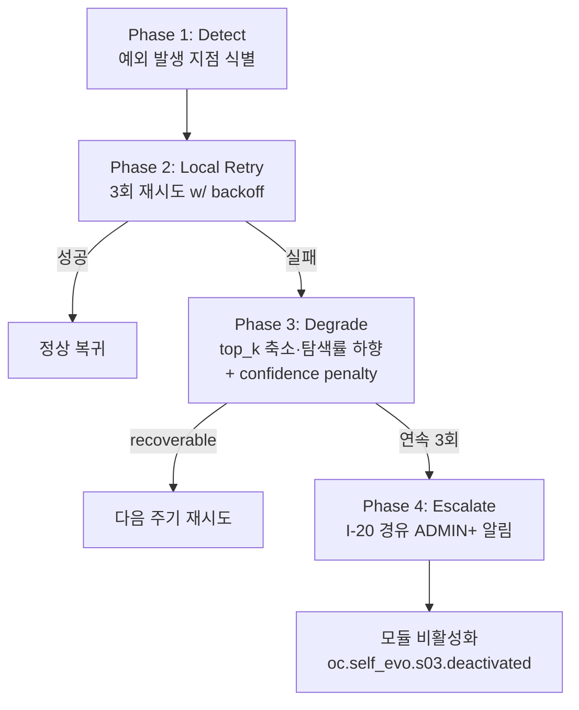

# S-3 Strategy Optimizer — 상세 설계 (L3)

> **수정 정책**: 정본 — Phase 변경 시 갱신 (§8.2)
> **도메인**: 6-6_Self-Evolution-System / 01_s-series-modules
> **Tier**: 6 (System-wide Components)
> **정본 출처**: D2.0-02 §10.4~§10.6 (LOCK), D2.0-01 §5.7 (명칭 LOCK), Part2 V3-Phase 2 (S-3 정의), 종합계획서 부록 A.3 (UCB1)
> **LOCK 매핑**: L1(모듈 목록), L2(I-Module 경유), L3(S-8 승인 필수), L4(자동 적용 금지), L6(순차 활성화 — S-2 안정화 후), L7(BaseSelfEvo ABC)
> **Phase**: P1-M2
> **생성일**: 2026-04-14
> **ISS 해결**: ISS-1 (S-3 알고리즘 힌트 소비 — UCB1)

---

## 교차 참조 블록 (Rule a)

| 참조 대상 | 관계 |
|----------|------|
| **D2.0-02 §10.4~§10.6** | S-Module 경유 동작 원칙 정본 (LOCK L2) |
| **D2.0-01 §5.7** | S-Module 명칭·카테고리 LOCK |
| **Part2 V3-Phase 2** | S-3 When/Where 정본, BaseSelfEvo ABC 시그니처 정본, S-8 승인 의무(L3) |
| **종합계획서 §7 P1-M2, 부록 A.3** | UCB1(Multi-Armed Bandit) 알고리즘 힌트 (초기 탐색 20% → 수렴 후 5%) |
| **01_s-series-modules/_index.md** | S-3 역할·I/O·트리거(§1.1), I-Module 접근 매트릭스(§2.3), BaseSelfEvo ABC(§3.1), 에러 핸들링(§3.2) 정본 |
| **AUTHORITY_CHAIN.md §4** | LOCK L1/L2/L3/L4/L6/L7 레지스트리 |
| **s02_pattern_miner.md (P1-M1)** | `list[BehaviorPattern]` 공급자 — 본 모듈 입력 정본 |
| **s08_governance (P2 예정)** | EvolutionPlan 승인(L3), I-19 WRITE 대리 수행 |
| **02_self-improvement-loop/** | 5단계 루프(L5) 중 "제안→검증" 단계에서 S-3 산출 소비 |
| **6-12 Event-Logging** | `oc.self_evo.s03.*` 이벤트 기록 대상 (R-01-7 구조화 로깅) |
| **6-4 Memory-RAG-Storage** | I-15 스냅샷 저장/복원 (S-8 대리 경로) |
| **6-5 SDAR-System** | S-3 → SDAR 카탈로그 확장 제안 (양방향 피드백) |

---

## 1. 개요

S-3 Strategy Optimizer는 Self-Evolution 서브시스템의 **전략 최적화 엔진**으로, S-2가 공급한 `list[BehaviorPattern]`과 I-6 QoD 기반 `PerformanceMetrics`를 입력으로 **Multi-Armed Bandit(UCB1)** 알고리즘을 통해 후보 전략을 선택·최적화하고, **S-8 거버넌스 승인(L3)** 을 거쳐 채택된 전략만 반영한다.

### 1.1 책임 요약
- **전략 후보 생성·선택**: UCB1 기반 exploration-exploitation 밸런스로 전략 후보(arm) 선택
- **성능 개선율 비교**: QoD 기반 before/after metric 델타로 후보 전략 평가
- **S-8 승인 경유(L3)**: 모든 전략 반영은 S-8 거버넌스 승인 후 수행, 자동 반영 금지(L4)
- **I-Module 경유(L2)**: I-6 READ(QoD), I-9 READ(로그/메트릭), I-18 READ(메타학습 파라미터) (접근 매트릭스 §2.3 정본)
- **순차 활성화(L6)**: S-2 안정화(DH-1 통과) 후에만 활성화

### 1.2 입출력 요약 (01/_index.md §1.1 정합)
- **Input**: `list[BehaviorPattern]` (S-2 공급) + `PerformanceMetrics` (I-6/I-9 READ)
- **Output**: `OptimizedStrategy(params, expected_improvement)`
- **트리거**: S-2 `oc.self_evo.s02.mined` 이벤트 수신 시

---

## 2. 공통 자료 구조 선정의 (Pydantic, Rule k)

> 본 모듈이 소비하는 `BehaviorPattern`은 s02_pattern_miner.md §2의 정본을 그대로 가져온다. 본 파일은 S-3 고유 구조만 정의한다.

```python
from pydantic import BaseModel, Field
from typing import Literal, Optional
from datetime import datetime
# from s02_pattern_miner import BehaviorPattern  # 공급 스키마 재사용

# ── 입력 보조 스키마 ─────────────────────────────────────────
class PerformanceMetrics(BaseModel):
    """I-6 QoD + I-9 집계 메트릭"""
    window_start: datetime
    window_end: datetime
    qod_mean: float              # 0.0~1.0
    qod_p50: float
    qod_p95: float
    latency_p50_ms: float
    latency_p95_ms: float
    error_rate: float            # 0.0~1.0
    sample_count: int

# ── 전략 후보(arm) ──────────────────────────────────────────
class StrategyCandidate(BaseModel):
    """UCB1 bandit arm — 후보 전략"""
    strategy_id: str             # hash(param_set)
    category: Literal["prompt","routing","retrieval","caching","other"]
    params: dict                 # 전략 파라미터 (카테고리별 스키마)
    source_pattern_ids: list[str]  # 유래 BehaviorPattern
    pulls: int = 0               # UCB1 arm pull 횟수
    reward_sum: float = 0.0      # 누적 보상(QoD 개선분)
    last_used_at: Optional[datetime] = None

# ── 출력 스키마 (01/_index.md §1.1 정합) ─────────────────────
class OptimizedStrategy(BaseModel):
    """S-3 → (S-8 승인) → 반영 대상"""
    strategy_id: str
    params: dict
    expected_improvement: float  # QoD 기대 개선 (0.0~1.0)
    confidence: float            # UCB1 bound 기반 신뢰도
    exploration_flag: bool       # True=탐색, False=활용
    evaluation_window: dict      # {start, end}
    source_pattern_ids: list[str]
    proposed_at: datetime

# ── 거버넌스 제출 스키마 (L3 경유) ───────────────────────────
class EvolutionPlan(BaseModel):
    """S-8에 제출하는 반영 계획 (01/_index.md §1.1 S-7/S-8 연쇄 참조)"""
    plan_id: str
    strategy: OptimizedStrategy
    rollback_snapshot_id: Optional[str]   # I-15 스냅샷 (S-8이 기록)
    risk_hint: Literal["low","medium","high"]
    expected_cost: Optional[float]

# ── BaseSelfEvo 반환 구조 (L7 정본, s02와 정합) ──────────────
class EvolutionResult(BaseModel):
    module_id: str               # "s03"
    strategies: list[OptimizedStrategy]
    submitted_plans: list[str]   # S-8에 제출된 plan_id
    approved_count: int
    rejected_count: int
    snapshot_id: Optional[str]
    duration_ms: int
    status: Literal["SUCCESS","PARTIAL","FAILED"]

class HealthStatus(BaseModel):
    module_id: str
    healthy: bool
    last_run_at: Optional[datetime]
    error_count_7d: int
    schema_validation_rate: float
    imodule_call_success_rate: float
    pending_approval_count: int  # S-8 승인 대기 제출 수

# ── 에스컬레이션 페이로드 (I-20, R-01-8) ─────────────────────
class EscalationPayload(BaseModel):
    source_engine: str = "s03_strategy_optimizer"
    error_code: str
    original_request: dict
    partial_result: Optional[dict]
    retry_count: int
    timestamp: datetime
    trace_id: str
    severity: Literal["info","warn","error","critical"]
```

---

## 3. BaseSelfEvo ABC 구현 명세 (LOCK L7)

> 정본: 01_s-series-modules/_index.md §3.1. **시그니처 임의 변경 금지(Rule h/i).**
> Part2 V3-P2 정본: `async def evolve()`, `async def evaluate() -> float`, `async def rollback(snapshot_id: str) -> bool`.

### 3.1 클래스 스켈레톤

```python
class StrategyOptimizer(BaseSelfEvo):
    """S-3 Strategy Optimizer — L7 BaseSelfEvo 구현.

    정본 시그니처 준수:
      - evolve() -> EvolutionResult
      - evaluate() -> float
      - rollback(snapshot_id: str) -> bool

    순차 활성화(L6): S-2 DH-1 안정화(에러율<1%, 스키마 검증률=100%,
    3주기 연속 PASS) 확인 후에만 활성화.
    """

    MODULE_ID = "s03"

    async def evolve(self) -> EvolutionResult:
        """전략 후보 생성 → UCB1 선택 → S-8 승인 제출.

        단계:
          1) INPUT: S-2 공급 list[BehaviorPattern], I-6 QoD·I-9 메트릭(READ)
          2) 후보 생성: pattern → StrategyCandidate 매핑(카테고리 템플릿)
          3) UCB1 선택: arm(=candidate) pull → top-k 선택
          4) 기대 개선 추정: QoD 델타 예측 (이전 주기 reward 평균 + UCB bound)
          5) OptimizedStrategy[] 구성
          6) EvolutionPlan 변환 → S-8에 제출 (I-19 WRITE는 S-8이 대행)
          7) I-9 이벤트 기록 요청(oc.self_evo.s03.proposed, trace_id)
          8) S-8 응답 수집(승인/거부/보류) → 반영은 S-8 경로로만 수행(L3/L4)
        """

    async def evaluate(self) -> float:
        """모듈 성능 점수 (0.0~1.0).

        공식:
          score = 0.5 * approval_rate + 0.3 * qod_gain + 0.2 * exploration_balance
            - approval_rate:   S-8 승인률 (최근 30제안)
            - qod_gain:        승인·반영 전략의 QoD 개선 평균(정규화)
            - exploration_balance: 1 - |탐색비율 - 목표치|  (목표: 초기 0.2, 수렴 후 0.05)
        DH-1 안정화 기준(에러율<1%, 스키마 100%)을 가중 반영.
        """

    async def rollback(self, snapshot_id: str) -> bool:
        """I-15 스냅샷 기반 전략 카탈로그·bandit 상태 복원.

        - S-3는 I-15 직접 접근 권한 없음(§3.2) → S-8에 복원 요청 emit
        - 실패 시 SELF_EVO_ROLLBACK_FAIL → ADMIN+ 에스컬레이션(I-20)
        """

    def get_module_id(self) -> str:
        return self.MODULE_ID

    async def health_check(self) -> HealthStatus:
        ...
```

### 3.2 I-Module 접근 권한 (정본: 01/_index.md §2.3)

| I-Module | 권한 | 용도 |
|----------|------|------|
| I-6 QoD | **READ** | PerformanceMetrics.qod_* 조회 |
| I-9 로그/메트릭 | **READ** | SessionLog 집계·이벤트 기록 요청 위탁 |
| I-18 스케줄/메타학습 | **READ** | 메타학습 하이퍼파라미터(탐색률, c) 조회 |
| I-12 워크플로우 | — | 직접 접근 금지 (S-7이 대행) |
| I-14 QA | — | 직접 접근 금지 |
| I-15 스냅샷 | — | 직접 접근 금지 (S-8 대행 — L3) |
| I-19 승인 | — | **직접 접근 금지** — S-8만 WRITE 보유(§2.3 주의). S-3는 S-8에 "제출"하고, S-8이 I-19 기록 |

> **주의 (Rule j 정합)**: 01/_index.md §2.3 접근 매트릭스는 S-3에 대해 **I-6 READ, I-9 READ, I-18 READ** 만 허용한다. §7 P1-M2 본문(line 614)이 기술하는 "I-9 → I-19 → I-6 → I-15 호출 순서"는 **S-3가 직접 호출**하는 순서가 아니라, S-3 제출 → S-8 거버넌스가 대행하는 I-19/I-15 호출을 포함한 **전체 경유 순서**로 해석한다. 본 파일은 정본 §2.3을 따르며, I-19/I-15 접근은 S-8 대행 경로로 기술한다. 이 해석은 §10.2 CONFLICT 후보로 등재한다(SEVO-C003의 S-3 확장).

---

## 4. 알고리즘 상세 (L3 의사코드, Rule f)

> 시간복잡도(Big-O) + LOCK 참조 + ABC 패턴 매핑.
> 힌트 출처: 종합계획서 부록 A.3 (S-3: UCB1, 초기 탐색 20% → 수렴 후 5%), _index.md §2.5 Line 173.

### 4.1 파이프라인 총괄 (evolve() 본체)

```
ALGORITHM S3_Evolve
INPUT:   patterns: list[BehaviorPattern], metrics: PerformanceMetrics,
         c = sqrt(2) (UCB1 exploration coefficient),
         top_k = 5 (승인 제출 전략 수),
         explore_target = 0.20 (초기) → 0.05 (수렴 후)
OUTPUT:  EvolutionResult
LOCK:    L1(S-3), L2(I-6/I-9/I-18 READ), L3(S-8 승인), L4(제안만),
         L6(S-2 선행 안정화), L7(ABC)
ABC-매핑: BaseSelfEvo.evolve

1. IF NOT S2_STABLE():                                 # L6 gate
2.   RETURN EvolutionResult(status="FAILED", reason="S2_NOT_STABLE")
3. metrics ← I6.read_qod() ∪ I9.read_metrics(window)   # O(1) aggregates
4. hparams ← I18.read_meta(["ucb_c","explore_target"])  # O(1)
5. cand_set ← BUILD_CANDIDATES(patterns, catalog)      # O(p)
6. top ← UCB1_SELECT(cand_set, c=hparams.c, k=top_k)   # O(|cand| log k)
7. strategies ← [ESTIMATE_IMPROVEMENT(a, metrics) for a in top]   # O(k)
8. plans ← [BUILD_PLAN(s) for s in strategies]         # O(k)
9. FOR p IN plans:
10.   SUBMIT_TO_S8(p)                                  # S-8 승인 요청 emit
11.   # S-8이 I-19 WRITE + I-15 snapshot 대행(L3)
12. results ← COLLECT_S8_DECISIONS(plans, timeout=60s) # async
13. I9.emit_event("oc.self_evo.s03.proposed", {count: len(plans), trace_id})
14. UPDATE_BANDIT_STATE(cand_set, results)             # 보상 반영
15. RETURN EvolutionResult(strategies, submitted=..., approved=..., ...)
```

**총 시간복잡도**: `O(p + |cand| log k + k)`. 일반 운영 범위(p ≤ 10^3, |cand| ≤ 10^3, k=5)에서 수 초 이내, SELF_EVO_TIMEOUT(120s) 내부.

### 4.2 UCB1 알고리즘 (Multi-Armed Bandit)

```
ALGORITHM UCB1_SELECT(arms, c, k)
# Auer et al. 2002. 시간복잡도: O(|arms| log k) with min-heap, 공간 O(|arms|)
# ABC-매핑: evolve() 3단계 — 전략 후보 선택
INPUT:   arms: list[StrategyCandidate], c: float (default sqrt(2)), k: int
OUTPUT:  list[StrategyCandidate]  # 상위 k개

0. IF k <= 0 OR arms == []: RETURN []                    # base case (k 소진/arm 고갈 방지)
0. IF k <= 0 OR arms == []: RETURN []                    # base case (k 소진/arm 고갈 방지)
1. N ← Σ arm.pulls for arm in arms                       # 전체 pull 수
2. # 콜드 스타트 — 각 arm 최소 1회 pull 보장
3. FOR arm IN arms WHERE arm.pulls == 0:
4.   RETURN [arm] + UCB1_SELECT(arms \ {arm}, c, k-1)    # k 소진 시 종료
5. # UCB1 상한 계산
6. FOR arm IN arms:
7.   mean_reward ← arm.reward_sum / arm.pulls            # exploitation term
8.   bound      ← c * sqrt(ln(N) / arm.pulls)            # exploration term
9.   arm.ucb   ← mean_reward + bound
10. top_k ← SELECT_TOP_K(arms, key=arm.ucb, k)           # heap 선택
11. FOR arm IN top_k:
12.   arm.pulls += 1                                     # pull 기록
13.   arm.last_used_at ← now()
14. RETURN top_k

POSTCONDITION:
  exploration_ratio = (|{a : a.ucb dominated by bound}| / k)
  → Phase 초기 ~0.20, 수렴 후 ~0.05 (부록 A.3 정합)
```

**파라미터 기본값**: `c = sqrt(2)` (표준), `top_k = 5`, `explore_target = 0.20 → 0.05` (I-18 메타학습으로 동적 조정).

### 4.3 BUILD_CANDIDATES (패턴 → 후보 전략 매핑)

```
ALGORITHM BUILD_CANDIDATES(patterns, catalog)
# 시간복잡도: O(p)
INPUT:   patterns: list[BehaviorPattern], catalog: dict[pattern_type → template]
OUTPUT:  list[StrategyCandidate]

1. candidates ← []
2. FOR pat IN patterns:
3.   tmpl ← catalog.get(pat.pattern_type)
4.   IF tmpl IS NONE: CONTINUE
5.   params ← tmpl.instantiate(pat)                     # 템플릿 기반 파라미터화
6.   sid ← hash(params)
7.   existing ← BANDIT_STATE.get(sid)                   # 기존 arm 재사용
8.   IF existing IS NOT NONE:
9.     existing.source_pattern_ids.append(pat.pattern_id)
10.    candidates.append(existing)
11.  ELSE:
12.    candidates.append(StrategyCandidate(sid, tmpl.category, params,
                                           [pat.pattern_id]))
13. RETURN candidates
```

### 4.4 ESTIMATE_IMPROVEMENT

```
ALGORITHM ESTIMATE_IMPROVEMENT(arm, metrics) -> OptimizedStrategy
# 시간복잡도: O(1)
1. mean_reward ← arm.reward_sum / max(arm.pulls, 1)
2. bound       ← sqrt(2) * sqrt(ln(N) / max(arm.pulls, 1))
3. expected    ← clip(mean_reward + 0.5*bound, 0.0, 1.0)   # 기대 QoD 개선
4. confidence  ← 1.0 - min(bound, 1.0)                     # bound 작을수록 신뢰↑
5. exploration_flag ← (arm.pulls < PULL_THRESHOLD)         # 탐색 여부
6. RETURN OptimizedStrategy(
       strategy_id=arm.strategy_id, params=arm.params,
       expected_improvement=expected, confidence=confidence,
       exploration_flag=exploration_flag,
       evaluation_window={start: metrics.window_start, end: metrics.window_end},
       source_pattern_ids=arm.source_pattern_ids,
       proposed_at=now())
```

### 4.5 S-8 거버넌스 승인 흐름 (LOCK L3)

```
ALGORITHM SUBMIT_TO_S8(plan: EvolutionPlan)
# 시간복잡도: O(1) emit + 비동기 대기
LOCK: L3(S-8 승인), L4(자동 적용 금지)

1. I9.emit_event("oc.self_evo.s03.submit_plan",
                 {plan_id, strategy_id, risk_hint, trace_id})
2. S8.receive(plan)                                      # in-process queue or bus
3. # S-8 내부에서 다음을 대행 수행 (L3):
4. #   - I-19.write(ApprovalRequest(plan_id, decision, reason))
5. #   - 승인 시 I-15.snapshot(before_state) 생성
6. #   - 승인 시 반영 요청을 6-13 Operations에 전달 (S-8은 파일 직접 수정 ❌ — s08 §1.1 정합, L4)
7. # S-3는 응답만 수신하고, 자동 반영 경로 보유 금지(L4)
8. RETURN async_handle(plan_id)

DECISION 수신 후 UPDATE_BANDIT_STATE:
1. IF decision == APPROVED AND rollback_snapshot_id IS NOT NONE:
2.   arm.reward_sum += observed_qod_delta(evaluation_window)
3. IF decision == REJECTED:
4.   arm.reward_sum += 0   # 페널티 없음 (거부는 정보)
5. IF decision == ROLLED_BACK:
6.   arm.reward_sum -= 0.5 * expected_improvement   # 실패 반영
```

### 4.6 I-Module 경유 호출 순서 (정본 해석)

> §3.2 주의 대로 S-3 **직접 호출**은 I-6/I-9/I-18 READ만. 나머지는 S-8 대행.

```
STEP  Caller  Module         Action                              LOCK
1     S-3     I-9 READ       SessionLog 메트릭 집계              L2
2     S-3     I-6 READ       QoD 조회                            L2
3     S-3     I-18 READ      메타학습 하이퍼파라미터 조회        L2
4     S-3     S-8 (bus)      EvolutionPlan 제출                  L3
5     S-8     I-19 WRITE     ApprovalRequest 기록 (대행)         L3
6     S-8     I-15 WRITE     스냅샷 생성 (대행)                  L3
7     S-8     I-9 emit       oc.self_evo.s08.decision 이벤트     L2
8     S-3     I-9 emit       oc.self_evo.s03.proposed 이벤트     L2
(반영) S-8    (target file)  승인 시 설정/템플릿/정책 갱신      L4 경로차단 확인
```

---

## 5. 예외 처리 정책 표 (Rule g)

> 01/_index.md §3.2 DH 에러 핸들링 정본 확장.

| error_code | 상황 | recoverable | 처리 | 비고 |
|------------|------|-------------|------|------|
| `SELF_EVO_TIMEOUT` | evolve() > 120s | ✅ | 실행 중단 → 다음 주기 재시도, confidence penalty ×0.6 | DH-2 |
| `SELF_EVO_EVAL_FAIL` | evaluate() 예외 | ✅ | 이전 점수 유지(최대 3주기) → 초과 시 비활성화 | — |
| `SELF_EVO_ROLLBACK_FAIL` | rollback 실패 | ❌ | I-20 경유 ADMIN+ 즉시 에스컬레이션 | 무결성 보호 |
| `SELF_EVO_IMODULE_FAIL` | I-6/I-9/I-18 호출 실패 | ✅ | 3회 재시도(backoff 1s→2s→4s) → 실패 시 비활성화 | 표준 재시도 |
| `SELF_EVO_SNAPSHOT_FAIL` | S-8이 I-15 실패 응답 | ⚠️ | evolve() 차단, 제안 드롭 | L3 전제 위반 방지 |
| `S3_S2_NOT_STABLE` | S-2 DH-1 미충족 | ✅ | evolve() 조기 반환, 다음 주기 재평가 | L6 gate |
| `S3_COLD_START` | arm.pulls == 0 전체 | ✅ | 모든 arm을 최소 1회 pull, UCB1 부트스트랩 | 초기 20% 탐색 |
| `S3_ARM_EXPLOSION` | |cand_set| > 10^3 | ✅ | 유사도 기반 arm 병합(×0.5 축소), 재시도 1회 | 폭주 방지 |
| `S3_GOVERNANCE_TIMEOUT` | S-8 응답 > 60s | ✅ | plan 상태 PENDING 유지, 다음 주기 재조회 | S-8 600s(DH-2) 내부 |
| `S3_APPROVAL_REJECTED` | S-8 거부 | ✅ | 정상 흐름 — reward 0, bandit 업데이트 | L3 정합 |
| `S3_ROLLED_BACK_DETECTED` | 승인 후 롤백됨 | ✅ | reward 페널티 반영, trace 기록 | §4.5 |
| `S3_SCHEMA_VALIDATION_FAIL` | Pydantic 검증 실패 | ❌ | 해당 전략 drop + 경고 | DH-1 감소 |
| `S3_L4_AUTO_APPLY_ATTEMPT` | 자동 반영 경로 탐지 | ❌ | 즉시 중단 + 감사 로그 + I-20 | L4 위반 |

---

## 6. Phase별 복구 전략 (Rule e)

### 6.1 Phase 흐름도



### 6.2 다운그레이드 시 confidence penalty 표

| 다운그레이드 유형 | confidence 계수 | 누적 한도 |
|-------------------|----------------|-----------|
| Local retry 후 성공 (Phase 2) | ×1.0 | — |
| UCB1 콜드 스타트 미해소 (일부 arm pulls=0) | ×0.8 | 3주기 연속 시 degraded |
| S-8 응답 타임아웃 → PENDING 유지 | ×0.7 | 3주기 연속 시 degraded |
| I-18 메타학습 READ 실패 → 기본 c=√2 사용 | ×0.9 | — |
| Arm 폭주 축소(병합 수행) | ×0.7 | 2주기 연속 시 비활성화 |
| Timeout → 이전 주기 top_k 재사용 | ×0.6, 매 주기 ×0.9 누적 | 연속 5주기 초과 시 비활성화 |
| S-8 거부 (정상 흐름) | 영향 없음 | — |

---

## 7. 에스컬레이션 & 로깅 (I-20, R-01-7/R-01-8)

### 7.1 EscalationPayload (I-20 경유, Rule c)

```json
{
  "source_engine": "s03_strategy_optimizer",
  "error_code": "SELF_EVO_ROLLBACK_FAIL",
  "original_request": {
    "op": "rollback",
    "snapshot_id": "snap_s03_2026-04-14T01-30",
    "trigger": "s8_governance_rollback_request"
  },
  "partial_result": {
    "bandit_state_restored": false,
    "strategy_catalog_restored": true,
    "restored_items": 27,
    "failed_items": 4
  },
  "retry_count": 1,
  "timestamp": "2026-04-14T01:35:12Z",
  "trace_id": "trc_c3d2...",
  "severity": "critical"
}
```

- **대상 경로**: 6-12 Event-Logging I-20 → 6-2 Security-Governance ADMIN+ notify → 6-13 Operations alertmanager.

### 7.2 구조화 JSON 로깅 (R-01-7, Rule d — 중첩)

```json
{
  "ts": "2026-04-14T01:35:12.418Z",
  "level": "error",
  "logger": "self_evo.s03",
  "event": "oc.self_evo.s03.error",
  "module_id": "s03",
  "trace_id": "trc_c3d2...",
  "error": {
    "code": "S3_GOVERNANCE_TIMEOUT",
    "message": "S-8 did not respond within 60s for plan_id=plan_9e1",
    "stack_redacted": true
  },
  "context": {
    "plan_id": "plan_9e1",
    "strategy_id": "str_a4f",
    "submitted_at": "2026-04-14T01:34:10Z",
    "risk_hint": "medium",
    "bandit_state": { "arms": 42, "total_pulls": 318 }
  },
  "recovery": {
    "action": "keep_pending_and_recheck_next_cycle",
    "confidence_penalty": 0.3,
    "next_retry_at": "2026-04-14T02:30:00Z",
    "phase": 3
  }
}
```

### 7.3 정상 이벤트 목록 (6-12 ocodes)

| 이벤트 | 의미 | level |
|--------|------|-------|
| `oc.self_evo.s03.started` | evolve() 시작 | info |
| `oc.self_evo.s03.candidates_built` | 후보 생성 완료 (count) | info |
| `oc.self_evo.s03.proposed` | 전략 제안 완료 (plan_id[], trace_id) | info |
| `oc.self_evo.s03.submit_plan` | 개별 plan S-8 제출 | info |
| `oc.self_evo.s03.decision_received` | S-8 결정 수신(APPROVED/REJECTED) | info |
| `oc.self_evo.s03.bandit_updated` | reward 반영 완료 | info |
| `oc.self_evo.s03.error` | 예외 (위 7.2 포맷) | error |
| `oc.self_evo.s03.deactivated` | 모듈 비활성화 | critical |

---

## 8. Phase 2 통합 테스트 시나리오 (Rule e, 10건 이상)

| # | 시나리오 | 입력 | 기대 결과 | 검증 LOCK |
|---|---------|------|-----------|-----------|
| T1 | 정상 패턴 100개·S-2 안정화 완료 | top_k=5 | 5개 OptimizedStrategy 출력, S-8 제출 | L1 |
| T2 | S-2 DH-1 미충족 (에러율 3%) | — | `S3_S2_NOT_STABLE`, evolve() 조기 반환 | L6 |
| T3 | UCB1 콜드 스타트 (all pulls=0) | 신규 40 arms | 전 arm 최소 1회 pull, exploration 100% | 부록 A.3 |
| T4 | 수렴 상태 (각 arm pulls ≥ 30) | 기존 50 arms | exploration 비율 ~5%, top-k UCB 기반 선택 | 부록 A.3 |
| T5 | S-8 승인 → QoD +0.04 관측 | 승인 후 피드백 | 해당 arm reward_sum 증가, bandit state 갱신 | L3 |
| T6 | S-8 거부 | risk_hint=high | 정상 흐름, reward 0, error 아님 | L3 |
| T7 | S-8 타임아웃 (60s 초과) | S-8 처리 지연 | plan PENDING, `S3_GOVERNANCE_TIMEOUT`, 다음 주기 재조회 | §5 |
| T8 | 자동 반영 경로 시도(테스트 하네스) | rogue path | `S3_L4_AUTO_APPLY_ATTEMPT`, 즉시 중단 + 감사 | L4 |
| T9 | I-6 READ 외 직접 호출 시도 | 직접 I-19 호출 | 정책 거부 (S-3 권한 없음), 모듈 중단 | L2 |
| T10 | Arm 폭주 (>10^3) | 낮은 min_support 반영 | `S3_ARM_EXPLOSION`, 유사도 병합 후 재시도 | §5 |
| T11 | evolve() timeout(147s) | 강제 지연 | `SELF_EVO_TIMEOUT`, Phase 3 degrade, penalty ×0.6 | §6.2 |
| T12 | rollback 실패 (S-8이 I-15 FAIL 응답) | 손상 snapshot | `SELF_EVO_ROLLBACK_FAIL`, I-20 에스컬레이션 | §7.1 |
| T13 | S-3 → SDAR 카탈로그 확장 제안 (양방향) | pattern_type="prompt" | SDAR 카탈로그 제안 이벤트 emit, S-8 경유 | 6-5 정본 |
| T14 | S-2 공급 없음(빈 list) | patterns=[] | status=PARTIAL, 전략 0개, 정상 종료 | — |
| T15 | 스키마 검증 실패 1% | 손상 OptimizedStrategy | 해당 건 drop, DH-1 스키마율 감소 경보 | DH-1 |
| T16 | S-4 트리거(이상 탐지) 경유 S-3 재실행 | alert signal | out-of-band evolve() 1회 실행, bandit 영향 없음 | 모니터링 루프 |

---

## 9. 세션 간 인터페이스 cross-check (Rule j)

> 공급·소비 계약 정본화.

| 인터페이스 | 공급자 | 소비자 | 스키마 | 정본 |
|-----------|--------|--------|--------|------|
| `list[BehaviorPattern]` | S-2 (P1-M1) | **S-3 (본 세션)** | s02 §2 BehaviorPattern | s02_pattern_miner.md §2 |
| `PerformanceMetrics` | I-6/I-9 | **S-3** | §2 PerformanceMetrics | 01/_index.md §1.1 |
| `OptimizedStrategy` | **S-3** | S-7(스케줄), S-8(승인) | §2 OptimizedStrategy | 01/_index.md §1.1 |
| `EvolutionPlan` | **S-3** | S-8 | §2 EvolutionPlan | L3 |
| `GovernanceDecision` | S-8 (P2-예정) | **S-3** | s08 예정 | L3 |
| `RegressionRequest` | **S-3** | S-2 | s02 §2 RegressionRequest | L8 (S-3가 승인·반영 후 S-2에 회귀 의뢰) |
| EscalationPayload | **S-3** | I-20 | §2 EscalationPayload | R-01-8 |

### 9.1 선행 세션(P1-M1) cross-check
- S-2가 공급하는 `BehaviorPattern.pattern_type`은 `Literal["sequential","cluster","hybrid"]`. 본 파일 §4.3 BUILD_CANDIDATES의 `catalog` 키와 동일해야 한다. **현재 일치 — 변경 없음.**
- S-2가 제공하는 `pattern_id`는 `hash(sequence+cluster_id)`. 본 파일 `StrategyCandidate.source_pattern_ids`가 이를 그대로 참조. **정합.**

### 9.2 후속 세션(P1-M3~M6, P2 s08) 공급 계약
- **S-4(P1-M3)**: 본 모듈의 `oc.self_evo.s03.proposed` 이벤트를 메트릭으로 관찰. S-4가 QoD 하락 감지 시 S-3 재실행 트리거(T16).
- **S-7(P1-M6)**: `list[EvolutionPlan]` 소비 — 본 파일 §2 EvolutionPlan 정본 준수.
- **S-8(P2)**: `EvolutionPlan` 소비 + `GovernanceDecision` 반환. I-19 WRITE 단독 권한 보유. 본 파일 §4.5 흐름을 s08_governance.md 작성 시 반드시 대조.

---

## 10. LOCK 참조 매핑 & CONFLICT 후보

### 10.1 LOCK 참조

| LOCK | 반영 위치 |
|------|-----------|
| L1 S-2~S-8 모듈 목록 | §1, §2 (MODULE_ID="s03") |
| L2 I-Module 경유 원칙 | §3.2 접근 권한, §4.1/§4.6 호출 순서 |
| L3 S-8 거버넌스 승인 필수 | §4.5 SUBMIT_TO_S8 전용 절차, §8 T5/T6/T7 |
| L4 자동 적용 금지 | §4.5 line 7, §5 `S3_L4_AUTO_APPLY_ATTEMPT`, §8 T8 |
| L6 순차 활성화 (S-2 → S-3) | §3.1 클래스 주석, §4.1 line 1 gate, §8 T2 |
| L7 BaseSelfEvo ABC | §3.1 클래스 스켈레톤 (시그니처 정본 준수) |

### 10.2 CONFLICT 후보 기록

**[CONFLICT_CANDIDATE: 종합계획서 P1-M2 본문 line 614의 "I-9 → I-19 → I-6 → I-15 호출 순서" 지시와 01/_index.md §2.3 I-Module 접근 매트릭스(S-3 = I-6/I-9/I-18 READ only) 간 불일치]**

- **불일치 상세**:
  - 종합계획서 §7 P1-M2 본문(line 614): "I-Module 경유 호출 순서: I-9(로그) → I-19(승인) → I-6(QoD) → I-15(스냅샷)"
  - 01/_index.md §2.3 접근 매트릭스: S-3 = {I-6 READ, I-9 READ, I-18 READ}, I-19/I-15 권한 없음. §2.3 주의: "S-8만 I-19 WRITE 권한 보유".
- **본 파일의 채택**: 01/_index.md §2.3 (FINAL REVIEW 승인 정본) 준수. 본문 line 614의 호출 순서는 **S-8 대행을 포함한 전체 경유 순서**로 해석하여 §4.6에 명시(Caller 컬럼 분리).
- **근거**: Rule (j) "다른 세션 산출물과의 인터페이스 정합" — P0 산출물 _index.md가 정본. _index.md §2.3은 SEVO-C001/002/003 정합 회로의 최종 형태.
- **등재 ID**: **SEVO-C003 확장**(P1-M1 등재 후보를 S-3에도 동일 구조로 적용). **상태: ✅ RESOLVED (2026-04-14)** — CONFLICT_LOG.md §3 참조. 결정 요약: 01/_index.md §2.3 접근 매트릭스(A.4)가 정본이며, 종합계획서 §7 P1-M2 본문의 "I-9 → I-19 → I-6 → I-15" 호출 순서는 **S-8 대행을 포함한 전체 경유 경로(flow)** 로 해석 고정. 본 파일 §4.6 Caller 컬럼 분리 방식이 정본 해석 그대로.

> 파서 마커: CONFLICT_LOG.md §3 SEVO-C003 RESOLVED 정본 반영 완료. flow vs direct call 분리 원칙을 §3.2·§4.5·§4.6·§10.2에 일관 적용.

---

## 11. 수정 정책

> **정본 — Phase 변경 시 갱신 (§8.2)**.
> 본 파일은 S-3 Strategy Optimizer의 UCB1 알고리즘·S-8 승인 경유 흐름의 L3 정본이다. 상위 정본(D2.0-02 §10.6, Part2 V3-P2, 01/_index.md §1.1/§2.3/§3.1) 변경이 없는 한 임의 수정 금지.

---

## 12. 변경 이력

| 일자 | 변경 | 세션 |
|------|------|------|
| 2026-04-14 | 초기 작성(P1-M2) — BaseSelfEvo ABC 구현, UCB1 의사코드, S-8 승인 흐름(L3), 접근 매트릭스 정합(§3.2), CONFLICT 후보 SEVO-C003 S-3 확장 기록, Phase 2 테스트 16건 | P1-M2 |
| 2026-04-14 | 심층 재검증 그룹 A — §10.2 SEVO-C003 확장 상태 OPEN → RESOLVED 반영 (CONFLICT_LOG.md 정본 동기화) | 재검증 |
