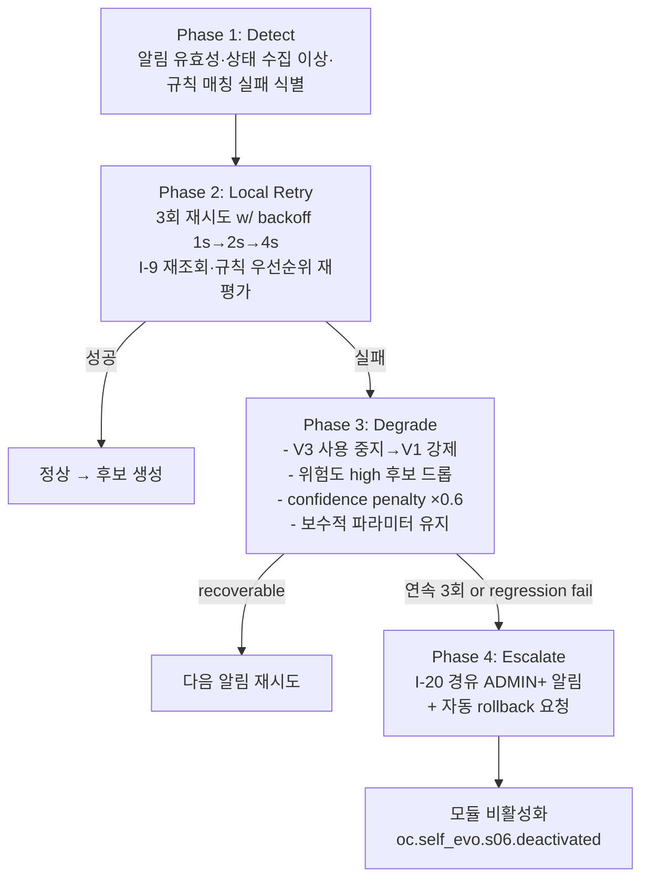

# S-6 Adaptation Engine — 상세 설계 (L3)

> **수정 정책**: 정본 — Phase 변경 시 갱신 (§8.2)
> **도메인**: 6-6_Self-Evolution-System / 01_s-series-modules
> **Tier**: 6 (System-wide Components)
> **정본 출처**: D2.0-02 §10.4~§10.6 (LOCK), D2.0-01 §5.7 (명칭 LOCK), Part2 V3-Phase 2 L4099-L4115 (S-Module When/Where·ABC)·L4119 (ABC 시그니처), 종합계획서 부록 A.3 (Rule-based → RL, 변경 전 스냅샷 필수)
> **LOCK 매핑**: L1(모듈 목록), L2(I-Module 경유 — I-9 READ / I-15 READ), L3(S-8 승인 필수), L4(자동 적용 금지), L6(순차 활성화 — S-5 안정화 후), L7(BaseSelfEvo ABC)
> **Phase**: P1-M5
> **생성일**: 2026-04-14
> **ISS 해결**: ISS-1 (S-6 알고리즘 힌트 소비 — Rule-based(V1) → RL-based(V3), 변경 전 스냅샷 필수)

---

## 교차 참조 블록 (Rule a)

| 참조 대상 | 관계 |
|----------|------|
| **D2.0-02 §10.4~§10.6** | S-Module 경유 동작 원칙 정본 (LOCK L2) |
| **D2.0-01 §5.7** | S-Module 명칭·카테고리 LOCK (S-6 = "Adaptation Engine") |
| **Part2 V3-Phase 2 L4099-L4115** | S-6 When(S-4 알림 수신 시)/Where(backend/vamos_core/self_evo/s06_adaptation_engine.py) 정본 |
| **Part2 V3-Phase 2 L4119** | BaseSelfEvo ABC 시그니처 정본 (`async def evolve()`, `async def evaluate() -> float`, `async def rollback(snapshot_id: str) -> bool`) |
| **종합계획서 §7 P1-M5** | Rule-based(V1) → RL-based(V3) 전환 힌트, 환경 변화 감지 → 적응 실행 흐름, I-Module 호출 순서 힌트(I-9→I-19→I-6→I-15) |
| **종합계획서 부록 A.3** | S-6 알고리즘 힌트: "Rule-based(V1) → RL-based(V3). 변경 전 스냅샷 필수" |
| **01_s-series-modules/_index.md** | S-6 역할·I/O·트리거(§1.1, Input=`EnvironmentState`, Output=`AdaptationAction`), 접근 매트릭스 §2.3(S-6 = I-9 READ, I-15 READ), BaseSelfEvo ABC(§3.1), 에러 핸들링(§3.2) 정본 |
| **AUTHORITY_CHAIN.md §4** | LOCK L1/L2/L3/L4/L6/L7 레지스트리 |
| **s02_pattern_miner.md (P1-M1)** | S-6 승인 반영 후 L8 회귀 의뢰 — `RegressionRequest(source_module="S-6")` 재사용 (s02 §2 정본) |
| **s03_strategy_optimizer.md (P1-M2)** | `EvolutionPlan` 정본 재사용. S-3가 생성하는 전략 플랜과 S-6이 생성하는 `AdaptationPlan`은 모두 `EvolutionPlan`으로 S-8 제출 |
| **s04_performance_monitor.md (P1-M3)** | **S-6의 주 트리거 공급자** — S-4가 발행하는 `EnvironmentAlert`(EWMA 3σ 이탈 or QoD<0.85 등) 수신 시 S-6 활성화 (적응 루프 진입점) |
| **s05_feedback_loop.md (P1-M4)** | S-5는 S-6에 직접 트리거 **없음** (피드백 루프 ≠ 적응 루프, s05 §3.3 재확인). 공통 `EscalationPayload`만 재사용 |
| **s07_evolution_scheduler.md (P1-M6 예정)** | S-6이 S-8에 제출한 `EvolutionPlan`은 승인 시 S-7 스케줄 큐에 적재. s07 작성 시 `source_module="S-6"` 분기 처리 대조 필요 |
| **s08_governance (P2 예정)** | `AdaptationPlan` 승인 경로(L3), 변경 전 I-15 스냅샷 대행 책임(L10), rollback 대행 |
| **02_self-improvement-loop/** | ISS-3 5단계 중 "Plan(S-3/S-6)" 단계 합류 — S-6은 적응 플래너로서 참여 |
| **03_model-upgrade-strategy/** | 적응 결과가 모델 교체를 수반할 경우 canary_rollback.md (ISS-6)의 QoD 게이트 롤백 메커니즘과 연동 |
| **6-12 Event-Logging** | `oc.self_evo.s06.*` 이벤트 기록 대상 (R-01-7 구조화 로깅) |
| **6-4 Memory-RAG-Storage** | I-15 스냅샷 저장/복원 경로 (S-6은 I-15 READ, WRITE는 S-8 대행 — L3 정합) |
| **6-2 Security-Governance** | EscalationPayload(I-20) ADMIN+ 에스컬레이션 대상 |
| **6-13 Operations** | AdaptationAction 대상 파라미터(캐시 크기/동시성/타임아웃) 적용 실측치 관측 |

---

## 1. 개요

S-6 Adaptation Engine은 Self-Evolution 서브시스템의 **환경 적응 엔진**으로, S-4 Performance Monitor가 발행한 환경 이상 알림(`EnvironmentAlert`)을 수신하여 **현재 환경 상태(`EnvironmentState`)**를 I-9 READ로 조회하고, 초기 단계에는 **Rule-based 엔진**으로 즉시 대응 액션(`AdaptationAction`)을 산출하며, 데이터 축적이 충분해지면 **RL-based 정책**(Q-Learning → DQN)으로 전환한다. 모든 변경은 **변경 전 I-15 스냅샷 필수**(부록 A.3, L10)이며 S-8 거버넌스 승인(L3) 경유이며, BaseSelfEvo ABC(L7)를 구현한다. S-5 안정화(L6) 후 활성화된다.

### 1.1 책임 요약
- **환경 알림 수신**: S-4 `EnvironmentAlert` 구독 (트리거 단독 소스)
- **환경 상태 조회**: I-9 READ로 `EnvironmentState(load, error_rate, user_count, latency_p95, cost_rate, cache_hit, queue_depth)` 수집
- **적응 대상 파라미터 결정**: 캐시 크기, 동시 요청 수, 타임아웃, 재시도 상한, 배치 크기(D2.0-02 §10.6 S-6 행 기준)
- **Rule-based 엔진(V1)**: 휴리스틱 규칙 테이블 평가 → `AdaptationAction` 후보 생성
- **RL-based 정책(V3)**: 축적된 (state, action, reward) 궤적으로 Q-Learning 학습 → ε-greedy 행동 선택
- **전환 조건(V1→V3)**: 승인·반영 트라이얼 ≥ `MIN_TRIALS`(=200) 그리고 Rule 정합률 ≥ 0.7, DH-6 기준
- **변경 전 스냅샷(L10)**: I-15 READ로 현재 구성 스냅샷 ID 확인 후 S-8에 생성 요청 (WRITE는 S-8 대행)
- **S-8 승인 경유(L3)**: `AdaptationPlan`(=`EvolutionPlan`) 제출 — 승인된 항목만 반영
- **회귀 검증(L8)**: 반영 후 S-2에 `RegressionRequest(source_module="S-6")` 발행
- **자동 적용 금지(L4)**: 본 모듈은 파라미터 파일/설정 저장소를 직접 수정하지 않는다
- **I-Module 경유(L2)**: I-9 READ, I-15 READ (접근 매트릭스 §2.3 정본)
- **순차 활성화(L6)**: S-5 DH-1 안정화 통과 후에만 활성화

### 1.2 입출력 요약 (01/_index.md §1.1 정합)
- **Input**: `EnvironmentState(load, error_rate, user_count, ...)` (I-9 READ) + `EnvironmentAlert`(S-4 발행)
- **Output**: `AdaptationAction(target_param, old_value, new_value)` → `AdaptationPlan`(=`EvolutionPlan`)으로 S-8 제출
- **트리거**: S-4 알림 수신 시 (이벤트 기반, 상시 대기)

### 1.3 5-stage 매핑 (LOCK L5 대조, Part2 L3078 정합)

| L5 단계 | 본 모듈 행위 | 산출 |
|---------|-------------|------|
| ① 수집 | `collect_state()` — I-9 READ + 알림 컨텍스트 병합 | `EnvironmentState` |
| ② 분석 | `analyze()` — Rule 매칭 or RL 정책 추론 | `AdaptationCandidate[]` |
| ③ 제안 | `propose()` — S-8에 `AdaptationPlan` 제출 (스냅샷 ID 포함) | `plan_id` list |
| ④ 검증 | S-8 승인 대기 + 승인 시 S-2 회귀 테스트 의뢰(L8) | `RegressionRequest` |
| ⑤ 적용 | 승인·적용 후 reward 관측만 (본 모듈은 반영 경로 보유 금지 — L4) | 이벤트만 + RL 샘플 |

---

## 2. 공통 자료 구조 선정의 (Pydantic, Rule k)

> `AdaptationPlan`은 **s03 §2 `EvolutionPlan` 정본을 재사용**(하위 타입 아님, `source_module="S-6"` 분기). `RegressionRequest`는 **s02 §2 정본을 재사용**. `EscalationPayload`는 s02/s03/s04/s05 정합.

```python
from pydantic import BaseModel, Field
from typing import Literal, Optional
from datetime import datetime

# ── 입력 스키마 (01/_index.md §1.1 정본) ──────────────────────
class EnvironmentState(BaseModel):
    """환경 메트릭 스냅샷 (정본: _index.md §1.1 S-6 Input).

    I-9 READ로 수집. S-4의 EnvironmentAlert 컨텍스트와 병합 후 확정.
    """
    state_id: str
    observed_at: datetime
    load: float = Field(ge=0.0)                   # CPU utilization 0.0~1.0+
    error_rate: float = Field(ge=0.0, le=1.0)     # 최근 5분 에러율
    user_count: int = Field(ge=0)                 # 동시 활성 사용자
    latency_p95_ms: float = Field(ge=0.0)
    cost_rate_per_min: float = Field(ge=0.0)      # I-8 cost/min
    cache_hit_ratio: float = Field(ge=0.0, le=1.0)
    queue_depth: int = Field(ge=0)
    qod_ewma: Optional[float] = None              # S-4가 동봉한 경우에만
    alert_source: Optional[str] = None            # S-4 alert_id

# ── S-4 → S-6 트리거 ───────────────────────────────────────────
class EnvironmentAlert(BaseModel):
    """S-4 Performance Monitor가 발행 (s04 §3.3 out-edge).

    LOCK 대조: s04 정본 스키마를 본 파일에서 소비 계약으로 명세.
    """
    alert_id: str
    alert_type: Literal["HIGH_LOAD", "HIGH_ERROR", "HIGH_LATENCY",
                        "HIGH_COST", "LOW_QOD", "QUEUE_BACKPRESSURE"]
    severity: Literal["warn", "error", "critical"]
    detected_at: datetime
    metric_snapshot: dict                         # raw key→float
    recommendation_hint: Optional[str] = None

# ── 적응 규칙 (Rule-based V1) ──────────────────────────────────
class AdaptationRule(BaseModel):
    """휴리스틱 규칙 (버전 관리 대상 — 변경 시 I-15 스냅샷 필수, L10)."""
    rule_id: str
    priority: int                                 # 1=highest
    condition: dict                               # {metric: op: threshold}
    target_param: Literal["cache_size", "concurrency_limit",
                          "timeout_ms", "retry_limit", "batch_size",
                          "rate_limit_rps"]
    action_type: Literal["INCREASE", "DECREASE", "SET"]
    delta_or_value: float                         # pct(INCREASE/DECREASE) or absolute(SET)
    min_value: float
    max_value: float
    cooldown_sec: int = 300                       # 반복 발동 방지
    risk_hint: Literal["low", "medium", "high"] = "low"
    version: int
    author: str = "DEFINED-HERE"

class RuleSet(BaseModel):
    """규칙 테이블 (I-15 스냅샷 대상)."""
    ruleset_id: str
    version: int
    rules: list[AdaptationRule]
    built_at: datetime
    active: bool = True

# ── RL 정책 (V3) ───────────────────────────────────────────────
class RLPolicy(BaseModel):
    """Q-Learning/DQN 정책 스냅샷 (I-15 스냅샷 대상).

    V1(Rule-based) 병행 기간에는 advisor 역할만, 전환(DH-6) 후에는 주 의사결정자.
    """
    policy_id: str
    algo: Literal["q_learning", "dqn"] = "q_learning"
    version: int
    # Q-Learning: Q[state_bucket, action] — 이산화 후 table
    q_table: Optional[dict] = None                # key: f"{sb}|{a}" → float
    # DQN: 가중치 스냅샷 해시 (실제 가중치는 I-15 blob)
    weights_blob_id: Optional[str] = None
    # 공통
    state_discretizer: dict                       # metric → bucket edges
    action_space: list[str]                       # target_param × action_type × bucket
    epsilon: float = 0.1                          # ε-greedy
    gamma: float = 0.9                            # 할인율
    alpha: float = 0.1                            # 학습률
    trained_samples: int = 0
    built_at: datetime

# ── 후보/결정 ──────────────────────────────────────────────────
class AdaptationCandidate(BaseModel):
    candidate_id: str
    source: Literal["rule", "rl", "rule_rl_merged"]
    rule_id: Optional[str] = None
    target_param: str
    old_value: float
    new_value: float
    confidence: float = Field(ge=0.0, le=1.0)
    expected_reward: Optional[float] = None       # RL 전용
    risk_hint: Literal["low", "medium", "high"]
    rationale: str

class AdaptationAction(BaseModel):
    """정본 출력 (01/_index.md §1.1 S-6 Output)."""
    action_id: str
    target_param: str
    old_value: float
    new_value: float
    decided_at: datetime
    source: Literal["rule", "rl", "rule_rl_merged"]
    ruleset_version: Optional[int] = None
    policy_version: Optional[int] = None
    pre_snapshot_id: str                          # L10: 변경 전 I-15 스냅샷 필수
    trace_id: str

class AdaptationDecision(BaseModel):
    """승인 결과 + 반영 후 관측 (RL 샘플 소스)."""
    decision_id: str
    action: AdaptationAction
    governance_approved: bool
    governance_reason: Optional[str] = None
    applied_at: Optional[datetime] = None
    # 반영 후 관측 (reward 계산용)
    qod_before: Optional[float] = None
    qod_after: Optional[float] = None
    error_rate_before: Optional[float] = None
    error_rate_after: Optional[float] = None
    latency_before: Optional[float] = None
    latency_after: Optional[float] = None
    reward: Optional[float] = None
    trace_id: str

# ── RL 궤적 샘플 ───────────────────────────────────────────────
class RLSample(BaseModel):
    """(s, a, r, s') 궤적. V1 기간에도 축적 — V3 전환 기반(DH-6)."""
    sample_id: str
    state: EnvironmentState
    action_key: str                               # action_space 엔코딩
    reward: float
    next_state: EnvironmentState
    terminal: bool = False
    created_at: datetime

# ── S-8 제출 스키마 (s03 §2 정본 재사용) ───────────────────────
# class EvolutionPlan → s03_strategy_optimizer.md §2 정본 사용
#   {plan_id, strategy, rollback_snapshot_id=pre_snapshot_id,
#    risk_hint, expected_cost, source_module="S-6"}
# ── 회귀 테스트 의뢰 (s02 §2 정본 재사용) ──────────────────────
# class RegressionRequest → s02_pattern_miner.md §2 정본 사용, source_module="S-6"

# ── BaseSelfEvo 반환 구조 (L7 정본, s02~s05 정합) ─────────────
class EvolutionResult(BaseModel):
    module_id: str = "s06"
    candidates: list[AdaptationCandidate]
    submitted_plans: list[str]
    approved_count: int = 0
    rejected_count: int = 0
    applied_actions: list[str] = []
    pre_snapshot_id: Optional[str] = None
    duration_ms: int
    status: Literal["SUCCESS", "PARTIAL", "FAILED",
                    "INSUFFICIENT_DATA", "COOLDOWN", "S5_NOT_STABLE"]

class HealthStatus(BaseModel):
    module_id: str = "s06"
    healthy: bool
    last_run_at: Optional[datetime] = None
    error_count_7d: int
    schema_validation_rate: float
    imodule_call_success_rate: float
    approval_rate_7d: float
    rule_hit_rate_7d: float                       # 규칙 1+ 매칭 비율
    rl_trained_samples: int
    v1_v3_mode: Literal["V1_RULE_ONLY", "V1_V3_ADVISOR",
                        "V3_RL_PRIMARY"]
    rollback_count_7d: int

# ── 에스컬레이션 페이로드 (I-20, R-01-8, s02~s05 정합) ─────────
class EscalationPayload(BaseModel):
    source_engine: str = "s06_adaptation_engine"
    error_code: str
    original_request: dict
    partial_result: Optional[dict] = None
    retry_count: int
    timestamp: datetime
    trace_id: str
    severity: Literal["info", "warn", "error", "critical"]
```

---

## 3. BaseSelfEvo ABC 구현 명세 (LOCK L7)

> 정본: 01_s-series-modules/_index.md §3.1. **시그니처 임의 변경 금지(Rule h/i).**
> Part2 V3-P2 정본(L4119): `async def evolve()`, `async def evaluate() -> float`, `async def rollback(snapshot_id: str) -> bool`.

### 3.1 클래스 스켈레톤

```python
class AdaptationEngine(BaseSelfEvo):
    """S-6 Adaptation Engine — L7 BaseSelfEvo 구현.

    정본 시그니처 준수(Part2 L4119):
      - evolve() -> EvolutionResult        # 수집→분석→제안 (적용 경로 없음 — L4)
      - evaluate() -> float                # 적응 성공률(reward 평균) + 규칙 품질
      - rollback(snapshot_id: str) -> bool # RuleSet/RLPolicy/파라미터 복원(S-8 대행)

    순차 활성화(L6): S-5 DH-1 안정화(에러율<1%, 스키마 검증률=100%,
    3주기 연속 PASS) 확인 후에만 활성화.

    자동 적용 금지(L4): 본 모듈은 설정·파라미터 파일·저장소를 직접 수정하지
    않는다. AdaptationCandidate → AdaptationPlan(=EvolutionPlan)으로 S-8에
    제출, 승인된 항목만 운영 주체(6-13 Operations)가 반영한다. 반영 사실은
    S-2 RegressionRequest(L8)로 회귀 검증된다.

    변경 전 스냅샷(L10, 부록 A.3): 모든 AdaptationCandidate는 pre_snapshot_id를
    포함해야 하며, 스냅샷 생성 실패 시 evolve()는 SELF_EVO_SNAPSHOT_FAIL로
    차단한다(_index.md §3.2).
    """

    MODULE_ID = "s06"
    MIN_TRIALS_FOR_RL = 200                      # DH-6 V1→V3 전환 기준
    MIN_RULE_HIT_RATE_FOR_RL = 0.7               # DH-6 전환 기준
    COOLDOWN_DEFAULT_SEC = 300                   # 동일 파라미터 반복 방지
    EPSILON_INIT = 0.2                           # RL 탐색
    EPSILON_MIN  = 0.05
    GAMMA        = 0.9
    ALPHA        = 0.1

    async def evolve(self) -> EvolutionResult:
        """수집→분석→제안 1회 실행 (적용 경로 없음 — L4).

        단계 (LOCK L5):
          ① 수집: collect_state()
             - S-4 EnvironmentAlert 큐 1건 pop (없으면 COOLDOWN 반환)
             - I-9 READ로 EnvironmentState 수집 + alert 컨텍스트 병합
          ② 분석: analyze()
             - IF mode == V1_RULE_ONLY:
                 candidates ← EVAL_RULES(state, ruleset)
             - ELIF mode == V1_V3_ADVISOR:
                 rule_cands ← EVAL_RULES(...)
                 rl_cands   ← RL_SELECT(state, policy, eps)
                 candidates ← MERGE_ADVISOR(rule_cands, rl_cands)
             - ELIF mode == V3_RL_PRIMARY:
                 candidates ← RL_SELECT(state, policy, eps)
             - cooldown 필터 적용
          ③ 제안: propose()
             - 각 candidate에 대해 pre_snapshot_id 확보 (S-8 대행 I-15 WRITE 요청)
             - plan ← EvolutionPlan(strategy=candidate, rollback_snapshot_id=pre_snapshot_id,
                                     risk_hint=candidate.risk_hint, source_module="S-6")
             - S8.submit(plan)
          ④ I-9 이벤트 기록 (oc.self_evo.s06.proposed, trace_id)
          ⑤ S-8 결정 수신 — 자동 반영 경로 보유 금지(L4)
             - approved → S-2 RegressionRequest(source_module="S-6") 발행(L8)
             - 반영 후 next_state 관측 → RLSample 축적
        """

    async def evaluate(self) -> float:
        """모듈 성능 점수 (0.0~1.0).

        공식:
          score = 0.35 * approval_rate_7d
                + 0.30 * reward_avg_norm            # (reward_avg+1)/2, clip
                + 0.15 * rule_hit_rate_7d
                + 0.10 * schema_ok_rate
                + 0.10 * (1 - rollback_rate_7d)
        DH-1 안정화 기준(에러율<1%, 스키마 100%)을 하한으로 강제.
        """

    async def rollback(self, snapshot_id: str) -> bool:
        """I-15 스냅샷 기반 RuleSet·RLPolicy·대상 파라미터 복원.

        - S-6은 I-15 READ만 보유 (§3.2, _index.md §2.3)
          → WRITE는 S-8 대행 (s03/s04/s05 동일 대행 패턴)
        - 대상: RuleSet(ruleset_id/version), RLPolicy(policy_id/version),
                적용된 AdaptationAction 역방향(6-13 Operations 협조)
        - 실패 시 SELF_EVO_ROLLBACK_FAIL → ADMIN+ 에스컬레이션(I-20)
        """

    def get_module_id(self) -> str:
        return self.MODULE_ID

    async def health_check(self) -> HealthStatus:
        ...
```

### 3.2 I-Module 접근 권한 (정본: 01/_index.md §2.3)

| I-Module | 권한 | 용도 |
|----------|------|------|
| I-9 로그/메트릭 | **READ** | `EnvironmentState` 수집 (load, error_rate, latency, cost, cache_hit, queue_depth) |
| I-15 스냅샷 | **READ** | 현재 RuleSet/RLPolicy/파라미터 스냅샷 존재 확인. **WRITE는 S-8 대행**(L3 정합) |
| I-6 QoD | — | 직접 접근 금지 (S-4가 `EnvironmentState.qod_ewma`로 동봉) |
| I-14 QA | — | 직접 접근 금지 |
| I-12 워크플로우 | — | 직접 접근 금지 (S-7 관장) |
| I-18 스케줄 | — | 직접 접근 금지 |
| I-19 승인 | — | **직접 접근 금지** — S-8만 WRITE 보유. 반영 제안은 S-8 경유(L3) |

> **주의 (Rule j 정합)**: 01/_index.md §2.3 접근 매트릭스 S-6 행은 **I-9 READ, I-15 READ**만 허용한다. 종합계획서 §7 P1-M5 절차 5의 "I-Module 경유 호출 순서: I-9(환경 메트릭) → I-19(승인) → I-6(QoD) → I-15(스냅샷)" 기술에서 **I-19는 S-8 대행**, **I-6는 S-4의 `EnvironmentState.qod_ewma` 동봉값**, **I-15는 읽기만 직접, 쓰기는 S-8 대행**으로 해석한다(s02/s03/s04/s05 SEVO-C003 확장과 동형). 본 파일은 정본 §2.3을 따른다. 이 해석은 §10.2 CONFLICT 후보로 등재(SEVO-C003의 S-6 확장).

### 3.3 S-Module 간 연계 (트리거 in-edges / out-edges)

| 방향 | 대상 | 트리거 조건 | 스키마 | 루프 분류 |
|------|------|------------|--------|----------|
| IN  | **S-4 Performance Monitor** | `EnvironmentAlert` 발행 | `EnvironmentAlert` (§2) | 적응 루프 진입점 |
| IN  | I-9 (경유) | 알림 수신 시 상시 | `EnvironmentState` (§2) | 수집 |
| OUT | **S-8 Governance** | 적응 후보 ≥1건 | `EvolutionPlan`(=`AdaptationPlan`, s03 §2 정본) | L3 경유 |
| OUT | **S-2 Pattern Miner** | S-8 승인 후 반영 시 | `RegressionRequest` (s02 §2, source_module="S-6") | 회귀 검증(L8) |
| OUT | **S-7 Evolution Scheduler** (간접) | S-8 승인된 plan 스케줄 적재 | `EvolutionPlan`의 재사용 | s07 참조 |
| —   | **S-3 Strategy Optimizer** | 직접 트리거 없음 | — | 루프 분리 |
| —   | **S-5 Feedback Loop** | 직접 트리거 없음 (s05 §3.3 재확인) | — | 루프 분리 |

---

## 4. 알고리즘 상세 (L3 의사코드, Rule f)

> 시간복잡도(Big-O) + LOCK 참조 + ABC 패턴 매핑.
> 힌트 출처: 종합계획서 부록 A.3 (S-6: Rule-based(V1) → RL-based(V3), 변경 전 스냅샷 필수), _index.md §4 알고리즘 힌트 S-6 행.

### 4.1 파이프라인 총괄 (evolve() 본체)

```
ALGORITHM S6_Evolve
INPUT:   alert_queue:   Queue[EnvironmentAlert],
         ruleset:       RuleSet,
         policy:        Optional[RLPolicy],
         cooldown_tbl:  Dict[target_param, last_applied_at],
         params:        {min_trials_rl=200, rule_hit_thresh=0.7,
                         epsilon=0.1, gamma=0.9, alpha=0.1,
                         cooldown_default=300}
OUTPUT:  EvolutionResult
LOCK:    L1(S-6), L2(I-9/I-15 READ), L3(S-8 승인),
         L4(자동 적용 금지), L5(①~⑤), L6(S-5 선행 안정화),
         L7(ABC), L10(변경 전 스냅샷)
ABC-매핑: evolve()

1.  IF NOT S5_STABLE():                                 # L6 gate
2.    RETURN EvolutionResult(status="S5_NOT_STABLE")
3.  alert ← alert_queue.pop(timeout=0)                   # 비차단 1건
4.  IF alert IS None:
5.    RETURN EvolutionResult(status="COOLDOWN")
6.  # ① 수집
7.  metrics ← I9.read_metrics(window="last_5m")          # L2 READ
8.  state   ← BUILD_STATE(alert, metrics)                # O(1)
9.  # ② 분석
10. mode    ← DECIDE_MODE(policy, ruleset,
                          params.min_trials_rl,
                          params.rule_hit_thresh)        # DH-6
11. IF mode == "V1_RULE_ONLY":
12.   cands ← EVAL_RULES(state, ruleset)
13. ELIF mode == "V1_V3_ADVISOR":
14.   rule_cands ← EVAL_RULES(state, ruleset)
15.   rl_cands   ← RL_SELECT(state, policy, params.epsilon)
16.   cands      ← MERGE_ADVISOR(rule_cands, rl_cands)
17. ELIF mode == "V3_RL_PRIMARY":
18.   cands ← RL_SELECT(state, policy, params.epsilon)
19. IF len(cands) == 0:
20.   RETURN EvolutionResult(status="INSUFFICIENT_DATA")
21. cands ← APPLY_COOLDOWN(cands, cooldown_tbl,
                           params.cooldown_default)
22. # ③ 제안 (L10 — 변경 전 스냅샷 필수)
23. plans ← [] ; snap_ids ← []
24. FOR c IN cands:
25.   snap_id ← S8.request_snapshot("s06", ruleset.version,
                                     policy.version if policy else None,
                                     c.target_param)     # S-8 대행 I-15 WRITE
26.   IF snap_id IS None:
27.     EMIT("oc.self_evo.s06.error", code="SELF_EVO_SNAPSHOT_FAIL")
28.     CONTINUE                                          # 해당 cand 드롭
29.   action ← AdaptationAction(target_param=c.target_param,
                                old_value=c.old_value,
                                new_value=c.new_value,
                                pre_snapshot_id=snap_id,
                                source=c.source, ...)
30.   plan   ← EvolutionPlan(strategy=action,
                              rollback_snapshot_id=snap_id,
                              risk_hint=c.risk_hint,
                              source_module="S-6")       # s03 §2 정본 재사용
31.   S8.submit(plan) ; plans.append(plan.plan_id) ; snap_ids.append(snap_id)   # L3
32. EMIT("oc.self_evo.s06.proposed",
         {alert_id, plans, mode, trace_id})
33. # ④~⑤ 결정 수신 (L4 — 자동 반영 금지)
34. decisions ← S8.await_decisions(plans, timeout=600s)  # DH-2 S-8 timeout
35. applied ← []
36. FOR d IN decisions WHERE d.approved:
37.   S7.enqueue(d.plan_id)                               # 승인 plan → S-7 스케줄 큐 적재 (L4: OPS 반영은 S-7 소유, S-6 직접 적용 ❌ — overview L30 정합)
38.   cooldown_tbl[d.action.target_param] ← NOW()
39.   S2.receive(RegressionRequest(source_module="S-6",
                                    action_id=d.action.action_id, ...))   # L8
40.   next_state ← OBSERVE_AFTER(d.action, delay="5m")    # 반영 후 관측
41.   reward     ← COMPUTE_REWARD(state, d.action, next_state)
42.   POLICY_UPDATE(policy, state, d.action, reward,
                    next_state, params.alpha, params.gamma)   # Q-Learning
43.   applied.append(d.action.action_id)
44. RETURN EvolutionResult(candidates=cands, submitted_plans=plans,
                           approved_count=COUNT(d FOR d IN decisions IF d.approved),
                           applied_actions=applied,
                           pre_snapshot_id=snap_ids[0] if snap_ids else None,
                           status="SUCCESS" IF len(applied)==len(plans)
                                  ELSE ("PARTIAL" IF len(applied)>0 ELSE "FAILED"))
```

**총 시간복잡도**: `O(|rules| + |actions|·(SNAPSHOT_RPC + SUBMIT_RPC) + |approved|·REGRESSION_RPC)`. 규칙 평가 O(R) with R≤200, 후보 ≤5. 비동기 I/O 지배. SELF_EVO_TIMEOUT(120s) 내부.

### 4.2 EVAL_RULES (Rule-based V1)

```
ALGORITHM EVAL_RULES(state, ruleset)
# 시간복잡도: O(|rules|)
# ABC-매핑: evolve() ② 분석
LOCK: 부록 A.3 정본 (S-6: Rule-based V1)

1. cands ← []
2. sorted_rules ← SORT_BY(ruleset.rules, key="priority", asc=True)
3. seen_params ← set()
4. FOR r IN sorted_rules:
5.   IF r.target_param IN seen_params: CONTINUE           # 우선순위 최상위만
6.   IF NOT MATCH_CONDITION(state, r.condition): CONTINUE
7.   old  ← READ_CURRENT_PARAM(r.target_param)            # 6-13 Operations
8.   new  ← COMPUTE_NEW(old, r)                           # INCREASE/DECREASE/SET
9.   new  ← CLAMP(new, r.min_value, r.max_value)
10.  IF abs(new - old) / max(1e-9, abs(old)) < 0.01: CONTINUE   # no-op 방지
11.  c ← AdaptationCandidate(
          source="rule", rule_id=r.rule_id,
          target_param=r.target_param,
          old_value=old, new_value=new,
          confidence=0.8,                                 # 고정 (규칙 가중)
          risk_hint=r.risk_hint,
          rationale=f"rule={r.rule_id} matched")
12.  cands.append(c) ; seen_params.add(r.target_param)
13. RETURN cands
```

**규칙 테이블 초기 값(DH-6 부속 표)** — V1 운영 개시 시 적용, 버전 관리:

| rule_id | 조건 | target_param | action | delta | 범위 | risk |
|---------|------|-------------|--------|-------|------|------|
| R-CACHE-01 | cache_hit < 0.5 AND load < 0.8 | cache_size | INCREASE | +20% | [128MB, 8GB] | low |
| R-CONC-01  | queue_depth > 200 AND error_rate < 0.02 | concurrency_limit | INCREASE | +25% | [10, 500] | medium |
| R-CONC-02  | error_rate > 0.05 | concurrency_limit | DECREASE | -30% | [10, 500] | medium |
| R-TMO-01   | latency_p95_ms > 3000 | timeout_ms | INCREASE | +50% | [2s, 60s] | low |
| R-RETRY-01 | error_rate > 0.05 AND error_rate < 0.15 | retry_limit | INCREASE | +1 | [1, 5] | low |
| R-BATCH-01 | cost_rate_per_min > 0.8*limit | batch_size | INCREASE | +50% | [1, 256] | medium |
| R-RATE-01  | error_rate > 0.15 OR load > 0.95 | rate_limit_rps | DECREASE | -40% | [10, 10000] | high |

### 4.3 RL_SELECT (RL-based V3 — Q-Learning)

```
ALGORITHM RL_SELECT(state, policy, epsilon)
# 시간복잡도: O(|A|)
# ABC-매핑: evolve() ② 분석
LOCK: 부록 A.3 정본 (S-6: RL-based V3)

1. sb ← DISCRETIZE(state, policy.state_discretizer)
2. A  ← policy.action_space
3. IF random() < epsilon:
4.   a ← choice(A)                                         # 탐색
5. ELSE:
6.   a ← argmax_{a' ∈ A} policy.q_table[f"{sb}|{a'}"]      # 활용
7. (param, act_type, bucket) ← DECODE(a)
8. old ← READ_CURRENT_PARAM(param)
9. new ← APPLY_BUCKET(old, act_type, bucket)
10. new ← CLAMP(new, BOUNDS[param].min, BOUNDS[param].max)
11. expected_q ← policy.q_table.get(f"{sb}|{a}", 0.0)
12. RETURN [AdaptationCandidate(
      source="rl", target_param=param,
      old_value=old, new_value=new,
      confidence=SIGMOID(expected_q),
      expected_reward=expected_q,
      risk_hint=RISK_OF(param, act_type, bucket),
      rationale=f"rl_q={expected_q:.3f} eps={epsilon}")]

ALGORITHM POLICY_UPDATE(policy, s, a, r, s_next, alpha, gamma)
# Q-Learning 업데이트 (Watkins 1989)
1. sb      ← DISCRETIZE(s,      policy.state_discretizer)
2. sb_next ← DISCRETIZE(s_next, policy.state_discretizer)
3. q_sa     ← policy.q_table.get(f"{sb}|{a}", 0.0)
4. q_next   ← max_{a'} policy.q_table.get(f"{sb_next}|{a'}", 0.0)
5. td_target ← r + gamma * q_next
6. policy.q_table[f"{sb}|{a}"] ← q_sa + alpha*(td_target - q_sa)
7. policy.trained_samples += 1
8. policy.epsilon ← max(EPSILON_MIN,
                        policy.epsilon * 0.999)            # 감쇠

ALGORITHM COMPUTE_REWARD(s, action, s_next)
# 리워드 설계 (Part2 R-66-1 정합: 안전>성능>비용)
# 시간복잡도: O(1)
1. delta_qod      ← (s_next.qod_ewma or 0.9) - (s.qod_ewma or 0.9)
2. delta_err      ← s.error_rate - s_next.error_rate         # 감소가 양(+)
3. delta_latency  ← (s.latency_p95_ms - s_next.latency_p95_ms) / 1000.0
4. delta_cost     ← s.cost_rate_per_min - s_next.cost_rate_per_min
5. stability_bonus ← 0.1 if s_next.error_rate < 0.02 else 0.0
6. risk_penalty    ← -0.5 if s_next.error_rate > max(1.5*s.error_rate, EPSILON) else 0.0   # EPSILON=0.001 절대 하한 (clean-baseline 오탐 방지)
7. rollback_penalty ← -1.0 if action caused rollback else 0.0
8. reward ← 1.5*delta_qod + 1.0*delta_err
            + 0.5*delta_latency + 0.3*delta_cost
            + stability_bonus + risk_penalty + rollback_penalty
9. reward ← CLIP(reward, -2.0, +2.0)
10. RETURN reward
```

**파라미터 근거**: α=0.1, γ=0.9는 서비스 tuning RL 관례(Sutton & Barto Ch6). ε 초기 0.2 → 0.999^n 감쇠 → 하한 0.05. 상태 이산화는 metric별 5-bucket (load/err/lat/cost/queue), 행동 공간 |A| = 7 params × 3 act × 3 bucket = 63.

### 4.4 MERGE_ADVISOR (V1↔V3 병행 모드)

```
ALGORITHM MERGE_ADVISOR(rule_cands, rl_cands)
# V1 규칙이 제시한 액션을 기준으로 RL이 동의/반대를 라벨링
# 시간복잡도: O(|rule_cands| + |rl_cands|)
1. merged ← []
2. FOR rc IN rule_cands:
3.   match ← find(rl_cands, lambda x: x.target_param == rc.target_param)
4.   IF match AND sign(match.new - match.old) == sign(rc.new - rc.old):
5.     # 두 엔진 동의 → 규칙 액션 채택, confidence 상향
6.     rc.confidence   ← min(0.95, rc.confidence + 0.1)
7.     rc.source        ← "rule_rl_merged"
8.     rc.rationale    += f" ; rl_agrees (q={match.expected_reward})"
9.   ELIF match AND sign differ:
10.    # 충돌 → 보수적으로 규칙 유지 + risk 상향
11.    rc.risk_hint    ← "high" if rc.risk_hint=="low" else rc.risk_hint
12.    rc.rationale    += f" ; rl_disagrees"
13.  merged.append(rc)
14. RETURN merged
```

### 4.5 DECIDE_MODE (V1→V3 전환, DH-6)

```
ALGORITHM DECIDE_MODE(policy, ruleset, min_trials, rule_hit_thresh)
# 시간복잡도: O(1)
# 부록 A.3 "Rule-based(V1) → RL-based(V3)" 구체화
1. IF policy IS None OR policy.trained_samples < min_trials:
2.   RETURN "V1_RULE_ONLY"
3. recent_rule_hit_rate ← HealthStatus.rule_hit_rate_7d
4. IF recent_rule_hit_rate < rule_hit_thresh:
5.   RETURN "V1_V3_ADVISOR"            # 규칙 커버리지 부족 → RL 보조
6. IF policy.trained_samples >= 3*min_trials
     AND recent_approval_rate >= 0.8
     AND recent_rollback_rate <  0.05:
7.   RETURN "V3_RL_PRIMARY"            # S-8 승인 필요 (DH-6)
8. RETURN "V1_V3_ADVISOR"
```

> **DH-6 (DEFINED-HERE — V1→V3 전환 게이트)**: MIN_TRIALS=200, RULE_HIT_THRESH=0.7, V3 primary 승격은 `trained_samples ≥ 600 ∧ approval_rate_7d ≥ 0.8 ∧ rollback_rate_7d < 0.05 ∧ S-8 승인(L3)`. 본 게이트는 §8 T19 재현 테스트로 검증.

### 4.6 환경 변화 감지 → 적응 실행 흐름 (Rule l, 종합 명세)

```
[S-4 Performance Monitor]
  EWMA 3σ / QoD<0.85 / latency>임계 / cost>80%limit
       │
       ▼
  EnvironmentAlert emit  ─────────────────────► [S-6 evolve 트리거]

[S-6 수집 ①]
  alert 수신 → I-9 READ(metrics 5m window)
            → BUILD_STATE → EnvironmentState
            (qod_ewma는 alert 동봉값 우선)

[S-6 분석 ②]
  DECIDE_MODE(V1/V1+V3/V3)
    ├─ V1: EVAL_RULES (R-CACHE-01 ... R-RATE-01)
    ├─ V1+V3 (advisor): MERGE_ADVISOR(rule_cands, rl_cands)
    └─ V3: RL_SELECT (ε-greedy over Q-table)
  → AdaptationCandidate[]
  APPLY_COOLDOWN(300s per target_param)

[S-6 제안 ③]
  FOR candidate:
    S-8.request_snapshot(...) → pre_snapshot_id  (L10 필수)
    EvolutionPlan(rollback_snapshot_id=pre_snapshot_id,
                  source_module="S-6", risk_hint)
    S-8.submit(plan)                              (L3)

[S-8 Governance]
  심사 (risk_hint/비용/정책) → approve/reject
  WRITE I-19 결정 로그 (S-8 단독 권한)

[반영 & 검증 ④⑤]
  approved → 6-13 Operations.apply(action)         (본 모듈 경로 보유 금지 — L4)
           → S-2.RegressionRequest(source="S-6")   (L8)
           → OBSERVE_AFTER(5m) → next_state
           → COMPUTE_REWARD(s, a, s') → RLSample
           → POLICY_UPDATE(Q-table α=0.1, γ=0.9)

[이상 & 롤백]
  S-4가 QoD<L10 기준(0.90) 관측 → S-8.request_rollback(pre_snapshot_id)
  S-6.rollback(snapshot_id) → S-8 대행 I-15 복원
    (상세: 03_model-upgrade-strategy/canary_rollback.md, ISS-6, Phase 2)

[전환 V1→V3]
  DH-6 게이트(trained≥200/600, rule_hit≥0.7, approval≥0.8, rb<0.05) 충족 시
  S-8 승인 후 mode 승격
```

**콜드 스타트 전략**: V1_RULE_ONLY에서도 POLICY_UPDATE는 백그라운드 학습 지속(advisor 미사용). policy.version=0, q_table 초기값 0.

### 4.7 I-Module 경유 호출 순서 (정본 해석)

> §3.2 주의 대로 S-6 **직접 호출**은 I-9 READ·I-15 READ만. I-15 WRITE는 S-8 대행. I-19는 S-8 단독 권한. I-6는 S-4의 alert 동봉값.

```
STEP  Caller  Module         Action                                   LOCK
1     S-4     (bus)          EnvironmentAlert emit                    L2
2     S-6     (bus)           alert 수신                                L2
3     S-6     I-9 READ        5분 윈도우 metrics 조회                    L2
4     S-6     (event bus)    oc.self_evo.s06.state_collected           L2
5     S-6     (in-process)    EVAL_RULES / RL_SELECT / MERGE            —
6     S-6     I-15 READ       현재 RuleSet/RLPolicy 스냅샷 확인          L2
7     S-6     S-8 (bus)       request_snapshot(...)                    L3/L10
8     S-8     I-15 WRITE      pre_snapshot_id 생성(대행)                 L3
9     S-6     S-8 (bus)       EvolutionPlan 제출 (source_module="S-6") L3
10    S-8     I-19 WRITE      ApprovalRequest                           L3
11    S-8     (bus)           GovernanceDecision 반환                    L3
12    OPS     (6-13)          action 반영 (S-6은 경로 없음 — L4)           L4
13    S-6     S-2 (bus)       RegressionRequest (승인 후)                L8
14    S-6     (event bus)    oc.self_evo.s06.applied / reward           L2
(rollback) S-6 → S-8 (bus)    snapshot_id 복원 요청                    L3
           S-8 → I-15 WRITE   스냅샷 복원(대행)                          L3
```

---

## 5. 예외 처리 정책 표 (Rule g)

> 01/_index.md §3.2 DH 에러 핸들링 정본 확장.

| error_code | 상황 | recoverable | 처리 | 비고 |
|------------|------|-------------|------|------|
| `SELF_EVO_TIMEOUT` | evolve() > 120s | ✅ | 실행 중단 → 다음 알림 재시도, confidence penalty ×0.6 | DH-2 |
| `SELF_EVO_EVAL_FAIL` | evaluate() 예외 | ✅ | 이전 점수 유지(최대 3주기) → 초과 시 비활성화 | — |
| `SELF_EVO_ROLLBACK_FAIL` | S-8 대행 복원 실패 | ❌ | I-20 경유 ADMIN+ 즉시 에스컬레이션 | 무결성 보호 |
| `SELF_EVO_IMODULE_FAIL` | I-9/I-15 호출 실패 | ✅ | 3회 재시도(backoff 1s→2s→4s) → 실패 시 해당 사이클 드롭 | 표준 재시도 |
| `SELF_EVO_SNAPSHOT_FAIL` | S-8이 pre_snapshot 생성 실패 | ⚠️ | 해당 candidate 드롭 (L10 — 스냅샷 없이 변경 금지), 다음 배치 재시도 | L8/L10 전제 |
| `S6_S5_NOT_STABLE` | S-5 DH-1 미충족 | ✅ | evolve() 조기 반환, 이벤트만 기록 | L6 gate |
| `S6_COOLDOWN` | 동일 param 300s 내 | ✅ | candidate 드롭, 이벤트 기록 | 진동 방지 |
| `S6_NO_RULE_MATCH` | V1 모드에서 매칭 0건 | ✅ | INSUFFICIENT_DATA 반환, 다음 알림 대기 | — |
| `S6_RL_POLICY_EMPTY` | policy None·q_table 공백 | ✅ | V1_RULE_ONLY 강제, 이벤트 기록 | 전환 조건 미충족 |
| `S6_RULE_RL_CONFLICT` | MERGE에서 방향 반대 | ✅ | 규칙 보수 채택 + risk 상향, 이벤트 기록 | §4.4 |
| `S6_PARAM_OUT_OF_RANGE` | new_value가 BOUNDS 벗어남 | ⚠️ | CLAMP 적용, 경고 기록. no-op(<1%) 시 드롭 | §4.2 line 9-10 |
| `S6_APPROVAL_REJECTED` | S-8이 plan 거부 | ✅ | 정상 흐름, RL 리워드=-0.3으로 기록, 이벤트 기록 | L3 |
| `S6_REGRESSION_FAIL` | S-2 회귀에서 성능 저하 | ❌ | 즉시 rollback 요청(S-8 대행), reward=-1.0 | L8 |
| `S6_SCHEMA_VALIDATION_FAIL` | Pydantic 검증 실패 | ❌ | 해당 candidate 드롭 + 경고 | DH-1 감소 |
| `S6_L4_AUTO_APPLY_ATTEMPT` | 파라미터/설정 자동 반영 경로 탐지 | ❌ | 즉시 중단 + 감사 로그 + I-20 | **L4 위반** |
| `S6_MODE_PROMOTION_UNAUTHORIZED` | V3 승격이 S-8 승인 없이 발생 | ❌ | 즉시 V1_RULE_ONLY 강등 + 감사 + I-20 | DH-6 위반 |

---

## 6. Phase별 복구 전략 (Rule e)

### 6.1 Phase 흐름도



### 6.2 다운그레이드 시 confidence penalty 표

| 다운그레이드 유형 | confidence 계수 | 누적 한도 |
|-------------------|----------------|-----------|
| Local retry 후 성공 (Phase 2) | ×1.0 | — |
| I-9 READ 실패 → 이전 metrics 재사용 | ×0.8 | 샘플별 독립 |
| I-15 READ 실패 → 현재 ruleset_version 가정 | ×0.7 | 2연속 시 경보 |
| Snapshot 생성 실패 → 해당 후보 드롭 | — (제안 미발행) | 3배치 연속 시 SLA 경보 |
| V3 → V1 강제 강등 | ×0.7 | — (운영 기본값으로 수렴) |
| Rule↔RL 방향 충돌 | ×0.8 + risk 상향 | 2배치 연속 시 관측 경보 |
| S-8 승인 거부 | 영향 없음 (Reward=-0.3 기록) | — |
| Timeout → 이전 alert 재시도 | ×0.6, 매 알림 ×0.9 누적 | 연속 5회 초과 시 비활성화 |
| Regression Fail → auto-rollback | ×0.3 + 모듈 일시 중단 10분 | 2회 연속 시 Phase 4 |
| Cooldown 드롭 | 영향 없음 (의도된 억제) | — |

---

## 7. 에스컬레이션 & 로깅 (I-20, R-01-7/R-01-8)

### 7.1 EscalationPayload (I-20 경유, Rule c)

```json
{
  "source_engine": "s06_adaptation_engine",
  "error_code": "SELF_EVO_ROLLBACK_FAIL",
  "original_request": {
    "op": "rollback",
    "snapshot_id": "snap_s06_2026-04-14T02-08",
    "trigger": "s2_regression_fail",
    "target": {
      "ruleset_version_before": 7,
      "policy_version_before":  3,
      "action": {
        "action_id": "act_s06_a19",
        "target_param": "concurrency_limit",
        "old_value": 200,
        "new_value": 260
      }
    }
  },
  "partial_result": {
    "ruleset_restored": true,
    "policy_restored":  false,
    "param_reverted":   false,
    "restored_items":   1,
    "failed_items":     2
  },
  "retry_count": 1,
  "timestamp": "2026-04-14T02:13:47Z",
  "trace_id": "trc_s06_7b2a",
  "severity": "critical"
}
```

- **대상 경로**: 6-12 Event-Logging I-20 → 6-2 Security-Governance ADMIN+ notify → 6-13 Operations alertmanager.

### 7.2 구조화 JSON 로깅 (R-01-7, Rule d — 중첩)

```json
{
  "ts": "2026-04-14T02:08:31.902Z",
  "level": "info",
  "logger": "self_evo.s06",
  "event": "oc.self_evo.s06.proposed",
  "module_id": "s06",
  "trace_id": "trc_s06_7b2a",
  "error": null,
  "context": {
    "alert": {
      "alert_id": "alert_s04_441c",
      "alert_type": "HIGH_LATENCY",
      "severity": "warn",
      "detected_at": "2026-04-14T02:08:12Z"
    },
    "state": {
      "state_id": "st_s06_2026-04-14T02-08",
      "load": 0.82, "error_rate": 0.017,
      "latency_p95_ms": 3420, "cost_rate_per_min": 0.41,
      "cache_hit_ratio": 0.47, "queue_depth": 214,
      "qod_ewma": 0.88
    },
    "mode": "V1_V3_ADVISOR",
    "ruleset": {"ruleset_id": "rs_2026w15", "version": 7},
    "policy":  {"policy_id":  "pol_qlearn_2026w14",
                "version": 3, "trained_samples": 312,
                "epsilon": 0.17},
    "candidates": [
      {"candidate_id":"c_a19","source":"rule_rl_merged",
       "rule_id":"R-CACHE-01","target_param":"cache_size",
       "old_value":1073741824,"new_value":1288490188,
       "confidence":0.88,"risk_hint":"low",
       "pre_snapshot_id":"snap_s06_2026-04-14T02-08"},
      {"candidate_id":"c_a20","source":"rule",
       "rule_id":"R-TMO-01","target_param":"timeout_ms",
       "old_value":15000,"new_value":22500,
       "confidence":0.8,"risk_hint":"low",
       "pre_snapshot_id":"snap_s06_2026-04-14T02-08"}
    ],
    "submitted_plans": ["plan_s06_a19","plan_s06_a20"]
  },
  "recovery": {
    "action": "await_s8_decisions",
    "confidence_penalty": 0.0,
    "next_retry_at": null,
    "phase": 1,
    "triggers_emitted": {"s2": false, "s8": true, "s7_scheduler": false}
  }
}
```

### 7.3 정상 이벤트 목록 (6-12 ocodes)

| 이벤트 | 의미 | level |
|--------|------|-------|
| `oc.self_evo.s06.started` | evolve() 시작 | info |
| `oc.self_evo.s06.state_collected` | I-9 READ 후 state 확정 | info |
| `oc.self_evo.s06.rule_matched` | 규칙 1+ 매칭 | info |
| `oc.self_evo.s06.rl_selected` | RL 경로 선택 | info |
| `oc.self_evo.s06.proposed` | AdaptationPlan 제출 | info |
| `oc.self_evo.s06.approved` | S-8 승인 수신 | info |
| `oc.self_evo.s06.applied` | 반영 완료(6-13 from) | info |
| `oc.self_evo.s06.reward_recorded` | reward 계산 완료 | info |
| `oc.self_evo.s06.mode_promoted` | V1→V3 승격 (S-8 승인 후) | warn |
| `oc.self_evo.s06.mode_demoted` | V3→V1 강제 강등 | warn |
| `oc.self_evo.s06.cooldown` | cooldown 드롭 | info |
| `oc.self_evo.s06.rolled_back` | rollback 완료 | warn |
| `oc.self_evo.s06.error` | 예외 (위 7.2 포맷) | error |
| `oc.self_evo.s06.deactivated` | 모듈 비활성화 | critical |

---

## 8. Phase 2 통합 테스트 시나리오 (Rule e, 10건 이상)

| # | 시나리오 | 입력 | 기대 결과 | 검증 LOCK |
|---|---------|------|-----------|-----------|
| T1 | 정상 V1 흐름 (HIGH_LATENCY alert) | latency_p95=3500ms | R-TMO-01 매칭 → timeout +50% 후보, EvolutionPlan 제출 | L1, L3, 부록 A.3 |
| T2 | S-5 DH-1 미충족 | S-5 에러율 3% | `S6_S5_NOT_STABLE` 조기 반환, candidate 0 | L6 |
| T3 | Cooldown 적중 | 동일 param 290s 전 적용됨 | `S6_COOLDOWN` 드롭, 이벤트 기록 | §4.1 line 21 |
| T4 | I-9 READ 실패 | I-9 다운 | `SELF_EVO_IMODULE_FAIL` → 3회 재시도 → 해당 사이클 드롭 | L2, §5 |
| T5 | I-15 READ 실패 | I-15 다운 | 경고 + 현재 버전 가정 진행 (penalty ×0.7) | L2, §6.2 |
| T6 | Snapshot 생성 실패 (S-8 측) | S-8 I-15 WRITE 오류 | `SELF_EVO_SNAPSHOT_FAIL`, 해당 candidate 드롭 (L10) | L10 |
| T7 | 규칙 매칭 0건 | state가 모든 임계 미달 | `S6_NO_RULE_MATCH`, INSUFFICIENT_DATA | §5 |
| T8 | 충돌 (rule=INCREASE vs rl=DECREASE) | advisor 모드 | `S6_RULE_RL_CONFLICT`, 규칙 유지 + risk=high 상향 | §4.4 |
| T9 | V1→advisor 전환 | trained≥200 도달 | mode="V1_V3_ADVISOR", 이벤트 기록 | §4.5 DH-6 |
| T10 | V3 primary 승격 (정상) | trained≥600, approval≥0.8, rb<0.05, S-8 승인 | mode="V3_RL_PRIMARY", `oc.self_evo.s06.mode_promoted` | §4.5 DH-6 |
| T11 | V3 승격 무단 시도 | trained≥600 but S-8 승인 없음 | `S6_MODE_PROMOTION_UNAUTHORIZED`, V1 강등 + I-20 | DH-6, L3 |
| T12 | S-8 거부 | risk_hint=high → 거부 | 정상 흐름, reward=-0.3 기록, RL 학습 | L3, §5 |
| T13 | 정상 반영 후 QoD 개선 | approve → apply → next_state 관측 | reward>0, Q-table 업데이트, approved_count=1 | L8, §4.3 |
| T14 | 회귀 실패 → 자동 롤백 | S-2 RegressionRequest verdict=REGRESSION | `S6_REGRESSION_FAIL`, S-8 rollback 요청 발행, reward=-1.0 | L8, §5 |
| T15 | rollback 성공 | 정상 snapshot | RuleSet/Policy/param 복원, `rolled_back` 이벤트 | L7, §4.7 |
| T16 | rollback 실패 | 손상 snapshot | `SELF_EVO_ROLLBACK_FAIL`, I-20 에스컬레이션 | §7.1 |
| T17 | 자동 반영 경로 탐지 | rogue direct write | `S6_L4_AUTO_APPLY_ATTEMPT`, 즉시 중단 + 감사 | **L4** |
| T18 | 타임아웃 (147s) | 강제 지연 | `SELF_EVO_TIMEOUT`, Phase 3 degrade, confidence ×0.6 | §6 |
| T19 | Q-Learning 재현성 | seed=42, 동일 궤적 50회 | q_table 값 일치, policy.version 동일 | §4.3 |
| T20 | 스키마 검증 실패 1 candidate | 손상 AdaptationAction | 해당 드롭, DH-1 스키마율 감소 경보 | DH-1 |
| T21 | 파라미터 BOUND CLAMP | 규칙이 max 초과 new_value 제시 | CLAMP 적용, no-op(<1%) 시 드롭 | §4.2 |
| T22 | S-4 알림 없음 (idle) | 큐 비어있음 | `COOLDOWN` status 반환, 후보 0 | §4.1 line 4-5 |
| T23 | S-5 직접 입력 차단 확인 | S-5가 직접 emit 시도 | S-5→S-6 bus 경로 없음 (s05 §3.3 재확인) | §3.3 |
| T24 | 동시 알림 다발 | 알림 5건 큐 | 1건 pop 처리, 나머지는 다음 사이클 (순차성 보장) | §4.1 line 3 |
| T25 | reward CLIP | 극단 차이 reward | [-2.0, +2.0] 클립 적용, Q-table 안정성 유지 | §4.3 COMPUTE_REWARD |

---

## 9. 세션 간 인터페이스 cross-check (Rule j)

> 공급·소비 계약 정본화.

| 인터페이스 | 공급자 | 소비자 | 스키마 | 정본 |
|-----------|--------|--------|--------|------|
| `EnvironmentAlert` | **S-4 Performance Monitor** | **S-6 (본 세션)** | §2 EnvironmentAlert | s04 §3.3 out-edge |
| `EnvironmentState` | I-9 (경유) | **S-6** | §2 EnvironmentState | 01/_index.md §1.1 |
| I-15 스냅샷 id (READ) | I-15 | **S-6** | `{ruleset_id, policy_id, version}` | 01/_index.md §2.3 |
| `AdaptationAction` | **S-6** | S-8 (plan 내부) | §2 AdaptationAction | 01/_index.md §1.1 S-6 Output |
| `EvolutionPlan` (=`AdaptationPlan`) | **S-6** | S-8 | **s03 §2 EvolutionPlan 정본 재사용**, source_module="S-6" | L3 |
| `RegressionRequest` | **S-6** | S-2 | **s02 §2 RegressionRequest 정본 재사용**, source_module="S-6" | L8 |
| `GovernanceDecision` | S-8 (P2) | **S-6** | s08 예정 | L3 |
| `EscalationPayload` | **S-6** | I-20 | §2 EscalationPayload (s02~s05 정합) | R-01-8 |

### 9.1 선행 세션(P1-M1/M2/M3/M4) cross-check
- **s02 §2 `RegressionRequest`**: `source_module` Literal에 `"S-6"` 포함 확인 필요 (현재 명세상 포함). 재사용 (subset 아님) — L8 회귀 경로 완결.
- **s03 §2 `EvolutionPlan`**: 본 파일은 s03 정본을 **재사용**. S-6은 `strategy=AdaptationAction`, `rollback_snapshot_id=pre_snapshot_id`, `source_module="S-6"`로 분기하여 전달. s03 §9.2 후속 계약 "S-6가 생성하는 AdaptationPlan도 동일 EvolutionPlan 스키마" 유지.
- **s04 §3.3 out-edge**: "S-6에 `EnvironmentAlert` 발행" — 본 파일 §3.3 IN-edge와 **정합**. s04가 동봉하는 `metric_snapshot`/`qod_ewma`를 본 파일 §2 `EnvironmentState` 병합 시 우선값으로 사용(§4.1 line 8, §4.6 수집 단계).
- **s05 §3.3 out-edges**: "**S-6에 직접 트리거 없음**(피드백 루프 ≠ 적응 루프)" — 본 파일 §3.3 IN-edge 테이블 하단에서 **재확인**. S-5는 S-6에 연결 없음. 공통 EscalationPayload만 스키마 공유.

### 9.2 후속 세션(P1-M6, P2 s08) 공급 계약
- **S-7 (P1-M6)**: 본 파일이 S-8에 제출한 `EvolutionPlan(source_module="S-6")`은 승인 시 S-7 스케줄 큐에 적재될 수 있음. s07 작성 시 `source_module="S-6"` 분기 처리(예: S-3/S-6 출력 수렴 — 01/_index.md S-7 트리거 정본) 반드시 명시.
- **S-8 (P2)**: 본 파일 §4.7 rollback 대행 흐름, §3.1 변경 전 스냅샷(L10), §4.5 DH-6 V3 승격 승인 요청, PII 없음(metric only) 리스크 평가를 s08_governance.md 작성 시 반드시 대조.
- **03_model-upgrade-strategy/canary_rollback.md (P2)**: QoD<0.90 자동 롤백 4요소(트리거/I-15/I-9/S-8 사후 보고, ISS-6)는 본 파일 §4.6 "이상 & 롤백" 블록과 정합. Phase 2 상세 위임.

---

## 10. LOCK 참조 매핑 & CONFLICT 후보

### 10.1 LOCK 참조

| LOCK | 반영 위치 |
|------|-----------|
| L1 S-2~S-8 모듈 목록 | §1, §2 (MODULE_ID="s06") |
| L2 I-Module 경유 원칙 | §3.2 접근 권한, §4.1/§4.7 호출 순서 |
| L3 S-8 거버넌스 승인 필수 | §3.1 evolve()/rollback() 주석, §4.1 line 31/38, §4.7 STEP 9-11, §8 T12/T14 |
| L4 자동 적용 금지 | §1.1, §3.1 클래스 주석, §4.1 line 36-37 주석, §5 `S6_L4_AUTO_APPLY_ATTEMPT`, §8 T17 |
| L5 5-stage 수집→분석→제안→검증→적용 | §1.3 매핑표, §4.1 주석, Part2 L3078 대조 |
| L6 순차 활성화 (S-5 → S-6) | §3.1 클래스 주석, §4.1 line 1 gate, §8 T2 |
| L7 BaseSelfEvo ABC | §3.1 클래스 스켈레톤 (시그니처 정본 준수, L4119) |
| L8 S-2 회귀 테스트 | §4.1 line 39, §4.7 STEP 13, §8 T13/T14 (S-6 → S-2 회귀 의뢰) |
| L10 모델 업그레이드 안전 — 변경 전 스냅샷 | §1.1, §3.1 evolve() 주석, §4.1 line 25-28, §8 T6 (부록 A.3 정본) |

### 10.2 CONFLICT 후보 기록

**[CONFLICT_CANDIDATE: 종합계획서 §7 P1-M5 본문 절차 5 "I-Module 경유 호출 순서: I-9(환경 메트릭) → I-19(승인) → I-6(QoD) → I-15(스냅샷)" 지시와 01/_index.md §2.3 I-Module 접근 매트릭스(S-6 = I-9/I-15 READ only) 간 불일치 — I-19는 S-8 단독 WRITE, I-6 직접 READ는 S-6 권한 없음]**

- **불일치 상세**:
  - 종합계획서 §7 P1-M5 본문(절차 5): "I-Module 경유 호출 순서: I-9(환경 메트릭) → I-19(승인) → I-6(QoD) → I-15(스냅샷)"
  - 01/_index.md §2.3 접근 매트릭스: **S-6 = {I-9 READ, I-15 READ}**. I-6/I-19 권한 없음. I-15 WRITE도 권한 없음.
  - 부록 A.4 접근 매트릭스 동일 (S10-3 추가, FINAL REVIEW R-6 승인).
- **본 파일의 채택**: 01/_index.md §2.3 (FINAL REVIEW 승인 정본) 준수. 본문 절차 5의 I-19/I-6 참조는 (a) I-19는 S-8 단독 WRITE 대행(L3 정합), (b) I-6 QoD는 S-4의 `EnvironmentAlert.metric_snapshot`·`EnvironmentState.qod_ewma` 동봉값을 **간접 수신**, (c) I-15 스냅샷 **WRITE는 S-8 대행**(본 파일 §4.1 line 25, §4.7 STEP 7-8)으로 해석. 본 파일은 이를 §3.2 / §4.7 호출 순서 표에 명시.
- **근거**: Rule (j) "다른 세션 산출물과의 인터페이스 정합" — P0 산출물 _index.md가 정본. _index.md §2.3은 SEVO-C001/002 정합 회로의 최종 형태이며 P1-M1/M2/M3/M4(s02/s03/s04/s05)에서도 동일 해석 적용(SEVO-C003 시리즈).
- **등재 제안 ID**: **SEVO-C003 확장(S-6)**(P1-M1 S-2, P1-M2 S-3, P1-M3 S-4, P1-M4 S-5에 이어 S-6에도 동일 구조로 적용). 상태: **✅ RESOLVED 2026-04-14** (CONFLICT_LOG.md SEVO-C003 참조 — D2.0-02 §10.6 "S-Module ↔ I-Module 경유 동작" 원칙으로 접근 매트릭스(A.4) 정본 채택. 종합계획서 §7 본문 "I-9→I-19→I-6→I-15" 표기는 경유 flow 설명으로 해석 고정. 종합계획서 본문 정정은 Phase 2 진입 전 개정 작업으로 이월).

> 파서 마커: 본 항목은 CONFLICT_LOG.md에 SEVO-C003로 RESOLVED 반영 완료. 본 파일은 RESOLVED 상태를 단순 반영하며 _index.md·CONFLICT_LOG 추가 수정 없음(공통 산출물 보호).

### 10.3 DEFINED-HERE 목록 (본 파일)

| DH | 내용 | 정본 위치 |
|----|------|-----------|
| DH-6 | V1(Rule-based)→V3(RL-based) 전환 게이트: `trained_samples≥200` advisor, `≥600 ∧ approval_rate_7d≥0.8 ∧ rollback_rate_7d<0.05 ∧ S-8 승인` primary | §4.5, §8 T10/T11 |
| DH-6a | Q-Learning 하이퍼파라미터: α=0.1, γ=0.9, ε 초기 0.2 → 하한 0.05, 감쇠 0.999^n | §4.3 |
| DH-6b | Cooldown 기본값 300s per target_param | §1.1, §3.1, §4.1 line 21 |
| DH-6c | 초기 규칙 테이블 7건 (R-CACHE-01 ... R-RATE-01) | §4.2 표 |

---

## 11. 수정 정책

> **정본 — Phase 변경 시 갱신 (§8.2)**.
> 본 파일은 S-6 Adaptation Engine의 Rule-based(V1) → RL-based(V3) 적응 알고리즘·환경 변화 감지·S-8 승인 경유·변경 전 스냅샷(L10) 흐름의 L3 정본이다. 상위 정본(D2.0-02 §10.4~§10.6, Part2 V3-P2 L4099-L4119, 01/_index.md §1.1/§2.3/§3.1, 종합계획서 부록 A.3) 변경이 없는 한 임의 수정 금지.

---

## 12. 변경 이력

| 일자 | 변경 | 세션 |
|------|------|------|
| 2026-04-14 | 초기 작성(P1-M5) — BaseSelfEvo ABC 구현, Rule-based(V1, 규칙 7건) + Q-Learning(V3, α=0.1/γ=0.9/ε-greedy) + advisor 병행(V1_V3_ADVISOR) 의사코드, V1↔V3 전환 게이트(DH-6), 환경 변화 감지→적응 실행 흐름(§4.6), 변경 전 I-15 스냅샷 필수(L10), AdaptationPlan=EvolutionPlan 재사용(s03 정본), RegressionRequest 재사용(s02 정본, source_module="S-6"), 접근 매트릭스 정합(§3.2, I-9/I-15 READ), CONFLICT 후보 SEVO-C003 S-6 확장 기록, Phase 2 테스트 25건, 리워드 함수(QoD/error/latency/cost + stability/risk/rollback penalty) | P1-M5 |

---

## 이월·검증 상태 (step 1 자기 확인)

- 1. 선행 세션(P1-M1 s02, P1-M2 s03, P1-M3 s04, P1-M4 s05) cross-check: PASS
  - s02 §2 `RegressionRequest`의 `source_module` Literal에 "S-6" 포함 확인 — 재사용 (subset 아님)
  - s03 §2 `EvolutionPlan` 계약 재사용 — `strategy=AdaptationAction`, `rollback_snapshot_id=pre_snapshot_id`, `source_module="S-6"`
  - s04 §3.3 out-edge "S-6에 `EnvironmentAlert` 발행" 수용 — §3.3 IN-edge
  - s05 §3.3 "S-6에 직접 트리거 없음" 수용 — §3.3 하단 재확인, 공통 EscalationPayload만 공유
- 2. CONFLICT: **SEVO-C003 확장(S-6)** — §7 P1-M5 절차 5 "I-9 → I-19 → I-6 → I-15" vs 부록 A.4 접근 매트릭스 S-6 = I-9/I-15 READ only. **✅ RESOLVED 2026-04-14** (CONFLICT_LOG.md SEVO-C003 — 접근 매트릭스 A.4 정본 채택, 종합계획서 본문은 경유 flow 설명으로 해석 고정)
- 3. LOCK 변경: 없음 (L1/L2/L3/L4/L5/L6/L7/L8/L10 인용만, 본문 수정 0건) — [LOCK_CHANGE_NEEDED] 없음
- 4. 이월: 없음 — P1-M6 (s07_evolution_scheduler.md) 순차 진입 가능
- 5. 해결 이슈 ID: ISS-1 S-6 알고리즘 힌트(부록 A.3 Rule-based → RL, 변경 전 스냅샷 필수) P1-M5 본 세션에서 소비
- 6. 산출물 품질 체크(12개 항목):
  - 1) 교차 참조 블록: 상단 — ✅
  - 2) Phase 1→4 복구 + penalty 표: §6 — ✅
  - 3) EscalationPayload(I-20): §2/§7.1 — ✅
  - 4) R-01-7 중첩 JSON(error/context/recovery/trace_id): §7.2 — ✅
  - 5) Phase 2 테스트 시나리오 10건+: §8 (25건) — ✅
  - 6) Rule-based→RL 알고리즘 Big-O + LOCK + ABC 매핑: §4.2~§4.5 — ✅
  - 7) Pydantic 공통 자료구조(EnvironmentMetric=EnvironmentState / AdaptationRule / RLPolicy / AdaptationDecision 등): §2 — ✅
  - 8) 세션 cross-check (선행 s02/s03/s04/s05, 후속 s07/S-8): §9 — ✅
  - 9) BaseSelfEvo ABC 정본(evolve / evaluate→float / rollback(snapshot_id)→bool): §3.1 — ✅
  - 10) I-Module 경유(I-9 환경 메트릭 / I-19 승인 / I-6 QoD / I-15 스냅샷) + §2.3 접근 매트릭스 대조: §3.2 / §4.7 (해석 및 CONFLICT 등재 포함) — ✅
  - 11) 환경 변화 감지 → 적응 실행 흐름: §4.6 — ✅
  - 12) LOCK L1/L2/L7 (+ L3/L4/L6/L10) 매핑 + §8.2 수정 정책 헤더: §10.1 / 상단 / §11 — ✅

---

[STEP1_COMPLETE] domain=6-6 session=P1-M5 files_modified=1

[GUARDS_OK] memory_skipped=YES forbidden_paths=untouched common_artifacts=untouched
