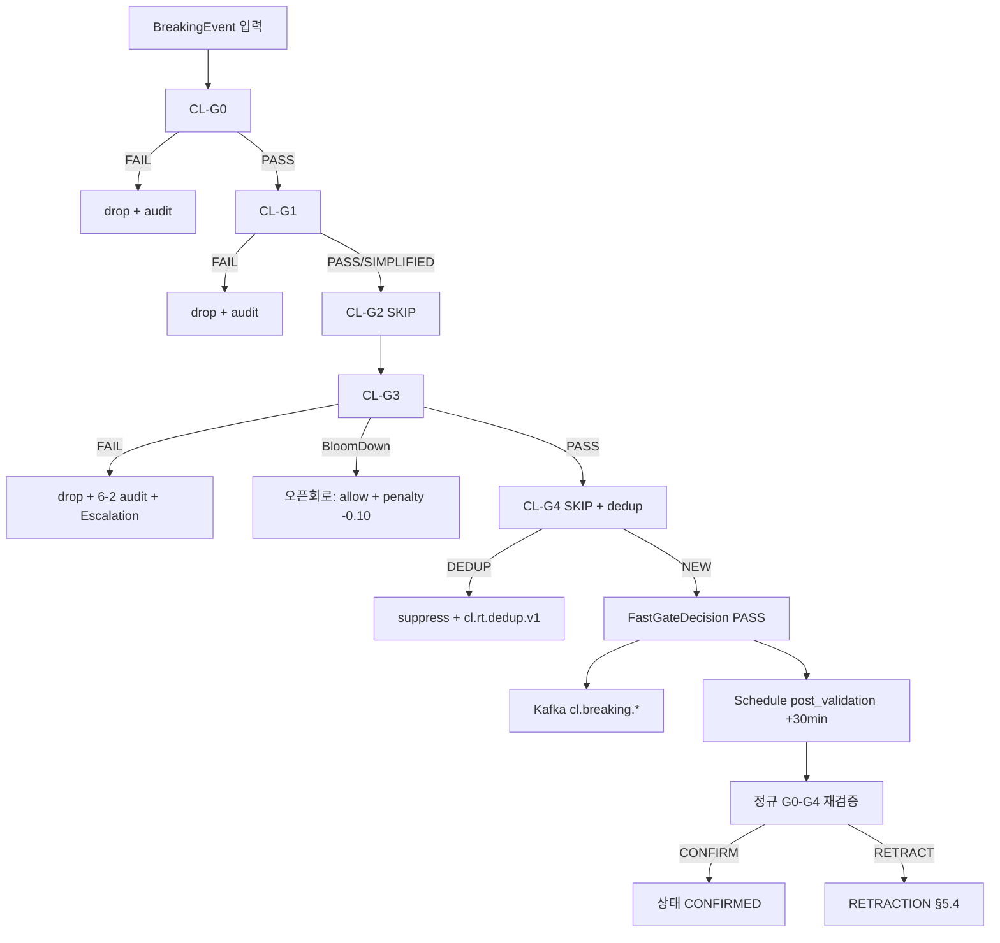

# fast_gate.md — Fast Gate CL-G0+G3 로직 + 사후 검증 + VAMOS 5-Gate 비교

> **도메인**: 6-7_RT-BNP-DCL
> **서브폴더**: 01_rt-bnp-pipeline
> **세션**: P1-2 (Phase 1)
> **정본 상위**: VAMOS_CLOUD_LIBRARY_SPEC + Part2 §6.10.1
> **해소 이슈**: ISS-2 (HIGH, Fast Gate 로직 상세), P1 (HIGH, Fast Gate ↔ VAMOS 5-Gate 혼동), R-67-1
> **LOCK 책임**: L4(Fast Gate 적용 규칙), L7(사후 검증 30분), L9(중복 억제 5분), L17(Fast Gate ↔ VAMOS 5-Gate 분리), 보조 L3/L5/L8/L10

---

## §0. Purpose / Scope

### 0.1 Purpose
RT-BNP 전용 **Fast Gate**(CL-G0 + CL-G1 간소화 + CL-G2 스킵 + CL-G3 + CL-G4 스킵, L4)의 각 게이트 판정 로직·임계값·입출력 스키마를 정본 수준으로 상세화한다. 동시에 L7(사후 검증 30분 정규 G0-G4 재검증) 절차와 L9(동일 속보 5분 윈도우 중복 억제) 구현을 명세하고, R-67-1(Fast Gate ≠ VAMOS 5-Gate)을 비교표로 고정하여 P1(HIGH) 혼동 위험을 종결한다.

### 0.2 Scope
- **포함**: Fast Gate 파이프라인 구조, 각 게이트(CL-G0/G1/G2/G3/CL-G4) 판정 로직·임계값·I/O 스키마, 사후 검증 30분 프로토콜(L7) + RETRACTION 연동(L8/L18), L9 5분 중복 억제 윈도우 알고리즘, L10 동시 연결 제약 ↔ Fast Gate 처리량 관계, R-67-1 비교표, 예외 처리 및 Phase 2 테스트 시나리오.
- **제외(타 세션)**: Breaking Detector 내부 알고리즘(P1-1 breaking_detector.md 정본), 소스 어댑터 구현(P1-3 source_adapters.md), Kafka 토픽 구조 및 EventBus 전파(P1-4 event_propagation.md), 정규 G0-G4 Gate 구현 상세(6-8 Cloud-Library 정본).
- **정본 경계**: Fast Gate의 *적용 규칙 판정 로직* = 본 문서. *G0-G4 Gate 로직 구현 자체* = 6-8 Cloud-Library(AUTHORITY_CHAIN §4.3).

### 0.3 버전별 범위
| 버전 | Fast Gate 범위 |
|------|---------------|
| V1 | CL-G0 + CL-G3 만 활성, CL-G4 in-proc 5분 dedupe, 사후 검증 수동 호출 |
| V2 | + CL-G1 간소화(T1/T2 화이트리스트 자동통과), CL-G4 Redis 5분 윈도우, 사후 검증 자동 배치(30분 cron) |
| V3 | + 비동기 병렬 CL-G0/G3, L10 30 동시 연결 대응 처리량 스케일링, 사후 검증 스트리밍(분산 워커) |

---

## §1. 교차 참조 블록

| 참조 대상 | 파일/섹션 | 참조 목적 |
|-----------|-----------|-----------|
| AUTHORITY_CHAIN.md | §3.1 L3/L4/L5, §3.2 L6~L10, §3.4 L17/L18 | LOCK 원본 대조 |
| 01_rt-bnp-pipeline/_index.md | §Fast Gate, §LOCK 매핑 표, ISS-2 | 상위 요약·배정 대조 |
| RT_BNP_DCL_구조화_종합계획서.md | §3 LOCK 전수, §6 ISS-2/P1, §7.2 P1-2, §A.3 비교표 | 작업 지시 및 비교표 힌트 |
| Part2 §6.10.1 | Fast Gate 적용 규칙, 사후 검증, LOCK #14~18 원본 | When/Where 정본 |
| CLOUD_LIBRARY_SPEC (관련 인프라) | VAMOS 5-Gate(Policy/Approval/Cost/Evidence/SelfCheck) 원본 정의, G0-G4 Gate 인프라 | R-67-1 비교표 교차 검증 |
| P1-1 breaking_detector.md | §2.2 `BreakingEvent`, §2.3 `RetractionEvent`, §3 `BaseDetectorComponent` | 입력 스키마 정본(read-only) |
| P1-3 source_adapters.md | `RawNewsItem.source_weight` (L5) | CL-G0 사전 필터 입력 |
| P1-4 event_propagation.md | Kafka `cl.breaking.*`, `cl.rt.retraction.v1` | 게이트 통과 이벤트 다운스트림 |
| 6-8 Cloud-Library 02_service-mesh | G0-G4 Gate 구현 정본, BaseGate(ABC) | L17 ABC 공유점 |
| 6-13 Operations §6.12.10 | RT-BNP 장애 대응 | 사후 검증 실패 에스컬레이션 경로 |
| 6-12 Event-Logging | `cl.rt.gate.*` EventTypeRegistry | 게이트 감사 로그 |

---

## §2. Fast Gate vs. VAMOS 5-Gate 비교표 (R-67-1, ISS-2 해소)

> 본 §2는 **R-67-1 규칙의 정본 위치**이다. 타 문서는 본 표를 인용한다. LOCK L17(Fast Gate ↔ VAMOS 5-Gate 분리, BaseGate(ABC) 인터페이스만 공유)의 운용 근거.

| 항목 | **Fast Gate (CL-G0~CL-G4)** | **VAMOS 5-Gate** |
|------|-----------------------------|-------------------|
| 공식 명칭 | Cloud Library Fast Gate / `CL-Gx` 접두어 필수 | VAMOS 5-Gate (Policy/Approval/Cost/Evidence/SelfCheck) |
| 적용 도메인 | 6-7 RT-BNP (속보) + 6-8 Cloud Library (공통 인프라) | VAMOS Core (사용자 요청 → 에이전트 응답 파이프라인) |
| 게이트 수 | 5개 (G0 Format / G1 Content Quality / G2 Consistency / G3 Security / G4 Final) | 5개 (Policy / Approval / Cost / Evidence / SelfCheck) |
| RT-BNP 적용 | **CL-G0 적용 + CL-G1 간소화 + CL-G2 스킵 + CL-G3 적용 + CL-G4 스킵**(L4) | **미적용** (RT-BNP 흐름에 포함되지 않음) |
| 판정 기준 | URL/스키마 유효성(G0), 소스 화이트리스트·신뢰도(G1), 본문 일관성(G2, RT-BNP는 스킵), 악성 URL·허위정보·PII(G3), 중복·최종(G4) | 정책 준수(Policy), 사용자/자동 승인(Approval), 비용 임계(Cost), 근거 충족(Evidence), 자체 점검(SelfCheck) |
| 속도 요구 | P0 ≤ 30초 내 통과(L6) — 5단계 합산 ≤ 300ms 예산 | 일반 요청 수초~수십초 (P2 사용자 승인 포함) |
| 인터페이스 공유 | `BaseGate(ABC).check(context) → GateResult` — **이 ABC 시그니처만 공유 (L17)** | 동일 `BaseGate(ABC)` 구현 |
| 상호 관계 | Fast Gate 통과 → VAMOS EventBus 전파 → 소비 시 VAMOS 5-Gate가 별개로 적용 가능(예: AI Investing 자동 매매 Approval) | Fast Gate를 호출하지 않으며, Fast Gate 통과 이벤트를 신뢰 입력으로 수용 |
| 혼동 방지 규칙 | 코드/문서에서 반드시 `Fast Gate` 또는 `CL-Gx` 접두어 명시 사용 (R-67-1) | 반드시 `VAMOS 5-Gate` 또는 `Policy/Approval/Cost/Evidence/SelfCheck` 명칭 사용 |
| 정본 위치 | 규칙 L4: Part2 §6.10.1 / 구현 정본: 6-8 Cloud-Library | VAMOS_CLOUD_LIBRARY_SPEC §VAMOS 5-Gate |
| 사후 검증 | 30분 내 정규 G0-G4 재검증(L7), 실패 시 RETRACTION(L8/L18) | 해당 없음 (동기 판정) |

**해소 근거**
- **ISS-2(HIGH)**: 본 §2 비교표 + §3 게이트별 로직 상세 + §4 사후 검증 프로토콜로 종결.
- **P1(HIGH)**: R-67-1 규칙 명시 + 명칭/접두어 강제 + 인터페이스 공유 경계(BaseGate ABC 한정)로 혼동 위험 차단.

---

## §3. 공통 자료 구조 (정본 선정의)

> 본 §3의 자료 구조는 Fast Gate 관련 세션 공통. P1-1 `BreakingEvent`/`RetractionEvent`와 명시적으로 분리된 게이트 I/O 전용 스키마이며, 본 파일이 **정본**이다(규칙 (k)).

### 3.1 `FastGateInput`
```jsonc
{
  "gate_invocation_id": "ULID",            // Fast Gate 호출 식별자 (G0~G4 통합 트레이스)
  "breaking_event": { /* P1-1 §2.2 BreakingEvent 전체 (정본, read-only) */ },
  "raw_item": { /* P1-1 §2.1 RawNewsItem 전체 — BreakingEvent.item_id 참조 원본 */ },
  "policy_version": "fastgate/v1.3.0",     // 규칙 테이블 버전(감사 필수)
  "tenant": "default",
  "invoked_at": "2026-04-14T09:12:04.100Z",
  "sla_deadline": "2026-04-14T09:12:33.812Z", // BreakingEvent.sla_deadline 상속(L6)
  "trace_id": "tr_01HY..."
}
```

> **필드 소스 경계**: `event_id, grade, grade_confidence, source_weight, fingerprint, velocity.topic_key, impact.score, nlp.label, sla_deadline, trace_id, created_at` 는 `breaking_event`(P1-1 §2.2)에서, `url, title, body, tier, source_id, entities` 는 `raw_item`(P1-1 §2.1)에서 조회한다. 본 문서 의사코드의 `ev.url/title/body/tier/source_id` 표기는 조회 단축 표현이며 실제 구현은 `raw_item.*` 접근이다.

### 3.2 `GateStepResult` (단일 게이트 판정)
```jsonc
{
  "gate": "CL-G0|CL-G1|CL-G2|CL-G3|CL-G4",
  "decision": "PASS|FAIL|SKIP|SIMPLIFIED_PASS",
  "reason_code": "...",                    // §3.5 enumerated
  "score": 0.93,                            // [0,1] 가용 시
  "evaluated_at": "ISO-8601",
  "latency_ms": 37,
  "evidence": { /* gate-specific */ }
}
```

### 3.3 `FastGateDecision` (최종 결정, 다운스트림 입력)
```jsonc
{
  "gate_invocation_id": "ULID",
  "event_id": "ULID",                      // BreakingEvent.event_id 복제
  "overall": "PASS|FAIL",                  // 하나라도 FAIL → FAIL
  "steps": [ /* GateStepResult[] 순서대로 */ ],
  "dedup_key": "topic_key:fingerprint",    // L9 키(§3.6)
  "duplicate_of": null,                     // L9 억제 시 원본 event_id
  "post_validation": {
    "required": true,
    "scheduled_at": "2026-04-14T09:42:03.812Z", // created_at + 30min (L7)
    "status": "PENDING"
  },
  "policy_version": "fastgate/v1.3.0",
  "trace_id": "tr_01HY..."
}
```

### 3.4 `PostValidationResult`
```jsonc
{
  "event_id": "ULID",
  "triggered_at": "ISO-8601",
  "regular_gates": [ /* GateStepResult[], gate ∈ {G0,G1,G2,G3,G4} 전체 */ ],
  "overall": "CONFIRM|RETRACT",
  "retraction_trigger": "T-R1 | null",     // L18 연동(P1-1 §8.1)
  "latency_from_invocation_ms": 1800042,
  "trace_id": "tr_01HY..."
}
```

### 3.5 Reason Code enumeration
| code | gate | 의미 |
|------|------|------|
| G0_URL_INVALID | CL-G0 | URL 스킴/호스트 부적합 |
| G0_SCHEMA_FAIL | CL-G0 | BreakingEvent 필수 필드 결측 |
| G0_SOURCE_WEIGHT_LOW | CL-G0 | source_weight < 0.4 (L5) |
| G1_WHITELIST_PASS | CL-G1 | T1/T2 화이트리스트 자동통과(간소화) |
| G1_CONTENT_SUSPECT | CL-G1 | 제목/본문 의심 신호 |
| G2_SKIPPED | CL-G2 | RT-BNP 스킵 규칙(L4) |
| G3_MALICIOUS_URL | CL-G3 | 악성 도메인 차단 |
| G3_PII_DETECTED | CL-G3 | 민감정보 노출 |
| G3_FALSE_SIGNAL | CL-G3 | 허위정보 시그니처 일치 |
| G4_SKIPPED | CL-G4 | 스킵(사후 검증 위임) |
| G4_DEDUP_SUPPRESSED | CL-G4 | L9 중복 억제(참고 기록) |
| POST_FAIL_ANY | post | 사후 재검증 실패 → RETRACTION |

### 3.6 Dedup Key 산출
```python
def dedup_key(ev: BreakingEvent) -> str:
    # topic_key (P1-1 §5.2) + fingerprint prefix 로 L9 5분 윈도우 병합 키 생성.
    # ※ 본 키는 Fast Gate '발행 억제' 전용 — EventBus 브릿지 '소비 측 재확인' 키
    #   (event_propagation.md §3.3 DK-1: sha256(topic_key|grade|floor(ts/300)))와 의도적으로 다른 독립 2단 dedup (§3.3 규칙 2 정본).
    return f"{ev.velocity.topic_key}|{ev.fingerprint[:16]}"
```

---

## §4. Fast Gate 파이프라인 및 게이트 판정 로직 상세

### 4.0 파이프라인 구조 (L4 준수)
```
BreakingEvent (P1-1) ──▶ [CL-G0 Format]
                              │ PASS
                              ▼
                        [CL-G1 Content Quality (간소화)]
                              │ PASS / SIMPLIFIED_PASS
                              ▼
                        [CL-G2 Consistency] ── SKIP (기록만)
                              ▼
                        [CL-G3 Security]
                              │ PASS
                              ▼
                        [CL-G4 Final] ── SKIP + L9 dedupe 병렬
                              ▼
                    FastGateDecision(overall=PASS)
                              │
                              ▼   (동시) post_validation 스케줄 (L7 + 30min)
                     Kafka cl.breaking.* 발행 (P1-4)
```

> 전 구간 ABC: 각 게이트는 6-8 `BaseGate(ABC).check(ctx)→GateResult`를 구현한 클래스로, **VAMOS 5-Gate와 동일 ABC만 공유**하고 로직은 분리된다 (L17).

### 4.1 CL-G0 — Format + 소스 신뢰도 사전 필터 (적용, L4/L5)

| 항목 | 규칙 |
|------|------|
| 검증 항목 | (a) BreakingEvent 스키마(필수 필드) (b) URL 유효성(scheme∈{http,https}, host not empty, TLD 실존) (c) `source_weight ≥ 0.4` (L5 SNS 하한) |
| 실패 처리 | `decision=FAIL`, reason=`G0_URL_INVALID`/`G0_SCHEMA_FAIL`/`G0_SOURCE_WEIGHT_LOW` → 즉시 drop + CRITICAL 로그, Kafka 미발행 |
| SLA 예산 | ≤ 20ms |
| 판정 의사코드 |
```python
def cl_g0(inp: FastGateInput) -> GateStepResult:
    ev, raw = inp.breaking_event, inp.raw_item
    if not _valid_schema(ev): return fail("G0_SCHEMA_FAIL")
    if not _valid_url(raw.url): return fail("G0_URL_INVALID")   # raw_item 정본
    if ev.source_weight < 0.4: return fail("G0_SOURCE_WEIGHT_LOW")
    return pass_("CL-G0", score=min(1.0, ev.source_weight))
```

**L5 소스 가중치 연계 표** (AUTHORITY_CHAIN §3.1 L5)
| 소스 유형 | source_weight | CL-G0 처리 |
|----------|---------------|-----------|
| 공식 발표 | 1.00 | 무조건 PASS |
| 통신사/금융 | 0.95 | PASS |
| 주요 언론 | 0.75 | PASS |
| SNS | 0.40 | 경계값, `evidence.sns_cross_check_required=true` 태깅 |
| SNS 단일 | < 0.40 | **FAIL (G0_SOURCE_WEIGHT_LOW)** — R-67-3/§7.2 교차 |

### 4.2 CL-G1 — Content Quality (간소화, L4)

| 항목 | 규칙 |
|------|------|
| 간소화 규칙 | T1/T2 소스 화이트리스트(P1-3 source_adapters 관리) → 자동 `SIMPLIFIED_PASS`. T3/T4 및 화이트리스트 외 소스는 축약 품질 체크 수행 |
| 축약 체크 | (a) 제목 비어있지 않음, 10자 이상 2000자 이하 (b) 본문 ≥ 50자 (c) 의심 패턴 (전부 대문자, >30% 특수문자) 차단 (d) P1-1 keyword_match 존재 OR nlp.label=BREAKING OR impact.score ≥ 30 중 하나 이상 |
| 실패 처리 | `FAIL reason=G1_CONTENT_SUSPECT` → drop |
| SLA 예산 | ≤ 50ms (정규식 컴파일 캐시) |
| 판정 의사코드 |
```python
def cl_g1(inp) -> GateStepResult:
    ev, raw = inp.breaking_event, inp.raw_item
    if raw.tier in {"T1","T2"} and raw.source_id in WHITELIST:
        return simplified_pass("G1_WHITELIST_PASS")
    if not _title_ok(raw.title) or not _body_ok(raw.body): return fail("G1_CONTENT_SUSPECT")
    if not (ev.keyword_match.matched_terms or ev.nlp.label=="BREAKING" or ev.impact.score>=30):
        return fail("G1_CONTENT_SUSPECT")
    return pass_("CL-G1", score=_quality_score(ev, raw))
```

**P1-1 연동 (L3 Breaking Detector 결과 소비)**
- `ev.grade` ∈ {`BREAKING-P0`, `BREAKING-P1`, `BREAKING-P2`} (P1-1 §2.2 정본 명칭)에서 본 게이트 수행. `NORMAL`은 애초 Fast Gate 진입 금지(P1-1 §4.4).
- `ev.grade_confidence < 0.30` 시 `FAIL`(품질 하한).

### 4.3 CL-G2 — Consistency (스킵, L4)

| 항목 | 규칙 |
|------|------|
| 처리 | **항상 `SKIP` (L4: Fast Gate에서는 스킵)** — 본문 일관성은 속도 우선이 아닌 사후 검증(L7)에서 정규 G2로 수행 |
| 기록 | `GateStepResult{gate:"CL-G2", decision:"SKIP", reason:"G2_SKIPPED"}` — 감사 로그 필수 |
| SLA 예산 | ≤ 1ms (분기만) |
| 근거 | Part2 §6.10.1: "속보는 키워드 매칭이 아닌 Impact 기준" |

### 4.4 CL-G3 — Security (적용, L4)

| 항목 | 규칙 |
|------|------|
| 검증 항목 | (a) 악성 URL DB(6-2 Security-Governance 연동 블랙리스트) 조회 (b) 본문 XSS/스크립트 인젝션 패턴 차단 (c) PII 탐지(주민번호, 계좌번호, 이메일) — 노출 시 마스킹 또는 FAIL (d) 허위정보 시그니처 DB 조회(과거 RETRACTION된 fingerprint 프리픽스 해시 매칭) |
| 실패 처리 | `FAIL reason=G3_MALICIOUS_URL`/`G3_PII_DETECTED`/`G3_FALSE_SIGNAL` → drop + ERROR 로그 + 6-2 audit |
| SLA 예산 | ≤ 100ms (블랙리스트 Redis bloom filter) |
| 판정 의사코드 |
```python
def cl_g3(inp) -> GateStepResult:
    ev, raw = inp.breaking_event, inp.raw_item
    if bloom_malicious(raw.url):           return fail("G3_MALICIOUS_URL")
    if xss_pattern(raw.title + raw.body):  return fail("G3_MALICIOUS_URL")
    pii = detect_pii(raw.body)
    if pii and not AUTO_MASK:              return fail("G3_PII_DETECTED")
    if false_sig_hit(ev.fingerprint):      return fail("G3_FALSE_SIGNAL")
    return pass_("CL-G3")
```

> **DCL 연계 (L16)**: DCL 3채널도 CL-G3 필수 적용(AUTHORITY_CHAIN §3.3 L16). 본 게이트의 구현은 6-8 정본이며 RT-BNP/DCL 공용.

### 4.5 CL-G4 — Final (스킵 + L9 5분 중복 억제 병렬, L4/L9)

| 항목 | 규칙 |
|------|------|
| Final 판정 | **`SKIP` (L4: 속도 우선, 사후 검증으로 대체)** |
| 중복 억제 | L9: 동일 `dedup_key`(§3.6)가 **5분 윈도우 내 존재 시 `G4_DEDUP_SUPPRESSED`** (FastGateDecision.duplicate_of = 원본 event_id). 억제된 이벤트는 Kafka 미발행하되, 감사 로그와 `cl.rt.dedup.v1` 내부 토픽에 기록(P1-4 책임 범위) |
| 윈도우 구현 | Redis Sorted Set `dedup:<topic_key>` (score=epoch_ms). 삽입 전 `ZRANGEBYSCORE now-300s now` 조회. V1: in-proc LRU(정원 10k) |
| SLA 예산 | ≤ 30ms (Redis O(log N)) |
| 판정 의사코드 |
```python
def cl_g4_dedupe(inp, decision_so_far) -> GateStepResult:
    key = dedup_key(inp.breaking_event)
    now = epoch_ms()
    prior = redis.zrangebyscore(f"dedup:{key}", now-300_000, now, limit=1)
    if prior:
        return GateStepResult("CL-G4","SKIP","G4_DEDUP_SUPPRESSED",
                              evidence={"duplicate_of": prior[0]})
    redis.zadd(f"dedup:{key}", {inp.breaking_event.event_id: now})
    redis.zremrangebyscore(f"dedup:{key}", 0, now-300_000)   # 윈도우 정리
    return GateStepResult("CL-G4","SKIP","G4_SKIPPED")
```

**L9 윈도우 정책**
- 윈도우 폭: **정확히 5분(300초)** — 단일 값, 버전 불문(L9 정본).
- 기준: `topic_key`(P1-1 §5.2 velocity 집계와 동일 키) + fingerprint 16자 프리픽스.
- 억제 결정은 **downgrade가 아닌 suppression** — BreakingEvent 자체는 저장(감사), Kafka `cl.breaking.*` 발행만 생략.
- RETRACTION 발생 시 `scope=TOPIC_WINDOW_5M` 은 본 윈도우와 동일 범위(P1-1 §8.2). 5분 윈도우 보조키 동기화.

### 4.6 게이트별 Big-O 및 SLA 합산
| 게이트 | 핵심 연산 | Big-O | p95 예산 |
|--------|-----------|-------|----------|
| CL-G0 | 스키마/URL | O(1) | 20ms |
| CL-G1 | 화이트리스트 해시 + 정규식 | O(L) (L=본문 길이) | 50ms |
| CL-G2 | 분기 | O(1) | 1ms |
| CL-G3 | Bloom 조회 + PII regex + 서명 해시 | O(L) + O(1) | 100ms |
| CL-G4 | Redis ZRANGEBYSCORE | O(log N) | 30ms |
| 오버헤드 | trace/로그/직렬화 | O(1) | 99ms |
| **합계 p95** | — | — | **≤ 300ms** (P1-1 §5.4 예산과 정렬) |

---

## §5. 사후 검증 (Post-Validation) 절차 (L7, L8, L18)

### 5.1 목적
Fast Gate는 속도 우선으로 G2/G4를 생략했으므로, **30분 이내** 정규 G0-G4 Gate 전체로 재검증하여 허위/품질저하 이벤트를 RETRACTION으로 무효화한다 (L7 + L18).

### 5.2 트리거 조건
| 트리거 | 조건 | 스케줄 |
|--------|------|--------|
| PV-T1: 예약 검증 | FastGateDecision.overall=PASS 모든 이벤트 | `scheduled_at = created_at + 30min` (L7 상한) |
| PV-T2: 조기 검증 | `grade=BREAKING-P0` 이고 `grade_confidence < 0.70` | 10분 내 수행 |
| PV-T3: 수동 요청 | Ops 콘솔 `revalidate(event_id)` | 즉시 |
| PV-T4: 다운스트림 신호 | AI Investing/UI 이상 신호 → 재검증 요청 | 즉시 |

> **L7 정본**: 상한 30분 고정. PV-T2/T3/T4는 상한보다 **빠른** 재검증이며 L7 위반이 아니다.

### 5.3 검증 항목
정규 G0-G4를 **전체 실행**한다 (6-8 Cloud-Library 정본 구현 호출).
| Gate | 사후 재검증 범위 |
|------|------------------|
| G0 Format | URL 재조회(현재 접근 가능성 포함), 스키마 전체 |
| G1 Content Quality | **전체 품질 검사(간소화 해제)** — 화이트리스트 우회 없음 |
| G2 Consistency | **Fast Gate에서 스킵했던 본문 일관성·상호 인용 검증 전체 수행** |
| G3 Security | 악성 URL DB 재조회(최신 블랙리스트), PII 재검사 |
| G4 Final | 정규 최종 판정(중복이 아닌 실제 Final Gate) |

### 5.4 실패 시 RETRACTION 연동 (L8, L18, P1-1 §8)
```
PostValidationResult.overall = RETRACT
  ↓
RetractionEvent (P1-1 §2.3) 발행
  ├ retraction_of = event_id
  ├ reason_code = "POST_VALIDATION_FAIL"
  ├ scope = SINGLE (기본; 동일 topic_key 5분 내 다수면 TOPIC_WINDOW_5M)
  └ affected_consumers = [ai_investing, ui_alert, rag_insert, event_log]
  ↓
Kafka cl.rt.retraction.v1 발행 (P1-4) — 60초 내(L6 준수)
  ↓
소비자 on_retraction 훅 (P1-1 §8.3)
```

### 5.5 사후 검증 스케줄러 아키텍처
| 버전 | 구현 |
|------|------|
| V1 | APScheduler in-proc, persistence=SQLite, 재시작 내성(미처리 큐 복구) |
| V2 | Celery beat + Redis broker, 30분 cron-like + priority queue(P0 conf<0.7 → 10분) |
| V3 | Temporal.io Workflow(확정성·재시도·감사) |

### 5.6 SLA 및 실패 모드
| 항목 | 값 |
|------|-----|
| L7 상한 | 30분 (엄격) |
| 스케줄러 지연 허용 | ≤ 60초 (scheduler clock drift) |
| 스케줄 누락 탐지 | `scheduled_at + 120s` 경과하도록 실행 안되면 CRITICAL 알람 → 6-13 |
| 연속 재검증 실패율 > 5% / 1h | CRITICAL → 6-13 Operations 에스컬레이션 |

### 5.7 확정(Confirm) 경로
`PostValidationResult.overall=CONFIRM` 시 별도 발행 없이 `FastGateDecision.post_validation.status = CONFIRMED` 갱신. 감사 로그 보존 기간 ≥ 90일.

---

## §6. L10 동시 연결 ↔ Fast Gate 처리량 관계

### 6.1 L10 제약
AUTHORITY_CHAIN §3.2 L10: V2=10, V3=30 RT 소스 **최대 동시 연결**. 본 제약은 P1-3 소스 어댑터의 수집 병렬도를 직접 제한한다.

### 6.2 처리량 산출
P1-1 §5.4 예산·§4.6 Fast Gate 예산 기준 단일 이벤트 처리 시간(p95): `Detector ≤ 2,250ms + Fast Gate ≤ 300ms = ~2.6s`. 단, Fast Gate는 이벤트 단위 독립이므로 비동기 병렬화 가능.

| 항목 | V1 | V2 | V3 |
|------|----|----|----|
| L10 동시 연결 | 1(RSS) | 10 | 30 |
| Tier 구성 | T3 | T2+T3+T4 | T1~T4 |
| 분당 Raw 유입 상한(추정) | 60 | 200 | 1,800 |
| Fast Gate 워커 권장 | 2 | 8 | 32 |
| Fast Gate 처리량(p95) | ~30 eps | ~120 eps | ~480 eps |
| 병목 지점 | CL-G3 Bloom Redis | CL-G4 ZRANGEBYSCORE | CL-G3 + CL-G4 (Redis I/O) |
| L6 30s 준수 여유 | 매우 충분 | 충분 | 충분(워커 스케일 필수) |

### 6.3 역압 및 백오프 규칙
- Fast Gate 큐 depth > 5×워커 수 → 상류 수집 어댑터에 **soft backpressure** 신호(P1-3 L10 상한은 불변).
- 큐 depth > 10×워커 수 → CL-G0 수준에서 `source_weight < 0.5` 이벤트 **일시 drop**(감사 로그 유지) + CRITICAL 알람.
- **L10 상한 자체는 축소하지 않는다** — P1-3 어댑터 쪽에서 유지하며 Fast Gate는 워커 확장으로만 대응(L17 경계 유지: 데이터 흐름 규칙 ≠ 인프라 용량 결정).

### 6.4 Big-O
- 이벤트 N건, 워커 W개 처리: `O(N · (G0+G1+G3+G4) / W) = O(N/W)` (분당 상한 이내).

---

## §7. LOCK 교차검증 표 (L4/L7/L9/L17 전수 + 보조)

| LOCK | 정본 규칙 | 본 문서 반영 | 섹션 | 판정 |
|------|-----------|--------------|------|------|
| **L4** | CL-G0 적용 + CL-G1 간소화 + CL-G2 스킵 + CL-G3 적용 + CL-G4 스킵 | §2 비교표, §4.0 파이프라인, §4.1~4.5 게이트별 상세 | PASS |
| **L7** | 사후 검증 시한 30분 (정규 G0-G4 재검증) | §3.3 post_validation.scheduled_at, §5.2 트리거, §5.3 검증 항목, §5.6 SLA | PASS |
| **L9** | 동일 속보 중복 억제 5분 윈도우 | §3.6 dedup_key, §4.5 CL-G4 Redis ZRANGEBYSCORE 300s | PASS |
| **L17** | Fast Gate ↔ VAMOS 5-Gate 분리, BaseGate(ABC)만 공유 | §2 비교표, §4.0 ABC 주석, §6.3 경계 | PASS |
| L3 (보조) | BREAKING-P0/P1/P2/NORMAL 4등급 | §4.2 `ev.grade`∈{P0,P1,P2} 진입 조건, NORMAL 진입 금지 | PASS |
| L5 (보조) | 공식=1.0/통신사·금융=0.95/언론=0.75/SNS=0.4 | §4.1 G0 사전 필터 표 | PASS |
| L6 (보조) | 30초 최대 전파 지연 | §3.1 sla_deadline 상속, §4.6 p95 ≤ 300ms | PASS |
| L8 (보조) | 허위 속보 RETRACTION 즉시 발행 | §5.4 RETRACTION 연동, P1-1 §2.3 참조 | PASS(참조) |
| L10 (보조) | V2:10, V3:30 동시 연결 | §6 처리량 관계 | PASS |
| L18 (보조) | 사후 검증 실패 시 RETRACTION | §5.4 | PASS |
| L16 (DCL 참고) | CL-G3 DCL 필수 적용 | §4.4 DCL 연계 주석 | PASS(참조) |

**LOCK 변경 필요 사항**: **없음**.

---

## §8. EscalationPayload (I-20) 및 구조화 로깅

### 8.1 EscalationPayload (I-20) — Fast Gate 실패/이상
```jsonc
{
  "source_engine": "fast_gate.cl_g3",           // 발화 게이트
  "error_code": "G3_MALICIOUS_URL",
  "original_request": {
    "event_id": "01HY...",
    "item_id": "01HY...",
    "tier": "T4",
    "source_id": "twitter_finance_bot"
  },
  "partial_result": {
    "steps": [
      {"gate":"CL-G0","decision":"PASS"},
      {"gate":"CL-G1","decision":"SIMPLIFIED_PASS"},
      {"gate":"CL-G2","decision":"SKIP"},
      {"gate":"CL-G3","decision":"FAIL","reason_code":"G3_MALICIOUS_URL"}
    ],
    "decided_overall": "FAIL"
  },
  "retry_count": 0,
  "timestamp": "2026-04-14T09:12:05.310Z",
  "trace_id": "tr_01HY...",
  "severity": "ERROR",                  // INFO|WARN|ERROR|CRITICAL
  "recovery_hint": "drop_and_audit_to_6-2"
}
```

### 8.2 구조화 로깅 JSON (중첩)
```jsonc
{
  "ts": "2026-04-14T09:12:05.311Z",
  "level": "ERROR",
  "component": "fast_gate.cl_g3",
  "trace_id": "tr_01HYAB3...",
  "span_id": "sp_01HYAB7...",
  "error": {
    "code": "G3_MALICIOUS_URL",
    "message": "URL matched known-bad bloom filter",
    "stack": null
  },
  "context": {
    "event_id": "01HY...",
    "gate_invocation_id": "01HY...",
    "tier": "T4",
    "source_id": "twitter_finance_bot",
    "source_weight": 0.4,
    "policy_version": "fastgate/v1.3.0",
    "dedup_key": "war_conflict:RU+UA|9af1c0c2d3e4f5a6"
  },
  "recovery": {
    "action": "drop_and_audit",
    "audit_target": "6-2.security_log",
    "circuit_breaker": "closed"
  },
  "sla": { "deadline_ms_remaining": 28690, "lock_ref": "L6" }
}
```

### 8.3 감사 필수 이벤트
| 이벤트 | 이유 |
|--------|------|
| 모든 FAIL 결정 | 감사·보안 추적 |
| G4_DEDUP_SUPPRESSED | L9 정합성 증명 |
| post_validation=RETRACT | L8/L18 |
| 사후 검증 미수행(scheduled_at+120s 경과) | SLA 위반 감사 |

---

## §9. Phase별 복구 흐름 + Confidence Penalty

### 9.1 복구 흐름 (Mermaid)


### 9.2 Confidence Penalty 표
| 복구 경로 | penalty (grade_confidence) | 비고 |
|-----------|----------------------------|------|
| CL-G3 Bloom 다운 → 오픈회로 허용 | -0.10 | 위험 허용 대신 사후 검증 우선 수행 |
| CL-G4 Redis 다운 → in-proc LRU fallback | -0.05 | 중복 억제 정확도 저하 감안 |
| CL-G1 규칙 YAML 로드 실패 → 캐시 사용 | -0.05 | 최근 양호 캐시 사용 |
| 사후 검증 스케줄 지연(>30min+60s) | -0.15 (logical) | CONFIRM 시에도 신뢰도 저하 마킹 |
| 다중 복구 동시 발생 | 합산(하한 0.30) | 0.30 미만이면 post_validation을 PV-T2 10분으로 조기 수행 |

---

## §10. 예외 처리 정책 표 (규칙 (g))

| 예외 코드 | 원인 | 처리 | 복잡도 | 에스컬레이션 |
|-----------|------|------|--------|--------------|
| G0_URL_INVALID | URL 파싱/스킴 | drop + audit | O(1) | INFO |
| G0_SCHEMA_FAIL | 필수 필드 결측 | drop + quarantine | O(1) | ERROR |
| G0_SOURCE_WEIGHT_LOW | L5 하한 미달(SNS 단일) | drop | O(1) | INFO |
| G1_CONTENT_SUSPECT | 제목/본문 품질 미달 | drop | O(L) | WARN |
| G3_MALICIOUS_URL | Bloom filter hit | drop + 6-2 security audit | O(1) | ERROR |
| G3_PII_DETECTED | PII 정규식 | mask or drop | O(L) | WARN |
| G3_FALSE_SIGNAL | 허위 시그니처 | drop + RETRACTION DB 강화 | O(1) | ERROR |
| G3_BLOOM_UNAVAILABLE | Redis 다운 | **fail-closed: quarantine(격리) + reject** (CL-G3 필수 적용 LOCK L16 — open-circuit 허용 금지), CRITICAL audit 이벤트 발행, 복구 후 PV-T2 hard-bind 재검증 | O(1) | CRITICAL → 6-13 |
| G4_DEDUP_REDIS_DOWN | Redis 다운 | in-proc LRU fallback | O(1) | WARN |
| POST_SCHEDULER_DOWN | APScheduler/Celery down | 백업 스케줄러(second cron)로 이관, 이벤트 누락 시 CRITICAL | O(N) | CRITICAL → 6-13 |
| POST_L7_BREACH | 30분+60s 경과 미실행 | 강제 즉시 실행 + SLA 위반 감사 로그 | O(1) | CRITICAL |
| POST_VALIDATION_FAIL | 정규 G0-G4 실패 | RetractionEvent 발행(§5.4) | O(C) C=소비자 | ERROR → 정상 경로 |
| SCHEMA_DECISION_FAIL | FastGateDecision 직렬화 실패 | drop + CRITICAL | O(1) | CRITICAL |

---

## §11. Phase 2 테스트 시나리오 (10건+)

| # | 시나리오 | 입력 | 기대 결과 | 검증 LOCK |
|---|----------|------|----------|-----------|
| FG-01 | 공식 통신사 P0 (Reuters T3, halt) | source_weight=0.95, grade=BREAKING-P0 | G0 PASS, G1 SIMPLIFIED, G3 PASS, G4 NEW → 전체 PASS, 총 지연 ≤ 300ms | L4, L6 |
| FG-02 | SNS 단일 T4, weight=0.3 | source_weight=0.3 | G0 FAIL (G0_SOURCE_WEIGHT_LOW) | L4, L5 |
| FG-03 | URL 스킴 비정상 | `ftp://...` | G0 FAIL (G0_URL_INVALID) | L4 |
| FG-04 | 악성 URL Bloom hit | 블랙리스트 매칭 | G3 FAIL (G3_MALICIOUS_URL), 6-2 audit | L4, L16 |
| FG-05 | PII 본문 포함 (이메일) | `test@x.com` 노출 | G3 mask or FAIL | L4 |
| FG-06 | 동일 topic_key 5분 내 2건 | 중복 | 2번째 G4_DEDUP_SUPPRESSED, duplicate_of 설정 | L9 |
| FG-07 | 동일 topic_key 5분 1초 후 | 경계값 | 새 이벤트로 G4 NEW PASS | L9 (윈도우 경계) |
| FG-08 | 사후 검증 30분 후 정규 G0-G4 통과 | PASS 이벤트 30분 후 | post_validation=CONFIRM | L7, L18 |
| FG-09 | 사후 검증 30분 후 G2 FAIL | 본문 일관성 결여 | RETRACTION 발행, SINGLE scope, 4 소비자 훅 | L7, L8, L18 |
| FG-10 | BREAKING-P0 grade_confidence=0.65 | PV-T2 조기 검증 | scheduled_at = +10min, 30분 미만 수행 | L7 |
| FG-11 | Redis dedup 다운 | VEL_REDIS_DOWN 유사 | in-proc LRU fallback, penalty -0.05, WARN | §10 |
| FG-12 | L10 한계 동시 30 (V3) | 부하 테스트 | Fast Gate 32 워커로 p95 ≤ 300ms, 누락 0 | L10 |
| FG-13 | NORMAL 이벤트 강제 투입 | grade=NORMAL | Fast Gate **거부**(P1-1 §4.4 진입 금지 위반 감지 + ERROR) | L3 |
| FG-14 | VAMOS 5-Gate 용어 혼용 감지 | 내부 로그 grep 테스트 | "5-Gate" 단독 사용 0건, 접두어 필수(R-67-1 린트) | L17, R-67-1 |
| FG-15 | 스케줄러 다운 + 30분+60s 경과 | PV 미실행 | POST_L7_BREACH CRITICAL + 강제 즉시 실행 | L7 |
| FG-16 | FastGateDecision 스키마 호환성 | P1-4 Kafka consumer 역직렬화 | 모든 필드 존재, policy_version 매칭 | §3.3 |

(총 16건 — 요구 10건 이상 충족)

---

## §12. 세션 간 인터페이스 Cross-Check

### 12.1 Upstream — P1-1 `breaking_detector.md` (입력: BreakingEvent)
- 본 Fast Gate 입력은 P1-1 §2.2 `BreakingEvent` **정본**을 read-only 소비.
- 필수 사용 필드(BreakingEvent): `event_id, item_id, grade, grade_confidence, source_weight, fingerprint, velocity.topic_key, impact.score, nlp.label, sla_deadline, trace_id, created_at`.
- 필수 사용 필드(연동 RawNewsItem, `item_id`로 조회): `url, title, body, tier, source_id, entities` — §3.1 `raw_item` 참조.
- 필드 추가/변경 필요 시 P1-1에 CONFLICT 등재 후 갱신 — 본 세션 단독 수정 금지.
- `grade=NORMAL` 이벤트는 P1-1 §4.4에 따라 Fast Gate에 진입하지 않는다. 진입 시 ERROR(§FG-13).

### 12.2 Upstream — P1-3 `source_adapters.md` (입력: RawNewsItem 가중치 L5)
- `BreakingEvent.source_weight`는 P1-3 어댑터가 부여하는 L5 가중치(공식=1.0/통신사·금융=0.95/언론=0.75/SNS=0.4)를 그대로 상속.
- 화이트리스트(T1/T2 자동통과)는 P1-3이 관리하는 `WHITELIST` 구조 참조(§4.2). 본 문서는 사용 계약만 선언.
- L10 동시 연결 상한은 P1-3 정본. Fast Gate는 백프레셔 신호(§6.3) 송신만 수행.

### 12.3 Downstream — P1-4 `event_propagation.md` (출력: Fast Gate 통과 이벤트)
- `FastGateDecision.overall=PASS` ∧ `G4_DEDUP_SUPPRESSED 아님` → P1-4가 `cl.breaking.{p0|p1|p2}.v1` 토픽 발행.
- `G4_DEDUP_SUPPRESSED` → `cl.rt.dedup.v1` 내부 토픽(감사용) 발행.
- `PostValidationResult.overall=RETRACT` → `cl.rt.retraction.v1` 발행(P1-1 §2.3 RetractionEvent 스키마 준수).
- 파티셔닝 키: `dedup_key`(§3.6) 권고(L9 윈도우와 동일 파티션 상에서 배치 dedup 효율).

### 12.4 Cross-domain
- **6-8 Cloud-Library 02_service-mesh**: 정규 G0-G4 Gate 구현 정본. 본 문서의 사후 검증(§5.3)은 6-8 구현을 호출한다. `BaseGate(ABC)` 인터페이스만 공유(L17).
- **6-2 Security-Governance**: G3 악성 URL DB/허위 시그니처 DB, G3 FAIL 감사 훅 수신처.
- **6-13 Operations**: CRITICAL 에스컬레이션(§10), 스케줄러 장애, L7 위반 알람 수신.
- **6-12 Event-Logging**: `cl.rt.gate.*` EventTypeRegistry 등록(CL-G0~CL-G4 각 결정 이벤트 + post_validation 이벤트). 코드 네이밍은 본 §3.5.
- **6-4 Memory-RAG (I-2)**: RETRACTION 시 `rag.invalidate(event_id)` 훅(P1-1 §8.3 정본).

### 12.5 의존성 그래프
```
[P1-3 source_adapters] --RawNewsItem/weight--> [P1-1 breaking_detector] --BreakingEvent--> [P1-2 fast_gate]
                                                                                                  │
                                                                                                  ├── PASS ──> [P1-4 event_propagation / Kafka]
                                                                                                  └── schedule(+30m) ──> [정규 G0-G4 @ 6-8] ──(RETRACT)──> P1-4 cl.rt.retraction.v1
```

### 12.6 통합 산출물 요건
본 문서는 `_index.md` §Fast Gate와 §LOCK 매핑 표의 **상세 확장본**이다. 루트 `INDEX.md` 및 `_index.md` 갱신은 별도 통합 세션에서 수행(본 세션 수정 금지 대상).

---

## §13. 버전 이력

| 버전 | 날짜 | 변경 | 작성 |
|------|------|------|------|
| 1.0 | 2026-04-14 | Phase 1 P1-2 초안 (§0~§12 전체) — ISS-2/P1(R-67-1) 해소, L4/L7/L9/L17 정본 반영, 사후 검증 프로토콜 + 사후 RETRACTION 연동(L8/L18), L10 처리량 관계 | SOT2 6-7 P1-2 세션 |

[GUARDS_OK] memory_skipped=YES forbidden_paths=untouched common_artifacts=untouched
[STEP1_COMPLETE] domain=6-7 session=P1-2 files_modified=1
