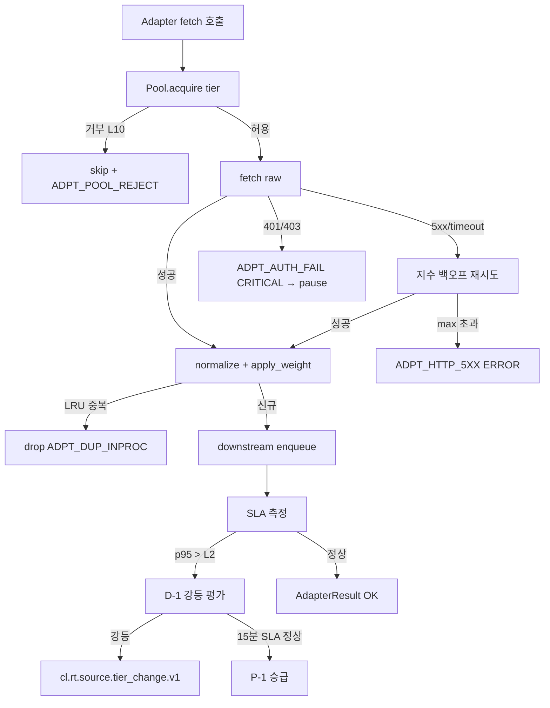

# source_adapters.md — T1~T4 소스별 수집 어댑터 구현

> **도메인**: 6-7_RT-BNP-DCL
> **서브폴더**: 01_rt-bnp-pipeline
> **세션**: P1-3 (Phase 1)
> **정본 상위**: VAMOS_CLOUD_LIBRARY_SPEC (관련 인프라) + Part2 §6.10.1
> **해소 이슈**: ISS-1 (HIGH, 4-Tier 소스 어댑터 구현 상세 미정의)
> **LOCK 책임**: L2(T1~T4 지연 Tier), L5(RT-BNP 전용 소스 가중치), L10(RT 소스 최대 동시 연결), 보조 L1/L6/L9/L17
> **DEFINED-HERE**: DH-2 (소스별 수집 어댑터 구현 상세) — AUTHORITY_CHAIN §5

---

## §0. Purpose / Scope

### 0.1 Purpose
RT-BNP 파이프라인 최상류(L1)인 **뉴스 소스 어댑터**의 구현을 정본 수준으로 상세화한다. 4-Tier(T1 WebSocket, T2 REST, T3 RSS, T4 SNS) 각각의 연결 방식·폴링/스트리밍 주기·인증·파싱·재시도·에러 핸들링을 명세하고, L5 소스 가중치의 부여 지점, L10 동시 연결 상한을 준수하는 연결 풀 설계, 지연 SLA 위반 시 Tier 강등/승급 조건을 정의한다. 본 문서는 ISS-1(HIGH)을 해소한다.

### 0.2 Scope
- **포함**: Tier 정의 테이블(L2), 버전별 활성 Tier 매핑(V1/V2/V3 §7.1), T1~T4 어댑터 구현 상세, 공통 ABC(`BaseSourceAdapter`), 연결 풀(L10), Tier 강등/승급, EscalationPayload(I-20), 구조화 로깅, 예외 처리, Phase 2 테스트 시나리오.
- **제외(타 세션)**: Breaking Detector 알고리즘(P1-1), Fast Gate 판정 로직(P1-2), Kafka/EventBus 전파(P1-4), DCL 채널 소스(Phase 2 02/).
- **정본 경계**: 수집 어댑터의 *구현 상세(연결/재시도/파싱/가중치 부여/동시성 제어)*는 본 문서가 정본(DH-2). *소스 `RawNewsItem` 스키마 정의*는 P1-1 §2.1이 정본이며 본 문서는 read-only 소비·채움 계약을 선언한다.

### 0.3 버전별 범위 (§7.1 정본 대응)
| 버전 | 활성 Tier | 수집 방식 | 비고 |
|------|----------|----------|------|
| V1 | **T3만** | RSS 60초 폴링 | in-proc 단일 프로세스, RSS 무료 |
| V2 | **T2 + T3 + T4** | REST 30초 폴링 + RSS 60초 폴링 + SNS 120초 폴링 | L10=10 |
| V3 | **T1 + T2 + T3 + T4** | WebSocket 스트리밍 + REST + RSS + SNS | L10=30 |

---

## §1. 교차 참조 블록

| 참조 대상 | 파일/섹션 | 참조 목적 |
|-----------|-----------|-----------|
| AUTHORITY_CHAIN.md | §3.1 L1/L2/L5, §3.2 L6/L9/L10, §3.4 L17 | LOCK 원본 대조 |
| 01_rt-bnp-pipeline/_index.md | §뉴스 소스 Tier 분류, §RT-BNP 전용 소스 가중치, §LOCK 매핑 표, ISS-1 | 상위 요약·배정 대조 |
| RT_BNP_DCL_구조화_종합계획서.md | §3 LOCK L2/L5/L10, §6 ISS-1, §7.1 버전별 소스 범위, §7.3 의존성 그래프 | 작업 지시 |
| Part2 §6.10.1 | Tier 정의 원문, LOCK #18(동시 연결) | When/Where 정본 |
| VAMOS_CLOUD_LIBRARY_SPEC (관련 인프라) | 크롤링 공통 LOCK #1~13, 소스 어댑터 원본 스펙 | 공통 제약 교차 검증 |
| P1-1 breaking_detector.md | §2.1 `RawNewsItem` 스키마 정본 | 출력 계약(read-only) |
| P1-2 fast_gate.md | §4.2 WHITELIST, §4.1 CL-G0 source_weight 하한 | 다운스트림 소비 계약 |
| P1-4 event_propagation.md | `cl.rt.source.*` 감사 이벤트 | 어댑터 감사 토픽 |
| 6-8 Cloud-Library | LOCK #1~13 공통 크롤링 제약 | 소스 수 상한/간격 공통 |
| 6-13 Operations §6.12.10 | RT-BNP 소스 장애 대응 | Tier 강등/복구 에스컬레이션 |
| 6-12 Event-Logging | `cl.rt.source.*` EventTypeRegistry | 소스 감사 스키마 |
| 6-2 Security-Governance | 인증 토큰 보관, 외부 API 키 Vault | API Key 처리 |

---

## §2. Tier 정의 테이블 (LOCK L2/L5/L10 정본)

### 2.1 Tier 지연 기준 (LOCK L2, AUTHORITY_CHAIN §3.1)
| Tier | 지연 목표(SLA) | 대표 소스 | 수집 방식 | 활성 버전 |
|------|---------------|----------|-----------|-----------|
| **T1** | **< 10s** | Bloomberg WS, Reuters WS, Finnhub WebSocket | WebSocket / SSE 스트리밍 | **V3** |
| **T2** | **< 60s** | NewsAPI, Alpha Vantage News, Finnhub REST | REST 30초 폴링 | **V2+** |
| **T3** | **< 300s** | Reuters RSS, AP RSS, 연합뉴스 RSS | RSS 60초 폴링 | **V1+** |
| **T4** | **< 600s** | Twitter/X API, Reddit API | 120초 폴링 (SNS) | **V2+** |

> **해석**: "지연 목표"는 **소스 공개 시점 → 어댑터가 `RawNewsItem`을 다운스트림(Breaking Detector)으로 전달**하기까지의 p95 시간이다. L6(속보 전파 30초 상한)은 이 지연에 Breaking Detector + Fast Gate + Kafka 발행 예산을 합친 end-to-end 상한이며, 본 어댑터 단계는 그 **상류 구성 요소**이다.

### 2.2 L5 소스 가중치 (AUTHORITY_CHAIN §3.1, _index.md §RT-BNP 전용 소스 가중치)
| 소스 유형 | `source_weight` | 대표 `source_id` | 부여 시점 |
|----------|----------------|-----------------|-----------|
| 공식 발표 (정부/중앙은행) | **1.00** | `gov.fed`, `gov.boj`, `gov.bok` | `normalize()` 단계 |
| 통신사 (Reuters, AP, 연합) | **0.95** | `reuters.rss`, `ap.rss`, `yonhap.rss` | 동일 |
| 금융 데이터 (Bloomberg, Finnhub) | **0.95** | `bloomberg.ws`, `finnhub.rest`, `finnhub.ws` | 동일 |
| 주요 언론 | **0.75** | `nyt.rss`, `wsj.api`, `nikkei.rest` | 동일 |
| SNS/소셜 | **0.40** | `twitter.api.v2`, `reddit.api` | 동일 (단독 시 CL-G0 경계) |

> **불변식 (L5-INV)**:
> (1) `source_weight` ∈ {1.00, 0.95, 0.75, 0.40}. 그 외 값은 CONFLICT 등재 대상.
> (2) 미분류 소스는 기본 `0.40` + `quarantine=true` 태깅 + ERROR 로그. 사람 승인 전까지 Fast Gate CL-G0에서 drop(P1-2 §4.1 `G0_SOURCE_WEIGHT_LOW`).
> (3) 동일 `source_id`는 단일 Tier·단일 `source_weight`로 고정한다. Tier 강등(§7)이 발생해도 `source_weight` 자체는 변하지 않는다(L5 불변). Tier만 재할당된다.

### 2.3 L10 동시 연결 상한 (AUTHORITY_CHAIN §3.2)
| 버전 | 상한 | 내역 (권고) |
|------|-----|-------------|
| V1 | 1 (RSS 단일) | T3: 다수 RSS feed는 단일 프로세스 스케줄러에서 순차 fetch, 물리적 *연결* 1개 유지 |
| V2 | **10** | T1:0 / T2:5 / T3:3 / T4:2 |
| V3 | **30** | T1:10 / T2:10 / T3:6 / T4:4 |

> **L10 불변식**: 실제 동시 열린 연결 수(WebSocket 세션 + REST in-flight 요청 + RSS fetch + SNS API)의 합은 버전별 상한을 **초과하지 않는다**. 연결 풀 설계(§6)가 이를 enforce 한다.

---

## §3. 공통 자료 구조 (정본 선정의)

> 본 §3의 자료 구조는 어댑터 레이어 공통이며 본 파일이 **정본**이다. `RawNewsItem` 출력 스키마는 P1-1 §2.1 정본(read-only)을 그대로 따른다.

### 3.1 `SourceConfig` (어댑터 인스턴스 구성)
```jsonc
{
  "source_id": "reuters.rss",                 // 고유 식별자 (L5 가중치 매핑 키)
  "tier": "T3",                                // T1|T2|T3|T4 (L2)
  "adapter_kind": "rss",                       // websocket|rest|rss|sns
  "endpoint": "https://feeds.reuters.com/reuters/topNews",
  "poll_interval_s": 60,                       // T2=30, T3=60, T4=120, T1=N/A(stream)
  "source_weight": 0.95,                       // L5 고정값 (§2.2)
  "auth": {
    "kind": "none|api_key|oauth2|bearer",
    "vault_ref": "vault://6-2/keys/finnhub"    // 6-2 Vault 참조
  },
  "timeout_ms": 5000,                          // 단일 요청 타임아웃
  "language": "en|ko",
  "enabled": true,
  "whitelisted_for_g1": true,                  // P1-2 §4.2 WHITELIST 연동
  "http_compliance": { "user_agent": "VAMOS-RTBNP/1.0", "respect_robots_txt": true }
}
```

### 3.2 `AdapterResult` (어댑터 호출 단위 결과)
```jsonc
{
  "source_id": "reuters.rss",
  "batch_id": "ULID",
  "items": [ /* RawNewsItem[] — P1-1 §2.1 스키마 준수 */ ],
  "items_count": 12,
  "new_items_count": 3,                        // 중복 억제 후 신규
  "fetched_at": "2026-04-14T09:12:03.514Z",
  "latency_ms": 214,                           // 연결 + 파싱 + 정규화
  "tier_sla_ms": 300000,                       // L2 T3 = 300s (상한)
  "sla_ok": true,                              // latency_ms + delivery_latency ≤ tier_sla_ms
  "errors": [],                                // AdapterError[] (§3.4)
  "trace_id": "tr_01HY...",
  "effective_tier": "T3"                       // 강등 발생 시 변경값 (§7)
}
```

### 3.3 `ConnectionPoolState`
```jsonc
{
  "version": "V3",
  "limit_total": 30,                           // L10
  "limit_per_tier": { "T1":10, "T2":10, "T3":6, "T4":4 },
  "in_use": { "T1":8, "T2":7, "T3":5, "T4":3 },
  "queued": { "T1":0, "T2":0, "T3":2, "T4":1 },
  "backpressure": false,
  "updated_at": "2026-04-14T09:12:03.514Z"
}
```

### 3.4 `AdapterError`
```jsonc
{
  "code": "ADPT_CONN_TIMEOUT",                 // §10 enumeration
  "severity": "WARN|ERROR|CRITICAL",
  "transient": true,                            // 재시도 대상
  "message": "connect timeout after 5000ms",
  "occurred_at": "ISO-8601",
  "retry_count": 2,
  "recovery_hint": "backoff_then_retry"
}
```

---

## §4. 공통 ABC (`BaseSourceAdapter`, 정본)

> 규칙 (h) ABC 정본 준수. `BaseSourceAdapter`는 RT-BNP 전용이며, L17(Fast Gate ↔ VAMOS 5-Gate 분리)과 동일한 원칙으로 도메인 ABC를 분리 유지한다.

```python
# source_adapters/base.py
from abc import ABC, abstractmethod
from dataclasses import dataclass
from typing import Optional, Iterable

@dataclass(frozen=True)
class FetchContext:
    since: Optional[str]          # 마지막 체크포인트(ISO-8601) — 증분 수집
    deadline_ms: int              # 본 호출 타임아웃(ms)
    trace_id: str

class BaseSourceAdapter(ABC):
    """4-Tier 소스 공통 추상 기반 (DH-2 정본).
    VAMOS 5-Gate BaseGate 및 P1-1 BaseDetectorComponent와 독립된 ABC (L17 원칙)."""

    config: "SourceConfig"
    tier: str                     # "T1"|"T2"|"T3"|"T4"
    kind: str                     # "websocket"|"rest"|"rss"|"sns"

    @abstractmethod
    def fetch(self, ctx: FetchContext) -> Iterable[dict]: ...
    """원본(raw) payload 이터러블 반환. WebSocket은 내부 큐에서 drain."""

    @abstractmethod
    def normalize(self, raw: dict) -> "RawNewsItem": ...
    """raw → P1-1 §2.1 RawNewsItem (title/body/url/entities/fingerprint 채움)."""

    def apply_weight(self, item: "RawNewsItem") -> "RawNewsItem":
        """L5 source_weight 부여. 기본 구현은 config.source_weight 주입.
        오버라이드 금지(L5 불변식 (3)). Tier 강등 시에도 weight 불변."""
        return item.with_source_weight(self.config.source_weight)

    @abstractmethod
    def error_handler(self, err: Exception, ctx: FetchContext) -> "AdapterError": ...

    @abstractmethod
    def health_check(self) -> dict: ...
    """return {"status":"OK|DEGRADED|DOWN","latency_ms":..,"last_ok_at":..}"""
```

**표준 호출 계약**
1. `fetch(ctx)` → raw payload들
2. `normalize(raw)` → `RawNewsItem` (P1-1 §2.1 read-only 스키마 준수, `item_id=ULID` 발번)
3. `apply_weight(item)` → `source_weight` 주입(L5)
4. Fingerprint 계산(`sha256(lang + normalized_title + normalized_body[:2000])`) → `fingerprint` 채움(L9 중복 억제 키)
5. 다운스트림(Breaking Detector) 큐 enqueue → `AdapterResult` 반환

---

## §5. Tier별 어댑터 구현 상세 (ISS-1 해소)

### 5.1 T1 — WebSocket 어댑터 (V3)

| 항목 | 규칙 |
|------|------|
| 대표 소스 | `bloomberg.ws`, `reuters.ws`, `finnhub.ws` |
| 프로토콜 | WebSocket(WSS), RFC 6455 + JSON 프레임. SSE 대체 허용(Reuters SSE). |
| 연결 관리 | 영속 세션 1개/소스. 연결 실패 시 **지수 백오프 재연결** (base=1s, cap=60s, factor=2, jitter=±20%). 재연결 시 `last_seq`/`resume_token` 복원. |
| 심박(heartbeat) | **PING 30초 주기 송신**, PONG 미수신 3회 연속 → 강제 재연결 + WARN. |
| 인증 | `auth.kind=bearer` (Finnhub) 또는 `api_key` 쿼리(Bloomberg). 키는 `vault_ref` 경유 로드, 메모리 캐시 TTL 5분. |
| 증분 수집 | 서버 push — `since` 미사용. 소켓 drain 주기 1초, 배치 크기 ≤ 200. |
| 파싱 | JSON → `normalize()`. 타이틀/본문/URL/타임스탬프/엔티티(tickers/countries) 추출. 엔티티 누락 시 `entities={}` 허용. |
| 타임아웃 | connect_timeout=5s, read_timeout(inactivity)=45s(PING 30s 기준 +15s 여유). |
| 중복 감지 | `fingerprint` 계산 후 본 어댑터 내 in-proc LRU(정원 5,000, TTL 10분)로 즉시 중복 drop. 다운스트림 L9(5분 윈도우)와는 독립 계층. |
| 지연 SLA(L2) | < 10s. 측정: `received_at - payload.published_at`. 초과 시 §7 강등 후보. |
| 연결 수 계산 | 1 WebSocket = 1 연결(L10에 1건 계상). V3 T1 권고 할당 10. |
| 에러 처리 | 네트워크 예외 → `ADPT_CONN_*` transient 재연결. 인증 실패 → `ADPT_AUTH_FAIL` CRITICAL → 6-13 알람, **자동 재시도 금지**. |

```python
class T1WebSocketAdapter(BaseSourceAdapter):
    tier, kind = "T1", "websocket"
    async def run(self):
        backoff = 1.0
        while self.enabled:
            try:
                async with connect(self.config.endpoint, heartbeat=30) as ws:
                    backoff = 1.0
                    async for frame in ws:
                        raw = json.loads(frame)
                        item = self.apply_weight(self.normalize(raw))
                        if self._lru_seen(item.fingerprint):   # in-proc 중복
                            continue
                        await self.downstream.enqueue(item)     # → Breaking Detector
            except (ConnectionError, TimeoutError) as e:
                err = self.error_handler(e, ctx=self._ctx())
                await asyncio.sleep(min(60, backoff) * jitter())
                backoff = min(60, backoff * 2)
```

### 5.2 T2 — REST 어댑터 (V2+)

| 항목 | 규칙 |
|------|------|
| 대표 소스 | `newsapi.rest`, `alphavantage.news`, `finnhub.rest` |
| 프로토콜 | HTTPS REST, GET. JSON 응답. |
| 폴링 주기 | **30초 고정** (§7.1 V2 범위). jitter ±5% 권고. |
| 인증 | `auth.kind=api_key` 헤더(`X-API-KEY`) 또는 쿼리 파라미터. OAuth2 지원(`auth.kind=oauth2`) — 토큰 TTL 50% 지점 선제 갱신. |
| 요청 구성 | `If-Modified-Since`/`ETag`/`cursor` 등 소스별 증분 파라미터 사용. 폴링 첫 호출은 `since=now-5min`. |
| Rate Limit | 각 소스 RL(예: NewsAPI 1000/day, Finnhub 60/min) 대응: 토큰 버킷(size=RL/60, refill 초당). 초과 임박 시 폴링 간격 동적 확장(최대 120s) + WARN. |
| 타임아웃 | connect=3s, read=5s. 총 요청 예산 5s. |
| 응답 파싱 | JSON → `items[]` 추출 → 각 항목 `normalize()`. 필수 필드 결측 시 item skip + WARN (`ADPT_PARSE_PARTIAL`). |
| 중복 감지 | cursor 기반 증분 + `fingerprint` LRU(정원 5k, TTL 30분). |
| 지연 SLA(L2) | < 60s. 측정: `fetched_at - item.published_at`. |
| 연결 수 계산 | in-flight HTTP 요청 1건 = 1 연결. Keep-alive로 재사용하되 동시성 상 계상은 in-flight 기준. V2 T2 할당 5, V3 T2 할당 10. |
| 재시도 | 5xx/429/ETIMEDOUT → 지수 백오프(base=0.5s, cap=8s, max_retries=3). 4xx(401/403/404) → 재시도 금지 + ERROR. |
| 에러 처리 | `ADPT_HTTP_5XX`, `ADPT_RATE_LIMIT`, `ADPT_AUTH_FAIL`(CRITICAL), `ADPT_PARSE_FAIL`. |

### 5.3 T3 — RSS 어댑터 (V1+)

| 항목 | 규칙 |
|------|------|
| 대표 소스 | `reuters.rss`, `ap.rss`, `yonhap.rss` |
| 프로토콜 | HTTP(S) GET + RSS 2.0 / Atom 1.0 XML. `feedparser` 동등 수준 라이브러리. |
| 폴링 주기 | **60초 고정** (§7.1 V1 범위). `robots.txt` 및 공급자 권고 준수. 실제 공급자 권고 주기 > 60s면 권고 우선. |
| 인증 | 기본 none. 일부 유료 RSS는 Basic Auth. |
| 요청 구성 | `If-Modified-Since` + `If-None-Match` 필수(304 활용 → 트래픽/비용 절감). |
| 파싱 | XML → `<item>`/`<entry>` 반복. `title`, `link`, `description`/`content:encoded`, `pubDate`/`updated`, `category`, `author`, `guid` 추출. HTML 본문은 sanitize(XSS 방지) 후 보관. |
| 중복 감지 | `guid` 우선, 없으면 `fingerprint`. in-proc LRU(정원 10k, TTL 24시간) + (V2+) Redis Set `seen:{source_id}` 백업. |
| 언어 탐지 | `language` 필드 비어 있으면 `langdetect` 적용. 실패 시 `und` + WARN. |
| 지연 SLA(L2) | < 300s. 측정: `fetched_at - item.pubDate`. |
| 연결 수 계산 | 다수 RSS feed는 **순차 fetch** 기본(V1 L10=1 준수). V2+는 소규모 동시화(T3 할당 ≤ 6). |
| 타임아웃 | connect=3s, read=8s. 재시도 5xx/timeout: base=1s, cap=16s, max_retries=3. |
| 에러 처리 | `ADPT_PARSE_XML_FAIL`, `ADPT_HTTP_304`(info, skip), `ADPT_HTTP_5XX`. |

### 5.4 T4 — SNS 어댑터 (V2+)

| 항목 | 규칙 |
|------|------|
| 대표 소스 | `twitter.api.v2`, `reddit.api` |
| 프로토콜 | HTTPS REST (Twitter Filtered Stream도 가능하나 Tier 상 REST 120s 폴링을 정본으로 한다 — V3에서 streaming 옵션 검토). |
| 폴링 주기 | **120초 고정** (§7.1 V2 범위). jitter ±10%. |
| 인증 | OAuth2 Bearer(Twitter), OAuth2(Reddit). 토큰 Vault 보관·자동 갱신. |
| 쿼리 구성 | 사전 정의 키워드 세트(financial/geopolitical, P1-1 키워드 사전과 정렬) + 계정 화이트리스트. |
| Rate Limit | Twitter v2 FilterRules TPS 제한 강함 → 토큰 버킷 + 큐. Reddit 60 req/min. |
| 저지연 요구 완화 | T4 지연 SLA 600s. 배치 수집 설정: 배치 ≤ 100 posts/호출, 총 분당 최대 200 posts 유입. |
| 중복 감지 | post_id 기본 키 + `fingerprint`(retweet/share 본문 동일 시 중복으로 간주). |
| 가중치 | `source_weight=0.40`. 단독 사용 시 CL-G0 하한 걸림(§2.2 불변식 (1)). **다수 소스 교차 확인(≥2 독립 소스 60초 내)** 시 Velocity(P1-1 §5.2) 가산 경로로 업그레이드 대상. 가중치 자체는 0.40 불변. |
| 지연 SLA(L2) | < 600s. |
| 연결 수 계산 | in-flight HTTP 요청 1건 = 1 연결. V2 T4 할당 2, V3 T4 할당 4. |
| 에러 처리 | `ADPT_RATE_LIMIT`(동적 간격 확장), `ADPT_AUTH_FAIL` CRITICAL, `ADPT_PARSE_PARTIAL`. |

### 5.5 `normalize()` 공통 계약 (모든 Tier)
`normalize(raw)` 는 다음 필드를 채운 `RawNewsItem`(P1-1 §2.1)을 반환해야 한다:
- `item_id`: ULID (어댑터에서 발번).
- `source_id`: `config.source_id`.
- `tier`: `config.tier` (단, 런타임 강등 시 `effective_tier` 로 `AdapterResult`에만 표시; `RawNewsItem.tier`는 **config 고정값 유지** — 다운스트림 일관성).
- `source_weight`: `config.source_weight` (L5 불변).
- `received_at`: 어댑터 수신 시각(UTC, ms 정밀도).
- `language`: soure-declared or detected.
- `title`, `body`, `url`: sanitize 후 저장.
- `entities.tickers`, `entities.countries`: NER/사전 매칭(가능 시). 실패 시 `{}`.
- `fingerprint`: `sha256(lower(lang) + ":" + normalize_ws(title) + "|" + normalize_ws(body)[:2000])`.

---

## §6. 연결 풀 설계 (L10 enforcement)

### 6.1 목표
L10 동시 연결 상한(V2=10, V3=30)을 **위반하지 않으면서** Tier 우선순위에 따라 공정하게 분배하고, Fast Gate 백프레셔(P1-2 §6.3) 신호를 수용한다.

### 6.2 구조
```
              ┌───────────────────────────────────────┐
              │         ConnectionPool (L10)          │
              │ limit_total = V2:10 / V3:30           │
              │ per_tier quotas + priority scheduler  │
              └───────────────────────────────────────┘
                    ▲                      ▲
                    │ acquire()            │ release()
   ┌──────────┐  ┌──────────┐  ┌──────────┐  ┌──────────┐
   │ T1 queue │  │ T2 queue │  │ T3 queue │  │ T4 queue │
   └──────────┘  └──────────┘  └──────────┘  └──────────┘
        │ priority 1      2          3          4
        └──── Tier priority: T1 > T2 > T3 > T4 ─────┘
```

### 6.3 풀 크기 (기본 quota)
| 버전 | T1 | T2 | T3 | T4 | 합계 |
|------|----|----|----|----|------|
| V1 | 0 | 0 | 1 | 0 | **1** |
| V2 | 0 | 5 | 3 | 2 | **10** |
| V3 | 10 | 10 | 6 | 4 | **30** |

> quota는 **상한**이자 **공정 하한 보장**(minimum reserved = quota / 2). 상위 Tier가 quota 전부 사용 중이어도 하위 Tier의 reserved 만큼은 유지된다(기아 방지).

### 6.4 획득/해제 정책
- **획득(acquire)**: Tier 우선순위(T1>T2>T3>T4). 동일 Tier 내부는 FIFO. 해당 Tier quota 포화 시 대기 큐 enqueue(최대 대기 10s) → 초과 시 `ADPT_POOL_WAIT_TIMEOUT` WARN + 폴링 skip.
- **해제(release)**: fetch/parse 완료 또는 에러 시 즉시. WebSocket은 세션 유지 기간 동안 슬롯 **점유 유지**(stream 특성).
- **선점(preemption)**: **금지**. 실행 중인 fetch를 중단시키지 않는다(데이터 정합성).

### 6.5 큐잉 및 초과 정책
- 대기 큐 depth > 3×quota → `backpressure=true` 플래그 → 하위 Tier 폴링 주기 **일시 1.5배 연장**(T3 60→90s, T4 120→180s). WARN.
- 대기 큐 depth > 5×quota → CRITICAL → 6-13 Operations 알람. 강등 경로(§7) 평가.
- **L10 상한 초과 시도는 즉시 거부**(hard limit). Budget 내에서만 허용.

### 6.6 Big-O
- `acquire/release`: O(log T) (T=Tier 수=4, 상수화) + O(1) 해시.
- 전체 처리량: `Σ (quota_t / fetch_latency_t)` (Little's law) — V2 ≈ 25 fetches/s 상한, V3 ≈ 80 fetches/s 상한.

---

## §7. Tier 강등/승급 조건

### 7.1 목표
지연 SLA(L2) 위반·장애를 감지하여 일시 강등(downgrade) 후 복구 시 승급(promote)한다. **L5 `source_weight`는 불변**이며, 본 메커니즘은 `AdapterResult.effective_tier`만 변경하여 연결 풀 slot 재배정과 다운스트림 정책 조정(P1-2 WHITELIST 임시 해제)을 유도한다.

### 7.2 강등 조건 (DEGRADE)
| 조건 ID | 트리거 | 관찰 윈도우 | 효과 |
|---------|--------|-----------|------|
| D-1 | 지연 SLA 위반 (p95 latency > L2 상한) | 5분 rolling | effective_tier를 한 단계 아래로 강등 (T1→T2, T2→T3, T3→T4). T4는 `paused` 상태 |
| D-2 | 에러율 > 20% (총 fetch 대비 transient 제외 ERROR) | 5분 rolling | 즉시 `paused` + WARN |
| D-3 | 인증 실패(`ADPT_AUTH_FAIL`) | 1회 | 즉시 `paused` + CRITICAL → 6-13 |
| D-4 | Rate Limit 연속 hit ≥ 3회 | 10분 | 폴링 주기 2배 연장(동적) + WARN (강등 1단계와 병행 가능) |
| D-5 | health_check `status=DOWN` | 2회 연속 | 즉시 `paused` + CRITICAL |

### 7.3 승급 조건 (PROMOTE)
| 조건 ID | 트리거 | 관찰 윈도우 | 효과 |
|---------|--------|-----------|------|
| P-1 | SLA 정상 복귀 (p95 latency ≤ L2 상한 × 0.8, 안전 마진) | 15분 rolling | 한 단계 승급 (강등 역순). 원래 config.tier 를 상한으로 함 |
| P-2 | 에러율 < 5% 지속 | 15분 rolling | paused → active |
| P-3 | health_check `OK` 복귀 | 3회 연속 | paused → active |
| P-4 | 수동 재개(Ops 콘솔) | 즉시 | active (감사 로그) |

### 7.4 강등/승급 상태 머신
```
          ┌──(P-1/P-2/P-3)──────────────┐
          │                             │
[active@configured_tier] ──D-1─▶ [active@configured_tier-1] ──D-2/D-5──▶ [paused]
          │                                                    ▲
          └──────D-3 (auth)─────────────────────────────────────┘
```

### 7.5 적용 제약
- 승급은 **configured_tier를 초과할 수 없다**. T3으로 설정된 RSS 소스가 T2로 승급되지 않는다.
- 강등·승급 이벤트는 모두 `cl.rt.source.tier_change.v1` 감사 이벤트로 발행(P1-4 토픽).
- 강등/승급은 `source_weight`(L5)에 영향 없다.

---

## §8. LOCK 교차검증 표 (L2/L5/L10 전수)

| LOCK | 정본 규칙(AUTHORITY_CHAIN) | 본 문서 반영 | 섹션 | 판정 |
|------|--------------------------|-------------|------|------|
| **L2** | T1<10s / T2<60s / T3<300s / T4<600s | §2.1 Tier 지연 기준 테이블, §5.1~§5.4 각 Tier "지연 SLA(L2)" 항목 | §2.1, §5 | **PASS** |
| **L5** | 공식=1.0 / 통신사·금융=0.95 / 언론=0.75 / SNS=0.4 | §2.2 L5 값 테이블 + 불변식, §4 `apply_weight()` 오버라이드 금지 | §2.2, §4 | **PASS** |
| **L10** | V2:10, V3:30 최대 동시 연결 | §2.3 상한, §6 연결 풀 quota + hard limit enforcement | §2.3, §6 | **PASS** |
| L1 (보조) | Sources → RT Collector → Breaking Detector → Fast Gate → Kafka → EventBus | §5 어댑터는 L1 최상류 `Sources→RT Collector` 구간 담당 | §0.1, §5 | PASS(참조) |
| L6 (보조) | 속보 전파 30s 상한 | L6은 end-to-end; 본 어댑터 예산은 L6의 상류 소분배(§2.1 주석) | §2.1 주석 | PASS(참조) |
| L9 (보조) | 5분 윈도우 중복 억제 | 어댑터 내부 LRU 중복 감지는 **독립 계층**; 최종 L9는 P1-2 CL-G4가 담당 | §5.1~5.4 중복 감지 | PASS(참조) |
| L17 (보조) | Fast Gate ↔ VAMOS 5-Gate 분리 — ABC 공유 원칙 | `BaseSourceAdapter`는 도메인 ABC. BaseGate와 완전 분리 | §4 | PASS(참조) |

**LOCK 변경 필요 사항**: **없음**.

> **교차 검증 주석**
> - L2의 T1~T4 지연 기준은 AUTHORITY_CHAIN §3.1 L2 및 _index.md §뉴스 소스 Tier 분류와 **완전 일치**.
> - L5 가중치 4값은 AUTHORITY_CHAIN §3.1 L5 및 _index.md §RT-BNP 전용 소스 가중치와 **완전 일치**.
> - L10 V2=10 / V3=30은 AUTHORITY_CHAIN §3.2 L10 (LOCK #18) 및 _index.md §운영 LOCK 표와 **완전 일치**.

---

## §9. EscalationPayload (I-20) 및 구조화 로깅

### 9.1 EscalationPayload (I-20) — 어댑터 장애/이상
```jsonc
{
  "source_engine": "source_adapters.t2_rest",
  "error_code": "ADPT_AUTH_FAIL",
  "original_request": {
    "source_id": "finnhub.rest",
    "tier": "T2",
    "endpoint": "https://finnhub.io/api/v1/news",
    "batch_id": "01HY..."
  },
  "partial_result": {
    "fetched_items": 0,
    "last_ok_at": "2026-04-14T08:47:10.000Z",
    "effective_tier": "T3"
  },
  "retry_count": 1,
  "timestamp": "2026-04-14T09:12:05.310Z",
  "trace_id": "tr_01HY...",
  "severity": "CRITICAL",
  "recovery_hint": "pause_source_and_notify_6-13"
}
```

### 9.2 구조화 로깅 JSON (중첩)
```jsonc
{
  "ts": "2026-04-14T09:12:05.311Z",
  "level": "ERROR",
  "component": "source_adapters.t1_websocket",
  "trace_id": "tr_01HYAB3...",
  "span_id": "sp_01HYAB7...",
  "error": {
    "code": "ADPT_CONN_TIMEOUT",
    "message": "WS connect timeout after 5000ms",
    "stack": null
  },
  "context": {
    "source_id": "bloomberg.ws",
    "tier": "T1",
    "effective_tier": "T2",
    "source_weight": 0.95,
    "pool_state": { "T1_in_use": 9, "T1_quota": 10, "backpressure": false },
    "retry_count": 2,
    "backoff_ms_next": 4000
  },
  "recovery": {
    "action": "reconnect_with_backoff",
    "circuit_breaker": "half-open"
  },
  "sla": { "tier_ms": 10000, "observed_p95_ms": 12400, "lock_ref": "L2" }
}
```

### 9.3 감사 필수 이벤트
| 이벤트 | 이유 |
|--------|------|
| 모든 `ADPT_AUTH_FAIL` | 보안·권한 감사 |
| Tier 강등/승급(`cl.rt.source.tier_change.v1`) | L2/L5 정합성 증명 |
| L10 풀 거부(`ADPT_POOL_REJECT`) | L10 enforcement 증명 |
| `source_weight` 미분류 소스 삽입 시도 | L5 불변식 (2) 보호 |

---

## §10. 예외 처리 정책 표 (규칙 (g))

| 예외 코드 | 원인 | 처리 | 복잡도 | 에스컬레이션 |
|-----------|------|------|--------|--------------|
| `ADPT_CONN_TIMEOUT` | TCP/WS connect 타임아웃 | 지수 백오프 재시도 | O(1) | WARN |
| `ADPT_READ_TIMEOUT` | read/inactivity 타임아웃 | 재연결(T1) 또는 재요청(T2/T3/T4) | O(1) | WARN |
| `ADPT_HTTP_5XX` | 상류 서버 오류 | 지수 백오프 재시도(max 3) | O(1) | WARN→ERROR(연속 5회) |
| `ADPT_HTTP_304` | Not Modified | skip (정상) | O(1) | INFO |
| `ADPT_AUTH_FAIL` | 401/403 | 재시도 금지, 소스 paused | O(1) | CRITICAL → 6-13 |
| `ADPT_RATE_LIMIT` | 429 | 폴링 주기 2배 + 토큰 버킷 보충 대기 | O(1) | WARN→ERROR(연속 3회, D-4) |
| `ADPT_PARSE_XML_FAIL` | RSS XML malformed | item skip + feed 단위 재fetch | O(L) | WARN |
| `ADPT_PARSE_JSON_FAIL` | JSON malformed | batch skip + 원본 덤프 | O(L) | ERROR |
| `ADPT_PARSE_PARTIAL` | 필수 필드 결측 | item skip + 통계 기록 | O(1) | INFO→WARN(>5%) |
| `ADPT_DUP_INPROC` | in-proc LRU 중복 | drop(정상) | O(1) | INFO |
| `ADPT_POOL_REJECT` | L10 hard limit | fetch 지연/skip | O(1) | WARN |
| `ADPT_POOL_WAIT_TIMEOUT` | 큐 대기 10s 초과 | skip | O(1) | WARN |
| `ADPT_SLA_BREACH` | p95 latency > L2 상한 | Tier 강등 평가(D-1) | O(1) | WARN→ERROR |
| `ADPT_WHITELIST_MISS` | T1/T2 소스인데 화이트리스트 미등재 | 수동 등록 요청 이벤트 | O(1) | WARN |
| `ADPT_VAULT_UNAVAILABLE` | 6-2 Vault 장애 | 캐시 토큰 TTL 내 사용 + CRITICAL | O(1) | CRITICAL → 6-13 |

**Big-O 요약**: 단일 호출 O(L) (L=payload 길이), 풀 연산 O(log T) ≈ O(1).

---

## §11. Phase별 복구 흐름 + Confidence Penalty

### 11.1 복구 흐름 (Mermaid)


### 11.2 Confidence Penalty (다운스트림 전파)
어댑터 레이어의 복구 상태는 **`RawNewsItem`에 `collection_confidence` 메타를 붙여 전파**한다(옵션 필드; 미사용 시 1.0). P1-1 Breaking Detector는 이 값을 `grade_confidence` 산출 시 곱셈 계수로 사용할 수 있다(P1-1 정본이 결정).

| 복구 경로 | `collection_confidence` penalty | 비고 |
|-----------|-------------------------------|------|
| 정상 경로 | 1.00 (기본) | 기준 |
| 재시도 후 성공 (≥1회) | -0.02/회, 하한 0.90 | 재시도 누적 반영 |
| Tier 강등 상태에서 수집(D-1) | -0.05 | SLA 미달 구간 |
| Vault 캐시 토큰 사용(`ADPT_VAULT_UNAVAILABLE` 진행 중) | -0.05 | 인증 신선도 저하 |
| `ADPT_PARSE_PARTIAL` | -0.05 | 필드 완전성 저하 |
| 중복 다수 hit(LRU > 50%) | -0.03 | 공급자 갱신 지연 가능성 |
| 다중 동시 발생 | 합산(하한 0.70) | 0.70 미만이면 본 소스 배치 **drop**(감사 보존, 다운스트림 미전파) |

---

## §12. Phase 2 테스트 시나리오 (10건+)

| # | 시나리오 | 입력 | 기대 결과 | 검증 LOCK |
|---|----------|------|----------|-----------|
| SA-01 | T3 RSS 정상 60초 폴링 (V1) | Reuters RSS 200 OK, 12 items | AdapterResult.items=12, source_weight=0.95, tier=T3, SLA 정상 | L2, L5 |
| SA-02 | T3 RSS 304 Not Modified | If-None-Match match | items=0, ADPT_HTTP_304 INFO, 비용 절감 | L2 |
| SA-03 | T3 RSS XML malformed | 손상 피드 | item skip, WARN, 재fetch 성공 | §10 |
| SA-04 | T2 REST NewsAPI 30초 폴링 (V2) | 200 OK 50 items | items=50, fingerprint LRU dedup 후 신규 제공 | L2 |
| SA-05 | T2 REST Rate Limit 429 | 연속 3회 429 | D-4 발동, 폴링 60→120s, WARN | L2, §7 |
| SA-06 | T2 REST 인증 실패 401 | 키 만료 | ADPT_AUTH_FAIL CRITICAL, 소스 paused, 6-13 알람 | §7 D-3 |
| SA-07 | T4 SNS Twitter 120초 폴링 (V2) | 80 posts | source_weight=0.40, SLA<600s 정상 | L2, L5 |
| SA-08 | T4 단독 SNS (교차 확인 없음) | 1 post | 다운스트림에 전달되나 Fast Gate CL-G0 경계값 (P1-2 §4.1) | L5 |
| SA-09 | T1 WS Bloomberg 정상 (V3) | push 200 events/min | items ≥ 200, SLA<10s, 소켓 지속 | L2, L10 |
| SA-10 | T1 WS 연결 끊김 + 재연결 | 네트워크 단절 5s | 지수 백오프 재연결 성공, last_seq 복원, confidence -0.02 | §7, §11 |
| SA-11 | T1 WS 심박 실패 3회 | PONG 미수신 | 강제 재연결 + WARN | §5.1 |
| SA-12 | L10 V3 30 동시 연결 한계 | 31번째 획득 시도 | ADPT_POOL_REJECT hard limit, skip + WARN | **L10** |
| SA-13 | L10 공정성 (T3 기아 방지, **V3**) | V3 T1/T2 quota 전부 사용 | T3 reserved(= quota/2 = 6/2 = **3**) 유지, T3 fetch 정상 | L10 §6.3 |
| SA-14 | Tier 강등 D-1 (T1 p95 12s) | 5분 rolling 위반 | effective_tier=T2로 강등, `cl.rt.source.tier_change.v1` 발행, source_weight 불변 0.95 | L2, L5, §7 |
| SA-15 | Tier 승급 P-1 (15분 SLA 정상) | 복귀 | effective_tier=T1 원복, 감사 이벤트 | §7 |
| SA-16 | `source_weight` 불변성 | Tier 강등 상태 | RawNewsItem.source_weight = config 값 (0.95) 유지 | L5 불변식 (3) |
| SA-17 | 미분류 소스 투입 시도 | config에 weight 미지정 | 기본 0.40 + quarantine=true + ERROR, 다운스트림 CL-G0 drop 유도 | L5 불변식 (2) |
| SA-18 | Vault 장애 중 캐시 토큰 사용 | Vault 5분 down | 캐시 토큰으로 인증 성공, confidence -0.05, CRITICAL 알람 | §10 |

(총 18건 — 요구 10건 이상 충족)

---

## §13. 세션 간 인터페이스 Cross-Check

### 13.1 Upstream — 외부 (소스 제공자)
- 인증 키: 6-2 Security-Governance Vault(`vault_ref`). 키 회전 시 어댑터 무중단(TTL 50% 지점 선제 갱신).
- 공급자 Rate Limit / ToS 준수(§5.3 `respect_robots_txt`, §5.2/§5.4 토큰 버킷).

### 13.2 Downstream — P1-1 `breaking_detector.md` (출력 계약: `RawNewsItem`)
- 본 세션은 P1-1 §2.1 `RawNewsItem` **정본** 스키마를 read-only 소비하여 채워 전달한다. 스키마 추가/변경 필요 시 P1-1 수정 세션에서 선행 + CONFLICT 등재 — 본 세션 단독 변경 금지(§12.1 P1-2의 계약과 동일 원칙).
- 채움 책임 필드: `item_id, source_id, tier, source_weight, received_at, language, title, body, url, entities, fingerprint`.
- **확장(선택) 필드**: `collection_confidence`(§11.2) — P1-1이 소비 가능 시 `grade_confidence`에 반영. 미지원 시 무시 가능(후방호환).

### 13.3 Downstream — P1-2 `fast_gate.md`
- CL-G0 사전 필터는 `source_weight ≥ 0.4`를 요구(P1-2 §4.1). 본 어댑터는 L5 불변식으로 0.40/0.75/0.95/1.00 만 산출.
- CL-G1 간소화는 `raw.tier ∈ {T1,T2} ∧ source_id ∈ WHITELIST` 조건(P1-2 §4.2). 본 세션의 `SourceConfig.whitelisted_for_g1`이 WHITELIST 원장이다.
- Tier 강등(§7)으로 `effective_tier`가 T3/T4로 바뀌어도 `RawNewsItem.tier`는 **configured_tier 유지**(§5.5) — Fast Gate 분기 안정성을 위해.

### 13.4 Downstream — P1-4 `event_propagation.md`
- 어댑터 감사 이벤트: `cl.rt.source.tier_change.v1`, `cl.rt.source.pause.v1`, `cl.rt.source.resume.v1` (P1-4가 Kafka 토픽 설계 시 포함).
- 본 세션은 **정상 뉴스 아이템을 Kafka에 직접 발행하지 않는다** — 발행 책임은 Fast Gate 통과 후 P1-4가 가진다(L1 파이프라인 준수).

### 13.5 Cross-domain
- **6-8 Cloud-Library**: LOCK #1~13(크롤링 간격, 소스 수 등) 공통 준수. 본 어댑터 구성이 공통 LOCK을 초과하지 않음을 보장.
- **6-2 Security-Governance**: Vault, 인증 키, URL/도메인 블랙리스트(간접; CL-G3에서 활용).
- **6-13 Operations §6.12.10**: 어댑터 장애 → CRITICAL 알람 수신처. Tier pause/resume 런북 동기화.
- **6-12 Event-Logging**: `cl.rt.source.*` EventTypeRegistry 등록(tier_change/pause/resume/rate_limit).

### 13.6 의존성 그래프 (§7.3 정본과 정렬)
```
[외부 소스] --(WS/REST/RSS/SNS)--> [P1-3 source_adapters] --RawNewsItem(L5 weight 포함)--> [P1-1 breaking_detector] --BreakingEvent--> [P1-2 fast_gate] --PASS--> [P1-4 event_propagation]
                    │
                    ├── tier_change/pause/resume 감사 이벤트 ──> P1-4 (Kafka `cl.rt.source.*`)
                    └── CRITICAL ─> 6-13 Operations
```

### 13.7 통합 산출물 요건
본 문서는 `_index.md` §뉴스 소스 Tier 분류·§RT-BNP 전용 소스 가중치·§LOCK 매핑 표의 **상세 확장본**이다. 루트 `INDEX.md` 및 `_index.md` 갱신은 별도 통합 세션에서 수행(본 세션 수정 금지 대상, [공통 산출물 보호] 준수).

---

## §14. 버전 이력

| 버전 | 날짜 | 변경 | 작성 |
|------|------|------|------|
| 1.0 | 2026-04-14 | Phase 1 P1-3 초안 (§0~§13 전체) — ISS-1(HIGH) 해소. T1~T4 어댑터 구현 상세, 연결 풀(L10), Tier 강등/승급, L2/L5/L10 정본 반영. DH-2 정식 정의. | SOT2 6-7 P1-3 세션 |

[GUARDS_OK] memory_skipped=YES forbidden_paths=untouched common_artifacts=untouched
