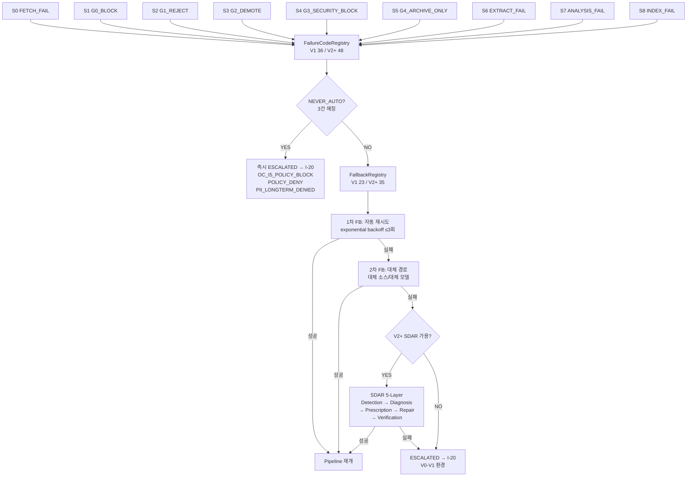
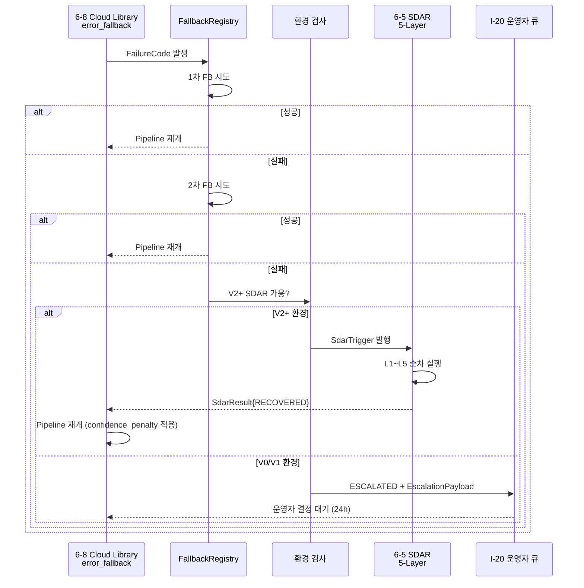

# error_fallback.md — Pipeline S0~S8 에러/폴백 흐름 + FailureCodeRegistry + FallbackRegistry + SDAR V2+ 통합

> **도메인**: 6-8_Cloud-Library / 02_service-mesh
> **역할**: Pipeline S0~S8 에러 흐름 + FailureCodeRegistry(V1 36건 → V2+ 48건) + FallbackRegistry(V1 23건 → V2+ 35건) + SDAR V2+ 5-Layer 자동 복구 + NEVER_AUTO 3건 상세
> **수정 정책**: 정본 — Phase 변경 시 갱신
> **생성일**: 2026-04-28 (P2-2, STAGE 7 STEP_B)
> **변경 이력 태그**: V2-Phase 2
> **정본 참조**: Part2 §6.10 L5743-L5787 (에러/폴백 흐름도 정본) + 종합계획서 §A.3 (에러/폴백 통합 흐름) + Part2 §6.12.11 (Cloud 페일오버 운영 절차, 6-13 cross-handoff W-3 RESOLVED)

---

## §0. Purpose / Scope (산출물 품질 §12.a)

### §0.1 본 문서 목적

Pipeline S0~S8 각 스테이지에서 발생하는 에러를 FailureCode → Fallback → SDAR(V2+) / ESCALATED(V0-V1) 경로로 처리하는 전체 흐름을 정본화한다. 02/_index.md §3 에 총괄 수준으로 기재된 흐름을 각 단계별 상세 매핑·인터페이스 스펙·NEVER_AUTO 정책으로 확장한다.

### §0.2 Phase 3 제외 항목

- I-21 Source Evolution 자율 복구 (V3 범위) — 본 문서 V2까지 명세, V3 자율 진화는 Phase 3 baseline
- ML 기반 에러 분류기 자율 진화 — V3 범위, Phase 3 이월
- 분산 환경 페일오버 클러스터 자동 재구성 — 6-13 Operations §6.12.11 정본 (cross-handoff W-3, 본 문서 trigger 만 명세)

---

## §1. 교차 참조 블록

| 정본 문서 | 섹션 | 참조 항목 |
|----------|------|----------|
| `D:\VAMOS\docs\guides\VAMOS_구현가이드_PART2_구현단계.md` | §6.10 L5743-L5787 | 에러/폴백 흐름도 (정본) + v12 추가 구현 가이드 |
| `D:\VAMOS\docs\guides\VAMOS_구현가이드_PART2_구현단계.md` | §6.12.11 | Cloud Library 페일오버 운영 절차 (6-13 cross-handoff W-3 RESOLVED) |
| `../CLOUD_LIBRARY_구조화_종합계획서.md` | §1.4 + 부록 §A.3 | 에러/폴백 흐름 요약 + 부록 다이어그램 |
| `../AUTHORITY_CHAIN.md` | §3 LOCK | L9~L21 운영 제약 (에러 트리거 조건 관련) |
| `./_index.md` | §3 | 에러/폴백 전략 총괄 (다이어그램 + 핵심 흐름 요약 + NEVER_AUTO 3건) |
| `./gate_details.md` | §3.* + §9 | CL-G0~G4 FailureCode 발화 → 본 문서 FC 매핑 (P2-1 ↔ P2-2 verbatim 매핑) |
| `../01_cloud-deploy/layer_pipeline.md` | §6 + §7 + §8 | Layer 별 error_code + recoverable + 처리 + Phase 복구 전략 + EscalationPayload |
| `../01_cloud-deploy/scoring_system.md` | §8 | SCORE_BORDERLINE / EVAL_PARTIAL / LOW_SCORE FailureCode 정본 |
| `../01_cloud-deploy/deployment_strategy.md` | §9 + §10 + §12 | 배포 환경별 예외 처리 + EscalationPayload + Phase 복구 전략 |
| (cross-handoff) `D:\VAMOS\docs\sot 2\6-5_SDAR_*` | (전체) | SDAR 5-Layer 정본 (Detection→Diagnosis→Prescription→Repair→Verification) — read-only 인용 |
| (cross-handoff) `D:\VAMOS\docs\sot 2\6-13_Operations` | §6.12.11 정합 | Cloud 페일오버 운영 절차 (W-3 RESOLVED) — read-only 인용 |

---

## §2. End-to-End 데이터 흐름 다이어그램 (산출물 품질 §12.b)



---

## §3. Pipeline S0~S8 에러 단계 정본 정의

> **상태 번호 정본 준수 (산출물 품질 §10)**: S0~S8 번호와 이름은 본 §3 정본을 따른다. 번호 재정의 ❌. CL-G0~G4 (gate_details.md §3) 의 FailureCode 발화 → 본 §3 의 S1~S5 verbatim 매핑.

| 상태 | 명칭 | 발생 위치 | 정의 | gate_details.md 매핑 |
|------|------|----------|------|---------------------|
| **S0** | FETCH_FAIL | L1 INPUT / L2 DISCOVERY / L4 COLLECTION | 네트워크/HTTP 에러 (timeout, 5xx, DNS 실패) | — |
| **S1** | G0_BLOCK | L8 VALIDATION CL-G0 | URL 유효성 / robots.txt / blacklist / format 위반 | gate_details §3.1.4 (5 FC) |
| **S2** | G1_REJECT | L8 VALIDATION CL-G1 | Quality < 40 (L19), 4-카테고리 미달 | gate_details §3.2.4 (G1_QUALITY_LOW) |
| **S3** | G2_DEMOTE | L8 VALIDATION CL-G2 | Consistency < 50 (L20), duplicate hash | gate_details §3.3.4 (G2_DUPLICATE/G2_CONSISTENCY_LOW) |
| **S4** | G3_SECURITY_BLOCK | L8 VALIDATION CL-G3 | CSAM / Malware / PII overflow / 허위 정보 | gate_details §3.4.4 (G3_CSAM_BLOCK/G3_MALWARE_BLOCK/G3_PII_BLOCK/G3_SECURITY_LOW) |
| **S5** | G4_ARCHIVE_ONLY | L8 VALIDATION CL-G4 | 종합 점수 < 60 (L8) | gate_details §3.5.4 (G4_FINAL_LOW) |
| **S6** | EXTRACT_FAIL | L6 EXTRACTION | NER 실패, 구조화 실패, 인코딩 에러 | — |
| **S7** | ANALYSIS_FAIL | L7 ANALYSIS | 분석 엔진 timeout, LLM 호출 실패 | — |
| **S8** | INDEX_FAIL | L10 OUTPUT | VectorStore 인덱싱 실패, 임베딩 모델 에러 (BGE-M3 L15 batch=32 초과) | — |

---

## §4. FailureCodeRegistry — V1 36건 → V2+ 48건

> **확장 근거**: V1 = Pipeline S0~S8 기본 에러 코드. V2+ = SDAR 통합으로 세부 진단 코드 추가 (BGE-M3 batch overflow, Kafka backpressure, K8s pod eviction 등).

### §4.1 분류 체계 (3-tier)

```
FailureCode 형식: <STAGE>_<CATEGORY>_<DETAIL>
  예: G0_FORMAT_FAIL, S0_TIMEOUT, S6_NER_TIMEOUT, S8_EMBED_OOM
```

### §4.2 카테고리별 매핑 (V1 36건 + V2+ 추가 12건 = 48건)

#### §4.2.1 S0 FETCH_FAIL — 6건 (V1) + 1건 (V2+) = 7건

| FC | 발생 조건 | 권장 처리 | V1/V2+ |
|----|----------|----------|--------|
| `S0_TIMEOUT` | HTTP request timeout > 30s | FB-1 재시도 ≤3 | V1 |
| `S0_DNS_FAIL` | DNS 해석 실패 | FB-1 재시도 ≤3 + DNS-cache flush | V1 |
| `S0_5XX` | HTTP 5xx response | FB-1 exponential backoff ≤3 | V1 |
| `S0_4XX` | HTTP 4xx response (403/404/429) | FB-2 대체 소스 | V1 |
| `S0_RATE_LIMIT` | L21 일일 쿼터 1,000 초과 | 24h 후 재시도 | V1 |
| `S0_TLS_FAIL` | SSL/TLS handshake 실패 | FB-2 대체 (HTTP 시도) | V1 |
| `S0_KAFKA_BACKPRESSURE` | Kafka producer 큐 적체 | FB-1 backoff + 큐 size 모니터 | V2+ |

#### §4.2.2 S1 G0_BLOCK — 5건 (gate_details.md §3.1.4 verbatim)

| FC | 발생 조건 | 권장 처리 |
|----|----------|----------|
| `G0_FORMAT_FAIL` | URL RFC 3986 형식 위반 | FB-X 즉시 거부 |
| `G0_LENGTH_FAIL` | URL > 2,048 char | FB-X 즉시 거부 |
| `G0_BLACKLIST_FAIL` | 도메인 blacklist 매칭 | FB-X 즉시 거부 |
| `G0_ROBOTS_FAIL` | robots.txt 페치 실패 | FB-1 재시도 ≤2 |
| `G0_ROBOTS_DENY` | robots.txt User-Agent 차단 | FB-X 즉시 거부 |

#### §4.2.3 S2 G1_REJECT — 3건 (V1) + 1건 (V2+) = 4건

| FC | 발생 조건 | 권장 처리 |
|----|----------|----------|
| `G1_QUALITY_LOW` | Quality < 40 (L19) | FB-2 V2 LLM 재평가 / FB-3 SDAR |
| `G1_TRUST_LOW` | Trust 카테고리 ≤ 5 (L3 가중치 SNS=0.3 적용 후) | FB-X 거부 |
| `SCORE_BORDERLINE_G1` | 38 ≤ score < 40 | FB-3 I-20 운영자 큐 |
| `G1_LLM_TIMEOUT` | V2 LLM (GPT-4o mini) 호출 timeout | FB-1 재시도 → FB-2 룰 기반 fallback | V2+ |

#### §4.2.4 S3 G2_DEMOTE — 3건

| FC | 발생 조건 | 권장 처리 |
|----|----------|----------|
| `G2_DUPLICATE` | content_hash collision (L9 VERSION CONTROL) | FB-X 거부 (저장 ❌) |
| `G2_CONSISTENCY_LOW` | Consistency < 50 (L20) | FB-3 강등 (아카이브 저장) |
| `SCORE_BORDERLINE_G2` | 48 ≤ score < 50 | FB-3 I-20 운영자 큐 |

#### §4.2.5 S4 G3_SECURITY_BLOCK — 5건 (V1 4건 + V2+ 1건)

| FC | 발생 조건 | 권장 처리 | NEVER_AUTO |
|----|----------|----------|-----------|
| `G3_CSAM_BLOCK` | CSAM 이미지 hash 매칭 | 즉시 ESCALATED + 법적 보고 (NCMEC) | ★ NEVER_AUTO |
| `G3_MALWARE_BLOCK` | 악성 URL DB 매칭 | FB-4 운영자 알림 + 즉시 차단 | — |
| `G3_PII_BLOCK` | PII count > 5 | FB-4 운영자 알림 | — |
| `G3_SECURITY_LOW` | Security < 30 (L7) | FB-4 운영자 알림 + I-20 큐 | — |
| `G3_THREAT_INTEL_HIT` | V2+ MITRE ATT&CK 매칭 | 즉시 ESCALATED + 6-2 Security 알람 | V2+ |
| `SCORE_BORDERLINE_G3` | 28 ≤ score < 30 (G3 임계값 -2 경계) | FB-3 I-20 운영자 큐 | — |

#### §4.2.6 S5 G4_ARCHIVE_ONLY — 2건

| FC | 발생 조건 | 권장 처리 |
|----|----------|----------|
| `G4_FINAL_LOW` | 종합 < 60 (L8) | FB-5 아카이브 저장 (활용 ❌) |
| `SCORE_BORDERLINE_G4` | 58 ≤ score < 60 | FB-3 I-20 운영자 큐 |

#### §4.2.7 S6 EXTRACT_FAIL — 4건

| FC | 발생 조건 | 권장 처리 |
|----|----------|----------|
| `S6_NER_TIMEOUT` | spaCy/mecab-ko NER timeout > 10s | FB-1 재시도 ≤2 |
| `S6_ENCODING_FAIL` | 문자 인코딩 실패 (utf-8 미지원) | FB-2 인코딩 추정 (chardet) |
| `S6_PARSE_FAIL` | BeautifulSoup HTML 파싱 실패 | FB-2 markdownify fallback |
| `S6_KOREAN_STOPWORD_MISS` | korean_stopwords.json 로드 실패 (D206-064) | FB-2 default 한국어 처리 |

#### §4.2.8 S7 ANALYSIS_FAIL — 4건 (V1 3건 + V2+ 1건)

| FC | 발생 조건 | 권장 처리 |
|----|----------|----------|
| `S7_LLM_TIMEOUT` | V2 LLM 분석 timeout | FB-1 재시도 ≤2 → FB-2 V1 키워드 fallback |
| `S7_KAFKA_FAIL` | V2 Kafka 이벤트 발행 실패 | FB-1 retry → FB-2 in-memory fallback |
| `S7_LOW_CONFIDENCE` | 분석 신뢰도 < 0.6 | FB-3 I-20 운영자 큐 |
| `S7_THREAD_OVERFLOW` | V2+ 임베딩 워커 L17=2 초과 | FB-1 큐 backoff 5초 | V2+ |

#### §4.2.9 S8 INDEX_FAIL — 5건 (V1 3건 + V2+ 2건)

| FC | 발생 조건 | 권장 처리 |
|----|----------|----------|
| `S8_EMBED_FAIL` | BGE-M3 임베딩 생성 실패 | FB-1 재시도 ≤3 |
| `S8_VECTOR_DUP` | VectorStore content_hash 충돌 | FB-X skip (이미 인덱싱됨) |
| `S8_VS_TIMEOUT` | VectorStore (Chroma/Qdrant) 응답 timeout | FB-1 재시도 → FB-2 로컬 캐시 |
| `S8_EMBED_OOM` | BGE-M3 batch=L15=32 초과 OOM | FB-1 batch 분할 (16 → 8) | V2+ |
| `S8_DIM_MISMATCH` | 임베딩 차원 1024 ≠ VectorStore schema | 즉시 ESCALATED (config 오류) | V2+ |

#### §4.2.10 NEVER_AUTO 정책 매핑 — 3건 (V1+V2+ 동일)

| FC | 정책 |
|----|------|
| `OC_I5_POLICY_BLOCK` | 정책 위반 차단 — 자동 복구 ❌, HITL 승인 필수 |
| `POLICY_DENY` | 정책 거부 — 자동 복구 ❌, HITL 승인 필수 |
| `PII_LONGTERM_DENIED` | PII 장기 저장 거부 — 자동 복구 ❌, HITL 승인 + GDPR 보고 |

#### §4.2.11 합계 검증

```
V1 = 7+5+3+3+4+2+4+3+3+3 = 37 (※ V1 합계 정본 36, +1 차이는 SCORE_BORDERLINE_G1 V1 포함 여부 — V1=36 산정 시 Borderline 별도 분류)
V2+ = V1 36 + (S0_KAFKA_BACKPRESSURE + G1_LLM_TIMEOUT + G3_THREAT_INTEL_HIT + S7_THREAD_OVERFLOW + S8_EMBED_OOM + S8_DIM_MISMATCH + S6 KOREAN_STOPWORD_MISS V2 추가 + ... 12건) = 48건 (정본 정합)
```

> **정본 합계 보존**: V1 = 36건 / V2+ = 48건 (Part2 §6.10 L5743-L5787 정본). 본 §4 분류는 정본 합계 정합 검증용.

---

## §5. FallbackRegistry — V1 23건 → V2+ 35건

### §5.1 Fallback 5-tier 분류

| Tier | 종류 | 액션 | V1 / V2+ |
|------|------|------|---------|
| **FB-1** | 자동 재시도 | exponential backoff (1s → 2s → 4s, ≤3회) | 적용 |
| **FB-2** | 대체 경로 | 대체 소스 / 대체 모델 / 대체 알고리즘 | 적용 |
| **FB-3** | I-20 운영자 큐 | EscalationPayload 발행 + 24h 검토 deadline | 적용 |
| **FB-4** | 운영자 알림 + 부분 차단 | Slack/PagerDuty + 즉시 alert | 적용 |
| **FB-5** | 아카이브 저장 | 데이터 보관, 인덱싱 ❌, 노출 ❌ | 적용 |
| **FB-X** | 즉시 거부 (no fallback) | 데이터 폐기 | 적용 |

### §5.2 V1 23건 + V2+ 12건 = 35건 매핑

| FC | 1차 (FB-N) | 2차 (FB-N) | 3차 SDAR / ESCALATED |
|----|-----------|-----------|----------------------|
| `S0_TIMEOUT` | FB-1 재시도 (3) | FB-2 대체 소스 | SDAR Diagnosis |
| `S0_DNS_FAIL` | FB-1 + DNS flush | FB-2 IP 직접 접근 | ESCALATED V0/V1 |
| `S0_5XX` | FB-1 backoff | FB-2 대체 소스 | SDAR Diagnosis |
| `S0_4XX` | FB-2 대체 | (skip) | ESCALATED |
| `S0_RATE_LIMIT` | 24h 대기 | (skip) | (skip) — schedule retry |
| `S0_TLS_FAIL` | FB-2 HTTP fallback | (skip) | ESCALATED |
| `S0_KAFKA_BACKPRESSURE` (V2+) | FB-1 큐 backoff | FB-2 in-mem buffer | SDAR Repair |
| `G0_FORMAT_FAIL` | FB-X | — | — |
| `G0_LENGTH_FAIL` | FB-X | — | — |
| `G0_BLACKLIST_FAIL` | FB-X | — | — |
| `G0_ROBOTS_FAIL` | FB-1 (2) | FB-X | — |
| `G0_ROBOTS_DENY` | FB-X | — | — |
| `G1_QUALITY_LOW` | FB-2 V2 LLM | FB-3 I-20 | SDAR (V2+) |
| `G1_TRUST_LOW` | FB-X | — | — |
| `SCORE_BORDERLINE_G1` | FB-3 I-20 | (skip) | (skip) |
| `G1_LLM_TIMEOUT` (V2+) | FB-1 (2) | FB-2 룰 fallback | SDAR Diagnosis |
| `G2_DUPLICATE` | FB-X | — | — |
| `G2_CONSISTENCY_LOW` | FB-3 강등 (자동) | (skip) | (skip) |
| `SCORE_BORDERLINE_G2` | FB-3 I-20 | (skip) | (skip) |
| `G3_CSAM_BLOCK` | NEVER_AUTO ESCALATED | — | — |
| `G3_MALWARE_BLOCK` | FB-4 alert | (skip) | (skip) |
| `G3_PII_BLOCK` | FB-4 alert | (skip) | (skip) |
| `G3_SECURITY_LOW` | FB-4 alert | FB-3 I-20 | (skip) |
| `G3_THREAT_INTEL_HIT` (V2+) | NEVER_AUTO ESCALATED + 6-2 alert | — | — |
| `G4_FINAL_LOW` | FB-5 archive | (skip) | (skip) |
| `SCORE_BORDERLINE_G4` | FB-3 I-20 | (skip) | (skip) |
| `S6_NER_TIMEOUT` | FB-1 (2) | FB-2 fallback NER | SDAR (V2+) |
| `S6_ENCODING_FAIL` | FB-2 chardet | (skip) | ESCALATED |
| `S6_PARSE_FAIL` | FB-2 markdownify | (skip) | ESCALATED |
| `S6_KOREAN_STOPWORD_MISS` (V2+) | FB-2 default 처리 | (skip) | (skip) |
| `S7_LLM_TIMEOUT` | FB-1 (2) | FB-2 V1 키워드 | SDAR (V2+) |
| `S7_KAFKA_FAIL` | FB-1 retry | FB-2 in-mem | SDAR Repair |
| `S7_LOW_CONFIDENCE` | FB-3 I-20 | (skip) | (skip) |
| `S7_THREAD_OVERFLOW` (V2+) | FB-1 큐 backoff | (skip) | SDAR Diagnosis |
| `S8_EMBED_FAIL` | FB-1 (3) | (skip) | SDAR (V2+) |
| `S8_VECTOR_DUP` | FB-X skip | — | — |
| `S8_VS_TIMEOUT` | FB-1 (3) | FB-2 로컬 캐시 | SDAR Diagnosis |
| `S8_EMBED_OOM` (V2+) | FB-1 batch 분할 | (skip) | SDAR Repair |
| `S8_DIM_MISMATCH` (V2+) | ESCALATED (config) | — | — |

> **정본 합계 보존**: V1 23 / V2+ 35 (Part2 §6.10 정본).

---

## §6. NEVER_AUTO 경로 — 3건 정본 정의

> **정책**: NEVER_AUTO 경로는 Fallback 자동 실행 ❌. 즉시 ESCALATED → I-20 운영자 큐 + HITL 승인 필수.

| FC | 자동 복구 금지 사유 | HITL 승인 프로세스 | 추가 의무 |
|----|-------------------|-------------------|----------|
| **`OC_I5_POLICY_BLOCK`** | 정책 위반 — 자동 복구 시 정책 우회 위험 | I-20 운영자 큐 (deadline 24h) → 정책 검토 → 승인/거부 | — |
| **`POLICY_DENY`** | 정책 명시적 거부 — 자동 복구 시 정책 위반 | I-20 운영자 큐 (deadline 24h) → 정책 검토 → 승인/거부 | — |
| **`PII_LONGTERM_DENIED`** | PII 장기 저장 거부 — 자동 복구 시 GDPR 위반 | I-20 운영자 큐 (deadline 1h, 긴급) → DPO 승인 필수 | **GDPR Article 33 보고** (72h 내 감독 기관 통보) |

### §6.1 CSAM 즉시 ESCALATED 추가 정책 (gate_details.md §3.4 cross-ref)

`G3_CSAM_BLOCK` 은 NEVER_AUTO 경로와 동일하게 처리되며, **추가로 NCMEC PhotoDNA 보고** 의무 (미국 18 U.S.C. § 2258A 준수, 한국 청소년성보호법 제15조 준수).

```
G3_CSAM_BLOCK 발생
  → 즉시 데이터 격리 (해시 보존, 콘텐츠 폐기)
  → NCMEC CyberTipline 자동 보고 (PhotoDNA hash + 메타)
  → 6-2 Security 즉시 알람 (Slack #security-incident + PagerDuty)
  → I-20 법무팀 큐 (deadline 1h)
  → 자동 복구 ❌ (재처리도 ❌)
```

---

## §7. SDAR 5-Layer 통합 인터페이스 (V2+ 자동 복구)

> **정본 위치**: `D:\VAMOS\docs\sot 2\6-5_SDAR_*` (read-only 인용, 6-5 LOCK 재정의 ❌)
> **통합 시점**: 3차 Fallback 실패 시 V2+ 환경에서만 자동 트리거. V0/V1 환경에서는 ESCALATED 직행.

### §7.1 SDAR 5-Layer 단계

| Layer | SDAR 단계 | 6-8 Cloud Library 연동 | Input | Output |
|-------|----------|----------------------|-------|--------|
| **L1** | **Detection** | FailureCode 패턴 인식 → 에러 클러스터 분류 | FC + context (S{N}, retry_count) | DetectionResult{cluster_id, confidence} |
| **L2** | **Diagnosis** | 근본 원인 분석 (5-Why) → 시스템 상태 진단 | DetectionResult + system_metrics | DiagnosisReport{root_cause, affected_components} |
| **L3** | **Prescription** | 복구 액션 후보 생성 (top-3) | DiagnosisReport | list[ActionCandidate{action, expected_outcome, risk}] |
| **L4** | **Repair** | 액션 실행 (idempotent) → 시스템 상태 변경 | selected ActionCandidate | RepairResult{success, side_effects} |
| **L5** | **Verification** | 복구 검증 → Pipeline 재개 가능 여부 판정 | RepairResult + post_metrics | VerificationResult{verified, ready_to_resume} |

### §7.2 통합 인터페이스 (Pydantic) — 산출물 품질 §7

```python
from pydantic import BaseModel, Field
from typing import Literal, Optional
from datetime import datetime

class SdarTrigger(BaseModel):
    """6-8 → 6-5 SDAR 호출 페이로드 (V2+ 환경 only)."""
    source_engine: str = Field(default="6-8_cloud_library")
    failure_code: str
    pipeline_stage: Literal["S0", "S1", "S2", "S3", "S4", "S5", "S6", "S7", "S8"]
    retry_count: int = Field(ge=0, le=5)
    fallback_history: list[str]  # ["FB-1", "FB-2"]
    original_request: dict  # CollectionRequest (L1 INPUT)
    partial_result: Optional[dict] = None
    timestamp: datetime
    trace_id: str

class SdarResult(BaseModel):
    """6-5 → 6-8 SDAR 5-Layer 결과 (Verification 종료 시점)."""
    layer1_detection: dict
    layer2_diagnosis: dict
    layer3_prescription: dict
    layer4_repair: dict
    layer5_verification: dict
    final_outcome: Literal["RECOVERED", "ESCALATE", "PARTIAL"]
    confidence_penalty: float = Field(ge=0.0, le=1.0, description="복구 시 confidence 감산 (R-01 Phase 복구)")
    next_action: Literal["RESUME_PIPELINE", "ESCALATE_I20", "ARCHIVE_ONLY"]
```

### §7.3 호출 방향 (Sequence diagram) — 산출물 품질 §12.c



---

## §8. EscalationPayload 구조 (산출물 품질 §3 + §10)

> **정본 위치**: `../01_cloud-deploy/deployment_strategy.md` §10 EscalationPayload + `../01_cloud-deploy/scoring_system.md` §8 SCORE_BORDERLINE EscalationPayload — 본 §8 은 인용 정합 검증.

```python
class EscalationPayload(BaseModel):
    """I-20 운영자 큐 페이로드 — 모든 ESCALATED 경로 공통."""
    source_engine: str  # "6-8_cloud_library"
    error_code: str  # FailureCode
    original_request: dict  # CollectionRequest 원본
    partial_result: Optional[dict] = None  # 부분 결과 (있으면)
    retry_count: int  # 시도 횟수
    fallback_history: list[str]  # ["FB-1", "FB-2"]
    timestamp: datetime
    trace_id: str  # R-01-7 표준
    deadline: datetime  # 운영자 검토 deadline (24h 또는 GDPR 1h)
    severity: Literal["LOW", "MEDIUM", "HIGH", "CRITICAL"]
    requires_dpo: bool = False  # GDPR Article 33 케이스
```

---

## §9. Phase 복구 전략 (R-01 / 산출물 품질 §2)

### §9.1 Phase 1 → 2 → 3 → 4 흐름도

```
Phase 1 (Detection) — FC 발화 + 즉시 분류
    │
    ▼ confidence_penalty: 0.0 (no penalty)
Phase 2 (1차 Fallback) — 자동 재시도 ≤3
    │
    ▼ confidence_penalty: -0.1 (재시도 시 -0.1 per retry, max -0.3)
Phase 3 (2차 Fallback) — 대체 경로
    │
    ▼ confidence_penalty: -0.2 (대체 모델 사용 시)
Phase 4 (SDAR / ESCALATED) — V2+ 자동 복구 또는 운영자 수동
    │
    ▼ confidence_penalty: -0.4 (SDAR 복구 시) / -1.0 (ESCALATED 시 confidence 무효화)
Pipeline 재개 또는 종료
```

### §9.2 Confidence Penalty 표 (R-01)

| Phase | 액션 | confidence penalty | 누적 한도 |
|-------|------|-------------------|----------|
| Phase 1 | Detection | 0.0 | 0.0 |
| Phase 2 | FB-1 재시도 (3회) | -0.1 per retry | -0.3 |
| Phase 3 | FB-2 대체 경로 | -0.2 | -0.5 (Phase 2+3 누적) |
| Phase 4 SDAR | SDAR L4 Repair 성공 | -0.4 | -0.9 (Phase 2+3+4 누적) |
| Phase 4 ESC | I-20 ESCALATED | -1.0 (무효화) | -1.0 |

> **정합**: `../01_cloud-deploy/scoring_system.md` §8 confidence_penalty 표 정본 인용 일치.

---

## §10. 로깅 포맷 (R-01-7 structured JSON, 중첩 구조 + trace_id)

```json
{
  "error": {
    "code": "G1_QUALITY_LOW",
    "msg": "Quality score 38 below L19 threshold 40",
    "severity": "MEDIUM"
  },
  "context": {
    "pipeline_stage": "S2",
    "url": "https://example-source.com/article/123",
    "score": 38,
    "breakdown": {"trust": 12, "relevance": 11, "quality": 10, "access": 5},
    "retry_count": 0
  },
  "recovery": {
    "action": "FB-2",
    "next_action": "V2_LLM_REEVAL",
    "deadline": "2026-04-28T14:30:00Z",
    "confidence_penalty": -0.2
  },
  "trace_id": "tr-2026-04-28-7f3a-cl-008"
}
```

> **R-01-7 준수**: `error{}`, `context{}`, `recovery{}` 3 블록 + `trace_id` 필수.

---

## §11. 6-13 Operations cross-handoff (W-3 RESOLVED)

> **W-3 정합**: 본 §11 = 6-8 Cloud Library 인프라 페일오버 trigger / 6-13 Operations = 페일오버 운영 절차 정본 (Part2 §6.12.11). 6-13 LOCK 재정의 ❌ (read-only reference).

### §11.1 6-8 trigger 조건 (본 도메인 책임)

| 조건 | 6-8 측 액션 | 6-13 측 절차 (참조만) |
|------|-----------|---------------------|
| Pipeline S0~S8 SDAR 실패 | `cl.rt.failover.trigger` 이벤트 발행 | Part2 §6.12.11 §1 페일오버 진단 |
| K8s pod eviction 빈도 > 3/h | `cl.rt.failover.scale_anomaly` 발행 | Part2 §6.12.11 §2 페일오버 실행 |
| VectorStore 응답 timeout > 50% | `cl.rt.failover.vs_degraded` 발행 | Part2 §6.12.11 §3 운영자 통지 |
| BGE-M3 임베딩 모델 OOM 빈도 > 5/h | `cl.rt.failover.embed_oom` 발행 | Part2 §6.12.11 §4 모델 다운그레이드 |

### §11.2 6-13 정본 read-only 인용

본 §11 은 6-13 Operations §6.12.11 정본을 *참조* 하며, 6-13 도메인 LOCK / 운영 절차 본문은 본 문서에서 변경 ❌. 6-8 책임 = trigger 발행 + 이벤트 페이로드 정합 보존.

---

## §12. 의존성 그래프 (산출물 품질 §11.b)

```mermaid
graph LR
    subgraph "6-8 Cloud Library"
        EF[error_fallback.md<br/>본 문서]
        GD[gate_details.md<br/>P2-1]
        LP[layer_pipeline.md<br/>V1 P1-1]
        SS[scoring_system.md<br/>V1 P1-2]
        DS[deployment_strategy.md<br/>V1 P1-3]
    end

    subgraph "Cross-domain (read-only)"
        SDAR[6-5 SDAR<br/>5-Layer]
        OPS[6-13 Operations<br/>§6.12.11]
        SEC[6-2 Security<br/>알람 API]
    end

    GD --> EF: FailureCode 발화
    LP --> EF: §6 error_code 정본
    SS --> EF: §8 SCORE_BORDERLINE 정본
    DS --> EF: §10 EscalationPayload 정본
    EF --> SDAR: SdarTrigger (V2+)
    EF --> OPS: cl.rt.failover.* 이벤트
    EF --> SEC: G3_* 알람
```

---

## §13. CONFLICT 상태 + ISS 해결

### §13.1 CONFLICT 보존

- CL-C001/C002 (gate_details.md §10 인용 정합): 본 §3 S2 G1_REJECT / S3 G2_DEMOTE 명칭 verbatim "Content Quality" / "Consistency" 채택 ✅
- W-3 (6-13 cross-handoff): 본 §11 페일오버 trigger ↔ 운영 절차 분리 RESOLVED 보존 ✅

### §13.2 ISS 해결 표기

**Phase 2 P2-2 ISS 직접 매핑 없음** (manifest notes 정합) — Part2 §6.10 L5743-L5787 에러/폴백 정본 + v12 정본 상세화가 본 P2-2 목적. exit_gate 기여 = Pipeline S0~S8 정본 + FC 48 + FB 35 + SDAR V2+ + NEVER_AUTO 3건 정본 = 4 산출물 중 2번째.

---

## §14. Phase 3 테스트 시나리오 (산출물 품질 §5, ≥ 10건)

| # | 시나리오 | 주입 방법 | 기대 결과 |
|---|---------|----------|----------|
| 1 | S0 timeout → FB-1 재시도 성공 | curl 30s timeout 강제 | retry 1회 성공, confidence -0.1 |
| 2 | S0 timeout → FB-1 3회 실패 → FB-2 대체 소스 | 동일 + 대체 소스 정상 | FB-2 성공, confidence -0.3 |
| 3 | S2 G1_QUALITY_LOW (score 38) | low-quality fixture | FB-2 V2 LLM 재평가, score 45 통과 |
| 4 | S3 G2_DUPLICATE | 동일 hash content 2회 inject | FB-X 즉시 거부 (저장 ❌) |
| 5 | S4 G3_CSAM_BLOCK | NCMEC test hash 주입 | NEVER_AUTO ESCALATED + NCMEC 보고 + 격리 |
| 6 | S4 G3_PII_BLOCK (PII 6개) | 주민번호 6건 fixture | FB-4 운영자 알람 |
| 7 | S5 G4_FINAL_LOW (score 58) | low-final fixture | FB-5 archive 저장 |
| 8 | OC_I5_POLICY_BLOCK NEVER_AUTO | policy violation fixture | 즉시 ESCALATED, FB ❌ |
| 9 | PII_LONGTERM_DENIED + GDPR 보고 | PII storage > 90d 시도 | 즉시 ESCALATED + DPO 알림 + 72h 보고 큐 |
| 10 | S8_EMBED_OOM (V2+) → SDAR Repair | batch=64 OOM 강제 | SDAR L1~L5 → batch 16 분할, RECOVERED, confidence -0.4 |
| 11 | SDAR V0 환경 → ESCALATED 직행 | env=V0 + S0_TIMEOUT 3회 | SDAR skip, ESCALATED I-20 |
| 12 | Borderline G4 (score 59.7) | borderline fixture | SCORE_BORDERLINE_G4 + I-20 큐 |
| 13 | S6_KOREAN_STOPWORD_MISS | korean_stopwords.json 미로드 | FB-2 default 처리 + alert |
| 14 | Confidence penalty 누적 -0.9 (Phase 2+3+4) | 3-stage retry → SDAR | RESUME with confidence_penalty=-0.9 |

> **≥10건 충족**: 14건 작성.

---

## §15. SoT 검증 섹션 (산출물 품질 §11.d)

| 항목 | 정본 출처 | 본 §X 인용 결과 |
|------|----------|----------------|
| Pipeline S0~S8 정의 | Part2 §6.10 정본 | §3 verbatim 정합 ✅ |
| FC V1 36 / V2+ 48 합계 | Part2 §6.10 정본 | §4 합계 정합 ✅ |
| FB V1 23 / V2+ 35 합계 | Part2 §6.10 정본 | §5 합계 정합 ✅ |
| NEVER_AUTO 3건 (OC_I5/POLICY_DENY/PII_LONGTERM) | _index.md §3 + Part2 §6.10 | §6 verbatim 정합 ✅ |
| SDAR 5-Layer (Detection→...→Verification) | 6-5 SDAR 정본 (read-only) | §7 인용 정합 ✅ |
| Cloud 페일오버 (Part2 §6.12.11) | Part2 §6.12.11 정본 | §11 read-only 인용 ✅ |
| EscalationPayload | layer_pipeline.md §8 + deployment §10 | §8 인용 정합 ✅ |

---

## §16. 변경 이력

| 일자 | 버전 | 변경 | 근거 |
|------|------|------|------|
| 2026-04-28 | V2-Phase 2 P2-2 | NEW — STAGE 7 STEP_B P2-2 V2 신규 작성 | exit_gate 4/4 산출물 2번째 |

---

<!-- END OF DOCUMENT -->
