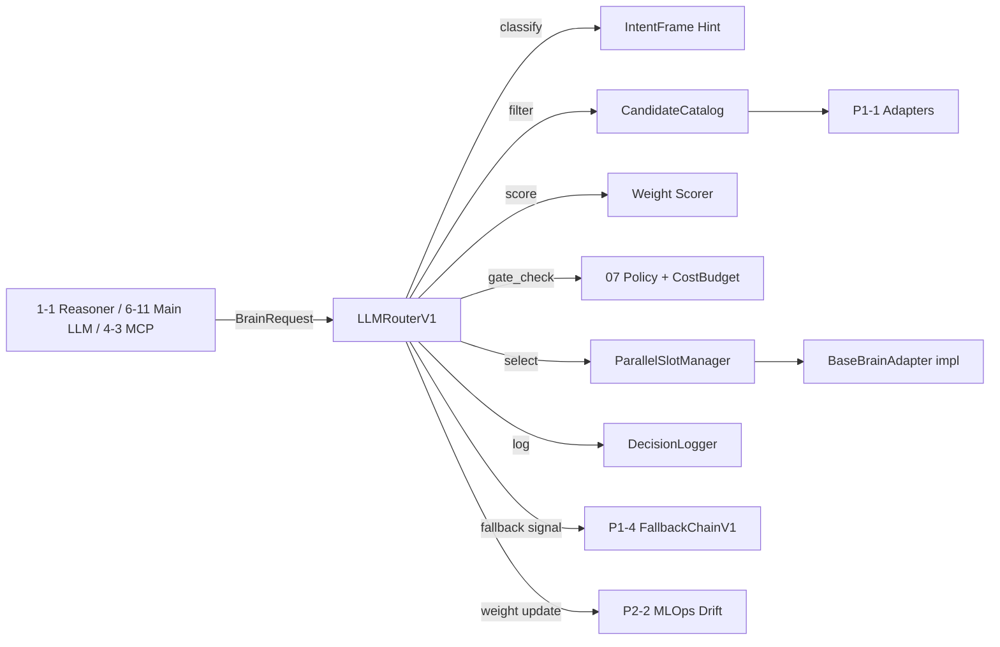
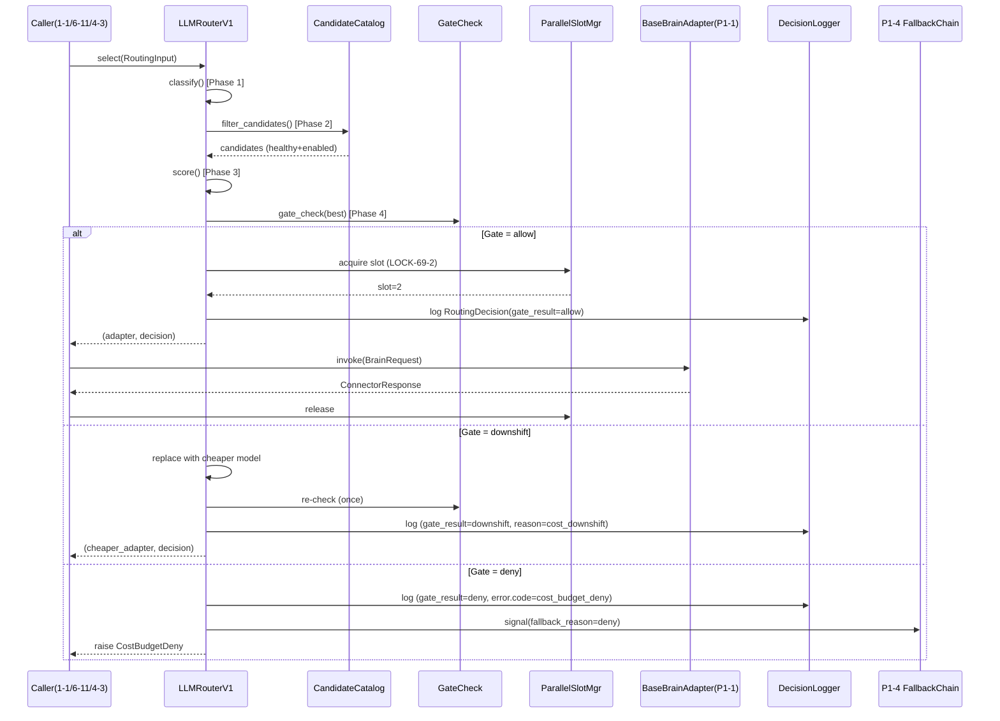

# P1-3 — LLM Router V1 구현 사양서 (복잡도 기반 동적 라우팅)

> **도메인**: 6-9_Brain-Adapter-HAL
> **서브폴더**: 03_llm-routing
> **세션**: P1-3
> **작성일**: 2026-04-14
> **상태**: Phase 1 L2 (설계 완료, 구현 단계 이관용 사양 확정)
> **선행 의존**:
> - P1-1 `01_multi-brain-adapter/P1-1_brain_adapter_v1_spec.md` — 공통 자료구조(`BrainRequest`/`ConnectorResponse`/`BaseBrainAdapter` ABC)
> - P1-2 `02_hal-interface/P1-2_hal_v1_spec.md` — HAL V1 Protocol(Ollama/OpenAI/Anthropic 3 Provider), LOCK-69-6 설정 우선순위

---

## 0. Purpose & Scope

본 문서는 6-9 도메인의 LLM Router V1 구현 사양을 정의한다. Router V1 은 상위 호출자(1-1 추론 엔진 / 6-11 Main LLM / 4-3 MCP 도구 호출 등)가 송신한 `BrainRequest` 를 입력으로, `03_llm-routing/_index.md §2~§4` 의 5단계 알고리즘을 적용하여 **최적 `BaseBrainAdapter` 구현체** 1개를 선택한다. 선택 근거는 JSON 구조화 로깅(LOCK-69-10)으로 `brain.route.selected` 이벤트에 기록한다.

**포함 범위**:
- 복잡도 분류 함수 (IntentFrame → `ThinkingLevel`)
- 후보 필터 (HAL health_check 통과 + enabled)
- 가중 스코어 계산 (quality 0.6 / cost 0.3 / latency 0.1)
- 병렬 상한 3 (LOCK-69-2) 슬롯 관리 + 큐잉
- Gate 결과(LOCK-69-4) Decision 레코드 기록
- Gate deny/downshift 트리거 (LOCK-69-7, R-69-5)
- 설정 우선순위 ENV > `brain_routing.yaml` > 코드 기본값 (LOCK-69-6)
- 3개 시나리오 + 병렬 상한 테스트 케이스 정의

**제외 범위**:
- 폴백 체인 상세 (P1-4 담당, 본 세션은 "폴백 트리거" 시그널만 전달)
- MLOps 드리프트 연동 (Phase 2 P2-2, 본 세션은 `RoutingWeightUpdate` 인터페이스만 선언)
- 2-tier 라우팅(6-11) 세부 정책 (Phase 2 P2-3)
- Batch API 라우팅 (D2.0-04 §5.2 참조만, 본 세션 미구현)

**정본 경계 원칙**: `03_llm-routing/_index.md §2~§8` 이 상위 정본이며 본 문서는 구현 사양만 추가한다. `_index.md §5` 구현 상태 갱신은 공통 산출물 보호 정책에 따라 도메인 마감 step 5/7/8 에서 일괄 반영하며, 본 세션에서는 본 사양서로 갱신 근거를 확보한다(INDEX.md/_index.md/00_common/ 수정 금지).

---

## 1. 교차 참조 블록 (a)

| 참조 대상 | 섹션 | 용도 |
|-----------|------|------|
| `03_llm-routing/_index.md` | §2(5단계 알고리즘), §3(가중치 매트릭스), §4(config 스키마), §5(로깅 스키마), §7(TC-1~TC-5) | 상위 정본 — 변경 금지 |
| `01_multi-brain-adapter/P1-1_brain_adapter_v1_spec.md` | §2 공통 자료구조, §7 예외 정책, §8 EscalationPayload | `BrainRequest` 입력 스키마, 에러 경로 |
| `01_multi-brain-adapter/_index.md` | §4.1 `BaseBrainAdapter` ABC | 라우터 반환 타입 (변경 금지) |
| `02_hal-interface/P1-2_hal_v1_spec.md` | §2 `HalEndpoint`, §3 설정 우선순위 | 프로바이더 엔드포인트 및 ENV 우선 적용 |
| `04_fallback-chain/_index.md` | §3 폴백 트리거, §4 전환 순서 | P1-4 로 폴백 시그널 전달 경계 |
| `AUTHORITY_CHAIN.md` | LOCK-69-2/4/6/7/8/10 | 규칙 근거 |
| `D:\VAMOS\docs\sot\D2.0-04_04. VAMOS_DESIGN_2.0_INFRA_CORE.md` | §5.1 5단계 라우팅, §5.2 Batch, §6 병렬, §8.3 로깅 | L1 정본 |
| `D:\VAMOS\docs\sot\D2.0-02_02. VAMOS_DESIGN_2.0_ORANGE_CORE.md` | §2.1-A Adaptive Thinking, §2.1-A IntentFrame complexity | L2 정본 (복잡도 분류 근거) |
| `BRAIN_ADAPTER_HAL_구조화_종합계획서.md` | §7 P1-3, §7 Phase 1→2 전환 게이트 | 작업 절차 |

---

## 2. 공통 자료 구조 선정의 (g, k)

> `BrainRequest`/`ConnectorResponse`/`BaseBrainAdapter` 는 P1-1 §2 및 `01/_index.md §3/§4.1` 정본을 그대로 참조한다(변경 금지). 본 세션에서 추가로 필요한 자료구조만 정의한다.

### 2.1 라우팅 입력/출력 타입 (Pydantic, `extra=forbid`)

```python
from typing import Literal, Optional, List, Dict, Any
from pydantic import BaseModel, Field

ThinkingLevel = Literal["instant", "low", "medium", "high", "max"]
DomainTag     = Literal["general", "code", "finance", "creative"]
GateResult    = Literal["allow", "deny", "downshift"]

class RoutingInput(BaseModel):
    """Router.select() 입력 - BrainRequest 확장 힌트."""
    request: "BrainRequest"                            # P1-1 §2.1 정본
    intent_complexity: Optional[ThinkingLevel] = None  # 상위에서 힌트 제공 시 우선
    intent_domain: Optional[DomainTag] = None          # 동상
    token_estimate: int = Field(..., ge=0)             # step 1 입력
    cost_budget_remaining_pct: float = Field(..., ge=0.0, le=100.0)
    class Config: extra = "forbid"

class RoutingCandidate(BaseModel):
    # V1 범위 3종. V2/V3 확장 시 P1-4 `_BASE_ORDER` (deepseek, vllm_local) 수용 위해 Literal 확장 필요 — 본 세션 V1 사양에서는 3종만 선언하되, P1-4 §3.4 `next_candidate` 는 V-Phase 별 provider_id 세트를 `RoutingCandidate`-호환 구조로 감싸 반환 (P1-4 §3.4 주석 [V1_LITERAL_EXTENSION_NOTE] 참조).
    provider_id: Literal["ollama_local", "openai", "anthropic"]
    model_id: str                                      # ex: "gpt-4o-mini"
    quality_score: float = Field(..., ge=0.0, le=1.0)
    cost_class: float = Field(..., ge=0.0, le=1.0)     # 낮을수록 저렴 (정규화)
    latency_class: float = Field(..., ge=0.0, le=1.0)  # 낮을수록 빠름 (정규화)
    healthy: bool
    enabled: bool
    class Config: extra = "forbid"

class RoutingDecision(BaseModel):
    """LOCK-69-4: Gate 결과 Decision 레코드 (JSON 로깅 원본)."""
    trace_id: str
    task_id: str
    complexity: ThinkingLevel
    domain: DomainTag
    selected_provider: Literal["ollama_local", "openai", "anthropic"]
    selected_model: str
    candidates_evaluated: int
    weighted_score: float
    reason: str                                        # ex: "domain_override:code + quality 0.95"
    gate_result: GateResult
    cost_budget_remaining_pct: float
    parallel_slot: Optional[int] = None                # 1~3 (LOCK-69-2)
    fallback_triggered: bool = False                   # P1-4 로 시그널 전달
    fallback_reason: Optional[Literal["timeout","error","cost_exceeded","unhealthy","deny"]] = None
    batch_eligible: bool = False
    timestamp: str                                     # ISO8601
    class Config: extra = "forbid"

class RoutingWeightUpdate(BaseModel):
    """4-4 MLOps 드리프트 → 라우팅 가중치 동적 업데이트 (Phase 2)."""
    model_id: str
    quality_delta: float = Field(..., ge=-1.0, le=1.0)
    new_quality_score: float = Field(..., ge=0.0, le=1.0)
    source: Literal["drift_detector", "manual_override"]
    timestamp: str
    class Config: extra = "forbid"
```

### 2.2 공통 구조 상속 규칙

- `BaseBrainAdapter` ABC 는 `01_multi-brain-adapter/_index.md §4.1` 정본. 라우터는 구현체 인스턴스를 반환하되 ABC 만 노출.
- `ConnectorResponse` 는 `01/_index.md §3` LOCK-69-1 정본. 라우터는 반환 타입에 관여하지 않음.
- `HalEndpoint` (P1-2 §2.1) 는 어댑터 내부 사용, 라우터는 `provider_id` 만 식별.

---

## 3. ABC 시그니처 정본 (h)

> 라우터는 신규 ABC 를 도입하지 않는다. 단 **Router 컴포넌트 인터페이스**는 아래 시그니처로 정본 고정한다. ABC 정본 위치는 `01_multi-brain-adapter/_index.md §4.1 BaseBrainAdapter` 이며 본 세션에서는 변경하지 않는다.

```python
from abc import ABC, abstractmethod

class BaseLLMRouter(ABC):
    """Router V1 컴포넌트 인터페이스 정본 (본 세션 신규)."""

    @abstractmethod
    def classify(self, input: RoutingInput) -> tuple[ThinkingLevel, DomainTag]:
        """step 1: 입력 분류. O(1)."""

    @abstractmethod
    def filter_candidates(self, complexity: ThinkingLevel, domain: DomainTag) -> List[RoutingCandidate]:
        """step 2: HAL 카탈로그에서 enabled + healthy 만 필터. O(N)."""

    @abstractmethod
    def score(self, candidates: List[RoutingCandidate]) -> List[tuple[RoutingCandidate, float]]:
        """step 3: 가중 스코어. O(N)."""

    @abstractmethod
    def gate_check(self, best: RoutingCandidate, input: RoutingInput) -> GateResult:
        """step 4: 07 PolicyCheck + CostBudget. O(1) per check."""

    @abstractmethod
    async def select(self, input: RoutingInput) -> tuple["BaseBrainAdapter", RoutingDecision]:
        """최종 라우팅. 병렬 상한 위반 시 자동 큐잉(LOCK-69-2, asyncio.Semaphore await). O(N log N) (score 정렬 포함)."""
```

**경계 선언**:
- `select()` 가 `RoutingDecision.fallback_triggered=True` 를 반환하면 호출자(또는 P1-4 wrapper)가 폴백 체인을 기동한다. 라우터 V1 은 폴백을 직접 수행하지 않는다.
- `select()` 반환 전에 반드시 `RoutingDecision` 을 JSON 로그(`brain.route.selected`)로 기록한다(LOCK-69-4, LOCK-69-10).

---

## 4. 라우팅 알고리즘 상세 (Big-O + LOCK)

### 4.1 5단계 알고리즘 (`_index.md §2.1` 정본 준수)

| 단계 | 함수 | Big-O | LOCK 적용 | 비고 |
|:----:|------|:-----:|-----------|------|
| 1 | `classify()` | O(1) | — | IntentFrame 힌트 우선, 없으면 token/tool count 규칙 기반 |
| 2 | `filter_candidates()` | O(N) | — | N=카탈로그 크기 (V1=3), health_check 캐시 사용 |
| 3 | `score()` | O(N log N) | — | 정렬 포함 (N=3 이므로 사실상 상수) |
| 4 | `gate_check()` | O(1) | **LOCK-69-7**, R-69-5 | CostBudget 100%↑ → deny, 80~100% → downshift |
| 5 | `select()` 내부 wrap | O(1) | **LOCK-69-2** 슬롯, **LOCK-69-4** Decision 기록 | 폴백 시그널 설정 후 반환 |

### 4.2 복잡도 분류 규칙 (step 1 상세)

입력 우선순위: `RoutingInput.intent_complexity` → IntentFrame 힌트 → 규칙 기반.

| 조건 | `ThinkingLevel` | 근거 |
|------|:---------------:|------|
| token_estimate < 20 AND tools=[] AND tier=None | `instant` | `_index.md §7.2 TC-1` |
| token_estimate < 100 AND tools=[] | `low` | §A 분류 |
| 100 ≤ token_estimate < 500 OR tools 1~2건 | `medium` | D2.0-04 §2.1.3 |
| 500 ≤ token_estimate < 2000 OR tools 3건+ | `high` | 동상 |
| token_estimate ≥ 2000 OR tier="main" AND tools 다수 | `max` | `_index.md §7.2 TC-2` |

### 4.3 가중 스코어 수식 (step 3)

```
weighted_score(c) = w_q * c.quality_score
                  + w_c * (1.0 - c.cost_class)
                  + w_l * (1.0 - c.latency_class)

where (w_q, w_c, w_l) = (0.6, 0.3, 0.1) 기본값  # _index.md §3.4
      ENV 오버라이드: VAMOS_QUALITY_WEIGHT / VAMOS_COST_WEIGHT / VAMOS_LATENCY_WEIGHT
      정규화: w_q + w_c + w_l == 1.0 (위반 시 ValueError — fail-fast)
```

### 4.4 도메인 오버라이드 (step 3 후처리)

- `domain="code"` → `claude_sonnet` 후보가 목록에 있으면 무조건 1순위로 승격 (`_index.md §3.2`).
- `domain="finance"` → 1순위 `claude_sonnet`, 2순위 `deepseek_v3` (V1 범위 외 → V1 에서는 2순위 대신 `openai` 사용 + warnings 에 로그).
- `domain="creative"` → `gpt4o` 를 1순위로.
- `domain="general"` → 복잡도 매트릭스 그대로 (`_index.md §3.1`).

### 4.5 비용 제약 다운시프트 (step 4)

| `cost_budget_remaining_pct` | Gate | 동작 |
|-----------------------------|:----:|------|
| > 20 | allow | 정상 |
| 0 ~ 20 (= 80~100% 소진) | downshift | 가성비 모델(GPT-4o-mini/Gemini Flash/Ollama 로컬) 로 교체 + `reason="cost_downshift"` |
| ≤ 0 (= 100% 소진) | deny | `LOCK-69-7` 자동 차단, 사용자 알림 + `RoutingDecision.gate_result="deny"` |

### 4.6 병렬 상한 슬롯 (LOCK-69-2)

- 내부 상태: `concurrent_slots: asyncio.Semaphore(3)` (V1/V2 기본). V3 승인 시 상향 허용.
- 4번째 동시 요청: 자동 큐잉 + `warnings` 에 `routing.queued` 기록, 큐 길이 로그.
- 슬롯 해제: 어댑터 `invoke()` 완료(성공/실패 무관)에서 release.

---

## 5. Config 스키마 및 ENV 우선순위 (LOCK-69-6)

> 상위 정본은 `03_llm-routing/_index.md §4` (`config/brain_routing.yaml`). 본 세션은 **로더 동작만** 정의.

### 5.1 설정 로딩 순서

```
1. 코드 기본값 (vamos/routing/defaults.py — 하드코딩)
2. config.yaml (vamos/routing/config/routing_v1_config.yaml 을 dict 병합)
3. ENV 변수 (아래 표) 최종 덮어쓰기
```

### 5.2 ENV 매핑 표

| ENV | config 키 | 타입 | 기본값 |
|-----|-----------|------|:------:|
| `VAMOS_ROUTING_STRATEGY` | `routing.default_strategy` | str | `cost_quality_balanced` |
| `VAMOS_QUALITY_WEIGHT` | `routing.weights.quality` | float | 0.6 |
| `VAMOS_COST_WEIGHT` | `routing.weights.cost` | float | 0.3 |
| `VAMOS_LATENCY_WEIGHT` | `routing.weights.latency` | float | 0.1 |
| `VAMOS_ROUTING_MAX_CONCURRENT` | `routing.parallel.max_concurrent` | int | 3 (LOCK-69-2) |
| `VAMOS_ROUTING_COST_DOWNSHIFT_PCT` | `routing.cost_thresholds.downshift_pct` | float | 80 |
| `VAMOS_ROUTING_COST_DENY_PCT` | `routing.cost_thresholds.deny_pct` | float | 100 |

### 5.3 로딩 추적 (`HalConfigSource` 재사용)

각 키의 최종 소스(ENV / config.yaml / code_default) 를 `HalConfigSource`(P1-2 §2.1) 리스트로 기록하고 기동 시 1회 JSON 로그로 출력(LOCK-69-10).

---

## 6. Phase별 복구 전략 (e)

```
[Phase 1: classify]
  잘못된 intent_complexity 값 → ValidationError(Pydantic) → fail-fast, deny
  token_estimate 결측 → 기본 규칙 적용, warnings 에 "classify.fallback" 기록

[Phase 2: filter_candidates]
  healthy 후보 0건 → Phase 5 폴백 시그널 (fallback_reason="unhealthy")
  enabled 후보 0건 → deny (구성 오류)

[Phase 3: score]
  weights 합계 != 1.0 → 기동 시 fail-fast (ValueError)
  런타임 스코어 NaN → 해당 후보 제외 + warnings, 다음 후보 채택

[Phase 4: gate_check]
  LOCK-69-7 deny → 즉시 반환, SDK 호출 없음, EscalationPayload(severity=medium)
  downshift → 가성비 모델로 교체 후 재 gate_check (1회만)
  downshift 후에도 deny → 최종 deny

[Phase 5: select / 병렬 슬롯]
  슬롯 3개 모두 사용중 → 큐잉 (R-69-3 대기), timeout=routing.queue.timeout_ms (기본 5s) 초과 시 deny
  RoutingDecision 로깅 실패 → I-20 (severity=high), 라우팅 자체는 성공 유지

[폴백 시그널 전달]
  fallback_triggered=True AND provider 목록 소진 → FallbackExhausted(I-20 severity=high) — P1-4 가 최종 처리
```

---

## 7. EscalationPayload 구조 (I-20 경유, c)

> P1-1 §8 EscalationPayload 를 재사용. 라우터 고유 필드는 없음. source_engine 만 `"llm_router_v1"` 로 채운다.

```python
# P1-1 §8 구조 그대로 — 재선언 생략.
# 라우터 발생 시 예시:
EscalationPayload(
    source_engine="llm_router_v1",
    error_code="cost_budget_deny",              # §9 에러표
    severity="medium",
    original_request=request,                    # BrainRequest (redacted)
    partial_result=None,                         # 라우터 단계는 ConnectorResponse 미생성
    retry_count=0,
    fallback_path=[],                            # 폴백 미수행 (P1-4 에서 채움)
    timestamp="2026-04-14T...",
    trace_id=trace_id,
    notes="LOCK-69-7 cost_budget_remaining_pct<=0"
)
```

전달 경로: `LLMRouterV1 → I-20 Escalation Router → 6-2 Security-Governance(로깅) + 0-0 Governance(정책 deny 시)`. 동기 호출(R-01-8).

---

## 8. 중첩 JSON 로깅 구조 (R-01-7, LOCK-69-10, d)

### 8.1 `brain.route.selected` 이벤트 (R-69-2)

```json
{
  "timestamp": "2026-04-14T10:00:00Z",
  "level": "INFO",
  "module": "brain_router",
  "event": "brain.route.selected",
  "trace_id": "uuid-xxx",
  "error": null,
  "context": {
    "task_id": "T-001",
    "complexity": "medium",
    "domain": "general",
    "candidates_evaluated": 3,
    "weighted_score": 0.81,
    "cost_budget_remaining_pct": 72.5,
    "parallel_slot": 2,
    "batch_eligible": false
  },
  "recovery": {
    "gate_result": "allow",
    "fallback_triggered": false,
    "fallback_reason": null,
    "retried": 0
  },
  "payload": {
    "selected_provider": "openai",
    "selected_model": "gpt-4o-mini",
    "reason": "complexity_medium + quality 0.81 + cost_budget_ok"
  }
}
```

### 8.2 실패/deny 시 `error` 블록 채움

```json
{
  "level": "ERROR",
  "event": "brain.route.selected",
  "error": {
    "code": "cost_budget_deny",
    "message": "cost_budget_remaining_pct<=0 — LOCK-69-7 auto-deny",
    "severity": "medium"
  },
  "context": { "...": "..." },
  "recovery": { "gate_result": "deny", "fallback_triggered": false, "retried": 0 },
  "trace_id": "uuid-xxx"
}
```

필수 4 블록: `error{} / context{} / recovery{} / trace_id` — 모든 라우팅 로그 라인 공통.

---

## 9. 예외 처리 정책 표 (g)

| error_code | 발생 원인 | recoverable | 처리 | 에스컬레이션 |
|------------|----------|:-----------:|------|-------------|
| `invalid_intent_complexity` | Pydantic ValidationError | NO | fail-fast raise | 없음 (입력 오류) |
| `no_enabled_candidate` | 카탈로그 enabled=[] | NO | deny + 알림 | I-20 severity=high |
| `no_healthy_candidate` | 모두 unhealthy | YES | `fallback_reason="unhealthy"` 시그널 → P1-4 | 폴백 소진 시 I-20 high |
| `weight_sum_invalid` | 합 != 1.0 (기동 로드) | NO | fail-fast | 없음 (구성 오류) |
| `cost_budget_deny` | 잔여 ≤ 0% (LOCK-69-7) | NO | deny + 사용자 알림 | I-20 severity=medium |
| `cost_budget_downshift` | 잔여 0~20% | YES | 가성비 모델로 교체 재평가 | 재평가 실패 시 cost_budget_deny |
| `parallel_queue_timeout` | 큐 대기 > 5s (LOCK-69-2) | YES | deny 또는 `fallback_reason="timeout"` 시그널 | I-20 severity=medium |
| `policy_gate_deny` | 07 PolicyCheck 거부 (R-69-5) | NO | deny | I-20 severity=high |
| `decision_log_failure` | 로그 I/O 실패 | YES | 라우팅 성공 유지 + 버퍼 재시도 | I-20 severity=high (로깅 경로만) |
| `unknown_provider` | 카탈로그-HAL 불일치 | NO | deny | I-20 severity=critical |

---

## 10. 세션 간 인터페이스 cross-check (j)

| 상대 세션 | 공유 항목 | 본 P1-3 정의 | 일치 여부 |
|-----------|-----------|--------------|:---------:|
| P1-1 Brain Adapter V1 | `BaseBrainAdapter` 반환, `BrainRequest` 입력 | §2.1 `RoutingInput.request`, §3 `select() -> BaseBrainAdapter` | OK (ABC 변경 없음) |
| P1-2 HAL V1 | provider 엔드포인트 조회 | 라우터는 `provider_id` 만 식별. 어댑터 내부에서 HAL 호출 | OK (경계 유지) |
| P1-4 Fallback Chain V1 | 폴백 트리거 시그널 | `RoutingDecision.fallback_triggered / fallback_reason` | OK — P1-4 가 동일 필드 소비 |
| P2-2 MLOps 드리프트 (Phase 2) | 가중치 업데이트 채널 | §2.1 `RoutingWeightUpdate` 선언 | OK (Phase 2 구현) |
| P2-3 Hologram 2-tier (Phase 2) | `tier="main"` 우선 규칙 | §4.4 도메인 오버라이드 + tier 힌트 우선 | OK (세부 정책은 Phase 2) |

[INTERFACE_MISMATCH: 없음] — 상위 정본 `_index.md §2~§4` 와 P1-1/P1-2 사양서를 그대로 준수.

---

## 11. 의존성 그래프 (l)

### 11.1 모듈 카탈로그

| 모듈 | 경로(구현 단계) | 역할 |
|------|----------------|------|
| `LLMRouterV1` | `vamos/routing/llm_router_v1.py` | `BaseLLMRouter` 구현 |
| `RoutingConfigLoader` | `vamos/routing/config_loader.py` | ENV > yaml > 기본값 병합 (LOCK-69-6) |
| `CandidateCatalog` | `vamos/routing/catalog.py` | V1 3 프로바이더 카탈로그 (P1-1 어댑터와 연동) |
| `DecisionLogger` | `vamos/routing/decision_logger.py` | LOCK-69-4 Decision JSON 로깅 |
| `ParallelSlotManager` | `vamos/routing/slot_manager.py` | LOCK-69-2 Semaphore + 큐 |
| `vamos.adapters.brain.*` | P1-1 산출물 | 반환 대상 어댑터 |
| `vamos.hal.*` | P1-2 산출물 | 어댑터 내부 호출 (라우터는 의존하지 않음) |

### 11.2 Mermaid 그래프



### 11.3 NxN 의존성

| From \ To | Router | Catalog | ConfigLoader | SlotMgr | Logger | P1-1 Adapter | P1-2 HAL | P1-4 Fallback |
|-----------|:-----:|:-------:|:------------:|:-------:|:------:|:------------:|:--------:|:-------------:|
| Router | — | R | R | R | W | R (반환) | — | W (시그널) |
| Catalog | — | — | R | — | — | R (health_check) | R (endpoint status) | — |
| ConfigLoader | — | — | — | — | — | — | — | — |
| SlotMgr | — | — | — | — | W | — | — | — |
| Logger | — | — | — | — | — | — | — | — |
| P1-1 Adapter | — | — | — | — | — | — | R | — |
| P1-2 HAL | — | — | — | — | — | — | — | — |
| P1-4 Fallback | R (Decision) | R | — | — | W | R | — | — |

> R=read, W=write. Router 는 P1-2 HAL 에 직접 의존하지 않는다(P1-1 Adapter 내부 사용).

### 11.4 SoT 계층 매핑

- **L1 (D2.0-04 §5)**: 5단계 알고리즘, 가중치, 병렬 상한 원칙
- **L2 (D2.0-02 §2.1-A)**: IntentFrame complexity 분류
- **L3 (Part2)**: V-Phase 배정 (V1 = Ollama+GPT-4o-mini, V2 = Claude+Ollama 2-tier, V3 = Claude+vLLM)
- **L4 (본 도메인 sot 2/6-9)**: 구현 사양 (본 문서 + `_index.md`)

---

## 12. 통합 산출물 섹션 (Purpose/Scope + E2E + Sequence + 선행세션 cross-check) (m)

### 12.1 E2E Mermaid



### 12.2 호출 방향 (Sequence 요약)

- **내향**: Caller → Router (단방향)
- **외향**: Router → Catalog (읽기), Router → Logger (쓰기), Router → SlotMgr (읽기/쓰기)
- **시그널 전달**: Router → P1-4 Fallback (단방향, 동기 리턴에 `fallback_triggered`)
- **금지 호출**: Router → P1-2 HAL 직접 호출 금지 (어댑터 캡슐화 유지, LOCK-69-5 원칙)

### 12.3 선행 세션 cross-check 요약

| 선행 세션 | 선행 산출물 | 본 세션에서 참조 | 상태 |
|-----------|------------|-----------------|:----:|
| P1-1 | `BrainRequest/ConnectorResponse/BaseBrainAdapter` | §2.1, §3, §10 | OK |
| P1-2 | HAL V1 Protocol, LOCK-69-6 설정 우선순위 | §5, §11.1 | OK (라우터는 간접 의존) |
| P0-4 (03/_index) | 5단계 알고리즘, 가중치 매트릭스, config 스키마 | §4, §5 전체 | OK — 정본 변경 없음 |

---

## 13. 상태 번호 정본 (S0~S8, i)

> `03_llm-routing/_index.md §2.1` 의 5단계는 라우팅 **진행 상태** 가 아닌 **알고리즘 단계**다. 본 세션은 라우팅 엔진 **런타임 상태(State Machine)** 를 S0~S8 로 정본화한다.

| 상태 | 의미 | 진입 조건 | 이탈 조건 |
|:----:|------|----------|----------|
| S0 | INIT | 프로세스 기동, Config 로딩 완료 | Config 유효성 PASS → S1 |
| S1 | READY | 라우터 스탠바이 | `select()` 호출 → S2 |
| S2 | CLASSIFYING | step 1 실행 중 | ThinkingLevel 결정 → S3 / ValidationError → S8 |
| S3 | FILTERING | step 2 실행 중 | 후보 ≥1 → S4 / 후보 0 → S7 |
| S4 | SCORING | step 3 실행 중 | 최적 후보 결정 → S5 |
| S5 | GATING | step 4 실행 중 | allow → S6 / downshift → S4(재평가 1회) / deny → S8 |
| S6 | DISPATCHING | 슬롯 확보 + 로깅 + 반환 | 어댑터 반환 완료 → S1 (슬롯은 호출자가 release 시까지 점유) |
| S7 | FALLBACK_SIGNAL | 폴백 시그널 전달 | P1-4 호출자 수신 완료 → S1 |
| S8 | DENIED | cost/policy/validation deny | EscalationPayload 전송 완료 → S1 |

> S6 의 슬롯 해제는 비동기 (어댑터 `invoke` 완료). S1 로의 전이는 라우팅 **결정** 완료 시점 기준이며 슬롯 점유는 별도 추적.

---

## 14. Phase 2 테스트 시나리오 (주입 + 기대, ≥ 10건)

### 14.1 단위 테스트 (필수 4건 — §7 종합계획서 검증란 1:1)

| # | 케이스 | 주입 | 기대 결과 | LOCK |
|---|--------|------|-----------|------|
| U1 | 복잡도 낮음 → Ollama | `RoutingInput(intent_complexity="low", domain="general")` | `selected_provider=="ollama_local"`, gate_result=allow | — |
| U2 | 복잡도 중간 → GPT-4o(-mini) | `intent_complexity="medium"` | `selected_provider=="openai"`, selected_model starts with "gpt-4o" | — |
| U3 | 복잡도 높음 → Claude | `intent_complexity="high"`, domain="general" | `selected_provider=="anthropic"` | — |
| U4 | 병렬 태스크 4개 → 3개 상한 | 동시 `select()` 4회 | 3건 즉시 dispatch, 4번째 큐잉(`warnings: "routing.queued"`) | LOCK-69-2 |

### 14.2 통합/회귀 테스트 (≥ 10건 — Phase 2 힌트)

| # | 시나리오 | 주입 | 기대 결과 | LOCK |
|---|----------|------|-----------|------|
| IT-1 | domain="code" 오버라이드 | complexity="medium", domain="code" | Claude Sonnet 승격, reason 에 `domain_override:code` | §4.4 |
| IT-2 | ENV `VAMOS_QUALITY_WEIGHT=0.7` 오버라이드 | ENV 설정 후 호출 | 스코어 재계산, config.yaml 기본값(0.6) 대비 결과 변화 로그 | LOCK-69-6 |
| IT-3 | cost_budget_remaining_pct=15 | high 복잡도 요청 | gate_result=downshift, 가성비 모델 교체 로그 | LOCK-69-7 |
| IT-4 | cost_budget_remaining_pct=0 | 임의 요청 | gate_result=deny, `error.code=cost_budget_deny`, SDK 호출 0 | LOCK-69-7 |
| IT-5 | 모든 후보 unhealthy | Catalog mock 전체 unhealthy | `fallback_triggered=True`, `fallback_reason="unhealthy"` → P1-4 수신 | §6 |
| IT-6 | 가중치 합 != 1.0 | yaml 에 weights(0.5/0.3/0.1) 로 기동 | 기동 실패 `weight_sum_invalid` fail-fast | §9 |
| IT-7 | JSON 로그 4블록 검증 | 10회 select, 성공/deny/downshift 혼합 | 모든 라인 `error/context/recovery/trace_id` 존재 | LOCK-69-10, R-01-7 |
| IT-8 | `RoutingWeightUpdate` 반영 (Phase 2 P2-2) | model_id=claude_sonnet, quality_delta=-0.3 | 다음 select 부터 반영 (기존 호출은 미반영) | §2.1 |
| IT-9 | trace_id 전파 | request.trace_id="T-42" | `RoutingDecision.trace_id=="T-42"`, 로그/EscalationPayload 동일 | LOCK-69-1 |
| IT-10 | 큐 대기 타임아웃 | 슬롯 3개 stuck, 4번째 요청 6s 대기 | `parallel_queue_timeout` → deny 또는 폴백 시그널(설정별) | LOCK-69-2 |
| IT-11 | Batch eligible 플래그 | `batch_eligible=True` hint | `RoutingDecision.batch_eligible=True` + 라우팅은 정상 진행 (배치 큐는 별도) | D2.0-04 §5.2 |
| IT-12 | Gate deny 후 EscalationPayload | cost_budget=0 | I-20 으로 severity=medium payload 1건 전송 | §7 |

---

## 15. 산출물 파일 경로 (실코드 — 본 세션은 경로 고정만)

| 산출물 | 경로 | 구현 여부 |
|--------|------|-----------|
| 라우터 V1 | `vamos/routing/llm_router_v1.py` | 본 세션 사양 — 구현은 `D:\VAMOS\04. 구현단계\[버전]\` |
| 카탈로그 | `vamos/routing/catalog.py` | 동상 |
| Config Loader | `vamos/routing/config_loader.py` | 동상 |
| Slot Manager | `vamos/routing/slot_manager.py` | 동상 |
| Decision Logger | `vamos/routing/decision_logger.py` | 동상 |
| Routing YAML | `vamos/routing/config/routing_v1_config.yaml` | 본 세션 사양 — `_index.md §4` 구조 준수 |
| 단위 테스트 | `tests/unit/routing/test_llm_router_v1.py` | §14.1 U1~U4 |
| 통합 테스트 힌트 | `tests/integration/routing/test_llm_router_v1_e2e.py` | §14.2 IT-1~IT-12 (Phase 2) |

---

## 16. 검증 체크리스트 매핑 (§7 P1-3 검증란 1:1)

| 검증 항목 | 본 문서 대응 | 상태 |
|-----------|--------------|:----:|
| 3개 복잡도 시나리오 단위 테스트 PASS | §14.1 U1/U2/U3 케이스 정의 | L2 |
| 병렬 4 시도 시 3개 상한 적용 (LOCK-69-2) | §4.6, §14.1 U4 | L2 |
| 라우팅 Decision 로그 JSON 구조화 (LOCK-69-4, LOCK-69-10) | §8.1, §14.2 IT-7 | L3 (스키마 FROZEN) |
| ENV override 우선 적용 (LOCK-69-6) | §5.2, §14.2 IT-2 | L2 |
| `03_llm-routing/_index.md §5` 갱신 | 공통 산출물 보호 → 도메인 마감 step 5/7/8 일괄 | **보류 (본 세션 금지)** |

---

## 17. CONFLICT 후보 / LOCK 변경 필요 여부

- [LOCK_CHANGE_NEEDED] 없음 — LOCK-69-2/4/6/7/8/10 을 그대로 준수.
- [CONFLICT_CANDIDATE] 없음 — `_index.md §2.3` 에서 D2.0-04 3단계 ↔ §A 5값 매핑 차이는 이미 해결 기록(역할 분리), 본 세션은 §A 기준을 따른다.
- [INTERFACE_MISMATCH] 없음 — §10 표 전 항목 OK.

---

## 18. 이월 메모 (P1-3 → P1-4)

- P1-4 폴백 체인 V1 은 `RoutingDecision.fallback_triggered / fallback_reason` 을 트리거 입력으로 받고, LOCK-69-8 (Claude → GPT-4o → DeepSeek → Ollama 로컬, 30s 타임아웃) 순서로 최대 2회 전환한다.
- V1 범위에서 DeepSeek 어댑터는 P1-1 에 포함되지 않으므로 P1-4 는 Claude → GPT-4o → Ollama 로컬 축약 경로를 사용(폴백 경로 문서에 `V1: reduced chain (no DeepSeek)` 주석 필수).
- `RoutingWeightUpdate` 는 Phase 2 P2-2 에서 구현. 본 세션 스키마만 고정.
- `_index.md §5 구현 상태` 갱신은 도메인 마감 step 5/7/8 일괄 반영(본 세션 금지).

---

## 부록 A. 갱신 이력

| 날짜 | 세션 | 변경 |
|------|------|------|
| 2026-04-14 | P1-3 step1 | 최초 작성 — LLM Router V1 L2 사양 확정 (5단계 알고리즘 + 병렬 상한 + Gate + JSON 로깅) |
